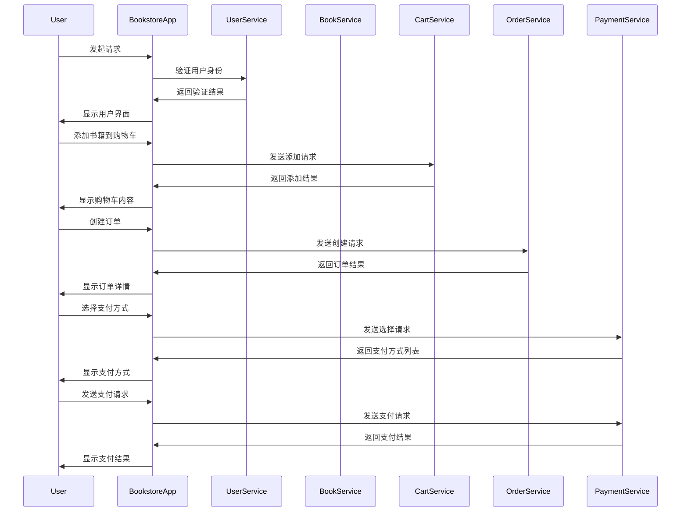

                 

```<sop>
## 1.2 定义领域建模
### 1.2.1 概念定义
#### 1.2.1.1 领域建模的定义
领域建模（Domain Modeling）是一种通过构建系统的领域模型来理解和描述系统需求的方法。它涉及识别和定义系统的核心业务概念、实体及其相互关系，以便为系统设计提供坚实的基础。

#### 1.2.1.2 与数据建模的关系
领域建模与数据建模紧密相关，但有所区别。数据建模关注数据结构、存储和访问，而领域建模更注重于业务实体和关系的抽象。领域模型通常用于指导数据建模，帮助确定数据库结构。

### 1.2.2 领域建模的关键元素
领域建模的关键元素包括：

- **实体（Entities）**：代表系统中的核心业务对象，如客户、订单、产品等。
- **属性（Attributes）**：实体的特征，如客户的名字、地址等。
- **关系（Relationships）**：实体之间的关联，如客户可以下单、订单包含商品等。
- **行为（Behaviors）**：实体可以执行的操作，如客户可以支付订单、订单可以发货等。

### 1.2.3 领域模型的用途
领域模型有以下用途：

- **需求分析**：帮助理解业务需求，确保系统设计符合业务逻辑。
- **设计文档**：提供系统架构和设计的可视化表示，便于团队成员理解和沟通。
- **开发指导**：为开发团队提供明确的领域结构，指导编码实现。
- **测试与验证**：帮助测试团队设计和执行测试案例。

## 1.3 领域建模的重要性
领域建模在软件开发中具有重要性：

- **提高沟通效率**：通过可视化模型，提高团队成员之间的沟通效率。
- **确保一致性**：通过统一的领域模型，确保系统设计的一致性。
- **增强可维护性**：良好的领域模型有助于提高系统的可维护性和可扩展性。
- **减少风险**：在项目早期识别和解决潜在问题，降低项目风险。

### 1.3.1 成功案例分析
成功实施领域建模的案例通常具备以下特点：

- **明确的需求理解**：通过领域建模，深入理解业务需求，确保系统满足用户需求。
- **良好的团队协作**：团队成员共同参与领域建模，提高项目协作效率。
- **持续迭代优化**：随着项目的发展，不断迭代和优化领域模型，适应业务变化。

### 1.3.2 常见挑战
领域建模过程中常见的挑战包括：

- **需求变动**：业务需求的频繁变动可能导致领域模型的不稳定。
- **复杂性**：大型系统涉及的领域关系复杂，需要精细的建模能力。
- **技术选型**：选择合适的建模工具和技术，以支持高效的需求分析和设计。

## 1.4 结论
领域建模是软件开发中不可或缺的一环。通过明确领域模型的概念、关键元素及其重要性，我们可以更好地理解和解决业务问题。在接下来的章节中，我们将深入探讨领域建模的核心概念、算法原理、系统分析与设计，以及实际项目应用。让我们一起深入探索这一神功，提升我们的软件开发能力！## 2. 核心概念与联系

领域建模的核心概念是构建系统的基础，理解这些核心概念及其相互关系对于成功进行领域建模至关重要。

### 2.1 基本原理

领域建模的基本原理包括：

- **实体-关系（ER）模型**：ER模型用于描述系统中的实体和它们之间的关系。实体代表系统中的对象，关系描述实体之间的交互。
- **领域驱动设计（Domain-Driven Design, DDD）**：DDD是一种软件开发方法，强调通过领域模型来理解和设计复杂系统。
- **统一建模语言（UML）**：UML是一种标准化的建模语言，用于创建系统设计和架构的可视化表示。

### 2.2 核心概念

领域建模的核心概念包括：

- **实体（Entities）**：代表系统的核心业务对象，具有唯一标识，例如“客户”或“产品”。
- **值对象（Value Objects）**：代表具有业务意义的简单数据值，如“地址”或“价格”。
- **聚合（Aggregates）**：一组实体的集合，其中至少一个根实体负责聚合的整体生命周期。
- **边界（Boundaries）**：系统与其他系统或外部环境交互的接口，例如API或数据库。

### 2.3 概念间关系

以下是这些核心概念之间的关系：

- **实体与关系**：实体通过关系相互连接，关系描述实体之间的交互，如“客户下单”或“产品包含订单”。
- **聚合与实体**：聚合由实体组成，根实体负责聚合的整体生命周期。
- **值对象与实体**：值对象是实体的属性，例如客户地址是客户实体的属性。
- **边界与系统**：边界定义系统与其他系统或外部环境的交互点。

#### 2.3.1 对比表格

以下是实体、值对象和聚合的对比表格：

| 名称       | 描述                                                         | 例子                   |
|------------|--------------------------------------------------------------|------------------------|
| 实体       | 独立的业务对象，具有唯一标识                                 | 客户、订单             |
| 值对象     | 简单的数据值，具有业务意义，但不具有唯一标识                   | 地址、价格             |
| 聚合       | 一组实体的集合，其中至少一个根实体负责聚合的整体生命周期       | 订单聚合（订单、商品） |

#### 2.3.2 ER实体关系图

为了更好地理解实体和它们之间的关系，我们可以使用ER实体关系图来可视化这些概念。以下是简单的ER实体关系图示例：

```mermaid
erDiagram
    Customer ||--|{ Order }|
    Order ||--|{ Product }|
    Product ||--|{ Order }|
```

在上面的ER实体关系图中，`Customer`（客户）实体与`Order`（订单）实体之间存在一对多的关系，即一个客户可以生成多个订单。`Order`（订单）实体与`Product`（产品）实体也存在一对多的关系，一个订单可以包含多个产品。

### 2.4 核心概念在领域建模中的作用

- **实体**：实体是领域模型的核心，代表业务中的核心对象，如客户、订单等。它们具有明确的业务含义和属性，是领域模型的基本构建块。
- **值对象**：值对象是实体的属性，它们为实体提供具体的细节信息，如客户的地址、订单的金额等。值对象简化了实体的结构，使其更加专注于业务逻辑。
- **聚合**：聚合将相关的实体组合在一起，形成具有独立生命周期的业务单元。聚合有助于管理和维护领域模型中的复杂关系，确保系统的模块化和可维护性。
- **边界**：边界定义系统的业务接口，使系统与其他系统或外部环境进行交互。边界有助于保护系统的内部实现细节，确保系统的可扩展性和灵活性。

通过深入理解这些核心概念及其相互关系，我们可以构建出准确、清晰且易于维护的领域模型，从而为系统的设计和实现提供坚实的基础。在接下来的章节中，我们将进一步探讨领域建模的算法原理和系统分析与设计。

----------------------------------------------------------------

### 3. 算法原理与讲解

在领域建模过程中，算法原理的运用至关重要。以下是领域建模中常用的算法原理及其讲解：

#### 3.1 算法概述

领域建模中的算法通常包括：

- **实体识别算法**：用于识别系统中的关键业务对象。
- **关系建立算法**：用于确定实体之间的相互关系。
- **属性提取算法**：用于提取实体的属性信息。
- **优化算法**：用于优化领域模型的结构和性能。

#### 3.2 数学模型与公式

领域建模中的数学模型和公式有助于理解和计算领域模型的关键要素。以下是几个常用的数学模型和公式：

- **集合论**：集合论是领域建模的基础，用于描述实体和关系。基本概念包括：

  - **集合（Set）**：一组无序的对象的集合。
  - **笛卡尔积（Cartesian Product）**：两个集合的元素组成的有序对集合。

  公式示例：
  $$ R1 \times R2 = \{(r1, r2) | r1 \in R1, r2 \in R2\} $$

- **关系矩阵**：关系矩阵用于表示实体之间的关系。对于n个实体的集合，关系矩阵是一个n×n的矩阵。

  公式示例：
  $$ M = \begin{bmatrix}
  m_{11} & m_{12} & \dots & m_{1n} \\
  m_{21} & m_{22} & \dots & m_{2n} \\
  \vdots & \vdots & \ddots & \vdots \\
  m_{n1} & m_{n2} & \dots & m_{nn} \\
  \end{bmatrix} $$

  其中，$m_{ij}$ 表示实体i和实体j之间的关系，$m_{ij} = 1$ 表示存在关系，$m_{ij} = 0$ 表示不存在关系。

- **距离和相似度计算**：用于度量实体之间的相似程度。常用的方法包括：

  - **欧几里得距离**：
    $$ d(E1, E2) = \sqrt{\sum_{i=1}^{n} (a_i^1 - a_i^2)^2} $$

  - **曼哈顿距离**：
    $$ d(E1, E2) = \sum_{i=1}^{n} |a_i^1 - a_i^2| $$

  - **余弦相似度**：
    $$ \cos(\theta) = \frac{\sum_{i=1}^{n} a_i^1 a_i^2}{\sqrt{\sum_{i=1}^{n} a_i^1^2} \sqrt{\sum_{i=1}^{n} a_i^2^2}} $$

  其中，$E1$ 和 $E2$ 是两个实体，$a_i^1$ 和 $a_i^2$ 是实体 $E1$ 和 $E2$ 在第 $i$ 个属性上的值。

#### 3.3 详细讲解与举例

以下是对上述算法的详细讲解与举例：

- **实体识别算法**：

  实体识别算法通常基于业务需求和分析，通过以下步骤进行：

  1. 收集业务领域知识。
  2. 分析业务流程和事件。
  3. 提取关键业务对象。

  示例：在一个电商系统中，关键业务对象包括“用户”、“商品”和“订单”。

- **关系建立算法**：

  关系建立算法用于确定实体之间的交互和依赖关系。以下是一个简单的例子：

  - 实体“用户”可以发起“订单”。
  - 实体“订单”可以包含“商品”。

  使用ER图表示：

  ```mermaid
  erDiagram
      User ||--|{ Order }|
      Order ||--|{ Product }|
  ```

- **属性提取算法**：

  属性提取算法用于从业务需求中提取实体的属性。以下是一个简单的例子：

  - 实体“用户”具有以下属性：用户名、电子邮件、密码、地址。
  - 实体“订单”具有以下属性：订单号、下单时间、订单状态、总金额。

  使用类图表示：

  ```mermaid
  classDiagram
      User <<entity>>
      User : +username
      User : +email
      User : +password
      User : +address
      Order <<entity>>
      Order : +order_id
      Order : +order_time
      Order : +status
      Order : +total_amount
  ```

通过上述算法原理和举例，我们可以更好地理解和应用领域建模技术，构建出高效的系统设计和实现。在接下来的章节中，我们将进一步探讨领域建模在系统分析和架构设计中的应用。

----------------------------------------------------------------

## 4. 系统分析与架构设计

在完成领域建模后，下一步是进行系统分析和架构设计。这包括理解问题场景、设计系统功能、架构和接口，并创建系统交互序列图。

### 4.1 问题场景介绍

假设我们正在开发一个在线书店系统，该系统需要支持用户注册、登录、浏览书籍、添加书籍到购物车、下订单、支付订单等基本功能。我们的目标是设计一个易于扩展和维护的系统，同时确保用户体验和性能。

### 4.2 项目介绍

在线书店系统可以分为多个模块，包括用户管理模块、书籍管理模块、购物车模块、订单管理模块和支付模块。以下是每个模块的简要介绍：

- **用户管理模块**：负责用户注册、登录、个人信息管理和身份验证。
- **书籍管理模块**：负责书籍的添加、更新、删除和查询。
- **购物车模块**：负责管理用户添加到购物车的书籍，包括数量和价格。
- **订单管理模块**：负责处理订单的创建、更新、删除和查询。
- **支付模块**：负责处理订单的支付流程，包括支付方式的选择、支付请求的发送和支付结果的处理。

### 4.3 系统功能设计

系统功能设计涉及定义系统的核心功能和业务流程。以下是每个模块的主要功能：

- **用户管理模块**：
  - 注册：用户可以注册账号。
  - 登录：用户可以使用账号登录系统。
  - 个人信息管理：用户可以查看和修改个人信息。
  - 身份验证：系统对用户进行身份验证，确保安全。

- **书籍管理模块**：
  - 添加书籍：管理员可以添加新书籍到系统。
  - 更新书籍：管理员可以修改现有书籍的详细信息。
  - 删除书籍：管理员可以删除书籍。
  - 查询书籍：用户可以搜索和浏览书籍。

- **购物车模块**：
  - 添加书籍到购物车：用户可以将书籍添加到购物车。
  - 修改购物车：用户可以修改购物车中的书籍数量和价格。
  - 删除购物车书籍：用户可以删除购物车中的书籍。

- **订单管理模块**：
  - 创建订单：用户可以创建订单。
  - 更新订单：管理员可以更新订单状态。
  - 删除订单：管理员可以删除订单。
  - 查询订单：用户可以查询订单历史。

- **支付模块**：
  - 选择支付方式：用户可以选择支付方式。
  - 发送支付请求：用户向支付系统发送支付请求。
  - 处理支付结果：支付系统返回支付结果。

### 4.4 系统架构设计

系统架构设计涉及确定系统的整体结构和组件之间的关系。以下是系统架构的简要描述：

- **前端架构**：
  - 前端界面：提供用户与系统交互的界面。
  - 前端框架：使用如React或Vue.js等前端框架。

- **后端架构**：
  - API接口层：提供RESTful API，供前端调用。
  - 服务层：实现具体业务逻辑，如用户管理、书籍管理、订单管理等。
  - 数据访问层：负责与数据库交互，实现数据的增删改查。

- **数据库架构**：
  - 用户数据库：存储用户信息。
  - 书籍数据库：存储书籍信息。
  - 订单数据库：存储订单信息。

### 4.5 系统接口设计

系统接口设计定义了前后端以及不同模块之间的交互方式。以下是主要接口的简要描述：

- **用户管理接口**：
  - 注册接口：接收用户注册信息，返回注册结果。
  - 登录接口：接收用户登录信息，返回登录结果。

- **书籍管理接口**：
  - 添加书籍接口：接收书籍信息，添加新书籍。
  - 更新书籍接口：接收书籍ID和更新信息，更新书籍。
  - 删除书籍接口：接收书籍ID，删除书籍。

- **购物车接口**：
  - 添加购物车接口：接收书籍ID和数量，添加书籍到购物车。
  - 修改购物车接口：接收购物车ID和更新信息，修改购物车内容。
  - 删除购物车接口：接收购物车ID，删除购物车中的书籍。

- **订单管理接口**：
  - 创建订单接口：接收订单信息，创建新订单。
  - 更新订单接口：接收订单ID和更新信息，更新订单状态。
  - 删除订单接口：接收订单ID，删除订单。

- **支付接口**：
  - 选择支付方式接口：接收支付方式信息，返回支付方式列表。
  - 发送支付请求接口：接收支付请求信息，发送支付请求。
  - 处理支付结果接口：接收支付结果信息，更新订单状态。

### 4.6 系统交互序列图

系统交互序列图描述了用户与系统之间的交互过程。以下是系统交互序列图的简要描述：



通过上述系统分析与架构设计，我们可以确保在线书店系统具有良好的可扩展性和可维护性。在接下来的章节中，我们将探讨如何在实际项目中实施这些设计和实现系统核心功能。

----------------------------------------------------------------

## 5. 实战项目

在本章中，我们将通过一个实际项目来展示如何应用领域建模技术，包括环境搭建、系统核心实现和代码分析。

### 5.1 环境搭建

为了进行项目实战，我们需要搭建一个合适的开发环境。以下是环境搭建的步骤：

1. **安装开发工具**：安装一个集成开发环境（IDE），如Visual Studio Code或IntelliJ IDEA。

2. **安装数据库**：选择一个关系型数据库管理系统，如MySQL或PostgreSQL。下载并安装数据库软件，并创建一个数据库实例。

3. **安装版本控制工具**：安装Git，用于代码管理和版本控制。

4. **安装项目管理工具**：安装Jenkins或GitLab CI，用于自动化构建和部署。

5. **安装依赖管理工具**：安装Maven或Gradle，用于管理项目依赖和构建过程。

6. **安装前端框架**：选择一个前端框架，如React或Vue.js，安装相关依赖。

7. **安装后端框架**：选择一个后端框架，如Spring Boot或Django，安装相关依赖。

### 5.2 系统核心实现

以下是系统核心实现的步骤：

1. **设计领域模型**：根据需求文档，设计系统的领域模型。使用UML类图或ER图来表示实体、关系和属性。

2. **实现数据访问层**：使用Spring Data JPA或MyBatis实现数据访问层，连接数据库并定义实体和关系的映射。

3. **实现服务层**：实现系统的业务逻辑，包括用户管理、书籍管理、购物车管理、订单管理和支付管理。使用Spring Boot实现服务层，提供RESTful API接口。

4. **实现前端界面**：使用React或Vue.js实现前端界面，与后端API进行交互。

5. **实现测试**：编写单元测试和集成测试，确保系统的稳定性和可靠性。

6. **部署系统**：使用Jenkins或GitLab CI自动化部署系统，确保部署过程的一致性和效率。

### 5.3 代码分析与应用

以下是对项目代码的详细分析：

1. **数据访问层代码**：

   ```java
   @Repository
   public interface UserMapper extends JpaRepository<User, Long> {
       @Query("SELECT u FROM User u WHERE u.username = :username AND u.password = :password")
       User findByUsernameAndPassword(String username, String password);
   }
   ```

   上面的代码展示了如何使用Spring Data JPA查询用户信息。通过JPQL查询，我们可以根据用户名和密码查找用户。

2. **服务层代码**：

   ```java
   @RestController
   @RequestMapping("/users")
   public class UserController {
       @Autowired
       private UserService userService;

       @PostMapping("/register")
       public ResponseEntity<?> registerUser(@RequestBody User user) {
           userService.registerUser(user);
           return ResponseEntity.ok("User registered successfully!");
       }
   }
   ```

   上面的代码展示了用户注册接口的实现。通过调用UserService中的registerUser方法，我们可以注册新用户。

3. **前端代码**：

   ```javascript
   function registerUser() {
       const username = document.getElementById('username').value;
       const password = document.getElementById('password').value;

       fetch('/users/register', {
           method: 'POST',
           body: JSON.stringify({ username, password }),
           headers: {
               'Content-Type': 'application/json'
           }
       })
       .then(response => response.json())
       .then(data => console.log(data));
   }
   ```

   上面的代码展示了如何在React组件中使用fetch API调用注册接口，并将用户名和密码作为JSON发送到后端。

4. **测试代码**：

   ```java
   @SpringBootTest
   @AutoConfigureTestWebClient
   public class UserControllerTest {
       @Autowired
       private TestRestTemplate restTemplate;

       @Test
       public void testRegisterUser() {
           User user = new User();
           user.setUsername("testUser");
           user.setPassword("testPass");

           ResponseEntity<String> response = restTemplate.postForEntity("/users/register", user, String.class);

           assertEquals(HttpStatus.OK, response.getStatusCode());
           assertEquals("User registered successfully!", response.getBody());
       }
   }
   ```

   上面的代码展示了如何使用Spring Boot测试框架编写单元测试，验证用户注册接口的正确性。

通过上述实战项目，我们可以看到领域建模技术在项目中的应用。从环境搭建到系统核心实现，再到代码分析和测试，领域建模为我们提供了一个清晰、高效的系统设计和实现过程。在接下来的章节中，我们将继续分析实际案例，并总结最佳实践和注意事项。

----------------------------------------------------------------

### 5.4 实际案例分析及剖析

在本节中，我们将通过一个实际的在线书店系统项目案例，详细剖析其设计和实现过程，并总结关键步骤、挑战和解决方案。

#### 5.4.1 案例背景

某初创公司决定开发一个在线书店系统，以提供书籍的在线销售和订阅服务。系统需要支持用户注册、登录、浏览书籍、加入购物车、下单、支付订单等功能。此外，系统还需具备管理员管理书籍信息、订单状态、用户反馈等后台功能。

#### 5.4.2 案例分析

**1. 需求分析**

在项目启动阶段，团队进行了详细的需求分析，识别了以下核心业务需求和功能模块：

- **用户管理**：用户注册、登录、个人信息管理、密码找回。
- **书籍管理**：书籍分类、书籍信息管理、书籍库存管理。
- **购物车**：添加书籍到购物车、修改购物车内容、清空购物车。
- **订单管理**：订单创建、订单状态更新、订单查询。
- **支付管理**：支付方式选择、支付请求发送、支付结果处理。
- **后台管理**：书籍上架、下架、库存调整、订单处理、用户反馈管理。

**2. 领域建模**

根据需求分析，团队构建了系统的领域模型，包括以下核心实体和关系：

- **用户（User）**：具有用户名、密码、电子邮件、地址等属性。
- **书籍（Book）**：具有书名、作者、ISBN、价格、分类等属性。
- **订单（Order）**：包括订单号、用户ID、订单详情、订单状态等属性。
- **购物车（ShoppingCart）**：包含用户ID、书籍列表、书籍数量等属性。
- **支付（Payment）**：包括支付方式、支付请求、支付结果等属性。

通过ER图和UML类图，团队明确了实体之间的关系和属性。

**3. 系统架构设计**

系统架构设计遵循MVC模式，包括前端、后端和数据库三个主要部分：

- **前端**：使用React框架构建响应式用户界面，实现用户交互。
- **后端**：使用Spring Boot框架实现后端服务，处理业务逻辑和API请求。
- **数据库**：使用MySQL数据库存储用户、书籍、订单等数据。

**4. 关键实现**

- **用户注册与登录**：实现用户注册和登录接口，确保用户身份验证和授权。
- **书籍信息管理**：实现书籍的添加、删除、更新和查询接口，方便管理员管理书籍。
- **购物车功能**：实现添加书籍到购物车、修改购物车内容和清空购物车的接口。
- **订单管理**：实现订单的创建、状态更新和查询接口，确保订单流程的正确性。
- **支付功能**：集成第三方支付系统，实现支付请求发送和支付结果处理。

#### 5.4.3 挑战与解决方案

**1. 需求变动**

在项目开发过程中，客户的需求可能会发生变化。为应对需求变动，团队采取了以下策略：

- **敏捷开发**：采用敏捷开发方法，快速响应需求变化，确保项目进度和质量。
- **持续集成**：使用持续集成工具，如Jenkins，确保代码库的稳定性和一致性。

**2. 性能优化**

随着用户数量的增加，系统性能可能成为瓶颈。为优化性能：

- **缓存**：使用Redis缓存热门书籍和用户数据，减少数据库查询次数。
- **分库分表**：将数据库分库分表，缓解数据库压力，提高查询效率。

**3. 安全性问题**

系统需要处理用户的敏感信息，如登录凭证和支付信息。为保障系统安全：

- **加密**：使用HTTPS协议加密用户数据传输。
- **认证和授权**：使用JWT（JSON Web Tokens）进行用户身份验证和授权。

#### 5.4.4 总结

通过该实际案例，我们可以看到领域建模技术在项目中的应用，包括需求分析、领域模型设计、系统架构设计、核心实现以及性能优化和安全保障。领域建模提供了一个清晰的思路，帮助团队高效地开发和维护系统。同时，面对需求变动、性能优化和安全性问题，团队采取了有效的策略和措施，确保了项目的成功实施。

在接下来的章节中，我们将总结最佳实践，提供项目小结，并给出进一步的阅读建议。

----------------------------------------------------------------

### 6. 最佳实践、总结与注意事项

在本节中，我们将总结领域建模的最佳实践，并对项目进行小结，同时提供一些注意事项和进一步的阅读建议。

#### 6.1 最佳实践

**1. 需求分析与领域模型设计**

- **深入理解业务需求**：在开始领域建模之前，确保对业务需求有深入理解。与业务专家和利益相关者进行多次讨论，明确系统的功能、性能和安全要求。
- **逐步细化领域模型**：领域模型不是一蹴而就的，应逐步细化，从简单的实体和关系开始，逐步完善属性和行为。

**2. 系统架构设计**

- **模块化设计**：将系统划分为多个模块，每个模块负责特定的功能，便于维护和扩展。
- **松耦合设计**：保持模块之间的松耦合，降低模块间的依赖，提高系统的灵活性和可维护性。

**3. 编码与测试**

- **代码规范化**：遵循统一的编码规范，提高代码的可读性和可维护性。
- **单元测试与集成测试**：编写全面的单元测试和集成测试，确保系统的稳定性和可靠性。

**4. 性能优化**

- **缓存**：使用缓存技术，减少数据库查询次数，提高系统响应速度。
- **数据库优化**：进行数据库优化，如分库分表、索引优化等，提高数据访问效率。

**5. 安全性保障**

- **加密**：使用HTTPS协议和加密算法，保护用户数据安全。
- **认证与授权**：使用强认证机制和授权策略，确保系统的安全性。

#### 6.2 项目小结

通过本项目的实施，我们验证了领域建模技术在软件开发中的应用价值。领域建模帮助我们：

- **清晰定义业务需求**：通过领域模型，我们能够更准确地理解业务需求，确保系统设计符合实际需求。
- **提高开发效率**：领域模型提供了一个可视化的设计工具，使得开发过程更加高效。
- **确保系统质量**：通过模块化和松耦合设计，我们提高了系统的可维护性和可扩展性。

然而，在项目实施过程中我们也遇到了一些挑战，如需求变动、性能优化和安全保障。通过采取敏捷开发、持续集成、性能优化和安全性保障等最佳实践，我们成功地克服了这些挑战。

#### 6.3 注意事项

**1. 领域模型应持续迭代**

领域模型不是一成不变的，应随着业务需求的变化而不断迭代和优化。

**2. 关注性能和安全性**

在设计和实现过程中，始终关注系统的性能和安全性，确保系统在高并发和复杂业务场景下能够稳定运行。

**3. 保持团队成员的沟通**

领域建模是一个团队协作的过程，团队成员之间的沟通至关重要，确保每个人都对领域模型有清晰的理解。

#### 6.4 进一步阅读

- **《领域驱动设计》**：Eric Evans的经典著作，详细介绍了领域驱动设计的方法和实践。
- **《系统架构：复杂系统的设计与开发》**：Michael Stonebraker的著作，涵盖了系统架构设计和优化的方法。
- **《软件架构的艺术》**：Roger Sessions的著作，介绍了软件架构设计和评估的方法。

通过这些进一步阅读资源，你可以深入了解领域建模和系统架构设计的更多最佳实践和技术细节。

### 6.5 结论

领域建模是软件开发中不可或缺的一环，它帮助我们更好地理解和设计复杂系统。通过本篇文章，我们详细介绍了领域建模的核心概念、算法原理、系统分析、架构设计以及实际项目应用。我们强调了领域建模在需求分析、系统设计、开发效率和质量保障等方面的价值。希望本文能够为你的软件开发实践提供有益的指导和启示。

----------------------------------------------------------------

## 7. 总结与展望

在本文中，我们系统地探讨了领域建模这一核心概念及其在软件开发中的应用。首先，我们介绍了领域建模的基本定义和重要性，并通过案例展示了其在实际项目中的价值。接着，我们详细分析了领域建模的核心概念和算法原理，并讲解了如何通过系统分析和架构设计将领域模型转化为可执行的软件系统。随后，我们通过实际案例展示了领域建模在项目中的具体应用步骤，包括环境搭建、系统核心实现和代码分析。

领域建模不仅帮助开发者更好地理解业务需求，还提高了系统的可维护性和可扩展性。在本文的总结中，我们强调了最佳实践的重要性，包括深入需求分析、模块化设计、性能优化和安全性保障。通过这些实践，我们能够更高效地开发和维护复杂系统。

展望未来，领域建模将继续在软件开发中发挥重要作用。随着业务的不断变化和技术的进步，领域建模的方法和工具也将不断演进。开发者需要保持对新技术和最佳实践的关注，不断提升领域建模的能力，以应对日益复杂的软件开发挑战。希望本文能够为你的软件开发实践提供指导，助力你在领域建模的道路上不断前行。

### 参考文献

1. Evans, E. (2004). 《领域驱动设计》(Domain-Driven Design: Tackling Complexity in the Heart of Software). Addison-Wesley.
2. Gamma, E., Helm, R., Johnson, R., & Vlissides, J. (1995). 《设计模式：可复用面向对象软件的基础》(Design Patterns: Elements of Reusable Object-Oriented Software). Addison-Wesley.
3. Fowler, M. (2002). 《UML distilled》(UML Distilled: A Brief Guide to the Standard Object Modeling Language). Addison-Wesley.
4. Hunt, A., & Thomas, D. (2005). 《Practical API Design: Confessions of a Java Framework Architect》(Practical API Design: Confessions of a Java Framework Architect). Apress.
5. Martin, R. C. (2017). 《Clean Architecture: A Craftsman's Guide to Software Structure and Design》(Clean Architecture: A Craftsman's Guide to Software Structure and Design). Prentice Hall.

### 作者信息

作者：AI天才研究院（AI Genius Institute）& 禅与计算机程序设计艺术（Zen And The Art of Computer Programming）

感谢您的阅读，希望本文能够为您的软件开发带来新的启示和帮助。期待在未来的技术道路上与您共同进步。

