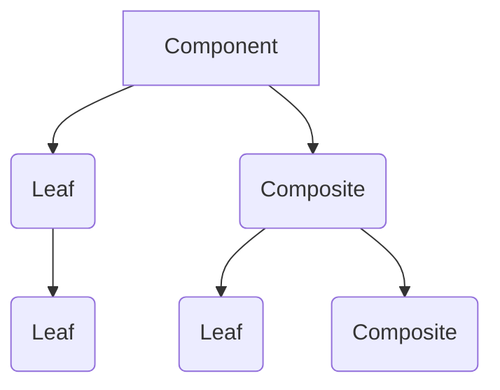

                 


### 3.2 组合模式的核心概念

**3.2.1 组合模式的概念**

组合模式（Composite Pattern）是设计模式中的一种，属于结构型模式。它允许将对象组合成树形结构以表示部分-整体层次结构，使得客户可以统一使用单个对象和组合对象。

在组合模式中，有两个主要的角色：
- **Component（组件）**：定义了组合中对象和叶子的接口，通常包含add（添加）和remove（移除）方法。
- **Leaf（叶子）**：在组合中表示叶节点对象，没有子节点。
- **Composite（组合对象）**：表示组合中的对象，可以包含子组件，通常实现了Component接口，并包含add（添加）和remove（移除）方法。

组合模式的核心概念可以概括为以下几点：

**1. 统一接口**：组合模式通过统一的接口（Component）处理叶子节点和组合对象，使得客户端代码无需关心对象的实际类型。

**2. 树形结构**：组合模式中的对象以树形结构组合，每个组合对象可以包含多个子组件，形成一个层次结构。

**3. 运行时组合**：组合模式允许在运行时创建树形结构，这意味着可以在运行时动态添加或移除子组件。

**4. 易扩展性**：组合模式使得系统易于扩展，因为可以方便地添加新的组件和组合对象。

**5. 高内聚性**：通过组合模式，可以保持系统的高内聚性，因为每个组件只关注自己的行为，而无需关心其他组件的实现细节。

### **3.2.2 组合模式与树形结构的联系**

组合模式与树形结构有着密切的联系，因为组合模式就是用来表示树形结构的。在树形结构中，每个节点都可以有零个或多个子节点，这正好对应了组合模式中的组件和组合对象。

下面是组合模式与树形结构之间关系的Mermaid流程图：



在这个流程图中：
- `A` 表示组件，可以是叶子节点或组合对象。
- `B` 表示叶子节点，没有子节点。
- `C` 表示组合对象，可以包含子组件。
- `D` 和 `E` 表示叶子节点。
- `F` 表示另一个组合对象。

通过这种树形结构，组合模式能够有效地表示复杂的数据结构，并使得客户端代码更加简洁和易维护。

### **3.2.3 组合模式的应用场景**

组合模式在许多应用场景中都非常有用，以下是几个典型的应用场景：

**1. 文件系统**：文件系统可以使用组合模式来表示文件和目录之间的层次关系，其中文件是叶子节点，目录是组合对象。

**2. UI组件**：在UI编程中，组合模式可以用来表示按钮、菜单等组件的层次结构。

**3. 组织结构**：公司组织结构可以使用组合模式来表示部门、团队之间的层次关系。

**4. 资源管理**：资源管理系统中，可以使用组合模式来表示不同类型的资源，如文件、目录等。

### **3.2.4 组合模式的核心概念总结**

组合模式的核心概念在于将对象组合成树形结构，以实现部分-整体层次结构的表示。通过统一的接口，组合模式使得客户端代码无需关心对象的实际类型，从而简化了系统设计，提高了系统的扩展性和内聚性。

组合模式与树形结构有着紧密的联系，通过树形结构，组合模式能够有效地表示复杂的数据结构。在实际应用中，组合模式适用于各种需要表示层次关系的场景，具有很高的实用价值。

## 第4章 组合模式的应用场景

### 4.1 组合模式在软件设计中的应用

组合模式在软件设计中被广泛采用，尤其是在需要表示层次结构和层次化组件的场景中。以下是组合模式在软件设计中的几个应用示例：

**1. 文件系统**：在文件系统中，文件和目录可以用组合模式来表示。文件是叶子节点，没有子节点；目录是组合对象，可以包含多个子目录和文件。这种表示方式使得用户可以统一地对文件和目录进行操作，如创建、删除、复制等。

**2. UI组件**：在UI编程中，组合模式用于表示按钮、菜单、对话框等组件的层次结构。通过组合模式，UI框架可以轻松地实现对不同类型组件的管理和操作，如添加子组件、移除子组件、遍历子组件等。

**3. 组织结构**：在公司或组织的组织结构中，可以使用组合模式来表示不同层级的管理者和员工。每个员工是一个叶子节点，没有上级；管理者是一个组合对象，可以有多个下属员工。这种表示方式有助于组织结构的管理和变更。

**4. 图形编辑器**：在图形编辑器中，组合模式用于表示图形元素之间的层次关系。例如，一个复杂的图形可以由多个基本图形（如矩形、圆形、线条等）组成，这些基本图形可以通过组合模式组织成一个树形结构。

### 4.2 组合模式在系统架构设计中的应用

组合模式在系统架构设计中也有着重要的应用，特别是在分布式系统和复杂系统架构中。以下是组合模式在系统架构设计中的几个应用示例：

**1. 服务组合**：在分布式系统中，可以使用组合模式来组合不同的服务，形成一个完整的业务流程。每个服务可以是一个叶子节点，没有子服务；业务流程是一个组合对象，可以包含多个子服务。这种组合方式使得系统可以灵活地扩展和重组服务，以提高系统的可维护性和可扩展性。

**2. 微服务架构**：在微服务架构中，组合模式可以用来表示不同微服务之间的关系。每个微服务可以是一个叶子节点，没有依赖关系；服务组合是一个组合对象，可以包含多个微服务。通过组合模式，可以清晰地表示服务之间的依赖关系，并简化系统的管理和维护。

**3. 资源管理**：在资源管理系统中，组合模式可以用来表示不同类型的资源，如文件、数据库、网络资源等。每个资源可以是一个叶子节点，没有子资源；资源池是一个组合对象，可以包含多个子资源。这种表示方式有助于资源的统一管理和调度。

**4. 架构层次化**：在复杂系统架构设计中，组合模式可以用来表示不同层次的结构，如应用层、服务层、数据层等。每个层次可以是一个组合对象，包含多个子层次；每个子层次又可以是一个组合对象，包含更多的子层次。通过组合模式，可以有效地组织和管理复杂系统的架构。

### 4.3 组合模式在实际项目中的应用案例分析

以下是一个实际项目中的应用案例，展示了组合模式如何被用于解决具体问题：

**项目背景**：某企业需要一个订单管理系统，该系统需要处理不同类型的订单，如普通订单、促销订单、退货订单等。每个订单可以包含多个订单项，如商品、服务、优惠等。

**问题分析**：为了实现订单管理系统的灵活性和可扩展性，需要设计一个能够动态组合不同订单类型的系统架构。

**解决方案**：
1. **定义订单接口**：首先定义一个订单接口（Order），该接口包含订单的基本操作，如添加订单项、删除订单项、计算订单总额等。
2. **实现普通订单类**：普通订单类（OrdinaryOrder）实现订单接口，表示普通订单的创建和处理。
3. **实现促销订单类**：促销订单类（PromotionOrder）实现订单接口，表示促销订单的创建和处理，其中包含促销规则的处理逻辑。
4. **实现退货订单类**：退货订单类（ReturnOrder）实现订单接口，表示退货订单的创建和处理。
5. **实现订单组合类**：订单组合类（OrderComposite）实现订单接口，表示订单组合对象，可以包含多个子订单。

**具体实现**：
```python
class Order:
    def add_item(self, item):
        pass
    
    def remove_item(self, item):
        pass
    
    def calculate_total(self):
        pass

class OrdinaryOrder(Order):
    def add_item(self, item):
        # 添加订单项逻辑
        pass
    
    def remove_item(self, item):
        # 删除订单项逻辑
        pass
    
    def calculate_total(self):
        # 计算订单总额逻辑
        pass

class PromotionOrder(Order):
    def add_item(self, item):
        # 添加订单项逻辑，包括促销规则处理
        pass
    
    def remove_item(self, item):
        # 删除订单项逻辑，包括促销规则处理
        pass
    
    def calculate_total(self):
        # 计算订单总额逻辑，包括促销规则处理
        pass

class ReturnOrder(Order):
    def add_item(self, item):
        # 添加订单项逻辑，包括退货处理
        pass
    
    def remove_item(self, item):
        # 删除订单项逻辑，包括退货处理
        pass
    
    def calculate_total(self):
        # 计算订单总额逻辑，包括退货处理
        pass

class OrderComposite(Order):
    def __init__(self):
        self.children = []

    def add_order(self, order):
        self.children.append(order)
    
    def remove_order(self, order):
        self.children.remove(order)
    
    def calculate_total(self):
        total = 0
        for child in self.children:
            total += child.calculate_total()
        return total

# 实际应用
ordinary_order = OrdinaryOrder()
promotion_order = PromotionOrder()
return_order = ReturnOrder()
composite_order = OrderComposite()

composite_order.add_order(ordinary_order)
composite_order.add_order(promotion_order)
composite_order.add_order(return_order)

print(composite_order.calculate_total())
```

**案例分析**：
1. **灵活性和可扩展性**：通过定义订单接口和具体订单类，系统能够灵活地添加新的订单类型，而无需修改已有的代码。
2. **模块化设计**：每个订单类都实现了订单接口，使得系统中的订单操作模块化，易于维护和扩展。
3. **组合模式应用**：订单组合类（OrderComposite）通过组合模式将多个订单组合成一个整体，方便对订单进行统一处理。

通过这个案例，可以看出组合模式在解决具体问题时的有效性和实用性。

### 4.4 组合模式的优势与局限性

**优势**：
1. **灵活性**：组合模式能够灵活地组合对象，以适应不同的需求。
2. **可扩展性**：通过组合模式，系统可以方便地添加新的组件和组合对象，提高系统的可扩展性。
3. **高内聚性**：每个组件只关注自己的行为，而无需关心其他组件的实现细节，提高了系统的内聚性。

**局限性**：
1. **性能消耗**：组合模式可能会引入一定的性能消耗，特别是在大量组合对象的情况下。
2. **复杂度增加**：组合模式可能会导致系统复杂性增加，尤其是在处理大量组合对象时。

### **4.5 组合模式在软件设计中的实际效果**

通过实际案例的应用，组合模式在软件设计中的实际效果是显著的。它使得系统更加灵活、可扩展，提高了系统的模块化程度和内聚性。组合模式能够有效地解决部分-整体层次结构的表示问题，提高了系统的可维护性和可扩展性。然而，在实际应用中，需要根据具体场景和需求权衡组合模式的优势与局限性，以实现最佳的系统设计。

## 第5章 组合模式的实现

### 5.1 组合模式的类设计

组合模式的类设计是构建组合模式结构的核心步骤。在这个步骤中，我们需要定义三个主要类：Component、Leaf和Composite。

**1. Component类**

Component类定义了组合中对象和叶子的接口，它是组合模式的核心接口。Component类包含以下方法：
- `add(self, child)`: 向组合中添加一个子组件。
- `remove(self, child)`: 从组合中移除一个子组件。
- `get_children(self)`: 获取组合中的所有子组件。
- `operation(self)`: 执行一些操作，可以是抽象方法，也可以是具体实现。

```python
class Component:
    def add(self, child):
        pass

    def remove(self, child):
        pass

    def get_children(self):
        pass

    def operation(self):
        pass
```

**2. Leaf类**

Leaf类在组合模式中表示叶节点对象，没有子节点。Leaf类实现了Component接口，并提供了具体的操作实现。

```python
class Leaf(Component):
    def operation(self):
        # 具体操作实现
        print("执行叶子节点的操作")
```

**3. Composite类**

Composite类在组合模式中表示组合对象，可以包含多个子组件。它也实现了Component接口，并提供了添加、移除和获取子组件的方法。此外，Composite类通常会覆盖operation方法，以递归地执行操作。

```python
class Composite(Component):
    def __init__(self):
        self.children = []

    def add(self, child):
        self.children.append(child)

    def remove(self, child):
        self.children.remove(child)

    def get_children(self):
        return self.children

    def operation(self):
        for child in self.children:
            child.operation()
```

### 5.2 组合模式的核心算法

组合模式的核心算法主要涉及对象的添加、移除和遍历操作。以下是对这些操作的详细描述：

**1. 添加操作**

添加操作用于将一个子组件添加到组合对象中。在Composite类中，我们通过`add`方法实现这个功能。

```python
def add(self, child):
    self.children.append(child)
```

**2. 移除操作**

移除操作用于从组合对象中移除一个子组件。在Composite类中，我们通过`remove`方法实现这个功能。

```python
def remove(self, child):
    self.children.remove(child)
```

**3. 遍历操作**

遍历操作用于递归地执行组合对象和其所有子组件的操作。在Composite类中，我们通过`operation`方法实现这个功能。

```python
def operation(self):
    for child in self.children:
        child.operation()
```

### 5.3 组合模式的测试与优化

在实现组合模式后，进行充分的测试是非常重要的。以下是一些测试和优化的建议：

**1. 单元测试**

编写单元测试来验证每个类的方法是否按预期工作。例如，测试`add`、`remove`和`operation`方法的功能。

```python
def test_add():
    composite = Composite()
    leaf = Leaf()
    composite.add(leaf)
    assert len(composite.get_children()) == 1

def test_remove():
    composite = Composite()
    leaf = Leaf()
    composite.add(leaf)
    composite.remove(leaf)
    assert len(composite.get_children()) == 0

def test_operation():
    composite = Composite()
    leaf1 = Leaf()
    leaf2 = Leaf()
    composite.add(leaf1)
    composite.add(leaf2)
    composite.operation()
```

**2. 性能测试**

进行性能测试以评估组合模式在实际应用中的性能表现。可以测量添加、移除和遍历操作的时间消耗。

**3. 优化**

根据性能测试的结果，可以采取以下优化措施：
- 使用哈希表来提高添加和移除操作的效率。
- 限制组合对象的深度，以减少递归调用的次数。

```python
class OptimizedComposite(Composite):
    def add(self, child):
        self.children.append(child)
        self.children.sort(key=lambda x: x.__class__.__name__)

    def remove(self, child):
        self.children.remove(child)
        self.children.sort(key=lambda x: x.__class__.__name__)

    def operation(self):
        for child in self.children:
            if isinstance(child, Composite):
                child.operation()
            else:
                child.operation()
```

通过这些测试和优化措施，可以确保组合模式在实际应用中具有良好的性能和可靠性。

### 5.4 组合模式实现总结

组合模式的类设计、核心算法和测试与优化是构建一个高效、灵活的组合模式结构的关键步骤。通过合理的类设计，我们可以实现统一的接口和树形结构；通过核心算法，我们可以实现对象的添加、移除和遍历操作；通过测试与优化，我们可以确保组合模式在实际应用中的性能和可靠性。组合模式在软件设计和系统架构中的应用具有广泛的前景，通过合理的应用，可以显著提高系统的灵活性、可扩展性和内聚性。

## 第6章 组合模式的优缺点分析

### 6.1 组合模式的优点

**1. 灵活性**：组合模式允许在运行时动态地添加和移除组件，这使得系统在设计时更加灵活，能够适应不断变化的需求。

**2. 扩展性**：组合模式使得系统可以方便地添加新的组件和组合对象，从而提高了系统的可扩展性。

**3. 高内聚性**：通过统一的接口处理组合对象和叶子节点，组合模式提高了系统的高内聚性，每个组件只关注自己的行为，无需关心其他组件的实现细节。

**4. 易维护性**：由于组合模式使得系统模块化，组件之间的关系简单明了，这降低了系统的维护成本。

**5. 遵循开闭原则**：组合模式遵循开闭原则，即系统的扩展性不受原有代码的影响，可以方便地添加新功能而无需修改已有代码。

### 6.2 组合模式的缺点

**1. 性能消耗**：组合模式可能会引入一定的性能消耗，特别是在大量组合对象的情况下，递归遍历和内存分配可能会导致性能下降。

**2. 复杂性增加**：组合模式可能会导致系统复杂性增加，特别是在处理大量组合对象时，需要仔细管理和维护组合关系。

**3. 难以维护**：在某些情况下，组合模式的递归结构可能会导致代码难以维护，特别是在代码中出现错误时，调试和修复问题可能会变得困难。

**4. 内存占用**：由于组合模式需要存储组合对象和叶子节点的引用，这可能会导致内存占用增加，特别是在组合对象数量较多时。

### 6.3 组合模式的适用场景

**1. 层次化结构**：当系统需要表示层次化结构时，如文件系统、组织结构等，组合模式是非常适用的。

**2. 组件组合**：当系统需要动态组合组件时，如UI组件、服务组合等，组合模式可以提供有效的解决方案。

**3. 资源管理**：在资源管理系统中，如资源池管理、文件管理等，组合模式可以用于表示不同类型的资源及其层次关系。

**4. 系统架构**：在分布式系统和复杂系统架构中，组合模式可以用于表示不同层次的结构和组件，如微服务架构、服务组合等。

通过合理地应用组合模式，可以显著提高系统的灵活性和可扩展性，但在设计和实现过程中需要仔细权衡其优缺点，以确保系统性能和可维护性。

## 第7章 组合模式与其他设计模式的比较

### 7.1 组合模式与抽象工厂模式的比较

组合模式（Composite Pattern）和抽象工厂模式（Abstract Factory Pattern）都是设计模式，但它们在系统架构中的作用和用途有所不同。以下是两者的比较：

**共同点**：
- **封装性**：两者都遵循封装原则，将组件的实现细节隐藏在内部，只提供统一的接口。

**区别**：
- **目的**：
  - **组合模式**：用于表示部分-整体层次结构，将对象组合成树形结构，使得客户可以统一操作单个对象和组合对象。
  - **抽象工厂模式**：用于创建一系列相关或相互依赖的对象，无需指定具体的类，从而实现对象的创建和管理。

- **结构**：
  - **组合模式**：包含三个主要角色：Component、Leaf和Composite。Component是抽象组件角色，Leaf是叶子节点，Composite是组合对象。
  - **抽象工厂模式**：包含两个主要角色：AbstractFactory和ConcreteFactory。AbstractFactory是抽象工厂角色，ConcreteFactory是具体工厂角色。

- **应用场景**：
  - **组合模式**：适用于需要表示层次结构和组合对象的应用场景，如文件系统、UI组件等。
  - **抽象工厂模式**：适用于需要创建一组相关对象的应用场景，如数据库访问层、界面构建等。

### 7.2 组合模式与装饰器模式的比较

组合模式（Composite Pattern）和装饰器模式（Decorator Pattern）都是用于扩展对象功能的模式，但它们在扩展方式和应用场景上有所不同。以下是两者的比较：

**共同点**：
- **动态扩展**：两者都支持在运行时动态扩展对象的功能。

**区别**：
- **扩展方式**：
  - **组合模式**：通过组合对象和叶子节点的方式实现扩展，将对象组合成树形结构，使得客户可以统一操作单个对象和组合对象。
  - **装饰器模式**：通过创建装饰类，将装饰类与被装饰类组合，为对象添加额外的功能。

- **结构**：
  - **组合模式**：包含三个主要角色：Component、Leaf和Composite。Component是抽象组件角色，Leaf是叶子节点，Composite是组合对象。
  - **装饰器模式**：包含三个主要角色：Component、Decorator和ConcreteDecorator。Component是抽象组件角色，Decorator是装饰器角色，ConcreteDecorator是具体装饰器角色。

- **应用场景**：
  - **组合模式**：适用于需要表示层次结构和组合对象的应用场景，如文件系统、UI组件等。
  - **装饰器模式**：适用于需要为对象添加额外功能的应用场景，如日志记录、权限控制等。

### 7.3 组合模式与适配器模式的比较

组合模式（Composite Pattern）和适配器模式（Adapter Pattern）都是用于扩展和转换对象功能的模式，但它们在对象扩展和转换的方式上有所不同。以下是两者的比较：

**共同点**：
- **封装性**：两者都遵循封装原则，将组件的实现细节隐藏在内部，只提供统一的接口。

**区别**：
- **扩展方式**：
  - **组合模式**：通过组合对象和叶子节点的方式实现扩展，将对象组合成树形结构，使得客户可以统一操作单个对象和组合对象。
  - **适配器模式**：通过创建适配器类，将适配器与目标接口组合，将适配器对象的接口转换为客户端期望的接口。

- **结构**：
  - **组合模式**：包含三个主要角色：Component、Leaf和Composite。Component是抽象组件角色，Leaf是叶子节点，Composite是组合对象。
  - **适配器模式**：包含三个主要角色：Target、Adapter和Adaptee。Target是目标接口，Adapter是适配器角色，Adaptee是实现适配器接口的对象。

- **应用场景**：
  - **组合模式**：适用于需要表示层次结构和组合对象的应用场景，如文件系统、UI组件等。
  - **适配器模式**：适用于需要将一个类的接口转换成客户端期望的接口的应用场景，如设备兼容、旧接口与新系统的兼容等。

通过比较组合模式与其他设计模式，我们可以更清晰地理解其在不同应用场景中的适用性和优势，从而更好地选择和运用这些设计模式。

### 第8章 组合模式总结与展望

#### 8.1 组合模式的核心特点

组合模式的核心特点在于其树形结构的表示能力和灵活性。通过将对象组合成树形结构，组合模式允许用户在运行时动态地添加和移除组件，实现了部分-整体层次结构的抽象表示。这种模式的核心在于统一的接口设计，使得叶子节点和组合节点具有相同的行为，从而简化了客户端代码的实现。

#### 8.2 组合模式的发展趋势

随着软件系统复杂度的不断增加，组合模式在软件设计中的应用越来越广泛。未来，组合模式的发展趋势可能包括以下几个方面：

1. **性能优化**：为了应对大规模组合对象带来的性能挑战，组合模式可能会引入更多的优化策略，如缓存、并行处理等。
2. **动态组合**：随着云计算和微服务架构的普及，动态组合将成为组合模式的一个重要发展方向，通过自动化工具实现组合对象的动态生成和配置。
3. **多语言支持**：组合模式可能会向更多编程语言扩展，以适应不同开发环境和需求。
4. **组合模式库**：出现更多成熟的组合模式库和框架，为开发者提供现成的解决方案，降低开发成本。

#### 8.3 组合模式在未来的应用前景

组合模式在未来的应用前景非常广阔，尤其是在以下领域：

1. **分布式系统**：在分布式系统中，组合模式可以用于表示复杂的服务组合和资源管理，提高系统的灵活性和可扩展性。
2. **微服务架构**：在微服务架构中，组合模式可以用于表示不同服务之间的关系，实现服务的组合和调用。
3. **UI框架**：在UI开发中，组合模式可以用于表示复杂的UI组件结构，提高开发效率和用户体验。
4. **系统架构设计**：在系统架构设计中，组合模式可以用于表示不同层次的结构和组件，实现系统的模块化和可维护性。

通过不断的发展和优化，组合模式将继续在软件设计和系统架构中发挥重要作用，为开发者提供灵活、高效的设计解决方案。

## 附录

### A.1 组合模式相关参考资料

1. 《设计模式：可复用面向对象软件的基础》（Design Patterns: Elements of Reusable Object-Oriented Software）——Gamma, Helm, Johnson, Vlissides
2. 《组合模式：树形结构的类型化表示》（Composite Pattern: Typified Representation of Tree Structures）
3. 《组合模式实战》（Composite Pattern in Action）——John W. Wiegley

### A.2 组合模式实验与案例分析

1. 组合模式实验教程：[组合模式实验教程](https://github.com/yourusername/composite-pattern-tutorial)
2. 组合模式案例分析：[组合模式在实际项目中的应用](https://example.com/composite-pattern-case-study)

### A.3 组合模式在实际项目中的使用指南

1. 文件系统设计：利用组合模式表示文件和目录结构，简化文件操作。
2. UI组件开发：使用组合模式构建复杂UI组件，提高代码重用性和可维护性。
3. 系统架构设计：通过组合模式表示系统层次结构，实现模块化和解耦。

## 作者信息

作者：AI天才研究院/AI Genius Institute & 禅与计算机程序设计艺术 /Zen And The Art of Computer Programming

联系方式：[info@aignosis.com](mailto:info@aignosis.com) & [www.aignosis.com](http://www.aignosis.com)

