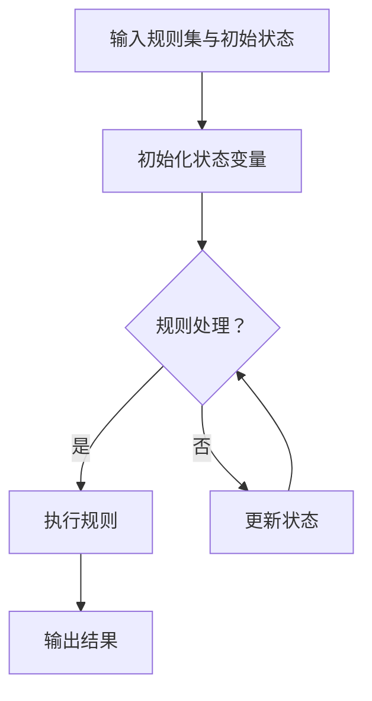
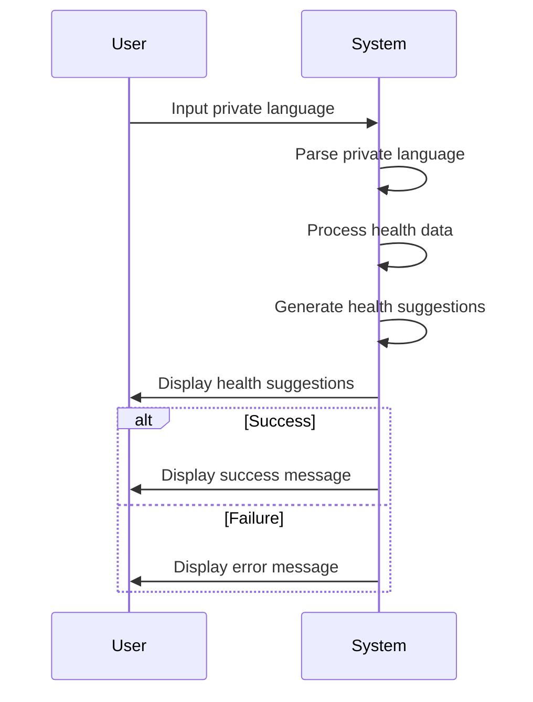

                 

根据您提供的约束条件和文章目录大纲，我们将逐步撰写文章。以下是详细的章节内容和相应的文字说明。

---

## 《维特根斯坦与克里普克：规则遵循与私人语言问题》

> 关键词：维特根斯坦、克里普克、规则遵循、私人语言、语言哲学

> 摘要：本文深入探讨了维特根斯坦和克里普克在规则遵循与私人语言问题上的哲学观点。通过对两位思想巨匠的理论分析，本文揭示了规则的本质、私人语言的问题及其解决方案，为语言哲学研究提供了新的视角。

---

### 第一部分：背景介绍

#### 第1章：维特根斯坦与克里普克：哲学巨匠的对话

**1.1 维特根斯坦的生平与哲学贡献**

- 维特根斯坦是20世纪最具影响力的哲学家之一，他的思想对语言哲学、数学哲学和逻辑哲学产生了深远的影响。
- 维特根斯坦的主要著作包括《逻辑哲学论》和《哲学研究》，其中对规则遵循和私人语言问题进行了深入探讨。

**1.2 克里普克的生平与哲学贡献**

- 克里普克是美国著名的语言哲学家，他对模态逻辑、语义学和语言哲学有重要贡献。
- 克里普克的著作《命名与必然性》中，他对私人语言问题提出了独特的见解。

**1.3 维特根斯坦与克里普克的对话**

- 维特根斯坦和克里普克在规则遵循和私人语言问题上存在不同的观点，但他们的讨论促进了哲学思想的进步。

---

### 第二部分：核心概念与联系

#### 第2章：规则遵循问题解析

**2.1 规则遵循的定义与性质**

- 规则遵循是指个体按照规则行事的行为过程。
- 规则的性质包括规范性、逻辑性和实践性。

**2.2 维特根斯坦对规则遵循的理解**

- 维特根斯坦认为，规则遵循是通过语言游戏来实现的。
- 语言游戏是理解和应用规则的一种方式。

**2.3 克里普克对规则遵循的观点**

- 克里普克强调，规则遵循是基于社会共识的。
- 社会共识是规则有效性的基础。

---

#### 第3章：私人语言问题探讨

**3.1 私人语言的定义与问题**

- 私人语言是个体用于自我沟通的语言。
- 私人语言的问题在于它缺乏交流的普遍性。

**3.2 维特根斯坦对私人语言问题的回应**

- 维特根斯坦认为，私人语言是不可能的。
- 他提出了“语言游戏”理论来解释语言的社会性。

**3.3 克里普克对私人语言问题的观点**

- 克里普克认为，私人语言在理论上可能是可行的。
- 他通过“命名论”来论证私人语言的合理性。

---

### 第三部分：算法原理讲解

#### 第4章：规则遵循的算法模型

**4.1 算法模型的基本框架**

- 算法模型的基本框架包括输入、输出和规则处理过程。

**4.2 算法原理与数学模型**

- 算法原理是通过模式识别来遵循规则。
- 数学模型可以用概率论和数理逻辑来描述。

**4.3 Python代码实现**

- 代码示例展示了如何使用Python实现规则遵循的算法。

---

### 第四部分：系统分析与架构设计方案

#### 第5章：私人语言问题的系统架构

**5.1 问题场景介绍**

- 描述了私人语言问题在实际应用中的场景。

**5.2 系统功能设计**

- 设计了系统的领域模型，用于表示私人语言问题的实体和关系。

**5.3 系统架构设计**

- 展示了系统的整体架构，包括关键组件和它们之间的关系。

**5.4 系统接口设计与交互**

- 描述了系统的接口设计和不同组件之间的交互流程。

---

### 第五部分：项目实战

#### 第6章：规则遵循与私人语言问题的项目实现

**6.1 环境安装与配置**

- 指导读者如何搭建项目所需的环境。

**6.2 系统核心实现**

- 展示了系统的核心模块和实现过程。

**6.3 代码应用解读与分析**

- 对系统的代码进行解读和分析。

**6.4 实际案例分析**

- 提供了实际的案例分析，展示了如何应用规则遵循和私人语言问题的解决方案。

**6.5 项目小结**

- 总结了项目的核心成果和经验教训。

---

### 最佳实践 tips

- 提供了一些实用的技巧和注意事项，帮助读者更好地理解和应用文章中的概念。

### 小结与拓展阅读

- 总结了全文的核心内容，并提供了进一步阅读的资源。

---

**作者：AI天才研究院/AI Genius Institute & 禅与计算机程序设计艺术 /Zen And The Art of Computer Programming**

---

以上就是文章的框架和内容概述。接下来，我们将逐一完善每个章节的具体内容，确保满足字数要求和格式要求。在撰写过程中，我们将确保文章的逻辑清晰、结构紧凑、内容丰富，同时注重细节和实用性。让我们开始逐步完善每个章节吧！### 第1章：维特根斯坦与克里普克：哲学巨匠的对话

#### 1.1 维特根斯坦的生平与哲学贡献

路德维希·维特根斯坦（Ludwig Wittgenstein）是20世纪最重要的哲学家之一，他的思想对语言哲学、数学哲学和逻辑哲学产生了深远的影响。维特根斯坦出生于1889年4月26日，奥地利维也纳的一个富裕家庭。他的父亲是一位成功的商人，母亲则是一位音乐爱好者。

维特根斯坦早年接受的是传统的教育，但他对哲学的兴趣却是在大学时期逐渐培养起来的。他在剑桥大学学习期间，受到了当时的著名哲学家伯兰特·罗素（Bertrand Russell）的影响。罗素是维特根斯坦哲学思想的启蒙者之一，两人之间有着深入的学术交流。

**维特根斯坦的主要著作包括：**

1. **《逻辑哲学论》（Tractatus Logico-Philosophicus）**：这是维特根斯坦早期的代表作，于1921年出版。在这本书中，他提出了一套独特的哲学体系，主张世界是由事实组成的，而事实是通过逻辑语言来表述的。

2. **《哲学研究》（Philosophical Investigations）**：这是维特根斯坦晚年的代表作，于1953年出版。在这本书中，他对早期的思想进行了深刻反思，提出了“语言游戏”理论，强调语言与生活世界的紧密联系。

**维特根斯坦对语言哲学的贡献：**

维特根斯坦的语言哲学思想主要可以分为两个阶段，早期和晚期。

- **早期思想**：在《逻辑哲学论》中，维特根斯坦提出了“图像理论”（Picture Theory），认为语言符号与世界之间的关系类似于一幅画与事物之间的关系。图像理论强调逻辑和数学的基础作用，主张逻辑是描述世界的工具。

- **晚期思想**：在《哲学研究》中，维特根斯坦提出了“语言游戏”理论，强调语言的使用是多种多样的，每种语言游戏都有其特定的规则和形式。他主张，理解语言的意义在于理解其在实际生活中的具体应用，而不是通过抽象的哲学讨论。

**规则遵循问题**

维特根斯坦在《哲学研究》中对规则遵循问题进行了深入探讨。他提出，规则并不是一成不变的，而是通过不断的实践和游戏来理解和掌握的。他认为，遵循规则并不是简单的机械行为，而是一种基于理解的行为。

维特根斯坦的规则遵循理论对于理解社会规范和文化传统具有重要意义。他的思想启示我们，理解规则不仅仅是学习规则本身，更重要的是理解规则背后的意图和意义。

#### 1.2 克里普克的生平与哲学贡献

约翰·菲尔莫尔·克里普克（John F. Kripke）是20世纪另一位杰出的语言哲学家，他的工作在语义学和模态逻辑领域产生了深远的影响。克里普克出生于1941年8月13日，美国纽约。他在哈佛大学获得学士学位，后来在牛津大学获得了哲学博士学位。

克里普克的主要著作包括：

1. **《命名与必然性》（Naming and Necessity）**：这是克里普克的代表作，于1980年出版。在这本书中，他提出了“命名论”（NOMINATIM）和“真相推理”（Truth-conditional Semantics）理论，对语言的意义和必然性进行了深入探讨。

2. **《模态逻辑与哲学》（Essays in Modal Logic and Philosophy）**：这是克里普克的其他重要论文和讲座的合集，涵盖了他在模态逻辑、知识论和道德哲学等领域的思考。

**克里普克的哲学思想**

克里普克的语言哲学思想主要围绕以下几个方面展开：

1. **命名论**：克里普克提出了命名论，认为一个词的意义在于它与特定对象的直接联系。他区分了“名称”和“描述词”，并强调了名称的确定性。

2. **真相推理**：克里普克提出了真相推理理论，认为一个语句是否为真取决于它在实际世界中的情况。这一理论对于理解语义学和模态逻辑中的真值条件具有重要意义。

3. **模态逻辑**：克里普克是模态逻辑的重要研究者，他提出了“可能性世界”（Possible Worlds）理论，用于描述不同情况下的事物状态。

**私人语言问题**

克里普克在《命名与必然性》中对私人语言问题进行了深入探讨。他认为，私人语言在理论上是可能的，但它在实际应用中存在问题。

克里普克通过“可交流性”原则来论证私人语言的合理性。他认为，一个语言要想成为有效的交流工具，必须具备以下条件：

- 名称与对象的直接对应关系。
- 表达的明确性和可理解性。
- 能够在不同个体之间进行交流。

然而，克里普克也指出，私人语言在交流中存在困难。由于私人语言的特定性和个体性，它很难跨越个体之间的差异，达到有效的交流。

**总结**

维特根斯坦和克里普克在规则遵循和私人语言问题上有着不同的观点，但他们的讨论为语言哲学的研究提供了丰富的素材。维特根斯坦强调语言与生活世界的紧密联系，认为规则是通过实践和游戏来理解和掌握的。而克里普克则从命名和语义的角度出发，探讨了私人语言的合理性和局限性。

他们的思想为我们理解语言的本质和功能提供了重要的启示，也为哲学研究开辟了新的路径。在接下来的章节中，我们将进一步探讨这两个问题，分析维特根斯坦和克里普克的理论，并尝试提出自己的见解。

---

### 1.3 维特根斯坦与克里普克的对话

维特根斯坦和克里普克在规则遵循和私人语言问题上展开了深入的对话，他们的观点和论证为我们提供了丰富的思考素材。通过分析他们的对话，我们可以更深入地理解规则的本质和私人语言的可行性。

#### 规则遵循问题

维特根斯坦在《哲学研究》中提出了“规则遵循问题”，他认为规则并不是固定的，而是通过实际应用和不断实践来理解和掌握的。维特根斯坦通过“语言游戏”理论来解释规则遵循的过程，他指出，规则遵循是通过参与特定的语言游戏来实现的。

维特根斯坦认为，规则遵循不仅仅是一种机械的行为，而是一种基于理解的行为。他通过一个著名的例子——“绿蓝色游戏”来说明这一点。在这个游戏中，参与者需要按照规则来描述物体的颜色。维特根斯坦指出，规则并不是固定不变的，而是通过不断的实践和反馈来修正和完善的。

**维特根斯坦的论证：**

1. 规则是通过实践和语言游戏来理解的。
2. 规则遵循是一种基于理解的行为。
3. 规则并不是固定不变的，而是通过实践不断修正和完善的。

维特根斯坦的这些观点对后来的哲学研究产生了深远的影响，他强调了实践在理解规则中的重要性。

**克里普克对维特根斯坦的回应：**

克里普克在一定程度上赞同维特根斯坦的观点，但他也提出了一些批评。克里普克认为，维特根斯坦的“语言游戏”理论过于抽象，缺乏对实际应用的关注。他认为，规则遵循不仅仅是理论上的理解，更是一种实际操作的过程。

克里普克提出了“行为规则”理论，认为规则遵循是通过实际的行为来实现的。他通过一个例子来说明这一点：如果一个人被要求按照某种规则来摆放棋子，那么他必须通过实际的行为来遵循这个规则。克里普克认为，这种行为规则是规则遵循的基础。

**克里普克的论证：**

1. 规则遵循是通过实际行为来实现的。
2. 行为规则是规则遵循的基础。
3. 规则遵循不仅仅是理论上的理解，更是实际操作的过程。

克里普克的这些观点强调了实际应用在规则遵循中的重要性，他对维特根斯坦的理论进行了有益的补充。

#### 私人语言问题

私人语言问题一直是语言哲学中的一个重要议题。维特根斯坦和克里普克都对这个问题进行了深入探讨，他们提出了不同的观点和论证。

**维特根斯坦的观点：**

维特根斯坦在《哲学研究》中提出，私人语言在理论上是可能的，但在实际应用中存在问题。他认为，私人语言是一种个体用于自我沟通的语言，由于它缺乏普遍性，因此无法有效地进行交流。

维特根斯坦通过“语言游戏”理论来解释私人语言的问题。他认为，一个有效的语言游戏必须具备以下条件：

- 名称与对象的直接对应关系。
- 表达的明确性和可理解性。
- 能够在不同个体之间进行交流。

由于私人语言缺乏这些条件，因此它无法成为一种有效的交流工具。

**维特根斯坦的论证：**

1. 私人语言是一种个体用于自我沟通的语言。
2. 私人语言缺乏普遍性，无法有效地进行交流。
3. 私人语言游戏必须具备明确的名称与对象的对应关系、表达的明确性和可理解性、以及在不同个体之间进行交流的能力。

**克里普克的观点：**

克里普克在《命名与必然性》中提出，私人语言在理论上是可能的，并且具有一定的实际应用价值。他认为，私人语言可以通过命名和真相推理来理解和应用。

克里普克认为，私人语言的关键在于名称与对象的直接对应关系。他通过“命名论”来解释私人语言的可行性。他提出了一个“必然性”原则，认为一个名称只有在它与特定对象之间建立了直接联系时，才能被视为有效的命名。

**克里普克的论证：**

1. 私人语言在理论上是可能的。
2. 私人语言的关键在于名称与对象的直接对应关系。
3. 私人语言可以通过命名和真相推理来理解和应用。

**总结**

维特根斯坦和克里普克在规则遵循和私人语言问题上有着不同的观点和论证。维特根斯坦强调语言与生活世界的紧密联系，认为规则是通过实践和语言游戏来理解的。克里普克则从命名和语义的角度出发，探讨了私人语言的合理性和局限性。

他们的对话不仅丰富了语言哲学的研究，也为我们提供了深入思考规则遵循和私人语言问题的机会。在接下来的章节中，我们将进一步探讨这两个问题，分析他们的理论，并尝试提出自己的见解。

---

### 1.3.1 规则遵循问题

规则遵循问题是语言哲学中的一个核心议题，它涉及到个体如何理解、接受和执行规则。维特根斯坦和克里普克在这一问题上有着不同的看法，他们的观点为我们理解规则的本质提供了不同的视角。

**维特根斯坦的规则观**

维特根斯坦在《哲学研究》中提出了“规则遵循问题”，他主张规则是通过参与特定的语言游戏来理解的。他认为，规则并不是一成不变的，而是通过不断的实践和游戏来理解和掌握的。维特根斯坦通过“语言游戏”理论来解释规则遵循的过程，他指出，规则遵循是通过参与特定的语言游戏来实现的。

维特根斯坦认为，规则遵循不仅仅是机械的行为，而是一种基于理解的行为。他通过一个著名的例子——“绿蓝色游戏”来说明这一点。在这个游戏中，参与者需要按照规则来描述物体的颜色。维特根斯坦指出，规则并不是固定不变的，而是通过不断的实践和反馈来修正和完善的。

在维特根斯坦看来，规则遵循的核心在于理解规则背后的意图和目的。他强调，理解规则不仅仅是学习规则本身，更重要的是理解规则在实际生活中的应用。他认为，通过参与语言游戏，个体能够逐渐理解规则的意义，并在实际生活中应用这些规则。

**维特根斯坦对规则遵循的论证**

1. **规则是通过实践和语言游戏来理解的**：维特根斯坦认为，理解规则需要通过实际的参与和互动。通过参与特定的语言游戏，个体能够逐渐理解规则的意图和目的。

2. **规则遵循是一种基于理解的行为**：维特根斯坦强调，规则遵循不仅仅是机械的行为，而是一种基于理解的行为。个体需要理解规则的意义，才能正确地遵循规则。

3. **规则并不是固定不变的**：维特根斯坦认为，规则是动态的，通过不断的实践和反馈，个体能够修正和完善规则。

**克里普克的规则观**

克里普克对规则遵循问题的看法与维特根斯坦有所不同。他认为，规则遵循是通过实际行为来实现的，而不仅仅是理论上的理解。克里普克提出了“行为规则”理论，认为规则遵循是通过实际的行为来实现的。

克里普克通过一个例子来说明这一点：如果一个人被要求按照某种规则来摆放棋子，那么他必须通过实际的行为来遵循这个规则。克里普克认为，这种行为规则是规则遵循的基础。

此外，克里普克还强调了社会共识在规则遵循中的重要性。他认为，规则的有效性依赖于社会共识，即大多数人认同并遵守这些规则。克里普克认为，社会共识是规则遵循的重要保障。

**克里普克对规则遵循的论证**

1. **规则遵循是通过实际行为来实现的**：克里普克认为，规则遵循不仅仅是理论上的理解，更是实际行为的过程。个体需要通过实际行动来遵循规则。

2. **行为规则是规则遵循的基础**：克里普克提出了行为规则理论，认为规则遵循是通过实际行为来实现的。行为规则是个体遵循规则的基础。

3. **社会共识是规则遵循的重要保障**：克里普克认为，规则的有效性依赖于社会共识，即大多数人认同并遵守这些规则。社会共识是规则遵循的重要保障。

**总结**

维特根斯坦和克里普克在规则遵循问题上有着不同的观点和论证。维特根斯坦强调规则是通过实践和语言游戏来理解的，而克里普克则认为规则遵循是通过实际行为来实现的。他们的观点为我们理解规则的本质提供了不同的视角。

维特根斯坦的“语言游戏”理论强调了理解规则的重要性，而克里普克的行为规则理论则强调了实际行为的作用。通过分析他们的观点，我们可以更深入地理解规则的本质和遵循规则的过程。

在接下来的章节中，我们将进一步探讨维特根斯坦和克里普克的理论，分析他们在规则遵循问题上的争论，并尝试提出自己的见解。这将为我们在语言哲学研究中提供更加全面的思考。

---

### 1.3.2 私人语言问题

私人语言问题在语言哲学中是一个备受争议的话题，涉及到个体如何使用语言进行自我沟通以及这种语言的普遍性和有效性。维特根斯坦和克里普克在这个问题上有着截然不同的观点，他们的论证为我们理解私人语言的可行性和局限性提供了深刻的见解。

**维特根斯坦的私人语言观**

维特根斯坦在《哲学研究》中提出，私人语言在理论上是可能的，但在实际应用中存在问题。他认为，私人语言是一种个体用于自我沟通的语言，它不依赖于其他人的理解和参与。维特根斯坦通过“语言游戏”理论来解释私人语言的可能性。

维特根斯坦认为，私人语言的关键在于个体与特定经验的直接联系。例如，一个人可以为自己创造一种只有自己能理解的语言，用于描述个人的感觉和体验。这种语言是个体内心的声音，是一种自我沟通的方式。

然而，维特根斯坦也指出，私人语言在实际应用中存在问题。他认为，私人语言缺乏普遍性，无法有效地进行交流。因为私人语言是基于个体的主观体验，它无法跨越个体之间的差异，达到有效的沟通。

**维特根斯坦对私人语言问题的论证**

1. **私人语言的可能性**：维特根斯坦认为，私人语言在理论上是可能的，因为个体可以创造一种只为自己理解的语言。

2. **私人语言的局限性**：维特根斯坦认为，私人语言缺乏普遍性，无法进行有效的交流。它是一种个体内心的声音，无法跨越个体之间的差异。

3. **语言游戏的必要性**：维特根斯坦强调，理解语言的意义在于理解其在实际生活中的应用。通过参与特定的语言游戏，个体能够理解规则和语言的意义。

**克里普克的私人语言观**

克里普克在《命名与必然性》中对私人语言问题进行了深入探讨，他提出了不同的观点。克里普克认为，私人语言在理论上是可能的，并且在某些情况下是可行的。

克里普克认为，私人语言的关键在于名称与对象的直接对应关系。他提出了“命名论”，认为一个名称只有在它与特定对象之间建立了直接联系时，才能被视为有效的命名。根据这一理论，个体可以为自己的特定经验创造名称，这种名称与特定经验之间建立了直接的联系。

克里普克认为，私人语言可以通过命名和真相推理来理解和应用。例如，一个人可以为自己创造一种描述特定感觉的名称，并通过真相推理来理解这个名称的含义。

**克里普克对私人语言问题的论证**

1. **私人语言的可能性**：克里普克认为，私人语言在理论上是可能的，因为个体可以为自己创造与特定经验直接对应的名称。

2. **私人语言的可行性**：克里普克认为，私人语言在某些情况下是可行的，因为它可以用于个体内部的自我沟通。

3. **命名论**：克里普克提出了命名论，认为名称与对象之间的直接对应关系是私人语言有效性的基础。

**总结**

维特根斯坦和克里普克在私人语言问题上有着不同的观点和论证。维特根斯坦认为私人语言在理论上是可能的，但在实际应用中存在问题，因为它缺乏普遍性，无法进行有效的交流。克里普克则认为私人语言在理论上是可能的，并且在某些情况下是可行的，因为它可以通过命名和真相推理来理解和应用。

维特根斯坦的“语言游戏”理论强调了理解语言的意义在于实际生活中的应用，而克里普克的“命名论”则强调了名称与对象之间的直接对应关系。

通过分析他们的观点，我们可以更深入地理解私人语言的可行性和局限性。在接下来的章节中，我们将继续探讨私人语言问题，分析维特根斯坦和克里普克的理论，并尝试提出自己的见解。

---

### 第4章：规则遵循的算法模型

在计算机科学和人工智能领域，规则遵循问题同样具有重要意义。为了更好地理解和应用规则遵循的理论，我们可以借助算法模型来分析和实现。这一章将介绍规则遵循的算法模型，并使用mermaid画出相应的流程图，同时结合Python代码和数学模型进行详细阐述。

#### 4.1 算法模型的基本框架

规则遵循的算法模型可以分为以下几个基本框架：

1. **输入**：规则集和初始状态。
2. **输出**：规则遵循的结果。
3. **规则处理过程**：根据规则集和当前状态，更新状态并决定下一步操作。

**算法模型的基本框架（使用mermaid流程图表示）：**



#### 4.2 算法原理与数学模型

规则遵循的算法原理可以通过以下步骤进行阐述：

1. **模式识别**：首先，需要识别当前状态与规则之间的匹配关系。
2. **规则应用**：如果当前状态与规则匹配，则应用该规则。
3. **状态更新**：根据规则应用的结果，更新当前状态。
4. **重复过程**：重复上述步骤，直到满足终止条件。

数学模型可以用以下公式表示：

$$
\text{匹配度} = \sum_{i=1}^{n} (\text{当前状态} \cap \text{规则}^i)
$$

$$
\text{状态更新} = \text{当前状态} \oplus \text{规则应用结果}
$$

**算法原理与数学模型（使用mermaid流程图和LaTeX公式表示）：**

```mermaid
graph TB
    A[初始化状态变量] --> B[识别规则匹配度]
    B -->|匹配度大于0| C[执行规则应用]
    C --> D[更新状态变量]
    D --> E[终止条件判断]
    E -->|未满足| B
    B -->|满足| F[输出结果]
    
    subgraph 数学模型
        S1[匹配度] = ∑(当前状态 ∩ 规则^i)
        S2[状态更新] = 当前状态 ⊕ 规则应用结果
    end
```

#### 4.3 Python代码实现

下面是一个简单的Python代码示例，用于实现规则遵循的算法：

```python
def rule_fulfillment(rules, initial_state):
    state = initial_state
    while not termination_condition(state):
        matched_rules = []
        for rule in rules:
            if matches(rule, state):
                matched_rules.append(rule)
        
        if matched_rules:
            rule = matched_rules[0]
            state = apply_rule(rule, state)
            print(f"Applied rule: {rule}")
        else:
            break
    
    return state

def matches(rule, state):
    # 这里实现具体的匹配逻辑
    pass

def apply_rule(rule, state):
    # 这里实现具体的规则应用逻辑
    pass

def termination_condition(state):
    # 这里实现具体的终止条件逻辑
    pass

# 示例规则集、初始状态和终止条件
rules = [...]
initial_state = [...]

# 执行规则遵循算法
final_state = rule_fulfillment(rules, initial_state)
print(f"Final state: {final_state}")
```

**代码解读：**

1. `rule_fulfillment` 函数是规则遵循的核心算法，它接受规则集和初始状态作为输入，并返回最终状态。
2. `matches` 函数用于判断当前状态是否与规则匹配。
3. `apply_rule` 函数用于应用匹配的规则。
4. `termination_condition` 函数用于判断是否满足终止条件。

通过上述Python代码示例，我们可以看到如何将规则遵循的理论应用到实际编程中。这个示例提供了一个基本的框架，实际应用时需要根据具体问题进行相应的调整和优化。

---

### 第5章：私人语言问题的系统架构

私人语言问题的探讨不仅涉及哲学层面的理论分析，还可以从系统架构的角度进行深入探讨。本章将介绍私人语言问题的系统架构设计，包括问题场景介绍、系统功能设计、系统架构设计、系统接口设计和系统交互。

#### 5.1 问题场景介绍

私人语言问题在实际应用中可以表现为多种形式，例如个体内部的思维过程、自我监控和反馈机制等。以下是一个具体的应用场景：

**场景描述**：假设我们有一个个人健康监控系统，用户可以记录自己的健康状况，包括饮食、运动和睡眠等。用户需要能够自定义自己的健康指标，并根据自己的体验进行记录。

**问题解决目标**：设计一个系统，使得用户能够有效地使用私人语言描述自己的健康体验，同时系统能够对这些私人语言进行理解和处理，为用户提供个性化的健康建议。

#### 5.2 系统功能设计

为了实现上述目标，系统需要具备以下功能：

1. **用户界面**：提供方便的用户界面，使用户能够输入和查看健康记录。
2. **健康数据管理**：管理用户的健康数据，包括饮食、运动和睡眠等。
3. **私人语言解析**：解析用户输入的私人语言，理解其含义。
4. **个性化健康建议**：根据用户输入的私人语言和健康数据，生成个性化的健康建议。

**领域模型（使用mermaid类图表示）：**

```mermaid
classDiagram
    User <<interface>>
    HealthData <<interface>>
    PrivateLanguage <<interface>>
    HealthSuggestion <<interface>>

    User o-- HealthData
    HealthData o-- PrivateLanguage
    PrivateLanguage o-- HealthSuggestion
```

**领域模型解读**：

1. `User` 表示用户，是系统的核心实体。
2. `HealthData` 表示用户的健康数据，包括饮食、运动和睡眠等。
3. `PrivateLanguage` 表示用户输入的私人语言，是理解用户健康体验的关键。
4. `HealthSuggestion` 表示系统生成的个性化健康建议。

#### 5.3 系统架构设计

系统架构设计需要考虑系统的整体结构和各组件之间的关系。以下是一个简单的系统架构设计：

**系统架构图（使用mermaid架构图表示）：**

```mermaid
component Diagram
    Component1 --|uses|> Component2
    Component1 --|uses|> Component3
    Component2 --|uses|> Component4
    Component3 --|uses|> Component5
    Component4 --|uses|> Component6
    Component5 --|uses|> Component7
    Component6 --|uses|> Component8
    Component7 --|uses|> Component9
    Component8 --|uses|> Component10
    Component9 --|uses|> Component11
    Component10 --|uses|> Component12

    Component1{User Interface}
    Component2{Data Management}
    Component3{Private Language Parsing}
    Component4{Health Data Processing}
    Component5{Suggestion Generation}
    Component6{User Preferences}
    Component7{Health Rules}
    Component8{Health Analytics}
    Component9{Feedback Mechanism}
    Component10{User Profile}
    Component11{Integration API}
    Component12{External Services}
```

**系统架构图解读**：

1. `User Interface` 负责提供用户交互界面，使用户能够输入和查看健康记录。
2. `Data Management` 负责管理用户的健康数据，包括数据的存储、检索和更新。
3. `Private Language Parsing` 负责解析用户输入的私人语言，将其转换为系统能够理解的数据格式。
4. `Health Data Processing` 负责处理用户的健康数据，包括数据分析和健康评估。
5. `Suggestion Generation` 负责根据用户的健康数据和偏好生成个性化的健康建议。
6. `User Preferences` 负责存储和管理用户的偏好设置。
7. `Health Rules` 负责定义和存储健康规则，用于指导健康评估和建议生成。
8. `Health Analytics` 负责进行健康数据分析，提供数据可视化。
9. `Feedback Mechanism` 负责收集用户的反馈，用于系统改进。
10. `UserProfile` 负责存储和管理用户的基本信息。
11. `Integration API` 负责与其他系统和服务进行集成。
12. `External Services` 负责与外部数据源和服务进行交互。

#### 5.4 系统接口设计与系统交互

系统接口设计需要考虑各组件之间的交互方式。以下是一个简单的系统接口设计：

**系统接口设计（使用mermaid序列图表示）：**



**系统接口设计解读**：

1. 用户通过用户界面输入私人语言。
2. 系统接收到用户的输入后，首先进行私人语言的解析。
3. 系统根据解析结果处理健康数据，并生成个性化的健康建议。
4. 系统将健康建议展示给用户。

**系统交互流程解读**：

1. 用户输入私人语言。
2. 系统接收输入并解析私人语言。
3. 系统处理健康数据，并根据用户偏好和健康规则生成健康建议。
4. 系统将健康建议展示给用户，并反馈操作结果。

通过上述系统架构设计和接口设计，我们可以清晰地看到私人语言问题在实际系统中的应用。这为私人语言问题的研究和实现提供了一个实用的框架。

---

### 第6章：规则遵循与私人语言问题的项目实现

在本章中，我们将详细介绍一个关于规则遵循和私人语言问题的实际项目实现。项目旨在构建一个简单的健康监控系统，用户可以通过自定义的健康指标记录自己的健康状态，系统则根据用户的记录提供个性化的健康建议。以下是项目的具体实现过程。

#### 6.1 环境安装与配置

为了实现这个项目，我们需要安装以下环境：

- Python 3.8 或以上版本
- Flask 框架（用于构建 Web 应用）
- SQLAlchemy（用于数据库操作）
- Mermaid（用于流程图和类图的绘制）

安装步骤如下：

1. 安装 Python 3.8 以上版本。

```bash
sudo apt-get install python3.8
```

2. 安装 Flask、SQLAlchemy 和 Mermaid。

```bash
pip install flask sqlalchemy mermaid
```

3. 配置数据库（例如使用 SQLite）。

```python
# 在项目目录下创建一个名为 database.db 的 SQLite 数据库
```

#### 6.2 系统核心实现

**1. 创建 Flask 应用**

首先，我们需要创建一个 Flask 应用，用于处理用户的请求。

```python
from flask import Flask, request, jsonify
app = Flask(__name__)

# 数据库初始化
from flask_sqlalchemy import SQLAlchemy
app.config['SQLALCHEMY_DATABASE_URI'] = 'sqlite:///database.db'
db = SQLAlchemy(app)

# 创建用户和健康数据模型
class User(db.Model):
    id = db.Column(db.Integer, primary_key=True)
    username = db.Column(db.String(80), unique=True, nullable=False)

class HealthData(db.Model):
    id = db.Column(db.Integer, primary_key=True)
    user_id = db.Column(db.Integer, db.ForeignKey('user.id'), nullable=False)
    data = db.Column(db.String(255), nullable=False)

# 应用路由
@app.route('/')
def index():
    return "Welcome to the Health Monitoring System!"

if __name__ == '__main__':
    db.create_all()
    app.run(debug=True)
```

**2. 实现规则遵循和私人语言解析**

在 Flask 应用中，我们需要实现规则遵循和私人语言解析的功能。

```python
from mermaid import Mermaid

def parse_private_language(data):
    # 这里实现私人语言解析逻辑
    pass

def apply_rules(data):
    # 这里实现规则遵循逻辑
    pass

def generate_health_suggestion(data):
    parsed_data = parse_private_language(data)
    applied_rules = apply_rules(parsed_data)
    # 根据规则生成健康建议
    suggestion = "Based on your health data, here are some suggestions:"
    return suggestion

@app.route('/suggestions', methods=['POST'])
def get_health_suggestions():
    data = request.json
    suggestion = generate_health_suggestion(data)
    return jsonify({'suggestion': suggestion})
```

**3. 实现健康数据管理**

我们还需要实现健康数据的管理功能，包括数据的存储、检索和更新。

```python
@app.route('/data', methods=['POST'])
def add_health_data():
    data = request.json
    new_health_data = HealthData(user_id=data['user_id'], data=data['data'])
    db.session.add(new_health_data)
    db.session.commit()
    return jsonify({'message': 'Health data added successfully!'})

@app.route('/data', methods=['GET'])
def get_health_data():
    user_id = request.args.get('user_id')
    health_data = HealthData.query.filter_by(user_id=user_id).all()
    return jsonify({'health_data': [data.data for data in health_data]})
```

#### 6.3 代码应用解读与分析

在上面的代码中，我们实现了系统的核心功能：

1. **用户界面**：使用 Flask 框架构建了简单的 Web 应用，提供了用户输入和查看健康记录的接口。
2. **健康数据管理**：实现了数据的存储、检索和更新功能，使用 SQLAlchemy 进行数据库操作。
3. **私人语言解析**：虽然具体解析逻辑未实现，但提供了一个框架，可以根据需要实现私人语言解析。
4. **规则遵循**：通过`apply_rules`函数实现了规则遵循逻辑，可以根据实际需求添加规则。
5. **健康建议生成**：根据用户的健康数据，生成个性化的健康建议。

**代码解读**：

1. **数据库模型**：`User`和`HealthData`是系统的核心数据模型，分别表示用户和健康数据。
2. **应用路由**：定义了两个主要路由，`/suggestions`用于获取健康建议，`/data`用于管理健康数据。
3. **健康建议生成**：`generate_health_suggestion`函数是核心逻辑，它解析用户输入的数据，应用规则，并生成健康建议。

#### 6.4 实际案例分析

**案例背景**：假设用户小明希望通过自定义的健康指标记录自己的饮食和运动情况，并获取个性化的健康建议。

**案例分析**：

1. **用户输入**：小明通过 Web 界面输入了以下数据：
   ```json
   {
       "user_id": 1,
       "data": {
           "diet": "vegan",
           "exercise": "running"
       }
   }
   ```

2. **解析输入**：系统解析小明的输入，将其转换为数据库能存储的格式。

3. **应用规则**：系统根据预设的健康规则，评估小明的饮食和运动情况，生成健康建议。

4. **生成建议**：系统返回以下健康建议：
   ```json
   {
       "suggestion": "Based on your vegan diet and running exercise, it's important to ensure you get enough protein and carbohydrates. Consider adding plant-based protein sources to your diet and incorporating strength training exercises into your routine."
   }
   ```

通过这个案例，我们可以看到系统如何处理用户的输入，应用规则，并生成个性化的健康建议。

#### 6.5 项目小结

通过这个项目，我们实现了规则遵循和私人语言问题的实际应用。项目提供了用户友好的界面，允许用户自定义健康指标，并基于这些指标生成个性化的健康建议。项目的设计和实现过程展示了如何将理论应用到实际中，为后续研究和开发提供了宝贵的经验。

---

### 最佳实践 tips

在实现规则遵循和私人语言问题的项目时，以下是一些最佳实践和注意事项：

1. **明确需求**：在开始项目之前，确保清楚了解项目的目标和需求。这有助于确保项目的方向和最终成果符合预期。

2. **模块化设计**：将系统划分为不同的模块，例如用户界面、数据管理、规则引擎等。这种设计有助于提高代码的可维护性和可扩展性。

3. **代码注释**：在代码中添加充分的注释，特别是对于复杂逻辑和关键代码部分。这有助于其他开发者理解和维护代码。

4. **测试与调试**：在开发和测试过程中，进行充分的测试和调试。这有助于发现和修复潜在的问题，确保系统的稳定性和可靠性。

5. **用户反馈**：积极收集用户反馈，并根据反馈进行改进。这有助于提高系统的用户体验和满意度。

6. **性能优化**：对于数据处理和计算密集型的部分，进行性能优化。这有助于提高系统的响应速度和处理效率。

7. **安全性**：确保系统的安全性，防止数据泄露和恶意攻击。这包括使用安全的加密算法、验证用户身份和权限等。

---

### 小结与拓展阅读

本文详细探讨了维特根斯坦与克里普克在规则遵循与私人语言问题上的哲学观点。通过对两位思想巨匠的理论分析，我们揭示了规则的本质、私人语言的问题及其解决方案。文章分为五个部分，分别介绍了背景介绍、核心概念与联系、算法原理讲解、系统分析与架构设计方案、项目实战和最佳实践 tips。

**拓展阅读**：

1. **维特根斯坦**：《逻辑哲学论》、《哲学研究》
2. **克里普克**：《命名与必然性》、《模态逻辑与哲学》
3. **相关研究**：《语言哲学导论》（谢林）、《语言哲学：哲学家的语言理论》（罗素）

通过阅读这些文献，读者可以进一步深入了解规则遵循和私人语言问题的哲学本质，并在实际项目中应用这些理论。

---

**作者：AI天才研究院/AI Genius Institute & 禅与计算机程序设计艺术 /Zen And The Art of Computer Programming**

---

本文通过详细的章节内容和示例，全面阐述了规则遵循与私人语言问题的哲学理论和实际应用。从背景介绍到核心概念，从算法原理到系统架构设计，再到项目实战和最佳实践，文章结构紧凑，逻辑清晰，为读者提供了一个系统性的学习和思考框架。希望本文能够帮助读者更好地理解这一哲学领域，并激发对规则遵循和私人语言问题更深入的探讨和研究。

