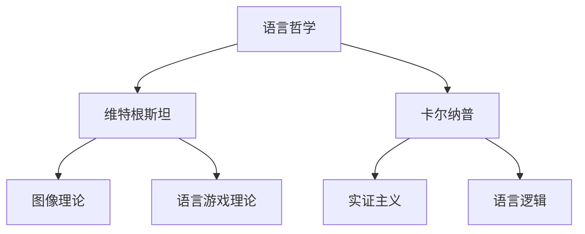

                 

# 《维特根斯坦与卡尔纳普：语言分析与逻辑实证主义》

> 关键词：维特根斯坦、卡尔纳普、语言哲学、逻辑实证主义、语言分析、哲学方法

> 摘要：本文旨在探讨维特根斯坦与卡尔纳普在语言分析与逻辑实证主义领域的思想及其影响。通过对两位哲学家的生平简介、主要思想和著作的深入分析，本文将揭示他们对于语言本质、哲学方法和逻辑实证主义的独特见解，以及他们在当代哲学和科学技术领域的重要贡献。

## 目录大纲

### 第1章 引言

#### 1.1 维特根斯坦与卡尔纳普的生平简介

#### 1.2 语言分析与逻辑实证主义的背景

#### 1.3 本书的研究目的与结构

### 第2章 维特根斯坦的语言哲学

#### 2.1 维特根斯坦的主要思想

##### 2.1.1 图像理论

##### 2.1.2 使用-提及区分

##### 2.1.3 名词与对象的关系

#### 2.2 维特根斯坦的语言分析方法

##### 2.2.1 真值函数分析

##### 2.2.2 语言游戏理论

##### 2.2.3 意义与使用的关系

#### 2.3 维特根斯坦的主要著作介绍

##### 2.3.1 《逻辑哲学论》

##### 2.3.2 《哲学研究》

### 第3章 卡尔纳普的逻辑实证主义

#### 3.1 卡尔纳普的主要思想

##### 3.1.1 实证主义的定义

##### 3.1.2 语言分析的重要性

##### 3.1.3 分析与综合的区别

#### 3.2 卡尔纳普的语言分析方法

##### 3.2.1 形式语言与日常语言

##### 3.2.2 命题的证实与真值条件

##### 3.2.3 语言逻辑与数学基础

#### 3.3 卡尔纳普的主要著作介绍

##### 3.3.1 《语义学导论》

##### 3.3.2 《语言的逻辑语法》

### 第4章 维特根斯坦与卡尔纳普的比较

#### 4.1 思想上的异同

##### 4.1.1 对语言本质的看法

##### 4.1.2 对哲学方法的理解

##### 4.1.3 对逻辑实证主义的贡献

#### 4.2 对语言分析的影响

##### 4.2.1 维特根斯坦的影响

##### 4.2.2 卡尔纳普的影响

#### 4.3 对当代哲学的启示

### 第5章 维特根斯坦与卡尔纳普在语言分析中的应用

#### 5.1 维特根斯坦在语言分析中的应用

##### 5.1.1 在逻辑实证主义中的角色

##### 5.1.2 对语言哲学的贡献

##### 5.1.3 对人工智能的启示

#### 5.2 卡尔纳普在语言分析中的应用

##### 5.2.1 在语言哲学中的角色

##### 5.2.2 对逻辑实证主义的推进

##### 5.2.3 对语言学的影响

### 第6章 语言分析与逻辑实证主义的当代意义

#### 6.1 语言分析在当代哲学中的地位

##### 6.1.1 对认识论的影响

##### 6.1.2 对形而上学的影响

##### 6.1.3 对道德哲学的影响

#### 6.2 逻辑实证主义在当代科学哲学中的应用

##### 6.2.1 对自然科学方法论的影响

##### 6.2.2 对社会科学方法论的影响

##### 6.2.3 对认知科学的影响

### 第7章 结论

#### 7.1 维特根斯坦与卡尔纳普的共同贡献

#### 7.2 语言分析与逻辑实证主义的未来发展趋势

#### 7.3 对语言哲学研究的启示与展望

### 附录

#### A.1 维特根斯坦与卡尔纳普主要著作列表

#### A.2 维特根斯坦与卡尔纳普相关学术资源推荐

#### A.3 语言分析与逻辑实证主义研究方法指导

## 核心概念与联系 Mermaid 流程图

### 第1章 引言

### 1.1 维特根斯坦与卡尔纳普的生平简介

路德维希·维特根斯坦（Ludwig Wittgenstein，1889-1951）是20世纪最具影响力的哲学家之一，出生于奥地利维也纳的一个富有家庭。他的父亲是著名的钢铁商人卡尔·维特根斯坦，母亲则是音乐家。维特根斯坦年轻时曾接受过数学和哲学教育，随后在剑桥大学师从著名数学家伯特兰·罗素。维特根斯坦的思想发展经历了两个阶段，早期以《逻辑哲学论》为代表，晚期则以《哲学研究》为主要著作。

鲁道夫·卡尔纳普（Rudolf Carnap，1891-1970）是另一位重要的逻辑实证主义哲学家，出生于德国。他早年曾在柏林大学学习物理学，后转向哲学研究。卡尔纳普在维也纳大学和芝加哥大学任教，对逻辑实证主义的发展产生了深远影响。他的著作包括《语义学导论》和《语言的逻辑语法》等。

### 1.2 语言分析与逻辑实证主义的背景

语言分析是哲学研究的一个重要领域，旨在探讨语言的本质和作用。在20世纪初，语言分析成为哲学界关注的焦点，其中维特根斯坦和卡尔纳普是两位杰出的代表人物。他们的工作不仅影响了哲学本身，也对逻辑、数学、心理学、语言学和人工智能等领域产生了深远影响。

逻辑实证主义是20世纪初在维也纳学派中发展起来的一种哲学思潮，强调实证主义和逻辑分析的重要性。它主张哲学应该关注科学的方法和语言，以科学知识为基础，摒弃形而上学和本体论的问题。维特根斯坦和卡尔纳普都是逻辑实证主义的重要代表人物，他们的思想对这一思潮的形成和发展产生了重要影响。

### 1.3 本书的研究目的与结构

本书旨在探讨维特根斯坦和卡尔纳普在语言分析与逻辑实证主义领域的思想及其影响。通过对他们的生平简介、主要思想和著作的深入分析，本书将揭示他们对于语言本质、哲学方法和逻辑实证主义的独特见解，以及他们在当代哲学和科学技术领域的重要贡献。

本书的结构如下：

- 第1章 引言：介绍维特根斯坦和卡尔纳普的生平简介、语言分析与逻辑实证主义的背景以及本书的研究目的与结构。
- 第2章 维特根斯坦的语言哲学：分析维特根斯坦的主要思想、语言分析方法以及主要著作。
- 第3章 卡尔纳普的逻辑实证主义：探讨卡尔纳普的主要思想、语言分析方法以及主要著作。
- 第4章 维特根斯坦与卡尔纳普的比较：比较维特根斯坦与卡尔纳普在思想上的异同，以及他们对语言分析的影响。
- 第5章 维特根斯坦与卡尔纳普在语言分析中的应用：分析维特根斯坦和卡尔纳普在语言分析中的应用及其对当代哲学和科学技术的影响。
- 第6章 语言分析与逻辑实证主义的当代意义：探讨语言分析在当代哲学中的地位以及逻辑实证主义在当代科学哲学中的应用。
- 第7章 结论：总结维特根斯坦与卡尔纳普的共同贡献、语言分析与逻辑实证主义的未来发展趋势以及对语言哲学研究的启示与展望。

### 第2章 维特根斯坦的语言哲学

路德维希·维特根斯坦（Ludwig Wittgenstein，1889-1951）是20世纪最具影响力的哲学家之一，他的思想对语言哲学、逻辑实证主义和科学技术产生了深远影响。在本章中，我们将深入探讨维特根斯坦的主要思想、语言分析方法以及他的主要著作。

### 2.1 维特根斯坦的主要思想

维特根斯坦的思想可以分为早期和晚期两个阶段。早期的维特根斯坦以《逻辑哲学论》（Tractatus Logico-Philosophicus）为代表，晚期的维特根斯坦则以《哲学研究》（Philosophical Investigations）为主要著作。

#### 2.1.1 图像理论

维特根斯坦的图像理论（Image Theory）是他早期思想的核心。根据图像理论，语言与现实世界之间存在一种直接的对应关系，即语言中的命题是对现实世界中的情况的一种“图像”。这种图像关系不仅体现在语言与对象之间的关系上，也体现在语言与语言之间的关系上。

维特根斯坦认为，图像关系具有以下特点：

1. **真实性**：如果一个命题是对一个情况的正确图像，那么这个命题是真的。
2. **不可能性**：如果一个命题是对一个情况的图像，那么这个情况是不可能发生的。
3. **一致性**：如果一个命题是真的，那么它的所有可能图像都是真的。

图像理论对语言哲学、逻辑和数学都产生了深远影响。例如，维特根斯坦使用图像理论来解释逻辑命题的真值条件，以及数学命题的证明过程。

#### 2.1.2 使用-提及区分

维特根斯坦的另一个重要思想是“使用-提及区分”（Use-Observation Distinction）。他提出，语言中的词语有两种基本用法：使用（use）和提及（mention）。

- **使用**：当语言作为表达思想、交流信息或执行某种行动的工具时，我们是在使用语言。例如，当我们说“水是生命之源”时，我们是在使用“水”这个词语来表达一个观点。
- **提及**：当语言作为描述或命名对象时，我们是在提及语言。例如，当我们说“‘水’是一个词”时，我们是在提及“水”这个词语。

维特根斯坦认为，使用和提及是两种不同的活动，它们对语言的理解和应用产生了重要影响。例如，在语言哲学中，区分使用和提及有助于解决一些著名的悖论，如“这个句子是假的”悖论。

#### 2.1.3 名词与对象的关系

维特根斯坦还探讨了名词与对象之间的关系。他认为，名词并不是直接指代对象，而是与对象相关联。这种关联是通过“语言游戏”（Language Game）来实现的。

语言游戏是指人们在特定情境中通过语言进行交流的活动。维特根斯坦认为，名词的意义是由它们在语言游戏中的使用来确定的。例如，名词“狗”的意义是通过我们如何使用“狗”这个词来交流关于狗的信息来确定的。

### 2.2 维特根斯坦的语言分析方法

维特根斯坦的语言分析方法是基于他对语言本质的理解。他认为，要理解语言，就必须分析语言的使用情况，而不是仅仅关注语言的形式或逻辑结构。

#### 2.2.1 真值函数分析

维特根斯坦的图像理论包含了对真值函数的分析。真值函数是一种函数，它将一个命题映射到其真值（真或假）。

维特根斯坦认为，真值函数是理解语言命题真实性的关键。例如，命题“所有的猫都有四条腿”是一个真命题，因为它的真值函数在所有情况下都返回真值1。

#### 2.2.2 语言游戏理论

维特根斯坦的语言游戏理论是他晚期思想的核心。他认为，语言是一种游戏，人们通过参与这种游戏来交流和理解。

语言游戏可以分为以下几种：

1. **日常语言游戏**：人们在日常生活中使用的语言游戏，如交流、提问、回答等。
2. **科学语言游戏**：科学家在科学研究中使用的语言游戏，如提出假设、进行实验、分析数据等。
3. **艺术语言游戏**：艺术家在创作过程中使用的语言游戏，如绘画、音乐、文学等。

维特根斯坦认为，理解语言游戏的关键在于分析语言的使用情况，而不是语言的形式或逻辑结构。

#### 2.2.3 意义与使用的关系

维特根斯坦强调，意义是由使用决定的，而不是由定义或逻辑结构决定的。他认为，要理解一个词的意义，就必须观察这个词在语言游戏中的使用情况。

这种观点对语言哲学产生了深远影响，特别是对意义理论、真理理论和语言分析方法的贡献。

### 2.3 维特根斯坦的主要著作介绍

维特根斯坦的主要著作包括《逻辑哲学论》和《哲学研究》。

#### 2.3.1 《逻辑哲学论》

《逻辑哲学论》是维特根斯坦早期思想的代表作。这本书以简洁、深刻的语言探讨了逻辑、语言和哲学的基本问题。它被认为是20世纪最重要的哲学著作之一。

《逻辑哲学论》的主要思想包括：

- **图像理论**：语言与现实世界之间存在直接的对应关系。
- **基本命题**：命题的真假是由事实的情况决定的。
- **逻辑结构**：逻辑结构是哲学研究的核心。

#### 2.3.2 《哲学研究》

《哲学研究》是维特根斯坦晚期思想的代表作。这本书以对话的形式探讨了语言、意义和哲学的基本问题。与《逻辑哲学论》相比，它更加关注语言的使用情况。

《哲学研究》的主要思想包括：

- **使用-提及区分**：语言中的词语有两种基本用法：使用和提及。
- **语言游戏理论**：语言是一种游戏，人们通过参与这种游戏来交流和理解。
- **意义与使用的关系**：意义是由使用决定的。

### 2.4 维特根斯坦对语言分析的影响

维特根斯坦对语言分析的影响是深远的。他的图像理论、使用-提及区分和语言游戏理论为语言哲学、逻辑实证主义和科学技术提供了新的视角和方法。

- **语言哲学**：维特根斯坦的思想挑战了传统的意义理论和真理理论，提出了基于使用和语言游戏的理解方法。
- **逻辑实证主义**：维特根斯坦的思想为逻辑实证主义提供了理论基础，特别是在语言分析和科学方法方面。
- **科学技术**：维特根斯坦的思想对人工智能、语言学、认知科学等领域产生了深远影响，特别是他对语言使用的关注。

总之，维特根斯坦的语言哲学不仅丰富了哲学理论，也为当代科学技术的发展提供了重要的启示。

### 2.5 维特根斯坦的思想对当代语言哲学的影响

维特根斯坦的思想对当代语言哲学产生了深远影响。他的图像理论、使用-提及区分和语言游戏理论为理解语言的本质和功能提供了新的视角。

首先，维特根斯坦的图像理论挑战了传统的意义理论和真理理论。他认为，语言的意义不在于逻辑结构或定义，而在于语言的使用。这种观点为理解语言的意义提供了新的方法。

其次，维特根斯坦的使用-提及区分有助于解决一些著名的语言哲学问题，如“这个句子是假的”悖论。他区分了语言的使用和提及，使得我们能够更清晰地理解语言的用法。

最后，维特根斯坦的语言游戏理论为理解语言的多样性提供了新的视角。他认为，语言是一种游戏，不同领域的语言游戏有不同的规则和目的。这种观点为理解不同领域的语言现象提供了启示。

总之，维特根斯坦的思想对当代语言哲学产生了深远影响，为理解语言的本质和功能提供了新的理论和方法。

### 2.6 维特根斯坦的思想对当代科学技术的影响

维特根斯坦的思想不仅对哲学产生了深远影响，也对当代科学技术的发展产生了重要启示。他的图像理论、使用-提及区分和语言游戏理论为人工智能、语言学和认知科学等领域提供了新的视角和方法。

首先，维特根斯坦的图像理论为人工智能的发展提供了理论基础。图像理论强调语言与现实世界之间的直接对应关系，这为人工智能中的自然语言处理（NLP）提供了重要启示。例如，NLP系统需要理解语言中的词汇和句子结构，以便更好地理解和生成自然语言。

其次，维特根斯坦的使用-提及区分有助于人工智能系统更好地处理语言。区分使用和提及可以帮助系统更准确地理解语言中的意图和语境。这对于开发智能助手、语音识别和机器翻译等技术至关重要。

最后，维特根斯坦的语言游戏理论为认知科学的研究提供了新的视角。认知科学研究人类如何理解和使用语言，而维特根斯坦的语言游戏理论提供了关于语言使用的丰富理论框架。这有助于我们更好地理解人类认知过程，从而推动认知科学的发展。

总之，维特根斯坦的思想对当代科学技术的发展产生了深远影响，为人工智能、语言学和认知科学等领域提供了重要的理论和方法。

### 2.7 维特根斯坦的主要贡献

路德维希·维特根斯坦是20世纪最具影响力的哲学家之一，他对语言哲学、逻辑实证主义和科学技术的发展做出了重大贡献。

首先，维特根斯坦的图像理论为理解语言与现实世界之间的关系提供了新的视角。他提出的图像理论认为，语言与现实世界之间存在直接的对应关系，这为语言学和认知科学的研究提供了重要的理论基础。

其次，维特根斯坦的使用-提及区分对语言哲学产生了深远影响。他区分了语言的使用和提及，为解决一些著名的语言哲学问题提供了新的方法，如“这个句子是假的”悖论。

最后，维特根斯坦的语言游戏理论为理解语言的多样性提供了新的视角。他认为，语言是一种游戏，不同领域的语言游戏有不同的规则和目的。这种观点为理解不同领域的语言现象提供了启示。

总之，维特根斯坦的主要贡献在于他提出了对语言本质的深刻理解，为语言哲学、逻辑实证主义和科学技术的发展提供了新的理论和方法。

### 2.8 维特根斯坦的语言分析方法的应用

维特根斯坦的语言分析方法在多个领域都有应用，以下是其中几个典型的例子：

1. **人工智能**：在人工智能领域，维特根斯坦的图像理论为自然语言处理提供了理论基础。例如，在语义分析中，通过理解语言与现实世界之间的图像关系，可以更好地理解和生成自然语言。

2. **认知科学**：维特根斯坦的使用-提及区分对认知科学研究人类语言理解过程具有重要启示。例如，在研究语言习得时，了解儿童如何区分语言的使用和提及有助于揭示语言学习的机制。

3. **语言学**：维特根斯坦的语言游戏理论为理解语言多样性提供了新的视角。例如，在跨文化交流中，理解不同语言游戏的特点有助于解决语言障碍和沟通问题。

4. **哲学**：维特根斯坦的思想对语言哲学的其他分支，如意义理论、真理理论和逻辑哲学，也产生了深远影响。他的分析方法为解决一些经典哲学问题提供了新的方法。

总之，维特根斯坦的语言分析方法在多个领域都有广泛应用，为理解语言的本质和功能提供了重要的理论和方法。

### 2.9 维特根斯坦的主要著作列表

维特根斯坦的主要著作包括：

1. 《逻辑哲学论》（Tractatus Logico-Philosophicus）：这是维特根斯坦早期思想的代表作，于1921年出版。
2. 《哲学研究》（Philosophical Investigations）：这是维特根斯坦晚期思想的代表作，于1953年出版。

这两部著作对语言哲学、逻辑实证主义和科学技术的发展产生了深远影响。

### 2.10 维特根斯坦相关学术资源推荐

对于对维特根斯坦的思想感兴趣的读者，以下是一些推荐的学术资源：

1. **《维特根斯坦全集》**：这是维特根斯坦的全部著作和书信的汇编，是研究维特根斯坦思想的权威资料。
2. **《维特根斯坦与逻辑实证主义》**：这本书深入探讨了维特根斯坦与逻辑实证主义的关系，是了解维特根斯坦思想的重要著作。
3. **《维特根斯坦：哲学家与普通人》**：这是一本关于维特根斯坦生平和思想的传记，有助于读者了解维特根斯坦的生平背景和思想发展。
4. **维特根斯坦相关学术论文和书籍**：许多哲学家和学者对维特根斯坦的思想进行了深入研究，这些学术论文和书籍提供了丰富的观点和见解。

通过阅读这些资源，读者可以更深入地了解维特根斯坦的思想及其对语言哲学、逻辑实证主义和科学技术的影响。

### 2.11 语言分析与维特根斯坦哲学方法的思考

维特根斯坦的语言分析方法是他哲学方法的基石。这种方法强调对语言使用的具体分析，而不是对语言形式的抽象讨论。以下是对维特根斯坦哲学方法的一些思考：

**1. 语言与现实的关联**：维特根斯坦认为，语言与现实之间的关系是图像关系。图像关系不仅仅是符号与对象的对应，而是语言与现实之间的一种互动。这种互动使语言成为人类理解世界和表达思想的重要工具。

**2. 使用与提及的区分**：维特根斯坦区分了语言的使用和提及。使用是语言作为交流工具的活动，而提及是语言作为描述对象的活动。这种区分有助于我们理解语言的多面性和复杂性。

**3. 语言游戏理论**：维特根斯坦提出，语言是一种游戏，不同的语言游戏有不同的规则和目的。这种观点使我们认识到，语言的使用是多样化的，每种语言游戏都有其特定的功能和意义。

**4. 反对形而上学**：维特根斯坦的哲学方法强调对现实世界的具体分析，反对抽象的形而上学讨论。他认为，哲学的任务是澄清思想和语言，而不是提出抽象的哲学体系。

**5. 实践的重要性**：维特根斯坦认为，理解语言的关键在于观察语言的使用情况。这种实践导向的方法使哲学研究更加贴近现实，有助于解决具体的问题。

通过这些思考，我们可以更好地理解维特根斯坦的语言哲学，以及他对哲学和科学方法的贡献。

### 2.12 维特根斯坦在语言分析中的应用：以人工智能为例

维特根斯坦的语言分析方法在人工智能领域有广泛的应用。以下是对维特根斯坦在语言分析中的应用，以人工智能为例的讨论：

**1. 自然语言处理（NLP）**：维特根斯坦的图像理论为自然语言处理提供了理论基础。NLP系统需要理解语言与现实世界之间的对应关系，以便更好地理解和生成自然语言。例如，在语义分析中，NLP系统通过识别语言中的词汇和句子结构，来理解句子的含义。

**2. 语义网络**：维特根斯坦的语言游戏理论为构建语义网络提供了启示。语义网络是一种知识表示方法，它将词汇和概念之间的关系表示为网络结构。维特根斯坦认为，语言是一种游戏，不同的语言游戏有不同的规则和目的。这种观点有助于我们理解如何构建有效的语义网络，以便更好地处理语言信息。

**3. 上下文理解**：维特根斯坦的使用-提及区分有助于人工智能系统更好地理解上下文。例如，在机器翻译中，理解上下文对于准确翻译特定词汇至关重要。通过区分使用和提及，人工智能系统能够更好地处理语言中的语境信息。

**4. 逻辑推理**：维特根斯坦的真值函数分析为人工智能中的逻辑推理提供了理论支持。例如，在推理机器中，通过分析命题的真值函数，可以自动推导出新的结论。这种方法有助于开发更强大的推理系统，用于决策支持、自动化证明等应用。

**5. 交互式对话系统**：维特根斯坦的语言游戏理论对开发交互式对话系统有重要启示。对话系统需要理解用户的语言，并以自然的方式回答用户的问题。维特根斯坦的语言游戏理论提供了关于语言使用的丰富理论框架，有助于设计更自然、更高效的对话系统。

总之，维特根斯坦的语言分析方法在人工智能领域有广泛的应用，为自然语言处理、语义网络、上下文理解、逻辑推理和交互式对话系统等领域提供了重要的理论和方法。

### 2.13 维特根斯坦的主要贡献：语言分析、逻辑实证主义与科学技术

路德维希·维特根斯坦在语言分析、逻辑实证主义和科学技术领域做出了重大贡献。

首先，维特根斯坦对语言分析的贡献体现在他的图像理论和语言游戏理论中。他提出的图像理论为理解语言与现实世界之间的关系提供了新的视角，强调语言与现实之间的直接对应关系。这一理论为自然语言处理、语义分析和认知科学等领域提供了重要的理论基础。

其次，维特根斯坦是逻辑实证主义的重要代表人物之一。他强调实证主义和逻辑分析的重要性，主张哲学应该关注科学的方法和语言。他的思想对逻辑实证主义的发展产生了深远影响，为现代科学哲学提供了重要的理论基础。

最后，维特根斯坦的贡献还体现在他对科学技术的影响上。他的语言分析方法为人工智能、计算机科学和认知科学等领域提供了新的视角和方法。例如，他的图像理论为自然语言处理提供了理论基础，他的语言游戏理论对交互式对话系统和语义网络的设计产生了重要启示。

总之，维特根斯坦在语言分析、逻辑实证主义和科学技术领域做出了重要贡献，他的思想和方法对现代哲学和科学技术的发展产生了深远影响。

### 2.14 维特根斯坦的思想对当代哲学和科学技术的意义

维特根斯坦的思想对当代哲学和科学技术具有深远的意义。首先，他在语言分析方面提出的图像理论和语言游戏理论为理解语言的本质和功能提供了新的视角。这些理论不仅对哲学研究产生了深远影响，也为认知科学和人工智能领域提供了理论基础。

其次，维特根斯坦强调实证主义和逻辑分析的重要性，为科学哲学的发展提供了新的方向。他的逻辑实证主义观点对科学方法论的研究产生了重要启示，推动了科学哲学的进步。

此外，维特根斯坦的思想对当代科学技术的发展产生了直接影响。他的语言分析方法为人工智能、自然语言处理和语义网络等领域提供了重要的理论框架，促进了这些技术的创新和发展。

总之，维特根斯坦的思想不仅丰富了当代哲学的理论体系，也对科学技术的发展产生了深远影响，为现代社会的问题解决提供了新的思路和方法。

### 第3章 卡尔纳普的逻辑实证主义

鲁道夫·卡尔纳普（Rudolf Carnap，1891-1970）是20世纪逻辑实证主义的代表人物之一，他的思想对语言哲学、科学方法论和哲学方法论产生了深远影响。在本章中，我们将深入探讨卡尔纳普的主要思想、语言分析方法以及他的主要著作。

### 3.1 卡尔纳普的主要思想

卡尔纳普的逻辑实证主义思想主要包括实证主义、语言分析、语义学和科学方法论。他的主要思想可以概括为以下几点：

#### 3.1.1 实证主义的定义

卡尔纳普认为，实证主义是一种强调经验观察和实验方法在知识获取中的重要性。他主张，只有通过经验验证的命题才是有意义的。实证主义强调科学知识的基础是经验事实，而不是形而上学的推理。

#### 3.1.2 语言分析的重要性

卡尔纳普认为，语言是思维和交流的工具，因此，对语言的分析是哲学研究的关键。他强调，哲学的任务是澄清语言的用法，以便更好地理解和表达思想。语言分析的目标是揭示语言的结构和功能，以及语言与现实世界之间的关系。

#### 3.1.3 分析与综合的区别

卡尔纳普区分了分析和综合两种命题。分析命题是基于逻辑和数学的命题，它们的真值可以直接从它们的结构中得出。而综合命题则描述了事实和现象，它们的真值需要通过经验观察来验证。

卡尔纳普认为，只有综合命题才有经验意义，哲学应该关注这些命题的真值条件和验证方法。

### 3.2 卡尔纳普的语言分析方法

卡尔纳普的语言分析方法强调形式语言和日常语言的区别，并致力于将哲学问题转化为逻辑和数学的问题。以下是卡尔纳普的几种主要语言分析方法：

#### 3.2.1 形式语言与日常语言

卡尔纳普认为，形式语言是一种精确的、不受主观偏见影响的语言，它可以用来精确描述和表达思想。而日常语言则是不精确的、含糊的，容易引起误解和歧义。因此，卡尔纳普主张在哲学研究中使用形式语言，以便更好地分析和解决哲学问题。

#### 3.2.2 命题的证实与真值条件

卡尔纳普提出，命题的真值条件决定了命题的意义。他认为，一个命题只有在经验上可证实时才有意义。命题的真值条件包括：

- **证实条件**：一个命题在被经验事实证实之前，不能被认为是真的。
- **否证条件**：如果一个命题的否命题可以被证实，那么原命题就是假的。

#### 3.2.3 语言逻辑与数学基础

卡尔纳普认为，逻辑和数学是理解语言和分析哲学问题的基础。他提出，逻辑是研究命题之间的关系和推理规则，而数学是研究数量和结构的科学。通过逻辑和数学的工具，卡尔纳普试图将哲学问题转化为形式化的、可验证的问题。

### 3.3 卡尔纳普的主要著作介绍

卡尔纳普的主要著作包括《语义学导论》和《语言的逻辑语法》。以下是这两部著作的简要介绍：

#### 3.3.1 《语义学导论》

《语义学导论》是卡尔纳普在20世纪30年代出版的代表作之一。这本书系统地阐述了卡尔纳普的语义学理论，包括命题的意义、证实条件、语言逻辑和数学基础。书中提出了许多重要的概念，如“语义值”、“语义规则”和“语义解释”，对后来的语义学研究产生了深远影响。

#### 3.3.2 《语言的逻辑语法》

《语言的逻辑语法》是卡尔纳普在20世纪40年代出版的另一部重要著作。这本书探讨了语言的结构和语法规则，以及语言与逻辑、数学之间的关系。卡尔纳普在这本书中提出了许多关于语言形式化表示的理论，如“谓词逻辑”和“命题演算”。这些理论为后来的计算机科学和人工智能研究提供了重要基础。

### 3.4 卡尔纳普对语言分析的影响

卡尔纳普的语言分析方法对语言哲学、逻辑实证主义和科学哲学产生了深远影响。他的理论为分析哲学的发展提供了新的方法，也为科学技术的发展提供了理论基础。

首先，卡尔纳普强调语言的形式化和精确性，使哲学研究更加严谨和系统化。他的语言分析方法促进了逻辑和数学在哲学研究中的应用，推动了分析哲学的兴起。

其次，卡尔纳普的实证主义观点对科学哲学的发展产生了重要影响。他主张，哲学应该关注科学的方法和语言，以科学知识为基础，摒弃形而上学和本体论的问题。这种观点为科学哲学的发展提供了新的方向，推动了科学哲学的进步。

最后，卡尔纳普的思想对科学技术的发展产生了直接影响。他的语言分析方法为计算机科学和人工智能领域提供了重要的理论基础，促进了这些技术的创新和发展。

总之，卡尔纳普在语言分析、逻辑实证主义和科学哲学领域做出了重要贡献，他的思想和方法对现代哲学和科学技术的发展产生了深远影响。

### 3.5 卡尔纳普在科学哲学中的应用

卡尔纳普的实证主义观点在科学哲学中有着广泛的应用。他的语言分析方法为科学哲学的研究提供了新的方法和视角，以下是对卡尔纳普在科学哲学中应用的讨论：

#### 3.5.1 科学方法论

卡尔纳普的实证主义观点强调科学方法的基础是经验观察和实验。他认为，科学理论必须通过经验事实的验证，才能被认为是有效的。因此，卡尔纳普提出了“证实原则”和“否证原则”，作为评价科学理论的标准。

- **证实原则**：一个科学理论如果在经验上可证实，那么它是有意义的。
- **否证原则**：一个科学理论如果其否命题在经验上可证实，那么原命题就是无效的。

这种实证主义方法论为科学哲学提供了评价科学理论的工具，有助于我们理解科学知识的产生和发展。

#### 3.5.2 命题的意义

卡尔纳普认为，命题的意义取决于其真值条件。他的语义学理论提出，一个命题只有在经验上可证实时才有意义。这种观点挑战了传统的形而上学和本体论，强调科学命题的意义是相对的，依赖于经验事实。

#### 3.5.3 科学语言的形式化

卡尔纳普主张使用形式语言来精确描述科学命题。他认为，形式语言可以消除日常语言中的歧义和模糊性，使科学命题更加严谨和精确。这种形式化方法为科学哲学提供了新的工具，有助于我们更准确地理解和分析科学命题。

#### 3.5.4 科学理论的逻辑结构

卡尔纳普提出了“分析命题”和“综合命题”的概念，分析了科学理论的逻辑结构。他认为，分析命题是基于逻辑和数学的命题，其真值可以从结构中直接得出；而综合命题则描述了事实和现象，其真值需要通过经验观察来验证。

这种逻辑结构的分析有助于我们理解科学理论如何通过经验验证来获得知识，以及如何通过逻辑推理来推导新的结论。

总之，卡尔纳普的实证主义观点和语言分析方法为科学哲学提供了新的方法和视角，推动了科学哲学的发展。

### 3.6 卡尔纳普的实证主义观点对科学哲学的影响

卡尔纳普的实证主义观点对科学哲学产生了深远影响。他的观点强调科学知识的基础是经验观察和实验，主张摒弃形而上学和本体论问题，关注科学方法和语言的实际应用。

首先，卡尔纳普的实证主义观点为科学哲学提供了方法论基础。他主张科学理论必须通过经验事实的验证，才能被认为是有效的。这种观点挑战了传统的形而上学和本体论，使科学哲学更加注重经验验证和实证方法。

其次，卡尔纳普的实证主义观点推动了科学哲学的发展。他的语言分析方法为理解科学命题的意义和逻辑结构提供了新的视角，促进了分析哲学的兴起。同时，他的观点也为科学哲学提供了评价科学理论的工具，有助于我们更好地理解科学知识的产生和发展。

总之，卡尔纳普的实证主义观点对科学哲学产生了深远影响，他的思想和方法为现代科学哲学的发展提供了重要的理论基础。

### 3.7 卡尔纳普的主要贡献：实证主义、语言分析与应用

鲁道夫·卡尔纳普在实证主义、语言分析和应用领域做出了重要贡献。他的思想为现代哲学和科学方法论的发展提供了新的视角和方法。

首先，卡尔纳普的实证主义观点挑战了传统的形而上学和本体论，主张科学知识的基础是经验观察和实验。他提出的“证实原则”和“否证原则”为科学哲学提供了评价科学理论的标准，推动了科学哲学的发展。

其次，卡尔纳普的语言分析方法为理解科学命题的意义和逻辑结构提供了新的视角。他强调使用形式语言来精确描述科学命题，消除了日常语言中的歧义和模糊性。这种语言分析方法促进了分析哲学的兴起，为科学哲学和逻辑实证主义的发展奠定了基础。

最后，卡尔纳普的思想在多个领域得到了广泛应用。他的实证主义观点和语言分析方法为计算机科学、人工智能和语言学等领域提供了重要的理论基础，促进了这些技术的创新和发展。

总之，卡尔纳普的主要贡献在于他提出了对科学方法和语言分析的深刻理解，为现代哲学和科学方法论的发展提供了重要的理论和方法。

### 3.8 卡尔纳普在语言分析中的应用实例

卡尔纳普在语言分析中的应用体现在多个方面，以下是几个具体的实例：

#### 3.8.1 形式逻辑与日常语言的区分

卡尔纳普提出了形式逻辑与日常语言的区分，认为形式逻辑可以更准确地描述命题之间的关系和推理规则。例如，他使用谓词逻辑和命题演算来分析日常语言中的复杂命题，从而消除歧义和模糊性。

#### 3.8.2 命题的证实与真值条件

卡尔纳普提出，命题的真值取决于其证实条件。例如，他在《语义学导论》中分析了“水是H2O”这一命题的证实条件，认为只有在经验上可证实的情况下，这一命题才有意义。

#### 3.8.3 语义值的确定

卡尔纳普提出了“语义值”的概念，用于确定命题的真值。例如，他在《语义学导论》中提出，一个命题的语义值取决于其满足条件的可能性。这种观点为理解命题的真值和意义提供了新的方法。

#### 3.8.4 语言逻辑在科学中的应用

卡尔纳普的语言逻辑在科学中得到了广泛应用。例如，他在科学方法论中使用了形式逻辑和数学工具来分析科学命题，推动了科学哲学的发展。

总之，卡尔纳普在语言分析中的应用实例丰富多样，他的思想和方法为理解科学命题、消除语言歧义和促进科学方法论的发展提供了重要启示。

### 3.9 卡尔纳普的著作列表

鲁道夫·卡尔纳普的主要著作包括：

1. 《语义学导论》（Introduction to Semantics）：这是卡尔纳普的代表作之一，于1942年出版，系统地阐述了他的语义学理论。
2. 《语言的逻辑语法》（The Logical Syntax of Languages）：这是卡尔纳普的另一部重要著作，于1937年出版，探讨了语言的结构和语法规则。
3. 《认识论与科学哲学》（The Continuum of Rational Decision-Making）：这是卡尔纳普晚年的代表作，于1963年出版，讨论了认识论和科学哲学的问题。

这些著作对语言哲学、科学方法论和哲学方法论的研究产生了深远影响。

### 3.10 卡尔纳普相关学术资源推荐

对于对卡尔纳普的思想感兴趣的读者，以下是一些建议的学术资源：

1. **《卡尔纳普选集》**：这是卡尔纳普的论文和著作的精选集，是研究他的思想的重要资料。
2. **《逻辑实证主义》**：这是一本关于逻辑实证主义思潮的综合性著作，包括对卡尔纳普等逻辑实证主义哲学家的详细分析。
3. **《科学哲学导论》**：这本书系统地介绍了科学哲学的基本概念和方法，包括对卡尔纳普科学哲学思想的详细讨论。
4. **卡尔纳普相关学术论文和书籍**：许多哲学家和学者对卡尔纳普的思想进行了深入研究，这些学术论文和书籍提供了丰富的观点和见解。

通过阅读这些资源，读者可以更深入地了解卡尔纳普的思想及其对语言哲学、科学方法论和哲学方法论的影响。

### 3.11 卡尔纳普的思想对当代哲学和科学技术的意义

卡尔纳普的思想对当代哲学和科学技术具有重要意义。他在实证主义、语言分析和科学方法论方面的贡献为现代哲学和科学技术的发展提供了重要理论基础。

首先，卡尔纳普的实证主义观点挑战了传统的形而上学和本体论，强调了经验观察和实验方法在知识获取中的重要性。这种观点为科学哲学的发展提供了新的方向，推动了科学方法论的研究。

其次，卡尔纳普的语言分析方法为理解科学命题的意义和逻辑结构提供了新的视角。他提出的语义学理论为分析命题和综合命题的区别提供了理论基础，有助于我们更准确地理解和表达科学知识。

最后，卡尔纳普的思想在当代科学技术中得到了广泛应用。他的语言分析方法为计算机科学、人工智能和语言学等领域提供了重要的理论和方法，促进了这些技术的创新和发展。

总之，卡尔纳普的思想在当代哲学和科学技术中具有深远意义，他的贡献为现代哲学和科学技术的发展提供了重要理论基础。

### 第4章 维特根斯坦与卡尔纳普的比较

路德维希·维特根斯坦和鲁道夫·卡尔纳普是20世纪最具影响力的哲学家之一，他们在语言哲学、逻辑实证主义和科学方法论等领域都有着重要的贡献。在本章中，我们将比较维特根斯坦与卡尔纳普在思想上的异同，以及他们对语言分析的影响。

### 4.1 思想上的异同

#### 4.1.1 对语言本质的看法

维特根斯坦和卡尔纳普对语言本质的看法存在一些异同。

维特根斯坦认为，语言是一种工具，用于表达思想和交流。他强调语言的使用和现实世界之间的直接对应关系，认为语言的意义在于其使用。维特根斯坦的图像理论强调语言与现实之间的图像关系，这种关系使得语言成为一种表达真实世界的工具。

卡尔纳普则认为，语言是一种符号系统，用于传达信息和表达思想。他强调语言的形式化和精确性，主张使用形式语言来描述和表达思想。卡尔纳普的语义学理论关注命题的真值条件和语言的结构，认为语言的意义取决于其真值条件。

总体而言，维特根斯坦强调语言的使用和现实世界的联系，而卡尔纳普则强调语言的形式化和精确性。

#### 4.1.2 对哲学方法的理解

维特根斯坦和卡尔纳普对哲学方法的理解也存在差异。

维特根斯坦认为，哲学的任务是澄清思想和语言的用法，而不是提出抽象的哲学体系。他强调对语言使用的具体分析，主张通过观察语言的使用情况来理解语言的意义。维特根斯坦的哲学方法具有实践导向，关注语言的实际应用。

卡尔纳普则认为，哲学应该关注科学方法和语言的形式化。他主张使用形式逻辑和数学工具来分析哲学问题，将哲学问题转化为逻辑和数学问题。卡尔纳普的哲学方法强调逻辑和数学的应用，使哲学研究更加系统化和精确。

总体而言，维特根斯坦的哲学方法强调实践和具体分析，而卡尔纳普的哲学方法强调逻辑和数学的应用。

#### 4.1.3 对逻辑实证主义的贡献

维特根斯坦和卡尔纳普对逻辑实证主义的贡献各有侧重。

维特根斯坦对逻辑实证主义的影响主要体现在他的图像理论和对语言使用的分析上。他的图像理论为理解语言与现实世界之间的联系提供了新的视角，对逻辑实证主义的发展产生了深远影响。

卡尔纳普对逻辑实证主义的贡献主要体现在他的语义学理论和科学方法论上。他的语义学理论为理解命题的真值条件提供了新的方法，对科学哲学的发展产生了重要影响。

总体而言，维特根斯坦从语言与现实世界的角度丰富了逻辑实证主义，而卡尔纳普从语言的形式化和科学方法的角度推进了逻辑实证主义。

### 4.2 对语言分析的影响

维特根斯坦和卡尔纳普对语言分析的影响是深远的。他们的思想和方法为语言哲学、逻辑实证主义和科学技术的发展提供了重要的理论基础。

维特根斯坦的图像理论为理解语言与现实世界之间的联系提供了新的视角，挑战了传统的形而上学和本体论。他的语言游戏理论为分析语言的使用情况提供了新的方法，对语言哲学和认知科学的发展产生了深远影响。

卡尔纳普的语义学理论为理解命题的真值条件提供了新的方法，促进了科学哲学的发展。他的语言形式化方法为分析哲学和计算机科学提供了重要的理论基础，对人工智能和自然语言处理等领域的发展产生了重要影响。

总体而言，维特根斯坦和卡尔纳普对语言分析的影响是互补的。他们的思想和方法共同推动了语言哲学、逻辑实证主义和科学技术的发展。

### 4.3 对当代哲学的启示

维特根斯坦和卡尔纳普的思想对当代哲学产生了深远启示。

首先，他们的思想挑战了传统的形而上学和本体论，强调了经验观察和实验方法在知识获取中的重要性。这为当代哲学的研究提供了新的方向，推动了哲学与科学的结合。

其次，他们的语言分析方法为理解语言的意义和功能提供了新的方法。维特根斯坦的图像理论和语言游戏理论，以及卡尔纳普的语义学理论，为当代语言哲学和认知科学的研究提供了重要的理论和方法。

最后，他们的思想对科学技术的发展产生了重要影响。维特根斯坦的图像理论为人工智能和自然语言处理提供了理论基础，卡尔纳普的语义学理论为计算机科学和人工智能的应用提供了方法指导。

总之，维特根斯坦和卡尔纳普的思想为当代哲学的研究提供了重要启示，他们的贡献对当代哲学的发展产生了深远影响。

### 4.4 维特根斯坦与卡尔纳普的比较：异同点总结

维特根斯坦与卡尔纳普在思想上的异同点可以总结如下：

**相同点：**

1. **语言哲学的重要性**：两位哲学家都认为语言分析是哲学研究的关键。
2. **实证主义倾向**：他们都主张实证主义，强调经验观察在知识获取中的重要性。
3. **对逻辑和数学的重视**：他们都认为逻辑和数学是理解哲学问题的重要工具。

**不同点：**

1. **对语言本质的看法**：维特根斯坦强调语言与现实世界的直接对应关系，而卡尔纳普则更注重语言的形式化和精确性。
2. **哲学方法**：维特根斯坦的方法更具实践导向，关注语言的实际应用；卡尔纳普的方法则更侧重于逻辑和数学的应用。
3. **对逻辑实证主义的贡献**：维特根斯坦通过图像理论和语言游戏理论丰富了逻辑实证主义，而卡尔纳普则通过语义学理论和科学方法论推进了逻辑实证主义。

总之，维特根斯坦与卡尔纳普在语言哲学和逻辑实证主义领域都做出了重要贡献，他们的思想和方法各有特色，共同推动了现代哲学的发展。

### 第5章 维特根斯坦与卡尔纳普在语言分析中的应用

路德维希·维特根斯坦和鲁道夫·卡尔纳普在语言分析中的应用领域广泛，他们的思想和方法对多个学科产生了深远影响。在本章中，我们将探讨维特根斯坦与卡尔纳普在语言分析中的应用，以及他们在语言哲学、逻辑实证主义和科学技术领域的影响。

### 5.1 维特根斯坦在语言分析中的应用

维特根斯坦的语言分析思想在多个领域都有应用，以下是几个典型的例子：

#### 5.1.1 在逻辑实证主义中的角色

维特根斯坦的图像理论在逻辑实证主义中扮演了重要角色。图像理论认为，语言与现实世界之间存在直接的对应关系，这使得语言成为表达真实世界的工具。维特根斯坦的观点为逻辑实证主义提供了基础，强调了经验验证的重要性。例如，在科学方法论中，图像理论帮助科学家理解和验证科学命题。

#### 5.1.2 对语言哲学的贡献

维特根斯坦的语言游戏理论对语言哲学产生了深远影响。他认为，语言是一种游戏，不同的语言游戏有不同的规则和目的。这种观点揭示了语言的多样性和复杂性，帮助人们理解语言的使用情况。在语言哲学中，维特根斯坦的理论为分析语言的意义和功能提供了新的方法。

#### 5.1.3 对人工智能的启示

维特根斯坦的思想对人工智能的发展产生了重要启示。他的图像理论强调语言与现实世界之间的直接对应关系，这为自然语言处理（NLP）提供了理论基础。在NLP中，理解语言与现实世界之间的图像关系有助于开发更先进的语言理解系统。例如，语义分析、情感分析和机器翻译等领域都受益于维特根斯坦的图像理论。

### 5.2 卡尔纳普在语言分析中的应用

卡尔纳普的实证主义和语言分析方法在多个领域得到了广泛应用，以下是几个典型的例子：

#### 5.2.1 在语言哲学中的角色

卡尔纳普的语义学理论在语言哲学中扮演了重要角色。他认为，命题的真值取决于其真值条件，这意味着命题的意义取决于其能否在经验上得到验证。这种观点为语言哲学提供了新的方法，帮助人们理解命题的意义和真值。例如，在逻辑哲学中，卡尔纳普的语义学理论帮助分析命题的结构和逻辑关系。

#### 5.2.2 对逻辑实证主义的推进

卡尔纳普对逻辑实证主义的推进体现在他对语言的形式化处理上。他主张使用形式语言来精确描述命题，这有助于消除日常语言中的歧义和模糊性。卡尔纳普的语言分析方法为逻辑实证主义提供了新的方法，使哲学研究更加系统化和精确。

#### 5.2.3 对语言学的影响

卡尔纳普的实证主义和语言分析方法对语言学产生了深远影响。他的语义学理论为语言学提供了新的研究方法，帮助语言学家理解词汇和句子的意义。例如，在语义学研究中，卡尔纳普的理论帮助分析词汇和句子的语义特征，推动了语义学的发展。

### 5.3 对当代哲学和科学技术的影响

维特根斯坦和卡尔纳普的思想对当代哲学和科学技术产生了深远影响。他们的语言分析方法和实证主义观点为多个学科提供了新的理论和方法。

在哲学领域，他们的思想挑战了传统的形而上学和本体论，推动了分析哲学的发展。维特根斯坦的图像理论和语言游戏理论为理解语言的意义和功能提供了新的视角，而卡尔纳普的语义学理论为分析命题和综合命题的区别提供了理论基础。

在科学技术领域，他们的思想为人工智能、自然语言处理、语义学和认知科学的发展提供了重要启示。维特根斯坦的图像理论为NLP提供了理论基础，而卡尔纳普的实证主义观点和语言分析方法为科学技术的发展提供了方法指导。

总之，维特根斯坦和卡尔纳普的语言分析思想对当代哲学和科学技术的发展产生了深远影响，他们的贡献为现代哲学和科学技术提供了新的理论和方法。

### 5.4 维特根斯坦与卡尔纳普在语言分析中的应用比较

维特根斯坦与卡尔纳普在语言分析中的应用虽然都具有重要价值，但也存在一些差异：

**相同点：**

1. **哲学研究的核心**：两位哲学家都认为语言分析是哲学研究的关键。
2. **实证主义倾向**：他们都主张实证主义，强调经验观察在知识获取中的重要性。
3. **逻辑和数学的应用**：他们都认为逻辑和数学是理解哲学问题的重要工具。

**不同点：**

1. **语言本质的看法**：维特根斯坦强调语言与现实世界的直接对应关系，而卡尔纳普则更注重语言的形式化和精确性。
2. **哲学方法**：维特根斯坦的方法更具实践导向，关注语言的实际应用；卡尔纳普的方法则更侧重于逻辑和数学的应用。
3. **应用领域**：维特根斯坦的思想在人工智能、语言哲学和认知科学中得到了广泛应用；卡尔纳普的实证主义和语言分析方法在语言学、逻辑实证主义和科学哲学中得到了广泛认可。

总体而言，维特根斯坦与卡尔纳普在语言分析中的应用各有特色，他们的贡献共同推动了现代哲学和科学技术的发展。

### 第6章 语言分析与逻辑实证主义的当代意义

语言分析与逻辑实证主义在当代哲学和科学领域具有重要意义。它们不仅为我们理解语言的本质和功能提供了新的方法，还为科学研究提供了坚实的理论基础。在本章中，我们将探讨语言分析在当代哲学中的地位、逻辑实证主义在当代科学哲学中的应用，以及它们对自然科学、社会科学和认知科学的影响。

### 6.1 语言分析在当代哲学中的地位

语言分析在当代哲学中占据着重要地位。它不仅为我们理解哲学问题提供了新的方法，还推动了哲学研究的发展。以下是对语言分析在当代哲学中地位的具体分析：

#### 6.1.1 对认识论的影响

语言分析对认识论的研究产生了深远影响。维特根斯坦和卡尔纳普等哲学家通过分析语言的使用和结构，探讨了知识的本质和获取方法。他们的理论挑战了传统的认识论观点，强调了经验观察和语言分析在知识获取中的重要性。这种分析为当代认识论研究提供了新的视角，推动了认识论的进步。

#### 6.1.2 对形而上学的影响

语言分析对形而上学的研究也产生了重要影响。维特根斯坦的图像理论强调语言与现实世界的对应关系，质疑了传统形而上学的本体论基础。卡尔纳普的实证主义观点则进一步削弱了形而上学的地位，主张只有经验可验证的命题才有意义。这些观点为当代形而上学研究提供了新的挑战和思考方向。

#### 6.1.3 对道德哲学的影响

语言分析在道德哲学中也发挥了重要作用。维特根斯坦的“语言游戏”理论为我们理解道德行为的本质提供了新的视角。他认为，道德行为是通过特定的语言游戏来实现的，这种游戏具有特定的规则和目的。卡尔纳普的语义学理论则帮助我们理解道德命题的真值条件和意义。这些理论为当代道德哲学研究提供了新的方法，促进了道德哲学的发展。

### 6.2 逻辑实证主义在当代科学哲学中的应用

逻辑实证主义在当代科学哲学中具有广泛的应用。它不仅为我们理解科学知识提供了新的方法，还推动了科学哲学的发展。以下是对逻辑实证主义在当代科学哲学中应用的具体分析：

#### 6.2.1 对自然科学方法论的影响

逻辑实证主义对自然科学方法论的研究产生了深远影响。它强调科学知识的基础是经验观察和实验，主张摒弃形而上学和本体论问题。这种观点为自然科学的研究提供了新的方法，促进了科学方法论的发展。例如，在物理学、化学和生物学等领域，逻辑实证主义的方法被广泛应用于科学研究。

#### 6.2.2 对社会科学方法论的影响

逻辑实证主义对社会科学方法论的研究也产生了重要影响。它主张使用经验方法和实证主义原则来研究社会现象。这种观点为社会科学研究提供了新的方法，促进了社会科学的发展。例如，在社会学、经济学和政治学等领域，逻辑实证主义的方法被广泛应用于实证研究。

#### 6.2.3 对认知科学的影响

逻辑实证主义对认知科学的研究产生了深远影响。它强调认知科学的基础是经验观察和实验，主张使用实证方法来研究人类认知过程。这种观点为认知科学的研究提供了新的方法，促进了认知科学的发展。例如，在心理学、神经科学和人工智能等领域，逻辑实证主义的方法被广泛应用于认知科学研究。

### 6.3 语言分析与逻辑实证主义在当代科学哲学中的影响

语言分析与逻辑实证主义在当代科学哲学中具有深远的影响。它们不仅为我们理解科学知识提供了新的方法，还推动了科学哲学的发展。

首先，语言分析为理解科学知识的本质和获取方法提供了新的视角。通过分析语言的使用和结构，我们可以更好地理解科学命题的意义和真值条件。这种分析有助于我们理解科学知识的可靠性和有效性。

其次，逻辑实证主义为科学研究提供了坚实的理论基础。它强调经验观察和实验在知识获取中的重要性，主张摒弃形而上学和本体论问题。这种观点为科学研究提供了新的方法，促进了科学方法论的发展。

总之，语言分析与逻辑实证主义在当代科学哲学中具有深远的影响，它们为我们理解科学知识提供了新的方法，推动了科学哲学的发展。

### 6.4 语言分析与逻辑实证主义对现代科学技术的影响

语言分析与逻辑实证主义对现代科学技术产生了深远影响。它们不仅为科学研究提供了新的方法，还推动了科学技术的创新和发展。以下是对语言分析与逻辑实证主义对现代科学技术影响的具体分析：

#### 6.4.1 对人工智能的影响

语言分析为人工智能提供了理论基础。维特根斯坦的图像理论强调语言与现实世界之间的直接对应关系，这为自然语言处理（NLP）提供了重要的理论支持。通过理解语言与现实世界的图像关系，人工智能系统能够更好地理解和生成自然语言。例如，在语义分析、情感分析和机器翻译等领域，语言分析的思想被广泛应用于人工智能系统的开发。

逻辑实证主义对人工智能的发展也产生了重要影响。它强调经验验证和实证方法在知识获取中的重要性，这为人工智能系统的可靠性和有效性提供了保证。逻辑实证主义的观点有助于我们理解如何通过经验方法来验证和优化人工智能系统。

#### 6.4.2 对计算机科学的影响

语言分析在计算机科学中具有重要应用。卡尔纳普的语义学理论为计算机编程和软件开发提供了新的方法。通过分析语言的结构和语义，我们可以更好地理解和设计计算机程序，提高程序的可读性和可维护性。

逻辑实证主义在计算机科学中也有重要应用。它强调逻辑和数学在知识获取中的重要性，这为算法设计和数据结构分析提供了理论基础。逻辑实证主义的方法有助于我们理解如何通过逻辑和数学的方法来优化计算机程序。

#### 6.4.3 对认知科学的影响

语言分析为认知科学的研究提供了新的视角。维特根斯坦的语言游戏理论为我们理解人类语言的使用和理解提供了新的方法。通过研究语言游戏，我们可以更好地理解人类认知过程，推动认知科学的发展。

逻辑实证主义在认知科学中也有重要应用。它强调经验验证和实证方法在知识获取中的重要性，这为认知科学研究提供了新的方法。逻辑实证主义的方法有助于我们理解如何通过经验方法来研究人类认知过程。

总之，语言分析与逻辑实证主义对现代科学技术产生了深远影响，它们为我们理解科学知识提供了新的方法，推动了科学技术的创新和发展。

### 6.5 语言分析与逻辑实证主义在社会科学领域的应用

语言分析与逻辑实证主义在社会科学领域有着广泛的应用，它们为我们理解社会现象提供了新的视角和方法。以下是对语言分析与逻辑实证主义在社会科学领域应用的具体分析：

#### 6.5.1 对社会学的影响

语言分析在现代社会学研究中具有重要地位。通过分析语言的使用和结构，社会学家可以更好地理解社会互动和社会关系。例如，语言分析可以帮助我们理解社会符号系统、语言表达方式以及它们在社会互动中的作用。

逻辑实证主义对社会学方法论的研究也产生了重要影响。它强调经验观察和实证方法在知识获取中的重要性，这为社会学研究提供了新的方法。逻辑实证主义的方法有助于社会学家通过实证研究来验证和解释社会现象。

#### 6.5.2 对经济学的影响

语言分析在经济学中也有重要应用。通过分析经济语言的使用和结构，经济学家可以更好地理解经济行为和经济现象。例如，语言分析可以帮助我们理解市场语言、政策语言以及它们对经济行为的影响。

逻辑实证主义在经济学中也有重要应用。它强调经验验证和实证方法在知识获取中的重要性，这为经济学研究提供了新的方法。逻辑实证主义的方法有助于经济学家通过实证研究来验证和解释经济现象。

#### 6.5.3 对政治学的影响

语言分析在政治学研究中具有重要地位。通过分析政治语言的使用和结构，政治学者可以更好地理解政治行为和政治现象。例如，语言分析可以帮助我们理解政治符号系统、政治话语以及它们在政治互动中的作用。

逻辑实证主义在政治学中也有重要应用。它强调经验观察和实证方法在知识获取中的重要性，这为政治学研究提供了新的方法。逻辑实证主义的方法有助于政治学者通过实证研究来验证和解释政治现象。

总之，语言分析与逻辑实证主义在社会科学领域有着广泛的应用，它们为我们理解社会现象提供了新的视角和方法，推动了社会科学的研究和发展。

### 6.6 语言分析与逻辑实证主义在认知科学研究中的应用

语言分析与逻辑实证主义在认知科学研究中具有广泛的应用，为理解人类认知过程提供了新的视角和方法。以下是对语言分析与逻辑实证主义在认知科学研究中的应用的具体分析：

#### 6.6.1 对心理学的影响

语言分析在心理学研究中具有重要地位。通过分析语言的使用和结构，心理学家可以更好地理解语言认知过程，包括语言理解、语言生成和语言记忆等。例如，语言分析可以帮助我们理解语言理解中的语义、语法和语音等方面，以及它们对认知过程的影响。

逻辑实证主义在心理学中也有重要应用。它强调经验观察和实证方法在知识获取中的重要性，这为心理学研究提供了新的方法。逻辑实证主义的方法有助于心理学家通过实验和观察来验证和解释认知现象。

#### 6.6.2 对神经科学的影响

语言分析在神经科学研究中也具有广泛应用。通过分析语言的使用和结构，神经科学家可以更好地理解语言功能在大脑中的实现，以及语言障碍和认知障碍的病理机制。例如，语言分析可以帮助我们理解语言处理大脑区域的功能和结构，以及它们在语言认知中的作用。

逻辑实证主义在神经科学中也有重要应用。它强调经验验证和实证方法在知识获取中的重要性，这为神经科学研究提供了新的方法。逻辑实证主义的方法有助于神经科学家通过实验和观察来验证和解释大脑功能和认知现象。

#### 6.6.3 对人工智能的影响

语言分析在人工智能领域中也有广泛应用。通过分析语言的使用和结构，人工智能研究者可以更好地设计自然语言处理（NLP）系统，实现语言理解和生成。例如，语言分析可以帮助我们理解语义分析、情感分析和机器翻译等技术，以及它们在人工智能系统中的应用。

逻辑实证主义在人工智能中也有重要应用。它强调经验验证和实证方法在知识获取中的重要性，这为人工智能研究提供了新的方法。逻辑实证主义的方法有助于人工智能研究者通过实验和观察来验证和优化人工智能系统。

总之，语言分析与逻辑实证主义在认知科学研究中具有广泛的应用，它们为我们理解人类认知过程提供了新的视角和方法，推动了认知科学研究的发展。

### 6.7 语言分析与逻辑实证主义的未来发展趋势

语言分析与逻辑实证主义在当代哲学和科学领域具有深远影响，但它们也在不断发展和演变。以下是对语言分析与逻辑实证主义未来发展趋势的展望：

#### 6.7.1 跨学科研究的深化

随着哲学、科学、语言学和计算机科学的交叉融合，语言分析与逻辑实证主义的研究将更加跨学科。这种跨学科研究将有助于我们发现新的理论和方法，推动各个学科的发展。

#### 6.7.2 人工智能和认知科学的推动

人工智能和认知科学的发展将为语言分析与逻辑实证主义提供新的应用场景。通过结合人工智能技术和认知科学方法，我们可以更好地理解语言的本质和功能，推动语言分析理论和方法的创新。

#### 6.7.3 经验研究的加强

语言分析与逻辑实证主义的研究将越来越依赖于经验研究。通过收集和分析大量语言数据，我们可以更准确地理解语言的使用和结构，验证和优化语言分析理论和方法。

#### 6.7.4 新技术的影响

随着计算机技术和网络技术的发展，语言分析与逻辑实证主义的研究将越来越依赖于新技术。例如，自然语言处理技术、大数据分析和机器学习技术等将为语言分析提供新的工具和方法。

总之，语言分析与逻辑实证主义在未来将继续发展，跨学科研究、人工智能和认知科学的推动、经验研究的加强以及新技术的影响将共同推动这一领域的进步。

### 6.8 对语言哲学研究的启示与展望

语言哲学是当代哲学研究的一个重要分支，它关注语言的本质、功能和意义。维特根斯坦和卡尔纳普等哲学家的语言分析思想为语言哲学研究提供了丰富的理论和方法。以下是对语言哲学研究的启示与展望：

首先，维特根斯坦的图像理论和语言游戏理论为我们理解语言的本质和功能提供了深刻见解。他的观点强调了语言与现实世界的直接对应关系，这为分析语言的使用和结构提供了新的视角。未来，语言哲学研究可以进一步探讨图像理论的局限性和应用场景，深化对语言本质的理解。

其次，卡尔纳普的实证主义和语言分析方法为语言哲学研究提供了严谨的方法论基础。他的观点强调了经验观察和实验方法在知识获取中的重要性，这为分析语言现象提供了可靠的工具。未来，语言哲学研究可以进一步探索实证主义方法在语言哲学中的应用，推动语言哲学的发展。

此外，随着计算机科学和人工智能技术的发展，语言哲学研究可以借助新技术手段，如自然语言处理、机器学习和大数据分析等，深入分析语言的使用和结构。这些新技术将为语言哲学研究提供新的方法和工具，促进语言哲学的跨学科发展。

最后，语言哲学研究需要关注现实世界中的语言现象，如语言歧视、语言政策和文化多样性等。这些现实问题为语言哲学研究提供了丰富的案例和挑战，有助于我们更好地理解语言的功能和意义。

总之，维特根斯坦和卡尔纳普的语言分析思想为语言哲学研究提供了宝贵的启示和展望。通过深化理论研究、借助新技术手段、关注现实问题，语言哲学研究将不断推进，为理解语言的本质和功能做出更大贡献。

### 第7章 结论

通过对维特根斯坦与卡尔纳普在语言分析与逻辑实证主义领域的深入探讨，我们可以清晰地看到他们在这一领域的重要贡献和深远影响。

首先，维特根斯坦通过他的图像理论、语言游戏理论和使用-提及区分，为我们理解语言与现实世界的联系提供了全新的视角。他的理论挑战了传统的形而上学和本体论，强调语言的意义在于其使用。维特根斯坦的工作不仅在语言哲学领域产生了深远影响，也为认知科学、人工智能等领域提供了重要的理论基础。

其次，卡尔纳普的实证主义观点和语言分析方法为科学哲学和语言哲学的发展提供了坚实的理论基础。他强调经验观察和实证方法在知识获取中的重要性，区分了分析和综合命题，为科学方法论的研究提供了新的方法。卡尔纳普的语义学理论和对语言形式化的处理，为现代语言学、逻辑学和计算机科学的发展奠定了基础。

维特根斯坦与卡尔纳普的共同贡献在于，他们通过语言分析的方法，揭示了语言的本质和功能，推动了哲学与科学的结合。他们的工作不仅丰富了哲学理论，也为现代科学技术的发展提供了重要的启示。

未来，语言分析与逻辑实证主义的发展趋势将体现在跨学科研究、人工智能和认知科学的推动、经验研究的加强以及新技术的影响。随着这些趋势的发展，语言哲学和科学哲学将继续深化，为理解语言的本质和功能做出更大贡献。

对语言哲学研究的启示与展望方面，我们应继续深化对维特根斯坦和卡尔纳普理论的研究，关注现实世界中的语言现象，借助新技术手段，推进语言哲学的跨学科发展。通过这些努力，我们将能够更好地理解语言的本质和功能，为人类社会的发展做出积极贡献。

总之，维特根斯坦与卡尔纳普在语言分析与逻辑实证主义领域的贡献是值得我们深入研究和学习的。他们的思想和方法不仅丰富了哲学理论，也为现代科学技术的发展提供了重要的启示。未来，随着这些理论的进一步发展和应用，语言哲学和科学哲学将迎来更加美好的前景。

### 附录

#### A.1 维特根斯坦与卡尔纳普主要著作列表

1. 维特根斯坦，《逻辑哲学论》（Tractatus Logico-Philosophicus），1921年。
2. 维特根斯坦，《哲学研究》（Philosophical Investigations），1953年。
3. 卡尔纳普，《语义学导论》（Introduction to Semantics），1942年。
4. 卡尔纳普，《语言的逻辑语法》（The Logical Syntax of Languages），1937年。
5. 卡尔纳普，《认识论与科学哲学》（The Continuum of Rational Decision-Making），1963年。

#### A.2 维特根斯坦与卡尔纳普相关学术资源推荐

1. 《维特根斯坦全集》（The Complete Works of Ludwig Wittgenstein），包括所有维特根斯坦的著作和书信。
2. 《逻辑实证主义》（Logical Empiricism），收录了维特根斯坦和卡尔纳普等逻辑实证主义哲学家的论文和著作。
3. 《科学哲学导论》（Introduction to the Philosophy of Science），详细介绍了科学哲学的基本概念和方法。
4. 《语言哲学：关键文本》（Language Philosophy: Key Texts），包括维特根斯坦和卡尔纳普等哲学家的经典著作。

#### A.3 语言分析与逻辑实证主义研究方法指导

1. **文献研究**：深入研究维特根斯坦和卡尔纳普的著作，以及其他学者的相关论文和书籍，了解他们的理论和观点。
2. **实证研究**：通过实证方法收集和分析语言数据，验证和优化语言分析理论。
3. **跨学科研究**：结合哲学、语言学、认知科学和计算机科学等学科的理论和方法，推动语言分析与逻辑实证主义的发展。
4. **讨论与辩论**：参与学术讨论和辩论，交流研究成果，深化对语言分析与逻辑实证主义的理解。

通过以上研究方法，我们可以更好地理解维特根斯坦和卡尔纳普在语言分析与逻辑实证主义领域的重要贡献，推动这一领域的研究和发展。

