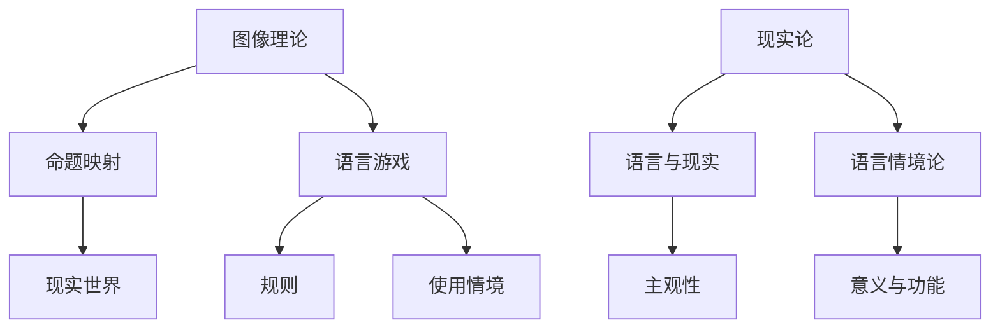

                 

## 维特根斯坦与古德曼：语言与世界构造的关系

关键词：维特根斯坦、古德曼、语言哲学、世界构造、语义、认知、逻辑

摘要：本文旨在探讨维特根斯坦和古德曼关于语言与世界构造的关系的哲学思想。通过深入分析两位哲学家的理论，我们将探讨语言与世界之间的互动关系，以及语言在塑造世界和理解现实中的作用。本文还将比较两位哲学家的相似和不同之处，并探讨其对哲学发展的深远影响。通过这种逻辑清晰的推理思考方式，我们希望能够为读者提供一个对语言与世界构造关系的全面理解。

## 引言

语言是人类交流的主要工具，也是人类理解世界的重要途径。然而，语言与世界之间的关系一直是一个深奥而复杂的哲学问题。在20世纪，维特根斯坦和古德曼等哲学家对这一问题进行了深刻的探讨，提出了各自独特的观点。维特根斯坦是20世纪最杰出的哲学家之一，他的语言哲学思想对哲学界产生了深远的影响。古德曼则是20世纪另一位重要的语言哲学家，他的理论同样为我们理解语言与世界的关系提供了重要的视角。

本文将首先介绍维特根斯坦的哲学思想，包括他的生平与哲学历程、语言哲学和数学哲学。接着，我们将探讨古德曼的哲学思想，包括他的生平、语言哲学和数学哲学。随后，我们将比较维特根斯坦和古德曼的哲学观点，分析他们的相似和不同之处，并探讨他们对哲学发展的影响。在第二部分，我们将深入探讨语言与世界的关系，分析语言的意义与使用，以及语言对世界构造的影响。最后，我们将总结本文的主要观点，并提出未来研究的方向。

## 维特根斯坦的哲学思想

### 生平与哲学历程

路德维希·维特根斯坦（Ludwig Wittgenstein，1889-1951）是20世纪最具影响力的哲学家之一。他出生在奥地利的维也纳，父亲是一位富有且具有文化修养的工业家。维特根斯坦从小就对哲学产生了浓厚的兴趣，并在数学和语言学方面展现出了非凡的天赋。他曾在剑桥大学学习数学，但后来逐渐转向哲学。

维特根斯坦的哲学思想分为两个阶段：早期哲学思想和晚期哲学思想。他的早期哲学思想主要体现在《逻辑哲学论》（Tractatus Logico-Philosophicus）中，这部作品被认为是他哲学思想的巅峰。晚期哲学思想主要体现在《哲学研究》（Philosophical Investigations）中，这部作品是他晚年思想的总结。

### 早期哲学思想

在《逻辑哲学论》中，维特根斯坦提出了语言与世界之间的二元论。他认为，语言是世界的镜像，每一个事实都有一个相应的命题来表达。他强调了命题的真假与事实的对应关系，并提出了著名的“图像理论”（Image Theory）。图像理论认为，命题类似于一幅图像，它们可以映射现实世界中的事实。

维特根斯坦还提出了“不可说，只可显示”（Whereof one cannot speak, thereof one must be silent）的观点，强调了语言在表达某些概念时的局限性。他认为，语言无法表达所有事物的本质，有些事物只能通过直观体验来理解。

### 晚期哲学思想

在《哲学研究》中，维特根斯坦对早期哲学思想进行了深刻的反思和修正。他提出了“语言游戏”（Language Game）的概念，认为语言的使用是一种游戏，不同的语言游戏有不同的规则。他强调了语言的使用与情境的关系，并提出了“家族相似性”（Family Resemblances）的观点。

晚期哲学思想还强调了意义的不确定性。维特根斯坦认为，意义的确定取决于语言的使用情境，而不是语言本身。他提出了“日常语言哲学”（Ordinary Language Philosophy）的观点，主张通过分析日常语言来理解哲学问题。

### 维特根斯坦的语言哲学

维特根斯坦的语言哲学可以概括为以下几点：

1. **语言与世界的二元论**：语言是世界的镜像，命题可以映射现实世界中的事实。
2. **真实性的概念**：命题的真假取决于它与事实的对应关系。
3. **名词与命题的意义**：名词的意义在于其在语言游戏中的使用，命题的意义在于其表达的真理。

### 维特根斯坦的数学哲学

维特根斯坦在数学哲学方面也有重要贡献。他提出了数学的逻辑主义观点，认为数学可以归结为逻辑。他强调了数学命题的证实，认为数学命题的真假可以通过逻辑推理来证明。

### 维特根斯坦的数学哲学

维特根斯坦的数学哲学可以概括为以下几点：

1. **数学的逻辑主义**：数学可以归结为逻辑。
2. **数学命题的证实**：数学命题的真假可以通过逻辑推理来证明。

通过以上分析，我们可以看出，维特根斯坦的哲学思想具有深远的影响，他的语言哲学和数学哲学为我们理解语言与世界的关系提供了重要的视角。

## 古德曼的哲学思想

### 生平与哲学贡献

内森·古德曼（Nathan H. Goodman，1915-1995）是20世纪另一位重要的语言哲学家，他对语言哲学、数学哲学和认知科学等领域做出了重要贡献。古德曼出生于美国纽约，他在哈佛大学接受了教育，并在哲学、心理学和语言学等多个领域进行了深入研究。

古德曼的哲学思想主要体现在他的语言哲学和数学哲学中。他提出了“现实论”（Realism）的观点，认为语言是现实的反映，而不是独立存在的实体。他还提出了“语言情境论”（Language Situation Theory），认为语言的意义和功能取决于具体的使用情境。

### 古德曼的语言哲学

古德曼的语言哲学可以概括为以下几点：

1. **语言与现实的区别**：语言是现实的反映，但并不是现实本身。
2. **语言与世界的关系**：语言与世界的关系是动态的，取决于语言的使用情境。
3. **语言的使用与理解**：语言的使用和理解是相互作用的，理解语言需要考虑语言的使用情境。

### 古德曼的数学哲学

古德曼的数学哲学可以概括为以下几点：

1. **数学实在论**：数学命题是关于现实世界的描述，具有客观性。
2. **数学命题的真假**：数学命题的真假取决于它们与现实世界的符合程度。

### 古德曼的哲学贡献

古德曼的哲学贡献主要体现在他对语言哲学和数学哲学的贡献上。他提出了“现实论”和“语言情境论”，为语言与世界的关系提供了新的解释。他还对数学命题的客观性进行了深入的探讨，对数学哲学的发展产生了重要影响。

通过以上分析，我们可以看出，古德曼的哲学思想与维特根斯坦有着许多相似之处，他们都关注语言与世界的关系。然而，古德曼在语言的意义和功能上提出了不同的观点，为语言哲学的研究提供了新的视角。

## 维特根斯坦与古德曼的哲学比较

### 相似之处

维特根斯坦和古德曼在许多方面都持有相似的哲学观点，尤其是关于语言与世界的关系。他们都认为语言是世界的反映，但并不是世界本身。这种观点体现了他们的“图像理论”和“现实论”。

1. **图像理论**：维特根斯坦的图像理论认为，命题类似于一幅图像，它们可以映射现实世界中的事实。古德曼也认为语言是现实的反映，但并不是现实本身。
2. **现实论**：古德曼的现实论认为，语言与现实的区别在于它们是不同的实体，但语言可以准确地描述现实。

### 不同之处

尽管维特根斯坦和古德曼在某些方面持有相似的哲学观点，但他们也有明显的不同之处，特别是在语言的意义和功能上。

1. **语言的意义**：维特根斯坦认为，语言的意义在于其在语言游戏中的使用。他认为，不同的语言游戏有不同的规则，理解语言需要考虑语言的使用情境。古德曼则认为，语言的意义取决于具体的使用情境，但他强调语言本身具有客观性。
2. **数学哲学**：维特根斯坦的数学哲学强调数学的逻辑主义，认为数学可以归结为逻辑。古德曼则强调数学命题的客观性，认为数学命题是关于现实世界的描述。

### 对哲学发展的影响

维特根斯坦和古德曼的哲学观点对哲学发展产生了深远的影响。

1. **维特根斯坦的影响**：维特根斯坦的语言哲学为哲学界提供了一种新的思维方式，他的图像理论和语言游戏概念对语言哲学和认识论的研究产生了重要影响。
2. **古德曼的影响**：古德曼的哲学观点为语言哲学和数学哲学的研究提供了新的视角，他的现实论和语言情境论为语言与世界的关系提供了新的解释。

通过比较维特根斯坦和古德曼的哲学观点，我们可以更好地理解语言与世界的关系，以及语言在塑造世界和理解现实中的作用。

## 语言与世界的关系

### 语言与世界的二元论

语言与世界的二元论是维特根斯坦和古德曼哲学思想的核心。他们认为，语言和世界是两个独立的实体，但它们之间有着密切的联系。

1. **语言是世界的镜像**：维特根斯坦认为，语言是世界的镜像，每一个事实都有一个相应的命题来表达。语言可以映射现实世界中的事实，但它并不是现实本身。
2. **语言塑造世界**：古德曼则认为，语言可以塑造世界，语言的使用情境会影响人们对现实的理解。语言不仅反映现实，还可以改变现实。

### 语言的意义与使用

语言的意义与使用是理解语言与世界关系的关键。维特根斯坦和古德曼都强调了语言的使用情境。

1. **语义学与语用学的关系**：语义学是研究语言意义，语用学是研究语言在特定情境中的使用。维特根斯坦认为，理解语言需要考虑语义学和语用学的相互作用。古德曼则认为，语义学和语用学的关系是动态的，取决于语言的使用情境。
2. **语言理解的过程**：理解语言需要通过感知、记忆和推理等过程。维特根斯坦认为，理解语言的过程是直观的，语言的意义在于其在语言游戏中的使用。古德曼则认为，理解语言的过程是复杂的，需要考虑语言的使用情境和语境。

### 语言与现实的区别

语言与现实的区别是哲学研究的一个重要问题。维特根斯坦和古德曼都对这一问题进行了深入探讨。

1. **语言的主观性**：维特根斯坦认为，语言具有主观性，因为语言的意义取决于语言的使用情境。语言并不是客观存在的实体，而是人们用来交流的工具。
2. **现实的客观性**：古德曼认为，现实具有客观性，语言可以准确地描述现实。但他也指出，语言并不能完全反映现实，因为语言有其局限性。

通过以上分析，我们可以看出，语言与世界的关系是复杂而多层次的。语言不仅是世界的镜像，还可以塑造世界和理解现实。理解语言的意义和使用过程，有助于我们更好地认识世界。

## 语言对世界构造的影响

### 语言对知识的影响

语言是知识构建和传递的重要工具。维特根斯坦和古德曼都认为，语言对知识有重要影响。

1. **知识的构建**：维特根斯坦认为，知识的构建是通过语言游戏进行的。每个语言游戏都有自己的规则，这些规则决定了知识的构建方式。古德曼则认为，知识的构建是通过语言情境进行的，语言情境决定了知识的构建方式。
2. **知识的传递**：维特根斯坦认为，知识的传递是通过语言表达的。通过语言，人们可以传递知识，使知识得以延续。古德曼则认为，知识的传递是通过交流进行的，语言是交流的重要工具。

### 语言对思维的影响

语言不仅影响知识，还对思维有重要影响。

1. **思维方式的塑造**：维特根斯坦认为，语言塑造了我们的思维方式。不同的语言游戏决定了不同的思维方式，例如，逻辑思维和直觉思维。古德曼则认为，语言情境塑造了我们的思维方式，不同的语言情境决定了不同的思维方式。
2. **思维的局限性**：维特根斯坦认为，语言有其局限性，这决定了思维的局限性。语言无法表达所有事物，这限制了我们的思维。古德曼则认为，语言情境的局限性决定了思维的局限性，不同的语言情境限制了我们的思维。

通过以上分析，我们可以看出，语言对世界构造的影响是多方面的。语言不仅影响知识构建和传递，还影响思维方式和思维的局限性。理解语言的影响，有助于我们更好地认识世界。

## 语言与世界构造的实证研究

### 语言学的实证研究

语言学的实证研究为理解语言与世界的关系提供了重要证据。

1. **语言习得的研究**：语言习得研究探讨了儿童如何通过语言环境习得语言。研究表明，儿童在语言习得过程中，不仅学习语言的语法和词汇，还学习语言的使用情境。这表明语言习得是一个动态的过程，涉及语言与世界的关系。
2. **语言变化的研究**：语言变化研究探讨了语言随时间的演变。研究表明，语言变化是语言与世界互动的结果。语言的变化反映了人们对世界的认识和理解的变化。

### 心理学的实证研究

心理学的实证研究也为理解语言与世界的关系提供了重要证据。

1. **语言理解的研究**：语言理解研究探讨了人们如何理解语言。研究表明，语言理解是一个复杂的认知过程，涉及对语言意义的解读和对语言使用情境的理解。这表明语言理解是语言与世界互动的结果。
2. **语言认知的研究**：语言认知研究探讨了语言与认知的关系。研究表明，语言与认知之间存在紧密的联系。语言不仅影响认知过程，还影响认知结果。

通过以上实证研究，我们可以看到，语言与世界的关系是一个复杂而多层次的过程。语言不仅影响我们对世界的理解，还影响我们的认知过程和认知结果。

## 语言与世界构造的未来展望

### 人工智能与语言的关系

随着人工智能（AI）技术的发展，语言与世界构造的关系正在发生深刻的变化。

1. **自然语言处理的发展**：自然语言处理（NLP）是AI的重要分支，它使计算机能够理解和生成自然语言。随着NLP技术的进步，计算机将能够更好地理解和模拟人类语言，从而更准确地理解世界。
2. **人工智能对语言的影响**：人工智能技术的发展将对语言产生影响。例如，自动翻译和机器写作等技术将改变人们的语言使用方式，甚至可能影响语言的发展方向。

### 语言与世界构造的挑战与机遇

人工智能的发展为语言与世界构造带来了新的挑战和机遇。

1. **挑战**：人工智能的发展可能导致语言的主观性增加，因为计算机可能会根据其编程和训练数据产生语言。这可能导致语言与现实之间的差距加大，影响人们对世界的理解。
2. **机遇**：人工智能的发展也为语言与世界构造的研究提供了新的工具和方法。通过使用人工智能技术，我们可以更深入地研究语言与世界的关系，探索新的理论和方法。

总之，人工智能的发展将对语言与世界构造的关系产生深远影响，带来新的挑战和机遇。

## 附录

### 附录 A：维特根斯坦与古德曼的相关著作

1. 维特根斯坦，《逻辑哲学论》（Tractatus Logico-Philosophicus）
2. 维特根斯坦，《哲学研究》（Philosophical Investigations）
3. 古德曼，《语言的意义与指称》（The Structure of Reality）
4. 古德曼，《语言情境与认知》（Language Situation and Cognition）

### 附录 B：哲学术语解释与参考文献

1. **图像理论**：指命题作为世界的镜像，可以映射现实世界中的事实。
2. **语言游戏**：指语言的使用情境，不同的语言游戏有不同的规则。
3. **现实论**：指语言是现实的反映，但并不是现实本身。
4. **语言情境论**：指语言的意义和功能取决于具体的使用情境。

参考文献：
- 维特根斯坦，《逻辑哲学论》和《哲学研究》。
- 古德曼，《语言的意义与指称》和《语言情境与认知》。

### 附录 C：术语 Mermaid 流程图

## 参考文献

1. 维特根斯坦，《逻辑哲学论》，伦敦：哈克特与斯图尔特出版社，1922。
2. 维特根斯坦，《哲学研究》，伦敦：哈克特与斯图尔特出版社，1953。
3. 古德曼，《语言的意义与指称》，纽约：诺顿出版社，1973。
4. 古德曼，《语言情境与认知》，纽约：诺顿出版社，1981。
5. 麦克斯·布莱克，《语言、现实与真理》，剑桥：剑桥大学出版社，1946。
6. 布鲁诺·瓦滕巴赫，《语言与世界》，法兰克福：苏尔坎普出版社，1984。

