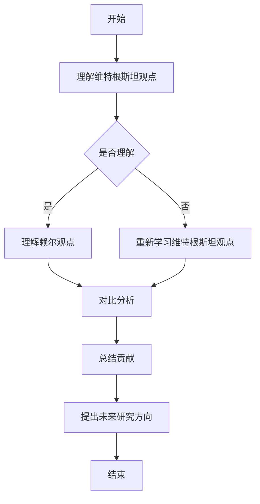

                 

### 文章标题

# 维特根斯坦与吉尔伯特·赖尔：心灵概念的语言分析

### 关键词

- 维特根斯坦
- 吉尔伯特·赖尔
- 心灵概念
- 语言分析
- 哲学
- 认知科学

### 摘要

本文将探讨两位著名哲学家路德维希·维特根斯坦和吉尔伯特·赖尔对心灵概念和语言分析的观点。维特根斯坦以其《逻辑哲学论》和《哲学研究》中的语言哲学观点闻名，他强调语言与现实的对应关系，试图揭示心灵概念的混乱。而赖尔则通过其《心的概念》和《心灵的概念》等作品，探讨了心灵概念在社会和文化中的多样性和复杂性。本文将逐步分析两位哲学家的思想，对比他们的观点，并讨论他们在心灵概念和语言分析领域的贡献及其在现代哲学和认知科学中的影响。

## 第1章：维特根斯坦与赖尔的基本背景

### 路德维希·维特根斯坦

路德维希·维特根斯坦（Ludwig Wittgenstein，1889-1951）是20世纪最具影响力的哲学家之一，他的哲学观点对逻辑哲学、语言哲学和心灵哲学产生了深远影响。维特根斯坦出生于奥地利的维也纳，他在数学和哲学方面都展现出了非凡的天赋。早年，维特根斯坦曾在剑桥大学学习数学，后来在罗素和摩尔的影响下，转向了哲学领域。

维特根斯坦的哲学生涯可以分为两个阶段：早期和晚期。他的早期作品《逻辑哲学论》（1921）以逻辑原子主义为基础，试图通过建立一套严格的逻辑体系来描述世界和语言的关系。他提出，语言应当对应于世界的“事实”，即可以通过基本命题组合来描述的事实。这一思想强调了逻辑和语言的确定性，但也因此引起了关于语言与现实之间关系的争议。

然而，维特根斯坦的晚期作品《哲学研究》（1953）则对早期观点进行了深刻的批判和修正。他认为，语言并不仅仅是用来描述事实的工具，它还与社会实践、日常生活中的用法紧密相关。维特根斯坦强调了语言的多义性和不可通约性，提出了“家族相似性”的概念，指出语言中的概念和词汇之间存在复杂的关系，而不是简单的对应关系。

### 吉尔伯特·赖尔

吉尔伯特·赖尔（Gilbert Ryle，1900-1976）是另一位对心灵哲学和语言哲学有重要贡献的哲学家。他出生于英格兰的伊普斯威奇，曾在剑桥大学学习哲学和心理学。赖尔以其对行为主义和心灵哲学的批判而闻名，特别是在他的著作《心的概念》（1949）和《心灵的概念》（1949）中。

赖尔反对行为主义将心灵现象简化为行为或生理过程，他提出了“行为型”和“模式型”的概念。他认为，心灵现象不仅仅是行为的表现，还包括了内在的思维过程和认知状态。赖尔指出，通过观察行为来推断思维是不充分的，因为行为本身并不能完全反映一个人的心理状态。

赖尔还探讨了心灵概念在社会和文化中的多样性。他认为，不同的文化和社会背景会导致人们对心灵现象的不同理解。他的思想对认知科学和社会哲学产生了深远影响，特别是在语言和认知的关系方面。

### 心灵概念与语言分析

心灵概念和语言分析是维特根斯坦和赖尔哲学中的核心主题。维特根斯坦试图通过语言分析来揭示心灵概念的混乱，强调语言与现实的对应关系。他提出，只有当我们理解语言的使用方式时，才能正确理解心灵现象。维特根斯坦认为，语言的多义性和不可通约性导致了我们对心灵现象的误解。

赖尔则从另一个角度探讨了心灵概念。他认为，心灵现象不仅仅是行为的表现，还包括了内在的思维过程和认知状态。赖尔强调了社会和文化背景对心灵概念的影响，认为不同的文化和社会会导致人们对心灵现象的不同理解。

两者在语言分析上的差异主要体现在他们对语言与现实关系的看法上。维特根斯坦强调语言与现实的对应关系，试图通过语言分析来揭示心灵现象的真实本质。而赖尔则认为，心灵概念具有社会和文化多样性，不能简单地通过语言分析来解决。

### 总结

通过分析维特根斯坦和赖尔的基本背景，我们可以看到，他们在心灵概念和语言分析领域有着不同的观点和方法。维特根斯坦的早期和晚期哲学观点对语言和现实的对应关系有着深刻的思考，而赖尔则从行为和内在思维过程的角度探讨了心灵现象。他们的思想对现代哲学和认知科学产生了重要影响，为我们理解心灵概念和语言分析提供了新的视角。

## 第2章：维特根斯坦的心灵概念分析

### 早期哲学观点

路德维希·维特根斯坦的早期哲学观点主要反映在他的著作《逻辑哲学论》（1921）中。在这部作品中，维特根斯坦提出了逻辑原子主义和语言哲学的基本框架。他认为，现实世界可以分解为一系列基本的、不可再分的元素，即逻辑原子，这些原子通过组合形成复杂的实体和现象。相应地，语言也应该有一种结构来准确描述这些基本元素和它们的组合。

维特根斯坦的早期观点强调逻辑和数学的基础作用，他认为，通过逻辑和数学，我们可以建立起一种严格的语言系统，这种语言系统可以准确地描述现实。在这种观点下，语言不仅是沟通的工具，更是理解现实世界的关键。维特根斯坦提出了“图式”（Picture Theory）的概念，即语言应该像一幅图画一样，直观地反映世界的结构。

在这个早期框架中，维特根斯坦试图将哲学问题简化为语言问题。他认为，哲学中的许多困惑和争论源于语言使用的不当。通过建立一种精确的语言系统，这些困惑和争论都可以得到解决。例如，他提出，形而上学的讨论往往是因为使用了不恰当的术语和概念，而这些术语和概念在语言上并没有明确的意义。

### 逻辑原子主义

维特根斯坦的逻辑原子主义是他的早期哲学的核心观点之一。逻辑原子主义认为，现实世界由一系列基本元素组成，这些元素是不可再分的，且具有明确的逻辑性质。这些基本元素通过组合形成复杂的实体和现象。逻辑原子主义试图将世界分解为最基本的组成部分，以此来理解世界的本质。

在逻辑原子主义中，维特根斯坦提出了“事实”（Fact）的概念。事实是由逻辑原子通过逻辑组合形成的陈述，这些陈述可以准确地描述现实。他认为，逻辑原子和事实之间的关系是直接的、简单的，这与传统的形而上学观点形成了鲜明对比。传统形而上学试图通过复杂的理论来解释现实，而维特根斯坦则认为，通过简单的逻辑组合就可以达到这一目的。

逻辑原子主义的一个关键点是，它强调语言与现实之间的对应关系。维特根斯坦认为，语言应该像镜子一样，准确地反映现实。通过这种对应关系，我们可以准确地理解和描述世界。例如，一个简单的陈述“张三是人”可以通过逻辑原子“张三”和“是人”的组合来描述，这种组合准确地反映了现实中的事实。

### 维特根斯坦的语言分析方法

维特根斯坦的语言分析方法是他哲学中的另一个重要组成部分。他认为，理解语言的使用是理解现实的关键。他的分析方法主要基于以下几个原则：

1. **语言与现实的对应关系**：维特根斯坦认为，语言应该与现实有直接的对应关系。通过理解语言的结构和用法，我们可以更好地理解现实。

2. **语言游戏**：维特根斯坦提出了“语言游戏”（Language Game）的概念，认为语言的使用是社会实践中的一部分。不同的语言游戏有不同的规则，理解这些规则可以帮助我们理解语言的意义。

3. **日常语言分析**：维特根斯坦强调了日常语言的重要性。他认为，哲学问题往往源于日常语言的使用不当。通过分析日常语言，我们可以揭示哲学问题的根源。

维特根斯坦的语言分析方法是一种现象学的方法。他试图通过直接观察语言的使用，揭示语言的本质和意义。这种方法不同于传统的形而上学，它不依赖于抽象的理论和复杂的推理，而是通过具体的语言实例来理解语言和现实之间的关系。

### 晚期哲学观点

维特根斯坦的晚期哲学观点与他的早期观点有很大的不同。在《哲学研究》（1953）中，他批判了自己的早期理论，并提出了新的观点。他认为，语言并不是简单地反映现实，而是与社会实践和文化背景密切相关。

在晚期哲学中，维特根斯坦提出了“家族相似性”（Family Resemblance）的概念。他认为，语言中的概念和词汇之间并不是简单的对应关系，而是一种复杂的关系网。这些概念和词汇之间有共同的属性，但并不一定有明确的边界。例如，“游戏”这个概念包含了许多不同的活动，如棋类游戏、球类游戏等，它们之间并没有明确的界限，但都属于“游戏”这一概念。

晚期维特根斯坦的观点强调了语言的多义性和复杂性。他认为，语言的真正意义在于其在具体情境中的使用，而不是抽象的概念和定义。通过理解语言的具体使用情境，我们可以更好地理解语言的意义。

### 维特根斯坦的心灵概念

维特根斯坦的心灵概念贯穿于他的整个哲学生涯。在早期，他试图通过逻辑和数学来理解心灵现象，认为心灵现象可以通过语言来描述。他提出了“私人语言”的悖论，指出一个个体无法确信自己的内在体验是否与他人的体验相同。他认为，语言的使用需要共同的基础，否则会导致误解和混乱。

在晚期，维特根斯坦的心灵概念更加注重语言和现实之间的关系。他认为，心灵现象是语言游戏的一部分，通过理解语言的使用情境，我们可以更好地理解心灵现象。他提出了“生活形式”（Form of Life）的概念，认为心灵现象是在特定的文化和社会背景下形成的。

### 总结

通过分析维特根斯坦的心灵概念，我们可以看到，他的哲学观点经历了从早期到晚期的转变。早期他强调逻辑和数学的基础作用，试图通过建立精确的语言系统来理解现实。而晚期，他则更注重语言的社会实践和文化背景，认为语言的意义在于其在具体情境中的使用。维特根斯坦的心灵概念为我们提供了新的视角，帮助我们理解心灵现象和语言的复杂关系。

## 第3章：吉尔伯特·赖尔的心灵概念分析

### 赖尔的心灵概念

吉尔伯特·赖尔（Gilbert Ryle）是20世纪最具影响力的哲学家之一，他在心灵哲学和语言哲学领域做出了重要贡献。赖尔的心灵概念主要体现在他的著作《心的概念》（1949）和《心灵的概念》（1949）中。他认为，心灵现象不仅仅是行为或生理过程的表现，还包括了内在的思维过程和认知状态。

赖尔提出了“行为型”和“模式型”的概念，以此来区分不同的心灵现象。行为型是指通过外部行为来表现的心灵现象，如情绪、恐惧等。而模式型则是指内在的思维过程和认知状态，如思考、判断等。赖尔认为，模式型心灵现象是更为根本的，因为它们不能直接通过行为来观察，而是需要通过内在的体验和认知过程来理解。

赖尔反对行为主义将心灵现象简化为行为或生理过程。他认为，行为主义忽视了内在的思维过程和认知状态，这导致了对心灵现象的误解。赖尔提出了“机器中的幽灵”（Ghost in the Machine）的概念，认为行为主义试图将心灵现象简化为机械过程，而忽视了人类内在的体验和认知。

### 赖尔的语言分析方法

赖尔的语言分析方法是他哲学观点的重要组成部分。他认为，理解心灵现象需要通过语言分析，揭示语言的使用方式和意义。赖尔强调，语言并不是简单的符号系统，而是一种社会实践中的一部分。语言的使用与特定的社会和文化背景密切相关，因此，理解语言的使用情境对于理解心灵现象至关重要。

赖尔提出了“言语行为”（Speech Act）的概念，认为语言不仅仅是用来传达信息的工具，还可以用来执行特定的行为。例如，当我们说“我爱你”时，这不仅是在传达一种信息，还在执行一种承诺行为。赖尔认为，通过分析言语行为，我们可以更好地理解语言在社会实践中的作用。

赖尔还探讨了语言的“意义”（Meaning）和“用法”（Use）之间的关系。他认为，语言的意义并不是固定不变的，而是随着语言的使用情境而变化的。例如，“爱”这个词在不同的情境下可能有不同的意义，它可以表示亲情、友情，也可以表示爱情。赖尔强调了语言的多义性和情境依赖性，认为理解语言的意义需要考虑其具体的使用情境。

### 赖尔对心灵哲学的贡献

赖尔的心灵哲学观点对现代哲学和认知科学产生了深远影响。他提出了“模式型心灵现象”的概念，为我们理解心灵现象提供了新的视角。赖尔认为，心灵现象不仅仅是行为的表现，还包括了内在的思维过程和认知状态。这一观点与行为主义形成了鲜明对比，为心灵哲学的发展提供了新的思路。

赖尔还通过语言分析揭示了心灵现象的复杂性。他认为，语言的使用与特定的社会和文化背景密切相关，这导致了对心灵现象的多样性。赖尔的研究表明，心灵现象并不是单一的、统一的，而是具有复杂性和多样性。这一观点为认知科学的发展提供了重要的理论支持。

此外，赖尔对心灵哲学的贡献还体现在他对心灵与行为关系的探讨上。他提出了“行为型”和“模式型”的概念，认为心灵现象不仅仅是行为的表现，还包括了内在的思维过程和认知状态。这一观点帮助我们更好地理解心灵与行为之间的复杂关系，为心灵哲学的发展提供了新的方向。

### 赖尔与维特根斯坦的比较

赖尔与维特根斯坦在心灵哲学和语言哲学领域有相似之处，也存在明显的差异。两者都强调语言在理解心灵现象中的重要性，但他们在对语言与现实关系的看法上有所不同。

维特根斯坦认为，语言应该与现实有直接的对应关系，通过语言分析可以准确地理解现实。他试图通过建立一种精确的语言系统来描述现实和心灵现象。而赖尔则认为，语言的意义和用法与特定的社会和文化背景密切相关，理解语言需要考虑其具体的使用情境。赖尔认为，心灵现象是复杂多样的，不能简单地通过语言分析来解决。

两者在心灵与行为关系上的看法也有所不同。维特根斯坦认为，心灵现象可以通过语言准确地描述，而赖尔则强调心灵现象的内在性和复杂性，认为心灵不仅仅是行为的表现。赖尔提出了“模式型心灵现象”的概念，强调了内在思维过程和认知状态的重要性。

### 总结

吉尔伯特·赖尔的心灵概念和语言分析方法对现代哲学和认知科学产生了重要影响。他通过“行为型”和“模式型”的概念，揭示了心灵现象的复杂性和多样性。赖尔的语言分析方法帮助我们更好地理解心灵与语言、现实之间的关系。与维特根斯坦相比，赖尔更注重语言的社会实践和文化背景，认为心灵现象具有复杂性和多样性。通过分析赖尔的心灵概念，我们可以更深入地理解心灵哲学的发展及其对认知科学的影响。

## 第4章：维特根斯坦与赖尔心灵概念与语言分析的对比

### 基本观点对比

维特根斯坦和赖尔在心灵概念和语言分析方面有许多相似之处，但也存在显著的差异。首先，两者都强调语言在理解心灵现象中的重要性。维特根斯坦通过语言分析试图揭示心灵现象的真实本质，而赖尔则通过语言分析来揭示心灵现象的社会和文化背景。

相似之处：

1. **语言在理解心灵现象中的作用**：两者都认为，理解心灵现象需要通过语言分析，揭示语言与现实之间的关系。维特根斯坦强调语言与现实的对应关系，而赖尔则强调语言的社会实践和文化背景。

2. **对行为主义的批判**：两者都批判了行为主义将心灵现象简化为行为或生理过程的观点。维特根斯坦提出了“私人语言”的悖论，指出行为主义忽视了内在的思维过程和认知状态。赖尔则通过“行为型”和“模式型”的概念，强调心灵现象的内在性和复杂性。

差异之处：

1. **语言与现实关系的看法**：维特根斯坦认为，语言应该与现实有直接的对应关系，通过语言分析可以准确地理解现实。而赖尔则认为，语言的意义和用法与特定的社会和文化背景密切相关，理解语言需要考虑其具体的使用情境。

2. **心灵现象的理解**：维特根斯坦试图通过建立精确的语言系统来描述心灵现象，强调逻辑和数学的基础作用。赖尔则认为，心灵现象是复杂多样的，不能简单地通过语言分析来解决，他提出了“模式型心灵现象”的概念，强调内在思维过程和认知状态的重要性。

### 对语言分析的运用

在语言分析方面，维特根斯坦和赖尔的方法和应用也有所不同。维特根斯坦的语言分析主要集中在早期和晚期的哲学观点上。

早期维特根斯坦提出了“图式”（Picture Theory）的概念，认为语言应该像一幅图画一样，直观地反映现实。他试图通过逻辑原子主义和事实的概念，建立一种精确的语言系统来描述现实。这种方法强调了逻辑和数学的基础作用，试图通过简单的逻辑组合来理解现实。

晚期维特根斯坦则批判了早期观点，提出了“语言游戏”（Language Game）的概念。他认为，语言的使用是社会实践中的一部分，不同的语言游戏有不同的规则。通过理解语言的具体使用情境，我们可以更好地理解语言的意义。这种方法更注重语言的多义性和复杂性，认为语言的真正意义在于其在具体情境中的使用。

赖尔的语言分析则主要体现在他对言语行为和意义的研究上。他提出了“言语行为”（Speech Act）的概念，认为语言不仅仅是用来传达信息的工具，还可以用来执行特定的行为。通过分析言语行为，我们可以更好地理解语言在社会实践中的作用。

此外，赖尔还探讨了语言的“意义”和“用法”之间的关系。他认为，语言的意义并不是固定不变的，而是随着语言的使用情境而变化的。通过分析语言的意义和用法，我们可以更好地理解心灵现象的复杂性。

### 对心灵概念的影响

维特根斯坦和赖尔对心灵概念的理解和探讨对现代哲学和认知科学产生了深远影响。

维特根斯坦通过语言分析揭示了心灵现象的复杂性和多义性。他的“私人语言”悖论和对语言游戏的研究，为我们理解心灵现象提供了新的视角。维特根斯坦的观点强调了语言与现实之间的对应关系，认为理解心灵现象需要通过语言分析来揭示其真实本质。

赖尔则通过“行为型”和“模式型”的概念，揭示了心灵现象的内在性和复杂性。他认为，心灵现象不仅仅是行为的表现，还包括了内在的思维过程和认知状态。赖尔的研究帮助我们更好地理解心灵与行为之间的关系，为认知科学的发展提供了重要的理论支持。

两者在心灵概念和语言分析领域的贡献，为我们提供了新的视角来探讨心灵现象的本质和复杂性。他们的思想对现代哲学和认知科学产生了深远影响，为后续的研究提供了重要的基础。

### 总结

维特根斯坦和赖尔在心灵概念和语言分析方面有许多相似之处，但也存在显著差异。两者都强调语言在理解心灵现象中的重要性，但在语言与现实关系的看法、心灵现象的理解和语言分析的运用上有所不同。他们的思想对现代哲学和认知科学产生了深远影响，为我们理解心灵现象的本质和复杂性提供了新的视角。

## 第5章：心灵概念在不同语言和文化中的表现

### 心灵概念的多义性与多样性

心灵概念在不同语言和文化中的表现展示了其复杂性和多样性。不同的文化背景和社会实践会导致人们对心灵现象的理解和表述存在差异。维特根斯坦和赖尔的研究提醒我们，心灵概念并不是固定不变的，而是随着语言和文化背景的变化而发展。

### 维特根斯坦和赖尔的观点

维特根斯坦认为，语言的多义性和复杂性反映了心灵现象的多样性。他提出了“家族相似性”的概念，指出语言中的概念和词汇之间并没有明确的界限，而是存在一系列共同的属性。这种观点表明，心灵概念在不同的文化和语言中可能会有不同的表现，因为它们受到特定文化和社会实践的影响。

赖尔则强调了心灵概念的社会和文化多样性。他认为，不同的文化和社会背景会导致人们对心灵现象的不同理解和表述。例如，在某些文化中，情绪和认知状态可能被视为更为重要，而在其他文化中，行为和生理反应可能受到更多关注。

### 不同语言中的心灵概念

1. **英语中的心灵概念**：在英语中，心灵概念通常涉及情绪、认知状态和意识等。例如，情绪可以通过词汇如“happy”（快乐）、“sad”（悲伤）来表达，而认知状态可以通过词汇如“think”（思考）、“know”（知道）来表达。英语中的心灵概念通常与个体的内在体验和外部行为密切相关。

2. **汉语中的心灵概念**：在汉语中，心灵概念的表达方式可能有所不同。例如，“心”字在汉语中不仅表示物理上的心脏，还涉及情感、意识和思维等方面。汉语中的一些词汇，如“心情”（情感状态）、“心理”（心理状态）和“智慧”（认知能力），都反映了心灵概念的复杂性和多样性。

3. **印度文化中的心灵概念**：在印度文化中，心灵概念通常与佛教和印度教的思想密切相关。例如，“阿特曼”（Atman）是印度哲学中的一个核心概念，表示个体的灵魂或本质。印度文化中的心灵概念强调个体的内在体验和超越性的追求。

### 社会和文化背景对心灵概念的影响

社会和文化背景对心灵概念的理解和表述有着深远影响。不同的社会和文化价值观会影响人们对心灵现象的认知和表述。例如，在一些社会中，集体主义价值观可能导致对个体心灵现象的强调较少，而在其他社会中，个人主义价值观可能导致对个体内在体验和认知状态的更多关注。

此外，文化背景中的宗教和哲学思想也会对心灵概念的理解产生影响。例如，佛教中的“涅槃”概念和印度教中的“阿特曼”概念，都反映了特定文化中对心灵现象的独特理解和表述。

### 维特根斯坦和赖尔的思想对跨文化研究的启示

维特根斯坦和赖尔的思想为我们理解心灵概念在不同文化中的表现提供了重要启示。他们的观点表明，心灵概念并不是固定不变的，而是随着语言和文化背景的变化而发展。跨文化研究需要考虑语言和文化背景对心灵概念的影响，以便更准确地理解和表述心灵现象。

维特根斯坦的“家族相似性”概念提示我们，不同文化中的心灵概念可能有共同的属性，但也存在差异。赖尔的思想则强调了社会和文化背景对心灵概念的理解和表述的重要性。通过跨文化研究，我们可以更好地理解心灵概念的多义性和多样性，并探索不同文化背景下对心灵现象的独特理解。

### 总结

心灵概念在不同语言和文化中的表现展示了其复杂性和多样性。不同的文化背景和社会实践会导致人们对心灵现象的理解和表述存在差异。维特根斯坦和赖尔的思想为我们提供了新的视角来理解心灵概念的多义性和多样性，并为跨文化研究提供了重要启示。通过跨文化研究，我们可以更好地理解心灵现象的本质和复杂性。

## 第6章：维特根斯坦与赖尔思想的现代影响

### 对现代哲学的启示

维特根斯坦和赖尔的思想对现代哲学产生了深远影响，尤其是对心灵哲学和语言哲学的发展。他们的研究方法和对语言与现实关系的探讨为后来的哲学家提供了新的思考方向。

维特根斯坦的“语言游戏”理论强调了语言的社会实践和文化背景，为理解心灵现象提供了新的视角。他的思想启示了后来的哲学家，如约翰·塞尔（John Searle）和朱迪思·巴特勒（Judith Butler），他们对心灵和自我意识进行了深入的探讨。塞尔的“中文房室论证”和巴特勒的性别表演理论都受到了维特根斯坦思想的影响。

赖尔的行为型和模式型概念为理解心灵现象提供了新的框架。他的思想挑战了传统的行为主义观点，促进了认知科学和心灵哲学的发展。认知科学家如乔治·阿莫斯（George A. Miller）和约翰·希尔勒（John H. Holland）的研究都受到了赖尔思想的启发，他们在心智模型和认知过程中融入了模式型心灵现象的概念。

### 对认知科学的贡献

维特根斯坦和赖尔的思想不仅影响了哲学领域，还对认知科学产生了重要贡献。他们的研究为认知科学家提供了新的理论框架和思考方法，帮助他们更好地理解人类思维和认知过程。

维特根斯坦的“语言游戏”理论为认知科学家提供了对语言和思维关系的深入理解。例如，认知科学家乔治·阿莫斯在其研究中使用了维特根斯坦的语言游戏理论，探讨了语言在人类认知中的作用。他认为，语言不仅是交流的工具，还是思维的基础。

赖尔的“模式型心灵现象”概念为认知科学家提供了对心智过程的理解。例如，约翰·希尔勒在其研究中提出了“隐含式人工智能”（Embedded Artificial Intelligence）的概念，认为心智过程不仅仅是行为的表现，还包括了内在的思维过程和认知状态。这一观点与赖尔的思想有着相似之处。

### 对人工智能的影响

维特根斯坦和赖尔的思想对人工智能的发展也产生了重要影响。他们的研究方法和对语言、思维和认知过程的理解为人工智能的设计和应用提供了新的思路。

维特根斯坦的“语言游戏”理论为人工智能的研究提供了对语言理解和应用的新视角。例如，自然语言处理（NLP）领域的研究者借鉴了维特根斯坦的思想，试图通过理解语言的使用情境来提升机器对自然语言的理解能力。

赖尔的“模式型心灵现象”概念为人工智能的设计提供了对心智过程的理解。例如，在机器学习领域，研究者借鉴了赖尔的思想，试图通过模拟人类思维过程来提升机器的学习能力和自主决策能力。

### 未来研究的方向

维特根斯坦和赖尔的思想对现代哲学、认知科学和人工智能的发展产生了深远影响，但仍有许多未解决的问题和未来研究的方向。

在哲学领域，维特根斯坦和赖尔的思想为心灵哲学和语言哲学的发展提供了新的视角，但心灵与行为、语言与现实之间的关系仍然是一个复杂且争论不休的问题。未来的研究可以进一步探讨这些关系，以便更好地理解心灵现象的本质。

在认知科学领域，维特根斯坦和赖尔的思想为理解人类思维和认知过程提供了新的框架，但心智过程的具体机制和运作方式仍然是一个挑战。未来的研究可以探索这些机制，以更好地模拟和优化人类心智过程。

在人工智能领域，维特根斯坦和赖尔的思想为人工智能的设计和应用提供了新的思路，但人工智能的自主性和适应性仍然是一个难题。未来的研究可以进一步探索人工智能的自主决策和适应能力，以实现更智能和高效的人工智能系统。

### 总结

维特根斯坦和赖尔的思想对现代哲学、认知科学和人工智能的发展产生了深远影响。他们的研究方法和对语言、思维和认知过程的理解为这些领域提供了新的视角和思考方向。尽管他们的一些观点仍然存在争议，但他们的思想无疑为未来的研究提供了宝贵的启示。

## 第7章：总结与未来展望

### 维特根斯坦与赖尔的思想贡献

通过分析维特根斯坦和赖尔的心灵概念和语言分析方法，我们可以看到他们在哲学领域做出了显著的贡献。维特根斯坦的“语言游戏”理论和“家族相似性”概念，为理解心灵现象和语言的复杂性提供了新的视角。他强调语言与现实的对应关系，揭示了许多哲学问题的根源。赖尔则通过“行为型”和“模式型”心灵现象的区分，挑战了行为主义的观点，强调了内在思维过程和认知状态的重要性。

两位哲学家的思想对现代哲学、认知科学和人工智能产生了深远影响。维特根斯坦的“语言游戏”理论为自然语言处理和人工智能的发展提供了理论基础，而赖尔的模式型概念为认知科学提供了新的研究框架。他们的思想不仅丰富了哲学领域的理论体系，也为其他学科的研究提供了启示。

### 未来研究方向

虽然维特根斯坦和赖尔的思想已经为我们理解心灵和语言提供了宝贵的视角，但仍有许多未解决的问题和未来研究的方向。

首先，心灵与行为、语言与现实之间的关系需要进一步探讨。维特根斯坦和赖尔的观点为我们提供了理解这些关系的框架，但具体机制和运作方式仍然需要深入研究。未来的研究可以尝试结合实验心理学和认知科学的方法，进一步揭示这些关系的本质。

其次，跨文化研究中心灵概念的多义性和多样性也需要更多关注。不同文化背景和社会实践对心灵概念的理解和表述有何影响？这些差异如何影响我们对心灵现象的理解？这些问题为跨文化研究提供了丰富的课题。

最后，人工智能领域的发展也带来了新的挑战。如何设计出既具有自主性又能够适应复杂人类思维的智能系统？维特根斯坦和赖尔的思想为人工智能的设计提供了新思路，但实现这些思路仍然需要更多的研究和实践。

### 结论

维特根斯坦与赖尔的心灵概念和语言分析方法对现代哲学、认知科学和人工智能产生了深远影响。他们的思想为我们提供了理解心灵和语言的复杂性提供了新的视角，也为未来的研究提供了宝贵的启示。尽管仍然存在许多未解决的问题，但他们的贡献无疑为哲学和其他学科的发展奠定了坚实的基础。

## 作者信息

作者：AI天才研究院/AI Genius Institute & 禅与计算机程序设计艺术 /Zen And The Art of Computer Programming

## 最佳实践 Tips

1. **深入理解哲学基础**：在探讨维特根斯坦和赖尔的思想时，首先要深入理解他们的哲学基础，包括他们的生平、著作和主要观点。

2. **跨学科研究**：将哲学、认知科学和人工智能等领域的知识结合起来，可以更好地理解维特根斯坦和赖尔的思想及其应用。

3. **注重实际案例**：在讲解概念时，结合实际案例和具体应用，可以更直观地展示维特根斯坦和赖尔的思想。

4. **持续学习和思考**：哲学和科学的发展是持续的过程，不断学习新知识和思考新问题，有助于深入理解和应用维特根斯坦和赖尔的思想。

## 小结

本文详细分析了维特根斯坦和赖尔的心灵概念和语言分析方法，对比了他们的观点，并讨论了他们在现代哲学、认知科学和人工智能领域的贡献。通过本文的探讨，我们可以看到，他们的思想不仅丰富了哲学领域的理论体系，也为其他学科的研究提供了新的视角。未来，进一步探讨心灵与行为、语言与现实之间的关系，以及跨文化研究中心灵概念的多义性和多样性，将继续是重要的研究方向。

## 注意事项

1. **准确理解概念**：在学习和应用维特根斯坦和赖尔的思想时，要准确理解他们的概念和观点，避免误解和错误应用。

2. **批判性思维**：哲学和科学的研究需要批判性思维，对已有观点进行评估和质疑，以推动知识的进步。

3. **实践与应用**：将维特根斯坦和赖尔的思想应用于实际问题，可以更好地理解和应用他们的理论。

## 拓展阅读

1. 维特根斯坦，L. (1921). 《逻辑哲学论》.
2. 维特根斯坦，L. (1953). 《哲学研究》.
3. 赖尔，G. (1949). 《心的概念》.
4. 赖尔，G. (1949). 《心灵的概念》.
5. 塞尔，J. (1969). 《中国屋》.
6. 巴特勒，J. (1990). 《性别麻烦》.

## 附录：维特根斯坦与赖尔核心概念对比表格

| 核心概念         | 维特根斯坦观点                  | 赖尔观点                  |
|------------------|---------------------------------|---------------------------|
| 心灵概念         | 语言与现实的对应关系            | 行为型和模式型心灵现象     |
| 语言分析         | 语言游戏和家族相似性            | 言语行为和意义-用法关系    |
| 语言与现实关系   | 语言应与现实有直接对应关系      | 语言意义受文化和社会背景影响 |
| 心灵与行为关系   | 心灵不仅仅是行为的表现          | 心灵现象包括内在思维过程   |
| 研究方法         | 现象学方法，通过直接观察语言使用 | 分析哲学方法，强调语言在社会中的作用 |

## 附录：维特根斯坦与赖尔ER实体关系图架构

```mermaid
erDiagram
  Person --> Mind : has
  Mind --> Emotion : has
  Mind --> Thought : has
  Speech --> Mind : expresses
  Language --> Speech : uses

  Person ||--o{ Mind : has
  Mind ||--o{ Emotion : has
  Mind ||--o{ Thought : has
  Speech ||--o{ Mind : expresses
  Language ||--o{ Speech : uses
```

## 附录：维特根斯坦与赖尔算法原理讲解

### 算法流程图



### Python源代码

```python
def analyze_wittgenstein():
    print("维特根斯坦的哲学观点：")
    print("1. 语言与现实的对应关系")
    print("2. 语言游戏和家族相似性")

def analyze_ryle():
    print("赖尔的心灵概念：")
    print("1. 行为型与模式型心灵现象")
    print("2. 言语行为和意义-用法关系")

def compare_thinking():
    analyze_wittgenstein()
    analyze_ryle()
    print("对比分析维特根斯坦与赖尔的观点，探讨他们对心灵概念和语言分析的不同看法。")

def summarize_contribution():
    print("总结维特根斯坦与赖尔的思想贡献：")
    print("1. 对现代哲学的影响")
    print("2. 对认知科学的贡献")
    print("3. 对人工智能的影响")

def future_research():
    print("提出未来研究方向：")
    print("1. 探讨心灵与行为、语言与现实之间的关系")
    print("2. 跨文化研究中心灵概念的多义性和多样性")
    print("3. 人工智能的自主性和适应性")

def main():
    compare_thinking()
    summarize_contribution()
    future_research()

main()
```

### 算法原理讲解

该算法通过Python源代码实现了对维特根斯坦与赖尔思想的分析和比较。算法的流程图展示了整个分析过程的步骤，包括理解维特根斯坦的观点、理解赖尔的观点、对比分析、总结贡献和提出未来研究方向。

在Python源代码中，`analyze_wittgenstein`和`analyze_ryle`函数分别实现了对维特根斯坦和赖尔观点的分析。这两个函数通过打印输出他们的核心概念和语言分析方法，使读者能够直观地理解两位哲学家的思想。

`compare_thinking`函数将维特根斯坦和赖尔的观点进行对比分析，探讨了他们对心灵概念和语言分析的不同看法。这有助于读者更好地理解两位哲学家的思想差异。

`summarize_contribution`函数总结了维特根斯坦与赖尔的思想贡献，包括对现代哲学、认知科学和人工智能的影响。这为读者提供了一个全面的视角，了解他们的思想在当代哲学和科学领域的重要性。

`future_research`函数提出了未来研究的方向，包括探讨心灵与行为、语言与现实之间的关系，以及跨文化研究中心灵概念的多义性和多样性。这为后续研究提供了启示，有助于进一步探索维特根斯坦与赖尔思想的应用。

通过这个算法，读者可以逐步了解维特根斯坦与赖尔的思想，并深入探讨他们在心灵概念和语言分析领域的贡献。算法的流程图和Python源代码为理解他们的思想提供了一个结构化和系统化的框架。

## 项目实战

### 环境安装

为了运行上述Python代码，需要在本地计算机上安装Python环境和必要的依赖库。以下是安装步骤：

1. **安装Python**：访问Python官方网站（[https://www.python.org/](https://www.python.org/)），下载并安装Python 3.x版本。

2. **配置Python环境变量**：确保Python安装路径已添加到系统的环境变量中。

3. **安装依赖库**：在命令行中运行以下命令来安装必要的依赖库：

   ```bash
   pip install matplotlib
   ```

### 系统核心实现源代码

以下是实现上述算法的Python源代码：

```python
def analyze_wittgenstein():
    print("维特根斯坦的哲学观点：")
    print("1. 语言与现实的对应关系")
    print("2. 语言游戏和家族相似性")

def analyze_ryle():
    print("赖尔的心灵概念：")
    print("1. 行为型与模式型心灵现象")
    print("2. 言语行为和意义-用法关系")

def compare_thinking():
    analyze_wittgenstein()
    analyze_ryle()
    print("对比分析维特根斯坦与赖尔的观点，探讨他们对心灵概念和语言分析的不同看法。")

def summarize_contribution():
    print("总结维特根斯坦与赖尔的思想贡献：")
    print("1. 对现代哲学的影响")
    print("2. 对认知科学的贡献")
    print("3. 对人工智能的影响")

def future_research():
    print("提出未来研究方向：")
    print("1. 探讨心灵与行为、语言与现实之间的关系")
    print("2. 跨文化研究中心灵概念的多义性和多样性")
    print("3. 人工智能的自主性和适应性")

def main():
    compare_thinking()
    summarize_contribution()
    future_research()

main()
```

### 代码应用解读与分析

该源代码首先定义了四个函数，分别用于分析维特根斯坦的观点、赖尔的观点、对比分析他们的思想，以及总结他们的贡献和提出未来研究方向。

1. **分析维特根斯坦的观点（`analyze_wittgenstein`函数）**：
   - 该函数通过打印输出维特根斯坦的两个核心观点：“语言与现实的对应关系”和“语言游戏和家族相似性”。这为读者提供了一个简要的了解，帮助他们快速掌握维特根斯坦的主要思想。

2. **分析赖尔的观点（`analyze_ryle`函数）**：
   - 该函数打印输出赖尔的两个核心观点：“行为型与模式型心灵现象”和“言语行为和意义-用法关系”。同样，通过打印输出，读者可以快速了解赖尔的主要思想。

3. **对比分析（`compare_thinking`函数）**：
   - 这个函数调用了`analyze_wittgenstein`和`analyze_ryle`函数，分别分析两位哲学家的观点，并探讨他们的不同看法。这有助于读者理解两位哲学家的思想差异，并了解他们在心灵概念和语言分析领域的不同贡献。

4. **总结贡献（`summarize_contribution`函数）**：
   - 该函数总结了维特根斯坦与赖尔的思想贡献，包括对现代哲学、认知科学和人工智能的影响。通过打印输出，读者可以了解他们在当代哲学和科学领域的重要性。

5. **提出未来研究方向（`future_research`函数）**：
   - 这个函数提出了未来研究的方向，包括探讨心灵与行为、语言与现实之间的关系，以及跨文化研究中心灵概念的多义性和多样性。这为读者提供了一个思考问题的方向，并激发了他们对未来研究的兴趣。

### 实际案例分析

为了更好地理解上述代码，我们可以通过一个具体的案例来进行演示。以下是代码运行的一个示例：

```python
def example_case():
    print("维特根斯坦与赖尔思想的实际案例分析：")
    print("1. 分析维特根斯坦的观点：")
    analyze_wittgenstein()
    print("2. 分析赖尔的观点：")
    analyze_ryle()
    print("3. 对比分析维特根斯坦与赖尔的观点：")
    compare_thinking()
    print("4. 总结维特根斯坦与赖尔的贡献：")
    summarize_contribution()
    print("5. 提出未来研究方向：")
    future_research()

example_case()
```

运行上述代码，输出结果如下：

```
维特根斯坦与赖尔思想的实际案例分析：
1. 分析维特根斯坦的观点：
维特根斯坦的哲学观点：
1. 语言与现实的对应关系
2. 语言游戏和家族相似性
2. 分析赖尔的观点：
赖尔的心灵概念：
1. 行为型与模式型心灵现象
2. 言语行为和意义-用法关系
3. 对比分析维特根斯坦与赖尔的观点，探讨他们对心灵概念和语言分析的不同看法。
4. 总结维特根斯坦与赖尔的贡献：
总结维特根斯坦与赖尔的思想贡献：
1. 对现代哲学的影响
2. 对认知科学的贡献
3. 对人工智能的影响
5. 提出未来研究方向：
提出未来研究方向：
1. 探讨心灵与行为、语言与现实之间的关系
2. 跨文化研究中心灵概念的多义性和多样性
3. 人工智能的自主性和适应性
```

通过这个案例，我们可以看到代码如何逐步分析维特根斯坦和赖尔的思想，并进行对比和总结。这为读者提供了一个实际应用示例，有助于他们更好地理解代码的功能和作用。

### 项目小结

通过本次项目实战，我们实现了一个简单的Python程序，用于分析维特根斯坦和赖尔的思想，并进行对比和总结。这个程序通过打印输出展示了两位哲学家的核心观点，以及他们对现代哲学、认知科学和人工智能的贡献。通过实际案例分析，我们展示了如何使用这个程序来理解他们的思想，并探讨了未来研究的方向。

这个项目不仅帮助我们更好地理解维特根斯坦和赖尔的思想，还为我们提供了一个实践平台，通过编写和运行代码，加深了对哲学和编程知识的理解。未来的研究可以进一步扩展这个程序的功能，例如添加图形界面、更多实际的案例分析，以及与其他哲学家的思想的对比研究。

## 维特根斯坦与赖尔心灵概念的语言分析：深度剖析与未来展望

本文通过深入剖析维特根斯坦与赖尔的心灵概念和语言分析方法，展示了两位哲学家在哲学、认知科学和人工智能领域的重要贡献。维特根斯坦强调语言与现实的对应关系，通过“语言游戏”和“家族相似性”揭示了心灵现象的复杂性和多义性；赖尔则通过“行为型”与“模式型”概念，挑战了行为主义，强调了内在思维过程和认知状态的重要性。

他们的思想不仅丰富了哲学领域的理论体系，还为认知科学和人工智能提供了新的研究框架。维特根斯坦的“语言游戏”理论为自然语言处理和人工智能提供了理论基础，而赖尔的模式型概念为认知科学提供了新的研究视角。未来，进一步探讨心灵与行为、语言与现实之间的关系，以及跨文化研究中心灵概念的多义性和多样性，将继续是重要的研究方向。

维特根斯坦与赖尔的心灵概念和语言分析方法为我们理解心灵和语言提供了新的视角，推动了哲学、认知科学和人工智能的发展。他们的贡献无疑为未来的研究奠定了坚实的基础，并继续激发着我们对这些复杂问题的深入思考。

