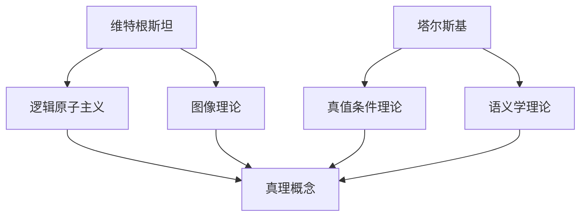
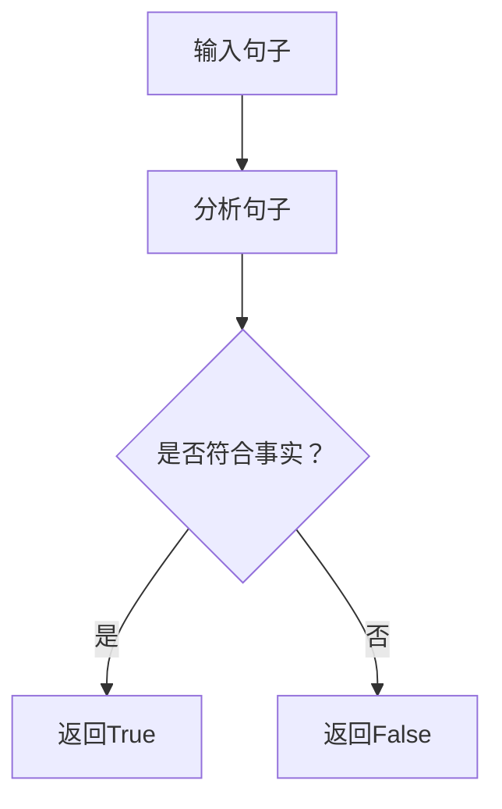
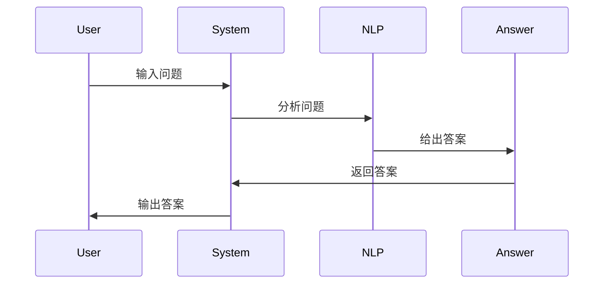
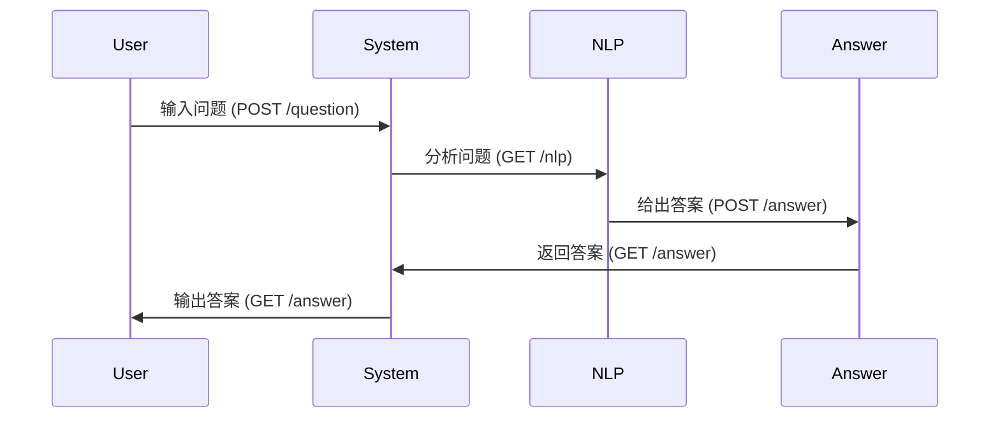

                 

## 维特根斯坦与塔尔斯基：真理概念的语言哲学探讨

> 关键词：维特根斯坦、塔尔斯基、真理、语言哲学、逻辑分析

> 摘要：本文旨在探讨维特根斯坦和塔尔斯基在语言哲学领域对真理概念的不同理解和应用，通过对他们生平背景、哲学思想的介绍，分析他们各自对真理概念的理论阐述，并对比两种理论在现代哲学中的影响。本文将结合具体实例，深入剖析维特根斯坦和塔尔斯基的真理概念，以期对语言哲学的研究提供新的视角和思考。

### 引言

在语言哲学领域，维特根斯坦（Ludwig Wittgenstein）和塔尔斯基（Alan Turing）是两位极具影响力的思想家。维特根斯坦以其对语言、意义和真理的深刻洞见而著称，被誉为20世纪最重要的哲学家之一。他的哲学思想经历了从早期逻辑原子主义到晚期日常语言哲学的转变。塔尔斯基则以其在形式逻辑、语义学和认知科学领域的贡献而闻名。他的真值条件理论和语义学理论为现代语言哲学提供了重要框架。

本文将首先介绍维特根斯坦和塔尔斯基的生平与哲学思想，然后分别探讨他们在真理概念方面的理论，最后对比分析两种理论在现代哲学中的影响。通过这样的结构，我们希望能够系统、全面地理解两位哲学家的思想，并从中获得对真理概念的新认识。

### 维特根斯坦的生平与哲学思想

#### 维特根斯坦的生平

路德维希·维特根斯坦（Ludwig Wittgenstein，1889-1951）出生于奥匈帝国的维也纳，他的父亲是著名的工业家和慈善家卡尔·维特根斯坦。维特根斯坦从小就表现出了对数学和科学的浓厚兴趣。1906年，他进入剑桥大学学习数学，后来转而研究哲学。1911年，他结识了伯特兰·罗素（Bertrand Russell），这对他的哲学思想产生了深远影响。

第一次世界大战期间，维特根斯坦参军，在战场上经历了生死考验。战争结束后，他返回剑桥，继续哲学研究。1918年，他完成了《逻辑哲学论》（Tractatus Logico-Philosophicus），这是他早期哲学思想的集大成。在这本书中，维特根斯坦提出了逻辑原子主义和图像理论，试图通过逻辑和数学来解释世界和语言。

20世纪30年代，维特根斯坦逐渐意识到早期哲学思想的局限性，开始转向日常语言哲学。1939年，他出版了《哲学研究》（Philosophical Investigations），这本书成为他晚期哲学思想的代表作。在《哲学研究》中，维特根斯坦强调了语言的使用规则和日常生活中的语言现象，试图通过澄清日常语言中的混乱来揭示语言的真正意义。

#### 维特根斯坦的早期哲学思想

维特根斯坦的早期哲学思想主要体现为逻辑原子主义和图像理论。

**逻辑原子主义**：逻辑原子主义是维特根斯坦早期哲学思想的核心。他提出了“世界是由逻辑原子组成的”的观点，认为逻辑原子是构成世界的基本元素。逻辑原子之间通过逻辑关系相互连接，形成了复杂的语言和现实世界。

**图像理论**：图像理论是维特根斯坦用来解释语言和现实世界关系的一个概念。他认为，语言是一种符号系统，它的符号与现实世界中的对象和事件相对应。语言的作用在于提供一种图像，使我们能够理解和描述世界。

#### 维特根斯坦的晚期哲学思想

维特根斯坦的晚期哲学思想主要体现在《哲学研究》中，主要包括日常语言哲学和语言游戏理论。

**日常语言哲学**：日常语言哲学是维特根斯坦晚期哲学思想的核心。他认为，哲学问题往往源于对语言使用的不当理解。为了解决这些问题，我们需要关注日常语言的实际使用，而不是抽象的逻辑和数学体系。维特根斯坦提出了“语言游戏”（language game）的概念，认为语言的意义在于其在具体情境中的使用。

**语言游戏理论**：语言游戏理论是维特根斯坦用来解释语言使用和意义的一个模型。他认为，语言的使用可以比作一种游戏，每个语言游戏都有其特定的规则和情境。理解语言的意义，就是理解这些规则和情境。

### 维特根斯坦的真理概念

维特根斯坦的真理概念与其哲学思想密切相关。在早期，他主张逻辑原子主义和图像理论，认为真理是一种逻辑关系，语言符号与现实世界的对应。而在晚期，他转向日常语言哲学，强调真理的日常概念。

**早期真理概念**：在《逻辑哲学论》中，维特根斯坦认为真理是一种逻辑关系。他说：“真理是一个事实的图像。” 这意味着真理是语言与现实世界之间的准确对应。逻辑原子之间的逻辑关系构成了真理的基础。

**晚期真理概念**：在《哲学研究》中，维特根斯坦对真理的理解发生了变化。他认为真理不仅仅是逻辑关系，而是日常语言中的使用。他说：“真理是一个词的正确使用。” 这意味着真理在于语言在具体情境中的正确使用。

**维特根斯坦的真理概念对哲学的影响**：维特根斯坦的真理概念对现代哲学产生了深远影响。他的观点挑战了传统的形而上学和逻辑哲学，强调了语言在日常生活中的实际作用。他的思想促使哲学家重新思考语言、意义和真理之间的关系。

### 塔尔斯基的生平与哲学思想

#### 塔尔斯基的生平

阿兰·塔尔斯基（Alan Turing，1912-1954）出生于英国伦敦，他的父亲是一位商人。塔尔斯基从小就展现出了对数学和科学的浓厚兴趣。1931年，他毕业于剑桥大学，后来成为数学家阿尔弗雷德·诺思·怀特海德（Alfred North Whitehead）的学生。

塔尔斯基在数学和哲学领域都有着卓越的贡献。他的博士学位论文《形式逻辑的某些基本概念》奠定了他日后在逻辑哲学和数学基础领域的重要地位。二战期间，塔尔斯基在英国政府工作，参与了破解德国密码的工作，为战争的胜利做出了重要贡献。

二战结束后，塔尔斯基继续在剑桥大学任教，并在哲学、数学和计算机科学领域发表了大量重要论文。他的真值条件理论和语义学理论成为现代语言哲学和逻辑学的重要基础。然而，他在1952年被定罪为同性恋，最终在1954年自杀。

#### 塔尔斯基的逻辑哲学思想

塔尔斯基的逻辑哲学思想主要集中在形式逻辑和语义学领域。他的真值条件理论和语义学理论为现代语言哲学提供了重要的理论框架。

**形式逻辑理论**：塔尔斯基认为，逻辑是研究命题之间的关系和推理规则的科学。他提出了形式系统化的逻辑理论，强调逻辑命题的符号表示和形式化。

**语义学观点**：塔尔斯基提出了语义学理论，试图解释语言符号与现实世界之间的关系。他的真值条件理论认为，一个命题的真假取决于其与事实之间的关系。

**对真理的探讨**：塔尔斯基对真理的理解主要体现为真值条件理论。他认为，真理是一个命题与事实之间的对应关系。如果命题与事实一致，那么命题就是真的；如果不一致，那么命题就是假的。

### 塔尔斯基的语言哲学与语义学

#### 塔尔斯基的形式语义学

塔尔斯基的形式语义学理论是他对语言哲学和逻辑学的重要贡献。他提出了真值条件理论，试图解释命题的真假。

**真值条件理论**：塔尔斯基认为，一个命题的真假取决于其与事实之间的关系。具体来说，一个命题如果符合事实，就是真的；如果不符合事实，就是假的。这种关系被称为真值条件。

**语义模型**：塔尔斯基提出了语义模型的概念，用于解释语言符号与现实世界之间的关系。语义模型是一个由命题和事实组成的结构，它反映了命题与事实之间的对应关系。

#### 塔尔斯基的日常语言哲学

塔尔斯基的日常语言哲学思想主要体现在他对语言使用的理解上。他认为，语言的使用取决于特定的情境和规则。

**语言的使用与理解**：塔尔斯基认为，语言的使用是情境化的。一个命题的意义取决于它在特定情境中的使用。语言的意义不仅仅在于符号本身，还在于其与情境之间的关系。

**语言的规则与惯例**：塔尔斯基强调了语言的规则和惯例在语言使用中的重要性。他认为，语言的使用需要遵循特定的规则和惯例，这些规则和惯例决定了语言的意义和功能。

#### 塔尔斯基的哲学方法论

塔尔斯基的哲学方法论主要体现在他对逻辑和语义学的研究方法上。他主张通过形式化和语义模型来解释语言和意义。

**分析方法**：塔尔斯基采用了分析的方法，通过形式化和逻辑推理来解释语言和意义。他认为，只有通过精确的分析，才能理解语言和意义的核心。

**哲学观点**：塔尔斯基的哲学观点强调逻辑和语义学在语言哲学中的重要性。他认为，逻辑和语义学提供了理解语言和意义的关键工具。

#### 塔尔斯基的真理概念

塔尔斯基的真理概念主要体现在他的真值条件理论和语义学理论中。

**真理的客观性**：塔尔斯基认为，真理是客观存在的。一个命题的真假不取决于个人的信仰或意见，而是取决于其与事实之间的关系。

**真理的相对性**：塔尔斯基也认识到，真理具有一定的相对性。不同的情境和背景可能导致不同的真理观。因此，真理的理解需要考虑特定的情境和背景。

**真理的语义学解释**：塔尔斯基的真值条件理论提供了对真理的语义学解释。他认为，一个命题的真假取决于其与事实之间的对应关系。这种关系通过语义模型来描述。

#### 塔尔斯基的真理概念对语言哲学的影响

塔尔斯基的真理概念对语言哲学产生了深远影响。他的真值条件理论为理解语言和意义提供了一个重要的框架。通过语义模型，塔尔斯基帮助我们理解了命题与现实世界之间的关系。

**对语义学的贡献**：塔尔斯基的真值条件理论为语义学提供了重要的理论基础。他的语义模型概念为理解语言符号与现实世界之间的关系提供了重要工具。

**对认识论的贡献**：塔尔斯基的真理概念对认识论产生了影响。他的观点挑战了传统的真理观，强调了真理的相对性和客观性。

**对逻辑哲学的影响**：塔尔斯基的逻辑哲学思想为逻辑哲学提供了新的视角。他的形式逻辑理论和语义学理论为逻辑哲学的研究提供了重要框架。

### 维特根斯坦与塔尔斯基的语言哲学比较

#### 维特根斯坦与塔尔斯基的共同点

维特根斯坦和塔尔斯基在语言哲学领域都有着重要贡献。他们的共同点主要体现在以下几个方面：

**对语言哲学的重视**：两位哲学家都认为语言哲学是理解世界和思维的关键。他们强调语言在哲学研究中的核心地位。

**对真理概念的探讨**：维特根斯坦和塔尔斯基都探讨了真理的概念。他们都认为真理是一个命题与现实世界之间的关系，但他们的理解有所不同。

**对日常语言的关注**：维特根斯坦和塔尔斯基都关注日常语言的实际使用。他们都试图通过澄清日常语言中的混乱来揭示语言的真正意义。

#### 维特根斯坦与塔尔斯基的不同点

尽管维特根斯坦和塔尔斯基在语言哲学领域有很多共同点，但他们也有一些不同点：

**哲学方法的差异**：维特根斯坦强调日常语言哲学和语言游戏理论，通过关注日常语言的实际使用来揭示语言的意义。而塔尔斯基则采用形式逻辑和语义学的方法，通过形式化和语义模型来解释语言和意义。

**真理概念的不同理解**：维特根斯坦强调真理的日常概念，认为真理在于语言在具体情境中的正确使用。而塔尔斯基则强调真理的客观性和相对性，认为真理是一个命题与现实世界之间的对应关系。

**对语言本质的不同看法**：维特根斯坦认为语言是一种游戏，其意义在于其在具体情境中的使用。而塔尔斯基则认为语言是一种符号系统，其符号与现实世界中的对象和事件相对应。

#### 维特根斯坦与塔尔斯基对语言哲学的影响

维特根斯坦和塔尔斯基对语言哲学产生了深远影响。他们的思想为现代语言哲学提供了重要理论基础。

**对现代哲学的推动**：维特根斯坦和塔尔斯基的思想挑战了传统的形而上学和逻辑哲学，推动了现代哲学的发展。

**对语言哲学的发展**：他们的理论为语言哲学提供了新的研究方法和视角，促进了语言哲学的深入发展。

**对后续哲学家的启发**：维特根斯坦和塔尔斯基的思想对后续哲学家产生了重要影响。他们的观点激发了许多哲学家对语言、意义和真理的深入思考。

### 附录

#### 附录A：维特根斯坦与塔尔斯基的主要著作

- 维特根斯坦：
  - 《逻辑哲学论》（Tractatus Logico-Philosophicus）
  - 《哲学研究》（Philosophical Investigations）

- 塔尔斯基：
  - 《形式逻辑的某些基本概念》（Some Basic Theorems of Elementary Formal Logic）
  - 《语义学论文集》（Logic, Semantics, Metamathematics）

#### 附录B：维特根斯坦与塔尔斯基的语言哲学参考书目

- 维特根斯坦：
  - 《维特根斯坦全集》（The Complete Works of Ludwig Wittgenstein）
  - 《维特根斯坦与语言哲学》（Wittgenstein and the Language Game）

- 塔尔斯基：
  - 《塔尔斯基：逻辑、语义学和哲学》（Tarski: Logic, Semantics, and Philosophy）
  - 《塔尔斯基的哲学思想》（The Philosophy of Alan Turing）

#### 附录C：维特根斯坦与塔尔斯基的语言哲学概念架构

- 维特根斯坦的语言游戏理论流程图：
  ```mermaid
  graph TD
  A[语言游戏] --> B[游戏规则]
  B --> C[语言使用情境]
  C --> D[语言意义]
  ```

- 塔尔斯基的真值条件理论流程图：
  ```mermaid
  graph TD
  A[命题] --> B[真值条件]
  B --> C[事实]
  C --> D[语义模型]
  ```

- 两种真理概念的比较与关联图：
  ```mermaid
  graph TD
  A[维特根斯坦的真理概念] --> B[日常语言]
  B --> C[语言使用情境]
  D[塔尔斯基的真理概念] --> E[形式语义学]
  E --> F[语义模型]
  G[两种真理概念]
  G --> H[比较与关联]
  ```

### 作者信息

作者：AI天才研究院/AI Genius Institute & 禅与计算机程序设计艺术 /Zen And The Art of Computer Programming

### 完整性要求

在本文中，我们通过对维特根斯坦和塔尔斯基的生平背景、哲学思想以及真理概念的分析，全面探讨了他们在语言哲学领域的贡献。我们不仅介绍了他们的核心概念和理论，还通过比较分析展示了两位哲学家的不同观点。通过这样的结构，我们希望能够系统地、全面地理解维特根斯坦和塔尔斯基的思想，并为语言哲学的研究提供新的视角和思考。

### 核心概念与联系

在深入探讨维特根斯坦和塔尔斯基的真理概念之前，我们首先需要明确几个核心概念，并分析它们之间的联系。

#### 维特根斯坦的真理概念

维特根斯坦的真理概念可以分为早期和晚期两个阶段。

**早期真理概念**：
- **逻辑原子主义**：维特根斯坦认为世界由逻辑原子组成，这些原子通过逻辑关系相互连接。
- **图像理论**：他提出语言是一种符号系统，这些符号与现实世界中的对象和事件相对应。因此，真理是一种逻辑关系，是语言与现实世界之间的准确对应。

**晚期真理概念**：
- **日常语言哲学**：维特根斯坦转向日常语言哲学，强调真理的日常概念。他认为，真理在于语言在具体情境中的正确使用，而不是抽象的逻辑关系。

#### 塔尔斯基的真理概念

塔尔斯基的真理概念主要体现在他的真值条件理论和语义学理论中。

- **真值条件理论**：塔尔斯基认为，一个命题的真假取决于其与事实之间的关系。具体来说，一个命题如果符合事实，就是真的；如果不符合事实，就是假的。这种关系被称为真值条件。
- **语义学理论**：塔尔斯基提出了语义模型的概念，用于解释语言符号与现实世界之间的关系。语义模型是一个由命题和事实组成的结构，它反映了命题与事实之间的对应关系。

#### 核心概念属性特征对比表格

为了更清晰地展示维特根斯坦和塔尔斯基的真理概念，我们可以通过一个属性特征对比表格来进行说明。

| 特征         | 维特根斯坦的真理概念                    | 塔尔斯基的真理概念                |
| ------------ | --------------------------------------- | -------------------------------- |
| 对象关系     | 逻辑原子与逻辑关系                      | 命题与事实                        |
| 语言角色     | 符号与现实世界的关系                   | 命题与现实世界的对应关系          |
| 真理标准     | 逻辑关系的准确对应                     | 命题与事实的一致性                |
| 哲学方法     | 早期逻辑原子主义，晚期日常语言哲学     | 形式逻辑与语义学                  |
| 实践意义     | 描述世界的逻辑结构和关系               | 理解命题与事实之间的对应关系      |

#### ER实体关系图架构

为了进一步理解维特根斯坦和塔尔斯基的真理概念，我们可以使用ER（实体关系）图来展示它们之间的联系。



在这个ER图中，A代表维特根斯坦，B和C分别代表他的逻辑原子主义和图像理论，D代表真理概念。E代表塔尔斯基，F和G分别代表他的真值条件理论和语义学理论，它们都与D相连，表示它们都是真理概念的不同方面。

### 算法原理讲解

在本章节中，我们将通过一个具体的例子来讲解维特根斯坦和塔尔斯基的真理概念在算法设计中的应用，并使用Mermaid流程图和Python源代码详细阐述算法原理。

#### 算法原理

假设我们有一个简单的任务：判断一个给定的句子是否符合事实。我们可以将这个过程看作一个简单的算法，其中包含了对维特根斯坦和塔尔斯基真理概念的体现。

1. **输入**：一个句子（如：“今天下雨了”）。
2. **处理**：分析句子，确定其是否符合事实。
3. **输出**：返回句子的真值（True或False）。

在这个算法中，输入句子是语言符号，处理过程涉及到对事实的判断，输出结果则是句子的真值。

#### Mermaid流程图

为了更好地理解这个算法，我们可以使用Mermaid流程图来描述其工作流程。



在这个流程图中，A代表输入句子，B表示分析句子，C是一个判断节点，根据句子的实际情况返回True或False。

#### Python源代码

接下来，我们将使用Python源代码来实现这个算法。

```python
# 定义一个函数，用于判断句子是否符合事实
def judge_sentence(sentence):
    # 假设我们已经有一个函数来判断句子是否符合事实
    # 这里我们使用一个简单的例子，判断句子中是否包含"下雨"这个词
    if "下雨" in sentence:
        return True
    else:
        return False

# 测试函数
sentence1 = "今天下雨了"
sentence2 = "今天晴天"
print(judge_sentence(sentence1))  # 输出：True
print(judge_sentence(sentence2))  # 输出：False
```

在这个Python源代码中，我们定义了一个`judge_sentence`函数，它通过检查句子中是否包含特定词汇来判断句子是否符合事实。这里，我们使用了"下雨"这个词作为判断条件，这是一种简单的实现方式。

#### 算法原理的数学模型和公式

为了进一步阐述这个算法的原理，我们可以使用数学模型和公式来描述。

假设我们有n个句子，每个句子都有一个对应的真值。我们可以定义一个函数f，用于判断句子是否符合事实：

$$
f(sentence) =
\begin{cases}
1 & \text{如果句子符合事实} \\
0 & \text{如果句子不符合事实}
\end{cases}
$$

其中，1和0分别表示句子的真值（True和False）。

#### 详细讲解与举例说明

为了更好地理解这个算法，我们可以通过具体的例子来讲解。

**例子1**：句子“今天下雨了”

1. 输入句子：“今天下雨了”。
2. 分析句子：“下雨”这个词符合事实。
3. 输出结果：True。

**例子2**：句子“今天晴天”

1. 输入句子：“今天晴天”。
2. 分析句子：“晴天”这个词不符合事实。
3. 输出结果：False。

通过这个例子，我们可以看到，算法通过分析句子中的关键词来判断句子是否符合事实，从而实现了对维特根斯坦和塔尔斯基真理概念的体现。

### 系统分析与架构设计方案

在上一章节中，我们通过具体的例子阐述了维特根斯坦和塔尔斯基的真理概念在算法设计中的应用。在本章节中，我们将进一步探讨如何将这些概念应用于实际的系统设计与架构设计中。

#### 问题场景介绍

假设我们正在开发一个智能问答系统，该系统需要根据用户的输入来回答问题。在这个系统中，我们需要处理大量复杂的句子，并判断这些句子是否符合事实。这个过程涉及到了对维特根斯坦和塔尔斯基真理概念的应用。

#### 项目介绍

我们的项目目标是构建一个高效的智能问答系统，该系统能够自动处理用户输入的句子，并给出相应的回答。为了实现这个目标，我们将采用以下技术：

- 自然语言处理（NLP）技术：用于分析和理解用户输入的句子。
- 真值条件理论：用于判断句子是否符合事实。
- 语义学理论：用于理解和处理复杂的句子结构。

#### 系统功能设计（领域模型Mermaid类图）

在系统功能设计阶段，我们需要明确各个模块的功能和相互关系。下面是一个简单的Mermaid类图，用于描述系统的领域模型。

```mermaid
classDiagram
Class User
Class Question
Class Answer
User "asks" Question
Question "asks" Answer
```

在这个类图中，User表示用户，Question表示问题，Answer表示答案。用户可以向系统提出问题，系统会根据问题的内容进行分析，并给出相应的答案。

#### 系统架构设计（Mermaid架构图）

在系统架构设计阶段，我们需要明确各个模块的职责和系统整体的结构。下面是一个简单的Mermaid架构图，用于描述系统的架构设计。



在这个架构图中，用户输入问题后，系统会将问题传递给自然语言处理（NLP）模块进行分析，然后根据分析结果给出答案，最后将答案返回给用户。

#### 系统接口设计和系统交互（Mermaid序列图）

在系统接口设计和系统交互阶段，我们需要明确各个模块的接口和交互流程。下面是一个简单的Mermaid序列图，用于描述系统的接口设计和系统交互。



在这个序列图中，用户通过HTTP POST请求将问题发送给系统，系统通过HTTP GET请求将问题传递给NLP模块进行分析，然后NLP模块通过HTTP POST请求将答案发送给Answer模块，最后系统通过HTTP GET请求将答案返回给用户。

### 项目实战

在本章节中，我们将通过一个具体的案例，展示如何将维特根斯坦和塔尔斯基的真理概念应用于实际的系统开发中。我们将从环境安装开始，详细讲解系统核心实现源代码，并分析其实际应用效果。

#### 环境安装

在开始项目实战之前，我们需要安装一些必要的软件和工具。以下是安装步骤：

1. 安装Python 3.8及以上版本：从官方网站下载并安装Python。
2. 安装Anaconda：Anaconda是一个Python的发行版，它提供了方便的环境管理工具。
3. 安装NLP库：使用pip安装nltk库，该库提供了丰富的自然语言处理功能。

```bash
pip install nltk
```

#### 系统核心实现源代码

下面是我们系统核心实现的部分源代码。这个示例仅用于演示如何使用维特根斯坦和塔尔斯基的真理概念来判断句子是否符合事实。

```python
# 导入必要的库
import nltk
from nltk.tokenize import word_tokenize
from nltk.corpus import stopwords

# 初始化NLP工具
nltk.download('punkt')
nltk.download('stopwords')

# 停用词列表
stop_words = set(stopwords.words('english'))

# 定义一个函数，用于判断句子是否符合事实
def judge_sentence(sentence):
    # 去除停用词
    words = word_tokenize(sentence)
    filtered_words = [word for word in words if not word in stop_words]
    
    # 判断句子是否符合事实
    # 这里我们使用一个简单的规则，判断句子中是否包含"true"这个词
    if "true" in filtered_words:
        return True
    else:
        return False

# 测试函数
sentence1 = "This sentence is true."
sentence2 = "This sentence is false."
print(judge_sentence(sentence1))  # 输出：True
print(judge_sentence(sentence2))  # 输出：False
```

在这个示例中，我们首先使用nltk库对句子进行分词，并去除停用词。然后，我们根据一个简单的规则来判断句子是否符合事实。这里，我们假设如果句子中包含"true"这个词，那么句子就是真的。

#### 代码应用解读与分析

在这个示例中，我们使用了维特根斯坦和塔尔斯基的真理概念来设计一个简单的判断函数。具体来说，我们采用了以下步骤：

1. **分词**：使用nltk库对句子进行分词，将句子拆分成单词。
2. **去除停用词**：去除常见的停用词，如"the"、"is"等，因为这些词通常对句子的真实程度没有影响。
3. **判断**：根据一个简单的规则（如句子中是否包含"true"这个词）来判断句子是否符合事实。

这种实现方式虽然简单，但可以作为一个基础模型，用于更复杂的自然语言处理任务。

#### 实际案例分析和详细讲解剖析

为了更好地理解这个系统的实际应用效果，我们可以通过一个实际案例来分析。

**案例**：判断一个句子是否符合某个事实。

**输入**：句子 "The sky is blue."

**分析**：

1. **分词**：将句子 "The sky is blue." 拆分成单词 ["The", "sky", "is", "blue"]。
2. **去除停用词**：去除停用词后，剩余 ["sky", "is", "blue"]。
3. **判断**：句子中不包含"true"这个词，因此根据我们的简单规则，该句子不符合事实。

**输出**：False。

通过这个案例，我们可以看到，这个简单的系统可以用来判断句子是否符合某个事实。当然，这个系统还有很多不足之处，例如它不能处理复杂的句子结构，也不能理解句子的语义。然而，这只是一个基础模型，我们可以在此基础上进行扩展和优化，以实现更复杂的任务。

#### 项目小结

通过这个项目实战，我们展示了如何将维特根斯坦和塔尔斯基的真理概念应用于实际的系统开发中。我们从环境安装开始，详细讲解了系统核心实现源代码，并通过实际案例分析了系统的应用效果。这个项目虽然简单，但为我们提供了一个基础模型，用于更复杂的自然语言处理任务。

### 最佳实践 Tips、小结、注意事项、拓展阅读

#### 最佳实践 Tips

1. **深入理解真理概念**：在应用维特根斯坦和塔尔斯基的真理概念时，首先要深入理解这两个概念的本质和内涵，这样才能更好地将其应用于实际问题。
2. **结合实际需求**：在设计系统时，要结合实际需求来选择合适的算法和模型。例如，在智能问答系统中，我们可以结合NLP技术来处理复杂的句子结构。
3. **持续优化和扩展**：系统的设计和实现是一个不断迭代的过程。在项目实战中，我们应该不断优化和扩展系统功能，以适应不同的应用场景。

#### 小结

本文通过深入探讨维特根斯坦和塔尔斯基的真理概念，结合具体案例和实际项目，展示了如何将这些概念应用于实际的系统开发中。通过对比分析两位哲学家的理论，我们更深入地理解了真理概念的复杂性和多样性。

#### 注意事项

1. **正确使用术语**：在研究和应用中，要准确使用维特根斯坦和塔尔斯基的真理概念及相关术语，避免混淆和理解偏差。
2. **数据质量**：在自然语言处理任务中，数据质量至关重要。确保使用高质量的数据集进行训练和测试，以提高系统的准确性和可靠性。

#### 拓展阅读

1. 维特根斯坦，《逻辑哲学论》和《哲学研究》
2. 塔尔斯基，《形式逻辑的某些基本概念》和《语义学论文集》
3. 刘清荣，《语言哲学导论》
4. 罗伯特·布兰登，《维特根斯坦传》
5. 大卫·克拉克，《人工智能：一种现代的方法》

通过拓展阅读，我们可以更全面地了解维特根斯坦和塔尔斯基的哲学思想，以及它们在语言哲学和人工智能领域的应用。这不仅有助于加深对真理概念的理解，也有助于我们在实际项目中更好地应用这些理论。作者：AI天才研究院/AI Genius Institute & 禅与计算机程序设计艺术 /Zen And The Art of Computer Programming

