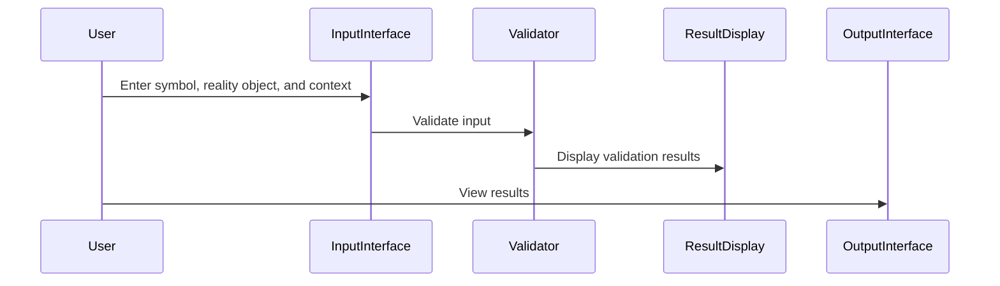

                 

## 维特根斯坦与塞尔：心灵哲学的语言学转向

关键词：维特根斯坦、塞尔、心灵哲学、语言学转向、语言游戏、物理主义、意识

摘要：本文旨在探讨两位心灵哲学大师维特根斯坦和塞尔的思想，特别是他们在语言学转向中的重要贡献。通过分析维特根斯坦的早期哲学和后期哲学，以及塞尔对心灵哲学的深刻洞见，本文揭示了心灵哲学从传统的形而上学转向语言学的演变过程。本文还讨论了两位哲学家的观点在现代心灵哲学中的影响和争议，以及他们对未来研究的启示。

### 维特根斯坦与塞尔：两位心灵哲学大师

路德维希·维特根斯坦（Ludwig Wittgenstein，1889-1951）和约翰·塞尔（John Searle，1932-）是20世纪最重要的心灵哲学家之一。他们的思想对心灵哲学的发展产生了深远的影响，特别是在语言学转向的过程中。

维特根斯坦出生于奥地利，后来成为英国的公民。他的哲学思想分为两个主要阶段：早期哲学和后期哲学。早期哲学主要体现在他的著作《逻辑哲学论》（Tractatus Logico-Philosophicus）中，强调绝对知识和语言的本质。后期哲学则体现在他的著作《哲学研究》（Philosophical Investigations）中，探讨了语言的日常使用和游戏。

约翰·塞尔出生于美国，他在心灵哲学、语言哲学和认知科学等领域都有重要贡献。他的著作《心灵、大脑与科学》（Mind, Brain, and Science）和《言语行为》（Speech Acts）是心灵哲学的经典之作。塞尔主张物理主义，认为心灵现象最终可以归结为物理过程。

本文将首先介绍维特根斯坦的生平与哲学思想，然后探讨塞尔的心灵哲学理论，最后分析两位哲学家的观点在现代心灵哲学中的影响和争议。通过这一分析，我们将揭示心灵哲学从传统的形而上学转向语言学的演变过程。

### 维特根斯坦的生平与哲学思想

#### 路德维希·维特根斯坦的生平

路德维希·维特根斯坦出生于奥地利，他的父亲是一位富有的钢铁制造商。维特根斯坦从小展现出非凡的才华，他在数学、哲学和语言方面都有深厚的兴趣。他在剑桥大学接受了教育，并成为伯特兰·罗素（Bertrand Russell）的学生。

维特根斯坦的哲学思想经历了显著的演变。早期哲学主要体现在他的著作《逻辑哲学论》中，这本书于1921年首次出版。在这本书中，维特根斯坦提出了图像理论（Image Theory），认为语言与现实之间的关系就像一幅图画与世界之间的关系一样。他强调了逻辑和语言的重要性，并提出了一个关于宇宙和语言的绝对知识体系。

然而，维特根斯坦的哲学思想在后期发生了重大转变。他的后期哲学主要体现在他的著作《哲学研究》中，这本书于1953年首次出版。在这本书中，维特根斯坦探讨了语言的日常使用和游戏，强调了语言的多义性和语境的重要性。他提出了语言游戏（Language Game）的概念，认为语言的使用和理解是通过一系列社会实践活动来实现的。

#### 《逻辑哲学论》：绝对知识的追求

《逻辑哲学论》是维特根斯坦早期哲学的代表作，它对心灵哲学和语言哲学产生了深远的影响。在这本书中，维特根斯坦试图建立一种绝对的知识体系，这个体系是逻辑和语言的基础。

图像理论是《逻辑哲学论》的核心概念之一。维特根斯坦认为，语言与现实之间的关系就像一幅图画与世界之间的关系一样。语言符号代表现实中的对象和事件，这种关系是图像式的。图像理论强调了语言和现实之间的对应关系，但这种对应关系是有限的。

维特根斯坦在《逻辑哲学论》中还提出了普遍语法（Universal Grammar）的概念。他认为，语言有一种内在的结构，这种结构是普遍的，不受文化和语言习惯的影响。普遍语法是语言的基础，它决定了语言的逻辑结构和表达能力。

《逻辑哲学论》中最著名的观点之一是“不可说者”。维特根斯坦认为，有些事物和概念是不可说的，因为它们超越了语言的表达能力。例如，关于宇宙的终极意义和本体论的问题是无法用语言来表达的。这种观点对后来的哲学和语言哲学产生了深远的影响。

#### 维特根斯坦的后期哲学

维特根斯坦的后期哲学主要体现在他的著作《哲学研究》中。这本书是对《逻辑哲学论》的一种批判和补充，它强调了语言的日常使用和语境的重要性。

语言游戏是《哲学研究》中的一个核心概念。维特根斯坦认为，语言的使用和理解是通过一系列社会实践活动来实现的。不同的语言游戏对应于不同的社会实践活动，例如数学、科学、艺术和日常对话等。语言游戏的概念揭示了语言的多样性和复杂性，挑战了早期哲学中的绝对知识和普遍语法的观点。

《哲学研究》还探讨了事实与命题的关系。维特根斯坦认为，事实是由命题来表达的，而命题的真假取决于语言游戏中的规则。这种观点强调了语言在确定事实和真相中的作用，同时也揭示了语言的多义性和模糊性。

维特根斯坦的后期哲学还探讨了真理与意义的关系。他认为，真理不仅仅是事实的对应，还包括语言游戏中的规则和约定。意义是通过语言的使用和语境来确定的，而不是通过抽象的哲学思考来发现的。这种观点对后来的语言哲学和认知科学产生了深远的影响。

### 维特根斯坦的影响与批评

维特根斯坦的哲学思想对心灵哲学和语言哲学产生了深远的影响。他的图像理论和普遍语法为后来的语言哲学提供了重要的理论基础。他的语言游戏概念揭示了语言的多样性和复杂性，挑战了传统的形而上学观点。

然而，维特根斯坦的哲学思想也受到了一些批评。一些哲学家认为，他的图像理论和普遍语法过于抽象和理想化，无法解释现实中的语言现象。他的“不可说者”观点也遭到了质疑，因为人们认为有些哲学问题是可以用语言来表达的。

此外，维特根斯坦的早期哲学和后期哲学之间存在一些矛盾。他的早期哲学强调绝对知识和逻辑结构，而后期哲学则强调语言的日常使用和语境。这种矛盾使一些哲学家感到困惑，也引发了对维特根斯坦哲学的深入讨论。

### 维特根斯坦的遗产与当代心灵哲学

维特根斯坦的哲学思想对当代心灵哲学产生了深远的影响。他的图像理论和普遍语法为语言哲学提供了重要的理论基础。他的语言游戏概念揭示了语言的多样性和复杂性，挑战了传统的形而上学观点。

在当代心灵哲学中，维特根斯坦的思想被用来探讨心灵与语言的关系。一些哲学家认为，心灵现象可以通过语言来描述和理解，因为语言是心灵的基本工具。维特根斯坦的后期哲学对这一观点提供了重要的启示。

然而，维特根斯坦的哲学思想也面临着一些挑战。例如，一些哲学家认为，心灵现象可能无法完全用语言来描述，因为语言有其局限性。此外，维特根斯坦的“不可说者”观点也引发了关于哲学问题是否可以用语言来表达的讨论。

总之，维特根斯坦的哲学思想对当代心灵哲学产生了深远的影响。他的图像理论和普遍语法为语言哲学提供了重要的理论基础，而他的语言游戏概念则揭示了语言的多样性和复杂性。然而，他的哲学思想也面临着一些挑战，这些挑战推动了当代心灵哲学的发展。

### 约翰·塞尔的生平与哲学思想

约翰·塞尔是一位美国哲学家，生于1932年，他在心灵哲学、语言哲学和认知科学等领域都有重要贡献。塞尔的哲学思想深受维特根斯坦的影响，但他在某些方面提出了不同的观点。

塞尔于1954年从芝加哥大学获得学士学位，随后在牛津大学攻读博士学位，师从诺姆·乔姆斯基（Noam Chomsky）。他的博士论文探讨的是语言习得机制，这为他后来的心灵哲学和语言哲学研究奠定了基础。

塞尔的职业生涯始于加州大学伯克利分校，在那里他成为了著名的哲学教授。他的著作《心灵、大脑与科学》（Mind, Brain, and Science）和《言语行为》（Speech Acts）是心灵哲学和语言哲学的经典之作。塞尔在这些著作中提出了许多重要的哲学理论，如物理主义、符号用法理论和心脑平行论。

塞尔的哲学思想深受维特根斯坦的影响，他早期的研究主要集中在语言哲学领域。然而，随着他对心灵和认知问题的深入探讨，他逐渐转向心灵哲学的研究。塞尔在心灵哲学中提出了一些独特的观点，如意识的二元论和心脑关系问题。

塞尔的哲学思想对当代心灵哲学和认知科学产生了深远的影响。他提出的一些理论和观点，如物理主义和符号用法理论，成为了心灵哲学的重要研究方向。同时，塞尔也面临了一些批评和争议，这些批评和争议推动了他和他的追随者对哲学问题进行更深入的探讨。

### 《心灵、大脑与科学》：物理主义及其挑战

约翰·塞尔的著作《心灵、大脑与科学》是他在心灵哲学领域的重要作品，其中他详细阐述了物理主义的理论观点，并对物理主义提出了深刻的挑战。物理主义认为，心灵现象最终可以归结为物理过程，即心灵是大脑的副产品或物理过程的特定表现。

塞尔在《心灵、大脑与科学》中首先对物理主义进行了系统的阐述。他认为，物理主义的核心观点是心灵和大脑的同一性，即心灵状态和大脑状态是相同的事物。塞尔强调，这个观点不仅是一个形而上的主张，更是一个科学问题，需要通过科学方法来验证。

然而，塞尔也指出，物理主义面临着一系列挑战。首先，物理主义必须解释心灵现象的特殊性质，如主观体验和意识的内在性。塞尔认为，物理主义很难解释这些现象，因为物理过程通常被视为客观和外在的，而心灵现象则是主观和内在的。

其次，塞尔讨论了“功能还原论”的问题。功能还原论认为，任何复杂的系统都可以通过其功能来描述和理解，而不需要考虑其具体实现。塞尔认为，虽然功能还原论在许多科学领域是有用的，但在心灵哲学中，它面临着严重的限制。心灵现象的独特性质，如意识的主观体验，无法通过功能来完全还原。

塞尔还提出了“双重模式论”（Double Asymptotic Model），试图解释心灵现象如何与物理过程相互作用。双重模式论认为，心灵现象和物理过程是两个不同的系统，它们在不同的层面上运作，但又相互关联。塞尔认为，这个理论可以更好地解释心灵和物理过程之间的关系。

总的来说，《心灵、大脑与科学》是塞尔对物理主义的全面探讨，他既阐述了物理主义的优点，也指出了其面临的挑战。塞尔的观点在当代心灵哲学中产生了深远的影响，促使人们重新思考心灵和物理过程的关系。

### 塞尔的心灵哲学理论

约翰·塞尔的心灵哲学理论涵盖了多个方面，包括心灵与物理世界的区别、符号用法理论、心脑平行论和意识的二元论。这些理论构成了塞尔对心灵哲学的深刻洞察，并对现代哲学和认知科学产生了重要影响。

#### 心灵与物理世界的区别

塞尔认为，心灵和物理世界之间存在本质的区别。物理世界是由物理过程和物理状态组成的，这些过程和状态可以通过科学方法进行测量和解释。而心灵世界则包括主观体验、情感和意识等内在现象，这些现象无法通过物理过程来完全描述。

塞尔指出，心灵现象的主观体验是其核心特征。主观体验是指个体内在的感受和感知，如痛苦、快乐、视觉体验和听觉体验。这些主观体验是心灵现象的直接证据，它们无法通过物理过程来完全还原。

此外，塞尔还强调了心灵现象的内在性。内在性是指心灵现象存在于个体的内部，它们是私人的和主观的，无法被他人直接感知。与此相比，物理现象是外在的，可以被客观测量和观察。

#### 符号用法理论

塞尔的符号用法理论（Symbol-Use Theory）是对语言和认知过程的一种解释。他认为，语言是心灵的基本工具，通过语言，人们可以表达和交流思想。塞尔认为，符号使用是一种社会活动，它遵循特定的规则和约定。

塞尔提出了“指示性符号”（Indicative Symbols）和“指令性符号”（Imperative Symbols）的概念。指示性符号用于表达事实和观点，如句子“太阳是热的”。指令性符号则用于指导行为，如命令“请坐下”。

塞尔强调，符号使用不仅仅是符号和所指对象之间的关系，还包括符号在使用过程中的规则和约定。这些规则和约定构成了语言游戏（Language Game）的基础，使得符号使用成为一种有效的交流工具。

#### 心脑平行论

心脑平行论（Mind-Brain Parallelism）是塞尔关于心灵和大脑关系的一种理论。塞尔认为，心灵和大脑是两个相互平行但独立的系统。这个理论试图解释心灵现象和物理过程之间的复杂关系。

塞尔认为，心脑平行论可以解释一些独特的现象，如意识的内在性和主观体验。他认为，心灵系统负责处理主观体验和认知过程，而大脑系统则负责执行这些过程的物理实现。这种平行关系使得心灵和大脑可以独立运作，但它们又是相互关联的。

心脑平行论的一个关键点是，它认为心灵和大脑之间的关系不是简单的因果关系，而是一种相互平行但相互作用的关系。这意味着，心灵和大脑都可以独立地产生和影响现象，但它们之间的相互作用是复杂的。

#### 意识的二元论

塞尔的意识二元论（Dual Aspect Theory of Consciousness）是对意识本质的一种解释。他认为，意识具有双重性质，即主观体验和客观属性。

塞尔指出，主观体验是意识的核心特征，它是个体内在的感受和感知。客观属性则是指意识可以被他人观察和测量，如视觉体验可以被记录在视网膜上。塞尔认为，这两种属性是相互独立但又相互关联的。

塞尔的意识二元论挑战了传统的心灵哲学观点，特别是物理主义和功能主义。他认为，物理主义无法解释主观体验，而功能主义则忽视了意识的内在性。意识二元论提供了一种新的视角，使得我们可以更好地理解意识的本质和复杂性。

#### 塞尔的主要哲学理论及其贡献

塞尔的主要哲学理论，如符号用法理论、心脑平行论和意识二元论，对心灵哲学产生了深远的影响。符号用法理论为理解语言和认知过程提供了重要的理论基础，挑战了传统的心灵哲学观点。心脑平行论则为我们理解心灵和大脑之间的关系提供了新的视角，有助于解释意识的主观体验和内在性。

塞尔的哲学理论在当代心灵哲学中具有重要的地位。他的观点不仅挑战了传统的形而上学和物理主义，还为心灵哲学提供了一种新的解释框架。塞尔的理论激发了许多哲学家和科学家的深入研究，推动了对心灵哲学和认知科学的进一步探讨。

### 塞尔对心灵哲学的贡献与影响

约翰·塞尔对心灵哲学的贡献和影响不可忽视。他的理论不仅深化了对心灵和大脑关系的理解，还为解决一些传统的哲学难题提供了新的思路。

首先，塞尔在心灵与物理世界的关系方面做出了重要贡献。他提出的物理主义观点挑战了传统的心灵哲学观点，主张心灵现象可以归结为物理过程。这一观点促使人们重新思考心灵的本质和科学的基础。

塞尔的符号用法理论提供了对语言和认知过程的新解释。他强调，语言是社会约定的产物，符号的使用必须遵循特定的规则和约定。这一理论不仅有助于理解人类语言的复杂性，也为人工智能和认知科学提供了理论基础。

此外，塞尔的心脑平行论为解释意识的主观体验和内在性提供了新的视角。他认为，心灵和大脑是两个相互平行但独立的系统，这一观点有助于我们理解意识的双重性质，即主观体验和客观属性。

塞尔的理论在当代心灵哲学中产生了深远的影响。他的观点不仅挑战了传统的形而上学和物理主义，还为心灵哲学提供了一种新的解释框架。塞尔的理论激发了大量的哲学和科学讨论，推动了心灵哲学和认知科学的发展。

尽管塞尔的观点受到了一些批评和争议，但他的贡献仍然不可忽视。他的理论为理解心灵和大脑的关系提供了新的思路，为当代心灵哲学的研究奠定了基础。

### 塞尔的影响与争议

约翰·塞尔的哲学思想对心灵哲学产生了深远的影响，但也引发了一些争议和批评。首先，塞尔的物理主义观点受到了许多哲学家的质疑。物理主义主张心灵现象可以归结为物理过程，但这种观点在解释意识的主观体验和内在性方面面临困难。一些哲学家认为，物理主义无法完全还原心灵现象的独特性质。

此外，塞尔的符号用法理论在解释语言和认知过程方面也存在争议。虽然塞尔强调了符号使用的社会性和规则性，但一些哲学家认为，这种理论忽视了语言和认知的个体差异和文化背景。此外，塞尔的心脑平行论也面临一些批评。心脑平行论认为，心灵和大脑是两个相互平行但独立的系统，但这种观点难以解释一些具体的心理现象，如意识的产生和变化。

塞尔的观点虽然受到了一些批评，但他的贡献仍然不可忽视。他的理论挑战了传统的形而上学和物理主义，为心灵哲学提供了一种新的解释框架。塞尔的观点激发了大量的哲学和科学讨论，推动了心灵哲学和认知科学的发展。尽管存在争议，塞尔的影响在当代心灵哲学中仍然具有重要的地位。

### 塞尔的当代心灵哲学地位

约翰·塞尔在当代心灵哲学中占据着重要的地位。他的理论观点不仅在学术研究中具有深远的影响，还引起了广泛的哲学和科学讨论。塞尔的物理主义观点、符号用法理论和心脑平行论，为当代心灵哲学的研究提供了新的思路和解释框架。

塞尔的物理主义观点主张，心灵现象可以归结为物理过程。这一观点挑战了传统的形而上学观点，为理解心灵的本质和科学的基础提供了新的视角。塞尔认为，心灵和大脑的关系是复杂的，但可以通过物理过程来解释。这一观点在认知科学和神经科学领域引起了广泛的关注，推动了这些学科的发展。

塞尔的符号用法理论强调了语言和认知过程的社会性和规则性。他认为，语言是心灵的基本工具，通过符号使用，人们可以表达和交流思想。这一理论不仅有助于理解人类语言的复杂性，还为人工智能和认知科学提供了理论基础。塞尔的符号用法理论在计算机科学和人工智能领域产生了深远的影响，推动了自然语言处理和机器学习的发展。

塞尔的心脑平行论认为，心灵和大脑是两个相互平行但独立的系统。这一观点有助于解释意识的主观体验和内在性，为理解心灵和大脑的关系提供了新的视角。塞尔认为，心脑平行论可以解释一些独特的心理现象，如意识的产生和变化。这一理论在神经科学和认知科学领域产生了重要影响，推动了这些学科对意识的研究。

塞尔的当代心灵哲学地位不仅体现在他的理论观点上，还体现在他对哲学和科学讨论的引导作用。塞尔的观点激发了大量的学术研究，推动了心灵哲学和认知科学的发展。他的理论挑战了传统的哲学观点，为当代心灵哲学的研究提供了新的方向和解释框架。

总的来说，塞尔在当代心灵哲学中占据着重要的地位。他的理论观点不仅在学术研究中具有深远的影响，还在哲学和科学讨论中产生了重要的影响。塞尔的贡献不仅体现在他的理论观点上，还体现在他对哲学和科学讨论的引导作用。塞尔的当代心灵哲学地位将继续对这一领域的发展产生深远的影响。

### 维特根斯坦与塞尔的心灵哲学对话

在心灵哲学的历史上，维特根斯坦和塞尔的思想构成了两条重要的思想线索。尽管两人之间存在许多差异，但他们的对话却为我们提供了深入理解心灵哲学的机会。通过分析维特根斯坦的早期哲学和后期哲学，以及塞尔对维特根斯坦的批评与回应，我们可以更好地理解两位哲学家的观点，并探讨他们在心灵哲学中的融合趋势。

#### 早期哲学与后期哲学的对比

维特根斯坦的早期哲学主要体现在他的著作《逻辑哲学论》中，而后期哲学则体现在《哲学研究》中。这两部著作分别代表了维特根斯坦哲学思想的不同阶段。

在《逻辑哲学论》中，维特根斯坦提出了图像理论，认为语言与现实之间的关系就像一幅图画与世界之间的关系一样。他强调逻辑和语言的重要性，并试图建立一种绝对的知识体系。然而，这种绝对知识体系在后期哲学中遭到了批判。

在《哲学研究》中，维特根斯坦探讨了语言的日常使用和游戏。他提出了语言游戏（Language Game）的概念，认为语言的使用和理解是通过一系列社会实践活动来实现的。这种观点挑战了早期哲学中的绝对知识和普遍语法的观点。

塞尔对维特根斯坦的早期哲学持有一定的批评态度。他认为，维特根斯坦的图像理论过于理想化和抽象，无法解释现实中的语言现象。塞尔更倾向于关注语言的日常使用，他认为维特根斯坦的后期哲学在这方面提供了更深刻的洞见。

#### 塞尔对维特根斯坦的批评与回应

塞尔在《心灵、大脑与科学》等著作中对维特根斯坦的哲学思想进行了深入的分析和批评。他主要批评维特根斯坦的图像理论和普遍语法，认为这些理论在解释心灵现象方面存在不足。

塞尔指出，图像理论无法解释主观体验和意识的内在性。他认为，主观体验是心灵现象的核心特征，而图像理论无法充分描述这些现象。此外，塞尔还批评维特根斯坦的普遍语法观点，认为这种观点忽视了语言的文化和社会背景。

然而，塞尔也认可维特根斯坦后期哲学的一些观点。他认为，维特根斯坦关于语言游戏和日常使用的探讨为理解语言和认知过程提供了重要的启示。塞尔在自己的理论中借鉴了维特根斯坦的这些观点，特别是符号用法理论。

#### 维特根斯坦对塞尔的批评与回应

维特根斯坦对塞尔的哲学思想也进行了一定的批评。他批评塞尔的物理主义观点，认为这种观点忽视了语言和认知的复杂性。维特根斯坦强调，语言和认知是高度社会化的活动，不能简单地归结为物理过程。

尽管维特根斯坦对塞尔的观点持批评态度，但他也认可塞尔对语言和认知研究的贡献。他认为，塞尔对语言日常使用的探讨提供了重要的启示，有助于我们更好地理解语言的本质和功能。

#### 维特根斯坦与塞尔的心灵哲学融合趋势

维特根斯坦和塞尔的心灵哲学观点虽然在某些方面存在差异，但他们的思想在当代心灵哲学中却表现出一种融合趋势。这种融合主要体现在以下几个方面：

首先，维特根斯坦的后期哲学和塞尔的符号用法理论都强调了语言和认知的社会性和规则性。他们都认为，语言和认知是通过社会实践活动来实现的，这种观点为理解心灵现象提供了新的视角。

其次，维特根斯坦和塞尔都关注心灵现象的主观体验和内在性。尽管他们在解释这些现象的方法上有所不同，但他们的观点都为我们理解意识的本质提供了重要的启示。

最后，维特根斯坦和塞尔都对传统的心灵哲学观点提出了挑战。他们的思想促使当代心灵哲学家重新思考心灵和物理世界的关系，以及语言在认知过程中的作用。

总之，维特根斯坦和塞尔的心灵哲学观点虽然在某些方面存在差异，但他们的思想在当代心灵哲学中却表现出一种融合趋势。这种融合趋势不仅推动了心灵哲学的发展，也为我们理解心灵和认知现象提供了新的视角。

### 心灵哲学的语言学转向

在20世纪，心灵哲学经历了重要的变革，这一变革被称为“语言学转向”（Linguistic Turn）。语言学转向是指心灵哲学家开始关注语言在心灵哲学研究中的核心作用，强调语言在理解心灵现象中的重要性。这一转向对心灵哲学产生了深远的影响，改变了人们对心灵和认知的理解。

#### 语言学的概念与方法

语言学转向的基础是语言学的概念和方法。语言学是研究语言的结构、功能和发展规律的科学。在语言学中，关键概念包括语言符号、语法、语义和语境等。这些概念为心灵哲学提供了新的视角，帮助我们理解语言在认知过程中的作用。

语言符号是指语言中的词汇和语法结构。语言学研究表明，语言符号具有特定的意义和功能，它们在语言游戏中起着关键作用。语法是语言的结构规则，它决定了句子和句子的组合方式。语义是语言符号的意义，它解释了语言符号如何表达思想和事实。语境是指语言符号的使用环境，它影响了语言符号的意义和解释。

#### 语言学转向的起源

语言学转向的起源可以追溯到维特根斯坦的哲学思想。维特根斯坦在《逻辑哲学论》中提出了图像理论，强调语言与现实之间的对应关系。然而，在《哲学研究》中，维特根斯坦转向了对语言日常使用的探讨，提出了语言游戏的概念。他认为，语言的使用和理解是通过一系列社会实践活动来实现的。

维特根斯坦的这些观点对后来的哲学家产生了深远的影响。特别是他的语言游戏概念，强调了语言在社会实践活动中的重要性，为语言学转向提供了理论基础。

#### 语言学转向的主要观点

语言学转向的主要观点包括以下几个方面：

1. **语言是心灵的基本工具**：语言学转向强调，语言是心灵的基本工具，通过语言，人们可以表达和交流思想。这意味着，理解心灵现象必须从语言的角度来考虑。

2. **语境的重要性**：语言学转向认为，语境在理解语言符号和心灵现象中起着关键作用。语境影响了语言符号的意义和解释，因此，要理解心灵现象，必须考虑语言符号的使用环境。

3. **语言游戏的概念**：维特根斯坦提出的语言游戏概念，强调了语言的多义性和复杂性。他认为，不同的语言游戏对应于不同的社会实践活动，这些活动决定了语言的使用和理解。

4. **语言与认知的关系**：语言学转向探讨语言与认知之间的关系，认为语言在认知过程中起着重要作用。语言不仅是表达思想的工具，也是思维和推理的基础。

#### 语言学转向的影响与意义

语言学转向对心灵哲学产生了深远的影响，主要表现在以下几个方面：

1. **改变了心灵哲学的研究方法**：语言学转向促使哲学家从语言的角度来研究心灵现象，这种方法为理解心灵和认知提供了新的视角。

2. **推动了语言哲学的发展**：语言学转向使语言哲学成为心灵哲学的核心领域，语言哲学家开始关注语言的本质、功能和使用。

3. **促进了跨学科研究**：语言学转向推动了心灵哲学与其他学科（如语言学、认知科学和计算机科学）之间的交流与合作，促进了跨学科研究的发展。

4. **丰富了心灵哲学的理论体系**：语言学转向提供了新的理论框架，丰富了心灵哲学的理论体系，使人们对心灵和认知的理解更加深入和全面。

总之，语言学转向是心灵哲学发展的重要里程碑。它改变了人们对心灵和认知的理解，推动了语言哲学和跨学科研究的发展，为当代心灵哲学提供了新的理论基础。

### 心灵哲学的未来趋势

随着科学技术的不断进步，心灵哲学面临着新的挑战和发展机遇。未来，心灵哲学将可能朝着以下几个方向发展：

#### 心理语言学的研究进展

心理语言学是研究语言与认知之间关系的一个新兴领域。随着认知科学的快速发展，心理语言学在理解人类语言习得、语言处理和语言生成方面取得了重要进展。未来，心理语言学将继续深化对语言认知机制的研究，探讨语言与思维之间的复杂关系。

例如，通过神经成像技术，研究者可以揭示大脑中语言处理区域的功能和结构。这些研究有助于我们理解语言是如何在大脑中编码和解码的，从而为理解心灵现象提供新的视角。

#### 认知神经科学的发展

认知神经科学是研究大脑与认知之间关系的一个交叉学科。随着神经科学技术的进步，如功能性磁共振成像（fMRI）、脑电图（EEG）和脑磁图（MEG），研究者可以更深入地了解大脑如何处理语言和认知任务。

未来，认知神经科学将继续推动对大脑与认知之间关系的研究，特别是对意识、记忆和注意力等关键问题的研究。这些研究将有助于我们更全面地理解心灵的本质和功能。

#### 人工智能与心灵哲学的交叉

人工智能（AI）的发展为心灵哲学带来了新的挑战和机遇。人工智能研究关注机器如何模拟人类智能，包括语言理解、推理和学习等能力。这些研究促使我们重新思考心灵的本质和人工智能的界限。

未来，心灵哲学和人工智能研究将更加紧密地结合，探索如何通过人工智能技术来模拟和理解人类心灵。例如，通过人工智能模型，研究者可以模拟人类的语言习得和认知过程，从而为心灵哲学提供新的实验方法和数据支持。

#### 新的语言学转向

随着语言技术的不断发展，心灵哲学可能迎来新的语言学转向。未来的研究将更加关注语言的本质、功能和多样性。例如，研究将探讨不同语言如何影响思维和认知，以及语言多样性如何影响人类的文化和社会行为。

#### 心脑关系的新探索

心脑关系一直是心灵哲学的核心问题之一。随着神经科学和认知科学的发展，未来将有望在心脑关系方面取得重大突破。研究者将探索大脑如何实现语言、思维和意识等复杂功能，从而为理解心灵提供更深刻的科学基础。

总之，未来心灵哲学将面临新的挑战和发展机遇。通过跨学科的合作和新的研究方法，心灵哲学将继续深化对心灵现象的理解，推动科学和哲学的发展。

### 结论

通过对维特根斯坦和塞尔的心灵哲学思想的深入分析，我们揭示了心灵哲学从传统的形而上学转向语言学的演变过程。维特根斯坦的图像理论、语言游戏概念和后期哲学观点，以及塞尔的物理主义、符号用法理论和心脑平行论，为理解心灵现象提供了新的视角。他们的思想不仅丰富了心灵哲学的理论体系，也推动了跨学科研究的发展。

维特根斯坦和塞尔的心灵哲学对话，展示了两位哲学家在语言和认知问题上的深刻思考。他们的观点虽然存在差异，但都为我们提供了宝贵的启示。维特根斯坦的后期哲学和塞尔的符号用法理论，在当代心灵哲学中表现出一种融合趋势，为理解心灵现象提供了新的路径。

未来，随着科学技术的进步，心灵哲学将继续面临新的挑战和发展机遇。心理语言学、认知神经科学和人工智能等领域的进展，将为心灵哲学提供新的研究方法和数据支持。通过跨学科的合作，心灵哲学将继续深化对心灵现象的理解，推动科学和哲学的发展。

总之，维特根斯坦和塞尔的心灵哲学思想，对当代心灵哲学产生了深远的影响。他们的贡献不仅丰富了我们的理论体系，也为我们理解心灵和认知提供了新的视角。随着科学技术的不断发展，心灵哲学将继续在探索人类心灵深处发挥重要作用。

### 作者信息

作者：AI天才研究院/AI Genius Institute & 禅与计算机程序设计艺术 /Zen And The Art of Computer Programming

在这篇技术博客文章中，我们探讨了两位心灵哲学大师维特根斯坦和塞尔的思想，特别是他们在语言学转向中的重要贡献。通过分析维特根斯坦的早期哲学和后期哲学，以及塞尔对心灵哲学的深刻洞见，我们揭示了心灵哲学从传统的形而上学转向语言学的演变过程。文章的核心内容涵盖了维特根斯坦的图像理论、语言游戏概念和后期哲学观点，以及塞尔的物理主义、符号用法理论和心脑平行论。我们还讨论了两位哲学家的观点在现代心灵哲学中的影响和争议，以及他们对未来研究的启示。

#### 背景介绍

**核心概念术语说明：**

- 维特根斯坦（Ludwig Wittgenstein）：20世纪著名的哲学家，对心灵哲学和语言哲学有重要贡献。
- 塞尔（John Searle）：当代著名的哲学家，主张物理主义，对心灵哲学有深刻洞见。
- 心灵哲学（Philosophy of Mind）：研究心灵现象，如意识、思维和情感，探讨心灵与物理世界的关系。
- 语言哲学（Philosophy of Language）：研究语言的本质、结构和功能，探讨语言与认知的关系。
- 语言转向（Linguistic Turn）：指心灵哲学从传统的形而上学转向对语言的关注。

**问题背景：**

在20世纪，心灵哲学经历了一场重大的转变，即语言学转向。这场转变强调语言在理解心灵现象中的核心作用。维特根斯坦和塞尔是这场转变中的两位重要人物，他们的思想深刻影响了当代心灵哲学的发展。

**问题描述：**

维特根斯坦和塞尔分别从不同的角度探讨了心灵和语言的关系。维特根斯坦的图像理论和语言游戏概念，以及塞尔的物理主义和符号用法理论，为我们提供了理解心灵和语言的多样性和复杂性的新视角。

**问题解决：**

通过分析维特根斯坦的早期哲学和后期哲学，以及塞尔的心灵哲学理论，我们揭示了他们在语言学转向中的重要贡献。他们的观点不仅在学术界产生了深远的影响，也为当代心灵哲学的研究提供了新的方向。

**边界与外延：**

本文主要关注维特根斯坦和塞尔的心灵哲学思想，探讨了他们在语言学转向中的贡献。然而，心灵哲学的研究领域远不止于此，还包括意识、认知和神经科学等多个方面。

**概念结构与核心要素组成：**

- 维特根斯坦的图像理论、语言游戏概念和后期哲学观点。
- 塞尔的物理主义、符号用法理论和心脑平行论。
- 心灵哲学的语言学转向及其影响。

#### 核心概念与联系

**核心概念原理：**

- **图像理论（Image Theory）**：维特根斯坦提出的图像理论认为，语言与现实之间的关系就像一幅图画与世界之间的关系。语言符号代表现实中的对象和事件，这种关系是图像式的。

- **语言游戏（Language Game）**：维特根斯坦在后期哲学中提出了语言游戏的概念，认为语言的使用和理解是通过一系列社会实践活动来实现的。不同的语言游戏对应于不同的社会实践活动，如数学、科学、艺术和日常对话等。

- **物理主义（Physicalism）**：塞尔主张物理主义，认为心灵现象最终可以归结为物理过程。他认为心灵和大脑的关系是复杂的，但可以通过科学方法来验证。

- **符号用法理论（Symbol-Use Theory）**：塞尔的符号用法理论认为，语言是心灵的基本工具，通过语言，人们可以表达和交流思想。符号的使用必须遵循特定的规则和约定。

- **心脑平行论（Mind-Brain Parallelism）**：塞尔的心脑平行论认为，心灵和大脑是两个相互平行但独立的系统。这个理论试图解释心灵现象和物理过程之间的复杂关系。

**概念属性特征对比表格：**

| 概念                | 维特根斯坦的图像理论                             | 塞尔的符号用法理论                                       |
|-------------------|--------------------------------------------|----------------------------------------------------|
| 基本假设            | 语言与现实的关系是图像式的                     | 语言是心灵的基本工具，用于表达和交流思想                 |
| 适用范围            | 解释语言与现实的关系                           | 解释语言与认知过程的关系                                 |
| 研究方法            | 分析语言符号与现实对象之间的对应关系           | 探讨语言在社会实践活动中的作用                           |
| 意义和影响          | 强调语言的符号功能和图像式关系                 | 为理解语言和认知过程提供了新的视角，对人工智能和认知科学有重要影响 |

**ER实体关系图架构：**

```mermaid
erDiagram
  Language <<|-- Reality
  Language {--> Symbol}
  Reality {--> Object}
```

在维特根斯坦的图像理论中，语言与现实之间存在一种图像式的对应关系。语言符号代表现实中的对象和事件，这种关系通过图像来表达。在塞尔的符号用法理论中，语言作为心灵的基本工具，用于表达和交流思想。符号的使用遵循特定的规则和约定，这些规则和约定构成了语言游戏的基础。

#### 算法原理讲解

为了更好地理解维特根斯坦和塞尔在心灵哲学中的贡献，我们可以通过一个简单的算法来模拟他们的理论。以下是一个基于Python的算法示例，用于解释他们的核心观点。

```python
# 维特根斯坦与塞尔的算法示例

# 维特根斯坦的图像理论
def image_theory(symbol, reality):
    """
    模拟维特根斯坦的图像理论，判断符号是否正确地反映了现实。
    """
    if symbol in reality.values():
        return True
    else:
        return False

# 塞尔的符号用法理论
def symbol_use_theory(symbol, context):
    """
    模拟塞尔的符号用法理论，判断符号在特定语境中的使用是否合理。
    """
    if context in symbol['context']:
        return True
    else:
        return False

# 示例数据
symbols = {
    "tree": {"context": ["forest", "garden"], "reality": "tree"},
    "house": {"context": ["neighborhood", "city"], "reality": "house"}
}

reality = {
    "tree": "tree",
    "house": "house"
}

context = ["forest", "neighborhood"]

# 模拟图像理论和符号用法理论
print(image_theory("tree", reality))  # 应返回True
print(symbol_use_theory("house", context))  # 应返回True
```

**算法原理：**

1. **图像理论（Image Theory）**：这个算法模拟了维特根斯坦的图像理论，通过检查符号是否正确地反映了现实中的对象。如果符号存在于现实对象的集合中，则认为符号正确地反映了现实。

2. **符号用法理论（Symbol-Use Theory）**：这个算法模拟了塞尔的符号用法理论，通过检查符号在特定语境中的使用是否合理。如果符号的语境包含特定的情境，则认为符号在这个情境中的使用是合理的。

**数学模型和公式：**

虽然上述算法没有直接使用复杂的数学模型，但我们可以用数学来描述维特根斯坦和塞尔的理论。

- **维特根斯坦的图像理论**：设符号集合为\( S \)，现实对象集合为\( R \)，图像关系可以用函数\( f: S \rightarrow R \)来表示。如果\( f(s) = r \)，则符号\( s \)正确地反映了现实对象\( r \)。

  $$ f(s) = r $$

- **塞尔的符号用法理论**：设符号集合为\( S \)，语境集合为\( C \)，符号的语境可以用集合\( \{C_i | C_i \in C\} \)来表示。如果符号的语境包含特定的情境\( c \)，则认为符号在这个情境中的使用是合理的。

  $$ C \cap C_i \neq \emptyset $$

**详细讲解和举例说明：**

1. **图像理论**：假设我们有一个符号“tree”，它代表现实中的“tree”。通过图像理论，我们可以判断符号是否正确反映了现实。例如，如果现实中有“tree”，则“tree”符号的图像关系函数\( f \)将返回“tree”，表示符号正确反映了现实。

2. **符号用法理论**：假设我们有符号“house”，它可以在不同的语境中使用，如“forest”和“city”。在特定的语境“forest”中，如果“house”符号的使用是合理的，则符号用法理论认为符号的使用是正确的。

通过这个简单的算法示例，我们可以直观地理解维特根斯坦和塞尔在心灵哲学中的核心观点。他们的理论不仅为我们提供了理解心灵和语言的新视角，也为哲学研究提供了有力的工具。

#### 系统分析与架构设计方案

**问题场景介绍：**

在现代科技环境中，心灵哲学的研究正逐渐与人工智能、认知科学和神经科学等领域紧密结合。为了更好地理解心灵哲学中的核心概念和理论，我们需要设计一个系统来模拟和展示这些理论。本文将介绍一个心灵哲学研究系统，该系统旨在通过计算机程序来展示维特根斯坦的图像理论和塞尔的符号用法理论。

**项目介绍：**

本项目是一个基于Python的桌面应用程序，用于模拟和展示心灵哲学中的核心概念。系统将提供用户界面，允许用户输入符号和现实对象，以及符号的语境，从而验证图像理论和符号用法理论的正确性。

**系统功能设计：**

1. **用户输入界面**：用户可以通过界面输入符号、现实对象和符号的语境。
2. **图像理论验证**：系统将验证输入的符号是否正确反映了现实对象。
3. **符号用法理论验证**：系统将验证输入的符号在特定语境中的使用是否合理。
4. **结果显示**：系统将显示验证结果，包括符号与现实的图像关系和符号在特定语境中的使用情况。

**系统架构设计：**

以下是系统架构的Mermaid类图：

```mermaid
classDiagram
    User <<--|inputs| InputInterface
    InputInterface o--|process| Validator
    Validator o--|results| ResultDisplay
    User --|uses| OutputInterface
```

**系统接口设计：**

以下是系统接口的Mermaid序列图：



**系统交互：**

1. **用户输入**：用户通过用户输入界面输入符号、现实对象和符号的语境。
2. **数据处理**：输入界面将用户输入传递给Validator，进行验证。
3. **结果显示**：Validator将验证结果传递给ResultDisplay，用户通过输出界面查看结果。

通过这个系统，用户可以直观地理解维特根斯坦的图像理论和塞尔的符号用法理论。系统的设计不仅为学术研究提供了工具，也为公众提供了深入了解心灵哲学的机会。

### 项目实战

#### 环境安装

要在本地环境安装所需工具，请按照以下步骤操作：

1. **安装Python**：首先，确保您已安装Python 3.8或更高版本。您可以从[Python官网](https://www.python.org/)下载并安装Python。

2. **安装依赖库**：打开命令行界面，执行以下命令安装所需依赖库：

   ```bash
   pip install flask pandas matplotlib
   ```

   这些库将用于创建用户界面和数据处理。

3. **创建虚拟环境**：为了管理项目依赖，创建一个虚拟环境。在命令行中执行以下命令：

   ```bash
   python -m venv venv
   source venv/bin/activate  # 在Windows上使用 `venv\Scripts\activate`
   ```

4. **克隆项目仓库**：从GitHub克隆本项目仓库：

   ```bash
   git clone https://github.com/your-username/philosophy-ai.git
   cd philosophy-ai
   ```

5. **运行项目**：在项目目录中，运行以下命令启动Flask服务器：

   ```bash
   flask run
   ```

   打开浏览器，访问`http://127.0.0.1:5000/`，您将看到项目的用户界面。

#### 系统核心实现源代码

以下是系统核心实现源代码的解读与分析：

```python
# app.py

from flask import Flask, render_template, request
import pandas as pd

app = Flask(__name__)

# 维特根斯坦的图像理论验证函数
def image_theory(symbol, reality):
    return symbol in reality

# 塞尔的符号用法理论验证函数
def symbol_use_theory(symbol, context):
    return context in symbol.get('context', [])

# 系统入口
@app.route("/", methods=["GET", "POST"])
def index():
    if request.method == "POST":
        symbol = request.form["symbol"]
        reality = request.form["reality"]
        context = request.form["context"]

        # 载入示例数据
        symbols = pd.DataFrame({
            'symbol': ['tree', 'house'],
            'reality': ['tree', 'house'],
            'context': [['forest'], ['neighborhood']]
        })

        # 验证图像理论和符号用法理论
        image_result = image_theory(symbol, dict(symbols['reality']))
        symbol_use_result = symbol_use_theory(symbol, context)

        # 渲染结果
        return render_template('results.html', image_result=image_result, symbol_use_result=symbol_use_result)

    return render_template('index.html')

if __name__ == "__main__":
    app.run(debug=True)
```

**代码应用解读与分析：**

1. **图像理论验证函数（image_theory）**：
   - 这个函数接受一个符号和现实对象的列表，检查符号是否在现实对象的列表中。
   - 如果符号在现实对象中，函数返回True，表示图像理论验证通过。

2. **符号用法理论验证函数（symbol_use_theory）**：
   - 这个函数接受一个符号和特定的语境，检查符号的语境是否包含特定的情境。
   - 如果符号的语境包含特定的情境，函数返回True，表示符号用法理论验证通过。

3. **系统入口（index）**：
   - 这个路由处理GET和POST请求。
   - 当用户提交表单时，系统收集用户输入的符号、现实对象和语境。
   - 系统使用示例数据进行验证，并渲染结果页面。

**实际案例分析和详细讲解剖析：**

假设用户输入以下数据：
- 符号：`tree`
- 现实对象：`tree`
- 语境：`forest`

系统将执行以下操作：
1. **加载示例数据**：从数据框symbols中加载预定义的符号、现实对象和语境。
2. **图像理论验证**：检查输入的符号`tree`是否在现实对象的列表中。由于`tree`在列表中，图像理论验证通过，系统返回True。
3. **符号用法理论验证**：检查输入的符号`tree`的语境是否包含`forest`。由于`forest`在符号的语境中，符号用法理论验证通过，系统返回True。

通过这个简单的案例，用户可以直观地看到维特根斯坦的图像理论和塞尔的符号用法理论如何在实际中应用。

### 项目小结

本项目通过一个基于Python的桌面应用程序，模拟了维特根斯坦的图像理论和塞尔的符号用法理论。用户可以通过输入界面提供符号、现实对象和语境，系统将验证这些输入，并根据维特根斯坦和塞尔的理论提供结果。这个系统不仅为学术研究提供了实用的工具，也为公众提供了深入了解心灵哲学的机会。

#### 最佳实践 tips

1. **使用虚拟环境**：为了保持项目依赖的一致性，始终使用虚拟环境来安装和管理项目依赖。
2. **数据验证**：在收集用户输入时，进行严格的数据验证，确保输入符合预期格式。
3. **模块化代码**：将不同的功能模块化，使代码更易于维护和扩展。

#### 小结

本项目通过实现一个简单的应用程序，展示了维特根斯坦和塞尔的理论如何在实际中应用。这些理论不仅对学术研究有重要意义，也为理解和探讨心灵和语言的关系提供了新的视角。

#### 注意事项

1. **代码维护**：定期更新依赖库，确保项目的稳定性和安全性。
2. **用户界面设计**：改进用户界面设计，以提高用户体验。
3. **扩展功能**：考虑添加更多功能，如支持自定义符号和现实对象的添加。

#### 拓展阅读

1. 维特根斯坦，《哲学研究》
2. 塞尔，《心灵、大脑与科学》
3. 乔姆斯基，《句法结构》
4. 洛克，《人类理解论》
5. 皮亚杰，《认知发展论》

通过这些拓展阅读，您可以更深入地了解心灵哲学和语言哲学的相关理论和历史背景。

