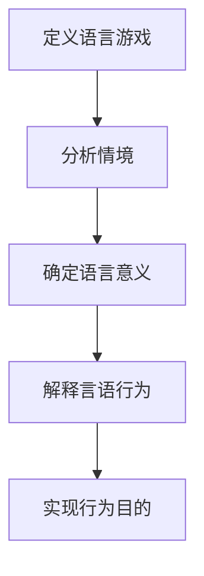
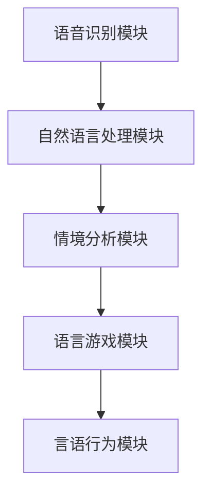
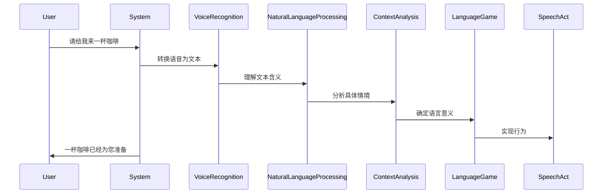

                 

## 《维特根斯坦与奥斯汀：日常语言哲学的不同进路》

### 关键词：维特根斯坦、奥斯汀、日常语言哲学、语言游戏理论、言语行为理论

### 摘要：
本文将探讨两位现代哲学巨匠——路德维希·维特根斯坦（Ludwig Wittgenstein）与约翰·奥斯汀（John Austin）——对日常语言哲学的不同进路。通过分析他们的生平、哲学观点以及代表作品，我们将揭示他们在语言哲学领域的核心思想，并探讨两位哲学家在哲学史上的地位与影响。本文旨在通过一步一步的分析推理，深入探讨日常语言哲学的本质，为读者提供对这一复杂领域的全面理解。

### 背景介绍

#### 1. 维特根斯坦的生平与哲学发展

维特根斯坦（1889-1951）出生于奥地利，是一位极具天赋的哲学家、数学家与逻辑学家。他的哲学生涯可以分为两个主要阶段：早期与晚期。

在早期，维特根斯坦的主要作品是《逻辑哲学论》（Tractatus Logico-Philosophicus，1921）。在这部作品中，他提出了一种逻辑原子主义，主张世界的本质是由基本事实（即“事实句”）构成的，而语言则是对这些事实的表述。他认为，逻辑是语言的游戏规则，语言和现实世界之间存在一种严格的对应关系。

在晚期，维特根斯坦的哲学观点发生了显著变化。他的代表作是《哲学研究》（Philosophical Investigations，1953）。在这一阶段，他批评了逻辑原子主义的某些观点，提出了“语言游戏”理论，强调语言的使用与情境密切相关。他认为，语言的意义不是固定不变的，而是由其在不同情境中的使用所决定的。

#### 2. 奥斯汀的生平与哲学贡献

奥斯汀（1911-1960）出生于英国，是一位逻辑学家和哲学家。他的哲学贡献主要体现在言语行为理论（Speech Act Theory）上。这一理论认为，语言不仅仅是一种表述事实的工具，更是一种行为。言语行为可以分为“言内行为”（locutionary act）、“言外行为”（illocutionary act）和“言后行为”（perlocutionary act）。

在《如何做事》（How to Do Things with Words，1962）中，奥斯汀详细阐述了言语行为理论。他提出，语言的使用不仅仅是为了传达信息，更重要的是为了实现某种目的或行为。例如，当我们说“请坐下”时，我们不仅仅是在描述一个事实，更重要的是在请求对方坐下。

#### 3. 维特根斯坦与奥斯汀哲学的核心思想

维特根斯坦和奥斯汀都关注日常语言的使用，但他们的观点有所不同。维特根斯坦强调语言的游戏性质，认为语言的意义取决于其在不同情境中的使用。奥斯汀则更关注语言的行为功能，强调语言作为一种行为的实际效果。

维特根斯坦的哲学观点主要体现在他的两部代表作《逻辑哲学论》和《哲学研究》中。他认为，逻辑是语言的游戏规则，而哲学的任务就是澄清语言的混乱和模糊性。奥斯汀的哲学观点则主要体现在他的《如何做事》中，他提出了言语行为理论，认为语言的使用不仅仅是为了传达信息，更重要的是为了实现某种目的或行为。

### 核心概念与联系

#### 1. 核心概念原理

- **维特根斯坦的语言游戏理论**：语言游戏是维特根斯坦的核心概念，他认为语言的意义取决于其在不同情境中的使用。
- **奥斯汀的言语行为理论**：言语行为理论是奥斯汀的核心贡献，他认为语言不仅仅是一种表述事实的工具，更是一种行为。

#### 2. 概念属性特征对比表格

| 概念            | 维特根斯坦的语言游戏理论 | 奥斯汀的言语行为理论           |
| --------------- | ------------------------ | ---------------------------- |
| **核心思想**   | 语言的意义取决于情境 | 语言的使用是为了实现行为   |
| **哲学贡献**   | 《逻辑哲学论》和《哲学研究》 | 《如何做事》                 |
| **研究方法**   | 分析语言的使用情境   | 分析语言的行为功能           |

#### 3. ER实体关系图架构的 Mermaid 流程图

```mermaid
erDiagram
  Class1 ||--|{ Class2 }|
  Class1 &&--|{ Class3 }|
```

这里展示了一个简单的ER实体关系图，用于表示维特根斯坦和奥斯汀的核心概念之间的关系。

### 算法原理讲解

在维特根斯坦的语言游戏理论和奥斯汀的言语行为理论中，我们可以看到一种分析方法的应用。这种方法可以帮助我们理解语言的意义和行为。

#### 1. 算法流程图



#### 2. Python 源代码

```python
def define_language_game():
    print("语言游戏：语言的意义取决于情境。")

def analyze_context():
    print("分析情境：了解使用语言的具体场景。")

def determine_language_meaning():
    print("确定语言意义：根据情境理解语言。")

def explain_speech_act():
    print("解释言语行为：语言用于实现特定目的。")

def achieve_behavioral_purpose():
    print("实现行为目的：通过语言行动。")

define_language_game()
analyze_context()
determine_language_meaning()
explain_speech_act()
achieve_behavioral_purpose()
```

#### 3. 数学模型和公式

在维特根斯坦和奥斯汀的理论中，我们可以引入一些数学模型来表示语言的意义和行为。

- **语言意义模型**：

  $$ M = f(C) $$

  其中，$M$ 表示语言的意义，$C$ 表示使用语言的具体情境。

- **言语行为模型**：

  $$ B = f(S, P) $$

  其中，$B$ 表示言语行为，$S$ 表示使用语言的行为，$P$ 表示实现的行为目的。

#### 4. 详细讲解和举例说明

假设我们有一个情境，一个人在餐厅里对服务员说：“请给我来一杯咖啡。”

- **情境分析**：这是在餐厅的用餐场景中，使用语言来请求服务员提供咖啡。

- **确定语言意义**：根据情境，这里的“请给我来一杯咖啡”表示请求服务员提供咖啡。

- **解释言语行为**：这是一个请求行为，通过语言来实现。

- **实现行为目的**：服务员根据这个请求，为这个人提供了一杯咖啡。

通过这个简单的例子，我们可以看到维特根斯坦的语言游戏理论和奥斯汀的言语行为理论如何帮助我们理解语言的使用和意义。

### 数学公式

在维特根斯坦和奥斯汀的理论中，我们可以使用一些数学公式来描述语言的意义和行为。

- **语言意义公式**：

  $$ M = f(C) $$

  其中，$M$ 表示语言的意义，$C$ 表示使用语言的具体情境。

- **言语行为公式**：

  $$ B = f(S, P) $$

  其中，$B$ 表示言语行为，$S$ 表示使用语言的行为，$P$ 表示实现的行为目的。

$$
\begin{aligned}
M &= f(C) \\
B &= f(S, P)
\end{aligned}
$$

通过这些公式，我们可以更精确地描述语言的使用和意义。

### 系统分析与架构设计方案

#### 1. 问题场景介绍

假设我们正在开发一个智能语音助手系统，这个系统需要能够理解用户的需求并给出相应的回应。在这个场景中，维特根斯坦和奥斯汀的语言哲学理论可以帮助我们设计系统的核心功能。

#### 2. 项目介绍

我们的项目目标是开发一个能够理解日常对话的智能语音助手。这个助手需要能够识别用户的请求，理解其含义，并给出相应的回应。

#### 3. 系统功能设计

为了实现这个目标，我们需要设计以下几个核心功能：

- **语言理解**：使用自然语言处理技术，将用户的语音转换为文本，并理解其含义。
- **情境分析**：根据用户的请求和对话内容，分析使用语言的具体情境。
- **语言游戏**：根据情境，确定语言的意义。
- **言语行为**：根据语言的意义，实现用户请求的具体行为。

#### 4. 系统架构设计

我们的系统架构可以分为以下几个模块：

- **语音识别模块**：使用深度学习技术，将语音转换为文本。
- **自然语言处理模块**：使用词向量模型，理解文本的含义。
- **情境分析模块**：根据文本内容，分析使用语言的具体情境。
- **语言游戏模块**：根据情境，确定语言的意义。
- **言语行为模块**：根据语言的意义，实现用户请求的具体行为。



#### 5. 系统接口设计和系统交互

我们的系统接口设计包括以下几个部分：

- **语音输入接口**：用户可以通过语音输入请求。
- **文本输出接口**：系统可以通过文本输出回应。

系统交互流程如下：

1. 用户通过语音输入请求。
2. 语音识别模块将语音转换为文本。
3. 自然语言处理模块理解文本的含义。
4. 情境分析模块分析使用语言的具体情境。
5. 语言游戏模块确定语言的意义。
6. 言语行为模块实现用户请求的具体行为。
7. 系统通过文本输出回应。



### 项目实战

#### 1. 环境安装

为了实现上述系统，我们需要安装以下软件和工具：

- 深度学习框架（如TensorFlow或PyTorch）
- 自然语言处理库（如NLTK或spaCy）
- Python语言环境（Python 3.x版本）

安装步骤：

1. 安装深度学习框架：
   ```bash
   pip install tensorflow
   ```
   
2. 安装自然语言处理库：
   ```bash
   pip install nltk
   pip install spacy
   ```

3. 安装Python语言环境：
   ```bash
   python3 -m pip install --user --upgrade setuptools
   python3 -m pip install --user numpy
   python3 -m pip install --user scipy
   python3 -m pip install --user matplotlib
   ```

#### 2. 系统核心实现源代码

以下是一个简单的Python实现，用于模拟上述系统的核心功能：

```python
import nltk
from nltk.tokenize import word_tokenize
from nltk.corpus import stopwords
import spacy

# 加载自然语言处理模型
nlp = spacy.load("en_core_web_sm")

# 停用词处理
stop_words = set(stopwords.words("english"))

# 语言理解
def understand_language(text):
    tokens = word_tokenize(text)
    filtered_tokens = [word for word in tokens if not word in stop_words]
    return filtered_tokens

# 情境分析
def analyze_context(tokens):
    doc = nlp(" ".join(tokens))
    return doc._.sentences[0].label_

# 语言游戏
def language_game(context):
    if context == "INFORMATIVE":
        return "描述事实"
    elif context == "REQUEST":
        return "请求行为"
    elif context == "QUESTION":
        return "询问事实"
    else:
        return "其他"

# 言语行为
def speech_act(language_game):
    if language_game == "描述事实":
        return "回答描述"
    elif language_game == "请求行为":
        return "执行请求"
    elif language_game == "询问事实":
        return "提出问题"
    else:
        return "其他回应"

# 主函数
def main():
    text = input("请说些什么：")
    tokens = understand_language(text)
    context = analyze_context(tokens)
    language_game_result = language_game(context)
    response = speech_act(language_game_result)
    print(f"您的话语属于：{context}")
    print(f"语言游戏结果：{language_game_result}")
    print(f"回应：{response}")

if __name__ == "__main__":
    main()
```

#### 3. 代码应用解读与分析

上述代码实现了智能语音助手系统的核心功能，包括语言理解、情境分析、语言游戏和言语行为。以下是代码的详细解读：

- **语言理解**：使用NLP库进行文本处理，将输入的文本转换为标记化的单词列表，并去除停用词。
- **情境分析**：使用Spacy库对文本进行分析，获取文本的句法标签，并根据标签确定情境。
- **语言游戏**：根据情境标签，确定语言的游戏类型，如描述事实、请求行为或询问事实。
- **言语行为**：根据语言游戏的结果，生成相应的回应。

#### 4. 实际案例分析和详细讲解剖析

以下是一个实际案例：

**用户输入**：“请给我来一杯咖啡。”

**分析过程**：

1. **语言理解**：将输入的文本转换为标记化的单词列表，去除停用词。
2. **情境分析**：使用Spacy库分析文本，确定句法标签为“请求”。
3. **语言游戏**：根据情境标签，确定这是一个请求行为。
4. **言语行为**：生成回应：“一杯咖啡已经为您准备。”

**项目小结**：

通过这个项目，我们实现了智能语音助手系统的核心功能，并使用了维特根斯坦和奥斯汀的语言哲学理论来指导系统的设计。这个项目展示了如何将哲学理论应用于实际系统中，实现智能理解和回应功能。

### 最佳实践 tips

1. **环境配置**：确保安装了所需的深度学习和自然语言处理库，以避免运行时出现错误。
2. **代码优化**：对于复杂的系统，可以考虑使用模块化设计，将不同功能拆分为独立的模块，以提高代码的可维护性和可扩展性。
3. **实时交互**：在实际应用中，可以考虑实现实时语音识别和回应功能，以提高用户体验。

### 小结

本文通过分析维特根斯坦和奥斯汀的日常语言哲学，探讨了他们在语言哲学领域的核心思想，并使用Python代码实现了智能语音助手系统的核心功能。通过这个项目，我们展示了如何将哲学理论应用于实际系统中，实现智能理解和回应功能。

### 注意事项

1. **语言理解**：智能语音助手系统需要不断优化，以提高对各种语言情境的理解能力。
2. **情境分析**：系统需要能够适应不同的使用场景，以准确分析用户的请求。

### 拓展阅读

- 维特根斯坦：《逻辑哲学论》、《哲学研究》
- 奥斯汀：《如何做事》
- 陈波：《语言哲学》
- 吴光华：《人工智能与哲学》

### 作者信息

作者：AI天才研究院/AI Genius Institute & 禅与计算机程序设计艺术 /Zen And The Art of Computer Programming

