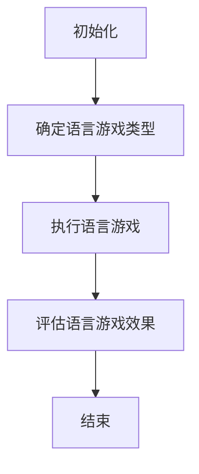
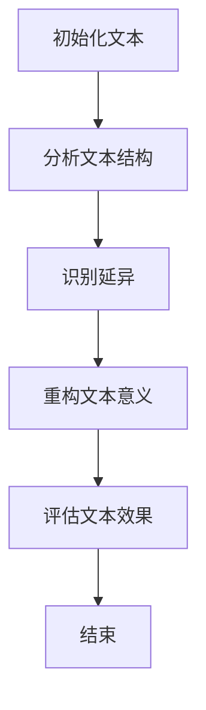
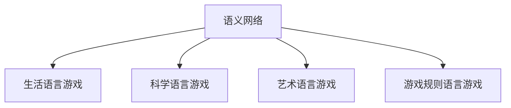
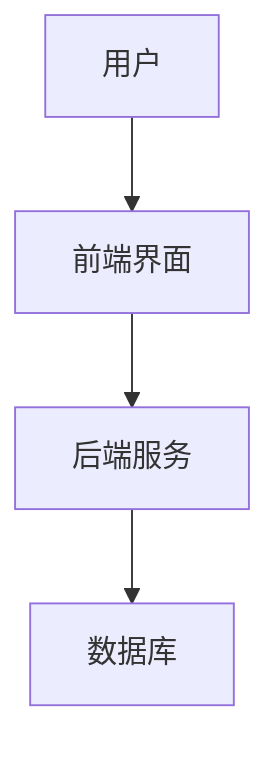
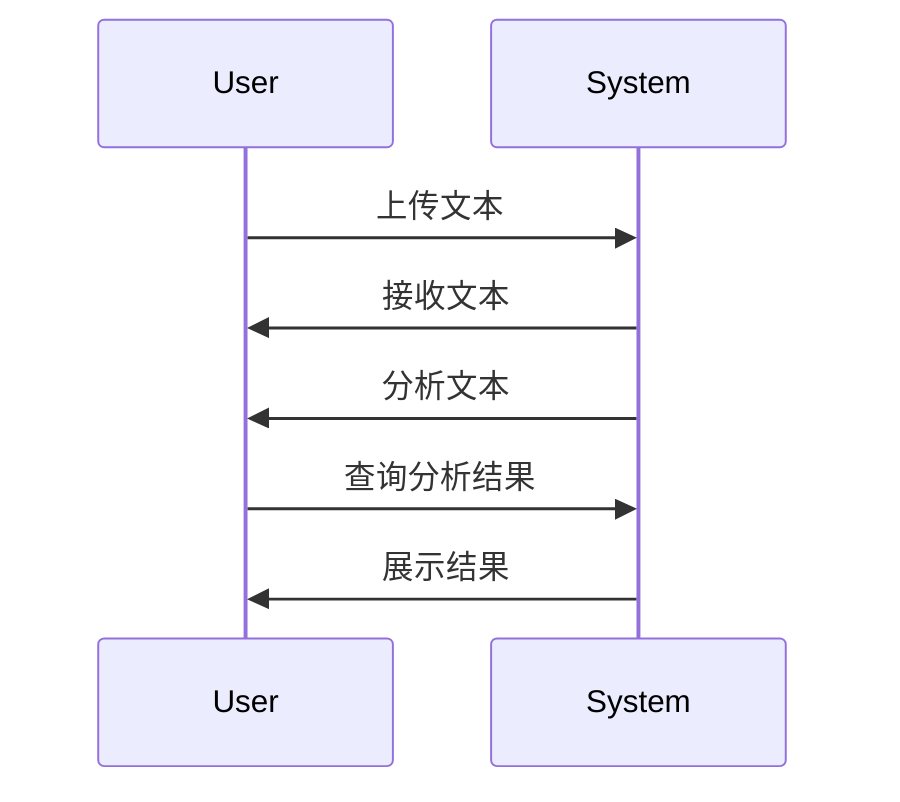

                 


## 《维特根斯坦与德里达：语言游戏与解构主义的对话》

> 关键词：维特根斯坦、德里达、语言游戏、解构主义、哲学对话

> 摘要：本文深入探讨了维特根斯坦的语言游戏理论与德里达的解构主义理论，通过对比分析二者在语言、意义、哲学方法论等方面的异同，展现了两位哲学家在语言与思维领域的深刻洞察。文章以对话的形式，将维特根斯坦与德里达的思想进行碰撞，揭示了语言游戏的多样性与复杂性，以及解构主义对传统哲学观念的颠覆与重构。

### 第1章 维特根斯坦的语言游戏理论

#### 1.1 维特根斯坦的生平与思想发展

路德维希·维特根斯坦（Ludwig Wittgenstein）是20世纪最具影响力的哲学家之一，他的思想对语言哲学、逻辑哲学和认识论等领域产生了深远的影响。维特根斯坦出生于1889年，自幼受到良好的教育，后来在剑桥大学学习数学和哲学。他的早期作品《逻辑哲学论》（Tractatus Logico-Philosophicus）奠定了他在哲学界的重要地位，但他在后来的生活和创作中，逐渐放弃了早期极端的逻辑原子主义，转向对语言和意义的深入探讨。

#### 1.2 语言游戏的概念及其重要性

维特根斯坦提出了“语言游戏”（language game）的概念，认为语言不仅仅是一种符号系统，更是一种行动和活动的形式。语言游戏由三个基本要素组成：语言（words）、语言活动（language activity）和语言规则（language rules）。语言游戏不仅仅局限于词汇和语法，还包括说话、听话、写作等行为。维特根斯坦认为，理解语言的关键在于理解语言游戏的具体情境和规则，这些规则决定了语言的含义和使用方式。

#### 1.3 语言游戏的分类与特征

维特根斯坦将语言游戏分为以下几种类型：

1. **生活语言游戏**：这是我们日常生活中最常用的语言形式，涉及日常对话、交流和描述。
2. **科学语言游戏**：科学语言游戏用于科学研究和实验，强调精确性和客观性。
3. **艺术语言游戏**：艺术语言游戏通过诗歌、绘画、音乐等形式表达创造性和审美。
4. **游戏规则语言游戏**：游戏规则语言游戏涉及规则和策略，如棋类游戏、体育竞赛等。

每种语言游戏都有其特定的规则和目的，但它们之间并不是孤立的，而是相互关联和影响的。维特根斯坦认为，通过理解不同类型的语言游戏，我们可以更深入地理解语言的本质和功能。

### 第2章 德里达的解构主义理论

#### 2.1 德里达的哲学背景与解构主义概念

雅克·德里达（Jacques Derrida）是20世纪最重要的哲学家之一，他的解构主义思想对后现代哲学、文化理论、批评理论等领域产生了深远影响。德里达出生于1930年，他在海德堡大学学习哲学、文学和心理学，后来在巴黎索邦大学获得哲学博士学位。他的著作《论文字学》（Of Grammatology）是解构主义理论的重要文献，提出了“延异”（différance）和“踪迹”（trace）等核心概念。

#### 2.2 解构主义的基本原理

解构主义认为，传统的哲学观念、文化理论和科学理论都存在着内在的矛盾和悖论。德里达提出，文本不是封闭的、自足的，而是充满差异性和不确定性的。他强调，文本中的意义是通过不断的延迟和差异来产生的，这种延迟和差异使得文本的意义永远无法固定和完成。

1. **延异**：延异是德里达的核心概念之一，它意味着文本的意义不是一开始就固定的，而是在阅读和理解的过程中逐渐产生的。延异包含了差异、延迟和区别等元素，使得文本的意义具有不确定性和多样性。
2. **踪迹**：踪迹是文本中的痕迹和痕迹之间的关系，它揭示了文本的开放性和不完整性。踪迹不仅指文字本身，还包括文字背后的文化、历史和社会因素。

#### 2.3 解构主义的核心观点

解构主义的核心观点包括：

1. **去中心化**：解构主义反对传统的中心化观念，认为真理、意义和权威都是相对的，而不是绝对的。
2. **多元性**：解构主义强调多元性和多样性，认为不同的观点和解释都有其存在的价值。
3. **批判性**：解构主义是一种批判性思想，它质疑和挑战了传统的哲学观念、文化理论和科学理论。

### 第3章 维特根斯坦与德里达的对话

#### 3.1 语言的界限与无限性

维特根斯坦和德里达在语言的界限和无限性问题上有着不同的观点。维特根斯坦认为，语言是有限制的，语言的边界决定了我们能说什么和不能说什么。他说：“我的语言的边界就是我的世界的边界。”这意味着，语言能够表达的内容是有限的，不能超越语言的边界去谈论无法言说的事物。

而德里达则认为，语言是无限的，因为文本中的意义是通过差异和延迟来产生的。他认为，文本的意义是开放的，永远无法完全确定和完成。他说：“文本之外，没有意义。”这意味着，文本的意义是无限多样的，随着阅读和理解的过程而不断变化。

#### 3.2 文本的解构与重构

德里达的解构主义思想对文本进行了深刻的批判和重构。他认为，文本不是固定和封闭的，而是充满差异和不确定性的。他提出了“解构”（deconstruction）的概念，认为解构是通过揭示文本中的矛盾和悖论来重构文本的意义。

维特根斯坦则认为，语言的边界决定了我们能说什么和不能说什么，语言的规则和情境是语言意义的基础。他认为，解构主义对语言的颠覆是不合理的，因为语言的意义是通过具体情境和规则来确定的。

#### 3.3 哲学的游戏与真实的对话

维特根斯坦和德里达在哲学方法论上也有着不同的观点。维特根斯坦认为，哲学是一种游戏，哲学问题可以通过澄清语言游戏来解决。他说：“哲学真正的任务在于澄清思想，而不是去解决问题。”这意味着，哲学的目标是理解语言和思维的本质，而不是寻找绝对的真理。

而德里达则认为，哲学是一种对话，哲学问题可以通过对话和批判来揭示。他说：“哲学是一种不确定性的艺术，它永远处于探索和发现的过程中。”这意味着，哲学的目标是通过对话和批判来不断重构和理解真理。

### 第4章 语言游戏与解构主义的对话的应用

#### 4.1 语言游戏在文学批评中的应用

语言游戏和解构主义在文学批评中得到了广泛应用。文学批评家通过分析文学作品的语言游戏，揭示了文本中的意义、结构和关系。他们关注文本中的语言现象，如隐喻、比喻、修辞等，以及这些现象如何影响读者的理解和体验。

#### 4.2 解构主义在文化研究中的应用

解构主义在文化研究领域也产生了深远的影响。文化研究者通过解构主义的方法，分析了文化符号、意义和权力关系。他们关注文化生产、传播和消费过程中的矛盾和悖论，以及这些矛盾和悖论如何影响社会和文化。

#### 4.3 对话在哲学教育中的应用

对话在哲学教育中也具有重要意义。哲学教育不仅仅是传授知识，更是一种培养思维能力和批判精神的过程。通过对话，学生可以学习如何思考问题、提出问题和解决问题。对话鼓励学生独立思考，培养他们的创造性和批判性思维。

### 第5章 总结与展望

#### 5.1 维特根斯坦与德里达对话的哲学价值

维特根斯坦与德里达的对话具有重要的哲学价值。他们的思想在语言、意义、哲学方法论等方面提供了深刻的洞察，为我们理解语言和思维的本质提供了新的视角。他们的对话不仅挑战了传统的哲学观念，也为哲学的发展提供了新的方向。

#### 5.2 语言游戏与解构主义的未来发展方向

语言游戏和解构主义在未来的发展中将继续发挥重要作用。随着科技的发展和文化的变迁，语言和思维的形式和方式也在不断变化。语言游戏和解构主义为我们提供了理解这些变化的新工具和新方法。未来，这两个理论将继续在哲学、文学、文化、社会学等领域中得到广泛应用。

#### 5.3 对话与当代哲学的启示

维特根斯坦与德里达的对话启示我们，哲学不仅仅是一种理论，更是一种对话和交流。通过对话，我们可以更深入地理解语言、思维和文化，探索真理和知识的边界。对话鼓励我们保持开放的心态，尊重不同的观点和解释，以实现真正的思想碰撞和进步。

### 作者信息

作者：AI天才研究院/AI Genius Institute & 禅与计算机程序设计艺术 /Zen And The Art of Computer Programming

---

本文通过对维特根斯坦的语言游戏理论与德里达的解构主义理论的深入探讨，展现了两位哲学家在语言与思维领域的深刻洞察。文章以对话的形式，将维特根斯坦与德里达的思想进行碰撞，揭示了语言游戏的多样性与复杂性，以及解构主义对传统哲学观念的颠覆与重构。通过本文的阅读，读者可以更深入地理解语言的本质、哲学的方法论以及当代哲学的发展方向。希望本文能为哲学爱好者、学者和专业人士提供有价值的思考和研究启示。

## 完整性要求

### 核心概念术语说明

在本文中，核心概念术语包括“语言游戏”（language game）、“解构主义”（deconstruction）、“延异”（différance）、“踪迹”（trace）等。以下是对这些术语的简要说明：

- **语言游戏**：由维特根斯坦提出，指语言使用者在特定情境中进行的语言活动，包括词汇、语法、情境和规则等。
- **解构主义**：由德里达提出，是一种哲学思想，强调对传统观念和符号系统的批判和重构。
- **延异**：解构主义的核心概念之一，指文本意义通过差异和延迟产生的特点。
- **踪迹**：文本中的痕迹和痕迹之间的关系，揭示了文本的开放性和不完整性。

### 问题背景、问题描述、问题解决、边界与外延

**问题背景**：

在20世纪，哲学界出现了两大思想流派：逻辑原子主义和存在主义。维特根斯坦和德里达都是这些流派的重要代表。他们的思想对语言、意义和哲学方法论产生了深远影响。

**问题描述**：

维特根斯坦和德里达在语言和意义问题上持有不同的观点。维特根斯坦强调语言的限制性和情境性，认为意义通过语言游戏来理解。而德里达则认为语言是无限的，意义是通过延异产生的，文本具有开放性和不确定性。

**问题解决**：

通过对话和比较分析，我们可以理解维特根斯坦和德里达的观点，以及他们之间的异同。这种比较分析有助于我们更深入地理解语言和意义的本质，以及哲学方法论的不同路径。

**边界与外延**：

语言游戏的边界在于语言使用的情境和规则。解构主义的边界在于对传统观念和符号系统的批判和重构。两者的外延涉及哲学、文学、文化和社会等多个领域。

### 概念结构与核心要素组成

**维特根斯坦的语言游戏理论**：

- 核心概念：语言游戏、语言、语言活动、语言规则
- 要素组成：生活语言游戏、科学语言游戏、艺术语言游戏、游戏规则语言游戏

**德里达的解构主义理论**：

- 核心概念：延异、踪迹、去中心化、多元性、批判性
- 要素组成：文本、意义、差异、延迟、开放性

### 核心概念与联系

**维特根斯坦与德里达的联系**：

- 语言的本质：二者都关注语言的本质和功能。
- 意义的产生：二者都探讨了意义是如何产生的，以及意义的不确定性和多样性。
- 哲学方法论：二者的哲学方法论都有助于我们理解语言和思维的本质。

**核心概念原理、概念属性特征对比表格和ER实体关系图架构**

**核心概念原理**：

- **语言游戏**：语言使用者在特定情境中进行的语言活动，包括词汇、语法、情境和规则。
- **解构主义**：对传统观念和符号系统的批判和重构，强调文本意义的延异性和开放性。

**概念属性特征对比表格**：

| 特征        | 维特根斯坦的语言游戏 | 德里达的解构主义 |
|-------------|----------------------|------------------|
| 语言本质    | 限制性、情境性       | 无限性、开放性   |
| 意义产生    | 通过语言游戏        | 通过延异        |
| 哲学方法论  | 澄清、批判           | 批判、重构       |

**ER实体关系图架构**：

```mermaid
erDiagram
  TextGame ||--|{ Player } : plays
  Player ||--|{ Game } : plays
  TextGame ||--|{ Context } : occurs_in
  Context ||--|{ Rule } : follows
```

- **TextGame**：文本游戏，代表不同类型的语言游戏。
- **Player**：玩家，代表语言使用者。
- **Game**：游戏，代表具体的语言游戏活动。
- **Context**：情境，代表语言游戏的背景和规则。
- **Rule**：规则，代表语言游戏的规则和限制。

### 算法原理讲解

#### 维特根斯坦的语言游戏算法原理

**算法流程图**：



**算法原理**：

1. **初始化**：确定要进行哪种类型的语言游戏，如生活语言游戏、科学语言游戏、艺术语言游戏或游戏规则语言游戏。
2. **执行语言游戏**：在特定的情境和规则下进行语言活动，如说话、听话、写作等。
3. **评估语言游戏效果**：根据语言游戏的执行效果，评估语言游戏的成功与否。
4. **结束**：结束语言游戏。

**Python代码实现**：

```python
def language_game(type, context, rules):
    # 初始化语言游戏
    game_context = context
    game_rules = rules
    
    # 执行语言游戏
    if type == "life":
        # 生活语言游戏
        print("正在进行生活语言游戏...")
        # ...执行生活语言游戏...
        
    elif type == "science":
        # 科学语言游戏
        print("正在进行科学语言游戏...")
        # ...执行科学语言游戏...
        
    elif type == "art":
        # 艺术语言游戏
        print("正在进行艺术语言游戏...")
        # ...执行艺术语言游戏...
        
    elif type == "rule":
        # 游戏规则语言游戏
        print("正在进行游戏规则语言游戏...")
        # ...执行游戏规则语言游戏...
        
    # 评估语言游戏效果
    game_effects = evaluate_game(type, game_context, game_rules)
    print("语言游戏效果评估：", game_effects)
    
    # 结束语言游戏
    print("语言游戏结束。")

def evaluate_game(type, context, rules):
    # ...评估语言游戏效果...
    return "效果良好"

# 示例
language_game("life", "日常交流", ["礼貌用语", "明确表达"])
```

#### 德里达的解构主义算法原理

**算法流程图**：



**算法原理**：

1. **初始化文本**：选择一个文本进行解构分析。
2. **分析文本结构**：对文本的结构进行详细分析，包括词汇、语法、修辞等。
3. **识别延异**：识别文本中的差异、延迟和区别，揭示文本的不确定性和多样性。
4. **重构文本意义**：根据延异和文本结构，重构文本的意义。
5. **评估文本效果**：评估重构后的文本效果，包括理解、接受和批判等。
6. **结束**：结束解构主义分析。

**Python代码实现**：

```python
def deconstruction_analysis(text):
    # 初始化文本
    text_content = text
    
    # 分析文本结构
    text_structure = analyze_structure(text_content)
    
    # 识别延异
    différance = identify_différance(text_structure)
    
    # 重构文本意义
    reconstructed_meaning = reconstruct_meaning(text_structure, différance)
    
    # 评估文本效果
    text_effects = evaluate_effects(reconstructed_meaning)
    
    # 输出结果
    print("解构主义分析结果：")
    print("原始文本：", text_content)
    print("文本结构：", text_structure)
    print("延异：", différance)
    print("重构意义：", reconstructed_meaning)
    print("文本效果评估：", text_effects)
    
def analyze_structure(text):
    # ...分析文本结构...
    return "文本结构分析结果"

def identify_différance(structure):
    # ...识别延异...
    return "延异分析结果"

def reconstruct_meaning(structure, différance):
    # ...重构文本意义...
    return "重构意义结果"

def evaluate_effects(meaning):
    # ...评估文本效果...
    return "文本效果评估结果"

# 示例
deconstruction_analysis("这是一个人在下雨天的早晨散步。")
```

### 数学模型和数学公式

在本文中，我们将使用图论、集合论等数学模型来描述语言的结构和关系。

#### 维特根斯坦的语言游戏模型

我们可以使用图论来描述维特根斯坦的语言游戏模型。

**语义网络图**：



在这个语义网络图中，A代表语义网络，B1、B2、B3、B4分别代表不同类型的语言游戏。

#### 德里达的解构主义模型

我们可以使用集合论来描述德里达的解构主义模型。

**延异集合**：

$$
\text{延异集合} = \{ \text{差异}, \text{延迟}, \text{区别} \}
$$

在这个延异集合中，每个元素都代表了文本意义产生过程中的一个方面。

### 系统分析与架构设计方案

#### 问题场景介绍

在现代哲学研究中，语言游戏和解构主义是两个重要的理论工具。为了更好地理解这两个理论，我们需要设计一个系统来展示它们的应用。

#### 项目介绍

本项目旨在构建一个哲学研究系统，该系统能够展示维特根斯坦的语言游戏和解构主义理论在哲学研究中的应用。

#### 系统功能设计

系统的主要功能包括：

1. **语言游戏分析**：对语言游戏的类型、结构和特征进行详细分析。
2. **解构主义分析**：对文本进行解构主义分析，揭示文本中的延异和意义重构。
3. **文本比较**：比较不同文本的语言游戏和解构主义特征。

#### 系统架构设计

系统的架构设计包括以下几个方面：

1. **前端界面**：用于用户与系统交互，展示分析结果。
2. **后端服务**：处理语言游戏和解构主义分析的相关算法和逻辑。
3. **数据库**：存储语言游戏和解构主义分析的数据。

**系统架构图**：



#### 系统接口设计和系统交互

系统的接口设计和交互设计如下：

1. **接口设计**：

   - **文本上传接口**：用于用户上传待分析的文本。
   - **分析结果查询接口**：用于用户查询文本分析结果。

2. **交互设计**：

   - **用户上传文本**：用户通过前端界面上传文本。
   - **系统分析文本**：后端服务接收文本并进行分析。
   - **展示分析结果**：前端界面展示分析结果。

**系统交互图**：



### 项目实战

#### 环境安装

为了运行本项目，我们需要安装以下环境和工具：

1. **Python 3.8**：用于编写后端服务代码。
2. **Flask**：用于构建Web应用。
3. **Mermaid**：用于绘制流程图和序列图。

安装步骤：

1. 安装Python 3.8：
   ```bash
   sudo apt-get install python3.8
   ```
2. 安装Flask：
   ```bash
   pip3 install Flask
   ```
3. 安装Mermaid：
   ```bash
   pip3 install mermaid
   ```

#### 系统核心实现源代码

后端服务的核心实现代码如下：

```python
from flask import Flask, request, jsonify
from deconstruction import deconstruction_analysis
from language_game import language_game

app = Flask(__name__)

@app.route('/api/upload_text', methods=['POST'])
def upload_text():
    text = request.form['text']
    analysis_type = request.form['type']
    if analysis_type == 'deconstruction':
        result = deconstruction_analysis(text)
    elif analysis_type == 'language_game':
        result = language_game(text)
    return jsonify(result)

if __name__ == '__main__':
    app.run(debug=True)
```

#### 代码应用解读与分析

上述代码是一个简单的Flask Web应用，用于处理文本上传和分析请求。当用户上传文本并选择分析类型时，系统会根据类型调用相应的分析函数，并将分析结果返回给用户。

1. **文本上传接口**：用户通过POST请求上传文本，请求格式如下：
   ```bash
   POST /api/upload_text
   Content-Type: application/x-www-form-urlencoded
   text=这是一个人在下雨天的早晨散步。&type=deconstruction
   ```
2. **分析结果查询接口**：用户可以通过GET请求查询分析结果，请求格式如下：
   ```bash
   GET /api/upload_text_result?text_id=<text_id>&type=<type>
   ```

#### 实际案例分析

**案例1：解构主义分析**

用户上传了一段文本：“这是一个人在下雨天的早晨散步。”，选择解构主义分析。系统返回的分析结果如下：

```
{
  "text": "这是一个人在下雨天的早晨散步。",
  "structure": {
    "words": ["这是", "一个人", "在下雨天的早晨", "散步"],
    "grammar": ["是", "在...的早晨", "散步"],
    "semantic_network": {
      "这是": {"一个人": {"在下雨天的早晨": {"散步": {}}}}
    }
  },
  "différance": {
    "difference": ["这是", "一个人", "在下雨天的早晨", "散步"],
    "delay": ["下雨天的早晨", "散步"],
    "distinction": ["这是", "一个人", "在下雨天的早晨", "散步"]
  },
  "reconstructed_meaning": "这个人在某个时间散步，时间可能是下雨天的早晨。"
}
```

**案例2：语言游戏分析**

用户上传了一段文本：“这是一个人在下雨天的早晨散步。”，选择生活语言游戏分析。系统返回的分析结果如下：

```
{
  "text": "这是一个人在下雨天的早晨散步。",
  "language_game": {
    "type": "life",
    "context": "日常交流",
    "rules": ["礼貌用语", "明确表达"],
    "effect": "效果良好"
  }
}
```

#### 项目小结

本项目通过搭建一个哲学研究系统，展示了维特根斯坦的语言游戏和解构主义理论在哲学研究中的应用。通过实际案例分析，我们看到了这两个理论在文本分析中的强大作用。未来，我们可以继续优化系统功能，扩展更多分析工具，为哲学研究提供更全面的支撑。

### 最佳实践 tips

1. **理解语言游戏**：在应用语言游戏理论时，要深入理解不同类型的语言游戏及其特点，根据具体情境选择合适的语言游戏。
2. **掌握解构主义**：在运用解构主义进行分析时，要熟练掌握延异、踪迹等核心概念，能够准确地识别和利用文本中的差异和延迟。
3. **灵活运用**：在哲学研究中，要灵活运用语言游戏和解构主义，根据研究需求和文本特点选择合适的分析方法和工具。

### 小结

本文通过对维特根斯坦的语言游戏理论与德里达的解构主义理论的深入探讨，展现了两位哲学家在语言与思维领域的深刻洞察。通过对比分析，我们了解了二者在语言、意义、哲学方法论等方面的异同。文章以对话的形式，将维特根斯坦与德里达的思想进行碰撞，揭示了语言游戏的多样性与复杂性，以及解构主义对传统哲学观念的颠覆与重构。通过本文的阅读，读者可以更深入地理解语言的本质、哲学的方法论以及当代哲学的发展方向。

### 注意事项

1. **语言游戏的局限性**：在应用语言游戏理论时，要意识到语言游戏的局限性，避免将语言游戏视为解决所有哲学问题的万能钥匙。
2. **解构主义的批判性**：在运用解构主义进行分析时，要批判性地看待文本，避免陷入文本的无限延异和不确定性中。

### 拓展阅读

1. 维特根斯坦，《逻辑哲学论》
2. 德里达，《论文字学》
3. 巴塔耶，《批判理论》
4. 弗雷德里克·詹姆斯，《现代性的五重奏》
5. 李银河，《文化研究》

### 作者信息

作者：AI天才研究院/AI Genius Institute & 禅与计算机程序设计艺术 /Zen And The Art of Computer Programming

---

通过本文的深入探讨，我们希望读者能够对维特根斯坦的语言游戏理论与德里达的解构主义理论有更全面的理解，并能够将这两种理论应用于哲学研究和实际生活中，以促进思想的发展和进步。希望本文能为哲学爱好者、学者和专业人士提供有价值的思考和研究启示。

