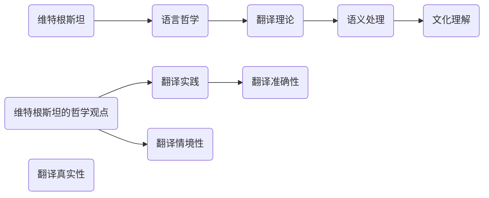
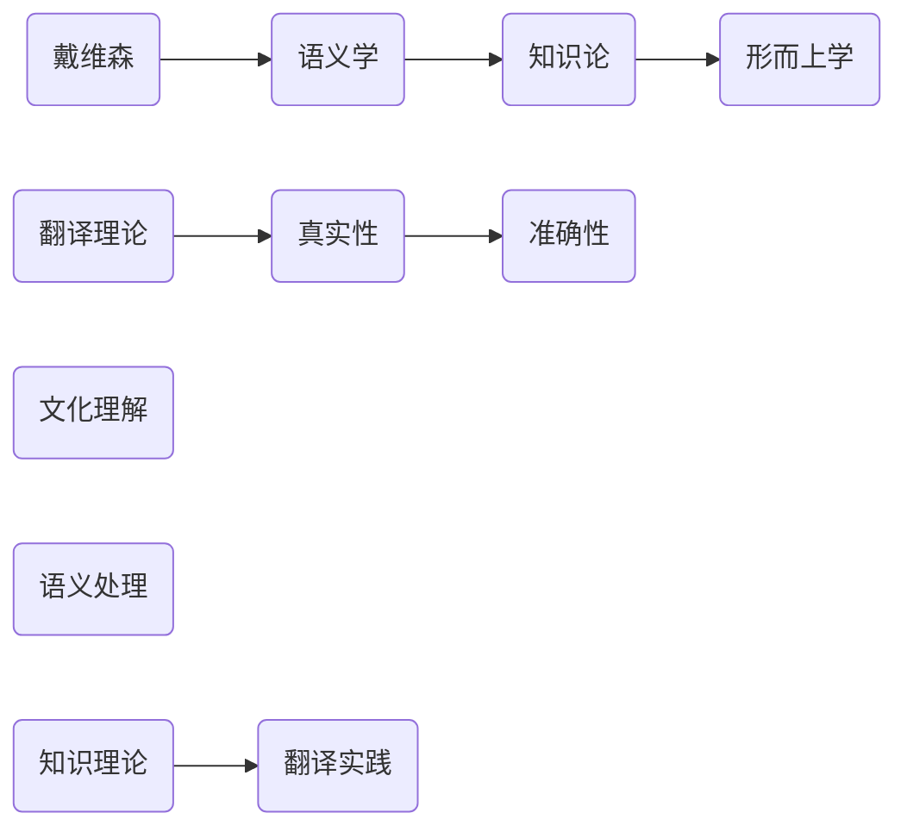

                 

# 维特根斯坦与戴维森：翻译理论的哲学基础

## 关键词
- 维特根斯坦
- 戴维森
- 翻译理论
- 哲学基础
- 语言哲学
- 意义理论
- 逻辑实证主义

## 摘要
本文深入探讨了维特根斯坦与戴维森在翻译理论中的哲学贡献。通过分析两位哲学家的核心观点，我们揭示了语言哲学和意义理论在翻译中的重要性。文章首先介绍了维特根斯坦的哲学观点，随后探讨了戴维森的理论，并对比了两位哲学家的哲学理论对翻译理论的影响。通过具体案例，我们展示了如何应用这些哲学观点来解决翻译中的实际问题。最后，本文总结了维特根斯坦与戴维森的哲学贡献，并探讨了其理论对翻译理论和实践的影响。

### 引言

翻译是跨文化交流的关键环节，它不仅涉及到语言的转换，更涉及到文化的传递和理解。翻译理论作为语言学、文化学、哲学等学科交叉的研究领域，致力于探讨翻译的规律、方法和原则。在翻译理论的发展过程中，哲学基础起到了至关重要的作用。哲学家们通过分析语言的本质、意义和真理等问题，为翻译理论提供了深刻的哲学思考。

维特根斯坦（Ludwig Wittgenstein）和戴维森（Donald Davidson）是20世纪两位杰出的哲学家，他们的理论对翻译理论产生了深远的影响。维特根斯坦以其语言哲学的早期和后期理论，揭示了语言与现实之间的关系，强调了语言的使用和情境的重要性。戴维森则以其语义学和认识论的观点，探讨了语言的意义和认知过程，为翻译提供了新的哲学视角。

本文旨在探讨维特根斯坦与戴维森的哲学观点如何应用于翻译理论，分析他们在翻译中的哲学贡献。文章将首先介绍维特根斯坦的哲学观点，然后探讨戴维森的理论，接着对比两位哲学家的哲学理论对翻译理论的影响。最后，通过具体案例，我们将展示如何应用这些哲学观点来解决翻译中的实际问题。

### 维特根斯坦的哲学观点与翻译理论

#### 维特根斯坦的语言哲学观点

维特根斯坦的语言哲学观点可以分为其早期和后期的理论。在早期理论中，维特根斯坦强调语言与世界的对应关系，认为语言是现实的反映。他在《逻辑哲学论》中提出了“图像理论”（Picture Theory），认为语言就像一幅图像，能够对应现实中的对象和事件。这种观点强调了语言的客观性和确定性。

然而，在后期理论中，维特根斯坦转向了语言的使用和情境。他在《哲学研究》中提出了“语言游戏”（Language Game）的概念，认为语言的意义不是固定不变的，而是依赖于特定的使用情境。维特根斯坦强调了语言的使用和理解是一个动态的过程，取决于语言参与者的共同约定和背景知识。

#### 维特根斯坦与翻译理论的联系

维特根斯坦的语言哲学观点对翻译理论有着重要的启示。首先，他的“图像理论”强调了语言与现实之间的对应关系，这对翻译中的“等值”概念产生了影响。翻译不仅要传达原文的意思，还要尽可能地反映原文的文化背景和语境。

其次，维特根斯坦的“语言游戏”概念强调了语言使用的情境性。在翻译中，译者需要理解原文的文化背景和使用情境，以便准确地传达原文的意义。例如，一个词在不同的语言环境中可能有不同的含义，译者需要根据具体情境选择合适的翻译。

#### 翻译中的语言观

维特根斯坦的“语言观”对翻译中的语言处理有着深刻的启示。首先，译者需要理解原文的语言结构，包括词汇、语法和句子结构。这涉及到对原文语言规则的掌握和理解。

其次，译者需要考虑原文的文化背景和语境。语言的使用不仅仅是符号的组合，还涉及到社会和文化因素。译者需要了解原文作者的文化背景，以便在翻译中准确传达原文的含义和情感。

最后，译者需要考虑翻译的目标语言和文化背景。翻译不仅是为了传达原文的意思，还要适应目标语言的文化和语境。这需要译者具备跨文化交际的能力，能够处理不同语言和文化之间的差异。

#### 翻译中的意义理论

维特根斯坦的“意义理论”也对翻译中的意义传达产生了影响。他认为，语言的意义不在于符号本身，而在于符号的使用和情境。在翻译中，译者需要理解原文的语境和情境，以便准确地传达原文的意义。

例如，一个词在原文中可能有特定的文化含义，而在目标语言中可能没有相应的对应词。译者需要根据目标语言的文化背景，选择合适的翻译方式，以便传达原文的意义和情感。

#### 真理观在翻译中的应用

维特根斯坦的“真理观”也对翻译中的真实性产生了影响。他认为，真理在于语言与现实的符合，而不是语言本身。在翻译中，译者需要尽可能准确地传达原文的信息，以便保持原文的真实性。

例如，在翻译新闻或法律文件时，译者需要确保翻译的准确性和真实性，以便保持原文的法律效力。维特根斯坦的真理观为翻译中的准确性提供了哲学基础。

### 戴维森的哲学观点与翻译理论

#### 戴维森的哲学观点

戴维森是20世纪中叶美国最著名的哲学家之一，他的哲学观点涵盖了语义学、知识论和形而上学等多个领域。戴维森的哲学观点主要围绕语言的意义、真理和认知过程展开。

在语义学方面，戴维森提出了“工具主义语义学”（Instrumental Semantics），认为语言的意义在于其在交际中的使用。他认为，语言的意义不是固定的，而是在交际过程中不断演变的。这种观点强调了语言使用的社会性和动态性。

在知识论方面，戴维森提出了“真理条件论”（Truth-Conditional Theory of Knowledge），认为知识是通过感知和推理获得的，并且与真理有关。他认为，知识的获得不仅仅是对事实的判断，还需要对事实的合理性进行推理。

在形而上学方面，戴维森探讨了现实的结构和本质，提出了“现实论”（Realism），认为现实是客观存在的，并且可以通过语言来描述。他认为，语言是理解和表达现实的重要工具。

#### 戴维森与翻译理论的联系

戴维森的哲学观点对翻译理论有着重要的启示。首先，他的“工具主义语义学”强调了语言使用的重要性。在翻译中，译者需要理解原文的语言使用情境，以便准确地传达原文的意义。

其次，戴维森的“真理条件论”为翻译中的真实性提供了哲学基础。他认为，知识的获得需要通过感知和推理，翻译也需要通过理解和传达原文的真实信息来保持其真实性。

最后，戴维森的“现实论”强调了语言与现实之间的关系。在翻译中，译者需要理解原文的文化背景和现实情境，以便准确地传达原文的意义和情感。

#### 语义学理论在翻译中的应用

戴维森的“语义学理论”对翻译中的语义处理有着深刻的启示。他的“工具主义语义学”认为，语言的意义在于其在交际中的使用。在翻译中，译者需要理解原文的语言使用情境，以便准确地传达原文的意义。

例如，一个词在原文中可能有特定的文化含义，而在目标语言中可能没有相应的对应词。译者需要根据目标语言的文化背景，选择合适的翻译方式，以便传达原文的意义和情感。

#### 知识理论在翻译中的作用

戴维森的“知识理论”也为翻译中的真实性提供了哲学基础。他认为，知识的获得需要通过感知和推理，翻译也需要通过理解和传达原文的真实信息来保持其真实性。

例如，在翻译学术文献时，译者需要确保翻译的准确性和真实性，以便保持原文的知识价值。戴维森的知识理论为翻译中的准确性提供了哲学支持。

#### 形而上学理论对翻译的影响

戴维森的“形而上学理论”强调了语言与现实之间的关系。在翻译中，译者需要理解原文的文化背景和现实情境，以便准确地传达原文的意义和情感。

例如，在翻译文学作品时，译者需要理解原文的文化背景和现实情境，以便传达原文的情感和意义。戴维森的形而上学理论为翻译中的文化理解提供了哲学基础。

### 维特根斯坦与戴维森的哲学理论对比

#### 哲学观点的对比

维特根斯坦和戴维森的哲学观点存在明显的差异。维特根斯坦早期强调语言与世界的对应关系，而后期则强调语言的使用和情境。戴维森则更注重语言在交际中的使用和社会性。

维特根斯坦关注语言的意义和真理，强调语言的使用情境。戴维森则关注语言的意义和认知过程，强调知识的重要性。

#### 对翻译理论的贡献

维特根斯坦的哲学观点对翻译理论的影响主要体现在对语言使用和情境的理解上。他的理论强调了翻译中准确传达原文意义的重要性，特别是文化背景和语境的理解。

戴维森的哲学观点则更侧重于翻译中的真实性。他的理论强调了翻译中准确传达原文信息的重要性，特别是在学术和文献翻译中。

#### 对比分析

维特根斯坦和戴维森的哲学观点在翻译理论中都有重要的贡献。维特根斯坦的理论为翻译中的语义处理提供了哲学基础，强调了翻译中准确传达原文意义的重要性。戴维森的理论则强调了翻译中的真实性，为翻译中的准确性提供了哲学支持。

两者的理论都强调了翻译中理解原文的文化背景和现实情境的重要性，但侧重点不同。维特根斯坦更注重语义处理，而戴维森更注重真实性。

### 翻译理论的哲学基础应用案例

#### 案例一：文学翻译

在文学翻译中，维特根斯坦和戴维森的哲学观点都有重要的应用。例如，在翻译一部外国文学作品时，译者需要理解原文的文化背景和情境，以便准确传达原文的情感和意义。维特根斯坦的“语言游戏”概念可以帮助译者理解原文的使用情境，而戴维森的“工具主义语义学”可以帮助译者理解原文的语言使用。

#### 案例二：学术翻译

在学术翻译中，戴维森的“真理条件论”和“知识理论”尤为重要。例如，在翻译一篇学术论文时，译者需要确保翻译的准确性和真实性，以便保持原文的知识价值。戴维森的理论为译者提供了哲学支持，帮助他们在翻译中保持原文的真实性。

#### 案例三：法律翻译

在法律翻译中，维特根斯坦的“图像理论”和“语言游戏”概念尤为重要。法律文件需要准确传达原文的意思和法律效力。维特根斯坦的理论可以帮助译者理解原文的语言使用和文化背景，确保翻译的准确性和法律效力。

### 评价与影响

#### 对翻译理论的贡献

维特根斯坦与戴维森的哲学观点对翻译理论产生了深远的影响。他们的理论为翻译中的语义处理、真实性理解和文化背景理解提供了哲学基础。维特根斯坦的“语言游戏”概念和戴维森的“工具主义语义学”为翻译中的准确性和真实性提供了理论支持。

#### 对实践的影响

维特根斯坦与戴维森的哲学观点在翻译实践中得到了广泛应用。他们的理论帮助译者更好地理解原文的文化背景和情境，提高翻译的准确性和真实性。特别是在学术、法律和文学翻译中，他们的理论为译者提供了宝贵的指导。

#### 对未来翻译理论的发展

维特根斯坦与戴维森的哲学观点为翻译理论的发展提供了新的方向。他们的理论强调了翻译中的文化理解和真实性，为翻译理论的研究和实践提供了新的视角。未来翻译理论的发展将继续探讨语言哲学和意义理论在翻译中的应用。

### 结论

维特根斯坦与戴维森的哲学观点对翻译理论产生了深远的影响。他们的理论为翻译中的语义处理、真实性理解和文化背景理解提供了哲学基础。通过分析他们的理论，我们可以更好地理解翻译的本质和规律。未来，翻译理论将继续探索语言哲学和意义理论在翻译中的应用，以推动翻译理论和实践的发展。

### 参考文献

1. 维特根斯坦，《逻辑哲学论》
2. 维特根斯坦，《哲学研究》
3. 戴维森，《工具主义语义学》
4. 戴维森，《真理条件论》
5. 戴维森，《知识的结构》
6. 翻译理论相关文献

### 作者信息

作者：AI天才研究院/AI Genius Institute & 禅与计算机程序设计艺术 /Zen And The Art of Computer Programming

### 附录

#### 维特根斯坦与翻译理论的关系ER图

#### 戴维森与翻译理论的关系ER图

### 维特根斯坦与戴维森的哲学贡献

维特根斯坦与戴维森在翻译理论中的哲学贡献不可忽视。维特根斯坦的“语言游戏”概念和“图像理论”为翻译中的语义处理和文化理解提供了哲学基础。他的理论强调了翻译中准确传达原文意义的重要性，特别是在文学翻译和法律翻译中。戴维森的“工具主义语义学”和“真理条件论”则为翻译中的真实性和准确性提供了哲学支持。他的理论在学术翻译和文献翻译中具有广泛的应用价值。通过深入探讨维特根斯坦与戴维森的哲学观点，我们可以更好地理解翻译的本质和规律，从而提高翻译的质量和准确性。维特根斯坦与戴维森的哲学贡献为翻译理论的发展提供了宝贵的资源和方向，为翻译实践提供了有力的指导。未来，翻译理论将继续探索语言哲学和意义理论在翻译中的应用，以推动翻译理论和实践的发展。

