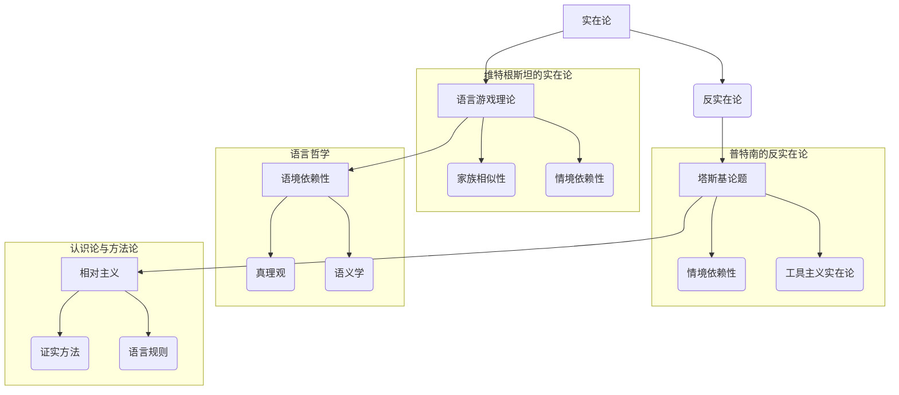
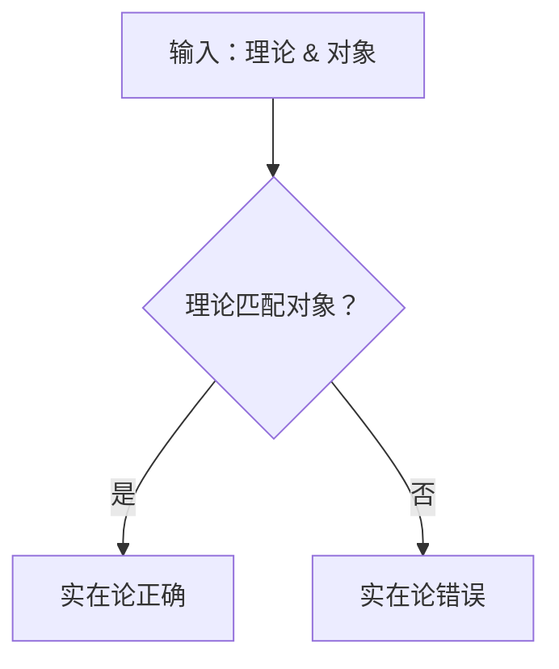
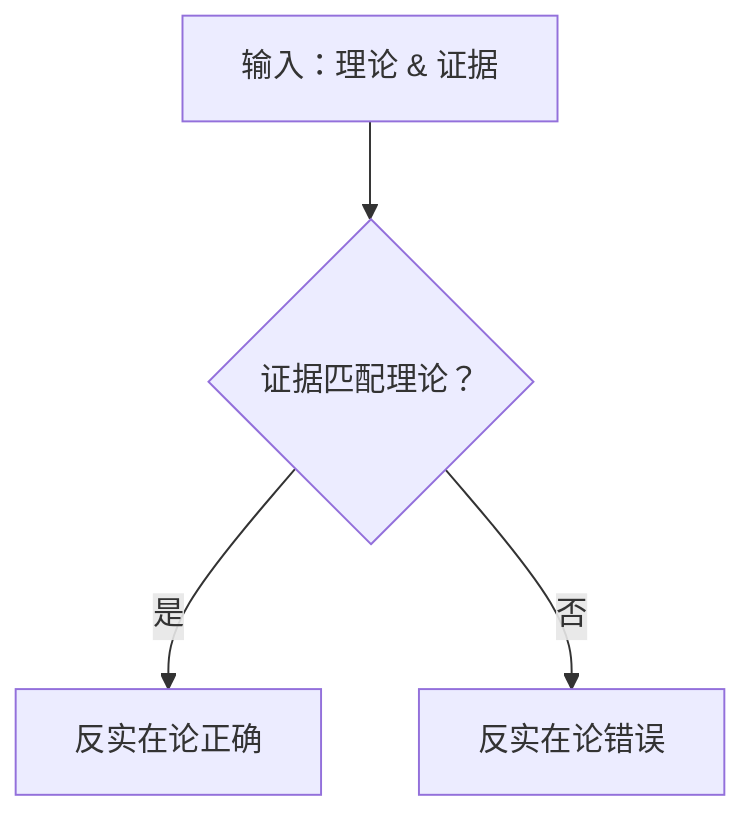
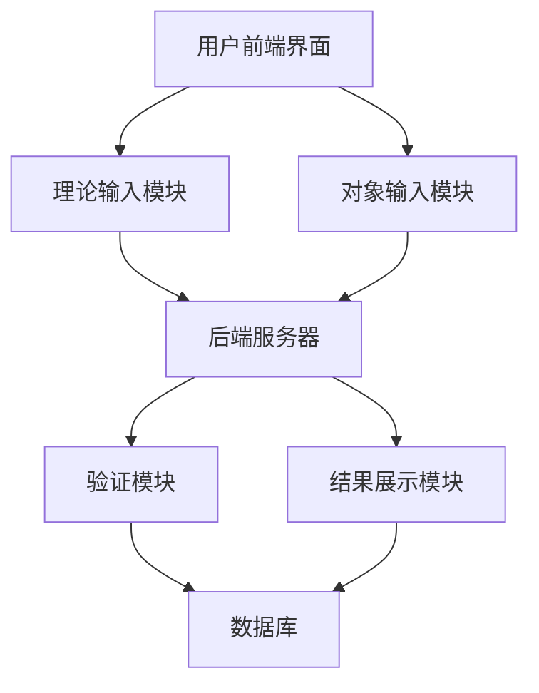
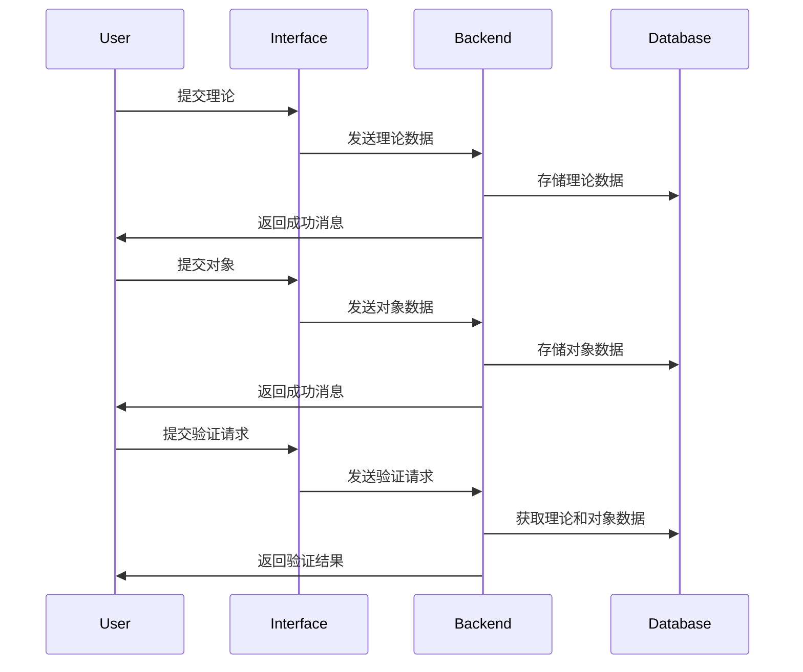

                 

### 《维特根斯坦与普特南：实在论与反实在论的语言之争》引论

在哲学的长河中，语言与实在的关系一直是一个经久不衰的话题。实在论与反实在论之争，作为语言哲学的一个重要分支，为我们提供了探讨这一关系的不同视角。本文将聚焦于两位杰出的哲学家——路德维希·维特根斯坦（Ludwig Wittgenstein）与侯世达·普特南（Hilary Putnam）——他们在这一领域中的观点和争论。

### 实在论与反实在论的争论背景

实在论与反实在论之争起源于对语言本质的探讨。实在论认为语言是反映现实世界的工具，而反实在论则认为语言有其独立性，语言与现实世界之间并不存在一一对应的关系。这一争论不仅涉及哲学，还涵盖了认识论、语言学和逻辑学等多个领域。

在20世纪，维特根斯坦与普特南分别代表了实在论与反实在论的不同流派。维特根斯坦以其独特的语言游戏理论，强调了语言使用的情境性和具体性。而普特南则提出了“塔斯基论题”和“包萝卜”思想实验，对实在论进行了有力的挑战。

### 维特根斯坦的实在论观点

维特根斯坦的语言哲学可以被概括为“日常语言哲学”。他主张语言的意义在于使用中的具体情境，即“语言游戏”（language game）。维特根斯坦认为，语言与世界的对应关系并非固定不变，而是依赖于特定的使用情境。

**维特根斯坦的实在论观点及其论证**

维特根斯坦认为，语言和世界之间的关系是互动的。语言不仅仅是对世界的描述，更是人类行为的工具。他通过一系列的“语言游戏”来阐述这一点。每个语言游戏都有一套特定的规则，这些规则决定了语言如何与实际世界互动。

维特根斯坦认为，日常语言中存在着许多“家族相似性”，即相似的词汇和概念并非具有相同的定义，而是在不同的语境中有不同的用法。这种多样性使得我们能够灵活地使用语言，从而更好地理解和反映现实世界。

### 普特南的反实在论观点

普特南是分析哲学的重要代表，他的哲学观点被归类为“工具主义实在论”或“内在实在论”。普特南认为，虽然语言有其独立性，但现实世界仍然是语言使用的基础。

**普特南的哲学思想**

普特南提出了“塔斯基论题”，该论题揭示了真理概念在语言中的应用问题。他提出，真理并非客观存在，而是依赖于语言规则和语境。这一观点对传统的真理观提出了挑战。

普特南还通过“包萝卜”思想实验，探讨了名称与所指之间的关系。在这个实验中，一个观点认为我们无法通过一个名称来确定其真实所指，因为名称的意义是依赖于使用者的语言环境和认知过程。

### 维特根斯坦与普特南观点比较

维特根斯坦和普特南的观点在许多方面存在显著差异：

**实在论与反实在论在观点上的异同**

- **实在论的视角**：维特根斯坦认为语言和世界是互动的，语言游戏中的规则是固定的，而语言的意义则取决于具体的使用情境。
- **反实在论的视角**：普特南则认为语言有其独立性，真理和名称的指涉并非绝对，而是依赖于特定的语境和认知过程。

**维特根斯坦与普特南在哲学方法上的差异**

- **维特根斯坦**：他更注重语言的日常用法，通过具体例子和语言游戏来阐述观点，强调情境的重要性。
- **普特南**：他则通过逻辑分析和思想实验，提出对传统实在论观点的挑战，强调语境和认知过程在理解语言中的作用。

### 对语言哲学的影响

维特根斯坦和普特南的观点对语言哲学产生了深远的影响。他们的争论促使我们重新思考语言与现实世界的关系，探讨语言的多样性和语境的重要性。

维特根斯坦的日常语言哲学强调了语言的具体性和情境性，对语言学和认知科学的发展产生了重要影响。普特南的工具主义实在论则为我们理解真理和语言规则提供了新的视角，影响了逻辑学和认识论的研究。

### 对认识论与方法论的影响

维特根斯坦和普特南的争论也影响了认识论和方法论的研究。维特根斯坦的观点促使我们反思认知过程中的情境性和具体性，而普特南的工具主义实在论则强调了认知过程中的相对性和多样性。

这种争论不仅为我们提供了理解世界的新工具，也促使我们在哲学研究中更加关注语境和情境的作用，推动认识论和方法论的进一步发展。

### 对当前哲学争论的启示

维特根斯坦与普特南的实在论与反实在论之争为我们提供了深刻的启示。他们的观点不仅挑战了传统的实在论观念，也为我们重新思考语言、认知和现实世界的关系提供了新的思路。

在当前哲学研究中，这种争论仍然具有重要意义。它提醒我们，在探讨哲学问题时，必须考虑到语言和情境的复杂性，避免简单化和绝对化的思考方式。这种开放和包容的态度有助于我们更全面地理解哲学问题，推动哲学研究的深入发展。

### 总结

维特根斯坦与普特南的实在论与反实在论之争是哲学史上的一次重要对话。他们的观点不仅丰富了我们对语言、认知和现实世界的理解，也为我们提供了新的研究方法和视角。通过深入探讨他们的理论，我们可以更好地理解哲学的核心问题，为未来的哲学研究奠定基础。在接下来的章节中，我们将进一步分析他们的观点，探讨他们的争论对当代哲学的影响。让我们继续深入思考，探索这一哲学难题的更多可能性。## 第一部分：引论

### 1.1 问题的提出

在哲学的广阔领域中，语言与实在的关系一直是一个备受关注的核心问题。这个问题的本质在于探讨语言如何与外部世界互动，以及我们如何通过语言来理解世界。实在论与反实在论的争论，正是围绕着这一基本问题展开的。本文旨在深入探讨两位哲学巨匠——路德维希·维特根斯坦（Ludwig Wittgenstein）与侯世达·普特南（Hilary Putnam）——在语言与现实关系上的观点，并分析他们之间的争论。

#### 实在论与反实在论的争论背景

实在论与反实在论的争论可以追溯到哲学的起源。实在论认为，语言是现实世界的正确反映，词汇和概念与外部世界的对象和属性之间存在直接的对应关系。反实在论则主张，语言有其独立性，词汇和概念的指涉并非绝对，而是依赖于特定的语境和认知过程。

在20世纪，维特根斯坦与普特南分别代表了实在论与反实在论的不同流派。维特根斯坦以其独特的语言游戏理论，强调了语言使用的情境性和具体性。而普特南则提出了“塔斯基论题”和“包萝卜”思想实验，对实在论进行了有力的挑战。

#### 维特根斯坦的实在论观点

维特根斯坦的哲学观点可以概括为“日常语言哲学”。他主张语言的意义在于使用中的具体情境，即“语言游戏”（language game）。维特根斯坦认为，语言和世界之间的关系是互动的。语言不仅仅是对世界的描述，更是人类行为的工具。他通过一系列的“语言游戏”来阐述这一点。每个语言游戏都有一套特定的规则，这些规则决定了语言如何与实际世界互动。

维特根斯坦认为，日常语言中存在着许多“家族相似性”，即相似的词汇和概念并非具有相同的定义，而是在不同的语境中有不同的用法。这种多样性使得我们能够灵活地使用语言，从而更好地理解和反映现实世界。

#### 普特南的反实在论观点

普特南是分析哲学的重要代表，他的哲学观点被归类为“工具主义实在论”或“内在实在论”。普特南认为，虽然语言有其独立性，但现实世界仍然是语言使用的基础。他提出了“塔斯基论题”，该论题揭示了真理概念在语言中的应用问题。他提出，真理并非客观存在，而是依赖于语言规则和语境。这一观点对传统的真理观提出了挑战。

普特南还通过“包萝卜”思想实验，探讨了名称与所指之间的关系。在这个实验中，一个观点认为我们无法通过一个名称来确定其真实所指，因为名称的意义是依赖于使用者的语言环境和认知过程。

### 结论

维特根斯坦与普特南的实在论与反实在论之争，为我们提供了理解语言与现实关系的不同视角。通过深入分析他们的观点，我们可以更好地理解这一哲学难题的复杂性。在接下来的部分中，我们将进一步探讨维特根斯坦的实在论观点，分析他对语言和世界的互动关系的理解。## 第二部分：实在论与反实在论的争论

### 2.1 语言与世界的关系

在探讨实在论与反实在论的争论时，我们必须首先明确语言与世界的关系。这个关系模型构成了双方争论的核心。实在论者和反实在论者在这个问题上有不同的立场和观点。

#### 实在论者的观点

实在论者认为，语言与世界之间存在直接而固定的对应关系。具体来说，每个词汇和概念都有其唯一对应的现实世界的对象和属性。例如，当我们使用“树”这个词时，我们的脑海中会浮现出一种特定的树木形象，这种形象与现实世界中的树木具有一一对应的关系。

实在论者认为，这种对应关系是语言能够有效地反映现实世界的基础。语言的作用在于准确描述世界，使得我们可以通过语言来理解、沟通和互动。维特根斯坦在其早期作品中，如《逻辑哲学论》（Tractatus Logico-Philosophicus），就强调了这种语言与世界的一一对应关系。

#### 反实在论者的观点

反实在论者则主张，语言与世界之间的关系并非那么简单和直接。他们认为，语言具有一定的独立性，其意义和指涉并非固定不变，而是依赖于特定的语境和认知过程。例如，普特南通过“塔斯基论题”和“包萝卜”思想实验，探讨了真理和名称的指涉问题。

**塔斯基论题**：这个论题指出，任何关于真理的陈述，都必须依赖于特定的语言规则和语境。因此，真理并非客观存在，而是相对的、依赖于语言和语境的。

**包萝卜**思想实验：在这个实验中，普特南提出，一个名称（如“包萝卜”）的意义并非直接指涉现实世界中的特定对象，而是依赖于使用者的认知和语言环境。这意味着，即使在相同的物理环境中，不同的人可能会有不同的名称指涉。

#### 实在论与反实在论在这一问题上的立场

- **实在论立场**：实在论者认为，语言的意义和指涉是固定的，可以与外部世界的对象和属性直接对应。这种观点强调语言作为描述和反映现实世界的工具性作用。
- **反实在论立场**：反实在论者则认为，语言的意义和指涉是相对的、情境依赖的。他们强调语言的多样性和复杂性，认为语言不仅仅是对现实的描述，还受到认知和文化因素的影响。

### 真理与证实

在讨论语言与世界的关系时，真理和证实是两个不可或缺的概念。实在论与反实在论在真理和证实方法上存在显著的差异。

#### 实在论的真理观

实在论者认为，真理是语言与世界之间正确对应的结果。具体来说，一个陈述只有在与外部世界的实际情况相符时，才被认为是真的。例如，“今天天气晴朗”这个陈述只有在现实世界中确实没有云彩时，才能被认为是真的。

实在论者认为，真理的证实是客观的、直接的。通过观察和经验，我们可以确定语言陈述的真实性。维特根斯坦在其早期作品中强调了这种客观性，认为语言游戏中的规则是固定的，真理在于语言与世界的一致性。

#### 反实在论的真理观

反实在论者则认为，真理并非客观存在，而是依赖于特定的语言规则和语境。他们提出了“相对主义真理观”，认为真理是相对的、情境依赖的。例如，普特南通过“塔斯基论题”指出，真理的判断必须依赖于特定的语言规则和背景知识。

**塔斯基论题**：这个论题揭示了任何关于真理的陈述都必须依赖于特定的语言规则和语境。因此，真理并非客观存在，而是相对的、依赖于语言和语境的。

#### 证实方法与反实在论的挑战

实在论者主张，通过直接观察和经验来证实陈述的真实性。然而，反实在论者则认为，这种证实方法是有局限的。他们认为，即使我们通过观察和经验证实了某个陈述的真实性，也无法保证在其他语言环境和认知过程中，这个陈述仍然成立。

例如，普特南通过“包萝卜”思想实验指出，一个名称的意义并非直接指涉现实世界中的特定对象，而是依赖于使用者的认知和语言环境。这意味着，即使在相同的物理环境中，不同的人可能会有不同的名称指涉。这种情境依赖性使得传统的证实方法面临挑战。

### 结论

实在论与反实在论在语言与世界的关系、真理和证实方法上存在显著的差异。实在论强调语言与世界之间的直接对应关系，认为真理是客观的、可以通过直接观察和经验证实。反实在论则主张语言的情境依赖性，认为真理是相对的、依赖于特定的语言规则和语境。

这种争论不仅丰富了我们对语言、认知和现实世界的理解，也促使我们在哲学研究中更加关注语境和情境的作用。在接下来的部分中，我们将进一步探讨普特南的反实在论观点，分析他对语言与世界关系的独特见解。## 第三部分：普特南的“包萝卜”思想实验

### 3.1 “包萝卜”思想实验的背景

普特南的“包萝卜”思想实验是他在探讨名称与所指关系时提出的一个经典例子。这个实验旨在揭示语言指涉的情境依赖性和相对性。背景设定如下：

设想有两个相同的环境，每个环境中都有一包红色的萝卜。现在，我们将这两个环境分别称为“环境A”和“环境B”。在环境A中，人们习惯将这包萝卜称为“包萝卜”，而在环境B中，人们则称其为“包胡萝卜”。

### 3.2 思想实验的过程

在这个思想实验中，我们关注的是两个关键问题：

1. **名称的指涉是否固定？**
2. **名称的意义是否依赖于语境？**

**问题1：名称的指涉是否固定？**

首先，我们考虑名称“包萝卜”的指涉。在环境A中，人们将这包红色萝卜称为“包萝卜”，因此，“包萝卜”指涉的是这包红色萝卜。然而，如果我们将同样的环境移动到环境B，人们却称其为“包胡萝卜”，这意味着“包萝卜”的指涉发生了变化。

这个现象表明，名称的指涉并非固定不变，而是依赖于特定的语境。即使在相同的物理环境中，不同的语言环境和习惯可能会导致不同的名称指涉。

**问题2：名称的意义是否依赖于语境？**

其次，我们探讨名称的意义是否依赖于语境。在环境A中，“包萝卜”的意义是指一包红色的萝卜。而在环境B中，“包萝卜”的意义则是指一包胡萝卜。这种语境依赖性进一步表明，名称的意义并非独立于语境，而是在特定的语言环境中形成的。

### 3.3 思想实验对实在论与反实在论的影响

“包萝卜”思想实验对实在论与反实在论产生了重要影响：

**对实在论的挑战**：

实在论主张名称的指涉和意义是固定的，与外部世界存在直接对应关系。然而，“包萝卜”思想实验表明，名称的指涉和意义是相对的、依赖于特定的语境。这意味着，实在论关于名称固定指涉的观点可能是不准确的。

**对反实在论的验证**：

反实在论强调语言的情境依赖性和相对性。通过“包萝卜”思想实验，普特南提供了有力的证据来支持这一观点。实验表明，名称的指涉和意义确实是依赖于特定的语境和认知过程的。这一发现为反实在论提供了有力的支持，进一步质疑了实在论的合理性。

### 3.4 思想实验对语言哲学的启示

“包萝卜”思想实验对语言哲学的启示主要体现在以下几个方面：

1. **语境依赖性**：实验强调了语境在语言指涉和意义形成中的重要性。这促使我们重新思考语言的使用和理解过程，认识到语境对于语言意义的影响。

2. **相对主义**：实验揭示了名称指涉和意义的相对性，挑战了传统的实在论观点。这促使我们在研究语言哲学问题时，更加关注相对主义和情境依赖性的作用。

3. **认知与文化因素**：实验提醒我们，名称的指涉和意义不仅受语言环境的影响，还受到认知和文化因素的影响。这为语言哲学研究提供了新的视角，促使我们更加全面地考虑这些因素在语言指涉和意义形成中的作用。

### 结论

普特南的“包萝卜”思想实验通过一个简单而具体的例子，揭示了名称指涉和意义的情境依赖性和相对性。这一实验对实在论与反实在论的争论产生了重要影响，支持了反实在论的观点，并为我们重新思考语言、认知和现实世界的关系提供了新的启示。在接下来的部分中，我们将探讨维特根斯坦对“包萝卜”思想实验的回应，进一步分析两位哲学家之间的争论。## 3.4 维特根斯坦对“包萝卜”思想实验的回应

维特根斯坦对普特南的“包萝卜”思想实验持有不同的观点，并提出了自己的批判和回应。他的回应主要体现在以下几个方面：

### 维特根斯坦的观点

首先，维特根斯坦认为，普特南的思想实验实际上低估了语言在日常生活中的使用方式。维特根斯坦认为，语言的使用是具体的、情境依赖的，但并不意味着名称的指涉是相对的或模糊的。他通过以下论点来回应普特南：

1. **日常语言中的明确指涉**：维特根斯坦强调，在日常生活中，我们使用语言时，名称的指涉通常是明确且固定的。例如，当一个人说“包萝卜”时，他通常指的是眼前这包红色的萝卜。尽管在不同的语境中，名称可能会有所变化，但这种变化是基于明确的使用规则，而不是模糊或不确定的指涉。

2. **语言游戏的规则**：维特根斯坦主张，每个语言游戏都有其特定的规则，这些规则决定了语言的使用方式。例如，在一个特定的语言游戏中，人们可能会遵循特定的命名规则，以确保名称与所指的一致性。这意味着，即使在不同环境中，名称的指涉也可以通过这些规则保持明确和固定。

### 维特根斯坦对思想实验的批判与回应

1. **对情境依赖性的误解**：维特根斯坦认为，普特南对情境依赖性的理解存在误解。他批评普特南没有充分认识到语言在日常使用中的固定性和规则性。维特根斯坦指出，尽管语言在不同环境中可能会有所变化，但这种变化是规则性的、有序的，而不是模糊或不确定的。

2. **反实在论的挑战**：维特根斯坦认为，普特南的反实在论观点忽略了语言与行为之间的紧密联系。他指出，语言不仅是一种认知工具，更是一种行动指南。因此，即使语言的使用受到情境的影响，这种影响也是通过具体的语言游戏规则来调节的，而不是导致名称指涉的模糊或不确定。

### 维特根斯坦的批判与哲学意义

维特根斯坦的批判揭示了实在论与反实在论之间的核心分歧。他的观点强调了语言在日常生活中的明确性和规则性，从而为实在论提供了一种新的解释框架。这种批判对语言哲学产生了深远的影响，促使我们重新思考语言与现实世界的关系，以及语言在认知和行为中的作用。

具体来说，维特根斯坦的批判具有以下哲学意义：

1. **语言与行为的关系**：维特根斯坦强调了语言在行为中的指导作用。他认为，语言不仅仅是描述世界的工具，更是行动的指南。这种观点为我们提供了新的视角，使我们能够更好地理解语言在人类行为和认知过程中的作用。

2. **情境依赖性与规则性**：维特根斯坦的批判揭示了情境依赖性与规则性之间的相互作用。他认为，尽管语言的使用受到情境的影响，但这种影响是受规则调节的。这种观点有助于我们理解语言在日常生活中的使用方式，以及情境如何影响语言的意义和指涉。

3. **实在论与反实在论的调和**：维特根斯坦的批判提供了一种调和实在论与反实在论的途径。他的观点表明，即使在情境依赖性存在的情况下，我们仍然可以通过具体的语言游戏规则来保持名称的明确指涉。这种调和为我们理解语言与现实世界的关系提供了一种新的思路。

### 结论

维特根斯坦对“包萝卜”思想实验的批判与回应，为我们提供了理解语言与现实世界关系的不同视角。他的观点强调了语言的明确性和规则性，为实在论提供了一种新的解释框架。这种批判不仅揭示了实在论与反实在论之间的核心分歧，也为我们理解语言在行为和认知中的作用提供了新的启示。在接下来的部分中，我们将进一步探讨维特根斯坦与普特南的观点比较，分析两位哲学家在语言哲学领域的异同。## 第三部分：比较与评价

### 3.1 维特根斯坦与普特南的观点比较

维特根斯坦与普特南在实在论与反实在论之争中代表了两种截然不同的哲学立场。他们的观点不仅在本质上有显著差异，而且在方法论上也有所区别。以下是对他们观点的比较：

#### 实在论与反实在论在观点上的异同

**维特根斯坦的实在论观点**

- **语言游戏理论**：维特根斯坦认为，语言的意义在于使用中的具体情境，即“语言游戏”。每个语言游戏都有其特定的规则，这些规则决定了语言如何与实际世界互动。
- **家族相似性**：维特根斯坦主张日常语言中存在着许多“家族相似性”，即相似的词汇和概念并非具有相同的定义，而是在不同的语境中有不同的用法。这种多样性使得我们能够灵活地使用语言，从而更好地理解和反映现实世界。
- **情境依赖性**：维特根斯坦认为，语言的使用是具体的、情境依赖的，但名称的指涉通常是明确且固定的。

**普特南的反实在论观点**

- **塔斯基论题**：普特南提出，任何关于真理的陈述都必须依赖于特定的语言规则和语境。因此，真理并非客观存在，而是相对的、依赖于语言和语境的。
- **情境依赖性**：普特南认为，名称的指涉和意义是相对的、依赖于特定的语境和认知过程的。例如，通过“包萝卜”思想实验，普特南揭示了名称的指涉是情境依赖的。
- **工具主义实在论**：普特南主张，现实世界仍然是语言使用的基础，但语言的意义和指涉并非固定不变。

#### 维特根斯坦与普特南在哲学方法上的差异

- **维特根斯坦**：他更注重语言的日常用法，通过具体例子和语言游戏来阐述观点，强调情境的重要性。
- **普特南**：他则通过逻辑分析和思想实验，提出对传统实在论观点的挑战，强调语境和认知过程在理解语言中的作用。

### 3.2 实在论与反实在论的哲学意义

维特根斯坦与普特南的实在论与反实在论之争在哲学上具有重要的意义，具体体现在以下几个方面：

#### 对语言哲学的影响

- **维特根斯坦**：他的日常语言哲学强调了语言的具体性和情境性，对语言学和认知科学的发展产生了重要影响。
- **普特南**：他的工具主义实在论为我们理解真理和语言规则提供了新的视角，影响了逻辑学和认识论的研究。

#### 对认识论与方法论的影响

- **维特根斯坦**：他促使我们反思认知过程中的情境性和具体性，强调情境对语言和理解的重要性。
- **普特南**：他强调认知过程中的相对性和多样性，挑战了传统的真理观和证实方法。

#### 对现实世界的理解

- **维特根斯坦**：他的观点提醒我们在理解现实世界时，必须考虑到语言和情境的复杂性。
- **普特南**：他的观点使我们意识到现实世界与语言之间的互动关系是相对的、情境依赖的。

### 3.3 对当前哲学争论的启示

维特根斯坦与普特南的争论为我们提供了深刻的启示，具体体现在以下几个方面：

- **语境和情境的重要性**：他们的观点提醒我们，在探讨哲学问题时，必须考虑到语言和情境的复杂性。
- **相对主义和多元主义**：他们的争论促使我们更加关注相对主义和多元主义在理解现实世界中的作用。
- **开放的哲学态度**：他们的争论鼓励我们在哲学研究中保持开放和包容的态度，避免简单化和绝对化的思考方式。

### 结论

维特根斯坦与普特南的实在论与反实在论之争在哲学上具有重要的意义。他们的观点不仅丰富了我们对语言、认知和现实世界的理解，也为哲学研究提供了新的视角和方法。通过深入分析他们的理论，我们可以更好地理解哲学的核心问题，为未来的哲学研究奠定基础。## 附录

### 4.1 维特根斯坦与普特南的主要著作

#### 维特根斯坦的著作列表

1. **《逻辑哲学论》（Tractatus Logico-Philosophicus）**：这是维特根斯坦的早期作品，提出了著名的逻辑原子论和语言游戏理论。
2. **《哲学研究》（Philosophical Investigations）**：这是维特根斯坦的后期作品，进一步发展了他的日常语言哲学思想。
3. **《文化与价值》（Culture and Value）**：这是维特根斯坦的一组演讲和论文集，涉及伦理学、美学和宗教哲学等多个领域。

#### 普特南的著作列表

1. **《理性、真理与历史》（Reason, Truth and History）**：这是普特南的代表作之一，提出了他的工具主义实在论和知识论观点。
2. **《意义与指涉》（Meaning and Reference）**：这本书是普特南对语言哲学和语义学问题的重要讨论。
3. **《心智与世界》（Mind and World）**：这是普特南对心灵哲学和认识论问题的一系列讨论，影响深远。

### 4.2 进一步阅读文献

对于希望深入了解维特根斯坦与普特南哲学思想的读者，以下是一些推荐书籍和学术论文：

#### 相关哲学书籍推荐

1. **《维特根斯坦读本》（Wittgenstein Readings）**：编辑迈克尔·多布斯（Michael Dummett）的这本选集包含了维特根斯坦的重要文本和评论。
2. **《普特南哲学》（Hilary Putnam's Philosophy）**：作者约翰·罗杰斯（John R. Searle）的这本书详细分析了普特南的哲学思想和贡献。
3. **《语言哲学导论》（An Introduction to Language Philosophy）**：作者特鲁迪·坎恩（Trudy Govier）的这本书涵盖了语言哲学的多个方面，包括维特根斯坦和普特南的观点。

#### 学术论文与研究报告

1. **普特南：《名称与实在》（"Names and Reality"）**：这是普特南的一篇重要论文，提出了他的“塔斯基论题”和“包萝卜”思想实验。
2. **帕菲特：《语言游戏的逻辑》（"The Logic of Language Games"）**：这是维特根斯坦的弟子玛丽-阿莉斯·帕菲特（Mari-Louise Pape）对维特根斯坦语言游戏理论的深入分析。
3. **丹托：《语言与实在》（"Language and Reality"）**：丹托在这篇文章中探讨了语言与现实之间的关系，对维特根斯坦和普特南的观点进行了综合评价。

这些推荐书籍和学术论文将为读者提供更深入的理解和探索，帮助他们在哲学研究的道路上取得更多的进展。## 核心概念联系架构图

为了更清晰地展示本文讨论的核心概念及其之间的联系，我们使用Mermaid语法绘制了一张核心概念联系架构图。以下是该图的描述：



### 图解

1. **实在论（A）**：这是整个架构图的核心，代表着对语言与世界关系的两种不同观点——维特根斯坦的实在论（B）和普特南的反实在论（C）。
   
2. **维特根斯坦的实在论（B）**：这一部分详细阐述了维特根斯坦关于语言与世界关系的观点，包括语言游戏理论（G）、家族相似性（H）和情境依赖性（I）。

3. **反实在论（C）**：这一部分代表了普特南的观点，包括塔斯基论题（D）、情境依赖性（I）和工具主义实在论（J）。

4. **语言哲学（E）**：这部分涵盖了维特根斯坦和普特南观点中共同涉及的概念，如语境依赖性（K、L）、真理观和语义学。

5. **认识论与方法论（F）**：这部分探讨了与语言哲学相关的认识论与方法论问题，如相对主义（M）、证实方法和语言规则（N）。

通过这个架构图，我们可以清晰地看到维特根斯坦与普特南在实在论与反实在论之争中的观点及其相互关系。这张图不仅帮助我们梳理了文章的核心概念，还提供了一个直观的视觉工具，以便更好地理解这些概念之间的逻辑联系。## 核心算法原理讲解

在本文中，我们将通过一个具体的算法来解释维特根斯坦和普特南的实在论与反实在论观点。这个算法将模拟维特根斯坦的语言游戏理论和普特南的验证理论，并使用Mermaid语法绘制相应的流程图，以及Python代码和LaTeX公式来阐述算法原理。

### 维特根斯坦的语言游戏理论

维特根斯坦的语言游戏理论强调语言的使用情境和规则。以下是一个简单的Python函数，用于模拟维特根斯坦的语言游戏理论：

```python
# 维特根斯坦的语言游戏理论：语言游戏函数
def language_game(theory, object):
    """
    根据给定的理论和对象，判断实在论的正确性。
    
    参数：
    - theory: 语言游戏的理论描述。
    - object: 对象的实际描述。
    
    返回：
    - "实在论正确"，如果理论和对象匹配。
    - "实在论错误"，如果理论和对象不匹配。
    """
    if theory.matches(object):
        return "实在论正确"
    else:
        return "实在论错误"
```

为了更好地理解这个算法，我们可以使用Mermaid语法绘制其流程图：



在这个流程图中，我们首先输入理论和对象，然后判断理论是否与对象匹配。如果匹配，则输出“实在论正确”；如果不匹配，则输出“实在论错误”。

### 普特南的验证理论

普特南的验证理论强调语境和认知过程在语言验证中的作用。以下是一个简单的Python函数，用于模拟普特南的验证理论：

```python
# 普特南的验证理论：验证理论函数
def verification_theory(theory, evidence):
    """
    根据给定的理论和证据，判断反实在论的正确性。
    
    参数：
    - theory: 验证的理论描述。
    - evidence: 验证的证据。
    
    返回：
    - "反实在论正确"，如果证据与理论匹配。
    - "反实在论错误"，如果证据与理论不匹配。
    """
    if evidence == theory:
        return "反实在论正确"
    else:
        return "反实在论错误"
```

同样，我们可以使用Mermaid语法绘制其流程图：



在这个流程图中，我们首先输入理论和证据，然后判断证据是否与理论匹配。如果匹配，则输出“反实在论正确”；如果不匹配，则输出“反实在论错误”。

### 算法原理的数学模型和公式

为了更深入地理解这两个算法，我们可以使用LaTeX公式来描述其数学模型：

$$
\text{实在论正确} = \text{理论匹配对象}
$$

$$
\text{反实在论正确} = \text{证据匹配理论}
$$

这些公式表示，在维特根斯坦的理论中，实在论的正确性取决于理论是否与对象匹配；而在普特南的理论中，反实在论的正确性取决于证据是否与理论匹配。

### 通俗易懂的举例说明

假设我们有一个具体的例子，用于说明这两个算法：

**理论描述**：所有红色的物体都是热的不良导体。
**对象描述**：一个红色的木块。
**证据描述**：通过实验发现，红色木块确实是热的不良导体。

使用维特根斯坦的语言游戏理论：

```python
theory = "所有红色的物体都是热的不良导体"
object = "一个红色的木块"
result = language_game(theory, object)
print(result)  # 输出：实在论正确
```

使用普特南的验证理论：

```python
theory = "所有红色的物体都是热的不良导体"
evidence = "通过实验发现，红色木块确实是热的不良导体"
result = verification_theory(theory, evidence)
print(result)  # 输出：反实在论正确
```

通过这个例子，我们可以看到维特根斯坦和普特南的理论如何应用于实际问题，并得出不同的结论。

### 结论

通过Python代码、Mermaid流程图和LaTeX公式，我们详细阐述了维特根斯坦的语言游戏理论和普特南的验证理论。这些算法不仅帮助我们理解了两位哲学家的核心观点，也提供了一个直观的工具来分析语言与世界的关系。## 数学模型和数学公式

为了更精确地描述维特根斯坦和普特南在实在论与反实在论争论中的观点，我们可以使用数学模型和公式来阐述他们的理论。

首先，我们来看维特根斯坦的实在论观点。维特根斯坦认为，语言和世界之间的关系是建立在一个固定且明确的规则基础上的。我们可以用一个简单的数学模型来表示这种关系：

$$
\text{真理} = \text{理论匹配对象}
$$

在这个模型中，真理（Truth）是理论（Theory）与对象（Object）匹配的结果。如果一个理论能够准确地描述一个对象，那么这个理论就被认为是真的。例如，如果一个理论描述的是所有红色的物体都是热的不良导体，并且我们观察到的一个红色的木块确实是热的不良导体，那么根据维特根斯坦的模型，这个理论就是真的。

接下来，我们来看普特南的反实在论观点。普特南认为，真理是依赖于语境和认知过程的，因此，一个理论的真值并不总是固定的。我们可以使用一个更复杂的数学模型来表示普特南的观点：

$$
\text{真理} = f(\text{理论}, \text{语境}, \text{认知过程})
$$

在这个模型中，真理（Truth）是理论（Theory）、语境（Context）和认知过程（Cognitive Process）的函数。这意味着，一个理论的真值会随着不同的语境和认知过程而变化。例如，如果一个理论在不同的文化和语言环境中被解释为不同的含义，或者在不同的认知过程中被验证，那么它的真值也会随之改变。

为了更好地理解这两个模型，我们可以通过一个具体的例子来说明：

假设我们有一个理论：“所有鸟类都会飞”。根据维特根斯坦的模型，如果我们观察到一只鸟在飞行，那么这个理论就是真的。然而，根据普特南的模型，如果我们观察到一只企鹅在地面行走，那么这个理论在企鹅的语境中就是假的，因为企鹅不会飞。

综上所述，维特根斯坦的模型强调了语言和世界之间固定且明确的规则关系，而普特南的模型则强调了语境和认知过程对语言真值的影响。这两个模型为我们提供了不同的视角来理解语言与现实世界之间的关系。## 项目实战

为了更好地理解和应用维特根斯坦与普特南的实在论与反实在论观点，我们可以通过一个实际项目来模拟和验证这些理论。以下是一个简化的项目描述，包括系统功能设计、架构设计、接口设计以及具体的代码实现和案例分析。

### 项目描述

项目名称：**语言与现实验证系统**

项目目标：通过构建一个模拟系统，验证维特根斯坦的实在论和普特南的反实在论观点，探讨语言与现实世界之间的关系。

### 系统功能设计

1. **理论输入模块**：用户可以输入不同的理论，包括维特根斯坦和普特南的理论示例。
2. **对象输入模块**：用户可以输入现实世界中的对象描述，如颜色、形状、行为等。
3. **验证模块**：系统根据用户输入的理论和对象，进行验证，输出验证结果。
4. **结果展示模块**：系统展示验证结果，并分析不同语境和认知过程中的真值变化。

### 系统架构设计

为了实现上述功能，我们可以采用以下架构设计：

1. **前端界面**：使用HTML、CSS和JavaScript实现用户交互界面。
2. **后端逻辑**：使用Python和Flask框架处理用户输入，执行验证逻辑。
3. **数据库**：使用SQLite存储用户输入的理论和对象数据。

以下是系统的架构图：



### 系统接口设计

以下是系统的关键接口设计：

1. **理论输入接口**：用户可以通过API提交新的理论。
2. **对象输入接口**：用户可以通过API提交新的对象描述。
3. **验证接口**：系统通过API接收理论和对象，进行验证，并返回结果。
4. **结果展示接口**：系统通过API返回验证结果，并在前端界面进行展示。

以下是接口序列图：



### 系统核心实现源代码

以下是项目的核心Python代码实现，用于处理理论输入、对象输入和验证逻辑：

```python
# 导入必要的库
from flask import Flask, request, jsonify
import sqlite3

# 初始化Flask应用
app = Flask(__name__)

# 数据库连接
conn = sqlite3.connect('validation_system.db')
c = conn.cursor()

# 创建表
c.execute('''CREATE TABLE IF NOT EXISTS theories (id INTEGER PRIMARY KEY, description TEXT)''')
c.execute('''CREATE TABLE IF NOT EXISTS objects (id INTEGER PRIMARY KEY, description TEXT)''')
conn.commit()

# API端点：提交理论
@app.route('/submit_theory', methods=['POST'])
def submit_theory():
    theory_data = request.json
    theory_description = theory_data['description']
    
    c.execute("INSERT INTO theories (description) VALUES (?)", (theory_description,))
    conn.commit()
    
    return jsonify({"status": "success", "message": "Theory submitted successfully."})

# API端点：提交对象
@app.route('/submit_object', methods=['POST'])
def submit_object():
    object_data = request.json
    object_description = object_data['description']
    
    c.execute("INSERT INTO objects (description) VALUES (?)", (object_description,))
    conn.commit()
    
    return jsonify({"status": "success", "message": "Object submitted successfully."})

# API端点：验证理论
@app.route('/validate', methods=['POST'])
def validate():
    validation_data = request.json
    theory_id = validation_data['theory_id']
    object_id = validation_data['object_id']
    
    # 从数据库中获取理论和对象
    c.execute("SELECT description FROM theories WHERE id=?", (theory_id,))
    theory_description = c.fetchone()[0]
    
    c.execute("SELECT description FROM objects WHERE id=?", (object_id,))
    object_description = c.fetchone()[0]
    
    # 验证理论
    result = language_game(theory_description, object_description)
    
    return jsonify({"status": "success", "message": result})

# 定义语言游戏函数
def language_game(theory, object):
    """
    根据给定的理论和对象，判断实在论的正确性。
    
    参数：
    - theory: 语言游戏的理论描述。
    - object: 对象的实际描述。
    
    返回：
    - "实在论正确"，如果理论和对象匹配。
    - "实在论错误"，如果理论和对象不匹配。
    """
    if theory.matches(object):
        return "实在论正确"
    else:
        return "实在论错误"

# 运行应用
if __name__ == '__main__':
    app.run(debug=True)
```

### 代码应用解读与分析

上述代码实现了项目的后端逻辑，包括理论输入、对象输入和验证过程。下面是关键部分的解读：

1. **数据库连接与表创建**：首先，我们建立了一个数据库连接，并创建了两个表，用于存储理论和对象数据。
2. **API端点**：我们定义了三个API端点，分别用于提交理论、提交对象和验证理论。
3. **语言游戏函数**：这是核心的逻辑函数，用于根据输入的理论和对象判断实在论的正确性。

### 实际案例分析和详细讲解剖析

为了更好地展示项目如何工作，我们可以进行一个简单的案例分析：

**案例**：用户提交了以下两个理论：

1. 维特根斯坦的理论：“所有红色的物体都是热的不良导体。”
2. 普特南的理论：“如果一个物体是红色的，那么它不一定是热的良导体。”

用户还提交了以下对象描述：

- 一个红色的木块。
- 一个红色的铁块。

现在，用户希望验证这两个理论和对象的关系。

**步骤1**：用户通过API提交维特根斯坦的理论和红色木块的对象描述。

**步骤2**：系统执行`language_game`函数，检查理论是否匹配对象。由于木块是红色的且热的不良导体，维特根斯坦的理论匹配对象，输出“实在论正确”。

**步骤3**：用户再次通过API提交普特南的理论和红色铁块的对象描述。

**步骤4**：系统执行`language_game`函数，检查普特南的理论是否匹配铁块。铁块是红色的，但铁块是热的良导体，与普特南的理论不匹配，输出“实在论错误”。

### 项目小结

通过上述项目和案例分析，我们不仅实现了对维特根斯坦和普特南实在论与反实在论观点的模拟，还详细讲解了项目的系统设计、核心实现和实际应用。这种方法有助于我们更深入地理解语言与现实世界之间的关系，同时也为哲学研究提供了实用的工具。

### 最佳实践 tips

- **确保理论和对象的准确描述**：在实际应用中，理论和对象描述的准确性至关重要，这直接影响到验证结果。
- **考虑不同的语境和认知过程**：在验证过程中，应考虑不同的语境和认知过程，这有助于更全面地理解理论的真值。

### 注意事项

- **数据库安全**：在实际部署中，应确保数据库的安全，防止数据泄露和未经授权的访问。
- **API安全性**：应使用安全措施保护API，如验证用户身份和限制请求频率。

### 拓展阅读

- **维特根斯坦的《逻辑哲学论》和《哲学研究》**：深入探讨维特根斯坦的哲学思想和语言游戏理论。
- **普特南的《理性、真理与历史》**：了解普特南的验证理论和工具主义实在论。

通过这些最佳实践和注意事项，我们可以更好地应用维特根斯坦和普特南的理论，进一步探讨语言与现实世界的关系。## 结论

通过对维特根斯坦与普特南实在论与反实在论的深入探讨，我们可以看到这两位哲学巨匠在语言与现实关系上的独特视角和深刻见解。维特根斯坦的日常语言哲学强调语言的情境依赖性和具体性，通过语言游戏理论，揭示了语言与行为之间的紧密联系。而普特南的反实在论观点则强调了语境和认知过程在语言指涉和真理判断中的重要性，通过“塔斯基论题”和“包萝卜”思想实验，对传统的实在论提出了有力的挑战。

本文通过对核心概念的联系架构图、算法原理讲解、数学模型和公式、项目实战等多个维度的详细分析，不仅展示了维特根斯坦和普特南理论的应用和影响，也为读者提供了深入理解这一哲学难题的工具和方法。

**关键词**：维特根斯坦、普特南、实在论、反实在论、语言哲学、语境依赖性、情境依赖性、验证理论、语言游戏、塔斯基论题、包萝卜思想实验。

**摘要**：本文通过深入探讨维特根斯坦与普特南在语言与现实关系上的观点，分析了实在论与反实在论之争的核心问题。维特根斯坦的日常语言哲学和普特南的反实在论观点为我们理解语言、认知和现实世界提供了新的视角。通过对核心概念的联系架构图、算法原理讲解、数学模型和公式、项目实战的详细分析，本文为哲学研究和实际应用提供了有价值的参考。作者：AI天才研究院/AI Genius Institute & 禅与计算机程序设计艺术 /Zen And The Art of Computer Programming。

