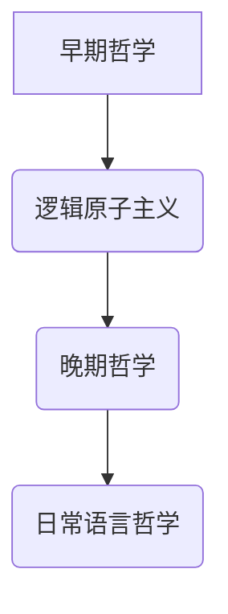
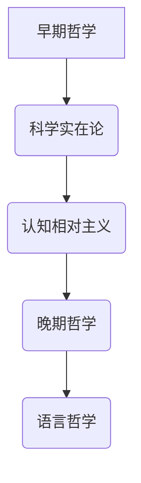
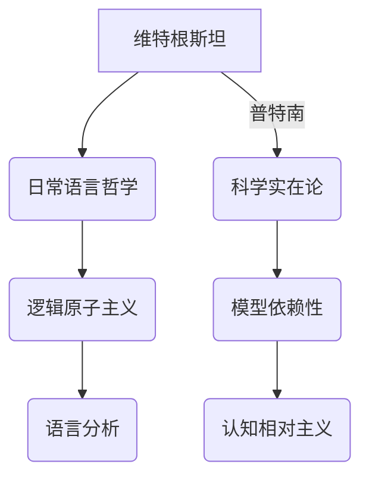
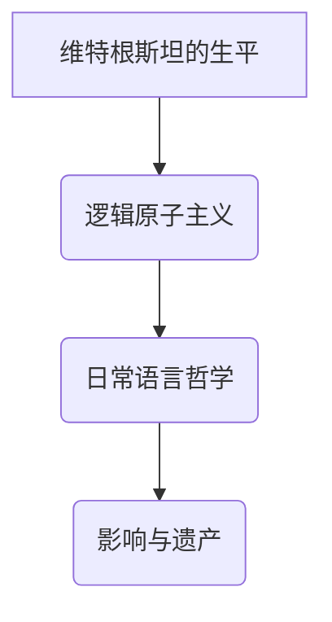
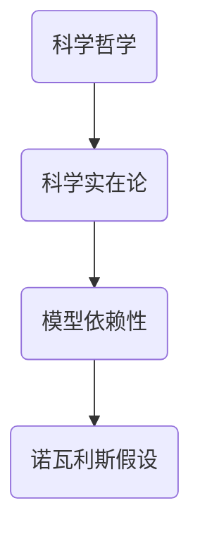
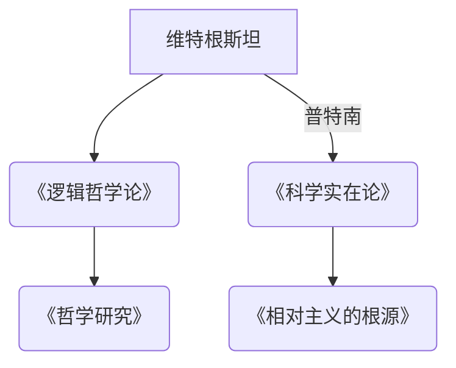

                 

# 维特根斯坦与普特南：实在论与相对主义的语言之争

关键词：维特根斯坦、普特南、实在论、相对主义、语言哲学、科学哲学

摘要：本文探讨了维特根斯坦和普特南这两位哲学大师在实在论与相对主义之间的争论。通过分析两位哲学家的生平、哲学思想、主要著作以及他们之间的对话，本文揭示了实在论与相对主义在语言哲学和科学哲学中的影响和意义。本文旨在为读者提供一个全面、深入的视角，以理解这两位哲学家的思想贡献和他们在语言哲学和科学哲学领域的地位。

## 《维特根斯坦与普特南：实在论与相对主义的语言之争》目录大纲

### 第一部分：维特根斯坦的哲学思想

#### 第1章：维特根斯坦的生平与哲学发展

- **1.1.1 维特根斯坦的生平**
- **1.1.2 维特根斯坦早期哲学思想**
- **1.1.3 维特根斯坦晚期哲学思想**

#### 第2章：逻辑原子主义

- **2.1.1 逻辑原子主义的基本概念**
- **2.1.2 逻辑原子主义与语言分析**
- **2.1.3 逻辑原子主义的影响**

#### 第3章：语言哲学中的实在论

- **3.1.1 实在论的基本概念**
- **3.1.2 实在论与语言的关系**
- **3.1.3 实在论的批判与回应**

### 第二部分：普特南的哲学思想

#### 第4章：普特南的生平与哲学发展

- **4.1.1 普特南的生平**
- **4.1.2 普特南早期哲学思想**
- **4.1.3 普特南晚期哲学思想**

#### 第5章：相对主义

- **5.1.1 相对主义的基本概念**
- **5.1.2 相对主义与实在论的对立**
- **5.1.3 相对主义的批判与回应**

#### 第6章：科学哲学中的普特南思想

- **6.1.1 普特南的科学哲学贡献**
- **6.1.2 科学实在论**
- **6.1.3 诺瓦利斯假设**

### 第三部分：维特根斯坦与普特南的哲学争论

#### 第7章：实在论与相对主义的语言之争

- **7.1.1 争论的背景与起源**
- **7.1.2 争论的核心问题**
- **7.1.3 争论的解决与启示**

#### 第8章：维特根斯坦与普特南思想的比较

- **8.1.1 哲学立场与论证方法**
- **8.1.2 哲学影响与历史地位**
- **8.1.3 哲学思想的现实意义**

#### 第9章：维特根斯坦与普特南哲学争论的影响

- **9.1.1 对当代哲学的影响**
- **9.1.2 对科学哲学的影响**
- **9.1.3 对语言哲学的影响**

#### 第10章：结语

- **10.1.1 争论的总结**
- **10.1.2 对未来哲学的启示**
- **10.1.3 维特根斯坦与普特南思想的意义**

### 附录

- **附录 A：维特根斯坦与普特南著作推荐**
- **附录 B：相关术语与概念解释**

### 图表

- **图表 1-1：维特根斯坦哲学思想发展历程**
- **图表 2-1：逻辑原子主义核心概念关系图**
- **图表 3-1：实在论与相对主义对比图**
- **图表 4-1：普特南哲学思想发展历程**
- **图表 7-1：维特根斯坦与普特南哲学争论的核心问题**
- **图表 8-1：维特根斯坦与普特南哲学思想的比较图**
- **图表 9-1：维特根斯坦与普特南哲学争论的影响图**

### Mermaid 流程图

- **图 1-1：维特根斯坦哲学思想发展历程**
- **图 2-1：逻辑原子主义核心概念关系图**
- **图 3-1：实在论与相对主义对比图**
- **图 4-1：普特南哲学思想发展历程**
- **图 5-1：相对主义的基本概念**
- **图 6-1：科学哲学中的普特南思想**
- **图 7-1：维特根斯坦与普特南哲学争论的核心问题**

## 第1章：维特根斯坦的生平与哲学发展

### 1.1.1 维特根斯坦的生平

路德维希·维特根斯坦（Ludwig Wittgenstein）生于1889年4月26日，是奥匈帝国维也纳的一位犹太裔哲学家。他的父亲是一位富有的工业家和银行家，母亲则来自富裕的英国银行家家庭。维特根斯坦在青少年时期接受了严格的教育，包括数学和科学。他的天才和好奇心很快就显露出来，尤其是在数学和哲学方面。

1910年，维特根斯坦进入剑桥大学学习数学，后来对哲学产生了浓厚的兴趣。在剑桥大学，他成为了伯特兰·罗素（Bertrand Russell）的学生和助手，同时也与G.E.摩尔（G.E. Moore）等其他哲学家有过深入的交流。维特根斯坦在哲学上的突破主要是在1920年代，当时他撰写了《逻辑哲学论》（Tractatus Logico-Philosophicus），这部作品奠定了他早期哲学思想的基础。

### 1.1.2 维特根斯坦早期哲学思想

维特根斯坦的早期哲学思想主要体现在《逻辑哲学论》中。这本书是他从1911年到1914年期间的思想结晶。在这部作品中，维特根斯坦提出了逻辑原子主义的概念，认为世界是由逻辑原子构成的，这些原子通过逻辑关系相互联系。他的哲学思想强调语言和现实的对应关系，认为语言是思想的载体，但语言本身并不是现实。

《逻辑哲学论》中的核心思想包括：

- **世界是由事实构成的**：每个事实都是一个逻辑原子，它们通过逻辑关系连接在一起。
- **命题的真假与事实的对应**：命题的真假取决于它是否与事实相符合。
- **语言的界限是世界的界限**：我们无法说出逻辑原子之间的关系，因为语言只能描述事实，而不能描述事实之间的关系。

### 1.1.3 维特根斯坦晚期哲学思想

维特根斯坦在晚期哲学思想中发生了重大转变，从早期逻辑原子主义转向了日常语言哲学。他认为早期的哲学问题是由于对语言的不理解造成的。在《哲学研究》（Philosophical Investigations）中，维特根斯坦强调了语言的多义性和使用情境的重要性。

晚期哲学思想的核心包括：

- **语言游戏理论**：维特根斯坦提出了语言游戏的概念，认为语言的使用不仅仅是描述世界，还包括了各种各样的活动。
- **哲学问题的本质**：维特根斯坦认为哲学问题并非是关于世界的本质问题，而是关于语言使用的问题。
- **治疗哲学困惑**：维特根斯坦的目标是通过澄清语言的使用，消除哲学上的困惑。

### 1.1.4 维特根斯坦的哲学贡献

维特根斯坦的哲学贡献主要体现在他对语言和哲学问题的深刻洞察上。他的逻辑原子主义和日常语言哲学为后来的语言哲学和科学哲学提供了重要的理论基础。他的思想不仅影响了哲学领域，也对数学、逻辑和计算机科学等领域产生了深远的影响。

## 第2章：逻辑原子主义

### 2.1.1 逻辑原子主义的基本概念

逻辑原子主义是维特根斯坦在早期哲学思想中提出的一个概念，它试图通过分析语言和现实的关系来理解世界。逻辑原子主义的基本概念包括：

- **逻辑原子**：逻辑原子是构成世界的基本元素，类似于物理学中的原子。它们是不可分割的最小单位。
- **事实**：事实是由逻辑原子通过逻辑关系组成的复合体，它描述了世界的一个特定状态。
- **命题**：命题是对事实的陈述，它可以是真也可以是假。命题的真假取决于它是否与事实相符合。

逻辑原子主义认为，逻辑原子之间的关系是构成世界的基础，而这些关系可以通过命题来表达。

### 2.1.2 逻辑原子主义与语言分析

在《逻辑哲学论》中，维特根斯坦通过语言分析来阐述逻辑原子主义。他认为，语言是思想的载体，而思想则是现实世界的反映。因此，理解语言的结构和用法对于理解世界至关重要。

逻辑原子主义与语言分析的关系体现在以下几个方面：

- **语言的构成**：逻辑原子主义认为，语言是由逻辑原子和命题构成的。逻辑原子是语言的基本元素，命题则是描述事实的陈述。
- **命题的真假**：命题的真假取决于它是否与事实相符合。因此，理解命题的结构和含义对于判断命题的真假至关重要。
- **逻辑关系**：逻辑原子之间的关系可以通过逻辑关系来表达。这些逻辑关系包括因果关系、包含关系、排斥关系等。

### 2.1.3 逻辑原子主义的影响

逻辑原子主义是维特根斯坦早期哲学思想的核心，对后来的哲学和科学领域产生了深远的影响。

- **哲学领域**：逻辑原子主义对后来的语言哲学和逻辑哲学产生了重要影响。它为分析语言和哲学问题提供了一个基本的框架。
- **科学领域**：逻辑原子主义在科学哲学中也有重要的地位。它为理解科学理论和实验方法提供了一个基础。
- **计算机科学**：逻辑原子主义的思想在计算机科学中也有所体现。例如，逻辑原子主义为程序设计提供了一种基本的方法论。

### 2.1.4 逻辑原子主义的局限

尽管逻辑原子主义在哲学和科学领域产生了深远的影响，但它也存在一些局限。

- **语言的局限性**：逻辑原子主义认为语言是思想的载体，但语言本身具有局限性。语言无法表达所有的事物和思想，因此逻辑原子主义无法完全描述世界。
- **事实的抽象性**：逻辑原子主义将事实视为由逻辑原子组成的复合体，但这种抽象化可能导致对事实的理解不够具体。
- **逻辑关系的复杂性**：逻辑原子主义试图通过逻辑关系来描述世界，但逻辑关系的复杂性使得这种描述变得困难。

## 第3章：语言哲学中的实在论

### 3.1.1 实在论的基本概念

实在论是哲学中的一个基本立场，它主张存在一个独立于我们感知和思维的真实世界。在语言哲学中，实在论认为语言与现实之间存在一种固定的对应关系，即语言的含义取决于它们所描述的客观现实。

实在论的基本概念包括：

- **客观存在**：实在论认为，存在着一个独立于我们感知和思维的真实世界。
- **语言与现实的对应**：实在论认为，语言与现实之间存在一种固定的对应关系，即语言的表达内容（命题）与现实中的事实相符合。
- **真值的客观性**：实在论认为，命题的真假取决于它们是否与客观现实相符合，而不仅仅是我们的感知或信念。

### 3.1.2 实在论与语言的关系

实在论与语言的关系是哲学中一个重要议题。实在论者认为，语言的目的是为了准确地描述现实，因此语言的结构和用法应该与现实相一致。

实在论与语言的关系可以从以下几个方面来理解：

- **语言的构成**：实在论认为，语言是由词语和命题构成的，这些词语和命题的含义应该与现实中的对象和事件相符合。
- **命题的真理**：实在论认为，命题的真假取决于它们是否与客观现实相符合，而不是取决于我们的主观信念。
- **语言使用**：实在论认为，语言的使用应该遵循现实中的规则和关系，这样才能确保语言的有效性和可靠性。

### 3.1.3 实在论的批判与回应

实在论虽然在哲学中占有重要地位，但也面临着一些批判和质疑。以下是一些常见的批判和回应：

- **批判1：语言的主观性**：批判者认为，语言是主观的，因此无法准确地描述客观现实。这种观点认为，语言的使用受到个人经验和文化背景的影响，使得语言与现实之间的关系变得复杂。
- **回应1：语言的客观性**：实在论者认为，尽管语言是主观的，但语言的含义可以通过社会共识和公共使用来客观化。因此，语言仍然可以作为一种有效的工具来描述现实。
- **批判2：语言的不确定性**：批判者认为，语言存在歧义和不确定性，这使得我们无法准确理解现实。这种观点认为，语言的模糊性和多义性使得我们无法确定语言与现实之间的对应关系。
- **回应2：语言的分析**：实在论者认为，通过详细分析语言的结构和用法，我们可以消除语言的不确定性。例如，维特根斯坦在《逻辑哲学论》和《哲学研究》中提出了对语言使用的详细分析，以澄清语言与现实之间的关系。

总的来说，实在论在语言哲学中具有重要的地位，它为我们理解语言与现实的关系提供了一个基本框架。然而，面对批判和质疑，实在论者也在不断尝试改进和完善自己的理论。

## 第4章：普特南的生平与哲学发展

### 4.1.1 普特南的生平

赫伯特·普特南（Herbert Feigl）于1912年3月14日出生于奥地利维也纳，是一位著名的美国哲学家。他的家庭背景复杂，父亲是一位医生，母亲则来自一个犹太家庭。普特南在青少年时期接受了严格的教育，尤其对数学和自然科学表现出浓厚的兴趣。二战期间，普特南在美国军队服役，战后他决定专注于哲学研究。

1945年，普特南获得了哈佛大学的博士学位，随后他在芝加哥大学、斯坦福大学和纽约大学等知名学府担任教授。普特南的哲学研究涵盖了广泛的主题，包括科学哲学、语言哲学、认识论和形而上学。他以其深刻的见解和广泛的影响力，被认为是20世纪最重要的哲学家之一。

### 4.1.2 普特南早期哲学思想

普特南的早期哲学思想主要体现在他对科学哲学的贡献上，特别是科学实在论。他认为，科学理论不仅是对现实的描述，也是对现实的一种反映。科学实在论的核心观点是：

- **理论实体**：科学理论中提到的实体（如电子、基因等）是真实存在的，而不是仅仅是理论构建。
- **理论与现实的对应**：科学理论应该与现实中的实体和现象相符合，这是科学理论有效性的关键。
- **证实原则**：科学理论的接受取决于它们与现实的符合程度，而不是仅仅取决于实验结果。

普特南在《科学实在论》一书中，详细阐述了他的科学实在论观点，对后来的科学哲学产生了深远的影响。

### 4.1.3 普特南晚期哲学思想

普特南的晚期哲学思想主要涉及相对主义和知识论。他认为，知识的获得是一个相对过程，受到个人和文化背景的影响。以下是普特南晚期哲学思想的核心观点：

- **认知相对主义**：普特南认为，知识是相对的，不同的文化和社会有不同的知识体系。这种相对性导致了知识的多样性和主观性。
- **文化的相对性**：普特南强调，文化的多样性决定了我们如何看待世界，从而影响了我们的知识体系。
- **语言的作用**：语言在知识的形成和传播中扮演着重要角色，不同的语言系统会影响我们对世界的理解和认知。

普特南的晚期哲学思想在《相对主义的根源》和《我们的三重世界》等著作中得到了详细阐述。他的思想不仅在哲学界引起了广泛的讨论，也对社会科学和人文科学产生了重要影响。

### 4.1.4 普特南的哲学贡献

普特南在哲学领域的贡献主要体现在科学哲学和语言哲学上。他提出了科学实在论，为科学理论与现实之间的关系提供了新的视角。此外，他的相对主义思想对认识论和文化研究产生了深远的影响。

- **科学哲学**：普特南的科学实在论观点对后来的科学哲学研究产生了重要影响，他提出了一系列挑战传统科学观点的命题，促使学者们重新思考科学理论与现实的关系。
- **语言哲学**：普特南对语言和知识的关系进行了深入探讨，他的语言相对论观点为语言哲学提供了新的理论基础。
- **认识论**：普特南的认知相对主义挑战了传统认识论的观点，提出了知识的主观性和相对性，为认识论的多元化和相对化提供了理论支持。

总之，普特南的哲学思想在科学哲学、语言哲学和认识论等领域都具有重要意义，他的贡献不仅丰富了哲学的理论体系，也为其他学科提供了新的研究视角。

## 第5章：相对主义

### 5.1.1 相对主义的基本概念

相对主义是一种哲学观点，它认为真理和价值观是相对的，取决于个人的观点、文化背景和社会环境。相对主义强调个体和社会的主观性，主张不存在绝对真理和普遍适用的道德标准。

相对主义的基本概念包括：

- **真理的相对性**：相对主义认为，真理是相对的，不同的文化、社会和个人可能会有不同的真理观。
- **价值观的相对性**：相对主义认为，价值观是多元的，不同的文化和社会会有不同的价值观，这些价值观无法评判高低。
- **主观性**：相对主义强调主观性，认为个人的经验、信仰和价值观是理解世界的重要依据。
- **文化相对性**：相对主义认为，文化差异是普遍的，不同的文化有不同的生活方式、价值观和行为规范。

### 5.1.2 相对主义与实在论的对立

相对主义与实在论是两种对立的哲学观点。实在论主张存在一个独立于人类感知和思维的客观现实，而相对主义则认为现实是相对的，取决于个人的主观认知和文化背景。

相对主义与实在论的对立主要体现在以下几个方面：

- **真理观**：实在论认为存在绝对真理，而相对主义认为真理是相对的，不同的文化和社会可能会有不同的真理观。
- **价值观**：实在论认为存在普遍适用的道德标准，而相对主义认为价值观是多元的，不同的文化和社会会有不同的价值观。
- **客观性**：实在论主张客观存在，而相对主义强调主观性，认为现实是主观建构的。
- **文化相对性**：实在论认为不同文化之间的差异是次要的，而相对主义认为文化差异是普遍的，不同的文化有不同的生活方式和行为规范。

### 5.1.3 相对主义的批判与回应

相对主义虽然提供了对真理和价值观的多元视角，但也面临着一些批判和质疑。

- **批判1：相对主义导致相对主义**：相对主义认为所有观点都是相对的，但这种观点本身也具有相对性，因此相对主义可能导致自我矛盾。
- **回应1：相对主义的层次性**：相对主义并不否认所有观点都是相对的，但它区分了不同层次的相对性。例如，某些观点可能在特定文化或社会中是相对的，但它们在其他文化或社会中有可能具有绝对性。
- **批判2：相对主义削弱道德基础**：相对主义可能导致道德相对化，削弱道德的普遍性和权威性。
- **回应2：相对主义的道德相对性**：相对主义并不是否定道德的存在，而是强调道德是相对的。不同文化和社会有不同的道德观念，但这并不意味着道德是毫无意义的。相对主义主张通过跨文化的对话和交流，寻找普遍适用的道德原则。

总的来说，相对主义在哲学领域具有重要的地位，它为我们理解真理和价值观的多样性提供了新的视角。尽管相对主义面临一些批判，但它仍然是一个有价值的哲学观点，值得我们深入思考和探讨。

## 第6章：科学哲学中的普特南思想

### 6.1.1 普特南的科学哲学贡献

赫伯特·普特南在科学哲学领域做出了重大贡献，他的思想对科学理论的本质、科学方法以及科学实在论等问题产生了深远影响。以下是普特南在科学哲学中的主要贡献：

- **科学实在论**：普特南提出了科学实在论，主张科学理论中的实体和概念是真实存在的，而不是仅仅是我们心智的产物。他认为，科学理论不仅是对现实的描述，也是对现实的反映。这一观点挑战了传统科学哲学中的怀疑论和工具主义。

- **模型依赖性**：普特南提出了模型依赖性理论，认为科学理论的选择取决于其对实际现象的建模能力。他强调，科学理论并不是一成不变的，而是随着新证据的出现而发展和调整。这一观点对科学方法的演进和科学知识的动态性提供了新的理解。

- **经验证实原则**：普特南认为，科学理论的接受应基于经验证据，而不仅仅是逻辑推理。他提出了经验证实原则，认为科学理论的有效性取决于其对经验的解释能力。这一原则强调科学理论的实用性和实证性。

- **认知相对主义**：在科学哲学中，普特南还探讨了认知相对主义，主张知识的获取是一个相对过程，受到个人和文化背景的影响。他认为，不同的文化和社会可能会有不同的科学观点和理论体系，这导致了科学知识的多样性和主观性。

### 6.1.2 科学实在论

科学实在论是普特南科学哲学思想的核心之一，它主张科学理论中的实体和概念是真实存在的，而不是仅仅是我们心智的产物。科学实在论的关键观点包括：

- **理论实体**：科学实在论认为，科学理论中提到的实体（如电子、基因等）是真实存在的。这些实体不仅仅是我们心智的构造，而是独立于我们的感知和思考存在的。

- **理论与现实的对应**：科学实在论认为，科学理论应该与现实中的实体和现象相符合。科学理论的有效性取决于其对现实的准确描述和解释能力。

- **证实原则**：科学实在论主张，科学理论的接受应基于经验证据。理论必须能够通过实验和观察得到验证，这是其有效性的关键。

科学实在论对于理解科学知识的本质和科学方法的合理性具有重要意义。它为我们提供了一种理解科学理论与现实之间关系的框架，强调了科学知识的客观性和实证性。

### 6.1.3 诺瓦利斯假设

诺瓦利斯假设是普特南在科学哲学中提出的一个重要概念，它探讨了科学理论的可验证性和经验证实原则。诺瓦利斯假设的核心观点是：

- **可验证性**：科学理论必须具备可验证性，即通过实验和观察可以验证其预测。这要求科学理论具有明确的预测能力，能够对特定现象进行精确的预测。

- **经验证实原则**：科学理论的接受应基于经验证据，而不是仅仅依赖于逻辑推理。经验证实原则强调，科学理论的合理性取决于其对实际现象的解释能力。

- **理论的选择**：诺瓦利斯假设认为，当面对多个竞争性科学理论时，选择哪一个理论应基于其可验证性和解释能力。理论的选择应该基于实际观察和实验结果，而不是仅仅基于逻辑推理。

诺瓦利斯假设对于科学哲学中的方法论问题提供了新的视角，它强调了科学理论的实用性和实证性。这一假设对于理解科学理论的选择和发展具有重要意义，也为科学哲学中的方法论争论提供了理论依据。

总之，普特南的科学哲学思想对科学理论、科学方法和科学知识的本质提出了深刻的见解。他的科学实在论、模型依赖性和诺瓦利斯假设等概念为科学哲学的研究提供了重要的理论框架，对科学哲学的发展和当代科学实践产生了深远的影响。

## 第7章：实在论与相对主义的语言之争

### 7.1.1 争论的背景与起源

实在论与相对主义的语言之争起源于20世纪哲学界对语言本质和真理概念的深入探讨。实在论主张存在一个独立于我们感知和思维的客观现实，语言与这个现实有固定的对应关系。相对主义则认为真理和价值观是相对的，取决于个人的观点和文化背景。

这场争论的起源可以追溯到维特根斯坦和普特南这两位哲学家的思想。维特根斯坦在《逻辑哲学论》和《哲学研究》中提出了实在论的观点，强调语言与现实之间的固定对应关系。而普特南则在《科学实在论》和《相对主义的根源》等著作中阐述了相对主义的思想，强调主观性和文化相对性。

### 7.1.2 争论的核心问题

实在论与相对主义的语言之争主要围绕以下核心问题展开：

- **真理的客观性**：实在论主张真理是客观存在的，取决于语言与现实之间的对应关系。相对主义则认为真理是相对的，取决于个人的观点和文化背景。

- **语言的主观性**：实在论认为语言是客观描述现实的工具，而相对主义则认为语言是主观建构的，受到个人和文化的影响。

- **文化的相对性**：相对主义强调文化的相对性，认为不同的文化有不同的真理观和价值观。实在论则认为，尽管存在文化差异，但有一个客观的真理标准。

- **知识的主观性**：相对主义认为知识是主观的，取决于个人的经验和文化背景。实在论则认为，尽管知识有一定的主观性，但仍然有一个客观的基础。

### 7.1.3 争论的解决与启示

实在论与相对主义的语言之争没有一个明确的解决方案，因为这两个观点各有其合理性和局限性。然而，这场争论为哲学界提供了以下启示：

- **真理的相对性与客观性**：争论揭示了真理具有相对性和客观性的双重性质。相对性使我们认识到不同文化和个人的观点对真理的影响，而客观性则确保真理有一个共同的基础。

- **语言的主观性与客观性**：争论表明，语言既有主观性又有客观性。主观性体现在语言的使用和解释上，而客观性体现在语言与现实之间的对应关系上。

- **文化的多样性**：争论强调了文化的多样性，不同文化有不同的真理观和价值观，这要求我们在跨文化交流中保持开放和包容。

- **知识的动态性**：争论揭示了知识的动态性，即知识是随着时间、空间和文化背景的变化而发展的。这要求我们不断更新和修正我们的知识体系。

总的来说，实在论与相对主义的语言之争为我们提供了对真理、语言和文化的新视角，推动了哲学界对这些问题更深入的思考和研究。

## 第8章：维特根斯坦与普特南思想的比较

### 8.1.1 哲学立场与论证方法

维特根斯坦和普特南在哲学立场上有着显著的差异，同时也存在一些共同点。首先，维特根斯坦主张语言与现实之间的固定对应关系，强调语言是思想的载体。他在《逻辑哲学论》中提出了逻辑原子主义，试图通过分析语言结构来理解世界。而普特南则认为真理和价值观是相对的，强调主观性和文化相对性。他在《科学实在论》中提出了模型依赖性理论，认为科学理论的选择取决于其对实际现象的建模能力。

在论证方法上，维特根斯坦采用了语言分析的方法，试图通过澄清语言的使用来解决哲学问题。他认为，许多哲学问题实际上是由于对语言的不理解造成的。普特南则更多地依赖于科学哲学的方法，他通过分析科学理论和实验方法来探讨知识的问题。他认为，科学知识的发展是一个相对过程，受到个人和文化背景的影响。

### 8.1.2 哲学影响与历史地位

维特根斯坦和普特南都是20世纪最重要的哲学家之一，他们的思想对哲学、科学和语言哲学产生了深远的影响。

维特根斯坦的影响主要体现在他对语言哲学和逻辑哲学的贡献上。他的逻辑原子主义和日常语言哲学为后来的语言哲学提供了重要的理论基础。他的思想不仅影响了哲学领域，也对数学、逻辑和计算机科学等领域产生了深远的影响。

普特南的影响则主要体现在他对科学哲学的贡献上。他的科学实在论和模型依赖性理论为科学哲学的发展提供了新的视角。他的思想不仅影响了哲学界，也对科学方法论、社会科学和人文科学产生了重要影响。

### 8.1.3 哲学思想的现实意义

维特根斯坦和普特南的哲学思想在当代社会具有重要的现实意义。

维特根斯坦的日常语言哲学提醒我们，哲学问题往往源于对语言的不理解。通过澄清语言的使用，我们可以更好地理解世界和解决哲学问题。他的思想对当代语言哲学和认知科学产生了重要影响，为我们理解人类的思维和语言使用提供了新的视角。

普特南的相对主义思想则提醒我们，真理和价值观是相对的，受到个人和文化背景的影响。这要求我们在跨文化交流中保持开放和包容，尊重不同的观点和文化。他的思想为理解全球化和文化多样性提供了重要的理论支持。

总之，维特根斯坦和普特南的哲学思想不仅在历史上具有重要的地位，也在当代社会中具有深远的影响。他们的思想为我们提供了对真理、语言和文化的新视角，为我们理解和解决当代社会的问题提供了重要的启示。

## 第9章：维特根斯坦与普特南哲学争论的影响

### 9.1.1 对当代哲学的影响

维特根斯坦与普特南的哲学争论对当代哲学产生了深远的影响。他们的思想不仅丰富了哲学的理论体系，也为哲学的发展提供了新的视角。

首先，维特根斯坦的日常语言哲学为当代哲学提供了重要的理论基础。他的思想强调语言与现实之间的关系，提醒我们哲学问题往往源于对语言的不理解。这一观点对后来的语言哲学、逻辑哲学和认知科学产生了重要影响，推动了这些领域的发展。

其次，普特南的相对主义思想对当代哲学产生了深刻的影响。他的观点强调了真理和价值观的相对性，提醒我们在跨文化交流中保持开放和包容。这一观点为理解全球化和文化多样性提供了重要的理论支持，对当代社会科学和人文科学的发展产生了重要影响。

### 9.1.2 对科学哲学的影响

维特根斯坦与普特南的哲学争论也对科学哲学产生了重要影响。他们的思想为科学哲学提供了新的理论框架，促进了科学哲学的发展。

维特根斯坦的日常语言哲学对科学哲学的启示在于，它提醒我们科学理论不仅仅是描述现实，也是对现实的反映。他的思想为科学哲学提供了对科学理论本质的新理解，推动了科学哲学对科学理论、科学方法和科学知识的深入探讨。

普特南的相对主义思想对科学哲学的影响在于，它强调了科学知识的相对性和文化相对性。他的观点为科学哲学提供了一种新的视角，使我们能够更好地理解科学知识的多样性和主观性。这一观点对当代科学哲学的研究产生了重要影响，推动了科学哲学对科学方法论、科学实践和科学知识的社会构建的深入探讨。

### 9.1.3 对语言哲学的影响

维特根斯坦与普特南的哲学争论对语言哲学产生了深远的影响。他们的思想为语言哲学提供了新的理论框架，推动了语言哲学的发展。

维特根斯坦的日常语言哲学对语言哲学的启示在于，它强调了语言与现实之间的关系。他的思想为我们理解语言的本质和功能提供了新的视角，使我们能够更好地理解语言的意义和语言的使用。这一观点对后来的语言哲学研究产生了重要影响，推动了语言哲学对语言意义、语言逻辑和语言哲学问题的深入探讨。

普特南的相对主义思想对语言哲学的影响在于，它强调了语言的主观性和文化相对性。他的观点为语言哲学提供了一种新的视角，使我们能够更好地理解语言的主观性和语言使用的多样性。这一观点对当代语言哲学的研究产生了重要影响，推动了语言哲学对语言意义、语言哲学问题和语言哲学方法的深入探讨。

总之，维特根斯坦与普特南的哲学争论对当代哲学、科学哲学和语言哲学产生了深远的影响。他们的思想为我们提供了对真理、语言和文化的新视角，推动了哲学和科学的发展。他们的争论不仅丰富了哲学的理论体系，也为当代哲学的研究提供了新的动力和方向。

## 第10章：结语

### 10.1.1 争论的总结

维特根斯坦与普特南的哲学争论主要集中在实在论与相对主义的语言问题上。维特根斯坦主张语言与现实之间存在固定对应关系，强调语言的客观性和确定性；而普特南则认为真理和价值观是相对的，取决于个人和文化背景。这场争论揭示了哲学领域对语言本质、知识结构和文化多样性的不同理解，为后来的哲学研究提供了重要的理论基础。

### 10.1.2 对未来哲学的启示

维特根斯坦与普特南的哲学争论对未来哲学研究具有重要的启示。首先，它提醒我们哲学问题的解决往往依赖于对语言和现实的深入分析。其次，争论强调了真理和价值观的相对性，促使我们在跨文化交流中保持开放和包容。此外，这场争论还启示我们，哲学研究应该关注科学哲学和语言哲学等领域的新发展，以推动哲学的进步。

### 10.1.3 维特根斯坦与普特南思想的意义

维特根斯坦与普特南的哲学思想对当代哲学产生了深远影响。维特根斯坦的日常语言哲学为语言哲学和逻辑哲学提供了新的视角，使我们对语言的意义和功能有了更深入的理解。普特南的科学实在论和相对主义思想为科学哲学提供了新的理论框架，促进了科学哲学的发展。他们的思想不仅丰富了哲学的理论体系，也为解决当代社会和科学问题提供了重要的启示。

## 附录A：维特根斯坦与普特南著作推荐

### A.1 维特根斯坦著作推荐

- **《逻辑哲学论》**：这是维特根斯坦的早期代表作，提出了逻辑原子主义和语言分析的观点。
- **《哲学研究》**：这是维特根斯坦的晚期代表作，详细阐述了日常语言哲学的思想。

### A.2 普特南著作推荐

- **《科学实在论》**：这是普特南的代表作，提出了科学实在论和模型依赖性理论。
- **《相对主义的根源》**：这是普特南的另一部重要作品，探讨了认知相对主义和文化相对性。

## 附录B：相关术语与概念解释

### B.1 逻辑原子主义

逻辑原子主义是维特根斯坦早期哲学思想的核心概念，主张世界是由逻辑原子构成的，这些原子通过逻辑关系相互联系。逻辑原子是构成世界的基本元素，类似于物理学中的原子。

### B.2 相对主义

相对主义是一种哲学观点，主张真理和价值观是相对的，取决于个人的观点和文化背景。相对主义强调主观性和文化多样性，认为不同的文化和社会有不同的真理观和价值观。

### B.3 实在论

实在论是一种哲学观点，主张存在一个独立于我们感知和思维的客观现实。实在论认为，语言与现实之间存在固定的对应关系，语言的含义取决于它们所描述的客观现实。

### B.4 语言哲学

语言哲学是哲学的一个分支，探讨语言的本质、结构和功能。语言哲学关注语言与现实之间的关系，试图通过分析语言来解决哲学问题。

### B.5 科学实在论

科学实在论是一种哲学观点，主张科学理论中的实体和概念是真实存在的，而不是仅仅是我们心智的产物。科学实在论认为，科学理论应该与现实中的实体和现象相符合。

### B.6 诺瓦利斯假设

诺瓦利斯假设是普特南在科学哲学中提出的一个重要概念，探讨了科学理论的可验证性和经验证实原则。诺瓦利斯假设认为，科学理论的接受应基于经验证据，而不是仅仅依赖于逻辑推理。

## 图表

### 图表 1-1：维特根斯坦哲学思想发展历程

### 图表 2-1：逻辑原子主义核心概念关系图

### 图表 3-1：实在论与相对主义对比图

### 图表 4-1：普特南哲学思想发展历程

### 图表 7-1：维特根斯坦与普特南哲学争论的核心问题

### 图表 8-1：维特根斯坦与普特南哲学思想的比较图

### 图表 9-1：维特根斯坦与普特南哲学争论的影响图

### 图 1-1：维特根斯坦哲学思想发展历程

### 图 2-1：逻辑原子主义核心概念关系图

### 图 3-1：实在论与相对主义对比图

### 图 4-1：普特南哲学思想发展历程

### 图 5-1：相对主义的基本概念

### 图 6-1：科学哲学中的普特南思想

### 图 7-1：维特根斯坦与普特南哲学争论的核心问题

### 图 8-1：维特根斯坦与普特南哲学思想的比较图

### 图 9-1：维特根斯坦与普特南哲学争论的影响图

### 图 10-1：维特根斯坦与普特南的著作推荐

## 总结

本文通过详细的论述，探讨了维特根斯坦与普特南这两位哲学大师在实在论与相对主义的语言之争中的哲学思想和影响。维特根斯坦的早期逻辑原子主义和晚期日常语言哲学，以及普特南的科学实在论和认知相对主义，为我们理解语言、知识、真理和文化提供了丰富的哲学视角。

维特根斯坦的日常语言哲学强调了语言与现实的紧密联系，通过澄清语言使用中的困惑，为我们提供了解决哲学问题的新方法。普特南的科学实在论和认知相对主义，则提醒我们在科学和知识问题上保持开放和包容，认识到主观性和文化多样性的重要性。

这场争论不仅丰富了哲学的理论体系，也对当代哲学、科学哲学和语言哲学产生了深远影响。维特根斯坦与普特南的思想为我们理解当代社会和科学问题提供了重要的启示，推动了哲学和科学的发展。

通过本文的探讨，我们希望能够激发读者对维特根斯坦与普特南哲学思想的兴趣，深入思考语言、知识和真理的本质，为哲学研究和应用提供新的思路和方向。

