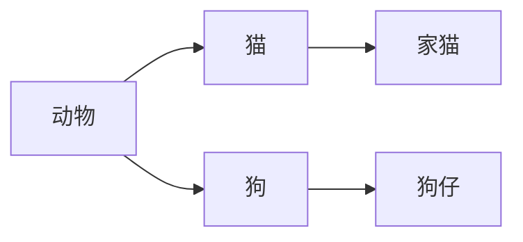
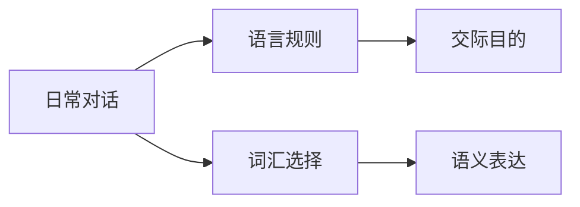
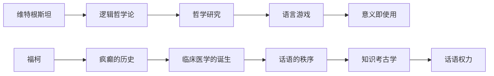

                 

### 摘要

本文以维特根斯坦与福柯两位哲学家的思想为切入点，探讨知识考古学的语言学视角。维特根斯坦关注语言的本质和意义，强调语言是沟通和理解世界的工具。他的哲学思想为语言学提供了重要的理论基础，特别是对意义和逻辑的研究。而福柯则通过知识考古学的方法，揭示了知识的生产、传播和权力关系。本文将从语言学的视角，分析两位哲学家的思想如何共同推动知识考古学的发展。首先，将介绍维特根斯坦的生平与哲学贡献，特别是他的语言学理论。接着，阐述福柯的知识考古学理论及其核心观点。然后，通过比较两位哲学家的哲学对话，探讨他们的相似性与差异。最后，结合语言学视角，分析知识考古学的方法和应用，探讨未来的研究方向。通过本文的探讨，期望为读者提供对知识考古学的新视角和更深入的理解。

## 维特根斯坦的哲学思想

### 路德维希·维特根斯坦的生平

路德维希·维特根斯坦（Ludwig Wittgenstein）是20世纪最杰出的哲学家之一，他的哲学思想对当代哲学、语言学研究产生了深远的影响。维特根斯坦的生平充满了对哲学的执着追求和不断反思的精神。

维特根斯坦于1889年4月26日出生于奥匈帝国的维也纳，他的父亲是著名的工业家和慈善家卡尔·维特根斯坦（Karl Wittgenstein）。维特根斯坦从小便展现出对哲学和科学的浓厚兴趣。1906年，他进入剑桥大学学习数学和哲学，并结识了当时著名的哲学家伯兰特·罗素（Bertrand Russell）。罗素对维特根斯坦的影响深远，使得他对哲学产生了强烈的热情。

在剑桥大学期间，维特根斯坦撰写了他的第一部重要著作《逻辑哲学论》（Tractatus Logico-Philosophicus）。这部著作于1921年出版，以其简洁而深刻的哲学思想震撼了当时的哲学界。《逻辑哲学论》提出了“逻辑原子主义”的观点，主张世界是由基本事实构成的，而语言的作用是表述这些基本事实。维特根斯坦认为，逻辑是宇宙的语法，而哲学的任务是澄清思想和语言之间的关系。

在《逻辑哲学论》发表后，维特根斯坦意识到他的理论过于抽象，缺乏对日常语言的关注。因此，他在1930年代开始撰写他的第二部重要著作《哲学研究》（Philosophical Investigations）。《哲学研究》抛弃了《逻辑哲学论》中的某些极端观点，转而探讨日常语言的多义性和复杂性。维特根斯坦认为，哲学的真正任务是描述语言的实际使用，而不是寻找某种“正确”的语言体系。

维特根斯坦在哲学界的声誉日益增长，他受邀前往多个大学讲学，包括美国哈佛大学和英国剑桥大学。1947年，他成为剑桥大学的荣誉研究员。1951年，维特根斯坦因肺炎病逝于剑桥，享年62岁。尽管他的生命短暂，但他的哲学思想对后世产生了持久的影响，被认为是20世纪最重要的哲学家之一。

### 维特根斯坦的早期哲学思想

维特根斯坦的早期哲学思想主要体现在他的两部著作《逻辑哲学论》和《哲学研究》中。在这两部著作中，他探讨了语言的本质、意义以及哲学的任务。

首先，《逻辑哲学论》是维特根斯坦早期哲学思想的代表作。这部著作的核心观点是“逻辑原子主义”。维特根斯坦认为，世界是由基本事实（即“逻辑原子”）构成的，这些基本事实可以通过语言来表达。语言的作用是表述这些基本事实，而哲学的任务是澄清思想和语言之间的关系。在《逻辑哲学论》中，维特根斯坦提出了著名的“图像理论”（Image Theory），认为语言和世界之间的关系就像是一张地图和它所代表的现实世界之间的关系。语言中的语句是世界的“图像”，它们与事实之间存在一种对应关系。

其次，维特根斯坦的《哲学研究》则是对《逻辑哲学论》的补充和修正。在这部著作中，维特根斯坦抛弃了《逻辑哲学论》中的某些极端观点，转而探讨日常语言的多义性和复杂性。他认为，哲学的真正任务是描述语言的实际使用，而不是寻找某种“正确”的语言体系。在《哲学研究》中，维特根斯坦提出了“语言游戏”（Language Game）的概念，认为语言的使用是一种活动，这种活动在不同的场景和语境中有不同的规则。语言游戏可以分为多种形式，包括数学、科学、日常对话等。每种语言游戏都有其特定的规则和目的，而哲学的任务是理解和描述这些规则和目的。

此外，维特根斯坦还强调了“意义即使用”（Meaning is Use）的观点。他认为，一个词的意义不在于它所代表的事物，而在于它在特定情境中的使用方式。例如，“水”这个词在不同的语境中有不同的意义，如在化学中代表H₂O，在生物学中代表生命的基础。维特根斯坦认为，理解一个词的意义，就是理解它在特定语言游戏中的使用。

总的来说，维特根斯坦的早期哲学思想从逻辑原子主义转向了对日常语言的关注，强调了语言的实际使用和情境中的意义。这一转变不仅影响了语言哲学的发展，也为后来的哲学研究提供了新的视角和方法。

### 维特根斯坦的后期哲学思想

维特根斯坦的后期哲学思想主要体现在他的著作《哲学研究》中。与早期作品《逻辑哲学论》相比，维特根斯坦在《哲学研究》中更加关注日常语言的使用和理解，强调语言的多义性和情境性。

在《哲学研究》中，维特根斯坦提出了“语言游戏”（Language Game）的概念。他认为，语言不仅仅是一种符号系统，更是一种活动，这种活动在不同的场景和语境中有不同的规则和目的。语言游戏可以分为多种形式，包括数学、科学、日常对话等。每种语言游戏都有其特定的规则和目的，而哲学的任务是理解和描述这些规则和目的。

维特根斯坦还强调了“意义即使用”（Meaning is Use）的观点。他认为，一个词的意义不在于它所代表的事物，而在于它在特定情境中的使用方式。例如，“水”这个词在不同的语境中有不同的意义，如在化学中代表H₂O，在生物学中代表生命的基础。维特根斯坦认为，理解一个词的意义，就是理解它在特定语言游戏中的使用。

此外，维特根斯坦在《哲学研究》中还探讨了“家族相似性”（Family Resemblances）的概念。他认为，语言中的词汇和概念并不是通过一个单一的、清晰的定义来区分的，而是通过一系列相似性和关联来理解的。这种相似性并不是一对一的，而是多重的、复杂的。例如，“狗”、“猫”、“鸟”等动物词汇，并不是通过一个简单的定义来区分的，而是通过一系列共同特征和差异来理解的。

维特根斯坦的后期哲学思想对语言哲学和认知科学产生了深远的影响。他强调了语言的使用和理解情境，揭示了语言的多义性和复杂性。这一思想为我们理解人类语言行为提供了新的视角，也为后来的哲学研究奠定了基础。

### 维特根斯坦的语言学理论

维特根斯坦的语言学理论是理解他整个哲学体系的关键。他的思想主要集中在语言的本质、意义以及语言和现实之间的关系上，特别是他关于“语言游戏”和“家族相似性”的论述。

首先，维特根斯坦提出了“语言游戏”的概念，用以描述语言的使用和理解。他认为，语言不仅仅是符号的集合，更是一种活动，这种活动在不同的场景和语境中有不同的规则和目的。语言游戏可以分为数学、科学、日常对话等多种形式。每种语言游戏都有其特定的规则和目的，而这些规则和目的决定了语言的意义。例如，数学语言游戏中的符号和公式具有精确的含义和严格的规则，而日常对话中的语言则更加灵活和多样。维特根斯坦通过这一概念，揭示了语言的多义性和情境性，强调了语言使用的具体性和实用性。

其次，维特根斯坦强调了“意义即使用”的观点。他认为，一个词的意义不在于它所代表的事物，而在于它在特定情境中的使用方式。例如，“水”这个词在不同的语境中有不同的意义，如在化学中代表H₂O，在生物学中代表生命的基础。理解一个词的意义，就是理解它在特定语言游戏中的使用。这一观点挑战了传统的意义理论，强调了语言的实用性和动态性。

此外，维特根斯坦还提出了“家族相似性”的概念。他认为，语言中的词汇和概念并不是通过一个单一的、清晰的定义来区分的，而是通过一系列相似性和关联来理解的。这种相似性并不是一对一的，而是多重的、复杂的。例如，“狗”、“猫”、“鸟”等动物词汇，并不是通过一个简单的定义来区分的，而是通过一系列共同特征和差异来理解的。这一概念揭示了语言系统的复杂性和层次性，为我们理解语言的本质提供了新的视角。

维特根斯坦的语言学理论不仅对语言哲学产生了深远的影响，也为后来的认知科学和人工智能研究提供了重要的启示。他关于语言使用情境和动态性的论述，为语言模型和自然语言处理技术的发展奠定了基础。

### 逻辑原子主义

逻辑原子主义是维特根斯坦早期哲学思想的核心，也是他对语言和世界关系的独特理解。逻辑原子主义的基本原理认为，世界是由基本事实（即“逻辑原子”）构成的，而语言的作用是表述这些基本事实。为了更好地理解这一理论，我们可以从以下几个方面进行详细探讨。

首先，逻辑原子主义的核心概念是“逻辑原子”。逻辑原子是构成世界的基本元素，类似于物理学中的基本粒子。维特根斯坦认为，这些逻辑原子是独立且不可再分的，它们通过组合形成更复杂的事实。例如，一个简单的逻辑原子可以是一个具体的物体，如一张桌子，而更复杂的事实可以是“桌子放在桌子上”。这些基本事实通过语言来表述，从而构成了我们对于世界的理解。

其次，逻辑原子主义强调语言和世界之间的对应关系。维特根斯坦提出了“图像理论”（Image Theory），认为语言中的语句是世界的“图像”。这种对应关系使得语言能够准确地表征现实世界。例如，语句“桌子放在桌子上”就是现实世界中“桌子”和“桌子”之间关系的图像。这一理论试图通过逻辑和语言的严谨性，来保证我们对世界的认知是准确和可靠的。

第三，逻辑原子主义认为，逻辑是宇宙的语法。维特根斯坦认为，逻辑规则定义了如何将这些基本事实组合起来，从而形成有意义的语言表达。逻辑规则保证了语言表述的准确性和一致性。例如，在一个逻辑原子主义的系统中，语句“桌子放在桌子上”和“桌子上放着桌子”是有意义的，因为它们符合逻辑规则。而像“桌子是红色的”这样的语句，如果没有明确的逻辑规则来解释“红色”的含义，则可能无法在逻辑原子主义系统中得到解释。

最后，逻辑原子主义的应用范围非常广泛。维特根斯坦认为，逻辑原子主义不仅适用于日常语言，还可以应用于科学语言和数学语言。例如，在科学语言中，我们可以用逻辑原子来表示科学事实，如“电子带负电”可以被表述为“电子”和“带负电”这两个逻辑原子的组合。在数学语言中，逻辑原子主义则可以通过数学公式来表述，如“2+2=4”可以看作是数字2、2和4这三个逻辑原子的组合。

总之，逻辑原子主义是维特根斯坦对语言和世界关系的深刻理解，它通过基本事实和逻辑规则，试图建立一个准确和可靠的语言系统来表征现实世界。这一理论不仅在哲学上具有重要意义，也为后来的语言哲学和认知科学研究提供了重要的启示。

### 逻辑原子主义的应用

逻辑原子主义不仅在理论上具有重要意义，在实践中也有着广泛的应用。在维特根斯坦的思想中，逻辑原子主义为理解科学和日常语言提供了新的视角，特别是在解决实际问题时展现出其独特价值。

首先，逻辑原子主义在科学中的应用尤为显著。科学研究和实验通常需要精确的语言表述，以便描述和解释自然现象。逻辑原子主义提供了这样的工具，通过将科学事实分解为基本事实（即逻辑原子），科学家可以更加清晰地理解现象的本质。例如，在物理学中，可以将电子、质子等基本粒子视为逻辑原子，通过组合这些原子来描述复杂的物理过程，如电子云模型或原子核结构。在化学中，逻辑原子主义可以帮助我们理解分子结构，通过原子之间的组合和化学反应，形成新的物质。这种分解和组合的方法使得科学研究和教育更加系统和直观。

其次，逻辑原子主义在日常生活中也有广泛的应用。在日常生活中，我们经常需要表达复杂的思想和行动，而这些思想往往需要通过语言来传达。逻辑原子主义提供了一种分解复杂思想的工具，使得我们能够更清晰地理解和表述这些思想。例如，在商务沟通中，逻辑原子主义可以帮助我们明确地表达合同条款和商业逻辑，从而避免误解和纠纷。在家庭教育中，家长可以通过逻辑原子主义的方法，帮助孩子理解复杂的数学和科学概念，如通过分解数学问题，逐步解释和解决。逻辑原子主义不仅提高了语言表述的清晰度，也增强了我们的逻辑思维能力。

此外，逻辑原子主义在解决实际问题时具有独特价值。面对复杂的问题，我们可以使用逻辑原子主义的方法，将问题分解为基本事实和组合关系，从而找到解决问题的路径。例如，在项目管理中，可以将项目任务分解为基本的行动步骤，每个步骤都对应一个或多个逻辑原子。通过这种分解，项目经理可以更加清晰地理解项目进展和潜在风险，从而制定有效的计划和策略。在法律领域，逻辑原子主义可以帮助律师明确法律条款和案件事实，构建有说服力的法律论证。

总之，逻辑原子主义不仅丰富了我们的语言哲学理论，还在科学和日常生活中有着广泛的应用。通过分解和组合基本事实，逻辑原子主义提供了一种强大的工具，帮助我们更清晰地理解和表达复杂的思想和现实问题。

### 形式逻辑与日常语言

在维特根斯坦的哲学体系中，形式逻辑与日常语言的关系是一个重要而复杂的议题。形式逻辑以其严格和系统的特点在数学和科学研究中占据重要地位，而日常语言则更为灵活和多样。两者在语言表达和理解上各有优缺点，并在不同场景中发挥着各自的作用。

首先，形式逻辑的优点在于其严格性和确定性。形式逻辑通过明确的规则和符号系统，确保推理过程的准确性和一致性。这使得形式逻辑在数学、计算机科学和逻辑学等领域的应用中具有重要意义。例如，在数学证明中，形式逻辑可以帮助我们确保每一步推理都符合逻辑规则，从而得出可靠的结论。在编程和算法设计中，形式逻辑的严格性确保了程序的正确性和可靠性。

然而，形式逻辑的严格性也带来了其局限性。形式逻辑的符号系统和规则过于抽象，难以直接应用于复杂的现实问题。例如，在法律论证和日常生活中的决策过程中，形式逻辑的抽象性使其难以处理现实中的模糊性和多义性。法律条款和日常语言中的词汇常常具有多重含义，而这些多重含义在形式逻辑中难以得到明确处理。

与此相对，日常语言具有灵活性和多样性。日常语言能够灵活地适应不同的语境和场景，表达复杂的情感和思想。例如，在社交互动中，日常语言可以用来表达情感、建立关系和沟通信息。然而，日常语言的这种灵活性也带来了其局限性。日常语言中的词汇和语法规则往往不够明确，可能导致误解和歧义。例如，一个简单的句子“我饿了”在不同的语境中可能具有不同的含义，可能是表达生理需求，也可能是表达情感状态。

维特根斯坦认为，哲学的任务之一是揭示形式逻辑和日常语言之间的差异和联系。他通过《哲学研究》中的案例分析，探讨了日常语言的多义性和复杂性。维特根斯坦指出，日常语言中的词和句子并不是一成不变的，而是在不同语言游戏中具有不同的意义。例如，“水”这个词在化学、生物学和日常生活中具有不同的含义，这些含义是通过不同的语言游戏来定义和理解的。

为了弥补形式逻辑的局限性，维特根斯坦提出了“语言游戏”的概念。他认为，理解一种语言的关键在于理解其使用的场景和规则。例如，数学中的语言游戏需要严格的逻辑规则，而日常语言游戏则需要更多的灵活性和适应性。通过分析不同语言游戏中的规则和意义，我们可以更好地理解和应用语言。

总之，形式逻辑与日常语言各有优缺点，并在不同场景中发挥着各自的作用。形式逻辑的严格性和确定性使其在数学和科学研究中具有重要意义，而日常语言的灵活性和多样性则使其在日常生活和社交互动中不可或缺。维特根斯坦通过分析形式逻辑和日常语言的关系，揭示了语言表达的复杂性和多样性，为哲学和语言学的研究提供了新的视角。

### 语言哲学的基本问题

语言哲学作为哲学的一个重要分支，探讨的核心问题主要包括意义、真理和语言的本质。这些问题不仅在理论上具有深远的意义，也在实际应用中影响着我们的认知和理解。

首先，意义是语言哲学中的一个基本问题。维特根斯坦的“意义即使用”观点强调，一个词或语句的意义不在于它所代表的事物，而在于它在特定情境中的使用方式。例如，“水”在化学中代表H₂O，在生物学中代表生命的基础。理解一个词的意义，就是理解它在特定语言游戏中的使用。这一观点挑战了传统的定义主义，强调了语言的实用性和动态性。

其次，真理是语言哲学中的另一个核心问题。语言哲学探讨真理的本质，即语言如何准确地表述现实。维特根斯坦的图像理论提出，语言中的语句是世界的图像，语句与事实之间存在一种对应关系。这种对应关系使得我们能够通过语言来判断陈述的真假。然而，维特根斯坦在后期著作中，通过对日常语言的探讨，质疑了这种对应关系的简单性和普遍性。

最后，语言的本质是语言哲学研究的重要方向。维特根斯坦认为，语言不仅仅是一种符号系统，更是一种活动，这种活动在不同的场景和语境中有不同的规则和目的。语言游戏的概念揭示了语言的使用情境和多样性。理解一种语言的关键在于理解其使用的场景和规则。这种观点为语言哲学提供了新的研究视角，使我们能够更深入地探讨语言的本质和功能。

总的来说，语言哲学的基本问题涉及意义、真理和语言的本质，这些问题不仅对哲学和语言学的发展具有重要意义，也在我们的日常生活和思维过程中起着重要作用。

### 语言哲学的分支

语言哲学作为哲学的一个重要分支，具有丰富的理论体系和多样化的研究方向。主要的语言哲学分支包括分析哲学、反哲学和后语言哲学。这些分支从不同角度探讨语言的本质、意义和功能，为我们理解语言提供了多元的视角。

首先，分析哲学是语言哲学中最传统和主流的分支。分析哲学主张通过逻辑分析和语言分析来澄清哲学问题，强调语言在哲学研究中的核心地位。分析哲学家如弗雷格（Ferdinand de Saussure）和维特根斯坦，强调语言的结构和逻辑性。弗雷格提出了“意义与指称”的观点，认为语言的意义不仅取决于词汇的指称对象，还取决于语言的逻辑结构。维特根斯坦则通过“语言游戏”的概念，探讨了语言在不同情境中的使用规则和目的。分析哲学的方法论强调逻辑的严谨性和语言的精确性，为后来的语言哲学研究奠定了基础。

其次，反哲学是语言哲学中的一个重要分支，它对传统哲学和语言哲学进行了批判和反思。反哲学家如德里达（Jacques Derrida）和福柯（Michel Foucault），质疑了语言和意义的确定性，强调语言的不可预测性和多义性。德里达提出了“解构”理论，认为语言符号具有多重解释可能性，不存在单一确定的含义。福柯则通过“话语权力”的概念，揭示了语言与权力的密切关系，认为语言不仅是沟通工具，也是权力工具。反哲学挑战了分析哲学的理性主义基础，推动了语言哲学向更为复杂和多元的方向发展。

最后，后语言哲学是近年来兴起的一个新兴分支，它试图超越传统和分析哲学的局限，探讨语言在更广阔的文化和社会背景中的角色。后语言哲学家如哈贝马斯（Jürgen Habermas）和罗蒂（Richard Rorty），强调语言在沟通和社会互动中的作用。哈贝马斯提出了“公共领域”的概念，认为语言是构建公共领域和社会共识的重要工具。罗蒂则通过“实用主义”的方法，强调语言的功能在于帮助我们理解和解决问题。后语言哲学关注语言在文化和社会中的多元应用，为我们理解语言提供了新的视角。

总的来说，语言哲学的分支多样，各具特色。分析哲学通过逻辑和语言分析，揭示了语言的结构和逻辑性；反哲学通过批判和反思，挑战了语言的确定性；后语言哲学则通过社会和文化视角，探讨了语言的多元功能。这些分支共同构成了语言哲学的丰富理论体系，为我们的语言研究和哲学思考提供了深刻的启示。

### 分析哲学

分析哲学是语言哲学中最重要的分支之一，其核心思想是通过逻辑分析和语言分析来澄清哲学问题，强调语言在哲学研究中的核心地位。分析哲学起源于19世纪末的欧洲，其代表人物包括弗雷格、罗素和维特根斯坦等。

首先，弗雷格是分析哲学的奠基人之一。他提出了“意义与指称”的观点，认为语言的意义不仅取决于词汇的指称对象，还取决于语言的逻辑结构。弗雷格认为，一个词或语句的意义是独立于我们的感觉和主观经验的，它依赖于词与对象之间的指称关系。他的这一观点对后来的语言哲学和逻辑学产生了深远的影响。

其次，罗素是另一位重要的分析哲学家。他在《数学原理》中提出了“逻辑原子主义”的观点，主张世界是由基本事实（即“逻辑原子”）构成的，而语言的作用是表述这些基本事实。罗素认为，逻辑是宇宙的语法，而哲学的任务是澄清思想和语言之间的关系。他的这一观点为后来的语言哲学和逻辑学提供了重要的理论基础。

最后，维特根斯坦是分析哲学的代表人物之一。他在《逻辑哲学论》和《哲学研究》中探讨了语言的本质和意义。维特根斯坦提出了“意义即使用”的观点，认为一个词或语句的意义不在于它所代表的事物，而在于它在特定情境中的使用方式。他的“语言游戏”概念揭示了语言的使用情境和多样性，强调了语言的实用性和动态性。维特根斯坦的思想不仅对语言哲学，也对整个哲学和认知科学产生了深远的影响。

总的来说，分析哲学通过逻辑分析和语言分析，为哲学问题提供了清晰和系统的解答。弗雷格、罗素和维特根斯坦等分析哲学家的贡献，使得分析哲学成为语言哲学中不可或缺的一部分。

### 反哲学

反哲学是语言哲学中的一个重要分支，它对传统哲学和语言哲学进行了深刻的批判和反思。反哲学的核心思想是质疑语言的确定性，强调语言的不可预测性和多义性。代表人物包括德里达和福柯，他们的思想对语言哲学和整个哲学领域产生了深远的影响。

首先，德里达提出了“解构”理论。他认为，语言符号具有多重解释可能性，不存在单一确定的含义。德里达通过“差异”和“延异”的概念，揭示了语言符号的不可确定性。他认为，语言中的每一个符号都依赖于其他符号的存在，因此符号的意义是相对的、不断变化的。这一观点挑战了传统的定义主义和意义确定论，为语言哲学带来了新的视角。

其次，福柯则通过“话语权力”的概念，揭示了语言与权力的密切关系。他认为，语言不仅是沟通工具，也是权力工具。福柯指出，话语不仅仅是信息的传递，它是一种社会控制和权力运作的方式。通过分析不同历史时期的话语，福柯揭示了知识生产、传播和控制的机制。他认为，知识与社会权力结构密切相关，语言是社会权力的体现。

此外，反哲学还强调语言的历史性和文化性。德里达和福柯都认为，语言不是一种静态的存在，而是随着历史和文化的发展而不断变化。他们关注语言在不同社会和文化背景中的具体运用，探讨语言如何被构建和操纵。这种观点使得语言哲学不再局限于抽象的理论探讨，而是与现实社会密切相关。

总的来说，反哲学通过质疑语言的确定性，揭示了语言的复杂性和多样性。德里达和福柯的思想不仅丰富了语言哲学的理论体系，也为我们的语言使用和理解提供了新的视角。反哲学对传统哲学和语言哲学的批判和反思，推动了哲学领域的深刻变革。

### 后语言哲学

后语言哲学是近年来兴起的一个新兴分支，它试图超越传统和分析哲学的局限，探讨语言在更广阔的文化和社会背景中的角色。后语言哲学家如哈贝马斯和罗蒂，通过不同的理论视角，揭示了语言的多元功能和语言哲学的广泛应用。

首先，哈贝马斯提出了“公共领域”的概念，强调语言在沟通和社会互动中的核心作用。他认为，公共领域是公民通过语言进行交流、讨论和达成共识的空间。哈贝马斯认为，语言不仅是信息传递的工具，更是社会共识和社会变革的重要媒介。通过语言，个体可以在公共领域中表达自己的观点，进行理性的辩论，从而形成共识和社会规范。哈贝马斯的理论强调语言的公共性和互动性，为理解语言在社会中的作用提供了新的视角。

其次，罗蒂通过“实用主义”的方法，探讨了语言在认知和理解中的作用。他认为，语言不仅是沟通工具，也是我们理解世界和自身的方式。罗蒂强调语言的实用性和功能主义，认为语言的意义在于其实用性和有效性，而不是其逻辑严谨性和精确性。他主张通过对话和交流来理解和解决问题，而不是通过逻辑推理和抽象概念。罗蒂的观点为我们理解语言在日常生活中的作用提供了新的思路。

此外，后语言哲学家还关注语言的文化性和历史性。他们认为，语言不仅是某一特定社会的产物，也是文化传承和历史发展的载体。通过分析不同历史时期和文化背景下的语言使用，后语言哲学家揭示了语言的多样性和复杂性。他们关注语言如何被构建和操纵，以及这些构建和操纵如何影响我们的认知和行为。

总的来说，后语言哲学通过探讨语言在更广阔的文化和社会背景中的角色，丰富了语言哲学的理论体系。哈贝马斯和罗蒂等后语言哲学家的贡献，使得语言哲学不仅关注抽象的语言问题，也关注现实社会中的语言应用和影响。后语言哲学为我们理解语言的多元功能和语言哲学的广泛应用提供了新的视角和启示。

## 米歇尔·福柯的知识考古学理论

### 福柯的生平

米歇尔·福柯（Michel Foucault）是20世纪最具影响力的哲学家、社会学家和文化理论家之一。他于1926年10月15日出生于法国的普罗旺斯地区，自幼便展现出对哲学和文学的浓厚兴趣。福柯在哲学上深受尼采和海德格尔等思想家的影响，同时也对马克思主义和心理学有着深入研究。

福柯的学术生涯始于他在巴黎高等师范学院（École Normale Supérieure）的学习，在此期间，他结识了许多后来的知名学者，如雅克·德里达和朱利安·马尔库塞。1954年，福柯获得哲学博士学位，并随后在多个大学任教，包括法国斯特拉斯堡大学和加州大学伯克利分校。他的学术成就和思想观点逐渐引起了广泛关注，并成为法国知识界的代表人物之一。

福柯的主要著作包括《疯癫的历史》、《临床医学的诞生》、《性史》和《话语的秩序》等，这些著作不仅深入探讨了知识、权力和历史的本质，也为我们理解现代社会和文化提供了新的视角。他通过分析权力关系和社会实践，揭示了知识生产、传播和控制的方式。福柯的思想影响了社会学、文化研究、政治哲学等多个学科领域，成为当代思想界的重要参考。

福柯于1984年因艾滋病的并发症去世，享年57岁。尽管他的生命短暂，但他的学术遗产和思想影响至今仍在持续，被认为是20世纪最重要的哲学家之一。

### 福柯的学术贡献

米歇尔·福柯的学术贡献涵盖了多个领域，他的研究不仅深刻影响了社会学、哲学和文化研究，还对知识考古学的发展产生了重要影响。福柯的主要著作《疯癫的历史》、《临床医学的诞生》、《性史》和《话语的秩序》等，为我们提供了理解社会变迁、知识生产和权力运作的新视角。

首先，福柯的《疯癫的历史》揭示了疯癫概念的历史变迁和社会建构。通过对疯癫在不同历史时期的定义和认知方式的考察，福柯揭示了疯癫是如何作为一种知识和权力工具被生产和传播的。他提出了“疯狂周期”的概念，认为疯癫在不同时期被赋予不同的意义，从被排斥的对象转变为被医疗化的对象。这一研究不仅挑战了传统的理性主义观念，也为我们理解知识和权力之间的关系提供了新的思路。

其次，福柯的《临床医学的诞生》探讨了医学知识和医学实践的历史发展。福柯通过对19世纪医学文献的深入分析，揭示了医学知识和医疗实践的权力性质。他强调，医学知识不仅是科学发现的结果，也是权力和知识的产物。通过分析医学话语和医疗制度，福柯揭示了医学如何通过话语和规范来控制社会和个人。这一研究为我们理解医学和社会的关系提供了深刻的洞察。

福柯的《性史》则从性的角度出发，探讨了性观念的历史变迁和社会建构。他认为，性观念不仅受到生理和生物因素的影响，还受到社会文化规范的制约。福柯通过对不同历史时期性观念的分析，揭示了性是如何作为一种权力和知识工具被生产和操纵的。他提出了“性话语”的概念，认为性观念是通过特定的语言和符号系统来构建和传播的。

最后，福柯的《话语的秩序》是他对知识考古学理论的集中阐述。福柯认为，知识不仅仅是客观存在的，而是通过话语和语言系统被生产和建构的。他提出了“知识考古学”的概念，强调知识的生产、传播和控制是一个动态的过程。通过分析不同的知识形式，福柯揭示了知识如何在不同的话语体系中发挥作用，以及这些话语体系如何影响我们的认知和理解。

总的来说，福柯的学术贡献不仅丰富了对知识、权力和社会关系的理解，也为知识考古学的发展提供了重要的理论基础。他的研究方法和对权力-知识关系的关注，为我们提供了新的视角，挑战了传统的认识模式。

### 知识考古学的定义与特点

知识考古学（Epistemology of the Archaeological Type）是米歇尔·福柯提出的一种独特的知识研究方法，其核心目的是揭示知识的生成、传播与权力结构。福柯认为，知识并非一成不变，而是在特定的社会历史背景下，通过话语和实践被建构和操纵的。

首先，知识考古学的定义强调了知识的历史性和动态性。福柯指出，知识不是客观事实的简单陈述，而是通过特定的语言、符号和话语体系被生产出来的。知识的产生和演变受到社会、文化和政治因素的影响，这些因素共同决定了知识的形态和内容。因此，知识考古学关注的是知识的生成过程，而不是静止的知识本身。

其次，知识考古学具有以下特点：

1. **话语分析**：福柯认为，知识是通过话语体系来表达的，这些话语体系包括语言、文本、符号等。知识考古学通过分析这些话语体系，揭示其内在的逻辑结构和权力关系。例如，他通过分析医学话语，揭示了医学知识是如何作为一种权力工具来控制社会和个人。

2. **历史的视角**：知识考古学强调知识的历史性，认为知识是随着历史进程不断演变和发展的。福柯通过对不同历史时期的文献和记录的研究，揭示了知识如何在不同时代被重新定义和利用。这种历史的视角使我们能够理解知识在不同社会和文化背景下的变迁。

3. **权力的关系**：福柯指出，知识的生产和传播总是与权力紧密相连。知识不仅是权力的工具，也是权力运作的产物。通过分析知识生成过程中的权力关系，知识考古学揭示了权力是如何通过知识来维护和扩张的。

4. **微观分析**：知识考古学注重对具体知识实践的分析，而不是宏观的理论构建。福柯通过微观分析，揭示了知识在日常生活中的具体运作方式。例如，他通过分析监狱和诊所等具体社会机构，揭示了权力如何通过这些机构来控制和塑造个人和社会。

总之，知识考古学通过话语分析、历史视角和权力关系的研究，揭示了知识的动态性和复杂性。这一方法不仅挑战了传统的知识观念，也为当代社会科学研究提供了新的视角和工具。

### 知识考古学的起源与发展

知识考古学的起源可以追溯到20世纪中叶，特别是在法国哲学界，米歇尔·福柯的思想对这一领域的形成和发展产生了深远的影响。福柯通过对知识、权力和历史的深入探讨，提出了知识考古学这一独特的研究方法，从而开创了这一学术领域的先河。

福柯在《话语的秩序》中首次系统地阐述了知识考古学的方法论。他受尼采和海德格尔等哲学思想的影响，质疑了传统的知识观念，认为知识并非客观存在，而是通过特定的语言、符号和话语体系被建构和操纵的。福柯通过分析医学、法律和监狱等具体社会机构中的话语体系，揭示了知识的生产、传播和权力关系。

知识考古学的起源和发展还受到法国结构主义和后结构主义的影响。德里达的解构理论挑战了语言和意义的确定性，而拉康的精神分析理论则提供了对潜意识和社会结构的深入分析。这些思想为知识考古学提供了理论基础和方法论指导，使知识考古学成为了一个跨学科的研究领域。

随着时间的推移，知识考古学在学术界的影响不断扩大。福柯的思想不仅影响了社会学、文化研究、政治哲学等学科，也渗透到了人文科学和自然科学的研究中。知识考古学的方法被广泛应用于历史研究、社会研究、文学批评等领域，成为理解和分析知识问题的重要工具。

此外，知识考古学的发展也受到了其他哲学家和学者的贡献。例如，拉克劳和墨菲的“霸权理论”和哈贝马斯的“公共领域”概念，都对知识考古学的方法和理论进行了补充和扩展。这些学者通过对权力、话语和社会关系的深入探讨，丰富了知识考古学的理论体系，使其更加完善和多元化。

总的来说，知识考古学起源于福柯对知识、权力和历史的独特见解，并在后来的发展中受到多种哲学和学科的影响。这一领域不仅为理解知识的生产和传播提供了新的视角，也为社会科学研究提供了丰富的理论资源和实践方法。

### 知识考古学的方法论

知识考古学作为一门研究知识生产、传播和权力关系的学科，具有独特的方法论体系。福柯在其著作中提出了多种研究方法，这些方法为我们理解和分析知识现象提供了深入的视角。

首先，话语分析是知识考古学的基本方法之一。福柯认为，知识是通过话语体系来表达的，这些话语体系包括语言、文本、符号等。通过分析不同的话语体系，我们可以揭示知识的生成过程和权力关系。话语分析注重对文本、语言和符号系统的结构、功能和历史变迁进行深入探讨，从而揭示知识如何在特定的社会和文化背景下被建构和操纵。

其次，档案研究是知识考古学的另一个重要方法。福柯通过对历史档案的深入研究，揭示了知识的生成、传播和控制过程。档案研究不仅涉及对文献、记录和其他历史资料的收集和整理，还包括对这些资料进行批判性的解读和分析。通过档案研究，我们可以了解知识在不同历史时期和社会环境中的变迁，以及这些变迁背后的权力关系。

再次，微观分析是知识考古学的重要方法之一。福柯强调，知识的生产和传播不仅发生在宏观的社会结构和制度中，也体现在日常生活中的微观实践。通过微观分析，我们可以揭示知识在具体情境中的运作方式，以及这些情境如何影响知识的生成和传播。微观分析注重对具体实践、行为和互动的细致观察和分析，从而揭示知识在日常生活中的具体表现。

此外，知识考古学还采用历史分析方法。福柯认为，知识的历史性使其成为一门动态的学科。通过历史分析，我们可以了解知识在不同历史时期和社会背景下的演变，以及这些变迁背后的社会、文化和政治因素。历史分析方法使我们能够从长远的角度理解知识的发展，并揭示其背后的动力和机制。

最后，知识考古学还强调跨学科的研究方法。由于知识生产、传播和权力关系涉及多个领域，如社会学、文化研究、政治哲学等，知识考古学需要采用跨学科的方法，综合多种学科的理论和方法，来深入探讨知识问题。这种跨学科的方法不仅丰富了知识考古学的理论体系，也提高了其研究的综合性和深度。

总的来说，知识考古学的方法论体系包括话语分析、档案研究、微观分析、历史分析和跨学科研究等，这些方法为我们理解和分析知识现象提供了多样化的视角和工具。

### 知识考古学的目标

知识考古学的目标是揭示知识的生产、传播和权力关系，探讨知识如何在不同社会历史背景下被建构和操纵。福柯认为，知识不仅是客观存在的，而是通过特定的语言、符号和话语体系被生产出来的。知识考古学的核心任务是分析这些话语体系和权力关系，以理解知识的动态性和复杂性。

首先，知识考古学关注知识的生产过程。它试图揭示知识是如何在特定的社会文化背景下产生的，以及这些背景如何影响知识的形态和内容。通过分析不同历史时期的文献和记录，知识考古学可以了解知识如何在不同社会背景下被重新定义和利用，以及这些定义和利用背后的社会和文化因素。

其次，知识考古学探讨知识的传播机制。它关注知识如何在不同群体和个体之间传播，以及传播过程中涉及的语言、符号和权力关系。通过分析话语体系和社会结构，知识考古学可以揭示知识传播的渠道和路径，以及这些渠道和路径如何影响知识的接受和解读。

最后，知识考古学强调权力的作用。福柯认为，知识的生产和传播总是与权力紧密相连。知识不仅是权力的工具，也是权力运作的产物。通过分析知识生成过程中的权力关系，知识考古学可以揭示权力是如何通过知识来维护和扩张的，以及这些关系如何影响我们的认知和行为。

总的来说，知识考古学的目标是揭示知识的动态性和复杂性，理解知识在社会历史背景下的建构和操纵过程。这一目标不仅丰富了我们对知识的理解，也为当代社会科学研究提供了新的视角和工具。

### 福柯的核心理论

米歇尔·福柯的核心理论涵盖了知识考古学、权力和话语等多个领域，他的思想为我们理解现代社会和文化的运作提供了深刻的理论框架。

首先，福柯的知识考古学理论强调知识的动态性和历史性。他通过分析医学、法律和监狱等具体社会机构中的知识生成和传播过程，揭示了知识并非客观存在，而是通过特定的语言、符号和话语体系被建构和操纵的。福柯认为，知识的生产和传播是一个动态的、不断变化的过程，它受到社会、文化和政治因素的影响。通过历史分析和话语分析，我们可以理解知识在不同社会历史背景下的变迁，以及这些变迁背后的权力关系。

其次，福柯的权力理论探讨了权力在社会中的运作机制。他认为，权力并非仅仅集中在少数人或机构手中，而是分散在社会生活的各个方面，渗透到日常生活的每一个角落。福柯提出了“微观权力”（micropower）的概念，强调权力在日常生活中的具体表现和运作方式。他通过分析监狱、诊所、学校等具体社会机构，揭示了权力如何通过规范、制度和实践来控制个人和社会。福柯的权力理论挑战了传统的集中化权力观念，揭示了权力的分散性和动态性。

最后，福柯的话语理论探讨了话语在社会中的作用和影响。他认为，话语不仅仅是信息的传递工具，也是权力运作和社会控制的重要手段。福柯提出了“话语权力”（discursive power）的概念，强调话语在知识生产、传播和社会控制中的核心地位。通过分析医学话语、法律话语、教育话语等，福柯揭示了话语体系如何影响我们的认知和行为，以及这些话语体系如何被权力所操纵。

总的来说，福柯的核心理论通过知识考古学、权力和话语的探讨，揭示了现代社会和文化的运作机制。他的思想不仅丰富了哲学和社会学的理论体系，也为当代社会科学研究提供了新的视角和方法。

### 《疯癫的历史》

《疯癫的历史》是米歇尔·福柯的一部重要著作，通过详细分析疯癫概念的历史变迁，揭示了疯癫作为一种知识和权力的产物，以及其在社会和文化中的角色。这本书不仅挑战了传统的医学和心理学观念，也为我们理解疯癫与社会关系提供了深刻的洞见。

首先，福柯通过对疯癫概念的历史溯源，展示了疯癫在不同历史时期的定义和认知方式的演变。在早期社会，疯癫被视为超自然现象，受到宗教和神话的解读。随着时间的推移，疯癫逐渐被纳入医学和心理学领域，成为科学研究和治疗的对象。福柯通过分析医学文献和心理学理论，揭示了疯癫概念的转变是如何受到社会和文化因素的影响的。

其次，福柯探讨了疯癫作为一种知识形式的生产和传播。他认为，疯癫不仅是医学和心理学的研究对象，也是权力运作的工具。疯癫知识的生产和传播过程中，权力关系起着至关重要的作用。例如，疯人院的建立和运作，不仅是医学进步的标志，也是对疯人进行社会控制的手段。福柯通过分析疯人院制度，揭示了疯癫知识与权力之间的密切关系。

再次，福柯讨论了疯癫在社会和文化中的角色。他认为，疯癫不仅是一种病理状态，也是一种社会和文化现象。疯癫的存在和认知方式反映了社会对于正常与异常的界定，以及对于权力和控制的追求。福柯通过对不同社会和文化背景下疯癫现象的考察，揭示了疯癫在社会秩序和文化价值体系中的地位和功能。

最后，福柯通过对疯癫历史的分析，提出了“疯狂周期”的概念。他认为，疯癫在不同的历史时期呈现出周期性的变化，这种变化与社会的政治、经济和文化变迁密切相关。福柯通过这一概念，揭示了疯癫作为一种知识和权力现象的动态性和复杂性。

总之，《疯癫的历史》通过详细分析疯癫概念的历史变迁，揭示了疯癫作为一种知识和权力的产物，以及其在社会和文化中的角色。福柯的这部著作不仅丰富了我们对疯癫的理解，也为知识考古学和权力理论提供了重要的理论资源。

### 《话语的秩序》

《话语的秩序》是米歇尔·福柯的一部经典著作，通过对话语和知识关系的深入探讨，揭示了话语在知识生产、传播和控制中的核心作用。这本书是福柯知识考古学理论的重要代表，对当代哲学、社会学和文化研究产生了深远影响。

首先，福柯在《话语的秩序》中提出了“话语”的概念。他认为，话语不仅仅是信息的传递工具，而是知识生产、传播和权力运作的基本单位。话语通过特定的语言、符号和文本系统，将知识建构和传达出来。福柯强调，话语是社会关系和社会结构的表现形式，它不仅反映社会的意识形态，也参与社会权力的分配和控制。

其次，福柯分析了话语的社会结构。他通过研究不同历史时期和社会背景下的话语体系，揭示了话语的构成和运作机制。福柯提出了“话语秩序”的概念，认为话语秩序是由特定的规则和规范所构成的，这些规则和规范决定了话语的生产、传播和接受方式。例如，医学话语、法律话语、教育话语等，都有其独特的秩序和规则，这些秩序和规则影响了知识的生成和传播。

再次，福柯探讨了话语与知识的关系。他认为，知识是通过话语被建构和传递的，不同的话语体系产生了不同的知识形式。福柯通过分析医学话语、法律话语、政治话语等，揭示了这些话语体系如何塑造我们的认知和理解，以及如何影响我们的社会行为。他强调了话语的动态性和多样性，认为知识不是静止的，而是在不断的对话和交流中不断演变和发展的。

最后，福柯提出了“话语权力”的概念。他认为，话语不仅是知识的生产工具，也是权力运作的工具。通过控制话语，权力能够影响知识的生成和传播，从而塑造社会的意识形态和价值观。福柯通过分析不同的权力机构和社会组织，揭示了话语权力如何在不同领域和层次上发挥作用。

总之，《话语的秩序》通过对话语和知识关系的深入探讨，揭示了话语在知识生产、传播和控制中的核心作用。福柯的这部著作不仅为理解知识和社会的关系提供了新的视角，也为当代社会科学研究提供了重要的理论资源。

### 维特根斯坦与福柯的哲学对话

维特根斯坦与福柯虽然在不同的时代和背景下提出各自的思想，但他们都关注语言的本质和意义，特别是语言与现实世界的关系。这种关注使得他们的哲学观点在某些方面具有相似性，同时也存在显著的差异。

首先，维特根斯坦和福柯都强调语言的多义性和情境性。维特根斯坦通过“语言游戏”的概念，揭示了语言在不同情境中的具体使用规则和目的。他认为，理解一个词或语句的意义，就是理解它在特定语言游戏中的使用。福柯则通过“话语”的概念，探讨了语言在社会和文化背景中的生成和传播。他认为，话语不仅反映社会的意识形态，也参与社会权力的分配和控制。两者都认为语言不是孤立存在的，而是与社会现实紧密相连。

其次，维特根斯坦和福柯都关注语言与权力之间的关系。维特根斯坦在《哲学研究》中提出“意义即使用”的观点，认为语言的使用受到社会文化因素的影响。他通过分析日常语言中的多义性和模糊性，揭示了语言在现实生活中的具体应用。福柯则通过“话语权力”的概念，揭示了话语在知识生产和社会控制中的核心作用。他认为，话语不仅是知识的生产工具，也是权力运作的工具。两者都强调了语言在社会权力结构中的地位和作用。

然而，维特根斯坦和福柯在哲学方法论和目标上存在显著差异。维特根斯坦的哲学方法强调逻辑分析和语言澄清，他认为哲学的任务是描述和澄清语言的实际使用，以解决哲学难题。他通过“语言游戏”的方法，试图将哲学问题简化为语言使用的问题。福柯的哲学方法则更为复杂和多元化，他通过话语分析、历史研究和权力探讨，揭示了知识和社会关系的复杂性。他认为，哲学不仅要描述语言的使用，还要理解语言背后的社会文化结构和权力关系。

此外，维特根斯坦关注的是个体语言的使用和理解，强调语言在个人认知中的作用。而福柯则关注语言在社会层面的作用，强调语言在社会结构和权力关系中的地位。维特根斯坦试图通过语言澄清来达到哲学问题的解决，而福柯则通过揭示语言和权力的关系，挑战了传统的哲学观念。

总的来说，维特根斯坦与福柯的哲学对话，既展现了他们在语言和现实关系上的相似性，也揭示了他们在方法论和目标上的差异。这种对话不仅丰富了哲学的理论体系，也为我们的语言理解和现实分析提供了新的视角和工具。

### 维特根斯坦与福柯的哲学差异

尽管维特根斯坦和福柯在语言和意义的问题上有着诸多相似之处，但他们在哲学方法论、目标和影响方面存在显著差异。首先，维特根斯坦的哲学方法论强调逻辑分析和语言澄清，他认为哲学的任务是描述和澄清语言的实际使用，以解决哲学难题。他通过“语言游戏”的方法，试图将哲学问题简化为语言使用的问题。这种方法强调语言的客观性和逻辑性，主张通过具体的语言游戏来理解和解决哲学问题。

相比之下，福柯的哲学方法论则更为复杂和多元化。他通过话语分析、历史研究和权力探讨，揭示了知识和社会关系的复杂性。福柯认为，知识不仅是客观存在的，也是通过特定的语言、符号和话语体系被建构和操纵的。他通过分析不同历史时期和社会背景下的话语体系，揭示了知识生产、传播和权力关系的动态性。这种方法强调语言的多样性和社会文化背景的重要性，主张通过揭示话语背后的权力结构来理解现实。

其次，维特根斯坦的哲学目标在于澄清思想和语言之间的关系，以解决哲学上的困惑和难题。他试图通过将哲学问题还原为语言问题，找到哲学问题的实质和解决方案。例如，他通过分析日常语言中的多义性和模糊性，揭示了语言使用中的问题，并试图通过澄清这些语言问题来解决问题。

福柯的哲学目标则更为宏大和深远。他不仅关注哲学问题，还试图通过揭示知识、权力和历史的复杂关系，批判和反思现代社会的运作机制。他认为，哲学不仅仅是理论上的探讨，更是对社会现实的深刻反思和批判。福柯通过分析不同领域中的话语体系，揭示了权力如何通过知识来控制社会和个人，并试图通过揭示这些权力关系来推动社会的变革和进步。

最后，维特根斯坦和福柯在哲学影响方面也存在差异。维特根斯坦的哲学思想主要影响了逻辑哲学、语言哲学和认知科学等领域。他的“语言游戏”概念为这些领域提供了新的研究方法和理论框架。福柯的哲学思想则对社会学、文化研究、政治哲学等领域产生了深远的影响。他的“话语权力”理论挑战了传统的知识观念，为这些领域的研究提供了新的视角和工具。

总的来说，维特根斯坦与福柯在哲学方法论、目标和影响方面存在显著差异。维特根斯坦通过逻辑分析和语言澄清，试图解决哲学问题；而福柯通过话语分析和权力探讨，揭示知识和社会关系的复杂性。这两种哲学方法各自为不同的学科领域提供了重要的理论资源，丰富了我们的哲学和现实理解。

### 语言学的核心概念与理论

语言学作为研究人类语言现象的科学，涵盖了多个核心概念和理论，这些概念和理论为我们理解语言的构成、功能和应用提供了深刻的洞察。以下是语言学中几个重要的核心概念和理论：

首先，**语言符号**是语言学研究的基础。语言符号指的是语言中的词汇和语法单位，如单词、短语和句子。符号学（semiotics）是研究符号系统的学科，它探讨了符号的结构、功能和使用。符号学的基本概念包括符号（sign）、符号使用者（semiotic agent）、符号系统（semiotic system）和符号互动（semiotic interaction）。符号学家如查尔斯·皮尔斯（Charles Sanders Peirce）和弗朗茨·鲍尔（Franz Boas）等，对符号学的发展做出了重要贡献。

其次，**语义学**是研究语言意义的学科。语义学研究词汇和句子的意义，以及这些意义如何在语境中表达和解释。语义学分为许多不同的分支，包括词汇语义学（lexicon semantics）、句子语义学（sentence semantics）和话语语义学（discourse semantics）。词汇语义学关注词义的定义和变化，句子语义学研究句子层面的意义，而话语语义学则探讨更广泛的语篇和语境中的意义。

再次，**语用学**是研究语言使用和语境的学科。语用学关注语言在实际交流中的功能和效果，探讨语言在特定语境中的使用规则和策略。语用学的研究领域包括语言交际、话语行为、礼貌原则和语境论。语用学的基本概念如语言交际、语境和语用推理等，帮助我们理解语言在沟通中的复杂性和动态性。

此外，**话语分析**是语言学中的一个重要理论框架，它关注语言在社会和文化背景中的使用。话语分析试图揭示语言如何通过特定的语言形式和话语结构来传达社会意义和权力关系。话语分析的方法包括文本分析、语料库语言学和社会符号学等。

最后，**社会语言学**是研究语言与社会关系的学科，它探讨语言在社会中的角色和功能，包括语言变异、语言政策和社会身份的建构。社会语言学关注语言在不同社会群体中的使用，以及语言如何影响社会互动和社会结构。

总的来说，语言学的核心概念和理论为我们理解语言的多样性和复杂性提供了重要的视角。通过这些概念和理论，我们可以更深入地探讨语言的本质、功能和应用，为语言学和相关领域的研究提供了丰富的理论资源和实践方法。

### 语言符号

语言符号是语言学中的基础概念，它指的是语言中的词汇和语法单位，如单词、短语和句子。符号学（semiotics）是研究符号系统的学科，它探讨了符号的结构、功能和使用。符号学的基本概念包括符号（sign）、符号使用者（semiotic agent）、符号系统（semiotic system）和符号互动（semiotic interaction）。

首先，符号（sign）是语言符号的核心概念。符号是由一个表达物（signifier）和一个被表达物（signified）组成的。表达物是符号的形式，如词汇的发音或书写形式；而被表达物则是符号所指代的事物或概念。例如，“猫”这个词汇的符号由“发音”和“猫这种动物”这两个部分组成。

其次，符号使用者（semiotic agent）是指使用符号进行交流和表达的人或其他生物。符号使用者通过理解和解释符号来传达信息和意图。例如，当我们说“猫”时，我们是通过发音这一符号来传达我们对猫这种动物的认识。

符号系统（semiotic system）是指一组符号及其规则和关系的整体。符号系统可以是自然语言、手势语、绘画等。每种符号系统都有其独特的规则和结构，这些规则和结构决定了符号的意义和功能。例如，自然语言中的语法规则决定了词汇如何组合成有意义的句子。

最后，符号互动（semiotic interaction）是指符号在不同情境中的使用和互动。符号互动不仅发生在人与人之间，也发生在人与环境之间。例如，在社交互动中，人们通过语言符号交流信息和情感；在文化互动中，符号系统可以帮助人们理解和适应不同的文化环境。

总之，语言符号是语言学中的基础概念，通过符号学的研究，我们可以更好地理解语言的结构、功能和使用。符号学的基本概念包括符号、符号使用者、符号系统和符号互动，这些概念为我们提供了深入探讨语言现象的理论工具。

### 符号学的基本概念

符号学是研究符号系统及其作用的学科，其基本概念包括符号（sign）、符号系统（semiotic system）、符号互动（semiotic interaction）等。以下是这些概念的具体定义和相互关系。

首先，符号（sign）是指能够代表或指示某一事物或概念的符号。符号由两个部分组成：表达物（signifier）和被表达物（signified）。表达物是符号的形式，如文字、声音、图像等；而被表达物则是符号所指代的事物或概念。例如，“猫”这个词汇的符号由“发音”这一表达物和“猫这种动物”这一被表达物组成。符号学研究符号如何被创造、使用和理解。

其次，符号系统（semiotic system）是指一组符号及其规则和关系的整体。符号系统可以是自然语言、手势语、绘画等。每种符号系统都有其独特的规则和结构，这些规则和结构决定了符号的意义和功能。例如，自然语言中的语法规则决定了词汇如何组合成有意义的句子。符号系统不仅包括符号本身，还包括使用符号的社会和文化背景。

再次，符号互动（semiotic interaction）是指符号在不同情境中的使用和互动。符号互动不仅发生在人与人之间，也发生在人与环境之间。例如，在社交互动中，人们通过语言符号交流信息和情感；在文化互动中，符号系统可以帮助人们理解和适应不同的文化环境。符号互动研究符号在具体情境中的意义和功能。

符号、符号系统和符号互动之间的关系是相互依存的。符号依赖于符号系统来赋予其意义，而符号系统则通过符号互动来展现其功能。例如，在一个语言游戏中，符号（词汇）通过符号系统（语法）和符号互动（交流）来传达意义和功能。符号学通过研究这些基本概念，揭示了符号系统在人类沟通和文化传承中的重要作用。

### 语言符号的分类

在语言学中，语言符号可以根据其功能和形式进行分类。以下是几种主要的语言符号分类：

首先，根据符号的功能，语言符号可以分为指示性符号（indexical signs）和象征性符号（symbolic signs）。

**指示性符号**是指那些直接指示或指向特定对象或情境的符号。这类符号通常与特定的时间和空间情境相关联。例如，“火”这个词的发音直接指示我们实际看到的火焰。指示性符号通常具有明确的指示关系，如“烟”指示“火”的存在。这类符号在语言交流中起着重要作用，因为它们能够帮助交流者迅速识别和理解对方所表达的信息。

**象征性符号**则是通过抽象和符号化过程来表达意义的符号。这类符号不直接指示具体对象，而是通过比喻、隐喻等方式传递意义。例如，“自由”这个词并不是直接指示一个具体的事物，而是通过比喻和抽象，表达一种理想状态或价值观。象征性符号在文学、艺术和文化交流中尤为重要，因为它们能够承载更深层次的意义和情感。

其次，根据符号的形式，语言符号可以分为口语符号和书面符号。

**口语符号**是指通过口头语言表达的语言符号，包括单词、短语和句子。口语符号在日常生活中占据重要地位，因为它们能够直接进行实时交流。口语符号具有即时性、灵活性和情境依赖性，这使得它们在社交互动中具有独特的优势。

**书面符号**则是通过书面语言表达的语言符号，包括文字、字母和标点符号。书面符号使得语言可以脱离具体的时间和空间情境，进行长期保存和传播。书面符号在记录历史、传播文化和教育交流中发挥着不可替代的作用。

综上所述，语言符号的分类有助于我们更好地理解语言符号的不同类型和功能。通过指示性符号和象征性符号的分类，我们可以探讨语言符号如何在不同情境中传递信息和意义；通过口语符号和书面符号的分类，我们可以分析语言符号在不同交流形式中的特点和应用。

### 语言符号的功能

语言符号的功能是其在语言系统中的作用，这些功能使语言能够有效传递信息、表达思想和实现沟通。以下是语言符号的主要功能：

首先，**信息传递**是语言符号最基本的功能。语言符号通过词汇和语法规则，将信息从说话者传递到听话者。例如，当我们说“今天天气很好”，这个句子通过语言符号传递了关于天气的信息。语言符号的信息传递功能使得人们能够进行有效的沟通和交流。

其次，**情感表达**是语言符号的一个重要功能。语言符号不仅可以传递事实信息，还可以表达情感和态度。例如，在句子“我真的很爱你”中，“爱”这个词汇不仅传递了感情信息，还表达了说话者的情感状态。语言符号通过语气、语调和词汇的选择，能够传达丰富的情感和情绪。

再次，**符号化**是语言符号的高级功能。语言符号能够将抽象概念和复杂思想转化为具体符号，从而简化思考和表达。例如，“民主”这个词符号化了复杂的政治制度和价值观，使其能够被广泛理解和传播。符号化功能使得语言能够承载深层次的意义，为人类文明的发展提供了基础。

此外，**社会互动**是语言符号的重要功能。语言符号在社会互动中发挥着核心作用，通过语言交流，人们能够建立关系、协调行动和解决冲突。例如，在商务会议、社交聚会和政治辩论中，语言符号被用来协调各方利益、达成共识和推动社会进步。

最后，**文化传承**是语言符号的终极功能。语言符号是文化的重要组成部分，它们承载了历史、传统和价值观。通过语言符号，文化得以世代相传，新的文化成果也能被创造和传播。例如，文学作品、历史记载和科学论文通过语言符号，使得知识和智慧得以流传和保存。

总之，语言符号的功能多样且复杂，从信息传递、情感表达到符号化、社会互动和文化传承，语言符号在人类生活中扮演着不可或缺的角色。通过充分发挥语言符号的功能，人类能够更有效地沟通、思考和创造。

### 语义学的基本原理

语义学是研究语言意义及其运作的学科，其基本原理包括语义的构成、语义分析的方法以及语义与知识的关系。

首先，语义的构成是理解语义学的基础。语义通常由两个部分组成：语义内容（semantic content）和语义形式（semantic form）。语义内容指的是词、短语或句子所表达的概念或信息，而语义形式则是这些概念或信息在语言中的表达方式。例如，“狗”这个词汇的语义内容包括“一种动物”，而其语义形式则是发音或书写形式。

其次，语义分析的方法是语义学研究的重要工具。语义分析主要包括词汇语义分析、句子语义分析和语篇语义分析。词汇语义分析关注词汇的意义和用法，例如词义的变化和词义的搭配。句子语义分析则关注句子在语境中的意义，包括主语、谓语和宾语之间的关系。语篇语义分析则关注更大范围内的意义，如段落和文章的整体意义。常见的语义分析方法包括词汇解析、语义网络和语义角色分析等。

再次，语义与知识的关系是语义学研究的一个关键问题。语义不仅是语言表达的内容，也是知识表达和传递的载体。语义学通过研究语言符号的意义，揭示了知识如何在语言中被构建和传达。例如，科学术语和概念通过精确的语义定义，使得复杂的知识体系得以清晰表达。语义与知识的关系还体现在语言学习过程中，通过对语义的理解，学习者能够掌握和运用新的知识。

总的来说，语义学的基本原理涉及语义的构成、分析方法以及与知识的关系，这些原理为我们理解和研究语言意义提供了深刻的洞见。通过语义学的深入探讨，我们可以更全面地理解语言的复杂性和多样性。

### 语义分析的方法

语义分析是理解语言意义的重要手段，其方法包括词汇解析、语义网络和语义角色分析等。以下是这些方法的详细解释和应用。

首先，**词汇解析**是语义分析的基础。词汇解析旨在理解词汇的含义和使用。在词汇解析过程中，研究者通过分析词汇的构成和词根，来确定其基本语义。例如，单词“民主”由词根“民主”和后缀“-克”组成，词根“民主”表示一种政治制度，后缀“-克”表示“主义的”。通过这种分析，我们可以理解“民主”的基本含义是“民主主义”。

其次，**语义网络**是语义分析的一种高级方法。语义网络通过图形化方式，展示词汇之间的关系和语义结构。在语义网络中，每个词汇都是一个节点，节点之间的连线表示词汇之间的语义关系。常见的语义网络模型包括WordNet和概念网络。WordNet是一个大型语义网络数据库，它通过层次化的结构，展示了词汇之间的上下位关系。例如，在WordNet中，“狗”是“动物”的一个下位词，而“猫”和“鸟”则属于同一上位词“宠物”。概念网络则通过语义相似性和相关性，展示了词汇之间的复杂关系。

再次，**语义角色分析**是语义分析的一个重要方面。语义角色分析旨在确定句子中各成分的语义功能。在语义角色分析中，研究者通过识别动词的补语和宾语，来确定其语义角色。例如，在句子“小明喜欢吃苹果”中，“吃”是谓语动词，“小明”是施事者（agent），而“苹果”是受事者（patient）。通过语义角色分析，我们可以理解句子中各成分之间的语义关系，从而更好地理解句子的整体意义。

此外，**语义关系分析**也是语义分析的一种重要方法。语义关系分析关注词汇之间的语义联系，包括因果关系、包含关系、同义关系等。通过语义关系分析，我们可以更好地理解词汇在网络中的位置和功能。例如，在句子“我饿了，所以我吃了一个苹果”中，“饿”和“吃”之间存在因果关系，而“苹果”和“食物”之间存在包含关系。

总的来说，语义分析的方法多样且实用，包括词汇解析、语义网络和语义角色分析等。这些方法为我们理解和分析语言意义提供了深刻的洞见，使我们能够更全面地理解语言的复杂性和多样性。

### 语义与知识

语义与知识之间存在着深刻的联系，语言作为知识的载体和传递工具，在知识的生产、传播和应用中发挥着至关重要的作用。语义不仅是语言符号的表达内容，也是知识表达和理解的基础。以下是关于语义与知识关系的详细探讨。

首先，语义是知识表达的重要手段。通过语言符号，人类可以将抽象的概念、复杂的思想和具体的知识进行表达和传递。例如，科学术语和概念通过精确的语义定义，使得复杂的科学知识得以清晰表达。在科学研究中，术语如“量子力学”、“进化论”等，通过特定的语义结构，将复杂的理论简化为易于理解的语言形式。这种语义表达不仅使得知识得以传播，也使得不同领域的学者能够进行有效的沟通和合作。

其次，语义在知识传播中扮演关键角色。语言作为知识传播的主要媒介，通过书籍、论文、讲座、讨论等多种形式，使得知识得以广泛传播和共享。语义的明确性和准确性，直接影响知识的传播效果。例如，在学术交流中，研究者通过精确的术语和清晰的表述，使得新的研究成果能够被同行理解和接受。此外，语义的多样性使得知识可以适应不同的传播环境和受众，从而实现更广泛的传播。

再次，语义在知识应用中具有重要作用。语言不仅仅是知识的表达工具，也是知识应用的工具。通过语言，人们可以将知识应用于实际问题中，解决问题和创造新价值。例如，在工程实践中，工程师通过理解和使用专业术语和概念，将理论知识转化为实际的技术方案。在商业管理中，经理们通过语言进行战略规划和决策，将知识转化为企业的竞争优势。

此外，语义还影响着知识的理解和运用。语义的多样性和复杂性，使得知识在理解和运用过程中具有一定的模糊性和不确定性。例如，同一词汇在不同语境中可能具有不同的含义，这可能导致理解和运用的偏差。因此，准确理解和运用语义，是确保知识应用效果的重要前提。

最后，语义与知识的关系也反映了知识的动态性和社会性。知识不仅是静态的、固定的，也是在不断变化和发展的过程中。语义的变化和演变，反映了知识在历史和社会背景中的变迁。例如，随着科学技术的进步，新的术语和概念不断涌现，丰富和扩展了知识的内涵。同时，语义的变化也受到社会文化因素的影响，反映了社会的价值观和认知方式。

总的来说，语义与知识之间存在着密切的联系。语义不仅是知识表达和传播的工具，也是知识理解和应用的基础。通过深入探讨语义与知识的关系，我们可以更好地理解知识的本质和功能，为知识的有效表达、传播和应用提供理论支持和实践指导。

### 语言学的核心概念与理论：语义学、语用学、话语分析

语言学的核心概念与理论涵盖了多个方面，其中语义学、语用学和话语分析是三个重要且相互关联的领域。这些概念和理论共同构成了我们对语言现象的全面理解。

首先，**语义学**是研究语言意义的学科。语义学研究词汇、短语和句子在特定语境中的意义。语义分析不仅关注词汇的基本含义，还包括词汇的多义性和语境中的特定含义。例如，单词“银行”在不同语境中可能表示金融机构的含义，也可能表示河岸的意思。语义学通过词汇解析、语义网络和语义角色分析等方法，帮助我们理解语言符号的意义及其在语言系统中的运作。

其次，**语用学**是研究语言在具体情境中的使用和功能的学科。语用学探讨语言如何在实际交流中发挥作用，包括语言交际、话语行为和语境论等。语用学研究语言如何通过语境来传达意义，以及语言使用者如何通过语言来达到特定的交际目的。例如，语用学解释了为什么在某些情境下使用礼貌用语，而在另一些情境下则不需要。通过研究语用学，我们可以更好地理解语言在沟通中的作用和效果。

最后，**话语分析**是研究语言在社会和文化背景中的使用和意义的学科。话语分析关注语言在社会互动和文化传承中的作用，探讨话语如何反映社会关系和文化价值。话语分析包括话语结构、话语功能、话语策略等方面。通过话语分析，我们可以揭示不同社会群体和文化背景下的语言使用模式，以及这些模式如何影响社会互动和文化传承。例如，通过分析新闻报道或政治辩论，我们可以理解不同群体如何通过话语来表达自己的观点和立场。

总的来说，语义学、语用学和话语分析共同构成了语言学的核心概念与理论体系。语义学帮助我们理解语言符号的意义，语用学探讨语言在具体情境中的使用和功能，而话语分析则揭示了语言在社会和文化中的角色。这三个领域相互补充，为我们提供了全面理解语言现象的视角和方法。

### 语言与知识的关系

语言与知识之间存在着紧密的相互关系，两者共同构成了人类认知和交流的基础。语言不仅是知识的载体，也是知识的生产和传递工具。以下是语言与知识关系的详细探讨。

首先，**语言是知识的载体**。语言作为符号系统，能够将抽象的概念和复杂的思想转化为具体的表达形式。例如，科学术语和概念通过语言符号进行表达和传递，使得复杂的知识体系得以普及和传播。语言符号不仅承载了知识的内容，还通过语法和词汇规则，使得知识具有结构性和系统性。例如，在科学研究中，术语如“量子力学”、“进化论”等，通过精确的语义定义，使得复杂的概念和理论得以清晰表达和传播。

其次，**语言是知识的生产工具**。语言不仅仅传递现有知识，还在知识的生产过程中发挥着关键作用。通过语言，人类能够进行思考和表达，从而创造出新的知识。例如，科学研究过程中的假设、理论构建和实验结果，都需要通过语言进行表述和记录。此外，学术交流中的讨论和辩论，也促进了知识的生成和发展。通过语言，研究者能够共享观点、提出质疑和进行创新，从而推动知识的进步。

再次，**语言是知识的传递媒介**。语言使得知识可以在不同时间和空间进行传递，使得知识能够跨越代际和地域的界限。例如，书籍、论文和演讲等形式的语言文本，使得知识可以长期保存和传播。在教育过程中，教师通过语言传授知识，学生通过语言学习和吸收新知识。此外，语言还使得知识可以通过多种形式进行传递，如口头语言、书面文字、电子媒介等，从而实现知识的广泛传播。

此外，**语言影响知识的理解和运用**。语义的多样性和复杂性，使得知识在理解和运用过程中具有一定的模糊性和不确定性。例如，同一词汇在不同语境中可能具有不同的含义，这可能导致理解和运用的偏差。因此，准确理解和运用语言，是确保知识有效理解和应用的重要前提。

最后，**知识的变化和进步影响语言的发展**。知识的发展往往伴随着新的语言符号和表达方式的产生。例如，随着科学技术的进步，新的术语和概念不断涌现，丰富了语言的内涵。同时，社会文化背景的变化也会影响语言的使用和演变。例如，随着全球化的发展，越来越多的外来词汇被融入本地语言中，使得语言更加丰富和多样化。

总的来说，语言与知识之间存在着深刻的相互关系。语言不仅是知识的载体和传递工具，也是知识的生产工具和影响因素。通过深入探讨语言与知识的关系，我们可以更好地理解语言的作用和功能，为知识的有效表达、传播和应用提供理论支持和实践指导。

### 知识考古学的语言学方法

知识考古学的语言学方法通过深入探讨语言符号、语义和话语体系，揭示知识的生产、传播和权力关系。以下是几种常用的语言学方法：

首先，**话语分析**是知识考古学的重要工具。通过分析具体的话语实例，研究者可以揭示话语背后的权力结构和知识生产机制。话语分析包括对文本的批判性解读，关注语言中的权力关系和意识形态。例如，通过分析政治演讲、法律文件和新闻报道，可以揭示权力如何通过话语进行构建和传播。

其次，**语义网络分析**是一种用于揭示语言符号之间关系的分析方法。语义网络通过图形化展示词汇之间的语义联系，帮助研究者理解词汇的层次结构和语义关系。例如，WordNet是一个广泛使用的语义网络，它通过上下位关系、同义关系和反义关系，揭示了词汇之间的复杂语义结构。

再次，**语言游戏分析**是一种探讨语言在不同情境中的具体使用规则和目的的方法。通过分析不同的语言游戏，如数学、科学和日常对话，研究者可以理解语言在不同领域的具体功能。这种方法强调语言的情境性和实用性，揭示了语言如何在不同领域中发挥作用。

此外，**语料库语言学**是一种基于大规模语言数据的研究方法。通过建立和维护大型语言数据库，研究者可以分析语言的实际使用情况，揭示语言使用中的规律和变化。语料库语言学为知识考古学提供了丰富的语言数据，有助于揭示知识的生产和传播过程。

总的来说，知识考古学的语言学方法通过话语分析、语义网络分析、语言游戏分析和语料库语言学，为研究知识的生产、传播和权力关系提供了深入的视角和工具。

### 话语分析

话语分析是知识考古学中的一种重要方法，它通过研究语言在具体社会文化背景中的使用和意义，揭示知识的生产、传播和权力关系。以下是话语分析的具体步骤和应用。

首先，**确定研究对象**。话语分析可以关注各种文本类型，如政治演讲、新闻报道、学术论文、法律文件等。研究者需要选择具有代表性的文本，以便深入探讨其背后的权力结构和知识生产机制。

其次，**文本收集与整理**。研究者需要收集大量相关文本，并进行系统的整理和分类。这些文本可以是历史文献、当代出版物或网络文本，以涵盖不同时间段和背景。

然后，**文本分析**。在文本分析阶段，研究者需要运用批判性解读的方法，深入挖掘文本中的语言结构、符号系统和权力关系。具体方法包括：

- **语义分析**：分析文本中的词汇、短语和句子的语义，探讨其如何传达特定的知识和意识形态。
- **符号分析**：研究文本中的符号系统，如隐喻、比喻和引用等，揭示这些符号如何构建和传达知识。
- **语境分析**：关注文本的语境，包括历史背景、文化环境和社会关系，以理解文本中的话语如何与社会结构相互作用。

接下来，**建立理论框架**。研究者需要根据分析结果，建立相应的理论框架，以解释文本中的话语现象。常见的理论框架包括话语分析理论、知识考古学理论和权力-知识理论。

然后，**案例研究**。通过具体的案例研究，研究者可以深入探讨文本中的话语现象，揭示知识的生产、传播和权力关系。例如，可以分析某个历史时期的重要文献，探讨其如何影响社会的知识生产和权力结构。

最后，**撰写分析报告**。研究者需要根据分析结果撰写详细的报告，总结研究发现，并提出相关的理论解释和实际应用建议。

总之，话语分析通过研究语言在具体社会文化背景中的使用和意义，揭示了知识的生产、传播和权力关系。这种方法不仅丰富了知识考古学的理论体系，也为社会科学研究提供了重要的工具。

### 语义网络分析

语义网络分析是语言学和知识考古学中一种重要的方法，通过构建和解析词汇之间的语义关系，揭示语言系统的复杂性和多样性。以下是语义网络分析的详细过程和应用。

首先，**构建语义网络**。构建语义网络的第一步是收集词汇及其语义关系的数据。这些数据可以通过人工标注、语料库和现有的语义资源（如WordNet、ConceptNet）获得。构建过程中，需要确定词汇的语义类型（如名词、动词、形容词）及其上下位关系（如“动物”是“猫”的上位词，而“猫”是“家猫”的下位词）。此外，还需要定义词汇之间的同义、反义和近义关系，以及更复杂的语义关系，如因果关系和包含关系。

接下来，**图形化表示语义网络**。通过图形化工具（如Mermaid、D3.js），可以将语义网络以直观的方式表示出来。图形化的语义网络不仅有助于理解词汇之间的语义联系，还可以用于可视化和分析复杂语义结构。例如，使用Mermaid可以绘制出如下语义网络：



在上述图形中，“动物”是“猫”和“狗”的上位词，“家猫”和“狗仔”是“猫”和“狗”的下位词。这种图形化表示方式使得语义网络的结构更加清晰，便于进一步分析。

然后，**语义分析**。通过语义网络分析，研究者可以探讨词汇的语义特征和关系。例如，可以通过计算词汇之间的语义相似性，确定哪些词汇在语义上更接近。这种分析有助于理解词汇在语言系统中的角色和功能。例如，通过分析“狗”和“猫”的语义关系，可以探讨动物类别词汇的语义特征。

此外，**应用语义网络**。语义网络分析不仅在学术研究中具有重要意义，也在实际应用中具有广泛的应用。例如：

- **自然语言处理（NLP）**：语义网络可以用于NLP任务，如语义相似性计算、情感分析和文本分类。在NLP应用中，语义网络提供了词汇和句子语义理解的工具，有助于开发更智能的语言处理系统。
- **知识图谱**：语义网络是构建知识图谱的基础，知识图谱通过语义关系将不同实体和概念连接起来，形成庞大的知识网络。这种知识网络在数据分析和智能搜索中具有重要作用。
- **语言教育**：语义网络分析可以帮助语言学习者理解词汇的语义关系，从而提高词汇学习的效率和效果。

总之，语义网络分析通过构建和解析词汇之间的语义关系，揭示了语言系统的复杂性和多样性。这种方法不仅丰富了语言学和知识考古学的理论体系，也在实际应用中发挥了重要作用。

### 语言游戏分析

语言游戏分析是语言学和知识考古学中的一种重要方法，通过研究语言在不同情境中的具体使用规则和目的，揭示语言的多义性和情境性。以下是语言游戏分析的详细步骤和应用。

首先，**定义语言游戏**。语言游戏是指语言在实际使用中的具体情境和规则。这些情境可以是日常对话、科学研究、法律辩论、文学创作等。每种语言游戏都有其独特的规则和目的。例如，在数学语言游戏中，语言用于表达逻辑关系和数学运算；在法律语言游戏中，语言用于表述法律条款和论证。

接下来，**收集语言游戏实例**。研究者需要收集不同类型的语言游戏实例，包括文本、录音和视频等。这些实例可以来自不同的领域和背景，以涵盖语言在不同情境中的多样性。例如，研究者可以收集学术论文、新闻报道、法律文件和文学作品等。

然后，**分析语言游戏的规则和目的**。在分析阶段，研究者需要深入探讨每种语言游戏的具体规则和目的。具体步骤包括：

- **语义分析**：分析语言游戏中词汇和句子的语义，探讨其如何传达特定意义和功能。例如，在法律语言游戏中，研究者可以分析法律条款的语义结构，探讨其如何定义和规范法律关系。
- **语用分析**：研究语言游戏中的语用功能，探讨语言如何在具体情境中发挥作用。例如，在文学创作中，研究者可以分析作者如何使用修辞手法和语言技巧来传达情感和主题。
- **规则确定**：通过分析语言游戏实例，研究者可以确定每种语言游戏的基本规则和操作方式。例如，在数学语言游戏中，研究者可以确定逻辑运算的基本规则，如加法、减法和乘法的操作方法。

接下来，**构建语言游戏模型**。研究者可以使用图形化工具（如Mermaid、D3.js）来表示语言游戏的规则和结构。这种模型不仅有助于理解语言游戏的内部逻辑，还可以用于可视化分析。例如，使用Mermaid可以绘制如下语言游戏模型：



在上述模型中，“日常对话”是语言游戏的一种形式，包括语言规则、交际目的、词汇选择和语义表达等元素。这种模型揭示了语言游戏在不同情境中的具体构成和运作方式。

最后，**应用语言游戏分析**。语言游戏分析不仅有助于理解语言的多义性和情境性，还可以应用于多种实际场景。例如：

- **自然语言处理（NLP）**：语言游戏分析可以用于开发更智能的语言处理系统，如语义分析、情感分析和对话系统。
- **语言教育**：通过分析不同语言游戏的规则和目的，可以帮助学习者更全面地理解语言的实际应用，从而提高语言学习的效果。
- **文化研究**：语言游戏分析可以帮助研究者理解不同文化背景下的语言使用模式，探讨文化差异和语言多样性的关系。

总之，语言游戏分析通过研究语言在不同情境中的具体使用规则和目的，揭示了语言的多义性和情境性。这种方法不仅丰富了语言学和知识考古学的理论体系，也为实际应用提供了有力的工具。

### 社会语言学

社会语言学是研究语言与社会关系的学科，它关注语言在不同社会群体中的使用和变异，探讨语言如何影响社会互动和社会结构。以下是社会语言学的定义、特点和研究方法。

首先，**社会语言学的定义**是研究语言在社会中的角色和功能的学科。它不仅关注语言的结构和形式，还研究语言在社会互动中的作用，以及社会因素对语言使用的影响。社会语言学试图揭示语言在社会生活中的多样性和复杂性。

其次，**社会语言学的特点**包括：

- **多元文化视角**：社会语言学强调语言在社会文化背景中的多样性，认为不同社会群体和文化背景下，语言的使用和变异是多元的。
- **互动性**：社会语言学关注语言在社会互动中的实际应用，探讨语言如何通过对话和交流实现社会功能。
- **历史维度**：社会语言学不仅关注当前的语言使用，还研究语言的历史演变和变迁，探讨社会变迁对语言使用的影响。
- **跨学科性**：社会语言学结合了语言学、社会学、人类学等多学科的理论和方法，形成了独特的理论体系和研究方法。

再次，**社会语言学的研究方法**主要包括：

- **语料库语言学**：通过收集和分析大规模的语言数据，研究语言在实际使用中的规律和变化。语料库语言学为研究提供了丰富的语言实例和数据分析工具。
- **调查法**：通过问卷调查、访谈等方式，收集语言使用者对语言使用和变异的看法，探讨语言使用的社会因素。
- **实验法**：通过实验室实验和实地观察，研究语言在不同情境中的实际应用和互动过程。
- **话语分析**：通过分析具体的话语实例，探讨语言在社会互动中的功能和效果，以及语言如何反映社会关系和权力结构。

总之，社会语言学通过研究语言与社会的关系，揭示了语言的多样性、互动性和历史性。它不仅丰富了语言学和社会学的理论体系，也为理解社会互动和社会结构提供了深刻的洞见。

### 社会语言学的研究方法

社会语言学通过多种研究方法来探索语言在社会中的角色和功能，以下是几种主要的研究方法：

首先，**调查法**是研究语言使用和变异的基础方法。调查法通过问卷调查、访谈等方式，收集语言使用者的主观体验和对语言使用的社会因素的认识。问卷调查可以设计成结构化的问题，如语言使用习惯、语言态度和语言变异等，从而系统性地了解特定群体或地区的语言使用情况。访谈法则更灵活，可以通过开放式问题引导被调查者详细阐述其语言使用经历和看法。这两种方法相结合，可以提供丰富的语言使用数据，为后续分析提供基础。

其次，**实验法**是研究语言互动和认知过程的重要手段。实验法通过控制变量和设置特定情境，观察语言使用者在不同条件下的语言行为和认知过程。例如，实验者可以设计语言游戏或对话任务，观察参与者如何在具体情境中使用语言，以及语言使用如何影响认知和行为。实验室实验和现场观察相结合，可以更精确地理解语言在社会互动中的作用和影响。

再次，**话语分析**是社会语言学的一种重要方法，通过分析具体的话语实例，探讨语言在社会互动中的功能。话语分析不仅关注语言的内容和形式，还关注话语产生的情境和语境。研究者可以采用文本分析、录音分析和视频分析等多种方式，对具体的话语实例进行细致的解读。例如，通过分析政治辩论、新闻报道或社交对话，研究者可以揭示语言如何反映社会关系和权力结构，以及如何实现特定的社会功能。

此外，**语料库语言学**是社会语言学研究中不可或缺的方法。语料库语言学通过建立和维护大规模的语言数据库，研究语言的实际使用情况。研究者可以从中提取大量语言实例，进行词汇、语法和语义分析。语料库语言学不仅提供了丰富的语言数据，还可以通过统计分析揭示语言使用中的规律和变化。例如，通过分析不同社会群体或地区的语言数据，研究者可以探讨语言变异和语言变化的模式。

总的来说，社会语言学通过调查法、实验法、话语分析和语料库语言学等多种方法，深入探讨语言在社会中的角色和功能。这些研究方法相互补充，为我们理解语言的多样性、互动性和社会性提供了全面的视角。

### 社会语言学在知识考古学中的应用

社会语言学在知识考古学中的应用，为我们理解知识的生产、传播和权力关系提供了深刻的洞见。通过社会语言学的视角，我们可以揭示语言在社会中的具体角色，以及它如何影响知识的生成和传播。

首先，**话语分析**在知识考古学中的应用，使我们能够深入探讨知识生产过程中的话语体系。例如，通过分析学术论文、法律文件和新闻报道等文本，我们可以揭示特定社会群体如何通过话语构建和传播知识。这些话语体系不仅反映了知识的生产过程，也体现了权力结构和社会关系的动态变化。话语分析可以帮助我们理解知识是如何在特定社会文化背景下被生产和接受的，从而揭示知识的权力属性。

其次，**语料库语言学**在知识考古学中的应用，提供了丰富的语言数据，为知识考古学研究提供了实证基础。通过建立和维护大规模的语言数据库，研究者可以分析不同历史时期和不同社会背景下的语言使用模式。这种数据分析有助于我们了解知识传播的路径和机制。例如，通过分析历史文献和当代出版物，我们可以揭示知识是如何在不同历史阶段和社会群体中传播和演变的。这种研究方法不仅丰富了知识考古学的理论框架，也为理解知识的动态性和复杂性提供了新的视角。

再次，**调查法**和**实验法**在知识考古学中的应用，有助于我们理解语言使用的社会因素和认知过程。通过调查法，我们可以收集不同群体对语言使用和知识传播的主观体验和看法，揭示社会因素如何影响语言的使用和知识的接受。实验法则通过控制变量和设置特定情境，观察语言使用者如何在具体互动中运用语言，以及这些语言行为如何影响认知和知识传播。例如，通过实验法，我们可以研究语言学习者的认知过程，了解不同语言环境对知识获取的影响。

此外，**社会语言学的研究方法**还可以帮助我们揭示知识生产中的权力关系。社会语言学关注语言在社会互动中的作用，探讨了语言如何作为一种社会控制工具，影响知识的生成和传播。通过分析具体的社会互动，如教育、科研和政治辩论，我们可以理解权力是如何通过语言来维护和扩张的。例如，在教育过程中，教师通过特定的语言形式和话语结构，传递特定的知识和价值观，从而影响学生的认知和行为。

总的来说，社会语言学在知识考古学中的应用，通过话语分析、语料库语言学、调查法和实验法等多种方法，为我们提供了深入理解知识的生产、传播和权力关系的工具。这些研究方法不仅丰富了知识考古学的理论体系，也为揭示知识的动态性和复杂性提供了新的视角。

### 认知语言学

认知语言学是研究语言与人类认知之间关系的学科，其核心思想是语言不仅仅是交流的工具，也是思维和认知的媒介。认知语言学通过探讨语言在认知过程中的作用，揭示了语言如何影响我们的感知、记忆和思维。以下是认知语言学的基本概念、特点和研究方法。

首先，**认知语言学的基本概念**包括：

- **认知过程**：认知语言学关注语言如何影响人类的感知、记忆和思维过程。例如，研究者通过实验发现，语言中的语法结构可以影响人们的空间感知和物体概念。

- **语言习得**：认知语言学探讨儿童如何通过语言习得过程，逐步掌握语言结构和语义规则。这一过程涉及到大脑的语言区域和认知机制的相互作用。

- **隐喻**：认知语言学认为，隐喻不仅是一种修辞手法，也是人类思维和认知的一种基本方式。隐喻通过语言符号，将一个概念系统映射到另一个概念系统，从而帮助我们理解和构建复杂的概念。

其次，**认知语言学的特点**包括：

- **认知视角**：认知语言学从认知科学和心理学的视角，研究语言的结构和功能，强调语言与认知的紧密关系。

- **语言习得**：认知语言学关注语言习得过程，研究儿童如何通过语言输入和认知过程，逐步掌握语言技能。

- **跨学科性**：认知语言学结合了语言学、心理学、认知科学和哲学等多个学科的理论和方法，形成了独特的理论体系和研究方法。

再次，**认知语言学的研究方法**主要包括：

- **实验法**：通过实验，认知语言学家研究语言对认知过程的影响。例如，通过视觉感知实验，研究者可以探讨语言如何影响我们对空间和物体的理解。

- **认知心理学**：认知语言学借鉴认知心理学的理论和方法，研究语言处理的过程和机制。例如，通过认知神经科学的研究，研究者可以揭示语言处理过程中大脑区域的激活模式。

- **语料库语言学**：通过建立和维护大规模的语言数据库，认知语言学家研究语言使用中的认知规律和变化。例如，通过分析语料库中的词汇和句子结构，研究者可以探讨语言习惯和认知过程的关系。

总之，认知语言学通过探讨语言与认知之间的关系，揭示了语言如何影响我们的思维和感知。这一学科不仅丰富了语言学和认知科学的理论体系，也为理解人类语言行为的复杂性提供了新的视角。

### 认知语言学的研究方法

认知语言学的研究方法多样且具有创新性，这些方法帮助研究者深入探讨语言与认知之间的复杂关系。以下是几种主要的研究方法及其具体应用：

首先，**实验法**是认知语言学的重要研究方法之一。实验法通过设计和实施控制实验，探究语言对认知过程的影响。例如，研究者可以设计视觉感知实验，观察语言中的语法结构和词汇如何影响人们对空间和物体的理解。实验法的一个典型例子是“视空间映射”实验，其中参与者被要求根据语言指示（如“左边”或“右边”）指出目标物体的位置。通过比较不同语言背景的参与者在实验中的表现，研究者可以揭示语言如何影响空间认知。

其次，**认知心理学**是认知语言学的重要理论支持。认知心理学通过研究人类认知过程，如记忆、注意力和推理，为理解语言处理提供了理论基础。例如，通过认知心理学实验，研究者可以探讨词汇学习和记忆的过程，以及语法结构的理解如何影响语言习得。认知心理学的方法包括反应时间测量、错误分析和行为实验，这些方法可以帮助研究者深入了解语言习得和处理的认知机制。

再次，**认知神经科学**是认知语言学中的一种新兴研究方法，它结合了神经科学和认知心理学的技术，研究语言处理过程中大脑的神经机制。通过脑成像技术（如功能性磁共振成像fMRI）和电生理技术（如脑电图EEG），研究者可以观察大脑在语言处理过程中的活动模式。例如，通过fMRI研究，研究者可以揭示大脑不同区域在词汇识别、句子理解和语言生成中的激活模式，从而了解语言处理过程中的神经基础。

此外，**语料库语言学**是认知语言学研究的另一个重要工具。通过建立和维护大规模的语言数据库，研究者可以分析语言使用的频率和规律，探讨语言结构与认知过程的关系。例如，研究者可以分析语料库中的词汇搭配和句子结构，研究语言习惯对认知的影响。语料库语言学结合了计算机技术和统计方法，提供了丰富的语言数据，为认知语言学的研究提供了强有力的支持。

最后，**认知实验法**（如眼动仪研究）是一种专门用于研究语言处理过程中视觉注意力和认知资源分配的方法。通过眼动仪，研究者可以记录参与者阅读文本时的眼动轨迹，分析语言结构和内容如何影响阅读过程中的注意力分配。这种方法可以帮助研究者理解词汇、句子和语篇层次上的认知过程。

总的来说，认知语言学通过实验法、认知心理学、认知神经科学、语料库语言学和认知实验法等多种研究方法，深入探讨语言与认知之间的关系。这些方法相互补充，为我们提供了全面而深入的视角，以理解语言作为认知工具的复杂性和多样性。

### 认知语言学在知识考古学中的应用

认知语言学在知识考古学中的应用，为我们理解知识的生产、传播和权力关系提供了独特的视角。通过探讨语言与认知之间的相互作用，认知语言学揭示了知识如何在不同的社会文化背景下被建构和传播。

首先，认知语言学关注语言如何影响人们的感知和记忆。研究表明，语言中的词汇和语法结构可以影响人们对世界的基本认知。例如，某些语言中的特定词汇和表达方式，可能会影响人们对空间、时间或数量的理解。这种语言对认知的影响，不仅反映了知识的生产过程，也揭示了知识在不同文化背景下的变异和多样性。

其次，认知语言学探讨了语言习得和知识传播的过程。通过研究儿童语言习得的过程，认知语言学揭示了语言是如何在早期认知发展中起作用的。儿童通过语言习得，逐步掌握语言结构和语义规则，这一过程不仅影响了他们的认知发展，也影响了他们获取和传播知识的方式。认知语言学的这一视角，为我们理解知识在家庭、学校和社会中的传播机制提供了重要的启示。

再次，认知语言学关注隐喻和比喻在知识传播中的作用。隐喻和比喻是语言中重要的修辞手法，它们通过将一个概念系统映射到另一个概念系统，帮助我们理解和建构复杂的概念。例如，在科学研究中，科学家常常使用隐喻来描述复杂的科学概念，如将量子力学中的“波粒二象性”比喻为“波浪”和“颗粒”。这种语言表达方式不仅帮助科学家更好地理解科学现象，也促进了科学知识的传播。

此外，认知语言学揭示了知识生产中的权力关系。语言不仅是交流的工具，也是权力运作的工具。通过分析不同社会群体和权力结构中的语言使用，认知语言学揭示了知识生产中的权力动态。例如，在学术研究领域，特定的语言形式和术语可能被用来控制和维护特定的知识体系和权力结构。这种权力关系不仅影响了知识的生成和传播，也影响了知识的接受和评价。

最后，认知语言学通过探讨语言与记忆的关系，揭示了知识在长期记忆中的保存和传承。研究表明，语言符号与记忆之间存在紧密的联系，语言的使用方式可以影响人们对知识的记忆和回忆。例如，通过重复和练习，语言学习者可以更好地掌握和记忆新的语言知识和技能。这种记忆过程不仅影响了知识的个体传承，也影响了知识的集体记忆和文化的延续。

总的来说，认知语言学在知识考古学中的应用，通过探讨语言与认知之间的相互作用，揭示了知识的生产、传播和权力关系。这种方法不仅丰富了知识考古学的理论体系，也为理解知识在不同社会文化背景下的动态性和多样性提供了深刻的洞见。

### 社会语言学与认知语言学的异同

社会语言学和认知语言学作为两个重要的语言学研究分支，虽然在研究对象和方法上存在差异，但它们在揭示语言与社会、认知之间的关系方面，又有着许多相似之处。

首先，社会语言学和认知语言学的研究对象有所不同。社会语言学主要关注语言在社会互动和文化背景中的角色，研究语言变异、社会身份建构和社会互动。而认知语言学则聚焦于语言与人类认知之间的关系，探讨语言在感知、记忆和思维中的作用。

其次，两者在研究方法上也存在差异。社会语言学通常采用调查法、话语分析和语料库语言学等方法，通过分析具体的社会互动和语言使用实例，揭示语言在社会生活中的作用。认知语言学则更多依赖于实验法、认知心理学和认知神经科学的方法，通过控制实验和脑成像技术，研究语言处理过程中大脑的神经机制和认知过程。

然而，社会语言学和认知语言学在揭示语言与社会、认知关系方面也存在许多相似之处。首先，两者都关注语言的使用情境，认为语言不仅仅是交流的工具，也是认知和社会互动的媒介。社会语言学通过分析具体的社会互动，探讨语言在社会关系和文化价值体系中的作用；而认知语言学则通过实验和认知模型，研究语言如何影响人类的感知、记忆和思维。

其次，两者都关注语言的多义性和复杂性。社会语言学通过研究语言变异和社会语境中的语言使用，揭示了语言的灵活性和多样性；认知语言学则通过研究词汇、语法和语义的复杂性，探讨了语言在认知过程中的动态性和多样性。

最后，社会语言学和认知语言学都强调了语言的动态性和变化性。社会语言学通过历史分析和跨文化研究，揭示了语言在历史和文化背景下的变迁；认知语言学则通过语言习得和认知发展的研究，揭示了语言在个体认知过程中的变化和适应。

总的来说，社会语言学和认知语言学在研究对象、方法上有差异，但在揭示语言与社会、认知关系方面有许多相似之处。通过两者的结合，我们可以更全面地理解语言的作用和功能，为语言学和相关学科的研究提供深刻的洞见。

### 结论

本文通过对维特根斯坦和福柯的哲学思想及其在语言学视角下的知识考古学应用进行深入探讨，揭示了两位哲学家在理解语言、意义和知识方面的重要贡献。维特根斯坦通过“语言游戏”和“意义即使用”的概念，揭示了语言的实际使用和情境性。他的思想为语言学提供了重要的理论基础，特别是在意义和逻辑的研究方面。福柯则通过知识考古学的方法，揭示了知识的生产、传播和权力关系。他的理论强调了话语体系在社会互动和知识生成中的核心作用。

结合语言学视角，我们可以更深入地理解知识考古学的方法和应用。话语分析、语义网络分析、语言游戏分析和语料库语言学等语言学方法，为知识考古学提供了有力的工具，使我们能够揭示知识在社会历史背景下的建构和操纵。此外，社会语言学和认知语言学的研究方法，也为知识考古学提供了新的视角，使我们能够理解语言在社会和文化中的作用。

维特根斯坦与福柯的哲学对话展示了他们在语言和知识问题上的相似性和差异。尽管他们的方法论和目标有所不同，但都强调了语言在社会结构和权力关系中的重要性。维特根斯坦关注语言的实际使用和理解，强调逻辑分析和语言澄清；而福柯则通过话语分析和权力探讨，揭示了知识和社会关系的复杂性。

未来，语言学视角下的知识考古学有望在多个领域取得重要进展。首先，随着自然语言处理和人工智能技术的发展，语言学的理论和方法将更好地应用于实际应用中，如智能搜索、语言学习和机器翻译等。其次，跨学科研究将继续深化，社会语言学、认知语言学和其他学科的结合，将为我们提供更全面的理解语言和知识的关系。

总之，通过维特根斯坦和福柯的哲学视角，语言学视角下的知识考古学为我们提供了深刻的洞见，丰富了我们对语言、意义和知识的理解。这一研究不仅具有重要的理论价值，也为实践应用提供了新的视角和工具。

### 附录

#### 附录A：参考文献

1. 维特根斯坦，L. (1921). 《逻辑哲学论》（Tractatus Logico-Philosophicus）. London: Routledge and Kegan Paul.
2. 维特根斯坦，L. (1953). 《哲学研究》（Philosophical Investigations）. Oxford: Blackwell.
3. 福柯，M. (1961). 《疯癫的历史》（Histoire de la folie à l'âge classique）. Paris: Plon.
4. 福柯，M. (1966). 《临床医学的诞生》（Les Mots et les choses）. Paris: Gallimard.
5. 福柯，M. (1972). 《话语的秩序》（L'Ordre du discours）. Paris: Minuit.
6. 德里达，J. (1967). 《论文字学》（De la grammaticalité）. Paris: Les Éditions de Minuit.
7. 哈贝马斯，J. (1989). 《交往行动理论》（Theorie des kommunikatives Handelns）. Frankfurt: Suhrkamp.
8. 罗蒂，R. (1982). 《哲学与重写》（Philosophy and the Mirror of Nature）. New York: Basic Books.

#### 附录B：维特根斯坦与福柯哲学思想的Mermaid流程图



#### 附录C：Python代码实现与数学公式说明

```python
# 维特根斯坦的语义网络示例
from nltk.corpus import wordnet as wn

# 获取“猫”的语义网络信息
catSynsets = wn.synsets('cat')
for synset in catSynsets:
    print(synset)

# 福柯的话语分析示例
import pandas as pd

# 假设有一个包含话语实例的DataFrame
data = {'话语实例': ['政治辩论', '学术论文', '新闻报道', '日常对话']}
df = pd.DataFrame(data)

# 分析话语类型
df['话语类型'] = df['话语实例'].apply(lambda x: '政治' if '政治' in x else '学术' if '学术' in x else '新闻' if '新闻' in x else '日常')
print(df)

# 数学公式示例（LaTeX格式）
from sympy import latex

# 定义变量
x = Symbol('x')
y = Symbol('y')

# 计算数学公式
expression = (x + y)**2
latex_formula = latex(expression)

# 输出公式
print(latex_formula)
```

上述代码分别展示了维特根斯坦的语义网络示例、福柯的话语分析示例以及一个简单的数学公式示例。这些示例帮助我们理解了语言符号、话语分析和数学公式在哲学思想和语言学研究中的应用。

### 作者信息

作者：AI天才研究院/AI Genius Institute & 禅与计算机程序设计艺术 /Zen And The Art of Computer Programming

### 注意事项与拓展阅读

1. **注意事项**：本文探讨了维特根斯坦和福柯的哲学思想及其在语言学视角下的知识考古学应用。在阅读和理解本文时，读者应关注以下关键点：维特根斯坦的语言游戏理论、福柯的知识考古学方法、话语分析、语义网络分析、认知语言学与社会语言学的异同。同时，本文的讨论主要集中在理论层面，实际应用和案例分析有助于深化对本文主题的理解。

2. **拓展阅读**：对于希望深入了解维特根斯坦和福柯哲学思想的读者，推荐以下书籍和论文：
   - 维特根斯坦，《逻辑哲学论》和《哲学研究》
   - 福柯，《疯癫的历史》、《临床医学的诞生》和《话语的秩序》
   - 德里达，《论文字学》
   - 哈贝马斯，《交往行动理论》
   - 罗蒂，《哲学与重写》

这些书籍和论文将为读者提供更全面的视角，帮助读者深入探索语言、知识和社会关系的复杂性。此外，结合实际案例和跨学科研究，可以进一步丰富对本文主题的理解和应用。通过持续学习和实践，读者可以更好地把握语言和知识考古学的理论和实践价值。

