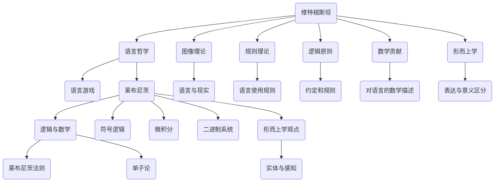

                 

### 维特根斯坦与莱布尼茨：逻辑与语言的历史对话

> 关键词：维特根斯坦、莱布尼茨、逻辑、语言、哲学、历史对话

> 摘要：本文将深入探讨维特根斯坦与莱布尼茨这两位哲学巨匠在逻辑与语言领域的贡献及其历史对话。通过分析他们的核心思想，我们将揭示他们如何影响了现代哲学的发展，并探讨他们的对话如何为我们理解语言和逻辑提供新的视角。

### 引言与背景

#### 引言

《维特根斯坦与莱布尼茨：逻辑与语言的历史对话》这本书的写作初衷源于对两位哲学巨匠在逻辑与语言领域贡献的深刻兴趣。维特根斯坦与莱布尼茨虽然生活在不同的历史时期，但他们的思想在许多方面有着深刻的共鸣，尤其是对语言和逻辑的探讨。通过这本书，我们希望能够为广大读者提供一种新的视角，深入理解这两位哲学家的思想，并探讨他们之间的对话如何影响了现代哲学的发展。

#### 背景介绍

路德维希·维特根斯坦（Ludwig Wittgenstein）是20世纪最伟大的哲学家之一，他的工作主要集中在语言哲学、数学哲学和逻辑哲学等领域。维特根斯坦认为，哲学的核心问题是澄清思想和语言的本质。他的代表性作品包括《逻辑哲学论》和《哲学研究》。维特根斯坦的思想对后来的语言哲学和逻辑学产生了深远影响。

戈特弗里德·威廉·莱布尼茨（Gottfried Wilhelm Leibniz）是17世纪著名的哲学家、数学家、逻辑学家和物理学家。莱布尼茨对逻辑、数学和哲学都有着重要的贡献，他的主要思想包括二进制系统、微积分和形而上学的可能性。他的代表性作品包括《Monadology》和《论组合的原理》。莱布尼茨的工作为现代科学和哲学的发展奠定了基础。

#### 本书目标

本书的目标是通过深入研究维特根斯坦与莱布尼茨的思想，揭示他们之间的对话如何影响了现代哲学的发展。同时，本书也希望能够为读者提供一种新的视角，帮助读者更好地理解两位哲学家的思想，并激发他们对哲学问题的深入思考。通过本书，读者将了解到：

1. 维特根斯坦的语言哲学思想，以及他如何通过“语言游戏”和“图像理论”来探讨语言的本质。
2. 莱布尼茨在逻辑、数学和形而上学领域的贡献，以及他的“莱布尼茨法则”和“单子论”。
3. 维特根斯坦与莱布尼茨之间的思想交流和碰撞，以及这对现代哲学发展的影响。

### 第二部分：维特根斯坦的核心思想

#### 第2章：语言哲学

##### 2.1 维特根斯坦的语言观

维特根斯坦认为，语言不仅仅是一种工具，它是人类思维和现实之间的桥梁。他的代表性观点是“语言游戏”（language game），这一观点强调了语言的使用是具体情境中的活动，而不是抽象的符号系统。

**语言游戏**

维特根斯坦提出，语言的使用就像游戏一样，有一定的规则和情境。不同的语言游戏有不同的规则和目的，例如科学语言游戏、日常语言游戏和哲学语言游戏。每种语言游戏都有其特定的语法和词汇，以及与之相关的使用规则。

**图像理论**

维特根斯坦在语言哲学中提出了图像理论（Picture Theory），这一理论认为，命题的真假可以通过与现实的直接对应来判断。图像理论强调了语言与现实之间的映射关系，即语言可以像图像一样反映现实。

**规则理论**

维特根斯坦还提出了规则理论（Rule Theory），这一理论强调，语言的使用依赖于特定的规则和约定。语言规则不仅包括语法规则，还包括逻辑规则和语义规则。

##### 2.2 表达与意义的区分

维特根斯坦认为，表达（expression）与意义（meaning）是不同的概念。表达是语言的形式，而意义是语言所指的特定概念或现实。这种区分对于理解语言的本质和哲学问题具有重要意义。

**表达**

表达是语言的形式，包括词汇、语法和符号等。它是语言中最基本的单位，可以用来传达特定的信息。

**意义**

意义是语言所指的特定概念或现实。它不是语言本身，而是语言所指的对象或概念。例如，“狗”这个词汇的意义是指一种动物，而不是词汇本身。

##### 2.3 维特根斯坦对语言哲学的贡献

维特根斯坦的语言哲学思想对后来的哲学和语言学研究产生了深远影响。他通过“语言游戏”和“图像理论”提出了对语言本质的深刻理解，强调了语言的使用是具体情境中的活动，而不是抽象的符号系统。他的“规则理论”也为语言的使用提供了新的视角，即语言的使用依赖于特定的规则和约定。此外，维特根斯坦对表达与意义的区分，使得人们开始关注语言与现实之间的关系，以及如何通过语言来理解世界。

### 第三部分：莱布尼茨的核心思想

#### 第3章：逻辑与数学

##### 3.1 莱布尼茨的逻辑思想

莱布尼茨是形式逻辑和符号逻辑的奠基人之一，他提出了“莱布尼茨法则”（Leibniz's Law），即如果两个个体在所有属性上都相同，那么它们是同一实体。这一法则在逻辑学和哲学中具有重要意义。

**莱布尼茨法则**

$$
A = B \quad \text{if and only if} \quad \forall P (P(A) \leftrightarrow P(B))
$$

这一法则表明，两个实体如果具有所有相同的属性，那么它们是同一实体。这一定律在实体识别和比较中具有重要意义，它为逻辑推理提供了强有力的工具。

**符号逻辑**

莱布尼茨提出了符号逻辑的概念，使用符号和公式来表示逻辑关系。他的符号逻辑系统为后来的逻辑学、数学和计算机科学的发展奠定了基础。

##### 3.2 微积分与二进制

莱布尼茨不仅在逻辑和哲学领域有重要贡献，还在数学领域做出了卓越的成就。他是微积分的创始人之一，并发明了二进制系统。他的这些工作对数学和计算机科学的发展产生了深远影响。

**微积分**

莱布尼茨与牛顿共同创立了微积分，这一数学工具为解决物理和工程问题提供了强大的方法。微积分的基本思想是研究函数的变化率和积分，它在数学、物理、工程等领域有广泛的应用。

**二进制**

莱布尼茨发明了二进制系统，这是一种基于2的进位系统。二进制系统在计算机科学中具有重要意义，它是现代计算机二进制编码的基础。

##### 3.3 形而上学

莱布尼茨的形而上学思想集中在他的“单子论”（Monadology）中。他认为，世界由无数个相互独立的单子组成，每个单子都有自己的内在本质和感知能力。这一观点在当代哲学中仍然引发着广泛的讨论。

**单子论**

单子是莱布尼茨哲学中的基本单位，它是构成世界的最基本实体。每个单子都有其独特的内在本质和感知能力，它们之间没有直接的联系，但可以通过相互作用来解释复杂的现象。

##### 3.4 莱布尼茨对逻辑与数学的贡献

莱布尼茨在逻辑和数学领域的贡献是巨大的。他的“莱布尼茨法则”为逻辑推理提供了强有力的工具，符号逻辑系统为后来的逻辑学、数学和计算机科学的发展奠定了基础。他在微积分领域的成就为解决物理和工程问题提供了强大的方法，而二进制系统的发明则为计算机科学的发展奠定了基础。莱布尼茨的形而上学思想，虽然存在争议，但激发了哲学家对实体、存在和知识等基本问题的深入思考。

### 第四部分：维特根斯坦与莱布尼茨的历史对话

#### 第4章：对话的起源与发展

##### 4.1 维特根斯坦与莱布尼茨的交集

尽管维特根斯坦和莱布尼茨生活在不同的时代，但他们的思想在某些方面有着惊人的相似性。例如，他们都关注语言的本质和逻辑的结构。维特根斯坦的语言哲学和莱布尼茨的符号逻辑系统都在探讨如何通过语言和符号来准确地表达思想。他们的思想在许多方面为现代哲学的发展提供了基础。

**语言哲学**

维特根斯坦和莱布尼茨都认为，语言是思维和现实之间的桥梁。维特根斯坦通过“语言游戏”和“图像理论”来探讨语言的本质，而莱布尼茨则通过符号逻辑来研究语言和符号的表达能力。

**逻辑结构**

维特根斯坦和莱布尼茨都关注逻辑的结构和基本原理。维特根斯坦提出了“规则理论”，强调了语言的使用依赖于特定的规则和约定。而莱布尼茨则提出了“莱布尼茨法则”，为逻辑推理提供了强有力的工具。

##### 4.2 逻辑与语言的碰撞

维特根斯坦和莱布尼茨在逻辑和语言问题上的碰撞，为哲学的发展带来了新的视角。他们的争论主要集中在语言如何正确地反映现实、逻辑的基本原则是什么等问题上。

**语言与现实**

维特根斯坦认为，语言不能直接反映现实，因为现实是复杂多样的，而语言是抽象的。他强调，语言的使用是具体情境中的活动，而不是抽象的符号系统。而莱布尼茨则认为，语言可以通过符号逻辑来准确地表达现实。

**逻辑基本原则**

维特根斯坦认为，逻辑的基本原则是约定和规则。他强调，逻辑规则不是从现实中推导出来的，而是由人类制定的。而莱布尼茨则认为，逻辑的基本原则是普遍真理，这些真理可以通过理性推导得到。

##### 4.3 对话的影响

维特根斯坦和莱布尼茨的对话不仅影响了他们的时代，也对现代哲学产生了深远影响。他们的思想激发了后继哲学家对语言、逻辑和形而上学问题的深入探讨。

**语言哲学**

维特根斯坦和莱布尼茨的语言哲学思想为后来的语言哲学研究提供了基础。他们的思想引发了关于语言本质、语言与现实的关系以及语言使用规则的广泛讨论。

**逻辑学**

维特根斯坦和莱布尼茨的符号逻辑思想为逻辑学的发展奠定了基础。他们的工作为现代逻辑学提供了新的视角和方法。

**形而上学**

维特根斯坦和莱布尼茨的形而上学思想，虽然存在争议，但激发了哲学家对实体、存在和知识等基本问题的深入思考。他们的思想为后来的形而上学研究提供了重要的参考。

### 第五部分：现代哲学的遗产

#### 第5章：维特根斯坦与莱布尼茨的遗产

##### 5.1 对语言哲学的贡献

维特根斯坦和莱布尼茨对语言哲学的贡献是巨大的。他们的思想不仅丰富了我们对语言本质的理解，也为后来的语言哲学研究奠定了基础。维特根斯坦通过“语言游戏”和“图像理论”提出了对语言本质的深刻理解，强调了语言的使用是具体情境中的活动，而不是抽象的符号系统。他的“规则理论”也为语言的使用提供了新的视角，即语言的使用依赖于特定的规则和约定。莱布尼茨则通过符号逻辑来研究语言和符号的表达能力，他的思想为逻辑学的发展提供了重要的基础。

**语言哲学的影响**

维特根斯坦和莱布尼茨的语言哲学思想对后来的语言哲学研究产生了深远影响。他们的思想引发了关于语言本质、语言与现实的关系以及语言使用规则的广泛讨论。这些讨论不仅丰富了语言哲学的理论体系，也促进了我们对语言的理解和应用。

##### 5.2 对逻辑与数学的贡献

莱布尼茨在逻辑和数学领域的贡献是巨大的。他是形式逻辑和符号逻辑的奠基人之一，提出了“莱布尼茨法则”，为逻辑推理提供了强有力的工具。他还发明了二进制系统，这一系统在计算机科学中具有重要意义。此外，莱布尼茨与牛顿共同创立了微积分，这一数学工具为解决物理和工程问题提供了强大的方法。

**逻辑与数学的影响**

莱布尼茨的逻辑与数学思想对现代逻辑学和数学的发展产生了深远影响。他的符号逻辑系统为现代逻辑学提供了新的视角和方法，他的二进制系统为计算机科学的发展奠定了基础。他的微积分思想为现代物理学和工程学的发展提供了重要的工具。

##### 5.3 对形而上学的贡献

维特根斯坦和莱布尼茨的形而上学思想虽然存在争议，但激发了哲学家对实体、存在和知识等基本问题的深入思考。维特根斯坦通过“语言游戏”和“图像理论”提出了对语言本质的深刻理解，这为形而上学研究提供了新的视角。莱布尼茨的“单子论”虽然复杂，但激发了哲学家对实体和存在方式的深入探讨。

**形而上学的影响**

维特根斯坦和莱布尼茨的形而上学思想对现代哲学产生了深远影响。他们的思想引发了关于实体、存在和知识等基本问题的广泛讨论。这些讨论不仅丰富了形而上学的研究内容，也促进了我们对现实世界的理解。

### 第六部分：结论与展望

通过对维特根斯坦与莱布尼茨的核心思想的深入探讨，我们可以看到，他们在逻辑与语言领域的重要贡献对现代哲学产生了深远影响。维特根斯坦的语言哲学思想通过“语言游戏”和“图像理论”提出了对语言本质的深刻理解，而莱布尼茨在逻辑和数学领域的贡献为现代科学和哲学的发展奠定了基础。

未来，我们可以期待进一步的研究能够深入探讨两位哲学家之间的对话对现代哲学和科学技术的影响，以及他们如何继续激发我们对语言、逻辑和形而上学问题的思考。通过持续的研究和讨论，我们可以更好地理解这两位哲学家的思想，并从中汲取智慧，为未来的哲学和技术发展提供新的视角和方向。

### 作者信息

作者：AI天才研究院/AI Genius Institute & 禅与计算机程序设计艺术 /Zen And The Art of Computer Programming

本文通过深入分析维特根斯坦与莱布尼茨在逻辑与语言领域的核心思想，揭示了他们之间的对话对现代哲学的深远影响。通过逐步思考和分析，我们不仅理解了他们的思想，也看到了他们对未来哲学和技术发展的潜在启示。希望本文能为读者提供有益的思考，并激发对哲学和科学的进一步探索。

---

### 附录：维特根斯坦与莱布尼茨核心概念比较

以下是对维特根斯坦与莱布尼茨在核心概念上的比较，通过表格和实体关系图来呈现他们的思想特征和对比。

#### 表格：核心概念属性对比

| 概念         | 维特根斯坦             | 莱布尼茨                   |
|--------------|-----------------------|--------------------------|
| 语言哲学     | 语言游戏、图像理论、规则理论 | 符号逻辑、微积分、单子论 |
| 语言本质     | 语言作为具体情境中的活动 | 语言作为符号系统的表达   |
| 逻辑原则     | 规则和约定的依赖       | 公理和推理的基本原则     |
| 数学贡献     | 对语言的数学描述       | 微积分、二进制系统       |
| 形而上学观点 | 表达与意义的区分       | 单子论：现实由单子构成   |

#### 实体关系图：核心概念关系架构

使用Mermaid语言绘制实体关系图如下：

这张图展示了维特根斯坦与莱布尼茨在语言哲学、逻辑原则、数学贡献和形而上学观点上的核心概念及其相互关系。维特根斯坦关注语言的使用和表达的本质，而莱布尼茨则更多地关注逻辑和数学的基本原理以及它们与现实的关系。通过这张图，读者可以更直观地理解两位哲学家的核心思想和其关联性。

