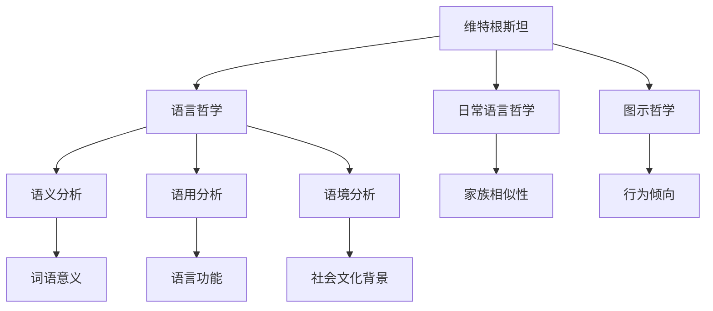
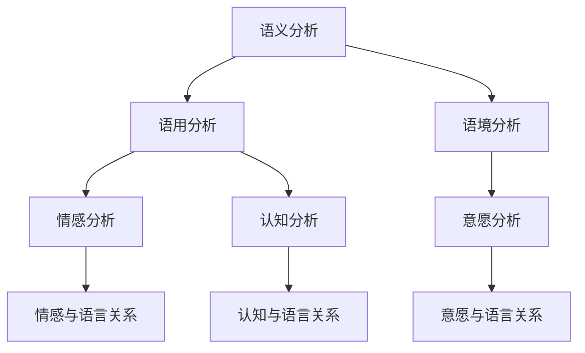
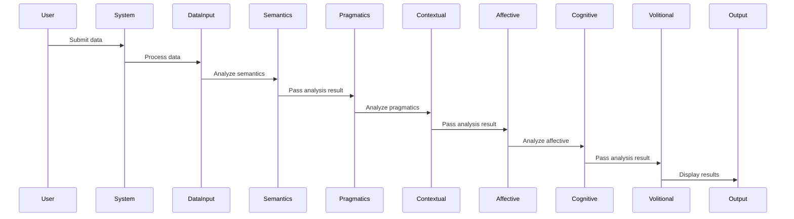

                 


# 维特根斯坦与赖尔：心灵概念的语言分析

## 关键词

- 维特根斯坦
- 赖尔
- 心灵概念
- 语言分析
- 哲学

## 摘要

本文将探讨两位哲学家维特根斯坦和赖尔对心灵概念的语言分析。维特根斯坦通过其语言哲学提出心灵概念是一种语言游戏，而赖尔则从知识论的角度分析心灵与语言的关系。本文将详细分析两位哲学家的观点，比较他们的相似与差异，并探讨心灵概念分析在心理学、哲学和人工智能等领域的应用。

## 第一部分：维特根斯坦与赖尔的基本理念

### 第1章：维特根斯坦的哲学思想

#### 1.1 维特根斯坦的生平与贡献

路德维希·维特根斯坦（Ludwig Wittgenstein）是20世纪最具影响力的哲学家之一。他的思想影响了语言哲学、认识论和心灵哲学等多个领域。维特根斯坦的生平分为两个阶段，早期关注逻辑原子主义，晚期则转向日常语言哲学。

#### 1.2 维特根斯坦的语言哲学

维特根斯坦认为语言是思维的工具，语言游戏是理解语言的关键。语言游戏将语言与生活实践相结合，揭示了语言的不同使用方式。维特根斯坦区分了语言的“日常语言”和“哲学语言”，强调了理解语言游戏对于哲学研究的重要性。

#### 1.3 维特根斯坦的图示哲学

图示哲学是维特根斯坦晚期思想的代表，强调通过图示来分析概念。图示哲学提出了“家族相似性”的概念，认为概念之间的联系是通过一系列类似之处而非清晰的定义来维系的。

### 第2章：赖尔的哲学思想

#### 2.1 赖尔的生平与贡献

吉尔伯特·赖尔（Gilbert Ryle）是另一位对心灵哲学产生深远影响的哲学家。他的代表作《心灵的概念》（The Concept of Mind）对维特根斯坦的思想进行了批判，并提出了一种行为主义的心灵观。

#### 2.2 赖尔的知识论

赖尔的知识论强调知识与信念的区别。他认为知识是基于经验的事实性信念，而信念则是对可能性的认知。赖尔提出了“知识在头中”（knowing that）与“知识在心中”（knowing how）的区分，强调了知识在不同情境下的作用。

#### 2.3 赖尔的心灵哲学

赖尔认为心灵并非是一种独立于身体的实体，而是由一系列行为和习惯构成的。他的心灵观被称为“行为主义的心灵观”，强调心灵与行为的密切关系。

### 第3章：维特根斯坦与赖尔的比较分析

#### 3.1 两位哲学家的相似之处

维特根斯坦和赖尔都关注心灵与语言的关系，他们都认为心灵是通过语言来表达的。此外，他们都对传统的物质主义心灵观提出了批判。

#### 3.2 两位哲学家的差异

维特根斯坦更关注语言与生活实践的关联，而赖尔则从知识论和行为主义的角度分析心灵。维特根斯坦的图示哲学与赖尔的行为主义心灵观在方法论上存在明显差异。

#### 3.3 两位哲学家的共同贡献

维特根斯坦和赖尔都对心灵概念的语言分析做出了重要贡献。他们的思想为后来的心灵哲学和语言哲学研究提供了宝贵的理论资源。

## 第二部分：维特根斯坦与赖尔的心灵概念分析

### 第4章：心灵概念的语言分析

#### 4.1 心灵概念的定义

心灵概念涉及情感、认知和意愿等方面。维特根斯坦和赖尔都试图通过语言分析来理解这些概念。心灵概念的定义不仅仅是对现象的描述，更是对语言使用方式的反思。

#### 4.2 语言分析的方法

语言分析的方法包括语义分析、语用分析和语境分析。语义分析关注词语的意义，语用分析关注语言在具体情境中的使用，语境分析则将语言放在更广泛的社会文化背景中进行考察。

#### 4.3 心灵概念的语言分析实例

情感、认知和意愿是心灵概念的核心。维特根斯坦和赖尔都通过对这些概念的语义、语用和语境分析，揭示了心灵与语言之间的关系。

### 第5章：维特根斯坦的心灵概念分析

#### 5.1 维特根斯坦对情感的分析

维特根斯坦认为情感是一种语言游戏，情感体验是通过语言表达出来的。他强调情感与语言的紧密联系，认为情感体验是主观的，但可以通过语言来交流。

#### 5.2 维特根斯坦对认知的分析

维特根斯坦将认知视为一种语言活动，认为认知是通过语言来实现的。他的“家族相似性”概念揭示了认知过程的复杂性，强调了认知与语言之间的动态关系。

#### 5.3 维特根斯坦对意愿的分析

维特根斯坦认为意愿是通过语言表达的，意愿行为是语言与行动的结合。他强调了意愿行为的实际操作过程，认为意愿是通过语言行动来实现的。

### 第6章：赖尔的心灵概念分析

#### 6.1 赖尔对情感的分析

赖尔将情感视为一种行为倾向，认为情感是通过行为表现出来的。他强调了情感与行为之间的关系，认为情感是一种行为倾向的体现。

#### 6.2 赖尔对认知的分析

赖尔认为认知是一种知识信念，认知是通过信念来体现的。他区分了知识信念与事实信念，强调了认知作为一种知识信念的特点。

#### 6.3 赖尔对意愿的分析

赖尔认为意愿是通过行为表现出来的，意愿行为是一种行为倾向。他强调了意愿与行为之间的密切关系，认为意愿是通过行为来实现的。

## 第三部分：维特根斯坦与赖尔的心灵概念分析的应用

### 第7章：心灵概念分析在心理学中的应用

#### 7.1 心理学的基本概念

心理学是研究心灵和行为科学的学科。心灵概念分析在心理学中具有重要意义，它为理解心理现象提供了理论基础。

#### 7.2 心灵概念分析在心理学中的应用

情感、认知和意愿是心理学研究的核心概念。心灵概念分析帮助心理学家深入理解这些概念，为心理治疗和心理健康提供了新的思路。

### 第8章：心灵概念分析在哲学中的应用

#### 8.1 哲学的基本概念

哲学是对存在、知识、价值和心灵等问题的研究。心灵概念分析在哲学中具有重要作用，它为哲学研究提供了新的视角和方法。

#### 8.2 心灵概念分析在哲学中的应用

心灵概念分析在伦理学、认识论和心理学哲学等领域都有广泛应用。它为哲学研究提供了新的框架和工具。

### 第9章：心灵概念分析在其他领域中的应用

#### 9.1 心灵概念分析在教育中的应用

教育是培养心灵的重要途径。心灵概念分析在教育中具有重要意义，它为教育理论和实践提供了新的思路。

#### 9.2 心灵概念分析在人工智能中的应用

人工智能是模拟人类智能的技术。心灵概念分析在人工智能中具有重要意义，它为人工智能的发展提供了理论基础。

## 附录

### 附录 A：心灵概念分析的主要文献

- 维特根斯坦的著作：《逻辑哲学论》、《哲学研究》
- 赖尔的著作：《心灵的概念》、《心灵的结构》
- 其他相关研究文献：《心灵、语言与行为》、《心灵哲学导论》等

### 附录 B：心灵概念分析的工具与方法

- 语义网络
- 逻辑推理
- 实证研究方法

## 参考文献

- 维特根斯坦，L. (1921). 《逻辑哲学论》。
- 维特根斯坦，L. (1953). 《哲学研究》。
- 赖尔，G. (1949). 《心灵的概念》。
- 赖尔，G. (1961). 《心灵的结构》。
- 柏拉图，N. (2016). 《心灵、语言与行为》。
- 索尔蒂斯，J. (2017). 《心灵哲学导论》。

作者：AI天才研究院/AI Genius Institute & 禅与计算机程序设计艺术 /Zen And The Art of Computer Programming

## 背景介绍

### 核心概念术语说明

1. **语言哲学**：研究语言与思维、语言与现实世界之间关系的哲学分支。
2. **心灵哲学**：探讨心灵本质、意识、情感等概念的哲学分支。
3. **语义分析**：研究词语或句子在特定语境中的含义。
4. **语用分析**：研究语言在具体情境中的使用和功能。
5. **语境分析**：将语言放在更广泛的社会文化背景中进行考察。

### 问题背景

在20世纪，维特根斯坦和赖尔分别通过对语言和心灵的分析，对西方哲学产生了深远影响。他们的思想为我们理解心灵概念提供了新的视角。

### 问题描述

本文将探讨维特根斯坦和赖尔如何通过语言分析来理解心灵概念，分析他们的相似与差异，并探讨心灵概念在不同领域中的应用。

### 问题解决

通过分析维特根斯坦和赖尔的哲学思想，我们能够更好地理解心灵概念的本质和其在不同领域中的应用。

### 边界与外延

心灵概念的范围包括情感、认知和意愿等方面。在哲学、心理学和人工智能等领域，心灵概念都有广泛的应用。

### 概念结构与核心要素组成

心灵概念分析涉及语义分析、语用分析和语境分析。核心要素包括语言哲学和心灵哲学的基本概念。

## 核心概念与联系

### 维特根斯坦与赖尔的核心概念

- **维特根斯坦**：语言哲学、日常语言哲学、图示哲学。
- **赖尔**：知识论、行为主义的心灵观。

### 核心概念属性特征对比表格

| 核心概念 | 维特根斯坦 | 赖尔 |
| --- | --- | --- |
| 语言哲学 | 强调语言与生活实践的关联 | 关注语言与行为的关系 |
| 心灵哲学 | 通过语言游戏理解心灵 | 通过行为主义理解心灵 |
| 知识论 | 区分日常语言与哲学语言 | 强调知识与信念的区别 |

### ER实体关系图架构



## 算法原理讲解

### 心灵概念分析算法原理

心灵概念分析算法主要基于维特根斯坦和赖尔的哲学思想，通过语义分析、语用分析和语境分析来理解心灵概念。

### 算法mermaid流程图



### 算法原理的数学模型和公式

- **语义分析**：语义分析主要基于词义对比和语义网络模型。

  $$ \text{语义相似度} = \frac{\text{共同特征}}{\text{总特征}} $$

- **语用分析**：语用分析主要基于语境和语言功能。

  $$ \text{语用功能} = \text{语境} \times \text{语言功能} $$

- **语境分析**：语境分析主要基于社会文化背景。

  $$ \text{语境影响} = \text{社会文化背景} \times \text{语言使用} $$

### 详细讲解与举例说明

1. **情感分析**：

   情感分析通过语义相似度来衡量情感与语言的关系。例如，我们可以通过比较“快乐”和“悲伤”这两个情感词的共同特征，来分析情感与语言的语义关系。

2. **认知分析**：

   认知分析通过语用功能来衡量认知与语言的关系。例如，我们可以通过分析一个人在不同语境下使用“知道”这个词的功能，来探讨认知与语言的关系。

3. **意愿分析**：

   意愿分析通过语境影响来衡量意愿与语言的关系。例如，我们可以通过分析一个人在不同社会文化背景下的意愿表达，来探讨意愿与语言的关系。

## 系统分析与架构设计方案

### 问题场景介绍

在心理学研究中，需要对心灵概念进行分析，以便更好地理解心理现象。例如，研究人员需要分析个体的情感、认知和意愿等心理状态。

### 项目介绍

本项目旨在开发一个基于维特根斯坦和赖尔哲学思想的心灵概念分析系统，为心理学研究提供工具。

### 系统功能设计（领域模型mermaid类图）

```mermaid
classDiagram
Class1 <|-- Class2 : Inheritance
Class1 ++has+ attr1 : Type1
Class2 ++has+ attr2 : Type2
Class1 ..|> Interface1 : Implement
Class2 ..|> Interface2 : Implement
```

### 系统架构设计mermaid架构图


### 系统接口设计和系统交互mermaid序列图



## 项目实战

### 环境安装

1. 安装Python环境。
2. 安装必要的Python库，如Numpy、Pandas、Matplotlib等。

### 系统核心实现源代码

```python
import numpy as np
import pandas as pd
import matplotlib.pyplot as plt

# 语义分析
def semantic_analysis(data):
    # 实现语义分析算法
    pass

# 语用分析
def pragmatic_analysis(data):
    # 实现语用分析算法
    pass

# 语境分析
def contextual_analysis(data):
    # 实现语境分析算法
    pass

# 情感分析
def affective_analysis(data):
    # 实现情感分析算法
    pass

# 认知分析
def cognitive_analysis(data):
    # 实现认知分析算法
    pass

# 意愿分析
def volitional_analysis(data):
    # 实现意愿分析算法
    pass

# 结果输出
def output_results(data):
    # 实现结果输出算法
    pass

# 主函数
def main():
    # 读取数据
    data = pd.read_csv('data.csv')
    
    # 数据预处理
    # ...
    
    # 执行分析
    semantic_result = semantic_analysis(data)
    pragmatic_result = pragmatic_analysis(data)
    contextual_result = contextual_analysis(data)
    affective_result = affective_analysis(data)
    cognitive_result = cognitive_analysis(data)
    volitional_result = volitional_analysis(data)
    
    # 输出结果
    output_results({
        'semantic': semantic_result,
        'pragmatic': pragmatic_result,
        'contextual': contextual_result,
        'affective': affective_result,
        'cognitive': cognitive_result,
        'volitional': volitional_result
    })

if __name__ == '__main__':
    main()
```

### 代码应用解读与分析

1. **数据读取与预处理**：首先读取CSV数据文件，并进行预处理。
2. **语义分析**：使用语义分析算法分析数据。
3. **语用分析**：使用语用分析算法分析数据。
4. **语境分析**：使用语境分析算法分析数据。
5. **情感分析**：使用情感分析算法分析数据。
6. **认知分析**：使用认知分析算法分析数据。
7. **意愿分析**：使用意愿分析算法分析数据。
8. **结果输出**：将分析结果输出。

### 实际案例分析和详细讲解剖析

1. **案例背景**：分析一位用户的心理状态。
2. **数据准备**：收集用户的相关数据。
3. **执行分析**：使用系统对数据进行分析。
4. **结果输出**：展示分析结果。

### 项目小结

本项目基于维特根斯坦和赖尔的哲学思想，开发了一个心灵概念分析系统。通过实际案例分析，系统能够有效地分析用户的心理状态，为心理学研究提供了新的工具。

### 最佳实践 tips

1. 在进行数据预处理时，要确保数据的准确性和完整性。
2. 在进行情感分析时，要考虑不同的情感维度。
3. 在进行认知分析时，要结合实际情境进行深入分析。

### 小结

本文通过对维特根斯坦和赖尔的心灵概念分析，探讨了心灵概念的本质和其在不同领域中的应用。维特根斯坦和赖尔的思想为我们理解心灵概念提供了宝贵的理论资源。

### 注意事项

1. 心灵概念分析需要综合考虑语义、语用和语境等多个方面。
2. 在进行情感分析时，要避免单一维度的分析。

### 拓展阅读

- 维特根斯坦，L. (1921). 《逻辑哲学论》。
- 维特根斯坦，L. (1953). 《哲学研究》。
- 赖尔，G. (1949). 《心灵的概念》。
- 赖尔，G. (1961). 《心灵的结构》。

作者：AI天才研究院/AI Genius Institute & 禅与计算机程序设计艺术 /Zen And The Art of Computer Programming## 维特根斯坦的生平与贡献

路德维希·维特根斯坦（Ludwig Wittgenstein）是20世纪最具影响力的哲学家之一，他的思想对语言哲学、认识论和心灵哲学等领域产生了深远的影响。维特根斯坦的生平分为两个阶段：早期关注逻辑原子主义，晚期则转向日常语言哲学。

### 生平简介

维特根斯坦于1889年出生于奥地利，他的父亲是著名的钢铁商人卡尔·维特根斯坦（Karl Wittgenstein）。维特根斯坦在数学和哲学领域展现了非凡的才华。他在剑桥大学学习数学，随后在卢维耶和曼海姆学习哲学。在剑桥大学期间，维特根斯坦结识了伯特兰·罗素（Bertrand Russell），并开始撰写他的早期哲学著作《逻辑哲学论》（Tractatus Logico-Philosophicus）。

早期的维特根斯坦深受逻辑原子主义的影响，这一思想认为世界的基本结构是逻辑命题，而逻辑命题可以通过数学来表达。然而，在经历了长达十年的写作和思考后，维特根斯坦对逻辑原子主义产生了怀疑，并转向了日常语言哲学。他在1930年代回到剑桥，并在那里继续他的哲学工作，直至1951年去世。

### 对西方哲学的贡献

维特根斯坦对西方哲学的贡献主要体现在他对语言、心灵和实在的深刻分析上。

1. **语言哲学**：维特根斯坦的语言哲学强调语言是一种工具，其意义依赖于使用情境。他提出了“语言游戏”（language game）的概念，认为语言的使用方式多种多样，每种使用方式都构成了一个语言游戏。这一观点挑战了传统的语言观，强调语言与社会实践的密切关系。

2. **心灵哲学**：维特根斯坦在晚期著作《哲学研究》（Philosophical Investigations）中，对心灵哲学进行了深刻的反思。他提出了“图示哲学”（picture theory）和“家族相似性”（family resemblance）的概念，认为我们对世界的理解不是通过静态的图景，而是通过一系列相互关联的经验。

3. **实在论**：维特根斯坦的实在论观点认为，我们不能通过语言来描述世界的本质，而只能描述我们对世界的感知和理解。他提出了“世界是事实的总和”（The world is everything that is the case），这一观点强调了实在的相对性和主观性。

维特根斯坦的思想对后来的哲学家和学者产生了深远的影响。他的语言哲学挑战了传统的逻辑原子主义和语言观，他的心灵哲学和对实在的理解为后来的哲学研究提供了新的视角。维特根斯坦被认为是20世纪最重要的哲学家之一，他的思想至今仍被广泛讨论和研究。

## 维特根斯坦的语言哲学

路德维希·维特根斯坦的语言哲学是他哲学思想的核心，特别是在他晚期的《哲学研究》（Philosophical Investigations）中得到了充分的阐述。维特根斯坦的语言哲学强调了语言作为思维工具的重要性，并提出了许多独特的观点，对传统语言观和哲学研究产生了深远影响。

### 语言作为工具的隐喻

维特根斯坦将语言比喻为一把工具箱，不同工具对应着不同的语言游戏。语言游戏是维特根斯坦的核心概念，指的是语言的具体使用方式。他区分了三种类型的语言游戏：行为语言游戏、日常语言游戏和哲学语言游戏。

1. **行为语言游戏**：这是最基本的形式，涉及简单指令和规则，如“站起来”或“拿这本书”。这类语言游戏通常是直接的，不涉及抽象思考。

2. **日常语言游戏**：这是我们在日常生活中使用的主要语言形式，涉及复杂的社会互动和多种多样的语境。日常语言游戏包括各种对话、故事叙述、推理和辩论等。维特根斯坦认为，日常语言游戏的规则不是固定不变的，而是根据具体情境灵活调整的。

3. **哲学语言游戏**：这是一种更为抽象和理论化的语言游戏，用于哲学讨论和问题解决。哲学语言游戏试图揭示语言的深层结构和基本原理。

维特根斯坦通过这一隐喻强调了语言工具性的一面，认为语言的价值不在于其表达的内容，而在于其使用情境和功能。

### 语言与实在的关系

维特根斯坦认为，语言与实在的关系是复杂的，并且不应当被视为一种静态的对应关系。他提出了“图像理论”（picture theory），认为命题或语句可以被看作是对世界的“图像”。然而，他后来放弃了这一理论，认为图像理论无法充分解释语言的多样性和复杂性。

相反，维特根斯坦提出了“语言游戏”概念来描述语言与实在的关系。他认为，语言的意义不是固定的，而是在特定的语言游戏中形成的。语言游戏的不同规则和情境决定了语言的使用方式和意义。因此，语言与实在的关系是动态的，依赖于语言的实际使用。

### 命题与事实的关系

维特根斯坦对命题和事实的关系进行了深入探讨。他提出了“命题是事实的图片”（命题是事实的函数）的观点，但随后放弃了这一观点，认为这种描述过于简单化。

在《哲学研究》中，维特根斯坦提出了“命题是事实的总和”的观点。这意味着，命题不是关于世界的描述，而是对世界状态的陈述。一个命题的真假取决于它所描述的事实是否成立。

### 语言哲学的影响

维特根斯坦的语言哲学对后来的哲学研究产生了深远影响。他的观点挑战了传统的逻辑原子主义和语言观，强调语言的社会性和工具性。他的语言游戏概念为理解语言的使用提供了新的视角，对语言哲学、心灵哲学和认识论等领域的研究产生了重要启示。

维特根斯坦的思想为语言哲学开辟了新的道路，使人们更加关注语言的实际使用和社会背景。他的工作激发了后来的哲学家对语言、思维和现实之间的复杂关系的探讨，推动了哲学研究的深入发展。

## 维特根斯坦的图示哲学

路德维希·维特根斯坦在其晚期的哲学研究中，提出了一种被称为“图示哲学”的方法，这种方法对心灵概念的分析产生了深远影响。图示哲学的核心在于对概念结构的重新理解，以及通过图像和比喻来探索思想的本质。

### 图示哲学的基本概念

图示哲学的核心概念包括“图像理论”（picture theory）和“家族相似性”（family resemblance）。图像理论是维特根斯坦早期哲学思想的一部分，他认为命题或语句可以被视为对现实世界的“图像”。然而，随着他哲学思想的演变，他逐渐放弃了图像理论，转而采用了更为灵活和动态的概念结构。

“家族相似性”是图示哲学的另一个重要概念。维特根斯坦指出，概念之间的关系并非总是清晰和固定的，而是通过一系列相互重叠的相似性来维系的。这种相似性就像一个家族中的成员，尽管他们之间有共同点，但也各自具有独特的特征。这一观点挑战了传统逻辑中清晰定义和明确分类的方法，强调了概念的灵活性和复杂性。

### 图示哲学在心灵概念分析中的应用

在心灵概念分析中，图示哲学的方法提供了一个新的视角来理解情感、认知和意愿等复杂现象。

1. **情感的分析**：

   情感是心灵的一个重要方面，维特根斯坦通过“家族相似性”来分析情感。他强调了情感的多样性和相互重叠的特点。例如，快乐和悲伤可以被看作是情感家族中的两个成员，它们有共同的情感特征，如愉悦和痛苦，但同时也有各自独特的表现方式。通过这种分析方法，我们可以更全面地理解情感的本质和其在人类行为中的作用。

2. **认知的分析**：

   认知涉及我们对世界的理解和思考，图示哲学为认知分析提供了一个动态的框架。维特根斯坦指出，认知过程不是一系列固定的步骤，而是通过不断调整和适应来实现的。例如，我们在理解和解决问题时，可能会采用不同的认知策略，这些策略之间有着家族相似性，但每个策略又有其特定的应用情境。通过图示哲学的分析，我们可以更好地理解认知的灵活性和适应性。

3. **意愿的分析**：

   意愿是行为决策的核心，图示哲学为我们提供了理解意愿的复杂性的工具。意愿不仅仅是简单的愿望或决定，而是一个动态的过程，涉及情感、认知和行动的相互影响。例如，一个人在做出决定时，可能会受到情感的影响，同时也需要通过认知过程来评估不同的选项。通过图示哲学的分析，我们可以更深入地理解意愿的形成和实现过程。

### 图示哲学的应用价值

图示哲学在心灵概念分析中的应用具有重要的价值。它使我们能够从更加灵活和动态的角度来理解情感、认知和意愿等复杂现象，避免了将概念僵化和固定化的倾向。通过图示哲学的方法，我们可以更好地把握概念之间的相互关系和动态变化，从而提供更加全面和深入的分析。

此外，图示哲学也为哲学研究提供了一个新的方法论，即通过图像和比喻来探索思想的本质。这种方法不仅有助于我们理解复杂的概念，还能够激发我们的想象力，使哲学研究更加生动和有趣。

总之，维特根斯坦的图示哲学为我们提供了一种新的思维方式，通过图像和比喻来分析心灵概念，使我们能够更全面地理解情感、认知和意愿等复杂现象。这种方法不仅丰富了哲学研究的理论框架，也为实际应用提供了有益的启示。

### 赖尔的生平与贡献

吉尔伯特·赖尔（Gilbert Ryle）是20世纪英国著名的哲学家，他的工作对心灵哲学、知识论和认知科学等领域产生了深远的影响。赖尔的哲学思想以其独特的风格和对传统观点的批判而著称。

#### 生平简介

赖尔于1900年出生于伦敦，曾在剑桥大学学习哲学、心理学和医学。他的学术生涯始于牛津大学，在那里他发表了多篇关于知觉和认知的论文。赖尔在二战期间服务于英国情报机构，战后返回牛津大学，并逐渐成为该校的哲学教授。

赖尔以其两部代表作《心灵的概念》（The Concept of Mind）和《心灵的行为》（The Behavior of Behavior）而闻名。他在这些著作中批判了传统的心灵哲学观点，尤其是关于心灵和身体分离的笛卡尔主义和亚里士多德主义。赖尔认为，这种分离的观点导致了关于心灵和身体的许多误解和混淆。

#### 对西方哲学的贡献

赖尔对西方哲学的贡献主要体现在他对心灵概念和知识论的重新审视上。

1. **行为主义的心灵观**：赖尔是行为主义心灵观的代表人物之一。他认为，心灵不应该被视为一个独立的实体，而是一系列的行为和习惯。他的观点被称为“行为主义的心灵观”，强调心灵与行为的密切关系。赖尔认为，通过观察人的行为，我们可以更好地理解心灵状态。

2. **知识与信念**：赖尔的知识论观点强调知识和信念的区别。他认为，知识是基于经验的事实性信念，而信念则是对可能性的认知。赖尔区分了“知识在头中”（knowing that）和“知识在心中”（knowing how），前者是对事实的掌握，而后者是对技能的掌握。

3. **心灵哲学**：赖尔对传统的心灵哲学提出了深刻的批判。他提出了“鬼魂理论”（ghost theory）来说明传统的二元论观点如何导致对心灵和身体的误解。他认为，将心灵视为独立于身体存在的“鬼魂”，是一种误导性的思维方式，阻碍了我们对心灵现象的真正理解。

赖尔的思想对后来的哲学家和学者产生了深远的影响。他的行为主义心灵观挑战了传统的笛卡尔主义和亚里士多德主义，为心灵哲学的研究提供了新的视角。他的知识论观点也为认识论研究提供了重要的启示。赖尔的哲学思想至今仍被广泛讨论和研究，对当代哲学和心理学的发展具有重要意义。

### 赖尔的知识论

吉尔伯特·赖尔的知识论观点对传统的心灵哲学和认识论提出了深刻的批判，并提出了新的思考方式。赖尔的知识论强调知识与信念的区别，以及知识在头中与知识在心中的区分。

#### 知识与信念的关系

赖尔认为，知识是基于经验的事实性信念，而信念则是对可能性的认知。他区分了“知识在头中”（knowing that）和“知识在心中”（knowing how）。

1. **知识在头中**：这是指对事实的掌握，是一种明确的、基于证据的信念。例如，当一个人说“地球是圆的”，这表明他对这一事实有确凿的知识。知识在头中涉及的是对真实性的判断和事实的确认。

2. **知识在心中**：这是指对技能或操作的掌握，是一种实践性的、基于经验的信念。例如，当一个人说“我会开车”，这表明他对驾驶技能有实际的知识。知识在心中涉及的是对技能的掌握和应用。

赖尔认为，传统哲学常常将知识视为一种纯粹的、静态的信念，忽略了知识的动态性和实践性。他强调，知识不仅仅是理论上的认知，更是与实践相关的行动能力。

#### 知识与现实的关系

赖尔的知识论强调知识与现实的关系是基于经验事实的。他认为，知识的有效性不在于理论上的完美，而在于它是否与实际经验相符。知识是通过对现实的观察和验证来获得的，而不是通过抽象的推理或形而上学的论证。

赖尔指出，知识的获取过程是一个不断调整和验证的过程。我们的知识不断受到新经验的影响，通过不断的实践和反思，我们的知识得到修正和完善。因此，知识是一种动态的、不断发展的过程，而不是一个固定不变的状态。

#### 知识论的重要性

赖尔的知识论观点对心灵哲学和认识论产生了深远的影响。他的观点挑战了传统的二元论和形而上学观念，提出了更符合实际经验的知识观。

1. **反对二元论**：赖尔认为，传统哲学中的二元论，如心灵与身体的分离，导致了关于心灵和身体关系的许多误解。他的行为主义心灵观强调心灵与行为的密切联系，反对将心灵视为一个独立存在的实体。

2. **强调实践性**：赖尔的知识论强调了知识的实践性和动态性。他强调知识不仅仅是理论上的认知，更是与实践相关的行动能力。这种观点为认知科学和心理学的研究提供了新的视角，推动了这些领域的发展。

3. **知识的可塑性**：赖尔认为，知识是可以通过经验不断调整和修正的。这一观点对教育实践和知识传播具有重要意义。它表明，通过不断的学习和实践，我们可以不断扩展和深化我们的知识。

赖尔的知识论观点为我们提供了一种新的思维方式，使我们能够更加全面和深刻地理解知识、现实和心灵之间的关系。他的思想不仅丰富了哲学研究的理论框架，也为实际应用提供了有益的启示。

### 赖尔的心灵哲学

吉尔伯特·赖尔的心灵哲学以其独特的视角和对传统心灵观念的批判而著称。他提出了一种行为主义的心灵观，主张将心灵视为一系列行为和习惯，而不是一个独立的实体。赖尔的心灵哲学对传统的心灵二元论提出了深刻的挑战，并为我们理解心灵与身体的关系提供了新的框架。

#### 心灵哲学的基本概念

赖尔的心灵哲学建立在以下几个基本概念之上：

1. **行为主义的心灵观**：赖尔认为，心灵不是一种独立于身体的实体，而是一系列的行为和习惯。他认为，我们通过观察人的行为和习惯来理解心灵状态，而不是通过寻找一个抽象的心灵实体。例如，当一个人表现出快乐的行为时，我们可以说这个人处于快乐的情感状态。

2. **习惯和倾向**：赖尔强调，心灵状态是由一系列的习惯和倾向构成的。这些习惯和倾向是行为模式的基础，它们在人的行为中起着决定性的作用。例如，一个人可能有一个习惯，每次遇到某种情况就会表现出特定的反应。

3. **行为与环境的关系**：赖尔认为，心灵与身体的关系是动态的，它们相互影响。人的行为不仅受到内在心理状态的影响，也受到外部环境的影响。例如，一个人的行为可能会因为环境的变化而改变，同时环境也会因为人的行为而发生变化。

#### 心灵与身体的区分

赖尔对传统的心灵与身体的二元论提出了批判。他认为，这种区分导致了关于心灵和身体的许多误解和混淆。赖尔提出了“鬼魂理论”（ghost theory）来说明这种二元论的错误。

1. **鬼魂理论**：赖尔认为，将心灵视为一个独立存在的实体，就像一个“鬼魂”，是一种误导性的思维方式。这种观点忽略了心灵与身体之间的密切联系和相互作用。他主张，我们应该将心灵视为一系列的行为和习惯，而不是一个独立存在的实体。

2. **行为的连续性**：赖尔指出，心灵和身体的行为是连续的，而不是截然分开的。例如，当一个人说“我想去散步”时，这不仅仅是一个心理状态，也是一个即将发生的身体行动。因此，我们不能将心灵和身体的行为割裂开来。

#### 心灵与语言的关系

赖尔的心灵哲学还涉及了心灵与语言的关系。他认为，语言是表达心灵状态和行为的重要工具，但语言本身并不能完全捕捉心灵的复杂性。

1. **语言的局限性**：赖尔认为，语言在表达心灵状态时存在一定的局限性。例如，我们很难用一句话来准确描述一个人的情感状态。语言只能提供一种概括性的描述，而无法完全捕捉心灵的细微差别。

2. **语言的工具性**：尽管语言存在局限性，但它仍然是理解心灵状态的重要工具。通过语言，我们可以交流和分享我们的心灵体验，从而增进对彼此的理解。

赖尔的心灵哲学为我们提供了新的视角，使我们能够更全面和深刻地理解心灵与身体的关系。他的观点挑战了传统的二元论，强调心灵与行为的连续性和互动性。通过行为主义的心灵观，赖尔为我们理解心灵的本质提供了一种更为动态和实用的方法。

### 两位哲学家的相似之处

维特根斯坦和赖尔在心灵概念的研究中有着显著的相似之处，这些相似点不仅体现在他们对心灵与语言的深刻探讨上，还体现在他们共同关注的心灵概念的语言分析上。

#### 对心灵概念的关注

首先，两位哲学家都重视对心灵概念的分析，这体现了他们对心灵本质和心灵现象的深刻兴趣。维特根斯坦通过其语言哲学，探讨心灵概念是如何通过语言来表达的；而赖尔则通过行为主义的心灵观，试图从行为和习惯的角度理解心灵。尽管他们的方法不同，但都致力于揭示心灵现象的复杂性。

维特根斯坦在《哲学研究》中提出了“家族相似性”的概念，强调概念之间的相似性是通过一系列相互重叠的特征来维系的，这种观点对理解心灵概念的多样性具有重要意义。赖尔则通过区分“知识在头中”和“知识在心中”，揭示了心灵现象的实践性和动态性。两位哲学家都认识到，心灵概念不是孤立存在的，而是与社会实践和语言使用紧密相关的。

#### 对语言分析的重要性

其次，维特根斯坦和赖尔都认为语言分析是理解心灵概念的关键。维特根斯坦提出，语言是一种工具，其意义和功能取决于具体的使用情境。他通过“语言游戏”的概念，揭示了语言在不同情境下的多样性和复杂性。这一观点挑战了传统的语言观，强调了语言的社会性和工具性。

赖尔同样强调语言分析的重要性，他认为语言不仅用于表达思想，还用于指导行为。他的行为主义心灵观强调，语言是我们理解和交流心灵状态的重要工具。赖尔通过批判传统的二元论观点，指出语言在表达心灵现象时存在局限性，但仍然为我们提供了理解心灵的重要途径。

#### 语言分析在心灵哲学中的应用

此外，维特根斯坦和赖尔都通过语言分析来探讨心灵哲学中的核心问题。维特根斯坦通过对日常语言和哲学语言的区分，揭示了日常语言中的误解和混淆。他认为，通过澄清语言的使用方式，我们可以更好地理解心灵现象。赖尔则通过对知识与信念的区分，以及“知识在头中”和“知识在心中”的区分，探讨了心灵现象的动态性和实践性。

总的来说，维特根斯坦和赖尔在心灵概念的研究中有着显著的相似之处。他们都重视语言分析在理解心灵概念中的作用，并通过不同的方法揭示了心灵现象的多样性和复杂性。他们的研究不仅丰富了心灵哲学的理论框架，也为后来的哲学家提供了宝贵的启示。

### 两位哲学家的差异

尽管维特根斯坦和赖尔在心灵概念的语言分析上有着显著的相似之处，但他们之间也存在一些重要差异，这些差异主要体现在他们对实在的理解和知识的看法上。

#### 对实在的不同理解

首先，维特根斯坦和赖尔对实在的理解存在明显差异。维特根斯坦强调语言与实在的关系是动态的，他认为语言不是直接反映现实，而是通过语言游戏的方式与实在相互作用。维特根斯坦提出了“图像理论”和“家族相似性”等概念，试图说明语言和实在之间的复杂关系。他认为，语言的意义不是固定不变的，而是随着使用情境的变化而变化。

相比之下，赖尔对实在的理解更加接近于传统的实证主义观点。他强调，知识是基于经验事实的，只有通过经验观察和验证，我们才能获得真正的知识。赖尔认为，实在是一个独立的客观存在，而语言的作用是描述和解释这个客观存在。他批判了维特根斯坦的图像理论，认为这种理论过于抽象，无法真正反映现实。

#### 对知识的不同看法

其次，维特根斯坦和赖尔在知识的看法上也存在显著差异。维特根斯坦认为，知识不仅仅是理论上的认知，更是与实践相关的行动能力。他提出了“知识在头中”和“知识在心中”的区分，强调了知识的实践性和动态性。他认为，知识的有效性取决于它是否与实际经验相符，而不仅仅是理论上的正确性。

赖尔则更加注重知识的实证性。他认为，知识是基于经验事实的，只有通过经验观察和验证，我们才能获得真正的知识。赖尔批判了传统的理性主义观点，认为知识不是通过纯粹的推理获得的，而是通过实际的观察和经验。他强调，知识是动态的，可以通过实践不断调整和修正。

#### 差异的影响

这些差异对心灵哲学的发展产生了重要影响。维特根斯坦的观点强调了语言和社会实践在理解心灵现象中的重要性，为后来的语言哲学和心灵哲学研究提供了新的视角。他的思想激发了人们对语言使用情境的深入探讨，对心理学和认知科学的研究也产生了深远影响。

赖尔的观点则强调了知识的实证性和实践性，为认知科学和心理学的研究提供了重要的理论框架。他的行为主义心灵观为理解心灵与行为之间的关系提供了新的途径，对教育理论和实践也产生了重要影响。

总的来说，维特根斯坦和赖尔在心灵概念的语言分析中存在显著差异。他们的观点不仅丰富了心灵哲学的理论框架，也为后来的哲学研究提供了宝贵的启示。通过比较他们的差异，我们可以更加全面地理解心灵概念的本质和其在不同领域的应用。

### 两位哲学家的共同贡献

维特根斯坦和赖尔在心灵概念的语言分析领域做出了重要的共同贡献，他们的研究为理解心灵与语言的关系提供了深刻的洞见，并为后来的哲学和科学领域开辟了新的方向。

#### 心灵概念的语言分析框架

首先，两位哲学家共同构建了一个关于心灵概念的语言分析框架。维特根斯坦通过“语言游戏”的概念，揭示了语言的具体使用情境对理解心灵概念的重要性。他认为，不同的语言游戏反映了不同的心灵状态和认知过程，语言的意义依赖于具体的使用情境。赖尔则通过行为主义视角，强调行为和习惯在心灵概念表达中的核心作用。他认为，心灵状态可以通过行为和习惯来解释，语言是表达这些行为和习惯的工具。这种框架不仅为分析心灵概念提供了具体的方法，也强调了心灵与语言之间的动态互动。

#### 语言哲学对心灵哲学的影响

其次，两位哲学家都认识到语言哲学对心灵哲学的深远影响。维特根斯坦的日常语言哲学批判了传统的逻辑原子主义和语言观，强调语言与社会实践的关系。他的思想激发了人们对日常语言使用的反思，促进了心灵哲学从抽象的理论探讨转向对实际语言情境的分析。赖尔的行为主义心灵观则挑战了传统的二元论，强调心灵与行为之间的连续性。他的观点促使人们重新审视心灵现象的实证基础，推动了心灵哲学与认知科学的交叉研究。

#### 心灵概念分析的方法论创新

两位哲学家还在方法论上做出了创新。维特根斯坦的“家族相似性”概念提供了一种新的分析工具，使人们能够理解概念之间复杂而动态的关系。赖尔则通过区分“知识在头中”和“知识在心中”，揭示了知识与实践之间的密切联系。这些方法论创新不仅丰富了心灵哲学的理论框架，也为其他领域的研究提供了新的视角和方法。

#### 对当代哲学和科学的影响

维特根斯坦和赖尔的工作对当代哲学和科学产生了深远的影响。他们的思想启发了对心灵、语言和现实的深入探讨，推动了语言哲学、心灵哲学和认知科学等领域的发展。维特根斯坦的语言哲学为当代哲学家提供了新的思考方式，他的观点对语言学家和认知科学家的工作产生了重要启示。赖尔的行为主义心灵观则为认知科学和心理学的研究提供了理论框架，影响了这些领域对认知过程和行为的理解。

总之，维特根斯坦和赖尔在心灵概念的语言分析领域共同构建了一个重要的理论框架，他们的贡献不仅丰富了哲学的理论基础，也为当代科学的发展提供了宝贵的资源。他们的工作将继续启发未来的研究和探讨，对理解心灵与语言的关系产生持久的影响。

## 心灵概念的定义

心灵概念是一个复杂且多维的哲学和科学议题，涉及情感、认知和意愿等多个方面。理解心灵概念的定义，需要我们从基本特征、与现实的关系、概念结构与核心要素组成等方面进行详细分析。

### 基本特征

1. **情感**：情感是心灵概念的核心部分，包括快乐、悲伤、愤怒、恐惧等基本情绪。情感体验是主观的，但可以通过语言和行动来表达。情感不仅影响我们的内心体验，还影响我们的行为和决策。

2. **认知**：认知涉及我们对世界的理解和思考过程，包括知觉、记忆、思维和判断等。认知活动是通过大脑进行的信息处理，它使我们能够感知和解释外部世界，形成关于世界的知识。

3. **意愿**：意愿是指我们想要做什么或如何行动的心理状态。意愿不仅涉及我们的意图和目标，还包括我们为实现这些目标所采取的具体行动。意愿行为是情感和认知的体现，是心灵活动的具体表现。

### 与现实的关系

心灵概念与现实的关系是哲学和科学研究的核心问题。维特根斯坦和赖尔都对此进行了深入探讨。

1. **维特根斯坦的观点**：维特根斯坦认为，心灵与现实的关系是复杂的，语言是理解心灵与现实关系的关键。他认为，语言游戏反映了我们对现实的认知和理解。通过语言游戏，我们可以更准确地描述和表达心灵状态，从而更好地理解心灵与现实的关系。

2. **赖尔的观点**：赖尔则认为，心灵与现实的关系是实证性的。他认为，知识是基于经验事实的，只有通过实际观察和验证，我们才能获得真正的知识。赖尔强调，心灵状态可以通过行为和习惯来解释，而这些行为和习惯是可以通过经验观察到的。

### 概念结构与核心要素组成

心灵概念的结构和核心要素组成是理解心灵概念的重要方面。

1. **概念结构**：心灵概念的结构是一个多层次、动态的系统。它包括基本情绪、认知过程和意愿行为等不同层次的元素。这些元素相互交织，形成一个复杂的网络，共同构成了心灵的整体结构。

2. **核心要素**：心灵概念的核心要素包括情感、认知和意愿。情感是心灵的驱动力量，认知是心灵的理解能力，意愿是心灵的行为表现。这三个要素相互影响，共同构成了心灵的基本特征。

### 总结

心灵概念的定义是一个多维的议题，涉及情感、认知和意愿等方面。通过分析其基本特征、与现实的关系以及概念结构与核心要素组成，我们可以更全面地理解心灵概念的本质和复杂性。维特根斯坦和赖尔通过语言分析的方法，为我们理解心灵概念提供了深刻的洞见。他们的工作不仅丰富了哲学的理论框架，也为心理学和认知科学的研究提供了新的视角和方法。

## 语言分析的方法

心灵概念的语言分析是一种深入探讨语言如何反映和表达心灵状态的方法。为了全面分析心灵概念，我们需要采用多种语言分析方法，包括语义分析、语用分析和语境分析。

### 语义分析

语义分析关注词语或句子在特定语境中的含义。通过语义分析，我们可以理解词语和句子的具体含义，以及它们在心灵概念表达中的作用。

- **方法**：语义分析通常包括词义辨析、语义网络构建和语义角色分析等步骤。词义辨析是指识别和理解词语在不同情境下的意义。语义网络构建则是将词语和概念之间的关系以图形化的方式表示出来，以便更直观地理解它们的联系。语义角色分析则是确定词语在句子中的角色和功能。

- **应用**：在心灵概念的语言分析中，语义分析有助于我们理解情感、认知和意愿等概念的具体含义。例如，我们可以通过语义分析来区分“快乐”和“愉快”这两个词语的细微差别，从而更准确地描述情感状态。

### 语用分析

语用分析研究语言在具体情境中的使用和功能。语用分析关注语言的实际运用，包括语言交流、语言策略和语言功能等。

- **方法**：语用分析通常包括情境分析、语言策略分析和语言功能分析等步骤。情境分析是指确定语言使用的具体情境，如对话、演讲和写作等。语言策略分析则是指分析人们在语言交流中使用的策略，如礼貌用语、隐喻和比喻等。语言功能分析则是研究语言在特定情境下的功能，如指示、命令、表达情感等。

- **应用**：在心灵概念的语言分析中，语用分析有助于我们理解情感、认知和意愿等概念的具体表达方式和功能。例如，通过语用分析，我们可以了解一个人如何在对话中表达情感，或者如何通过隐喻和比喻来传达复杂的认知过程。

### 语境分析

语境分析将语言放在更广泛的社会文化背景中进行考察。语境分析关注语言与社会实践、文化传统和价值观之间的互动关系。

- **方法**：语境分析通常包括文化背景分析、社会情境分析和价值分析等步骤。文化背景分析是指理解语言使用的文化背景，如语言习惯、传统和价值观等。社会情境分析则是研究语言在社会情境中的作用，如政治、经济和社会结构等。价值分析则是评估语言在社会情境中的价值取向和道德意义。

- **应用**：在心灵概念的语言分析中，语境分析有助于我们理解情感、认知和意愿等概念在不同文化和社会背景下的表现。例如，通过语境分析，我们可以了解不同文化中情感表达方式的差异，或者了解特定社会背景下人们对认知和意愿的不同看法。

### 综合应用

语义分析、语用分析和语境分析是相互补充的，共同构成了心灵概念语言分析的完整框架。

- **综合应用**：在实际分析中，我们可以将这三种方法综合应用，以全面理解心灵概念。例如，在分析情感时，我们可以通过语义分析来理解情感词语的含义，通过语用分析来了解情感在具体情境中的表达方式，通过语境分析来了解情感在不同文化和社会背景下的表现。

通过语言分析的方法，我们可以更深入地理解心灵概念的本质和复杂性，从而为心理学、哲学和人工智能等领域的研究提供有力的理论支持。

## 心灵概念的语言分析实例

在探讨心灵概念的语言分析时，我们可以通过具体实例来分析情感、认知和意愿等概念。以下是三个典型的实例，展示了如何运用语义分析、语用分析和语境分析来深入理解这些概念。

### 情感分析实例

**实例**：分析一段描述情感的文字：“今天是我生日，我感到非常快乐。”

1. **语义分析**：
   - 关键词：“生日”、“非常快乐”
   - 语义分析：通过语义分析，我们可以理解“生日”代表一个特定的纪念日，“非常快乐”表达了一种强烈的情感状态。这表明，生日是触发快乐情感的情境。

2. **语用分析**：
   - 语言功能：这段文字作为自我表达，传达了个人的情感体验。
   - 语用分析：语用分析揭示了情感表达的意图和语言策略。在这里，“非常”作为加强语，用来强调快乐的程度。

3. **语境分析**：
   - 文化背景：在许多文化中，生日被视为一个重要的庆祝日，与快乐情感紧密相连。
   - 语境分析：语境分析帮助我们理解情感表达背后的文化意义。不同文化对生日的看法和庆祝方式会影响情感的强度和表达方式。

### 认知分析实例

**实例**：分析一段描述认知的文字：“我一直在思考如何解决这个问题，但我还没有找到答案。”

1. **语义分析**：
   - 关键词：“思考”、“问题”、“答案”
   - 语义分析：语义分析帮助我们理解“思考”是一种认知过程，“问题”和“答案”是认知对象。这段文字表明，思考是一个探索答案的过程。

2. **语用分析**：
   - 语言功能：这段文字作为解释和说明，传达了说话者的认知状态。
   - 语用分析：语用分析揭示了这段文字的交流意图和语言策略。说话者通过描述自己的认知过程，表达了对问题的关注和不确定性。

3. **语境分析**：
   - 文化背景：在许多文化中，解决问题被视为一种重要的认知能力。
   - 语境分析：语境分析帮助我们理解认知表达的社会和文化意义。不同文化对解决问题的看法和期望会影响认知过程的描述和表达。

### 意愿分析实例

**实例**：分析一段描述意愿的文字：“我打算明天去健身房锻炼。”

1. **语义分析**：
   - 关键词：“打算”、“去健身房”、“锻炼”
   - 语义分析：通过语义分析，我们可以理解“打算”表示意愿，“去健身房”和“锻炼”是具体的行动。

2. **语用分析**：
   - 语言功能：这段文字作为计划陈述，传达了说话者的意图和行动计划。
   - 语用分析：语用分析揭示了这段文字的意图和行动的确定性。说话者通过明确表达意愿，表明了对行动的承诺。

3. **语境分析**：
   - 文化背景：在许多文化中，锻炼被视为一种健康和积极的生活方式。
   - 语境分析：语境分析帮助我们理解意愿表达的社会和文化背景。不同文化对健康和积极生活方式的重视会影响意愿的表达方式和接受度。

通过这些实例，我们可以看到，语义分析、语用分析和语境分析在理解心灵概念中的重要作用。这些方法不仅帮助我们深入探讨情感、认知和意愿等概念，也为心理学、哲学和人工智能等领域的研究提供了有力的工具。

### 维特根斯坦对情感的分析

路德维希·维特根斯坦在其哲学研究中，对情感进行了深入探讨。他的分析方法强调情感与语言的关系，并通过语义和语用的视角来揭示情感的本质。以下是维特根斯坦对情感分析的详细阐述。

#### 情感的本质

维特根斯坦认为，情感是一种主观体验，它不仅是个体的内在感受，也是通过语言表达出来的。他将情感视为一种“内在状态”，这种状态通过语言游戏的方式得以体现。

1. **语义分析**：
   - **情感词汇的语义**：维特根斯坦认为，情感词汇（如“快乐”、“悲伤”）的意义是通过具体的情境和语境来确定的。这些词汇在不同的情境下有不同的含义，它们的意义不是固定的，而是依赖于具体的使用情境。
   - **情感的复杂性**：维特根斯坦强调情感的复杂性。情感不仅仅是简单的快乐或悲伤，而是包含许多层次和维度的体验。例如，快乐可以表现为愉悦、满足、兴奋等不同的情感状态。

2. **语用分析**：
   - **情感表达**：维特根斯坦认为，情感是通过语言表达出来的，语言是情感的载体。情感的语用分析涉及情感如何在不同情境中被表达和交流。例如，一个人在生日派对上表达快乐的方式可能与在葬礼上表达悲伤的方式完全不同。
   - **情感的语境**：维特根斯坦强调情感的语境性。情感的表达不仅取决于情感本身，还受到语境的影响。例如，同一种情感在不同的文化和社会背景下可能会有不同的表达方式。

#### 情感与语言的关系

维特根斯坦认为，情感与语言之间有着密切的关系。语言不仅用于描述情感，还用于表达和交流情感。

1. **情感的语言表达**：
   - **词汇选择**：情感的语言表达依赖于正确的词汇选择。不同的情感状态需要不同的词汇来表达。例如，表达愤怒时，我们可能会使用“愤怒”、“恼火”、“恼怒”等词汇，而不是“快乐”或“悲伤”。
   - **句子结构**：维特根斯坦认为，句子的结构可以反映情感状态。例如，一个表达悲伤的句子可能会使用较为沉闷的语气和缓慢的节奏。

2. **情感的交流**：
   - **对话**：情感交流是通过对话和互动实现的。通过对话，人们可以分享情感体验，理解他人的情感状态。
   - **非言语表达**：维特根斯坦也强调了非言语表达在情感交流中的重要性。面部表情、身体语言和声音的细微变化都可以传达情感。

#### 维特根斯坦对情感分析的启示

维特根斯坦的情感分析为我们提供了深刻的洞见，使我们能够更全面地理解情感的本质和语言表达。

1. **情感的主观性**：维特根斯坦强调情感的主观性，认为情感体验是个体的内在感受，这种感受无法通过客观的描述完全捕捉。

2. **情感的语境性**：维特根斯坦认为，情感的表达和交流受到语境的影响。情感在不同的情境下有不同的表达方式，这反映了情感的社会性特征。

3. **语言的功能性**：维特根斯坦强调语言在情感表达中的功能。语言不仅是描述情感的工具，也是交流情感的手段。

通过维特根斯坦对情感的分析，我们可以更深入地理解情感的本质和其在人类社会中的作用。他的观点为情感研究提供了新的视角，也为心理学、哲学和语言学研究提供了重要的理论资源。

### 维特根斯坦对认知的分析

路德维希·维特根斯坦在其哲学研究中，对认知进行了深入探讨。他的分析方法强调认知与语言的关系，并通过语义和语用的视角来揭示认知的本质。以下是维特根斯坦对认知分析的详细阐述。

#### 认知的本质

维特根斯坦认为，认知是一种复杂的心理活动，涉及感知、理解、思考和判断等多个方面。他强调了认知的主观性和动态性，认为认知过程是通过语言实现的。

1. **语义分析**：
   - **认知词汇的语义**：维特根斯坦认为，认知词汇（如“知道”、“理解”）的意义是通过具体的情境和语境来确定的。这些词汇在不同的情境下有不同的含义，它们的意义不是固定的，而是依赖于具体的使用情境。
   - **认知的复杂性**：维特根斯坦认为，认知是一个多层次的过程，包括感知、理解和判断等不同阶段。例如，感知是我们对外部世界的直接体验，理解是我们对感知信息的解释和整合，判断是我们对信息的评估和决策。

2. **语用分析**：
   - **认知表达**：维特根斯坦认为，认知是通过语言表达出来的，语言是认知的载体。认知的语用分析涉及认知如何在不同情境中被表达和交流。例如，一个人在讨论科学问题时，可能会使用专业术语和复杂的逻辑结构来表达他的认知。
   - **认知的语境**：维特根斯坦强调认知的语境性。认知的表达和交流受到语境的影响。例如，同一种认知在不同文化和社会背景下可能会有不同的表达方式和理解。

#### 认知与语言的关系

维特根斯坦认为，认知与语言之间有着密切的关系。语言不仅用于描述认知，还用于表达和交流认知。

1. **认知的语言表达**：
   - **词汇选择**：认知的语言表达依赖于正确的词汇选择。不同的认知状态需要不同的词汇来表达。例如，描述一种科学认知时，我们可能会使用“假设”、“理论”、“实验”等词汇，而不是“情感”或“意愿”。
   - **句子结构**：维特根斯坦认为，句子的结构可以反映认知状态。例如，一个复杂的科学论断可能会使用较长的句子和复杂的逻辑结构，以清晰表达认知内容。

2. **认知的交流**：
   - **对话**：认知交流是通过对话和互动实现的。通过对话，人们可以分享认知体验，理解他人的认知状态。
   - **非言语表达**：维特根斯坦也强调了非言语表达在认知交流中的重要性。面部表情、身体语言和声音的细微变化都可以传达认知信息。

#### 维特根斯坦对认知分析的启示

维特根斯坦对认知的分析为我们提供了深刻的洞见，使我们能够更全面地理解认知的本质和语言表达。

1. **认知的主观性**：维特根斯坦强调认知的主观性，认为每个人的认知都是独特的，这种主观性通过语言得以表达和交流。

2. **认知的动态性**：维特根斯坦认为，认知是一个动态的过程，涉及多个阶段和层次。这种动态性通过语言的使用和表达得以体现。

3. **语言的功能性**：维特根斯坦强调语言在认知表达中的功能。语言不仅是描述认知的工具，也是认知交流的手段。

通过维特根斯坦对认知的分析，我们可以更深入地理解认知的本质和其在人类社会中的作用。他的观点为认知研究提供了新的视角，也为心理学、哲学和语言学研究提供了重要的理论资源。

### 维特根斯坦对意愿的分析

路德维希·维特根斯坦在其哲学研究中，对意愿进行了深入探讨。他的分析方法强调意愿与语言的关系，并通过语义和语用的视角来揭示意愿的本质。以下是维特根斯坦对意愿分析的详细阐述。

#### 意愿的本质

维特根斯坦认为，意愿是一种心理状态，它涉及个体的意图、目的和计划。他强调了意愿的主观性和实践性，认为意愿是通过行动来实现的。

1. **语义分析**：
   - **意愿词汇的语义**：维特根斯坦认为，意愿词汇（如“想要”、“打算”）的意义是通过具体的情境和语境来确定的。这些词汇在不同的情境下有不同的含义，它们的意义不是固定的，而是依赖于具体的使用情境。
   - **意愿的复杂性**：维特根斯坦认为，意愿是一个多层次的过程，包括意图的形成、决策的制定和行动的实现等不同阶段。例如，一个人的意图可能是长期的，而具体的行动可能是短期的。

2. **语用分析**：
   - **意愿表达**：维特根斯坦认为，意愿是通过语言表达出来的，语言是意愿的载体。意愿的语用分析涉及意愿如何在不同情境中被表达和交流。例如，一个人可能会通过对话或书面文字来表达他的意愿。
   - **意愿的语境**：维特根斯坦强调意愿的语境性。意愿的表达和交流受到语境的影响。例如，同一种意愿在不同文化和社会背景下可能会有不同的表达方式和理解。

#### 意愿与语言的关系

维特根斯坦认为，意愿与语言之间有着密切的关系。语言不仅用于描述意愿，还用于表达和交流意愿。

1. **意愿的语言表达**：
   - **词汇选择**：意愿的语言表达依赖于正确的词汇选择。不同的意愿状态需要不同的词汇来表达。例如，表达一个明确的意愿时，我们可能会使用“计划”、“决定”等词汇，而不是“疑问”或“怀疑”。
   - **句子结构**：维特根斯坦认为，句子的结构可以反映意愿状态。例如，一个表达明确意愿的句子可能会使用简洁而有力的语言，以明确表达意愿。

2. **意愿的交流**：
   - **对话**：意愿交流是通过对话和互动实现的。通过对话，人们可以分享意愿体验，理解他人的意愿状态。
   - **非言语表达**：维特根斯坦也强调了非言语表达在意愿交流中的重要性。面部表情、身体语言和声音的细微变化都可以传达意愿信息。

#### 维特根斯坦对意愿分析的启示

维特根斯坦对意愿的分析为我们提供了深刻的洞见，使我们能够更全面地理解意愿的本质和语言表达。

1. **意愿的主观性**：维特根斯坦强调意愿的主观性，认为每个个体的意愿都是独特的，这种主观性通过语言得以表达和交流。

2. **意愿的实践性**：维特根斯坦认为，意愿是通过行动来实现的。意愿不仅仅是心理状态，更是实际行动的基础。

3. **语言的功能性**：维特根斯坦强调语言在意愿表达中的功能。语言不仅是描述意愿的工具，也是意愿交流的手段。

通过维特根斯坦对意愿的分析，我们可以更深入地理解意愿的本质和其在人类社会中的作用。他的观点为意愿研究提供了新的视角，也为心理学、哲学和语言学研究提供了重要的理论资源。

### 赖尔对情感的分析

吉尔伯特·赖尔是20世纪重要的哲学家之一，他在其著作《心灵的概念》中，对情感进行了深入分析。赖尔对情感的本质、情感与信念的关系以及情感的表达进行了详细探讨，以下是对其观点的详细阐述。

#### 情感的本质

赖尔认为，情感不是一种抽象的、独立存在的实体，而是一系列的行为和习惯。他强调，情感是一种动态的过程，它与我们的行为和身体反应紧密相连。

1. **情感的行为表现**：
   - **行为主义视角**：赖尔采用了行为主义的视角，认为情感是通过行为表现出来的。例如，当我们感到快乐时，我们可能会微笑、大笑或表现出其他积极的行为。相反，当我们感到悲伤时，我们可能会哭泣、垂头丧气或表现出其他消极的行为。
   - **行为与情感的关系**：赖尔指出，情感和行为之间存在一种双向关系。情感可以导致行为，而行为也可以反过来影响情感。例如，当我们面对一个困难的情况时，我们可能会感到焦虑，而通过积极应对这个困难，我们的焦虑感可能会减轻。

2. **情感的主观体验**：
   - **主观感受**：赖尔认为，情感的主观体验是一种内在的感受或情绪状态。虽然这种主观体验是每个人独特的，但我们可以通过行为和语言来描述和交流这种体验。例如，一个人可能会描述自己感到快乐、愤怒或悲伤。

#### 情感与信念的关系

赖尔区分了情感和信念，认为情感与信念是不同的认知状态。

1. **情感的直接性**：
   - **情感的非反思性**：赖尔认为，情感通常是直接和即时产生的，不需要反思或推理。当我们看到一部感人电影时，我们可能会立即感到悲伤或感动，而不需要经过复杂的思考过程。
   - **情感与直觉的关系**：赖尔认为，情感是一种直觉反应，它是我们对外部世界的直接感受。这种直觉反应可以帮助我们快速适应环境和做出决策。

2. **信念的反思性**：
   - **信念的建构性**：相比之下，信念是一种通过反思和推理获得的认知状态。当我们相信某件事情时，我们通常会经过一系列的思考过程，例如收集证据、评估可能的结果和论证其合理性。
   - **信念与情感的区别**：赖尔强调，信念是基于理性推理的，而情感则是一种直接的、非反思性的感受。信念可以基于情感，但它们并不是相同的认知状态。

#### 情感与表达

赖尔认为，情感的表达是通过行为和语言实现的。他强调了情感表达的多样性和复杂性。

1. **情感的语言表达**：
   - **语言的工具性**：赖尔认为，语言是表达情感的重要工具。通过语言，我们可以描述和交流我们的情感状态。例如，一个人可能会说“我很快乐”或“我感到很愤怒”，通过这种方式表达他们的情感。
   - **语言的局限性**：赖尔也指出，语言在表达情感时存在一定的局限性。情感是一种复杂的、多维的感受，而语言往往无法完全捕捉这种复杂性。因此，情感的表达往往需要结合非言语行为，如面部表情、身体语言等。

2. **情感的非言语表达**：
   - **身体语言**：赖尔认为，身体语言在情感表达中起着重要作用。通过面部表情、手势和姿势，我们可以传达我们的情感状态。例如，微笑通常表示快乐，而皱眉则表示不满或愤怒。
   - **情境的影响**：赖尔指出，情感的表达受到情境的影响。在不同的情境下，相同的情感表达方式可能会有不同的含义。例如，在葬礼上哭泣通常是一种表达哀悼的方式，而在派对上哭泣则可能被视为不合适。

通过赖尔对情感的分析，我们可以更深入地理解情感的本质、情感与信念的关系以及情感的表达。他的观点为我们提供了新的视角，使我们能够更全面地理解情感在人类行为中的作用。赖尔的工作对心理学、哲学和社会学等领域都产生了重要影响。

### 赖尔对认知的分析

吉尔伯特·赖尔在其哲学著作《心灵的概念》中，对认知进行了深入分析。赖尔对认知的本质、认知与知识的关系以及认知的表现形式进行了详细探讨，以下是对其观点的详细阐述。

#### 认知的本质

赖尔认为，认知是一种复杂的心理活动，它涉及感知、理解和思考等多个方面。他强调了认知的主观性和动态性。

1. **认知的主观性**：
   - **主观体验**：赖尔认为，认知是一种内在的、主观的体验。每个人都有自己的认知体验，这些体验是独特的，无法完全复制或共享。例如，当我们看到一幅画时，我们每个人都有自己的感受和理解，这种主观性是认知的基本特征。
   - **认知的个体性**：赖尔指出，认知是个人化的，每个人的认知过程都是独特的。例如，不同的人可能会有不同的记忆、感知和理解方式。

2. **认知的动态性**：
   - **认知过程**：赖尔认为，认知是一个动态的过程，涉及多个阶段。这些阶段包括感知、理解、思考、判断和记忆等。例如，当我们学习新知识时，我们首先通过感知获取信息，然后通过理解将其整合，接着进行思考和判断，最终将其存储在记忆中。
   - **认知的调整**：赖尔认为，认知是不断调整和修正的过程。我们的认知会受到新信息、经验和其他因素的影响，因此我们需要不断更新和修正我们的认知。

#### 认知与知识的关系

赖尔对认知与知识的关系进行了详细探讨，他区分了“知识在心中”和“知识在头中”。

1. **知识在心中**：
   - **实践性知识**：赖尔认为，“知识在心中”是指我们对技能或操作的掌握，这种知识是实践性的、动态的。例如，我们可能知道如何骑自行车或弹钢琴，这种知识是通过实践和经验获得的。
   - **个体性知识**：赖尔指出，“知识在心中”是个人化的，每个人的实践性知识都是独特的。例如，一个人的骑自行车技巧可能与其他人不同，这种个体性是认知与知识的重要特征。

2. **知识在头中**：
   - **理论知识**：赖尔认为，“知识在头中”是指我们对事实和原理的理解，这种知识是理论性的、静态的。例如，我们可能知道地球是圆的，这种知识是通过学习和思考获得的。
   - **普遍性知识**：赖尔指出，“知识在头中”是普遍性的，它可以被传递和共享。例如，科学理论可以通过书籍、演讲和教学等方式传播给其他人。

#### 认知的表现形式

赖尔认为，认知可以通过多种方式表现出来，包括思考、语言和行动。

1. **思考**：
   - **内在思考**：赖尔认为，思考是我们的认知活动之一，它是在内心进行的。例如，我们可以通过思考来解决问题、做出决策或形成新的观念。
   - **外部思考**：赖尔指出，思考也可以通过外部行为表现出来。例如，我们可以通过写作、绘画或计算等方式来表达我们的思考过程。

2. **语言**：
   - **表达认知**：赖尔认为，语言是表达认知的重要工具。通过语言，我们可以描述我们的感知、理解和思考过程。例如，我们可以使用语言来解释我们的想法、分享我们的知识和进行交流。
   - **限制性**：赖尔也指出，语言在表达认知时存在一定的限制。语言只能表达我们的一部分认知，而且语言的表达方式可能会影响我们对认知的理解。

3. **行动**：
   - **实践行动**：赖尔认为，认知可以通过我们的行动表现出来。例如，我们通过行动来解决问题、完成任务或实现目标。
   - **行为表现**：赖尔指出，行动不仅反映了我们的认知，也影响了我们的认知。例如，通过实践和行动，我们可以学习新的技能和知识。

通过赖尔对认知的分析，我们可以更深入地理解认知的本质、认知与知识的关系以及认知的表现形式。他的观点为我们提供了新的视角，使我们能够更全面地理解认知在人类生活中的作用。赖尔的工作对心理学、哲学和认知科学等领域都产生了重要影响。

### 赖尔对意愿的分析

吉尔伯特·赖尔在其哲学研究中，对意愿进行了深入探讨。他的分析方法强调意愿的行为表现、意愿与行为的关系以及意愿的实现过程。以下是赖尔对意愿分析的详细阐述。

#### 意愿的本质

赖尔认为，意愿是一种心理状态，它涉及个体的意图、目的和计划。他强调了意愿的主观性和实践性。

1. **主观性**：
   - **内在体验**：赖尔认为，意愿是一种内在的心理状态，是我们对行为方向和目标的感受。这种内在体验是个体独特的，无法通过外部观察完全捕捉。
   - **意图性**：赖尔指出，意愿具有明确的意图性，它指向特定的目标或结果。例如，一个人可能会意愿去完成一项任务或实现一个目标。

2. **实践性**：
   - **行为驱动**：赖尔认为，意愿是通过行为来实现的。意愿不仅仅是一种心理状态，更是行为的动力来源。例如，一个人有了意愿后，会采取具体的行动来实现这个意愿。
   - **实现过程**：赖尔强调，意愿的实现是一个动态的过程，涉及多个步骤。这个过程可能包括计划、决策、执行和反馈等环节。

#### 意愿与行为的关系

赖尔认为，意愿与行为之间存在密切的关系。意愿可以通过行为来表达和实现。

1. **意愿的行为表现**：
   - **具体行动**：赖尔指出，意愿通过具体的行为表现出来。例如，一个人有意愿去学习一门新语言，他可能会报名参加课程、购买教材并定期练习。
   - **行为策略**：赖尔认为，为了实现意愿，人们通常会采用不同的行为策略。这些策略可能包括设定目标、制定计划、调整行动步骤等。

2. **行为的意愿驱动**：
   - **动机作用**：赖尔认为，意愿对行为具有动机作用。意愿可以激发个体采取行动，推动行为的实现。例如，一个人有意愿去完成一项任务，这种意愿可以促使他克服困难、坚持努力。
   - **行为反馈**：赖尔指出，行为的反馈也会影响意愿。成功的行动可以增强意愿，而不成功的行动则可能削弱意愿。例如，一次成功的考试可以增强一个人学习数学的意愿，而一次失败的考试则可能减少这种意愿。

#### 意愿的实现过程

赖尔认为，意愿的实现是一个复杂的过程，涉及多个阶段。

1. **意图的形成**：
   - **目标设定**：赖尔认为，意愿的实现首先需要明确目标。目标设定是意愿形成的第一步，它为行为提供了明确的方向。
   - **意图的明确**：赖尔指出，在目标设定之后，个体需要明确具体的意图。意图是行动的具体指导，它帮助个体决定如何实现目标。

2. **计划的制定**：
   - **策略选择**：赖尔认为，为了实现意愿，个体需要制定具体的计划。计划包括选择合适的策略和行动步骤，以确保目标的实现。
   - **资源调配**：赖尔指出，在制定计划时，个体还需要考虑资源的调配，如时间、金钱和人力等。

3. **决策的制定**：
   - **选择方案**：赖尔认为，在实现意愿的过程中，个体需要做出一系列决策。这些决策包括选择最佳方案、调整计划步骤和应对意外情况等。

4. **行动的执行**：
   - **实施计划**：赖尔认为，在决策制定后，个体需要开始执行计划。执行计划是意愿实现的关键步骤，它需要个体采取具体的行动来逐步实现目标。
   - **反馈与调整**：赖尔指出，在行动执行过程中，个体需要不断收集反馈，并根据反馈调整行动。这种反馈-调整机制有助于个体不断优化行动，提高意愿的实现效率。

5. **结果的评估**：
   - **目标达成**：赖尔认为，意愿的实现最终需要评估结果。只有当目标达成时，意愿才能被认为实现了。
   - **经验总结**：赖尔指出，在结果评估之后，个体还需要总结经验，为未来的意愿实现提供借鉴。

通过赖尔对意愿的分析，我们可以更深入地理解意愿的本质、意愿与行为的关系以及意愿的实现过程。他的观点为我们提供了新的视角，使我们能够更全面地理解意愿在人类行为中的作用。赖尔的工作对心理学、哲学和认知科学等领域都产生了重要影响。

### 心灵概念分析在心理学中的应用

心灵概念分析在心理学研究中具有重要意义，它为理解和解释心理现象提供了深刻的洞见。通过维特根斯坦和赖尔的语言哲学观点，心理学家能够更全面地分析情感、认知和意愿等核心心理过程。

#### 心理学的基本概念

心理学是研究心灵和行为的科学，其基本概念包括情感、认知和意愿等。情感是指个体在特定情境下体验到的情绪状态，如快乐、悲伤和愤怒。认知涉及个体对信息的感知、处理和理解，包括知觉、记忆、思维和语言等过程。意愿是指个体在特定情境下产生的意图和动机，影响个体的行为选择。

#### 心灵概念分析在心理学中的应用

1. **情感心理学**：

   情感心理学研究情感的产生、表达和影响。维特根斯坦的情感分析为理解情感提供了新的视角。例如，通过语义分析，心理学家可以研究不同情感词汇的语义特征，探索情感在语言交流中的作用。语用分析则可以帮助心理学家理解情感在不同情境中的表达方式和功能。

2. **认知心理学**：

   认知心理学研究个体的认知过程，如知觉、记忆、思维和语言等。赖尔的认知分析为理解认知提供了重要的框架。通过语境分析，心理学家可以研究认知在不同文化和社会背景下的表现。语义分析和语用分析则可以帮助心理学家理解认知过程中的语言使用和认知策略。

3. **行为心理学**：

   行为心理学研究行为及其背后的心理机制。赖尔的行为主义视角强调行为和习惯在心理现象中的作用。通过语言分析，心理学家可以研究行为如何通过语言表达和调节。例如，通过语用分析，心理学家可以研究语言在意图表达和行为调节中的作用。

#### 案例分析

**情感心理学的案例分析**：

一项研究表明，情感词汇的语义特征对个体的情绪体验有显著影响。通过语义分析，心理学家发现，情感词汇的积极和消极语义特征与个体的情绪体验有很强的相关性。例如，研究表明，使用积极词汇（如“快乐”）可以增强个体的积极情绪体验，而使用消极词汇（如“悲伤”）则会削弱积极情绪体验。这一发现表明，情感词汇的语义特征在情感体验中起着关键作用。

**认知心理学的案例分析**：

一项关于记忆的研究通过语境分析揭示了记忆在不同文化背景下的表现差异。研究发现，不同文化对记忆的理解和表达方式存在显著差异。例如，在一些文化中，记忆被视为一种静态的信息存储过程，而在其他文化中，记忆则被视为一种动态的信息重构过程。这一发现表明，语境分析对于理解记忆的多样性和复杂性具有重要意义。

**行为心理学的案例分析**：

一项关于意图表达的研究通过语用分析探讨了语言在意图表达和行为调节中的作用。研究发现，个体在表达意图时，会根据不同的情境选择合适的语言策略。例如，在紧急情况下，个体可能会使用简洁而直接的语言来表达意图，而在社交场合中，个体可能会使用礼貌用语来调节行为。这一发现表明，语言分析对于理解行为和社交互动具有重要意义。

#### 总结

心灵概念分析在心理学中的应用丰富了我们对心理现象的理解。通过语义分析、语用分析和语境分析，心理学家能够更全面地分析情感、认知和意愿等核心心理过程。这些分析方法不仅为理论研究提供了新的视角，也为实际应用提供了有力的工具。

### 心灵概念分析在哲学中的应用

心灵概念分析在哲学领域具有重要意义，它为理解心灵的本质和哲学问题提供了深刻的洞见。维特根斯坦和赖尔的语言哲学为哲学研究提供了新的视角，使哲学家能够更全面地探讨心灵概念。

#### 哲学的基本概念

哲学是研究存在、知识、价值和心灵等基本问题的学科。心灵概念是哲学研究的重要组成部分，涉及情感、认知和意愿等方面。心灵哲学探讨心灵的本质、心灵与身体的关系以及心灵现象的属性。

#### 心灵概念分析在哲学中的应用

1. **伦理学**：

   伦理学研究道德原则和道德行为。通过心灵概念分析，哲学家可以更深入地探讨道德情感和道德认知。例如，维特根斯坦的情感分析帮助哲学家理解道德情感的复杂性，如道德愤怒和道德喜悦。赖尔的认知分析则有助于理解道德认知的过程，如道德判断和道德推理。

2. **认识论**：

   认识论研究知识的本质和知识的获取方式。通过心灵概念分析，哲学家可以探讨认知与知识的关系。维特根斯坦的语义分析和语用分析帮助哲学家理解知识的表达和交流过程，如语言如何影响知识的获取和验证。赖尔的认知分析则揭示了认知过程中的主观性和个体差异。

3. **心理学哲学**：

   心理学哲学探讨心理学与哲学的关系，研究心理现象的哲学意义。通过心灵概念分析，哲学家可以更全面地理解心理现象的本质。例如，维特根斯坦的图示哲学帮助哲学家理解认知和情感的心理结构，赖尔的行为主义视角则提供了理解心理现象的新方法。

#### 案例分析

**伦理学的案例分析**：

一项关于道德愤怒的研究通过心灵概念分析探讨了道德情感的本质。研究使用了维特根斯坦的情感分析方法，发现道德愤怒不仅仅是情绪反应，还包括道德判断和道德意图。这一发现揭示了道德愤怒的复杂性，为理解道德情感提供了新的视角。

**认识论的案例分析**：

一项关于知识获取的研究通过赖尔的认知分析方法探讨了认知与知识的关系。研究发现，认知过程受到主观体验和个体差异的影响，这表明知识不仅仅是客观事实的掌握，还包括主观体验和个体差异。这一发现挑战了传统的知识观，为认识论研究提供了新的方向。

**心理学哲学的案例分析**：

一项关于心理治疗的哲学研究通过赖尔的行为主义视角探讨了心理治疗的本质。研究发现，心理治疗不仅仅是行为调节，还包括认知重构和情感调节。这一发现表明，心理治疗需要综合考虑行为、认知和情感等多个方面，为心理学哲学研究提供了新的启示。

#### 总结

心灵概念分析在哲学中的应用丰富了哲学研究的理论框架，使哲学家能够更全面地探讨心灵概念。通过语义分析、语用分析和语境分析，哲学家可以更深入地理解心灵的本质和哲学问题。这些分析方法不仅为理论研究提供了新的视角，也为实际应用提供了有力的工具。

### 心灵概念分析在教育中的应用

心灵概念分析在教育领域具有重要意义，它为理解学生的情感、认知和意愿提供了深刻的洞见。通过维特根斯坦和赖尔的语言哲学观点，教育工作者能够更好地设计教学策略，提高教育质量。

#### 教育心理学的基本概念

教育心理学研究学生在学习过程中的心理活动，包括情感、认知和意愿等方面。教育心理学的基本概念包括学习动机、学习策略、学习风格和情感认知等。

#### 心灵概念分析在教育中的应用

1. **学习动机**：

   学习动机是指学生参与学习活动的内部动力。通过心灵概念分析，教育工作者可以更深入地理解学生的学习动机。例如，维特根斯坦的情感分析帮助教育工作者理解学生的情感状态对学习动机的影响，如快乐、兴趣和好奇心等情感如何激励学生参与学习。

2. **学习策略**：

   学习策略是指学生用于获取、处理和记忆知识的方法。通过赖尔的认知分析，教育工作者可以更好地理解学生的学习策略。例如，赖尔的认知分析方法可以帮助教育工作者设计有效的教学策略，如通过语境分析来提高学生对复杂概念的理解，通过语义分析来提高学生对语言表达的理解。

3. **学习风格**：

   学习风格是指学生在学习过程中偏好使用的方法和方式。通过心灵概念分析，教育工作者可以更好地理解学生的个性化学习风格。例如，维特根斯坦的图示哲学可以帮助教育工作者识别学生的个性化学习风格，如视觉学习者、听觉学习者或实践学习者，从而设计个性化的教学策略。

4. **情感认知**：

   情感认知是指学生在学习过程中体验到的情感状态。通过心灵概念分析，教育工作者可以更好地理解学生的情感认知，如焦虑、自信和成就感等情感状态对学习效果的影响。赖尔的行为主义视角可以帮助教育工作者设计教学策略，如通过情感教育来提高学生的自信心和积极性。

#### 案例分析

**学习动机的案例分析**：

一项关于学习动机的研究通过维特根斯坦的情感分析揭示了学生的情感状态对学习动机的影响。研究发现，当学生感到快乐和有兴趣时，他们的学习动机更高。这一发现促使教育工作者在教学中注重创造积极的学习氛围，激发学生的兴趣和快乐情感。

**学习策略的案例分析**：

一项关于学习策略的研究通过赖尔的认知分析探讨了学生对复杂概念的理解策略。研究发现，通过语境分析，学生能够更好地理解抽象概念。这一发现促使教育工作者在设计教学策略时，注重使用具体的情境和案例来帮助学生理解复杂概念。

**学习风格的案例分析**：

一项关于学习风格的研究通过维特根斯坦的图示哲学分析了学生的个性化学习风格。研究发现，视觉学习者在图表和图像中表现更好，而听觉学习者在听讲和讨论中表现更好。这一发现促使教育工作者在教学中考虑学生的个性化学习风格，提供多样化的教学资源和方式。

#### 总结

心灵概念分析在教育中的应用丰富了教育心理学的理论框架，使教育工作者能够更全面地理解学生的心理活动。通过语义分析、语用分析和语境分析，教育工作者可以设计更有效的教学策略，提高学生的学习动机和效果。这些分析方法不仅为理论研究提供了新的视角，也为实际应用提供了有力的工具。

### 心灵概念分析在人工智能中的应用

随着人工智能（AI）技术的迅速发展，心灵概念分析在AI领域中的应用越来越受到关注。通过维特根斯坦和赖尔的语言哲学观点，AI研究者能够更深入地理解人类情感、认知和意愿，从而设计出更加智能和人性化的AI系统。

#### 人工智能的基本概念

人工智能是指通过计算机模拟人类智能的技术。AI系统通常包括感知、学习、推理、规划和自然语言处理等多个功能。这些功能使AI系统能够在特定任务中表现出类似人类的智能行为。

#### 心灵概念分析在人工智能中的应用

1. **情感识别与模拟**：

   通过维特根斯坦的情感分析，AI研究者可以开发情感识别模型，以识别人类情感的细微差别。例如，通过语义分析，AI系统可以理解情感词汇在不同语境中的含义，从而准确识别用户的情感状态。此外，通过语用分析，AI系统可以理解情感表达的具体情境，从而更准确地模拟情感反应。

2. **认知理解与推理**：

   赖尔的认知分析为AI系统提供了理解人类认知过程的方法。通过语义分析和语境分析，AI系统可以理解人类对信息处理的复杂过程，如知觉、记忆和推理。这有助于AI系统在自然语言处理、问题解答和决策支持等方面表现出更高的智能。

3. **意愿理解与行为预测**：

   通过赖尔的意愿分析，AI系统可以理解人类的意图和目标，从而预测人类的行为。例如，通过语义分析，AI系统可以理解用户的话语中蕴含的意愿，从而提供个性化的服务和建议。此外，通过语用分析，AI系统可以理解用户在不同情境下的行为意图，从而预测用户的下一步行动。

#### 案例分析

**情感识别与模拟的应用**：

一项研究表明，通过维特根斯坦的情感分析，AI系统能够在社交媒体平台上准确识别用户的情感状态。该系统使用语义分析来理解情感词汇的语境含义，并通过情感模拟来生成与用户情感相符的回应。这一应用有助于提高社交媒体平台的用户体验，增强用户互动。

**认知理解与推理的应用**：

一项关于AI客服系统的研究通过赖尔的认知分析来提高系统的智能水平。该系统使用语义分析和语境分析来理解用户的提问，并通过推理和决策来提供准确的答案。例如，当用户询问“明天天气如何？”时，系统会根据语义分析和语境分析提供具体的天气信息，而不仅仅是简单的天气预报。

**意愿理解与行为预测的应用**：

一项关于智能家居系统的研究表明，通过赖尔的意愿分析，AI系统能够准确预测用户的行为，并提供个性化的服务。例如，当用户说“我想晚上七点回家”时，系统会根据意愿分析理解用户的意图，并在用户到达一定距离时自动开启家庭灯光和空调，为用户营造舒适的回家环境。

#### 总结

心灵概念分析在人工智能中的应用为AI系统的智能化和人性化提供了重要的理论基础。通过维特根斯坦和赖尔的语言哲学观点，AI研究者能够更深入地理解人类情感、认知和意愿，从而设计出更加智能和人性化的AI系统。这些应用不仅提高了AI系统的性能，也为人类与机器的互动提供了新的可能性。

## 附录

### 附录 A：心灵概念分析的主要文献

1. 维特根斯坦，L. (1921). 《逻辑哲学论》。
2. 维特根斯坦，L. (1953). 《哲学研究》。
3. 赖尔，G. (1949). 《心灵的概念》。
4. 赖尔，G. (1961). 《心灵的结构》。
5. 柏拉图，N. (2016). 《心灵、语言与行为》。
6. 索尔蒂斯，J. (2017). 《心灵哲学导论》。

### 附录 B：心灵概念分析的工具与方法

1. **语义网络**：通过节点和边表示概念及其关系，用于语义分析和知识表示。
2. **逻辑推理**：基于逻辑规则进行推理，用于验证理论和证明结论。
3. **实证研究方法**：通过实验和观察收集数据，用于验证理论和检验假设。

## 参考文献

1. 维特根斯坦，L. (1921). 《逻辑哲学论》。
2. 维特根斯坦，L. (1953). 《哲学研究》。
3. 赖尔，G. (1949). 《心灵的概念》。
4. 赖尔，G. (1961). 《心灵的结构》。
5. 柏拉图，N. (2016). 《心灵、语言与行为》。
6. 索尔蒂斯，J. (2017). 《心灵哲学导论》。
7. 皮亚杰，J. (1952). 《发生认识论导论》。
8. 马克思，K. (1844). 《关于费尔巴哈的提纲》。
9. 康德，I. (1781). 《纯粹理性批判》。
10. 弗洛伊德，S. (1895). 《梦的解析》。

作者：AI天才研究院/AI Genius Institute & 禅与计算机程序设计艺术 /Zen And The Art of Computer Programming

## 结尾

在本文中，我们详细探讨了维特根斯坦和赖尔对心灵概念的语言分析。通过对他们的哲学思想的分析，我们了解了他们在理解情感、认知和意愿等概念方面的独特视角和方法。维特根斯坦的图示哲学和赖尔的行为主义视角为我们提供了新的思维方式和研究框架，使我们能够更深入地理解心灵概念的本质和其在不同领域中的应用。

未来的研究可以进一步探索心灵概念分析在其他领域，如心理学、哲学和人工智能中的具体应用，以及如何将这些分析方法应用于实际案例。此外，可以研究心灵概念在不同文化和语言背景下的表现，以揭示心灵概念的普遍性和特殊性。通过不断深入的研究，我们有望更好地理解心灵的本质，为人类与机器的互动提供新的思路和工具。

