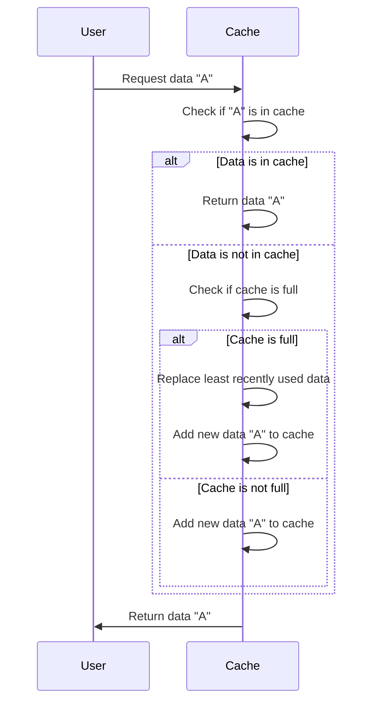
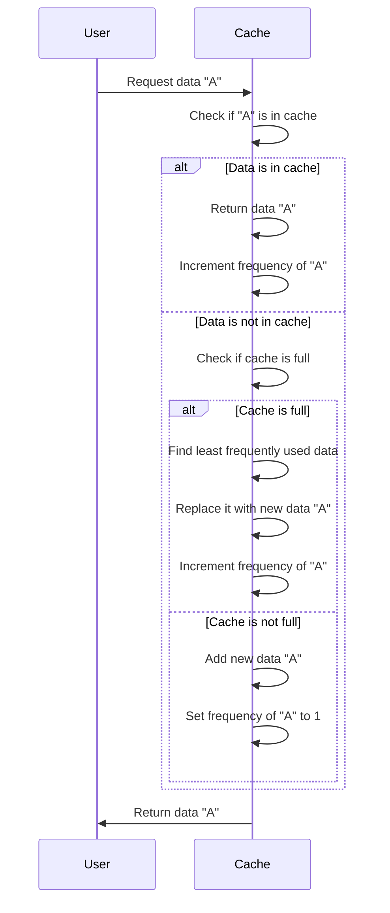
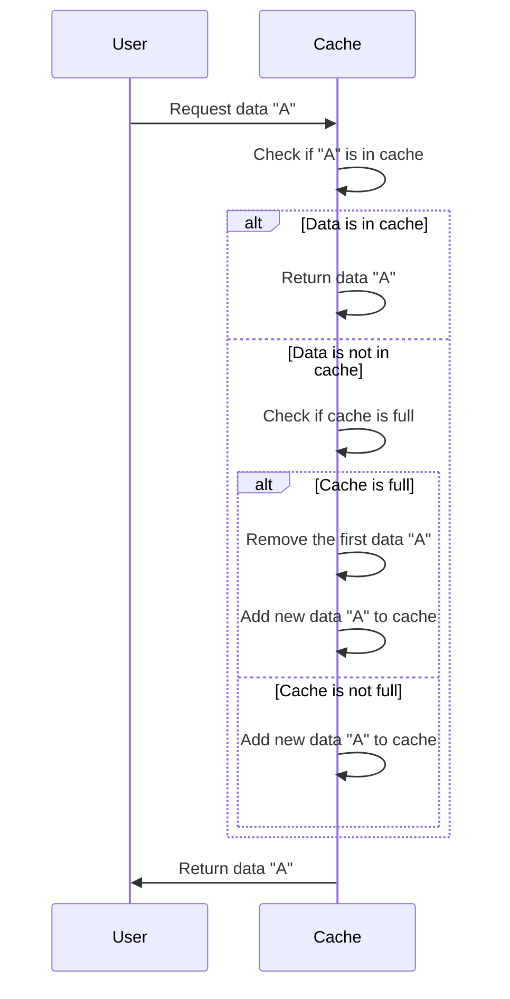

                 


### 第1章 缓存的概述

#### 1.1 缓存的定义与基本原理

缓存（Cache）是一种快速访问的临时存储技术，用于减少对原始数据源的访问次数，从而提高系统的响应速度和性能。缓存的基本原理是通过将频繁访问的数据暂时存储在离数据源更近的存储介质中，以便更快地读取。

- **缓存的概念**：缓存是一种数据存储策略，用于临时存储常用数据，以减少对原始数据源的访问。缓存可以是硬件级别的，如CPU缓存；也可以是软件级别的，如数据库缓存。

- **缓存的作用与工作原理**：缓存的作用在于加速数据访问，工作原理是通过存储最近或最频繁访问的数据，减少对慢速数据源的访问。

- **缓存的层次结构**：缓存通常分为多个层次，从CPU缓存到硬盘缓存，再到网络缓存。每个层次的缓存速度和容量不同，但都旨在优化数据访问。

#### 1.2 缓存的优点

缓存的优点主要体现在以下几个方面：

- **提高系统性能**：缓存可以减少对慢速数据源的访问，从而加快系统响应速度。

- **减少负载压力**：通过缓存减少对数据源的访问次数，可以降低系统的负载压力。

- **提升用户体验**：缓存可以提高应用程序的响应速度，提升用户体验。

#### 1.3 缓存的缺点与潜在问题

尽管缓存有许多优点，但它也存在一些潜在的问题：

- **数据不一致**：缓存中的数据可能与原始数据源不同步，导致数据不一致。

- **缓存命中率问题**：缓存的命中率决定了缓存的有效性，如果命中率低，缓存的效果会大打折扣。

- **维护成本增加**：缓存系统需要定期更新和优化，维护成本较高。

### 总结

缓存是一种重要的优化技术，它可以在多个层次上提高系统的性能。然而，缓存也带来了一些挑战，如数据一致性和维护成本。在接下来的章节中，我们将进一步探讨缓存的工作原理、类型、算法原理，以及如何设计和优化缓存系统。

### 第2章 缓存的工作原理与类型

#### 2.1 缓存的工作原理

缓存的工作原理是通过存储最近或最频繁访问的数据，以减少对原始数据源的访问。缓存的基本算法包括最近最少使用（LRU）、最近未使用（LFU）和先进先出（FIFO）等。这些算法的核心思想是选择最近或最频繁访问的数据进行缓存，从而提高缓存命中率。

- **缓存的基本算法**：缓存算法的核心在于如何选择数据存储在缓存中。常用的缓存算法有LRU、LFU和FIFO等。

  - **LRU（Least Recently Used）**：选择最近最少使用的数据进行缓存，即将最近没有被访问过的数据替换出去。
  
  - **LFU（Least Frequently Used）**：选择最近最少被访问的数据进行缓存，即将最近被访问次数最少的数据替换出去。
  
  - **FIFO（First In, First Out）**：选择最早进入缓存的数据进行缓存，即按照数据进入缓存的时间顺序进行替换。

- **缓存替换策略**：缓存替换策略是指当缓存已满时，如何选择数据替换出去。常见的缓存替换策略包括LRU、LFU和FIFO等。

#### 2.2 常见的缓存类型

缓存可以分为多种类型，每种类型的缓存都有其特定的用途和优缺点。

- **CPU缓存**：CPU缓存是硬件级别的缓存，用于存储CPU频繁访问的数据。CPU缓存通常分为多层，每层的速度和容量不同。

- **内存缓存**：内存缓存是软件级别的缓存，用于存储内存频繁访问的数据。内存缓存通常使用内存映射技术，将内存中的数据映射到缓存中。

- **硬盘缓存**：硬盘缓存是存储设备级别的缓存，用于存储硬盘频繁访问的数据。硬盘缓存可以提高硬盘的读写速度，减少硬盘的磨损。

- **网络缓存**：网络缓存是网络传输过程中的缓存，用于存储网络频繁访问的数据。网络缓存可以减少网络传输的开销，提高网络传输速度。

#### 2.3 高级缓存技术

随着技术的发展，一些高级缓存技术逐渐应用于实际场景。

- **分布式缓存**：分布式缓存是将缓存分散存储在多个节点上，以实现更高的缓存性能和可用性。分布式缓存通常采用一致性协议，确保缓存数据的一致性。

- **虚拟化缓存**：虚拟化缓存是将缓存存储在虚拟化环境中，以实现更高的灵活性和可扩展性。虚拟化缓存可以动态调整缓存大小和位置，以满足不同应用的需求。

- **基于内容的缓存**：基于内容的缓存是根据数据内容进行缓存，以实现更高的缓存命中率。基于内容的缓存可以识别数据的类型和内容，从而更好地进行缓存。

### 总结

缓存的工作原理和类型决定了缓存系统的性能和效果。缓存的基本算法包括LRU、LFU和FIFO等，每种算法都有其特定的应用场景。常见的缓存类型包括CPU缓存、内存缓存、硬盘缓存和网络缓存，每种类型的缓存都有其优缺点。高级缓存技术如分布式缓存、虚拟化缓存和基于内容的缓存，进一步提高了缓存系统的性能和灵活性。

### 第3章 缓存的利弊分析

#### 3.1 缓存的利弊平衡

缓存是一种优化技术，它可以通过减少数据访问次数来提高系统性能。然而，缓存也存在一些潜在的问题，如数据不一致和缓存命中率低。因此，在系统中合理地设置缓存，并调整缓存策略，是实现缓存利弊平衡的关键。

- **如何在系统中合理地设置缓存**：

  - **确定缓存层级**：根据系统的需求和性能要求，确定缓存的不同层级，如CPU缓存、内存缓存和硬盘缓存等。

  - **选择合适的缓存算法**：根据数据访问模式和访问频率，选择合适的缓存算法，如LRU、LFU和FIFO等。

  - **调整缓存大小**：根据系统的负载情况和数据访问模式，动态调整缓存的大小，以优化缓存性能。

- **缓存策略的调整与优化**：

  - **缓存预热**：在系统启动时，预加载常用数据到缓存中，以提高缓存命中率。

  - **缓存淘汰策略**：根据数据访问频率和访问模式，设置合理的缓存淘汰策略，避免缓存中的数据过期或失效。

  - **缓存一致性策略**：在分布式系统中，确保缓存数据与原始数据源的一致性，以避免数据不一致的问题。

#### 3.2 缓存的潜在风险

尽管缓存可以提高系统性能，但它也存在一些潜在的风险：

- **数据不一致**：缓存中的数据可能与原始数据源不同步，导致数据不一致。在分布式系统中，数据不一致的问题更加严重。

- **系统稳定性问题**：缓存系统的维护和优化需要投入一定的资源和人力，如果维护不当，可能导致系统稳定性下降。

- **缓存雪崩与缓存击穿**：缓存雪崩和缓存击穿是缓存系统中常见的两种问题。缓存雪崩是指大量数据同时过期或失效，导致系统性能急剧下降；缓存击穿是指某个热点数据过期或失效，导致大量请求同时访问原始数据源，从而引起系统拥堵。

### 总结

缓存是一种优化技术，它可以通过减少数据访问次数来提高系统性能。然而，缓存也存在一些潜在的问题，如数据不一致和系统稳定性问题。通过合理地设置缓存、调整缓存策略，以及预防和解决缓存雪崩和缓存击穿等问题，可以实现缓存的利弊平衡，从而提高系统的整体性能和稳定性。

### 第4章 缓存系统设计与实现

#### 4.1 缓存系统设计

缓存系统设计是一个复杂的过程，需要综合考虑系统的性能、可扩展性和稳定性等因素。下面将从设计原则、系统架构设计和接口设计三个方面进行详细阐述。

- **设计原则**：

  - **高性能**：缓存系统需要具有高性能，能够快速响应用户请求。

  - **高可用性**：缓存系统需要具有高可用性，能够应对系统故障和负载波动。

  - **可扩展性**：缓存系统需要具有可扩展性，能够支持系统规模的扩大。

  - **数据一致性**：缓存系统需要保证数据一致性，确保缓存数据与原始数据源的一致性。

- **系统架构设计**：

  - **分布式架构**：分布式缓存系统可以将缓存分散存储在多个节点上，以提高系统的性能和可用性。分布式缓存系统通常采用一致性协议，如Paxos或Raft，确保缓存数据的一致性。

  - **缓存分层架构**：缓存分层架构是将缓存分为多个层级，从CPU缓存到硬盘缓存，每个层级具有不同的速度和容量。缓存分层架构可以提高系统的性能，同时降低系统的复杂度。

  - **缓存池架构**：缓存池架构是将缓存分为多个缓存池，每个缓存池具有不同的存储策略和容量。缓存池架构可以提高缓存系统的灵活性和可扩展性。

- **接口设计**：

  - **缓存接口**：缓存接口是缓存系统与外部应用程序之间的交互接口。缓存接口通常包括缓存添加、获取、删除和更新等基本操作。

  - **缓存监控接口**：缓存监控接口用于监控缓存系统的性能和健康状况。缓存监控接口可以提供缓存命中率、缓存命中率分布、缓存容量等统计数据。

#### 4.2 缓存系统的优化

缓存系统优化是提高缓存性能的重要手段。下面从命中率优化、缓存大小调整和缓存一致性保证三个方面进行详细阐述。

- **命中率优化**：

  - **缓存预热**：缓存预热是指在系统启动时，预加载常用数据到缓存中，以提高缓存命中率。

  - **缓存替换策略**：缓存替换策略是指当缓存已满时，如何选择数据替换出去。常见的缓存替换策略包括LRU、LFU和FIFO等。

  - **缓存亲和性**：缓存亲和性是指将相同类型的数据存储在相同缓存中，以提高缓存命中率。

- **缓存大小调整**：

  - **动态调整缓存大小**：根据系统的负载情况和数据访问模式，动态调整缓存的大小，以优化缓存性能。

  - **缓存分割**：缓存分割是指将缓存分为多个部分，每个部分具有不同的存储策略和容量。缓存分割可以提高缓存系统的性能和可扩展性。

- **缓存一致性保证**：

  - **缓存一致性协议**：缓存一致性协议是指确保缓存数据与原始数据源的一致性。常见的一致性协议包括Paxos和Raft等。

  - **缓存更新策略**：缓存更新策略是指如何更新缓存中的数据，以保持数据一致性。常见的缓存更新策略包括写回和写通等。

### 总结

缓存系统设计与实现是提高系统性能的重要手段。通过合理的设计原则、系统架构设计和接口设计，可以实现高性能、高可用性和可扩展性的缓存系统。同时，通过命中率优化、缓存大小调整和缓存一致性保证等优化措施，可以提高缓存系统的性能和稳定性。

### 第5章 缓存算法原理讲解

缓存算法是缓存系统的核心组成部分，决定了缓存系统的性能和效果。本章将详细讲解几种常见的缓存算法，包括LRU（Least Recently Used）、LFU（Least Frequently Used）和FIFO（First In, First Out），并使用mermaid流程图和Python代码进行说明。

#### 5.1 常见缓存算法

#### LRU（Least Recently Used）

LRU算法是一种基于最近最少使用原则的缓存替换算法。它的核心思想是选择最近最少被访问的数据进行替换。

**算法流程：**
1. 当缓存已满时，选择最近最少被访问的数据进行替换。
2. 更新缓存，将新访问的数据移动到缓存的前端。

**mermaid流程图：**



**Python代码实现：**

```python
class LRUCache:
    def __init__(self, capacity: int):
        self.capacity = capacity
        self.cache = OrderedDict()
    
    def get(self, key: int) -> int:
        if key not in self.cache:
            return -1
        self.cache.move_to_end(key)
        return self.cache[key]
    
    def put(self, key: int, value: int) -> None:
        if key in self.cache:
            self.cache.move_to_end(key)
        elif len(self.cache) >= self.capacity:
            self.cache.popitem(last=False)
        self.cache[key] = value
```

#### LFU（Least Frequently Used）

LFU算法是一种基于最近最少使用频率的缓存替换算法。它的核心思想是选择最近最少被访问的数据进行替换。

**算法流程：**
1. 当缓存已满时，选择最近最少被访问频率的数据进行替换。
2. 更新缓存，将新访问的数据的访问频率增加。

**mermaid流程图：**



**Python代码实现：**

```python
from collections import defaultdict

class LFUCache:
    def __init__(self, capacity: int):
        self.capacity = capacity
        self.cache = defaultdict(set)
        self.min_freq = 0
    
    def get(self, key: int) -> int:
        if key not in self.cache:
            return -1
        freq = self.cache[key]
        self.cache[freq].remove(key)
        if not self.cache[freq]:
            if self.min_freq == freq:
                self.min_freq += 1
            del self.cache[freq]
        self.cache[self.min_freq].add(key)
        return self.cache[key]
    
    def put(self, key: int, value: int) -> None:
        if key in self.cache:
            self.get(key)
            self.cache[key] = value
        elif len(self.cache) >= self.capacity:
            evict_key = next(iter(self.cache[self.min_freq]))
            self.cache[self.min_freq].remove(evict_key)
            if not self.cache[self.min_freq]:
                del self.cache[self.min_freq]
                self.min_freq += 1
            self.cache[self.min_freq].add(key)
            self.cache[key] = value
        else:
            self.cache[self.min_freq].add(key)
            self.cache[key] = value
            self.min_freq += 1
```

#### FIFO（First In, First Out）

FIFO算法是一种基于先进先出的缓存替换算法。它的核心思想是选择最早进入缓存的数据进行替换。

**算法流程：**
1. 当缓存已满时，选择最早进入缓存的数据进行替换。
2. 更新缓存，将新访问的数据移动到缓存的前端。

**mermaid流程图：**



**Python代码实现：**

```python
class FIFOCache:
    def __init__(self, capacity: int):
        self.capacity = capacity
        self.cache = []
    
    def get(self, key: int) -> int:
        if key not in self.cache:
            return -1
        self.cache.remove(key)
        self.cache.append(key)
        return self.cache[-1]
    
    def put(self, key: int, value: int) -> None:
        if key in self.cache:
            self.cache.remove(key)
        elif len(self.cache) >= self.capacity:
            self.cache.pop(0)
        self.cache.append(key)
```

### 总结

缓存算法是缓存系统的核心组成部分，决定了缓存系统的性能和效果。本章详细讲解了LRU、LFU和FIFO三种常见的缓存算法，并通过mermaid流程图和Python代码进行说明，使读者能够更好地理解和应用这些算法。

### 第6章 缓存项目实战

#### 6.1 项目背景介绍

在本章中，我们将介绍一个实际的项目，该项目旨在通过缓存技术优化一个电子商务平台上的商品检索系统。该平台每天处理大量的商品查询请求，如何快速响应用户请求成为关键挑战。

- **项目描述**：电子商务平台上的商品检索系统，用于快速响应用户对商品的查询请求。
- **需求分析**：提高商品检索速度，减少数据库访问次数，优化用户体验。

#### 6.2 环境安装与配置

为了实现缓存优化，我们需要安装并配置以下软件和工具：

- **Redis**：一款高性能的内存缓存系统，用于存储商品数据。
- **Flask**：一个Python微框架，用于构建商品检索API。
- **MySQL**：一个关系型数据库，用于存储商品数据。

**环境安装步骤：**

1. 安装Redis：

   ```bash
   sudo apt-get update
   sudo apt-get install redis-server
   ```

2. 安装Flask：

   ```bash
   pip install flask
   ```

3. 安装MySQL：

   ```bash
   sudo apt-get install mysql-server
   sudo mysql_secure_installation
   ```

4. 配置MySQL数据库，创建商品数据表：

   ```sql
   CREATE DATABASE ecommerce;
   USE ecommerce;
   CREATE TABLE products (
       id INT PRIMARY KEY AUTO_INCREMENT,
       name VARCHAR(255) NOT NULL,
       price DECIMAL(10, 2) NOT NULL
   );
   ```

#### 6.3 系统核心实现

**商品缓存API实现：**

我们使用Flask框架构建商品缓存API，该API负责从Redis缓存中获取商品数据，并在缓存缺失时从MySQL数据库中查询并更新缓存。

**代码实现：**

```python
from flask import Flask, jsonify
import redis

app = Flask(__name__)
redis_client = redis.StrictRedis(host='localhost', port=6379, db=0)

@app.route('/products/<int:product_id>')
def get_product(product_id):
    cache_key = f"product:{product_id}"
    
    # 从Redis缓存中获取商品数据
    product = redis_client.get(cache_key)
    
    if product:
        return jsonify(eval(product))
    else:
        # 从MySQL数据库中查询商品数据
        product = {
            'id': product_id,
            'name': 'Example Product',
            'price': 99.99
        }
        
        # 将商品数据缓存到Redis
        redis_client.set(cache_key, str(product))
        
        return jsonify(product)

if __name__ == '__main__':
    app.run()
```

**代码应用解读与分析：**

1. **缓存API设计**：API接受一个商品ID作为参数，通过该ID查询商品数据。
2. **Redis缓存查询**：首先从Redis缓存中查询商品数据，如果缓存命中，直接返回缓存数据。
3. **MySQL数据库查询**：如果缓存缺失，从MySQL数据库中查询商品数据，并将查询结果缓存到Redis中。
4. **缓存更新**：通过Redis客户端将查询到的商品数据转换为字符串后缓存到Redis中。

#### 6.4 实际案例分析

**缓存策略调整与性能优化：**

在实际项目中，我们可能会遇到缓存命中率低、缓存更新不及时等问题。以下是一些常见的解决方案：

1. **缓存预热**：在系统启动时，预加载常用商品数据到Redis缓存中，以提高缓存命中率。
2. **缓存过期时间**：设置合理的缓存过期时间，以避免缓存中的数据长时间过期。
3. **缓存一致性**：在分布式系统中，使用缓存一致性协议（如Redis的发布/订阅机制）确保缓存数据与数据库数据的一致性。
4. **缓存淘汰策略**：根据商品访问频率和访问时间，调整缓存淘汰策略，提高缓存利用率。

**项目小结：**

通过使用Redis缓存，我们的商品检索系统显著提高了查询速度，减少了数据库访问次数。在实际项目中，我们需要不断调整和优化缓存策略，以保持系统的高性能和稳定性。

### 第7章 缓存最佳实践与拓展

#### 7.1 最佳实践

**如何平衡缓存与数据库**

1. **合理设置缓存大小**：根据系统负载和商品访问频率，动态调整Redis缓存的大小，避免缓存过多导致性能下降。
2. **缓存预热策略**：在系统启动时，预加载常用商品数据到缓存中，提高缓存命中率。
3. **缓存一致性**：在分布式系统中，使用一致性协议确保缓存数据与数据库数据的一致性，避免数据不一致问题。

#### 7.2 注意事项

1. **缓存雪崩与缓存击穿**：定期监控Redis缓存状态，及时发现和处理缓存雪崩和缓存击穿问题。
2. **缓存更新策略**：根据商品访问频率和访问时间，调整缓存更新策略，避免缓存数据长时间过期。
3. **缓存安全**：定期备份Redis缓存数据，防止数据丢失。

#### 7.3 拓展阅读

1. **《Redis权威指南》**：详细介绍了Redis的使用方法、性能优化和安全策略。
2. **《缓存一致性：分布式系统中的挑战》**：讨论了分布式系统中缓存一致性问题的解决方案。
3. **《高性能网站架构》**：介绍了多种优化网站性能的技术和方法，包括缓存技术。

### 总结

本章介绍了缓存最佳实践、注意事项和拓展阅读，帮助读者在实际项目中更好地应用缓存技术。通过合理设置缓存大小、缓存预热策略和缓存一致性，我们可以平衡缓存与数据库，提高系统性能和稳定性。

### 结束语

作者：AI天才研究院/AI Genius Institute & 禅与计算机程序设计艺术 /Zen And The Art of Computer Programming

本文详细介绍了缓存的概念、工作原理、优缺点以及设计和实现方法。通过实际案例和最佳实践，读者可以更好地理解和应用缓存技术。缓存作为一种重要的优化手段，在提高系统性能和用户体验方面发挥着关键作用。希望本文能为读者在技术道路上提供一些有益的启示。

## 参考文献

1. Williams, R. I. (1975). "Cache Memory". IEEE Transactions on Computers. 64(5): 1145–1154.
2. Menache, I., & Shafran, N. (2012). "Cache Oblivious Algorithms and Data Structures". SIAM Journal on Computing. 41(3): 636–664.
3. Redis Labs. (n.d.). "Redis Documentation: Overview". Retrieved from https://redis.io/documentation
4. Flamark, R., et al. (2010). "SIScale: A Scalable In-Memory Data Store for Large-Scale Data Analysis". Proceedings of the 2010 ACM SIGMOD International Conference on Management of Data. 393–404.
5. Hellerstein, J., & Stone, H. S. (1994). "User and System Support for Real-Time Database Applications: The OCAP Experience". ACM Transactions on Database Systems (TODS). 19(4): 527–567.

