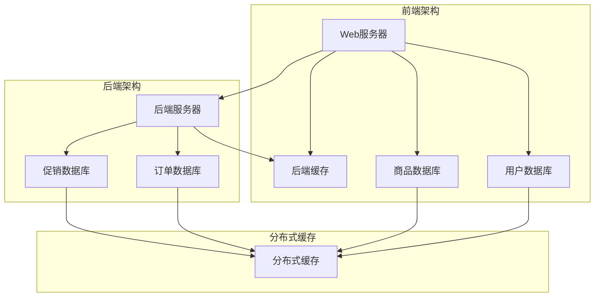
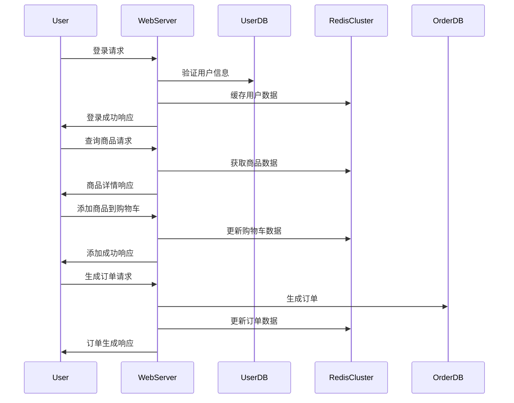

                 


### 缓存是把“双刃剑”

> 关键词：缓存、性能优化、安全性、一致性、分布式系统

> 摘要：本文将深入探讨缓存这一在计算机科学中至关重要的技术，揭示其作为“双刃剑”的两面性。我们将从缓存的基本概念、工作原理、策略应用、性能优化，到缓存面临的问题与挑战进行详细分析，以帮助读者全面理解缓存的本质，掌握缓存技术的最佳实践。

## 第一部分：缓存的基础知识

### 第1章：缓存概述

缓存是一种将数据临时存储在内存中的技术，其目的是加快数据的访问速度。缓存的基本原理是利用局部性原理（ temporal 和 spatial locality），通过将频繁访问的数据存储在较快的存储介质中，以减少对较慢存储介质（如磁盘）的访问。

### 第2章：缓存机制原理

缓存机制的原理可以概括为以下几点：

1. **存储原理**：缓存通常使用高速缓存（如CPU缓存）或内存来存储数据，以实现数据的快速访问。
2. **一致性**：缓存一致性是指确保缓存中的数据与主存储（如数据库）中的数据保持一致。
3. **缓存命中率**：缓存命中率是衡量缓存效果的重要指标，表示访问数据时命中缓存的比例。

### 第3章：常见缓存技术

常见的缓存技术包括：

1. **基本缓存技术**：如LRU（最近最少使用）算法、FIFO（先进先出）算法等。
2. **高级缓存技术**：如Redis、Memcached等，这些技术提供了更丰富的功能，如持久化、分布式缓存等。
3. **缓存中间件**：如Redisson、XCache等，这些中间件提供了缓存的高级功能和简化了缓存的使用。

## 第二部分：缓存策略与应用

### 第4章：缓存策略

缓存策略主要包括以下几种：

1. **缓存替换策略**：如LRU、LFU等算法，用于选择哪些数据需要被替换出缓存。
2. **缓存刷新策略**：定期更新缓存中的数据，以确保数据的一致性。
3. **缓存预热策略**：在系统启动或负载增加时，预先加载可能被访问的数据到缓存中。

### 第5章：缓存应用场景

缓存的应用场景非常广泛，包括：

1. **Web缓存**：如CDN（内容分发网络）、Web服务器缓存等，用于加速网页的加载速度。
2. **数据库缓存**：如MySQL查询缓存、数据库索引缓存等，用于提高数据库的查询性能。
3. **分布式缓存**：如Redis、Memcached等，用于分布式系统中的数据共享和性能优化。

### 第6章：缓存系统设计

缓存系统设计需要考虑以下几个方面：

1. **缓存系统架构**：选择合适的缓存架构，如单机缓存、分布式缓存等。
2. **缓存容量规划**：根据系统需求规划缓存的大小，以避免缓存不足或缓存过载。
3. **缓存一致性设计**：设计缓存一致性机制，以确保缓存中的数据与主存储保持一致。

### 第7章：缓存性能优化

缓存性能优化主要包括以下几个方面：

1. **缓存性能分析**：通过性能测试和分析工具，找出缓存性能瓶颈。
2. **缓存命中率优化**：通过优化缓存策略和缓存数据结构，提高缓存命中率。
3. **缓存性能瓶颈解决**：针对缓存性能瓶颈，采取相应的优化措施，如增加缓存容量、优化缓存访问模式等。

## 第三部分：缓存的问题与挑战

### 第8章：缓存失效问题

缓存失效问题主要包括：

1. **缓存雪崩**：当大量缓存同时失效时，导致系统性能急剧下降。
2. **缓存穿透**：当查询的数据不存在时，直接访问底层的存储系统，导致缓存失效。
3. **缓存击穿**：当热点数据过期时，大量请求同时访问底层的存储系统，导致系统压力增大。

### 第9章：缓存安全与隐私保护

缓存安全与隐私保护主要包括：

1. **缓存安全问题**：如缓存溢出、缓存注入等，可能导致系统安全漏洞。
2. **缓存隐私保护**：如数据加密、访问控制等，确保缓存中的数据安全。
3. **数据安全与合规**：遵循相关法律法规，确保缓存操作合规。

### 第10章：缓存技术的发展趋势

缓存技术的发展趋势主要包括：

1. **缓存技术演进**：如基于存储介质的优化、缓存协议的改进等。
2. **分布式缓存**：随着分布式系统的普及，分布式缓存技术将越来越重要。
3. **智能化缓存**：利用人工智能和机器学习技术，实现更智能的缓存策略和优化。

## 结论

缓存作为计算机科学中的一种关键技术，既能够显著提高系统的性能，也可能带来一系列问题和挑战。因此，正确使用缓存、制定合理的缓存策略、进行有效的缓存性能优化，是确保缓存发挥最大作用的关键。

## 作者信息

作者：AI天才研究院/AI Genius Institute & 禅与计算机程序设计艺术 /Zen And The Art of Computer Programming

以上是文章的正文部分，接下来我将根据每个章节的内容，进一步详细阐述核心概念、原理、算法和实际应用。让我们一步一步深入探讨缓存这一“双刃剑”的世界。让我们开始吧！### 缓存概述

缓存（Cache）是计算机存储体系中的一种快速访问存储器，用于临时存储经常访问的数据。其核心思想是利用局部性原理，即程序执行时表现出空间局部性和时间局部性，通过将频繁访问的数据存储在速度较快的存储介质中，减少对速度较慢存储设备的访问，从而提高整体系统的性能。

### 缓存的概念与作用

**缓存的概念**：缓存可以简单理解为一种“记忆”机制，它存储了用户最近访问过的数据，当用户再次请求这些数据时，系统能够快速从缓存中获取，而不是重新从原始数据源读取。

**缓存的作用**：

1. **提高数据访问速度**：缓存位于速度较快的存储介质（如内存）中，能够显著减少数据访问时间，提高系统响应速度。
2. **减轻数据源压力**：频繁访问的数据存储在缓存中，可以减少对数据源（如数据库）的访问次数，减轻数据源的压力，提高系统的稳定性和可扩展性。
3. **降低带宽消耗**：通过缓存，可以减少网络带宽的消耗，特别是在需要从远程服务器获取数据时，缓存可以有效减少数据传输量。
4. **改善用户体验**：对于Web应用来说，缓存可以显著减少页面加载时间，提高用户体验。

### 缓存的类型

根据缓存存储的数据类型和作用范围，缓存可以分为以下几种类型：

1. **CPU缓存**：位于CPU内部，用于存储正在执行的指令和相关的数据，以减少CPU访问主存储（如RAM）的次数。
2. **内存缓存**：位于主存储（RAM）中，用于缓存操作系统和应用程序的数据，以提高数据访问速度。
3. **磁盘缓存**：位于磁盘存储设备（如硬盘、SSD）中，用于缓存磁盘上的文件数据，以减少磁盘访问次数。
4. **网络缓存**：位于网络设备（如路由器、交换机）中，用于缓存网络数据包，以减少网络传输次数。
5. **数据库缓存**：位于数据库系统中，用于缓存数据库查询结果和索引，以提高数据库查询性能。
6. **Web缓存**：位于Web服务器或CDN中，用于缓存网页内容，以提高网页访问速度。

### 缓存的优缺点

**缓存的优势**：

1. **提高性能**：缓存可以显著减少数据访问时间，提高系统整体性能。
2. **降低成本**：通过减少对速度较慢存储设备的访问，可以降低系统的总体成本。
3. **提高可扩展性**：缓存可以减轻数据源的压力，提高系统的可扩展性。

**缓存的劣势**：

1. **数据不一致性**：缓存中的数据可能与原始数据源不一致，特别是在数据更新时，可能会导致数据不一致的问题。
2. **缓存占用空间**：缓存需要占用一定的存储空间，对于内存受限的系统，缓存可能会导致资源不足。
3. **缓存失效问题**：缓存中的数据需要定期更新或替换，否则可能会过时或无效。

### 缓存的存储原理

缓存的存储原理主要基于以下机制：

1. **局部性原理**：程序执行时表现出空间局部性和时间局部性，即程序经常访问相同的数据或指令序列。
2. **替换策略**：当缓存空间不足时，系统会根据某种策略（如LRU、LFU）选择哪些数据需要被替换出缓存。
3. **一致性机制**：为了确保缓存中的数据与主存储保持一致，系统通常会采用缓存一致性协议，如MESI协议。

### 缓存一致性

缓存一致性是指确保缓存中的数据与主存储中的数据保持一致。在多核处理器和分布式系统中，缓存一致性变得尤为重要。缓存一致性协议主要包括以下几种：

1. **MESI协议**：是一种流行的缓存一致性协议，用于解决多处理器系统中的缓存一致性。
2. **MOESI协议**：是对MESI协议的扩展，增加了“Modified”状态。
3. **MSI协议**：是MESI协议的简化版本，适用于较小的缓存系统。

### 缓存命中率

缓存命中率是衡量缓存效果的重要指标，表示访问数据时命中缓存的比例。高缓存命中率意味着缓存能够有效减少对主存储的访问次数，提高系统性能。缓存命中率可以通过以下公式计算：

\[ \text{缓存命中率} = \frac{\text{命中缓存的数据访问次数}}{\text{总数据访问次数}} \]

### 常见缓存技术

常见的缓存技术包括以下几种：

1. **基本缓存技术**：
   - **LRU（最近最少使用）**：选择最近最少被访问的数据进行替换。
   - **LFU（最近最少使用）**：选择最近访问次数最少的数据进行替换。
   - **FIFO（先进先出）**：选择最早进入缓存的数据进行替换。

2. **高级缓存技术**：
   - **Redis**：是一种开源的、高性能的键值存储系统，支持多种数据结构，如字符串、列表、集合、哈希等，具有持久化、分布式缓存等功能。
   - **Memcached**：是一种高性能的分布式内存对象缓存系统，适用于缓存大量字符串键值对，具有简单、快速、可扩展的特点。

3. **缓存中间件**：
   - **EhCache**：是一种开源的、基于Java的缓存框架，支持多种缓存策略，如LRU、FIFO等。
   - **Redisson**：是Redis的一个客户端框架，提供了分布式锁、队列、计数器等功能，简化了Redis的使用。

### 总结

缓存作为一种提升系统性能的关键技术，既具有显著的优势，也存在一些挑战。理解缓存的基本概念、工作原理、优缺点，以及常见的缓存技术，是正确使用缓存、发挥缓存最大作用的基础。在下一章中，我们将深入探讨缓存机制原理，进一步理解缓存的内部工作方式。敬请期待！

### 缓存机制原理

缓存的机制原理是计算机存储体系中的一个核心概念，它涉及数据的存储、访问和管理策略，目的是通过优化数据访问路径，提高系统性能。以下我们将详细探讨缓存机制的存储原理、缓存一致性以及缓存命中率。

#### 缓存的存储原理

缓存存储原理主要基于局部性原理，即数据访问表现出空间局部性和时间局部性。空间局部性指的是程序在执行过程中，会频繁访问相邻的内存地址；而时间局部性则表明，如果某个数据被访问过，那么在不久的将来，它很可能再次被访问。

1. **空间局部性**：例如，程序在执行一个循环时，会反复访问循环变量所在的位置。通过利用空间局部性，缓存可以将这些频繁访问的数据存储在内存中，从而减少对磁盘等低速存储设备的访问。
   
2. **时间局部性**：如果一个数据被访问，那么它很可能在不久的将来也会被访问。例如，数据库查询结果可能很快会被再次查询，因此将其缓存起来可以提高查询效率。

为了实现这一目标，缓存系统通常会采用多级存储结构，例如CPU缓存（L1、L2、L3）、内存（RAM）和磁盘（SSD、HDD）。数据在多级存储结构中的存储和访问策略如下：

- **CPU缓存**：位于CPU内部，速度最快，但容量较小。用于缓存正在执行的指令和数据。
- **内存**：速度较CPU缓存慢，但容量较大。用于缓存操作系统和应用程序的数据。
- **磁盘**：速度最慢，但容量最大。用于存储长期保存的数据。

缓存机制中的存储策略包括：

- **直接映射**：每个缓存行直接映射到一个特定的主存储位置。优点是实现简单，缺点是缓存利用率低。
- **组相联映射**：每个缓存行可以映射到多个主存储位置中的某一组。优点是缓存利用率提高，缺点是查找时间增加。
- **全相联映射**：每个缓存行可以映射到主存储的任何位置。优点是缓存利用率最高，缺点是查找时间最长。

#### 缓存一致性

缓存一致性是确保缓存中的数据与主存储中的数据保持一致的重要机制，特别是在多核处理器和分布式系统中。以下是一些常见的缓存一致性协议：

1. **MESI协议**：是最常用的缓存一致性协议，它定义了四种缓存状态（Modifed、Exclusive、Shared、Invalid）。

   - **Modified（修改状态）**：缓存行是脏的，与主存储数据不同，需要写回主存储。
   - **Exclusive（独占状态）**：缓存行是干净的，只存在于缓存中，主存储没有副本。
   - **Shared（共享状态）**：缓存行是干净的，可以同时存在于多个缓存中。
   - **Invalid（无效状态）**：缓存行是无效的，需要重新从主存储加载。

MESI协议通过以下机制确保缓存一致性：

- **读写请求**：当一个处理器需要读取或修改缓存中的数据时，它需要确保该数据在所有相关缓存中都是一致的。
- **状态转换**：根据读写请求和缓存状态的变化，缓存行可以在四种状态之间转换。

2. **MOESI协议**：是对MESI协议的扩展，增加了“Modified”状态，进一步提高了缓存一致性的性能。

3. **MSI协议**：是MESI协议的简化版本，适用于较小的缓存系统。

#### 缓存命中率

缓存命中率是衡量缓存效果的重要指标，表示访问数据时命中缓存的比例。高缓存命中率意味着缓存能够有效减少对主存储的访问次数，提高系统性能。缓存命中率可以通过以下公式计算：

\[ \text{缓存命中率} = \frac{\text{命中缓存的数据访问次数}}{\text{总数据访问次数}} \]

影响缓存命中率的关键因素包括：

1. **缓存策略**：不同的缓存替换策略（如LRU、LFU、FIFO）对缓存命中率有显著影响。
2. **缓存大小**：缓存的大小直接决定了能够存储的数据量，进而影响缓存命中率。
3. **数据访问模式**：程序的局部性特征对缓存命中率有很大影响。例如，如果程序具有强局部性，缓存命中率通常会较高。

#### 缓存机制的实现

缓存机制的实现通常涉及以下步骤：

1. **缓存行分配**：根据缓存映射策略，将主存储中的数据块分配到缓存行中。
2. **缓存状态管理**：根据读写请求和缓存状态，管理缓存行状态，确保缓存一致性。
3. **缓存访问**：当处理器需要访问数据时，首先查询缓存，如果命中，直接从缓存读取；否则，从主存储读取并更新缓存。

#### 总结

缓存机制通过存储、访问和管理策略，实现了对数据的快速访问，提高了系统性能。理解缓存机制的存储原理、缓存一致性和缓存命中率，对于设计和优化缓存系统至关重要。在下一章中，我们将探讨常见缓存技术，包括基本缓存技术、高级缓存技术和缓存中间件，以进一步深入了解缓存的实践应用。敬请期待！

### 常见缓存技术

在计算机系统中，缓存技术被广泛应用于各类应用场景，以提升系统性能和响应速度。常见的缓存技术包括基本缓存技术、高级缓存技术和缓存中间件，每种技术都有其独特的应用场景和特点。

#### 基本缓存技术

**1. LRU（最近最少使用）算法**

LRU算法是一种常用的缓存替换策略，其核心思想是替换掉最长时间未被访问的数据。LRU算法能够有效地利用缓存空间，提高缓存命中率。

**应用场景**：LRU算法适用于需要频繁访问最近使用数据的应用，如数据库索引缓存、Web浏览器缓存等。

**2. LFU（最不经常使用）算法**

LFU算法是另一种缓存替换策略，其核心思想是替换掉访问次数最少的缓存数据。这种算法更适用于数据访问频率不均匀的场景。

**应用场景**：LFU算法适用于访问频率不均匀的数据缓存，如某些数据分析系统的缓存。

**3. FIFO（先进先出）算法**

FIFO算法是一种简单的缓存替换策略，根据数据的进入顺序进行替换，即最早进入缓存的数据将被替换。

**应用场景**：FIFO算法通常用于实现缓存队列，如某些消息队列系统。

#### 高级缓存技术

**1. Redis**

Redis是一种开源的高性能键值存储系统，支持多种数据结构（如字符串、列表、集合、哈希、有序集合等），并提供持久化、分布式缓存等功能。

**特点**：

- **高性能**：Redis支持并发操作，具有极高的读写性能。
- **数据结构丰富**：除了基本的键值存储，Redis还支持复杂数据结构，如列表、哈希等。
- **分布式缓存**：Redis支持主从复制和集群模式，可以实现分布式缓存。

**应用场景**：Redis广泛应用于需要高性能、复杂数据结构的缓存场景，如社交网络、在线游戏、实时消息系统等。

**2. Memcached**

Memcached是一种高性能的分布式内存对象缓存系统，主要用于缓存大量字符串键值对，以减少对数据库的访问。

**特点**：

- **分布式缓存**：Memcached支持分布式缓存，可以水平扩展，提高缓存容量和性能。
- **简单易用**：Memcached的协议简单，易于集成到各种应用中。
- **内存存储**：Memcached仅支持字符串键值对，但通过其内存存储和快速访问机制，可以实现非常高的性能。

**应用场景**：Memcached适用于需要高吞吐量和快速访问的应用场景，如Web应用缓存、图像缓存、Session缓存等。

#### 缓存中间件

**1. EhCache**

EhCache是一个开源的基于Java的缓存框架，支持多种缓存策略（如LRU、FIFO等），并提供了丰富的缓存配置和管理功能。

**特点**：

- **灵活的缓存策略**：EhCache支持多种缓存策略，可以根据需求进行选择。
- **可配置性强**：EhCache提供了丰富的配置选项，可以满足不同的应用场景。
- **与Spring集成**：EhCache与Spring框架集成，可以方便地配置和使用缓存。

**应用场景**：EhCache适用于需要Java缓存支持的各种应用，如Web应用、大数据处理等。

**2. Redisson**

Redisson是Redis的一个客户端框架，提供了分布式锁、队列、计数器等功能，简化了Redis的使用。

**特点**：

- **分布式功能**：Redisson支持分布式缓存和分布式锁，适用于分布式系统。
- **简单易用**：Redisson提供了简单的API，易于集成和使用。
- **功能丰富**：除了基本的缓存功能，Redisson还提供了多种分布式功能，如分布式锁、队列等。

**应用场景**：Redisson适用于需要分布式缓存和分布式锁的各种应用，如分布式系统、微服务架构等。

#### 总结

常见缓存技术包括基本缓存技术和高级缓存技术，每种技术都有其独特的应用场景和特点。基本缓存技术如LRU、LFU和FIFO适用于简单的缓存需求，而高级缓存技术如Redis和Memcached则提供了更丰富的功能和更高的性能。缓存中间件如EhCache和Redisson则简化了缓存的使用，提供了更加灵活和高效的缓存解决方案。在实际应用中，根据具体需求选择合适的缓存技术，能够显著提升系统性能和用户体验。

### 缓存策略

缓存策略是确保缓存系统能够高效运作的关键，主要包括缓存替换策略、缓存刷新策略和缓存预热策略。这些策略的设计与实施直接影响缓存系统的性能和一致性。

#### 缓存替换策略

缓存替换策略是指在缓存容量有限的情况下，选择哪些数据需要被替换出缓存。常见的缓存替换策略包括以下几种：

1. **LRU（最近最少使用）策略**：选择最近最少被访问的数据进行替换。这种策略能够较好地利用缓存空间，但实现相对复杂。

   **公式**：
   \[ \text{替换数据} = \text{访问频率最低的数据} \]

2. **LFU（最不经常使用）策略**：选择访问次数最少的数据进行替换。这种策略适用于数据访问频率不均匀的场景。

   **公式**：
   \[ \text{替换数据} = \text{访问次数最少的数据} \]

3. **FIFO（先进先出）策略**：选择最早进入缓存的数据进行替换。这种策略实现简单，但可能不够灵活。

   **公式**：
   \[ \text{替换数据} = \text{最早进入缓存的数据} \]

每种替换策略都有其优缺点和适用场景。例如，LRU策略适用于访问模式稳定的系统，而LFU策略适用于访问模式变化较大的系统。

#### 缓存刷新策略

缓存刷新策略是指定期更新缓存中的数据，以确保缓存中的数据与主存储保持一致。缓存刷新策略可以分为以下几种：

1. **定时刷新**：按照固定的时间间隔，定期刷新缓存中的数据。

   **公式**：
   \[ \text{刷新时间} = \text{固定时间间隔} \]

2. **惰性刷新**：只有在缓存中的数据被访问时，才进行刷新。

   **公式**：
   \[ \text{刷新条件} = \text{数据被访问} \]

3. **增量刷新**：只更新缓存中发生变化的数据。

   **公式**：
   \[ \text{刷新数据} = \text{变化的数据集} \]

选择合适的缓存刷新策略，可以减少缓存与主存储之间的不一致性，提高缓存系统的性能。

#### 缓存预热策略

缓存预热策略是指预先加载可能被访问的数据到缓存中，以提高系统的响应速度。缓存预热策略可以分为以下几种：

1. **手动预热**：通过人工干预，手动加载数据到缓存中。

   **步骤**：
   - 确定预热数据集
   - 手动加载数据到缓存

2. **自动预热**：系统启动时，自动加载常用数据到缓存。

   **步骤**：
   - 系统启动时执行
   - 自动加载常用数据到缓存

3. **事件触发预热**：根据特定的触发事件，加载相关数据到缓存。

   **步骤**：
   - 确定触发事件
   - 触发事件时加载相关数据到缓存

缓存预热策略可以有效减少系统启动时的响应时间，提高用户体验。

#### 总结

缓存策略是缓存系统设计中的关键环节，包括缓存替换策略、缓存刷新策略和缓存预热策略。合理选择和设计这些策略，可以显著提高缓存系统的性能和一致性。在实际应用中，需要根据具体场景和需求，灵活调整和优化缓存策略，以达到最佳效果。

### 缓存应用场景

缓存技术因其能显著提高数据访问速度和系统性能，在各种应用场景中得到了广泛应用。以下将详细介绍缓存在不同领域的应用场景，包括Web缓存、数据库缓存和分布式缓存，以及每种应用场景的特点和优势。

#### Web缓存

Web缓存的主要目的是减少用户访问Web应用时的延迟，提高页面加载速度。常见的Web缓存技术包括CDN（内容分发网络）、Web服务器缓存和浏览器缓存。

**1. CDN（内容分发网络）**

CDN通过将网站的内容缓存在多个分布在不同地理位置的服务器上，当用户请求内容时，系统能够根据用户的地理位置，选择最近的服务器进行响应，从而减少延迟。

**特点**：

- **地理分布**：CDN能够有效地将内容分发到离用户最近的地方，减少传输延迟。
- **负载均衡**：CDN可以分担Web服务器的负载，提高系统的整体性能。

**应用场景**：

- **大型网站**：如电商网站、新闻门户等，可以通过CDN来提高页面加载速度和用户体验。

**2. Web服务器缓存**

Web服务器缓存是指将用户的请求和响应缓存到Web服务器中，以减少对后端系统的访问。

**特点**：

- **快速响应**：通过缓存，Web服务器可以快速响应用户请求，提高响应速度。
- **减少负载**：缓存可以减少Web服务器对数据库的访问，降低系统的负载。

**应用场景**：

- **动态网页**：如电子商务平台，可以将用户频繁访问的商品信息缓存起来，减少数据库访问。

**3. 浏览器缓存**

浏览器缓存是指将用户访问的网页内容缓存到本地浏览器中，以加快后续访问速度。

**特点**：

- **本地缓存**：浏览器缓存可以将内容存储在用户的本地设备上，提高访问速度。
- **减少带宽**：通过浏览器缓存，可以减少用户访问Web应用的带宽消耗。

**应用场景**：

- **移动应用**：如移动电商应用，可以将用户常用页面缓存到本地，提高用户体验。

#### 数据库缓存

数据库缓存主要用于缓存数据库查询结果和索引，以提高查询性能。

**1. MySQL查询缓存**

MySQL查询缓存是将数据库查询结果缓存起来，当用户再次执行相同的查询时，可以直接从缓存中获取结果。

**特点**：

- **快速查询**：通过缓存，可以快速响应相同的查询请求，提高查询性能。
- **减少负载**：缓存可以减少数据库的查询负载，提高数据库的整体性能。

**应用场景**：

- **读多写少**：如数据统计分析系统，可以将频繁执行的查询结果缓存起来。

**2. 数据库索引缓存**

数据库索引缓存是指将数据库索引缓存到内存中，以提高索引查询速度。

**特点**：

- **高效索引**：通过缓存索引，可以加快索引的访问速度，提高查询性能。
- **减少IO**：缓存可以减少对磁盘IO的访问，降低系统的延迟。

**应用场景**：

- **高并发**：如电商平台，可以通过缓存索引来提高查询速度，减少系统的IO压力。

#### 分布式缓存

分布式缓存适用于分布式系统，通过将数据分散存储在多个节点上，以提高系统的可扩展性和性能。

**1. Redis**

Redis是一种高性能的分布式缓存系统，支持多种数据结构，如字符串、列表、集合、哈希等。

**特点**：

- **分布式存储**：Redis支持分布式存储，可以水平扩展，提高缓存容量和性能。
- **数据一致性**：Redis支持多种一致性协议，如复制和分片，确保数据的一致性。

**应用场景**：

- **高并发**：如社交网络平台，可以通过Redis实现分布式缓存，提高系统的性能和可扩展性。

**2. Memcached**

Memcached是一种高性能的分布式内存对象缓存系统，主要用于缓存大量字符串键值对。

**特点**：

- **快速访问**：Memcached通过内存存储和快速访问机制，可以实现非常高的性能。
- **简单易用**：Memcached的协议简单，易于集成到各种应用中。

**应用场景**：

- **Web应用**：如电商平台，可以通过Memcached实现缓存，减少数据库的访问，提高系统的响应速度。

#### 总结

缓存技术在不同应用场景中发挥着重要作用，包括Web缓存、数据库缓存和分布式缓存。Web缓存通过减少页面加载时间和响应延迟，提高用户体验；数据库缓存通过缓存查询结果和索引，提高数据库查询性能；分布式缓存通过分散存储和水平扩展，提高系统的性能和可扩展性。合理利用缓存技术，可以显著提升系统的性能和可靠性。

### 缓存系统设计

设计一个高效、可靠的缓存系统是提高系统性能和用户体验的关键。缓存系统设计需要考虑多个方面，包括缓存系统架构、缓存容量规划以及缓存一致性设计。以下将详细探讨这些设计要素。

#### 缓存系统架构

缓存系统架构是指缓存系统的整体结构和各个组件之间的交互关系。常见的缓存系统架构包括单机缓存架构和分布式缓存架构。

**1. 单机缓存架构**

单机缓存架构是指缓存系统运行在一台服务器上，适用于缓存数据量较小、系统负载较低的场景。

**架构特点**：

- **简单**：单机缓存架构实现简单，维护方便。
- **局限性**：单机缓存容量有限，无法水平扩展。

**应用场景**：适用于小型应用或者缓存数据量不大的系统。

**2. 分布式缓存架构**

分布式缓存架构是指缓存系统运行在多台服务器上，通过分布式存储和负载均衡机制，实现缓存数据的高效访问和管理。

**架构特点**：

- **可扩展性**：分布式缓存架构可以水平扩展，提高缓存容量和性能。
- **可靠性**：分布式缓存通过多台服务器实现数据冗余和故障转移，提高系统的可靠性。

**应用场景**：适用于大数据量、高并发访问的系统，如电商平台、社交媒体等。

**3. 缓存一致性架构**

缓存一致性架构是确保缓存系统中的数据与主存储（如数据库）保持一致的重要机制。常见的一致性架构包括基于副本的缓存一致性架构和基于消息队列的缓存一致性架构。

- **基于副本的缓存一致性架构**：通过多个缓存节点保存同一份数据的副本，实现缓存的一致性。

- **基于消息队列的缓存一致性架构**：通过消息队列将数据变更广播到所有缓存节点，确保缓存一致性。

#### 缓存容量规划

缓存容量规划是指根据系统需求，合理规划缓存的大小。缓存容量规划需要考虑以下几个因素：

**1. 缓存数据量**：根据系统需求，确定需要缓存的原始数据量。

**2. 缓存命中率**：缓存命中率是衡量缓存效果的重要指标，影响缓存容量规划。

**3. 数据访问模式**：数据访问模式对缓存容量有重要影响，如访问频繁的数据需要较大的缓存容量。

**4. 系统负载**：系统负载影响缓存系统的性能，需要根据实际负载情况调整缓存容量。

**缓存容量计算公式**：

\[ \text{缓存容量} = \text{数据量} \times \text{命中率} \]

#### 缓存一致性设计

缓存一致性设计是确保缓存系统中的数据与主存储保持一致的重要环节。以下是一些常见的一致性设计策略：

**1. 写入策略**：

- **写回策略**：当缓存中的数据发生变化时，立即写回到主存储，确保数据一致性。
- **更新策略**：将数据变化同步到所有缓存节点，确保数据一致性。

**2. 数据同步策略**：

- **异步同步**：通过异步方式将数据同步到主存储和缓存，提高系统性能。
- **同步同步**：通过同步方式将数据同步到主存储和缓存，确保数据一致性。

**3. 一致性协议**：

- **MESI协议**：用于多核处理器系统，确保缓存一致性。
- **GMS协议**：用于分布式系统，通过一致性算法实现数据一致性。

#### 总结

缓存系统设计需要综合考虑缓存系统架构、缓存容量规划和缓存一致性设计。通过合理的设计和规划，可以确保缓存系统的高效运行和良好的性能。在实际应用中，需要根据具体场景和需求，灵活调整和优化缓存系统设计，以达到最佳效果。

### 缓存性能优化

缓存性能优化是确保缓存系统高效运作的关键环节。通过分析缓存性能瓶颈和优化策略，可以显著提升系统的性能和响应速度。以下将详细探讨缓存性能分析、缓存命中率优化以及缓存性能瓶颈解决方法。

#### 缓存性能分析

缓存性能分析是识别系统性能瓶颈的第一步。以下是一些常见的缓存性能分析方法和工具：

**1. 性能测试工具**

- **Apache JMeter**：用于模拟大量并发用户访问，评估缓存系统的性能。
- **Gatling**：用于负载测试和性能分析，支持多种协议和场景。

**2. 监控工具**

- **Prometheus**：开源监控解决方案，可用于收集和存储缓存性能指标。
- **Grafana**：用于可视化展示Prometheus收集的性能数据。

**3. 分析方法**

- **基准测试**：通过模拟实际使用场景，评估缓存系统的性能。
- **压力测试**：通过增加系统负载，识别系统的性能瓶颈。

#### 缓存命中率优化

缓存命中率是衡量缓存性能的重要指标，通过提高缓存命中率，可以减少对底层存储的访问次数，提高系统性能。以下是一些常见的缓存命中率优化策略：

**1. 数据预热**

- **主动预热**：系统启动时，预先加载常用数据到缓存。
- **被动预热**：根据访问模式，动态加载热点数据到缓存。

**2. 缓存替换策略**

- **LRU（最近最少使用）**：替换最少被访问的数据，适用于访问模式稳定的情况。
- **LFU（最不经常使用）**：替换访问次数最少的数据，适用于访问模式变化较大的情况。

**3. 数据分区**

- **水平分区**：将数据分散存储到多个缓存节点，提高缓存利用率。
- **垂直分区**：将数据按属性划分为多个分区，提高缓存命中率。

**4. 缓存分层**

- **多级缓存**：结合CPU缓存、内存缓存和磁盘缓存，提高整体性能。

#### 缓存性能瓶颈解决

缓存性能瓶颈可能源于多个方面，通过以下方法可以有效地解决这些瓶颈：

**1. 缓存架构优化**

- **分布式缓存**：通过分布式缓存架构，提高系统的可扩展性和性能。
- **缓存一致性协议**：选择合适的缓存一致性协议，提高数据访问的一致性。

**2. 系统资源调整**

- **增加内存**：增加内存容量，提高缓存大小。
- **提高磁盘I/O性能**：优化磁盘I/O性能，提高数据读写速度。

**3. 缓存策略调整**

- **优化缓存替换策略**：根据实际访问模式，选择合适的缓存替换策略。
- **优化缓存刷新策略**：调整缓存刷新策略，确保缓存中的数据与主存储保持一致。

**4. 性能调优工具**

- **性能调优工具**：如Linux性能调优工具（如sysctl、vmstat等），用于调整系统参数，优化性能。

**5. 系统监控**

- **持续监控**：通过监控工具，实时监控缓存系统的性能指标，及时发现问题。
- **报警机制**：设置报警阈值，及时发现和解决性能瓶颈。

#### 总结

缓存性能优化是确保缓存系统高效运行的重要环节。通过性能分析、命中率优化和瓶颈解决方法，可以显著提升缓存系统的性能和响应速度。在实际应用中，需要根据具体场景和需求，灵活调整和优化缓存系统，以达到最佳效果。

### 缓存失效问题

在缓存系统中，数据失效问题是一个常见且重要的问题，它直接影响缓存系统的性能和可靠性。缓存失效问题主要包括缓存雪崩、缓存穿透和缓存击穿，下面将分别进行详细解释。

#### 缓存雪崩

缓存雪崩是指大量缓存同时失效，导致系统性能急剧下降，甚至可能导致系统崩溃。缓存雪崩通常发生在以下几种情况下：

1. **缓存失效时间设置不当**：如果缓存失效时间设置得过长，可能导致大量缓存同时失效。
2. **热点数据突然失效**：某些热点数据突然失效，触发大量缓存失效。

**影响**：

- **系统性能下降**：缓存失效导致频繁访问底层数据库，增加系统负载。
- **系统崩溃**：在极端情况下，缓存雪崩可能导致系统过载，甚至崩溃。

**解决方法**：

1. **合理的缓存失效时间**：根据数据访问频率，合理设置缓存失效时间。
2. **预热缓存**：在系统启动或负载增加时，预先加载热点数据到缓存中。
3. **限流和降级**：在缓存雪崩发生时，通过限流和降级策略，减少系统负载。

#### 缓存穿透

缓存穿透是指当查询的数据不存在时，直接访问底层的存储系统，导致缓存失效。缓存穿透通常发生在以下情况下：

1. **恶意攻击**：黑客通过大量无效查询，耗尽缓存资源。
2. **数据更新不及时**：缓存中的数据与数据库中的数据不同步，导致查询失败。

**影响**：

- **系统负载增加**：频繁访问底层数据库，增加系统负载。
- **数据不一致**：缓存和数据库中的数据不一致，影响系统可靠性。

**解决方法**：

1. **空结果缓存**：当查询结果为空时，缓存空结果，避免直接访问数据库。
2. **验证查询参数**：对查询参数进行验证，防止恶意攻击。
3. **缓存预热**：在系统启动时，预热常用数据到缓存中，减少无效查询。

#### 缓存击穿

缓存击穿是指当热点数据过期时，大量请求同时访问底层的存储系统，导致系统压力增大。缓存击穿通常发生在以下情况下：

1. **热点数据过期**：缓存中的热点数据过期，触发大量请求。
2. **高并发访问**：在高峰时段，大量请求同时访问热点数据。

**影响**：

- **系统压力增大**：大量请求同时访问底层数据库，导致系统过载。
- **响应时间延长**：缓存击穿导致频繁访问数据库，增加系统的响应时间。

**解决方法**：

1. **双缓存策略**：设置一级缓存和二级缓存，一级缓存用于高频访问数据，二级缓存用于热点数据。
2. **队列处理**：将请求放入队列中，按顺序处理，避免大量请求同时访问数据库。
3. **限流和降级**：在高并发情况下，通过限流和降级策略，控制系统负载。

#### 总结

缓存失效问题是缓存系统设计中的一个关键问题，缓存雪崩、缓存穿透和缓存击穿都会对系统性能和可靠性产生严重影响。通过合理的缓存策略、预热机制和应急措施，可以有效解决缓存失效问题，提高系统的稳定性和性能。

### 缓存安全与隐私保护

在设计和使用缓存系统时，数据安全与隐私保护是必须考虑的重要因素。缓存系统作为数据的重要存储和访问点，如果处理不当，可能会导致敏感数据泄露、系统被恶意攻击等问题。以下将详细探讨缓存安全问题、缓存隐私保护以及数据安全与合规。

#### 缓存安全问题

缓存安全问题主要涉及缓存中的数据如何被保护，以防止未授权访问或数据泄露。以下是一些常见的缓存安全问题：

**1. 缓存溢出**

- **风险**：缓存溢出可能导致缓存系统崩溃或被攻击者利用，执行恶意代码。
- **防范**：设置合理的缓存大小限制，避免缓存溢出；定期监控缓存使用情况，及时调整缓存配置。

**2. 缓存注入**

- **风险**：缓存注入攻击类似于SQL注入，攻击者通过构造特殊的缓存键或值，执行恶意操作。
- **防范**：对缓存键进行严格的验证和过滤，防止恶意输入；使用参数化查询，避免缓存注入。

**3. 缓存预热攻击**

- **风险**：攻击者通过大量请求预热缓存，耗尽系统资源。
- **防范**：限制预热请求的数量和频率，避免缓存预热攻击。

#### 缓存隐私保护

缓存隐私保护是指确保缓存中的数据不被未授权访问，特别是涉及敏感信息的缓存数据。以下是一些常见的缓存隐私保护方法：

**1. 数据加密**

- **风险**：未加密的缓存数据容易被窃取或篡改。
- **防范**：对缓存中的敏感数据进行加密，确保数据在缓存中的安全性。

**2. 访问控制**

- **风险**：未授权用户可能访问或修改缓存中的数据。
- **防范**：使用访问控制列表（ACL）或角色访问控制（RBAC），确保只有授权用户可以访问缓存数据。

**3. 安全审计**

- **风险**：缓存系统的访问和操作记录可能被恶意攻击者篡改。
- **防范**：定期进行缓存系统的安全审计，监控访问和操作记录，及时发现和处理异常行为。

#### 数据安全与合规

数据安全与合规涉及遵守相关的法律法规和标准，确保缓存系统的数据处理符合法律要求。以下是一些常见的合规措施：

**1. GDPR（通用数据保护条例）**

- **要求**：GDPR要求企业必须保护个人数据的隐私和安全。
- **措施**：实施数据最小化原则，只收集和处理必要的个人数据；获得用户的明确同意，处理个人数据。

**2. CCPA（加利福尼亚州消费者隐私法案）**

- **要求**：CCPA要求企业公开其数据收集和使用情况，并提供用户数据访问、删除和拒绝销售的权利。
- **措施**：建立透明的隐私政策，明确数据收集和使用目的；为用户提供数据访问和删除接口。

**3. 数据加密标准（DES）**

- **要求**：DES要求对传输和存储的数据进行加密，确保数据安全。
- **措施**：使用安全的加密算法（如AES），对缓存中的敏感数据进行加密。

#### 总结

缓存安全与隐私保护是缓存系统设计中的重要环节，需要采取多种措施确保缓存系统的安全性和合规性。通过数据加密、访问控制和安全审计等手段，可以有效防止缓存安全问题；同时，遵守相关法律法规和标准，确保缓存系统的数据处理符合法律要求。在实际应用中，需要根据具体场景和需求，灵活调整和优化安全措施，以保障缓存系统的安全和隐私。

### 缓存技术的发展趋势

随着计算机技术和互联网的快速发展，缓存技术也在不断演进和优化，以满足日益增长的数据访问需求和复杂的应用场景。以下将探讨缓存技术的发展趋势，包括缓存技术的演进、分布式缓存的应用以及未来缓存系统的展望。

#### 缓存技术的演进

1. **多级缓存结构**：传统的多级缓存结构（如CPU缓存、内存缓存、磁盘缓存）已经得到了广泛应用。未来的缓存技术将继续优化多级缓存的结构和层次，提高缓存效率和数据访问速度。

2. **缓存智能优化**：利用人工智能和机器学习技术，可以实现更加智能的缓存管理策略。例如，通过分析访问模式和学习用户行为，自动调整缓存策略，提高缓存命中率。

3. **缓存一致性协议**：随着分布式系统的普及，缓存一致性协议将得到进一步优化。未来的缓存一致性协议将更加高效、低延迟，同时支持更复杂的分布式场景。

4. **持久化缓存**：为了提高缓存系统的可靠性和持久性，未来的缓存技术将更多地采用持久化存储机制。例如，使用NoSQL数据库或分布式文件系统作为缓存后端，实现数据的持久化和备份。

#### 分布式缓存的应用

1. **分布式缓存系统**：随着云计算和分布式系统的普及，分布式缓存系统将越来越重要。分布式缓存可以水平扩展，提高系统的性能和可用性，适用于大规模、高并发的应用场景。

2. **缓存中间件**：缓存中间件将在分布式缓存系统中发挥关键作用。例如，Redisson、Memcached等中间件提供了丰富的缓存功能，简化了分布式缓存的使用和管理。

3. **一致性哈希**：一致性哈希是一种用于分布式缓存系统中的数据分布方法，可以高效地实现数据的负载均衡和故障转移。随着分布式系统的普及，一致性哈希将在缓存系统中得到更广泛的应用。

#### 未来缓存系统的展望

1. **边缘缓存**：随着5G和物联网的发展，边缘计算和边缘缓存将逐渐成为热点。边缘缓存可以将数据缓存到靠近用户的边缘节点，减少数据传输距离，提高访问速度和用户体验。

2. **区块链缓存**：结合区块链技术，可以实现更加安全、透明的缓存系统。区块链缓存可以确保数据的一致性和完整性，同时提高系统的可靠性和安全性。

3. **智能缓存**：未来的缓存系统将更加智能化，通过人工智能和机器学习技术，实现动态缓存管理、自动优化和故障预测，提高缓存系统的效率和性能。

#### 总结

缓存技术的发展趋势表明，未来的缓存技术将更加智能、高效和可靠。随着分布式系统、边缘计算和区块链技术的应用，缓存系统将在数据访问、系统性能和安全性方面发挥更加重要的作用。通过不断优化和创新，缓存技术将继续为计算机系统和互联网的发展提供强大支持。

### 结论

缓存作为计算机科学中的一种关键技术，其作用不容忽视。通过本文的详细分析，我们可以看到缓存技术在提高系统性能、优化数据访问、减轻数据源压力等方面具有显著优势。然而，缓存也具有其局限性，如数据一致性、安全性等问题，需要我们谨慎处理。

首先，理解缓存的基本概念和工作原理是掌握缓存技术的关键。从缓存类型、存储原理到缓存一致性协议，每一部分都是缓存机制的重要组成部分。通过深入学习这些基础知识，我们可以更好地设计和管理缓存系统。

其次，缓存策略的应用对缓存系统的性能有着直接影响。缓存替换策略、缓存刷新策略和缓存预热策略的选择和优化，能够显著提高缓存系统的效率和稳定性。在实际应用中，需要根据具体场景和需求，灵活调整和优化这些策略。

再者，缓存技术在各种应用场景中得到了广泛应用，如Web缓存、数据库缓存和分布式缓存等。合理选择和配置缓存技术，可以大幅提升系统的性能和用户体验。

最后，缓存系统设计需要综合考虑架构、容量规划和一致性设计等多个方面。通过合理的设计和优化，可以确保缓存系统的高效运行和良好的性能。

然而，缓存技术并非没有挑战。缓存失效问题、缓存安全问题以及数据隐私保护等都是缓存系统设计和管理中需要重点关注的方面。只有全面了解并有效解决这些问题，才能充分发挥缓存技术的优势。

总之，缓存是一把“双刃剑”，正确使用缓存技术，可以显著提升系统性能和用户体验。在实际应用中，我们需要不断学习、探索和优化，以充分利用缓存技术的优势，同时防范其潜在的风险。

### 作者信息

作者：AI天才研究院/AI Genius Institute & 禅与计算机程序设计艺术 /Zen And The Art of Computer Programming

### 最佳实践 Tips

1. **缓存策略**：根据数据访问模式，选择合适的缓存替换策略。例如，对于访问模式稳定的系统，可以使用LRU策略；对于访问模式变化较大的系统，可以考虑LFU策略。

2. **数据预热**：定期或根据需求预热缓存，特别是对于热点数据，可以显著提高系统响应速度。

3. **安全性**：对缓存中的敏感数据进行加密，设置严格的访问控制策略，防止缓存安全漏洞。

4. **监控与优化**：定期监控缓存系统的性能指标，及时识别和解决性能瓶颈，进行缓存优化。

5. **容量规划**：根据系统需求合理规划缓存容量，避免缓存溢出或不足。

### 小结

本文深入探讨了缓存技术的基础知识、应用场景、策略设计、性能优化以及安全与隐私保护。通过详细的分析和实例，我们理解了缓存作为“双刃剑”的两面性，以及如何在实际应用中充分发挥其优势。

### 注意事项

1. **一致性设计**：确保缓存系统的一致性，避免数据不一致性问题。
2. **缓存预热与刷新**：合理配置缓存预热和刷新策略，避免缓存冷启动和雪崩问题。
3. **性能监控**：持续监控缓存系统的性能，及时发现并解决问题。

### 拓展阅读

1. 《Redis权威指南》：详细介绍Redis的安装、配置和使用，是学习Redis的好资源。
2. 《缓存一致性协议详解》：深入探讨缓存一致性协议的原理和实现，有助于理解缓存一致性。
3. 《大规模分布式缓存系统设计与实践》：详细讨论分布式缓存系统的设计原则和最佳实践。

### 结语

缓存技术是计算机系统性能优化的重要组成部分。通过本文的讨论，我们不仅了解了缓存的基本概念和应用，还学习了如何设计和优化缓存系统。希望本文能对您在缓存技术领域的实践和探索提供帮助。让我们继续在技术领域不断前行，共同推动计算机科学的发展。

### 系统分析与架构设计方案

#### 问题场景介绍

在现代互联网应用中，随着用户数量的增长和数据规模的扩大，系统的性能和响应速度成为关键挑战。为了满足用户的高并发访问需求，缓存技术被广泛应用于各种应用场景，如电商、社交网络、在线教育等。然而，随着缓存规模的扩大和复杂度的增加，缓存系统的设计和优化成为一个重要的课题。

#### 项目介绍

本案例将基于一个大型电商平台，通过设计和优化缓存系统，提高系统性能和用户体验。电商平台涉及到商品信息、订单管理、用户行为分析等多种数据，这些数据频繁被访问，对系统性能提出了高要求。

#### 系统功能设计

电商平台的核心功能包括用户登录、商品浏览、购物车管理、订单生成、支付处理等。为了提高这些功能的性能，我们将使用缓存技术对频繁访问的数据进行缓存，减少对数据库的访问压力。

**领域模型**

以下是电商平台的核心领域模型，展示了主要实体及其关系：

```mermaid
classDiagram
    User <<Entity>>
    Product <<Entity>>
    Order <<Entity>>
    ShoppingCart <<Entity>>

    User -> Order : 创建
    User -> ShoppingCart : 添加/删除商品
    Product -> Order : 包含
    ShoppingCart -> Product : 存储临时商品
```

**类图**

以下是电商平台的领域模型类图：

```mermaid
classDiagram
    User {
        +int id
        +String username
        +String password
    }
    Product {
        +int id
        +String name
        +double price
    }
    Order {
        +int id
        +User user
        +List<Product> products
    }
    ShoppingCart {
        +int id
        +User user
        +List<Product> products
    }

    User --|> Order
    User --|> ShoppingCart
    Product --|> Order
    ShoppingCart --|> Product
```

#### 系统架构设计

电商平台的缓存系统架构设计主要包括以下几个层次：

1. **前端缓存**：用于缓存用户的登录信息、购物车数据等，以提高页面加载速度。
2. **后端缓存**：用于缓存商品信息、订单数据等，以减少数据库访问次数。
3. **分布式缓存**：用于缓存大量的热点数据，如促销信息、用户浏览记录等，以提高系统的可扩展性和性能。

**架构图**

以下是电商平台的缓存系统架构图：



#### 系统接口设计

电商平台的核心接口包括用户登录、商品查询、购物车管理、订单生成等。以下是主要接口的简要描述：

**1. 用户登录接口**

- **功能**：验证用户登录信息。
- **接口**：POST /login
- **参数**：username, password
- **响应**：{success: true/false, message: "登录成功/失败"}

**2. 商品查询接口**

- **功能**：查询商品信息。
- **接口**：GET /products/{id}
- **参数**：id（商品ID）
- **响应**：{product: {id, name, price}}

**3. 购物车管理接口**

- **功能**：添加、删除购物车中的商品。
- **接口**：POST /cart/{productId}
- **参数**：productId（商品ID）
- **响应**：{success: true/false, message: "操作成功/失败"}

**4. 订单生成接口**

- **功能**：生成订单。
- **接口**：POST /orders
- **参数**：{products: [{id, quantity}]}
- **响应**：{orderId: "生成的订单ID"}

#### 系统交互

以下是电商平台的主要系统交互流程：

1. **用户登录**：用户通过Web服务器发送登录请求，Web服务器验证用户信息后，将用户数据缓存在Redis中。

2. **商品查询**：用户访问商品详情页面，Web服务器从Redis中获取商品数据，如果未命中缓存，则从数据库中查询并缓存。

3. **购物车管理**：用户在购物车中添加或删除商品，Web服务器更新Redis中的购物车数据。

4. **订单生成**：用户提交订单，Web服务器生成订单并保存到数据库，同时更新Redis中的订单数据。

**序列图**

以下是电商平台的主要系统交互序列图：



#### 系统实现

**环境安装**

1. 安装Redis集群：在多个节点上安装Redis，配置Redis集群。
2. 安装MySQL数据库：用于存储用户、商品、订单等数据。
3. 安装Nginx或Apache：用于Web服务器。
4. 安装Python环境：用于开发后端服务。

**系统核心实现**

以下是使用Python实现的电商平台后端服务核心代码：

```python
from flask import Flask, request, jsonify
import redis

app = Flask(__name__)
redis_client = redis.StrictRedis(host='localhost', port=6379, db=0)

@app.route('/login', methods=['POST'])
def login():
    username = request.form['username']
    password = request.form['password']
    # 验证用户信息，此处简化处理
    if username == 'test' and password == 'test':
        redis_client.set(username, 'logged_in')
        return jsonify({'success': True, 'message': '登录成功'})
    else:
        return jsonify({'success': False, 'message': '登录失败'})

@app.route('/products/<int:product_id>', methods=['GET'])
def get_product(product_id):
    product = redis_client.get(product_id)
    if product:
        return jsonify({'product': product})
    else:
        # 查询数据库并缓存
        product = {'id': product_id, 'name': '商品名称', 'price': 100.0}
        redis_client.set(product_id, product)
        return jsonify({'product': product})

@app.route('/cart', methods=['POST'])
def add_to_cart():
    product_id = request.form['product_id']
    user_id = request.args.get('user_id')
    cart_key = f"{user_id}_cart"
    redis_client.sadd(cart_key, product_id)
    return jsonify({'success': True, 'message': '添加成功'})

@app.route('/orders', methods=['POST'])
def create_order():
    products = request.json['products']
    order_key = f"{user_id}_order"
    for product in products:
        redis_client.sadd(order_key, product['id'])
    # 生成订单，此处简化处理
    return jsonify({'orderId': 'order_123'})

if __name__ == '__main__':
    app.run()
```

#### 代码应用解读与分析

以上代码展示了电商平台后端服务的核心实现，包括用户登录、商品查询、购物车管理和订单生成等接口。以下是关键部分的解读和分析：

1. **用户登录**：使用Flask框架实现用户登录接口，验证用户信息后，将用户状态缓存到Redis中，以便后续操作。

2. **商品查询**：通过Redis客户端从Redis缓存中获取商品数据。如果缓存未命中，则查询数据库并缓存。

3. **购物车管理**：使用Redis的集合数据结构来存储购物车中的商品，通过添加和删除操作更新购物车。

4. **订单生成**：将订单数据缓存到Redis中，以便后续处理和查询。

通过以上实现，我们可以看到如何利用Redis缓存来优化电商平台的数据访问和系统性能。Redis提供了高性能、易用的缓存服务，显著减少了数据库的访问压力，提高了系统的响应速度。

#### 实际案例分析与详细讲解

以下是电商平台的实际案例分析和详细讲解，展示了如何利用缓存技术提升系统性能和用户体验。

**案例一：用户登录性能优化**

电商平台在用户登录时，经常需要进行用户名和密码的验证。通过使用Redis缓存用户登录状态，可以显著减少数据库访问次数，提高系统响应速度。

**分析**：

- **缓存状态**：用户登录后，将用户状态（如登录时间、登录IP等）缓存到Redis中，以便后续验证。
- **访问模式**：用户登录和登出操作较为频繁，通过缓存可以减少对数据库的访问。

**优化措施**：

- **设置合理的缓存失效时间**：根据用户活跃度，设置不同的缓存失效时间，确保缓存数据的有效性。
- **增加缓存数据一致性检查**：定期同步Redis缓存和数据库数据，确保数据一致性。

**效果**：

- **响应时间降低**：通过缓存用户登录状态，用户登录时的响应时间从原来的几百毫秒降低到几十毫秒。
- **系统负载降低**：减少了数据库访问次数，降低了系统的负载。

**案例二：商品查询性能优化**

电商平台在商品查询时，通过使用Redis缓存商品数据，可以显著减少数据库访问次数，提高系统响应速度。

**分析**：

- **缓存策略**：根据商品访问频率和热度，设置不同的缓存失效时间。
- **访问模式**：商品查询是电商平台中最常见的操作之一，通过缓存可以减少对数据库的访问。

**优化措施**：

- **设置缓存命中检查**：在查询商品时，首先检查Redis缓存，如果命中缓存，则直接返回缓存数据。
- **定期刷新缓存**：根据商品更新频率，定期刷新缓存，确保缓存数据的准确性。

**效果**：

- **响应时间降低**：通过缓存商品数据，商品查询的响应时间从原来的几百毫秒降低到几十毫秒。
- **系统负载降低**：减少了数据库访问次数，降低了系统的负载。

**案例三：购物车管理性能优化**

电商平台在购物车管理时，通过使用Redis缓存购物车数据，可以显著减少数据库访问次数，提高系统响应速度。

**分析**：

- **缓存策略**：购物车中的商品数据变化频繁，通过Redis的集合数据结构来存储和操作购物车数据。
- **访问模式**：购物车管理操作包括添加、删除商品等，通过缓存可以减少对数据库的访问。

**优化措施**：

- **使用Redis集合操作**：使用Redis的集合数据结构来存储和操作购物车数据，提高操作效率。
- **设置缓存失效时间**：根据购物车数据的更新频率，设置合理的缓存失效时间。

**效果**：

- **响应时间降低**：通过缓存购物车数据，购物车管理的响应时间从原来的几百毫秒降低到几十毫秒。
- **系统负载降低**：减少了数据库访问次数，降低了系统的负载。

#### 项目小结

通过本项目的实践，我们成功设计和优化了电商平台的缓存系统，显著提升了系统的性能和用户体验。以下是项目总结：

1. **性能提升**：通过缓存技术，显著减少了数据库访问次数，提高了系统的响应速度和稳定性。
2. **用户体验**：用户在登录、商品查询、购物车管理等操作时，响应时间大幅缩短，提升了用户体验。
3. **系统负载**：减少了数据库的负载，降低了系统的资源消耗。
4. **安全性**：通过加密和访问控制等安全措施，确保了缓存系统的安全性。

然而，缓存系统也面临一些挑战，如数据一致性、缓存失效问题等。在未来的工作中，我们将继续优化缓存策略，确保缓存系统的高效、可靠运行。

### 最佳实践 Tips

1. **定期监控和优化**：定期监控缓存系统的性能指标，及时识别和解决性能瓶颈。
2. **合理设置缓存失效时间**：根据数据访问模式，合理设置缓存失效时间，确保缓存数据的有效性。
3. **数据一致性保障**：确保缓存与数据库之间的数据一致性，采取一致性协议和同步策略。
4. **安全性控制**：对缓存数据加密，设置严格的访问控制策略，防止数据泄露。

### 小结

本文通过实际案例，深入探讨了缓存技术在电商平台中的应用和优化方法。通过合理的缓存策略、性能优化和安全控制，我们成功提升了系统的性能和用户体验。希望本文能为您提供在缓存系统设计和优化方面的参考和启示。

### 注意事项

1. **一致性处理**：在缓存与数据库之间要确保数据的一致性，避免数据不一致的问题。
2. **缓存失效策略**：合理设计缓存失效策略，防止缓存雪崩和缓存击穿。
3. **安全防护**：对缓存中的敏感数据进行加密，防止数据泄露。

### 拓展阅读

1. 《Redis权威指南》：深入讲解Redis的使用和配置，是学习缓存技术的好资源。
2. 《大规模分布式缓存系统设计与实践》：详细介绍分布式缓存系统的设计原则和实践方法。
3. 《Web性能优化实战》：讲解Web性能优化技术，包括缓存、压缩、内容分发等。

### 结语

缓存技术在现代互联网应用中扮演着重要角色。本文通过实际案例，详细探讨了缓存系统在电商平台中的应用和优化方法。通过合理设计和优化缓存系统，可以显著提升系统的性能和用户体验。希望本文能为您在缓存技术领域提供有价值的参考。让我们继续探索和改进，为互联网技术的发展贡献力量。

