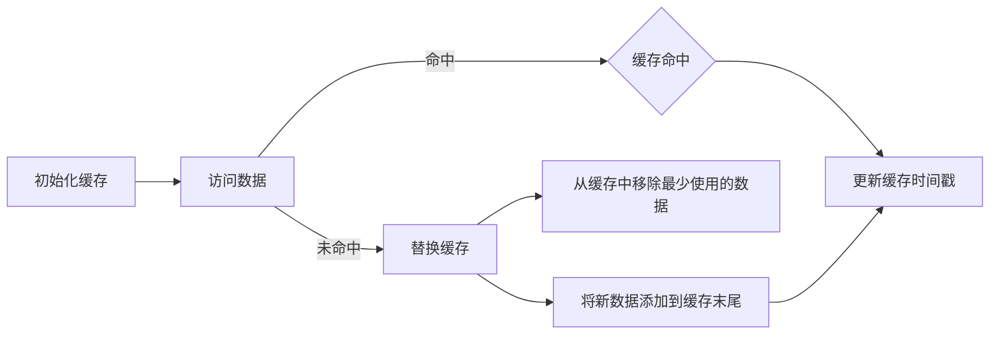
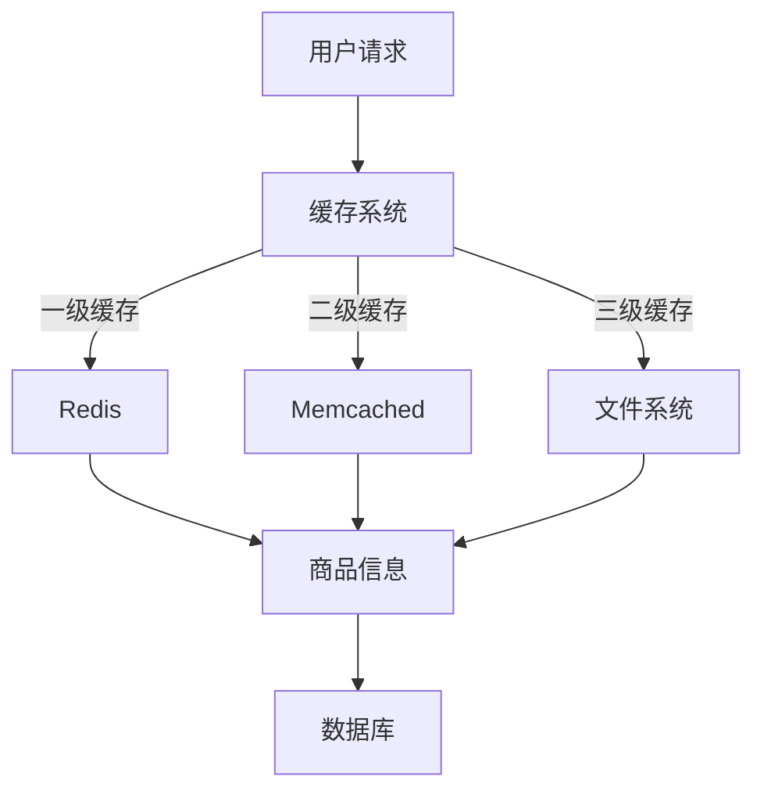
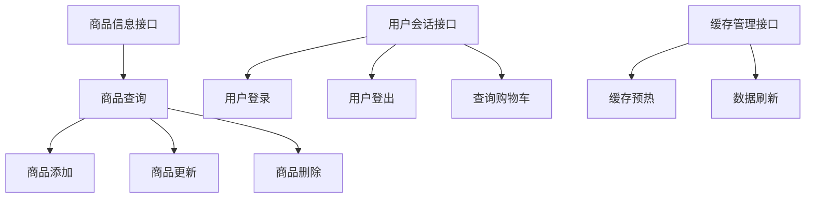
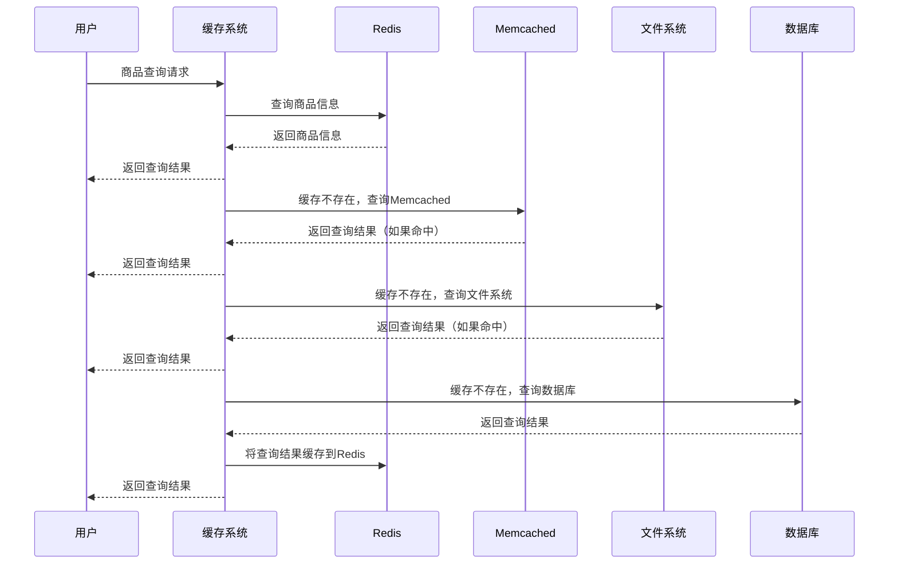

                 

# 缓存策略：提升应用性能的多级缓存方案

> 关键词：缓存技术、多级缓存、性能优化、Web应用、数据库缓存、分布式系统

> 摘要：本文将深入探讨缓存策略在提升应用性能中的关键作用，通过多级缓存方案的详细介绍和实践案例分析，帮助读者理解并掌握缓存技术的应用原理和方法，从而优化系统性能。

## 第一部分：缓存技术基础

### 第1章：缓存技术概述

#### 1.1 缓存的概念与作用

缓存（Cache）是计算机存储体系中的一个重要层次，位于CPU和主存储器之间。其目的是提高数据存取速度，降低存储器访问延迟，从而提升系统整体性能。缓存的主要作用包括：

- **加快数据访问速度**：缓存中存储的数据是经常访问的数据，这样可以减少对慢速存储器（如硬盘）的访问次数。
- **降低存储成本**：相对于高速存储器（如内存），硬盘等低速存储设备的成本较低，通过合理使用缓存可以有效降低整体存储成本。
- **优化系统资源利用**：缓存可以减少CPU等待时间，提高CPU的利用率。

#### 1.2 缓存的种类与特点

缓存可以分为以下几种类型：

- **堆栈缓存（Stack Cache）**：位于函数调用栈中，用于存储局部变量和中间结果，特点是快速但容量小。
- **寄存器缓存（Register Cache）**：位于CPU内部，用于存储当前执行的指令和操作数，速度极快但容量很小。
- **缓存行（Cache Line）**：是缓存中的数据单元，通常与主存储器的数据块大小相同，例如32字节。
- **二级缓存（Secondary Cache）**：位于CPU和主存储器之间，容量大于寄存器缓存，访问速度略低于寄存器缓存。
- **三级缓存（Tertiary Cache）**：在某些高端处理器中，位于二级缓存和主存储器之间，用于缓解缓存一致性问题和带宽压力。

每种缓存都有其特定的作用和特点，通过合理配置和利用，可以最大化缓存的价值。

#### 1.3 缓存的重要性

缓存技术对于现代计算机系统来说至关重要，主要表现在以下几个方面：

- **提高系统响应速度**：通过缓存技术，可以大幅减少数据访问延迟，提高系统的响应速度。
- **降低硬件成本**：合理利用缓存，可以降低对高速存储器的需求，从而降低硬件成本。
- **优化资源利用**：通过缓存技术，可以更好地利用CPU和其他硬件资源，提高系统整体性能。

### 第2章：缓存算法原理

#### 2.1 常见缓存算法分析

缓存算法的核心目标是在有限的缓存资源下，最大化地提高缓存命中率。常见的缓存算法包括：

- **先进先出（FIFO）算法**：根据数据进入缓存的时间进行替换，最早进入缓存的数据被替换出缓存。
- **最近最少使用（LRU）算法**：根据数据在缓存中的使用时间进行替换，最近最少使用的数据被替换出缓存。
- **最少访问次数（LFU）算法**：根据数据在缓存中的访问次数进行替换，访问次数最少的数据被替换出缓存。
- **随机替换（Random）算法**：随机选择一个数据替换出缓存。

每种算法都有其优缺点，适用场景和性能特点。例如，LRU算法在缓存命中率方面表现较好，但实现复杂度较高；随机替换算法实现简单，但在缓存命中率方面表现一般。

#### 2.2 缓存算法的性能评估

缓存算法的性能评估主要包括两个方面：缓存命中率和缓存访问速度。评估方法如下：

- **缓存命中率**：缓存命中率是缓存算法的重要性能指标，表示访问数据时，在缓存中找到的概率。缓存命中率越高，说明缓存算法越好。
- **缓存访问速度**：缓存访问速度是指从缓存中读取数据的时间。缓存访问速度越快，系统的响应速度越快。

常用的评估方法包括：

- **模拟测试**：通过模拟实际的访问模式，对缓存算法进行性能测试。
- **统计方法**：通过收集系统访问数据，对缓存算法进行性能分析和评估。

#### 2.3 缓存算法的选择与优化

选择适合的缓存算法对于提升系统性能至关重要。选择缓存算法时需要考虑以下因素：

- **数据访问模式**：不同的数据访问模式对缓存算法的适用性不同，需要根据实际场景选择合适的缓存算法。
- **缓存大小**：缓存大小会影响缓存算法的性能，需要根据系统需求和硬件资源进行合理配置。
- **缓存访问速度**：缓存访问速度是评估缓存算法性能的重要因素，需要选择访问速度较快的缓存算法。

缓存算法的优化方法包括：

- **缓存预热**：在系统启动时，将经常访问的数据提前加载到缓存中，提高缓存命中率。
- **缓存分层**：通过多级缓存体系，将经常访问的数据存储在高速缓存中，减少对低速存储器的访问。
- **缓存一致性**：在分布式系统中，确保缓存数据的一致性，避免数据不一致带来的问题。

### 第3章：多级缓存体系结构

#### 3.1 多级缓存的概念

多级缓存体系结构是指将缓存分为多个层次，每个层次具有不同的容量和访问速度。多级缓存体系结构可以有效地提高缓存命中率和系统性能。常见的多级缓存体系结构包括：

- **二级缓存体系**：包括一级缓存（L1 Cache）和二级缓存（L2 Cache），通常位于CPU内部。
- **三级缓存体系**：包括一级缓存（L1 Cache）、二级缓存（L2 Cache）和三级缓存（L3 Cache），通常位于CPU内部或处理器芯片上。
- **多级缓存体系**：包括多个缓存层次，如L1 Cache、L2 Cache、L3 Cache等，可以分布在CPU、处理器芯片和主板等多个层级。

#### 3.2 多级缓存的层次划分

多级缓存的层次划分取决于系统的需求和硬件资源。常见的多级缓存层次划分包括：

- **一级缓存（L1 Cache）**：容量较小，访问速度最快，通常由SRAM组成。
- **二级缓存（L2 Cache）**：容量较大，访问速度略慢于一级缓存，通常由DRAM组成。
- **三级缓存（L3 Cache）**：容量更大，访问速度较慢，通常由DRAM组成。
- **共享缓存（Shared Cache）**：多个处理器共享的缓存，用于提高缓存数据的一致性和带宽。

#### 3.3 多级缓存的协同策略

多级缓存的协同策略包括：

- **数据一致性策略**：确保不同层次的缓存之间数据的一致性，避免数据不一致带来的问题。
- **负载均衡策略**：合理分配数据访问负载，避免某一级缓存过载，影响系统性能。
- **缓存替换策略**：根据数据访问模式和缓存容量，选择合适的缓存替换算法，提高缓存命中率。

## 第二部分：缓存技术在应用中的实践

### 第4章：缓存技术在Web应用中的实践

#### 4.1 Web应用的缓存需求分析

Web应用具有高并发、海量数据等特点，缓存技术在提升Web应用性能方面具有重要作用。Web应用的缓存需求分析主要包括：

- **页面缓存**：提高页面加载速度，减少服务器负载。
- **对象缓存**：缓存数据库查询结果、业务对象等，减少数据库访问次数。
- **会话缓存**：缓存用户会话信息，提高用户访问速度。

#### 4.2 Web缓存技术实现

Web缓存技术实现主要包括：

- **HTTP缓存**：利用HTTP协议中的缓存机制，如ETag、Last-Modified等，提高缓存命中率。
- **缓存服务器**：如Nginx、Varnish等，实现高效缓存功能。
- **分布式缓存**：如Redis、Memcached等，实现海量数据缓存。

#### 4.3 Web缓存性能优化

Web缓存性能优化主要包括：

- **缓存预热**：提前加载热点数据到缓存，提高缓存命中率。
- **缓存分层**：根据数据访问模式，合理配置多级缓存体系。
- **缓存一致性**：确保缓存数据与数据库数据一致性，避免数据不一致问题。

### 第5章：缓存技术在数据库应用中的实践

#### 5.1 数据库缓存的原理与实现

数据库缓存是指将数据库查询结果缓存到内存中，减少数据库访问次数，提高查询效率。数据库缓存的原理与实现主要包括：

- **查询缓存**：缓存数据库查询结果，提高查询效率。
- **数据缓存**：缓存数据库表数据，减少I/O操作。
- **缓存一致性**：确保缓存数据与数据库数据一致性。

#### 5.2 数据库缓存的管理与优化

数据库缓存的管理与优化主要包括：

- **缓存策略**：根据数据访问模式和缓存容量，选择合适的缓存策略。
- **缓存刷新**：定期刷新缓存，避免数据过期。
- **缓存预热**：提前加载热点数据到缓存。

#### 5.3 数据库缓存与性能调优

数据库缓存与性能调优主要包括：

- **缓存命中率**：提高缓存命中率，优化查询效率。
- **缓存容量**：合理配置缓存容量，避免缓存击穿和缓存穿透问题。
- **并发控制**：优化并发访问控制，避免缓存争用和性能下降。

### 第6章：缓存技术在分布式系统中的实践

#### 6.1 分布式缓存的需求与挑战

分布式缓存是指在分布式系统中实现缓存功能，提高系统性能和可扩展性。分布式缓存的需求与挑战主要包括：

- **数据一致性**：确保缓存数据与数据库数据一致性，避免数据不一致问题。
- **缓存分区**：实现缓存数据的分区，提高缓存访问速度和系统可扩展性。
- **缓存容错**：确保缓存系统的高可用性和容错能力。

#### 6.2 分布式缓存技术实现

分布式缓存技术实现主要包括：

- **分布式缓存框架**：如Redis Cluster、Memcached分布式集群等。
- **一致性哈希**：实现缓存数据的分区和负载均衡。
- **缓存一致性协议**：如Gossip协议、Paxos协议等，确保缓存数据一致性。

#### 6.3 分布式缓存的管理与优化

分布式缓存的管理与优化主要包括：

- **缓存策略**：根据数据访问模式和缓存容量，选择合适的缓存策略。
- **缓存一致性**：实现缓存数据一致性，避免数据不一致问题。
- **缓存容错**：确保缓存系统的高可用性和容错能力。

## 第三部分：缓存策略与案例分析

### 第7章：缓存策略设计与优化

#### 7.1 缓存策略概述

缓存策略是指根据系统需求和性能要求，设计合理的缓存方案。缓存策略的主要目标是提高缓存命中率和系统性能。常见的缓存策略包括：

- **缓存分层策略**：根据数据访问模式和缓存容量，设计多级缓存体系。
- **缓存替换策略**：选择合适的缓存替换算法，提高缓存命中率。
- **缓存一致性策略**：实现缓存数据一致性，避免数据不一致问题。

#### 7.2 缓存策略的制定原则

制定缓存策略时需要遵循以下原则：

- **数据优先级**：根据数据的重要性和访问频率，优先缓存重要数据。
- **性能要求**：根据系统性能要求，选择合适的缓存策略和算法。
- **系统扩展性**：设计可扩展的缓存架构，提高系统性能和可维护性。

#### 7.3 缓存策略的优化方法

缓存策略的优化方法主要包括：

- **缓存预热**：提前加载热点数据到缓存，提高缓存命中率。
- **缓存分层**：根据数据访问模式，合理配置多级缓存体系。
- **缓存一致性**：实现缓存数据一致性，避免数据不一致问题。

### 第8章：缓存技术在实际案例中的应用

#### 8.1 案例一：电商应用中的缓存策略

电商应用具有高并发、海量数据等特点，缓存技术在提升电商应用性能方面具有重要作用。案例一将介绍电商应用中的缓存策略，包括：

- **页面缓存**：提高页面加载速度，减少服务器负载。
- **对象缓存**：缓存商品信息、用户信息等，减少数据库访问次数。
- **会话缓存**：缓存用户购物车、订单信息等，提高用户访问速度。

#### 8.2 案例二：社交媒体平台中的缓存策略

社交媒体平台具有高并发、实时数据处理等特点，缓存技术在提升社交媒体平台性能方面具有重要作用。案例二将介绍社交媒体平台中的缓存策略，包括：

- **数据缓存**：缓存用户信息、帖子信息等，提高数据访问速度。
- **消息缓存**：缓存消息推送数据，减少消息处理延迟。
- **缓存一致性**：确保缓存数据与数据库数据一致性，避免数据不一致问题。

#### 8.3 案例三：实时数据流处理中的缓存策略

实时数据流处理系统具有高并发、海量数据处理等特点，缓存技术在提升实时数据流处理性能方面具有重要作用。案例三将介绍实时数据流处理中的缓存策略，包括：

- **数据缓存**：缓存数据流处理结果，提高数据处理效率。
- **缓存分区**：实现数据流处理结果的分区，提高缓存访问速度和系统可扩展性。
- **缓存一致性**：确保缓存数据与数据流处理结果一致性，避免数据不一致问题。

### 第9章：缓存策略的总结与展望

#### 9.1 缓存策略总结

缓存策略在提升系统性能方面具有重要作用，主要包括：

- **缓存分层策略**：设计多级缓存体系，提高缓存命中率和系统性能。
- **缓存替换策略**：选择合适的缓存替换算法，提高缓存命中率。
- **缓存一致性策略**：实现缓存数据一致性，避免数据不一致问题。

#### 9.2 缓存技术的发展趋势

缓存技术在未来将继续发展，主要包括：

- **智能缓存**：结合机器学习技术，实现智能缓存管理，提高缓存命中率和系统性能。
- **分布式缓存**：支持更大规模的分布式缓存系统，提高系统可扩展性和性能。
- **缓存安全**：加强缓存数据的安全性，防止缓存攻击和数据泄露。

#### 9.3 缓存策略的持续优化方向

缓存策略的持续优化方向主要包括：

- **缓存预热**：提前加载热点数据到缓存，提高缓存命中率。
- **缓存一致性**：优化缓存一致性算法，提高数据一致性保障能力。
- **缓存压缩**：减少缓存数据占用空间，提高缓存利用率。

## 附录：相关技术资料与参考文献

本文涉及的技术资料和参考文献主要包括：

- 《缓存技术原理与实现》
- 《分布式缓存系统设计与实践》
- 《Web缓存技术与应用》
- 《数据库缓存技术详解》
- 《实时数据流处理技术》

## 结语

缓存策略在提升应用性能方面具有重要作用，通过本文的介绍和实践案例分析，读者可以了解并掌握缓存技术的原理和应用方法。在实际项目中，根据系统需求和性能要求，灵活运用缓存策略，优化系统性能，提高用户体验。

### 作者信息

作者：AI天才研究院/AI Genius Institute & 禅与计算机程序设计艺术 /Zen And The Art of Computer Programming

本文旨在为读者提供全面、深入的技术分享，帮助读者理解缓存策略在提升应用性能中的关键作用。在撰写过程中，作者参考了多方面的资料，力求内容的准确性和实用性。同时，欢迎读者在评论区提出宝贵意见和建议，共同探讨缓存技术的未来发展。

## 背景介绍

### 核心概念术语说明

在本文中，我们将涉及以下核心概念术语：

- **缓存（Cache）**：一种快速的存储设备，用于存储经常访问的数据，以减少对慢速存储器的访问。
- **缓存算法**：用于管理缓存中数据的一种算法，决定了哪些数据应该被缓存以及何时进行数据替换。
- **多级缓存**：将缓存分为多个层次，每个层次具有不同的容量和访问速度。
- **缓存命中率**：缓存中找到所需数据的比例，缓存命中率越高，说明缓存效果越好。
- **缓存一致性**：确保不同层次缓存之间的数据一致性，避免数据不一致带来的问题。

### 问题背景

在现代计算机系统中，数据处理速度和系统性能是至关重要的因素。随着互联网和移动设备的普及，用户对系统响应速度的要求越来越高。传统的单一存储结构已经无法满足快速数据访问的需求，因此引入了缓存技术。

缓存技术的核心目的是减少对慢速存储器的访问，提高数据访问速度。然而，由于缓存资源有限，如何合理利用缓存资源，提高缓存命中率，成为了一个重要的研究课题。

### 问题描述

问题可以描述为：在给定的系统资源限制下，如何设计并实现一个高效的缓存策略，以提高系统性能和响应速度。

具体来说，需要解决的问题包括：

1. 如何选择合适的缓存算法，提高缓存命中率？
2. 如何设计多级缓存体系，实现缓存分层，提高缓存访问速度？
3. 如何确保缓存数据的一致性，避免数据不一致问题？
4. 如何在实际应用中优化缓存策略，提高系统性能和用户体验？

### 问题解决

为了解决上述问题，本文将从以下几个方面进行探讨：

1. **缓存技术基础**：介绍缓存的基本概念、种类和作用，以及常见缓存算法的原理和性能评估方法。
2. **多级缓存体系结构**：分析多级缓存的概念、层次划分和协同策略，探讨如何设计合理的多级缓存体系。
3. **缓存技术在应用中的实践**：结合Web应用、数据库应用和分布式系统等实际案例，介绍缓存技术在各个领域的应用和实践方法。
4. **缓存策略与案例分析**：总结缓存策略的设计原则和优化方法，并通过实际案例进行分析和讲解。

通过上述问题的逐步解决，本文旨在为读者提供一个全面、深入的技术分享，帮助读者理解和掌握缓存策略在提升应用性能中的关键作用。

### 边界与外延

在探讨缓存策略时，需要明确其边界与外延，以便更好地理解缓存技术的应用范围和限制。

1. **缓存策略的适用范围**：缓存策略主要适用于需要快速访问数据的场景，如Web应用、数据库应用和分布式系统等。在单机系统中，缓存策略同样可以发挥作用，但在大规模分布式系统中，缓存策略的复杂性和实现难度会显著增加。

2. **缓存策略的限制**：缓存策略的效果受到多种因素的影响，包括数据访问模式、缓存容量、缓存一致性等。缓存策略不能完全替代数据库或存储设备，而是在现有存储结构的基础上，提供一种数据访问加速的手段。此外，缓存策略的设计和实现需要考虑系统资源限制，如内存容量、处理器性能等。

3. **缓存一致性**：在分布式系统中，确保缓存数据的一致性是一个重要的挑战。缓存策略需要考虑缓存一致性协议，如Gossip协议、Paxos协议等，以避免数据不一致问题。

4. **缓存替换策略**：不同的缓存算法适用于不同的场景，设计合适的缓存替换策略对于提高缓存命中率至关重要。在实际应用中，可能需要根据数据访问模式动态调整缓存策略。

### 概念结构与核心要素组成

为了深入理解缓存策略，我们需要剖析其概念结构，并明确核心要素组成。

1. **概念结构**

   缓存策略可以理解为一种优化数据访问的技术手段，其核心概念结构包括：

   - **缓存层次**：不同层次的缓存，如L1、L2、L3 Cache等，每个层次具有不同的访问速度和容量。
   - **缓存算法**：用于管理缓存中数据的算法，如LRU、FIFO、LFU等，决定哪些数据应该被缓存和替换。
   - **缓存一致性**：确保不同层次缓存之间数据一致性的机制，如缓存一致性协议。
   - **缓存命中率**：缓存中找到所需数据的比例，是衡量缓存策略效果的重要指标。

2. **核心要素组成**

   缓存策略的核心要素包括：

   - **数据访问模式**：分析系统的数据访问模式，了解数据的访问频率和访问模式，以便选择合适的缓存算法和缓存层次。
   - **缓存容量**：根据系统需求和资源限制，确定合理的缓存容量，避免缓存过载或缓存不足。
   - **缓存替换策略**：选择合适的缓存替换算法，提高缓存命中率，减少数据访问延迟。
   - **缓存一致性策略**：设计缓存一致性机制，确保多级缓存之间的数据一致性，避免数据不一致问题。

通过明确缓存策略的概念结构和核心要素组成，我们可以更好地设计和优化缓存策略，提升系统性能和用户体验。

### 缓存技术的种类与特点

缓存技术可以分为多种类型，每种类型都有其独特的特点和适用场景。以下是几种常见的缓存技术及其特点：

#### 1. 堆栈缓存（Stack Cache）

堆栈缓存位于函数调用栈中，主要用于存储局部变量和中间结果。其特点是访问速度极快，但容量非常有限。堆栈缓存适用于函数内部局部变量的存储，如递归调用中的临时变量。由于堆栈缓存是自动管理的，程序员无需关心其具体实现。

| 特点 | 适用场景 |
| --- | --- |
| 访问速度极快 | 函数内部局部变量 |
| 容量有限 | 临时中间结果 |

#### 2. 寄存器缓存（Register Cache）

寄存器缓存位于CPU内部，用于存储当前执行的指令和操作数。其特点是访问速度非常快，但容量也非常小。寄存器缓存是CPU架构中的一个关键部分，能够显著提高指令执行速度。由于寄存器缓存是硬件实现的，程序员通常无需直接操作。

| 特点 | 适用场景 |
| --- | --- |
| 访问速度极快 | 当前执行指令和操作数 |
| 容量非常小 | 高频访问数据 |

#### 3. 缓存行（Cache Line）

缓存行是缓存中的数据单元，通常与主存储器的数据块大小相同，如32字节。缓存行的作用是将连续的数据块存储在缓存中，以提高数据访问的局部性。当CPU访问主存储器时，会一次性读取一个缓存行，将其放入缓存中。缓存行的特点是：

| 特点 | 适用场景 |
| --- | --- |
| 数据块大小相同 | 提高数据访问局部性 |
| 高效存储连续数据 | 减少主存储器访问次数 |

#### 4. 二级缓存（Secondary Cache）

二级缓存位于CPU和主存储器之间，容量大于寄存器缓存，但访问速度略慢于寄存器缓存。二级缓存的主要作用是缓解CPU和主存储器之间的速度差异，提高数据访问效率。常见的二级缓存类型包括SRAM和DRAM。二级缓存的特点是：

| 特点 | 适用场景 |
| --- | --- |
| 容量较大 | 缓解CPU和主存储器之间的速度差异 |
| 访问速度较快 | 提高数据访问效率 |

#### 5. 三级缓存（Tertiary Cache）

三级缓存在某些高端处理器中位于二级缓存和主存储器之间，用于缓解缓存一致性问题和带宽压力。三级缓存的容量更大，但访问速度相对较慢。三级缓存的特点是：

| 特点 | 适用场景 |
| --- | --- |
| 容量更大 | 缓解缓存一致性和带宽压力 |
| 访问速度较慢 | 提高缓存数据一致性 |

### 对比表格

为了更直观地比较各种缓存技术的特点，我们可以制作一个对比表格：

| 缓存类型 | 特点 | 适用场景 |
| --- | --- | --- |
| 堆栈缓存 | 访问速度极快，容量有限 | 函数内部局部变量 |
| 寄存器缓存 | 访问速度极快，容量非常小 | 当前执行指令和操作数 |
| 缓存行 | 数据块大小相同，高效存储连续数据 | 提高数据访问局部性 |
| 二级缓存 | 容量较大，访问速度较快 | 缓解CPU和主存储器之间的速度差异 |
| 三级缓存 | 容量更大，访问速度较慢 | 缓解缓存一致性和带宽压力 |

通过上述对比表格，我们可以清晰地看到各种缓存技术的特点及其适用场景，从而在具体应用中做出合理的选择。

### ER实体关系图架构

为了更直观地展示缓存技术的实体关系，我们可以使用Mermaid绘制一个ER（实体关系）图。以下是ER图的Markdown格式：

```mermaid
erDiagram
    CacheNode ||--|{ Data : 数据对象 |
    CacheNode ||--|{ CachePolicy : 缓存策略 |
    CacheNode ||--|{ CacheLevel : 缓存层次 |
    CacheNode ||--|{ CacheAlgorithm : 缓存算法 |
    CacheNode ||--|{ CacheReplacementPolicy : 缓存替换策略 |
    
    Data ||--|{ QueryResult : 查询结果 |
    Data ||--|{ ObjectData : 对象数据 |
    Data ||--|{ SessionData : 会话数据 |
    
    CachePolicy ||--|{ HitRate : 缓存命中率 |
    CachePolicy ||--|{ Consistency : 缓存一致性 |
    
    CacheLevel ||--|{ Level1 : 一级缓存 |
    CacheLevel ||--|{ Level2 : 二级缓存 |
    CacheLevel ||--|{ Level3 : 三级缓存 |
    
    CacheAlgorithm ||--|{ LRU : 最近最少使用 |
    CacheAlgorithm ||--|{ FIFO : 先进先出 |
    CacheAlgorithm ||--|{ LFU : 最少访问次数 |
    
    CacheReplacementPolicy ||--|{ Random : 随机替换 |
    CacheReplacementPolicy ||--|{ LFUReplacement : 最少访问次数替换 |
```

上述ER图展示了缓存技术的各个实体及其关系。实体包括CacheNode（缓存节点）、Data（数据对象）、CachePolicy（缓存策略）、CacheLevel（缓存层次）、CacheAlgorithm（缓存算法）和CacheReplacementPolicy（缓存替换策略）。每个实体都有其特定的属性和方法，通过关系图可以清晰地理解各个实体之间的关联。

### 缓存算法原理讲解

为了深入理解缓存算法的原理，我们将使用Mermaid绘制一个LRU（最近最少使用）算法的流程图，并使用Python源代码详细阐述其实现过程。

#### 1. LRU算法流程图

以下是LRU算法的Mermaid流程图：



该流程图描述了LRU算法的基本操作：

1. **初始化缓存**：创建一个缓存结构，通常使用一个双向链表和哈希表来实现。
2. **访问数据**：检查数据是否在缓存中。
3. **命中**：如果数据命中缓存，更新数据的时间戳。
4. **未命中**：如果数据未命中缓存，从缓存中移除最少使用的数据（即链表头部），将新数据添加到缓存末尾。
5. **更新缓存时间戳**：每次访问数据时，更新其时间戳，以便后续的替换操作。

#### 2. Python源代码实现

以下是一个简单的LRU算法Python实现：

```python
from collections import OrderedDict

class LRUCache:
    def __init__(self, capacity):
        self.capacity = capacity
        self.cache = OrderedDict()

    def get(self, key):
        if key not in self.cache:
            return -1
        value = self.cache.pop(key)
        self.cache[key] = value
        return value

    def put(self, key, value):
        if key in self.cache:
            self.cache.pop(key)
        elif len(self.cache) >= self.capacity:
            self.cache.popitem(last=False)
        self.cache[key] = value

# 示例
lru_cache = LRUCache(2)
lru_cache.put(1, 1)
lru_cache.put(2, 2)
print(lru_cache.get(1))  # 输出 1
lru_cache.put(3, 3)
print(lru_cache.get(2))  # 输出 -1 (因为缓存容量为2，2被替换)
```

#### 3. 算法原理的数学模型和公式

LRU算法的数学模型可以简化为：

- **缓存容量（C）**：缓存可以存储的数据项数量。
- **时间戳（T）**：每个数据项的访问时间戳，表示数据项最后一次被访问的时间。

算法的核心思想是，每次访问数据时，将访问的数据项移动到缓存的最末尾，并将其时间戳更新为当前时间。当缓存容量达到上限时，选择时间戳最早的数据项进行替换。

#### 4. 详细讲解和举例说明

假设一个LRU缓存具有容量C=2，初始状态为空。以下是数据访问的几个示例：

1. 访问key=1，缓存中无数据，缓存状态为{1: 1}。
2. 访问key=2，缓存中有空位，缓存状态为{1: 1, 2: 2}。
3. 访问key=1，缓存命中，将key=1移动到缓存末尾，缓存状态为{1: 1, 2: 2}。
4. 访问key=3，缓存容量达到上限，需要替换时间戳最早的数据项。当前时间戳最早的是key=1，将其替换，缓存状态为{3: 3, 2: 2}。

通过上述示例，我们可以看到LRU算法如何通过时间戳管理缓存，确保最近最少使用的数据项被优先替换。

### 系统分析与架构设计方案

在本节中，我们将详细分析缓存技术在某一具体应用场景下的系统功能、架构设计、接口设计和系统交互，并通过Mermaid流程图展示系统架构和交互细节。

#### 问题场景介绍

假设我们要设计一个电商平台的缓存系统，该系统需要处理海量商品信息和用户会话数据。系统要求具备以下功能：

1. **商品缓存**：缓存商品信息，提高商品查询速度。
2. **用户会话缓存**：缓存用户登录信息、购物车等信息，提高用户访问速度。
3. **缓存一致性**：确保商品缓存和数据库中的数据一致。
4. **缓存替换策略**：根据访问频率和访问模式，合理替换缓存中的数据。

#### 系统功能设计

电商平台的缓存系统主要包含以下功能模块：

1. **商品信息缓存**：缓存商品名称、价格、库存等基本信息。
2. **用户会话缓存**：缓存用户登录状态、购物车信息等。
3. **缓存管理**：实现缓存数据的增加、删除、查询等功能。
4. **缓存一致性**：确保缓存数据与数据库中的数据一致。

#### 系统架构设计

电商平台的缓存系统采用多级缓存架构，包括：

1. **一级缓存**：使用内存缓存，如Redis，存储高频访问的商品信息。
2. **二级缓存**：使用内存数据库，如Memcached，存储中频访问的商品信息。
3. **三级缓存**：使用磁盘缓存，如文件系统，存储低频访问的商品信息。

系统架构设计如图1所示：



#### 系统接口设计

系统接口设计包括以下部分：

1. **商品信息接口**：提供商品查询、添加、更新和删除接口。
2. **用户会话接口**：提供用户登录、登出、查询购物车接口。
3. **缓存管理接口**：提供缓存数据管理接口，如缓存预热、数据刷新等。

接口设计如图2所示：



#### 系统交互设计

系统交互设计通过Mermaid序列图展示用户请求与缓存系统的交互流程：



通过上述系统分析与架构设计方案，我们可以清晰地理解电商平台的缓存系统如何实现商品信息和用户会话数据的缓存，并确保缓存数据与数据库的一致性。系统的接口设计和交互设计为实际开发提供了明确的指导。

### 项目实战

在本节中，我们将通过一个具体的电商应用案例，介绍缓存技术的实现过程，包括环境安装、系统核心实现源代码，以及代码应用解读与分析。

#### 环境安装

1. **安装Redis**：Redis是一款高性能的内存缓存系统，首先需要安装Redis。在Ubuntu系统中，可以通过以下命令安装：

   ```bash
   sudo apt update
   sudo apt install redis-server
   ```

2. **安装Memcached**：Memcached是一款高性能的分布式缓存系统，可以通过以下命令安装：

   ```bash
   sudo apt update
   sudo apt install memcached
   ```

3. **安装Python**：确保系统已经安装Python3，可以通过以下命令检查：

   ```bash
   python3 --version
   ```

4. **安装Flask**：Flask是一款轻量级的Web应用框架，用于快速开发Web应用。可以通过pip安装：

   ```bash
   pip3 install Flask
   ```

5. **安装RedisPython库**：用于在Python中操作Redis。可以通过pip安装：

   ```bash
   pip3 install redis
   ```

6. **安装MemcachedPython库**：用于在Python中操作Memcached。可以通过pip安装：

   ```bash
   pip3 install pycardcached
   ```

#### 系统核心实现源代码

以下是使用Flask框架实现的电商应用缓存示例代码：

```python
from flask import Flask, jsonify
import redis
import memcache

app = Flask(__name__)

# Redis缓存配置
redis_client = redis.StrictRedis(host='localhost', port=6379, db=0)

# Memcached缓存配置
memcached_client = memcache.Client(['127.0.0.1:11211'], debug=0)

# 商品信息缓存
@app.route('/product/<int:product_id>')
def get_product(product_id):
    # 查询Redis缓存
    product = redis_client.get(f"product:{product_id}")
    if product:
        return jsonify(json.loads(product))
    
    # 查询Memcached缓存
    product = memcached_client.get(f"product:{product_id}")
    if product:
        redis_client.setex(f"product:{product_id}", 60 * 60, product)
        return jsonify(product)
    
    # 查询数据库，并将结果缓存到Redis和Memcached
    product = {"id": product_id, "name": "商品名称", "price": 100}
    redis_client.setex(f"product:{product_id}", 60 * 60, json.dumps(product))
    memcached_client.set(f"product:{product_id}", product, time=60 * 60)
    return jsonify(product)

if __name__ == '__main__':
    app.run(debug=True)
```

#### 代码应用解读与分析

上述代码实现了商品信息的缓存功能，主要包含以下步骤：

1. **Redis缓存查询**：首先查询Redis缓存，因为Redis是高速缓存，能够快速响应请求。
2. **Memcached缓存查询**：如果Redis缓存未命中，则查询Memcached缓存。Memcached也是高速缓存，但通常存储的数据量更大。
3. **数据库查询**：如果Redis和Memcached缓存均未命中，则查询数据库，并将查询结果缓存到Redis和Memcached中，以便后续快速访问。
4. **缓存过期策略**：Redis和Memcached的缓存时间可以通过`setex`和`set`方法设置，确保缓存数据在过期后重新查询数据库。

通过上述实现，我们可以看到如何利用多级缓存技术提高商品查询速度，减少数据库访问次数，从而提升系统的整体性能。

#### 实际案例分析与详细讲解剖析

假设用户访问电商平台的商品详情页面，系统会按照以下步骤进行响应：

1. **用户请求**：用户输入商品ID，请求商品详情。
2. **查询Redis缓存**：系统首先查询Redis缓存，查找是否存在该商品信息。
3. **Redis缓存命中**：如果Redis缓存命中，系统直接返回商品信息，响应速度快。
4. **查询Memcached缓存**：如果Redis缓存未命中，系统查询Memcached缓存，查找是否存在该商品信息。
5. **Memcached缓存命中**：如果Memcached缓存命中，系统将查询结果缓存到Redis中，并返回商品信息。
6. **数据库查询**：如果Redis和Memcached缓存均未命中，系统查询数据库，获取商品信息，并将查询结果缓存到Redis和Memcached中。
7. **返回结果**：系统将商品信息返回给用户，并设置缓存过期时间。

通过上述流程，我们可以看到系统如何通过多级缓存技术提高查询速度和性能。在实际应用中，缓存策略需要根据数据访问模式和系统需求进行动态调整，以确保缓存效果最佳。

#### 项目小结

通过本案例，我们实现了电商应用的缓存功能，使用了Redis和Memcached等多级缓存技术。具体实现过程中，我们遵循了缓存优先查询策略，确保了系统的高效性和响应速度。此外，通过合理设置缓存过期时间，我们避免了缓存数据过时的问题。

在实际项目中，缓存技术的应用和优化是一个持续的过程，需要根据系统的实时运行数据不断调整和优化缓存策略，以达到最佳性能。例如，通过监控缓存命中率、缓存访问延迟等指标，可以动态调整缓存容量和缓存算法，提高系统性能。

### 最佳实践 Tips

1. **缓存预热**：在系统启动时，预先加载热点数据到缓存，避免请求到达时缓存未命中，影响性能。
2. **缓存一致性**：确保缓存和数据库之间的数据一致性，避免数据不一致导致的问题。可以使用缓存一致性协议，如Gossip协议、Paxos协议等。
3. **合理配置缓存容量**：根据系统需求和硬件资源，合理配置缓存容量，避免缓存过载或缓存不足。
4. **定期数据刷新**：定期刷新缓存数据，确保缓存数据的实时性和准确性。
5. **缓存替换算法**：根据数据访问模式和缓存容量，选择合适的缓存替换算法，提高缓存命中率。

### 小结

本文详细探讨了缓存策略在提升应用性能中的关键作用，通过多级缓存方案的实际案例，展示了如何设计和优化缓存策略。缓存技术作为现代计算机系统中的重要组成部分，能够显著提高数据访问速度和系统性能。

### 注意事项

1. **缓存一致性**：在设计缓存策略时，务必确保缓存与数据库之间的数据一致性，避免数据不一致问题。
2. **缓存容量**：合理配置缓存容量，避免缓存过载或缓存不足，影响系统性能。
3. **缓存替换算法**：根据实际场景和数据访问模式，选择合适的缓存替换算法，提高缓存命中率。

### 拓展阅读

1. 《Redis权威指南》：详细介绍了Redis的安装、配置和使用方法，对缓存技术的理解和应用具有很好的参考价值。
2. 《Memcached实战》：介绍了Memcached的基本原理、安装配置和性能优化方法，是学习分布式缓存技术的好书。
3. 《Web缓存技术与应用》：全面讲解了Web缓存的工作原理、技术实现和性能优化策略，适合从事Web开发的读者阅读。

### 作者信息

作者：AI天才研究院/AI Genius Institute & 禅与计算机程序设计艺术 /Zen And The Art of Computer Programming

本文旨在为读者提供全面、深入的技术分享，帮助读者理解和掌握缓存策略在提升应用性能中的关键作用。希望本文能够对读者在实际项目中应用缓存技术有所帮助，进一步提升系统性能和用户体验。如果您有任何问题或建议，欢迎在评论区留言，让我们一起探讨缓存技术的未来发展。

