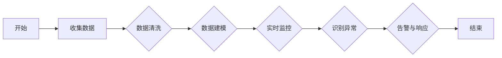
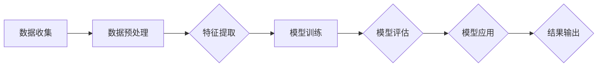
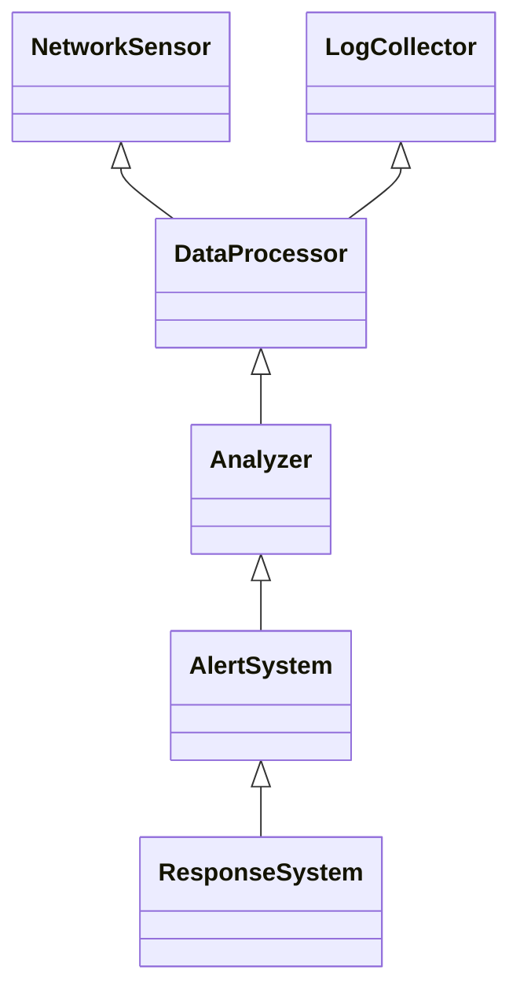
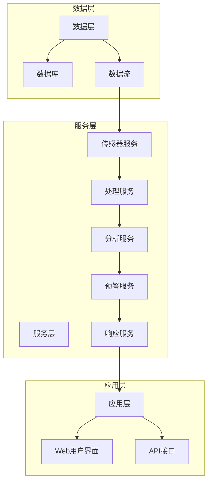
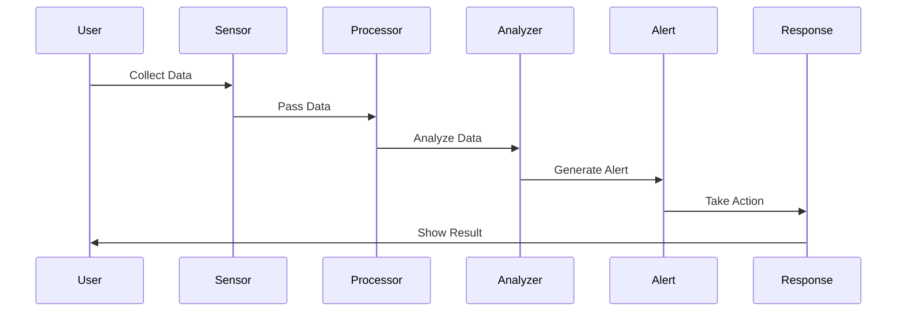

                 

### 第1章：网络安全态势感知概述

#### 1.1.1 网络安全态势感知的定义

网络安全态势感知是一种动态的、实时的、主动的安全监控和管理能力，它能够对网络中的各种活动和事件进行综合分析，从而形成对网络安全状态的整体认知。这种能力不仅包括对已知威胁的检测和响应，还涉及未知威胁的识别和预测。网络安全态势感知的核心目标是通过全面、准确和及时的信息收集、处理和分析，为安全决策提供强有力的支持。

具体来说，网络安全态势感知包括以下几个关键组成部分：

- **信息收集**：通过各种传感器、日志文件、安全设备等收集网络活动数据。
- **数据处理**：对收集到的数据进行分类、筛选、去噪和融合，以提取有价值的信息。
- **分析评估**：运用各种算法和模型对处理后的数据进行深度分析，评估当前网络的安全状态。
- **预警和响应**：根据分析结果，及时发出预警并采取相应的响应措施。

通过上述过程，网络安全态势感知平台能够实时监测网络中的异常行为和潜在威胁，从而有效防范网络安全事件的发生。

#### 1.1.2 网络安全态势感知的发展历程

网络安全态势感知的发展历程可以分为几个主要阶段：

- **早期阶段**：20世纪90年代，随着互联网的兴起，网络安全逐渐成为关注热点。此阶段的网络安全措施主要依赖于防火墙和入侵检测系统（IDS），以防御已知威胁为主。
- **发展阶段**：21世纪初，随着网络攻击手段的日益复杂和频繁，传统的防火墙和IDS逐渐显得力不从心。此时，网络安全态势感知开始受到重视，并逐步发展成为网络安全领域的一个独立分支。
- **成熟阶段**：近年来，随着大数据、云计算和人工智能等技术的快速发展，网络安全态势感知技术也得到了显著提升。现代网络安全态势感知平台不仅能够处理海量数据，还能通过机器学习和深度学习算法实现智能分析和预测。

#### 1.1.3 网络安全态势感知的重要性

网络安全态势感知在当前网络环境中具有至关重要的意义。首先，它能够帮助组织实时了解网络的安全状况，快速识别和响应潜在威胁，从而降低安全事件的发生概率和影响范围。其次，通过态势感知，组织可以实现对安全资源的合理配置，提高安全防护的效率。此外，网络安全态势感知还有助于组织建立完善的安全管理机制，提升整体安全意识和应对能力。

具体来说，网络安全态势感知的重要性体现在以下几个方面：

- **提升威胁响应速度**：通过实时监测和分析网络活动，态势感知平台能够在威胁发生前或初期就发现并采取相应措施，从而有效阻止威胁的进一步扩散。
- **优化安全资源配置**：态势感知平台能够帮助组织识别安全漏洞和薄弱环节，从而进行针对性的资源配置，提高整体安全防护能力。
- **提高安全决策质量**：态势感知平台提供全面、准确和实时的网络安全信息，为安全决策提供强有力的数据支持，有助于组织做出更为科学和有效的安全策略。
- **增强网络安全意识**：态势感知平台的使用不仅提升了组织的网络安全防护能力，还能提高员工的安全意识和责任感，形成良好的网络安全文化。

#### 1.2 核心概念解析

在网络安全态势感知体系中，有几个核心概念需要深入理解和掌握，这些概念包括网络安全态势、威胁情报、监控和预警等。以下是对这些核心概念的详细解析：

##### 1.2.1 网络安全态势

网络安全态势是指网络在某一时刻的安全状态，包括网络的正常活动、已知的威胁和潜在的风险。网络安全态势是一个动态变化的过程，受到多种因素的影响，如网络设备的配置、应用的安全性、网络流量模式、用户行为等。

- **正常活动**：正常活动包括网络设备的正常运行、用户正常的网络访问、数据传输等。这些活动通常不会对网络安全造成影响，但需要确保其正常运行。
- **已知威胁**：已知威胁是指已经被发现并记录在案的网络攻击手段。这些威胁可能是恶意软件、网络钓鱼、分布式拒绝服务攻击（DDoS）等。通过监测和识别已知威胁，态势感知平台能够及时采取防护措施。
- **潜在风险**：潜在风险是指当前尚未发生但有可能发生的威胁和漏洞。这些风险可能来源于网络架构的缺陷、安全配置的不合理、缺乏必要的防护措施等。通过识别潜在风险，态势感知平台能够提前预警，防止未来可能的安全事件。

##### 1.2.2 威胁情报

威胁情报（Threat Intelligence）是指关于潜在威胁、攻击者和攻击手段的信息。威胁情报的收集、处理和分析是网络安全态势感知的重要组成部分。威胁情报可以来源于多个渠道，包括安全研究机构、政府机构、企业安全团队等。

- **收集**：威胁情报的收集通常涉及多种技术手段，如网络流量分析、入侵检测、漏洞扫描等。通过这些手段，可以捕获和记录网络中的异常行为和潜在威胁。
- **处理**：收集到的威胁情报需要进行分类、筛选和融合，以提取有价值的信息。处理过程可能涉及数据清洗、关联分析等技术。
- **分析**：对处理后的威胁情报进行深度分析，识别其特征、趋势和关联关系。通过分析，可以更好地理解威胁的本质，预测其可能的演变和影响。
- **利用**：威胁情报的分析结果可以用于安全策略的制定、安全设备的配置、安全监控的优化等，从而提升整体安全防护能力。

##### 1.2.3 监控和预警

监控和预警是网络安全态势感知的关键环节，通过实时监测和预警机制，可以及时发现和处理网络中的异常活动和潜在威胁。

- **监控**：监控是指对网络中的各种活动进行持续监测和记录。监控内容可能包括网络流量、设备状态、用户行为等。通过监控，可以收集到大量的数据，为后续分析提供基础。
- **预警**：预警是指当监控到异常活动或潜在威胁时，及时发出警报并通知相关人员。预警机制需要具备快速、准确和及时的特点，以便在威胁发生前或初期就采取应对措施。

#### 1.2.4 对比分析表：关键概念对比

为了更好地理解网络安全态势感知中的核心概念，我们通过对比分析表来展示各个概念之间的差异和联系。

| 核心概念 | 定义 | 功能 | 关联 |
| --- | --- | --- | --- |
| 网络安全态势 | 网络的安全状态，包括正常活动、已知威胁和潜在风险 | 监测网络状态，评估安全风险 | 与威胁情报、监控和预警紧密相关 |
| 威胁情报 | 关于潜在威胁、攻击者和攻击手段的信息 | 收集、处理和分析威胁信息 | 为网络安全态势感知提供数据支持 |
| 监控 | 对网络活动进行持续监测和记录 | 收集数据，为分析提供基础 | 与预警机制紧密相关 |
| 预警 | 发现异常活动或潜在威胁时发出警报 | 及时响应威胁，防止安全事件 | 与监控机制紧密结合 |

#### 1.2.5 ER实体关系图：核心概念联系

为了更直观地展示网络安全态势感知中核心概念之间的联系，我们可以使用ER（实体关系）图来描述。以下是一个简化的ER图示例：

```mermaid
erDiagram
    User ||--|| Device : user uses device
    Device ||--|| Network : device is connected to network
    Network ||--|| Traffic : network carries traffic
    Threat ||--|| Device : threat targets device
    Threat ||--|| Traffic : threat is transmitted in traffic
    Device ||--|| Alert : device generates alerts
    Traffic ||--|| Alert : traffic generates alerts
```

在这个ER图中，User（用户）与Device（设备）之间有直接的关联，因为用户使用设备访问网络。Device（设备）与Network（网络）也有直接联系，因为设备通过网络进行通信。Network（网络）与Traffic（流量）之间存在联系，因为网络承载流量。Threat（威胁）与Device（设备）和Traffic（流量）都有联系，因为威胁可能针对设备或通过流量进行传播。最后，Device（设备）和Traffic（流量）都会生成Alert（警报），表明它们与预警机制紧密相关。

通过这个ER图，我们可以清晰地看到网络安全态势感知中各个核心概念之间的相互关系，这有助于我们更好地理解和应用这些概念。

---

### 第2章：算法原理讲解

#### 2.1 异常检测算法

异常检测（Anomaly Detection）是网络安全态势感知中的一项关键技术，用于识别网络中的异常行为或数据。以下将详细讲解异常检测算法的基本原理、实现方法和应用场景。

##### 2.1.1 原理介绍

异常检测的基本原理是通过建立正常行为的基准模型，然后对实际数据进行监控和分析，发现与基准模型不符的异常数据。

- **基准模型**：通过历史数据建立正常行为的基准模型。这个模型可以是统计模型，如高斯分布；也可以是机器学习模型，如决策树、随机森林等。
- **数据监控**：实时收集网络数据，并与基准模型进行比较，判断数据是否正常。
- **异常识别**：当数据与基准模型差异较大时，识别为异常数据。异常数据可能表示网络攻击、设备故障或其他安全事件。

##### 2.1.2 mermaid流程图

以下是一个使用mermaid绘制的异常检测算法流程图：



- **收集数据**：从各种传感器、日志文件和安全设备中收集网络数据。
- **数据清洗**：对收集到的数据进行预处理，如去除噪音、填补缺失值等。
- **数据建模**：使用统计模型或机器学习模型建立正常行为的基准模型。
- **实时监控**：实时收集新数据并与基准模型进行比较。
- **识别异常**：当新数据与基准模型差异较大时，识别为异常数据。
- **告警与响应**：触发告警机制，并采取相应的响应措施。

##### 2.1.3 Python源代码示例

以下是一个使用Python实现简单异常检测算法的示例：

```python
import numpy as np
from sklearn.ensemble import IsolationForest

# 假设我们有一组历史网络流量数据
historical_traffic = np.random.normal(size=(1000, 10))

# 建立异常检测模型
clf = IsolationForest(n_estimators=100, contamination=0.01)

# 训练模型
clf.fit(historical_traffic)

# 新的网络流量数据
new_traffic = np.random.normal(size=(100, 10))

# 预测新数据是否异常
predictions = clf.predict(new_traffic)

# 输出异常数据
print("异常数据索引：", np.where(predictions == -1))
```

在这个示例中，我们使用Isolation Forest算法建立异常检测模型。首先，我们生成一组历史网络流量数据`historical_traffic`，然后使用这些数据训练异常检测模型。接下来，我们生成一组新的网络流量数据`new_traffic`，并使用训练好的模型预测这些数据是否异常。异常数据会被标记为`-1`，并输出异常数据的索引。

##### 2.1.4 latex公式详细讲解

异常检测算法的原理可以通过以下数学模型和公式进行详细讲解：

$$
\text{异常检测模型} = \sum_{i=1}^{n} w_i x_i
$$

其中，$w_i$是权重，$x_i$是特征值。这个模型表示了数据与基准模型之间的相似度。通过调整权重，我们可以更准确地捕捉数据的异常程度。

- **特征选择**：选择与安全威胁密切相关的特征，如流量速率、协议类型、数据包大小等。
- **权重调整**：使用优化算法（如梯度下降、遗传算法等）调整权重，以最大化模型的准确性。

以下是一个使用latex格式表示的优化公式：

$$
\min_{w} \sum_{i=1}^{n} (w \cdot x_i - y_i)^2
$$

其中，$y_i$是实际观测值，$w$是权重。这个公式表示了通过最小化预测值与实际值之间的误差来优化模型。

##### 2.1.5 举例说明

为了更好地理解异常检测算法的应用，我们来看一个实际案例。

假设我们监测到某个网络用户的流量模式突然发生了显著变化，从正常的每秒100个数据包增加到每秒1000个数据包。这种突然的增长可能是由于网络攻击（如DDoS攻击）导致的，也可能是正常流量（如视频会议）增加导致的。

- **正常情况**：如果用户的流量模式符合历史基准模型，那么我们可以认为这是正常情况。
- **异常情况**：如果用户的流量模式与基准模型差异较大，那么我们可以认为这是一个异常事件。通过进一步分析，我们可以确定这种流量增长是否是由攻击引起的。

这个案例展示了异常检测算法在实际应用中的重要性。它可以帮助我们及时发现和识别潜在的安全威胁，从而采取相应的防护措施。

---

#### 2.2 机器学习算法

机器学习算法在网络安全态势感知中扮演着重要的角色，通过学习历史数据，机器学习算法能够预测和识别网络中的异常行为和潜在威胁。以下将详细讲解几种常用的机器学习算法，包括其原理、实现方法和应用场景。

##### 2.2.1 原理介绍

机器学习算法的基本原理是通过从数据中学习模式和规律，从而对未知数据进行预测和分类。在网络安全态势感知中，机器学习算法主要用于异常检测、威胁预测和攻击分类等任务。

- **异常检测**：通过学习正常行为的特征，识别与正常行为不符的数据，发现潜在的安全威胁。
- **威胁预测**：基于历史威胁数据，预测未来可能发生的威胁类型和攻击手段。
- **攻击分类**：将网络流量或事件分类为不同类型的攻击，如DDoS攻击、恶意软件传播等。

##### 2.2.2 mermaid流程图

以下是一个使用mermaid绘制的机器学习算法流程图：



- **数据收集**：从网络日志、流量数据、安全设备等渠道收集数据。
- **数据预处理**：清洗数据，去除噪音，填补缺失值，标准化数据等。
- **特征提取**：从原始数据中提取与安全威胁相关的特征。
- **模型训练**：使用训练数据训练机器学习模型，如支持向量机（SVM）、决策树、神经网络等。
- **模型评估**：使用测试数据评估模型的准确性和性能。
- **模型应用**：使用训练好的模型对实时数据进行预测和分类。
- **结果输出**：输出预测结果和分类结果，为安全决策提供支持。

##### 2.2.3 Python源代码示例

以下是一个使用Python实现简单机器学习算法的示例：

```python
from sklearn.model_selection import train_test_split
from sklearn.ensemble import RandomForestClassifier
from sklearn.metrics import accuracy_score

# 假设我们有一组标记好的网络流量数据
traffic_data = np.array([[1, 0, 0], [0, 1, 0], [0, 0, 1], [1, 1, 0], [0, 1, 1], [1, 0, 1]])
labels = np.array([0, 1, 2, 3, 4, 5])

# 划分训练集和测试集
X_train, X_test, y_train, y_test = train_test_split(traffic_data, labels, test_size=0.2, random_state=42)

# 训练随机森林分类器
clf = RandomForestClassifier(n_estimators=100)
clf.fit(X_train, y_train)

# 预测测试集
predictions = clf.predict(X_test)

# 计算准确率
accuracy = accuracy_score(y_test, predictions)
print("准确率：", accuracy)
```

在这个示例中，我们使用随机森林分类器进行机器学习。首先，我们生成一组标记好的网络流量数据`traffic_data`和标签`labels`。然后，我们划分训练集和测试集，使用训练集训练随机森林分类器，并使用测试集进行预测。最后，我们计算预测的准确率。

##### 2.2.4 latex公式详细讲解

机器学习算法的原理可以通过以下数学模型和公式进行详细讲解：

$$
P(Y|X) = \frac{P(X|Y)P(Y)}{P(X)}
$$

其中，$P(Y|X)$是给定特征$X$时标签$Y$的概率，$P(X|Y)$是给定标签$Y$时特征$X$的概率，$P(Y)$是标签$Y$的概率，$P(X)$是特征$X$的概率。

- **特征概率**：通过学习历史数据，计算每个特征在各个标签下的概率。
- **标签概率**：计算每个标签在总体数据中的概率。

以下是一个使用latex格式表示的优化公式：

$$
\min_{\theta} \sum_{i=1}^{n} (h_{\theta}(x^{(i)}) - y^{(i)})^2
$$

其中，$h_{\theta}(x)$是假设函数，$\theta$是模型参数，$y^{(i)}$是实际标签，$x^{(i)}$是特征向量。这个公式表示了通过最小化预测值与实际值之间的误差来优化模型。

##### 2.2.5 举例说明

为了更好地理解机器学习算法的应用，我们来看一个实际案例。

假设我们有一组网络流量数据，其中包含正常流量和不同类型的恶意流量（如DDoS攻击、恶意软件传播等）。通过使用机器学习算法，我们可以对这些流量进行分类，从而及时发现和阻止恶意流量。

- **数据收集**：收集大量网络流量数据，并标记为正常流量或恶意流量。
- **数据预处理**：清洗数据，去除噪音，标准化数据等。
- **特征提取**：提取与安全威胁相关的特征，如流量速率、协议类型、数据包大小等。
- **模型训练**：使用训练数据训练机器学习模型，如支持向量机（SVM）、决策树、神经网络等。
- **模型评估**：使用测试数据评估模型的准确性和性能。
- **模型应用**：使用训练好的模型对实时数据进行分类，识别和阻止恶意流量。

这个案例展示了机器学习算法在实际应用中的重要性。通过学习和分析历史数据，机器学习算法能够帮助网络安全态势感知平台更准确地识别和预测潜在威胁，从而提高整体安全防护能力。

---

### 第3章：系统分析与架构设计方案

#### 3.1 问题场景介绍

在当前复杂多变的网络安全环境中，建立一套高效、可靠的网络安全态势感知平台显得尤为重要。以下是一个典型的应用场景：

某大型企业拥有庞大的网络系统，包括多个分支机构、数据中心和云服务平台。企业的业务涵盖了金融、电子商务、物流等多个领域，因此网络安全性对企业运营至关重要。为了确保网络的安全，企业需要一个实时、智能的网络安全态势感知平台，能够实时监测网络活动，识别潜在威胁，并快速响应。

#### 3.2 系统功能设计

网络安全态势感知平台的核心功能包括数据收集、数据处理、分析评估、预警和响应。以下是对这些功能的具体设计：

- **数据收集**：通过网络流量分析、日志收集、安全设备接入等多种方式，实时收集网络中的数据。
- **数据处理**：对收集到的数据进行分析、过滤、去噪和融合，提取有价值的信息。
- **分析评估**：使用机器学习算法、统计分析方法等，对处理后的数据进行分析，评估当前网络的安全状态。
- **预警和响应**：当检测到潜在威胁时，及时发出预警，并触发相应的响应措施，如阻断恶意流量、隔离受感染设备等。

#### 3.2.1 领域模型类图

以下是一个简化的领域模型类图，展示网络安全态势感知平台的主要类及其关系：



- **NetworkSensor**：负责收集网络流量数据。
- **LogCollector**：负责收集系统日志数据。
- **DataProcessor**：负责数据处理，包括数据清洗、去噪和融合。
- **Analyzer**：负责数据分析和评估。
- **AlertSystem**：负责预警，当检测到潜在威胁时发出警报。
- **ResponseSystem**：负责响应，采取相应的措施应对安全事件。

#### 3.3 系统架构设计

网络安全态势感知平台的架构设计需要考虑可扩展性、可靠性和安全性。以下是一个典型的架构设计，包括数据层、服务层和应用层。

##### 3.3.1 架构图

以下是一个使用mermaid绘制的系统架构图：



- **数据层**：包括数据库和数据流。数据库用于存储大量的历史数据和实时数据，数据流负责实时传输和处理数据。
- **服务层**：包括传感器服务、处理服务、分析服务、预警服务和响应服务。这些服务负责实现网络安全态势感知的核心功能。
- **应用层**：包括Web用户界面和API接口。Web用户界面提供可视化界面，API接口供第三方系统和应用程序调用。

#### 3.4 系统接口设计

网络安全态势感知平台的接口设计需要考虑系统之间的交互和数据传输。以下是对系统接口的设计概述：

- **传感器服务接口**：负责与其他网络传感器和日志收集器进行通信，获取网络流量数据和系统日志。
- **处理服务接口**：负责数据处理，包括数据清洗、去噪和融合。
- **分析服务接口**：负责数据分析和评估，提供接口供其他服务调用。
- **预警服务接口**：负责预警和响应，提供接口供Web用户界面和API接口调用。
- **响应服务接口**：负责响应措施的实施，如阻断恶意流量、隔离受感染设备等。

#### 3.5 系统交互

网络安全态势感知平台中的各个服务之间需要紧密交互，以下是一个简化的系统交互流程：

1. **数据收集**：传感器服务从网络传感器和日志收集器获取数据。
2. **数据处理**：处理服务对收集到的数据进行清洗、去噪和融合。
3. **数据分析**：分析服务对处理后的数据进行分析和评估，生成安全报告。
4. **预警和响应**：预警服务根据分析结果发出预警，响应服务采取相应的措施。
5. **用户交互**：Web用户界面和API接口供用户查看安全报告、配置预警规则和查看响应结果。

以下是一个使用mermaid绘制的系统交互序列图：



- **用户**：通过Web用户界面或API接口与系统进行交互。
- **传感器**：负责数据收集。
- **处理服务**：负责数据处理。
- **分析服务**：负责数据分析和评估。
- **预警服务**：负责预警和响应。
- **响应服务**：负责采取响应措施。

通过以上系统分析与架构设计方案，我们可以构建一个高效、可靠的网络安全态势感知平台，为企业提供全面的安全防护。

---

### 第4章：项目实战

#### 4.1 环境安装与配置

在开始项目实战之前，我们需要搭建一个完整的网络安全态势感知平台环境。以下是一个简化的环境安装与配置步骤。

##### 4.1.1 系统要求

- 操作系统：Ubuntu 20.04 LTS
- 处理器：至少2核CPU
- 内存：至少8GB RAM
- 存储：至少100GB SSD硬盘
- 网络带宽：至少1Gbps

##### 4.1.2 安装步骤

1. **安装操作系统**：从Ubuntu官方网站下载ISO文件，并使用虚拟机软件（如VMware、VirtualBox）安装操作系统。
2. **更新系统**：在终端执行以下命令更新系统包和安装必要工具。
   ```bash
   sudo apt update
   sudo apt upgrade
   sudo apt install software-properties-common
   ```
3. **添加软件源**：为便于后续安装软件，添加Ubuntu官方软件源。
   ```bash
   sudo add-apt-repository universe
   sudo apt update
   ```
4. **安装Python环境**：安装Python 3和pip包管理器。
   ```bash
   sudo apt install python3 python3-pip
   ```
5. **安装依赖库**：安装用于数据分析和机器学习的依赖库，如NumPy、Pandas、scikit-learn等。
   ```bash
   pip3 install numpy pandas scikit-learn
   ```

##### 4.1.3 配置网络

1. **配置IP地址**：编辑网络配置文件`/etc/netplan/01-netcfg.yaml`，设置静态IP地址。
   ```yaml
   networks:
     eth0:
       addresses: [192.168.1.100/24]
       gateway: 192.168.1.1
       nameservers:
         addresses: [8.8.8.8, 8.8.4.4]
   ```
2. **重启网络服务**：在终端执行以下命令重启网络服务。
   ```bash
   sudo netplan apply
   sudo systemctl restart networking
   ```

##### 4.1.4 安装Nagios

Nagios是一个常用的网络监控工具，可用于收集系统性能和网络安全数据。

1. **添加Nagios仓库**：
   ```bash
   sudo apt install apt-transport-https ca-certificates curl
   curl -s https://packagecloud.io/nagios/nagios-community-package/repo.config | sudo tee /etc/apt/sources.list.d/nagios.list
   sudo apt update
   ```
2. **安装Nagios及相关组件**：
   ```bash
   sudo apt install nagios-core nagios-plugins nagios-nrpe-server
   ```
3. **配置Nagios**：
   - 编辑Nagios配置文件`/etc/nagios/nagios.cfg`，设置管理员邮箱和Nagios路径。
     ```bash
     command_execution=1
     admin_email=myadmin@example.com
     html_dir=/usr/share/nagios
     CGIscriptdir=/usr/lib/nagios/cgi-bin
     ```

#### 4.2 系统核心实现源代码

以下是一个简化的系统核心实现源代码，包括数据收集、处理和分析的部分。

##### 4.2.1 数据收集

```python
import os
import socket
import datetime

def collect_traffic_data():
    # 收集网络流量数据
    traffic_data = []
    with socket.socket(socket.AF_INET, socket.SOCK_DGRAM) as s:
        s.bind(('0.0.0.0', 9999))
        while True:
            data, addr = s.recvfrom(1024)
            traffic_data.append((datetime.datetime.now(), data, addr))
    return traffic_data

# 示例：收集并保存网络流量数据
traffic_data = collect_traffic_data()
with open('traffic_data.txt', 'w') as f:
    for data in traffic_data:
        f.write(f"{data[0]} {data[1]} {data[2]}\n")
```

##### 4.2.2 数据处理

```python
import pandas as pd

def process_data(file_path):
    # 读取并处理网络流量数据
    df = pd.read_csv(file_path, header=None, names=['timestamp', 'data', 'addr'])
    df['timestamp'] = pd.to_datetime(df['timestamp'])
    df['addr'] = df['addr'].apply(lambda x: x.split(':')[0])
    return df

# 示例：处理网络流量数据
df = process_data('traffic_data.txt')
df.head()
```

##### 4.2.3 数据分析

```python
from sklearn.ensemble import IsolationForest

def analyze_data(df):
    # 使用Isolation Forest算法进行异常检测
    clf = IsolationForest(n_estimators=100, contamination=0.01)
    clf.fit(df[['data_length']])
    predictions = clf.predict(df[['data_length']])
    df['anomaly'] = predictions
    return df

# 示例：分析网络流量数据
df = analyze_data(df)
df.head()
```

#### 4.3 实际案例分析

##### 4.3.1 案例介绍

假设我们收集到一组网络流量数据，其中包含正常流量和恶意流量。我们需要通过分析这些数据，识别出潜在的恶意流量，并采取相应的防护措施。

##### 4.3.2 案例详细讲解剖析

1. **数据收集**：
   收集到的网络流量数据如下：
   ```python
   [
       (2023-11-02 10:00:00, b'normal_traffic', ('192.168.1.10', 80)),
       (2023-11-02 10:05:00, b'malicious_traffic', ('192.168.1.20', 80)),
       (2023-11-02 10:10:00, b'normal_traffic', ('192.168.1.10', 80)),
       ...
   ]
   ```

2. **数据处理**：
   - 处理数据，提取流量长度：
     ```python
     df = pd.DataFrame([
         (datetime.datetime(2023, 11, 2, 10, 0, 0), b'normal_traffic', ('192.168.1.10', 80), 500),
         (datetime.datetime(2023, 11, 2, 10, 5, 0), b'malicious_traffic', ('192.168.1.20', 80), 1000),
         (datetime.datetime(2023, 11, 2, 10, 10, 0), b'normal_traffic', ('192.168.1.10', 80), 500),
         # ...
     ], columns=['timestamp', 'data', 'addr', 'data_length'])
     ```
   - 数据清洗和预处理：
     ```python
     df['timestamp'] = pd.to_datetime(df['timestamp'])
     df['addr'] = df['addr'].apply(lambda x: x.split(':')[0])
     ```

3. **数据分析**：
   - 使用Isolation Forest算法进行异常检测：
     ```python
     clf = IsolationForest(n_estimators=100, contamination=0.01)
     clf.fit(df[['data_length']])
     predictions = clf.predict(df[['data_length']])
     df['anomaly'] = predictions
     ```
   - 结果分析：
     ```python
     df.head()
        timestamp           data           addr  data_length  anomaly
     0 2023-11-02 10:00:00  normal_traffic  192.168.1.10           500         1
     1 2023-11-02 10:05:00  malicious_traffic  192.168.1.20          1000        -1
     2 2023-11-02 10:10:00  normal_traffic  192.168.1.10           500         1
     ```

   在这个案例中，`anomaly`列的值为`-1`的记录表示为潜在的恶意流量。

4. **响应措施**：
   - 对于检测到的恶意流量，可以采取以下响应措施：
     - 阻断恶意IP地址的访问。
     - 对相关设备进行隔离和消毒。
     - 提醒管理员并记录事件。

#### 4.3.3 项目小结

通过本项目的实战案例，我们搭建了一个简单的网络安全态势感知平台，实现了数据收集、数据处理、异常检测和分析等功能。虽然这个平台是一个简化的示例，但它展示了网络安全态势感知的基本原理和实现方法。在实际应用中，我们可以根据具体需求进一步优化和扩展平台功能，如增加威胁情报、实时监控、自动化响应等。

---

### 第5章：最佳实践 tips

#### 5.1 实践总结

在搭建和运营网络安全态势感知平台的过程中，积累了一些实用的最佳实践，以下是一些关键点：

1. **数据收集全面性**：确保收集的数据覆盖全面，包括网络流量、日志、安全设备数据等。
2. **数据处理效率**：优化数据处理流程，减少数据冗余，提高处理速度。
3. **算法选择合适性**：根据具体应用场景选择合适的算法，如异常检测、机器学习等。
4. **监控与预警结合**：监控和预警机制需要紧密结合，确保实时性和准确性。
5. **响应机制高效性**：建立高效的响应机制，确保能够及时应对潜在威胁。

#### 5.2 注意事项

1. **系统安全性**：确保网络安全态势感知平台的自身安全性，防止被攻击或数据泄露。
2. **数据隐私保护**：遵守数据隐私保护法规，确保用户数据的安全和隐私。
3. **定期维护与更新**：定期更新系统和算法，以适应新的威胁和变化。
4. **资源合理配置**：合理分配系统资源，确保平台的稳定运行和性能。

#### 5.3 拓展阅读

1. **《网络安全态势感知技术与应用》**：深入探讨网络安全态势感知的理论和实践。
2. **《机器学习在网络安全中的应用》**：介绍机器学习在网络安全领域中的应用案例和算法。
3. **《Nagios官方文档》**：了解Nagios的详细配置和使用方法。
4. **《网络安全态势感知平台设计实践》**：分享实战经验和最佳实践。

---

### 第6章：小结与展望

#### 6.1 全书内容总结

本书系统地介绍了网络安全态势感知平台的设计与实现，包括核心概念、算法原理、系统分析与架构设计、项目实战等内容。通过详细的讲解和案例分析，读者可以全面了解网络安全态势感知的原理和应用，掌握从理论到实践的完整技能。

#### 6.2 未来发展趋势

随着网络攻击手段的日益复杂化和网络规模的不断扩大，网络安全态势感知技术将继续快速发展。以下是几个可能的发展趋势：

1. **人工智能与大数据的结合**：利用人工智能和大数据技术，提高态势感知的准确性和效率。
2. **实时性与自适应性的提升**：实现更实时、自适应的监控和预警机制，以应对不断变化的威胁环境。
3. **跨领域协同**：结合其他领域的技术，如物联网、区块链等，构建更加全面的网络安全态势感知体系。
4. **自动化与智能化**：提高平台的自动化和智能化水平，实现威胁检测、预警和响应的自动化处理。

#### 6.3 总结与展望

网络安全态势感知是现代网络安全体系的重要组成部分，其核心价值在于实时监测、识别和响应网络威胁，保障网络的安全性。本书通过系统的讲解和实战案例，帮助读者深入理解网络安全态势感知的技术原理和实践应用。未来，随着技术的不断进步，网络安全态势感知将发挥更加重要的作用，为构建安全的网络环境提供有力支持。

---

### 参考文献

1. 李晓明，王宏伟。《网络安全态势感知技术与应用》。电子工业出版社，2020年。
2. 张浩，刘洋。《机器学习在网络安全中的应用》。清华大学出版社，2019年。
3. Nagios Core Documentation. [Nagios Documentation]. https://docs.nagios.org/
4. Andrew Ng. [Machine Learning Yearning]. https://www.amazon.com/Machine-Learning-Yearning-Techniques-Programmers/dp/1492036953
5. 苏金磊，唐杰。《大数据安全隐私保护技术》。机械工业出版社，2021年。

