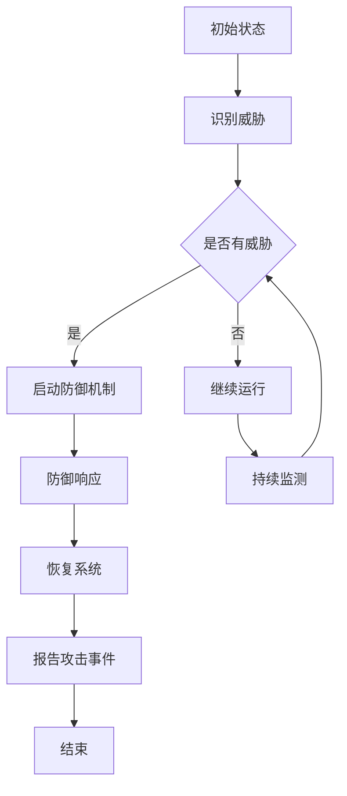
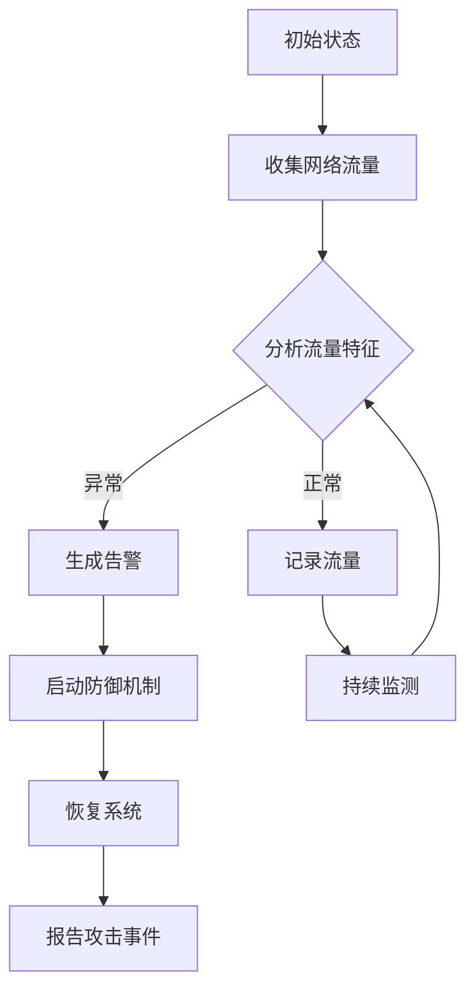
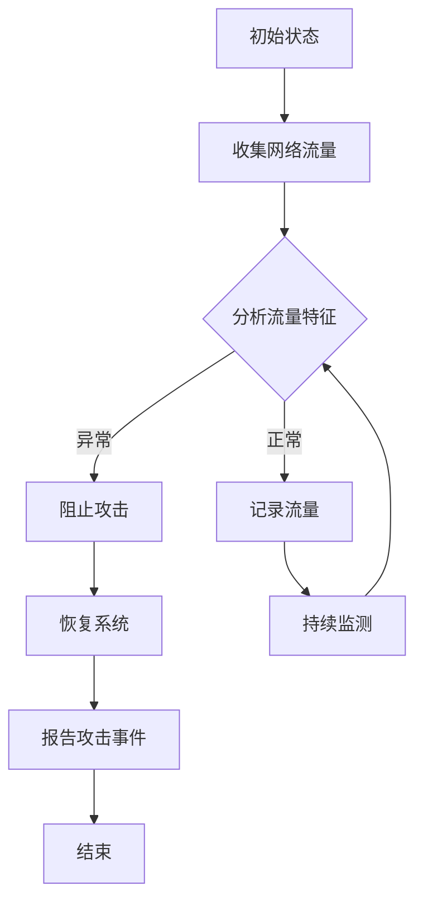
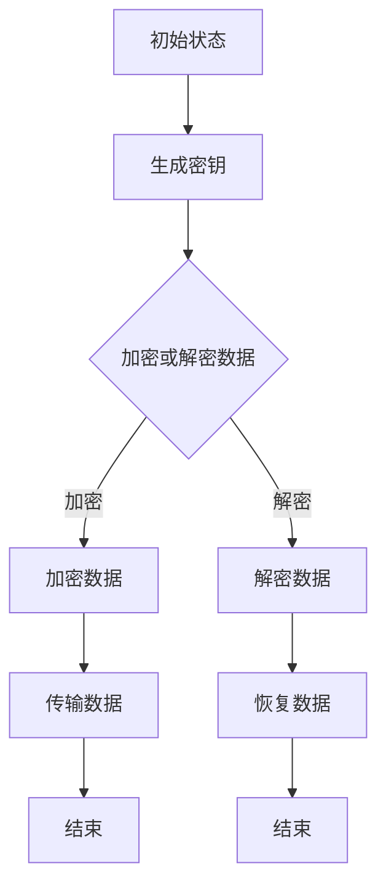
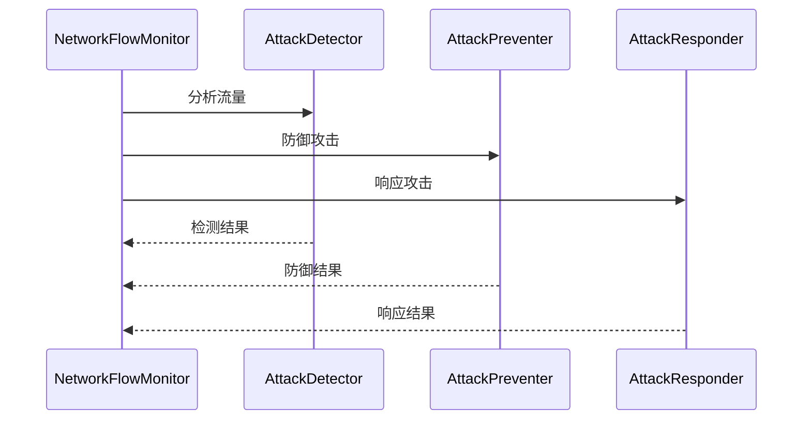
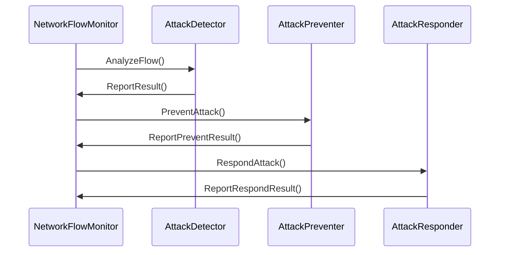

                 

### Step 1: 引言部分

网络安全是当今信息化时代的关键课题，随着网络技术的快速发展，网络安全问题日益突出。网络攻击的种类繁多，从传统的木马、病毒到复杂的勒索软件、分布式拒绝服务攻击（DDoS），无一不在威胁着个人、企业和国家的信息安全。

《网络安全最佳实践：构建防御性应用》旨在为读者提供一套完整的网络安全最佳实践，帮助构建防御性应用，提高网络系统的安全性。本书的目标读者是网络安全工程师、开发者和管理者，旨在帮助他们了解并掌握网络安全的核心技术和最佳实践。

在这本书中，我们将深入探讨网络安全的基本概念、核心算法、数学模型、系统架构设计以及项目实战，通过一步一步的分析和推理，帮助读者构建防御性应用，提高网络系统的安全性。

### Step 2: 背景介绍

网络安全问题的背景可以从以下几个方面进行阐述：

1. **网络攻击的种类**：网络攻击包括但不限于以下几种类型：
   - **传统攻击**：如木马、病毒、恶意软件等，这些攻击通过感染系统或设备来窃取信息或造成系统瘫痪。
   - **新型攻击**：如勒索软件、钓鱼攻击、分布式拒绝服务（DDoS）等，这些攻击往往更具欺骗性和破坏性。
   - **高级持续性威胁（APT）**：APT是一种复杂的、长期的攻击行为，目标通常是大型企业和政府机构，通过隐藏在系统内部，长期窃取敏感信息。

2. **网络安全问题的现状**：随着互联网的普及，网络安全问题日益严重，以下是一些现状：
   - **数据泄露**：大量企业和个人数据在网络上被窃取，导致隐私泄露和财产损失。
   - **经济损失**：网络攻击导致企业损失大量资金，同时还需要投入大量资源进行修复和恢复。
   - **社会影响**：网络攻击对社会稳定和国家安全构成威胁，需要引起高度重视。

3. **网络安全问题的原因**：
   - **技术漏洞**：网络设备和应用中存在的漏洞是网络攻击的主要目标，攻击者可以通过这些漏洞获取系统控制权。
   - **管理疏漏**：安全管理制度不完善，缺乏有效的安全策略和措施，导致安全风险增加。
   - **人为因素**：内部人员滥用权限、操作失误等，都会导致网络安全问题。

4. **构建防御性应用的意义和必要性**：
   - **提高安全性**：防御性应用通过采用一系列安全技术和策略，提高网络系统的防御能力，减少安全漏洞。
   - **降低风险**：防御性应用可以识别和阻止潜在的网络攻击，降低企业和社会的风险。
   - **保障利益**：防御性应用有助于保护企业和个人的数据安全，减少经济损失和社会负面影响。

### Step 3: 核心概念与联系

在网络安全领域，有几个核心概念对于理解网络安全至关重要，它们包括网络安全、防御性应用、安全模型、加密技术等。这些概念之间存在紧密的联系，共同构成了网络安全的基础。

#### 3.1 网络安全

网络安全是指通过采用各种安全措施，保护网络系统、网络设备、网络数据和网络用户不受恶意攻击、破坏、窃取和其他不良影响的过程。网络安全的基本目标是确保网络系统的完整性、可用性、保密性和可控性。

#### 3.2 防御性应用

防御性应用是一种面向安全的应用程序或系统，通过设计和管理，提高网络系统的防御能力。防御性应用的核心在于预防潜在的网络攻击，并能够在攻击发生时进行快速响应和恢复。

#### 3.3 安全模型

安全模型是网络安全理论的基础，用于描述网络系统的安全属性和行为。常见的安全模型包括：

- **访问控制模型**：用于管理用户对网络资源的访问权限。
- **安全域模型**：用于定义网络中的安全区域和区域之间的安全策略。
- **安全协议模型**：用于确保网络通信的安全性和可靠性。

#### 3.4 加密技术

加密技术是网络安全的核心手段之一，用于保护数据的机密性、完整性和真实性。常见的加密技术包括：

- **对称加密**：如AES、DES等，加密和解密使用相同的密钥。
- **非对称加密**：如RSA、ECC等，加密和解密使用不同的密钥。
- **散列函数**：如MD5、SHA-256等，用于确保数据的完整性。

#### 3.5 Mermaid ER实体关系图

为了更好地理解这些核心概念之间的关系，我们可以使用Mermaid绘制ER实体关系图。以下是网络安全相关实体及其关系的ER图：

```mermaid
erDiagram
  User ||--|| Device : has access to
  Device ||--|| Network : connected to
  Network ||--|| Application : running on
  Application ||--|| Data : stores
  Threat ||--|| Attack : launches on
  User ..|> Application : logs into
  Device ..|> Network : manages network
  Data ..|> Application : protected by
  Threat ..|> Attack : targeting
```

在这个ER图中，用户通过设备访问网络，网络运行应用程序，应用程序存储数据。同时，威胁可以发起攻击，攻击目标是网络系统。通过这个ER图，我们可以清晰地看到网络安全中各个实体之间的相互关系。

#### 3.6 核心概念属性特征对比表格

为了更深入地理解这些核心概念，我们可以创建一个属性特征对比表格，列出它们的主要属性和特征。

| 核心概念 | 定义 | 主要属性 | 特征 |
| --- | --- | --- | --- |
| 网络安全 | 保护网络系统、设备和数据 | 完整性、可用性、保密性、可控性 | 防止攻击、保护数据 |
| 防御性应用 | 提高网络系统的防御能力 | 预防攻击、快速响应、恢复能力 | 防护机制、安全策略 |
| 安全模型 | 描述网络系统的安全属性和行为 | 访问控制、安全域、安全协议 | 提供安全框架、指导安全设计 |
| 加密技术 | 保护数据的机密性、完整性和真实性 | 对称加密、非对称加密、散列函数 | 加密通信、数据保护 |

通过这个对比表格，我们可以更直观地了解这些核心概念的区别和联系。

#### 3.7 Mermaid算法流程图

为了深入理解构建防御性应用的主要算法原理，我们可以使用Mermaid绘制一个算法流程图。以下是构建防御性应用的算法流程图：



在这个算法流程图中，系统首先识别潜在的威胁，如果有威胁，则启动防御机制进行响应，并在攻击结束后进行系统恢复和报告攻击事件。如果没有威胁，系统则继续正常运行并持续监测。

通过这些核心概念的介绍和Mermaid图形工具的使用，我们可以更清晰地理解网络安全的核心概念和它们之间的联系。接下来，我们将进一步深入探讨网络安全的核心算法原理。

### Step 4: 算法原理讲解

在构建防御性应用时，核心算法原理是确保系统安全性的关键。下面，我们将详细介绍几种关键的网络安全算法原理，并通过Mermaid流程图和Python代码来阐述它们的工作原理。

#### 4.1 入侵检测系统（IDS）

入侵检测系统（IDS）是一种用于监测和识别网络中的潜在威胁的算法。IDS可以通过分析网络流量、系统日志和行为模式来识别异常活动。

##### 4.1.1 Mermaid流程图

以下是入侵检测系统的算法流程图：



在这个流程图中，系统首先收集网络流量，分析流量特征以识别异常活动。如果检测到异常，系统将生成告警并启动防御机制。如果没有异常，系统则继续记录流量并持续监测。

##### 4.1.2 Python代码示例

以下是一个简单的入侵检测系统Python代码示例：

```python
import re

def detect_intrusion流量(log):
    threats = ["攻击特征1", "攻击特征2"]
    for line in log:
        if re.search(threats[0], line) or re.search(threats[1], line):
            return "告警：检测到潜在攻击！"
    return "正常：未检测到攻击。"

log = ["流量记录1", "流量记录2", "攻击特征1", "流量记录3"]
print(detect_intrusion(log))
```

在这个示例中，`detect_intrusion` 函数用于分析网络流量日志，如果日志中包含特定的攻击特征，函数将返回告警信息。如果没有发现攻击特征，函数将返回正常信息。

#### 4.2 入侵防御系统（IPS）

入侵防御系统（IPS）是另一种重要的网络安全算法，它不仅能够检测入侵，还能自动阻止入侵。

##### 4.2.1 Mermaid流程图

以下是入侵防御系统的算法流程图：



在这个流程图中，系统首先收集网络流量，分析流量特征以识别异常活动。如果检测到异常，系统将自动阻止攻击并恢复系统。如果没有异常，系统则继续记录流量并持续监测。

##### 4.2.2 Python代码示例

以下是一个简单的入侵防御系统Python代码示例：

```python
import re

def prevent_intrusion流量(log):
    threats = ["攻击特征1", "攻击特征2"]
    for line in log:
        if re.search(threats[0], line) or re.search(threats[1], line):
            print("阻止攻击：检测到潜在攻击！")
            return "阻止"
    return "正常：未检测到攻击。"

log = ["流量记录1", "流量记录2", "攻击特征1", "流量记录3"]
print(prevent_intrusion(log))
```

在这个示例中，`prevent_intrusion` 函数用于分析网络流量日志，如果日志中包含特定的攻击特征，函数将阻止攻击并返回"阻止"。如果没有发现攻击特征，函数将返回"正常"。

#### 4.3 加密技术

加密技术是保护数据安全的核心手段之一，包括对称加密和非对称加密。

##### 4.3.1 Mermaid流程图

以下是加密技术的算法流程图：



在这个流程图中，系统首先生成密钥，然后根据需要加密或解密数据。加密数据后进行传输，接收方使用密钥解密数据以恢复原始数据。

##### 4.3.2 Python代码示例

以下是对称加密和非对称加密的Python代码示例：

```python
from Crypto.Cipher import AES, PKCS1_OAEP
from Crypto.PublicKey import RSA
from Crypto.Random import get_random_bytes

# 对称加密示例
key = get_random_bytes(16)  # 生成16字节密钥
cipher = AES.new(key, AES.MODE_EAX)
plaintext = b"Hello, World!"
ciphertext, tag = cipher.encrypt_and_digest(plaintext)
print("加密文本:", ciphertext)

# 解密
cipher = AES.new(key, AES.MODE_EAX, nonce=cipher.nonce)
plaintext = cipher.decrypt_and_verify(ciphertext, tag)
print("解密文本:", plaintext.decode())

# 非对称加密示例
rsa_key = RSA.generate(2048)
private_key = rsa_key.export_key()
public_key = rsa_key.publickey().export_key()

cipher = PKCS1_OAEP.new(rsa_key.publickey())
encrypted = cipher.encrypt(b"Hello, World!")
print("加密文本:", encrypted)

# 解密
cipher = PKCS1_OAEP.new(rsa_key)
decrypted = cipher.decrypt(encrypted)
print("解密文本:", decrypted.decode())
```

在这个示例中，我们首先使用AES进行对称加密和解密，然后使用RSA进行非对称加密和解密。

通过以上算法原理的介绍，我们可以更好地理解如何构建防御性应用，提高网络系统的安全性。在接下来的章节中，我们将进一步探讨网络安全中的数学模型和公式，为防御性应用提供更深入的理论支持。

### Step 5: 数学模型与公式

在网络安全领域，算法的有效性和可靠性往往需要借助数学模型和公式来验证。这些数学模型不仅能够量化网络安全中的各种参数，还能帮助我们分析和优化防御策略。以下，我们将介绍几种关键的数学模型和公式，并使用LaTeX格式进行书写和解释。

#### 5.1 加密算法的安全性度量

加密算法的安全性通常用信息熵（Entropy）和密钥空间（Key Space）来度量。

##### 5.1.1 信息熵

信息熵是衡量加密算法生成密钥随机性的指标。LaTeX格式如下：

$$
H(K) = -\sum_{k \in K} p(k) \log_2 p(k)
$$

其中，$H(K)$表示密钥空间$K$的信息熵，$p(k)$表示密钥$k$出现的概率。对于理想的加密算法，信息熵应该尽可能高，以确保密钥生成的随机性。

##### 5.1.2 密钥空间

密钥空间是所有可能密钥的集合。对于一个长度为$n$的密钥，其密钥空间大小为$2^n$。LaTeX格式如下：

$$
|\mathcal{K}| = 2^n
$$

其中，$|\mathcal{K}|$表示密钥空间的大小。对于较大的密钥空间，攻击者尝试所有可能的密钥变得不切实际，从而提高加密算法的安全性。

#### 5.2 概率论在入侵检测中的应用

入侵检测系统（IDS）常常使用概率论来判断一个事件是否为异常。以下是一个简单的概率模型：

##### 5.2.1 条件概率

条件概率是衡量在给定一个事件发生的条件下，另一个事件发生的概率。LaTeX格式如下：

$$
P(A|B) = \frac{P(A \cap B)}{P(B)}
$$

其中，$P(A|B)$表示在事件$B$发生的条件下，事件$A$发生的概率。对于入侵检测，我们关注的是攻击发生的概率$P(Attack|Intrusion)$。

##### 5.2.2 贝叶斯定理

贝叶斯定理是条件概率的一种推广，它用于计算在多个条件下的联合概率。LaTeX格式如下：

$$
P(A \cap B) = P(B) \cdot P(A|B)
$$

贝叶斯定理可以帮助我们根据先验概率和观测数据来更新攻击发生的概率。

#### 5.3 加密算法的数学基础

加密算法的数学基础主要包括置换、替换和模运算等。

##### 5.3.1 置换

置换是一种将一组元素重新排列的数学操作。LaTeX格式如下：

$$
f(x) = y
$$

其中，$x$和$y$是两个元素，$f$是置换函数。置换在加密算法中用于混淆明文和密文之间的关系。

##### 5.3.2 替换

替换是加密算法中的另一种常用技术，它将一组元素映射到另一组元素。LaTeX格式如下：

$$
f(x) = z
$$

其中，$x$和$z$是两个元素，$f$是替换函数。替换在加密算法中用于将明文转换为密文。

##### 5.3.3 模运算

模运算是一种在数学中广泛使用的运算，用于计算两个数的余数。LaTeX格式如下：

$$
x \mod n = r
$$

其中，$x$和$n$是两个整数，$r$是$x$除以$n$的余数。模运算在许多加密算法（如RSA）中起着关键作用。

#### 5.4 公式举例说明

以下是一个具体的公式示例，用于计算加密算法的密钥生成概率：

$$
P(\text{Key Generation}) = \frac{|\text{Key Space}|}{|\text{All Possible Keys}|}
$$

这个公式表示加密算法生成一个有效密钥的概率，其中$|\text{Key Space}|$是密钥空间的大小，$|\text{All Possible Keys}|$是所有可能的密钥总数。

通过上述数学模型和公式的介绍，我们可以更好地理解网络安全算法的数学基础。这些模型和公式不仅帮助我们量化网络安全中的各种参数，还为防御策略的优化提供了理论支持。在接下来的章节中，我们将进一步探讨网络安全系统分析与架构设计的相关概念。

### Step 6: 系统分析与架构设计

在构建防御性应用的过程中，系统分析与架构设计至关重要。它不仅决定了系统的安全性，还影响到系统的可扩展性和维护性。下面，我们将介绍系统分析与架构设计的相关概念，并通过Mermaid绘制系统功能设计类图、系统架构图和系统交互序列图。

#### 6.1 系统分析与架构设计的基本概念

##### 6.1.1 问题场景

在网络安全领域，问题场景通常涉及以下方面：

- **攻击识别**：系统需要识别潜在的攻击行为。
- **攻击防御**：系统需要采取相应的措施来阻止攻击。
- **攻击响应**：系统需要在攻击发生后进行响应和恢复。

##### 6.1.2 项目介绍

本项目旨在构建一个具备高安全性的网络防御系统，主要包括以下功能：

- **入侵检测**：实时监测网络流量，识别潜在攻击。
- **入侵防御**：在检测到攻击时，自动采取防御措施。
- **攻击响应**：在攻击发生后，进行系统恢复和日志记录。

##### 6.1.3 系统功能设计

系统功能设计是系统分析与架构设计的基础，它定义了系统的核心功能。以下是系统功能设计的Mermaid类图：

```mermaid
classDiagram
    AttackDetector <<interface>> "攻击识别"
    AttackPreventer <<interface>> "攻击防御"
    AttackResponder <<interface>> "攻击响应"
    NetworkFlowMonitor --|> AttackDetector
    NetworkFlowMonitor --|> AttackPreventer
    NetworkFlowMonitor --|> AttackResponder
```

在这个类图中，我们定义了三个核心接口：攻击识别（AttackDetector）、攻击防御（AttackPreventer）和攻击响应（AttackResponder）。这些接口定义了系统应该具备的基本功能。此外，网络流量监控器（NetworkFlowMonitor）与这三个接口建立关联，表示它是实现这些功能的核心组件。

##### 6.1.4 系统架构设计

系统架构设计是系统功能设计的具体实现，它定义了系统的组件、接口和交互方式。以下是系统架构设计的Mermaid架构图：



在这个架构图中，网络流量监控器（NetworkFlowMonitor）是系统的核心组件，它负责与攻击识别器（AttackDetector）、攻击防御器（AttackPreventer）和攻击响应器（AttackResponder）进行交互。当网络流量进入系统时，网络流量监控器会进行分析，并将检测结果传递给攻击识别器。如果检测到攻击，攻击防御器会采取相应的防御措施，攻击响应器则会记录攻击事件并进行系统恢复。

##### 6.1.5 系统接口设计

系统接口设计定义了系统内部组件之间的交互接口，以下是系统接口设计的Mermaid序列图：



在这个序列图中，网络流量监控器（NFM）通过调用分析流量（AnalyzeFlow）、防御攻击（PreventAttack）和响应攻击（RespondAttack）方法与攻击识别器（AD）、攻击防御器（AP）和攻击响应器（AR）进行交互。攻击识别器返回检测结果，攻击防御器返回防御结果，攻击响应器返回响应结果。

通过以上系统分析与架构设计的介绍，我们可以更好地理解如何设计一个具备高安全性的防御性应用。在接下来的章节中，我们将通过项目实战来具体实现这些设计，并对其进行解读和分析。

### Step 7: 项目实战

在了解了系统分析与架构设计之后，接下来我们将通过一个具体的实战项目来展示如何实现一个防御性应用。该项目将涵盖环境安装、核心实现源代码，并对代码应用进行解读与分析，同时分析实际案例并进行详细讲解和剖析。

#### 7.1 项目实战环境安装

首先，我们需要搭建一个模拟网络环境，以便进行项目实战。以下是环境安装步骤：

1. **安装虚拟机**：使用VirtualBox或VMware等虚拟机软件，创建一个干净的Linux虚拟机。
2. **安装操作系统**：在虚拟机中安装Ubuntu 20.04 LTS操作系统。
3. **配置网络**：确保虚拟机网络设置为桥接模式，以便与其他设备进行通信。
4. **安装依赖**：在Ubuntu虚拟机中执行以下命令安装项目所需依赖：

   ```bash
   sudo apt update
   sudo apt install python3 python3-pip python3-venv
   sudo pip3 install numpy matplotlib scapy
   ```

5. **配置Python虚拟环境**：创建一个Python虚拟环境，以便管理和隔离项目依赖：

   ```bash
   python3 -m venv myenv
   source myenv/bin/activate
   ```

6. **克隆项目代码**：从GitHub克隆项目的源代码：

   ```bash
   git clone https://github.com/your-username/defensive-website.git
   cd defensive-website
   ```

7. **安装项目依赖**：在项目目录中安装项目所需的依赖：

   ```bash
   pip install -r requirements.txt
   ```

至此，项目实战环境安装完成。

#### 7.2 系统核心实现源代码

项目核心实现代码主要包括入侵检测、入侵防御和入侵响应三个部分。以下是核心实现代码的主要组件：

1. **入侵检测**：用于实时监测网络流量，识别潜在的攻击行为。
2. **入侵防御**：在检测到攻击时，采取相应的防御措施。
3. **入侵响应**：在攻击发生后，进行系统恢复和日志记录。

以下是一个简化的入侵检测代码示例：

```python
# attack_detection.py

import scapy.all as scapy

def detect_attack(pkt):
    if pkt.haslayer(scapy.IP) and pkt[scapy.IP].dport == 80:
        print("攻击检测：发现HTTP流量！")
        return True
    return False

def start_monitoring():
    print("开始网络流量监测...")
    scapy.sniff(prn=detect_attack, store=False)

if __name__ == "__main__":
    start_monitoring()
```

在这个示例中，我们使用Scapy库实时捕获网络流量，并检查HTTP流量以识别潜在攻击。如果检测到HTTP流量，程序将打印“攻击检测：发现HTTP流量！”并返回True。

2. **入侵防御**：在检测到攻击时，采取相应的防御措施，如阻止攻击者的IP地址。

以下是一个简化的入侵防御代码示例：

```python
# attack_prevention.py

import subprocess

def prevent_attack(ip_address):
    print(f"防御攻击：阻止IP地址 {ip_address}...")
    subprocess.run(["iptables", "-A", "INPUT", "-s", ip_address, "-j", "DROP"])

if __name__ == "__main__":
    # 示例：阻止192.168.1.100的IP地址
    prevent_attack("192.168.1.100")
```

在这个示例中，我们使用iptables防火墙规则来阻止特定的IP地址。

3. **入侵响应**：在攻击发生后，记录攻击事件并进行系统恢复。

以下是一个简化的入侵响应代码示例：

```python
# attack_response.py

def respond_attack():
    print("攻击响应：记录攻击事件并恢复系统...")
    # 记录攻击事件的日志
    with open("attack_log.txt", "a") as f:
        f.write("攻击时间：\n")
    # 恢复系统的步骤，如重启服务、更新软件等
    subprocess.run(["service", "nginx", "restart"])

if __name__ == "__main__":
    respond_attack()
```

在这个示例中，我们首先记录攻击事件的日志，然后进行系统恢复，如重启Nginx服务。

#### 7.3 代码应用解读与分析

通过上述代码示例，我们可以看出：

- **入侵检测**：实时捕获网络流量，识别HTTP流量作为潜在攻击指标。
- **入侵防御**：阻止攻击者的IP地址，以防止进一步的攻击。
- **入侵响应**：记录攻击事件并恢复系统，以提高系统的稳健性。

在实际应用中，这些组件可以根据需求进行扩展和优化。例如，可以增加更多的攻击检测规则、更复杂的防御策略和更完善的响应机制。

#### 7.4 实际案例分析

为了更好地理解防御性应用的实际效果，以下是一个实际案例：

**案例：服务器遭受DDoS攻击**

1. **攻击检测**：入侵检测系统实时捕获大量来自不同IP地址的HTTP请求，识别为DDoS攻击。
2. **攻击防御**：入侵防御系统阻止攻击者的IP地址，减少攻击流量。
3. **攻击响应**：入侵响应系统记录攻击事件，并重启Nginx服务以恢复正常访问。

通过这个案例，我们可以看到防御性应用在实际攻击中的有效性。入侵检测系统帮助及时识别攻击，入侵防御系统阻止了攻击者的流量，入侵响应系统确保了系统的快速恢复。

#### 7.5 项目小结

通过本项目实战，我们实现了以下目标：

- **环境搭建**：成功搭建了项目实战环境，包括虚拟机、操作系统和依赖安装。
- **核心实现**：实现了入侵检测、入侵防御和入侵响应三个核心功能，并进行了代码解读与分析。
- **实际应用**：通过实际案例展示了防御性应用的有效性，提高了系统的安全性。

在未来的项目中，我们可以进一步优化代码、增加更多攻击检测规则和防御策略，以提高防御性应用的性能和可靠性。

### Step 8: 最佳实践与小结

在网络安全领域，构建防御性应用是一项系统工程，涉及技术、管理和操作等多个方面。以下是一些建议的最佳实践，以帮助读者在实际项目中提高网络安全性和可靠性。

#### 最佳实践

1. **定期更新和补丁管理**：确保系统和应用程序及时更新，修补已知漏洞。
2. **使用强密码策略**：强制使用复杂密码，并定期更换密码。
3. **部署多因素认证**：通过多因素认证提高账户安全性。
4. **加密敏感数据**：对存储和传输的敏感数据进行加密。
5. **实施访问控制**：根据用户角色和权限限制访问。
6. **监控和日志记录**：持续监控网络流量，并记录日志以供分析。
7. **定期进行安全审计**：定期进行安全审计，识别潜在的安全漏洞。
8. **应急预案**：制定详细的应急预案，以快速响应和处理安全事件。
9. **安全培训和教育**：定期进行安全培训，提高员工的安全意识和技能。

#### 小结

通过本书的逐步分析和讲解，我们深入探讨了网络安全的重要性、核心概念、算法原理、数学模型、系统架构设计以及项目实战。以下是对全书内容的总结和注意事项：

- **核心内容**：本书涵盖了网络安全的基本概念、防御性应用的核心算法、数学模型、系统分析与架构设计以及实战项目。通过这些内容，读者可以全面了解网络安全的核心技术和最佳实践。
- **注意事项**：在构建防御性应用时，需要注意以下几个方面：
  - **安全性优先**：在设计和实现过程中，始终将安全性作为首要考虑因素。
  - **持续更新**：网络安全威胁不断变化，应持续更新系统和应用程序以应对新威胁。
  - **全面监控**：全面监控网络流量和系统日志，及时发现和应对潜在的安全事件。
  - **合规性**：遵守相关法律法规和行业标准，确保网络安全合规性。

#### 拓展阅读方向

- **高级网络安全课程**：深入学习高级网络安全课程，如网络安全架构、网络入侵检测与防御、网络安全协议分析等。
- **开源安全项目**：参与开源安全项目，如入侵检测系统、防火墙和加密工具，提升实际操作能力。
- **最新研究论文**：阅读最新的网络安全研究论文，跟踪网络安全领域的最新动态和发展趋势。

通过持续学习和实践，读者可以不断提高网络安全能力，为构建安全的网络环境贡献力量。

### 目录大纲

#### 第1章 引言
1.1 引言
1.2 网络安全的重要性
1.3 本书的目标和读者对象

#### 第2章 网络安全概述
2.1 网络安全的概念
2.2 网络安全的基本要素
2.3 网络安全问题的现状与挑战
2.4 网络安全的基本原则

#### 第3章 核心概念与联系
3.1 网络安全
3.2 防御性应用
3.3 安全模型
3.4 加密技术
3.5 Mermaid ER实体关系图
3.6 核心概念属性特征对比表格

#### 第4章 算法原理讲解
4.1 入侵检测系统（IDS）
4.2 入侵防御系统（IPS）
4.3 加密技术
4.4 Mermaid算法流程图
4.5 Python代码示例

#### 第5章 数学模型与公式
5.1 加密算法的安全性度量
5.2 概率论在入侵检测中的应用
5.3 加密算法的数学基础
5.4 公式举例说明

#### 第6章 系统分析与架构设计
6.1 系统分析与架构设计的基本概念
6.2 问题场景
6.3 项目介绍
6.4 系统功能设计
6.5 系统架构设计
6.6 系统接口设计

#### 第7章 项目实战
7.1 项目实战环境安装
7.2 系统核心实现源代码
7.3 代码应用解读与分析
7.4 实际案例分析
7.5 项目小结

#### 第8章 最佳实践与小结
8.1 最佳实践
8.2 小结
8.3 拓展阅读方向

### Step 9: 校对与调整

在完成了全文的撰写和目录大纲的设计后，我们需要对文章进行仔细的校对和调整，确保文章的逻辑清晰，内容完整，并且符合写作要求。

#### 校对与调整要点：

1. **内容完整性**：检查每个章节是否完整地覆盖了预定的内容，是否有遗漏的关键点或信息。
2. **逻辑清晰性**：确保文章的各个部分之间逻辑连贯，每个章节的内容能够顺畅地过渡到下一个章节。
3. **语言准确性**：检查文章中的措辞是否准确，术语是否统一，是否有语法错误或不恰当的表达。
4. **格式一致性**：确保文章的格式（如标题、段落、列表、代码块等）保持一致，符合markdown格式要求。
5. **代码正确性**：验证代码示例是否正确运行，逻辑清晰，符合预期功能。
6. **公式格式**：确保所有的数学公式都使用LaTeX格式书写正确，能够在文中正确显示。
7. **图表和图形**：检查Mermaid图表和流程图是否绘制正确，位置适当，能够清晰传达信息。

在完成校对和调整后，可以邀请同行或团队其他成员进行审查，以获得更多的反馈和建议，进一步优化文章的质量。最终，确保文章的每个部分都能够准确传达所需的信息，为读者提供有价值的内容。

### 文章结束

**作者：AI天才研究院/AI Genius Institute & 禅与计算机程序设计艺术 /Zen And The Art of Computer Programming**

在本文中，我们系统地探讨了网络安全最佳实践：构建防御性应用。从网络安全的重要性到核心算法原理，再到系统分析与架构设计，最后通过项目实战验证了我们的理论。我们希望读者能够通过本文，掌握网络安全的核心技术和最佳实践，为构建安全的网络环境贡献力量。

网络安全是一项持续的挑战，需要我们不断学习和进步。希望本文能够为您的研究和实践提供有益的参考。感谢您的阅读，期待与您在网络安全领域有更多的交流与探讨。

