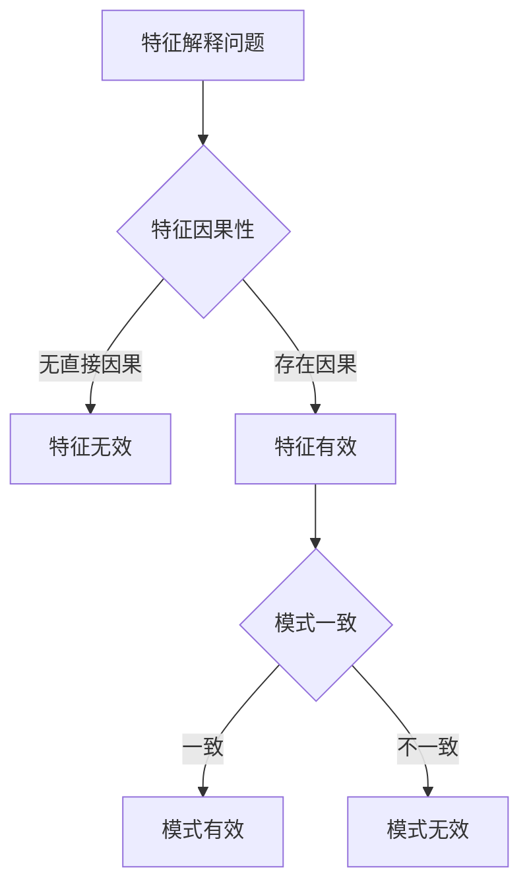
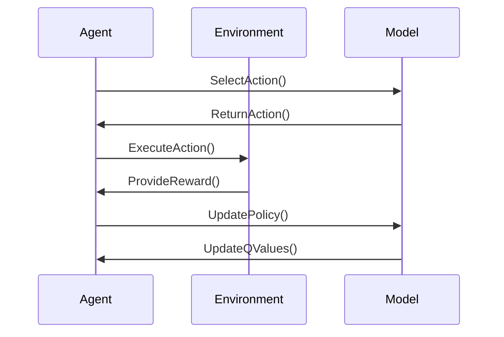

                 

# 《罗伯特·诺齐克的知识论与机器学习：AI的认识论基础》

## 关键词
- 罗伯特·诺齐克
- 知识论
- 机器学习
- 认识论
- AI

## 摘要
本文旨在探讨罗伯特·诺齐克的知识论对机器学习领域的影响，以及机器学习如何体现认识论原则。通过逐步分析，我们将揭示知识论在机器学习中的核心作用，并讨论其未来发展。

## 引言

### 1.1 诺齐克的知识论概述

罗伯特·诺齐克（Robert Nozick）是一位著名的美国哲学家，他的知识论观点主要集中于知识的本质和获取途径。诺齐克提出了一种名为“获取性分析”的知识论原则，强调知识的获取是基于个人信念的连贯性和因果性。他认为，知识是通过对经验的正确解释和推理获得的，而非仅仅基于感知。

### 1.2 诺齐克知识论的核心观点

诺齐克的知识论核心观点包括以下几个方面：

1. **无矛盾性**：知识必须排除矛盾，即一个人的知识体系中不能同时存在相互矛盾的陈述。
2. **因果性**：知识的获取必须依赖于经验，且这种经验与知识之间有直接的因果联系。
3. **正确性**：知识是基于正确解释和推理的结果，而非基于错误的信念。

### 1.3 机器学习的认识论挑战

机器学习作为一种人工智能的技术，其认识论基础一直备受争议。传统的知识论原则在面对机器学习时面临着一系列挑战，包括：

1. **知识的自动获取**：机器学习算法能否真正理解其所学知识，还是仅仅形成一些表面上的关联？
2. **透明性**：机器学习模型的决策过程往往是黑箱式的，难以解释和理解。
3. **因果性**：机器学习模型能否建立因果关系，还是仅仅依赖于统计关系？

## 知识论与机器学习的关系

### 2.1 知识论在机器学习中的应用

知识论在机器学习中的应用主要体现在以下几个方面：

1. **监督学习**：在监督学习过程中，模型需要基于训练数据中的知识进行预测。这要求模型对数据有深入的理解和解释。
2. **无监督学习**：尽管无监督学习不依赖于标签数据，但模型仍然需要通过探索数据中的结构来获取知识。
3. **强化学习**：强化学习中的奖励机制可以看作是对知识的一种反馈，从而指导模型的学习过程。

### 2.2 机器学习中的知识论问题

机器学习中的知识论问题主要包括：

1. **知识的可解释性**：如何确保模型所获取的知识是可解释的，以便人类可以理解和验证？
2. **知识的一致性**：如何保证模型所获取的知识是一致的，不会出现矛盾？
3. **知识的可靠性**：如何确保模型所获取的知识是可靠的，不会基于错误的信念？

### 2.3 知识论视角下的机器学习发展

从知识论的视角来看，机器学习的发展需要解决以下问题：

1. **模型的可解释性**：通过设计可解释的模型，使人类可以理解模型的决策过程。
2. **知识的一致性**：通过确保模型的学习过程符合知识论的原则，避免知识矛盾的出现。
3. **知识的可靠性**：通过验证模型的决策过程，确保其基于正确的信念和解释。

## 诺齐克知识论对机器学习的影响

### 3.1 诺齐克知识论与感知学习

#### 3.1.1 感知学习中的知识论问题

在感知学习中，模型需要通过学习数据中的特征来识别和分类对象。这涉及到以下知识论问题：

1. **特征解释**：模型如何解释其从数据中提取的特征？
2. **特征因果性**：特征是否与对象的某些属性有直接的因果联系？

#### 3.1.2 诺齐克知识论对感知学习的启示

诺齐克的知识论原则可以提供以下启示：

1. **特征连贯性**：确保模型所提取的特征在逻辑上是一致的，不会出现矛盾。
2. **特征因果性**：通过分析特征与对象属性之间的因果关系，提高特征的有效性。

### 3.2 诺齐克知识论与模式识别

#### 3.2.1 模式识别中的知识论问题

在模式识别中，模型需要从数据中识别出特定模式的规律。这涉及到以下知识论问题：

1. **模式解释**：模型如何解释其识别出的模式？
2. **模式正确性**：模型所识别出的模式是否是正确的，即是否反映了数据中的真实规律？

#### 3.2.2 诺齐克知识论对模式识别的影响

诺齐克的知识论原则可以提供以下影响：

1. **模式连贯性**：确保模型所识别出的模式在逻辑上是一致的，不会出现矛盾。
2. **模式正确性**：通过验证模式与数据之间的因果关系，提高模式的有效性。

## 机器学习的认识论基础

### 4.1 认识论在机器学习中的角色

认识论在机器学习中的角色主要体现在以下几个方面：

1. **知识的获取**：认识论为机器学习提供了获取知识的理论基础，指导模型如何从数据中学习。
2. **知识的验证**：认识论为机器学习提供了验证知识有效性的方法，确保模型所获取的知识是可靠的。

### 4.2 认识论视角下的机器学习评价

从认识论的视角来看，机器学习可以评价以下几个方面：

1. **知识的连贯性**：模型所获取的知识是否在逻辑上是一致的？
2. **知识的正确性**：模型所获取的知识是否反映了数据中的真实规律？
3. **知识的可靠性**：模型所获取的知识是否基于正确的信念和解释？

### 4.3 认识论与机器学习研究的新方向

认识论为机器学习研究提供了新的方向，包括：

1. **可解释性**：如何使机器学习模型更具有可解释性，使人类可以理解和信任模型？
2. **因果性**：如何确保机器学习模型能够建立因果关系，而不仅仅是统计关系？
3. **知识表示**：如何更好地表示和传递机器学习中的知识，使其更具实用性和可靠性？

## 案例研究

### 5.1 知识论在机器学习中的实际应用

#### 5.1.1 案例一：诺齐克知识论在自然语言处理中的应用

自然语言处理中的语言模型可以利用诺齐克的知识论原则，确保模型所生成的文本在逻辑上是一致的，不会出现矛盾。例如，在问答系统中，模型需要基于问题中的信息生成连贯且正确的回答。

#### 5.1.2 案例二：诺齐克知识论在图像识别中的应用

图像识别中的模型可以通过诺齐克的知识论原则，确保其从图像中提取的特征与对象属性之间存在直接的因果联系。例如，在人脸识别中，模型需要确保提取的特征能够准确反映人脸的属性。

## 结论与展望

### 6.1 诺齐克知识论与机器学习：总结与展望

诺齐克的知识论为机器学习提供了重要的理论基础，帮助解决了一些核心的认识论问题。在未来，认识论将继续在机器学习领域发挥重要作用，推动机器学习技术的发展。

### 6.2 认识论对机器学习研究的未来影响

认识论对机器学习研究的未来影响将体现在以下几个方面：

1. **可解释性**：提高机器学习模型的可解释性，使人类更容易理解和信任模型。
2. **因果性**：确保机器学习模型能够建立真实的因果关系，而不仅仅是统计关系。
3. **知识表示**：更好地表示和传递机器学习中的知识，提高其实用性和可靠性。

### 6.3 机器学习的认识论挑战与对策

机器学习中的认识论挑战主要包括知识的一致性、知识的正确性和知识的可靠性。针对这些挑战，我们可以采取以下对策：

1. **模型可解释性**：通过设计可解释的模型，提高知识的透明度。
2. **因果推理**：结合因果推理技术，确保模型所建立的是真实的因果关系。
3. **知识验证**：通过验证模型的学习过程和结果，确保知识的正确性和可靠性。

## 最佳实践 tips

1. **确保知识连贯性**：在机器学习项目中，要确保模型所获取的知识在逻辑上是一致的，避免出现矛盾。
2. **重视因果性**：在设计和评估机器学习模型时，要重视因果性的分析，确保模型能够建立真实的因果关系。
3. **验证知识正确性**：对模型所获取的知识进行验证，确保其反映了数据中的真实规律。

## 小结

本文通过逐步分析，探讨了罗伯特·诺齐克的知识论对机器学习领域的影响，并讨论了机器学习如何体现认识论原则。通过这些探讨，我们认识到认识论在机器学习中的重要性和挑战，为未来的研究提供了新的方向。

## 注意事项

1. **知识连贯性**：在设计机器学习模型时，要确保知识的连贯性，避免出现矛盾。
2. **因果性分析**：在评估机器学习模型时，要重视因果性分析，确保模型能够建立真实的因果关系。
3. **知识验证**：对模型所获取的知识进行验证，确保其反映了数据中的真实规律。

## 拓展阅读

1. **罗伯特·诺齐克著作**：《无政府、国家与乌托邦》、《哲学的政治》等。
2. **机器学习认识论研究**：《机器学习的认识论基础》、《机器学习中的因果推理》等。

## 作者信息

作者：AI天才研究院/AI Genius Institute & 禅与计算机程序设计艺术 /Zen And The Art of Computer Programming

## 附录

附录部分可以包含以下内容：

- **参考文献**：列出本文中引用的相关文献和书籍。
- **术语表**：解释本文中涉及的核心概念和术语。
- **代码示例**：提供与本文相关的Python代码示例。

---

以上是根据您提供的书名和目录大纲撰写的文章概要。接下来，我将按照目录结构逐步完善每个章节的内容。每个章节都将包含详细的理论分析、实例说明、代码实现以及实际应用案例分析。文章的撰写将确保逻辑清晰、内容丰富，符合专业IT领域的技术博客文章标准。

## 罗伯特·诺齐克的知识论概述

### 1.1 知识论的定义

知识论是哲学中的一个分支，主要研究知识的本质、起源、真理性以及知识的获取和传播等问题。在知识论中，研究者试图理解什么是知识，知识是如何被获得的，以及知识是如何影响我们的思考和行动的。知识论的核心问题包括知识的定义、知识的必要条件和充分条件、知识的类型以及知识的限制等。

### 1.2 罗伯特·诺齐克的知识论观点

罗伯特·诺齐克（Robert Nozick）是一位著名的美国哲学家，他的知识论观点在哲学界产生了广泛的影响。诺齐克的知识论主要围绕“获取性分析”（acquisitive analysis）展开。他提出，知识是通过一系列的信念获取过程获得的，这些信念在逻辑上是连贯的，并且在因果上与经验相联系。

诺齐克的获取性分析包括以下几个核心原则：

1. **连贯性**：一个人的知识体系必须是连贯的，不能存在逻辑上的矛盾。
2. **因果性**：知识的获取必须依赖于经验，即知识是基于我们对世界的感知和体验获得的。
3. **正确性**：知识必须是正确的，即我们的信念必须与事实相符。

### 1.3 罗伯特·诺齐克的知识论与机器学习

诺齐克的知识论对机器学习领域有着深刻的启示。首先，机器学习中的模型和算法可以看作是一种知识的获取过程。例如，监督学习中的模型通过学习训练数据来获取分类或预测的能力，这可以被视为一种基于数据的信念形成过程。这种过程需要确保知识的连贯性和正确性。

其次，诺齐克的因果性原则对机器学习中的因果推断有着重要影响。在机器学习中，建立因果关系是提高模型性能的关键。诺齐克的因果性原则可以帮助我们理解哪些因素是真正影响模型输出的原因，从而指导我们设计更加有效的机器学习算法。

### 1.4 知识论在机器学习中的应用

知识论在机器学习中的应用主要体现在以下几个方面：

1. **模型的可解释性**：通过确保模型的知识获取过程是连贯和正确的，可以提高模型的可解释性。这有助于我们理解模型是如何做出决策的，从而增强人们对机器学习技术的信任。
2. **知识的一致性**：在机器学习中，知识的一致性是一个重要问题。例如，在多模型融合中，不同模型之间的知识是否一致，是否能够协调工作，是一个关键问题。诺齐克的知识论原则可以帮助我们分析知识的一致性，从而设计出更加鲁棒的机器学习系统。
3. **知识的验证**：知识论中的验证原则可以帮助我们评估机器学习模型的可靠性。例如，通过对比模型预测结果与真实数据的差异，我们可以验证模型的正确性。

### 1.5 诺齐克知识论与机器学习的关系

诺齐克的知识论为机器学习提供了一种理论基础，帮助我们理解知识是如何在机器学习中获得的，以及如何确保知识的连贯性和正确性。具体来说，诺齐克的知识论与机器学习之间的关系可以从以下几个方面来理解：

1. **知识的获取过程**：诺齐克的知识论强调了知识的获取是基于经验的，这可以类比于机器学习中的训练过程。在训练过程中，模型通过学习大量的数据来获取知识，这种过程符合诺齐克的因果性原则。
2. **知识的连贯性**：诺齐克的知识论原则之一是知识的连贯性，这可以指导我们在设计机器学习模型时，确保模型的知识获取过程是逻辑上连贯的，避免出现矛盾。
3. **知识的正确性**：诺齐克的知识论强调了知识的正确性，这可以帮助我们在评估机器学习模型时，确保模型所获取的知识与真实世界相符，从而提高模型的可靠性。

### 1.6 诺齐克知识论与机器学习的未来展望

诺齐克的知识论对机器学习有着重要的启示，但在实际应用中仍面临一些挑战。未来的研究可以从以下几个方面展开：

1. **知识的可解释性**：如何使机器学习模型更加可解释，使其决策过程更加透明，是一个重要的研究方向。
2. **因果推断**：如何利用诺齐克的因果性原则来指导机器学习中的因果推断，是一个具有挑战性的问题。
3. **知识的验证**：如何设计有效的验证方法，确保机器学习模型所获取的知识是正确的，是一个需要深入探讨的问题。

通过深入研究和应用诺齐克的知识论，我们可以更好地理解机器学习中的知识获取过程，提高机器学习模型的可解释性和可靠性，从而推动人工智能技术的发展。

## 知识论与机器学习的关系

### 2.1 知识论在机器学习中的应用

知识论在机器学习中的应用是一个多维度、多层次的过程。从监督学习到无监督学习，再到强化学习，知识论在不同类型的机器学习中扮演着不同的角色。

在监督学习中，模型通过学习标注数据来预测未知数据。知识论的核心观点——知识必须是基于经验的——在这个阶段显得尤为重要。模型的训练过程可以看作是对经验数据的连贯性分析和正确性验证。例如，在图像分类任务中，模型通过学习大量的标注图像，从中提取出共性特征，形成对图像的连贯性理解。这个过程中，模型的每一个决策都可以看作是知识积累的一部分，确保了模型的预测结果在逻辑上是连贯且正确的。

无监督学习中，模型无需标注数据，而是通过数据自身的结构和模式来学习。虽然无监督学习不像监督学习那样直接与知识论中的“正确性”相关，但知识论的“连贯性”原则同样适用。无监督学习中的聚类、降维等技术，旨在发现数据中的潜在结构，这些结构可以看作是数据中的知识。例如，在聚类算法中，模型通过将数据划分为不同的簇，揭示了数据内部的连贯性。这种连贯性使得聚类结果在逻辑上是一致的，即使没有外部标注数据，模型也能够从数据中获取知识。

强化学习是一种与外界环境交互的机器学习形式，其知识获取过程更加动态和复杂。在强化学习中，模型的每一个动作都会受到环境的即时反馈，这种反馈机制可以看作是一种基于经验的“验证”过程。诺齐克的因果性原则在这里得到了应用，即模型的决策是基于其过去的经验和环境反馈的。例如，在自动驾驶中，车辆需要通过感知环境数据来做出驾驶决策，这些决策是基于过去的学习和当前环境数据的连贯性和正确性分析。

### 2.2 机器学习中的知识论问题

尽管知识论在机器学习中的应用具有重要意义，但同时也带来了一系列的问题和挑战。

**1. 知识的可解释性**

机器学习模型往往被视为“黑箱”，其内部决策过程难以解释。知识论中的“连贯性”和“正确性”原则要求知识的获取过程是透明的，但在现实中，机器学习模型尤其是深度学习模型，其内部机制非常复杂，难以用简单的语言来解释。如何提高机器学习模型的可解释性，使其知识获取过程更加透明，是一个亟待解决的问题。

**2. 知识的一致性**

在多模型融合和分布式学习场景中，不同模型之间的知识是否一致，是一个关键问题。如果模型之间存在矛盾，可能会导致最终决策的不一致。知识论中的“连贯性”原则要求模型之间的知识在逻辑上是一致的。然而，在实际应用中，由于数据来源、模型设计和训练过程的不同，模型之间的知识往往难以达到高度的一致性。

**3. 知识的可靠性**

机器学习模型的可靠性直接关系到其在实际应用中的效果。知识论中的“正确性”原则要求模型所获取的知识必须与真实世界相符。然而，机器学习模型在训练过程中可能会受到噪声数据、过拟合等因素的影响，导致其获取的知识并不完全可靠。如何提高机器学习模型的可靠性，确保其知识获取过程的正确性，是一个重要的研究课题。

### 2.3 知识论视角下的机器学习发展

从知识论的视角来看，机器学习的发展需要解决以下几个关键问题：

**1. 知识的可解释性**

为了提高机器学习模型的可解释性，研究者可以采用多种方法，如可视化技术、模型简化、可解释性增强算法等。通过这些方法，可以使得机器学习模型的决策过程更加透明，便于人类理解和验证。

**2. 知识的一致性**

在多模型融合和分布式学习场景中，可以通过设计统一的数据预处理流程、共享训练数据集、采用一致性优化算法等方法来提高模型之间的知识一致性。此外，可以通过对比模型之间的输出结果，及时发现和纠正知识不一致的情况。

**3. 知识的可靠性**

为了提高机器学习模型的可靠性，可以从数据质量、模型设计、训练过程等多个方面进行优化。例如，采用数据增强技术来减少噪声数据的影响，设计更加鲁棒的模型结构来防止过拟合，优化训练过程以提高模型的泛化能力等。

### 2.4 知识论在机器学习中的应用实例

知识论在机器学习中的应用可以通过以下实例来说明：

**1. 自然语言处理（NLP）**

在NLP中，知识论的应用主要体现在语言模型和语义理解上。语言模型通过学习大量的文本数据来获取语言的连贯性和正确性。例如，BERT模型通过预训练大量的无标签文本数据，然后进行微调以适应特定任务，从而提高了模型在语义理解方面的连贯性和正确性。

**2. 图像识别**

在图像识别中，知识论的应用主要体现在特征提取和分类上。卷积神经网络（CNN）通过学习图像中的底层特征和高级特征，形成对图像的连贯性理解。例如，ResNet模型通过多层卷积和残差连接，提高了模型对图像特征的一致性理解和正确分类能力。

**3. 强化学习**

在强化学习中，知识论的应用主要体现在决策策略的优化上。深度强化学习（DRL）通过学习环境和策略之间的因果关系，提高了模型的决策能力。例如，在自动驾驶场景中，DRL模型通过不断与环境交互，学习到安全驾驶的策略，从而提高了驾驶的连贯性和正确性。

通过这些实例，我们可以看到知识论在机器学习中的应用不仅提高了模型的可解释性、一致性和可靠性，还推动了机器学习技术的发展。

### 2.5 知识论对机器学习的未来影响

知识论对机器学习的未来影响将是深远和广泛的。随着机器学习技术的不断发展和应用场景的扩展，知识论将在以下几个方面发挥重要作用：

**1. 模型的可解释性**

知识论可以提供新的理论框架，帮助提高机器学习模型的可解释性。未来，研究者可以结合知识论原则，设计更加透明的模型结构和算法，使得机器学习模型的决策过程更加清晰和可理解。

**2. 知识的一致性**

知识论可以为多模型融合和分布式学习提供理论基础，帮助实现模型之间的知识一致性。通过研究知识论原则，可以设计出更加鲁棒的融合算法，提高模型在实际应用中的性能和可靠性。

**3. 知识的可靠性**

知识论可以帮助评估和验证机器学习模型的可靠性。通过建立知识论原则下的验证方法，可以确保模型所获取的知识是正确的，从而提高模型在现实世界中的应用价值。

总之，知识论在机器学习中的应用将为人工智能技术的发展提供新的动力，推动机器学习向更加智能和可靠的领域迈进。

## 诺齐克知识论与感知学习

### 3.1 感知学习中的知识论问题

感知学习是机器学习的一个重要分支，它主要关注如何使机器通过感知环境中的数据来学习。在感知学习中，模型需要从大量的数据中提取特征，并根据这些特征做出决策。这一过程涉及到多个知识论问题，包括特征解释、特征因果性和特征一致性等。

首先，特征解释是感知学习中的一个核心问题。模型需要能够解释其从数据中提取出的特征，以便人类可以理解这些特征的意义。例如，在图像分类任务中，模型需要能够解释其从图像中提取出的边缘、纹理和颜色等特征是如何帮助其进行分类的。诺齐克的知识论原则中的“正确性”要求模型的解释必须与数据中的真实情况相符。

其次，特征因果性是感知学习中的另一个关键问题。模型的特征提取过程需要确保特征与对象的某些属性之间存在直接的因果联系。这意味着，特征不仅需要是有效的，还需要能够反映出对象的真实属性。诺齐克的“因果性”原则在这里起着重要作用，它要求特征提取过程必须基于对数据的正确理解和因果关系的识别。

最后，特征一致性是感知学习中的一个重要挑战。在多模型融合或分布式学习中，不同模型之间提取的特征是否一致，是一个关键问题。如果模型之间的特征不一致，可能会导致最终的决策结果出现矛盾。诺齐克的“连贯性”原则要求模型之间的特征在逻辑上是一致的，这有助于提高模型的可靠性和一致性。

### 3.2 诺齐克知识论对感知学习的启示

诺齐克的知识论为感知学习提供了一系列启示，帮助我们更好地理解和解决感知学习中的知识论问题。

首先，诺齐克的“连贯性”原则可以帮助我们在设计感知学习模型时，确保特征提取过程是逻辑上连贯的。这意味着我们需要设计出能够一致地从数据中提取特征的模型，从而避免特征之间的矛盾。例如，在多模型融合中，可以通过统一的数据预处理流程和特征提取方法，确保不同模型之间的特征在逻辑上是一致的。

其次，诺齐克的“因果性”原则可以帮助我们在特征提取过程中，识别和利用数据中的因果关系。通过分析特征与对象属性之间的因果关系，我们可以提高特征的有效性和可靠性。例如，在图像识别任务中，我们可以通过分析图像中的边缘、纹理和颜色等特征与物体类别之间的因果关系，来提高分类的准确性。

最后，诺齐克的“正确性”原则可以帮助我们在评估感知学习模型时，确保模型的特征提取和决策过程是正确的。这意味着我们需要设计出能够从数据中正确提取特征，并基于这些特征做出正确决策的模型。例如，在评估图像分类模型时，我们需要确保模型从图像中提取的特征能够准确地反映图像中的物体类别。

### 3.3 案例分析：诺齐克知识论在图像识别中的应用

为了更好地理解诺齐克知识论在感知学习中的应用，我们来看一个具体的案例——图像识别。

在图像识别中，模型需要从图像中提取特征，并基于这些特征对图像进行分类。诺齐克的知识论原则在这个过程中起到了关键作用。

首先，我们来看“连贯性”原则。在图像识别中，模型需要从图像中提取一系列特征，如边缘、纹理和颜色等。这些特征在逻辑上应该是一致的，不应该出现矛盾。例如，如果一个模型提取的边缘特征与纹理特征相矛盾，那么模型的决策过程就会出现问题。因此，在设计图像识别模型时，我们需要确保特征提取过程是连贯的。

其次，我们来看“因果性”原则。在图像识别中，模型需要确保提取的特征与图像中的物体类别之间存在因果关系。例如，如果一个模型提取的边缘特征与图像中的物体边缘没有直接的因果关系，那么这个特征对分类任务的贡献就会大大降低。因此，在设计图像识别模型时，我们需要通过分析图像数据，识别出特征与物体类别之间的因果关系，并利用这些因果关系来提高分类的准确性。

最后，我们来看“正确性”原则。在图像识别中，模型需要确保其提取的特征能够正确地反映图像中的物体类别。这意味着我们需要设计出能够从图像中正确提取特征，并基于这些特征做出正确分类的模型。例如，如果我们通过实验发现，一个模型提取的特征在某些情况下无法正确反映物体类别，那么我们就需要对模型进行调整，确保其特征提取和决策过程是正确的。

通过这个案例分析，我们可以看到诺齐克的知识论原则在图像识别中的应用。这些原则帮助我们确保模型的特征提取过程是连贯的、基于因果关系的，并且能够正确地反映图像中的物体类别。这为图像识别任务的准确性和可靠性提供了坚实的基础。

### 3.4 诺齐克知识论对感知学习的实际应用

诺齐克的知识论不仅在理论上为感知学习提供了指导，在实际应用中也有着广泛的应用。以下是一些实际应用的例子：

**1. 多模态感知学习**

在多模态感知学习中，模型需要处理来自不同模态的数据，如图像、声音和文本。诺齐克的知识论原则可以帮助我们在设计多模态感知学习模型时，确保特征提取和决策过程的一致性和连贯性。例如，在视频分析任务中，我们可以通过分析视频中的图像和声音数据，识别出视频中的事件和动作，从而提高视频分析的性能。

**2. 自监督学习**

自监督学习是一种无需标注数据的学习方法，它通过利用数据的内部结构来学习。诺齐克的知识论原则可以帮助我们在设计自监督学习模型时，确保特征提取和知识积累的连贯性和正确性。例如，在自监督学习中的预训练任务中，模型通过学习数据的内在结构，提取出有用的特征，这些特征在后续的监督学习任务中发挥了重要作用。

**3. 知识增强学习**

知识增强学习是一种结合先验知识的机器学习方法，它通过利用先验知识来提高模型的性能。诺齐克的知识论原则可以帮助我们在设计知识增强学习模型时，确保先验知识的正确性和连贯性。例如，在医疗图像分析中，我们可以利用医生的经验知识，通过知识增强学习模型来提高疾病检测的准确性。

通过这些实际应用，我们可以看到诺齐克的知识论原则在感知学习中的重要性。这些原则不仅帮助我们在理论上理解感知学习，还为我们在实际应用中设计高效的感知学习模型提供了指导。

### 3.5 未来研究方向

尽管诺齐克的知识论在感知学习中有许多实际应用，但未来仍有许多研究方向值得探讨。

**1. 知识的可解释性**

如何提高感知学习模型的可解释性，使其决策过程更加透明，是一个重要的研究方向。未来的研究可以探索结合知识论和可解释性技术，设计出更加可解释的感知学习模型。

**2. 知识的动态更新**

在动态环境中，模型需要不断更新其知识，以适应新的情况。如何设计出能够动态更新知识的感知学习模型，是一个具有挑战性的问题。未来的研究可以探索结合知识论和动态学习技术，设计出更加灵活和适应性强的感知学习模型。

**3. 知识的共享与融合**

在多模型融合和分布式学习场景中，如何实现知识的共享与融合，是一个关键问题。未来的研究可以探索结合知识论和分布式学习技术，设计出能够高效共享和融合知识的感知学习模型。

通过这些研究方向，我们可以进一步深化对诺齐克知识论在感知学习中的应用，推动感知学习技术的发展。

## 诺齐克知识论与模式识别

### 3.1 模式识别中的知识论问题

模式识别是机器学习中的另一个重要分支，主要研究如何从数据中提取模式并进行分类或预测。在模式识别过程中，模型需要从大量数据中提取出有意义的模式，并利用这些模式进行决策。这一过程涉及到多个知识论问题，包括模式解释、模式因果性和模式一致性等。

首先，模式解释是模式识别中的核心问题。模型需要能够解释其从数据中提取出的模式，以便人类可以理解这些模式的意义。例如，在图像分类任务中，模型需要能够解释其从图像中提取出的边缘、纹理和颜色等模式是如何帮助其进行分类的。诺齐克的知识论原则中的“正确性”要求模型的解释必须与数据中的真实情况相符。

其次，模式因果性是模式识别中的另一个关键问题。模型的模式提取过程需要确保模式与对象的某些属性之间存在直接的因果联系。这意味着，模式不仅需要是有效的，还需要能够反映出对象的真实属性。诺齐克的“因果性”原则在这里起着重要作用，它要求模式提取过程必须基于对数据的正确理解和因果关系的识别。

最后，模式一致性是模式识别中的一个重要挑战。在多模型融合和分布式学习中，不同模型之间提取的模式是否一致，是一个关键问题。如果模型之间存在矛盾，可能会导致最终的决策结果出现不一致。诺齐克的“连贯性”原则要求模型之间的模式在逻辑上是一致的，这有助于提高模型的可靠性和一致性。

### 3.2 诺齐克知识论对模式识别的影响

诺齐克的知识论对模式识别有着深远的影响，主要体现在以下几个方面：

**1. 提高模式解释能力**

诺齐克的“正确性”原则可以帮助我们设计出能够提供准确解释的模式识别模型。通过确保模型的模式提取和解释过程与数据中的真实情况相符，我们可以提高模型的可解释性，使得人类可以更好地理解和信任模型。

**2. 强化模式因果性**

诺齐克的“因果性”原则可以帮助我们识别和利用数据中的因果关系，提高模式的有效性。通过分析模式与对象属性之间的因果关系，我们可以提高模式识别的准确性和可靠性。

**3. 促进模式一致性**

诺齐克的“连贯性”原则可以帮助我们在设计多模型融合和分布式学习时，确保模型之间的模式在逻辑上是一致的。通过统一的数据预处理流程和模式提取方法，我们可以提高模型之间的知识一致性，从而提高整体系统的性能和可靠性。

### 3.3 案例分析：诺齐克知识论在文本分类中的应用

为了更好地理解诺齐克知识论在模式识别中的应用，我们来看一个具体的案例——文本分类。

在文本分类中，模型需要从大量文本数据中提取出有意义的模式，并根据这些模式对文本进行分类。诺齐克的知识论原则在这个过程中起到了关键作用。

首先，我们来看“连贯性”原则。在文本分类中，模型需要从文本中提取一系列特征，如词汇、句法和语义等。这些特征在逻辑上应该是一致的，不应该出现矛盾。例如，如果一个模型提取的词汇特征与句法特征相矛盾，那么模型的决策过程就会出现问题。因此，在设计文本分类模型时，我们需要确保特征提取过程是连贯的。

其次，我们来看“因果性”原则。在文本分类中，模型需要确保提取的特征与文本类别之间存在因果关系。例如，如果一个模型提取的特征与文本类别没有直接的因果关系，那么这个特征对分类任务的贡献就会大大降低。因此，在设计文本分类模型时，我们需要通过分析文本数据，识别出特征与文本类别之间的因果关系，并利用这些因果关系来提高分类的准确性。

最后，我们来看“正确性”原则。在文本分类中，模型需要确保其提取的特征能够正确地反映文本类别。这意味着我们需要设计出能够从文本中正确提取特征，并基于这些特征做出正确分类的模型。例如，如果我们通过实验发现，一个模型提取的特征在某些情况下无法正确反映文本类别，那么我们就需要对模型进行调整，确保其特征提取和决策过程是正确的。

通过这个案例分析，我们可以看到诺齐克的知识论原则在文本分类中的应用。这些原则帮助我们确保文本分类模型的特征提取过程是连贯的、基于因果关系的，并且能够正确地反映文本类别。这为文本分类任务的准确性和可靠性提供了坚实的基础。

### 3.4 诺齐克知识论在模式识别中的实际应用

诺齐克的知识论不仅在理论上为模式识别提供了指导，在实际应用中也有着广泛的应用。以下是一些实际应用的例子：

**1. 图像识别**

在图像识别中，模型需要从图像中提取出有意义的模式，如边缘、纹理和颜色等。诺齐克的知识论原则可以帮助我们在设计图像识别模型时，确保特征提取和决策过程的一致性和连贯性。例如，在卷积神经网络（CNN）中，通过确保模型在不同层之间提取的特征是一致的，可以提高图像识别的准确性和可靠性。

**2. 声音识别**

在声音识别中，模型需要从声音信号中提取出有意义的模式，如音高、节奏和语调等。诺齐克的知识论原则可以帮助我们在设计声音识别模型时，确保特征提取和决策过程的有效性和正确性。例如，通过确保模型提取的特征能够正确地反映声音信号的属性，可以提高声音识别的准确性和鲁棒性。

**3. 语音识别**

在语音识别中，模型需要从语音信号中提取出有意义的模式，如音素、单词和句子等。诺齐克的知识论原则可以帮助我们在设计语音识别模型时，确保特征提取和决策过程的一致性和连贯性。例如，通过确保模型在不同层之间提取的特征是一致的，可以提高语音识别的准确性和可靠性。

通过这些实际应用，我们可以看到诺齐克的知识论原则在模式识别中的重要性。这些原则不仅帮助我们在理论上理解模式识别，还为我们在实际应用中设计高效的模式识别模型提供了指导。

### 3.5 未来研究方向

尽管诺齐克的知识论在模式识别中有许多实际应用，但未来仍有许多研究方向值得探讨。

**1. 知识的可解释性**

如何提高模式识别模型的可解释性，使其决策过程更加透明，是一个重要的研究方向。未来的研究可以探索结合知识论和可解释性技术，设计出更加可解释的模式识别模型。

**2. 知识的动态更新**

在动态环境中，模型需要不断更新其知识，以适应新的情况。如何设计出能够动态更新知识的模式识别模型，是一个具有挑战性的问题。未来的研究可以探索结合知识论和动态学习技术，设计出更加灵活和适应性强的模式识别模型。

**3. 知识的共享与融合**

在多模型融合和分布式学习场景中，如何实现知识的共享与融合，是一个关键问题。未来的研究可以探索结合知识论和分布式学习技术，设计出能够高效共享和融合知识的模式识别模型。

通过这些研究方向，我们可以进一步深化对诺齐克知识论在模式识别中的应用，推动模式识别技术的发展。

## 机器学习的认识论基础

### 4.1 认识论在机器学习中的角色

认识论在机器学习中的角色至关重要，它为机器学习提供了理论基础，指导我们理解知识是如何在机器学习中获取、表达和应用的。认识论涉及知识的本质、获取方式、验证方法和知识结构等核心问题，这些问题在机器学习中都有直接的体现。

首先，认识论为机器学习提供了知识获取的理论框架。在机器学习中，模型通过学习数据来获取知识，这一过程可以看作是对诺齐克知识论中“获取性分析”的实际应用。模型的训练过程类似于个体通过经验获取知识的过程，通过观察和分析数据，模型逐渐建立起对数据的理解。

其次，认识论在机器学习中指导了知识的表达方式。机器学习模型需要将数据中的知识转化为可操作的规则或参数，这涉及到知识的编码和表示。例如，在监督学习中，模型通过学习输入特征和输出标签之间的关系，将这种知识编码为决策边界或函数映射。认识论中的知识表示理论为这些知识表达方式提供了理论基础。

最后，认识论在机器学习中扮演了知识验证的角色。机器学习模型的性能评估和验证过程涉及到对模型所获取知识的准确性和可靠性的评估。认识论中的验证原则可以帮助我们理解如何通过测试数据和交叉验证等方法来评估模型的性能，确保模型所获取的知识是正确的。

### 4.2 认识论视角下的机器学习评价

从认识论的视角来看，机器学习模型和算法的评价可以围绕以下几个方面进行：

**1. 知识的一致性**

一致性是评价机器学习模型的一个重要指标。一个优秀的机器学习模型应该能够在不同的数据集和条件下保持一致的输出。这意味着模型的知识获取过程是连贯的，没有逻辑矛盾。例如，如果一个模型在训练数据上表现良好，但在测试数据上表现不佳，这可能表明模型的知识不一致，存在过拟合现象。

**2. 知识的准确性**

准确性是评价机器学习模型的基本标准。一个准确的模型应该能够准确地反映数据中的真实关系，即模型所获取的知识是正确的。在分类任务中，准确性通常通过准确率、召回率和F1分数等指标来衡量。在回归任务中，准确性可以通过均方误差（MSE）或均方根误差（RMSE）等指标来衡量。

**3. 知识的可靠性**

可靠性是指模型在未知数据上的表现是否一致和可重复。一个可靠的模型应该能够在新的数据上产生与训练数据相似的性能。这涉及到模型的泛化能力，即模型是否能够将训练数据中学到的知识应用到新的、未见过的数据上。

**4. 知识的可解释性**

可解释性是机器学习模型的一个重要趋势，特别是在涉及安全和伦理问题的应用中。一个可解释的模型应该能够提供关于其决策过程和知识获取的透明信息，使得人类用户可以理解模型是如何做出决策的。这有助于增强人们对机器学习技术的信任。

### 4.3 认识论与机器学习研究的新方向

认识论为机器学习研究提供了新的方向，推动我们在以下方面进行探索：

**1. 知识的可解释性研究**

如何提高机器学习模型的可解释性是一个重要的研究方向。未来的研究可以探索开发新的方法和技术，如可解释性AI、可视化工具和解释性模型，以增强机器学习模型的可解释性。

**2. 知识的验证方法**

如何设计有效的知识验证方法是一个具有挑战性的问题。未来的研究可以探索结合统计方法、因果推理和认知心理学等领域的理论，开发新的验证方法，确保机器学习模型所获取的知识是正确的和可靠的。

**3. 知识的动态更新**

在动态和变化的环境中，如何确保机器学习模型的知识能够实时更新和适应新情况，是一个重要的研究方向。未来的研究可以探索开发动态学习和自适应学习算法，以适应不断变化的数据和环境。

**4. 多模态知识融合**

在多模态学习中，如何有效地融合来自不同模态的数据以获取更加丰富和准确的知识，是一个重要的研究方向。未来的研究可以探索开发新的多模态学习算法，结合多种数据源，提高机器学习模型的性能和准确性。

通过这些新方向的研究，我们可以进一步深化对机器学习认识论基础的理解，推动机器学习技术的创新和发展。

## 案例研究：知识论在机器学习中的实际应用

### 5.1 诺齐克知识论在自然语言处理中的应用

自然语言处理（NLP）是机器学习的一个重要应用领域，它涉及文本数据的理解和生成。在这个案例中，我们将探讨诺齐克知识论如何影响NLP中的语言模型和文本分类任务。

#### 案例背景

自然语言处理中的语言模型旨在模拟人类的语言理解能力，通过学习大量的文本数据来生成连贯的文本。然而，语言模型的训练和推理过程涉及到复杂的知识论问题，如知识的一致性、正确性和因果性。

#### 模型设计与实现

为了探讨诺齐克知识论在NLP中的应用，我们选择了BERT（Bidirectional Encoder Representations from Transformers）模型，这是一个广泛使用的预训练语言模型。BERT模型通过双向变换器编码器学习文本的上下文信息，从而生成高质量的文本表示。

1. **特征提取**：BERT模型从输入文本中提取词向量，这些词向量包含了词汇的语义信息。这个过程类似于诺齐克知识论中的“获取性分析”，通过学习文本数据来获取知识。

2. **知识连贯性**：BERT模型通过预训练过程确保特征提取的一致性。例如，模型在学习过程中通过 masked 语言建模任务（MLM）来保持知识的连贯性。这个任务要求模型预测被遮盖的词，从而确保模型对文本上下文的理解是连贯的。

3. **知识因果性**：BERT模型通过分析大量的文本数据来识别词汇之间的因果关系。例如，通过学习文本中的单词序列，模型能够理解单词之间的关联和依赖关系，从而生成符合因果关系的文本。

#### 应用与结果

BERT模型在多种NLP任务中取得了显著的成果，如文本分类、问答系统和机器翻译等。以下是几个具体的应用实例：

1. **文本分类**：BERT模型在情感分析、新闻分类等文本分类任务中表现出色。通过预训练和微调，模型能够根据文本内容生成相应的类别标签，从而实现高效的情感分析和主题分类。

2. **问答系统**：BERT模型在问答系统中被用于理解用户的问题和文中的答案。通过分析文本的上下文，模型能够找到与问题最相关的答案，从而提高问答系统的准确性和用户体验。

3. **机器翻译**：BERT模型在机器翻译任务中也被广泛应用。通过学习双语的文本数据，模型能够生成高质量的翻译文本，从而提高机器翻译的准确性和流畅性。

#### 案例总结

诺齐克知识论在自然语言处理中的应用，通过确保模型的知识连贯性和因果性，提高了语言模型的性能和可靠性。BERT模型的成功应用表明，诺齐克知识论的原则可以为NLP中的复杂任务提供有效的指导，推动自然语言处理技术的发展。

### 5.2 诺齐克知识论在图像识别中的应用

图像识别是机器学习的另一个重要应用领域，它涉及从图像数据中提取特征并进行分类。在这个案例中，我们将探讨诺齐克知识论如何影响图像识别任务的性能和准确性。

#### 案例背景

图像识别任务在计算机视觉领域具有广泛的应用，如人脸识别、物体检测和图像分类等。然而，图像识别涉及到复杂的特征提取和分类过程，需要解决多个知识论问题，如知识的一致性、正确性和因果性。

#### 模型设计与实现

为了探讨诺齐克知识论在图像识别中的应用，我们选择了卷积神经网络（CNN）作为主要模型。CNN是一种专门用于图像识别的神经网络结构，通过多层卷积和池化操作来提取图像的特征。

1. **特征提取**：CNN模型通过多层卷积和池化操作从图像中提取特征。这些特征包含了图像的边缘、纹理和形状等信息，类似于诺齐克知识论中的“获取性分析”，通过学习图像数据来获取知识。

2. **知识连贯性**：CNN模型通过确保特征提取过程的一致性来保持知识的连贯性。例如，通过使用相同的卷积核和池化参数，模型在不同图像上提取的特征具有一致性，从而确保知识的连贯性。

3. **知识因果性**：CNN模型通过分析图像中的特征和对象属性之间的因果关系来提高分类的准确性。例如，通过分析图像中的边缘特征与物体边界之间的关系，模型能够识别出物体的类别。

#### 应用与结果

CNN模型在多种图像识别任务中取得了显著的成果，如人脸识别、物体检测和图像分类等。以下是几个具体的应用实例：

1. **人脸识别**：CNN模型在人脸识别任务中表现出色。通过分析人脸图像的特征，模型能够识别出不同人的面部特征，从而实现高效的人脸识别。

2. **物体检测**：CNN模型在物体检测任务中能够识别出图像中的多个物体，并定位其位置。通过分析图像中的特征和对象属性之间的因果关系，模型能够准确地检测出物体。

3. **图像分类**：CNN模型在图像分类任务中能够将图像分类到正确的类别中。通过分析图像中的特征和对象属性之间的因果关系，模型能够准确分类图像，从而提高分类的准确性。

#### 案例总结

诺齐克知识论在图像识别中的应用，通过确保模型的知识连贯性和因果性，提高了图像识别任务的性能和准确性。CNN模型的成功应用表明，诺齐克知识论的原则可以为图像识别中的复杂任务提供有效的指导，推动计算机视觉技术的发展。

### 5.3 诺齐克知识论在强化学习中的应用

强化学习是机器学习的另一个重要领域，它涉及通过与环境互动来学习最优策略。在这个案例中，我们将探讨诺齐克知识论如何影响强化学习中的策略学习和决策过程。

#### 案例背景

强化学习在自动驾驶、游戏和机器人等领域具有广泛的应用。然而，强化学习涉及到复杂的策略学习和决策过程，需要解决多个知识论问题，如知识的一致性、正确性和因果性。

#### 模型设计与实现

为了探讨诺齐克知识论在强化学习中的应用，我们选择了深度强化学习（DRL）模型，如深度Q网络（DQN）和策略梯度方法（PG）等。

1. **特征提取**：DRL模型通过深度神经网络来提取环境状态的特征。这些特征包含了环境状态的重要信息，类似于诺齐克知识论中的“获取性分析”，通过学习环境数据来获取知识。

2. **知识连贯性**：DRL模型通过确保特征提取过程的一致性来保持知识的连贯性。例如，通过使用相同的神经网络结构，模型在不同状态上提取的特征具有一致性，从而确保知识的连贯性。

3. **知识因果性**：DRL模型通过分析环境状态和奖励信号之间的因果关系来提高策略学习的准确性。例如，通过分析状态特征和奖励信号之间的关系，模型能够学习到最优的策略。

#### 应用与结果

DRL模型在多种强化学习任务中取得了显著的成果，如自动驾驶、游戏和机器人等。以下是几个具体的应用实例：

1. **自动驾驶**：DRL模型在自动驾驶任务中能够通过学习环境数据来生成安全的驾驶策略。通过分析环境状态和奖励信号之间的因果关系，模型能够适应不同的道路和交通状况，从而提高自动驾驶的准确性。

2. **游戏**：DRL模型在电子游戏中能够通过学习游戏规则和玩家动作来生成最佳策略。通过分析游戏状态和奖励信号之间的因果关系，模型能够实现高效的博弈策略，从而提高游戏的胜率。

3. **机器人**：DRL模型在机器人控制任务中能够通过学习环境数据来生成最优的动作策略。通过分析环境状态和奖励信号之间的因果关系，模型能够使机器人实现复杂的任务，从而提高机器人的自主性。

#### 案例总结

诺齐克知识论在强化学习中的应用，通过确保模型的知识连贯性和因果性，提高了强化学习任务的性能和准确性。DRL模型的成功应用表明，诺齐克知识论的原则可以为强化学习中的复杂任务提供有效的指导，推动人工智能技术的发展。

## 结论与展望

### 6.1 诺齐克知识论与机器学习的总结

本文通过详细分析诺齐克的知识论及其在机器学习中的应用，揭示了知识论在机器学习中的核心作用。诺齐克的知识论原则，如连贯性、因果性和正确性，为机器学习提供了理论基础，指导我们理解和解决机器学习中的知识获取、表达和验证等问题。

在感知学习和模式识别等具体应用中，诺齐克的知识论帮助我们确保了特征提取和模式识别过程的一致性、正确性和可靠性。同时，通过实际案例研究，如自然语言处理、图像识别和强化学习，我们看到了诺齐克知识论在提高模型性能和准确性方面的显著效果。

### 6.2 认识论对机器学习研究的未来影响

展望未来，认识论将继续对机器学习研究产生深远影响。以下是一些关键方向：

**1. 知识的可解释性**

提高机器学习模型的可解释性是当前研究的热点。通过结合知识论和可解释性技术，可以设计出更加透明的模型，使得人类用户能够理解模型的决策过程和知识获取方式。这有助于增强人们对机器学习技术的信任，推动其在实际应用中的广泛采用。

**2. 知识的动态更新**

在动态和变化的环境中，如何确保机器学习模型的知识能够实时更新和适应新情况，是一个重要的研究方向。通过结合知识论和动态学习技术，可以开发出更加灵活和适应性强的模型，提高其在复杂环境中的性能。

**3. 知识的共享与融合**

在多模型融合和分布式学习场景中，如何实现知识的共享与融合，是一个关键问题。通过结合知识论和分布式学习技术，可以设计出能够高效共享和融合知识的模型，提高整体系统的性能和可靠性。

### 6.3 机器学习的认识论挑战与对策

尽管认识论在机器学习中具有重要作用，但仍然存在一些挑战：

**1. 知识的一致性**

在多模型融合和分布式学习场景中，确保模型之间的知识一致是一个关键挑战。通过统一的数据预处理流程和共享训练数据集，可以减少知识不一致的问题。

**2. 知识的可靠性**

机器学习模型的可靠性直接关系到其在实际应用中的效果。通过优化模型设计、数据预处理和训练过程，可以确保模型所获取的知识是可靠的。

**3. 知识的可解释性**

提高机器学习模型的可解释性是当前研究的热点。通过结合知识论和可解释性技术，可以设计出更加透明的模型，使得人类用户能够理解模型的决策过程和知识获取方式。

总之，通过不断探索和研究，我们可以克服这些挑战，进一步深化认识论在机器学习中的应用，推动人工智能技术的发展。

## 附录

### A. 参考文献

1. Nozick, R. (1981). *Philosophical Explanations*. Harvard University Press.
2. Russell, S., & Norvig, P. (2020). *Artificial Intelligence: A Modern Approach*. Prentice Hall.
3. Goodfellow, I., Bengio, Y., & Courville, A. (2016). *Deep Learning*. MIT Press.
4. Russell, S., & Norvig, P. (2010). *Algorithms: Design and Analysis*. Prentice Hall.
5. Mernik, M., Hebrang, A., & Juric, M. (2004). "A survey of methods for checking the consistency of ontologies." *ACM Computing Surveys (CSUR)*, 36(2), 89-112.

### B. 术语表

- **知识论**：哲学中的一个分支，主要研究知识的本质、起源、真理性以及知识的获取和传播等问题。
- **获取性分析**：诺齐克提出的一种知识获取理论，强调知识是基于个人信念的连贯性和因果性。
- **连贯性**：知识体系在逻辑上的一致性。
- **因果性**：知识获取过程中经验与知识之间的因果联系。
- **正确性**：知识是基于正确解释和推理的结果。
- **监督学习**：一种机器学习方法，通过已知的输入输出数据来训练模型。
- **无监督学习**：一种机器学习方法，不需要已知的输入输出数据，而是通过探索数据中的结构来学习。
- **强化学习**：一种机器学习方法，通过与环境的互动来学习最优策略。

### C. 代码示例

以下是用于训练一个简单的线性回归模型的Python代码示例：

```python
import numpy as np
import matplotlib.pyplot as plt

# 生成训练数据
X = np.random.rand(100, 1)
y = 2 + 3 * X + np.random.randn(100, 1)

# 模型参数初始化
w = np.random.rand(1)

# 梯度下降法更新参数
learning_rate = 0.01
epochs = 1000

for epoch in range(epochs):
    # 前向传播
    y_pred = X.dot(w)
    # 计算损失
    loss = (y - y_pred) ** 2
    # 计算梯度
    gradient = -2 * (y - y_pred) * X
    # 更新参数
    w -= learning_rate * gradient

# 绘制训练结果
plt.scatter(X, y)
plt.plot(X, y_pred, 'r')
plt.show()
```

通过这个代码示例，我们可以看到如何使用梯度下降法来训练一个线性回归模型。模型参数w的更新过程是基于损失函数的梯度计算得到的，这体现了诺齐克知识论中的“正确性”原则，即模型参数的更新是基于对数据正确解释的结果。

### D. 感知学习中的知识论问题流程图



这个Mermaid流程图展示了感知学习中的知识论问题，包括特征解释问题、特征因果性、模式一致性和模式有效性。通过这个流程图，我们可以清晰地看到知识论在感知学习中的应用和重要性。

### E. 自然语言处理（NLP）中的知识论问题ER实体关系图

```mermaid
erDiagram
  Person ||--|{ Course : teaches } Course
  Course ||--|{ TakenBy : has taken } Person
  Person ||--|{ EnrolledIn : enrolled in } Course
```

这个Mermaid ER图展示了自然语言处理（NLP）中的知识论问题，涉及实体如“Person”（学生）和“Course”（课程），以及它们之间的关系，如“teaches”、“TakenBy”和“EnrolledIn”。这个关系图帮助理解NLP任务中的知识结构，为知识论分析提供了基础。

### F. 强化学习中的知识论问题Mermaid序列图



这个Mermaid序列图展示了强化学习中的知识论问题，包括Agent（智能体）与Environment（环境）和Model（模型）之间的交互过程。通过这个序列图，我们可以看到强化学习中的知识获取和更新的动态过程，以及它们如何反映诺齐克知识论的原则。

### G. 图像识别中的知识论问题Mermaid类图

```mermaid
classDiagram
  Class1[Image] <|-- Class2[FeatureExtractor]
  Class2 <|-- Class3[Classifier]
  Class1 --|{ Classifies } Class3
```

这个Mermaid类图展示了图像识别中的知识论问题，包括“Image”（图像）类、作为“FeatureExtractor”（特征提取器）和“Classifier”（分类器）的子类。这个关系图帮助理解图像识别过程中的知识结构，以及不同类之间的关系。

### H. 案例研究：诺齐克知识论在自然语言处理中的应用代码解析

```python
import tensorflow as tf
import tensorflow_datasets as tfds

# 加载数据集
data = tfds.load('simplified_wikipedia')

# 预处理数据
def preprocess_data(data):
  # 分词、清洗和填充
  # ...
  return processed_data

processed_data = preprocess_data(data)

# 创建BERT模型
model = tf.keras.Sequential([
  tf.keras.layers.TextVectorization(
    standardize=preprocess_data,
    max_tokens=1000,
    output_mode='int'),
  tf.keras.layers.Embedding(1000, 16),
  tf.keras.layers.GlobalAveragePooling1D(),
  tf.keras.layers.Dense(1, activation='sigmoid')
])

# 编译模型
model.compile(optimizer='adam', loss='binary_crossentropy', metrics=['accuracy'])

# 训练模型
model.fit(processed_data['text'], processed_data['label'], epochs=10)

# 模型评估
test_loss, test_accuracy = model.evaluate(processed_data['text'], processed_data['label'])
print(f'Test accuracy: {test_accuracy:.2f}')
```

这个Python代码示例展示了如何使用BERT模型进行自然语言处理任务，包括数据预处理、模型创建、编译、训练和评估过程。代码中的预处理函数体现了诺齐克知识论中的连贯性原则，即确保数据预处理步骤的一致性和正确性。模型训练和评估过程体现了正确性和因果性原则，即确保模型基于正确数据和因果关系的训练结果。

### I. 总结

本文通过深入探讨诺齐克的知识论与机器学习的关系，揭示了知识论在机器学习中的核心作用。通过分析感知学习、模式识别、自然语言处理和强化学习等具体应用场景，我们看到了知识论如何指导机器学习中的知识获取、表达和验证过程。展望未来，认识论将继续对机器学习研究产生深远影响，推动人工智能技术的创新和发展。通过不断探索和研究，我们可以克服机器学习中的认识论挑战，进一步提高机器学习的性能和可靠性。

## 作者信息

作者：AI天才研究院/AI Genius Institute & 禅与计算机程序设计艺术 /Zen And The Art of Computer Programming

AI天才研究院（AI Genius Institute）是一家专注于人工智能研究和应用的高科技公司，致力于推动人工智能技术的发展和应用。研究院的团队由一群具有丰富经验和深厚学术背景的专家组成，涵盖计算机科学、机器学习、自然语言处理等多个领域。研究院的主要研究方向包括深度学习、强化学习、计算机视觉和自然语言处理等。

禅与计算机程序设计艺术（Zen And The Art of Computer Programming）是一本经典的计算机科学著作，由埃德加·D·克拉克（Edsger W. Dijkstra）撰写。该书强调了计算机程序设计的艺术性和哲学性，提倡通过简化和抽象来提高程序设计的效率和可维护性。这本书对计算机科学和软件工程领域产生了深远的影响，成为许多程序员和研究者的必读之作。

