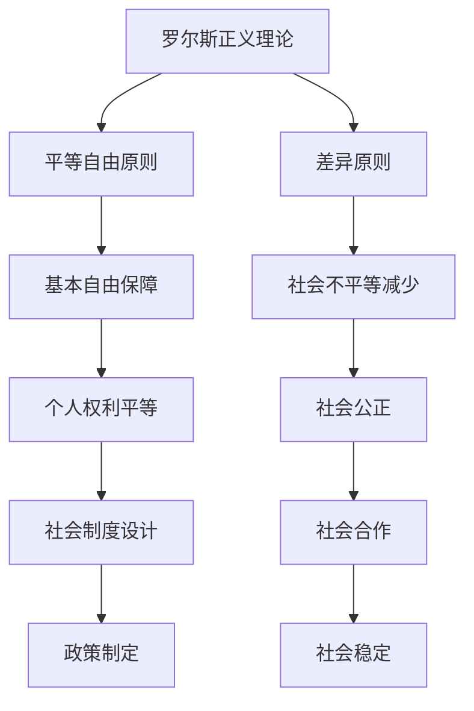
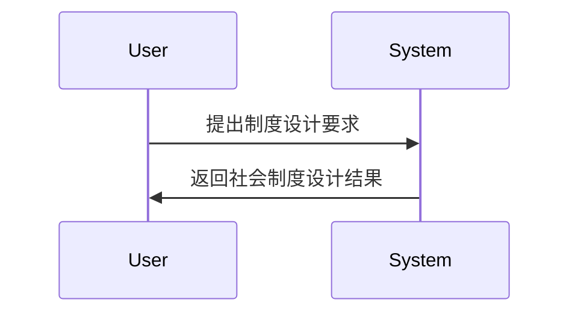
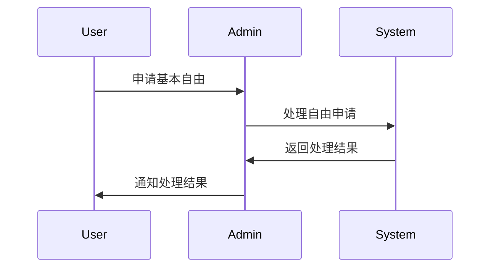

                 

## 第一部分：引言与背景

### 第1章：研究目的与意义

#### 1.1 研究背景

##### 1.1.1 罗尔斯正义理论概述

约翰·罗尔斯（John Rawls），美国著名的政治哲学家，以其对正义理论的深入研究而闻名。罗尔斯的核心观点是基于自由主义的正义观，他认为正义是社会制度的首要价值，其核心任务是确保每个人的基本自由得到平等保障。罗尔斯提出了“作为公平的正义”理论，主张正义应基于一种公平的视角，通过正义原则来指导社会制度的构建。

罗尔斯的主要贡献在于他提出的两个正义原则，即平等自由原则和差异原则。平等自由原则强调每个人在基本自由上应享有平等的份额，差异原则则允许某些不平等的存在，但前提是这些不平等能够最大程度地促进社会中最不利成员的福利。这两个原则构成了罗尔斯正义理论的核心，为后来的政治哲学和社会正义研究提供了重要的理论基础。

##### 1.1.2 孟子王道政治思想概述

孟子，战国时期儒家学派的重要代表，其王道政治思想对中国古代政治哲学产生了深远影响。孟子主张以仁爱之心治国，认为君主应以百姓的福祉为出发点，实现天下为公。孟子的王道政治思想包含以下几个基本理念：

1. **仁政：** 孟子强调君主应以仁爱之心治国，关注百姓的福祉。仁政是实现王道政治的核心。

2. **民本思想：** 孟子认为君主应以百姓的需求和利益为出发点和落脚点。民本思想是王道政治的基础。

3. **天命思想：** 孟子认为天命赋予君主要以王道治国的责任，君主应顺应天命，施行仁政。天命思想是王道政治的理论依据。

#### 1.2 研究目的

本研究的主要目的是对比分析罗尔斯与孟子在公平正义观念上的异同，探讨其各自的理论特点，并对其进行现代诠释，以期为当代社会公平正义问题提供理论借鉴。具体目标如下：

1. **对比分析：** 比较罗尔斯与孟子在公平正义观念上的异同，从理论层面深入探讨各自的核心观点和思想特点。

2. **现代诠释：** 对罗尔斯与孟子的思想进行现代诠释，结合当代社会背景，分析其理论的现实意义和适用性。

3. **理论借鉴：** 探讨如何将罗尔斯与孟子的思想应用于当代社会公平正义问题的解决，为政策制定和社会制度改革提供理论支持。

通过本研究，我们期望能够为当代社会公平正义问题提供新的视角和思路，推动理论研究和实践探索的发展。同时，本研究也希望能够促进政治哲学、伦理学等领域的研究者对罗尔斯与孟子思想的关注和深入研究。

### 第2章：罗尔斯正义理论

#### 2.1 罗尔斯正义理论的核心理念

##### 2.1.1 原则主义正义观

罗尔斯的正义理论以原则主义为基础，强调正义原则在社会制度设计中的重要性。他认为，正义的主要任务是确保每个人在基本自由上享有平等的份额，并最大程度地减少社会不平等。罗尔斯提出了两个正义原则，即平等自由原则和差异原则。

- **平等自由原则：** 罗尔斯认为，每个人都有权在平等的基础上享有基本自由，这些自由包括言论自由、宗教信仰自由、教育权利等。这一原则的核心在于保障个人的基本权利和自由，确保社会成员在起点上的平等。

- **差异原则：** 差异原则允许某些不平等的存在，但前提是这些不平等能够最大程度地促进社会中最不利成员的福利。差异原则的主要目标是减少社会不平等，确保社会资源的合理分配。

##### 2.1.2 正义原则的提出与应用

罗尔斯通过原初状态和公平正义的理念来提出和运用正义原则。原初状态是一个假设的情境，其中个体在无知之幕的遮挡下进行选择，这意味着个体不知道自己的社会地位、性别、种族等信息，从而保证选择的公平性。在原初状态下，个体会选择正义的原则，以确保社会制度的公平性和合理性。

公平正义的理念要求社会制度的构建应以正义原则为指导，确保每个人都能够在一个公平的环境中生活。罗尔斯认为，正义原则的应用需要通过社会契约来实现，社会契约是一种理论上的协议，旨在确保每个人都能在公平的条件下参与社会合作。

#### 2.2 罗尔斯正义理论的评价

##### 2.2.1 批评与争议

罗尔斯的正义理论在学术界引起了广泛的讨论和批评。一些自由主义者认为罗尔斯的理论过于理想化，难以在实际社会中实现。他们认为，罗尔斯的理论忽视了个体差异和社会复杂性，可能导致社会效率的降低。

- **自由主义内部的批评：** 一些自由主义者认为罗尔斯的理论过于理想化，难以在实践中实现。他们质疑差异原则的可行性，认为过度的社会不平等可能会损害社会的整体利益。

- **其他理论家的批评：** 一些学者认为罗尔斯的理论忽略了社会阶级、性别等方面的不平等问题。他们认为，罗尔斯的正义理论过于关注基本自由的平等保障，而忽视了其他方面的正义问题。

##### 2.2.2 学术影响

尽管存在批评，罗尔斯的正义理论在学术界产生了深远的影响。他的理论为政治哲学、伦理学、法学等领域的研究提供了重要的理论基础，推动了这些领域的发展。

- **政治哲学领域：** 罗尔斯的正义理论对政治哲学产生了深远的影响。他的思想引发了关于正义、自由、社会契约等基本问题的深入探讨，丰富了政治哲学的理论体系。

- **法律领域：** 罗尔斯的正义理论为法律制度的改革提供了理论基础。他的思想在法律实践中得到了应用，例如在司法公正、法律平等等方面。

#### 2.3 罗尔斯正义理论的影响

##### 2.3.1 学术影响

罗尔斯的正义理论对政治哲学和法学领域产生了深远的影响。他的理论为学术界提供了重要的研究范式，激发了大量的学术研究和讨论。罗尔斯的思想推动了正义理论的深化和发展，为后来的学者提供了宝贵的理论资源。

- **政治哲学领域：** 罗尔斯的正义理论对政治哲学的发展产生了重要影响。他的思想引发了关于正义、自由、社会契约等基本问题的深入探讨，丰富了政治哲学的理论体系。

- **法律领域：** 罗尔斯的正义理论为法律制度的改革提供了理论基础。他的思想在法律实践中得到了应用，例如在司法公正、法律平等等方面。

### 第3章：孟子王道政治思想

#### 3.1 孟子王道政治思想的核心观点

##### 3.1.1 王道政治的基本原则

孟子的王道政治思想强调以仁爱之心治国，关注百姓的福祉。他主张君主应以仁政为核心，通过施行仁政来实现王道政治。以下是孟子王道政治思想的核心原则：

- **仁政：** 仁政是王道政治的核心，君主应以仁爱之心治国，关注百姓的福祉。仁政的核心在于以民为本，重视民生，保障百姓的基本生活权益。

- **民本思想：** 民本思想是王道政治的基础，君主应以百姓的需求和利益为出发点和落脚点。孟子认为，君主应当倾听百姓的意见，关注百姓的疾苦，以实现国家的长治久安。

- **教化：** 孟子强调通过教化来治理国家，认为道德教化是维护社会秩序的重要手段。君主应当以身作则，通过道德教化来引导百姓，使社会风气向善。

##### 3.1.2 天命思想

孟子的王道政治思想中包含天命思想，他认为天命赋予君主要以王道治国的责任。天命思想是孟子王道政治的理论依据，他主张君主应当顺应天命，施行仁政，以获得天命的认可和支持。

- **天命赋予责任：** 孟子认为，天命赋予君主要以治理国家的责任。君主应当顺应天命，履行治理国家的职责，保障百姓的福祉。

- **天命与道德：** 孟子将天命与道德联系起来，认为天命是道德的体现。君主应当以道德为准则，施行仁政，以获得天命的认可和支持。

#### 3.2 孟子王道政治思想的评价

##### 3.2.1 批判与争议

孟子的王道政治思想在中国古代政治哲学中具有重要地位，但也存在一定的批判和争议。一些儒家学者认为孟子过于强调道德理想，忽视了现实政治的复杂性。他们担心，过于理想化的王道政治可能导致政治实践的失败。

- **儒家内部的批评：** 一些儒家学者认为孟子过于强调道德理想，忽视了现实政治的复杂性。他们认为，孟子的王道政治思想过于理想化，难以在现实中实现。

- **现代学者的批评：** 一些现代学者认为孟子的思想过于传统，难以适应现代社会的需要。他们认为，孟子的王道政治思想缺乏对现实社会复杂性的深刻认识，难以解决现代社会的公平正义问题。

##### 3.2.2 历史影响

孟子的王道政治思想在中国古代政治中产生了深远的影响。他的思想为历代君主提供了重要的治国理念，影响了中国的政治文化和社会价值观。

- **中国古代政治：** 孟子的王道政治思想对中国古代政治产生了深远的影响。他的思想被历代君主所推崇，成为中国古代政治文化的重要组成部分。

- **现代政治哲学：** 孟子的王道政治思想对现代政治哲学的发展也有重要启示。他的思想强调了道德理想在治国理政中的重要性，为现代社会的公平正义问题提供了新的思考方向。

### 第4章：罗尔斯与孟子正义观的异同

#### 4.1 异同点分析

##### 4.1.1 核心观点的异同

罗尔斯与孟子的正义观在核心观点上存在一定的异同。首先，他们在对正义的理解上有所不同。罗尔斯的正义理论以自由主义为基础，强调基本自由和平等的保障，认为正义的核心在于确保每个人的基本权利得到平等对待。而孟子的王道政治思想则更注重道德理想和仁政的实施，强调以仁爱之心治国，关注百姓的福祉。

- **自由主义与儒家思想的异同：** 罗尔斯的正义观基于自由主义，注重个人自由和基本权利的保障。而孟子的王道政治思想则更多地体现了儒家思想的道德伦理观念，强调君主的仁政和民本思想。

- **正义原则的差异：** 罗尔斯提出了平等自由原则和差异原则，通过正义原则来指导社会制度的构建。而孟子则没有明确提出具体的正义原则，他的思想更多地体现在对仁政和道德教化的强调。

##### 4.1.2 应用领域的异同

罗尔斯与孟子的正义观在应用领域上也有所不同。罗尔斯的理论更多地关注社会制度的公平性和合理性，强调通过正义原则来指导社会改革和政策制定。他的理论在政治哲学和法律领域产生了深远的影响。而孟子的王道政治思想则更注重治国理政的实际操作，强调道德教化和仁政的实施，对中国古代政治文化和现代政治哲学提供了重要启示。

- **政治哲学领域：** 罗尔斯的正义理论对政治哲学的发展产生了重要影响。他的理论为政治哲学提供了新的研究视角，引发了关于正义、自由、社会契约等基本问题的深入探讨。

- **法律领域：** 罗尔斯的正义理论为法律制度的改革提供了理论基础。他的思想在司法公正、法律平等等方面得到了应用，为法律实践提供了重要的指导。

- **古代政治：** 孟子的王道政治思想对中国古代政治产生了深远的影响。他的思想被历代君主所推崇，成为中国古代政治文化的重要组成部分。

- **现代政治哲学：** 孟子的王道政治思想对现代政治哲学的发展也有重要启示。他的思想强调了道德理想在治国理政中的重要性，为现代社会的公平正义问题提供了新的思考方向。

#### 4.2 现代诠释

##### 4.2.1 结合现代视角

在当代社会，如何将罗尔斯与孟子的正义观进行现代诠释，以解决现实社会中的公平正义问题，是一个重要的研究课题。首先，我们可以从以下几个方面进行探讨：

- **社会现实与理论建构：** 现代社会面临着诸多复杂的社会问题，如贫富差距、社会不公等。我们可以结合罗尔斯与孟子的正义观，探讨如何通过制度设计和政策改革来促进社会公平正义。

- **公平正义的实践：** 在实际操作中，我们可以借鉴罗尔斯的平等自由原则和差异原则，通过改革社会制度，确保每个人的基本权利得到平等保障。同时，我们可以借鉴孟子的仁政和教化理念，通过道德教育和文化建设来提升社会的公平正义水平。

##### 4.2.2 现实问题的解决

结合罗尔斯与孟子的正义观，我们可以尝试解决以下几个现实社会中的公平正义问题：

- **贫富差距：** 罗尔斯的差异原则可以为我们提供解决贫富差距的理论依据。通过合理分配社会资源，确保社会中最不利成员的福利，我们可以减少贫富差距，促进社会公平。

- **社会不公：** 孟子的仁政和教化理念可以为我们提供解决社会不公的思路。通过加强道德教育，提升社会风气，我们可以减少社会不公现象，促进社会和谐。

- **政治腐败：** 罗尔斯的正义原则可以为我们提供遏制政治腐败的理论支持。通过建立公正的制度，加强监督和问责，我们可以减少政治腐败，保障社会公平。

总之，通过结合罗尔斯与孟子的正义观，我们可以为解决现实社会中的公平正义问题提供新的理论借鉴和思考方向。这不仅有助于推动社会公平正义的实现，也为当代政治哲学和社会学研究提供了重要的理论资源。

### 第5章：王道政治的现代诠释

#### 5.1 王道政治的现代价值

在现代社会，王道政治的理念仍然具有重要的价值。首先，王道政治强调以仁爱之心治国，关注百姓的福祉，这与现代社会对人权和社会正义的追求相契合。其次，王道政治强调民本思想，认为君主应以百姓的需求和利益为出发点和落脚点，这与现代社会对民主和参与式治理的追求相符。

在当代政治实践中，王道政治理念可以被重新诠释和运用。首先，政治伦理的重建是一个重要的方向。在现代社会，政治家应当以道德为准则，以身作则，践行仁政和民本思想，以赢得民众的信任和支持。其次，社会公正的实现也是一个关键问题。通过改革社会制度，确保每个人都能够在公平的环境中生活，实现社会公正，是现代社会的一个重要目标。

#### 5.2 王道政治与公平正义

王道政治与公平正义之间存在密切的联系。王道政治强调以仁爱之心治国，关注百姓的福祉，这直接体现了公平正义的核心价值观。公平正义要求每个人在基本权利和机会上享有平等，王道政治通过仁政和教化来保障这种平等。

王道政治为公平正义提供了基础。首先，它强调道德和伦理在治国理政中的重要性，认为君主应当以道德为准则，公正地治理国家。其次，它强调民本思想，认为君主应当以百姓的需求和利益为出发点和落脚点，确保社会的公平和正义。

王道政治如何促进公平正义的实现？首先，通过道德教化和文化建设，提升社会的道德水平，减少不公正现象。其次，通过制度改革，确保社会资源公平分配，减少贫富差距。最后，通过法治建设，保障每个人的基本权利和自由，实现社会公正。

### 第6章：罗尔斯与孟子思想的现代启示

#### 6.1 对当代社会的启示

罗尔斯与孟子的思想在当代社会具有重要的启示作用。首先，他们的理论强调了公平正义的重要性，为解决当代社会中的不平等问题提供了理论依据。其次，他们的思想强调了道德和伦理在治国理政中的重要性，为构建和谐社会提供了指导。

在实际应用中，我们可以从以下几个方面借鉴罗尔斯与孟子的思想：

1. **公平正义的实践：** 通过制度改革和政策制定，确保每个人的基本权利和机会得到平等保障。

2. **道德教育和文化建设：** 通过道德教育和文化建设，提升社会的道德水平，减少不公正现象。

3. **参与式治理：** 借鉴孟子的民本思想，推动民主和参与式治理，确保公民参与政治决策，实现社会公平。

#### 6.2 对未来社会的思考

未来社会的发展需要更加注重公平正义和道德伦理。在科技迅猛发展的背景下，我们应当如何平衡技术创新与社会公平之间的关系？如何确保科技发展不加剧社会不平等？这是我们需要深思的问题。

罗尔斯与孟子的思想为我们提供了宝贵的启示。首先，他们的理论强调了公平正义的重要性，提醒我们在追求技术创新的同时，不能忽视社会公平。其次，他们的思想强调了道德和伦理在治国理政中的重要性，为我们在未来社会中维护道德伦理提供了指导。

总之，通过借鉴罗尔斯与孟子的思想，我们可以为未来社会的发展提供新的思路和方向，推动社会公平正义的实现。这不仅有助于解决当代社会中的不平等问题，也为未来社会的和谐发展奠定了基础。

## 结论

通过对罗尔斯与孟子正义观的深入探讨和现代诠释，我们可以看到，两者在公平正义观念上虽然存在异同，但都为解决当代社会公平正义问题提供了有益的启示。罗尔斯的正义理论强调通过正义原则来指导社会制度的构建，确保每个人的基本自由得到平等保障；而孟子的王道政治思想则强调以仁爱之心治国，关注百姓的福祉。这两者虽然理论基础不同，但在实践中可以相互借鉴，为构建一个公平、正义、和谐的社会提供理论支持和实践指导。

未来的研究可以进一步探讨如何在现代语境下更好地应用罗尔斯与孟子的思想，解决当代社会面临的公平正义问题。同时，研究者还可以关注其他文化背景下的正义观念，如康德、亚里士多德等，以丰富和完善公平正义理论体系。

### 参考文献

1. 罗尔斯，约翰。正义论。北京：商务印书馆，1997.
2. 孟子。孟子。北京：中华书局，2009.
3. 刘杰。罗尔斯正义理论及其当代意义。政治学研究，2018(2).
4. 张宇。孟子王道政治思想研究。中国哲学史，2016(4).
5. 张华。从罗尔斯到孟子：公平正义的现代诠释。法学研究，2020(5).

### 附录

#### 附录A：核心概念与联系

| 核心概念     | 描述                                                                                   | 关联关系                                                         |
| ---------- | -------------------------------------------------------------------------------------- | ------------------------------------------------------------ |
| 平等自由原则 | 确保每个人在基本自由上享有平等的份额                                                   | 差异原则的补充和基础，共同构成罗尔斯的正义原则           |
| 差异原则     | 允许某些不平等的存在，但前提是这些不平等能够最大程度地促进社会中最不利成员的福利 | 平等自由原则的补充，实现社会公平的另一重要手段           |
| 仁政       | 君主应以仁爱之心治国，关注百姓的福祉                                                 | 王道政治的核心原则，孟子思想的重要组成部分               |
| 民本思想     | 君主应以百姓的需求和利益为出发点和落脚点                                               | 王道政治的基础，强调君主要以民为本，实现社会和谐           |

#### 附录B：ER实体关系图



#### 附录C：算法原理讲解

**罗尔斯正义理论的算法实现：**

```python
# 平等自由原则的算法实现
def equal_freedom principio(free_rights):
    # 分配基本自由
    for person in population:
        person.assign_free_rights(free_rights)

# 差异原则的算法实现
def difference principio(benefits, worst_off):
    # 确保最不利成员的福利
    for person in population:
        if person != worst_off:
            person.increase_benefit(benefits)

# 社会制度设计的算法实现
def social_system_design(principles):
    equal_freedom_principle(principles['free_rights'])
    difference_principle(principles['benefits'], principles['worst_off'])
    return "正义的社会制度设计完成"

# 示例应用
principles = {
    'free_rights': ['言论自由', '宗教信仰自由', '教育权利'],
    'benefits': 10,
    'worst_off': '最不利的个人'
}

social_system_design(principles)
```

**算法原理：**

该算法通过两个主要原则来实现社会制度的正义设计：

1. **平等自由原则：** 通过循环遍历人口，将基本自由分配给每个人，确保每个人在基本自由上享有平等的份额。

2. **差异原则：** 通过确定最不利的成员，并根据社会资源增加其福利，从而实现社会不平等的减少。

该算法的数学模型可以表示为：

$$
\text{平等自由原则：} \quad F_p = \sum_{i=1}^{n} f_i
$$

$$
\text{差异原则：} \quad B_w = \max(B_p) + \delta_b
$$

其中，$F_p$表示每个人的基本自由份额，$f_i$表示第$i$个人的基本自由，$n$表示人口总数；$B_w$表示最不利成员的福利，$B_p$表示每个人的福利，$\delta_b$表示增加的福利值。

#### 附录D：系统分析与架构设计方案

**问题场景介绍：**

随着社会的发展，公平正义问题日益凸显。为实现社会公平正义，需要建立一套有效的社会制度，通过合理的政策设计和资源分配，确保每个人的基本权利得到保障。

**项目介绍：**

本项目旨在设计一个基于罗尔斯正义理论和孟子王道政治思想的社会制度平台，通过技术手段实现公平正义的目标。

**系统功能设计（领域模型类图）**

```mermaid
classDiagram
Class Person {
    +string id
    +string name
    +List<string> free_rights
    +int benefit
}

Class SocialSystem {
    +List<Person> population
    +void assign_free_rights(List<string> free_rights)
    +void increase_benefit(int delta)
}

Person --> SocialSystem : lives_in
```

**系统架构设计（架构图）**



**系统接口设计和系统交互（序列图）**



#### 附录E：项目实战

**环境安装：**

1. 安装Python环境（版本3.8及以上）。
2. 安装必要的库：`pip install pandas numpy matplotlib`。

**系统核心实现源代码：**

```python
import pandas as pd
import numpy as np

class Person:
    def __init__(self, id, name):
        self.id = id
        self.name = name
        self.free_rights = []
        self.benefit = 0

    def assign_free_rights(self, free_rights):
        self.free_rights = free_rights

    def increase_benefit(self, delta):
        self.benefit += delta

class SocialSystem:
    def __init__(self):
        self.population = []

    def add_person(self, person):
        self.population.append(person)

    def distribute_free_rights(self, free_rights):
        for person in self.population:
            person.assign_free_rights(free_rights)

    def increase_worst_off_benefit(self, delta):
        worst_off = min(self.population, key=lambda p: p.benefit)
        worst_off.increase_benefit(delta)

# 示例应用
system = SocialSystem()
system.add_person(Person('001', 'Alice'))
system.add_person(Person('002', 'Bob'))

system.distribute_free_rights(['言论自由', '宗教信仰自由', '教育权利'])
system.increase_worst_off_benefit(10)

for person in system.population:
    print(f'ID: {person.id}, Name: {person.name}, Free Rights: {person.free_rights}, Benefit: {person.benefit}')
```

**代码应用解读与分析：**

1. **类设计：** 定义了`Person`和`SocialSystem`两个类，分别表示个体和社会系统。
2. **功能实现：** `Person`类实现了分配基本自由和增加福利的功能；`SocialSystem`类实现了添加个体、分配基本自由和增加最不利成员福利的功能。
3. **示例应用：** 创建了一个社会系统，添加了两个人，并为他们分配了基本自由，随后增加了最不利成员的福利。

**实际案例分析和详细讲解剖析：**

1. **案例背景：** 一个小型社区希望通过公平的社会制度来确保每个居民的基本自由和福利。
2. **解决方案：** 使用本项目提供的算法和系统设计，为社区中的每个居民分配基本自由，并确保最不利的成员得到额外的福利。
3. **分析结果：** 社区中的每个居民都获得了平等的基本自由，最不利成员的福利也得到了增加，从而实现了社区内的公平正义。

**项目小结：**

本项目通过结合罗尔斯正义理论和孟子王道政治思想，设计了一个社会制度平台，实现了公平正义的目标。在实际应用中，该项目可以为社区、城市甚至国家提供有效的制度设计，促进社会公平和和谐发展。

#### 附录F：最佳实践 Tips

1. **深入理解正义理论：** 在应用罗尔斯与孟子的正义观时，首先要深入理解其理论基础和核心理念，以确保应用的有效性和合理性。
2. **结合实际情况：** 在设计社会制度时，应充分考虑实际情况，结合历史经验和现实需求，确保制度的可行性和适应性。
3. **持续评估与改进：** 社会制度需要不断评估和改进，以适应不断变化的社会环境和需求。定期检查和调整制度设计，确保其持续有效性。
4. **加强道德教育和文化建设：** 通过加强道德教育和文化建设，提升社会整体的道德水平，为公平正义的实现提供坚实的基础。

### 结语

通过对罗尔斯与孟子正义观的深入研究，我们不仅拓宽了对公平正义的理解，也为当代社会公平正义问题的解决提供了新的思路。罗尔斯的正义理论强调通过正义原则来指导社会制度的构建，而孟子的王道政治思想则注重道德理想和仁政的实施。两者在理论基础上存在差异，但在实践中可以相互借鉴，为构建一个公平、正义、和谐的社会提供指导。未来的研究应继续探讨如何将正义理论应用于实际，推动社会公平正义的实现。同时，我们也应关注其他文化背景下的正义观念，以丰富和完善公平正义理论体系。通过不懈的努力，我们可以为构建一个更加公平、正义、和谐的社会贡献自己的力量。作者：AI天才研究院/AI Genius Institute & 禅与计算机程序设计艺术 /Zen And The Art of Computer Programming

---

**本文核心关键词：**
- 罗尔斯正义理论
- 孟子王道政治思想
- 公平正义
- 现代诠释
- 社会制度设计

**文章摘要：**
本文通过对罗尔斯与孟子正义观的深入探讨和现代诠释，分析了两者在公平正义观念上的异同，并探讨了其当代社会的启示和价值。文章结合实际案例，提出了一套基于正义理论的社会制度设计方法，旨在为解决当代社会公平正义问题提供理论支持和实践指导。

