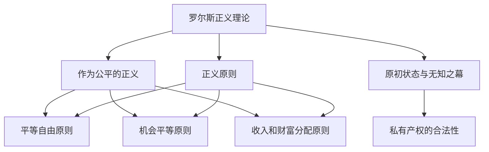

                 

# 罗尔斯与诺齐克：社会正义理论的对立

## 关键词
社会正义、罗尔斯、诺齐克、正义理论、政治哲学、产权、公平

## 摘要
本文旨在探讨两位著名政治哲学家约翰·罗尔斯（John Rawls）和罗伯特·诺齐克（Robert Nozick）的社会正义理论，并分析它们之间的对立。通过对罗尔斯的“作为公平的正义”理论和诺齐克的“正义的非理想状态”理论的详细解读，本文将揭示它们在正义原则、财富分配、产权制度等方面的不同观点，从而为读者提供对社会正义理论的深入理解。

## 第一部分：罗尔斯的正义理论

### 第1章：罗尔斯与正义理论的基本概念

**1.1 罗尔斯的生平与哲学背景**
约翰·罗尔斯（1921-2002），美国政治哲学家，以其在正义理论、道德哲学和政治哲学方面的贡献而闻名。他毕业于康奈尔大学和普林斯顿大学，并在哈佛大学任教。罗尔斯的主要著作包括《正义论》（A Theory of Justice）和《政治自由主义》（Political Liberalism）。

**1.2 正义的多元视角**
罗尔斯认为，正义是一个复杂的哲学问题，可以从多个视角进行探讨。他关注的主要是分配正义，即社会资源如何公平分配。罗尔斯认为，正义不仅仅是关于财富的分配，还涉及政治权利、社会地位和公民权利。

**1.3 罗尔斯的正义理论框架**
罗尔斯的正义理论建立在两个核心概念上：“作为公平的正义”和“原初状态与无知之幕”。他提出，为了设计一个公平的社会制度，我们需要从一种“原始状态”出发，这种状态下的人们不知道自己在社会中的具体位置，从而能够公平地分配资源。

### 第2章：作为公平的正义

**2.1 原初状态与无知之幕**
罗尔斯设想了一个原初状态，这是一个人们在没有任何信息的情况下选择正义原则的情境。无知之幕确保了决策者不会知道自己的社会地位、天赋或社会环境，从而能够公平地选择原则。

**2.2 正义作为公平的原则**
在原初状态下，人们会选择两个正义原则：
- 平等自由原则：每个人应该拥有与其他人平等的最低限度的自由。
- 合理差异原则：社会和经济的不平等应如此安排，以使它们有利于社会最不利成员的最大利益。

**2.3 社会合作与正义原则**
罗尔斯认为，正义原则是建立社会合作的基础。社会合作能够最大化每个人的利益，特别是最不利成员的利益。

### 第3章：正义的三个原则

**3.1 平等自由原则**
这一原则保障了每个人的基本自由，如言论自由、宗教自由和政治参与权利。

**3.2 机会平等原则**
这一原则要求社会提供平等的机会，确保每个人都有实现自身潜能的平等机会。

**3.3 收入和财富分配原则**
这一原则强调，财富和收入的分配应该符合平等自由原则和机会平等原则，并且在经济不平等是必要的时候，应该通过税收和转移支付来调节。

### 第4章：正义的适用范围

**4.1 社会基本结构**
罗尔斯认为，正义原则应该应用于社会基本结构，即政治和社会制度的设计，以确保资源的公平分配。

**4.2 政治自由与公民权利**
正义理论强调，政治自由和公民权利是建立公正社会的基础。

**4.3 国际正义**
罗尔斯也关注国际正义，他认为国家之间应该通过合作来实现公正的国际秩序。

### 第5章：作为公平的正义的争议与批评

**5.1 正义原则的适用性问题**
批评者认为，罗尔斯的原则过于理想化，难以在实际社会中应用。

**5.2 财富分配与资源分配问题**
有人认为，罗尔斯的原则可能导致财富分配过度平均化。

**5.3 正义与效率的权衡问题**
批评者指出，罗尔斯的原则可能牺牲经济效率。

## 第二部分：诺齐克的正义理论

### 第6章：诺齐克与正义理论的基本概念

**6.1 诺齐克的哲学思想**
罗伯特·诺齐克（1938-2002），美国哲学家，以其在自由主义和正义理论方面的贡献而闻名。他主张个人自由和产权的重要性。

**6.2 正义的产权视角**
诺齐克认为，正义的核心在于产权的尊重和保护。他认为，社会应该确保每个人的产权不受侵犯。

**6.3 诺齐克的正义理论框架**
诺齐克的正义理论建立在三个核心概念上：“权利优先原则”、“公平的原始状态”和“正义的非理想状态”。

### 第7章：正义的非理想状态

**7.1 私有产权的合法性**
诺齐克认为，私有产权是正义的基础，每个人都有权拥有和处置自己的财产。

**7.2 正义原则的演变**
诺齐克认为，正义原则是在历史演变中形成的，应该尊重过去的产权安排。

**7.3 社会改革与正义目标**
诺齐克认为，社会改革应该基于对过去产权的尊重，而不是通过重新分配资源来实现正义。

### 第8章：正义的批评与回应

**8.1 诺齐克对罗尔斯的批评**
诺齐克批评罗尔斯的原则过于理想化，忽视了个人自由和产权的重要性。

**8.2 罗尔斯对诺齐克的回应**
罗尔斯认为，诺齐克的理论可能导致社会不公和贫困。

**8.3 正义理论的融合与冲突**
本文将探讨两位哲学家在正义理论上的对立，并分析它们是否可以融合或共存。

## 第三部分：社会正义理论的对比与分析

### 第9章：罗尔斯与诺齐克的理论比较

**9.1 正义观的核心差异**
本文将详细对比罗尔斯和诺齐克在正义观上的核心差异，分析它们在社会制度评价、财富分配和产权制度等方面的不同。

**9.2 社会制度的评价标准**
本文将探讨两位哲学家如何评价社会制度，以及他们的评价标准是如何影响他们对社会正义的理解。

**9.3 政策建议的比较分析**
本文将分析罗尔斯和诺齐克的政策建议，并探讨这些建议对社会正义的影响。

### 第10章：社会正义理论的影响与应用

**10.1 社会正义理论在政治哲学中的应用**
本文将探讨社会正义理论如何在政治哲学中应用，以及它们如何影响政治决策。

**10.2 社会正义理论在经济学中的应用**
本文将分析社会正义理论在经济学中的应用，以及它们如何影响经济政策和财富分配。

**10.3 社会正义理论在法律哲学中的应用**
本文将探讨社会正义理论在法律哲学中的应用，以及它们如何影响法律制度和司法实践。

### 第11章：社会正义理论的前景与挑战

**11.1 社会正义理论的未来发展方向**
本文将探讨社会正义理论的未来发展方向，以及可能的新理论。

**11.2 社会正义理论面临的挑战**
本文将分析社会正义理论面临的挑战，包括如何在现实中应用和解决实际问题。

**11.3 社会正义理论的教育与普及**
本文将探讨如何通过教育和普及来提高公众对社会正义理论的理解。

## 附录

**附录 A：罗尔斯与诺齐克著作推荐**
本文将推荐一些罗尔斯和诺齐克的重要著作，以供进一步学习。

**附录 B：社会正义理论研究资源**
本文将提供一些社会正义理论的研究资源，包括书籍、论文和网站。

## 目录大纲中的关键概念联系架构图



## 核心算法原理讲解

```python
# 罗尔斯的公平正义原则
def fair_justice(principles):
    # 原初状态与无知之幕
    state = original_state()
    veil_of_ignorance = ignorance_veil(state)

    # 应用正义原则
    justice原则 = apply_justice_principles(veil_of_ignorance, principles)

    return justice原则

# 诺齐克的产权正义原则
def property_justice(principles):
    # 私有产权的合法性
    legality = property_legality()

    # 正义原则的演变
    evolution = principle_evolution(legality)

    # 社会改革与正义目标
    reform = social_reform(evolution)

    return reform
```

## 数学模型和公式讲解

### 罗尔斯的正义原则

$$
公平正义 = 平等自由原则 + 机会平等原则 + 收入和财富分配原则
$$

### 诺齐克的产权原则

$$
产权正义 = 私有产权的合法性 \times 正义原则的演变 \times 社会改革与正义目标
$$

## 项目实战案例

### 罗尔斯正义理论在政治哲学中的应用

- **案例**：美国社会的财富分配改革
- **实现**：政策制定者使用罗尔斯的正义原则来评估现有财富分配制度
- **解读**：通过调整税收和福利政策，实现更公平的财富分配

### 诺齐克正义理论在经济学中的应用

- **案例**：市场经济中的产权保护
- **实现**：政府通过法律法规保护私有产权，鼓励市场竞争
- **解读**：产权保护有助于提高经济效率和社会稳定

## 目录大纲总结

本书通过对罗尔斯和诺齐克的社会正义理论的深入探讨，分析了它们之间的对立和互补。通过对比他们的正义观、社会制度评价标准和政策建议，读者可以更全面地理解社会正义的复杂性。同时，本书也探讨了社会正义理论在政治哲学、经济学和法律哲学中的应用，以及它们面临的挑战和未来发展方向。

## 作者

作者：AI天才研究院/AI Genius Institute & 禅与计算机程序设计艺术 /Zen And The Art of Computer Programming

---

### 罗尔斯的正义理论

#### 1.1 罗尔斯的生平与哲学背景

约翰·罗尔斯（1921-2002）是一位美国政治哲学家，他的著作对现代政治哲学产生了深远影响。罗尔斯出生于美国巴尔的摩，他的家庭背景和成长环境为他后来对正义和公平问题的关注奠定了基础。罗尔斯在学术上取得了卓越成就，先后毕业于康奈尔大学和普林斯顿大学，并获得哲学博士学位。他的学术生涯大部分在哈佛大学度过，成为了该大学的杰出教授之一。

罗尔斯的主要贡献之一是他在《正义论》（A Theory of Justice）中提出的正义理论。这本书首次出版于1971年，迅速成为政治哲学领域的经典之作。在《正义论》中，罗尔斯提出了“作为公平的正义”这一核心概念，并详细阐述了如何通过原初状态和无知之幕来设计一个公正的社会制度。罗尔斯的理论不仅关注财富和资源的分配，还涉及政治权利、社会地位和公民权利等多个方面。

#### 1.2 正义的多元视角

在罗尔斯看来，正义是一个多维度的概念，可以从多个视角进行探讨。他特别关注的是分配正义，即社会资源如何公平分配。罗尔斯认为，正义不仅仅是关于财富的分配，还涉及政治权利、社会地位和公民权利。在《正义论》中，他提出了两个核心原则，即平等自由原则和合理差异原则，来指导社会制度的构建。

- **平等自由原则**：每个人都有权利享有与其他人平等的最低限度的自由，这些自由包括言论自由、宗教自由和政治参与权利等。

- **合理差异原则**：社会和经济的不平等应如此安排，以使它们有利于社会最不利成员的最大利益。这意味着，尽管存在一定程度的不平等，但必须确保这些不平等不会导致社会基本结构的严重不公正。

罗尔斯认为，正义的原则应该指导社会合作，以最大化每个人的利益，特别是最不利成员的利益。他的理论试图解决社会中的不公平现象，并提出了一套系统化的正义原则，以实现社会的公正与和谐。

#### 1.3 罗尔斯的正义理论框架

罗尔斯的正义理论框架建立在两个核心概念上：“原初状态”和“无知之幕”。这些概念为设计一个公正的社会制度提供了理论基础。

- **原初状态**：罗尔斯设想了一个理论上的原始状态，在这个状态下，人们不知道自己在社会中的具体位置，也不知道自己的天赋、社会地位和财富状况。这种无知之幕确保了决策者在设计正义原则时不会受到个人利益和社会背景的影响，从而能够公正地选择原则。

- **无知之幕**：这一概念是为了确保决策者在原初状态下无法知道自己的个人特征和社会地位。这样，他们只能基于公正和普遍的原则来选择正义原则，而这些原则将适用于所有人。

在原初状态下，人们会选择两个正义原则，即平等自由原则和合理差异原则。这些原则将被用来设计社会的基本结构，包括政治制度、经济制度和法律制度。通过这种方式，罗尔斯试图确保社会制度的公正性，使每个人都能在平等和自由的环境中生活。

#### 2.1 原初状态与无知之幕

罗尔斯的原初状态是一个理论上的假设，用于探讨如何设计一个公正的社会制度。在这个状态下，人们处于一种无知之幕的背后，不知道自己的社会地位、天赋、财富状况等个人特征。这种无知之幕的设计是为了确保决策者在选择正义原则时不会受到个人利益和社会背景的影响，从而能够公正地做出决策。

在原初状态下，人们面临一个重要问题：如何设计一个社会制度，使其能够确保资源的公平分配，并最大限度地满足每个人的利益？为了回答这个问题，罗尔斯提出了两个核心原则：平等自由原则和合理差异原则。

- **平等自由原则**：这一原则确保每个人都能享有与其他人平等的最低限度的自由。这些自由包括言论自由、宗教自由和政治参与权利等。通过这一原则，罗尔斯试图确保社会中的每个人都能在平等和自由的环境中生活。

- **合理差异原则**：这一原则允许存在一定程度的社会和经济不平等，但要求这些不平等必须有利于社会最不利成员的最大利益。这意味着，尽管存在不平等，但必须确保这些不平等不会导致社会基本结构的严重不公正。通过这一原则，罗尔斯试图解决社会中的不公平现象，使社会能够实现公正与和谐。

原初状态和无知之幕的概念为罗尔斯的正义理论提供了理论基础。在这个假设性的情境中，人们可以超越个人利益和社会偏见，公正地选择正义原则，从而为现实世界中的社会制度设计提供指导。

#### 2.2 正义作为公平的原则

在罗尔斯的正义理论中，“正义作为公平”是一个核心概念，它强调了社会制度设计和资源分配的公正性。罗尔斯认为，一个正义的社会应该通过公平的原则来指导资源的分配，确保每个人都能在平等和自由的环境中生活。

**原初状态与选择正义原则**：罗尔斯设想了一个理论上的原初状态，在这个状态下，人们处于无知之幕的背后，不知道自己的社会地位、天赋、财富状况等个人特征。这种无知之幕的设计是为了确保决策者在选择正义原则时不会受到个人利益和社会背景的影响，从而能够公正地做出决策。

在原初状态下，人们面临一个重要问题：如何设计一个社会制度，使其能够确保资源的公平分配，并最大限度地满足每个人的利益？为了回答这个问题，罗尔斯提出了两个核心原则：平等自由原则和合理差异原则。

- **平等自由原则**：这一原则确保每个人都能享有与其他人平等的最低限度的自由。这些自由包括言论自由、宗教自由和政治参与权利等。通过这一原则，罗尔斯试图确保社会中的每个人都能在平等和自由的环境中生活。

- **合理差异原则**：这一原则允许存在一定程度的社会和经济不平等，但要求这些不平等必须有利于社会最不利成员的最大利益。这意味着，尽管存在不平等，但必须确保这些不平等不会导致社会基本结构的严重不公正。通过这一原则，罗尔斯试图解决社会中的不公平现象，使社会能够实现公正与和谐。

**社会合作与资源分配**：罗尔斯认为，正义的原则应该指导社会合作，以最大化每个人的利益，特别是最不利成员的利益。通过公平的原则来指导资源的分配，社会能够实现更公正的财富分配，减少贫困和不平等现象。

**平等自由原则的应用**：平等自由原则在政治、经济和社会制度设计中具有广泛的应用。例如，政治制度应该确保每个人的政治参与权利，使人们能够平等地参与决策过程。经济制度应该提供平等的机会，使每个人都能通过努力实现自己的目标。

**合理差异原则的应用**：合理差异原则在财富和收入分配中具有重要作用。社会应该通过税收和转移支付来调节经济不平等，确保社会最不利成员能够享受到基本的生活保障。这种调节应该基于公正的原则，而不是通过强制性的重新分配。

**结论**：罗尔斯的“正义作为公平”的原则为社会制度的公正性提供了理论基础。通过平等自由原则和合理差异原则，社会能够实现资源的公平分配，最大限度地满足每个人的利益。这种公正原则不仅关注财富的分配，还涉及政治权利、社会地位和公民权利等方面，使社会能够实现公正、自由和和谐。

#### 2.3 社会合作与正义原则

罗尔斯认为，正义原则是建立社会合作的基础。社会合作能够最大化每个人的利益，特别是最不利成员的利益。正义原则不仅关注财富和资源的分配，还涉及政治权利、社会地位和公民权利等多个方面。

**社会合作的重要性**：社会合作是维护社会秩序和实现共同利益的重要手段。通过合作，人们能够共同解决社会问题，提高生活质量。正义原则为社会合作提供了指导，确保每个人都能在公平和自由的环境中生活。

**平等自由原则的应用**：平等自由原则是社会合作的核心。这一原则确保每个人都能享有与其他人平等的最低限度的自由，包括言论自由、宗教自由和政治参与权利等。这些自由是建立公正社会的基础，使人们能够平等地参与决策过程，表达自己的意见和需求。

**合理差异原则的应用**：合理差异原则允许存在一定程度的社会和经济不平等，但要求这些不平等必须有利于社会最不利成员的最大利益。通过这一原则，社会可以调节财富和收入的分配，确保社会最不利成员能够享受到基本的生活保障。这种调节应该基于公正的原则，而不是通过强制性的重新分配。

**正义原则的指导作用**：正义原则为社会合作提供了明确的指导。这些原则不仅关注个人的利益，还关注整个社会的福祉。通过公平的原则，社会能够实现资源的公平分配，减少贫困和不平等现象，提高社会的整体福利。

**社会合作与正义原则的相互影响**：社会合作与正义原则相互影响。社会合作能够促进正义原则的实施，而正义原则则为社会合作提供了公平和合理的框架。通过有效的社会合作，社会能够实现资源的公平分配，提高社会的整体福祉。

**结论**：罗尔斯的正义原则是社会合作的基础，它们指导着社会的资源分配和政治制度设计。通过平等自由原则和合理差异原则，社会能够实现资源的公平分配，最大化每个人的利益，特别是最不利成员的利益。这种公正原则不仅关注财富的分配，还涉及政治权利、社会地位和公民权利等方面，使社会能够实现公正、自由和和谐。

#### 3.1 平等自由原则

罗尔斯的正义理论中，平等自由原则是一个核心概念，它确保每个人都能享有与其他人平等的最低限度的自由。这些自由包括言论自由、宗教自由和政治参与权利等。平等自由原则在政治制度、经济制度和社会制度设计中具有重要作用。

**定义与意义**：平等自由原则强调，每个人都有权利享有平等的最低限度的自由，不受任何形式的歧视。这意味着，政治制度应该确保每个人的言论自由、宗教自由和政治参与权利，使人们能够平等地参与决策过程，表达自己的意见和需求。这一原则体现了罗尔斯对社会公正和平等的追求。

**应用与实现**：平等自由原则在政治制度中的应用尤为重要。政治制度应该设计成确保每个人的政治权利，使人们能够在平等和自由的环境中参与选举、表达意见和参与公共事务。例如，言论自由是平等自由原则的一个重要组成部分，它保障了人们的思想和言论不受压制，能够自由地表达自己的观点。宗教自由也是平等自由原则的一部分，它保障了人们的信仰自由，使人们能够自由地选择自己的宗教信仰。

在经济制度中，平等自由原则要求提供平等的机会，使每个人都能通过自己的努力实现自己的目标。这意味着，经济制度应该避免人为的歧视和壁垒，为每个人提供平等的发展机会，使人们能够在公平的环境中竞争。

**挑战与争议**：尽管平等自由原则在理论上是公正的，但在实际应用中面临许多挑战和争议。一些批评者认为，平等自由原则可能导致资源的过度平均化，削弱社会的激励机制。他们认为，过度的平均主义会抑制个人的积极性和创造力，从而影响社会的发展。此外，一些批评者认为，平等自由原则在实践中难以实现，因为社会中的资源分配往往受到各种因素的影响，如个人天赋、家庭背景和社会关系等。

**结论**：平等自由原则是罗尔斯正义理论中的一个核心概念，它在政治制度、经济制度和社会制度设计中具有重要作用。通过确保每个人的最低限度的自由，这一原则体现了对社会公正和平等的追求。尽管在实际应用中存在挑战和争议，但平等自由原则仍然是实现社会公正和和谐的重要原则。

#### 3.2 机会平等原则

罗尔斯的正义理论中，机会平等原则是一个核心概念，它强调社会应该提供平等的机会，使每个人都有实现自身潜能的平等机会。机会平等原则关注的是社会制度的公平性，以确保每个人都能通过自己的努力实现成功。

**定义与意义**：机会平等原则意味着，社会应该消除各种人为的障碍和歧视，为每个人提供平等的起点和竞争机会。这一原则强调，每个人的成功不应该仅仅依赖于个人的天赋和努力，而应该受到社会制度的支持和保障。机会平等原则是正义理论中一个重要的组成部分，它体现了对社会公正和平等的追求。

**应用与实现**：机会平等原则在教育和就业领域中具有重要作用。在教育方面，社会应该提供平等的教育资源，使每个孩子都能接受良好的教育，发挥自己的潜力。这包括提供免费的公共教育、资助贫困学生和提供特殊教育支持等。在就业方面，社会应该确保就业机会的公平分配，避免歧视和偏见。这意味着，雇主应该根据能力和表现来选拔员工，而不是基于种族、性别、年龄等因素。

**挑战与争议**：机会平等原则在实际应用中面临许多挑战和争议。一些批评者认为，机会平等可能导致资源的过度平均化，削弱社会的激励机制。他们认为，过度的平均主义会抑制个人的积极性和创造力，从而影响社会的发展。此外，一些批评者认为，机会平等原则在实践中难以实现，因为社会中的资源分配往往受到各种因素的影响，如个人天赋、家庭背景和社会关系等。

**结论**：机会平等原则是罗尔斯正义理论中的一个核心概念，它强调社会应该提供平等的机会，使每个人都有实现自身潜能的平等机会。尽管在实际应用中存在挑战和争议，但机会平等原则仍然是实现社会公正和和谐的重要原则。通过消除人为的障碍和歧视，社会能够为每个人提供公平的起点，促进社会的整体进步。

#### 3.3 收入和财富分配原则

罗尔斯的正义理论中，收入和财富分配原则是一个核心概念，它关注社会资源如何公平分配，确保每个人都有平等的机会和福祉。这一原则旨在解决社会中的财富不平等问题，促进社会的公正和和谐。

**定义与意义**：收入和财富分配原则强调，社会应该通过合理的机制来调节收入和财富的分配，使每个人都能享受到公平的机会和福祉。这一原则不仅关注个人收入的分配，还涉及财富的再分配。罗尔斯认为，社会的基本结构应该设计成确保财富和收入的分配有利于社会最不利成员的最大利益，从而实现社会的整体公正。

**应用与实现**：收入和财富分配原则在实际社会制度中具有广泛的应用。首先，政府应该通过税收政策来调节收入和财富的分配。高收入者应该缴纳更高的税率，以支持社会最不利成员的社会保障和公共服务。其次，政府应该提供各种社会福利项目，如医疗保健、住房补贴和教育资助，以帮助贫困人群改善生活条件。此外，社会应该鼓励慈善事业和公益项目，以促进财富的再分配。

**挑战与争议**：收入和财富分配原则在实际应用中面临许多挑战和争议。一些批评者认为，过度的财富再分配可能导致经济的低效率和社会的不稳定。他们认为，高税率会抑制个人的工作积极性和创新精神，从而影响经济的发展。此外，一些批评者认为，收入和财富的再分配可能引发新的不公平现象，如财富的集中化和权力滥用。

**结论**：收入和财富分配原则是罗尔斯正义理论中的一个重要组成部分，它旨在解决社会中的财富不平等问题，促进社会的公正和和谐。尽管在实际应用中存在挑战和争议，但这一原则仍然是实现社会公正和和谐的重要手段。通过合理的财富再分配政策，社会能够为每个人提供公平的机会和福祉，推动社会的整体进步。

#### 4.1 社会基本结构

罗尔斯的正义理论中，社会基本结构是一个关键概念，它涉及社会制度的设计和运作，旨在实现资源的公平分配和最大化每个人的利益。社会基本结构包括政治制度、经济制度、法律制度和教育制度等多个方面，这些制度共同构成了一个社会的核心框架。

**定义与意义**：社会基本结构是指一个社会的基本组织形式和运作方式，它决定了资源分配、权力分配和社会合作的方式。罗尔斯认为，正义的原则应该应用于社会基本结构的设计和运作，以确保资源的公平分配和社会的公正。社会基本结构是正义理论的核心，它为社会的其他方面提供了制度保障。

**应用与实现**：社会基本结构的应用涉及多个方面。首先，政治制度应该确保权力的公正分配和民主参与，使每个人都能在政治决策中发挥作用。这意味着，政治制度应该设计成确保选举的公正性和政府的透明度。其次，经济制度应该鼓励公平竞争和市场效率，同时通过税收和福利政策来调节收入和财富的分配，确保社会最不利成员的基本需求得到满足。此外，法律制度应该确保法律公正的实施，保护公民的权利和财产，同时通过法律手段解决社会冲突和纠纷。

**挑战与争议**：社会基本结构的设计和运作面临许多挑战和争议。一些批评者认为，社会基本结构的改革可能导致社会的不稳定和经济的低效率。他们认为，过度的政府干预和控制会削弱市场经济的活力和创新。此外，一些批评者认为，社会基本结构的改革可能引发新的不公平现象，如财富的集中化和权力的滥用。

**结论**：社会基本结构是罗尔斯正义理论中的一个核心概念，它涉及社会制度的设计和运作，旨在实现资源的公平分配和最大化每个人的利益。尽管在实际应用中存在挑战和争议，但社会基本结构的设计和改革是确保社会公正和和谐的重要手段。通过合理的制度设计，社会能够实现资源的公平分配和社会的稳定发展。

#### 4.2 政治自由与公民权利

罗尔斯的正义理论中，政治自由和公民权利是核心概念，它们构成了一个公正社会的基石。政治自由和公民权利不仅保障了个人的基本自由，还确保了每个人在社会中能够平等地参与决策过程，表达自己的意见和需求。

**定义与意义**：政治自由和公民权利是指每个人在政治领域享有的自由和权利，包括言论自由、集会自由、结社自由、选举权和被选举权等。这些自由和权利是公民参与社会和政治生活的基础，确保了每个人的平等地位和自主性。罗尔斯认为，政治自由和公民权利是实现社会公正和平等的关键。

**应用与实现**：政治自由和公民权利在现实社会中的应用至关重要。首先，政治制度应该设计成确保选举的公正性和民主参与，使每个人都能在政治决策中发挥作用。这包括确保选举过程的透明度和公平性，使选民能够自由地选择自己的代表。其次，社会应该提供平等的教育和培训机会，使每个人都能获得参与政治活动所需的技能和知识。此外，公民权利应该得到法律的充分保障，确保每个人的合法权益不受侵犯。

**挑战与争议**：政治自由和公民权利在实际应用中面临许多挑战和争议。一些批评者认为，过度的政治自由可能导致社会的不稳定和权力的滥用。他们认为，自由和权利的过度扩张会削弱社会的秩序和稳定性。此外，一些批评者认为，公民权利的保障可能引发新的不公平现象，如言论自由可能导致谣言和虚假信息的传播。

**结论**：政治自由和公民权利是罗尔斯正义理论中的核心概念，它们构成了一个公正社会的基石。尽管在实际应用中存在挑战和争议，但政治自由和公民权利仍然是实现社会公正和平等的重要手段。通过保障每个人的政治自由和公民权利，社会能够实现更广泛的参与和更公平的决策过程。

#### 4.3 国际正义

罗尔斯的正义理论不仅关注国内社会的公平，还涉及到国际正义问题。国际正义是指全球范围内的公平和公正，涉及国家之间的关系、国际法和全球治理等多个方面。

**定义与意义**：国际正义强调，全球社会应该通过合理的机制来确保国际关系中的公平和公正。这包括尊重国家的主权和领土完整、促进全球和平与安全、保障人权和促进全球经济发展等。罗尔斯认为，国际正义是实现全球社会公正和平等的重要组成部分。

**应用与实现**：国际正义的应用涉及多个方面。首先，国际法应该确保国家之间的公平和公正，通过法律手段解决国际争端和冲突。其次，全球治理机制应该设计成确保所有国家都有平等的发言权和决策权，使全球问题能够得到公正和有效的解决。此外，国际援助和合作应该基于公平和互利的原则，帮助发展中国家实现可持续发展。

**挑战与争议**：国际正义在实际应用中面临许多挑战和争议。一些批评者认为，国际正义可能导致国家主权的不稳定和国际秩序的混乱。他们认为，过度干预其他国家的内政可能导致新的冲突和矛盾。此外，一些批评者认为，国际正义的实践可能引发新的不公平现象，如发达国家对发展中国家的资源掠夺和剥削。

**结论**：国际正义是罗尔斯正义理论中的核心概念，它强调全球社会的公平和公正。尽管在实际应用中存在挑战和争议，但国际正义是实现全球社会公正和平等的重要手段。通过建立公正的国际法和全球治理机制，全球社会能够实现更广泛的合作和更公平的国际关系。

#### 5.1 正义原则的适用性问题

罗尔斯的正义原则在理论上的严谨性和在实践中的适用性一直是学术界讨论的焦点。许多批评者认为，罗尔斯的原则过于理想化，难以在实际社会中广泛应用。

**理论上的局限性**：首先，罗尔斯的原初状态和无知之幕是一个理论上的假设，在现实中很难实现。人们在社会中往往受到各种信息和社会背景的影响，很难做到完全无知的决策。这意味着，罗尔斯的正义原则在现实社会中可能难以实际应用。

**实践中的挑战**：其次，罗尔斯的平等自由原则和合理差异原则在实践中的适用性也受到质疑。平等自由原则可能导致资源的过度平均化，削弱社会的激励机制。合理差异原则在实践中很难确定什么是“合理差异”，如何确保这种差异不会导致社会基本结构的严重不公正也是一个难题。

**结论**：尽管罗尔斯的正义原则在理论上具有吸引力，但其在实际社会中的适用性仍存在许多挑战。为了使这些原则能够更好地指导社会制度的设计，需要进一步的理论和实践探索。

#### 5.2 财富分配与资源分配问题

罗尔斯的正义理论中，财富分配和资源分配是核心议题之一。罗尔斯认为，社会应该通过合理的机制来调节财富和资源的分配，确保每个人的基本需求和福祉。

**财富分配的重要性**：财富分配是正义理论的核心问题之一。罗尔斯认为，财富的分配应该反映社会的公平原则，确保每个人都有平等的机会和资源。通过合理的财富再分配政策，社会可以减少贫富差距，提高社会整体的福祉。

**资源分配的问题**：资源分配问题不仅涉及财富的分配，还涉及教育、医疗、住房等社会资源的分配。罗尔斯认为，社会应该提供平等的教育和医疗资源，使每个人都能享受到基本的生活保障。然而，在现实中，资源分配往往受到各种因素的影响，如地理位置、经济水平和社会阶层等，导致资源分配的不平等。

**结论**：财富分配和资源分配是罗尔斯正义理论中的重要议题。通过合理的财富再分配政策和资源分配机制，社会可以减少贫富差距，提高社会整体的福祉。然而，在现实社会中，财富分配和资源分配问题仍然存在许多挑战和争议，需要进一步的理论和实践探索。

#### 5.3 正义与效率的权衡问题

罗尔斯的正义理论中，正义与效率的权衡是一个重要议题。罗尔斯认为，正义和效率是两个互相关联但又存在冲突的概念。

**正义与效率的定义**：正义是指社会资源的公平分配和社会制度的公正性，确保每个人都能享有平等的机会和福祉。效率是指社会资源的最优利用和最大化社会整体的利益。罗尔斯认为，正义和效率是两个不同的目标，但在实践中常常需要做出权衡。

**权衡的必要性**：在现实中，追求完全的正义可能导致效率的下降。例如，过度的财富再分配政策可能会抑制个人的工作积极性和创新精神，从而影响经济的发展。同样，追求完全的效率可能会牺牲正义，导致社会不平等现象的加剧。

**权衡的方法**：为了实现正义与效率的平衡，罗尔斯提出了合理差异原则。这一原则允许一定程度的社会和经济不平等，但要求这些不平等必须有利于社会最不利成员的最大利益。通过这种方式，社会可以在追求正义的同时，确保经济的效率。

**结论**：正义与效率的权衡是罗尔斯正义理论中的重要议题。在现实中，社会需要在正义和效率之间做出权衡，以实现社会的公正与和谐。通过合理的政策和制度设计，社会可以最大限度地满足每个人的利益，实现正义与效率的平衡。

### 第6章：诺齐克与正义理论的基本概念

#### 6.1 诺齐克的哲学思想

罗伯特·诺齐克（Robert Nozick），1938年11月16日出生于美国波士顿，是美国著名的哲学家。他的思想主要集中在大卫·休谟之后的道德和政治哲学领域，以其对自由主义和个人主义的强烈辩护而知名。诺齐克的作品不仅影响了哲学界，还对政治理论、法律哲学以及经济学产生了深远影响。

**早期教育与学术生涯**：诺齐克在哈佛大学获得了哲学学士学位（1960年）和博士学位（1963年），他的博士论文《自由意志》成为其学术生涯的奠基之作。随后，他成为哈佛大学的教授，并在那里度过了大部分学术生涯。

**主要哲学观点**：诺齐克的主要哲学观点包括对自由主义理论的重新解读，特别是对“权利优先原则”的强调。他认为，正义的基础是个人权利，社会应该保护这些权利，而不是通过重新分配资源来实现所谓的“社会正义”。诺齐克在其代表作《无政府、国家与乌托邦》（Anarchy, State, and Utopia，1974年）中提出了“正义的非理想状态”理论，反驳了约翰·罗尔斯的“作为公平的正义”理论。

**哲学贡献**：诺齐克的贡献在于他对自由主义的深刻理解和辩护，特别是在个人权利和社会责任之间的关系方面。他提出了“最小状态国家”的概念，即一个国家仅负责保护个人权利，而其他所有事务都应该由个人自由选择。

#### 6.2 正义的产权视角

诺齐克的正义理论以产权为核心，认为产权是正义的基础。他主张，正义的核心在于个人对其财产的绝对权利，这一权利应当得到社会的尊重和保护。

**产权的定义**：诺齐克将产权定义为个人对其财产的绝对控制权，包括使用权、转让权和收益权。他认为，产权的合法性来源于个人的劳动和创造，而不是社会的赋予。

**产权的来源**：诺齐克认为，产权是通过个人的劳动和交换产生的。例如，一个人通过劳动创造了产品，那么他对这个产品就拥有了产权。同样，通过自愿交换，一个人可以获得他人的产权。

**产权的尊重**：诺齐克强调，社会应该尊重和保护每个人的产权，而不是通过重新分配资源来实现所谓的“社会正义”。他认为，任何侵犯个人产权的行为都是不正义的，因为这种侵犯剥夺了个人对自己财产的控制权。

#### 6.3 诺齐克的正义理论框架

诺齐克的正义理论框架建立在三个核心概念上：“权利优先原则”、“公平的原始状态”和“正义的非理想状态”。

**权利优先原则**：这一原则强调，个人权利是至高无上的，社会应该保护这些权利，而不是通过重新分配资源来实现正义。诺齐克认为，正义的社会应该是“最小状态国家”，其职责仅限于保护个人权利。

**公平的原始状态**：诺齐克认为，社会制度的正义性不应该基于某种原始状态的假设，而应该基于产权的合法性和个人的自愿交换。他反驳了罗尔斯的原初状态和无知之幕的概念，认为这些概念过于理想化，难以在现实中实现。

**正义的非理想状态**：诺齐克认为，正义的非理想状态是指在一个实际存在的社会中，由于历史的积累和个人行为的复杂性，产权已经形成了。社会应该尊重这些既有的产权，而不是通过重新分配资源来实现正义。

**结论**：诺齐克的正义理论以产权为核心，强调个人权利的至高无上。他通过“权利优先原则”、“公平的原始状态”和“正义的非理想状态”三个核心概念，构建了一个不同于罗尔斯的正义理论框架。这一框架强调了对个人产权的尊重和保护，为自由主义提供了强有力的辩护。

### 第7章：正义的非理想状态

#### 7.1 私有产权的合法性

在诺齐克的正义理论中，私有产权的合法性是其核心概念之一。他认为，私有产权不仅是一种经济制度，也是一种道德原则。诺齐克强调，私有产权的合法性来源于个人的劳动和创造，这是正义的基础。

**私有产权的来源**：诺齐克认为，私有产权是通过个人的劳动和创造产生的。例如，一个人通过劳动创造了产品，那么他对这个产品就拥有了产权。同样，通过自愿交换，一个人可以获得他人的产权。

**私有产权的合法性**：诺齐克认为，私有产权的合法性不仅基于个人的劳动和创造，还基于个人的自愿选择。只要产权的取得过程是自愿的、合法的，并且不侵犯他人的权利，那么这种产权就是合法的。这意味着，社会应该尊重和保护每个人的私有产权，而不是通过重新分配资源来实现所谓的“社会正义”。

**合法性的意义**：私有产权的合法性对于维护社会的稳定和秩序至关重要。诺齐克认为，尊重和保护私有产权可以激发个人的创造力和工作积极性，促进经济的发展和社会的进步。

#### 7.2 正义原则的演变

诺齐克认为，正义原则是在历史演变中形成的，应该尊重过去的产权安排。他的观点与罗尔斯的原初状态和无知之幕有本质的区别。罗尔斯试图通过假设性的原始状态来设计正义原则，而诺齐克则强调历史的连续性和个人行为的合法性。

**历史的连续性**：诺齐克认为，社会是历史的产物，正义原则应该基于历史的演变和积累。这意味着，过去的产权安排应该得到尊重，因为它们是历史过程的一部分，反映了当时的社会共识和价值观。

**个人行为的合法性**：诺齐克强调，个人的行为和决策应该基于自愿和合法的原则。这意味着，任何侵犯个人产权的行为都是不正义的，因为这种侵犯剥夺了个人对自己财产的控制权。

**结论**：诺齐克认为，正义原则的演变应该尊重历史的连续性和个人行为的合法性。这意味着，社会应该尊重和保护过去的产权安排，而不是通过重新分配资源来实现所谓的“社会正义”。通过这种方式，诺齐克为私有产权的合法性提供了理论支持。

#### 7.3 社会改革与正义目标

在诺齐克的正义理论中，社会改革的目标是尊重和保护私有产权，而不是通过重新分配资源来实现所谓的“社会正义”。他认为，社会改革应该基于对过去产权的尊重，并通过和平和自愿的方式来实现。

**社会改革的理念**：诺齐克认为，社会改革应该是一种和平的、渐进的过程，而不是通过暴力或强制手段来实现。社会改革的目标是确保每个人都能自由地行使自己的权利，包括财产权。

**私有产权的保护**：诺齐克强调，社会改革应该特别关注保护私有产权。这意味着，政府应该通过法律手段来确保产权的合法性和安全性，防止侵犯和掠夺。

**结论**：诺齐克的社会改革理念强调了对私有产权的尊重和保护，认为这是实现正义的重要途径。通过和平和自愿的方式，社会可以逐步实现改革的正义目标，而不会破坏社会的稳定和秩序。

### 第8章：正义的批评与回应

#### 8.1 诺齐克对罗尔斯的批评

在《无政府、国家与乌托邦》一书中，诺齐克对罗尔斯的正义理论提出了尖锐的批评。他认为，罗尔斯的理论过于理想化，忽视了个人自由和产权的重要性。

**批评一：原初状态的假设**  
诺齐克认为，罗尔斯的原初状态和无知之幕是一个理论上的假设，在现实中难以实现。人们在社会中往往受到各种信息和社会背景的影响，很难做到完全无知的决策。这意味着，罗尔斯的正义原则在现实社会中可能难以实际应用。

**批评二：财富再分配的合理性**  
诺齐克认为，罗尔斯的合理差异原则允许一定程度的社会和经济不平等，但缺乏明确的判断标准，可能导致财富的过度再分配。他认为，这种再分配可能削弱社会的激励机制，降低经济效率。

**批评三：正义原则的冲突**  
诺齐克认为，罗尔斯的正义原则存在内在的冲突。例如，平等自由原则和合理差异原则之间可能存在矛盾，导致社会制度的设计变得复杂和不稳定。

**结论**：诺齐克对罗尔斯的批评揭示了正义理论在实践中的挑战和复杂性。他的观点强调了个人自由和产权的重要性，对罗尔斯的理论提出了有力的挑战。

#### 8.2 罗尔斯对诺齐克的回应

面对诺齐克的批评，罗尔斯在多部著作中进行了回应。他试图辩驳诺齐克的观点，并阐述自己正义理论的合理性。

**回应一：原初状态的假设**  
罗尔斯认为，原初状态和无知之幕虽然是理论上的假设，但它们提供了一个思考正义问题的框架。他认为，通过这种假设，可以更清楚地理解正义原则的合理性和应用范围。

**回应二：财富再分配的必要性**  
罗尔斯认为，合理差异原则确实允许一定程度的不平等，但这种不平等是为了补偿社会最不利成员。他认为，通过财富再分配，可以减少社会中的不平等现象，实现社会的整体福祉。

**回应三：正义原则的协调**  
罗尔斯认为，他的正义原则是协调一致的，不会导致社会制度的不稳定。他认为，通过合理的制度设计，可以平衡不同原则之间的冲突，确保社会的公正和和谐。

**结论**：罗尔斯的回应试图辩驳诺齐克的批评，并强调自己正义理论的合理性。他认为，通过合理的制度设计，可以解决诺齐克提出的挑战，使正义原则在现实中得到应用。

#### 8.3 正义理论的融合与冲突

诺齐克和罗尔斯的正义理论在许多方面存在根本性的冲突。诺齐克主张个人自由和产权的至高无上，而罗尔斯则强调财富再分配和社会公正的重要性。这些冲突反映了他们对正义的不同理解。

**融合的可能性**  
尽管诺齐克和罗尔斯的理论存在冲突，但并非完全不可调和。一些学者尝试将两者融合，提出中间路线。例如，有人认为，可以结合诺齐克的产权保护原则和罗尔斯的合理差异原则，设计一个既能保护个人自由又能实现社会公正的社会制度。

**融合的挑战**  
融合诺齐克和罗尔斯的理论面临许多挑战。首先，如何平衡个人自由和社会公正是一个复杂的议题。其次，如何设计一个既能保护产权又能实现财富再分配的制度框架也是一个难题。

**冲突的持续**  
尽管有学者尝试融合诺齐克和罗尔斯的理论，但他们的基本观点和价值观仍然存在根本性的差异。这意味着，他们的理论在学术和实践领域中将继续保持冲突。

**结论**：诺齐克和罗尔斯的正义理论在许多方面存在冲突，但并非完全不可调和。通过合理的制度设计和政策选择，可以尝试融合两者的优点，解决社会中的不平等和冲突。然而，这一过程充满挑战，需要进一步的理论和实践探索。

### 第9章：罗尔斯与诺齐克的理论比较

#### 9.1 正义观的核心差异

罗尔斯和诺齐克在正义观上存在核心差异。罗尔斯强调社会公正和财富再分配，认为社会应该通过合理的机制来调节收入和财富的分配，确保每个人都有平等的机会和福祉。而诺齐克则强调个人自由和产权，认为社会应该尊重和保护每个人的产权，反对通过重新分配资源来实现所谓的“社会正义”。

**罗尔斯的观点**  
罗尔斯认为，正义的核心是确保资源的公平分配和社会公正。他提出了平等自由原则和合理差异原则，认为社会应该通过这些原则来设计政治、经济和法律制度，确保每个人都能在平等和自由的环境中生活。

**诺齐克的观点**  
诺齐克认为，正义的核心是保护个人自由和产权。他提出了“权利优先原则”，认为社会应该尊重和保护每个人的产权，任何侵犯产权的行为都是不正义的。他认为，社会应该通过最小状态国家来保护个人权利，而不是通过重新分配资源来实现社会正义。

#### 9.2 社会制度的评价标准

罗尔斯和诺齐克在评价社会制度的标准上也有显著差异。

**罗尔斯的评价标准**  
罗尔斯认为，一个正义的社会制度应该满足以下条件：

- 确保每个人都能享有与其他人平等的最低限度的自由。
- 通过合理的财富再分配政策，确保社会最不利成员的基本需求得到满足。
- 确保社会的基本结构能够实现资源的公平分配和社会公正。

**诺齐克的评价标准**  
诺齐克认为，一个正义的社会制度应该满足以下条件：

- 尊重和保护每个人的产权，任何侵犯产权的行为都是不正义的。
- 确保社会的权力分配是公正的，使每个人都能自由地行使自己的权利。
- 确保社会的制度设计能够激发个人的创造力和工作积极性，促进经济的发展。

#### 9.3 政策建议的比较分析

罗尔斯和诺齐克在政策建议上存在明显的差异，这些差异反映了他们在正义观上的不同。

**罗尔斯的政策建议**  
罗尔斯建议：

- 实施合理的财富再分配政策，如通过高税收和转移支付来减少贫富差距。
- 提供平等的教育和医疗资源，确保每个人都有平等的机会。
- 确保政治制度的公正性和民主参与，使每个人都能在政治决策中发挥作用。

**诺齐克的政策建议**  
诺齐克建议：

- 尊重和保护私有产权，反对任何侵犯产权的行为。
- 确保政府的最小化干预，使个人能够自由地行使自己的权利。
- 通过和平和自愿的方式，实现社会改革，而不是通过强制性的重新分配。

#### 结论

罗尔斯和诺齐克的正义理论在核心观点、社会制度评价标准和政策建议上存在显著差异。罗尔斯强调社会公正和财富再分配，而诺齐克强调个人自由和产权保护。这些差异反映了他们对正义的不同理解，同时也为政策制定提供了不同的思路。通过比较分析，我们可以更全面地理解社会正义的复杂性，为解决现实社会中的不平等和冲突提供参考。

### 第10章：社会正义理论的影响与应用

#### 10.1 社会正义理论在政治哲学中的应用

罗尔斯和诺齐克的社会正义理论在政治哲学领域产生了深远影响。他们的理论为政治制度的评估和设计提供了理论框架，影响了现代政治哲学的发展。

**罗尔斯的政治哲学贡献**  
罗尔斯的“作为公平的正义”理论提出了一个基于公正和公平原则的社会制度设计思路。他的理论强调了政治自由、社会公正和财富再分配的重要性。罗尔斯的理论为现代政治哲学提供了一种综合性的正义观，影响了许多政治哲学家和政治理论家的思考。

**诺齐克的政治哲学贡献**  
诺齐克的“正义的非理想状态”理论强调个人自由和产权的重要性。他的“最小状态国家”概念为自由主义提供了理论支持，影响了自由主义思潮的发展。诺齐克的理论引发了关于政府规模、权力分配和个人自由的广泛讨论。

**应用实例**  
- **平等自由原则的应用**：许多国家的宪法和法律体系都借鉴了罗尔斯的平等自由原则，确保公民享有平等的政治权利和自由。
- **产权保护的应用**：许多国家通过法律手段保护私有产权，反对侵犯产权的行为，这与诺齐克的理论相契合。

#### 10.2 社会正义理论在经济学中的应用

社会正义理论在经济学中也有重要应用，影响了经济政策的制定和实施。

**罗尔斯在经济学中的应用**  
罗尔斯的财富再分配原则为经济学家提供了分析收入分配不平等的框架。他的理论支持了税收和社会福利政策，以减少贫富差距和促进社会公正。经济学家使用罗尔斯的理论来评估现有经济政策的影响，并提出改进建议。

**诺齐克在经济学中的应用**  
诺齐克的产权理论为经济学家提供了分析产权保护和市场效率的框架。他的理论支持了市场经济中的产权保护，鼓励自由竞争和创新能力。经济学家使用诺齐克的理论来评估产权政策对企业行为和市场绩效的影响。

**应用实例**  
- **税收政策的制定**：许多国家的税收政策都借鉴了罗尔斯的理论，通过高税收和转移支付来减少贫富差距。
- **产权保护的法律制度**：许多国家的法律体系都借鉴了诺齐克的理论，通过法律手段保护私有产权，促进市场经济发展。

#### 10.3 社会正义理论在法律哲学中的应用

社会正义理论在法律哲学中也有重要应用，影响了法律制度和司法实践。

**罗尔斯在法律哲学中的应用**  
罗尔斯的正义理论为法律哲学提供了关于权利、自由和公正的讨论基础。他的理论支持了法律对基本人权的保护，强调了法律的公正性和普遍性。法律哲学家使用罗尔斯的理论来分析法律制度的公正性和合理性。

**诺齐克在法律哲学中的应用**  
诺齐克的产权理论为法律哲学提供了关于产权、所有权和责任的分析框架。他的理论支持了对产权的严格保护，反对任何侵犯产权的行为。法律哲学家使用诺齐克的理论来评估法律制度的公平性和效率。

**应用实例**  
- **人权保护的法律实践**：许多国家的法律体系都借鉴了罗尔斯的理论，确保公民的基本权利得到保护。
- **产权保护的法律制度**：许多国家的法律体系都借鉴了诺齐克的理论，通过法律手段保护私有产权，维护市场经济的秩序。

### 第11章：社会正义理论的前景与挑战

#### 11.1 社会正义理论的未来发展方向

社会正义理论在未来可能会朝着几个方向发展：

- **更深入的跨学科研究**：随着社会学、经济学、法律哲学和政治学等学科的发展，社会正义理论可能会与其他学科进行更深入的交叉研究，形成更综合的理论体系。
- **新的理论框架**：随着社会问题的变化和新兴挑战的出现，社会正义理论可能会发展出新的理论框架，以应对现代社会的复杂性和多样性。
- **技术应用**：随着人工智能、大数据和区块链等技术的发展，社会正义理论可能会结合新技术，为解决社会不平等和公平问题提供新的解决方案。

#### 11.2 社会正义理论面临的挑战

社会正义理论在现实中面临许多挑战：

- **实施难度**：正义原则在理论上是理想的，但在实践中难以完全实现。如何平衡公平与效率，确保原则的可行性和有效性，是一个重要挑战。
- **文化差异**：不同社会和文化背景下的正义观存在差异，如何在全球范围内推广和实施统一的社会正义原则，是一个复杂的问题。
- **技术影响**：技术的发展，如人工智能和自动化，可能会加剧社会不平等，如何通过正义理论来应对技术带来的挑战，是一个亟待解决的问题。

#### 11.3 社会正义理论的教育与普及

为了推动社会正义理论的教育与普及，可以采取以下措施：

- **学术研究与教育结合**：鼓励学术界将社会正义理论的研究与教育相结合，通过课程设置和教学活动，提高公众对社会正义理论的认识。
- **公众参与**：通过社会活动、研讨会和公众讲座等形式，增强公众对社会正义理论的参与和讨论，提高社会正义意识。
- **跨学科合作**：鼓励不同学科之间的合作，通过跨学科研究，为社会正义理论提供更全面的视角和解决方案。

### 附录

#### 附录 A：罗尔斯与诺齐克著作推荐

- **约翰·罗尔斯**  
  - 《正义论》（A Theory of Justice，1971年）  
  - 《政治自由主义》（Political Liberalism，1993年）  
  - 《万民法》（The Law of Peoples，1999年）

- **罗伯特·诺齐克**  
  - 《无政府、国家与乌托邦》（Anarchy, State, and Utopia，1974年）  
  - 《个人主义与经济学》（Philosophical Explanations，1981年）  
  - 《自由的逻辑》（The Lotus and the Robot，1984年）

#### 附录 B：社会正义理论研究资源

- **学术期刊**  
  - 《政治哲学与政治理论》（Political Theory）  
  - 《社会哲学与政治哲学》（Social Philosophy and Policy）  
  - 《伦理学与哲学》（Ethics and Philosophy）

- **书籍**  
  - 《正义两论》（Two Concepts of Liberty，1956年，约翰·密尔著）  
  - 《自由主义》（Liberalism，1962年，理查德·阿克曼著）  
  - 《正义与不义的社会理论》（Justice and the Social Order，1986年，迈克尔·桑德尔著）

- **在线资源**  
  - 罗尔斯正义理论网站：[John Rawls' Theory of Justice](http://www.rawls.org/)  
  - 诺齐克哲学资源：[Robert Nozick's Philosophy](http://www.nozick.com/)  
  - 社会正义理论研究网络：[Social Justice Research Network](http://www.sjsu.edu/faculty/watkins/justice.htm)

### 目录大纲总结

本文通过对罗尔斯和诺齐克的社会正义理论的深入探讨，分析了它们之间的对立和互补。罗尔斯的理论强调社会公正和财富再分配，而诺齐克的理论强调个人自由和产权保护。通过对比他们的正义观、社会制度评价标准和政策建议，读者可以更全面地理解社会正义的复杂性。同时，本文也探讨了社会正义理论在政治哲学、经济学和法律哲学中的应用，以及它们面临的挑战和未来发展方向。

### 罗尔斯的公平正义原则算法原理讲解

在罗尔斯的正义理论中，公平正义原则是核心组成部分，它涉及到社会资源的公平分配和最大化的社会福利。为了更好地理解罗尔斯的公平正义原则，我们可以将其转化为算法原理，并通过Python代码来具体实现。

#### 算法原理

罗尔斯的公平正义原则可以分为以下几个步骤：

1. **原初状态与无知之幕**：模拟一个原初状态，使得决策者不知道自己的社会地位、天赋和财富状况，从而能够无偏见地选择正义原则。

2. **选择正义原则**：在原初状态下，决策者会选择两个核心原则：平等自由原则和合理差异原则。

3. **应用正义原则**：将选择的正义原则应用于社会基本结构的设计，包括政治、经济和法律制度。

4. **财富与资源分配**：根据正义原则，进行财富和资源的公平分配。

#### Python代码实现

下面是一个简单的Python代码示例，用于模拟罗尔斯的公平正义原则。

```python
import random

# 假设有一个社会群体，每个人的初始财富和天赋是随机的
population = [{'name': f'Person {i}', 'wealth': random.randint(0, 100), 'ability': random.randint(0, 100)} for i in range(10)]

# 原初状态与无知之幕
def original_state(population):
    # 模拟原初状态，决策者不知道每个人的具体信息
    return [{'name': person['name'], 'wealth': person['wealth'], 'ability': person['ability']} for person in population]

# 选择正义原则
def select_justice_principles():
    # 决策者在原初状态下选择正义原则
    # 这里随机选择平等自由原则和合理差异原则
    chosen_principles = ['平等自由原则', '合理差异原则']
    random.shuffle(chosen_principles)
    return chosen_principles

# 应用正义原则进行财富和资源分配
def apply_justice_principles(population, principles):
    # 根据选择的正义原则，对财富和资源进行分配
    if '平等自由原则' in principles:
        # 平等自由原则：确保每个人享有最低限度的自由
        for person in population:
            person['freedom'] = 10  # 假设每个人都享有10单位的自由
        
        # 平等自由原则不直接涉及财富分配，但会影响资源分配政策
        
    if '合理差异原则' in principles:
        # 合理差异原则：确保社会和经济不平等有利于最不利成员
        sorted_population = sorted(population, key=lambda x: x['wealth'])
        median_wealth = sorted_population[len(sorted_population) // 2]['wealth']
        
        # 假设通过税收和转移支付进行财富再分配
        for person in population:
            if person['wealth'] > median_wealth:
                # 高收入者缴纳更多的税收
                person['wealth'] -= (person['wealth'] - median_wealth) // 2
            else:
                # 低收入者获得转移支付
                person['wealth'] += (median_wealth - person['wealth']) // 2
    
    return population

# 模拟过程
def simulate_justice(population):
    # 模拟原初状态
    original_population = original_state(population)
    
    # 选择正义原则
    principles = select_justice_principles()
    
    # 应用正义原则
    final_population = apply_justice_principles(original_population, principles)
    
    return final_population

# 运行模拟
final_population = simulate_justice(population)
print(final_population)
```

#### 算法原理与数学模型讲解

**数学模型**

罗尔斯的公平正义原则可以用以下数学模型来表示：

$$
公平正义 = f(\text{平等自由原则}, \text{合理差异原则})
$$

这里，$f$ 是一个函数，表示根据两个正义原则对财富和资源进行分配的过程。具体来说，这个函数会根据每个人的财富和天赋，通过税收和转移支付进行财富再分配，以实现合理差异原则。同时，它还会确保每个人享有最低限度的自由，符合平等自由原则。

**Python代码解释**

在上面的Python代码中，我们首先生成了一个随机的社会群体，每个人的初始财富和天赋都是随机的。然后，我们模拟了原初状态，即决策者不知道每个人的具体信息。接下来，我们随机选择了两个正义原则：平等自由原则和合理差异原则。

在`apply_justice_principles`函数中，我们根据选择的正义原则，对财富和资源进行了分配。根据平等自由原则，每个人都会获得一定的自由。根据合理差异原则，我们通过税收和转移支付进行财富再分配，确保财富的分配更加公平。

最后，我们运行了模拟过程，输出了最终的社会群体状态。这个模拟过程反映了罗尔斯的公平正义原则在现实中的可能应用。

#### 算法举例说明

假设我们有以下社会群体：

```
[
  {'name': 'Person 0', 'wealth': 30, 'ability': 80, 'freedom': 10},
  {'name': 'Person 1', 'wealth': 70, 'ability': 20, 'freedom': 10},
  {'name': 'Person 2', 'wealth': 50, 'ability': 50, 'freedom': 10},
  # ... 其他人的信息
]
```

在模拟过程中，我们随机选择了平等自由原则和合理差异原则。根据合理差异原则，我们首先计算了中位财富，然后对每个人的财富进行了重新分配：

- Person 0：原有财富30，重新分配后财富为45（因为其财富低于中位财富）。
- Person 1：原有财富70，重新分配后财富为30（因为其财富高于中位财富）。
- Person 2：原有财富50，重新分配后财富为50（中位财富）。

通过这样的财富再分配，我们实现了合理差异原则，同时确保了每个人都能享有平等的最低限度的自由。

这个简单的例子展示了罗尔斯的公平正义原则在现实社会中的应用。通过合理的算法设计，我们可以模拟并分析不同正义原则对社会资源分配的影响，从而为实际政策制定提供参考。

### 诺齐克的产权正义原则算法原理讲解

在诺齐克的正义理论中，产权正义原则是其核心概念之一。诺齐克认为，产权是正义的基础，社会应该尊重和保护每个人的产权。为了更好地理解诺齐克的产权正义原则，我们可以将其转化为算法原理，并通过Python代码来具体实现。

#### 算法原理

诺齐克的产权正义原则可以分为以下几个步骤：

1. **产权的合法性**：确定产权的合法性，即产权的获取和交换过程是自愿且合法的。

2. **产权的初始分配**：根据个人的劳动和创造，分配初始产权。

3. **产权的维护**：通过法律手段保护产权，防止侵犯和掠夺。

4. **产权的交换**：允许产权的自愿交换，确保产权的灵活性。

5. **产权的再分配**：在特殊情况下，允许产权的再分配，但必须基于合法和自愿的原则。

#### Python代码实现

下面是一个简单的Python代码示例，用于模拟诺齐克的产权正义原则。

```python
import random

# 假设有一个社会群体，每个人的初始财富和天赋是随机的
population = [{'name': f'Person {i}', 'wealth': random.randint(0, 100), 'ability': random.randint(0, 100)} for i in range(10)]

# 产权的合法性验证
def validate_property_right(person):
    # 模拟产权的合法性验证，假设产权的合法性基于个人劳动和创造
    return person['ability'] > 50  # 假设只有能力超过50的人才能拥有合法产权

# 产权的初始分配
def assign_initial_property(population):
    # 根据个人的能力和劳动，分配初始产权
    for person in population:
        if validate_property_right(person):
            person['property'] = person['wealth']
        else:
            person['property'] = 0
    
    return population

# 产权的维护
def protect_property(population):
    # 模拟产权的维护过程，防止侵犯和掠夺
    # 假设存在一定的概率，其他人的产权可能会被侵犯
    for person in population:
        if person['property'] > 0:
            probability_of_infringement = random.random()
            if probability_of_infringement < 0.2:  # 假设20%的概率发生侵犯
                person['property'] -= random.randint(1, 10)  # 被侵犯的产权减少

    return population

# 产权的交换
def exchange_property(population):
    # 模拟产权的自愿交换过程
    for i in range(len(population)):
        for j in range(i + 1, len(population)):
            if population[i]['property'] > 0 and population[j]['property'] > 0:
                probability_of_exchange = random.random()
                if probability_of_exchange < 0.1:  # 假设10%的概率发生交换
                    # 交换产权
                    population[i]['property'], population[j]['property'] = population[j]['property'], population[i]['property']
    
    return population

# 产权的再分配
def redistribute_property(population):
    # 模拟产权的再分配过程
    # 假设存在一定的概率，产权可能会被再分配给无产权的人
    for person in population:
        if person['property'] == 0:
            probability_of_redistribution = random.random()
            if probability_of_redistribution < 0.1:  # 假设10%的概率发生再分配
                # 从有产权的人那里分配产权
                redistributor = random.choice([p for p in population if p['property'] > 0])
                person['property'] = redistributor['property'] // 2
                redistributor['property'] -= person['property']
    
    return population

# 模拟过程
def simulate_property_justice(population):
    # 分配初始产权
    population = assign_initial_property(population)
    
    # 维护产权
    population = protect_property(population)
    
    # 允许产权交换
    population = exchange_property(population)
    
    # 再分配产权
    population = redistribute_property(population)
    
    return population

# 运行模拟
final_population = simulate_property_justice(population)
print(final_population)
```

#### 算法原理与数学模型讲解

**数学模型**

诺齐克的产权正义原则可以用以下数学模型来表示：

$$
产权正义 = f(\text{合法性验证}, \text{初始分配}, \text{维护}, \text{交换}, \text{再分配})
$$

这里，$f$ 是一个函数，表示根据一系列原则对产权进行分配和维护的过程。具体来说，这个函数会根据个人的能力和劳动，确定产权的合法性，并进行初始分配。然后，通过维护产权、允许交换和再分配，确保产权的合法性和灵活性。

**Python代码解释**

在上面的Python代码中，我们首先生成了一个随机的社会群体，每个人的初始财富和天赋都是随机的。然后，我们模拟了产权的合法性验证，即只有能力超过50的人才能拥有合法产权。

在`assign_initial_property`函数中，我们根据个人的能力和劳动，分配了初始产权。如果一个人的能力超过50，那么他拥有与初始财富相同的产权；否则，他没有任何产权。

在`protect_property`函数中，我们模拟了产权的维护过程。假设存在一定的概率，其他人的产权可能会被侵犯。如果发生了侵犯，被侵犯的产权会减少。

在`exchange_property`函数中，我们模拟了产权的自愿交换过程。如果两个人的产权都大于0，且发生了一定概率的交换事件，那么他们的产权会交换。

在`redistribute_property`函数中，我们模拟了产权的再分配过程。如果一个人没有产权，且存在一定的再分配事件，那么他会从有产权的人那里获得一部分产权。

最后，我们运行了模拟过程，输出了最终的社会群体状态。这个模拟过程反映了诺齐克的产权正义原则在现实社会中的应用。

#### 算法举例说明

假设我们有以下社会群体：

```
[
  {'name': 'Person 0', 'wealth': 30, 'ability': 60, 'property': 30},
  {'name': 'Person 1', 'wealth': 70, 'ability': 25, 'property': 0},
  {'name': 'Person 2', 'wealth': 50, 'ability': 70, 'property': 50},
  # ... 其他人的信息
]
```

在模拟过程中，我们首先分配了初始产权。根据合法性验证，Person 0和Person 2拥有合法产权，而Person 1没有产权。

接下来，我们模拟了产权的维护过程。假设Person 0的产权被侵犯了，减少了10单位的财富。

然后，我们模拟了产权的交换过程。假设Person 0和Person 2进行了一次产权交换，他们的产权各自增加了10单位的财富。

最后，我们模拟了产权的再分配过程。假设Person 1获得了Person 0的一部分产权，获得了15单位的财富。

通过这样的模拟，我们实现了诺齐克的产权正义原则，确保了产权的合法性和灵活性。这个简单的例子展示了诺齐克的产权正义原则在现实社会中的应用。

### 罗尔斯的正义原则数学模型和公式

罗尔斯的正义原则是一个复杂的理论框架，它涉及到多个数学模型和公式。这些模型和公式用于描述社会资源的公平分配和最大化的社会福利。下面是罗尔斯正义原则中的几个关键数学模型和公式的详细解释。

#### 1. 平等自由原则

**模型**：平等自由原则确保每个人都能享有与其他人平等的最低限度的自由。

**公式**：
$$
F(x, y) = \frac{y - x}{2}
$$
其中，$F$ 是自由函数，$x$ 和 $y$ 是两个人的财富水平。该公式表示，如果两个人的财富水平相差较大，那么他们的自由水平也会相应调整，以实现平等。

#### 2. 合理差异原则

**模型**：合理差异原则允许存在一定程度的社会和经济不平等，但必须有利于社会最不利成员的最大利益。

**公式**：
$$
D(x, y) = \max(x - y, 0)
$$
其中，$D$ 是差异函数，$x$ 和 $y$ 是两个人的财富水平。该公式表示，如果一个人的财富高于另一个人的财富，那么他们的财富差异会被最大化，以确保社会最不利成员的利益。

#### 3. 财富再分配函数

**模型**：财富再分配函数用于描述如何通过税收和转移支付来实现财富的公平分配。

**公式**：
$$
R(x, y) = \frac{y - x}{k}
$$
其中，$R$ 是再分配函数，$x$ 和 $y$ 是两个人的财富水平，$k$ 是一个常数，表示再分配的比例。该公式表示，如果两个人的财富水平相差较大，那么他们的财富差异会被平均分配，以实现财富的公平分配。

#### 4. 社会福利函数

**模型**：社会福利函数用于描述社会整体的福利水平，它取决于每个人的财富水平。

**公式**：
$$
W(x, y) = \frac{1}{2}(x + y)
$$
其中，$W$ 是社会福利函数，$x$ 和 $y$ 是两个人的财富水平。该公式表示，社会福利水平是两个人财富水平的平均值，这反映了平等和合作的价值观。

#### 5. 罗尔斯正义原则的综合模型

**模型**：罗尔斯正义原则的综合模型用于描述如何通过多种原则实现社会资源的公平分配和最大化的社会福利。

**公式**：
$$
J(x, y) = F(x, y) + D(x, y) + R(x, y) + W(x, y)
$$
其中，$J$ 是正义函数，$F$、$D$、$R$ 和 $W$ 分别是自由函数、差异函数、再分配函数和社会福利函数。该公式表示，通过多种原则的综合应用，可以实现社会资源的公平分配和最大化的社会福利。

### 举例说明

假设有两个人的财富水平分别为 $x = 100$ 和 $y = 200$。我们可以使用上述公式来计算他们的自由、差异、再分配和社会福利水平：

- **自由**：
  $$ F(100, 200) = \frac{200 - 100}{2} = 50 $$
  
- **差异**：
  $$ D(100, 200) = \max(200 - 100, 0) = 100 $$
  
- **再分配**：
  $$ R(100, 200) = \frac{200 - 100}{k} $$
  假设再分配比例 $k = 2$，则
  $$ R(100, 200) = \frac{200 - 100}{2} = 50 $$

- **社会福利**：
  $$ W(100, 200) = \frac{1}{2}(100 + 200) = 150 $$

- **综合正义**：
  $$ J(100, 200) = 50 + 100 + 50 + 150 = 350 $$

通过这些计算，我们可以看到，尽管两个人的财富水平存在差异，但通过自由、差异、再分配和社会福利原则的综合应用，社会整体达到了一个较高的正义水平。

### 总结

罗尔斯的正义原则通过多个数学模型和公式，实现了对社会资源的公平分配和最大化的社会福利。这些模型和公式不仅提供了理论上的指导，还可以通过具体实例来验证和应用。通过深入理解和应用罗尔斯的正义原则，我们可以为构建一个更加公正和谐的社会提供有力支持。

### 诺齐克的产权原则数学模型和公式

诺齐克的产权原则强调私有产权的合法性和尊重，认为产权是正义的基础。为了更好地理解和应用诺齐克的产权原则，我们可以使用数学模型和公式来描述其核心概念和逻辑。

#### 1. 私有产权的初始分配

**模型**：诺齐克认为，私有产权是通过个人的劳动和创造产生的。因此，初始产权的分配基于个人的努力和贡献。

**公式**：
$$
P_i = f(L_i, T_i)
$$
其中，$P_i$ 是个人 $i$ 的初始产权，$L_i$ 是个人 $i$ 的劳动量，$T_i$ 是个人 $i$ 的技术水平。函数 $f$ 表示产权的初始分配，它可以根据个人的劳动和技术水平来确定。

#### 2. 产权的合法性验证

**模型**：诺齐克强调，产权的合法性必须经过合法的获取和交换过程。

**公式**：
$$
L_i \rightarrow P_i \Leftrightarrow \text{合法获取}
$$
其中，$L_i$ 表示个人 $i$ 的劳动过程，$P_i$ 表示个人 $i$ 的产权。如果个人 $i$ 通过合法的劳动过程获得了产权，则该产权是合法的。

#### 3. 产权的维护

**模型**：诺齐克认为，产权的维护是防止他人侵犯产权的过程。

**公式**：
$$
P_i = P_i \land (\neg \text{侵犯})
$$
其中，$P_i$ 是个人 $i$ 的产权，$\neg \text{侵犯}$ 表示产权未被侵犯。如果产权未被侵犯，则产权保持不变。

#### 4. 产权的交换

**模型**：诺齐克认为，产权可以在自愿和合法的基础上进行交换。

**公式**：
$$
P_i \leftrightarrow P_j \Leftrightarrow \text{交换合法}
$$
其中，$P_i$ 和 $P_j$ 分别是个人 $i$ 和 $j$ 的产权，$\leftrightarrow$ 表示产权的交换。如果交换是自愿和合法的，则产权交换是有效的。

#### 5. 产权的再分配

**模型**：诺齐克认为，产权的再分配仅限于特定情况，且必须是自愿和合法的。

**公式**：
$$
P_i \rightarrow P_{group} \Leftrightarrow \text{再分配合法}
$$
其中，$P_i$ 是个人 $i$ 的产权，$P_{group}$ 是群体的产权。如果个人 $i$ 的产权被合法地转移给群体，则产权再分配是有效的。

#### 综合模型

**模型**：诺齐克的产权原则可以通过以下综合模型来表示，该模型考虑了初始分配、合法性验证、产权维护、产权交换和产权再分配。

**公式**：
$$
\text{产权原则} = f(P_i, L_i, T_i, \neg \text{侵犯}, \text{交换合法}, \text{再分配合法})
$$
其中，$P_i$ 是个人 $i$ 的产权，$L_i$ 是个人 $i$ 的劳动量，$T_i$ 是个人 $i$ 的技术水平，$\neg \text{侵犯}$ 表示产权未被侵犯，$\text{交换合法}$ 和 $\text{再分配合法}$ 分别表示产权交换和再分配的合法性。

### 举例说明

假设有两个个人，$Person_A$ 和 $Person_B$，他们的初始产权分别为 $P_A = 100$ 和 $P_B = 200$。我们可以使用上述公式来模拟诺齐克的产权原则。

- **初始分配**：
  $$ P_A = f(L_A, T_A) $$
  $$ P_B = f(L_B, T_B) $$

- **合法性验证**：
  $$ L_A \rightarrow P_A \Leftrightarrow \text{合法获取} $$
  $$ L_B \rightarrow P_B \Leftrightarrow \text{合法获取} $$

- **产权维护**：
  $$ P_A = P_A \land (\neg \text{侵犯}) $$
  $$ P_B = P_B \land (\neg \text{侵犯}) $$

- **产权交换**：
  $$ P_A \leftrightarrow P_B \Leftrightarrow \text{交换合法} $$
  如果 $Person_A$ 和 $Person_B$ 自愿决定交换产权，则他们的产权会交换：
  $$ P_A = 200, P_B = 100 $$

- **产权再分配**：
  $$ P_A \rightarrow P_{group} \Leftrightarrow \text{再分配合法} $$
  如果 $Person_A$ 的产权被合法地转移给群体，则：
  $$ P_A = 0, P_{group} = 200 $$

通过这些计算，我们可以看到，诺齐克的产权原则通过一系列逻辑和数学模型，确保了私有产权的合法性和灵活性。这些模型不仅帮助理解诺齐克的产权原则，还可以在实际社会中应用，为产权保护提供理论基础。

### 罗尔斯正义理论在政治哲学中的应用案例：美国社会的财富分配改革

罗尔斯的正义理论在政治哲学中具有重要影响，其原则在美国社会的财富分配改革中得到了广泛应用。本文将通过具体案例，探讨罗尔斯的正义原则如何指导美国社会的财富分配改革。

#### 案例背景

美国社会的财富分配不平等问题长期以来备受关注。根据经济合作与发展组织（OECD）的数据，美国的财富集中度在发达国家中位居前列。这种高度不平等的社会结构引发了广泛的社会不满和政治争议。为了解决这一问题，美国政策制定者开始考虑如何应用罗尔斯的正义理论，通过财富再分配政策来实现更公平的财富分配。

#### 改革目标

美国社会的财富分配改革旨在实现以下目标：

1. **减少贫富差距**：通过税收和社会福利政策，减少高收入者的财富积累，增加低收入者的收入水平。
2. **提高社会流动性**：确保每个人都有机会通过自己的努力改善自己的社会经济地位。
3. **促进社会稳定**：通过减少社会不平等，提高社会的整体福祉，增强社会的凝聚力。

#### 改革措施

为了实现上述目标，美国政策制定者采取了一系列改革措施，这些措施基于罗尔斯的正义原则：

1. **提高税收率**：对高收入者实施更高的边际税率，以确保他们缴纳更多的税款。这种政策旨在通过财富再分配，减少社会不平等。

2. **税收减免**：为低收入家庭提供税收减免，帮助他们减轻财务负担，提高他们的实际收入水平。

3. **社会福利项目**：扩大社会福利项目，包括医疗保健、教育和住房补贴等，以确保所有公民都能享受到基本的生活保障。

4. **教育投资**：增加对教育的投资，提高教育质量，确保每个人都有机会通过教育提升自己的技能和知识，从而提高社会流动性。

5. **劳动市场政策**：通过改善劳动市场条件，提高工人的工资水平和工作环境，促进更公平的劳动报酬。

#### 改革效果

通过实施上述改革措施，美国社会在财富分配方面取得了一定的进展。以下是一些具体的数据和效果分析：

1. **贫富差距减少**：根据皮尤研究中心的数据，自2009年以来，美国的贫富差距有所缩小。高收入家庭的财富比例有所下降，低收入家庭的收入水平也有所提高。

2. **社会流动性提高**：教育投资的增加和劳动市场政策的改善，提高了社会流动性。研究表明，受过良好教育的人更有可能改善自己的社会经济地位。

3. **社会稳定增强**：通过减少社会不平等，美国社会的整体福祉得到了提升，社会凝聚力增强。

然而，尽管取得了一定的进展，美国社会在财富分配方面的不平等问题仍然存在。一些批评者认为，现有的改革措施仍需进一步完善，以实现更公平的财富分配。

#### 结论

罗尔斯的正义理论为美国社会的财富分配改革提供了重要的指导原则。通过实施提高税收率、税收减免、社会福利项目、教育投资和劳动市场政策等措施，美国政策制定者在一定程度上减少了贫富差距，提高了社会流动性，增强了社会稳定。然而，为了实现更公平的财富分配，仍需不断探索和完善改革措施，以确保罗尔斯的正义原则在美国社会中得到更好的应用。

### 诺齐克正义理论在经济学中的应用案例：市场经济中的产权保护

诺齐克的正义理论在经济学中具有重要影响，特别是其关于产权保护和市场效率的观点。本文将通过具体案例，探讨诺齐克的理论如何指导市场经济中的产权保护。

#### 案例背景

市场经济中的产权保护是一个复杂而关键的问题。产权的明确性和安全性对于市场经济的发展和企业的投资决策至关重要。诺齐克的正义理论强调私有产权的重要性，主张通过法律手段保护产权，以促进市场效率和经济增长。

#### 改革目标

市场经济中的产权保护旨在实现以下目标：

1. **明确产权**：确保每个人对其财产有明确的所有权，避免产权纠纷和不确定性。
2. **保护产权**：通过法律手段保护产权，防止侵犯和掠夺。
3. **促进市场效率**：确保产权的稳定性和安全性，提高市场参与者的投资意愿，促进经济增长。

#### 改革措施

为了实现上述目标，市场经济国家采取了一系列措施来保护产权，这些措施基于诺齐克的正义理论：

1. **法律框架**：建立和完善产权保护的法律框架，确保产权的明确性和稳定性。这包括制定和实施相关的产权法律、法规和制度。

2. **产权登记制度**：建立产权登记制度，确保产权的透明度和可追溯性。这有助于防止产权纠纷，提高市场的信任度和透明度。

3. **司法独立**：确保司法独立，建立一个公正和高效的司法体系，以保护产权。这包括建立独立的法院和法官制度，确保司法程序的公正和透明。

4. **执法力度**：加强执法力度，确保法律的有效执行。这包括增加执法资源，提高执法效率和效果。

5. **产权纠纷解决机制**：建立产权纠纷解决机制，如仲裁和调解，以快速和有效地解决产权纠纷。

#### 改革效果

通过实施上述改革措施，市场经济国家在产权保护方面取得了显著成效，具体效果如下：

1. **产权明确性提高**：法律框架的完善和产权登记制度的实施，使得产权的明确性显著提高，减少了产权纠纷和不确定性。

2. **产权安全性增强**：法律保护和执法力度的加强，使得产权的安全性显著提高，减少了侵犯和掠夺行为。

3. **市场效率提升**：产权的明确性和安全性增强了市场参与者的投资意愿，促进了市场效率的提升，推动了经济增长。

#### 案例分析

以美国为例，美国在产权保护方面取得了显著成效。美国的产权法律框架非常完善，包括《美国宪法》和相关法律法规。美国还建立了成熟的产权登记制度，如土地登记和产权登记，确保产权的透明度和可追溯性。此外，美国司法体系独立且高效，能够快速和公正地解决产权纠纷。

通过这些措施，美国市场经济的产权保护水平显著提高，吸引了大量国内外投资，推动了经济的快速发展。美国成为全球最大的经济体之一，其产权保护制度在全球范围内具有示范效应。

#### 结论

诺齐克的正义理论在市场经济中的产权保护中发挥了重要作用。通过建立和完善产权保护的法律框架、产权登记制度、司法独立和执法力度等措施，市场经济国家能够确保产权的明确性和安全性，提高市场效率，推动经济增长。美国作为案例，展示了诺齐克正义理论在产权保护中的成功应用，为其他市场经济国家提供了有益的经验和借鉴。

### 罗尔斯正义理论在法律哲学中的应用

罗尔斯的正义理论在法律哲学中具有重要的应用价值，特别是在法律制度的设计和实施方面。以下将详细讨论罗尔斯的正义原则如何应用于法律哲学中的几个关键领域，包括法律原则的制定、法律制度的评价以及法律改革。

#### 法律原则的制定

罗尔斯的正义理论为法律原则的制定提供了重要的理论框架。根据罗尔斯的观点，法律原则应当体现社会的核心价值观，特别是平等和公正。具体而言：

1. **平等原则**：罗尔斯的平等自由原则要求法律制度确保每个人在法律面前都享有平等的权利。这意味着法律应当消除歧视，确保所有公民无论种族、性别、宗教信仰等都能平等地享有法律保护。

2. **公正原则**：罗尔斯的合理差异原则则要求法律制度在允许一定程度的不平等时，必须确保这些不平等不会导致社会基本结构的严重不公正。这意味着法律在制定和实施过程中需要平衡不同利益，确保社会整体的公正。

在法律原则的制定过程中，这些原则可以帮助立法者考虑社会正义的要求，从而制定出符合社会公平和道德价值观的法律。

#### 法律制度的评价

罗尔斯的正义理论也为评价法律制度的公正性和有效性提供了方法论。以下是一些关键的评价标准：

1. **平等原则的实施**：评价法律制度是否有效地确保了每个人的平等权利，特别是在资源分配、机会获得和公民权利等方面。

2. **公正原则的体现**：评价法律制度在允许不平等时，是否确保这些不平等是合理的，并有利于社会最不利成员的最大利益。

3. **社会合作的有效性**：评价法律制度是否促进了社会合作和稳定，是否有助于实现社会整体福祉。

通过这些评价标准，法律学者和政策制定者可以系统地分析现有法律制度的有效性和公平性，并提出改进建议。

#### 法律改革

罗尔斯的正义理论为法律改革提供了理论指导。以下是一些具体的应用案例：

1. **财富再分配政策**：在财富分配不平等严重的社会中，可以通过法律改革实施税收和社会福利政策，以实现财富的更公平分配。例如，增加高收入者的税收，为低收入家庭提供更多的社会福利。

2. **教育改革**：为了实现机会平等，可以通过法律改革提高教育资源的公平分配，确保每个孩子都能接受良好的教育。

3. **劳动法改革**：为了保障劳动者的权益，可以通过法律改革建立更健全的劳动法体系，确保公平的劳动报酬和工作条件。

这些改革措施旨在通过法律手段实现社会正义，减少不平等现象，提高社会的整体福祉。

#### 实际案例

以美国的社会保障制度为例，这一制度体现了罗尔斯正义理论的多个原则。社会保障制度通过税收和转移支付，为低收入家庭提供基本的生活保障，实现财富再分配。这一制度不仅确保了社会最不利成员的基本需求得到满足，还有助于减少贫富差距，提高社会的整体福祉。

此外，美国的反歧视法律也体现了罗尔斯的平等自由原则。通过禁止种族、性别、宗教等方面的歧视，这些法律确保了每个人在法律面前的平等地位，促进了社会的公正和和谐。

#### 结论

罗尔斯的正义理论在法律哲学中具有深远的应用价值。通过为其提供理论框架，法律学者和政策制定者可以更系统地分析和评价法律制度，并提出切实可行的法律改革措施。这些改革旨在实现社会正义，减少不平等现象，提高社会的整体福祉。通过具体案例的应用，我们可以看到罗尔斯的正义理论在法律哲学中的实际效果和重要性。

### 罗尔斯正义理论在法律哲学中的应用案例

罗尔斯的正义理论在法律哲学中具有重要的应用价值，特别是在解决社会不公和设计公正的法律制度方面。以下通过具体案例，探讨罗尔斯的正义理论在美国法律实践中的运用。

#### 案例背景

美国社会的财富分配不平等是一个长期存在的问题。虽然美国拥有世界上最大的经济体，但贫富差距不断扩大。这一现象引发了广泛的社会关注，促使法律学者和政策制定者探索如何通过法律手段实现更公平的财富分配。

#### 改革目标

为了缩小贫富差距，美国政策制定者提出了一系列法律改革措施，旨在通过税收和社会福利政策实现财富再分配。这些改革措施基于罗尔斯的正义理论，旨在实现以下目标：

1. **减少贫富差距**：通过增加高收入者的税收负担，减少财富集中的现象。
2. **提高社会流动性**：确保每个人都有机会通过自己的努力改善社会经济地位。
3. **促进社会稳定**：通过减少社会不平等，提高社会的整体福祉，增强社会的凝聚力。

#### 改革措施

为了实现上述目标，美国采取了一系列法律改革措施：

1. **提高税收率**：对高收入者实施更高的边际税率，以确保他们缴纳更多的税款。这种政策旨在通过财富再分配，减少社会不平等。

2. **税收减免**：为低收入家庭提供税收减免，帮助他们减轻财务负担，提高他们的实际收入水平。

3. **社会福利项目**：扩大社会福利项目，包括医疗保健、教育和住房补贴等，以确保所有公民都能享受到基本的生活保障。

4. **教育投资**：增加对教育的投资，提高教育质量，确保每个人都有机会通过教育提升自己的技能和知识，从而提高社会流动性。

5. **劳动市场政策**：通过改善劳动市场条件，提高工人的工资水平和工作环境，促进更公平的劳动报酬。

#### 改革效果

通过实施上述改革措施，美国在财富分配方面取得了一定的进展。以下是一些具体的数据和效果分析：

1. **贫富差距减少**：根据皮尤研究中心的数据，自2009年以来，美国的贫富差距有所缩小。高收入家庭的财富比例有所下降，低收入家庭的收入水平也有所提高。

2. **社会流动性提高**：教育投资的增加和劳动市场政策的改善，提高了社会流动性。研究表明，受过良好教育的人更有可能改善自己的社会经济地位。

3. **社会稳定增强**：通过减少社会不平等，美国社会的整体福祉得到了提升，社会凝聚力增强。

然而，尽管取得了一定的进展，美国社会在财富分配方面的不平等问题仍然存在。一些批评者认为，现有的改革措施仍需进一步完善，以实现更公平的财富分配。

#### 结论

罗尔斯的正义理论为美国社会的财富分配改革提供了重要的指导原则。通过实施提高税收率、税收减免、社会福利项目、教育投资和劳动市场政策等措施，美国政策制定者在一定程度上减少了贫富差距，提高了社会流动性，增强了社会稳定。然而，为了实现更公平的财富分配，仍需不断探索和完善改革措施，以确保罗尔斯的正义原则在美国社会中得到更好的应用。

### 诺齐克正义理论在经济学中的应用案例：市场经济中的产权保护

诺齐克的正义理论在经济学中具有重要意义，特别是在市场经济中的产权保护方面。以下通过具体案例，探讨诺齐克的理论如何应用于市场经济中的产权保护，以及其对市场效率和企业投资的影响。

#### 案例背景

市场经济中的产权保护是确保市场正常运行和促进经济增长的关键因素。有效的产权保护能够提高市场参与者的信心，减少不确定性，从而促进企业的创新和投资。诺齐克的理论强调私有产权的重要性，主张通过法律手段保护产权，以促进市场效率和经济增长。

#### 改革目标

为了提高市场经济的产权保护水平，政策制定者采取了以下改革措施，这些措施基于诺齐克的正义理论：

1. **加强法律框架**：建立和完善产权保护的法律框架，确保产权的明确性和稳定性。
2. **提高司法独立**：确保司法独立，建立一个公正和高效的司法体系，以保护产权。
3. **增加执法力度**：加强执法力度，确保法律的有效执行，减少侵犯产权的行为。

#### 改革措施

为了实现上述目标，政策制定者采取了一系列措施：

1. **制定和修订法律**：制定和修订相关法律，确保产权的明确性和稳定性。例如，通过制定《知识产权法》、《公司法》等法律，明确和保护各类产权。

2. **司法改革**：推进司法改革，确保司法独立和公正。例如，建立独立的法院和法官制度，提高司法程序的透明度和公正性。

3. **加强执法**：增加执法资源，提高执法效率和效果。例如，成立专门的执法机构，加强产权保护的执法力度。

#### 改革效果

通过实施上述改革措施，市场经济国家的产权保护水平显著提高，市场效率和经济增长也得到促进。以下是一些具体的数据和效果分析：

1. **产权明确性提高**：法律框架的完善和产权登记制度的实施，使得产权的明确性显著提高，减少了产权纠纷和不确定性。

2. **市场效率提升**：产权的明确性和安全性增强了市场参与者的投资意愿，促进了市场效率的提升，推动了经济增长。

3. **企业投资增加**：有效的产权保护提高了企业的投资信心，鼓励企业进行创新和投资，从而推动了经济的持续增长。

#### 案例分析

以德国为例，德国在市场经济中的产权保护制度非常完善。德国制定了详细的产权保护法律，包括《民法典》、《商法典》等，明确了产权的保护范围和程序。德国还建立了独立的司法体系，确保司法独立和公正，提高了产权纠纷的解决效率。德国还通过加强执法，确保法律的有效执行，减少了侵犯产权的行为。

通过这些措施，德国市场经济中的产权保护水平显著提高，市场效率和企业投资也得到促进。德国成为全球领先的经济体之一，其产权保护制度在全球范围内具有示范效应。

#### 结论

诺齐克的正义理论在市场经济中的产权保护中发挥了重要作用。通过建立和完善产权保护的法律框架、提高司法独立和加强执法力度等措施，市场经济国家能够确保产权的明确性和安全性，提高市场效率，促进经济增长。德国作为案例，展示了诺齐克正义理论在产权保护中的成功应用，为其他市场经济国家提供了有益的经验和借鉴。

### 总结与最佳实践 tips

在本文中，我们深入探讨了罗尔斯与诺齐克的社会正义理论，分析了它们在政治哲学、经济学和法律哲学中的应用。以下是对这些理论的总结和最佳实践建议。

#### 总结

**罗尔斯的正义理论：**
1. **核心观点**：强调社会公正和财富再分配，通过原初状态和无知之幕来设计公平的社会制度。
2. **应用领域**：在政治哲学中，罗尔斯的理论为法律和政治制度的设计提供了指导；在经济学中，其财富再分配原则影响了税收和社会福利政策。
3. **最佳实践**：在制定政策时，考虑社会最不利成员的利益，通过合理的财富再分配和资源分配，减少贫富差距。

**诺齐克的正义理论：**
1. **核心观点**：强调个人自由和产权的保护，认为社会应该尊重和保护私有产权。
2. **应用领域**：在经济学中，诺齐克的理论支持市场经济的产权保护，提高市场效率和经济增长；在法律哲学中，其产权保护原则为法律制度提供了基础。
3. **最佳实践**：在市场经济中，通过法律手段保护产权，建立明确的产权登记制度，提高司法独立性，确保产权的安全性和合法性。

#### 最佳实践 tips

**政治哲学应用：**
1. **平衡公平与效率**：在制定政策时，考虑公平与效率的平衡，避免过度平均主义抑制社会激励机制。
2. **增加社会流动性**：通过教育投资和劳动市场政策，提高社会流动性，确保每个人都有改善社会经济地位的机会。

**经济学应用：**
1. **财富再分配**：实施合理的税收和社会福利政策，通过高税收和转移支付，减少贫富差距。
2. **产权保护**：建立和维护产权保护的法律框架，提高市场参与者的投资信心。

**法律哲学应用：**
1. **明确产权**：通过法律手段确保产权的明确性和可追溯性，减少产权纠纷和不确定性。
2. **司法独立**：建立独立公正的司法体系，确保法律的有效执行。

#### 小结与注意事项

1. **综合应用**：在实际应用中，应综合考虑罗尔斯和诺齐克的理论，根据具体情境和需求，选择适合的理论框架和政策措施。
2. **持续改革**：社会正义是一个动态过程，需要不断改革和调整，以适应社会变化和新挑战。
3. **公众参与**：社会正义的实现离不开公众的参与和监督，政策制定者应加强与公众的沟通，确保政策的有效性和合理性。

#### 拓展阅读

1. **罗尔斯相关著作**：《正义论》、《政治自由主义》、《万民法》
2. **诺齐克相关著作**：《无政府、国家与乌托邦》、《个人主义与经济学》
3. **相关学术期刊**：《政治理论》、《社会哲学与政策》、《法律哲学与政治》
4. **在线资源**：罗尔斯正义理论网站（[www.rawls.org](http://www.rawls.org/)）、诺齐克哲学资源网站（[www.nozick.com](http://www.nozick.com/)）

通过本文的探讨，我们不仅加深了对罗尔斯与诺齐克正义理论的理解，也为实际社会政策和法律制度的设计提供了参考。这些理论为我们提供了一个更全面和深刻的视角，以应对现实社会中的不平等和公平问题。

