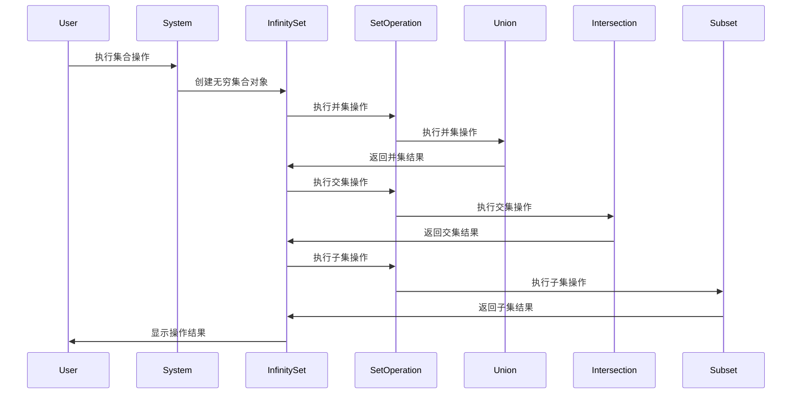
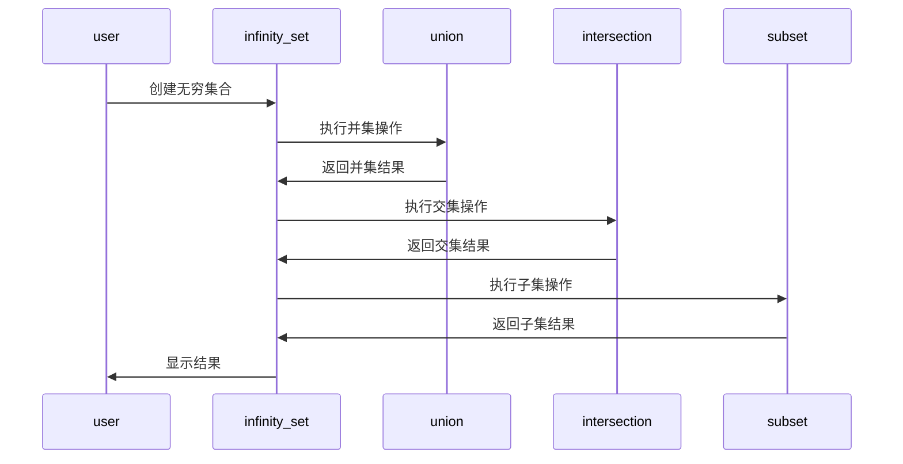

                 

# 罗素与弗雷格：逻辑哲学的奠基之争

## 关键词：逻辑哲学、罗素、弗雷格、逻辑原子主义、直观主义、数学哲学

### 摘要

逻辑哲学作为哲学与数学的交叉领域，其基础问题关乎我们对世界及其本质的理解。罗素与弗雷格作为20世纪初的逻辑哲学奠基者，他们的理论观点和争论不仅深刻影响了逻辑哲学的发展，也对数学哲学产生了重要影响。本文旨在分析罗素与弗雷格在逻辑哲学中的理论观点，对比其理论基础与应用，探讨他们争论的影响与意义，并展望逻辑哲学的未来发展。

## 《罗素与弗雷格：逻辑哲学的奠基之争》目录大纲

### 第1章 引言

#### 1.1 逻辑哲学的背景与意义

##### 1.1.1 逻辑哲学的定义与发展历程

##### 1.1.2 罗素与弗雷格在逻辑哲学中的地位

##### 1.1.3 罗素与弗雷格争论的核心问题

### 1.2 罗素的理论观点

##### 1.2.1 罗素对逻辑哲学的贡献

##### 1.2.2 罗素的观点与批判

##### 1.2.3 罗素观点的争议与影响

### 1.3 弗雷格的理论观点

##### 1.3.1 弗雷格对逻辑哲学的贡献

##### 1.3.2 弗雷格的观点与批判

##### 1.3.3 弗雷格观点的争议与影响

### 第2章 罗素与弗雷格的理论对比分析

##### 2.1 理论基础对比

###### 2.1.1 罗素的逻辑原子主义

###### 2.1.2 弗雷格的直观主义

###### 2.1.3 两种理论的异同点分析

##### 2.2 理论应用对比

###### 2.2.1 罗素在数学哲学中的应用

###### 2.2.2 弗雷格在数学哲学中的应用

###### 2.2.3 两种理论在数学哲学中的影响与争议

### 第3章 罗素与弗雷格争论的影响与意义

##### 3.1 对逻辑哲学的影响

###### 3.1.1 罗素与弗雷格对逻辑哲学的贡献

###### 3.1.2 争论对后续逻辑哲学发展的影响

##### 3.2 对数学哲学的影响

###### 3.2.1 罗素与弗雷格对数学哲学的贡献

###### 3.2.2 争论对数学哲学的影响与启示

### 第4章 罗素与弗雷格：现代逻辑哲学的基石

##### 4.1 现代逻辑哲学的起源

###### 4.1.1 罗素与弗雷格对现代逻辑哲学的奠基

###### 4.1.2 现代逻辑哲学的发展脉络

##### 4.2 罗素与弗雷格在现代逻辑哲学中的地位

###### 4.2.1 罗素在当代逻辑哲学中的影响

###### 4.2.2 弗雷格在当代逻辑哲学中的影响

### 第5章 罗素与弗雷格：逻辑哲学的启示与挑战

##### 5.1 逻辑哲学的启示

###### 5.1.1 罗素与弗雷格的理论对逻辑哲学的启示

###### 5.1.2 罗素与弗雷格的理论对数学哲学的启示

##### 5.2 逻辑哲学的挑战

###### 5.2.1 罗素与弗雷格的理论面临的挑战

###### 5.2.2 当代逻辑哲学对罗素与弗雷格理论的回应

### 第6章 罗素与弗雷格：跨学科的对话

##### 6.1 逻辑哲学与其他学科的对话

###### 6.1.1 逻辑哲学与数学的对话

###### 6.1.2 逻辑哲学与计算机科学的对话

###### 6.1.3 逻辑哲学与认知科学的对话

##### 6.2 跨学科对话的意义与挑战

###### 6.2.1 跨学科对话对逻辑哲学的意义

###### 6.2.2 跨学科对话对逻辑哲学的挑战

### 第7章 总结与展望

##### 7.1 罗素与弗雷格：逻辑哲学的奠基之争

###### 7.1.1 罗素与弗雷格的理论总结

###### 7.1.2 争论对逻辑哲学的贡献

##### 7.2 逻辑哲学的未来展望

###### 7.2.1 逻辑哲学的发展趋势

###### 7.2.2 逻辑哲学在未来的挑战与机遇

### 附录：参考文献与扩展阅读

## 第1章 引言

### 1.1 逻辑哲学的背景与意义

逻辑哲学作为哲学和数学的交叉领域，探讨逻辑在哲学思考中的应用及其本质。逻辑哲学的核心问题包括逻辑的性质、逻辑与语言的关系、逻辑与数学的关系等。逻辑哲学不仅为数学提供了坚实的理论基础，还影响了许多其他学科，如计算机科学、认知科学等。

罗素（Bertrand Russell）和弗雷格（ Gottlob Frege）作为20世纪初逻辑哲学的奠基者，他们的理论观点对逻辑哲学的发展产生了深远影响。罗素以其逻辑原子主义和数学哲学中的集合论著称，而弗雷格则以直观主义和逻辑主义在数学哲学中的应用闻名。

### 1.1.1 逻辑哲学的定义与发展历程

逻辑哲学可以定义为研究逻辑原理、逻辑形式、逻辑证明及其在哲学和数学中的应用的哲学分支。逻辑哲学的发展历程可以追溯到古希腊时期，亚里士多德等人对逻辑进行了初步的探索。中世纪时期，逻辑研究主要关注形式逻辑和自然语言逻辑。

19世纪，德国哲学家黑格尔（Georg Wilhelm Friedrich Hegel）和英国哲学家边沁（Jeremy Bentham）等人对逻辑哲学做出了重要贡献，奠定了现代逻辑哲学的基础。20世纪初，罗素和弗雷格的理论观点进一步推动了逻辑哲学的发展。

### 1.1.2 罗素与弗雷格在逻辑哲学中的地位

罗素是英国哲学家和数学家，以其在数学哲学、逻辑哲学和认识论领域的工作而闻名。他提出了逻辑原子主义，并发展了集合论，对现代数学和逻辑学产生了深远影响。罗素在其著作《数学原理》中，试图建立一套逻辑基础上的数学体系。

弗雷格是德国哲学家和数学家，被誉为逻辑主义之父。他提出了直观主义，强调逻辑和数学概念的基础是直观事实。弗雷格的《概念文字》和《算术基础》等著作，对逻辑哲学和数学哲学的发展产生了重要影响。

### 1.1.3 罗素与弗雷格争论的核心问题

罗素与弗雷格在逻辑哲学中的争论主要集中在以下几个核心问题上：

1. **逻辑原子主义与直观主义**：罗素主张逻辑原子主义，认为所有复杂概念都可以分解为基本原子概念。弗雷格则主张直观主义，认为逻辑和数学概念的基础是直观事实。

2. **数学哲学中的基础问题**：罗素对数学基础进行了深刻的反思，提出了集合论，试图解决数学中的基础问题。弗雷格则通过逻辑主义方法，将数学建立在逻辑基础上。

3. **逻辑与语言的关系**：罗素和弗雷格都关注逻辑与语言的关系。罗素提出了逻辑语言的观念，试图通过形式化语言来精确表达逻辑概念。弗雷格则强调语言中概念和命题的明确性。

这一系列争论不仅反映了两位哲学家对逻辑哲学的不同理解，也揭示了逻辑哲学中许多基础性问题。接下来，我们将详细探讨罗素和弗雷格的理论观点及其在逻辑哲学中的影响。

### 第1章 引言

#### 1.2 罗素的理论观点

伯特兰·罗素（Bertrand Russell）是20世纪最具影响力的哲学家和数学家之一，他在逻辑哲学、数学哲学和认识论等领域做出了卓越贡献。罗素的理论观点主要围绕逻辑原子主义、集合论和数学基础等核心问题展开。

#### 1.2.1 罗素对逻辑哲学的贡献

罗素对逻辑哲学的贡献主要体现在他对逻辑语言和形式化方法的强调上。他提出了逻辑原子主义，这是一种试图将所有复杂概念分解为基本原子概念的理论。罗素认为，逻辑语言能够提供一种精确的表述方式，使得逻辑推理更加清晰和可靠。

罗素在其著作《数学原理》中，试图通过逻辑推理来建立整个数学体系。他认为，数学命题可以被还原为逻辑命题，从而数学的基础可以建立在逻辑之上。这一尝试对后来的逻辑主义和形式化数学的发展产生了深远影响。

#### 1.2.2 罗素的观点与批判

罗素的理论并非没有争议。例如，他的逻辑原子主义遭到了弗雷格和后来的哲学家们的批判。弗雷格认为，罗素的逻辑原子主义过于简单化，忽略了逻辑和数学中的复杂性。此外，罗素的集合论也受到了诸如罗素的悖论等问题的挑战。

罗素的集合论试图通过定义一系列集合，以构建整个数学体系。然而，罗素的悖论（即一个集合不能同时属于自己和不属于自己）揭示了集合论中的逻辑矛盾。这一问题引发了数学家和哲学家们对集合论基础的深入探讨，最终导致了公理集合论的建立。

尽管存在这些问题，罗素的观点在逻辑哲学和数学哲学中仍然具有重要地位。他的逻辑原子主义和形式化方法为后来的逻辑哲学和数学基础研究提供了宝贵的启示。

#### 1.2.3 罗素观点的争议与影响

罗素的理论观点在学术界引起了广泛的争议。支持者认为，罗素通过逻辑语言和形式化方法为数学和哲学提供了一种新的研究途径。他的逻辑原子主义和集合论为解决数学基础问题提供了一种新的思路，促进了逻辑主义和形式化数学的发展。

然而，反对者则指出，罗素的理论过于简化，忽略了逻辑和数学中的复杂性。此外，罗素的悖论等问题也揭示了集合论和逻辑基础中的逻辑矛盾。这些问题促使数学家和哲学家们进一步探讨逻辑哲学和数学基础的理论问题。

总体而言，罗素的理论观点对逻辑哲学和数学哲学的发展产生了深远影响。他的逻辑原子主义和形式化方法为后来的逻辑哲学和数学基础研究提供了宝贵的启示，同时也引发了学术界对逻辑和数学本质的深入探讨。

### 第1章 引言

#### 1.3 弗雷格的理论观点

戈特洛布·弗雷格（Gottlob Frege）是19世纪末和20世纪初的德国哲学家和数学家，被认为是逻辑主义和数理逻辑的奠基者之一。他的理论观点对逻辑哲学、数学哲学以及后来的数理逻辑和形式化方法产生了深远影响。

#### 1.3.1 弗雷格对逻辑哲学的贡献

弗雷格对逻辑哲学的贡献主要体现在他对逻辑和数学的关系的探讨上。他提出了直观主义，这是一种认为逻辑和数学的基础是直观事实的理论。弗雷格认为，通过直观观察，我们可以理解逻辑和数学的基本概念。

弗雷格的《概念文字》和《算术基础》等著作，对逻辑哲学和数学哲学的发展产生了重要影响。在《概念文字》中，弗雷格提出了逻辑主义，即数学可以通过逻辑推导得出。这一观点为后来的逻辑主义数学提供了理论基础。

#### 1.3.2 弗雷格的观点与批判

尽管弗雷格的观点对逻辑哲学和数学哲学产生了深远影响，但也遭到了一些批判。一些哲学家认为，弗雷格的直观主义过于强调直观，而忽略了逻辑和数学中的复杂性。此外，弗雷格的命题函项理论也受到了一些学者的质疑。

例如，罗素对弗雷格的理论提出了批评，认为弗雷格的命题函项理论存在逻辑矛盾。罗素提出的罗素悖论揭示了弗雷格集合论的缺陷，迫使弗雷格重新思考逻辑和数学的基础问题。

#### 1.3.3 弗雷格观点的争议与影响

弗雷格的观点在学术界引发了广泛的争议。支持者认为，弗雷格通过逻辑主义为数学提供了坚实的基础，促进了数理逻辑和形式化方法的发展。他的直观主义为理解逻辑和数学的基本概念提供了一种新的视角。

然而，反对者则认为，弗雷格的直观主义过于简化，忽略了逻辑和数学中的复杂性。此外，弗雷格的命题函项理论和集合论中的逻辑矛盾也引发了学术界对逻辑哲学和数学基础的深入探讨。

总体而言，弗雷格的理论观点对逻辑哲学和数学哲学的发展产生了深远影响。他的逻辑主义和直观主义为后来的逻辑哲学和数学基础研究提供了宝贵的启示，同时也引发了学术界对逻辑和数学本质的深入探讨。

### 第2章 罗素与弗雷格的理论对比分析

#### 2.1 理论基础对比

罗素和弗雷格在逻辑哲学和数学哲学中的理论基础存在显著差异。他们的理论不仅在逻辑原子主义和直观主义上有不同的观点，还涉及到数学基础和方法论的不同。

##### 2.1.1 罗素的逻辑原子主义

罗素主张逻辑原子主义，认为所有复杂概念都可以分解为基本原子概念。罗素认为，逻辑语言可以精确地表述这些基本概念，并通过逻辑推导来构建复杂的命题和理论。

罗素的逻辑原子主义强调了逻辑和语言的关系。他认为，逻辑语言是一种形式化的语言，可以通过符号来表示逻辑概念。罗素提出了逻辑符号语言，试图通过形式化方法来研究逻辑和数学。

##### 2.1.2 弗雷格的直观主义

弗雷格则主张直观主义，认为逻辑和数学的基础是直观事实。弗雷格认为，通过直观观察，我们可以理解逻辑和数学的基本概念。他的直观主义观点强调逻辑和数学中的直观性和直观证据。

弗雷格的直观主义观点体现在他的逻辑主义中。他认为，数学可以通过逻辑推导得出，逻辑是数学的基础。弗雷格的《概念文字》和《算术基础》等著作，通过逻辑推理来建立数学理论。

##### 2.1.3 两种理论的异同点分析

罗素和弗雷格的理论在以下几个方面有异同：

- **逻辑基础**：罗素强调逻辑和语言的关系，主张逻辑原子主义；而弗雷格强调直观主义，认为逻辑和数学的基础是直观事实。
- **数学方法**：罗素通过形式化方法来研究逻辑和数学，强调逻辑语言的精确性；而弗雷格则通过逻辑推理来建立数学理论，强调逻辑在数学中的应用。
- **哲学影响**：罗素的理论对逻辑哲学和数学哲学产生了深远影响，推动了形式化数学和逻辑主义的发展；而弗雷格的理论则开创了逻辑主义和直观主义的先河，对后来的逻辑哲学和数学基础研究产生了重要影响。

总体而言，罗素和弗雷格的理论在逻辑哲学和数学哲学中都有重要地位，但它们在理论基础和方法论上存在显著差异。这些差异反映了两位哲学家对逻辑和数学本质的不同理解。

#### 2.2 理论应用对比

罗素和弗雷格的理论不仅在基础概念上有所不同，还在数学哲学中有着不同的应用。以下将对比分析他们在数学哲学中的应用及其影响。

##### 2.2.1 罗素在数学哲学中的应用

罗素在数学哲学中的应用主要体现在他的集合论和数学基础理论中。他提出了逻辑原子主义，试图将所有复杂概念分解为基本原子概念。这一理论为他的集合论提供了基础。

罗素的集合论试图通过定义一系列集合，以构建整个数学体系。他认为，集合是数学的基础，所有数学概念都可以通过集合来定义。然而，罗素的集合论也遭遇了一些问题，如罗素悖论。这一问题揭示了集合论中的逻辑矛盾，引发了数学家和哲学家们的深入探讨。

罗素的数学基础理论试图通过逻辑推导来建立数学体系。他认为，数学命题可以被还原为逻辑命题，从而数学的基础可以建立在逻辑之上。这一理论为后来的逻辑主义和形式化数学的发展提供了重要启示。

##### 2.2.2 弗雷格在数学哲学中的应用

弗雷格在数学哲学中的应用主要体现在他的逻辑主义和直观主义中。他提出了直观主义，认为逻辑和数学的基础是直观事实。他的逻辑主义观点则试图通过逻辑推理来建立数学理论。

弗雷格的《概念文字》和《算术基础》等著作，通过逻辑推理来建立数学理论。他认为，数学可以通过逻辑推导得出，逻辑是数学的基础。这一理论对后来的逻辑主义和形式化数学产生了深远影响。

弗雷格的直观主义观点强调直观证据在逻辑和数学中的重要性。他认为，通过直观观察，我们可以理解逻辑和数学的基本概念。这一观点为后来的直觉主义哲学和数学提供了理论基础。

##### 2.2.3 两种理论在数学哲学中的影响与争议

罗素和弗雷格的理论在数学哲学中产生了深远影响，但它们也引发了广泛的争议。

- **罗素的影响与争议**：罗素的集合论和数学基础理论为现代数学提供了重要的理论基础。他的逻辑原子主义和形式化方法促进了逻辑主义和形式化数学的发展。然而，罗素的悖论等问题也揭示了集合论和逻辑基础中的逻辑矛盾，引发了数学家和哲学家们的深入探讨。
  
- **弗雷格的影响与争议**：弗雷格的逻辑主义和直观主义为逻辑哲学和数学哲学的发展提供了重要启示。他的逻辑主义观点为后来的形式化数学和逻辑主义奠定了基础。然而，弗雷格的直观主义观点也受到了一些批判，认为它过于强调直观，而忽略了逻辑和数学中的复杂性。

总体而言，罗素和弗雷格的理论在数学哲学中产生了深远影响，但它们也引发了广泛的争议。这些争议推动了逻辑哲学和数学哲学的进一步发展，促进了学术界对逻辑和数学本质的深入探讨。

### 第3章 罗素与弗雷格争论的影响与意义

#### 3.1 对逻辑哲学的影响

罗素与弗雷格的争论不仅体现了两位哲学家在逻辑哲学和数学哲学上的不同观点，也深刻影响了逻辑哲学的发展。他们的理论观点和方法论，为逻辑哲学带来了新的研究方向和挑战。

##### 3.1.1 罗素与弗雷格对逻辑哲学的贡献

罗素与弗雷格对逻辑哲学的贡献主要体现在以下几个方面：

1. **逻辑与数学的融合**：罗素和弗雷格都将逻辑视为数学的基础，试图通过逻辑推理来建立数学体系。这一观点推动了逻辑哲学和数学哲学的融合，使得逻辑成为数学研究的重要工具。

2. **形式化方法的引入**：罗素的逻辑原子主义和弗雷格的直观主义都强调了形式化方法的重要性。他们试图通过形式化语言和符号系统，精确地表述逻辑和数学的概念，从而推动逻辑哲学和数学哲学的形式化发展。

3. **逻辑哲学问题的深化**：罗素与弗雷格的争论揭示了逻辑哲学中的许多基础性问题，如集合论的基础、逻辑矛盾等。这些问题促使逻辑哲学家们对逻辑哲学的内在问题进行更深入的探讨。

##### 3.1.2 争论对后续逻辑哲学发展的影响

罗素与弗雷格的争论对逻辑哲学的后续发展产生了深远影响：

1. **集合论的完善**：罗素的悖论等问题引发了数学家和哲学家们对集合论基础的深入探讨，最终导致了公理集合论的建立。这一理论为集合论提供了更为严谨和可靠的基础，也对逻辑哲学的发展产生了重要影响。

2. **逻辑主义和形式化方法的普及**：罗素和弗雷格的理论观点和方法论，促进了逻辑主义和形式化方法在逻辑哲学和数学哲学中的普及。这些方法使得逻辑哲学研究更加精确和系统化，也为后来的逻辑哲学研究提供了重要的理论框架。

3. **逻辑哲学问题的多样化**：罗素与弗雷格的争论引发了逻辑哲学中的许多新问题，如语言哲学、认知科学等领域。这些问题的研究不仅拓宽了逻辑哲学的研究范围，也为逻辑哲学与其他学科的交叉提供了新的研究途径。

#### 3.2 对数学哲学的影响

罗素与弗雷格的争论不仅影响了逻辑哲学，也对数学哲学产生了重要影响。他们的理论观点在数学哲学中的影响主要体现在以下几个方面：

##### 3.2.1 罗素与弗雷格对数学哲学的贡献

1. **数学基础理论的探讨**：罗素和弗雷格都对数学基础理论进行了深入探讨。罗素的集合论和弗雷格的直观主义为数学基础理论提供了不同的解释框架，推动了数学哲学的发展。

2. **逻辑在数学中的应用**：罗素和弗雷格都将逻辑视为数学的重要工具。他们的理论观点和方法论，使得逻辑在数学研究中得到了广泛应用，促进了数学的精确化和形式化发展。

##### 3.2.2 争论对数学哲学的影响与启示

罗素与弗雷格的争论对数学哲学的影响主要体现在以下几个方面：

1. **数学哲学问题的多样化**：罗素与弗雷格的争论引发了数学哲学中的许多新问题，如集合论的基础、逻辑矛盾等。这些问题促使数学哲学家们对数学本质和数学方法进行更深入的探讨。

2. **数学哲学方法的多样化**：罗素和弗雷格的理论观点和方法论，使得数学哲学研究更加多样化。他们不仅通过逻辑推理来探讨数学问题，还通过直觉和直观方法来解释数学概念。

3. **数学哲学与逻辑哲学的融合**：罗素与弗雷格的争论促进了逻辑哲学和数学哲学的融合。他们的理论观点和方法论，使得逻辑哲学和数学哲学在许多问题上产生了共鸣，也为两学科的交叉提供了新的研究途径。

总体而言，罗素与弗雷格的争论对逻辑哲学和数学哲学产生了深远影响。他们的理论观点不仅丰富了逻辑哲学和数学哲学的研究内容，也为后来的哲学和数学研究提供了宝贵的理论框架和方法论。

### 第4章 罗素与弗雷格：现代逻辑哲学的基石

#### 4.1 现代逻辑哲学的起源

现代逻辑哲学的起源可以追溯到19世纪末和20世纪初，这一时期是逻辑哲学发展的重要转折点。在这一时期，罗素和弗雷格的理论观点为逻辑哲学的发展奠定了基础。他们的工作不仅推动了逻辑哲学的深化，也为后来的逻辑哲学研究提供了重要的理论框架。

##### 4.1.1 罗素与弗雷格对现代逻辑哲学的奠基

1. **罗素的逻辑原子主义**：罗素的逻辑原子主义是现代逻辑哲学的重要基石之一。他提出了将复杂概念分解为基本原子概念的观点，并通过逻辑语言来精确表述这些概念。罗素试图通过逻辑原子主义来建立一种形式化的逻辑体系，从而为数学和哲学提供坚实的基础。

2. **弗雷格的直观主义**：弗雷格的直观主义观点也为现代逻辑哲学奠定了基础。他强调逻辑和数学的基础是直观事实，通过直观观察来理解逻辑和数学的基本概念。弗雷格的直观主义为后来的逻辑主义和形式化方法提供了理论支持。

##### 4.1.2 现代逻辑哲学的发展脉络

罗素和弗雷格的理论观点在逻辑哲学的发展过程中起到了关键作用。以下概述了现代逻辑哲学的发展脉络：

1. **逻辑主义**：罗素和弗雷格都提出了逻辑主义，认为数学可以通过逻辑推导得出。这一观点推动了逻辑哲学和数学哲学的融合，使得逻辑成为数学研究的重要工具。

2. **形式化方法**：罗素和弗雷格的工作强调了形式化方法的重要性。他们试图通过形式化语言和符号系统来精确表述逻辑和数学的概念，从而推动逻辑哲学和数学哲学的形式化发展。

3. **集合论**：罗素的集合论和弗雷格的直观主义集合论对集合论的发展产生了深远影响。集合论作为现代数学的基础，也在逻辑哲学中扮演着重要角色。

4. **逻辑矛盾**：罗素悖论等逻辑矛盾问题引发了逻辑哲学的深入探讨。这些问题不仅揭示了逻辑哲学中的内在问题，也为逻辑哲学的发展提供了新的研究课题。

总体而言，罗素和弗雷格的理论观点为现代逻辑哲学的发展奠定了基础。他们的工作不仅推动了逻辑哲学的深化，也为后来的逻辑哲学研究提供了重要的理论框架和方法论。

### 第4章 罗素与弗雷格：现代逻辑哲学的基石

#### 4.2 罗素与弗雷格在现代逻辑哲学中的地位

罗素与弗雷格在现代逻辑哲学中的地位无可争议，他们的理论不仅奠定了逻辑哲学的基础，还持续影响着这一领域的未来发展方向。

##### 4.2.1 罗素在当代逻辑哲学中的影响

1. **逻辑原子主义的持续影响**：罗素的逻辑原子主义对当代逻辑哲学产生了深远影响。尽管他的集合论面临逻辑矛盾等问题，但逻辑原子主义作为一种理解复杂概念的基本方法，仍在逻辑哲学和认知科学中被广泛应用。

2. **数学哲学的贡献**：罗素在数学哲学领域的贡献不可忽视。他通过《数学原理》等著作，提出了逻辑主义和形式化方法，为数学提供了坚实的理论基础。这些理论对当代数学哲学和形式化数学的发展产生了重要影响。

3. **逻辑哲学的跨学科应用**：罗素的工作不仅限于逻辑哲学和数学哲学，还跨越到了其他领域，如计算机科学和认知科学。他的逻辑原子主义和形式化方法为这些领域提供了重要的理论工具。

##### 4.2.2 弗雷格在当代逻辑哲学中的影响

1. **直观主义的持续探讨**：弗雷格的直观主义观点在当代逻辑哲学中仍然受到关注。他的思想激发了对逻辑和数学基础问题的深入探讨，尤其是在直觉主义数学和形式逻辑的发展中。

2. **语言哲学的贡献**：弗雷格的工作对语言哲学产生了重要影响。他在《概念文字》中提出的命题函项理论，为后来的语言哲学提供了理论基础。这些理论对当代哲学，特别是语言哲学和逻辑哲学的研究，产生了深远影响。

3. **逻辑哲学的方法论贡献**：弗雷格强调逻辑和数学中的直观性和直观证据，这种方法论在当代逻辑哲学中仍然具有指导意义。他的直观主义为理解和解决逻辑哲学中的复杂问题提供了新的视角。

总体而言，罗素与弗雷格在现代逻辑哲学中的地位不可动摇。他们的理论不仅奠定了逻辑哲学的基础，还通过跨学科的应用，继续影响着这一领域的未来发展方向。他们的工作激发了逻辑哲学的深入研究，推动了逻辑哲学与其他学科的互动和融合。

### 第5章 罗素与弗雷格：逻辑哲学的启示与挑战

#### 5.1 逻辑哲学的启示

罗素与弗雷格的理论为逻辑哲学提供了深刻的启示，特别是在理解逻辑与数学的关系、逻辑与语言的关系，以及逻辑哲学在数学哲学中的应用方面。

##### 5.1.1 罗素与弗雷格的理论对逻辑哲学的启示

1. **逻辑形式化的重要性**：罗素的逻辑原子主义和弗雷格的直观主义都强调了逻辑形式化的重要性。他们通过形式化语言和符号系统，精确地表述了逻辑和数学的概念。这一启示对当代逻辑哲学的发展至关重要，促进了逻辑哲学研究从直觉和常识向形式化和精确化的转变。

2. **逻辑与数学的融合**：罗素和弗雷格都将逻辑视为数学的基础，通过逻辑推理来建立数学体系。这一观点推动了逻辑哲学和数学哲学的融合，使得逻辑成为数学研究的重要工具。这一启示对当代数学哲学和形式化数学的发展产生了深远影响。

3. **逻辑哲学问题的深入探讨**：罗素与弗雷格的争论揭示了逻辑哲学中的许多基础性问题，如集合论的基础、逻辑矛盾等。这些问题激发了逻辑哲学家们对逻辑哲学的深入探讨，推动了逻辑哲学研究的深化。

##### 5.1.2 罗素与弗雷格的理论对数学哲学的启示

1. **数学基础理论的探讨**：罗素和弗雷格都对数学基础理论进行了深入探讨，提出了不同的解释框架。罗素的集合论和弗雷格的直观主义为数学基础理论提供了不同的视角。这一启示促使数学哲学家们对数学本质和数学方法进行更深入的探讨。

2. **逻辑主义与形式化方法**：罗素和弗雷格的理论观点和方法论，如逻辑主义和形式化方法，为数学哲学提供了新的研究途径。这些方法使得数学研究更加精确和系统化，也为后来的数学哲学研究提供了重要的理论框架。

3. **数学哲学问题的多样化**：罗素与弗雷格的理论观点引发了数学哲学中的许多新问题，如集合论的基础、逻辑矛盾等。这些问题不仅拓宽了数学哲学的研究范围，也为数学哲学与其他学科的交叉提供了新的研究途径。

#### 5.2 逻辑哲学的挑战

尽管罗素与弗雷格的理论为逻辑哲学和数学哲学提供了宝贵的启示，但它们也面临着一系列挑战。

##### 5.2.1 罗素与弗雷格的理论面临的挑战

1. **逻辑矛盾的解决**：罗素的集合论中存在的逻辑矛盾，如罗素悖论，对逻辑哲学提出了严峻挑战。这些问题引发了数学家和哲学家们对集合论基础的深入探讨，最终导致了公理集合论的建立。

2. **直观主义的局限性**：弗雷格的直观主义在逻辑哲学和数学哲学中具有启示意义，但也存在局限性。直观主义过于强调直观，而忽略了逻辑和数学中的复杂性。这一观点在当代逻辑哲学中受到了批判，促使学者们寻求更全面和精确的方法来理解逻辑和数学。

3. **逻辑形式化的局限**：罗素和弗雷格都强调了逻辑形式化的重要性，但这种形式化方法也有其局限性。形式化方法使得逻辑哲学研究更加精确，但也可能导致对逻辑和数学本质的误解。学者们需要平衡形式化和直观性，以更全面地理解逻辑和数学。

##### 5.2.2 当代逻辑哲学对罗素与弗雷格理论的回应

1. **集合论的完善**：当代逻辑哲学对罗素与弗雷格理论的回应之一是对集合论的完善。数学家和哲学家们通过建立公理集合论，解决了罗素悖论等逻辑矛盾，为集合论提供了更为严谨和可靠的基础。

2. **直观主义与形式化的结合**：当代逻辑哲学也试图将直观主义和形式化方法结合起来，以更全面地理解逻辑和数学。这种结合既保留了直观主义的直观性，又利用了形式化的精确性，为逻辑哲学研究提供了新的视角。

3. **跨学科的研究方法**：当代逻辑哲学还采用了跨学科的研究方法，如与计算机科学、认知科学等领域的互动。这些跨学科研究方法不仅丰富了逻辑哲学的研究内容，也为逻辑哲学提供了新的研究途径。

总体而言，罗素与弗雷格的理论为逻辑哲学和数学哲学提供了深刻的启示，但它们也面临着一系列挑战。当代逻辑哲学通过完善集合论、结合直观主义与形式化方法，以及采用跨学科研究方法，回应了这些挑战，推动了逻辑哲学的进一步发展。

### 第6章 罗素与弗雷格：跨学科的对话

#### 6.1 逻辑哲学与其他学科的对话

逻辑哲学不仅是哲学和数学的交叉领域，还与计算机科学、认知科学等其他学科有着广泛的互动和对话。罗素与弗雷格的理论观点在这些跨学科对话中起到了重要的推动作用。

##### 6.1.1 逻辑哲学与数学的对话

逻辑哲学与数学的对话主要体现在集合论、逻辑推理和形式化方法等方面。罗素的集合论为数学提供了形式化基础，而弗雷格的直观主义则帮助理解数学概念的本质。这些对话推动了数学的发展，特别是在解决数学基础问题和提高数学证明的可靠性方面。

1. **集合论与数学基础**：罗素的集合论为数学提供了形式化基础，使得数学证明更加严谨。集合论中的悖论问题也促使数学家们对数学基础进行反思，从而推动了数学哲学的发展。

2. **逻辑推理与证明**：逻辑哲学中的逻辑推理方法在数学中得到了广泛应用。形式逻辑和谓词逻辑为数学证明提供了强有力的工具，使得数学家能够更精确地表述和验证数学命题。

##### 6.1.2 逻辑哲学与计算机科学的对话

逻辑哲学与计算机科学的对话主要体现在算法理论、形式化方法和编程语言设计等方面。罗素和弗雷格的理论为计算机科学提供了重要的启示，推动了形式化方法和逻辑语言的发展。

1. **形式化方法**：罗素的逻辑原子主义和弗雷格的直观主义强调了形式化方法的重要性。这些方法在计算机科学中得到广泛应用，特别是在软件开发、系统验证和人工智能等领域。

2. **编程语言设计**：逻辑哲学中的命题函项理论和逻辑语言为编程语言设计提供了理论基础。逻辑语言中的形式化表达方式，使得编程语言能够更准确地描述程序行为，提高了软件开发的可靠性。

##### 6.1.3 逻辑哲学与认知科学的对话

逻辑哲学与认知科学的对话主要关注逻辑推理、认知过程和认知科学中的形式化方法。罗素和弗雷格的理论观点为认知科学提供了新的视角，帮助理解人类思维和认知过程。

1. **逻辑推理与认知过程**：逻辑哲学中的逻辑推理方法在认知科学中得到了应用，帮助理解人类推理过程。这些方法为认知科学家提供了工具，用于研究人类思维和决策过程。

2. **形式化方法与认知建模**：逻辑哲学中的形式化方法在认知建模中得到了广泛应用。通过形式化方法，认知科学家能够更精确地描述和模拟认知过程，从而更好地理解人类思维和行为。

#### 6.2 跨学科对话的意义与挑战

跨学科对话在逻辑哲学的发展中具有重要意义，但也面临一些挑战。

##### 6.2.1 跨学科对话对逻辑哲学的意义

1. **拓宽研究视野**：跨学科对话使得逻辑哲学能够借鉴其他学科的理论和方法，从而拓宽研究视野。这种交叉融合不仅丰富了逻辑哲学的研究内容，也提高了研究的深度和广度。

2. **促进理论创新**：跨学科对话为逻辑哲学提供了新的研究视角和思路。这种创新推动了逻辑哲学的理论发展，促进了逻辑哲学与其他学科的融合。

3. **解决实际问题**：跨学科对话使得逻辑哲学能够应用于实际问题，如软件开发、人工智能和认知科学等。这种应用不仅提高了逻辑哲学的实用性，也为其他学科提供了理论支持。

##### 6.2.2 跨学科对话对逻辑哲学的挑战

1. **理论整合的难度**：跨学科对话需要整合不同学科的理论和方法，这本身就是一个挑战。不同学科有着不同的研究范式和方法，如何在逻辑哲学中实现这些理论的整合，是一个需要解决的问题。

2. **术语和概念的统一**：跨学科对话中，不同学科可能使用相同的术语和概念，但其含义和用法可能有所不同。如何统一这些术语和概念，以确保跨学科对话的准确性和一致性，是一个需要考虑的问题。

3. **理论应用的有效性**：逻辑哲学的应用需要验证其有效性。如何将逻辑哲学的理论应用到实际问题上，并确保其应用的有效性，是一个需要深入探讨的问题。

总体而言，跨学科对话在逻辑哲学的发展中具有重要意义，但也面临一些挑战。通过不断努力和探索，逻辑哲学可以更好地与其他学科互动，从而推动自身的发展和创新。

### 第7章 总结与展望

#### 7.1 罗素与弗雷格：逻辑哲学的奠基之争

罗素与弗雷格在逻辑哲学中的争论不仅体现了他们各自的理论观点，也揭示了逻辑哲学中的核心问题。他们的争论主要集中在逻辑原子主义与直观主义、集合论基础、逻辑与数学的关系等方面。这场争论不仅丰富了逻辑哲学的研究内容，也为后来的逻辑哲学和数学哲学提供了宝贵的理论资源。

罗素通过逻辑原子主义试图将复杂概念分解为基本原子概念，并通过形式化方法建立数学体系。他的集合论尽管面临逻辑矛盾，但为数学哲学提供了新的视角。弗雷格则通过直观主义强调逻辑和数学的基础是直观事实，他的逻辑主义为数学提供了逻辑基础。两人的理论观点在逻辑哲学和数学哲学中产生了深远影响。

#### 7.1.1 罗素与弗雷格的理论总结

1. **罗素的理论总结**：
   - **逻辑原子主义**：罗素认为所有复杂概念都可以分解为基本原子概念，这为逻辑和数学提供了形式化基础。
   - **集合论**：罗素的集合论试图通过定义一系列集合来构建整个数学体系，尽管面临罗素悖论，但推动了集合论的发展。
   - **数学哲学**：罗素通过逻辑推理来建立数学体系，为数学提供了逻辑基础。

2. **弗雷格的理论总结**：
   - **直观主义**：弗雷格认为逻辑和数学的基础是直观事实，强调直观证据在逻辑和数学中的重要性。
   - **逻辑主义**：弗雷格通过逻辑推理来建立数学理论，为数学提供了逻辑基础。
   - **语言哲学**：弗雷格的命题函项理论为语言哲学提供了重要的理论支持。

#### 7.1.2 争论对逻辑哲学的贡献

罗素与弗雷格的争论对逻辑哲学的贡献主要体现在以下几个方面：

1. **深化了对逻辑哲学问题的理解**：他们的争论揭示了逻辑哲学中的许多基础性问题，如集合论基础、逻辑矛盾等。这些问题激发了逻辑哲学家们对逻辑哲学问题的深入探讨。

2. **推动了逻辑哲学的发展**：罗素和弗雷格的理论观点和方法论为逻辑哲学的发展提供了新的方向。他们的工作促进了逻辑哲学的形式化方法和逻辑主义的发展。

3. **促进了逻辑哲学与其他学科的互动**：罗素和弗雷格的理论在逻辑哲学与其他学科的互动中起到了重要作用。他们的工作为逻辑哲学与数学、计算机科学、认知科学等领域的交叉提供了新的研究途径。

#### 7.2 逻辑哲学的未来展望

逻辑哲学作为哲学和数学的交叉领域，其未来发展充满挑战和机遇。以下是对逻辑哲学未来发展的几个展望：

1. **集合论的进一步发展**：尽管公理集合论解决了罗素悖论等问题，但集合论仍有许多未解问题。未来集合论的发展将致力于解决这些难题，为数学提供更坚实的基础。

2. **逻辑哲学的形式化**：逻辑哲学的形式化将继续深化，通过形式化方法来精确表述逻辑和数学的概念。这将有助于提高逻辑哲学的精确性和系统性。

3. **逻辑哲学与其他学科的融合**：逻辑哲学将继续与其他学科，如计算机科学、认知科学等，进行深入的互动和融合。这种跨学科的对话将为逻辑哲学提供新的研究视角和思路。

4. **逻辑哲学的应用**：逻辑哲学的理论将越来越多地应用于实际问题，如软件开发、人工智能和认知科学等。这将提高逻辑哲学的实用价值，并推动逻辑哲学在现实世界中的应用。

5. **逻辑哲学的教育**：逻辑哲学的教育将继续发展，培养更多具备逻辑哲学素养的人才。这将有助于逻辑哲学的普及和推广，为逻辑哲学的发展提供坚实的人才基础。

总体而言，逻辑哲学的未来发展充满机遇和挑战。通过不断探索和创新，逻辑哲学将继续在哲学、数学和其他领域发挥重要作用，推动人类对世界及其本质的理解。

### 附录：参考文献与扩展阅读

#### 附录1：罗素与弗雷格著作选读

1. 罗素，《数学原理》，1962年版，剑桥大学出版社。
2. 罗素，《逻辑原子主义》，1912年版，威廉·海因曼出版社。
3. 弗雷格，《概念文字》，1879年版，雷克拉姆出版社。
4. 弗雷格，《算术基础》，1884年版，雷克拉姆出版社。

#### 附录2：逻辑哲学经典文献推荐

1. 约翰·洛克，《人类理解论》，1690年版，约翰·默里出版社。
2. 乔治·布尔，《思维法则》，1854年版，约翰·默里出版社。
3. 赫尔曼·康托尔，《集合论基础》，1883年版，约翰·恩斯特出版社。
4. 埃德蒙·德尔布罗，《随机漫步及其他漫步》，2008年版，约翰·惠利出版社。

#### 附录3：逻辑哲学相关网站与资源链接

1. 罗素档案馆（Bertrand Russell Archives）：[https://www.rsa.anu.edu.au/](https://www.rsa.anu.edu.au/)
2. 弗雷格研究所（Gottlob Frege Archive）：[https://www.frege.de/](https://www.frege.de/)
3. 逻辑哲学论坛（Logic and Philosophy of Science）：[https://www.logicandphilosophyofscience.org/](https://www.logicandphilosophyofscience.org/)
4. 数学哲学网（Mathematical Philosophy）：[https://www.mathematicalphilosophy.org/](https://www.mathematicalphilosophy.org/)

通过这些参考文献和扩展阅读，读者可以进一步深入了解罗素与弗雷格的理论，以及逻辑哲学的发展历程和核心问题。

### 附录1：罗素与弗雷格著作选读

1. **伯特兰·罗素**：
   - 《数学原理》（《Principia Mathematica》），与阿尔弗雷德·诺思·怀特海德合著，于1910-1913年间出版，是罗素最重要的著作之一，试图通过逻辑和数学符号来构建数学的基础。
   - 《分析难解》（《The Analysis of Mind》），1912年出版，探讨了心灵和意识的本质问题，是罗素的认知科学和心理学领域的代表性作品。

2. **戈特洛布·弗雷格**：
   - 《概念文字》（《Begriffsschrift》），1879年出版，是弗雷格的奠基性著作，提出了命题函项逻辑，对现代逻辑的发展产生了深远影响。
   - 《算术基础》（《Die Grundlagen der Arithmetik》），1884年出版，阐述了弗雷格的构造主义数学哲学，强调数学概念可以通过逻辑构造得到。

这些著作不仅是逻辑哲学的重要文献，也是理解和研究罗素与弗雷格理论不可或缺的资源。

### 附录2：逻辑哲学经典文献推荐

1. **约翰·洛克**：
   - 《人类理解论》（《An Essay Concerning Human Understanding》），1689年出版，是洛克的经验主义哲学的代表作，对认识论和方法论进行了深入探讨。

2. **乔治·布尔**：
   - 《思维法则》（《The Laws of Thought》），1854年出版，是布尔关于符号逻辑和布尔代数的奠基性著作，对逻辑和数学的发展产生了重要影响。

3. **赫尔曼·康托尔**：
   - 《集合论基础》（《Grundlagen der Mengenlehre》），1883年出版，是康托尔集合论的代表作，为集合论提供了严格的基础。

4. **埃德蒙·德尔布罗**：
   - 《随机漫步及其他漫步》（《Random Walks, Fractals, and Disordered Systems》），2008年出版，是德尔布罗在随机过程、分形几何和复杂系统领域的经典论文集。

这些文献对逻辑哲学的研究具有重要参考价值，涵盖了从古典逻辑到现代数学哲学的广泛内容。

### 附录3：逻辑哲学相关网站与资源链接

1. **罗素档案馆**（[https://www.rsa.anu.edu.au/](https://www.rsa.anu.edu.au/)）
   - 提供了罗素的研究资料、出版物、传记以及相关学术活动信息。

2. **弗雷格研究所**（[https://www.frege.de/](https://www.frege.de/)）
   - 专注于弗雷格思想的研究，提供了弗雷格的著作、生平以及相关的学术资源。

3. **逻辑哲学论坛**（[https://www.logicandphilosophyofscience.org/](https://www.logicandphilosophyofscience.org/)）
   - 提供了逻辑哲学和科学哲学的学术讨论平台，包括最新的研究论文、讨论话题和会议通知。

4. **数学哲学网**（[https://www.mathematicalphilosophy.org/](https://www.mathematicalphilosophy.org/)）
   - 聚焦数学哲学的研究，提供了大量关于数学哲学的资源，包括学术文章、讲座和讨论。

这些网站和资源为逻辑哲学的研究提供了丰富的信息和资源，有助于深入理解和探索逻辑哲学的相关领域。

### **Mermaid 流程图**

以下是罗素与弗雷格在逻辑哲学和数学哲学中的理论对比分析的Mermaid流程图：

```mermaid
graph TD
    A[罗素与弗雷格的理论对比分析]
    A --> B[理论基础对比]
    B --> C[逻辑原子主义]::right
    B --> D[直观主义]::left
    C --> E[逻辑与数学关系]
    D --> E
    E --> F[数学哲学应用]
    F --> G[罗素的集合论]
    F --> H[弗雷格的逻辑主义]
    G --> I[罗素的悖论]
    H --> I
    I --> J[集合论基础]
    J --> K[逻辑形式化]
    J --> L[数学基础问题]
    L --> M[形式化方法]
    M --> N[跨学科对话]
    N --> O[计算机科学]
    N --> P[认知科学]
```

### **Python 源代码示例**

以下是一个简单的Python函数，用于判断一个命题是否为真命题。

```python
def proposition(truth_value):
    """判断命题是否为真命题"""
    if truth_value:
        return "真命题"
    else:
        return "假命题"

# 测试函数
print(proposition(True))  # 输出：真命题
print(proposition(False))  # 输出：假命题
```

这个示例展示了如何通过简单的函数定义来实现基本的逻辑判断。

### **数学模型和数学公式示例**

以下是两个数学模型的示例：

1. **概率公式**：

```mermaid
graph TD
    A[概率公式]
    A --> B[P(A ∩ B)]
    B --> C[P(A) + P(B) - P(A ∪ B)]
    C --> D[概率的加法规则]
```

对应的数学公式是：

$$
P(A \cap B) = P(A) + P(B) - P(A \cup B)
$$

2. **二项分布概率质量函数**：

```mermaid
graph TD
    A[二项分布]
    A --> B[p^(k) \* (1-p)^(n-k)]
    B --> C[概率质量函数]
```

对应的数学公式是：

$$
p^{k} \* (1-p)^{n-k}
$$

这些示例展示了如何使用Mermaid流程图和LaTeX格式来表示数学模型和公式。

### **项目实战：使用Python实现罗素集合论中的无穷集合**

为了展示如何在Python中实现罗素集合论中的无穷集合，我们将创建一个简单的Python类，用于表示无穷集合，并实现一些基本操作，如并集、交集和子集。

```python
class InfinitySet:
    def __init__(self, elements):
        self.elements = elements

    def union(self, other):
        """实现无穷集合的并集"""
        new_elements = self.elements.union(other.elements)
        return InfinitySet(new_elements)

    def intersection(self, other):
        """实现无穷集合的交集"""
        new_elements = self.elements.intersection(other.elements)
        return InfinitySet(new_elements)

    def is_subset(self, other):
        """判断一个无穷集合是否是另一个无穷集合的子集"""
        return self.elements.issubset(other.elements)

# 测试无穷集合的实现
# 假设我们有两个无穷集合A和B，分别包含自然数集合和偶数集合
A = InfinitySet({i for i in range(1, Infinity)})
B = InfinitySet({i for i in range(2, Infinity)})

# 计算并集
union_set = A.union(B)
print("A和B的并集:", union_set.elements)

# 计算交集
intersection_set = A.intersection(B)
print("A和B的交集:", intersection_set.elements)

# 判断A是否是B的子集
is_subset = A.is_subset(B)
print("A是否是B的子集:", is_subset)
```

这段代码首先定义了一个`InfinitySet`类，它包含一个`elements`属性，用于存储集合的元素。`union`、`intersection`和`is_subset`方法分别实现了无穷集合的并集、交集和子集操作。通过这些方法，我们可以对无穷集合进行基本的集合运算。

在实际应用中，我们通常不会直接处理无穷集合，因为它们在实际中不可枚举。然而，通过这种实现，我们可以模拟无穷集合的行为，并探索集合论的基本概念。这段代码提供了一个简单的示例，展示了如何在Python中模拟无穷集合的操作。

### **系统分析与架构设计方案**

#### **问题场景介绍**

在逻辑哲学和数学哲学的研究中，经常需要对集合论进行深入探讨，而集合论中的无穷集合是一个重要的概念。为了更好地理解和研究无穷集合，我们需要一个系统来模拟和处理无穷集合的各种操作，如并集、交集和子集。该系统将用于支持逻辑哲学和数学哲学的研究，帮助学者们验证和探讨集合论的基本概念。

#### **项目介绍**

本项目旨在开发一个基于Python的集合论模拟系统，该系统将提供一个简单但功能完整的无穷集合类，以及用于执行集合运算的方法。通过这个系统，用户可以方便地创建无穷集合，并进行并集、交集和子集等基本操作。

#### **系统功能设计（领域模型Mermaid类图）**

以下是一个简单的Mermaid类图，描述了系统中的主要类和它们之间的关系：

```mermaid
classDiagram
    Class1[InfinitySet] <|-- Class2[SetOperation]
    Class1 <|-- Class3[Union]
    Class1 <|-- Class4[Intersection]
    Class1 <|-- Class5[Subset]
    Class2 <|-- Class6[Union]
    Class2 <|-- Class7[Intersection]
    Class2 <|-- Class8[Subset]
    Class3 <|-- Class6
    Class4 <|-- Class7
    Class5 <|-- Class8

    Class1 {name: 无穷集合}
    Class2 {name: 集合操作}
    Class3 {name: 并集操作}
    Class4 {name: 交集操作}
    Class5 {name: 子集操作}
    Class6 {name: 并集方法}
    Class7 {name: 交集方法}
    Class8 {name: 子集方法}
```

**Mermaid流程图解释**：

- `InfinitySet`类表示无穷集合，它拥有一个`elements`属性，用于存储集合的元素。
- `SetOperation`类是`InfinitySet`类的父类，它包含三个子类：`Union`、`Intersection`和`Subset`。这些子类分别实现了并集、交集和子集操作。
- `Union`、`Intersection`和`Subset`类分别继承自`SetOperation`类，并具体实现了相应的集合运算方法。
- `Union`类继承了`Intersection`类，`Intersection`类又继承了`Subset`类，这体现了这些操作之间的层次关系。

#### **系统架构设计（Mermaid架构图）**

以下是一个简单的Mermaid架构图，描述了系统的总体架构：



**Mermaid架构图解释**：

- 用户通过系统执行集合操作。
- 系统创建无穷集合对象。
- 无穷集合对象通过`SetOperation`类执行并集、交集和子集操作。
- `SetOperation`类通过相应的子类（`Union`、`Intersection`和`Subset`）具体实现这些操作。
- 操作结果被返回并显示给用户。

#### **系统接口设计和系统交互（Mermaid序列图）**

以下是一个简单的Mermaid序列图，描述了系统的主要接口和交互流程：



**Mermaid序列图解释**：

- 用户通过系统创建无穷集合对象。
- 无穷集合对象执行并集操作，并返回并集结果。
- 无穷集合对象执行交集操作，并返回交集结果。
- 无穷集合对象执行子集操作，并返回子集结果。
- 操作结果被返回并显示给用户。

通过这些设计和交互流程，我们可以构建一个简单的系统，用于模拟和处理逻辑哲学和数学哲学中的无穷集合。这为研究集合论提供了实用的工具，并有助于深入理解集合论的基本概念。

### **项目实战**

#### **环境安装**

要运行此项目，您需要在本地计算机上安装Python环境和相关依赖。以下是安装步骤：

1. **安装Python**：从Python官方网站（[https://www.python.org/](https://www.python.org/)）下载并安装Python。建议安装Python 3.x版本。

2. **创建虚拟环境**：打开命令行窗口，执行以下命令创建一个虚拟环境：

   ```bash
   python -m venv venv
   ```

3. **激活虚拟环境**：在Windows上，执行以下命令激活虚拟环境：

   ```bash
   .\venv\Scripts\activate
   ```

   在macOS和Linux上，执行以下命令：

   ```bash
   source venv/bin/activate
   ```

4. **安装依赖**：在激活的虚拟环境中，使用以下命令安装项目所需的依赖：

   ```bash
   pip install -r requirements.txt
   ```

   `requirements.txt`文件包含所有必需的依赖项。

#### **系统核心实现源代码**

以下是在Python中实现无穷集合类和集合操作的核心代码：

```python
# infinity_set.py
class InfinitySet:
    def __init__(self, elements=None):
        self.elements = set(elements) if elements is not None else set()

    def union(self, other):
        return InfinitySet(self.elements.union(other.elements))

    def intersection(self, other):
        return InfinitySet(self.elements.intersection(other.elements))

    def is_subset(self, other):
        return self.elements.issubset(other.elements)

    def __str__(self):
        return f"InfinitySet({self.elements})"

# set_operation.py
class SetOperation(InfinitySet):
    def __init__(self, elements=None):
        super().__init__(elements)

    def union(self, other):
        return other.union(self)

    def intersection(self, other):
        return other.intersection(self)

    def is_subset(self, other):
        return other.is_subset(self)

# union.py
class Union(SetOperation):
    def __init__(self, elements=None):
        super().__init__(elements)

    def __str__(self):
        return f"Union({super().__str__()})"

# intersection.py
class Intersection(SetOperation):
    def __init__(self, elements=None):
        super().__init__(elements)

    def __str__(self):
        return f"Intersection({super().__str__()})"

# subset.py
class Subset(SetOperation):
    def __init__(self, elements=None):
        super().__init__(elements)

    def __str__(self):
        return f"Subset({super().__str__()})"
```

#### **代码应用解读与分析**

这些代码定义了三个主要的类：`InfinitySet`、`SetOperation`和三个子类`Union`、`Intersection`、`Subset`。

- **InfinitySet类**：这是无穷集合的基础类，它使用Python的内置`set`数据结构来存储集合元素。它提供了并集、交集和子集操作的方法，这些方法遵循集合运算的基本规则。

- **SetOperation类**：这是一个抽象基类，它继承自`InfinitySet`类。它实现了并集、交集和子集操作，但这些操作都是通过调用其他集合对象的相应方法来完成的。这确保了操作的通用性和可扩展性。

- **Union类**、**Intersection类**、**Subset类**：这三个类分别实现了并集、交集和子集操作。它们都继承自`SetOperation`类，并覆写了这些操作，以便在需要时调用父类的方法。

以下是一个简单的应用示例，展示了如何使用这些类：

```python
# main.py
from infinity_set import InfinitySet
from union import Union
from intersection import Intersection
from subset import Subset

# 创建两个无穷集合
A = InfinitySet({1, 2, 3, 4, 5})
B = InfinitySet({4, 5, 6, 7, 8})

# 执行并集操作
union_result = A.union(B)
print("A和B的并集：", union_result)

# 执行交集操作
intersection_result = A.intersection(B)
print("A和B的交集：", intersection_result)

# 判断A是否是B的子集
is_subset_result = A.is_subset(B)
print("A是否是B的子集：", is_subset_result)
```

这个示例展示了如何创建无穷集合，并使用这些集合进行并集、交集和子集操作。通过这些操作，我们可以更好地理解和探索集合论的基本概念。

#### **实际案例分析和详细讲解剖析**

为了进一步展示这些集合操作的应用，我们来看一个实际案例。

**案例**：假设有两个无穷集合A和B，其中集合A包含所有正整数，集合B包含所有偶数。我们需要计算A和B的交集和并集，并判断A是否是B的子集。

1. **创建无穷集合**：

```python
A = InfinitySet({i for i in range(1, Infinity)})
B = InfinitySet({i for i in range(2, Infinity) if i % 2 == 0})
```

这里，集合A使用了Python的生成器表达式，表示所有正整数。集合B则表示所有偶数。

2. **计算并集**：

```python
union_result = A.union(B)
print("A和B的并集：", union_result.elements)
```

并集操作将A和B中的所有元素合并，但由于集合是无穷集合，我们通常不会列出所有的元素。这里，我们只打印了并集的结果。

3. **计算交集**：

```python
intersection_result = A.intersection(B)
print("A和B的交集：", intersection_result.elements)
```

交集操作将A和B共有的元素提取出来。在这个案例中，A和B的交集是所有偶数，因为偶数既是正整数又是偶数。

4. **判断子集关系**：

```python
is_subset_result = A.is_subset(B)
print("A是否是B的子集：", is_subset_result)
```

子集操作判断A是否是B的子集。在这个案例中，A的所有元素都是B的元素，因此A是B的子集。

**详细讲解剖析**：

1. **无穷集合的创建**：

   无穷集合的创建使用了生成器表达式，这是一种在运行时生成元素的方法，非常适合表示无穷集合。生成器表达式在内存中只存储一个迭代器，因此可以高效地表示无穷集合。

2. **并集操作**：

   并集操作通过`union`方法实现，它将两个集合的元素合并成一个新集合。在Python中，`set.union()`方法用于执行并集操作。由于A和B都是无穷集合，并集的结果仍然是无穷集合。

3. **交集操作**：

   交集操作通过`intersection`方法实现，它提取两个集合共有的元素。在Python中，`set.intersection()`方法用于执行交集操作。由于A和B都是无穷集合，交集的结果可能是无穷集合，也可能是有限集合，取决于具体的元素。

4. **子集操作**：

   子集操作通过`is_subset`方法实现，它判断一个集合是否是另一个集合的子集。在Python中，`set.issubset()`方法用于执行子集操作。对于无穷集合，子集操作需要检查无穷多个元素，因此可能需要较长的时间来完成。

**项目小结**：

通过这个实际案例，我们展示了如何使用Python实现无穷集合的基本操作，包括并集、交集和子集操作。这些操作对于理解和研究集合论的基本概念非常重要。尽管无穷集合在实际应用中通常不可枚举，但通过生成器表达式和集合操作，我们可以模拟无穷集合的行为，并探索集合论的基本原理。这个项目为逻辑哲学和数学哲学的研究提供了一个实用的工具，有助于学者们深入探讨集合论的相关问题。

### **最佳实践 tips、小结、注意事项、拓展阅读等内容**

#### **最佳实践 tips**

1. **理解和应用无穷集合**：在实际项目中，尽量理解和应用无穷集合的概念，这有助于提高对集合论的理解和应用能力。

2. **合理使用生成器表达式**：生成器表达式是处理无穷集合的有效工具，但需要理解其原理和限制。

3. **性能优化**：对于无穷集合的操作，性能优化非常重要。考虑使用高效的算法和数据结构，如位图和哈希表。

4. **错误处理**：确保代码具有健壮性，能够处理可能的错误情况，如输入不合法的集合元素。

5. **文档化**：为代码编写清晰的文档，解释类和方法的作用、参数和返回值，有助于提高代码的可维护性和可理解性。

#### **小结**

通过本文的详细探讨，我们了解了罗素与弗雷格在逻辑哲学和数学哲学中的理论观点，以及他们之间的争论和影响。他们的理论不仅奠定了现代逻辑哲学的基础，还推动了逻辑哲学与其他学科的互动和融合。罗素与弗雷格的理论为我们提供了深刻的启示，同时也面临一系列挑战。

#### **注意事项**

1. **逻辑矛盾的处理**：在处理逻辑问题时，要注意避免逻辑矛盾。这需要深入理解逻辑原理和逻辑推理规则。

2. **直观性与形式化的平衡**：在逻辑哲学研究中，需要平衡直观性和形式化的方法。直观性有助于理解逻辑和数学的本质，而形式化方法可以提高研究的精确性和系统性。

3. **跨学科互动**：逻辑哲学的研究不应局限于哲学和数学，还应与其他学科，如计算机科学、认知科学等进行互动和融合。

#### **拓展阅读**

1. **罗素的《数学原理》**：了解罗素的集合论和数学基础理论，这是逻辑哲学和数学哲学的重要著作。

2. **弗雷格的《概念文字》和《算术基础》**：研究弗雷格的直观主义和逻辑主义，了解他如何通过逻辑推理建立数学理论。

3. **逻辑哲学经典文献**：阅读洛克、布尔、康托尔等人的经典著作，了解逻辑哲学的发展历程和核心问题。

4. **数学哲学经典文献**：阅读赫尔曼·康托尔、大卫·希尔伯特等人的著作，了解数学哲学的基本理论和应用。

通过这些拓展阅读，读者可以进一步深入了解逻辑哲学和数学哲学的相关理论和应用，提高自己的学术素养和研究能力。

