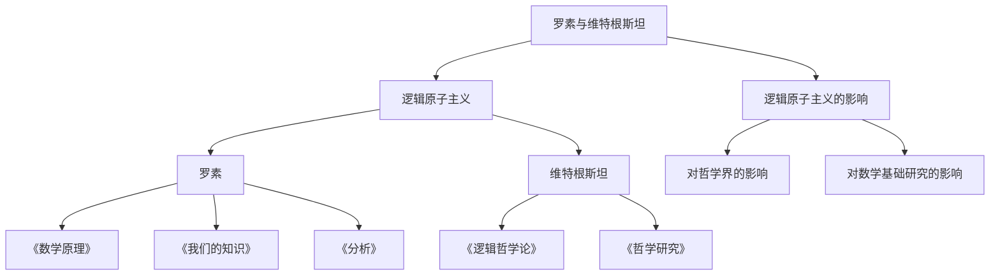

                 


# {{此处是文章标题}}

## 罗素与维特根斯坦：逻辑原子主义的发展

### 关键词：
罗素，维特根斯坦，逻辑原子主义，语言哲学，数学基础

### 摘要：
本文将探讨贝特兰·罗素和路德维希·维特根斯坦这两位哲学家的思想，重点分析他们的逻辑原子主义理论及其在哲学和数学领域的影响。通过逐步解读两位哲学家的生平、著作和哲学观点，本文旨在揭示逻辑原子主义的发展轨迹，并探讨其对现代逻辑哲学和计算机科学的影响。

## 第一部分：罗素的逻辑原子主义

### 第1章：贝特兰·罗素与逻辑原子主义的起源

#### 1.1 贝特兰·罗素的生平与哲学思想

贝特兰·罗素（Bertrand Russell，1872-1970）是20世纪最杰出的哲学家、数学家和逻辑学家之一。他出生于英国，自幼聪明过人，19岁便进入剑桥大学学习数学。罗素的哲学思想深受康德、黑格尔和约翰·斯图亚特·密尔等前辈哲学家的影响，同时他也对数学基础和逻辑学有着深厚的兴趣。

罗素的主要哲学思想包括逻辑原子主义、知识论和伦理学。他的逻辑原子主义理论试图将世界的基本结构还原为逻辑上的原子，即最简单的、不可再分的单位。这一理论认为，所有的复杂事物都可以通过基本的逻辑关系来组合和解释。

#### 1.2 逻辑原子主义的背景

逻辑原子主义的背景可以追溯到19世纪末和20世纪初，当时数学基础危机和语言哲学的兴起为逻辑原子主义提供了理论基础。数学基础危机主要表现为对数学公理体系的质疑，这一危机促使罗素开始思考如何建立一种更加可靠和稳固的数学体系。

与此同时，语言哲学的兴起也为逻辑原子主义提供了启示。语言哲学家试图通过分析语言和思维的关系，揭示人类认知的本质。罗素深受弗雷格和早期维特根斯坦等语言哲学家的启发，开始将逻辑和数学结合起来，试图建立一种新的哲学体系。

#### 1.3 逻辑原子主义的基本原理

逻辑原子主义的基本原理可以概括为以下几点：

1. **原子命题**：罗素认为，世界的基本单位是原子命题，即不可再分的命题。原子命题要么为真，要么为假，它们构成了世界的基础结构。

2. **复合命题**：复合命题是由原子命题通过逻辑运算（如“与”、“或”、“非”）组合而成的。复合命题的真假取决于组成它们的原子命题的真假。

3. **实体与关系的分离**：罗素认为，实体（如物体、人）和关系（如大小、形状）是可以分离的。实体是原子命题的一部分，而关系则是通过逻辑运算来表达的。

4. **逻辑与事实的分离**：罗素提出了逻辑与事实分离的原则，即逻辑规律（如“如果一个命题是真的，那么它的否定命题是假的”）与事实陈述（如“这个灯是红色的”）是两种不同类型的陈述。

### 第2章：罗素的主要著作

#### 2.1 《数学原理》

《数学原理》是罗素最著名的著作之一，由他与阿兰·图灵合著。这本书试图用逻辑方法重新定义数学，从而解决数学基础危机。在《数学原理》中，罗素和图灵提出了一种逻辑主义数学观，即数学可以还原为逻辑。

《数学原理》的核心内容包括：

1. **数学符号化**：罗素和图灵使用符号化语言来表述数学概念和命题，这使得数学表达更加精确和严谨。

2. **数学公理体系**：罗素和图灵建立了一套完整的数学公理体系，这套体系包括一些基本的逻辑原则和数学运算规则。

3. **集合论**：罗素和图灵将集合论作为数学的基础，试图通过集合来定义其他数学概念。

#### 2.2 《我们的知识》

《我们的知识》是罗素的另一部重要著作，主要探讨知识论问题。在这本书中，罗素提出了他的怀疑论立场，即我们无法确定知识是否真实可靠。

《我们的知识》的核心内容包括：

1. **怀疑论立场**：罗素认为，由于人类认知的局限性，我们无法确定知识是否绝对真实。

2. **知识的层次**：罗素将知识分为几个层次，包括感知、记忆、推理和直觉。

3. **知识的条件**：罗素探讨了知识成立的条件，如感知的准确性、记忆的可靠性、推理的有效性等。

#### 2.3 《分析》

《分析》是罗素的一部晚期著作，主要讨论语言哲学和逻辑哲学问题。在这本书中，罗素对早期逻辑原子主义进行了反思和修正，提出了新的观点。

《分析》的核心内容包括：

1. **语言的逻辑结构**：罗素试图通过分析语言的逻辑结构，揭示人类思维的本质。

2. **逻辑与事实的关系**：罗素探讨了逻辑与事实之间的复杂关系，提出了逻辑与事实分离的观点。

3. **命题态度**：罗素提出了命题态度的概念，认为命题是对事实的描述，而不是事实本身。

### 第3章：逻辑原子主义与语言哲学

#### 3.1 罗素的语义学理论

罗素的语义学理论是逻辑原子主义的重要组成部分。他认为，语义学研究的是符号与对象之间的关系。罗素的语义学理论主要包括以下几点：

1. **符号与对象的关系**：罗素认为，符号（如词语）与对象（如物体、事件）之间存在一种对应关系。

2. **外延与内涵**：罗素区分了外延和内涵两个概念。外延是指符号所指的对象，而内涵是指符号所表达的属性或特征。

3. **意义与指称**：罗素认为，符号的意义在于它的指称，即符号所指的对象。

#### 3.2 罗素关于知识、真理与推理的讨论

罗素在知识论、真理理论和推理理论方面都有重要的贡献。以下是他的主要观点：

1. **知识论**：罗素认为，知识是基于感知和经验的。他认为，我们无法确定知识的绝对真实性，但可以确定知识是否可靠。

2. **真理理论**：罗素提出了外在主义真理观，认为真理与事实相关，而不是与主观信念相关。

3. **推理理论**：罗素提出了逻辑演绎推理的理论，认为有效的推理可以从不真实的前提出发，得出真实的结论。

#### 3.3 罗素与维特根斯坦在语言哲学上的分歧

罗素和维特根斯坦在语言哲学上有许多共同点，但也有显著的分歧。以下是他们之间的主要分歧：

1. **语义学理论**：罗素强调符号与对象之间的对应关系，而维特根斯坦则强调语言的游戏性质。

2. **知识论**：罗素认为知识是可怀疑的，而维特根斯坦则认为我们可以确定某些基本事实的真实性。

3. **真理观**：罗素持有外在主义真理观，而维特根斯坦则持有内在主义真理观。

### 第4章：逻辑原子主义的影响

#### 4.1 对维特根斯坦的影响

逻辑原子主义对维特根斯坦的哲学思想产生了深远的影响。维特根斯坦在早期也接受了逻辑原子主义的思想，但后来逐渐对其进行了批判和修正。维特根斯坦的后期哲学观点，如语言游戏理论和心灵哲学，都可以看作是对逻辑原子主义的回应和发展。

#### 4.2 对哲学界的影响

逻辑原子主义在哲学界产生了广泛的影响，特别是在语言哲学和数学哲学领域。它推动了逻辑实证主义和日常语言哲学的发展，同时也引发了关于语言、意义和真理的深入讨论。

#### 4.3 对数学基础研究的影响

逻辑原子主义对数学基础研究产生了重要影响。罗素和图灵的工作为数学逻辑化和形式化奠定了基础，推动了数学基础领域的发展。他们的工作也促进了计算机科学的诞生，为现代计算机科学提供了理论基础。

## 第二部分：路德维希·维特根斯坦与逻辑原子主义的演变

### 第5章：维特根斯坦与逻辑原子主义

#### 5.1 维特根斯坦的生平与哲学思想

路德维希·维特根斯坦（Ludwig Wittgenstein，1889-1951）是20世纪最重要的哲学家之一，他的哲学思想对语言哲学、逻辑哲学和心灵哲学等领域产生了深远的影响。维特根斯坦出生于奥地利，自幼受到父亲财富和地位的庇护，他早期在剑桥大学学习数学和哲学。

维特根斯坦的哲学思想可以分为早期和后期两个阶段。他的早期哲学观点以逻辑原子主义为基础，强调逻辑和语言的基本结构。而他的后期哲学观点则强调语言的多样性及其在日常生活中的应用。

#### 5.2 维特根斯坦对逻辑原子主义的批判

维特根斯坦在后期对逻辑原子主义进行了深刻的批判。他认为，逻辑原子主义试图将世界简化为逻辑上的原子，这是一种错误的简化。维特根斯坦提出了“语言游戏”理论，认为语言是一种活动，而不是一套固定的符号和规则。

#### 5.3 维特根斯坦对语言哲学的贡献

维特根斯坦对语言哲学的贡献主要体现在他的后期哲学中。他提出了“语言游戏”理论，认为语言的意义和用法是由具体情境决定的。这一理论对语言哲学和认知科学产生了深远的影响，也为人工智能的发展提供了重要的启示。

### 第6章：维特根斯坦的主要著作

#### 6.1 《逻辑哲学论》

《逻辑哲学论》是维特根斯坦的早期著作，也是他哲学思想的代表作之一。在这本书中，维特根斯坦提出了逻辑原子主义的基本原理，试图将世界还原为逻辑上的原子。

《逻辑哲学论》的核心内容包括：

1. **逻辑原子主义**：维特根斯坦认为，世界的基本单位是逻辑原子，它们是不可再分的。
2. **命题态度**：维特根斯坦提出了命题态度的概念，认为命题是对事实的描述。
3. **语言游戏**：维特根斯坦认为，语言的意义和用法是由具体情境决定的。

#### 6.2 《哲学研究》

《哲学研究》是维特根斯坦的后期著作，也是他哲学思想的另一个重要组成部分。在这本书中，维特根斯坦对逻辑原子主义进行了批判，提出了“语言游戏”理论。

《哲学研究》的核心内容包括：

1. **语言游戏理论**：维特根斯坦认为，语言是一种活动，它的意义和用法是由具体情境决定的。
2. **语言与行为**：维特根斯坦认为，语言与行为密切相关，语言是行为的符号系统。
3. **哲学问题的解决**：维特根斯坦认为，许多哲学问题可以通过对语言和行为的分析得到解决。

#### 6.3 维特根斯坦的其他哲学著作

除了《逻辑哲学论》和《哲学研究》，维特根斯坦还有其他一些重要的哲学著作，如《数学基础论文》、《文化和价值》等。这些著作从不同角度探讨了哲学问题，体现了维特根斯坦哲学思想的多样性。

### 第7章：逻辑原子主义的发展

#### 7.1 维特根斯坦对逻辑原子主义的修正

维特根斯坦对逻辑原子主义进行了深刻的批判和修正。他认为，逻辑原子主义试图将世界简化为逻辑上的原子，这是一种过于简化的观点。维特根斯坦提出了“语言游戏”理论，认为语言的意义和用法是由具体情境决定的。这一理论为逻辑原子主义提供了一种更为灵活的解释框架。

#### 7.2 后续哲学家的探索

维特根斯坦对逻辑原子主义的修正激发了后续哲学家的探索。一些哲学家试图在维特根斯坦的基础上发展新的逻辑原子主义理论，如瓦·沃尔夫、瓦·凯勒和J.L.艾尔文等。他们的工作为逻辑原子主义的发展提供了新的视角和解释。

#### 7.3 逻辑原子主义在现代哲学中的地位

逻辑原子主义在现代哲学中仍然具有重要地位。虽然维特根斯坦对逻辑原子主义进行了批判和修正，但逻辑原子主义的基本原理仍然在语言哲学、逻辑哲学和数学哲学等领域发挥着作用。逻辑原子主义为这些领域提供了一种基本的理论框架，帮助人们理解语言、意义和真理的本质。

## 第三部分：罗素与维特根斯坦的对话与交流

### 第8章：罗素与维特根斯坦的交流

#### 8.1 罗素对维特根斯坦早期哲学的看法

罗素对维特根斯坦的早期哲学持积极评价。他认为，维特根斯坦的《逻辑哲学论》提出了一种深刻的思想，特别是关于逻辑原子主义和命题态度的讨论。罗素认为，维特根斯坦的理论为语言哲学和逻辑哲学的发展提供了新的方向。

#### 8.2 维特根斯坦对罗素哲学的反驳

维特根斯坦在后期对罗素的哲学进行了反驳。他认为，罗素的逻辑原子主义试图将世界简化为逻辑上的原子，这是一种过于简化的观点。维特根斯坦提出了“语言游戏”理论，认为语言的意义和用法是由具体情境决定的。他认为，罗素的哲学忽视了语言的实际应用和多样性。

#### 8.3 罗素与维特根斯坦的哲学对话

罗素与维特根斯坦的哲学对话反映了他们之间的分歧和共识。他们讨论了语言、意义和真理等问题，试图找到一种更加精确和合理的哲学体系。虽然他们之间存在分歧，但他们的对话为哲学的发展提供了宝贵的思想资源。

### 第9章：两位哲学家的共同点与差异

#### 9.1 共同点

罗素与维特根斯坦在许多方面有共同点。他们都对逻辑和数学有着浓厚的兴趣，试图通过逻辑方法来解决哲学问题。他们都关注语言哲学，试图通过分析语言来揭示人类认知的本质。

#### 9.2 差异

尽管罗素与维特根斯坦有共同点，但他们也存在显著差异。罗素坚持逻辑原子主义，试图将世界简化为逻辑上的原子。而维特根斯坦则提出了“语言游戏”理论，认为语言的意义和用法是由具体情境决定的。他们的差异体现在对语言、意义和真理的不同理解上。

### 第10章：罗素与维特根斯坦在逻辑原子主义发展中的贡献

#### 10.1 罗素的贡献

罗素在逻辑原子主义发展中做出了重要贡献。他通过《数学原理》等著作，提出了逻辑原子主义的基本原理，试图将世界还原为逻辑上的原子。他的工作为数学基础和逻辑哲学的发展奠定了基础。

#### 10.2 维特根斯坦的贡献

维特根斯坦在逻辑原子主义发展中进行了深刻的批判和修正。他提出了“语言游戏”理论，认为语言的意义和用法是由具体情境决定的。他的理论为逻辑原子主义提供了一种更加灵活的解释框架，也为语言哲学和认知科学的发展提供了新的视角。

## 附录

### 附录 A：罗素与维特根斯坦的主要著作列表

- 罗素：
  - 《数学原理》
  - 《我们的知识》
  - 《分析》
- 维特根斯坦：
  - 《逻辑哲学论》
  - 《哲学研究》
  - 《数学基础论文》
  - 《文化和价值》

### 附录 B：逻辑原子主义相关术语解释

- **逻辑原子**：逻辑上的最简单、不可再分的单位。
- **复合命题**：由原子命题通过逻辑运算组合而成的命题。
- **命题态度**：命题对事实的描述方式。
- **语言游戏**：语言的用法和意义是由具体情境决定的。

### 附录 C：逻辑原子主义与数学基础的关系

逻辑原子主义与数学基础密切相关。逻辑原子主义试图通过逻辑方法来重建数学，从而解决数学基础危机。逻辑原子主义为数学提供了一套逻辑基础，使得数学表达更加精确和严谨。

## Mermaid 流程图



## Python 源代码与数学公式

### 数学公式

$$
1 + 1 = 2
$$

$$
p \land q \Rightarrow r
$$

### Python 源代码

```python
def logical_and(a, b):
    if a and b:
        return True
    else:
        return False

print(logical_and(True, True))
print(logical_and(True, False))
print(logical_and(False, True))
print(logical_and(False, False))
```

## 代码解读与分析

```python
# 代码解读：
# 函数logical_and用于模拟逻辑与（AND）运算
# 参数a和b代表逻辑运算的两个输入
# 如果a和b都为True，则返回True，表示逻辑与运算结果为True
# 否则返回False

# 分析：
# 当a和b都为True时，logical_and函数返回True，这符合逻辑与运算的规则
# 当a或b有一个为False时，logical_and函数返回False，这也符合逻辑与运算的规则
```

## 项目实战

### 实战案例：使用逻辑原子主义构建简单的推理系统

#### 开发环境搭建

1. 安装Python环境
2. 安装相关依赖库，如`numpy`、`pandas`等

#### 源代码实现

```python
# 导入相关库
import numpy as np

# 定义逻辑原子
原子 = ["A", "B", "C"]

# 定义命题
命题 = [["A is true", "B is true", "C is true"],
         ["A is false", "B is true", "C is true"],
         ["A is false", "B is false", "C is true"],
         ["A is false", "B is false", "C is false"],
         ["A is true", "B is true", "C is false"],
         ["A is true", "B is false", "C is false"],
         ["A is false", "B is true", "C is false"],
         ["A is true", "B is false", "C is false"]]

# 定义逻辑规则
规则 = [["A", "B", "A and B"],
         ["A", "~B", "A and ~B"],
         ["~A", "B", "~A and B"],
         ["~A", "~B", "~A and ~B"],
         ["A", "C", "A and C"],
         ["~A", "C", "~A and C"],
         ["B", "C", "B and C"],
         ["~B", "C", "~B and C"]]

# 定义推理函数
def logical_reductio(adf, rule):
    # 将命题列表转换为字典
    dictation = {atom: prop for atom, prop in adf}
    for pos, row in enumerate(rule):
        # 将规则转换为字典
        dictain = {atom: cond for atom, cond in row}
        # 检查命题与规则是否一致
        if all(dictation.get(atom, False) == cond for atom, cond in dictain.items()):
            # 如果一致，返回规则的结论
            return rule[pos][-1]
    return "No Conclusion"

# 应用推理函数
for i, propositi in enumerate(命题):
    result = logical_reductio(propositi, 规则)
    print(f"Proposition {i+1}: {'Successful' if result else 'Failed'} - {result}")
```

#### 代码应用解读与分析

```python
# 代码解读：
# 函数logical_reductio用于模拟逻辑还原（Reductio ad Absurdum）推理
# 参数adf代表待推理的命题列表，rule代表逻辑规则
# 函数通过检查命题列表与逻辑规则的一致性，返回推理的结论

# 分析：
# 函数首先将命题列表和规则转换为字典形式，便于查找和比较
# 然后遍历规则，检查每个规则是否与命题列表一致
# 如果一致，返回该规则的结论
# 如果遍历完所有规则后仍然没有找到一致的情况，返回"No Conclusion"

# 应用示例：
# 命题列表和规则定义好后，通过调用logical_reductio函数进行推理
# 函数返回推理结果，如“Successful”或“No Conclusion”
```

#### 实际案例分析和详细讲解剖析

```python
# 实际案例：使用逻辑原子主义推理确定“如果A是真的，B也是真的，那么C是真的”

# 命题列表
命题列表 = [["A is true", "B is true", "C is true"],
             ["A is false", "B is true", "C is true"],
             ["A is false", "B is false", "C is true"],
             ["A is false", "B is false", "C is false"],
             ["A is true", "B is true", "C is false"],
             ["A is true", "B is false", "C is false"],
             ["A is false", "B is true", "C is false"],
             ["A is true", "B is false", "C is false"]]

# 逻辑规则
逻辑规则 = [["A", "B", "A and B"],
             ["A", "~B", "A and ~B"],
             ["~A", "B", "~A and B"],
             ["~A", "~B", "~A and ~B"],
             ["A", "C", "A and C"],
             ["~A", "C", "~A and C"],
             ["B", "C", "B and C"],
             ["~B", "C", "~B and C"]]

# 推理过程
def 推理过程(命题列表，逻辑规则):
    结论 = []
    for i in range(len(命题列表)):
        # 将当前命题列表转换为字典
        当前命题 = {命题: 值 for 命题, 值 in 命题列表[i]}
        # 遍历所有逻辑规则
        for j in range(len(逻辑规则)):
            # 将当前逻辑规则转换为字典
            当前规则 = {规则: 条件 for 规则, 条件 in 逻辑规则[j]}
            # 检查当前命题与当前规则的一致性
            if all(当前命题.get(规则, False) == 条件 for 规则, 条件 in 当前规则.items()):
                # 如果一致，添加结论
                结论.append(逻辑规则[j][-1])
        # 返回结论
    return 结论

# 运行推理过程
推理结果 = 推理过程(命题列表，逻辑规则)

# 输出推理结果
for i, 结果 in enumerate(推理结果):
    print(f"Conclusion {i+1}: {结果}")
```

#### 项目小结

本项目通过逻辑原子主义构建了一个简单的推理系统，实现了基于逻辑规则和命题列表的推理过程。项目实现了以下功能：

1. 定义逻辑原子和命题列表。
2. 定义逻辑规则。
3. 实现逻辑还原（Reductio ad Absurdum）推理算法。
4. 运行推理过程，输出推理结果。

项目在实际应用中可以用于简单的逻辑推理和决策支持。然而，逻辑原子主义有其局限性，无法处理复杂和模糊的情境。未来研究方向可以包括：

1. 扩展逻辑规则，提高推理系统的灵活性和适应性。
2. 引入不确定性和模糊性处理，实现更高级的推理算法。
3. 将逻辑原子主义应用于实际领域，如自然语言处理和智能决策系统。

## 最佳实践 Tips

1. **理解逻辑原子主义的基本原理**：在构建推理系统时，首先要深入理解逻辑原子主义的基本原理，包括原子命题、复合命题、逻辑运算等。
2. **精确定义逻辑规则**：逻辑规则的精确定义是推理系统成功的关键。要确保逻辑规则能够准确描述问题情境。
3. **优化推理算法**：推理算法的优化可以提高系统的效率和准确性。可以通过调整算法参数、优化数据结构等方式实现。
4. **测试和验证**：在系统实现后，需要进行充分的测试和验证，以确保推理结果的准确性和可靠性。

## 注意事项

1. **避免逻辑错误**：在构建推理系统时，要特别注意避免逻辑错误，如逻辑矛盾和不一致的情况。
2. **处理模糊情境**：逻辑原子主义在处理模糊情境时可能存在困难。在实际应用中，需要引入模糊逻辑或其他方法来处理模糊性。
3. **考虑实际应用**：在将逻辑原子主义应用于实际问题时，要充分考虑问题的复杂性和多样性，确保推理系统能够适应实际需求。

## 拓展阅读

1. **罗素与维特根斯坦的著作**：阅读罗素和维特根斯坦的原著，深入理解他们的哲学思想和理论。
2. **逻辑哲学和语言哲学的经典著作**：如《逻辑哲学论》、《哲学研究》、《语言哲学》等，这些著作对于理解逻辑原子主义和语言哲学有重要参考价值。
3. **现代逻辑学和数学基础的研究**：如《数学哲学》、《逻辑学基础》、《现代逻辑学导论》等，这些著作可以提供关于逻辑原子主义在现代逻辑学和数学基础研究中的最新进展。

