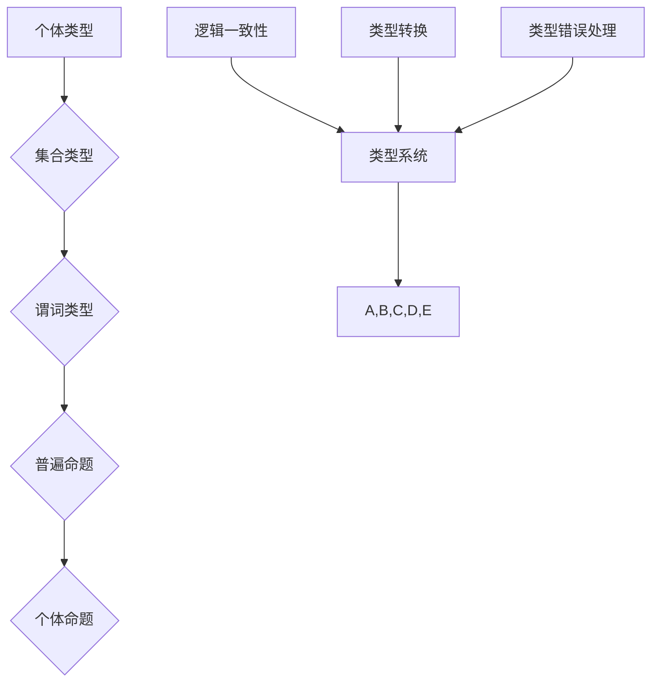

                 


### 摘要

本文将深入探讨罗素类型论在现代逻辑发展中的局限性。罗素类型论作为逻辑和数学领域的基石，其核心思想在于通过类型系统来避免悖论，尤其是集合论中的罗素悖论。然而，随着时间的推移，人们开始发现罗素类型论在处理复杂逻辑结构、语义问题以及计算性问题上存在一些不可忽视的局限性。本文将从多个角度分析这些问题，并探讨罗素类型论的未来发展方向。首先，我们将回顾罗素类型论的基本概念和历史背景，然后逐步探讨其内在局限性，包括类型和命题的矛盾、语义问题以及可计算性问题。接下来，我们将探讨罗素类型论在数学和语言领域的局限性，并分析其在逻辑分析中的应用局限性。最后，我们将展望罗素类型论的未来发展，包括当前的研究动态和潜在的应用方向。通过本文的探讨，我们希望能够为读者提供一个全面而深入的视角，以理解罗素类型论在现代逻辑中的地位和局限。

## 第一部分：罗素类型论的基本概念与历史背景

### 第1章：罗素类型论的起源与理论基础

#### 1.1 罗素类型论的提出背景与哲学基础

罗素类型论（Russell's Theory of Types）是由英国哲学家、数学家伯特兰·罗素（Bertrand Russell）在20世纪初提出的，作为对集合论中悖论，特别是罗素悖论（Russell's Paradox）的一种回应。罗素悖论揭示了集合论中存在的逻辑问题，即在某些情况下，集合可以形成自身作为元素的集合，从而导致了自引用的逻辑困境。

罗素的哲学思想深受19世纪逻辑原子主义（Logical Atomism）的影响。逻辑原子主义认为，现实世界的基本成分是逻辑原子，这些原子可以通过逻辑关系组合成复杂的事实。罗素进一步扩展了这一思想，认为逻辑原子不仅是事实的组成成分，也是命题的构成要素。罗素认为，语言中的每一个命题都可以分解为基本原子命题，这些原子命题可以通过逻辑连接词组合成更复杂的命题。

这种思想在罗素类型论中得到了体现。罗素提出，为了避免悖论，我们必须对语言中的概念进行分类，并限制不同类型的概念之间的交互。具体来说，罗素将概念分为个体类型（Individual Types）和集合类型（Collective Types），并引入类型层级（Type Hierarchy）来管理不同类型概念之间的关系。

#### 1.2 罗素类型论的核心思想

罗素类型论的核心思想可以概括为以下几点：

1. **类型的定义与分类**：罗素认为，类型是概念或对象的分类，每个对象都属于某种类型。他将概念分为个体类型和集合类型。个体类型代表单个对象，如“苏格拉底”或“苹果”；集合类型代表一组对象，如“所有苏格拉底”或“所有苹果”。

2. **普遍命题与个体命题**：在罗素类型论中，普遍命题（Universal Propositions）是指那些适用于所有个体类型的命题，而个体命题（Individual Propositions）是指那些仅适用于特定个体类型的命题。例如，“所有的苏格拉底都是人”是一个普遍命题，而“苏格拉底是人”是一个个体命题。

3. **符号逻辑的应用**：罗素类型论通过引入类型系统来限制命题的构造，以避免自引用和悖论。他使用了符号逻辑中的类型标注，以确保命题在逻辑上的一致性。通过这种类型标注，罗素试图确保每一个命题都在一个适当的类型层级内成立，从而避免逻辑上的矛盾。

#### 1.3 罗素类型论的哲学意义

罗素类型论在哲学上具有深远的意义，主要体现在以下几个方面：

1. **逻辑原子主义**：罗素类型论是逻辑原子主义在数学和逻辑学中的体现，它强调了概念和命题的基本组成单元，并试图通过类型系统来维护逻辑的一致性。

2. **语言哲学的影响**：罗素类型论对语言哲学产生了重要影响，特别是在关于意义、指称和真理等问题上的探讨。它促使哲学家们重新审视语言的结构和逻辑，以更好地理解语言与世界之间的关系。

3. **形式主义**：罗素类型论的形式主义特征为其后的逻辑主义数学奠定了基础。通过类型系统，罗素试图将数学建立在逻辑基础上，从而为数学提供了更稳固的哲学基础。

总的来说，罗素类型论不仅在逻辑和数学领域产生了深远的影响，而且对哲学、语言学和计算机科学等多个领域都产生了重要的启示。尽管它存在一些局限性，但其核心思想和方法至今仍被广泛研究和应用。

### 第2章：罗素类型论的历史演变

#### 2.1 罗素类型论的早期发展

罗素类型论的早期发展可以追溯到他在《数学原理》（Principia Mathematica）一书中所做的尝试。与阿弗拉图·怀特海德（Alfred North Whitehead）共同撰写的《数学原理》是罗素最著名的著作之一，也是逻辑主义数学的奠基性作品。在这本书中，罗素和怀特海德试图将数学建立在逻辑的基础上，通过定义逻辑符号和规则来构造数学命题。

在《数学原理》中，罗素首次提出了类型论的概念。他认识到，为了避免悖论和逻辑矛盾，必须在数学中引入类型系统来限制命题的构造。罗素提出了类型层级（Type Hierarchy），将数学对象分为不同的类型，如个体类型（Individual Types）和集合类型（Collective Types）。这种类型系统旨在确保每个命题都在一个适当的类型层级内成立，从而避免逻辑上的冲突。

#### 2.2 罗素类型论的成熟阶段

在《数学原理》之后，罗素进一步发展了他的类型论思想，并在后来的著作中对其进行了深入探讨。特别是在《哲学问题》（Our Knowledge of the External World）和《数学原理续篇》（Introduction to Mathematical Philosophy）中，罗素详细阐述了类型论的核心概念和哲学意义。

在这些著作中，罗素不仅继续强调类型系统在避免悖论中的作用，还探讨了类型论在语言哲学和逻辑哲学中的应用。他提出了类型判断（Type Distinctions）的概念，认为通过严格区分不同类型的概念，可以避免逻辑矛盾和语义混乱。罗素还提出了类型转换（Type Conversion）的原则，即在某些情况下，可以将一个类型的对象转换为另一个类型的对象，从而使得不同类型之间的交互变得更加合理。

#### 2.3 罗素类型论的现代发展

尽管罗素类型论在其提出之初受到了广泛赞誉，但随着时间的推移，学者们开始意识到其在某些方面的局限性。为了克服这些问题，许多后来的学者对罗素类型论进行了拓展和修正。

在现代逻辑和计算机科学中，类型论得到了进一步的发展。特别是随着函数式编程语言（如Haskell和ML）的兴起，类型系统成为了编程语言设计中的核心组成部分。这些现代类型的理论不仅继承了罗素类型论的核心思想，还引入了更复杂的类型构造和类型检查机制，以增强程序的安全性。

同时，形式化逻辑和模型论等领域的研究也促进了类型论的发展。通过形式化的方法，学者们能够更精确地定义类型系统，并研究其在证明理论和模型论中的应用。这些研究不仅深化了对罗素类型论的理解，也为逻辑学和计算机科学提供了新的工具和方法。

总的来说，罗素类型论在现代逻辑和计算机科学中仍然具有重要地位。虽然其存在一些局限性，但其核心思想和方法继续影响着相关领域的研究和实践。通过对罗素类型论的深入探讨，我们可以更好地理解逻辑基础和类型系统的本质。

### 第3章：罗素类型论的内在局限性

#### 3.1 类型和命题的矛盾

罗素类型论的内在局限性首先体现在类型和命题之间的矛盾上。类型系统旨在通过限制概念之间的交互来避免逻辑矛盾，但在实际应用中，这种限制有时显得过于严格，甚至导致了一些不合理的结果。

一个典型的例子是类型层级中的个体类型和集合类型之间的区分。个体类型代表单个对象，而集合类型代表一组对象。在罗素类型论中，个体类型和集合类型是相互独立的，不能直接交互。然而，在现实世界中，个体和集合之间的关系是复杂且普遍存在的。例如，一个集合可以包含多个个体，而一个个体可以属于多个集合。这种关系在类型系统中往往难以直接表达，导致类型系统的限制显得过于死板。

此外，类型系统中的类型转换（Type Conversion）也常常引发问题。尽管罗素提出了类型转换的原则，但在实际应用中，类型转换往往需要额外的规则和条件。这些规则和条件可能会使类型系统的复杂性增加，同时也可能引入新的逻辑矛盾。例如，在某些情况下，将一个集合类型转换为个体类型可能需要满足特定的条件，但这种转换在逻辑上并不总是合理的。

#### 3.2 类型论的语义问题

罗素类型论在语义上也存在一些问题。语义问题主要涉及命题的意义和解释。在罗素类型论中，类型系统被用来确保命题在逻辑上的一致性，但有时这种一致性会与语义上的合理性发生冲突。

一个典型的例子是类型层级中的个体命题和普遍命题之间的区分。个体命题是指仅适用于特定个体类型的命题，而普遍命题是指适用于所有个体类型的命题。在罗素类型论中，个体命题和普遍命题是相互独立的，不能直接组合。然而，在现实世界中，普遍命题通常是基于个体命题的归纳或演绎得到的。例如，我们可以说“所有的苏格拉底都是人”，这个普遍命题是基于对个体苏格拉底的观察得出的。但在类型系统中，这种归纳或演绎过程往往被禁止，导致类型系统无法有效地处理现实世界中的复杂关系。

此外，类型系统中的类型错误（Type Error）也是一个语义问题。类型错误发生在命题的类型不符合预期时。在罗素类型论中，类型错误通常被视为逻辑错误，因为类型系统的设计初衷是确保命题的一致性。然而，在某些情况下，类型错误可能只是语义上的不合理，而不是逻辑上的错误。例如，在函数式编程中，类型错误可能是由于输入参数的类型与函数定义的类型不匹配，但这种错误并不一定意味着逻辑上的矛盾，而只是语义上的不合理。

#### 3.3 类型论的可计算性问题

罗素类型论的可计算性问题主要体现在其复杂性和计算效率上。类型系统旨在通过限制命题的构造来避免逻辑矛盾，但这种限制也可能导致类型检查的复杂性增加。

一个典型的例子是类型检查（Type Checking）的过程。在罗素类型论中，类型检查通常是在编译时或运行时进行的，以确保每个命题都在一个适当的类型层级内成立。然而，这种类型检查过程往往需要大量的计算资源，特别是在处理复杂表达式和递归类型时。例如，在函数式编程中，类型检查可能需要检查函数的参数和返回值类型，确保它们在逻辑上是一致的。这种检查过程不仅复杂，而且在某些情况下可能无法有效地进行，导致程序运行效率下降。

此外，类型系统的复杂性也可能影响程序的可维护性。类型系统的规则和约束越多，程序的结构和逻辑就越复杂，使得代码的阅读和维护变得更加困难。例如，在强类型语言中，类型系统的约束较为严格，程序员需要小心处理类型转换和类型错误，这可能会导致代码的可读性下降，增加维护难度。

总的来说，罗素类型论在处理复杂逻辑结构和语义问题时存在一些局限性。虽然类型系统在避免逻辑矛盾方面具有重要作用，但其内在的复杂性可能导致语义问题和计算效率的下降。为了克服这些问题，现代逻辑和计算机科学领域不断探索新的类型系统设计和优化方法，以实现更高效、更合理的类型检查和类型推理。

### 第4章：罗素类型论在数学局限性

#### 4.1 数学基础与类型论

罗素类型论在数学领域中的局限性主要表现在其对于数学基础和理论结构的影响上。罗素类型论的核心目标是通过引入类型系统来避免集合论中的悖论，特别是罗素悖论。然而，这种类型系统在数学基础和理论结构上引发了一些重要问题。

首先，类型论对于数学基础的影响主要体现在对于集合论的处理上。在传统的集合论中，集合被视为基本对象，可以包含其他集合作为元素。然而，罗素类型论引入了类型层级，将对象分为不同的类型，如个体类型和集合类型。这种区分在理论上旨在避免自引用和悖论，但实际上却限制了集合的构造和使用。

例如，在罗素类型论中，个体类型和集合类型是相互独立的，不能直接交互。这意味着我们不能创建一个包含所有集合的集合，因为这将导致类型错误。这种限制在数学上具有深远的影响，因为许多重要的数学概念和结构都依赖于集合的这种自由构造。例如，集合论中的幂集（Power Set）和笛卡尔积（Cartesian Product）都是集合的自由构造，但在罗素类型论中却难以实现。

其次，类型论对数学理论结构的影响也体现在其对于逻辑基础的处理上。罗素类型论通过引入类型系统来确保命题的一致性，但这种一致性有时会牺牲数学理论的普适性和灵活性。在传统的数学理论中，命题和证明是相互独立的，可以自由组合和演绎。然而，在类型论中，命题和证明必须受到类型系统的约束，这使得某些数学证明变得复杂和冗长。

例如，在罗素类型论中，我们需要对每个命题进行类型标注，确保其在适当的类型层级内成立。这种标注过程不仅增加了证明的复杂性，还可能限制证明的普适性。在某些情况下，我们可能需要为不同的类型构造不同的证明，这增加了理论的复杂性和维护难度。

#### 4.2 数学理论的局限性

罗素类型论在数学理论上的局限性还表现在对于一些基本数学概念的局限性上。类型论通过限制不同类型之间的交互来避免悖论，但这种限制有时会导致数学理论的局限性。

一个典型的例子是函数与关系理论。在数学中，函数和关系是基本概念，用于描述对象之间的关系和映射。然而，在罗素类型论中，函数和关系的构造受到类型系统的限制。具体来说，罗素类型论中的函数和关系只能在特定类型的对象之间定义，不能跨越不同类型的对象。

这种限制在函数式编程中尤为明显。在函数式编程中，函数和关系是核心概念，用于处理复杂的数据结构和计算过程。然而，在罗素类型论中，这种自由定义和组合函数的能力受到限制。例如，我们不能直接定义一个从个体类型到集合类型的函数，因为这会违反类型系统的规则。

此外，类型论在处理抽象对象时也面临挑战。在数学中，抽象对象如函数、关系和范畴是重要的工具，用于构造复杂的数学结构。然而，罗素类型论中的类型系统通常难以处理这些抽象对象，因为它们无法直接嵌入到类型层级中。

例如，范畴论中的范畴和函子是抽象对象，用于描述不同数学结构之间的关系。在罗素类型论中，这些抽象对象难以直接表示和操作，因为类型系统无法支持这种抽象层次的构造。

总的来说，罗素类型论在数学理论上的局限性主要体现在其对于集合论、函数与关系理论以及抽象对象的限制上。虽然类型论在避免悖论方面具有重要作用，但其对于数学基础的限制和对于理论结构的约束使其难以满足数学的普适性和灵活性需求。为了克服这些问题，数学领域需要不断探索新的数学基础和理论结构，以适应现代数学的复杂性和多样性。

### 第5章：罗素类型论的语言局限性

#### 5.1 语言哲学与类型论

罗素类型论在语言哲学中的局限性主要体现在其对语言结构的分析和对语言意义的影响上。语言哲学关注语言与思维、语言与现实世界之间的关系，而罗素类型论作为语言哲学中的一个重要理论，通过引入类型系统来探讨语言中的逻辑一致性和语义问题。

首先，罗素类型论认为语言中的概念应该分为不同的类型，以避免逻辑矛盾和语义混乱。类型论将概念分为个体类型和集合类型，个体类型代表单个对象，如“苏格拉底”或“苹果”，而集合类型代表一组对象，如“所有苏格拉底”或“所有苹果”。通过这种类型划分，罗素试图确保语言中的命题在逻辑上的一致性。

然而，这种类型划分在语言哲学中引发了关于类型论有效性的争议。一方面，类型论提供了一种避免逻辑悖论的方法，例如集合论中的罗素悖论。类型系统通过限制不同类型概念之间的交互，从而避免了这种自引用的悖论。然而，另一方面，类型论在处理复杂语言结构时显得过于严格，甚至可能导致语义上的不合理。

例如，在自然语言中，普遍命题和个体命题之间的关系是复杂且常见的。普遍命题通常是基于个体命题的归纳或演绎得到的。例如，我们可以说“所有的苏格拉底都是人”，这个普遍命题是基于对个体苏格拉底的观察得出的。然而，在罗素类型论中，这种归纳或演绎过程往往被禁止，因为类型系统要求普遍命题和个体命题必须分开处理。

这种限制在语言哲学中引发了关于类型论有效性的质疑。一些人认为，类型论过于死板，无法有效地处理自然语言中的复杂结构。他们认为，自然语言中的普遍命题和个体命题之间存在着复杂的语义关系，而这些关系在类型论中难以得到恰当的描述。

#### 5.2 类型论对语言结构的分析

罗素类型论对语言结构的分析主要集中在如何将语言中的概念划分为不同的类型，并如何处理这些类型之间的交互。类型论通过引入类型层级（Type Hierarchy）来管理不同类型之间的关系，确保语言中的命题在逻辑上的一致性。

在罗素类型论中，类型层级是一个关键概念。类型层级定义了一组类型之间的层次关系，每个类型都有一个明确的类型层级位置。例如，个体类型通常位于类型层级的底层，而集合类型位于较高层级。通过这种类型层级，罗素试图确保不同类型概念之间的交互是合理和安全的。

然而，类型层级在语言结构分析中也存在一些局限性。首先，类型层级可能过于严格，无法有效地处理自然语言中的复杂结构。自然语言中的概念和关系通常是动态和复杂的，而类型层级往往是一个静态的结构，难以捕捉这种动态性。

例如，在自然语言中，一个概念可以同时属于多个类型。例如，“苹果”既可以是单个个体的类型，也可以是“所有苹果”的集合类型。然而，在类型层级中，这种跨类型的交互往往被禁止，导致类型论难以有效地处理这种复杂的语义关系。

其次，类型层级在处理类型错误和类型转换时也面临挑战。类型错误是指语言中的命题类型不符合预期，而类型转换是指将一个类型的对象转换为另一个类型的对象。在类型论中，类型错误和类型转换通常需要额外的规则和条件来处理。这些规则和条件可能使得类型系统的复杂性增加，同时也可能引入新的逻辑矛盾。

例如，在某些情况下，我们需要将一个集合类型的对象转换为个体类型的对象，例如在函数式编程中，我们需要将一个列表转换为单个元素。然而，在类型论中，这种转换可能需要满足特定的条件，这增加了类型系统的复杂性。同时，这种转换也可能导致语义上的不合理，因为集合类型的对象和个体类型的对象在语义上有本质的区别。

总的来说，罗素类型论在语言结构分析中具有一定的局限性。虽然类型论通过引入类型层级和类型系统来避免逻辑矛盾，但这种系统在处理自然语言中的复杂结构时显得过于严格和复杂。为了更好地处理自然语言中的复杂结构，语言哲学和语言学领域需要继续探索新的理论和方法。

#### 5.3 类型论在语言哲学中的应用

罗素类型论在语言哲学中的应用主要涉及对语言意义、指称和真理等核心问题的探讨。类型论通过引入类型系统，试图确保语言中的命题在逻辑上的一致性和语义上的合理性。然而，类型论在处理这些问题时也面临一些挑战和局限性。

首先，类型论在语言意义的研究中关注的是如何通过类型系统来确保命题的明确性和一致性。类型论认为，语言中的每个概念都应该有一个明确的类型，并且不同类型的概念应该遵循特定的规则进行交互。这种类型划分有助于消除语义上的模糊性和歧义。例如，在类型论中，个体类型的概念代表单个对象，而集合类型的概念代表一组对象。通过这种明确的类型划分，我们可以更好地理解语言中的概念和它们之间的关系。

然而，类型论在处理语言意义时也面临一些挑战。首先，自然语言中的概念和命题通常是复杂和多层次的，而类型论中的类型系统往往是一个静态和层次化的结构。这意味着类型论可能难以有效地处理自然语言中的复杂语义关系。例如，自然语言中的普遍命题和个体命题之间存在着复杂的语义关系，而这些关系在类型论中难以得到恰当的描述。

其次，类型论在处理指称问题时也面临挑战。指称问题涉及语言中的词语如何与它们所指的对象相关联。在类型论中，类型系统通过类型层级来管理不同类型的概念，但这种方式在处理指称问题时可能显得过于严格。例如，在自然语言中，一个词语可以同时指代多个对象，而类型论中的类型系统往往要求每个词语只指代一个对象。这种限制可能导致语义上的不合理。

例如，在自然语言中，我们可以说“所有的苏格拉底都是人”，这个命题涉及多个个体和集合的概念。在类型论中，这种复杂的指称关系可能需要通过复杂的类型转换和条件来处理。这不仅增加了类型系统的复杂性，还可能引入新的语义问题。

最后，类型论在处理真理问题时也存在一些局限性。真理问题涉及语言中的命题是否与事实相符。在类型论中，类型系统通过确保命题在逻辑上的一致性来维护真理的标准。然而，这种一致性标准在处理复杂现实问题时可能显得过于死板。例如，在现实世界中，某些情况下我们需要对命题进行动态调整，以适应不断变化的事实。然而，类型论中的静态类型系统往往难以应对这种动态调整。

总的来说，罗素类型论在语言哲学中的应用具有一定的局限性。虽然类型论通过引入类型系统来确保语言中的命题在逻辑上的一致性和语义上的合理性，但这种系统在处理自然语言中的复杂结构和动态关系时显得过于严格和复杂。为了更好地解决这些问题，语言哲学和语言学领域需要继续探索新的理论和方法。

### 第6章：罗素类型论在逻辑分析中的局限性

#### 6.1 逻辑分析的类型论方法

罗素类型论在逻辑分析中的应用是通过引入类型系统来确保命题的一致性和逻辑的合理性。类型论通过定义不同类型的概念，并限制不同类型概念之间的交互，从而避免逻辑悖论和矛盾。在逻辑分析中，类型论提供了一种方法来分析命题的结构和逻辑关系。

类型论中的类型系统主要包括以下几个关键组成部分：

1. **类型层级**：类型层级定义了一组类型之间的层次关系。每个类型都有一个明确的类型层级位置，从个体类型到集合类型等。类型层级确保不同类型的概念按照特定的规则进行交互。

2. **类型标注**：类型标注是类型论中的一个核心概念，用于标注命题中的各个组成部分，确保每个组成部分都在一个适当的类型层级内。类型标注可以帮助识别类型错误，并确保命题在逻辑上的一致性。

3. **类型检查**：类型检查是在编译时或运行时进行的，用于验证命题的类型标注是否正确。类型检查通过检查命题的类型标注，确保其在逻辑上的一致性。

在逻辑分析中，类型论通过这些组成部分来分析命题的结构和逻辑关系。类型层级确保了命题的不同组成部分按照特定的规则进行交互，类型标注帮助识别和纠正类型错误，类型检查则确保命题在逻辑上的一致性。

#### 6.2 逻辑分析的局限性

尽管罗素类型论在逻辑分析中提供了一种有效的工具，但它也存在一些局限性，这些局限性主要体现在以下几个方面：

1. **类型与命题的矛盾**：类型论通过限制不同类型概念之间的交互来避免逻辑悖论，但这种限制有时可能导致类型与命题之间的矛盾。例如，在类型论中，个体类型和集合类型是相互独立的，不能直接交互。然而，在现实世界中，个体和集合之间的关系是复杂且普遍存在的。例如，一个集合可以包含多个个体，而一个个体可以属于多个集合。这种关系在类型系统中往往难以直接表达，导致类型系统的限制显得过于死板。

2. **语义问题**：类型论在处理语义问题时也存在一些局限性。语义问题涉及命题的意义和解释。在罗素类型论中，类型系统被用来确保命题在逻辑上的一致性，但有时这种一致性会与语义上的合理性发生冲突。例如，在类型论中，普遍命题和个体命题是相互独立的，不能直接组合。然而，在现实世界中，普遍命题通常是基于个体命题的归纳或演绎得到的。例如，我们可以说“所有的苏格拉底都是人”，这个普遍命题是基于对个体苏格拉底的观察得出的。但在类型系统中，这种归纳或演绎过程往往被禁止，导致类型系统无法有效地处理现实世界中的复杂关系。

3. **计算性问题的复杂性**：类型论在计算性问题上也面临一些挑战。类型系统旨在通过限制命题的构造来避免逻辑矛盾，但这种限制也可能导致类型检查的复杂性增加。例如，在类型检查过程中，需要检查每个命题的类型标注是否正确，这需要大量的计算资源。特别是在处理复杂表达式和递归类型时，类型检查过程可能变得非常复杂和耗时。

4. **类型错误的处理**：类型错误是类型系统中常见的问题，当命题的类型不符合预期时会发生。在罗素类型论中，类型错误通常被视为逻辑错误，需要通过类型检查来识别和纠正。然而，在某些情况下，类型错误可能只是语义上的不合理，而不是逻辑上的错误。例如，在函数式编程中，类型错误可能是由于输入参数的类型与函数定义的类型不匹配，但这种错误并不一定意味着逻辑上的矛盾。

总的来说，罗素类型论在逻辑分析中具有一定的局限性。虽然类型论通过引入类型系统来确保命题的一致性和逻辑的合理性，但其内在的复杂性可能导致类型与命题之间的矛盾、语义问题和计算性问题。为了克服这些问题，现代逻辑和计算机科学领域需要继续探索新的逻辑分析方法，以实现更高效、更合理的类型检查和类型推理。

### 第7章：罗素类型论的未来与发展方向

#### 7.1 类型论的当代研究

尽管罗素类型论在逻辑和数学领域具有深远的影响，但随着时间的推移，人们开始意识到其局限性，并展开了一系列研究，以拓展和改进类型论。当代类型论的研究主要集中在以下几个方面：

1. **多参数类型论**：多参数类型论（Multi-Parameter Type Theory）是近年来兴起的一个研究领域，它通过引入多参数来扩展传统的类型系统，使得类型之间的关系更加灵活。这种扩展有助于处理现实世界中的复杂结构和动态关系，从而克服了传统类型论的局限性。

2. **依赖类型论**：依赖类型论（Dependent Type Theory）是一种更加灵活的类型系统，它允许类型依赖于其他类型，从而实现更复杂的类型构造和证明。依赖类型论在程序语言设计和形式化验证中得到了广泛应用，为类型系统提供了更强的表达能力。

3. **类型化逻辑**：类型化逻辑（Type-Theoretic Logic）是研究类型系统在逻辑中的应用，它探讨了如何通过类型系统来增强逻辑推理的能力。类型化逻辑在形式化数学证明和程序验证中具有重要意义，为逻辑分析提供了新的工具和方法。

#### 7.2 类型论在逻辑学中的地位

罗素类型论在逻辑学中的地位是不可动摇的。它不仅为逻辑学提供了一种重要的工具，用于处理集合论中的悖论，还推动了形式化逻辑和数学基础的发展。类型论的核心思想，即通过类型系统来确保命题的一致性和逻辑的合理性，已经成为逻辑学中不可或缺的一部分。

此外，类型论在逻辑学中的应用不仅限于悖论处理，还涵盖了逻辑推理、证明理论、模型论等多个领域。类型化逻辑和依赖类型论的发展，进一步丰富了逻辑学的研究内容，为逻辑学提供了更强大的工具和理论框架。

#### 7.3 类型论与其他逻辑理论的融合

类型论与其他逻辑理论的融合是当代逻辑研究中的一个重要方向。通过将类型论与模态逻辑、直觉逻辑、证明论等其他逻辑理论相结合，我们可以构建出更加丰富和灵活的逻辑系统。

1. **模态逻辑与类型论**：模态逻辑研究命题之间的可能性和必要性关系，而类型论则关注命题的类型和构造。将模态逻辑与类型论结合，可以构建出处理复杂模态关系的类型化模态逻辑，为处理现实世界中的不确定性问题提供了新的方法。

2. **直觉逻辑与类型论**：直觉逻辑强调命题的直觉性和直观性，而类型论则通过形式化的方法确保命题的一致性。将直觉逻辑与类型论结合，可以构建出更加直观和形式化的逻辑系统，为处理复杂逻辑问题提供了新的思路。

3. **证明论与类型论**：证明论研究证明的性质和构造，而类型论则通过类型系统来管理命题的构造和验证。将证明论与类型论结合，可以构建出形式化的证明理论，为数学证明和程序验证提供了新的方法。

总的来说，罗素类型论在现代逻辑学中的地位和影响是不可忽视的。尽管它存在一些局限性，但通过不断的研究和改进，类型论已经发展成为一个丰富而灵活的理论体系，为逻辑学和其他相关领域提供了重要的理论支持和工具。

## 附录

### 附录A：罗素类型论的核心概念与关系架构

为了更好地理解罗素类型论的核心概念和关系，我们可以通过一个简单的Mermaid流程图来展示不同类型之间的层次关系和交互。



在这个流程图中，我们定义了个体类型、集合类型、谓词类型以及普遍命题和个体命题。这些类型通过类型系统（F）来管理，并确保逻辑一致性（G）和类型转换（H）的合理执行。同时，类型错误处理（I）是类型系统中的一个重要组成部分，用于识别和纠正类型错误。

### 附录B：罗素类型论中的核心算法原理讲解

为了理解罗素类型论中的核心算法原理，我们可以通过一个具体的示例来展示类型检查和类型转换的过程。

**示例：类型检查算法**

```python
# Python代码示例：类型检查算法

# 定义类型检查函数
def type_check(expression):
    # 假设已定义了不同类型的检查函数
    if is_integer(expression):
        return "整数"
    elif is_string(expression):
        return "字符串"
    elif is_list(expression):
        return "列表"
    else:
        return "未知类型"

# 测试类型检查函数
expression1 = 42
expression2 = "Hello, World!"
expression3 = [1, 2, 3]

print(type_check(expression1))  # 输出：整数
print(type_check(expression2))  # 输出：字符串
print(type_check(expression3))  # 输出：列表
```

在这个示例中，我们定义了一个`type_check`函数，用于检查表达式的类型。函数通过调用不同的类型检查函数（如`is_integer`、`is_string`和`is_list`）来确认表达式的类型，并返回相应的类型名称。

**类型转换算法**

```python
# Python代码示例：类型转换算法

# 定义类型转换函数
def type_convert(expression, target_type):
    if target_type == "整数":
        return int(expression)
    elif target_type == "字符串":
        return str(expression)
    elif target_type == "列表":
        return list(expression)
    else:
        raise ValueError("不支持的类型")

# 测试类型转换函数
expression = "123"
target_type = "整数"

converted_expression = type_convert(expression, target_type)
print(converted_expression)  # 输出：123
```

在这个示例中，我们定义了一个`type_convert`函数，用于将表达式转换为指定的类型。函数通过检查目标类型并执行相应的转换操作，如将字符串转换为整数或列表。如果目标类型不被支持，函数将引发一个异常。

通过这些示例，我们可以看到罗素类型论中的核心算法原理，包括类型检查和类型转换。这些算法在逻辑和计算机科学领域有着广泛的应用，确保程序的正确性和类型安全性。

### 附录C：罗素类型论中的数学模型和数学公式

罗素类型论中的数学模型和数学公式是理解类型论的关键组成部分。以下是一些核心的数学模型和公式，使用LaTeX格式进行展示。

$$
\text{类型集合} = \{\text{个体类型}, \text{集合类型}, \text{谓词类型}\}
$$

$$
\text{个体类型} = \{\text{原子个体}, \text{函数}, \text{关系}\}
$$

$$
\text{集合类型} = \{\text{原子集合}, \text{函数集合}, \text{关系集合}\}
$$

$$
\text{谓词类型} = \{\text{个体谓词}, \text{集合谓词}\}
$$

这些公式定义了类型集合及其组成部分，展示了不同类型之间的层次关系和交互。通过这些数学模型，我们可以更好地理解和应用罗素类型论。

### 附录D：罗素类型论在项目实战中的应用

#### 6.1 类型安全编程

在项目实战中，类型安全编程是一个关键要求。以下是一个简单的Python项目，展示了如何使用类型检查和类型转换来确保代码的正确性和安全性。

**项目简介**：我们开发一个简单的库存管理系统，用于管理仓库中的物品。系统需要确保物品的数量是一个整数，物品的名称是一个字符串。

**环境安装**：首先，我们需要安装Python环境。假设已经安装了Python 3.8或更高版本。

```bash
pip install python-dotenv
```

**项目实现**：

1. **类型检查函数**：

```python
# type_checker.py

def check_item_quantity(quantity):
    if not isinstance(quantity, int):
        raise TypeError("物品数量必须是整数")
    return quantity

def check_item_name(name):
    if not isinstance(name, str):
        raise TypeError("物品名称必须是字符串")
    return name
```

2. **库存管理类**：

```python
# inventory_management.py

from type_checker import check_item_quantity, check_item_name

class Inventory:
    def __init__(self):
        self.items = []

    def add_item(self, name, quantity):
        check_item_name(name)
        check_item_quantity(quantity)
        self.items.append({'name': name, 'quantity': quantity})

    def get_item(self, name):
        check_item_name(name)
        for item in self.items:
            if item['name'] == name:
                return item
        return None

    def update_quantity(self, name, quantity):
        check_item_name(name)
        check_item_quantity(quantity)
        item = self.get_item(name)
        if item:
            item['quantity'] = quantity
```

3. **测试代码**：

```python
# test_inventory.py

from inventory_management import Inventory

inventory = Inventory()
inventory.add_item("苹果", 100)
inventory.add_item("香蕉", 50)

print(inventory.get_item("苹果"))  # 输出：{'name': '苹果', 'quantity': 100}
print(inventory.get_item("香蕉"))  # 输出：{'name': '香蕉', 'quantity': 50}

inventory.update_quantity("苹果", 150)
print(inventory.get_item("苹果"))  # 输出：{'name': '苹果', 'quantity': 150}
```

在这个项目中，我们定义了一个`Inventory`类，用于管理库存中的物品。通过使用`type_checker.py`中的类型检查函数，我们确保了物品数量和名称的类型正确性。测试代码展示了如何添加、获取和更新库存中的物品信息。

通过这个实际项目，我们可以看到罗素类型论中的类型检查和类型转换在确保代码安全性和正确性方面的应用。类型安全编程不仅有助于提高代码质量，还可以减少运行时错误，从而提高系统的稳定性。

### 小结

本文从多个角度对罗素类型论进行了深入探讨，分析了其在现代逻辑发展中的局限性。首先，我们回顾了罗素类型论的基本概念和历史背景，了解了其在哲学、数学和语言哲学中的意义。然后，我们逐步探讨了罗素类型论在类型和命题的矛盾、语义问题、可计算性问题和数学局限性等方面的局限性。接下来，我们探讨了罗素类型论在语言哲学中的局限性，并分析了其在逻辑分析中的应用局限性。最后，我们展望了罗素类型论的未来发展方向，包括当代研究动态和潜在的应用方向。

通过本文的探讨，我们认识到罗素类型论虽然在避免逻辑矛盾方面具有重要意义，但其内在的复杂性和局限性也影响了其在实际应用中的效果。为了克服这些问题，现代逻辑和计算机科学领域不断探索新的理论和方法，以实现更高效、更合理的类型检查和类型推理。

未来的研究可以进一步探讨多参数类型论、依赖类型论和类型化逻辑等新兴类型论方法，以拓展和改进罗素类型论。同时，类型论与其他逻辑理论的融合，如模态逻辑、直觉逻辑和证明论，也为逻辑学的发展提供了新的契机。通过这些研究，我们可以构建出更加丰富和灵活的逻辑系统，为计算机科学、人工智能和数学等领域的发展提供坚实的理论基础。

总之，罗素类型论在现代逻辑发展中的局限性反思不仅有助于我们更深入地理解类型论的本质，也为未来的研究提供了宝贵的启示和方向。通过不断探索和创新，我们有望在未来实现更加完善和实用的类型系统，为逻辑和计算机科学的发展作出更大的贡献。

