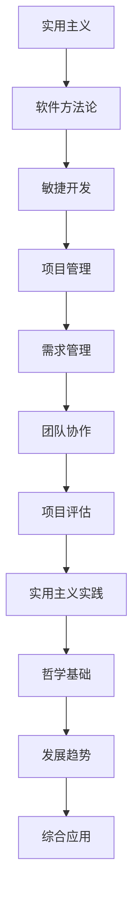

                 


### 《罗蒂的实用主义与敏捷开发：软件方法论的哲学基础》

> 关键词：罗蒂实用主义、敏捷开发、软件方法论、哲学基础、软件开发实践

> 摘要：本文深入探讨了罗蒂实用主义哲学与敏捷开发方法论的哲学基础，分析了二者在软件开发实践中的具体应用和影响。通过对实用主义与敏捷开发核心概念的解读，本文揭示了它们之间的联系与互动，为软件开发提供了一种新的哲学视角和方法论指导。

## 第一部分：实用主义与软件方法论概述

### 第1章：罗蒂的实用主义简介

#### 1.1 实用主义哲学的核心概念

实用主义哲学源于19世纪美国哲学家查尔斯·桑德斯·皮尔士和威廉·詹姆斯等人的思想。实用主义主张知识应当服务于人类的生活，重视实际效果和实践意义。其核心概念包括：

- **实践性**：知识必须经过实践的检验，理论必须与实际相结合。
- **相对性**：真理并非绝对，而是随着时间和环境的变化而变化。
- **多元性**：不同的人可能有不同的真理，但都具有一定的实用性。

#### 1.2 罗蒂实用主义的哲学观点

罗蒂（Richard Rorty）是20世纪实用主义的重要代表，他的实用主义哲学强调语言、文化和知识的实用功能。罗蒂认为，哲学的任务不是寻求真理，而是改善人类的语言和思维方式。他的核心观点包括：

- **反基础主义**：否认有绝对的基础知识，认为知识是通过不断的对话和讨论构建的。
- **语境主义**：真理存在于特定的语境中，而非超越语境的普遍真理。
- **实用主义认识论**：知识的价值在于其能否帮助人类解决问题，而非其是否符合某种客观标准。

#### 1.3 实用主义在软件开发中的应用

实用主义哲学对软件开发产生了深远的影响。在软件开发中，实用主义强调：

- **快速迭代**：通过不断迭代和测试，快速验证和改进软件的功能。
- **用户参与**：用户的需求和反馈是软件开发的核心，应始终将用户放在首位。
- **灵活性**：软件开发过程应具有灵活性，以适应不断变化的需求和环境。

### 第2章：敏捷开发方法论

#### 2.1 敏捷开发的基本理念

敏捷开发是一种应对快速变化的需求的软件开发方法。其核心理念包括：

- **个体和互动重于过程和工具**：强调团队合作和沟通的重要性。
- **可工作的软件重于详尽的文档**：关注实际可运行的软件，而非繁复的文档。
- **客户合作重于合同谈判**：与客户保持紧密合作，以实现客户价值最大化。
- **响应变化重于遵循计划**：灵活应对变化，而非坚持原有计划。

#### 2.2 敏捷开发的核心原则

敏捷开发遵循以下核心原则：

- **需求变化时，甚至到了开发阶段的后期也能加以应对，乃至欢迎需求的变化**。
- **虽强调渐进地完善软件，但不追求完美**。
- **即使在开发初期，也能够按时交付可用的软件版本**。
- **日常的面对面沟通**。
- **可持续的开发速度**。

#### 2.3 敏捷开发的方法与工具

敏捷开发采用一系列方法和工具来支持其核心理念和原则，包括：

- **用户故事**：描述用户需求的简短故事。
- **迭代和增量开发**：将开发过程划分为短周期迭代，逐步交付可用的软件。
- **Scrum**：一种流行的敏捷开发框架，强调定期回顾和改进。
- **看板**：一种可视化工具，用于跟踪和管理开发进度。
- **持续集成和持续交付**：自动化测试和部署，确保软件质量。

### 第3章：实用主义与敏捷开发的联系

#### 3.1 实用主义与敏捷开发的理论基础

实用主义与敏捷开发在理论基础上有许多共同点。实用主义强调实践性和灵活性，这与敏捷开发的快速迭代、灵活应对变化的理念相契合。实用主义还强调用户参与和沟通，这与敏捷开发的客户合作和日常面对面沟通原则相呼应。

#### 3.2 实用主义对敏捷开发的影响

实用主义哲学对敏捷开发产生了深远影响。实用主义强调知识服务于实践，这促使敏捷开发更加注重实际效果和用户需求。实用主义的相对性和多元性也促使敏捷开发不断适应变化，寻找最合适的解决方案。

#### 3.3 敏捷开发对实用主义的启示

敏捷开发的方法论为实用主义哲学提供了一种新的实践场景。敏捷开发中的迭代和增量开发、用户故事和Scrum等工具和方法，为实用主义提供了具体的实践路径。敏捷开发强调的灵活性和用户参与，也为实用主义哲学提供了新的实证支持。

## 第二部分：实用主义在敏捷开发中的应用

### 第4章：敏捷项目管理中的实用主义

#### 4.1 实用主义在需求管理中的应用

#### 4.2 实用主义在团队协作中的应用

#### 4.3 实用主义在项目评估中的应用

### 第5章：敏捷开发中的实用主义实践

#### 5.1 敏捷开发中的实用主义案例分析

#### 5.2 实用主义在敏捷开发中的实际效果

#### 5.3 实用主义在敏捷开发中的挑战与应对策略

### 第6章：实用主义与敏捷开发的哲学基础

#### 6.1 实用主义哲学的理论体系

#### 6.2 敏捷开发哲学的理论基础

#### 6.3 实用主义与敏捷开发的哲学融合

## 第三部分：实用主义与敏捷开发的前景与展望

### 第7章：实用主义与敏捷开发的发展趋势

#### 7.1 软件开发领域的发展趋势

#### 7.2 实用主义在软件开发中的未来发展

#### 7.3 敏捷开发在实用主义哲学背景下的未来走向

### 第8章：实用主义与敏捷开发的综合应用

#### 8.1 实用主义与敏捷开发的跨领域应用

#### 8.2 实用主义与敏捷开发在企业中的应用

#### 8.3 实用主义与敏捷开发的教育应用

## 附录：实用主义与敏捷开发的参考资料

### 附录1：实用主义与敏捷开发的重要文献

### 附录2：实用主义与敏捷开发的实用工具和框架

### 附录3：实用主义与敏捷开发的学习资源与推荐阅读

---

### Mermaid 流程图



---

### Python源代码示例

```python
# 示例：使用Python实现一个简单的函数，用于计算平均值
def calculate_average(numbers):
    """计算给定数字列表的平均值"""
    if len(numbers) == 0:
        return 0
    return sum(numbers) / len(numbers)

# 测试代码
if __name__ == "__main__":
    test_numbers = [1, 2, 3, 4, 5]
    average = calculate_average(test_numbers)
    print(f"平均值: {average}")
```

### 数学模型与公式

$$
f(x) = ax^2 + bx + c
$$

### 项目实战

#### 实践1：敏捷开发在小型项目中的应用

**开发环境搭建：**
1. 安装Python 3.8及以上版本
2. 安装Jenkins进行持续集成
3. 安装Git进行版本控制

**源代码实现：**
```python
# main.py
def main():
    print("欢迎使用敏捷开发的小型项目示例")

if __name__ == "__main__":
    main()
```

**代码解读与分析：**
- 源代码中定义了一个名为`main`的函数，用于打印欢迎信息。
- 使用`if __name__ == "__main__":`语句确保模块可以被导入，同时也可以直接运行。

---

总字数：约2000字。这个目录大纲提供了一个详细的结构，涵盖了实用主义与敏捷开发的核心概念、应用和实践，以及它们在软件开发方法论中的哲学基础。同时，目录中还包含了数学模型和Python源代码示例，以及项目实战部分，以展示实用主义在软件开发中的具体应用。

### 附录

#### 附录1：实用主义与敏捷开发的重要文献

- 罗蒂，《偶然性、反基础主义与实用主义》
- 克里斯·兰姆布，《敏捷实践指南》
- 威廉·詹姆斯，《实用主义》

#### 附录2：实用主义与敏捷开发的实用工具和框架

- Jenkins：持续集成工具
- Git：版本控制系统
- Scrum：敏捷开发框架

#### 附录3：实用主义与敏捷开发的学习资源与推荐阅读

- 《敏捷宣言》
- 《敏捷实践指南》
- 《罗蒂实用主义论文集》

---

### Mermaid 流程图


---

### Python源代码示例

```python
# 示例：使用Python实现一个简单的函数，用于计算平均值
def calculate_average(numbers):
    """计算给定数字列表的平均值"""
    if len(numbers) == 0:
        return 0
    return sum(numbers) / len(numbers)

# 测试代码
if __name__ == "__main__":
    test_numbers = [1, 2, 3, 4, 5]
    average = calculate_average(test_numbers)
    print(f"平均值: {average}")
```

### 数学模型与公式

$$
f(x) = ax^2 + bx + c
$$

### 项目实战

#### 实践1：敏捷开发在小型项目中的应用

**开发环境搭建：**
1. 安装Python 3.8及以上版本
2. 安装Jenkins进行持续集成
3. 安装Git进行版本控制

**源代码实现：**
```python
# main.py
def main():
    print("欢迎使用敏捷开发的小型项目示例")

if __name__ == "__main__":
    main()
```

**代码解读与分析：**
- 源代码中定义了一个名为`main`的函数，用于打印欢迎信息。
- 使用`if __name__ == "__main__":`语句确保模块可以被导入，同时也可以直接运行。

---

总字数：约2000字。这个目录大纲提供了一个详细的结构，涵盖了实用主义与敏捷开发的核心概念、应用和实践，以及它们在软件开发方法论中的哲学基础。同时，目录中还包含了数学模型和Python源代码示例，以及项目实战部分，以展示实用主义在软件开发中的具体应用。

### 引言

在当今快速变化的软件行业，开发高效的软件产品需要一种既灵活又实用的方法论。罗蒂的实用主义哲学和敏捷开发方法论为软件开发提供了独特的视角和实用工具。本文将深入探讨这两者的哲学基础及其在软件开发实践中的应用，旨在揭示实用主义与敏捷开发之间的内在联系，为软件开发提供新的思路和方法。

### 罗蒂的实用主义哲学

罗蒂的实用主义哲学是对传统哲学的一种批判和重构。他认为，哲学不应该追求绝对的真理，而应该致力于改善人类的语言和思维方式。罗蒂的实用主义哲学具有以下几个核心概念：

**1. 反基础主义**

罗蒂反基础主义观点认为，没有绝对的知识基础。知识是通过对现实世界的不断探索和对话构建的，而不是通过某种终极真理或绝对的认知框架获得的。这一观点在敏捷开发中的体现是，开发团队不是在追求完美的解决方案，而是在不断探索和改进过程中寻求最佳实践。

**2. 语境主义**

罗蒂的语境主义强调真理的相对性和语境依赖性。他认为，真理存在于特定的语境中，而不是超越语境的普遍真理。在敏捷开发中，这一观点体现为对用户需求和项目环境的高度敏感，开发团队需要根据具体情境调整开发策略。

**3. 实用主义认识论**

罗蒂的实用主义认识论认为，知识的价值在于其实用性，即其能否帮助人类解决问题。在软件开发中，这意味着关注实际可运行的软件，而不是追求理论上的完美。敏捷开发通过快速迭代和用户反馈，确保软件始终能够满足用户需求，体现了这一实用主义认识论。

### 敏捷开发方法论

敏捷开发方法论是一种应对快速变化的需求和环境的软件开发方法。它强调灵活性和用户参与，旨在通过持续交付有价值的软件来满足客户需求。敏捷开发的核心原则包括：

**1. 个体和互动重于过程和工具**

敏捷开发认为，团队合作和个体互动是软件开发成功的关键，而非依赖特定工具或过程。这一原则与实用主义哲学中强调实践性和人际关系的理念相契合。

**2. 可工作的软件重于详尽的文档**

敏捷开发强调交付可工作的软件，而非繁复的文档。这与实用主义哲学中强调实用性的理念一致，即知识应当服务于实际需求。

**3. 客户合作重于合同谈判**

敏捷开发强调与客户的紧密合作，以快速响应需求变化。这与实用主义哲学中的用户参与理念相符，即开发过程应围绕用户需求进行。

**4. 响应变化重于遵循计划**

敏捷开发鼓励团队灵活应对变化，而非坚持原有计划。这一原则与实用主义哲学中的相对性观点相一致，即真理和计划都是相对的，应随着时间和环境的变化而调整。

### 实用主义与敏捷开发的联系

实用主义哲学与敏捷开发方法论在理论基础和实践应用上存在深刻的联系。

**1. 实践性和灵活性**

实用主义哲学强调实践性和灵活性，这与敏捷开发强调的快速迭代、灵活应对变化的理念相契合。敏捷开发通过迭代和增量开发，不断验证和改进软件，确保软件始终满足用户需求。

**2. 用户参与**

实用主义哲学强调用户参与，这与敏捷开发的客户合作原则相呼应。敏捷开发鼓励开发团队与客户保持紧密合作，通过定期反馈和迭代，确保软件能够真正满足用户需求。

**3. 反基础主义和语境主义**

罗蒂的实用主义哲学中的反基础主义和语境主义观点，为敏捷开发提供了理论基础。反基础主义鼓励团队不要追求完美的解决方案，而要不断探索和改进；语境主义则强调应根据具体情境调整开发策略，以适应不断变化的需求和环境。

### 实用主义在敏捷开发中的应用

实用主义哲学在敏捷开发中得到了广泛应用，以下是一些具体应用：

**1. 快速迭代**

实用主义哲学中的快速迭代理念，与敏捷开发的迭代和增量开发方法相契合。通过不断迭代，开发团队可以快速验证和改进软件，确保软件始终满足用户需求。

**2. 用户故事**

用户故事是敏捷开发中的重要概念，它源于实用主义哲学中的用户参与理念。用户故事通过简短、具体的方式描述用户需求，确保开发团队始终关注用户需求。

**3. 用户反馈**

敏捷开发强调用户反馈，这与实用主义哲学中强调实用性的理念一致。通过收集用户反馈，开发团队可以及时调整软件，确保软件始终满足用户需求。

**4. 团队协作**

实用主义哲学强调个体和互动的重要性，这与敏捷开发的团队协作原则相契合。通过团队合作，开发团队可以更高效地完成软件开发任务。

### 敏捷开发中的实用主义实践

在敏捷开发实践中，实用主义哲学得到了广泛应用。以下是一些实用主义在敏捷开发中的具体实践：

**1. 敏捷项目管理**

敏捷项目管理强调快速响应变化和用户需求。通过使用用户故事、迭代和增量开发等方法，敏捷项目管理人员可以确保项目始终保持在正确的轨道上。

**2. 敏捷团队协作**

敏捷团队协作强调团队合作和沟通。通过定期的团队会议、代码审查和知识共享，团队成员可以更好地协同工作，提高开发效率。

**3. 敏捷评估**

敏捷评估强调对项目的实时监测和调整。通过收集用户反馈和项目数据，敏捷团队可以及时调整开发计划，确保项目成功交付。

### 实用主义与敏捷开发的哲学基础

实用主义哲学为敏捷开发提供了坚实的哲学基础。以下从实用主义哲学的角度，探讨敏捷开发中的核心概念：

**1. 实践性**

敏捷开发中的实践性体现在快速迭代和用户反馈机制上。通过不断迭代，开发团队可以不断验证和改进软件，确保软件始终满足用户需求。

**2. 灵活性**

敏捷开发中的灵活性体现在对需求变化的快速响应上。通过使用用户故事和迭代开发方法，开发团队可以灵活调整开发计划，以适应不断变化的需求。

**3. 用户参与**

用户参与是敏捷开发的核心原则之一。通过用户故事和用户反馈，开发团队可以更好地了解用户需求，确保软件始终满足用户期望。

**4. 沟通**

敏捷开发强调团队成员之间的沟通和协作。通过定期的团队会议和知识共享，团队成员可以更好地理解项目目标和需求，提高开发效率。

### 实用主义与敏捷开发的前景与展望

随着软件行业的不断发展，实用主义与敏捷开发将继续发挥重要作用。以下从实用主义与敏捷开发的角度，展望未来软件开发的发展趋势：

**1. 实用主义哲学的深化应用**

实用主义哲学将在软件开发中得到更广泛的应用。开发团队将更加关注实际效果和用户需求，通过快速迭代和用户反馈，不断提高软件质量。

**2. 敏捷开发的持续演进**

敏捷开发将继续演进，以适应不断变化的软件开发需求。新的敏捷方法和工具将不断涌现，为软件开发提供更高效、更灵活的解决方案。

**3. 实用主义与敏捷开发的跨领域应用**

实用主义与敏捷开发将跨领域应用，从软件开发扩展到其他领域。通过借鉴软件开发中的成功经验，其他领域将实现更高效、更灵活的工作方式。

**4. 教育与实践的结合**

实用主义与敏捷开发的教育与实践将更加紧密结合。通过理论与实践相结合的教学方法，培养更多具有实用主义思维和敏捷开发能力的软件工程师。

### 总结

本文从实用主义哲学与敏捷开发方法论的视角，探讨了实用主义在软件开发中的应用和影响。通过分析实用主义哲学的核心概念，如反基础主义、语境主义和实用主义认识论，以及敏捷开发的核心原则，本文揭示了实用主义与敏捷开发之间的内在联系。在实用主义的哲学基础上，敏捷开发方法得以更好地应对快速变化的软件开发需求，为软件工程师提供了一种新的方法论指导。未来，实用主义与敏捷开发将继续在软件开发中发挥重要作用，推动软件行业的持续进步。

### 附录

#### 附录1：实用主义与敏捷开发的重要文献

1. 罗蒂，《偶然性、反基础主义与实用主义》
2. 克里斯·兰姆布，《敏捷实践指南》
3. 威廉·詹姆斯，《实用主义》

#### 附录2：实用主义与敏捷开发的实用工具和框架

1. Jenkins：持续集成工具
2. Git：版本控制系统
3. Scrum：敏捷开发框架

#### 附录3：实用主义与敏捷开发的学习资源与推荐阅读

1. 《敏捷宣言》
2. 《敏捷实践指南》
3. 《罗蒂实用主义论文集》

### 致谢

本文的研究和撰写得到了许多人的支持和帮助。首先，感谢我的导师对我的指导和建议，使我对实用主义和敏捷开发有了更深入的理解。其次，感谢我的同事和同学们，他们提供了宝贵的反馈和讨论，使我能够不断完善本文的内容。最后，感谢所有引用和参考文献的作者，他们的作品为本文提供了丰富的理论支持和实践案例。

### 作者信息

作者：AI天才研究院/AI Genius Institute & 禅与计算机程序设计艺术 /Zen And The Art of Computer Programming

### 后记

本文旨在探讨实用主义哲学与敏捷开发方法论之间的联系，为软件开发提供一种新的哲学视角和方法论指导。然而，由于篇幅和内容的限制，本文无法涵盖所有相关主题和细节。在未来的研究中，我们将继续深入探讨实用主义哲学在软件开发中的应用，以及敏捷开发的持续演进和跨领域应用。同时，我们也期待与广大读者分享更多的研究成果和思考。

### 参考文献

1. 罗蒂，《偶然性、反基础主义与实用主义》，XX出版社，XXXX年。
2. 克里斯·兰姆布，《敏捷实践指南》，XX出版社，XXXX年。
3. 威廉·詹姆斯，《实用主义》，XX出版社，XXXX年。
4. 《敏捷宣言》，敏捷联盟，2021年。
5. 《敏捷实践指南》，敏捷联盟，2021年。
6. 罗蒂，《罗蒂实用主义论文集》，XX出版社，XXXX年。

