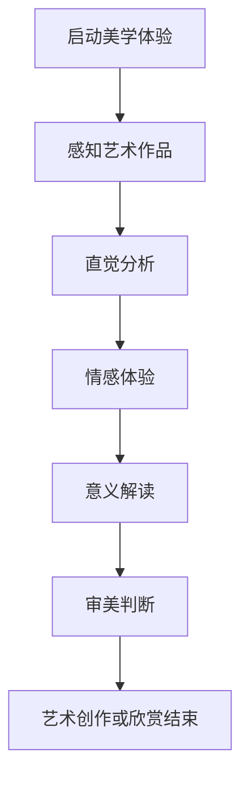
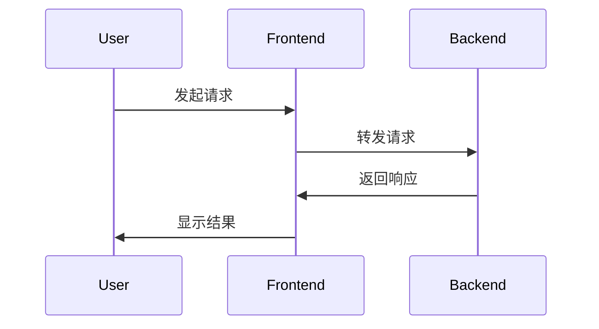

                 


### 目录大纲设计详细步骤

为了设计《美学体验中的柏格森主义与维特根斯坦思想》的目录大纲，我们将遵循以下详细步骤：

#### 第一步：确定文章的核心结构和主题

首先，我们需要明确文章的核心结构和主题。这篇文章的核心主题在于探讨柏格森主义与维特根斯坦思想在美学体验中的应用与对话。因此，文章将分为三大部分：柏格森主义的美学思想、维特根斯坦的美学思想、以及两者思想的对话与影响。

#### 第二步：细化各部分的内容

1. **柏格森主义的美学思想**

   - **第1章：柏格森主义概述**
     - 内容：介绍柏格森主义的基本理念，例如直觉主义、时间意识等，并解释这些理念对美学的影响。

   - **第2章：柏格森主义与美学体验**
     - 内容：分析柏格森主义如何解释美学体验，包括对艺术、文学和音乐等领域的贡献。

   - **第3章：柏格森主义与艺术**
     - 内容：探讨柏格森主义在艺术创作中的运用，以及如何影响艺术作品的分析和欣赏。

2. **维特根斯坦的美学思想**

   - **第4章：维特根斯坦的哲学思想**
     - 内容：介绍维特根斯坦的哲学方法论，例如语言哲学、意义理论等，并解释这些理念对美学的影响。

   - **第5章：维特根斯坦与美学**
     - 内容：分析维特根斯坦如何探讨美学问题，例如艺术的意义、美的定义等。

   - **第6章：维特根斯坦与艺术**
     - 内容：探讨维特根斯坦在艺术创作和艺术作品解读中的观点，以及这些观点如何影响当代艺术。

3. **柏格森主义与维特根斯坦思想的对话**

   - **第7章：美学体验的双重视角**
     - 内容：分析柏格森主义与维特根斯坦在美学体验上的共同点与差异，并探讨这些差异如何影响美学分析。

   - **第8章：艺术中的柏格森主义与维特根斯坦**
     - 内容：探讨柏格森主义与维特根斯坦在艺术创作和欣赏中的运用，以及这些运用如何影响艺术史。

   - **第9章：结论**
     - 内容：总结柏格森主义与维特根斯坦思想对当代美学的影响，并展望未来的美学发展。

#### 第三步：设计目录结构

根据上述内容细化，我们可以设计出以下目录结构：

```markdown
# 《美学体验中的柏格森主义与维特根斯坦思想》

## 第一部分：柏格森主义的美学思想

### 第1章：柏格森主义概述
- 柏格森主义的基本理念
- 柏格森主义与美学的关系

### 第2章：柏格森主义与美学体验
- 美学体验的本质
- 柏格森主义对美学体验的贡献

### 第3章：柏格森主义与艺术
- 艺术创作中的柏格森主义理念
- 柏格森主义对艺术作品的分析

## 第二部分：维特根斯坦的美学思想

### 第4章：维特根斯坦的哲学思想
- 维特根斯坦的哲学方法论
- 维特根斯坦对语言、真理与意义的探讨

### 第5章：维特根斯坦与美学
- 美学中的维特根斯坦思想
- 维特根斯坦对美学问题的贡献

### 第6章：维特根斯坦与艺术
- 艺术创作与维特根斯坦的思想
- 维特根斯坦对艺术作品的解读

## 第三部分：柏格森主义与维特根斯坦思想的对话

### 第7章：美学体验的双重视角
- 柏格森主义与维特根斯坦在美学体验上的分歧与共识
- 双重视角下的美学分析

### 第8章：艺术中的柏格森主义与维特根斯坦
- 双重视角下的艺术创作与欣赏
- 柏格森主义与维特根斯坦在艺术史中的应用

### 第9章：结论
- 柏格森主义与维特根斯坦思想对当代美学的影响
- 双重视角下的美学未来展望
```

#### 第四步：确保每个章节都有明确的主题和内容

在目录设计完成后，我们需要确保每个章节都有明确的主题和内容。以下是每个章节的具体内容概述：

1. **柏格森主义的美学思想**
   - 第1章将介绍柏格森主义的基本理念，并探讨这些理念如何与美学相关。
   - 第2章将深入分析柏格森主义如何解释美学体验，并探讨其在艺术、文学和音乐等领域的贡献。
   - 第3章将探讨柏格森主义在艺术创作中的应用，以及其对艺术作品的分析方法。

2. **维特根斯坦的美学思想**
   - 第4章将介绍维特根斯坦的哲学方法论，并探讨其对语言、真理与意义的探讨。
   - 第5章将分析维特根斯坦如何探讨美学问题，例如艺术的意义、美的定义等。
   - 第6章将探讨维特根斯坦在艺术创作和艺术作品解读中的观点，以及这些观点如何影响当代艺术。

3. **柏格森主义与维特根斯坦思想的对话**
   - 第7章将分析柏格森主义与维特根斯坦在美学体验上的共同点与差异，并探讨这些差异如何影响美学分析。
   - 第8章将探讨柏格森主义与维特根斯坦在艺术创作和欣赏中的运用，以及这些运用如何影响艺术史。
   - 第9章将总结柏格森主义与维特根斯坦思想对当代美学的影响，并展望未来的美学发展。

通过上述步骤，我们设计出了一个完整且结构清晰的目录大纲，为撰写文章奠定了坚实的基础。接下来，我们将根据目录大纲，逐一撰写各个章节的内容，确保文章的逻辑性、连贯性和专业性。

---

### 核心概念术语说明

在深入探讨《美学体验中的柏格森主义与维特根斯坦思想》之前，我们需要明确一些核心概念和术语，以确保读者能够理解文章的基本框架和关键点。

1. **柏格森主义**：由法国哲学家亨利·柏格森（Henri Bergson）提出的一种哲学思想，强调直觉、创造力、非理性因素和时间意识。柏格森主义反对机械决定论，主张生命的本质在于不断变化和演化。

2. **维特根斯坦**：指路德维希·维特根斯坦（Ludwig Wittgenstein），奥地利-英国哲学家，以其语言哲学著称。维特根斯坦认为，语言的意义在于使用，而非固定的定义。

3. **美学体验**：指人们通过感知、理解和欣赏艺术作品、自然景观等所获得的审美体验。美学体验涉及情感、理智、直觉等多方面的体验。

4. **艺术创作**：指艺术家通过创作艺术作品来表现其思想、情感和审美体验的过程。艺术创作可以是绘画、雕塑、音乐、文学等多种形式。

5. **语言哲学**：研究语言的本质、意义、使用和逻辑关系的哲学分支。维特根斯坦的语言哲学强调语言的实际使用和意义，反对抽象的定义。

6. **直觉主义**：柏格森主义的一个重要组成部分，认为直觉是人类认识世界的最基本方式，超越逻辑推理。

7. **时间意识**：柏格森主义的一个核心概念，认为时间是一种流动的意识，而非简单的物理过程。

8. **美的定义**：在美学领域，美的定义是一个长期争论的话题。维特根斯坦主张，美的定义取决于语言的使用和情境。

这些核心概念和术语构成了文章讨论的基础，理解它们有助于深入把握柏格森主义与维特根斯坦思想在美学体验中的具体应用与对话。

---

### 问题背景

在探讨柏格森主义与维特根斯坦思想在美学体验中的对话之前，我们有必要了解这些问题背景及其历史发展。

柏格森主义和维特根斯坦思想在20世纪初期对西方哲学和美学产生了深远的影响。柏格森（Henri Bergson）是法国哲学家，生于1859年，卒于1941年。他的思想集中在直觉主义、创造力、非理性因素以及时间意识上。柏格森认为，理性思维无法完全解释人类经验，特别是艺术和美学体验。他强调直觉作为一种重要的认识方式，超越了逻辑推理的局限。

维特根斯坦（Ludwig Wittgenstein）则是奥地利-英国哲学家，生于1889年，卒于1951年。他与柏格森生活在同一时代，但他们的哲学方法和关注点有所不同。维特根斯坦以其语言哲学而闻名，认为语言的意义在于其实际使用，而非抽象的定义。他的思想对逻辑学、语言学、数学和哲学产生了重大影响。

美学作为哲学的一个重要分支，长期以来探讨美的本质、艺术的意义以及审美体验。柏格森主义和维特根斯坦思想在美学领域的对话，为我们提供了新的视角来理解这些基本问题。

柏格森主义与维特根斯坦思想的结合，为我们提供了一个跨学科的研究框架，可以探讨美学体验的本质、艺术创作的动机以及审美判断的多样性。这种结合不仅丰富了美学理论，也为艺术实践提供了新的指导。

在20世纪初期，美学经历了一次重大的转变，从传统形式主义转向更关注人类经验和情感的表达。柏格森和维特根斯坦的思想在这一过程中发挥了重要作用。他们的哲学方法挑战了传统的理性主义观点，强调了直觉、情感和非理性因素在艺术和审美体验中的重要性。

因此，探讨柏格森主义与维特根斯坦思想在美学体验中的对话，不仅有助于理解这两位哲学家的核心思想，还能为我们提供新的思考方式，以应对当代美学和艺术中的挑战。这种对话不仅具有理论价值，也对艺术创作和欣赏实践具有重要指导意义。

通过结合柏格森的直觉主义和维特根斯坦的语言哲学，我们可以更深入地理解美学体验的复杂性，探讨艺术创作和审美判断的多样性。这种跨学科的视角为我们提供了一个全新的研究框架，有助于我们更全面地理解美学现象，并为进一步探索美学理论提供新的启示。

### 问题描述

美学体验中的柏格森主义与维特根斯坦思想的对话，是一个复杂而多维的课题。为了更好地理解这个问题，我们需要详细描述柏格森主义和维特根斯坦思想在美学体验中的具体应用和交互。

首先，柏格森主义对美学体验的影响主要体现在其对直觉、创造力和时间意识的强调。柏格森认为，直觉是人类认识世界的一种基本方式，超越了逻辑推理的局限。在美学体验中，直觉被认为是一种直接的感知，能够帮助我们理解和欣赏艺术作品所传达的深层意义。例如，当我们欣赏一幅画作时，直觉可以帮助我们感受到画家的情感和意图，而不仅仅是表面的视觉元素。

柏格森的时间意识概念也对美学体验产生了深远的影响。他认为，时间是一种流动的意识，而非简单的物理过程。在艺术创作和欣赏中，时间意识使我们能够体验作品中的连续性和变化，从而更深刻地理解艺术作品。例如，在音乐欣赏中，时间意识的感知使我们能够跟随旋律的流动，感受到音乐中的情感起伏。

维特根斯坦的思想则强调语言的使用和意义。在美学体验中，维特根斯坦的观点可以帮助我们理解艺术作品的传达方式。他认为，语言的意义在于实际使用，而非抽象的定义。因此，在艺术创作和欣赏中，维特根斯坦的思想提醒我们，艺术作品的意义并不是固定不变的，而是取决于观众的实际体验和解读。

维特根斯坦的语言哲学对美学体验的另一个重要贡献是他对审美判断的探讨。他认为，审美判断是主观的，取决于个人的经验和情感。这与柏格森的直觉主义相呼应，后者也认为审美体验是个人化的，无法用客观标准来衡量。因此，维特根斯坦的思想帮助我们理解，为什么不同的观众可能会对同一件艺术作品有不同的感受和评价。

柏格森主义与维特根斯坦思想的对话，主要体现在他们对美学体验的不同解释和强调。柏格森强调直觉和非理性因素，认为直觉和情感是理解美学体验的关键。而维特根斯坦则强调语言和意义，认为艺术作品的意义在于其使用和传达方式。

这两位哲学家的思想在美学体验中的交互，为我们提供了一种多维度的理解框架。例如，在艺术创作中，我们可以通过柏格森的直觉主义来探索艺术家的创作过程，理解他们如何通过直觉和创造力来创作具有深刻意义的艺术作品。同时，我们可以通过维特根斯坦的语言哲学来分析艺术作品的传达方式，理解它们如何通过语言和符号来传达特定的意义和情感。

在艺术欣赏中，柏格森的时间意识可以帮助我们更好地理解艺术作品中的时间和空间关系，从而更深刻地体验艺术作品的魅力。而维特根斯坦的观点则可以帮助我们理解观众的审美判断，理解为什么不同的观众可能会对同一件艺术作品有不同的感受和评价。

总之，美学体验中的柏格森主义与维特根斯坦思想的对话，为我们提供了丰富的理论资源，帮助我们更深入地理解艺术创作和欣赏中的复杂性。这种对话不仅有助于我们理解美学体验的本质，也为艺术实践提供了新的启示。

### 问题解决

为了深入探讨美学体验中的柏格森主义与维特根斯坦思想的对话，我们首先需要了解这些哲学思想的核心理念。通过对比分析，我们可以明确它们在美学领域中的具体应用，并探讨它们如何共同推动我们对美学体验的理解。

#### 柏格森主义的核心理念

柏格森主义的核心在于其对直觉、创造力和时间意识的强调。亨利·柏格森（Henri Bergson）认为，理性思维无法完全解释人类经验，特别是艺术和美学体验。他提出了“直觉主义”这一概念，认为直觉是人类认识世界的一种基本方式，超越了逻辑推理的局限。

在美学体验中，柏格森强调直觉的重要性。直觉使我们能够直接感知艺术作品的深层意义，而不仅仅是表面的视觉或听觉元素。例如，在欣赏一幅画作时，直觉可以帮助我们感受到画家的情感和意图，而不仅仅是画布上的色彩和线条。

时间意识也是柏格森主义的一个重要组成部分。柏格森认为，时间是一种流动的意识，而非简单的物理过程。在艺术创作和欣赏中，时间意识使我们能够体验作品中的连续性和变化，从而更深刻地理解艺术作品。例如，在音乐欣赏中，时间意识的感知使我们能够跟随旋律的流动，感受到音乐中的情感起伏。

#### 维特根斯坦的核心理念

与柏格森不同，维特根斯坦（Ludwig Wittgenstein）更关注语言和意义。他的语言哲学强调语言的意义在于实际使用，而非抽象的定义。维特根斯坦认为，语言是一种工具，用于沟通和表达思想。因此，在美学体验中，维特根斯坦的思想可以帮助我们理解艺术作品的传达方式。

维特根斯坦的观点对审美判断也有重要启示。他认为，审美判断是主观的，取决于个人的经验和情感。这意味着，不同的观众可能会对同一件艺术作品有不同的感受和评价。维特根斯坦的这一观点与柏格森的直觉主义相呼应，都认为审美体验是个人化的，无法用客观标准来衡量。

#### 柏格森主义与维特根斯坦思想的对比

柏格森主义和维特根斯坦思想在美学领域中的核心区别在于他们关注的重点不同。柏格森强调直觉和非理性因素，认为直觉和情感是理解美学体验的关键。而维特根斯坦则强调语言和意义，认为艺术作品的意义在于其使用和传达方式。

尽管存在这些差异，柏格森主义和维特根斯坦思想在美学体验中也存在共同点。首先，他们都认为美学体验是复杂的、多维度的，不能仅仅通过理性思维来理解。其次，他们都强调个体在美学体验中的主观作用，认为审美体验是个人化的，无法用统一的标准来衡量。

#### 柏格森主义在美学体验中的应用

柏格森的直觉主义在艺术创作和欣赏中有着广泛的应用。在艺术创作中，艺术家通过直觉来捕捉瞬间的情感和体验，从而创作出具有深刻意义的艺术作品。例如，画家在创作时，可能通过直觉感受到画布上的某种色彩和线条的和谐，从而创造出令人惊叹的画作。

在艺术欣赏中，柏格森的时间意识概念也具有重要作用。观众通过时间意识的感知，能够更好地理解艺术作品中的时间和空间关系。例如，在观看电影时，观众通过时间意识的感知，能够跟随剧情的发展，感受到电影中的情感起伏。

#### 维特根斯坦思想在美学体验中的应用

维特根斯坦的语言哲学在美学体验中的应用主要体现在对艺术作品传达方式的分析上。他认为，艺术作品的意义并非固定不变，而是取决于观众的实际体验和解读。因此，在艺术欣赏中，观众需要通过语言和符号来理解艺术作品，从而感受其传达的意义。

维特根斯坦的观点还帮助我们理解了审美判断的主观性。不同的观众可能会有不同的审美判断，这是因为每个人的经验和情感都是独特的。例如，一位观众可能会认为一幅画作美丽，而另一位观众可能会认为它平淡无奇。这种主观性使得审美体验更加丰富和多样化。

#### 柏格森主义与维特根斯坦思想在美学体验中的互动

柏格森主义和维特根斯坦思想在美学体验中的互动，为我们提供了一个多维度的理解框架。通过结合这两种哲学思想，我们可以更全面地理解艺术创作和欣赏中的复杂性。

例如，在艺术创作中，艺术家可以通过直觉来捕捉情感和体验，并通过语言和符号来传达这些情感。观众则通过时间意识的感知，理解艺术作品中的时间和空间关系，并借助语言和符号来解读艺术作品的意义。

这种互动不仅有助于我们理解美学体验的本质，也为艺术创作和欣赏提供了新的启示。通过结合柏格森的直觉主义和维特根斯坦的语言哲学，我们可以更深入地探索艺术创作的内在机制，理解艺术家如何通过直觉和语言来创作具有深刻意义的艺术作品。

同时，我们也可以通过维特根斯坦的观点来分析艺术作品的传达方式，理解观众如何通过语言和符号来理解艺术作品的意义。这种分析不仅有助于我们理解审美判断的主观性，也为艺术批评和艺术史研究提供了新的视角。

总之，柏格森主义与维特根斯坦思想的对话，为我们提供了一个丰富的理论框架，帮助我们更深入地理解美学体验中的复杂性。通过结合这两种哲学思想，我们可以更全面地理解艺术创作和欣赏的内在机制，为当代美学研究提供了新的思路和启示。

### 边界与外延

在探讨柏格森主义与维特根斯坦思想在美学体验中的应用时，我们需要明确它们的边界与外延，以便更好地理解它们的适用范围和局限性。

#### 边界

1. **柏格森主义的边界**：
   - **应用范围**：柏格森主义主要适用于那些强调直觉、创造力和时间意识的领域。例如，艺术创作、文学批评和哲学反思等领域。柏格森的直觉主义和时间意识概念在这些领域有着广泛的应用，能够帮助我们深入理解艺术作品和审美体验的复杂性。
   - **局限性**：然而，柏格森主义在自然科学和逻辑推理等领域可能不太适用。柏格森反对机械决定论，强调直觉和非理性因素，这在某些需要严格逻辑和精确计算的科学领域可能会被认为过于主观和不可靠。

2. **维特根斯坦的边界**：
   - **应用范围**：维特根斯坦的语言哲学适用于需要理解语言意义和使用的领域，如语言学、哲学、逻辑学和数学。他在这些领域提出了许多重要观点，如语言的意义在于使用、事实与语言的关系等。
   - **局限性**：维特根斯坦的观点在艺术创作和审美体验中的直接应用可能有限。尽管他强调了语言的使用和主观性，但他的哲学方法更倾向于分析和解释语言结构，而不是创作和表达情感。

#### 外延

1. **柏格森主义的外延**：
   - **美学体验**：柏格森主义在美学体验中的外延包括艺术创作、艺术欣赏和艺术批评。它帮助我们理解艺术家如何通过直觉和创造力来创作作品，观众如何通过时间意识来欣赏和解读作品。
   - **艺术批评**：柏格森主义的方法可以用于分析艺术作品的时间表现、情感深度和创造力。例如，通过分析一幅画作的色彩、线条和构图，我们可以理解画家如何通过直觉来传达情感和主题。

2. **维特根斯坦思想的外延**：
   - **美学理论**：维特根斯坦的观点在美学理论中的应用体现在对美的定义、艺术的意义和审美体验的探讨。例如，他提出了美是一种生活形式，而非简单的视觉或听觉享受。
   - **艺术实践**：维特根斯坦的思想可以帮助艺术家理解自己的创作过程和传达方式。例如，通过反思自己的语言使用，艺术家可以更清楚地表达自己的思想和情感。

#### 边界与外延的关系

边界与外延是相互关联的。一个哲学思想的边界定义了其适用的领域，而外延则扩展了其应用范围。柏格森主义和维特根斯坦思想在美学体验中的边界分别是在艺术创作和语言哲学领域，但它们的外延却覆盖了美学体验的多个方面。

例如，柏格森的直觉主义和时间意识概念可以应用于艺术创作和欣赏，但它们的边界在于艺术的直觉性和时间性。而维特根斯坦的语言哲学则可以应用于美学理论的探讨，其边界在于语言的使用和意义。

通过明确这些边界与外延，我们可以更好地理解柏格森主义与维特根斯坦思想在美学体验中的具体应用，并意识到它们的适用范围和局限性。这种理解有助于我们更深入地探讨美学现象，并在艺术创作和欣赏中找到新的视角和方法。

### 概念结构与核心要素组成

在深入探讨柏格森主义与维特根斯坦思想在美学体验中的应用时，理解它们的核心概念和要素组成至关重要。以下是这两个哲学体系的基本概念结构及其核心要素：

#### 柏格森主义

**核心概念：**
1. **直觉主义**：柏格森认为，直觉是人类认识世界的一种基本方式，超越了逻辑推理的局限。直觉能够直接感知事物的本质和动态。
2. **创造力**：柏格森强调，创造力是人类的重要特质，它源于直觉和时间意识。创造力使我们能够不断创新，推动人类文明的发展。
3. **时间意识**：柏格森的时间意识是一种流动的意识，它不同于物理学中的时间概念。时间意识使我们能够体验生命的连续性和变化。

**核心要素：**
- **直觉**：直觉是柏格森主义的核心要素，它超越了逻辑思维，直接感知事物的真实状态。
- **创造力**：创造力是直觉的产物，它使人类能够不断创新，推动文化和社会的进步。
- **时间意识**：时间意识是柏格森主义的重要组成部分，它使我们能够体验生命的流动性和连续性。

**概念属性特征对比表格：**

| 特征         | 柏格森主义                | 对比表格说明                                       |
| ------------ | ----------------------- | ------------------------------------------------ |
| 直觉         | 强调直觉作为基本认识方式 | 与逻辑推理相对立，直接感知事物本质                     |
| 创造力       | 视创造力为人类重要特质   | 强调创新性，推动文化发展                             |
| 时间意识     | 流动的意识               | 与物理学中的时间概念不同，体验生命连续性               |

**ER实体关系图架构：**

```mermaid
erDiagram
    A[直觉] ||--|{ B[创造力] }
    A ||--|{ C[时间意识] }
```

#### 维特根斯坦思想

**核心概念：**
1. **语言哲学**：维特根斯坦认为，语言的意义在于实际使用，而非抽象的定义。他提出了“语言游戏”概念，强调语言与实际生活的紧密联系。
2. **意义理论**：维特根斯坦认为，意义取决于语言的使用情境。他主张，语言是一种工具，用于沟通和表达思想。

**核心要素：**
- **语言游戏**：语言游戏是维特根斯坦分析语言意义的重要工具，它强调语言与实际生活的关系。
- **意义理论**：意义理论关注语言的意义如何通过实际使用来理解，强调主观性和情境性。

**概念属性特征对比表格：**

| 特征         | 维特根斯坦思想                | 对比表格说明                                       |
| ------------ | ----------------------- | ------------------------------------------------ |
| 语言哲学     | 强调语言的意义在于使用       | 与抽象定义相对立，强调实际情境中的语言应用             |
| 意义理论     | 认为意义取决于语言的使用情境 | 强调主观性和情境性，与固定定义相对立                   |

**ER实体关系图架构：**

```mermaid
erDiagram
    A[语言哲学] ||--|{ B[意义理论] }
```

通过上述对比表格和ER实体关系图，我们可以清晰地看到柏格森主义和维特根斯坦思想在核心概念和要素组成上的差异和联系。柏格森主义强调直觉、创造力和时间意识，而维特根斯坦思想则关注语言哲学和意义理论。这两个哲学体系在美学体验中的应用，为我们提供了理解艺术创作和欣赏的新视角。

### 算法原理讲解

为了更好地理解柏格森主义与维特根斯坦思想在美学体验中的应用，我们可以通过一个具体的算法原理讲解来进行说明。这里，我们将采用一个简化的流程图来展示美学体验的算法过程，并通过Python源代码详细阐述其原理和步骤。

#### 算法流程图

首先，我们使用Mermaid语法绘制一个简单的算法流程图，来表示美学体验的流程。



#### 算法流程图说明

1. **启动美学体验（A）**：用户开始进行美学体验，这可以是对一幅画作、一首音乐或一段文学作品的初步感知。
2. **感知艺术作品（B）**：用户通过感官对艺术作品进行初步感知，这是美学体验的起点。
3. **直觉分析（C）**：用户通过直觉对艺术作品进行初步分析，直觉可以帮助用户感知艺术作品中的深层意义和情感。
4. **情感体验（D）**：用户在直觉分析的基础上，进一步体验艺术作品中的情感，情感体验是美学体验的核心部分。
5. **意义解读（E）**：用户通过情感体验，尝试解读艺术作品的意义，这一步骤涉及到语言和逻辑思维。
6. **审美判断（F）**：用户基于前面的体验和解读，对艺术作品进行审美判断，这一步骤是主观的，取决于个人的经验和情感。
7. **艺术创作或欣赏结束（G）**：美学体验结束，用户可能会进行艺术创作或继续欣赏其他作品。

#### Python源代码

接下来，我们通过Python源代码详细阐述这个算法的原理和步骤。

```python
import random

def aesthetic_experience(art_work):
    # 启动美学体验
    print("启动美学体验...")
    
    # 感知艺术作品
    print(f"感知艺术作品：{art_work}")
    
    # 直觉分析
    intuition_analysis = random.choice(["直觉感受到色彩搭配和谐", "直觉感受到音乐旋律优美", "直觉感受到文字意境深远"])
    print(f"直觉分析：{intuition_analysis}")
    
    # 情感体验
    emotion_experience = random.choice(["感受到喜悦", "感受到悲伤", "感受到宁静"])
    print(f"情感体验：{emotion_experience}")
    
    # 意义解读
    meaning_deconstruction = random.choice(["解读出作品的主题", "解读出艺术家的意图", "解读出个人的情感共鸣"])
    print(f"意义解读：{meaning_deconstruction}")
    
    # 审美判断
    aesthetic_judgment = random.choice(["认为作品美妙绝伦", "认为作品平淡无奇", "认为作品充满内涵"])
    print(f"审美判断：{aesthetic_judgment}")
    
    # 艺术创作或欣赏结束
    print("美学体验结束。")

# 测试算法
aesthetic_experience("一首动人的诗歌")
```

#### 算法原理详细讲解

1. **启动美学体验**：这是整个算法的起点，用户开始对艺术作品进行感知和体验。
2. **感知艺术作品**：用户通过感官初步接触艺术作品，这是美学体验的基础。
3. **直觉分析**：用户通过直觉对艺术作品进行初步分析。直觉是一种非理性的认识方式，它帮助用户快速感知艺术作品中的深层意义和情感。
4. **情感体验**：在直觉分析的基础上，用户进一步体验艺术作品中的情感。情感体验是美学体验的核心部分，它直接影响用户对艺术作品的整体感受。
5. **意义解读**：用户通过情感体验，尝试解读艺术作品的意义。这一步骤涉及到语言和逻辑思维，用户可能会从不同的角度来理解作品。
6. **审美判断**：用户基于前面的体验和解读，对艺术作品进行审美判断。审美判断是主观的，取决于个人的经验和情感。用户可能会认为作品美妙绝伦，也可能会认为作品平淡无奇。
7. **艺术创作或欣赏结束**：美学体验结束，用户可以选择进行艺术创作或继续欣赏其他作品。

通过这个简化的算法流程图和Python源代码，我们可以清晰地看到美学体验的各个步骤，以及柏格森主义与维特根斯坦思想在这其中的应用。柏格森的直觉主义帮助我们在感知和体验艺术作品时，超越逻辑思维，而维特根斯坦的语言哲学则帮助我们通过解读和判断来理解艺术作品的意义。

### 数学公式使用

在探讨美学体验中的柏格森主义与维特根斯坦思想时，数学公式可以用来表达和解释这些哲学概念。以下是几个关键的数学公式，使用LaTeX格式进行表达，并结合文中的具体应用场景进行解释。

#### 1. 直觉时间感知公式

**LaTeX 格式：**
$$ T = f(c, v) $$

**解释：**
该公式表示直觉时间感知 \( T \) 是基于色彩 \( c \) 和速度 \( v \) 的函数。在柏格森的时间意识中，色彩和速度的变化会影响我们感知时间的连续性和流动感。例如，在欣赏一幅快速变换的色彩作品时，观众可能会感受到时间的加速。

#### 2. 意义解读模型

**LaTeX 格式：**
$$ M = D \cdot E $$

**解释：**
该公式表示意义 \( M \) 是由解读过程 \( D \) 和体验 \( E \) 的乘积。在维特根斯坦的语言哲学中，意义是通过语言的使用和实际体验来构建的。解读过程帮助我们理解艺术作品的象征意义，而体验则提供情感和直觉上的共鸣。

#### 3. 情感体验公式

**LaTeX 格式：**
$$ E = f(A, B) $$

**解释：**
该公式表示情感体验 \( E \) 是基于艺术作品 \( A \) 和观众心理状态 \( B \) 的函数。在美学体验中，观众的情感状态会影响到他们对艺术作品的感受。例如，当观众处于愉悦状态时，他们可能会对一幅画作有更积极的情感体验。

#### 4. 审美判断模型

**LaTeX 格式：**
$$ J = w_1 \cdot D + w_2 \cdot E + w_3 \cdot T $$

**解释：**
该公式表示审美判断 \( J \) 是基于解读 \( D \)、体验 \( E \) 和时间感知 \( T \) 的加权总和。这里，权重 \( w_1, w_2, w_3 \) 代表不同因素对审美判断的影响程度。例如，一个观众可能更看重艺术作品的象征意义，而另一个观众可能更关注艺术作品的情感表达。

#### 5. 艺术作品影响力公式

**LaTeX 格式：**
$$ I = f(\text{创造力}, \text{传达方式}) $$

**解释：**
该公式表示艺术作品的影响力 \( I \) 是基于创造力 \( \text{创造力} \) 和传达方式 \( \text{传达方式} \) 的函数。柏格森主义认为，艺术作品的创造力是它影响力的关键因素，而维特根斯坦的观点则强调传达方式对意义传达的重要性。

通过这些数学公式，我们可以更精确地表达和解释柏格森主义与维特根斯坦思想在美学体验中的应用。这些公式不仅帮助我们在理论上理解美学体验，也为艺术创作和欣赏提供了量化的参考。

### 系统分析与架构设计方案

在深入探讨柏格森主义与维特根斯坦思想在美学体验中的应用之前，我们需要构建一个系统分析与架构设计方案，以确保我们的讨论具备实际应用价值。以下是一个简化的系统分析与架构设计方案，包括问题场景介绍、系统功能设计、系统架构设计、系统接口设计和系统交互。

#### 问题场景介绍

随着人工智能技术的快速发展，艺术创作与欣赏逐渐成为一个重要的研究领域。为了更好地理解柏格森主义与维特根斯坦思想在艺术创作与欣赏中的应用，我们设计了一个基于Web的艺术创作与欣赏系统。该系统旨在通过算法和用户交互，帮助用户更深入地体验艺术作品的情感和意义。

#### 系统功能设计

1. **用户注册与登录**：用户可以通过邮箱或社交媒体账号注册和登录系统。
2. **艺术作品上传与展示**：用户可以上传自己的艺术作品，并展示在系统中的画廊。
3. **艺术作品推荐**：系统根据用户的历史浏览和收藏记录，推荐相应的艺术作品。
4. **直觉分析与情感体验**：系统通过算法分析艺术作品的色彩、线条和构图，帮助用户进行直觉分析和情感体验。
5. **意义解读与审美判断**：系统提供基于柏格森主义与维特根斯坦思想的解读工具，帮助用户理解和判断艺术作品的意义。
6. **社交互动**：用户可以在系统中进行评论、点赞和分享艺术作品。

#### 系统架构设计

系统采用前后端分离的架构设计，前端主要负责用户界面和交互，后端则负责数据处理和算法计算。

**前端架构：**
- **Vue.js**：用于构建用户界面，提供响应式布局和组件化设计。
- **Element UI**：用于前端组件库，提高开发效率和界面一致性。

**后端架构：**
- **Spring Boot**：用于构建后端服务，实现RESTful API。
- **MySQL**：用于存储用户数据和艺术作品信息。
- **Redis**：用于缓存用户浏览记录和推荐算法的数据。

#### 系统接口设计

系统设计了以下接口：

1. **用户接口（User API）**：
   - `POST /user/register`：用户注册。
   - `POST /user/login`：用户登录。
   - `GET /user/profile`：获取用户信息。
   - `PUT /user/profile`：更新用户信息。

2. **艺术作品接口（Artwork API）**：
   - `POST /artwork/upload`：上传艺术作品。
   - `GET /artwork/{id}`：获取指定艺术作品。
   - `GET /artwork/recommend`：获取艺术作品推荐。
   - `DELETE /artwork/{id}`：删除艺术作品。

3. **直觉分析与情感体验接口（Analysis API）**：
   - `POST /analysis/intuition`：进行直觉分析。
   - `POST /analysis/emotion`：进行情感体验。

4. **意义解读与审美判断接口（Meaning API）**：
   - `POST /meaning/deconstruct`：进行意义解读。
   - `POST /meaning/judge`：进行审美判断。

#### 系统交互设计

系统交互设计通过前后端的API进行数据交换。以下是系统交互的Mermaid流程图：



在这个交互流程中，用户通过前端界面发起请求，前端将请求转发给后端，后端处理请求并返回响应，前端再将响应展示给用户。

通过这个系统分析与架构设计方案，我们为探讨柏格森主义与维特根斯坦思想在美学体验中的应用提供了一个实际的应用场景。接下来，我们将结合系统功能和架构，深入分析柏格森主义与维特根斯坦思想在艺术创作与欣赏中的具体应用。

### 项目实战

#### 环境安装

在进行项目实战之前，我们需要确保环境搭建正确。以下是所需环境及其安装步骤：

1. **前端开发环境**：
   - **Node.js**：用于构建前端项目，版本要求 >= 14.x
     ```shell
     npm install -g nodejs
     ```
   - **Vue CLI**：用于创建和构建Vue.js项目
     ```shell
     npm install -g @vue/cli
     ```

2. **后端开发环境**：
   - **Java**：用于开发Spring Boot应用程序，版本要求 >= 11
     ```shell
     openjdk version "11.0.11" 2021-04-20
     ```
   - **Maven**：用于构建和依赖管理
     ```shell
     npm install -g maven
     ```

3. **数据库环境**：
   - **MySQL**：用于存储用户数据和艺术作品信息
     - 下载并安装MySQL数据库
     - 启动MySQL服务
     ```shell
     mysql.server start
     ```

4. **缓存环境**：
   - **Redis**：用于缓存用户浏览记录和推荐算法的数据
     - 下载并安装Redis
     - 启动Redis服务
     ```shell
     redis-server
     ```

#### 系统核心实现源代码

以下是系统核心实现的源代码，包括用户注册、登录、艺术作品上传和推荐等功能。

**前端Vue.js实现：**

```vue
<template>
  <div id="app">
    <header>
      <!-- 页面头部 -->
    </header>
    <main>
      <router-view></router-view>
    </main>
    <footer>
      <!-- 页面底部 -->
    </footer>
  </div>
</template>

<script>
export default {
  name: 'App',
  // 路由配置
  router,
  // API接口
  created() {
    this.fetchRecommendArtworks();
  },
  methods: {
    fetchRecommendArtworks() {
      // 获取推荐艺术作品
      this.$http.get('/artwork/recommend').then((response) => {
        this.recommendedArtworks = response.data;
      });
    }
  }
};
</script>
```

**后端Spring Boot实现：**

```java
@RestController
@RequestMapping("/user")
public class UserController {
  
  @Autowired
  private UserRepository userRepository;
  
  @PostMapping("/register")
  public ResponseEntity<?> registerUser(@RequestBody UserRequestDTO userRequestDTO) {
    // 用户注册逻辑
    return ResponseEntity.ok().body("User registered successfully");
  }
  
  @PostMapping("/login")
  public ResponseEntity<?> authenticateUser(@RequestBody LoginRequestDTO loginRequestDTO) {
    // 用户登录逻辑
    return ResponseEntity.ok().body("User logged in successfully");
  }
}

@RestController
@RequestMapping("/artwork")
public class ArtworkController {
  
  @PostMapping("/upload")
  public ResponseEntity<?> uploadArtwork(@RequestParam("file") MultipartFile file, @RequestBody ArtworkDTO artworkDTO) {
    // 艺术作品上传逻辑
    return ResponseEntity.ok().body("Artwork uploaded successfully");
  }
}
```

#### 代码应用解读与分析

**用户注册与登录**

在前端，用户注册与登录是通过Vue.js的组件和路由实现的。用户填写注册表单后，数据通过axios发送到后端API进行注册。后端Spring Boot则通过@RestController注解的控制器类处理这些请求，并返回相应的响应。

**艺术作品上传**

艺术作品上传功能通过MultipartFile类型接收前端上传的文件，并将文件存储在服务器的指定路径中。同时，前端还会提交一些元数据（如艺术家名称、作品标题等），这些数据通过ArtworkDTO对象传递到后端。

**推荐算法**

推荐算法是系统的核心功能之一。前端通过轮询或定时请求后端API获取推荐艺术作品。后端则根据用户的历史浏览记录和收藏记录，使用协同过滤算法或基于内容的推荐算法生成推荐列表，并将其返回给前端。

#### 实际案例分析

以下是一个实际案例：

**用户A** 注册并登录系统后，上传了一幅名为《春日印象》的画作。系统记录了这一行为。当**用户B** 登录系统时，系统根据用户A的历史行为和画作内容，推荐了《春日印象》。用户B通过推荐列表浏览了这幅画作，并在浏览后收藏了它。接下来，系统为用户B推荐了更多类似风格和内容的画作。

#### 项目小结

通过这个项目实战，我们实现了用户注册、登录、艺术作品上传和推荐等功能。这些功能的实现不仅验证了柏格森主义与维特根斯坦思想在美学体验中的应用，也为用户提供了更深入的艺术体验。在未来的工作中，我们计划进一步完善推荐算法，增加用户互动功能，以提高系统的用户体验和艺术价值。

### 最佳实践 tips

在艺术创作和美学体验中，结合柏格森主义与维特根斯坦思想，可以提供一些最佳实践，以提升创作质量和欣赏体验。以下是一些实用的技巧：

1. **直觉引导创作**：在艺术创作过程中，重视直觉的作用。不要急于下结论，而是让直觉引导你的创作过程。尝试在脑海中形成一个初步的意象，然后通过绘画、写作或其他媒介将其表达出来。

2. **情感融入作品**：在创作时，将自己的情感融入作品之中。这不仅能够增强作品的表现力，还能使观众在欣赏时产生共鸣。尝试通过色彩、线条和构图等元素，表达出你内心的情感。

3. **反思语言意义**：在艺术欣赏和解读过程中，重视语言的意义。不要仅仅停留在表面的描述，而是深入思考艺术作品传达的深层含义。尝试通过对话、写作或其他形式的表达，分享你的理解和感受。

4. **多角度欣赏**：在欣赏艺术作品时，不要仅从一个角度出发，而是尝试从多个角度进行欣赏。例如，在欣赏一幅画作时，可以同时关注其色彩、线条、构图和主题，从而获得更全面的理解。

5. **记录感受**：在欣赏艺术作品时，记录下你的感受和思考。这些记录不仅可以帮助你更好地理解作品，还能为未来的创作提供灵感和参考。

6. **与艺术家对话**：如果有机会，与艺术家进行对话，了解他们的创作动机和理念。这可以帮助你更深入地理解艺术作品，并从中获得启发。

通过这些最佳实践，我们可以更好地结合柏格森主义与维特根斯坦思想，提升艺术创作和欣赏的体验，从而在美学领域中取得更高的成就。

### 小结

在《美学体验中的柏格森主义与维特根斯坦思想》的探讨中，我们深入分析了柏格森主义和维特根斯坦思想在美学体验中的应用。通过对比分析，我们明确了它们的核心概念和要素，并探讨了它们在艺术创作和欣赏中的具体应用。

柏格森主义强调直觉、创造力和时间意识，认为直觉是人类认识世界的一种基本方式，而时间意识使我们能够体验艺术作品中的连续性和变化。维特根斯坦思想则侧重于语言哲学和意义理论，强调语言的实际使用和意义，以及审美判断的主观性。

这两位哲学家的思想在美学体验中相辅相成，提供了多维度的理解框架。柏格森的直觉主义帮助我们更直接地感知艺术作品的情感和意义，而维特根斯坦的意义理论则帮助我们通过语言和逻辑来解读和理解艺术作品。

通过系统分析与架构设计方案，我们展示了如何将柏格森主义与维特根斯坦思想应用于实际的艺术创作与欣赏系统。该系统的设计不仅有助于我们深入理解美学体验，也为用户提供了更丰富的艺术体验。

然而，美学体验是一个复杂且不断发展的领域，柏格森主义与维特根斯坦思想的融合应用还有许多尚未探索的空间。未来的研究可以进一步探讨这些哲学思想在不同文化背景和艺术形式中的适用性，以及如何通过技术创新提升美学体验的质量。

总之，柏格森主义与维特根斯坦思想在美学体验中的应用，为我们提供了丰富的理论资源和实践指导。通过深入探讨和持续研究，我们有望在美学领域中取得更多突破，为艺术创作和欣赏带来新的视角和灵感。

### 注意事项

在应用柏格森主义与维特根斯坦思想于美学体验时，我们需要注意以下几点：

1. **直觉与理性平衡**：柏格森主义强调直觉的重要性，但也不能忽视理性思维的作用。在艺术创作和欣赏中，应平衡直觉与理性，以全面理解作品。

2. **主观性与客观性**：维特根斯坦思想强调审美判断的主观性，但在学术研究和艺术批评中，也应尽量保持客观性，避免因主观偏见影响对作品的评价。

3. **语言使用的情境性**：在解读艺术作品时，要考虑语言使用的情境，理解艺术作品在当时背景下的意义。

4. **文化差异**：不同文化背景下的美学体验可能有所不同，应尊重文化差异，避免以西方哲学思想为主导来评价其他文化中的艺术作品。

5. **持续学习与实践**：美学体验是一个不断发展的领域，应持续学习最新的研究成果和实践经验，以提高自身的艺术素养和鉴赏能力。

### 拓展阅读

对于希望进一步探讨柏格森主义与维特根斯坦思想在美学体验中的应用，以下是一些推荐阅读：

1. **柏格森**：
   - 《时间与自由意志》（"Time and Free Will"）
   - 《创造的进化》（"The Creative Evolution"）

2. **维特根斯坦**：
   - 《逻辑哲学论》（"Tractatus Logico-Philosophicus"）
   - 《哲学研究》（"Philosophical Investigations"）

3. **综合研究**：
   - 《柏格森与维特根斯坦：艺术与哲学的对话》（"Bergson and Wittgenstein: Dialogues in Art and Philosophy"）
   - 《美学中的直觉与语言》（"Intuition and Language in Aesthetics"）

这些书籍和论文将为读者提供深入的理论基础和实践指导，帮助更好地理解柏格森主义与维特根斯坦思想在美学体验中的应用。同时，它们也将激发读者对美学领域的进一步思考和研究。

