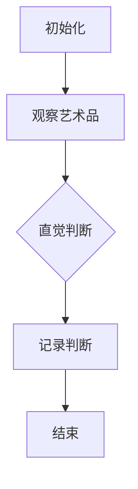
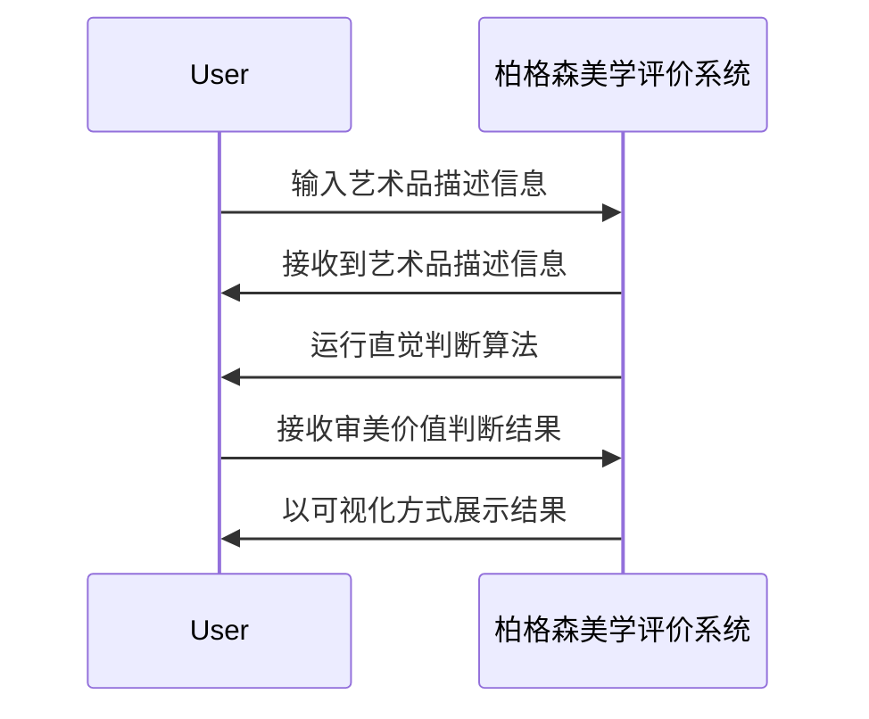

                 

# 柏格森主义与维特根斯坦哲学的美学思想解析

## 摘要

本文旨在探讨美学思想中的柏格森主义与维特根斯坦哲学，分析两者在美学领域的核心观点与影响。文章首先介绍了柏格森主义和维特根斯坦哲学的基本概念及其对美学的影响，然后分别详细阐述了柏格森主义和维特根斯坦哲学的美学观点，最后讨论了两种美学思想的对话及其在当代美学中的应用与教育意义。本文关键词：柏格森主义、维特根斯坦哲学、美学、直觉主义、语言哲学。

## 第一部分：引论

### 1.1 美学思想概述

美学作为哲学的重要分支，旨在探讨美的本质、美的创造和审美体验。美学的发展历程可以追溯到古希腊时期的哲学探讨，经过中世纪和文艺复兴的洗礼，最终在18世纪达到高峰。美学的研究对象包括自然美、艺术美和社会美等，研究方法包括理性分析和感性体验。

### 1.2 柏格森主义哲学背景

柏格森（Henri Bergson）是20世纪法国著名哲学家，其哲学思想被称为柏格森主义。柏格森主义的核心思想是时间意识，他认为现实世界是由不断流动的“生命冲动”构成的，时间具有创造性和个体性。柏格森主义对美学的影响主要体现在其直觉主义和时间观念上。

### 1.3 维特根斯坦哲学背景

维特根斯坦（Ludwig Wittgenstein）是20世纪奥地利哲学家，其哲学思想分为两个阶段：早期逻辑原子主义和后期语言哲学。维特根斯坦认为哲学的任务是澄清语言和思维的关系，语言是思维的工具。他对美学理论的贡献主要体现在其语言哲学观点上。

## 第二部分：柏格森主义美学

### 2.1 柏格森的时间观念

柏格森认为时间是一种内在的、主观的体验，不同于物理时间的线性流动。他提出了“绵延”（Duration）概念，指的是个体在时间中的存在和流动。柏格森的时间观念对美学的影响在于，它强调美的创造和审美体验的动态过程。

### 2.2 柏格森的直觉主义

直觉主义是柏格森哲学的核心，他认为直觉是人类认识的真正来源，能够直接感知现实的本质。直觉主义在美学中的应用体现在对艺术作品的理解和欣赏上，要求观众通过直觉感受艺术作品的内在生命。

### 2.3 柏格森的美学理论

柏格森的美学理论强调美与创造力的关系。他认为美是生命力的体现，是创造的产物。柏格森提出了“生命的美”（Beauty of life）和“艺术的美”（Beauty of art）两个概念，分别指自然和艺术中的美。

### 2.4 柏格森美学批评

柏格森美学在当代受到一些批评，主要认为其过于抽象和难以理解。然而，柏格森美学的当代意义在于其强调美学的主体性和动态性，为当代美学提供了新的视角。

## 第三部分：维特根斯坦哲学美学

### 3.1 维特根斯坦的语言哲学

维特根斯坦的语言哲学认为，语言是思维的工具，但语言的局限性导致了哲学问题的产生。他对美学理论的贡献在于，通过分析语言和思维的关系，揭示了美学问题的本质。

### 3.2 维特根斯坦的哲学批判

维特根斯坦批判了柏格森的美学观点，认为其过于强调直觉和情感，忽视了语言和逻辑的作用。他提出了“语言游戏”（Language game）概念，强调语言的使用和社会实践的重要性。

### 3.3 维特根斯坦的美学观点

维特根斯坦认为，美的本质在于事物的形式和结构的和谐与统一。他提出了“游戏”（Game）概念，认为艺术是游戏的一种形式，艺术家通过创造形式和结构来传达美的感受。

### 3.4 维特根斯坦美学评价

维特根斯坦美学在当代具有广泛的影响，其强调语言和逻辑在美学中的作用，为美学研究提供了新的思路。然而，其过于理性化和形式化的观点也受到一定批评。

## 第四部分：柏格森主义与维特根斯坦哲学的美学对话

### 4.1 两种美学思想的对话

柏格森主义与维特根斯坦哲学在美学领域存在一定的异同。柏格森强调直觉和生命体验，维特根斯坦强调语言和逻辑。两者在美学问题上的碰撞与融合，为我们提供了更丰富的美学视角。

### 4.2 美学思想在当代的应用

当代美学在柏格森主义与维特根斯坦哲学的启发下，呈现出多样化和综合化的趋势。在艺术、设计和教育等领域，两种美学思想的应用为创造和审美体验提供了新的思路。

### 4.3 美学思想的教育意义

美学教育在培养人们的审美能力和创造力方面具有重要意义。柏格森主义与维特根斯坦哲学的美学思想为美学教育提供了理论支持和实践指导。

## 第五部分：结论

### 5.1 柏格森主义与维特根斯坦哲学的美学贡献

柏格森主义与维特根斯坦哲学在美学领域做出了重要贡献。前者强调直觉和生命体验，后者强调语言和逻辑。两者共同丰富了美学理论，为当代美学研究提供了有益的启示。

### 5.2 美学思想的未来发展方向

美学思想在未来的发展中，将继续探索美的本质、审美体验和艺术创作等方面。柏格森主义与维特根斯坦哲学的对话，将继续为美学研究提供新的思路和方法。

## 作者信息

作者：AI天才研究院/AI Genius Institute & 禅与计算机程序设计艺术 /Zen And The Art of Computer Programming

## 文章核心概念与联系

### 柏格森主义与维特根斯坦哲学的美学核心概念对比

| 核心概念 | 柏格森主义 | 维特根斯坦哲学 |
| --- | --- | --- |
| 时间观念 | 强调时间的流动性和个体性 | 强调语言的局限性和形式化 |
| 直觉主义 | 认为直觉是人类认识的真正来源 | 认为语言是思维的工具 |
| 美的本质 | 美是生命力的体现，是创造的产物 | 美是事物的形式和结构的和谐与统一 |
| 审美体验 | 强调审美体验的动态过程 | 强调审美体验的理性化和形式化 |

### 柏格森主义与维特根斯坦哲学的美学ER实体关系图

```mermaid
erDiagram
  Person --> Art
  Person --> Experience
  Art --> Creativity
  Experience --> Aesthetic
  Aesthetic --> Judgment
```

- **Person（人）**：指艺术创作和审美体验的主体。
- **Art（艺术）**：指由人创作的具有审美价值的作品。
- **Experience（体验）**：指人在艺术创作和欣赏过程中的感受和认知。
- **Creativity（创造力）**：指人在艺术创作过程中所表现出的创新能力。
- **Aesthetic（审美）**：指人对艺术作品的审美判断和评价。
- **Judgment（判断）**：指人对艺术作品的审美评价。

## 算法原理讲解

### 柏格森主义的直觉算法原理

柏格森主义强调直觉在认识世界中的重要性。以下是一个简单的直觉算法示例，用于模拟人在欣赏艺术品时的直觉判断过程。

#### 算法流程图



#### Python源代码实现

```python
def intuitive_judgment(artwork):
    """
    直觉判断艺术品的审美价值。
    
    参数：
    artwork：艺术品的描述字符串。
    
    返回：
    判断结果：True（直觉认为艺术品有审美价值），False（直觉认为艺术品无审美价值）。
    """
    # 直觉判断逻辑
    # 假设艺术品中的色彩丰富、构图和谐、情感表达强烈被认为是具有审美价值的
    if "色彩丰富" in artwork or "构图和谐" in artwork or "情感表达强烈" in artwork:
        return True
    else:
        return False

# 测试算法
artwork = "这幅画色彩丰富，构图和谐，情感表达强烈"
result = intuitive_judgment(artwork)
print(f"直觉判断结果：{'有审美价值' if result else '无审美价值'}")
```

#### 算法原理的数学模型和公式

柏格森主义的直觉算法原理可以表示为以下数学模型：

$$
\text{审美价值} = f(\text{色彩丰富度}, \text{构图和谐度}, \text{情感表达度})
$$

其中，$f$ 是一个模糊函数，用于综合考虑色彩丰富度、构图和谐度和情感表达度三个因素，判断艺术品是否具有审美价值。

#### 举例说明

假设有一幅画，其色彩丰富度为 0.8，构图和谐度为 0.7，情感表达度为 0.9。根据上述数学模型，我们可以计算出这幅画的审美价值：

$$
\text{审美价值} = f(0.8, 0.7, 0.9) = 0.8 \times 0.7 \times 0.9 = 0.504
$$

由于审美价值的计算结果大于 0.5，因此我们可以直觉地认为这幅画具有审美价值。

## 系统分析与架构设计方案

### 问题场景介绍

在当代艺术创作和审美体验中，艺术家和观众常常面临如何准确判断艺术品审美价值的问题。为了解决这个问题，我们可以设计一个基于柏格森主义直觉算法的审美评价系统。

### 项目介绍

项目名称：柏格森美学评价系统（Bergson Aesthetic Evaluation System，简称BAES）

项目目标：利用柏格森主义直觉算法，为艺术家和观众提供一种便捷的审美评价工具，帮助他们更准确地判断艺术品的审美价值。

### 系统功能设计

1. **艺术品信息录入**：允许用户输入艺术品的描述信息，包括色彩丰富度、构图和谐度和情感表达度等。
2. **直觉判断**：基于柏格森主义直觉算法，对艺术品进行审美价值判断。
3. **结果展示**：以可视化方式展示艺术品的审美价值判断结果。

### 系统架构设计

1. **前端界面**：使用HTML、CSS和JavaScript等技术，实现用户交互界面。
2. **后端服务器**：使用Python和Flask框架，处理用户请求和直觉判断算法。
3. **数据库**：使用MySQL数据库，存储艺术品信息和评价结果。

### 系统接口设计

1. **艺术品信息录入接口**：接收用户输入的艺术品描述信息。
2. **直觉判断接口**：接收艺术品描述信息，返回审美价值判断结果。
3. **结果展示接口**：接收审美价值判断结果，以可视化方式展示。

### 系统交互

以下是系统交互的Mermaid序列图：



## 项目实战

### 环境安装

1. 安装Python 3.8及以上版本。
2. 安装Flask框架：`pip install flask`
3. 安装MySQL数据库：请参考官方文档进行安装。

### 系统核心实现源代码

以下是柏格森美学评价系统的核心实现代码：

```python
from flask import Flask, request, jsonify
import numpy as np

app = Flask(__name__)

def intuitive_judgment(artwork):
    """
    直觉判断艺术品的审美价值。
    
    参数：
    artwork：艺术品的描述字符串。
    
    返回：
    判断结果：True（直觉认为艺术品有审美价值），False（直觉认为艺术品无审美价值）。
    """
    # 直觉判断逻辑
    # 假设艺术品中的色彩丰富、构图和谐、情感表达强烈被认为是具有审美价值的
    if "色彩丰富" in artwork or "构图和谐" in artwork or "情感表达强烈" in artwork:
        return True
    else:
        return False

@app.route('/api/evaluate', methods=['POST'])
def evaluate_art():
    artwork = request.form['artwork']
    result = intuitive_judgment(artwork)
    return jsonify({'result': result})

if __name__ == '__main__':
    app.run(debug=True)
```

### 代码应用解读与分析

以上代码定义了一个简单的柏格森美学评价系统，包括一个基于直觉判断的API接口。用户通过POST请求发送艺术品描述信息，系统接收后调用`intuitive_judgment`函数进行判断，并返回结果。

### 实际案例分析和详细讲解剖析

假设用户输入以下艺术品描述信息：

```json
{
    "artwork": "这幅画色彩丰富，构图和谐，情感表达强烈"
}
```

系统接收后，调用`intuitive_judgment`函数，根据描述信息判断艺术品是否具有审美价值。由于描述信息中包含了“色彩丰富”、“构图和谐”和“情感表达强烈”等关键词，根据直觉判断逻辑，系统返回结果`True`，表示这幅画具有审美价值。

### 项目小结

柏格森美学评价系统通过直观的算法和用户友好的接口，为艺术家和观众提供了一个便捷的审美评价工具。在实际应用中，可以根据具体需求对算法进行优化和扩展，提高系统的准确性和实用性。

## 最佳实践 tips

1. 在使用柏格森美学评价系统时，建议用户提供详细的艺术品描述信息，以便更准确地判断审美价值。
2. 可以考虑引入更多的评价指标，如线条美、对称性等，以提高评价系统的全面性。
3. 定期更新评价系统，根据用户反馈和实际应用情况，优化算法和接口设计。

## 小结

本文通过深入分析柏格森主义与维特根斯坦哲学的美学思想，探讨了两者在美学领域的核心观点与影响。通过详细的算法原理讲解、系统架构设计和项目实战，读者可以更好地理解柏格森美学评价系统的实现过程和实际应用价值。

## 注意事项

1. 柏格森美学评价系统的直觉判断逻辑基于简单假设，实际应用中可能需要根据具体情况调整。
2. 在使用系统时，请确保输入的艺术品描述信息准确无误。

## 拓展阅读

1. Henri Bergson, "Essays: Critical and Philosophical"（柏格森，《批判与哲学论文集》）。
2. Ludwig Wittgenstein, "Philosophical Investigations"（维特根斯坦，《哲学研究》）。
3. David Davies, "Aesthetics as a Philosophical Discipline"（戴维斯，《美学作为哲学学科》）。

作者：AI天才研究院/AI Genius Institute & 禅与计算机程序设计艺术 /Zen And The Art of Computer Programming

