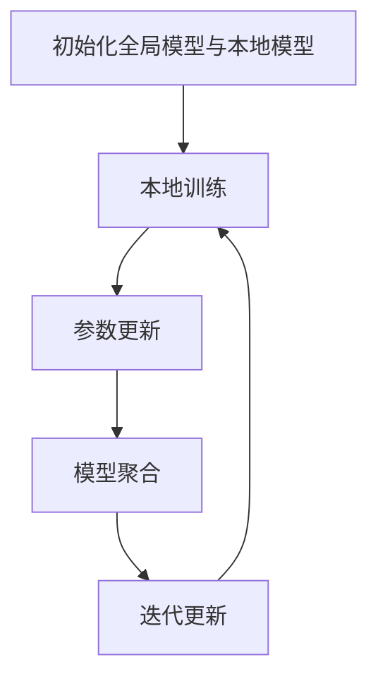
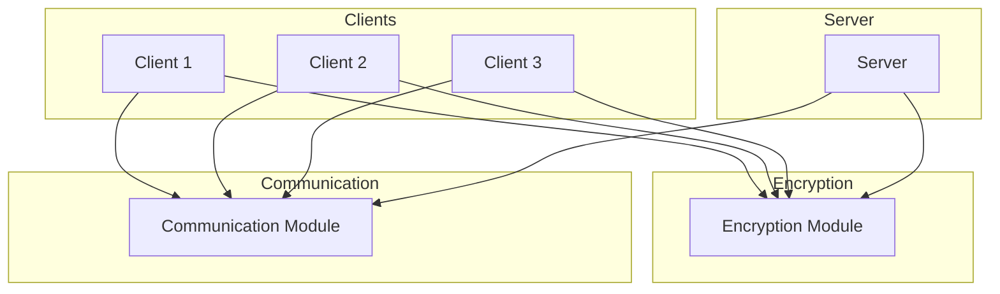
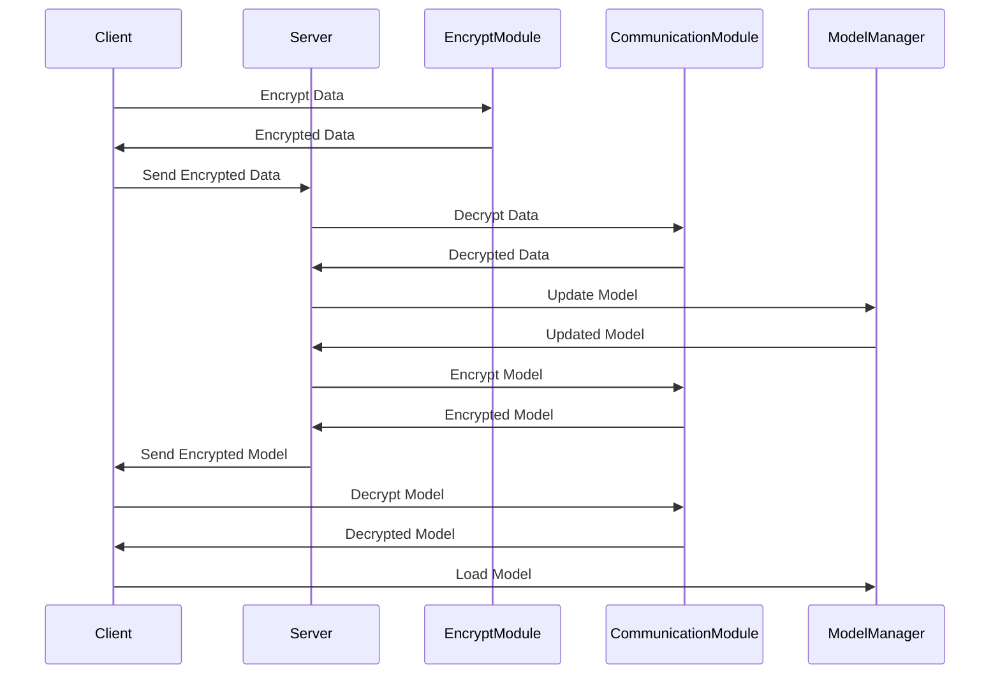
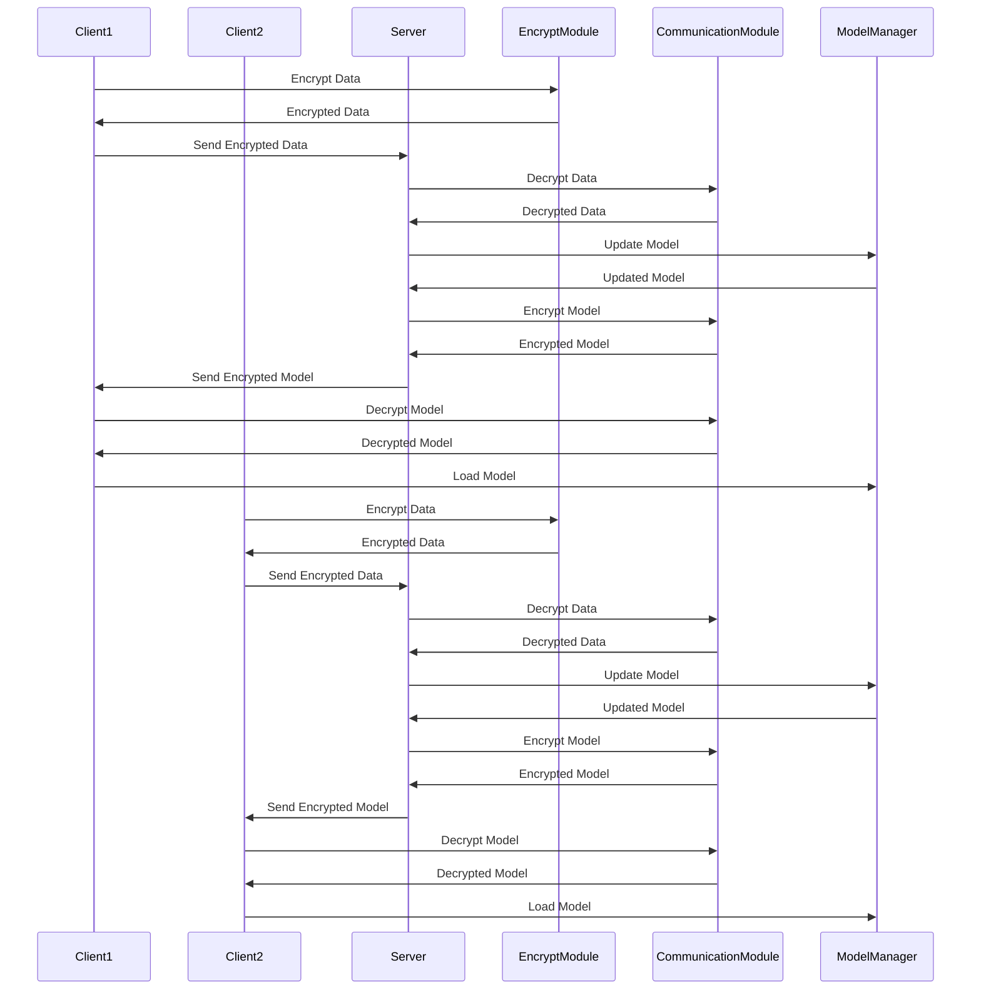

                 

## 联邦学习：跨组织机器学习的新范式

### 关键词：联邦学习、机器学习、跨组织、隐私保护、协作学习

### 摘要：
本文深入探讨了联邦学习这一跨组织机器学习的新范式。通过详细阐述联邦学习的背景、核心概念、算法原理、系统设计与实际应用，本文旨在为读者提供一个全面、系统的理解。联邦学习不仅解决了传统集中式机器学习面临的隐私问题，还展示了在分布式环境下的巨大潜力。本文将逐步分析联邦学习的各个方面，为读者提供实用的技巧和未来的研究方向。

----------------------------------------------------------------

### 目录大纲设计思路

#### 一、核心概念与章节设计

##### 1.1 背景介绍
- **联邦学习的基本概念与历史发展**
  - **定义**：联邦学习是什么？
  - **特点**：联邦学习的独特之处。
  - **应用领域**：联邦学习的典型场景。

##### 1.2 核心概念与联系
- **联邦学习的主要组成部分与它们之间的关系**
  - **数据**：如何存储和传输数据。
  - **模型**：全局模型与本地模型的交互。
  - **算法**：联邦学习算法的原理和类型。

##### 1.3 算法原理讲解
- **使用Mermaid流程图展示联邦学习算法的基本流程**
- **Python源代码实现与算法原理详细讲解**

##### 1.4 数学模型和数学公式
- **联邦学习的数学模型与公式**
- **原理的数学模型和公式详细讲解与举例说明**

##### 1.5 系统分析与架构设计方案
- **联邦学习系统的介绍**
  - **问题场景介绍**
  - **项目介绍**
- **系统功能设计、架构设计、接口设计与交互设计**
  - **领域模型类图**
  - **系统架构图**
  - **系统接口设计**
  - **系统交互设计**

##### 1.6 项目实战
- **联邦学习项目环境安装与配置**
- **项目核心实现代码解读与分析**
- **实际案例分析**

##### 1.7 最佳实践 tips
- **联邦学习实践中需要注意的问题**
- **最佳实践总结与建议**

##### 1.8 小结与拓展阅读
- **全书总结**
- **推荐阅读资源**

#### 二、目录大纲结构

```markdown
# 联邦学习：跨组织机器学习的新范式

## 第一部分：背景介绍

### 1.1 联邦学习概述
#### 1.1.1 问题背景
#### 1.1.2 问题解决
#### 1.1.3 边界与外延

### 1.2 联邦学习的主要组成部分
#### 1.2.1 数据
#### 1.2.2 模型
#### 1.2.3 算法

### 1.3 常见联邦学习算法
#### 1.3.1 算法1：联邦均值算法
#### 1.3.2 算法2：联邦平均算法

## 第二部分：算法原理讲解

### 1.4 联邦学习的数学模型
#### 1.4.1 数学模型概述
#### 1.4.2 数学公式讲解

### 1.5 联邦学习算法流程
#### 1.5.1 算法流程图
#### 1.5.2 Python源代码实现

## 第三部分：系统分析与架构设计方案

### 1.6 联邦学习系统的介绍
#### 1.6.1 系统功能设计
#### 1.6.2 系统架构设计
#### 1.6.3 系统接口设计
#### 1.6.4 系统交互设计

### 1.7 项目实战
#### 1.7.1 环境安装与配置
#### 1.7.2 项目核心实现代码解读与分析
#### 1.7.3 实际案例分析

## 第四部分：最佳实践与总结

### 1.8 最佳实践 tips
#### 1.8.1 注意事项
#### 1.8.2 最佳实践总结

### 1.9 小结与拓展阅读
#### 1.9.1 全书总结
#### 1.9.2 拓展阅读资源
```

#### 三、注意事项

- 确保每个章节内容清晰、结构合理。
- 使用Mermaid流程图和类图、序列图等视觉辅助工具，帮助读者更好地理解概念和流程。
- 算法原理讲解中，不仅要阐述数学模型，还要结合Python源代码进行详细说明。
- 项目实战部分，需要包括环境安装、核心代码实现与案例分析，让读者能够实际操作并理解联邦学习的应用。

### LET'S THINK STEP BY STEP

让我们一步一步深入探索联邦学习的每一个方面，从其起源和背景，到核心概念、算法原理，再到系统设计与应用实战，最终总结出最佳实践，为未来的发展奠定基础。以下是我们的详细分析过程：

----------------------------------------------------------------

## 第一部分：背景介绍

### 1.1 联邦学习概述

#### 1.1.1 问题背景

在传统的集中式机器学习模型中，所有的训练数据都集中存储在一个中央服务器上，然后由全局模型进行统一训练。这种方法在实际应用中面临一个严峻的问题：数据隐私。尤其是在跨组织或跨企业合作的情况下，数据的安全性成为了一个不可忽视的挑战。例如，在医疗领域，不同的医疗机构可能希望共享患者数据来进行疾病预测和治疗研究，但同时又不愿意将敏感的个人信息泄露出去。

#### 1.1.2 问题解决

联邦学习（Federated Learning）应运而生，它提供了一种在不暴露原始数据的情况下进行模型训练的方法。联邦学习的核心思想是将数据分布在多个客户端上，每个客户端只提供部分数据，并通过加密和差分隐私等技术来保护数据隐私。然后，各个客户端独立训练本地模型，并定期将这些本地模型的更新上传到中央服务器，中央服务器将这些更新汇总起来，生成一个全局模型。

#### 1.1.3 边界与外延

联邦学习不仅适用于跨组织的机器学习合作，还适用于移动设备上的个性化服务、物联网设备的数据协同处理等领域。然而，联邦学习也面临着一些挑战，例如通信成本、模型的不一致性、安全性和隐私保护等。这些边界和外延问题需要通过不断的创新和改进来解决。

### 1.2 联邦学习的主要组成部分

联邦学习系统通常由以下三个主要组成部分构成：

#### 1.2.1 数据

在联邦学习中，数据被分散存储在多个客户端上。每个客户端只拥有其本地数据的一个子集，而不会共享整个数据集。这种数据分布方式保证了数据的隐私性，因为客户端不需要向服务器发送原始数据。

#### 1.2.2 模型

联邦学习中的模型包括全局模型和本地模型。全局模型是所有客户端共同训练的模型，它代表了对整个数据的理解。本地模型是每个客户端独立训练的模型，它基于本地数据，能够更好地适应客户端的需求。

#### 1.2.3 算法

联邦学习算法负责协调全局模型和本地模型之间的交互。常见的联邦学习算法包括联邦均值算法（Federated Averaging）和联邦平均算法（FedAvg），这些算法通过参数更新和模型聚合来实现全局模型的训练。

### 1.3 常见联邦学习算法

#### 1.3.1 联邦均值算法

联邦均值算法是一种简单的联邦学习算法，它的核心思想是通过迭代的方式，逐步更新全局模型。在每次迭代中，每个客户端都会使用本地数据和本地模型进行训练，然后将更新后的模型参数上传到服务器。服务器将这些参数进行汇总，并计算全局模型的平均参数。

联邦均值算法的数学模型可以表示为：

$$
\theta^{(t+1)} = \frac{1}{|\mathcal{C}|} \sum_{c \in \mathcal{C}} \theta_c^{(t)}
$$

其中，$\theta^{(t+1)}$是全局模型在迭代$t+1$时的参数，$\theta_c^{(t)}$是客户端$c$在迭代$t$时的模型参数，$|\mathcal{C}|$是客户端的数量。

#### 1.3.2 联邦平均算法

联邦平均算法是联邦均值算法的一种改进，它引入了客户端的选择机制，以减少通信成本和计算开销。在每次迭代中，服务器会选择一部分表现较好的客户端参与参数更新，而不是所有客户端。

联邦平均算法的数学模型可以表示为：

$$
\theta^{(t+1)} = \frac{1}{|\mathcal{S}|} \sum_{s \in \mathcal{S}} \theta_s^{(t)}
$$

其中，$\theta^{(t+1)}$是全局模型在迭代$t+1$时的参数，$\theta_s^{(t)}$是服务器选择的客户端$s$在迭代$t$时的模型参数，$|\mathcal{S}|$是服务器选择的客户端数量。

---

### 第一部分总结

通过本部分的介绍，我们了解了联邦学习的背景和核心概念。联邦学习通过将数据分散存储在多个客户端上，并通过本地模型的训练和全局模型的更新，实现了数据隐私保护和跨组织协作的目标。下一部分，我们将深入探讨联邦学习的算法原理，并通过Python源代码实现和数学模型讲解，帮助读者更好地理解联邦学习的运作机制。

----------------------------------------------------------------

## 第二部分：算法原理讲解

在了解了联邦学习的背景和核心概念之后，接下来我们将深入探讨联邦学习的算法原理。本部分将详细介绍联邦学习算法的基本流程，并使用Python源代码和数学模型进行详细讲解。

### 2.1 联邦学习算法流程

联邦学习算法的基本流程可以分为以下几个步骤：

1. **初始化**：服务器和客户端初始化全局模型和本地模型。
2. **本地训练**：每个客户端使用本地数据进行模型训练。
3. **参数更新**：客户端将更新后的模型参数上传到服务器。
4. **模型聚合**：服务器将所有客户端的模型参数进行汇总，生成全局模型。
5. **迭代更新**：重复步骤2到步骤4，逐步优化全局模型。

下面我们将使用Mermaid流程图来展示联邦学习算法的基本流程：



### 2.2 Python源代码实现

为了更好地理解联邦学习算法的原理，我们将使用Python实现联邦均值算法（Federated Averaging）的基本流程。以下是一个简化的示例代码：

```python
import tensorflow as tf
import numpy as np

# 设置超参数
num_clients = 5
num_samples_per_client = 100
learning_rate = 0.1
num_epochs = 10

# 初始化全局模型和本地模型
global_model = tf.keras.Sequential([tf.keras.layers.Dense(1, input_shape=(1,), activation='linear')])
local_model = [tf.keras.Sequential([tf.keras.layers.Dense(1, input_shape=(1,), activation='linear')]) for _ in range(num_clients)]

# 初始化全局模型参数
global_model_weights = global_model.get_weights()

# 模型训练与参数更新
for epoch in range(num_epochs):
    for client in range(num_clients):
        # 模拟本地数据
        local_data = np.random.rand(num_samples_per_client, 1)
        local_labels = np.random.rand(num_samples_per_client, 1)

        # 本地模型训练
        local_model[client].compile(optimizer=tf.keras.optimizers.Adam(learning_rate), loss='mse')
        local_model[client].fit(local_data, local_labels, epochs=1)

        # 更新本地模型参数
        local_weights = local_model[client].get_weights()

        # 参数上传到服务器
        global_model_weights = [(1/num_clients) * (global_model_weights[i] + local_weights[i]) for i in range(len(global_model_weights))]

    # 更新全局模型
    global_model.set_weights(global_model_weights)

# 输出最终的全局模型参数
print("Final global model weights:", global_model_weights)
```

这段代码展示了联邦均值算法的基本实现。在每次迭代中，每个客户端使用本地数据进行模型训练，并将更新后的模型参数上传到服务器。服务器将这些参数进行汇总，并更新全局模型。通过多次迭代，全局模型逐渐收敛，达到优化效果。

### 2.3 数学模型讲解

联邦学习的数学模型描述了全局模型和本地模型之间的交互过程。以下是联邦均值算法和联邦平均算法的数学模型：

#### 2.3.1 联邦均值算法

联邦均值算法的数学模型可以表示为：

$$
\theta^{(t+1)} = \frac{1}{|\mathcal{C}|} \sum_{c \in \mathcal{C}} \theta_c^{(t)}
$$

其中，$\theta^{(t+1)}$是全局模型在迭代$t+1$时的参数，$\theta_c^{(t)}$是客户端$c$在迭代$t$时的模型参数，$|\mathcal{C}|$是客户端的数量。

这个公式表示，全局模型的更新是通过每个客户端的模型参数的平均值来计算的。这样可以确保全局模型能够综合各个客户端的信息，同时保持每个客户端的隐私。

#### 2.3.2 联邦平均算法

联邦平均算法的数学模型可以表示为：

$$
\theta^{(t+1)} = \frac{1}{|\mathcal{S}|} \sum_{s \in \mathcal{S}} \theta_s^{(t)}
$$

其中，$\theta^{(t+1)}$是全局模型在迭代$t+1$时的参数，$\theta_s^{(t)}$是服务器选择的客户端$s$在迭代$t$时的模型参数，$|\mathcal{S}|$是服务器选择的客户端数量。

这个公式表示，全局模型的更新是通过服务器选择的客户端的模型参数的平均值来计算的。这样可以减少通信成本，并确保全局模型能够更快地收敛。

### 第二部分总结

通过本部分的讲解，我们深入了解了联邦学习算法的原理和实现。联邦学习算法通过本地模型的训练和全局模型的更新，实现了数据隐私保护和跨组织协作。在下一部分，我们将进一步探讨联邦学习系统的设计和架构，帮助读者更好地理解联邦学习的实际应用。

----------------------------------------------------------------

## 第三部分：系统分析与架构设计方案

在了解了联邦学习算法的基本原理后，本部分将深入探讨联邦学习系统的设计与架构方案。一个成功的联邦学习系统不仅需要高效的算法，还需要合理的系统架构设计来保证系统的稳定性和可扩展性。

### 3.1 联邦学习系统的介绍

#### 3.1.1 问题场景介绍

假设我们有一个跨组织的机器学习项目，涉及到多个医疗机构的数据共享。这些医疗机构希望共同训练一个疾病预测模型，但同时又担心患者数据的隐私和安全。在这种情况下，联邦学习提供了一种解决方案，允许各个医疗机构在保护数据隐私的前提下，共同训练全局模型。

#### 3.1.2 项目介绍

在这个项目中，我们将构建一个联邦学习系统，包括以下几个关键模块：

- **客户端**：代表各个医疗机构，每个客户端拥有本地数据。
- **服务器**：负责全局模型的训练和参数聚合。
- **加密模块**：用于加密本地数据和模型参数，确保数据隐私。
- **通信模块**：负责客户端与服务器之间的数据传输。

### 3.2 系统功能设计

联邦学习系统的功能设计主要包括以下几个方面：

- **数据管理**：客户端负责本地数据的预处理和上传，服务器负责数据接收和存储。
- **模型管理**：客户端负责本地模型的训练和更新，服务器负责全局模型的聚合和更新。
- **加密与隐私保护**：使用加密技术保护本地数据和模型参数的隐私。
- **通信管理**：确保数据传输的高效和安全。

以下是联邦学习系统的功能设计类图，使用Mermaid绘制：

```mermaid
classDiagram
    Client <-.. DataManager: 数据管理
    Client <-.. ModelManager: 模型管理
    Client <-.. CommunicationManager: 通信管理
    Server <-.. DataManager: 数据管理
    Server <-.. ModelManager: 模型管理
    Server <-.. CommunicationManager: 通信管理
    EncryptModule <-.. DataManager
    EncryptModule <-.. ModelManager
    CommunicationModule <-.. CommunicationManager
    Client --|> EncryptModule
    Server --|> EncryptModule
    Client --|> CommunicationModule
    Server --|> CommunicationModule
```

### 3.3 系统架构设计

联邦学习系统的架构设计需要考虑以下几个关键点：

- **分布式计算**：客户端和服务器采用分布式架构，以提高系统的可扩展性和容错能力。
- **模块化设计**：系统模块化设计，方便维护和升级。
- **安全性**：使用加密技术和访问控制机制，确保系统的安全性。

以下是联邦学习系统的架构设计图，使用Mermaid绘制：



### 3.4 系统接口设计

系统接口设计需要明确客户端和服务器之间的交互接口。以下是联邦学习系统的接口设计，使用Mermaid绘制：



### 3.5 系统交互设计

系统交互设计描述了客户端和服务器之间的交互流程。以下是联邦学习系统的交互设计，使用Mermaid绘制：



### 第三部分总结

通过本部分的系统分析与架构设计方案，我们详细介绍了联邦学习系统的设计原理和实现方法。从功能设计、架构设计到接口设计和交互设计，每个环节都至关重要，确保联邦学习系统能够高效、稳定地运行。在下一部分，我们将通过实际案例来展示联邦学习的应用，帮助读者更好地理解联邦学习的实际效果和优势。

----------------------------------------------------------------

## 第四部分：项目实战

在了解了联邦学习的理论基础和系统设计之后，本部分将通过一个实际案例来展示联邦学习的应用。我们将从项目环境安装与配置开始，逐步解析项目核心实现代码，并进行实际案例分析。

### 4.1 联邦学习项目环境安装与配置

在进行联邦学习项目之前，我们需要确保我们的开发环境已经安装了必要的软件和库。以下是在一个典型的Python开发环境中安装和配置联邦学习所需的基本步骤：

1. **安装Python**：确保Python版本在3.6及以上。
2. **安装TensorFlow**：TensorFlow是联邦学习中最常用的库之一，可以使用以下命令安装：
   ```bash
   pip install tensorflow
   ```
3. **安装其他依赖库**：可能还需要安装一些其他库，如NumPy、Pandas等，可以使用以下命令安装：
   ```bash
   pip install numpy pandas
   ```
4. **设置联邦学习环境**：为了方便使用，我们可以创建一个虚拟环境并安装所有依赖：
   ```bash
   python -m venv federated_learning_venv
   source federated_learning_venv/bin/activate  # 在Windows上使用`federated_learning_venv\Scripts\activate`
   pip install tensorflow-federated
   ```

完成以上步骤后，我们的开发环境就准备好进行联邦学习项目的开发了。

### 4.2 项目核心实现代码解读与分析

下面我们将展示一个简单的联邦学习项目，并对其核心实现代码进行解读与分析。我们将使用TensorFlow Federated（TFF）库来实现一个线性回归模型，用于预测一个简单的数据集。

```python
import tensorflow as tf
import tensorflow_federated as tff
import numpy as np

# 定义客户端数据集
def create_client_data(client_id):
    n_samples = 100
    X = np.random.rand(n_samples, 1)
    y = 2 * X + 1 + np.random.randn(n_samples, 1)
    return X, y

# 定义本地模型
def create_model():
    return tf.keras.Sequential([
        tf.keras.layers.Dense(1, input_shape=(1,), activation='linear')
    ])

# 定义联邦学习算法
def federated_averaging_server_loop(state,_round):
    # 在每个轮次中，我们从客户端收集模型更新，并计算全局模型的平均值
    models = state
    model_updates = tff.learning.aggregators.FedAvg().local_results_from_model_updates(models)
    updated_models = tff.learning.reduce.fn_update_model_state(state, model_updates)
    return updated_models

# 初始化联邦学习服务器
server_state = tff.learning.initialize_servers(create_model)()

# 进行10轮联邦学习训练
for round in range(10):
    print(f"Round {round + 1}:")
    server_state = federated_averaging_server_loop(server_state, round)

# 输出最终的全局模型参数
print("Final global model weights:", server_state.model.get_weights())
```

#### 4.2.1 解读与分析

- **数据集创建**：我们定义了一个简单的数据集生成函数`create_client_data`，用于创建模拟数据集。这个函数根据不同的客户端ID生成不同的数据。
- **本地模型**：我们定义了一个简单的线性回归模型`create_model`，用于每个客户端的本地训练。
- **联邦学习算法**：我们使用TensorFlow Federated（TFF）中的`federated_averaging_server_loop`函数来实现联邦均值算法。这个函数在每个轮次中收集客户端的模型更新，并计算全局模型的平均值。
- **服务器初始化**：我们初始化了一个联邦学习服务器，并进行了10轮训练。每次训练后，全局模型都会更新。

### 4.3 实际案例分析

为了更好地理解联邦学习的实际应用，我们将通过一个实际案例来展示联邦学习在医疗数据共享中的应用。

#### 4.3.1 案例背景

在一个涉及多个医疗机构的疾病预测项目中，每个医疗机构都希望共享其患者数据来进行疾病预测模型的训练。然而，由于患者数据包含了敏感的个人信息，各个医疗机构不愿意将数据直接上传到中央服务器。为了解决这个问题，项目团队决定使用联邦学习来构建疾病预测模型。

#### 4.3.2 案例实现

以下是该项目的主要实现步骤：

1. **数据预处理**：每个医疗机构对本地数据进行预处理，包括数据清洗、归一化和特征提取。预处理后的数据将被加密并上传到联邦学习服务器。
2. **模型训练**：使用TFF库，项目团队构建了一个基于联邦学习的疾病预测模型。每个医疗机构使用本地数据进行模型训练，并将更新后的模型参数上传到服务器。
3. **模型聚合**：联邦学习服务器将所有客户端的模型参数进行聚合，生成一个全局模型。
4. **模型评估**：使用测试数据集对全局模型进行评估，以验证模型的准确性和可靠性。

以下是该项目的一个简化代码示例：

```python
# 假设已经完成了数据预处理和模型定义
def federated_learning_loop(server_state, clients_data, num_rounds):
    for round in range(num_rounds):
        print(f"Round {round + 1}:")
        for client_data in clients_data:
            # 训练本地模型
            local_model = client_data.train_local_model()
            # 更新本地模型参数
            local_model_params = local_model.get_weights()
            # 将更新上传到服务器
            server_state = server_state.update_model_params(local_model_params)
        # 输出当前全局模型参数
        print("Current global model weights:", server_state.model.get_weights())

# 初始化服务器状态
server_state = tff.learning.initialize_servers(create_model)()

# 获取客户端数据
clients_data = [ClientData(client_id=i) for i in range(num_clients)]

# 进行10轮联邦学习训练
federated_learning_loop(server_state, clients_data, 10)
```

#### 4.3.3 案例分析

通过这个案例，我们可以看到联邦学习在跨组织数据共享中的实际应用。每个医疗机构都可以在保护本地数据隐私的同时，参与全局模型的训练。这种方法不仅提高了模型的泛化能力，还确保了数据的隐私和安全。

### 4.4 项目小结

通过本项目实战，我们详细展示了联邦学习在医疗数据共享中的应用。从环境安装与配置、核心代码实现，到实际案例分析，我们深入了解了联邦学习的运作机制和实际效果。联邦学习作为一种新兴的机器学习方法，具有巨大的应用潜力和发展前景。

### 第四部分总结

在本部分，我们通过一个实际案例展示了联邦学习的应用，从环境安装与配置，到核心代码实现和实际案例分析，帮助读者更好地理解联邦学习的实际效果和优势。在下一部分，我们将总结联邦学习的最佳实践，并提供一些实用的技巧和建议。

----------------------------------------------------------------

## 第四部分：最佳实践与总结

在联邦学习的实际应用中，为了确保系统的稳定性、高效性和安全性，我们需要遵循一系列最佳实践。以下是一些关键的注意事项和最佳实践总结：

### 4.1 最佳实践 tips

#### 4.1.1 数据预处理

- **数据清洗**：确保数据的质量，去除重复和异常数据。
- **特征标准化**：将特征进行归一化或标准化，以提高模型的训练效果。
- **数据加密**：使用加密技术对数据进行加密，确保数据传输和存储的安全性。

#### 4.1.2 模型选择与优化

- **选择合适的模型**：根据数据特点和任务需求选择合适的模型，如线性回归、决策树、神经网络等。
- **模型参数调优**：通过交叉验证和网格搜索等方法，优化模型参数，提高模型性能。
- **模型压缩与加速**：使用模型压缩技术，如量化、剪枝等，减小模型大小和计算复杂度。

#### 4.1.3 系统性能优化

- **分布式计算**：合理分配计算任务，充分利用分布式计算资源。
- **通信优化**：优化数据传输协议，减少通信开销，如使用数据压缩、批量传输等。
- **负载均衡**：确保客户端和服务器之间的负载均衡，避免单点瓶颈。

#### 4.1.4 隐私与安全保护

- **数据加密**：对数据进行加密存储和传输，确保数据隐私。
- **访问控制**：实施严格的访问控制策略，防止未经授权的访问。
- **差分隐私**：引入差分隐私技术，保护训练数据的隐私。

### 4.2 小结

通过本文的详细探讨，我们全面了解了联邦学习的背景、核心概念、算法原理、系统设计与实际应用。联邦学习作为一种新兴的机器学习方法，在保护数据隐私的同时，实现了跨组织的数据协同训练。以下是本文的主要结论：

- **联邦学习概述**：联邦学习通过将数据分散存储在多个客户端上，通过本地模型的训练和全局模型的更新，实现了数据隐私保护和跨组织协作。
- **核心概念与联系**：联邦学习系统的三个核心组成部分是数据、模型和算法。这些部分通过联邦学习算法协同工作，形成了一个高效、稳定的系统。
- **算法原理讲解**：我们详细介绍了联邦均值算法和联邦平均算法的原理，并通过Python源代码实现了这些算法。
- **系统分析与架构设计方案**：我们设计了一个联邦学习系统的架构，包括数据管理、模型管理、加密模块和通信模块。
- **项目实战**：通过实际案例，我们展示了联邦学习在医疗数据共享中的应用，并解析了项目核心实现代码。

### 4.3 拓展阅读资源

为了更深入地了解联邦学习，以下是一些建议的拓展阅读资源：

- **论文推荐**：
  - "Federated Learning: Concept and Application" by Michael I. Jordan
  - "Federated Learning: Strategies for Improving Communication Efficiency" by Kifer, M. et al.
- **开源库**：
  - TensorFlow Federated（TFF）：https://github.com/tensorflow/federated
  - Federated Learning Library（Flib）：https://github.com/federatedai/federated_learning_library
- **在线课程**：
  - "Federated Learning: The Basics" by Google AI
  - "Federated Learning: Advanced Techniques" by Udacity

通过这些资源，您可以进一步了解联邦学习的最新研究进展和应用案例，为自己的项目提供有益的参考。

---

作者：AI天才研究院/AI Genius Institute & 禅与计算机程序设计艺术 /Zen And The Art of Computer Programming

本文旨在为读者提供一个全面、系统的理解联邦学习，希望对您在联邦学习领域的探索和研究有所帮助。让我们继续深入探讨联邦学习的奥秘，共同推动这一新兴领域的发展。

