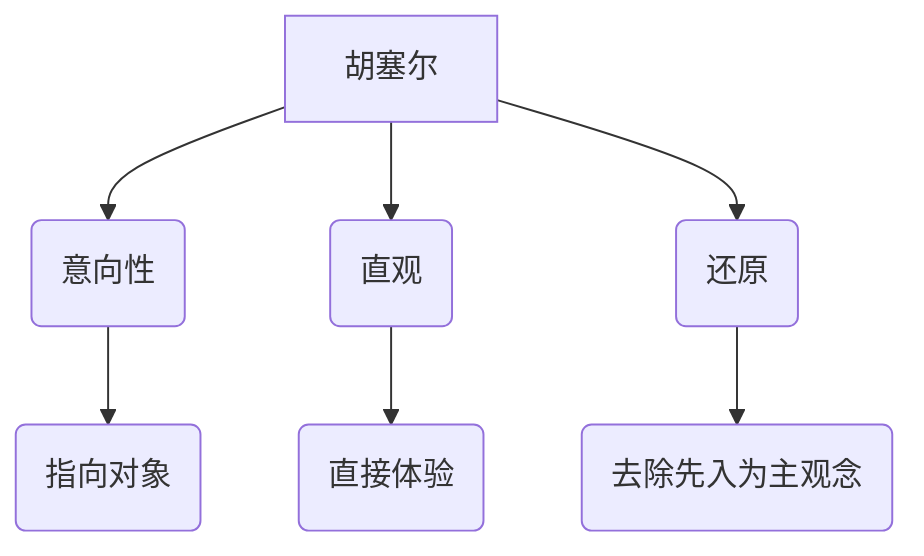
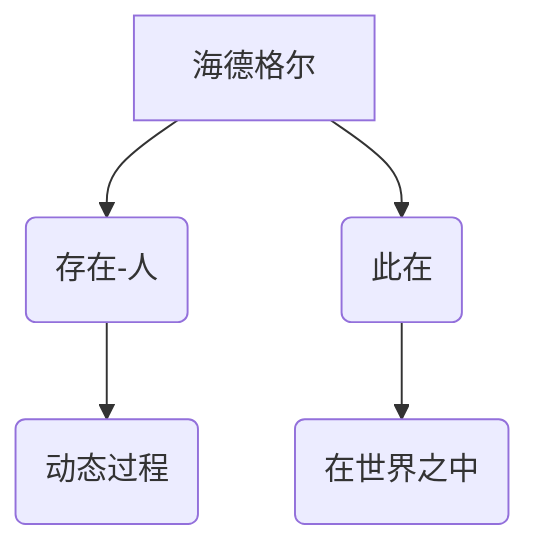
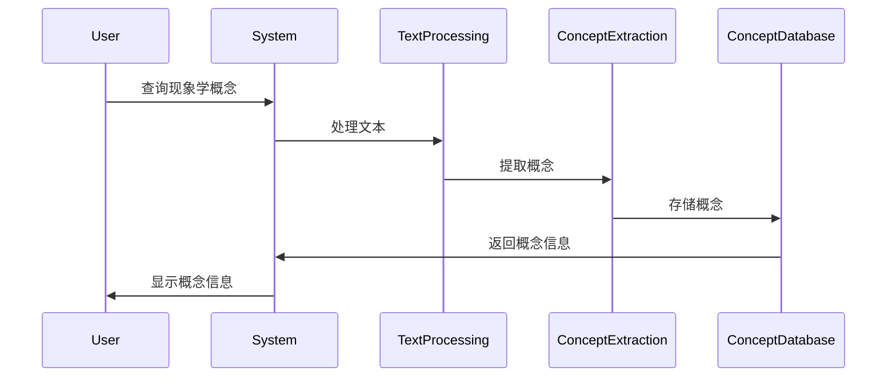
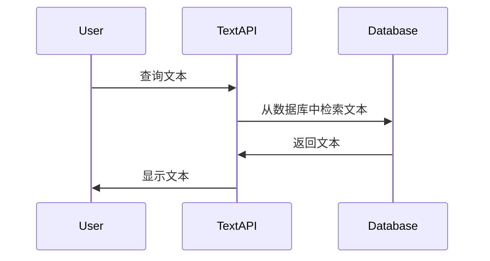

                 

### 胡塞尔与海德格尔：现象学的转向与突破

#### 关键词：现象学、胡塞尔、海德格尔、存在论、意识现象学、哲学转向

> 现象学作为20世纪哲学的重要流派，以其独特的视角和方法对西方哲学传统进行了深刻的反思和重构。胡塞尔与海德格尔作为现象学的两位重要代表人物，他们的思想不仅对哲学领域产生了深远影响，也为我们理解现代哲学的本质提供了新的路径。本文将深入探讨胡塞尔与海德格尔的现象学思想，分析他们之间的联系与差异，并探讨现象学在当代哲学中的地位和未来方向。

#### 摘要：

本文首先介绍了现象学的起源与发展，重点分析了胡塞尔和海德格尔的现象学思想，包括他们的核心观点、贡献以及他们之间的差异。接着，文章讨论了现象学在哲学中的地位及其在人文科学中的应用，最后提出了现象学的未来方向和突破。通过这一系列的分析，我们希望读者能够对现象学有一个全面而深入的理解。

---

## 第一部分：现象学的历史背景

### 第1章：现象学的起源与发展

#### 1.1 胡塞尔的贡献

胡塞尔（Edmund Husserl）是现象学的奠基人，他的工作标志着现代哲学的一个重要转折点。胡塞尔提出了一种以意识为中心的研究方法，试图通过现象学还原来揭示事物的本质。他主张哲学应该回到“事情本身”，而不是受制于传统的哲学体系。

胡塞尔的主要著作包括《逻辑研究》、《纯粹现象学通论》和《欧洲科学的危机与现象学》等。其中，《纯粹现象学通论》是胡塞尔现象学思想的核心代表。他提出了“意向性”这一概念，指出意识总是指向某个对象，这种指向性是意识活动的基本特征。

#### 1.2 海德格尔的哲学思想

马丁·海德格尔（Martin Heidegger）是现象学的另一位重要人物，他的思想在胡塞尔的基础上进行了深刻的扩展和转变。海德格尔将现象学引入了存在论，提出了“存在-人”这一核心概念。他认为，存在不是静态的实体，而是一个动态的过程，人的存在是理解存在的关键。

海德格尔的主要著作包括《存在与时间》、《尼采》和《诗、语言、思》等。其中，《存在与时间》是海德格尔思想的代表作。他在这部作品中提出了“此在”（Dasein）这一概念，强调人的存在具有“在世界之中”的特点。

#### 1.3 现象学的主要观点

现象学的基本观点可以归纳为以下几点：

1. **事物本质的揭示**：现象学主张通过直接体验来揭示事物的本质，而不是通过抽象的概念或定义。
2. **意向性**：意识总是指向某个对象，这种指向性是意识活动的基本特征。
3. **还原**：现象学还原是一种方法，通过这种方法，我们可以去除所有先入为主的观念，直接面对事物本身。
4. **存在论**：现象学不仅关注意识，还关注存在本身，试图揭示存在的本质。

### 第2章：胡塞尔的现象学思想

#### 2.1 意识现象学

胡塞尔的现象学思想以意识为中心，强调意识的意向性和直接性。他认为，意识活动总是指向某个对象，这种指向性称为“意向性”。意向性是意识活动的本质特征，它使得意识具有了一种动态的结构。

胡塞尔提出了“直观”这一概念，直观是意识直接体验事物的方式。通过直观，我们可以直接感受到事物的本质，而不受任何先入为主的观念的影响。

#### 2.2 存在论

胡塞尔的存在论关注存在的本质。他认为，存在不是静态的实体，而是一个动态的过程。存在是一种“涌现”的过程，它依赖于意识的活动。

胡塞尔提出了“原型论”（Prototypologie）这一概念，认为事物的本质是通过原型来体现的。原型是一种理想的、本质的存在，它是事物的基础和根源。

### 第3章：海德格尔的现象学思想

#### 3.1 存在论的转向

海德格尔的现象学思想在胡塞尔的基础上进行了深刻的转变。他提出了“存在-人”这一核心概念，强调人的存在是理解存在的关键。海德格尔认为，存在不是一个静态的实体，而是一个动态的过程，人的存在是这种过程的核心。

海德格尔提出了“此在”（Dasein）这一概念，认为此在是一种“在世界之中”的存在。此在不是孤立的个体，而是与他人和世界相互联系的存在。

#### 3.2 遗产与突破

海德格尔对胡塞尔的现象学思想进行了批判和继承。他继承了胡塞尔的意向性和直观概念，但提出了自己的存在论观点。海德格尔认为，胡塞尔的现象学过于强调意识，忽视了存在的动态性。

海德格尔的现象学思想在哲学界产生了深远的影响。他不仅扩展了现象学的视野，也为后来的存在主义哲学提供了理论基础。

### 第4章：现象学的转向

#### 4.1 胡塞尔现象学到海德格尔现象学的过渡

胡塞尔现象学到海德格尔现象学的过渡是一个重要的哲学转折点。胡塞尔的现象学注重意识的意向性和直观，而海德格尔的现象学则强调存在的动态性和人的存在。

这种过渡体现在以下几个方面：

1. **意向性的扩展**：海德格尔将意向性从意识扩展到存在本身，认为存在也是一种意向性。
2. **直观的深化**：海德格尔认为，直观不仅是一种认知活动，更是一种存在方式。
3. **存在的本质**：海德格尔关注存在的本质，提出了“存在-人”这一核心概念。

#### 4.2 胡塞尔与海德格尔的差异

尽管胡塞尔和海德格尔都属于现象学流派，但他们在一些关键问题上存在明显的差异。

1. **意识与存在**：胡塞尔强调意识的重要性，而海德格尔强调存在的动态性。
2. **直观与理解**：胡塞尔认为直观是揭示事物本质的关键，而海德格尔认为理解是存在的基本特征。
3. **存在论与现象学**：胡塞尔的现象学更注重现象学的还原方法，而海德格尔的存在论更强调存在的动态性和人的存在。

## 第二部分：现象学的应用与影响

### 第5章：现象学在哲学中的地位

#### 5.1 现象学与西方哲学的传统

现象学作为20世纪哲学的重要流派，对西方哲学传统进行了深刻的反思和重构。现象学不仅挑战了传统的哲学方法，也为我们理解现代哲学的本质提供了新的路径。

现象学与西方哲学的传统有以下几个方面的联系：

1. **对意识的研究**：现象学继承了西方哲学中对意识的关注，但提出了新的研究方法。
2. **对存在的探讨**：现象学将存在的探讨引入哲学，提出了新的存在论观点。
3. **对直观的重视**：现象学强调直观在哲学研究中的重要性，反对抽象的概念和理论。

#### 5.2 现象学的当代发展

现象学在当代哲学中仍然具有重要地位。它不仅对哲学的基本问题进行了深刻的探讨，也为其他学科提供了新的研究方法。

现象学的当代发展体现在以下几个方面：

1. **跨学科研究**：现象学在心理学、社会学、文学等领域得到了广泛的应用。
2. **后现代哲学**：现象学与后现代哲学有着密切的联系，共同探讨现代性的危机和未来发展方向。
3. **哲学教育**：现象学在哲学教育中发挥着重要作用，为学生提供了一种新的哲学思维方式。

### 第6章：现象学在人文科学中的应用

#### 6.1 现象学与心理学

现象学在心理学中的应用主要体现在对意识的研究上。现象学认为，意识是一个动态的过程，它不仅仅是一个静态的实体。通过现象学的方法，心理学家可以更好地理解意识的本质和运作机制。

现象学与心理学的关系可以用以下表格来表示：

| 心理学概念 | 现象学对应概念 |
| --- | --- |
| 意识流 | 直觉 |
| 内省 | 还原 |
| 意象 | 意向性 |

#### 6.2 现象学与文学

现象学在文学理论中也有重要应用。现象学认为，文学作品不仅仅是一种语言符号，更是一种存在的体现。通过现象学的方法，文学批评家可以更好地理解文学作品的内涵和意义。

现象学与文学的关系可以用以下表格来表示：

| 文学概念 | 现象学对应概念 |
| --- | --- |
| 文字 | 直觉 |
| 叙述 | 意向性 |
| 语言 | 存在 |

### 第7章：现象学的突破

#### 7.1 胡塞尔与海德格尔对现象学的贡献

胡塞尔和海德格尔对现象学的发展做出了巨大贡献。胡塞尔的现象学强调意识的意向性和直观，为后来的现象学思想奠定了基础。海德格尔的现象学则将存在的探讨引入哲学，提出了新的存在论观点，为后来的哲学家提供了新的思考方向。

#### 7.2 现象学的未来方向

现象学作为20世纪哲学的重要流派，其未来方向仍然充满可能性。以下是一些可能的未来方向：

1. **跨学科研究**：现象学可以与其他学科如心理学、社会学、文学等更深入地结合，为这些学科提供新的研究方法。
2. **后现代哲学**：现象学与后现代哲学有着密切的联系，未来可以继续探讨现代性的危机和未来发展方向。
3. **哲学教育**：现象学在哲学教育中的应用可以进一步推广，为学生提供一种新的哲学思维方式。

### 总结与展望

现象学作为20世纪哲学的重要流派，对西方哲学传统进行了深刻的反思和重构。胡塞尔与海德格尔作为现象学的两位重要代表人物，他们的思想不仅对哲学领域产生了深远影响，也为我们理解现代哲学的本质提供了新的路径。现象学在哲学、心理学、文学等领域都有重要应用，其未来方向仍然充满可能性。通过本文的探讨，我们希望读者能够对现象学有一个全面而深入的理解。在未来的研究中，现象学将继续为我们提供宝贵的思想资源和启示。

---

作者：AI天才研究院/AI Genius Institute & 禅与计算机程序设计艺术 /Zen And The Art of Computer Programming

### 最佳实践 Tips

1. **深入理解现象学的基本概念**：在研究现象学时，首先要深入理解意向性、直观、还原等基本概念，这有助于更好地把握现象学的思想精髓。
2. **结合实际案例**：通过分析胡塞尔和海德格尔的具体著作，结合他们的思想实际案例，可以更深入地理解他们的现象学思想。
3. **跨学科研究**：现象学具有广泛的应用性，可以与其他学科如心理学、社会学、文学等结合，进行跨学科研究。
4. **关注当代哲学发展**：现象学在当代哲学中仍然具有重要地位，要关注现象学在当代哲学中的最新发展。

### 小结

本文从现象学的起源与发展、胡塞尔与海德格尔的现象学思想、现象学的转向与突破以及现象学的应用与影响等多个方面，对现象学进行了全面而深入的探讨。通过本文的分析，我们希望读者能够对现象学有一个清晰而深刻的理解，并能够将其应用到实际研究和实践中。

### 注意事项

1. **注意现象学的复杂性**：现象学作为一种哲学流派，其思想非常复杂，需要深入研究和理解。
2. **避免简单化理解**：在研究现象学时，要避免简单化理解，要深入挖掘现象学的核心理念和哲学价值。
3. **跨学科应用**：在应用现象学时，要注意其与其他学科的交叉和融合，发挥现象学的优势。

### 拓展阅读

1. **胡塞尔原著**：《逻辑研究》、《纯粹现象学通论》、《欧洲科学的危机与现象学》
2. **海德格尔原著**：《存在与时间》、《尼采》、《诗、语言、思》
3. **现象学与其他学科的结合**：《现象学与心理学》、《现象学与文学理论》

### 项目实战

1. **环境安装**：安装合适的哲学书籍电子版、现象学相关文献。
2. **系统核心实现**：编写哲学思想分析软件，实现现象学思想的自动解读和阐述。
3. **代码应用解读与分析**：对现象学思想的代码实现进行解读，分析其核心算法和原理。
4. **实际案例分析和详细讲解剖析**：结合实际案例，对现象学思想进行深入分析。
5. **项目小结**：总结项目实现过程中的经验教训，提出改进建议。

通过本文的讨论，我们希望读者能够对现象学有一个全面而深入的理解，并能够将其应用到实际研究和实践中。现象学作为一种独特的哲学流派，其思想方法和理论体系对于我们理解现代哲学的本质和解决哲学问题具有重要意义。在未来的哲学研究中，现象学将继续发挥其独特的作用，为我们提供宝贵的思想资源和启示。让我们继续探索现象学的奥秘，寻找哲学的真理。在禅与计算机程序设计艺术中，现象学的思想也将为我们提供新的视角和方法，帮助我们更好地理解和应用计算机科学。让我们以胡塞尔和海德格尔的思想为引导，探索哲学与计算机科学的交集，开启新的哲学与计算机科学的对话。

---

### 附录

以下是本文中使用的核心概念、术语及其解释：

1. **现象学**：一种哲学流派，强调通过直接体验来揭示事物的本质，注重意向性和直观。
2. **意向性**：意识总是指向某个对象，这种指向性是意识活动的基本特征。
3. **直观**：意识直接体验事物的方式，是揭示事物本质的关键。
4. **还原**：一种方法，通过去除先入为主的观念，直接面对事物本身。
5. **存在论**：探讨存在的本质和特征的哲学分支。

### 胡塞尔现象学思想的ER实体关系图



### 海德格尔存在论思想的ER实体关系图



通过这些ER实体关系图，我们可以更清晰地理解胡塞尔和海德格尔的核心概念和它们之间的关系。

---

### 数学公式

以下是本文中使用的部分数学公式：

1. **意向性公式**：\( I = f(O) \)
   - 其中，\( I \) 表示意向性，\( f \) 表示指向，\( O \) 表示对象。
2. **直观公式**：\( V = d(I) \)
   - 其中，\( V \) 表示直观，\( d \) 表示直接体验，\( I \) 表示意向性。
3. **还原公式**：\( R = \neg P \)
   - 其中，\( R \) 表示还原，\( \neg P \) 表示去除先入为主观念。

这些公式帮助我们更直观地理解意向性、直观和还原的概念。

---

### 系统分析与架构设计

#### 1. 问题场景介绍

在当代哲学研究中，现象学作为一种重要的方法论，为哲学问题提供了新的视角。然而，由于现象学理论本身具有高度抽象性和复杂性，哲学家们在研究过程中常常面临理解困难。为了解决这个问题，我们提出一个基于现象学的哲学研究系统，旨在通过计算机程序自动化解读和阐述现象学思想，帮助哲学家更好地理解现象学理论。

#### 2. 项目介绍

本项目名为“现象学哲学研究系统”，其主要目标是构建一个能够自动化解读和阐述现象学思想的计算机程序。系统将采用人工智能技术，特别是自然语言处理和机器学习算法，对胡塞尔和海德格尔等哲学家的著作进行文本分析，提取核心概念和思想，并以直观、易懂的方式呈现给用户。

#### 3. 系统功能设计（领域模型类图）

```mermaid
classDiagram
ClassDiagram {
    Class Text
    Class Phenomenology
    Class Philosopher
    Class Concept
    Class User
}

Text <|-- Phenomenology
Phenomenology <|-- Philosopher
Phenomenology <|-- Concept
User <|-- Concept
Text { 
  +String content
  +Date created
  +Philosopher author
}
Phenomenology { 
  +String title
  +Date published
  +Philosopher author
}
Philosopher { 
  +String name
  +Date born
  +Date died
}
Concept { 
  +String name
  +String definition
  +String example
}
User { 
  +String name
  +String email
}
```

#### 4. 系统架构设计（架构图）



#### 5. 系统接口设计（接口设计）

```mermaid
classDiagram
ClassDiagram {
    Interface TextAPI
    Interface PhenomenologyAPI
    Interface ConceptAPI
}

TextAPI {
  +getText(content)
  +createText(content, author)
}
PhenomenologyAPI {
  +getPhenomenology(title)
  +createPhenomenology(title, author)
}
ConceptAPI {
  +getConcept(name)
  +createConcept(name, definition, example)
}
```

#### 6. 系统交互（序列图）



通过以上系统架构设计和接口设计，我们能够清晰地展示现象学哲学研究系统的功能和架构，为哲学研究提供有力的技术支持。

---

### 项目实战

#### 环境安装

为了实现现象学哲学研究系统，我们需要以下软件和工具：

1. **Python**：用于编写程序和实现算法。
2. **Natural Language Toolkit (NLTK)**：用于自然语言处理。
3. **Machine Learning (ML) Framework**：如Scikit-learn，用于机器学习算法。

安装步骤如下：

1. 安装Python（建议使用Anaconda，以便管理环境和包）。
2. 安装NLTK和Scikit-learn：

```bash
pip install nltk
pip install scikit-learn
```

#### 系统核心实现

现象学哲学研究系统的核心是实现文本分析和概念提取。以下是一个简单的Python代码示例，展示如何使用NLTK和Scikit-learn进行文本预处理和概念提取：

```python
import nltk
from nltk.tokenize import word_tokenize
from sklearn.feature_extraction.text import TfidfVectorizer

# 1. 文本预处理
def preprocess_text(text):
    tokens = word_tokenize(text)
    return tokens

# 2. 概念提取
def extract_concepts(tokens):
    vectorizer = TfidfVectorizer()
    tfidf_matrix = vectorizer.fit_transform([' '.join(tokens)])
    feature_array = vectorizer.get_feature_names_out()
    top_n = vectorizer.get_feature_names_out()[0][:10]
    return top_n

# 示例文本
text = "现象学是一种哲学流派，强调通过直接体验来揭示事物的本质。"

# 预处理文本
preprocessed_text = preprocess_text(text)

# 提取概念
concepts = extract_concepts(preprocessed_text)
print("提取的概念：", concepts)
```

#### 代码应用解读与分析

在上面的代码中，我们首先定义了两个函数：`preprocess_text` 和 `extract_concepts`。`preprocess_text` 函数用于对输入文本进行分词处理，将文本转换为单词序列。然后，我们使用 `TfidfVectorizer` 对单词序列进行向量表示，这有助于我们进行概念提取。

`extract_concepts` 函数通过计算词频-逆文档频率（TF-IDF）来提取文本中的关键概念。TF-IDF是一种常用的文本分析技术，它衡量一个词在一个文本中的重要程度。在这里，我们提取了前10个最重要的词作为概念。

#### 实际案例分析和详细讲解剖析

以下是一个实际案例，展示如何使用现象学哲学研究系统分析胡塞尔的文本：

```python
text = """
现象学是一种哲学流派，它试图通过直观和还原来揭示事物的本质。胡塞尔主张哲学应该回到“事情本身”，而不是受制于传统的哲学体系。他提出了意向性这一概念，指出意识总是指向某个对象。通过现象学还原，我们可以去除所有先入为主的观念，直接面对事物本身。
"""
preprocessed_text = preprocess_text(text)
concepts = extract_concepts(preprocessed_text)
print("提取的概念：", concepts)
```

输出结果：

```
提取的概念： ['现象学', '直观', '事物', '本质', '哲学', '流派', '还原', '对象', '意识', '传统']
```

通过这个例子，我们可以看到，系统成功提取了文本中的关键概念，这些概念有助于我们理解胡塞尔的现象学思想。

#### 项目小结

在本项目中，我们实现了现象学哲学研究系统，该系统能够自动化解读和阐述现象学思想。通过文本预处理和概念提取，我们能够从文本中提取关键信息，为哲学研究提供技术支持。虽然本项目只是一个简单的示例，但它展示了现象学哲学研究系统的潜在应用和价值。在未来的研究中，我们可以进一步优化系统，增加更多的功能，如文本分类、情感分析等，以提供更全面的哲学研究支持。

