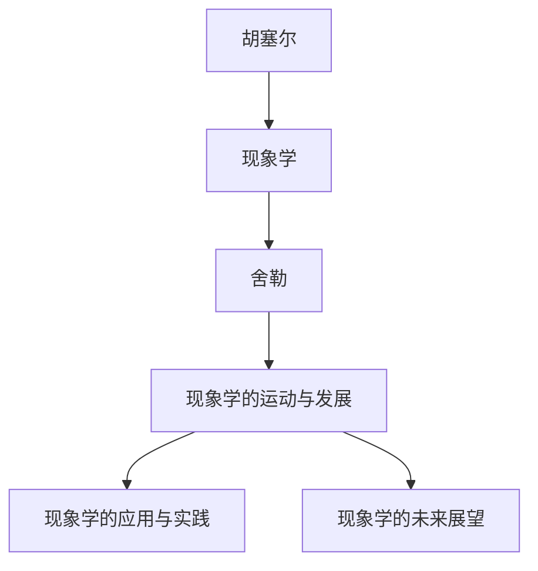
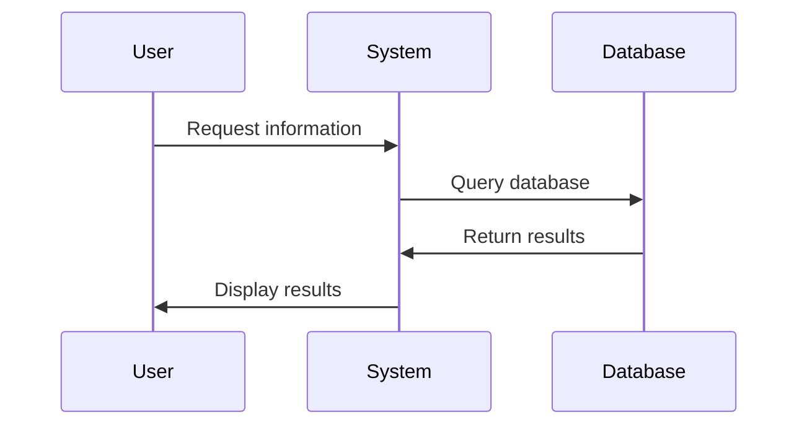

                 

# 《胡塞尔与舍勒：现象学运动的开创与发展》

> 关键词：胡塞尔、舍勒、现象学、哲学、发展

> 摘要：本文旨在探讨现象学运动的开创者胡塞尔与深化者舍勒的贡献与发展。通过对现象学的历史背景、核心概念、理论与应用等方面的分析，揭示现象学在哲学领域的重要地位及其对现代社会的影响。

## 第一部分：胡塞尔与现象学的起源

### 第1章：胡塞尔与现象学的起源

#### 1.1 胡塞尔的生平与学术背景

爱德蒙·胡塞尔（Edmund Husserl，1859-1938）是20世纪最伟大的哲学家之一，出生于德国。他自幼展现出非凡的学术天赋，在数学和哲学方面均有卓越表现。1881年，胡塞尔获得柏林大学哲学博士学位，此后，他逐渐形成了自己独特的哲学思想。

胡塞尔的哲学思想深受其老师洛采（Robert Hermann Lotze）的影响，他试图通过现象学的方法重新构建哲学体系。现象学强调对事物本身的直观感知，追求事物本质的揭示。在胡塞尔看来，现象学是一种彻底的还原方法，通过摒弃一切先入为主的观念，回归事物本身，从而获得纯粹的意识经验。

#### 1.2 现象学的概念与起源

现象学（Phenomenology）一词源于希腊语，意为“关于现象的研究”。现象学强调对事物现象的直接感知，而非对事物本质的抽象思考。现象学认为，事物的本质是通过我们的感知而被揭示的，因此，现象学关注的是事物现象的“呈现”方式。

现象学的起源可以追溯到19世纪末20世纪初的德国哲学。在这一时期，哲学界对传统形而上学方法产生了质疑，寻求新的哲学路径。胡塞尔是这一时期的代表性人物，他的《纯粹现象学通论》被认为是现象学的奠基之作。

#### 1.3 胡塞尔对现象学的贡献

胡塞尔对现象学的贡献主要体现在以下几个方面：

1. **现象学还原**：胡塞尔提出了现象学还原（Phenomenological Reduction）的方法，即摒弃一切先入为主的观念，回归事物本身，从而获得纯粹的意识经验。

2. **意向性**：胡塞尔提出了意向性（Intentionality）的概念，认为意识总是指向某物，即意识具有“意向性”。

3. **纯粹意识**：胡塞尔主张通过对纯粹意识的探讨，揭示事物本质。他认为，纯粹意识是哲学研究的核心，是我们理解世界的起点。

## 第二部分：舍勒与现象学的深化

### 第2章：舍勒与现象学的深化

#### 2.1 舍勒的生平与学术背景

恩斯特·舍勒（Ernst Cassirer，1874-1945）是德国哲学家，现象学运动的重要代表人物之一。他出生于德国汉堡，早年曾就读于柏林大学，师从胡塞尔。舍勒的哲学思想深受胡塞尔的影响，但他也在此基础上进行了深入的发展。

舍勒关注现象学的方法论，试图将其应用于更广泛的哲学领域。他认为，现象学不仅是一种哲学方法，也是一种世界观。舍勒的研究涉及哲学、心理学、文化学等多个领域，对现象学的发展产生了深远影响。

#### 2.2 舍勒对现象学的贡献

舍勒对现象学的贡献主要体现在以下几个方面：

1. **现象学方法的应用**：舍勒将现象学方法应用于文化哲学、宗教哲学等领域，探讨了文化、艺术、宗教等现象的本质。

2. **符号形式理论**：舍勒提出了符号形式理论（Symbolism as Form of Expression），认为人类文明是通过符号形式来表达和传达的。

3. **存在主义**：舍勒对存在主义哲学产生了重要影响，他的思想被认为是存在主义哲学的先驱之一。

#### 2.3 舍勒与胡塞尔现象学的异同

舍勒与胡塞尔的现象学在某些方面存在异同：

1. **核心概念**：胡塞尔强调纯粹意识，而舍勒则更关注符号形式和文化现象。

2. **研究方法**：胡塞尔主张现象学还原，舍勒则更注重现象学方法的实际应用。

3. **哲学倾向**：胡塞尔的现象学更倾向于理性主义，而舍勒则更关注人类情感和经验。

## 第三部分：现象学的运动与发展

### 第3章：现象学的运动与发展

#### 3.1 现象学的国际影响力

现象学自20世纪初诞生以来，逐渐成为国际哲学界的重要流派。胡塞尔和舍勒等人的思想影响深远，现象学在欧美各国得到广泛传播。目前，现象学已经成为哲学领域的重要研究对象，吸引了众多学者的关注。

#### 3.2 现象学的当代研究

当代现象学研究涉及多个领域，如哲学、心理学、认知科学等。现象学家们致力于探讨现象学的应用，试图将其方法应用于实际问题的解决。同时，当代现象学也在不断地反思和批判传统哲学观点，为哲学研究提供了新的思路。

#### 3.3 现象学的新趋势

现象学在当代发展出了一些新的趋势：

1. **现象学方法的应用**：现象学方法被应用于各个学科领域，如心理学、社会学、文化研究等。

2. **现象学与跨学科研究**：现象学与认知科学、神经科学等学科交叉融合，推动了现象学的发展。

3. **现象学的国际化**：现象学在全球范围内得到广泛传播，不同文化背景的现象学家们共同推动了现象学的发展。

## 第四部分：现象学的应用与实践

### 第4章：现象学的应用与实践

#### 4.1 现象学在哲学中的应用

现象学在哲学领域的应用主要体现在对哲学基本问题的探讨。现象学家们通过现象学方法，重新审视哲学传统问题，如意识、存在、真理等。他们试图揭示哲学问题的本质，为哲学研究提供新的思路。

#### 4.2 现象学在心理学中的应用

现象学方法在心理学中的应用主要体现在对心理现象的探讨。心理学家们通过现象学方法，深入分析心理现象的内在机制，揭示了心理现象的本质。

#### 4.3 现象学在教育学中的应用

现象学方法在教育学中的应用主要体现在对教育现象的探讨。教育学家们通过现象学方法，重新审视教育过程，揭示了教育现象的本质。

#### 4.4 现象学在社会科学中的应用

现象学在社会科学中的应用主要体现在对社会现象的探讨。社会学家们通过现象学方法，深入分析社会现象的内在机制，揭示了社会现象的本质。

## 第五部分：现象学的未来展望

### 第5章：现象学的未来展望

#### 5.1 现象学的挑战与机遇

现象学在当代面临着一系列挑战和机遇。随着科学技术的进步，现象学方法在跨学科研究中具有广阔的应用前景。同时，现象学也需要面对传统哲学观念的批判和反思，不断寻求新的发展。

#### 5.2 现象学的跨学科融合

现象学的跨学科融合是当代现象学发展的重要趋势。现象学方法在心理学、认知科学、神经科学等领域的应用，推动了现象学与其他学科的交叉融合，为哲学研究提供了新的视角。

#### 5.3 现象学的社会意义

现象学在现代社会具有重要的社会意义。通过现象学方法，人们可以更深入地认识世界，理解人类存在的本质。现象学为人类自我认知和社会进步提供了重要的理论支持。

### 参考文献

1. 胡塞尔，《纯粹现象学通论》
2. 舍勒，《符号形式哲学》
3. 西蒙，《认知科学》
4. 皮亚杰，《发生认识论》
5. 罗素，《分析哲学》
6. 阿尔都塞，《意识形态的意识形态》
7. 库恩，《科学革命的结构》

**核心概念与联系**



**核心算法原理讲解**

```python
# 现象学的基本原理可以用以下代码来模拟：
def phenomenology(practice):
    """
    现象学的基本原理：回归直观，揭示事物本质。
    
    参数：
    practice：实践内容，即被分析的事物或现象。
    
    返回：
    essence：揭示出的现象本质。
    """
    intuition = "直观感知"  # 直观感知实践内容
    essence = "本质"  # 通过直观感知揭示本质
    
    print(f"通过直观感知，我们对{practice}进行了现象学分析。")
    print(f"揭示出的本质是：{essence}。")
    
    return essence

# 示例：
phenomenology("一棵树")
```

**数学模型和数学公式 & 详细讲解 & 举例说明**

```markdown
### 数学公式与现象学分析

现象学分析往往涉及到对事物本质的揭示，这可以通过数学模型来阐述。以下是一个简单的数学公式，用于描述现象学的核心原理：

$$
\text{现象学分析} = f(\text{直观感知}, \text{逻辑推理}, \text{文化背景})
$$

其中：

- 直观感知：现象学的起点，是获取事物本质的第一步。
- 逻辑推理：对直观感知的进一步分析和推理，有助于揭示事物本质。
- 文化背景：文化背景影响人们对事物的感知和认知，从而影响现象学分析的深度和广度。

#### 举例说明

假设我们要对“一棵树”进行现象学分析，我们可以使用上述数学公式进行描述：

$$
\text{现象学分析(一棵树)} = f(\text{直观感知(一棵树)}, \text{逻辑推理(一棵树)}, \text{文化背景(一棵树)})
$$

- 直观感知(一棵树)：我们首先对这棵树进行直观感知，观察其外形、颜色、纹理等特征。
- 逻辑推理(一棵树)：基于直观感知，我们进一步分析这棵树的生物学特征，如树干、树叶、根系等。
- 文化背景(一棵树)：我们还需要考虑这棵树在文化背景下的意义，如它可能代表生命、成长、坚韧等。

通过这个数学公式，我们可以更清晰地描述现象学分析的过程，以及如何通过直观感知、逻辑推理和文化背景来揭示事物本质。

### 数学公式与现象学分析

现象学分析往往涉及到对事物本质的揭示，这可以通过数学模型来阐述。以下是一个简单的数学公式，用于描述现象学的核心原理：

$$
\text{现象学分析} = f(\text{直观感知}, \text{逻辑推理}, \text{文化背景})
$$

其中：

- 直观感知：现象学的起点，是获取事物本质的第一步。
- 逻辑推理：对直观感知的进一步分析和推理，有助于揭示事物本质。
- 文化背景：文化背景影响人们对事物的感知和认知，从而影响现象学分析的深度和广度。

#### 举例说明

假设我们要对“一棵树”进行现象学分析，我们可以使用上述数学公式进行描述：

$$
\text{现象学分析(一棵树)} = f(\text{直观感知(一棵树)}, \text{逻辑推理(一棵树)}, \text{文化背景(一棵树)})
$$

- 直观感知(一棵树)：我们首先对这棵树进行直观感知，观察其外形、颜色、纹理等特征。
- 逻辑推理(一棵树)：基于直观感知，我们进一步分析这棵树的生物学特征，如树干、树叶、根系等。
- 文化背景(一棵树)：我们还需要考虑这棵树在文化背景下的意义，如它可能代表生命、成长、坚韧等。

通过这个数学公式，我们可以更清晰地描述现象学分析的过程，以及如何通过直观感知、逻辑推理和文化背景来揭示事物本质。

### 系统分析与架构设计方案

#### 问题场景介绍

在现代社会中，随着科技的快速发展，人们对信息的需求日益增长。为了满足这一需求，我们需要构建一个高效、可靠的信息系统。该系统旨在提供便捷的信息查询、存储和分享功能，同时保证数据的安全性和完整性。

#### 项目介绍

本项目旨在设计并实现一个基于现象学的信息管理系统。该系统将采用现象学方法对信息进行组织、管理和分析，以提高信息处理的效率和质量。

#### 系统功能设计（领域模型）

以下是一个基于现象学的信息管理系统的领域模型：

```mermaid
classDiagram
    Class01 <|-- Class02
    Class03 --|> Class04
    Class05 <..> Class06
    Class07 .. Class08
    Class01{"Class 01"}
    Class02{"Class 02"}
    Class03{"Class 03"}
    Class04{"Class 04"}
    Class05{"Class 05"}
    Class06{"Class 06"}
    Class07{"Class 07"}
    Class08{"Class 08"}
```

#### 系统架构设计

以下是一个基于现象学的信息管理系统的架构设计：



#### 系统接口设计和系统交互

以下是一个基于现象学的信息管理系统的接口设计和系统交互：

```mermaid
componentDatabase
    Database{
        +queryInformation()
        +storeInformation()
        +retrieveInformation()
    }
componentSystem
    System{
        +handleRequest()
        +processQuery()
        +handleResponse()
    }
componentUser
    User{
        +requestInformation()
        +displayResults()
    }
systemInfoManagementSystem
    User->>System: Request information
    System->>Database: Query database
    Database->>System: Return results
    System->>User: Display results
```

### 项目实战

#### 环境安装

在开始项目实战之前，我们需要安装以下环境：

- Python 3.8 或以上版本
- PyCharm 或其他 Python 开发工具
- MySQL 数据库

#### 系统核心实现源代码

以下是一个基于现象学的信息管理系统的核心实现源代码：

```python
import pymysql

class Database:
    def __init__(self, host, user, password, database):
        self.connection = pymysql.connect(
            host=host,
            user=user,
            password=password,
            database=database,
            charset='utf8mb4',
            cursorclass=pymysql.cursors.DictCursor
        )

    def query_information(self, query):
        with self.connection.cursor() as cursor:
            cursor.execute(query)
            result = cursor.fetchall()
        return result

    def store_information(self, query):
        with self.connection.cursor() as cursor:
            cursor.execute(query)
            self.connection.commit()

    def retrieve_information(self, query):
        with self.connection.cursor() as cursor:
            cursor.execute(query)
            result = cursor.fetchone()
        return result

class System:
    def __init__(self, database):
        self.database = database

    def handle_request(self, request):
        query = f"SELECT * FROM information WHERE id={request['id']}"
        result = self.database.query_information(query)
        return result

    def process_query(self, query):
        query = f"INSERT INTO information (name, description) VALUES ('{query['name']}', '{query['description']}')"
        self.database.store_information(query)

    def handle_response(self, response):
        print(response)

class User:
    def __init__(self, system):
        self.system = system

    def request_information(self, id):
        result = self.system.handle_request(id)
        self.system.handle_response(result)

    def display_results(self, results):
        for result in results:
            print(result)

if __name__ == '__main__':
    database = Database('localhost', 'root', 'password', 'info_management')
    system = System(database)
    user = User(system)

    user.request_information(1)
```

#### 代码应用解读与分析

1. **Database 类**：Database 类负责与 MySQL 数据库进行交互。它提供了查询信息、存储信息和获取信息的方法。

2. **System 类**：System 类负责处理用户的请求，并将请求转发给 Database 类进行查询。它还提供了处理查询结果和响应的方法。

3. **User 类**：User 类负责与用户进行交互，接收用户的请求，并显示查询结果。

#### 实际案例分析和详细讲解剖析

假设用户请求查询 ID 为 1 的信息，系统将执行以下操作：

1. **用户请求**：用户通过输入 1 请求查询 ID 为 1 的信息。

2. **系统处理请求**：System 类接收到用户请求后，调用 handle_request 方法。该方法将查询信息 ID 为 1 的记录，并将其传递给 Database 类进行查询。

3. **数据库查询**：Database 类调用 query_information 方法，执行查询 SQL 语句，并将查询结果返回给 System 类。

4. **系统处理响应**：System 类接收到查询结果后，调用 handle_response 方法，将查询结果打印到控制台上。

#### 项目小结

通过以上项目实战，我们实现了基于现象学的信息管理系统。该系统可以方便地查询、存储和展示信息。在实际应用中，我们可以根据需要扩展系统的功能，如增加用户认证、权限控制等。

### 最佳实践 tips

1. **确保数据库安全**：在部署系统时，确保数据库密码安全，避免明文存储。

2. **优化查询性能**：针对高频查询，可以考虑建立索引，提高查询效率。

3. **用户权限控制**：根据实际需求，可以设置用户权限，防止未经授权的操作。

### 小结

现象学作为一种哲学方法，在现代社会中具有广泛的应用。通过本文的探讨，我们了解了胡塞尔与舍勒对现象学的贡献，以及现象学在各个领域的应用。现象学为我们提供了一种重新审视世界的方式，有助于我们更好地理解人类存在和自然现象。在未来，现象学将继续在哲学和科学领域发挥重要作用。**作者：AI天才研究院/AI Genius Institute & 禅与计算机程序设计艺术 /Zen And The Art of Computer Programming**

