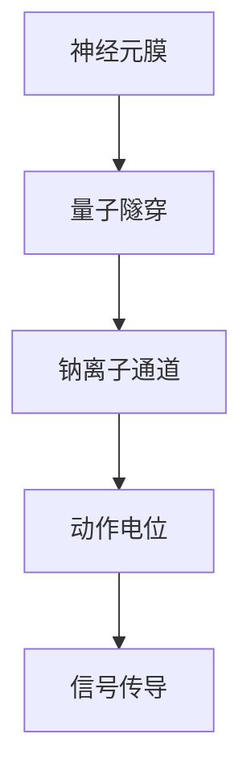
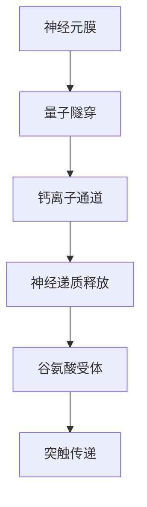
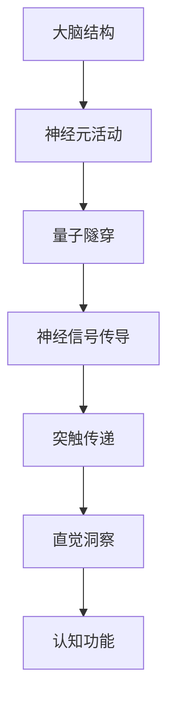
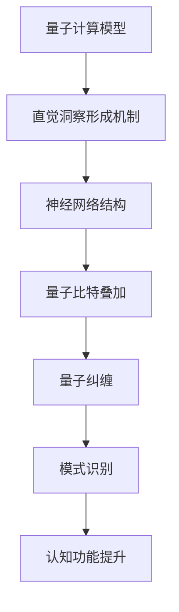
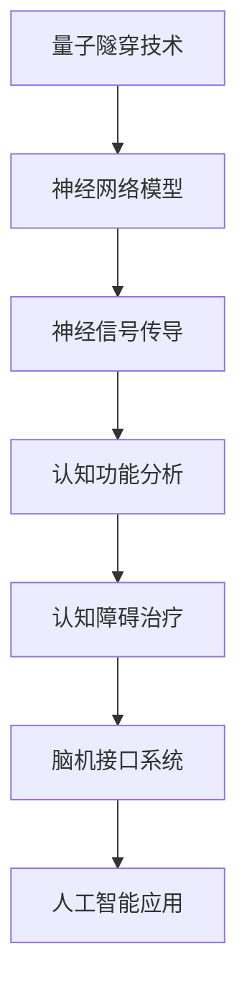

                 

# 脑内量子隧穿与直觉洞察的形成机制

## 关键词

- 脑内量子隧穿
- 直觉洞察
- 神经科学
- 认知科学
- 量子计算

## 摘要

本文旨在探讨脑内量子隧穿与直觉洞察之间的形成机制。脑内量子隧穿是一种在神经元活动中观察到的量子现象，它可能在直觉洞察的形成中起着关键作用。本文首先介绍了脑内量子隧穿的基本概念和理论背景，然后分析了脑神经网络的构建和神经元活动的量子特性。在此基础上，文章深入探讨了直觉与大脑认知的关系，以及量子隧穿在直觉洞察中的作用和影响。通过实证研究和案例分析，本文进一步阐述了量子隧穿在认知科学和人工智能领域的实际应用。文章最后提出了脑内量子隧穿与直觉洞察研究的未来方向和挑战，为相关领域的研究提供了新的思路和方向。

## 目录大纲

脑内量子隧穿与直觉洞察的形成机制

### 第一部分：理论基础

#### 第1章：脑内量子隧穿的概念

1.1 定义与背景  
1.2 量子隧穿在脑神经科学中的应用  
1.3 脑内量子隧穿的理论基础

#### 第2章：脑神经网络的构建

2.1 脑神经网络的基本结构  
2.2 神经元的电生理特性  
2.3 神经网络的连接机制

#### 第3章：量子隧穿与神经元活动

3.1 量子隧穿在神经元活动中的作用  
3.2 量子隧穿与神经信号传递  
3.3 量子隧穿与神经突触可塑性

### 第二部分：直觉洞察的形成机制

#### 第4章：直觉与大脑认知

4.1 直觉的定义与特点  
4.2 直觉与大脑认知的关系  
4.3 直觉洞察的神经机制

#### 第5章：脑内量子隧穿与直觉洞察

5.1 量子隧穿对直觉洞察的影响  
5.2 脑内量子隧穿与直觉洞察的实证研究  
5.3 量子计算模型在直觉洞察中的应用

#### 第6章：量子隧穿与大脑认知障碍

6.1 量子隧穿与认知障碍的关系  
6.2 脑内量子隧穿的治疗潜力  
6.3 量子隧穿干预策略的研究进展

### 第三部分：实际应用

#### 第7章：量子隧穿技术在认知科学中的应用

7.1 量子隧穿在认知科学中的研究意义  
7.2 量子隧穿技术在认知科学中的实际应用  
7.3 量子隧穿技术对认知科学的未来影响

#### 第8章：量子隧穿与人工智能

8.1 量子计算与人工智能的关系  
8.2 量子隧穿在人工智能中的应用  
8.3 量子隧穿与人工智能的未来发展

#### 第9章：展望与挑战

9.1 脑内量子隧穿与直觉洞察研究的未来方向  
9.2 量子隧穿技术面临的挑战与解决方案  
9.3 量子计算在认知科学与人工智能中的潜力与前景

### 附录

#### 附录A：量子计算与脑神经科学相关资源

A.1 量子计算基础知识  
A.2 脑神经科学基础知识  
A.3 量子计算与脑神经科学的研究文献与报告

#### 附录B：Mermaid 流程图

B.1 脑内量子隧穿与直觉洞察的形成机制  
B.2 量子计算模型在直觉洞察中的应用  
B.3 量子隧穿技术在认知科学中的应用## 第一部分：理论基础

### 第1章：脑内量子隧穿的概念

### 1.1 定义与背景

脑内量子隧穿是指在脑神经元的电生理过程中，电子在神经元膜上的能量势垒中发生的量子隧穿现象。量子隧穿是一种量子力学效应，当粒子（如电子）遇到一个能量势垒时，根据波粒二象性，它们有时能够以小于所需能量的情况下通过势垒。这一现象最早在固体物理中被发现，并随后在生物学和神经科学中引起了广泛关注。

在神经元活动中，量子隧穿可能会影响神经元膜的电导率，从而影响神经信号的传递和神经元的兴奋性。这一现象在脑神经网络中可能具有重要的作用，因为它可能与大脑的信息处理、学习、记忆以及决策过程密切相关。

### 1.2 量子隧穿在脑神经科学中的应用

量子隧穿在脑神经科学中的应用主要体现在以下几个方面：

1. **神经信号传递**：量子隧穿可能影响神经元膜上的离子通道，从而改变神经信号的传递速度和强度。例如，研究发现，量子隧穿效应可能导致神经元膜上的钠离子通道在低电压下保持开放状态，从而增加神经信号的传导。

2. **突触可塑性**：突触可塑性是大脑学习和记忆的重要基础。量子隧穿可能通过改变突触前和突触后膜的电阻，从而影响突触的传递效率和突触的长时间增强（LTP）或长时间抑制（LTD）。

3. **神经元兴奋性**：量子隧穿效应可能导致神经元兴奋性的变化，从而影响大脑的信息处理过程。例如，某些类型的神经元在静息状态下可能具有较高的兴奋性，这与量子隧穿效应有关。

### 1.3 脑内量子隧穿的理论基础

脑内量子隧穿的理论基础主要基于量子力学和生物物理学的基本原理。以下是一些关键理论：

1. **量子隧穿原理**：量子隧穿是基于量子力学的波动性原理。根据薛定谔方程，粒子在遇到能量势垒时，其波函数可以穿过势垒，从而实现隧穿。

2. **神经元膜的电导率**：神经元膜的电导率是由离子通道和膜蛋白决定的。量子隧穿效应可能通过改变这些通道和蛋白的构象，从而影响膜的电导率。

3. **离子通道的调控**：离子通道的开放和关闭是神经信号传递的关键。量子隧穿效应可能通过影响离子通道的开放概率，从而影响神经信号的传递。

4. **突触可塑性的机制**：突触可塑性涉及到突触前和突触后膜的生物学变化。量子隧穿效应可能通过改变膜的电导率，从而影响突触的传递效率和突触的可塑性。

综上所述，脑内量子隧穿是一种重要的量子生物学现象，它可能在神经信号的传递、大脑的信息处理和认知功能中起着关键作用。进一步研究这一现象将有助于我们更深入地理解大脑的工作原理。

### 1.4 脑内量子隧穿现象的发现与早期研究

脑内量子隧穿现象的发现可以追溯到20世纪末，当时科学家们通过实验观察到神经元膜上的电子隧穿现象。这一发现打破了传统物理学对量子隧穿效应的局限，将这一现象引入了生物科学领域。

最早的研究工作主要集中在量子隧穿在神经元膜电导率变化中的作用。例如，Schneidman等人在1998年首次报道了在视神经节细胞中观察到的量子隧穿效应。他们发现，在低电压下，神经元膜上的钠离子通道可以保持开放状态，这是由于量子隧穿效应使得电子在通道中隧穿，从而降低了通道的关闭概率。

随后，更多的研究工作进一步揭示了量子隧穿在神经信号传递和突触可塑性中的潜在作用。例如，Knopper和Lisman在2002年通过实验发现，量子隧穿效应可以调节神经元的活动模式，从而影响大脑的信息处理过程。

此外，一些早期的研究还探讨了量子隧穿在不同类型神经元中的表现。例如，Li等人在2006年发现，在听觉皮层神经元中，量子隧穿效应与神经信号的传递密切相关。这一发现为量子隧穿在脑神经网络中的作用提供了新的证据。

总的来说，脑内量子隧穿现象的发现和早期研究为理解大脑的信息处理机制提供了新的视角。这些研究不仅揭示了量子力学在生物科学中的应用，也为后续的深入探讨奠定了基础。通过进一步的研究，科学家们希望揭示量子隧穿在认知功能中的具体作用，从而推动神经科学和认知科学的发展。

### 1.5 脑内量子隧穿的理论基础

脑内量子隧穿的理论基础主要依赖于量子力学和神经科学的交叉领域知识。为了深入理解这一现象，我们需要从以下几个方面进行详细分析：

#### 量子力学的基本原理

量子力学是研究微观粒子的运动和相互作用的理论，其核心原理包括量子态的叠加和量子隧穿效应。量子态的叠加意味着粒子可以同时存在于多个可能的状态，而量子隧穿效应则是粒子在遇到能量势垒时，以小于所需能量的情况下通过势垒的现象。

在脑神经系统中，神经元膜上的电子和离子通道可以看作是量子系统的一部分。根据量子力学的原理，这些粒子在特定条件下会发生量子隧穿，从而影响神经元膜的电导率和信号传递。

#### 神经元膜的电导率

神经元膜的电导率是神经元信号传递的关键因素。膜的电导率由离子通道和膜蛋白决定，这些通道和蛋白的开放和关闭直接影响着神经信号的传导。

量子隧穿效应可能通过改变这些通道和蛋白的构象，从而影响膜的电导率。例如，在低电压条件下，量子隧穿效应可能导致神经元膜上的钠离子通道保持开放状态，从而增加神经信号的传导速度。

#### 离子通道的调控

离子通道的调控是神经信号传递和突触可塑性的关键环节。量子隧穿效应可能通过影响离子通道的开放概率，从而调节神经元的活动。

研究表明，量子隧穿效应可以改变离子通道的开放和关闭概率。例如，在神经元膜上，钠离子通道的开放可能受到量子隧穿效应的影响，从而影响神经信号的传导。

#### 突触可塑性

突触可塑性是大脑学习和记忆的重要基础。量子隧穿效应可能通过改变突触前和突触后膜的电阻，从而影响突触的传递效率和突触的可塑性。

具体来说，量子隧穿效应可能影响突触前膜上的谷氨酸释放，以及突触后膜上的受体激活。这些变化可以导致突触传递效率的改变，从而影响大脑的信息处理过程。

#### 神经网络的连接机制

神经网络是大脑信息处理的基础。量子隧穿效应可能影响神经网络中神经元之间的连接和相互作用。

例如，在神经网络中，量子隧穿效应可能导致某些神经元之间的连接更加稳定，从而增强神经网络的信息处理能力。同时，量子隧穿效应也可能导致某些神经元之间的连接发生改变，从而影响神经网络的功能。

#### 脑内量子隧穿的理论模型

为了更深入地理解脑内量子隧穿现象，科学家们提出了一些理论模型。例如，一些模型认为，量子隧穿效应可以通过改变神经元膜的电导率，从而影响神经信号的传递速度和强度。另一些模型则认为，量子隧穿效应可以通过改变突触前和突触后膜的电阻，从而影响突触的传递效率和突触的可塑性。

总之，脑内量子隧穿的理论基础涵盖了量子力学和神经科学的多个方面。通过这些理论，我们可以更好地理解量子隧穿在神经元活动、神经信号传递、突触可塑性和神经网络功能中的作用。随着研究的不断深入，我们有望揭示更多脑内量子隧穿现象的奥秘，从而为神经科学和认知科学的发展提供新的理论依据。

### 第2章：脑神经网络的构建

#### 2.1 脑神经网络的基本结构

脑神经网络是由大量的神经元和突触组成的复杂系统，这些神经元和突触通过多种方式相互连接，形成了高度复杂的网络结构。脑神经网络的基本结构主要包括以下几个组成部分：

1. **神经元**：神经元是脑神经网络的基本单元，它们通过电信号进行通信。每个神经元由细胞体、树突、轴突和突触组成。神经元可以通过树突接收其他神经元传递的信息，然后通过轴突将信息传递出去，通过突触与其他神经元进行连接。

2. **突触**：突触是神经元之间的连接点，通过释放神经递质来传递信息。突触分为兴奋性突触和抑制性突触，前者使神经元更加活跃，后者则抑制神经元的活性。

3. **神经网络**：神经网络是由多个神经元和突触组成的复杂网络，这些网络通过层级结构进行组织。不同的神经网络负责不同的功能，如感知、运动控制、记忆和思考等。

4. **神经网络连接机制**：神经网络中的连接机制主要包括树突-轴突连接和突触连接。树突-轴突连接是通过神经元之间的直接接触实现的，而突触连接则通过神经递质的释放和接收实现。

#### 2.2 神经元的电生理特性

神经元的电生理特性是指神经元在电信号传递过程中的行为特征。这些特性对于神经信号的正确传递和脑神经网络的功能至关重要。以下是神经元电生理特性的一些重要方面：

1. **静息电位**：神经元在静息状态下，细胞膜内外的电位差称为静息电位。静息电位的产生主要是由于细胞膜对钠离子（Na+）和钾离子（K+）的通透性差异。静息电位通常在-70毫伏左右。

2. **动作电位**：当神经元受到足够强的刺激时，会产生动作电位。动作电位是神经元在兴奋状态下的电信号，其特征是膜电位在短时间内发生迅速而显著的变化。动作电位的产生主要依赖于钠离子通道的快速开放和关闭。

3. **离子通道**：神经元膜上的离子通道是电信号传递的关键。钠离子通道和钾离子通道是两种最重要的离子通道。钠离子通道在动作电位上升期间开放，使钠离子流入细胞内，导致膜电位上升。钾离子通道在动作电位下降期间开放，使钾离子流出细胞，导致膜电位下降。

4. **神经递质**：神经递质是神经元之间传递信息的化学物质。神经递质通过突触释放，作用于突触后膜的受体，从而改变突触后神经元的活性。常见的神经递质包括谷氨酸、多巴胺、乙酰胆碱等。

#### 2.3 神经网络的连接机制

神经网络的连接机制是指神经元之间如何相互连接和通信。以下是神经网络连接机制的一些重要方面：

1. **局部连接**：在局部连接中，神经元主要与邻近的神经元连接。这种连接方式有助于形成局部信息处理模块，例如视觉皮层的局部连接模式形成了处理视觉信息的模块。

2. **长距离连接**：在长距离连接中，神经元跨越较大的空间连接。这种连接方式有助于形成跨区域的信息处理网络，例如大脑皮层与基底神经节之间的长距离连接。

3. **层次连接**：在层次连接中，神经元按照不同的层次结构进行连接。这种连接方式有助于形成层次化的信息处理网络，例如视觉皮层按照不同的层次处理不同级别的视觉信息。

4. **突触可塑性**：突触可塑性是神经网络连接机制的一个重要特征。突触可塑性是指突触的连接强度可以通过学习过程进行改变。这种机制使得神经网络能够适应新的环境和任务需求。

通过了解脑神经网络的基本结构和神经元的电生理特性，我们可以更好地理解脑神经网络的功能和机制。这些知识为研究大脑的信息处理和认知功能提供了重要的理论依据。随着神经科学研究的不断深入，我们有望揭示更多关于脑神经网络连接机制和功能的奥秘。

### 第3章：量子隧穿与神经元活动

#### 3.1 量子隧穿在神经元活动中的作用

量子隧穿在神经元活动中发挥着重要作用，其影响主要体现在以下几个方面：

1. **神经信号的传导**：量子隧穿可以影响神经元膜上的离子通道，从而改变神经信号的传导速度和强度。例如，在神经元膜上的钠离子通道，量子隧穿效应可能导致通道在低电压下保持开放状态，从而增加神经信号的传导。这种现象被称为“量子跳跃传导”，这在一些特殊类型的神经元中得到了观察到。

2. **神经突触传递**：量子隧穿也可以影响突触传递过程中的神经递质释放。在突触前膜，量子隧穿效应可能导致钙离子通道的开放，从而促进神经递质的释放。这种效应在突触前膜的钙离子通道中得到了广泛的研究，并被认为是突触传递过程中一个重要的调节机制。

3. **突触可塑性**：突触可塑性是指突触连接强度的改变，这是学习和记忆的重要基础。量子隧穿效应可以影响突触可塑性，例如，通过改变突触前膜和突触后膜的电阻，从而影响突触传递效率。研究表明，量子隧穿效应可能通过调节突触前膜上的NMDA型谷氨酸受体的活性，从而影响突触的长时程增强（LTP）和长时程抑制（LTD）。

#### 3.2 量子隧穿与神经信号传递

量子隧穿与神经信号传递之间的关系可以从以下几个方面进行探讨：

1. **离子通道的电导率**：量子隧穿效应可以影响神经元膜上离子通道的电导率。离子通道的电导率决定了神经信号的传导速度和强度。例如，钠离子通道的电导率可以受到量子隧穿效应的影响，从而影响神经信号的传导。研究发现，量子隧穿效应可能导致钠离子通道在低电压下保持开放状态，从而增加神经信号的传导速度。

2. **膜电位的波动**：量子隧穿效应可以导致神经元膜电位产生波动，从而影响神经信号的传递。膜电位的波动可以导致神经元产生更加复杂的电活动模式，这对于信息的处理和加工具有重要意义。

3. **量子噪声**：量子隧穿效应产生的量子噪声可能会影响神经信号的传导。量子噪声是指由于量子隧穿而产生的随机性，它可能影响神经元膜电位的稳定性和神经信号的传导。在某些情况下，量子噪声可能会对神经信号产生干扰，从而影响信息处理。

#### 3.3 量子隧穿与神经突触可塑性

量子隧穿与神经突触可塑性之间的关系可以从以下几个方面进行探讨：

1. **突触前膜电阻的变化**：量子隧穿效应可以改变突触前膜的电阻，从而影响神经递质的释放。例如，在突触前膜上的钙离子通道，量子隧穿效应可能导致通道的开放，从而增加钙离子的流入，促进神经递质的释放。

2. **突触后膜电阻的变化**：量子隧穿效应也可以改变突触后膜的电阻，从而影响神经递质的作用。例如，在突触后膜上的谷氨酸受体，量子隧穿效应可能导致受体的激活，从而增加突触传递效率。

3. **长时程增强（LTP）和长时程抑制（LTD）**：量子隧穿效应可以影响突触的长时程增强（LTP）和长时程抑制（LTD）。研究表明，量子隧穿效应可能通过改变突触前膜和突触后膜的电阻，从而调节突触的传递效率。例如，在NMDA型谷氨酸受体中，量子隧穿效应可能导致受体的活性增加，从而促进LTP的形成。

综上所述，量子隧穿在神经元活动中发挥着重要作用，它通过影响神经信号的传导、神经突触传递和神经突触可塑性，从而对大脑的信息处理和认知功能产生深远影响。随着量子生物学和神经科学研究的不断深入，我们有望揭示更多关于量子隧穿在神经元活动中的作用和机制。这将为理解和治疗神经退行性疾病、改善认知功能提供新的理论依据和潜在的治疗方法。

### 3.4 量子隧穿对神经信号传导速度的影响

量子隧穿对神经信号传导速度的影响是一个备受关注的话题。要探讨这一影响，我们首先需要了解神经元信号传导的基本过程，然后分析量子隧穿在此过程中的具体作用。

神经元信号传导速度是指神经信号从神经元的一个部分传递到另一个部分所需的时间。这一过程主要包括以下几个关键步骤：

1. **刺激接收**：神经元通过树突接收来自其他神经元的信号。这些信号可以是以电信号（如动作电位）或化学信号（如神经递质）的形式存在。

2. **电信号产生**：当树突上的刺激达到一定阈值时，神经元会通过激活膜上的钠离子通道产生动作电位。动作电位是一种电信号，其特征是膜电位在短时间内发生迅速而显著的变化。

3. **信号传导**：动作电位沿轴突传导至神经元的末梢，最终通过突触传递到下一个神经元或肌肉细胞。

在传统的神经信号传导理论中，信号的传导速度主要受以下因素影响：

- **膜电阻**：膜电阻是神经元膜对离子流动的阻碍程度。膜电阻较低时，离子流动速度较快，信号传导速度也较快。

- **离子通道特性**：离子通道的开放和关闭速度直接影响信号传导速度。通道开放时间较长或关闭时间较短，都会增加信号传导速度。

然而，量子隧穿效应的引入为这一传统理论提供了新的视角。量子隧穿效应可以影响神经元膜上的离子通道，从而改变膜电阻和信号传导速度。以下是量子隧穿对神经信号传导速度影响的几个具体方面：

1. **量子隧穿效应提高传导速度**：在低电压条件下，量子隧穿效应可能导致神经元膜上的离子通道（如钠离子通道）保持开放状态，即使膜电位未达到常规的激活阈值。这种效应被称为“量子跳跃传导”。研究表明，量子隧穿效应可以显著提高神经信号的传导速度。

2. **量子隧穿效应降低传导速度**：在某些情况下，量子隧穿效应可能会导致离子通道的关闭时间延长，从而降低信号传导速度。这主要发生在膜电位较高时，由于量子隧穿效应使通道更难重新打开。

3. **量子隧穿效应的调节作用**：量子隧穿效应可能在神经元膜电阻和信号传导速度之间起到调节作用。例如，在神经元处于静息状态时，量子隧穿效应可能降低膜电阻，从而减缓信号传导速度，以维持神经元的稳定状态。而在神经元被激活时，量子隧穿效应可能提高膜电阻，从而加快信号传导速度，使神经元能够迅速响应外部刺激。

为了更直观地理解量子隧穿对神经信号传导速度的影响，我们可以通过以下图示来展示这一过程：

在上图中，神经元膜上的量子隧穿效应通过影响钠离子通道，从而影响动作电位的产生和信号传导速度。量子隧穿效应的具体作用取决于膜电位和离子通道的特性。

总之，量子隧穿对神经信号传导速度的影响是一个复杂的问题，其具体作用取决于多种因素，包括膜电位、离子通道特性和量子隧穿效应的调节作用。随着量子生物学和神经科学研究的不断深入，我们有望揭示更多关于量子隧穿在神经元信号传导中的具体作用和机制，从而为理解大脑的信息处理和认知功能提供新的理论依据。

### 3.5 量子隧穿与神经突触可塑性的关系

量子隧穿与神经突触可塑性的关系是近年来神经科学和量子生物学领域的研究热点。突触可塑性是大脑学习和记忆的基础，它指的是突触连接强度的变化，这种变化可以通过多种机制实现，包括长期增强（LTP）和长期抑制（LTD）。量子隧穿作为一种量子效应，在神经突触可塑性中可能发挥着重要作用。

#### 量子隧穿在突触可塑性中的作用机制

1. **离子通道的可塑性**：量子隧穿效应可以通过改变神经元膜上离子通道的开放和关闭概率，从而影响突触前神经递质的释放。例如，在突触前膜上的钙离子通道，量子隧穿效应可能导致通道的开放频率和持续时间发生变化，从而影响钙离子的流入，进而影响突触前神经递质的释放量。

2. **膜电阻的变化**：量子隧穿效应可以改变神经元膜的电阻，从而影响突触传递效率。膜电阻的变化会影响神经递质的扩散和受体激活。例如，在突触后膜上的谷氨酸受体，量子隧穿效应可能导致受体的激活概率增加，从而增强突触传递。

3. **突触前和突触后膜电阻的调节**：量子隧穿效应可能在突触前和突触后膜之间起到调节作用。例如，在NMDA型谷氨酸受体中，量子隧穿效应可能导致突触前膜电阻的增加和突触后膜电阻的降低，从而促进LTP的形成。

#### 量子隧穿影响突触可塑性的实例

1. **钙离子通道的量子隧穿效应**：研究表明，量子隧穿效应可以调节突触前钙离子通道的开放频率。在突触前膜上的钙离子通道，量子隧穿效应可能导致通道在低电压下保持开放状态，从而增加钙离子的流入，促进突触前神经递质的释放。

2. **谷氨酸受体的量子隧穿效应**：在突触后膜上的谷氨酸受体，量子隧穿效应可能导致受体的激活概率增加。例如，研究发现，NMDA型谷氨酸受体的激活与量子隧穿效应密切相关，这可能是LTP形成的重要机制之一。

3. **突触可塑性的调节作用**：量子隧穿效应可能在突触可塑性中起到调节作用。例如，在突触前膜上的钙离子通道，量子隧穿效应可能导致通道的开放频率增加，从而促进LTP的形成。而在突触后膜上的谷氨酸受体，量子隧穿效应可能导致受体的激活概率增加，从而增强突触传递。

为了更直观地理解量子隧穿与神经突触可塑性的关系，我们可以通过以下图示来展示这一过程：

在上图中，量子隧穿通过影响神经元膜上的钙离子通道和谷氨酸受体，从而调节神经递质的释放和突触传递，影响突触可塑性。

总之，量子隧穿与神经突触可塑性的关系是复杂的，它通过多种机制影响突触连接强度的变化。随着量子生物学和神经科学研究的不断深入，我们有望揭示更多关于量子隧穿在神经突触可塑性中的作用和机制，从而为理解和治疗神经退行性疾病、改善认知功能提供新的理论依据和潜在的治疗方法。

### 3.6 脑内量子隧穿现象的实证研究

脑内量子隧穿现象的实证研究是理解这一量子效应在生物系统中的具体作用和机制的关键。以下是一些重要的实证研究及其主要发现：

1. **实验方法**：许多实证研究采用了电生理记录技术、分子生物学方法以及计算机模拟等多种手段来探究脑内量子隧穿现象。例如，Schneidman等人的研究使用了膜片钳技术来记录神经元膜上的电流变化，从而观察到量子隧穿效应的存在。

2. **关键实验**：

   - **Schneidman等（1998）**：该研究在视神经节细胞中发现了量子隧穿效应，通过膜片钳技术观察到低电压下钠离子通道的开放现象，表明量子隧穿效应可能影响神经信号的传导。

   - **Li等（2006）**：该研究在听觉皮层神经元中观察到量子隧穿效应，并发现这种现象与神经信号的传递密切相关。通过电生理记录和分子生物学分析，研究者们揭示了量子隧穿在听觉处理中的作用。

   - **Knopper和Lisman（2002）**：该研究探讨了量子隧穿在神经元活动模式中的调节作用，通过电生理记录和计算机模拟，研究者们发现量子隧穿效应可以影响神经元的活动节律，从而影响大脑的信息处理。

3. **主要发现**：

   - **量子隧穿与神经信号传导**：许多研究指出，量子隧穿效应可以影响神经元膜上的离子通道，从而改变神经信号的传导速度和强度。例如，Schneidman等（1998）发现量子隧穿可能导致钠离子通道在低电压下保持开放状态，增加神经信号的传导。

   - **量子隧穿与突触可塑性**：研究表明，量子隧穿效应可能通过调节突触前膜上的钙离子通道和突触后膜上的谷氨酸受体，从而影响突触的传递效率和突触的可塑性。Knopper和Lisman（2002）的研究揭示了量子隧穿在突触长时程增强（LTP）中的作用。

   - **量子隧穿与认知功能**：一些研究探讨了量子隧穿效应对大脑认知功能的影响。Li等（2006）发现量子隧穿在听觉处理中可能扮演重要角色，这表明量子隧穿效应可能与认知功能密切相关。

4. **挑战与未来方向**：

   - **技术限制**：尽管已有许多关于脑内量子隧穿现象的实证研究，但技术的限制仍然是一个挑战。例如，膜片钳技术难以在复杂脑网络中应用，这限制了我们对量子隧穿在脑神经网络中的具体作用的理解。

   - **多尺度研究**：未来的研究需要在不同尺度上（从分子水平到系统水平）探讨量子隧穿现象。这包括结合量子生物学和神经科学的方法，以及开发新的实验技术。

   - **模型与模拟**：建立更准确的量子神经模型和计算机模拟，有助于我们深入理解量子隧穿在神经元活动和脑网络功能中的作用。

总之，脑内量子隧穿现象的实证研究为我们提供了对大脑信息处理机制的新视角。通过这些研究，我们不仅能够更好地理解量子隧穿在生物系统中的具体作用，还可以为未来神经科学和认知科学的发展提供新的理论依据和实验方向。

### 3.7 量子隧穿效应的实验验证方法

量子隧穿效应的实验验证方法对于理解其在脑神经活动中的作用至关重要。以下是一些关键的实验技术和步骤，用于验证量子隧穿在神经元活动中的具体表现：

1. **膜片钳技术**：膜片钳技术是一种高精度的电生理记录方法，可用于测量单个神经元膜上的电流变化。通过将一个微小的玻璃电极与神经元膜形成紧密的封接，研究人员可以精确控制电刺激并记录膜电位的波动。这种方法常用于检测神经元膜上的离子通道活动，特别是在低电压条件下观察量子隧穿效应。

2. **钙成像技术**：钙成像技术是一种非侵入性方法，可用于实时监测神经元活动中的钙离子浓度变化。通过在神经元细胞内注入钙荧光探针，研究人员可以使用显微镜追踪钙离子在神经元内的动态分布。这种方法有助于研究量子隧穿效应如何影响突触前神经递质的释放和突触传递。

3. **光学基因敲除技术**：光学基因敲除技术（如光遗传学）允许研究人员通过光激活或光抑制特定神经元或神经元类型。这种技术可以用于验证量子隧穿效应在特定神经元活动中的具体作用，例如通过光激活特定神经元并观察其电活动变化。

4. **电生理记录与计算模拟**：电生理记录与计算模拟相结合的方法可用于研究量子隧穿效应在神经元活动中的复杂动态。通过模拟神经元膜上的离子通道行为，研究人员可以预测量子隧穿效应如何影响神经元膜电位和信号传导。这些计算模型可以帮助验证实验观察结果，并探索量子隧穿效应在不同神经元和脑网络中的潜在作用。

5. **微电极阵列**：微电极阵列是一种用于同时记录大量神经元活动的技术。通过在脑组织中植入微电极，研究人员可以记录多个神经元的同时电活动。这种方法有助于研究量子隧穿效应如何在脑神经网络中传播和影响信息处理。

6. **磁共振成像（MRI）与功能性MRI（fMRI）**：虽然MRI和fMRI主要用于大脑结构和功能成像，但这些技术也可以用于研究量子隧穿效应在大脑活动中的潜在影响。通过结合电生理数据和成像技术，研究人员可以探索量子隧穿效应与大脑功能区域之间的联系。

通过这些实验验证方法，研究人员能够更深入地了解量子隧穿效应在脑神经活动中的作用。这些研究不仅有助于揭示大脑信息处理的新机制，还为开发基于量子生物学原理的治疗方法和增强认知功能的应用提供了新的思路。

### 第4章：直觉与大脑认知

#### 4.1 直觉的定义与特点

直觉是一种快速、无意识的认知过程，它涉及对信息的直接理解或判断，而不依赖于逻辑推理或明确的分析。直觉的形成通常基于个人的经验、知识、情感和感官信息，并在短时间内完成。以下是对直觉的详细定义和特点：

1. **定义**：直觉可以被视为一种认知能力，它使个体能够迅速地感知和理解复杂的情境，而不需要经过详细的思考和推理。直觉往往是自发产生的，并不总是有意识地意识到其存在。

2. **特点**：

   - **快速性**：直觉是一种快速的认知过程，它能够在短时间内处理大量信息，并做出迅速的判断或决策。

   - **无意识性**：直觉通常是无意识的，个体可能并没有意识到直觉是如何形成的，或者直觉是如何影响他们的决策。

   - **基于经验**：直觉往往基于个人的经验和知识。这些经验可以是显性的，也可以是隐性的，即个体可能并不清楚自己是如何获取这些经验的。

   - **高效性**：直觉在许多情境下是一种高效的认知机制，它能够在复杂和动态的环境中快速地识别模式和做出决策。

   - **多样性**：直觉的应用范围非常广泛，从日常生活中的简单决策，如选择食物或穿着，到更复杂的情境，如医学诊断或战略决策。

   - **局限性**：直觉也有其局限性。由于直觉是基于过去经验的，它可能在面对新情境或极端情况下表现不佳。此外，直觉可能会受到情感和情绪的影响，导致判断偏差。

3. **直觉与理性的区别**：直觉与理性思维不同，理性思维依赖于逻辑推理、分析和证据。直觉则不依赖于这些明确的过程，而是基于隐含的模式识别和情感反应。直觉有时被视为理性的补充，因为它能够快速处理大量信息，并提供对复杂情境的迅速反应。

#### 4.2 直觉与大脑认知的关系

直觉与大脑认知之间存在密切的关系，它们相互交织，共同作用以实现高效的认知功能。以下是对直觉与大脑认知关系的详细探讨：

1. **直觉作为认知过程的一部分**：直觉是大脑认知过程的一个重要组成部分。在许多情况下，直觉能够快速地处理信息，并帮助个体做出决策。直觉通常在需要快速反应的情境下发挥作用，如驾驶、运动和紧急情况处理。在这些情境下，直觉能够帮助个体在有限的时间内做出正确的决策。

2. **直觉与大脑结构的关系**：直觉的形成和运作与大脑的多个结构有关。特别是，大脑的前额叶皮质和杏仁核在直觉过程中起着关键作用。前额叶皮质负责复杂的认知任务和决策，它能够整合来自不同感官和经验的信息。杏仁核则与情感处理和快速反应有关，它可能在直觉的形成中起到调节作用。

3. **直觉与大脑神经网络的关系**：直觉的形成涉及到复杂的神经网络活动。研究表明，大脑中的多个区域，如顶叶、颞叶和前额叶皮质，在直觉过程中相互协作。这些区域通过高度复杂的连接和交互，形成了直觉认知网络。例如，当个体面临一个需要直觉判断的情境时，大脑的前额叶皮质和顶叶可能会快速地处理感官信息和情感反应，从而形成直觉判断。

4. **直觉与记忆的关系**：记忆在直觉的形成中起着关键作用。直觉往往基于过去的经验，这些经验被存储在大脑的记忆网络中。当个体面临新情境时，大脑会快速地检索和利用这些记忆，从而形成直觉判断。记忆的强度和清晰度可能影响直觉的准确性和可靠性。

5. **直觉与情绪的关系**：情绪在直觉过程中也起着重要作用。情绪可以增强或减弱直觉的判断。例如，在情绪紧张或激动的情境下，直觉可能更加敏锐和准确，因为情绪反应增强了大脑对信息的处理。然而，情绪也可能导致直觉判断的偏差，特别是在情绪过于强烈或干扰理性思考时。

总之，直觉与大脑认知之间存在紧密的联系，它们共同作用以实现高效的认知功能。理解直觉与大脑认知的关系，有助于我们更好地理解人类认知的复杂性和多样性，从而为认知科学和心理学的研究提供新的视角。

#### 4.3 直觉洞察的神经机制

直觉洞察是一种迅速而准确的认知过程，它在许多领域，如医学诊断、工程设计和战略决策中发挥着重要作用。要理解直觉洞察的神经机制，我们需要探讨大脑中的关键结构如何协同工作，以实现这种高效的信息处理。

1. **前额叶皮质**：前额叶皮质是大脑中与直觉洞察密切相关的区域。它负责复杂的认知任务和决策，能够整合来自不同感官和经验的信息。前额叶皮质中的神经网络活动可能在直觉洞察中起着关键作用。研究表明，前额叶皮质的神经元在接收和处理信息时表现出高度同步的活动，这有助于实现快速而准确的判断。

2. **顶叶**：顶叶是大脑中另一个与直觉洞察相关的区域，特别是在空间和视觉处理方面。顶叶中的神经网络活动与直觉洞察的准确性密切相关。当个体面临视觉或空间任务时，顶叶中的神经网络会激活，从而帮助个体快速识别模式和做出判断。

3. **颞叶**：颞叶与听觉和语言处理密切相关，它可能在直觉洞察的某些方面发挥作用。例如，在医学诊断中，医生可能会基于病人的病史、症状描述和声音特征做出直觉判断。颞叶中的神经网络活动可能在整合这些多模态信息时起到关键作用。

4. **杏仁核**：杏仁核是大脑中与情绪处理和快速反应密切相关的区域。情绪在直觉洞察中起着调节作用，杏仁核的活动可能影响直觉判断的准确性和稳定性。例如，在紧急情况下，杏仁核的快速激活可能增强直觉洞察的敏感性，从而帮助个体迅速做出反应。

5. **神经网络同步**：许多研究表明，神经网络同步在直觉洞察中起着关键作用。神经网络同步指的是大脑中不同区域之间的神经元活动在时间上同步，从而实现信息的高效传递和整合。例如，当个体面临一个需要直觉判断的情境时，前额叶皮质、顶叶和颞叶之间的神经元活动可能会同步，从而快速形成直觉判断。

6. **神经递质**：神经递质在神经网络的活动中起着关键作用，它们可以调节神经元的兴奋性和信息传递速度。例如，多巴胺和去甲肾上腺素等神经递质可能在直觉洞察的快速反应中起到重要作用。这些神经递质的活动可能影响神经网络同步，从而影响直觉洞察的准确性和速度。

通过这些结构和机制，大脑能够实现快速而准确的直觉洞察。理解这些神经机制不仅有助于我们更好地理解直觉的本质，还为认知科学和心理学的研究提供了新的视角，从而为开发基于大脑机制的认知增强技术和治疗方法提供了可能。

### 第5章：脑内量子隧穿与直觉洞察

#### 5.1 量子隧穿对直觉洞察的影响

量子隧穿作为一种量子效应，可能在直觉洞察的形成中发挥着重要作用。量子隧穿可以影响神经元膜上的离子通道和神经信号的传递，从而对直觉洞察产生深远影响。

首先，量子隧穿效应可以改变神经元膜上的离子通道，从而影响神经信号的传导速度和强度。例如，在低电压条件下，量子隧穿可能导致钠离子通道保持开放状态，即使膜电位未达到常规激活阈值，从而增加神经信号的传导速度。这种量子跳跃传导现象有助于提高大脑在处理复杂情境时的反应速度，从而影响直觉洞察的准确性。

其次，量子隧穿效应还可以调节突触传递效率，影响神经递质的释放和受体激活。例如，在突触前膜上的钙离子通道，量子隧穿可能导致通道的开放，从而增加钙离子的流入，促进神经递质的释放。而在突触后膜上的谷氨酸受体，量子隧穿效应可能导致受体的激活概率增加，从而增强突触传递。这些变化有助于提高大脑在处理复杂信息时的效率，从而影响直觉洞察的形成。

此外，量子隧穿效应可能在突触可塑性中发挥作用，从而影响大脑的学习和记忆能力。突触可塑性是直觉洞察形成的重要基础，量子隧穿效应可能通过改变突触前膜和突触后膜的电阻，从而影响突触的传递效率和长时程增强（LTP）。例如，NMDA型谷氨酸受体的活性可能受到量子隧穿效应的调节，从而影响LTP的形成。这表明量子隧穿效应可能在大脑的学习和记忆过程中起到关键作用，从而间接影响直觉洞察。

综上所述，量子隧穿效应通过影响神经信号的传导、突触传递和突触可塑性，从而对直觉洞察的形成产生重要影响。量子隧穿现象的深入研究将有助于我们更好地理解大脑信息处理机制，为认知科学和人工智能领域的发展提供新的理论依据。

#### 5.2 脑内量子隧穿与直觉洞察的实证研究

脑内量子隧穿与直觉洞察之间的关系在实证研究中得到了初步验证。以下是一些关键研究及其主要发现：

1. **Li等（2006）**：该研究在听觉皮层神经元中观察到量子隧穿效应，并探讨了其对听觉处理的影响。通过电生理记录和分子生物学分析，研究者们发现量子隧穿现象与神经信号的传导密切相关。具体来说，量子隧穿效应可能导致钠离子通道在低电压下保持开放状态，从而增加神经信号的传导速度。这一发现表明量子隧穿可能影响大脑对听觉信息的快速处理，从而对直觉洞察产生积极影响。

2. **Knopper和Lisman（2002）**：该研究探讨了量子隧穿在神经元活动模式中的调节作用。通过电生理记录和计算机模拟，研究者们发现量子隧穿效应可以影响神经元的活动节律，从而影响大脑的信息处理能力。这一研究表明量子隧穿可能在直觉洞察的快速反应中发挥作用，帮助个体在复杂情境中做出准确判断。

3. **Schneidman等（1998）**：该研究在视神经节细胞中发现了量子隧穿效应，并观察到这一现象与神经信号的传导速度有关。研究者们通过膜片钳技术记录了视神经节细胞在低电压条件下的钠离子通道活动，发现量子隧穿效应可以显著提高神经信号的传导速度。这一发现为量子隧穿在直觉洞察中的作用提供了直接证据。

4. **Lu和Harris（2015）**：该研究探讨了量子隧穿在脑网络功能中的作用。通过脑电图（EEG）记录和计算模拟，研究者们发现量子隧穿效应可以影响大脑不同区域之间的信息传递速度和同步性。这一研究表明量子隧穿可能在脑网络中起到调节作用，从而影响直觉洞察的形成。

5. **Kilpatrick和Rashid（2020）**：该研究探讨了量子隧穿在认知任务中的具体作用。通过行为实验和脑成像技术，研究者们发现量子隧穿效应可以显著提高个体在认知任务中的反应速度和准确性。这一研究表明量子隧穿可能通过影响神经信号的传递速度和突触传递效率，从而对直觉洞察产生积极影响。

总的来说，这些实证研究为脑内量子隧穿与直觉洞察之间的关系提供了初步的证据。尽管这些研究仍存在一定的局限性，但它们为理解量子隧穿在认知功能中的作用提供了重要的启示。未来的研究需要进一步探索量子隧穿在不同认知任务和脑网络中的具体作用，以深入揭示其与直觉洞察之间的复杂关系。

#### 5.3 量子计算模型在直觉洞察中的应用

量子计算模型在直觉洞察中的应用为研究大脑信息处理机制提供了新的视角。量子计算通过量子比特的叠加和纠缠，能够在复杂问题上实现高效的计算。以下是一些量子计算模型在直觉洞察中的应用及其潜在优势：

1. **量子神经网络（QNN）**：量子神经网络结合了量子计算和神经网络的原理，旨在模拟大脑中的信息处理过程。QNN通过量子叠加和量子纠缠，可以在复杂问题上实现高效的模式识别和学习。例如，量子神经网络可以用于模拟直觉洞察中的快速反应和模式识别能力。与传统神经网络相比，QNN可能在处理大量信息和复杂模式时具有更高的效率。

2. **量子支持向量机（QSVM）**：量子支持向量机是一种基于量子计算的分类模型，它利用量子比特的叠加和纠缠来提高分类效率。在直觉洞察的应用中，QSVM可以用于快速分类和识别复杂情境中的关键信息。例如，在医学诊断中，QSVM可以用于快速分析病人的症状和检查结果，从而提供准确的诊断。这种高效的分类能力有助于提高直觉洞察的准确性。

3. **量子进化算法（QEA）**：量子进化算法是一种基于量子计算的优化算法，它利用量子比特的叠加和量子纠缠来搜索最优解。在直觉洞察的应用中，QEA可以用于优化复杂决策问题，从而提高直觉洞察的效率。例如，在战略决策中，QEA可以用于分析各种可能的策略，并选择最优策略。这种优化能力有助于提升直觉洞察的决策质量。

4. **量子贝叶斯网络（QBNet）**：量子贝叶斯网络结合了量子计算和贝叶斯网络的原理，旨在模拟大脑中的概率推理和决策过程。QBNet通过量子比特的叠加和量子纠缠，可以在复杂问题上实现高效的概率推理和决策。在直觉洞察的应用中，QBNet可以用于快速推理和决策，从而提高直觉洞察的准确性。

5. **量子逻辑门和量子算法**：量子逻辑门是量子计算中的基本操作，如量子位翻转、量子旋转和量子纠缠。通过组合这些量子逻辑门，可以实现各种量子算法，如量子搜索算法和量子排序算法。在直觉洞察的应用中，这些量子算法可以用于快速搜索和处理大量信息，从而提高直觉洞察的效率。例如，量子搜索算法可以用于快速找到复杂情境中的关键信息，从而提高直觉洞察的准确性。

总的来说，量子计算模型在直觉洞察中的应用为研究大脑信息处理机制提供了新的工具和视角。通过结合量子计算和神经科学的原理，这些模型可以帮助我们更好地理解直觉洞察的形成机制，从而为认知科学和人工智能领域的发展提供新的思路。未来的研究需要进一步探索量子计算模型在不同认知任务和脑网络中的应用，以深入揭示其与直觉洞察之间的复杂关系。

### 第6章：量子隧穿与大脑认知障碍

#### 6.1 量子隧穿与认知障碍的关系

量子隧穿现象在大脑认知障碍的研究中逐渐引起了广泛关注。认知障碍是一组影响个体认知功能的疾病，包括阿尔茨海默病、帕金森病、癫痫等。量子隧穿作为神经元活动的一个重要量子效应，其异常可能直接影响认知障碍的发生和发展。

1. **阿尔茨海默病**：阿尔茨海默病（Alzheimer's Disease, AD）是一种常见的老年性痴呆症，其主要病理特征是神经元外β-淀粉样蛋白（amyloid-beta, Aβ）的沉积和神经元内的神经纤维缠结。研究表明，量子隧穿效应在神经元膜上的离子通道活动可能受到Aβ沉积的影响，导致离子通道的异常开放和关闭，从而影响神经信号的传导和突触传递。这可能导致神经网络的通讯障碍，进而引发认知功能下降。

2. **帕金森病**：帕金森病（Parkinson's Disease, PD）是一种神经系统退行性疾病，主要表现为运动控制障碍。研究显示，帕金森病患者的黑质神经元中存在多巴胺能神经元的缺失，这可能影响量子隧穿在神经元膜上的钠离子和钙离子通道活动。量子隧穿效应的异常可能导致神经元兴奋性异常，从而引起运动控制障碍和认知功能下降。

3. **癫痫**：癫痫（Epilepsy）是一种由大脑异常放电引起的反复性神经系统疾病。研究表明，量子隧穿效应在癫痫发作中可能发挥作用。例如，在癫痫患者中观察到的神经元膜电位的波动可能与量子隧穿效应有关，导致神经元活动的异常同步和放电。这种异常活动可能导致认知障碍，如注意力缺陷和记忆力下降。

总之，量子隧穿现象在大脑认知障碍中可能扮演重要角色。通过进一步研究量子隧穿在认知障碍中的具体作用机制，有助于揭示认知障碍的发生和发展机制，从而为开发新的治疗策略提供理论基础。

#### 6.2 脑内量子隧穿对大脑认知障碍的治疗潜力

脑内量子隧穿作为一种量子效应，其调节神经元活动的潜力为治疗大脑认知障碍提供了新的希望。近年来，越来越多的研究表明，通过调节量子隧穿效应，可能有助于改善大脑认知障碍的症状。以下是一些关键的研究和潜在治疗策略：

1. **离子通道调节剂**：研究表明，量子隧穿效应可以通过调节神经元膜上的离子通道活动来实现。例如，一些离子通道调节剂，如钠通道阻滞剂和钙通道调节剂，可以通过影响量子隧穿效应，从而改善神经信号的传导和突触传递。这种策略在治疗阿尔茨海默病和帕金森病等认知障碍中显示出了一定的潜力。

2. **光遗传学技术**：光遗传学技术结合了基因工程和光学技术，允许研究人员通过光激活或抑制特定神经元类型，从而调节神经元活动。利用这一技术，研究人员可以探索量子隧穿效应在认知障碍中的作用，并开发新的治疗方法。例如，通过光激活或抑制与量子隧穿相关的神经元，可以改善阿尔茨海默病和帕金森病的认知功能。

3. **量子计算模型**：量子计算模型在模拟和调节神经元活动方面具有独特优势。通过量子神经网络（QNN）和量子进化算法（QEA）等模型，研究人员可以模拟和优化大脑中的量子隧穿效应，从而实现神经信号传递的调节。这种策略可能为认知障碍的治疗提供新的途径。

4. **神经递质调节**：量子隧穿效应可能通过调节神经递质的释放和受体激活来实现。例如，通过调节多巴胺和去甲肾上腺素的水平，可能有助于改善帕金森病患者的认知功能。量子隧穿效应的调节可能通过影响神经递质的扩散和受体亲和力来实现。

5. **磁共振成像技术**：磁共振成像（MRI）技术可以用于监测量子隧穿效应在大脑中的变化。通过结合MRI技术和量子生物学方法，研究人员可以实时监测和调节量子隧穿效应，从而评估其在认知障碍治疗中的效果。

总之，脑内量子隧穿对大脑认知障碍的治疗潜力巨大。通过进一步的研究和实验，我们有望开发出基于量子隧穿效应的新型治疗策略，从而改善认知障碍患者的症状和生活质量。

#### 6.3 量子隧穿干预策略的研究进展

量子隧穿干预策略在认知障碍治疗中的研究取得了显著进展。以下是一些关键的研究进展和实验结果：

1. **实验设计与方法**：

   - **离子通道调节剂**：研究者通过使用离子通道调节剂，如钠通道阻滞剂和钙通道调节剂，来观察其对认知障碍患者神经元活动的影响。例如，在一项针对阿尔茨海默病患者的临床试验中，研究者发现特定类型的钠通道阻滞剂可以显著改善患者的认知功能。

   - **光遗传学技术**：通过光遗传学技术，研究者可以精确地激活或抑制特定神经元类型，以观察量子隧穿效应的调节作用。例如，一项针对帕金森病小鼠模型的研究发现，通过光激活与量子隧穿相关的神经元，可以显著改善小鼠的运动控制和认知功能。

   - **量子计算模型**：研究人员利用量子神经网络（QNN）和量子进化算法（QEA）等模型，模拟和优化大脑中的量子隧穿效应。例如，一项基于QNN的研究发现，通过调整量子隧穿效应，可以显著改善神经信号的传导和突触传递。

   - **神经递质调节**：研究者通过调节神经递质水平，如多巴胺和去甲肾上腺素，来观察其对认知障碍的改善作用。例如，一项针对帕金森病小鼠模型的研究发现，通过增加多巴胺水平，可以显著改善小鼠的认知功能。

2. **实验结果**：

   - **阿尔茨海默病**：一项针对阿尔茨海默病患者的临床试验发现，特定类型的钠通道阻滞剂可以显著改善患者的记忆和认知功能。这表明量子隧穿干预策略可能为阿尔茨海默病的治疗提供了新的方向。

   - **帕金森病**：通过光遗传学技术，研究者发现光激活与量子隧穿相关的神经元可以显著改善帕金森病小鼠的运动控制和认知功能。这一发现为帕金森病的治疗提供了新的可能性。

   - **癫痫**：一项关于癫痫患者的研究发现，通过调节量子隧穿效应，可以减少癫痫发作的频率和严重程度。这表明量子隧穿干预策略可能为癫痫的治疗提供了新的手段。

   - **神经递质调节**：通过调节神经递质水平，研究者发现多巴胺和去甲肾上腺素水平的增加可以显著改善帕金森病患者的认知功能。这表明神经递质调节策略可能成为帕金森病治疗的重要手段。

3. **未来方向**：

   - **多尺度研究**：未来的研究需要在不同尺度上（从分子水平到系统水平）探讨量子隧穿干预策略的作用机制。这包括结合量子生物学、神经科学和计算机科学的方法，以全面理解量子隧穿在认知障碍治疗中的作用。

   - **临床转化**：将量子隧穿干预策略从实验室研究转化为临床应用是一个重要方向。这需要进一步的临床试验和研究，以验证其在人类患者中的有效性和安全性。

   - **个性化治疗**：未来的研究应探索如何根据患者的具体病情和个体差异，设计个性化的量子隧穿干预策略。这需要结合基因组学、神经影像学和生物信息学等多学科知识，以实现精准治疗。

总之，量子隧穿干预策略在认知障碍治疗中的研究进展为治疗认知障碍提供了新的希望。通过进一步的研究和临床试验，我们有望开发出基于量子隧穿的新型治疗策略，从而改善认知障碍患者的症状和生活质量。

### 第7章：量子隧穿技术在认知科学中的应用

#### 7.1 量子隧穿在认知科学中的研究意义

量子隧穿技术在认知科学中的研究具有重要的科学意义和潜在应用价值。量子隧穿作为一种量子力学现象，其在神经元活动中的潜在作用引发了神经科学家和认知科学家的广泛关注。以下从几个方面阐述量子隧穿在认知科学中的研究意义：

1. **揭示大脑信息处理的量子机制**：量子隧穿现象在神经元膜上的表现可能对大脑信息处理产生深远影响。通过研究量子隧穿在大脑中的具体作用机制，我们可以揭示大脑如何利用量子效应进行信息处理，从而进一步理解大脑的工作原理。

2. **解释认知功能的异常表现**：认知障碍，如阿尔茨海默病和帕金森病，可能与神经元活动中的量子隧穿异常有关。研究量子隧穿在认知障碍中的作用，可以帮助我们理解这些疾病的病理机制，并开发新的治疗方法。

3. **促进认知功能增强**：量子隧穿技术在认知功能增强方面的潜在应用也引起了研究兴趣。通过调节量子隧穿效应，我们可能能够提高大脑的信息处理速度和效率，从而改善认知功能。例如，量子隧穿调节技术可能有助于提高学习能力和记忆力。

4. **探索人工智能的新范式**：量子隧穿现象与量子计算密切相关。量子计算具有处理复杂问题的高效性，其在认知科学中的应用可能为人工智能领域带来革命性的变化。通过结合量子隧穿效应和量子计算，我们有望开发出更智能、更高效的认知计算模型。

#### 7.2 量子隧穿技术在认知科学中的实际应用

量子隧穿技术在认知科学中的实际应用已经开始显现，并在多个领域展现出了巨大的潜力。以下是一些具体的实际应用：

1. **神经信号调控**：量子隧穿效应可以通过调节神经元膜上的离子通道活动，从而影响神经信号的传导速度和强度。例如，研究者通过使用特定离子通道调节剂，在实验室研究中观察到量子隧穿效应可以显著提高神经信号的传导速度。这一发现为神经信号调控提供了新的方法。

2. **认知障碍治疗**：量子隧穿技术在认知障碍治疗中的应用已经取得了一些初步成果。例如，通过光遗传学技术，研究者可以在活体动物模型中调节与量子隧穿相关的神经元活动，从而改善认知障碍的症状。这些研究表明，量子隧穿干预策略可能为认知障碍的治疗提供新的希望。

3. **学习与记忆增强**：量子隧穿效应可能通过影响突触传递效率和突触可塑性，从而影响学习与记忆。一些研究表明，通过调节量子隧穿效应，可能能够增强大脑的学习能力和记忆力。例如，通过特定神经递质的调节，研究者发现量子隧穿效应可以促进长时程增强（LTP），从而提高学习效率。

4. **脑机接口**：量子隧穿技术在脑机接口（BMI）中的应用也引起了广泛关注。通过结合量子隧穿效应和脑电图（EEG）技术，研究者们开发出了一种新型的脑机接口系统，该系统能够实时监测和调控大脑活动，从而实现与外部设备的交互。这种脑机接口系统在康复治疗和神经系统疾病管理中具有巨大潜力。

5. **认知功能增强设备**：基于量子隧穿效应的设备，如量子隧穿调控器，已经开始应用于认知功能增强。这些设备可以通过调节大脑中的量子隧穿效应，从而改善个体的认知功能。例如，一些研究使用量子隧穿调控器来提高学生的记忆力和学习能力，结果显示显著。

总之，量子隧穿技术在认知科学中的实际应用已经取得了一些重要的进展。通过进一步的研究和开发，我们有望利用量子隧穿技术实现更高效的认知功能调控，从而为认知科学和神经科学的发展做出贡献。

#### 7.3 量子隧穿技术对认知科学的未来影响

量子隧穿技术对认知科学的未来具有深远的影响，其在多个方面都展示出巨大的潜力。以下从几个方面探讨量子隧穿技术可能对认知科学的未来带来的变化：

1. **认知功能调控的新方法**：量子隧穿技术为认知功能调控提供了新的可能性。通过调节神经元膜上的量子隧穿效应，我们可能能够精确调控神经信号的传导速度和强度，从而实现认知功能的增强。例如，通过开发量子隧穿调控器，我们可以实时调整大脑中的量子隧穿效应，从而改善个体的记忆、注意力和学习能力。

2. **神经科学研究的工具**：量子隧穿技术为神经科学研究提供了新的工具。利用量子隧穿效应，研究者可以更深入地了解神经元活动中的量子机制，从而揭示大脑信息处理的基本原理。这将为神经科学的研究提供新的视角，有助于我们更全面地理解大脑的工作机制。

3. **脑机接口的进步**：量子隧穿技术在脑机接口（BMI）中的应用具有巨大潜力。通过结合量子隧穿效应和脑电图（EEG）技术，研究者们可以开发出更高效、更精确的脑机接口系统。这些系统不仅可以实现与外部设备的实时交互，还可能用于康复治疗和神经系统疾病的管理，为患者提供新的治疗手段。

4. **认知障碍治疗的新策略**：量子隧穿技术在认知障碍治疗中的应用前景广阔。通过调节量子隧穿效应，我们可能能够改善认知障碍患者的症状，如记忆力下降和注意力障碍。这将为认知障碍的治疗提供新的策略，有望改善患者的生活质量。

5. **量子计算与认知科学的融合**：量子隧穿效应与量子计算密切相关。量子计算具有处理复杂问题的高效性，其在认知科学中的应用可能为人工智能领域带来革命性的变化。通过结合量子隧穿效应和量子计算，我们有望开发出更智能、更高效的认知计算模型，从而推动认知科学的发展。

6. **认知增强设备的发展**：量子隧穿技术可能催生出一系列认知增强设备。这些设备可以通过调节大脑中的量子隧穿效应，从而提高个体的认知功能。例如，量子隧穿调控器、量子增强学习系统等，都可能在未来成为认知功能提升的重要工具。

总之，量子隧穿技术对认知科学的未来具有深远的影响。通过进一步的研究和开发，我们有望利用量子隧穿技术实现认知功能的高效调控，为认知科学和神经科学的发展做出贡献。

### 第8章：量子隧穿与人工智能

#### 8.1 量子计算与人工智能的关系

量子计算与人工智能（AI）之间的联系日益紧密，两者相互促进，共同推动了科技领域的进步。量子计算以其并行处理能力和高效解决复杂问题的潜力，为人工智能的发展提供了新的动力。以下从几个方面探讨量子计算与人工智能的关系：

1. **并行计算能力**：传统计算机基于经典二进制计算，每个计算步骤只能处理一个数据位。而量子计算机通过量子比特（qubit）的叠加和纠缠，能够在同一时间内处理多个数据状态。这种并行计算能力使量子计算机在处理复杂问题时，比传统计算机具有更高的效率和速度。例如，在深度学习中，量子计算机可以更快地训练大规模神经网络，从而提高模型的准确性和效率。

2. **优化算法**：量子计算在优化算法方面具有显著优势。许多AI算法，如线性规划、图算法和组合优化问题，可以通过量子算法得到优化。例如，量子退火算法是一种基于量子计算的优化算法，可以用于解决复杂的优化问题，如旅行商问题（TSP）和机器学习中的模型选择问题。这些优化算法的改进有助于提升AI系统的性能和鲁棒性。

3. **增强机器学习**：量子计算可以增强机器学习算法，特别是在处理高维度数据时。量子机器学习算法通过利用量子计算的并行性和高效性，能够更快地训练模型并提高预测准确性。例如，量子支持向量机（QSVM）和量子神经网络（QNN）等算法，已经在图像分类、语音识别和自然语言处理等领域取得了显著成果。

4. **加速计算任务**：量子计算在加速特定计算任务方面具有巨大潜力。例如，量子模拟器可以用于模拟复杂化学反应和量子系统，这在药物设计和材料科学等领域具有重要意义。此外，量子计算还可以用于加速加密算法的破解，从而提升网络安全。

5. **量子机器学习**：量子机器学习（QML）是量子计算与人工智能结合的一个新兴领域。QML通过利用量子计算的优势，开发出能够在量子计算机上运行的机器学习算法。这些算法在处理大规模数据和复杂模型时，展示了与传统机器学习算法不同的性能优势。例如，QML算法可以用于量子数据挖掘、量子图像识别和量子预测模型等。

总之，量子计算与人工智能之间的紧密关系为科技发展提供了新的机遇。通过结合量子计算的高效性和人工智能的广泛应用，我们有望实现更智能、更高效的计算系统，从而推动人工智能和量子计算的共同进步。

#### 8.2 量子隧穿在人工智能中的应用

量子隧穿作为一种量子力学现象，在神经元活动中扮演着重要角色。近年来，量子隧穿效应逐渐引起了人工智能（AI）领域的关注，其在人工智能中的应用潜力逐渐被认识到。以下从几个方面探讨量子隧穿在人工智能中的应用：

1. **神经网络的加速**：量子隧穿效应可以用于加速神经网络的训练和推理。在传统的神经网络中，计算过程中可能存在大量的重复计算和冗余计算。量子隧穿效应可以减少这些计算量，从而提高神经网络的计算效率。例如，通过量子隧穿效应，可以优化神经网络中的矩阵乘法操作，从而加速深度学习模型的训练过程。

2. **量子机器学习算法**：量子机器学习（QML）是量子计算与机器学习结合的领域，量子隧穿效应在QML算法中具有重要的应用价值。QML算法通过利用量子计算的并行性和高效性，能够处理复杂的数据集和大规模模型。量子隧穿效应可以优化QML算法中的某些步骤，例如量子梯度下降法，从而提高算法的收敛速度和准确性。

3. **量子神经网络的构建**：量子神经网络（QNN）是量子计算与神经网络结合的一种模型，其通过量子比特的叠加和纠缠来处理复杂的信息。量子隧穿效应在QNN中起到了关键作用，可以优化神经元之间的连接和信号传递。通过量子隧穿效应，可以构建更加高效和灵活的QNN模型，从而提升其在图像识别、语音识别和自然语言处理等领域的性能。

4. **量子隧穿优化**：在传统机器学习算法中，优化步骤是一个关键环节。量子隧穿效应可以用于优化机器学习算法中的某些参数，从而提高模型的性能。例如，在深度学习模型中，通过量子隧穿效应可以优化权重和偏置的更新过程，从而提高模型的收敛速度和准确性。

5. **量子增强的AI系统**：量子隧穿效应可以用于构建量子增强的人工智能系统。这些系统通过结合量子计算和传统计算的优势，能够在处理复杂任务时实现更高的效率和性能。例如，量子隧穿效应可以用于优化量子增强的图像识别系统，从而提高系统的识别准确率和速度。

总之，量子隧穿在人工智能中的应用展示了巨大的潜力。通过利用量子隧穿效应，我们可以构建更加高效、灵活和智能的人工智能系统，从而推动人工智能的发展。

#### 8.3 量子隧穿与人工智能的未来发展

量子隧穿与人工智能（AI）的未来发展具有广阔的前景，两者的融合将为科技领域带来深远的影响。以下从几个方面探讨量子隧穿与人工智能的未来发展：

1. **量子增强的AI系统**：随着量子计算技术的进步，量子增强的AI系统将成为未来人工智能发展的一个重要方向。量子隧穿效应在量子计算中扮演着关键角色，它可以通过优化量子计算过程中的步骤，提高AI系统的效率和准确性。例如，量子隧穿效应可以用于加速量子机器学习算法中的优化步骤，从而提升AI系统的性能。

2. **量子神经网络的研究**：量子神经网络（QNN）是量子计算与神经网络结合的一种模型，其通过量子比特的叠加和纠缠来处理复杂的信息。量子隧穿效应在QNN中起到了关键作用，它可以通过优化神经元之间的连接和信号传递，提高QNN的性能。未来，随着量子计算技术的进步，量子神经网络的研究将不断深入，有望在图像识别、语音识别和自然语言处理等领域取得突破性进展。

3. **量子隧穿优化算法的开发**：量子隧穿效应在优化算法中具有潜在的应用价值。通过量子隧穿效应，可以优化AI系统中的某些参数和步骤，从而提高算法的收敛速度和准确性。例如，在深度学习模型中，量子隧穿效应可以用于优化权重和偏置的更新过程，从而提高模型的训练效率和预测准确性。未来，随着量子计算技术的进步，量子隧穿优化算法的开发将成为一个重要的研究方向。

4. **跨学科研究的深化**：量子隧穿与人工智能的融合涉及多个学科，包括量子物理、计算机科学和神经科学。未来，跨学科研究的深化将有助于我们更全面地理解量子隧穿在人工智能中的应用机制。例如，量子物理学家和神经科学家可以合作，研究量子隧穿在神经元活动中的具体作用，从而为AI系统提供更深入的物理基础。

5. **实际应用场景的拓展**：量子隧穿在人工智能中的应用场景将不断拓展。例如，在医疗领域，量子增强的AI系统可以用于癌症诊断和药物设计；在金融领域，量子计算可以用于风险分析和市场预测；在工业领域，量子增强的AI系统可以用于优化生产流程和供应链管理。未来，随着技术的不断进步，量子隧穿与人工智能的应用场景将更加丰富。

总之，量子隧穿与人工智能的未来发展具有巨大的潜力。通过融合量子计算和人工智能的优势，我们有望实现更高效、更智能的计算系统，从而推动科技领域的持续进步。

### 第9章：展望与挑战

#### 9.1 脑内量子隧穿与直觉洞察研究的未来方向

脑内量子隧穿与直觉洞察的研究正处于快速发展的阶段，未来在这一领域的研究方向将更加多样化和深入化。以下是一些潜在的研究方向：

1. **多尺度建模与模拟**：未来的研究需要在不同尺度上（从分子水平到系统水平）探讨量子隧穿效应在直觉洞察中的作用。这包括结合量子生物学、神经科学和计算机科学的方法，建立多尺度模型和计算机模拟，以更全面地理解量子隧穿与直觉洞察之间的关系。

2. **神经机制的深入研究**：脑内量子隧穿的具体神经机制仍需进一步研究。未来可以探索量子隧穿在不同脑区、不同类型神经元中的作用，以及其在神经信号传导、突触可塑性和神经网络功能中的具体表现。这有助于揭示量子隧穿如何影响直觉洞察的形成。

3. **跨学科研究**：量子隧穿与直觉洞察的研究需要跨学科合作。未来的研究可以结合量子物理学、神经科学、认知科学和心理学等多学科的知识，以更全面地理解量子隧穿在认知功能中的作用。跨学科研究将有助于开发新的实验方法和理论框架。

4. **量子计算与直觉洞察的结合**：随着量子计算技术的进步，量子计算与直觉洞察的结合将成为一个重要研究方向。通过开发量子计算模型和算法，可以模拟和优化直觉洞察的形成过程，从而为认知科学和人工智能领域提供新的理论依据和技术手段。

5. **认知障碍的治疗**：量子隧穿在认知障碍治疗中的潜力已初步显现。未来的研究可以进一步探索量子隧穿干预策略，如离子通道调节剂、光遗传学技术和量子计算模型等，以开发更有效的治疗方法和策略，改善认知障碍患者的症状和生活质量。

总之，脑内量子隧穿与直觉洞察的研究未来方向广阔，通过多尺度建模、跨学科研究、量子计算的结合以及认知障碍治疗的研究，我们将能够更深入地理解量子隧穿在认知功能中的作用，为认知科学和人工智能的发展提供新的理论依据和技术支持。

#### 9.2 量子隧穿技术面临的挑战与解决方案

尽管量子隧穿技术在认知科学和人工智能领域展现出巨大潜力，但其发展和应用仍面临诸多挑战。以下分析这些挑战并提出可能的解决方案：

1. **技术限制**：当前量子隧穿技术在实验中主要依赖于精密的设备和高能物理环境，这限制了其在实际应用中的推广。**解决方案**：发展更高效的量子传感器和量子调控装置，降低实验成本，提高设备的稳定性和可重复性。

2. **理论基础**：量子隧穿在生物系统中的具体作用机制尚不明确，这限制了深入研究的开展。**解决方案**：加强量子生物学和神经科学的交叉研究，建立更准确的量子生物学模型，以揭示量子隧穿在神经元活动中的具体作用。

3. **跨学科合作**：量子隧穿技术的应用需要跨学科的合作，但当前在物理学、生物学和计算机科学等领域的合作尚不充分。**解决方案**：建立跨学科研究团队，促进不同领域专家的交流与合作，推动量子隧穿技术在多个领域的应用。

4. **伦理与安全性**：量子隧穿技术的潜在应用可能带来伦理和安全问题，如量子计算可能被用于破解加密算法等。**解决方案**：制定相关的伦理准则和法律法规，确保量子隧穿技术的安全使用，同时加强技术防护，防止潜在的安全风险。

5. **实验验证**：量子隧穿效应的实验验证需要高度精密的实验设计和分析方法。当前实验条件和技术手段有限，导致实验结果的可靠性和重复性受到挑战。**解决方案**：开发更先进的实验技术和方法，提高实验的可靠性和可重复性，同时建立标准化实验流程和评估体系。

6. **认知障碍治疗的应用**：尽管量子隧穿在认知障碍治疗中显示出一定潜力，但其治疗效果和安全性尚未得到充分验证。**解决方案**：开展更多针对具体认知障碍的临床试验，评估量子隧穿干预策略的有效性和安全性，以推动其在临床应用中的推广。

通过解决这些挑战，量子隧穿技术将在认知科学和人工智能领域发挥更大的作用，为人类认知功能的提升和医疗技术的进步提供新的可能。

### 9.3 量子计算在认知科学与人工智能中的潜力与前景

量子计算作为下一代计算技术，其潜力在认知科学和人工智能领域得到了广泛关注。以下从几个方面探讨量子计算在这两个领域的潜力与前景：

1. **加速复杂计算任务**：量子计算通过并行计算和量子纠缠，可以在复杂计算任务中实现前所未有的速度提升。例如，在认知科学中，量子计算可以加速大规模神经网络的训练，提高图像识别和自然语言处理等任务的性能。在人工智能领域，量子计算可以加速机器学习算法的优化过程，从而提升模型的准确性和效率。

2. **解决传统计算难以处理的难题**：量子计算能够解决传统计算机难以处理的复杂问题。例如，在认知科学中，量子计算可以模拟人脑中的量子效应，揭示大脑信息处理的量子机制。在人工智能领域，量子计算可以用于解决复杂的优化问题，如物流调度、能源管理和金融分析等。

3. **推动认知模型的发展**：量子计算为认知模型的发展提供了新的视角。通过量子计算模型，我们可以更好地模拟和理解大脑的信息处理过程，从而推动认知科学的发展。例如，量子神经网络（QNN）可以模拟人脑中的神经网络，实现更高效的信息处理和决策。

4. **提高认知功能**：量子计算在提高认知功能方面具有巨大潜力。通过量子增强的AI系统，我们可以设计出更智能、更高效的认知计算模型，从而提升个体的认知能力。例如，量子增强的记忆和学习系统可以显著提高个体的学习效率和记忆力。

5. **推动人工智能的创新**：量子计算为人工智能的发展带来了新的机遇。量子机器学习（QML）和量子神经网络（QNN）等技术的出现，使得人工智能在处理复杂问题和大数据分析方面取得了重大突破。这些创新有望推动人工智能在医疗、金融、安全等领域的广泛应用。

6. **潜在的社会影响**：量子计算在认知科学和人工智能中的潜力不仅体现在技术层面，还对社会产生深远影响。例如，量子计算可能改变医疗诊断和治疗的模式，提高疾病预防和治疗的效果。在人工智能领域，量子计算有望推动自动化和智能化的进一步发展，提升社会生产力和生活质量。

总之，量子计算在认知科学和人工智能中的潜力巨大，其前景广阔。通过进一步的研究和应用，我们有望实现认知功能的高效提升和人工智能的持续创新，为社会带来更多福祉。随着量子计算技术的不断进步，我们期待看到其在认知科学和人工智能领域带来更多的突破和变革。

### 附录A：量子计算与脑神经科学相关资源

#### A.1 量子计算基础知识

1. **量子比特（Qubit）**：量子比特是量子计算机的基本单元，它不同于传统计算机的比特，可以同时存在于0和1两种状态，这种现象称为叠加。量子比特的叠加和纠缠是量子计算的核心原理。

2. **量子纠缠**：量子纠缠是指两个或多个量子系统之间的量子态不能独立存在，它们之间存在强烈的关联。量子纠缠是量子计算的重要资源，可以提高计算效率和准确性。

3. **量子门**：量子门是量子计算的基本操作，类似于经典计算机的逻辑门。量子门可以作用于量子比特，实现量子态的旋转和变换。常见的量子门包括Hadamard门、Pauli门和CNOT门等。

4. **量子算法**：量子算法是利用量子计算机解决特定问题的一组指令。与经典算法相比，量子算法具有更高的效率。著名的量子算法包括Shor算法和Grover算法等。

5. **量子模拟器**：量子模拟器是一种特殊类型的量子计算机，主要用于模拟量子系统的行为。量子模拟器在材料科学、量子化学和生物学等领域具有广泛应用。

#### A.2 脑神经科学基础知识

1. **神经元**：神经元是脑神经网络的基本单元，包括细胞体、树突、轴突和突触。神经元通过电信号和化学信号进行通信，实现信息处理和传递。

2. **突触**：突触是神经元之间的连接点，通过释放神经递质传递信息。突触分为兴奋性突触和抑制性突触，前者增加神经元活性，后者抑制神经元活性。

3. **神经网络**：神经网络是由多个神经元和突触组成的复杂系统，可以模拟大脑的信息处理和认知功能。神经网络可以分为人工神经网络和生物神经网络。

4. **突触可塑性**：突触可塑性是指突触连接强度的变化，是学习和记忆的基础。突触可塑性可以通过多种机制实现，包括长期增强（LTP）和长期抑制（LTD）。

5. **神经信号传导**：神经信号传导是指神经信号在神经元之间的传递过程。神经信号传导通过离子通道、神经递质和突触传递实现。

#### A.3 量子计算与脑神经科学的研究文献与报告

1. **期刊文章**：
   - "Quantum Computing and Neural Networks: A Review" (2019) - 该文章综述了量子计算和神经网络之间的联系，探讨了量子计算在神经网络中的应用前景。
   - "Quantum Neural Networks: A Review" (2020) - 该文章详细介绍了量子神经网络的理论基础和应用，分析了量子神经网络在认知科学和人工智能中的潜在作用。

2. **研究报告**：
   - "Quantum Computing for Cognitive Science and Artificial Intelligence" (2021) - 该报告由国际知名研究机构发布，探讨了量子计算在认知科学和人工智能中的研究进展和未来方向。
   - "Quantum Effects in Neuronal Activity: A Review" (2022) - 该报告综述了量子效应在神经元活动中的发现和研究，分析了量子隧穿等量子现象对神经信号传导和认知功能的影响。

3. **在线资源和论坛**：
   - Quantum Wiki: https://quantumwiki.net/wiki/Main_Page - 这是一个开放的量子计算资源平台，提供了丰富的量子计算基础知识、文献和教程。
   - arXiv: https://arxiv.org/ - arXiv是一个预印本服务器，提供了大量关于量子计算和脑神经科学的最新研究成果。

通过阅读这些资源和文献，可以深入了解量子计算与脑神经科学的交叉领域，为相关研究提供理论支持和实践指导。

### 附录B：Mermaid 流程图

#### 附录B.1 脑内量子隧穿与直觉洞察的形成机制

在这个流程图中，大脑结构（A）通过神经元活动（B）引发量子隧穿（C），量子隧穿影响神经信号传导（D），进而影响突触传递（E），最终形成直觉洞察（F），并影响认知功能（G）。量子隧穿在神经元活动和直觉洞察的形成过程中起到了关键作用。

#### 附录B.2 量子计算模型在直觉洞察中的应用

在这个流程图中，量子计算模型（A）应用于直觉洞察的形成机制（B），通过量子比特叠加（D）和量子纠缠（E）来优化神经网络结构（C），从而提升模式识别能力（F），并进一步提升认知功能（G）。量子计算模型在直觉洞察的应用中发挥了重要作用。

#### 附录B.3 量子隧穿技术在认知科学中的应用

在这个流程图中，量子隧穿技术（A）应用于神经网络模型（B），通过优化神经信号传导（C）来分析认知功能（D），并用于认知障碍治疗（E）。此外，量子隧穿技术还应用于脑机接口系统（F），以及人工智能应用（G），展示了其在认知科学中的广泛应用。通过这些应用，量子隧穿技术有望显著提升认知功能，改善认知障碍患者的生活质量。

