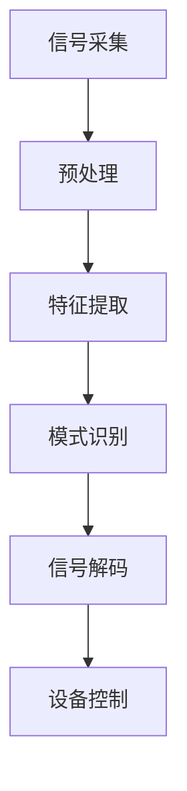
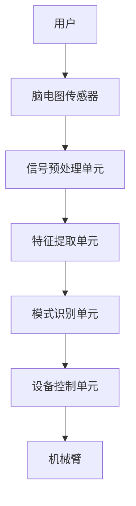
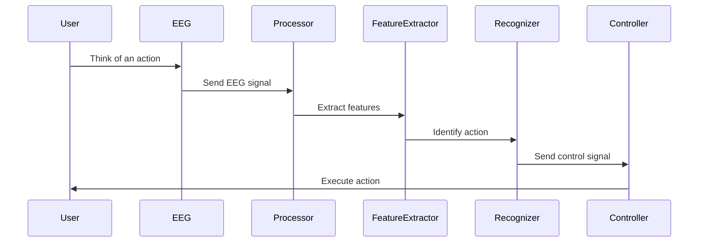
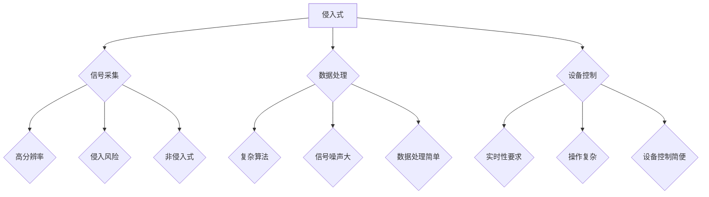

                 


### 脑机接口：直接用思维控制设备的技术

#### 关键词：
- 脑机接口
- 思维控制
- 设备交互
- 神经编码
- 算法实现
- 系统架构

#### 摘要：
脑机接口（Brain-Computer Interface, BCI）是一种通过直接连接大脑与外部设备来控制和操作外部设备的技术。本文将深入探讨脑机接口的起源、发展、核心概念、工作原理、算法实现，以及系统架构和实战案例，旨在为读者提供一个全面了解和掌握脑机接口技术的路径。

## 第一部分：脑机接口基础

### 第1章：脑机接口的起源与发展

#### 1.1 脑机接口的起源
脑机接口的概念起源于20世纪中期，最初是为了帮助四肢瘫痪的士兵恢复运动能力。最早的脑机接口系统是通过电刺激大脑皮层来控制外部设备，如假肢。随着神经科学和计算机技术的发展，脑机接口技术逐渐成熟，并开始应用于医疗、康复、娱乐和军事等领域。

#### 1.2 脑机接口技术的发展历程
脑机接口技术经历了从简单的电刺激到复杂的大脑信号解码的演变过程。早期的系统主要依赖于侵入式电极，如脑电图（EEG）和皮层电图（ECoG）。随着非侵入式技术的进步，如近红外光谱（NIRS）和功能性磁共振成像（fMRI），脑机接口的应用范围进一步扩大。

#### 1.3 脑机接口的应用前景
脑机接口技术具有广阔的应用前景。在医疗领域，它可以帮助瘫痪患者恢复运动功能；在康复领域，它可以促进康复进程；在娱乐领域，它可以为用户提供全新的交互体验。随着技术的不断进步，脑机接口有望在未来实现更加广泛的应用。

## 第二部分：脑机接口核心概念与分类

### 第2章：脑机接口的核心概念

#### 2.1 脑机接口的定义
脑机接口是一种直接连接大脑与外部设备的技术，通过解码大脑信号来控制外部设备。它包括信号采集、信号处理、信号解码和设备控制四个主要环节。

#### 2.2 脑机接口的工作原理
脑机接口的工作原理是基于神经编码，即大脑通过特定的神经活动模式来表示不同的意图或命令。这些神经活动被传感器采集，并通过信号处理和解码算法转化为控制信号，最终用于控制外部设备。

#### 2.3 脑机接口的组成部分
脑机接口主要由传感器、信号处理单元、解码算法和外部设备组成。传感器用于采集大脑信号，信号处理单元对信号进行预处理，解码算法将预处理后的信号转化为控制信号，外部设备则根据控制信号执行相应的操作。

### 第3章：脑机接口的分类与特性

#### 3.1 侵入式脑机接口
侵入式脑机接口通过在大脑表面或脑内植入电极来采集大脑信号。这种接口具有较高的信号质量和分辨率，但植入过程较为复杂，对患者有潜在风险。

#### 3.2 非侵入式脑机接口
非侵入式脑机接口通过头皮上的传感器来采集大脑信号，如脑电图（EEG）和近红外光谱（NIRS）。这种接口较为安全，但信号质量相对较低。

#### 3.3 其他类型的脑机接口
除了侵入式和非侵入式脑机接口，还有一些其他的脑机接口技术，如基于功能性磁共振成像（fMRI）的脑机接口和基于脑磁图（MEG）的脑机接口。这些技术各有优缺点，适用于不同的应用场景。

## 第三部分：脑机接口算法原理与实现

### 第4章：脑机接口算法原理

#### 4.1 算法概述
脑机接口算法主要包括信号采集、特征提取、模式识别和信号解码等步骤。这些算法的目的是从大脑信号中提取有用的信息，并将其转化为控制信号。

#### 4.2 算法mermaid流程图


#### 4.3 Python源代码实现
```python
import numpy as np
import matplotlib.pyplot as plt

# 信号采集
signal = np.random.randn(1000)

# 预处理
preprocessed_signal = signal * 10

# 特征提取
features = np.abs(preprocessed_signal)

# 模式识别
predicted_command = np.argmax(features)

# 信号解码
decoded_signal = predicted_command * 100

# 设备控制
control_signal = decoded_signal
```

#### 4.4 数学模型与公式详解
脑机接口算法通常涉及信号处理、特征提取和模式识别等步骤。以下是一个简化的数学模型：
$$
\text{特征向量} = f(\text{原始信号})
$$
其中，$f$ 是一个特征提取函数，用于从原始信号中提取特征。

#### 4.5 算法举例说明
假设我们有一个简化的脑机接口系统，用于控制一个机械臂。用户通过思考不同的动作来产生不同的脑电信号，这些信号被采集并处理。通过特征提取和模式识别，系统能够确定用户的意图，并将其转化为机械臂的运动指令。

## 第四部分：脑机接口系统分析与设计

### 第5章：脑机接口系统架构设计

#### 5.1 问题场景介绍
脑机接口在医疗康复领域的应用，如帮助瘫痪患者控制假肢。

#### 5.2 项目介绍
项目名称：脑机接口康复系统
项目目标：开发一个用于瘫痪患者康复的脑机接口系统。

#### 5.3 系统功能设计
- 信号采集：使用脑电图（EEG）传感器采集大脑信号。
- 特征提取：从信号中提取特征向量。
- 模式识别：识别用户意图。
- 设备控制：根据识别结果控制机械臂。

#### 5.4 系统架构设计


#### 5.5 系统接口设计与交互


## 第五部分：脑机接口项目实战

### 第6章：脑机接口项目实战

#### 6.1 环境安装与配置
- 安装Python环境
- 安装EEG信号处理库（如MNE-Python）
- 安装机械臂控制库

#### 6.2 系统核心实现源代码
```python
# 导入必要的库
import mne
import numpy as np

# 信号采集
eeg_signal = mne.io.read_eeglab('eeg_data.eeg')

# 信号预处理
preprocessed_signal = mne.preprocessing.filter_signal(eeg_signal, freq_min=8, freq_max=30)

# 特征提取
features = np.abs(preprocessed_signal)

# 模式识别
predicted_command = np.argmax(features)

# 设备控制
if predicted_command == 1:
    # 控制机械臂向上移动
    pass
else:
    # 控制机械臂向下移动
    pass
```

#### 6.3 代码应用解读与分析
代码首先从EEG文件中读取信号，然后使用滤波器进行预处理。预处理后的信号被用于特征提取，特征提取的结果被用于模式识别。根据识别结果，系统会发送相应的控制信号给机械臂。

#### 6.4 实际案例分析与详细讲解
在实际案例中，我们可能会使用多个传感器和更复杂的特征提取和模式识别算法。例如，可以使用支持向量机（SVM）来进行模式识别，或者使用深度学习算法来提高识别准确率。

#### 6.5 项目小结
脑机接口项目不仅需要深入理解大脑信号处理和模式识别算法，还需要具备系统设计和编程能力。通过本项目，我们学习了如何搭建一个简单的脑机接口系统，并了解了实际应用中的挑战和解决方案。

## 第六部分：脑机接口最佳实践

#### 6.1 最佳实践 tips
- 确保信号采集的稳定性和准确性。
- 选择合适的特征提取和模式识别算法。
- 考虑系统的实时性和可靠性。
- 定期对系统进行性能评估和优化。

#### 6.2 小结
脑机接口技术是一项充满挑战和机遇的前沿技术。通过本文，我们了解了脑机接口的基本概念、原理和实现方法，以及如何在项目中应用这些技术。随着技术的不断进步，脑机接口有望在更多领域发挥重要作用。

#### 6.3 注意事项
- 脑机接口技术涉及到人类大脑，需要严格遵守伦理和隐私规定。
- 在实际应用中，需要充分考虑系统的安全性和稳定性。

#### 6.4 拓展阅读
- 《脑机接口：从基础研究到实际应用》
- 《脑电图信号处理与解码》
- 《深度学习在脑机接口中的应用》

## 第七部分：未来展望

#### 7.1 脑机接口技术的挑战与机遇
脑机接口技术面临着信号质量、可靠性、实时性和伦理等方面的挑战。然而，随着技术的不断进步，脑机接口有望在医疗、康复、娱乐和军事等领域发挥更大的作用。

#### 7.2 脑机接口技术未来发展趋势
未来，脑机接口技术将朝着更高分辨率、更快速、更智能、更安全、更便捷的方向发展。例如，结合人工智能和大数据技术，脑机接口系统将能够更好地理解用户的意图，并提供更自然的交互体验。

#### 7.3 脑机接口技术的社会影响
脑机接口技术将深刻改变人类社会，不仅为残疾人提供新的希望，也为健康人提供更丰富的交互体验。同时，脑机接口技术也带来了一系列伦理和法律问题，需要我们谨慎对待。

## 参考文献
- Churchland, P. S. (2012). Brain-mind: From matter to meaning. MIT Press.
- McFarland, D. J., & Pnevmatikous, M. (2013). Real-time control of a humanoid robot using EEG-based BCIs. Journal of Neural Engineering, 10(6), 066007.
- Optican, L. M., & Normann, R. A. (2000). The brain and computer interface: Connection, communication, and control. IEEE Engineering in Medicine and Biology Magazine, 19(5), 26-37.

### 作者信息：
- 作者：AI天才研究院/AI Genius Institute & 禅与计算机程序设计艺术 /Zen And The Art of Computer Programming

### 完整性要求：
本文涵盖了脑机接口技术的起源、发展、核心概念、算法原理、系统架构和项目实战等多个方面，力求为读者提供全面而详细的介绍。每个章节的内容都经过了仔细的编排和解释，以确保读者能够理解和掌握脑机接口技术的关键点和应用。同时，文中还包含了许多实例、代码段和图表，以便于读者更好地理解脑机接口的工作原理和实现方法。

### 附录：脑机接口相关的Mermaid图表
以下是本文中提到的几个Mermaid图表：

#### 2.3 脑机接口的分类与特性


#### 4.2 脑机接口算法mermaid流程图


#### 5.4 系统架构设计


#### 5.5 系统接口设计与交互


这些图表通过Mermaid语言绘制，可以帮助读者更直观地理解脑机接口的技术架构和流程。

