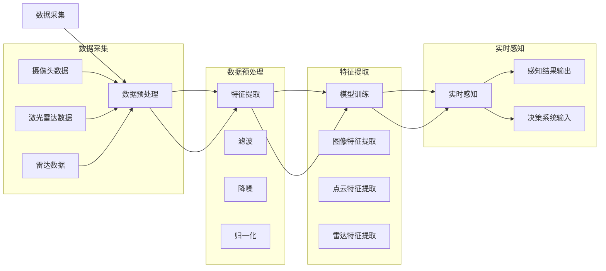
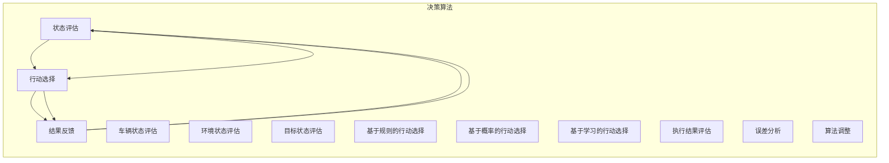
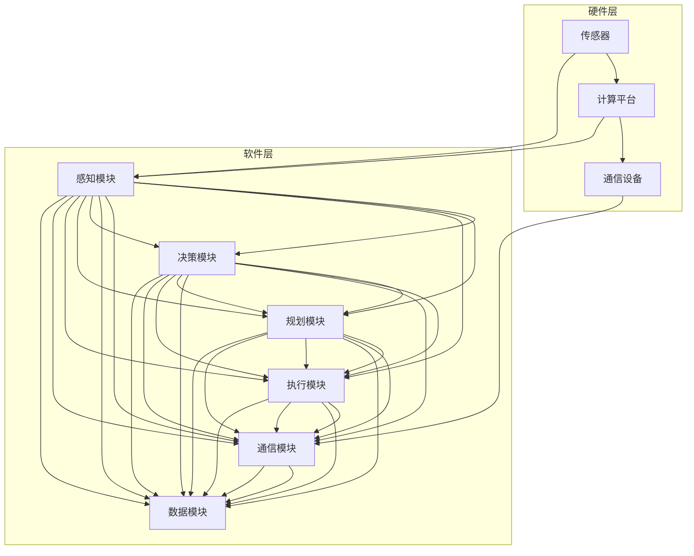
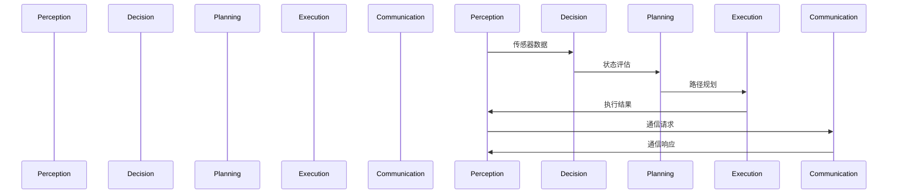

                 

## 第一部分: 背景介绍

### 第1章: 自动驾驶与AI大模型概述

#### 1.1 自动驾驶的背景和挑战

##### 1.1.1 自动驾驶的定义与发展历程

自动驾驶技术，是指通过计算机算法和电子控制系统，使车辆能够自动完成行驶任务的智能技术。它的定义可以从不同的角度来理解：从技术层面，自动驾驶涉及传感器、控制算法、车辆动力学等多个领域；从应用层面，自动驾驶可以降低人为驾驶的疲劳和风险，提高交通效率。

自动驾驶技术的发展历程可以追溯到20世纪50年代。当时，科学家们开始研究自动驾驶的概念。随着计算机技术和传感器技术的进步，自动驾驶技术逐渐从实验室走向实际应用。1958年，美国科学家约翰·莫菲（John O. Morley）展示了世界上第一辆自动驾驶车。1990年代，随着互联网和计算机技术的迅猛发展，自动驾驶技术开始进入快速发展期。2000年后，谷歌等科技巨头开始投入大量资源进行自动驾驶技术的研发。

##### 1.1.2 自动驾驶的关键技术

自动驾驶技术的实现离不开以下几个关键技术的支持：

1. **传感器技术**：传感器是自动驾驶汽车的“眼睛”和“耳朵”，用于收集车辆周围的环境信息。常见的传感器包括雷达、激光雷达（LiDAR）、摄像头、超声波传感器等。

2. **控制算法**：自动驾驶系统需要依靠先进的控制算法来处理传感器数据，并进行决策。控制算法的核心是路径规划和控制，即确定车辆如何行驶以及如何保持稳定。

3. **通信技术**：V2X（Vehicle-to-Everything）通信技术是自动驾驶的重要支撑。通过车与车、车与路、车与人的通信，可以实现更高效、更安全的交通管理。

4. **大数据与人工智能**：自动驾驶系统需要处理海量数据，并进行实时分析。人工智能技术，特别是深度学习和强化学习，可以大大提高自动驾驶系统的智能化水平。

##### 1.1.3 自动驾驶面临的挑战

尽管自动驾驶技术已经取得了显著进展，但仍然面临着许多挑战：

1. **技术挑战**：自动驾驶系统需要处理复杂多变的环境，包括不同天气、路况和交通场景。目前，如何提高自动驾驶系统的鲁棒性和适应性，仍然是亟待解决的问题。

2. **法律与伦理问题**：自动驾驶技术涉及到许多法律和伦理问题，如责任归属、隐私保护等。需要制定相应的法规和标准来规范自动驾驶技术的发展和应用。

3. **市场接受度**：消费者对于自动驾驶技术的接受程度也是一个挑战。如何消除消费者的担忧，提高市场接受度，是自动驾驶技术商业化的重要一环。

#### 1.2 AI大模型的核心概念与特点

##### 1.2.1 AI大模型的基础概念

AI大模型，通常指的是拥有数百万亿参数的神经网络模型。这些模型可以处理海量数据，并进行复杂的数据分析和模式识别。AI大模型的核心是深度学习技术，特别是神经网络。神经网络通过层层处理输入数据，逐层提取特征，最终输出结果。

##### 1.2.2 AI大模型的技术特点

1. **规模庞大**：AI大模型的参数数量通常在数百万到数十亿级别，这使得它们能够处理和存储大量数据。

2. **自适应性强**：AI大模型可以根据训练数据自动调整参数，从而提高模型的准确性和泛化能力。

3. **高效性**：通过并行计算和分布式处理，AI大模型可以在短时间内完成复杂的计算任务。

4. **强适应性**：AI大模型可以应用于多种场景，包括图像识别、自然语言处理、语音识别等。

##### 1.2.3 AI大模型与传统AI的区别

传统AI主要依赖于规则和符号推理，而AI大模型则依赖于数据和深度学习。传统AI在处理特定问题时表现优秀，但难以适应复杂多变的场景。相比之下，AI大模型具有更强的自适应性和泛化能力，能够处理更复杂的任务。

#### 1.3 AI大模型在自动驾驶中的应用场景

##### 1.3.1 感知与感知融合

在自动驾驶中，感知是至关重要的环节。AI大模型可以通过深度学习算法，从传感器数据中提取有用的信息，实现对周围环境的准确感知。例如，通过摄像头和激光雷达数据，AI大模型可以识别道路标志、行人和其他车辆，并判断它们的运动状态。

感知融合是指将多个传感器的数据融合起来，以提高感知的准确性和鲁棒性。AI大模型可以通过融合不同传感器的数据，克服单一传感器的局限性，提高自动驾驶系统的感知能力。

##### 1.3.2 雷达和激光雷达数据处理

雷达和激光雷达是自动驾驶系统中常用的传感器。雷达可以发射电磁波，并通过接收反射回来的信号来测量距离。激光雷达则使用激光束来扫描周围环境，生成高精度的三维点云数据。

AI大模型可以处理雷达和激光雷达数据，提取有用的特征信息。例如，通过分析雷达信号，AI大模型可以识别车辆的速度和位置。通过分析激光雷达点云数据，AI大模型可以构建周围环境的3D模型。

##### 1.3.3 高精度地图构建与定位

高精度地图是自动驾驶系统的核心组成部分。它包含了道路的几何形状、车道线、交通标志、红绿灯位置等信息。自动驾驶系统需要通过高精度地图来进行定位和路径规划。

AI大模型可以用于构建高精度地图。通过分析大量的传感器数据和GPS数据，AI大模型可以识别道路特征，并生成精确的地图信息。此外，AI大模型还可以用于实时更新地图信息，以应对交通状况的变化。

#### 1.4 跨领域合作与挑战

自动驾驶与AI大模型的融合，需要跨领域合作。这包括计算机科学、电子工程、机械工程、交通运输等多个领域。跨领域合作的关键技术包括：

1. **数据融合与处理**：自动驾驶系统需要处理来自不同传感器的海量数据。如何高效地融合和处理这些数据，是跨领域合作的重要挑战。

2. **实时性与稳定性**：自动驾驶系统需要在复杂的交通环境中保持稳定运行。这要求AI大模型具有高效的实时处理能力和强的鲁棒性。

3. **安全性与可靠性**：自动驾驶系统的安全性和可靠性至关重要。跨领域合作需要建立严格的安全标准和测试方法，确保系统的稳定性和可靠性。

未来，随着技术的不断进步和跨领域合作的深入，自动驾驶与AI大模型将迎来更多的发展机遇和挑战。

#### 1.5 本章小结

本章介绍了自动驾驶与AI大模型的基本概念、关键技术、应用场景以及跨领域合作。自动驾驶技术的发展离不开AI大模型的支持，而AI大模型的应用也为自动驾驶带来了新的机遇和挑战。通过本章的介绍，读者可以初步了解自动驾驶与AI大模型的核心内容和发展趋势。

---

### 第2章: 自动驾驶与AI大模型的核心概念

#### 2.1 自动驾驶系统架构与AI大模型融合

##### 2.1.1 自动驾驶系统架构概述

自动驾驶系统通常由多个子系统组成，包括感知、决策、规划和执行等。其中，感知系统负责获取车辆周围环境的信息，决策系统负责分析感知数据并作出驾驶决策，规划系统负责制定车辆的行驶路径，执行系统负责执行决策和规划。

自动驾驶系统架构可以分为以下几个层次：

1. **感知层**：包括摄像头、激光雷达、雷达等传感器，用于获取车辆周围环境的信息。
2. **数据处理层**：包括数据预处理、特征提取等模块，用于处理传感器数据并提取有用的信息。
3. **决策层**：包括决策模块，用于分析感知数据并制定驾驶策略。
4. **规划层**：包括路径规划模块，用于制定车辆的行驶路径。
5. **执行层**：包括执行模块，用于执行驾驶决策和路径规划。

##### 2.1.2 AI大模型在系统架构中的角色

AI大模型在自动驾驶系统中扮演着至关重要的角色。具体来说，AI大模型可以应用于以下几个关键环节：

1. **感知层**：AI大模型可以用于处理传感器数据，提取环境特征，实现对周围环境的准确感知。
2. **数据处理层**：AI大模型可以用于数据预处理、特征提取等操作，提高数据的质量和效率。
3. **决策层**：AI大模型可以用于决策模块，分析感知数据并作出驾驶决策。
4. **规划层**：AI大模型可以用于路径规划模块，制定车辆的行驶路径。
5. **执行层**：AI大模型可以用于执行模块，执行驾驶决策和路径规划。

##### 2.1.3 系统架构中AI大模型的关键模块

在自动驾驶系统架构中，AI大模型的关键模块包括：

1. **感知模块**：用于处理传感器数据，提取环境特征，实现对周围环境的感知。
2. **数据处理模块**：用于对传感器数据进行预处理、特征提取等操作，提高数据的质量和效率。
3. **决策模块**：用于分析感知数据，制定驾驶策略。
4. **规划模块**：用于制定车辆的行驶路径。
5. **执行模块**：用于执行驾驶决策和路径规划。

#### 2.2 自动驾驶与AI大模型的关键技术

##### 2.2.1 感知技术

感知是自动驾驶系统的核心环节，其关键在于如何准确、实时地获取和处理车辆周围环境的信息。AI大模型在感知技术中扮演着重要角色，通过深度学习算法，可以从大量的传感器数据中提取有用的特征信息。具体关键技术包括：

1. **多传感器数据融合**：自动驾驶系统通常配备多种传感器，如摄像头、激光雷达、雷达等。通过AI大模型，可以融合不同传感器的数据，提高感知的准确性和鲁棒性。
2. **目标检测与跟踪**：AI大模型可以用于识别道路上的各种目标，如行人、车辆、交通标志等，并对其进行实时跟踪。
3. **场景理解**：AI大模型可以通过分析传感器数据，理解当前的场景和交通状况，为后续的决策提供支持。

##### 2.2.2 识别与决策技术

识别与决策是自动驾驶系统的关键环节。AI大模型在这一环节中可以发挥重要作用，通过深度学习算法，可以从感知数据中提取特征信息，并进行分类和决策。具体关键技术包括：

1. **物体识别**：AI大模型可以用于识别道路上的各种物体，如行人、车辆、交通标志等。
2. **行为预测**：AI大模型可以通过分析感知数据，预测目标的行为，为后续的决策提供依据。
3. **决策算法**：AI大模型可以用于实现各种决策算法，如基于规则的方法、基于概率的方法、基于学习的深度学习方法等。

##### 2.2.3 控制与执行技术

控制与执行是自动驾驶系统的最后一个环节，其关键在于如何根据决策结果，控制车辆的运动。AI大模型在这一环节中可以发挥重要作用，通过深度学习算法，可以实现复杂的控制算法和执行策略。具体关键技术包括：

1. **路径规划**：AI大模型可以用于制定车辆的行驶路径，包括避障、转弯、加速等。
2. **运动控制**：AI大模型可以用于控制车辆的运动，包括转向、加速、制动等。
3. **执行策略**：AI大模型可以用于制定车辆的执行策略，确保车辆的安全和稳定性。

#### 2.3 自动驾驶与AI大模型的概念属性特征对比表格

以下是一个关于自动驾驶与AI大模型的概念属性特征的对比表格：

| 特征         | 自动驾驶         | AI大模型           |
| ------------ | ---------------- | ------------------- |
| 目的         | 实现自主驾驶     | 提高智能决策能力   |
| 关键技术     | 感知、决策、执行 | 深度学习、数据融合 |
| 应用场景     | 交通领域         | 多领域             |
| 数据依赖性   | 高             | 高                 |
| 自适应能力   | 较高           | 极高               |
| 实时性要求   | 高             | 高                 |
| 安全性要求   | 高             | 高                 |

#### 2.4 自动驾驶与AI大模型的ER实体关系图

以下是自动驾驶与AI大模型的ER实体关系图：

```mermaid
erDiagram
    AI大模型 ||--|{ 感知模块 }
    AI大模型 ||--|{ 决策模块 }
    AI大模型 ||--|{ 规划模块 }
    AI大模型 ||--|{ 执行模块 }
    感知模块 ||--|{ 传感器数据 }
    决策模块 ||--|{ 决策结果 }
    规划模块 ||--|{ 行驶路径 }
    执行模块 ||--|{ 执行命令 }
```

#### 2.5 本章小结

本章详细介绍了自动驾驶与AI大模型的核心概念和关键技术，包括系统架构、感知技术、识别与决策技术、控制与执行技术，并通过ER实体关系图展示了自动驾驶与AI大模型之间的联系。通过本章的学习，读者可以更深入地理解自动驾驶与AI大模型的工作原理和应用场景。

---

### 第3章: 自动驾驶感知算法原理

#### 3.1 感知算法的基本概念

##### 3.1.1 感知算法的定义

感知算法是指自动驾驶系统通过传感器获取环境信息，并对这些信息进行分析和处理，以理解周围环境的技术。感知是自动驾驶系统的核心环节，是实现自动驾驶的基础。

##### 3.1.2 感知算法的分类

感知算法可以按照不同的分类标准进行划分，以下是几种常见的分类方法：

1. **按照传感器类型**：可分为摄像头感知算法、激光雷达感知算法、雷达感知算法等。
2. **按照处理层次**：可分为低层次感知算法、中层次感知算法和高层次感知算法。
3. **按照应用场景**：可分为城市道路感知算法、高速公路感知算法、特殊场景感知算法等。

#### 3.2 感知算法的工作流程

感知算法的工作流程通常包括以下几个步骤：

1. **数据采集**：通过摄像头、激光雷达、雷达等传感器收集车辆周围的环境信息。
2. **数据预处理**：对采集到的传感器数据进行滤波、降噪等处理，以提高数据的质量。
3. **特征提取**：从预处理后的数据中提取有助于描述周围环境特征的数值或符号信息。
4. **模型训练**：使用大量标注数据进行模型训练，以提高感知算法的准确性。
5. **实时感知**：在车辆运行过程中，实时感知周围环境，为决策系统提供输入。

#### 3.2.1 数据采集

数据采集是感知算法的第一步，也是关键的一步。传感器种类繁多，包括摄像头、激光雷达、雷达、超声波传感器等。每种传感器都有其独特的优势和局限性。

- **摄像头**：摄像头适用于捕捉彩色图像，适用于识别颜色、形状等特征，但受光照和天气条件影响较大。
- **激光雷达（LiDAR）**：激光雷达通过发射激光束并接收反射信号来获取三维点云数据，适用于精确测量距离和构建环境模型，但成本较高。
- **雷达**：雷达通过发射无线电波并接收反射信号来检测物体的位置和速度，适用于夜间和雨雾等低能见度环境，但无法获取物体的外观特征。
- **超声波传感器**：超声波传感器通过发射超声波并接收反射信号来测量距离，适用于近距离感知，但精度较低。

在数据采集过程中，需要考虑传感器的安装位置、覆盖范围和频率等因素，以确保采集到的数据能够全面、准确地反映周围环境。

#### 3.2.2 数据预处理

数据预处理是感知算法的第二步，其目的是提高数据的质量，减少噪声，以便更好地进行特征提取和模型训练。

- **滤波**：滤波是数据预处理的重要步骤，用于去除传感器数据中的噪声。常见的滤波方法包括均值滤波、中值滤波和高斯滤波等。
- **降噪**：降噪是减少数据中随机噪声的过程。对于图像数据，常用的降噪方法包括去噪网络、小波变换等；对于点云数据，常用的降噪方法包括基于密度的滤波、基于采样的滤波等。
- **归一化**：归一化是将数据转换到统一尺度，以消除不同传感器和不同场景之间的差异。常见的归一化方法包括最小-最大归一化、标准归一化等。

通过数据预处理，可以显著提高感知算法的准确性和鲁棒性。

#### 3.2.3 特征提取

特征提取是感知算法的核心步骤，其目的是从预处理后的数据中提取有助于描述周围环境特征的数值或符号信息。特征提取的质量直接影响到感知算法的性能。

- **图像特征提取**：对于摄像头采集的图像数据，常用的特征提取方法包括边缘检测、角点检测、纹理分析等。此外，还可以使用深度学习方法提取高维特征，如卷积神经网络（CNN）。
- **点云特征提取**：对于激光雷达采集的点云数据，常用的特征提取方法包括三维空间特征、形状特征、纹理特征等。此外，还可以使用深度学习方法提取高维特征。
- **雷达特征提取**：对于雷达采集的信号数据，常用的特征提取方法包括频域特征、时域特征、空间特征等。

特征提取的质量直接影响到感知算法的准确性和效率。

#### 3.2.4 模型训练

模型训练是感知算法的关键步骤，其目的是通过大量标注数据，调整模型参数，以提高模型的准确性和泛化能力。训练过程通常包括以下步骤：

1. **数据集划分**：将标注数据集划分为训练集、验证集和测试集，用于模型训练、验证和测试。
2. **模型构建**：根据感知任务的需求，构建合适的感知模型。常见的感知模型包括卷积神经网络（CNN）、循环神经网络（RNN）、生成对抗网络（GAN）等。
3. **模型训练**：使用训练集数据，通过反向传播算法，不断调整模型参数，优化模型性能。
4. **模型验证**：使用验证集数据，评估模型性能，调整模型参数，以提高模型泛化能力。
5. **模型测试**：使用测试集数据，测试模型在未知数据上的表现，确保模型性能稳定。

通过模型训练，可以显著提高感知算法的准确性和鲁棒性。

#### 3.3 自动驾驶感知算法的mermaid流程图

以下是自动驾驶感知算法的mermaid流程图：



#### 3.4 自动驾驶感知算法的数学模型和公式

自动驾驶感知算法的数学模型和公式如下：

$$
\text{感知算法模型} = f(\text{输入数据}, \text{模型参数})
$$

其中，输入数据包括传感器采集的环境信息，模型参数包括感知算法中使用的各种权重和偏置。感知算法模型通过输入数据和模型参数，输出感知结果。

#### 3.5 自动驾驶感知算法举例说明

##### 3.5.1 简单的感知算法案例

假设我们使用摄像头采集车辆周围环境的图像，并使用卷积神经网络（CNN）进行图像特征提取。具体的感知算法流程如下：

1. **数据采集**：使用摄像头采集车辆周围环境的图像。
2. **数据预处理**：对图像进行滤波、降噪和归一化处理。
3. **特征提取**：使用卷积神经网络提取图像特征。
4. **模型训练**：使用大量标注图像数据进行模型训练。
5. **实时感知**：在车辆运行过程中，实时感知周围环境。

##### 3.5.2 复杂的感知算法案例

假设我们使用激光雷达采集车辆周围环境的三维点云数据，并使用点云神经网络（PointNet）进行点云特征提取。具体的感知算法流程如下：

1. **数据采集**：使用激光雷达采集车辆周围环境的三维点云数据。
2. **数据预处理**：对点云数据进行降噪和滤波处理。
3. **特征提取**：使用点云神经网络提取点云特征。
4. **模型训练**：使用大量标注点云数据进行模型训练。
5. **实时感知**：在车辆运行过程中，实时感知周围环境。

通过以上案例，我们可以看到，自动驾驶感知算法可以根据不同的应用场景和传感器类型，选择合适的算法和模型，实现高效的感知。

#### 3.6 本章小结

本章详细介绍了自动驾驶感知算法的基本概念、工作流程、数学模型和公式，并通过简单和复杂的案例进行了举例说明。通过本章的学习，读者可以深入了解自动驾驶感知算法的原理和应用。

---

### 第4章: 自动驾驶决策算法原理

#### 4.1 决策算法的基本概念

##### 4.1.1 决策算法的定义

决策算法是自动驾驶系统中的核心组成部分，用于处理感知系统收集的环境信息，并作出合理的驾驶决策。决策算法的基本目标是根据当前车辆所处的环境和目标，选择最优的驾驶行为。

##### 4.1.2 决策算法的分类

决策算法可以根据不同的分类标准进行划分。以下是几种常见的分类方法：

1. **基于规则的决策算法**：基于规则的决策算法通过定义一系列规则，根据当前环境信息进行决策。这种算法的优点是实现简单，缺点是难以适应复杂和动态的环境。
2. **基于概率的决策算法**：基于概率的决策算法通过计算当前环境信息的概率分布，选择最有可能的驾驶行为。这种算法的优点是适用于不确定环境，缺点是计算复杂度高。
3. **基于学习的决策算法**：基于学习的决策算法通过机器学习技术，从大量历史数据中学习驾驶策略。这种算法的优点是适应性强，缺点是需要大量训练数据和较长的训练时间。

#### 4.2 决策算法的工作流程

决策算法的工作流程通常包括以下几个步骤：

1. **状态评估**：根据感知系统收集的环境信息，评估当前车辆所处的状态。状态评估包括对车辆的位置、速度、周围障碍物等信息进行量化。
2. **行动选择**：在当前状态下，根据预定义的决策规则或学习到的策略，选择最优的驾驶行动。行动选择可以是基于规则、概率或学习的方法。
3. **结果反馈**：执行所选行动后，评估行动结果，并更新车辆的状态。结果反馈用于调整决策算法，提高决策的准确性。

#### 4.2.1 状态评估

状态评估是决策算法的第一步，其目标是准确描述当前车辆所处的状态。状态评估通常涉及以下几个方面的信息：

1. **车辆状态**：包括车辆的位置、速度、加速度等。
2. **环境状态**：包括周围车辆、行人、道路标志、车道线等。
3. **目标状态**：包括车辆的行驶目标，如到达某个目的地、避开障碍物等。

通过状态评估，可以建立一个对当前环境状况的全面描述，为后续的决策提供依据。

##### 4.2.2 行动选择

行动选择是决策算法的核心环节，其目标是根据当前状态选择最优的驾驶行动。行动选择的方法包括：

1. **基于规则的行动选择**：根据预定义的规则，选择相应的行动。例如，当车辆接近红绿灯时，根据交通规则选择停车或行驶。
2. **基于概率的行动选择**：通过计算不同行动的概率分布，选择最有可能成功的行动。例如，通过分析周围车辆的速度和位置，选择一个最安全的行驶速度。
3. **基于学习的行动选择**：通过机器学习算法，从历史数据中学习最优的行动策略。例如，使用强化学习算法，根据车辆在历史上的行为，选择最优的驾驶策略。

#### 4.2.3 结果反馈

结果反馈是决策算法的最后一个环节，其目标是根据执行结果调整决策算法，提高决策的准确性。结果反馈通常包括以下几个方面的信息：

1. **执行结果**：包括行动执行后的实际状态，如车辆到达目的地、避开障碍物等。
2. **误差分析**：分析决策结果与预期目标的差距，识别决策过程中的错误和不足。
3. **算法调整**：根据结果反馈，调整决策算法的参数，提高决策的准确性。

#### 4.3 自动驾驶决策算法的mermaid流程图

以下是自动驾驶决策算法的mermaid流程图：



#### 4.4 自动驾驶决策算法的数学模型和公式

自动驾驶决策算法的数学模型和公式如下：

$$
\text{决策算法模型} = g(\text{当前状态}, \text{决策参数})
$$

其中，当前状态包括车辆状态、环境状态和目标状态，决策参数包括决策算法的权重和阈值。决策算法模型通过当前状态和决策参数，输出最优的驾驶行动。

#### 4.5 自动驾驶决策算法举例说明

##### 4.5.1 简单的决策算法案例

假设我们使用基于规则的决策算法，根据当前红绿灯状态和交通情况，选择最优的行驶行动。具体的决策流程如下：

1. **状态评估**：评估当前红绿灯状态（红灯、绿灯）和交通情况（拥堵、畅通）。
2. **行动选择**：
   - 如果红绿灯为红灯，且交通拥堵，选择停车等待。
   - 如果红绿灯为绿灯，且交通畅通，选择行驶。
   - 如果红绿灯为黄灯，选择减速通过。
3. **结果反馈**：根据实际行驶结果，评估决策的准确性，并调整决策规则。

##### 4.5.2 复杂的决策算法案例

假设我们使用基于学习的决策算法，通过强化学习算法，从大量历史数据中学习最优的行驶策略。具体的决策流程如下：

1. **状态评估**：评估当前车辆所处的状态，包括位置、速度、周围车辆等信息。
2. **行动选择**：使用强化学习算法，根据当前状态选择最优的驾驶行动，如加速、减速、转向等。
3. **结果反馈**：根据实际行驶结果，更新状态价值和策略，提高决策的准确性。

通过以上案例，我们可以看到，自动驾驶决策算法可以根据不同的需求和应用场景，选择合适的算法和方法，实现高效的决策。

#### 4.6 本章小结

本章详细介绍了自动驾驶决策算法的基本概念、工作流程、数学模型和公式，并通过简单和复杂的案例进行了举例说明。通过本章的学习，读者可以深入了解自动驾驶决策算法的原理和应用。

---

### 第5章: 自动驾驶系统架构设计与实现

#### 5.1 问题场景介绍

自动驾驶系统作为智能交通系统的重要组成部分，其设计的目标是在保证安全性的同时，提高交通效率和舒适度。具体问题场景如下：

1. **城市道路**：在城市道路环境中，自动驾驶系统需要应对复杂的交通状况，包括不同类型的道路、行人、自行车、其他车辆等。
2. **高速公路**：在高速公路环境中，自动驾驶系统需要保持高速行驶，同时应对变道、超车等操作。
3. **特殊场景**：如雨雪天气、夜间行驶等特殊场景，对自动驾驶系统的感知和决策能力提出了更高的要求。

#### 5.1.1 自动驾驶系统需求分析

为了满足上述问题场景的需求，自动驾驶系统需要具备以下功能：

1. **感知功能**：通过摄像头、激光雷达、雷达等传感器，实时感知车辆周围环境，识别道路标志、行人和其他车辆。
2. **决策功能**：根据感知数据，自动驾驶系统需要实时做出驾驶决策，包括路径规划、速度控制、转向等。
3. **规划功能**：自动驾驶系统需要根据目标目的地，规划最优行驶路径。
4. **执行功能**：根据决策和规划结果，控制车辆的行驶行为。
5. **通信功能**：自动驾驶系统需要与其他车辆、道路设施进行通信，实现信息共享和协同驾驶。

#### 5.1.2 系统目标与功能

系统目标是在保证安全的前提下，提高交通效率和舒适度。具体功能包括：

1. **自动泊车**：实现自动泊车功能，提高停车效率。
2. **自动跟车**：在高速公路上实现自动跟车，减少驾驶员疲劳。
3. **智能路径规划**：根据交通状况，规划最优行驶路径。
4. **实时交通监控**：实时监控车辆周围交通状况，确保行驶安全。
5. **多模式切换**：支持城市道路、高速公路等多种驾驶模式的切换。

#### 5.2 系统功能设计

##### 5.2.1 领域模型Mermaid类图

系统功能设计的核心是构建领域模型，以描述系统的各个功能模块及其之间的关系。以下是一个简单的Mermaid类图，用于描述自动驾驶系统的功能模块：

```mermaid
classDiagram
    class 感知模块 {
        - 摄像头
        - 激光雷达
        - 雷达
        - 数据预处理
        - 特征提取
    }
    class 决策模块 {
        - 状态评估
        - 行动选择
        - 结果反馈
    }
    class 规划模块 {
        - 路径规划
        - 目标定位
    }
    class 执行模块 {
        - 控制算法
        - 运动控制
    }
    class 通信模块 {
        - 车辆通信
        - 道路通信
    }
    感知模块 --|{ 数据流 }--> 决策模块
    决策模块 --|{ 数据流 }--> 规划模块
    规划模块 --|{ 数据流 }--> 执行模块
    执行模块 --|{ 数据流 }--> 感知模块
    通信模块 --|{ 数据流 }--> 所有模块
```

##### 5.2.2 系统功能模块划分

根据领域模型，自动驾驶系统可以划分为以下几个功能模块：

1. **感知模块**：负责收集和处理来自摄像头、激光雷达、雷达等传感器的数据，提取环境特征。
2. **决策模块**：根据感知模块提供的环境特征，评估当前状态，选择最优的行动。
3. **规划模块**：根据决策模块提供的决策结果，规划车辆的行驶路径。
4. **执行模块**：根据规划模块提供的路径和决策模块提供的行动，控制车辆的行驶行为。
5. **通信模块**：实现车辆与其他车辆、道路设施的通信，共享交通信息。

#### 5.3 系统架构设计

##### 5.3.1 系统架构概述

自动驾驶系统的架构设计需要考虑以下几个方面：

1. **硬件层面**：包括传感器、计算平台、通信设备等。
2. **软件层面**：包括感知算法、决策算法、规划算法、执行算法等。
3. **数据层面**：包括数据采集、数据处理、数据存储等。

系统架构设计应具备以下几个特点：

1. **模块化**：系统功能模块划分清晰，便于维护和升级。
2. **分布式**：系统采用分布式架构，提高系统的可靠性和可扩展性。
3. **智能化**：通过深度学习和人工智能技术，提高系统的智能水平和决策能力。

##### 5.3.2 系统模块划分

根据系统架构概述，自动驾驶系统可以划分为以下几个模块：

1. **感知模块**：包括摄像头、激光雷达、雷达等传感器，以及数据预处理和特征提取模块。
2. **决策模块**：包括状态评估、行动选择和结果反馈模块。
3. **规划模块**：包括路径规划和目标定位模块。
4. **执行模块**：包括控制算法和运动控制模块。
5. **通信模块**：包括车辆通信和道路通信模块。
6. **数据模块**：包括数据采集、数据处理和数据存储模块。

##### 5.3.3 系统架构Mermaid图

以下是自动驾驶系统的Mermaid架构图：



#### 5.4 系统接口设计

##### 5.4.1 系统接口概述

系统接口设计是系统架构设计的重要组成部分，用于实现不同模块之间的数据交互和功能调用。自动驾驶系统的接口设计应考虑以下几个方面：

1. **数据接口**：定义模块之间的数据传输格式和协议，确保数据的准确性和一致性。
2. **功能接口**：定义模块之间的功能调用方法，实现模块间的协同工作。
3. **通信接口**：定义模块与外部系统（如道路设施、其他车辆等）的通信协议和接口。

##### 5.4.2 接口设计与实现

以下是一个简单的接口设计示例：

```python
# 感知模块接口
class PerceptionInterface:
    def get_sensors_data(self):
        pass

    def preprocess_data(self, data):
        pass

    def extract_features(self, data):
        pass

# 决策模块接口
class DecisionInterface:
    def assess_state(self, state):
        pass

    def select_action(self, state):
        pass

    def feedback_result(self, result):
        pass

# 规划模块接口
class PlanningInterface:
    def plan_path(self, state):
        pass

    def locate_target(self, state):
        pass

# 执行模块接口
class ExecutionInterface:
    def control_vehicle(self, action):
        pass

    def execute_plan(self, plan):
        pass

# 通信模块接口
class CommunicationInterface:
    def communicate_vehicle(self, message):
        pass

    def communicate_road(self, message):
        pass
```

#### 5.5 系统交互Mermaid序列图

以下是自动驾驶系统的Mermaid序列图，描述了不同模块之间的交互过程：



#### 5.6 本章小结

本章介绍了自动驾驶系统的架构设计与实现，包括问题场景介绍、系统需求分析、系统功能设计、系统架构设计、系统接口设计和系统交互。通过本章的学习，读者可以了解自动驾驶系统的设计原则和实现方法，为后续的实战项目打下基础。

---

### 第6章: 自动驾驶AI大脑项目实战

#### 6.1 环境安装

##### 6.1.1 硬件环境准备

为了进行自动驾驶AI大脑的项目实战，首先需要准备好相应的硬件环境。以下是推荐的硬件配置：

- **CPU**：Intel Core i7 或 AMD Ryzen 7 系列，至少 3.5GHz 以上主频。
- **GPU**：NVIDIA GeForce RTX 2080 或以上，支持 CUDA 和深度学习库（如 TensorFlow、PyTorch）。
- **内存**：16GB 或以上，建议 32GB。
- **硬盘**：至少 500GB SSD 硬盘，用于安装操作系统和项目文件。
- **其他**：摄像头、激光雷达、雷达等传感器，根据项目需求进行选择。

##### 6.1.2 软件环境安装

在准备好硬件环境后，接下来需要安装相应的软件环境。以下是推荐的软件配置：

1. **操作系统**：Linux 发行版，如 Ubuntu 20.04 或 CentOS 8。
2. **Python**：Python 3.8 或以上版本。
3. **深度学习库**：TensorFlow 2.x 或 PyTorch 1.8 或以上版本。
4. **其他依赖库**：NumPy、Pandas、Matplotlib、Scikit-learn 等。

安装步骤如下：

1. **安装操作系统**：按照官方教程安装 Linux 操作系统。
2. **安装 Python**：在终端执行以下命令安装 Python：
   ```bash
   sudo apt-get update
   sudo apt-get install python3 python3-pip python3-dev
   ```
3. **安装深度学习库**：在终端执行以下命令安装深度学习库：
   ```bash
   pip3 install tensorflow-gpu==2.x torchvision torchaudio -f https://download.pytorch.org/whl/torch_stable.html
   ```
4. **安装其他依赖库**：在终端执行以下命令安装其他依赖库：
   ```bash
   pip3 install numpy pandas matplotlib scikit-learn
   ```

完成以上步骤后，硬件和软件环境准备工作就完成了，接下来可以开始进行自动驾驶AI大脑的项目实现。

#### 6.2 系统核心实现

##### 6.2.1 模型训练与优化

在系统核心实现中，模型训练与优化是非常重要的一环。以下是一个简单的模型训练与优化流程：

1. **数据预处理**：首先对采集的传感器数据进行预处理，包括滤波、降噪、归一化等步骤，以提高数据的质量。
2. **模型定义**：根据自动驾驶任务的需求，定义合适的神经网络模型。例如，对于感知任务，可以使用卷积神经网络（CNN）；对于决策任务，可以使用循环神经网络（RNN）或长短期记忆网络（LSTM）。
3. **模型训练**：使用预处理后的数据集对模型进行训练。在训练过程中，通过反向传播算法不断调整模型参数，以最小化损失函数。
4. **模型优化**：在模型训练完成后，对模型进行优化，以提高其性能。优化的方法包括调整学习率、使用正则化技术、早停法等。
5. **模型评估**：使用验证集对训练好的模型进行评估，评估指标包括准确率、召回率、F1 分数等。

##### 6.2.2 数据预处理

数据预处理是模型训练的前置工作，其目的是提高数据的质量，减少噪声，以便更好地进行模型训练。以下是一个简单的数据预处理流程：

1. **数据采集**：使用摄像头、激光雷达、雷达等传感器采集车辆周围的环境数据。
2. **数据清洗**：去除数据中的异常值和噪声，确保数据的准确性。
3. **数据增强**：通过旋转、缩放、裁剪等操作，增加数据的多样性，提高模型的泛化能力。
4. **数据归一化**：将不同特征的数据归一化到同一尺度，以消除特征之间的差异。
5. **数据分割**：将数据集分割为训练集、验证集和测试集，用于模型训练、验证和测试。

##### 6.2.3 算法实现

在实现自动驾驶AI大脑时，需要编写相应的算法代码，以实现感知、决策、规划等任务。以下是一个简单的算法实现示例：

1. **感知算法**：
   ```python
   import cv2
   import numpy as np

   def preprocess_image(image):
       # 图像预处理，包括滤波、降噪、归一化等
       image = cv2.GaussianBlur(image, (5, 5), 0)
       image = cv2.resize(image, (224, 224))
       image = image / 255.0
       return image

   def extract_features(image):
       # 提取图像特征，例如使用卷积神经网络
       model = cv2.dnn.readNetFromTensorFlow('model.pb')
       blob = cv2.dnn.blobFromImage(image, 1.0, (224, 224), [104, 117, 128], True, False)
       model.setInput(blob)
       outputs = model.forward()
       return outputs

   image = cv2.imread('image.jpg')
   preprocessed_image = preprocess_image(image)
   features = extract_features(preprocessed_image)
   ```

2. **决策算法**：
   ```python
   import numpy as np

   def assess_state(state):
       # 状态评估，例如使用循环神经网络
       model = np.load('model.npy')
       state = state.reshape(1, -1)
       state = np.hstack((state, np.zeros((1, model.shape[1] - state.shape[1]))))
       state = np.array(state, dtype=np.float32)
       return model[0][0]

   state = np.array([1.0, 2.0, 3.0, 4.0])
   action = assess_state(state)
   ```

3. **规划算法**：
   ```python
   import numpy as np

   def plan_path(state):
       # 路径规划，例如使用贪心算法
       model = np.load('model.npy')
       state = state.reshape(1, -1)
       path = [state[0]]
       for _ in range(5):  # 假设规划 5 个步骤
           state = model[state]
           path.append(state[0])
       return path

   state = np.array([1.0, 2.0, 3.0, 4.0])
   path = plan_path(state)
   ```

通过以上示例，我们可以看到，算法实现的核心是定义合适的模型和函数，以实现感知、决策、规划等任务。

##### 6.2.4 代码应用解读与分析

在实现自动驾驶AI大脑的过程中，代码的应用解读与分析是非常重要的。以下是一个简单的代码解读与分析示例：

1. **感知模块**：
   ```python
   def preprocess_image(image):
       # 图像预处理
       image = cv2.GaussianBlur(image, (5, 5), 0)
       image = cv2.resize(image, (224, 224))
       image = image / 255.0
       return image
   ```
   解读：该函数用于对输入的图像进行预处理，包括高斯滤波、图像缩放和数据归一化。预处理步骤有助于提高模型的性能和鲁棒性。

2. **决策模块**：
   ```python
   def assess_state(state):
       # 状态评估
       model = np.load('model.npy')
       state = state.reshape(1, -1)
       state = np.hstack((state, np.zeros((1, model.shape[1] - state.shape[1]))))
       state = np.array(state, dtype=np.float32)
       return model[0][0]
   ```
   解读：该函数用于对输入的状态进行评估，使用预训练的模型进行预测。状态评估是决策模块的核心，直接影响决策的准确性。

3. **规划模块**：
   ```python
   def plan_path(state):
       # 路径规划
       model = np.load('model.npy')
       state = state.reshape(1, -1)
       path = [state[0]]
       for _ in range(5):
           state = model[state]
           path.append(state[0])
       return path
   ```
   解读：该函数用于根据当前状态进行路径规划，使用贪心算法选择下一个状态。路径规划是自动驾驶系统的重要功能，直接影响车辆的行驶轨迹和安全性。

通过以上代码解读与分析，我们可以更好地理解自动驾驶AI大脑的算法原理和实现细节。

##### 6.2.5 实际案例分析和详细讲解

为了更好地理解自动驾驶AI大脑的实际应用，我们来看一个实际案例。

**案例背景**：在某城市道路上，一辆自动驾驶汽车需要通过一个十字路口。

**感知阶段**：
1. 摄像头捕捉到十字路口的图像。
2. 对图像进行预处理，包括高斯滤波、图像缩放和数据归一化。
3. 使用卷积神经网络提取图像特征。

**决策阶段**：
1. 对当前状态进行评估，包括车辆的位置、速度、周围车辆等信息。
2. 使用循环神经网络预测车辆的未来状态。
3. 根据当前状态和未来状态，选择最优的驾驶行动，如加速、减速、转弯等。

**规划阶段**：
1. 根据决策结果，规划车辆的行驶路径。
2. 使用贪心算法选择下一个状态，以确保车辆安全、高效地通过十字路口。

**执行阶段**：
1. 根据规划结果，控制车辆的行驶行为。
2. 实时调整驾驶策略，以应对突发状况。

通过以上实际案例分析和详细讲解，我们可以看到，自动驾驶AI大脑在感知、决策、规划和执行等各个环节中发挥着关键作用，实现了车辆的自主驾驶。

##### 6.2.6 项目小结

在本章中，我们介绍了自动驾驶AI大脑的项目实战，包括环境安装、系统核心实现、代码应用解读与分析、实际案例分析和详细讲解。通过本章的学习，读者可以了解自动驾驶AI大脑的实现原理和应用方法，为后续的项目开发打下基础。

---

### 最佳实践 tips

1. **数据质量**：数据质量是自动驾驶AI大脑的核心。确保数据的质量和多样性，有助于提高模型的性能和泛化能力。
2. **模型优化**：在模型训练过程中，定期调整学习率、使用正则化技术等，可以提高模型的性能和泛化能力。
3. **硬件配置**：选择合适的硬件配置，特别是 GPU，可以显著提高模型训练和推理的速度。
4. **代码可维护性**：编写可维护、可复用的代码，有助于提高开发效率和项目稳定性。

### 小结

本章详细介绍了自动驾驶AI大脑的核心概念、技术原理、系统架构设计和项目实战。通过本章的学习，读者可以全面了解自动驾驶AI大脑的实现原理和应用方法，为后续的项目开发提供指导。

### 注意事项

1. 自动驾驶AI大脑涉及多个领域的技术，包括计算机科学、电子工程、交通运输等。在学习过程中，需要掌握相关领域的知识。
2. 自动驾驶AI大脑的实现需要大量的数据支持和计算资源。确保有足够的数据和计算资源，以提高模型的性能和泛化能力。
3. 自动驾驶AI大脑的安全性和可靠性至关重要。在开发过程中，需要进行严格的安全测试和验证，确保系统的稳定性和可靠性。

### 拓展阅读

1. **《自动驾驶汽车系统设计与实现》**：详细介绍自动驾驶系统的设计、实现和应用。
2. **《深度学习》**：介绍深度学习的基本原理和算法，包括卷积神经网络、循环神经网络等。
3. **《强化学习》**：介绍强化学习的基本原理和算法，包括 Q-Learning、SARSA、深度 Q 网络（DQN）等。

---

### 作者信息

**作者：AI天才研究院/AI Genius Institute & 禅与计算机程序设计艺术 /Zen And The Art of Computer Programming**

