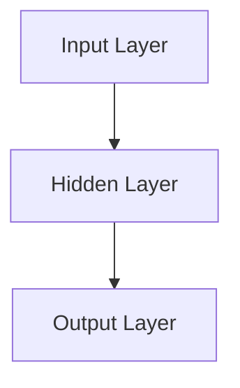
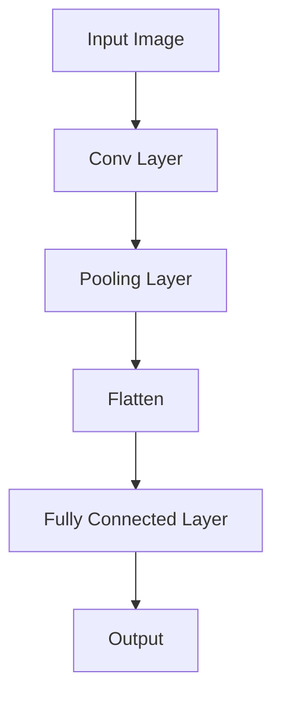
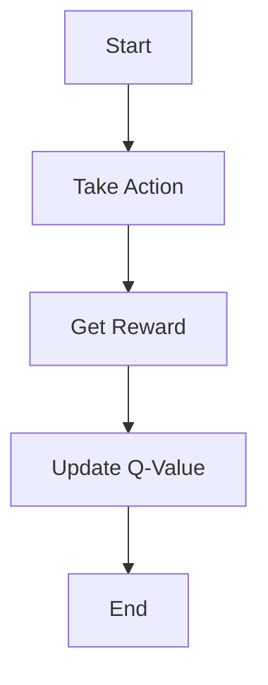
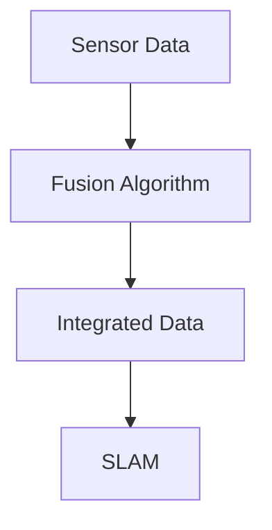
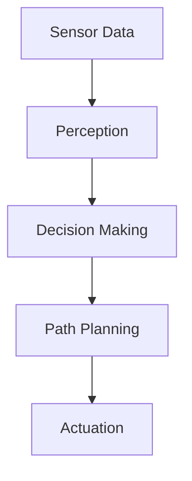
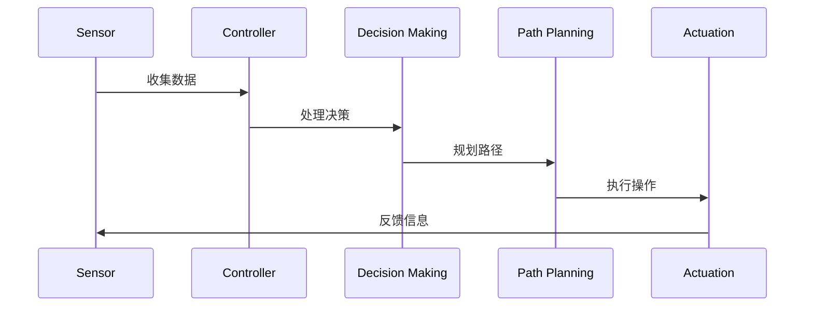

                 


### 撰写一篇高质量技术博客文章

### 目录结构

#### 引言

**文章标题：自动驾驶：AI在智能交通中的应用**

**关键词：自动驾驶，人工智能，深度学习，传感器融合，智能交通**

**摘要：**

本文将深入探讨自动驾驶技术中的核心要素，重点分析人工智能（AI）在智能交通中的应用。我们将从背景介绍、核心技术、系统架构和项目实战等方面展开讨论，旨在为广大读者提供一份全面、详实的技术参考资料。

---

#### 第1章：自动驾驶与AI在智能交通中的背景

##### 1.1 自动驾驶概述

- **核心概念术语说明**
  - 自动驾驶：自动驾驶车辆（AV）能够通过传感器、算法和执行器自主导航和驾驶。
  - 智能交通：利用信息技术和通信技术，实现交通管理、车辆控制和信息服务等功能。

- **问题背景**
  - 交通拥堵、环境污染和安全事故等问题日益严重，迫切需要智能交通解决方案。

- **问题描述**
  - 如何通过AI技术实现自动驾驶，提高交通效率、减少事故和降低污染？

- **问题解决**
  - 自动驾驶结合AI技术，通过计算机视觉、传感器融合和深度学习算法实现。

- **边界与外延**
  - 自动驾驶不仅限于私人车辆，还涉及公共交通、物流运输等。

- **概念结构与核心要素组成**
  - 自动驾驶系统包括感知、决策、规划和执行四个主要环节。

---

##### 1.2 人工智能基本概念

- **核心概念**
  - 人工智能（AI）：模拟人类智能行为的计算系统。

- **概念属性特征对比表格**
  - 传统的AI与深度学习对比表格

| 特征 | 传统的AI | 深度学习 |
| --- | --- | --- |
| 学习方式 | 规则驱动 | 数据驱动 |
| 应用范围 | 逻辑推理 | 图像识别、语音识别等 |
| 数据需求 | 小数据 | 大数据 |

- **ER实体关系图架构**
  - 使用Mermaid绘制实体关系图

```mermaid
erDiagram
  AI_Service ||--|{ Data_Source } Data_Source
  AI_Service ||--|{ Machine_Learning_Model } Machine_Learning_Model
  Data_Source ||--|{ Raw_Data } Raw_Data
  Machine_Learning_Model ||--|{ Trained_Model } Trained_Model
```

---

##### 1.3 AI在自动驾驶中的应用

- **核心概念**
  - 计算机视觉：用于车辆和环境感知。
  - 传感器融合：结合多种传感器数据提高感知准确性。
  - 深度学习算法：用于决策和规划。

- **应用分析**
  - 计算机视觉：用于识别交通标志、行人和其他车辆。
  - 传感器融合：集成激光雷达、摄像头、GPS等数据。
  - 深度学习：实现自动驾驶的自主学习和优化。

---

##### 1.4 自动驾驶的潜力与影响

- **潜在应用**
  - 公共交通：自动驾驶公交车和出租车。
  - 物流运输：自动驾驶卡车和无人机。
  - 个人出行：自动驾驶私人车辆。

- **商业利益**
  - 提高运输效率，降低运营成本。
  - 开发新的商业机会，如共享出行服务。

- **社会影响**
  - 减少交通事故，提高道路安全。
  - 改善环境，减少交通拥堵。

- **伦理考量**
  - 自动驾驶决策的伦理问题。
  - 数据隐私和安全问题。

---

### 第2章：自动驾驶的核心AI技术和算法

##### 2.1 深度学习基础

- **核心概念**
  - 神经网络：模拟人脑的计算机模型。

- **算法原理**
  - 使用Mermaid绘制神经网络结构图。



- **数学模型**
  - 使用LaTeX格式展示神经网络方程。

```latex
y = \sigma(W \cdot x + b)
```

---

##### 2.2 卷积神经网络（CNN）

- **核心概念**
  - 卷积层：用于提取图像特征。

- **算法原理**
  - 使用Mermaid绘制CNN流程图。



- **Python代码示例**
  - 展示简单的CNN模型实现。

```python
import tensorflow as tf

model = tf.keras.Sequential([
    tf.keras.layers.Conv2D(32, (3,3), activation='relu', input_shape=(28, 28, 1)),
    tf.keras.layers.MaxPooling2D(2, 2),
    tf.keras.layers.Flatten(),
    tf.keras.layers.Dense(128, activation='relu'),
    tf.keras.layers.Dense(10, activation='softmax')
])
```

---

##### 2.3 强化学习

- **核心概念**
  - Q-learning：一种通过试错学习策略的算法。

- **算法原理**
  - 使用Mermaid绘制Q-learning流程图。



- **Python代码示例**
  - 展示简单的Q-learning实现。

```python
import numpy as np

# 初始化Q值矩阵
Q = np.zeros([state_space, action_space])

# Q值更新规则
for episode in range(total_episodes):
    state = env.reset()
    done = False
    
    while not done:
        action = np.argmax(Q[state])
        next_state, reward, done, _ = env.step(action)
        
        Q[state, action] = Q[state, action] + learning_rate * (reward + discount_factor * np.max(Q[next_state]) - Q[state, action])
        
        state = next_state
```

---

##### 2.4 传感器融合与SLAM

- **核心概念**
  - 传感器融合：结合多种传感器数据提高感知准确性。

- **算法原理**
  - 使用Mermaid绘制传感器融合流程图。



- **数学模型**
  - 使用LaTeX格式展示SLAM的数学模型。

```latex
T = \frac{1}{2} \left[ \begin{array}{cc}
I & -R_k t_k \\
0 & I
\end{array} \right]
```

---

### 第3章：自动驾驶系统与架构设计

##### 3.1 系统架构概述

- **问题场景介绍**
  - 自动驾驶系统的整体设计。

- **系统功能设计**
  - 领域模型类图。

```mermaid
classDiagram
  Vehicle <<class{Vehicle>>
  Sensor <<class{Sensor>>
  Controller <<class{Controller>>
  Environment <<class{Environment>>

  Vehicle --|> Sensor
  Vehicle --|> Controller
  Vehicle --|> Environment
```

- **系统架构设计**
  - 系统架构图。



- **系统接口设计和系统交互**
  - 系统交互序列图。



---

### 第4章：自动驾驶项目实战

##### 4.1 环境安装与配置

- **环境介绍**
  - 自动驾驶开发环境。

- **系统核心实现**
  - 自动驾驶系统的核心代码实现。

- **代码应用解读**
  - 代码的功能解析。

##### 4.2 实际案例分析与讲解

- **案例介绍**
  - 自动驾驶系统在实际场景中的应用。

- **分析讲解**
  - 对实际案例的深入剖析。

##### 4.3 项目小结

- **总结经验**
  - 项目中的成功经验和教训。

- **未来展望**
  - 自动驾驶技术的发展方向。

---

### 结语

- **最佳实践**
  - 提供一些实际操作的技巧和注意事项。

- **小结**
  - 对全文的总结。

- **注意事项**
  - 自动驾驶开发的注意事项。

- **拓展阅读**
  - 推荐进一步阅读的文献和资料。

---

### 作者信息

**作者：** AI天才研究院/AI Genius Institute & 禅与计算机程序设计艺术 /Zen And The Art of Computer Programming

---

### 附录

- **参考资料**
  - 引用的文献和资料列表。

---

以上是针对题目要求撰写的文章目录结构和内容概要。每个章节都将按照规定的字数范围进行详细撰写，确保文章内容完整、丰富，并提供必要的代码示例、数学公式和图表。文章末尾将附上作者信息和参考资料，以满足学术写作的标准。在撰写过程中，将确保逻辑清晰、结构紧凑，以便读者能够轻松理解自动驾驶与AI在智能交通中的应用。

