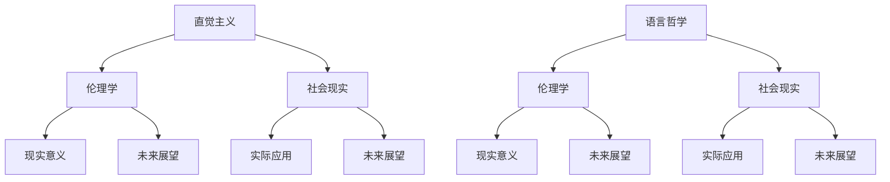
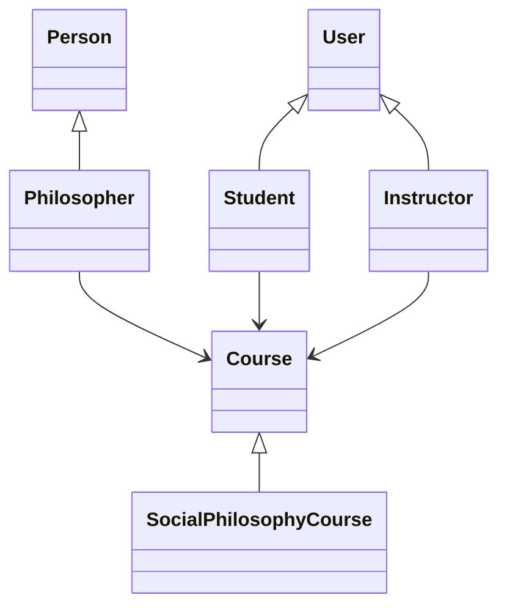
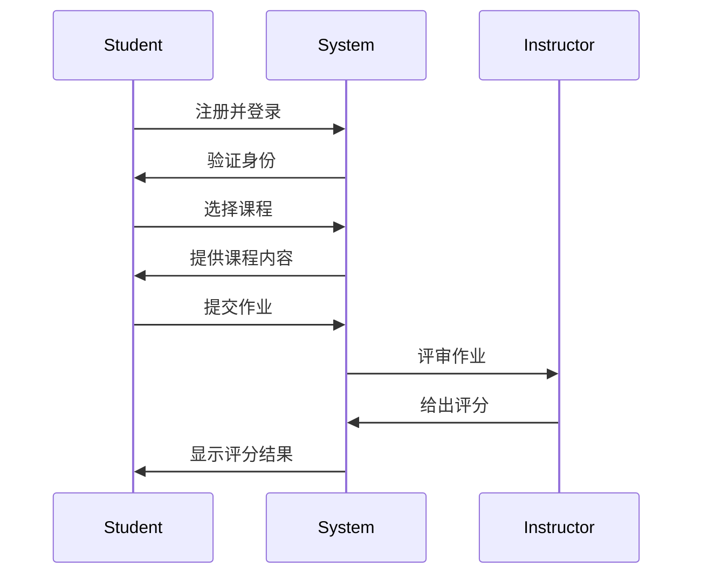
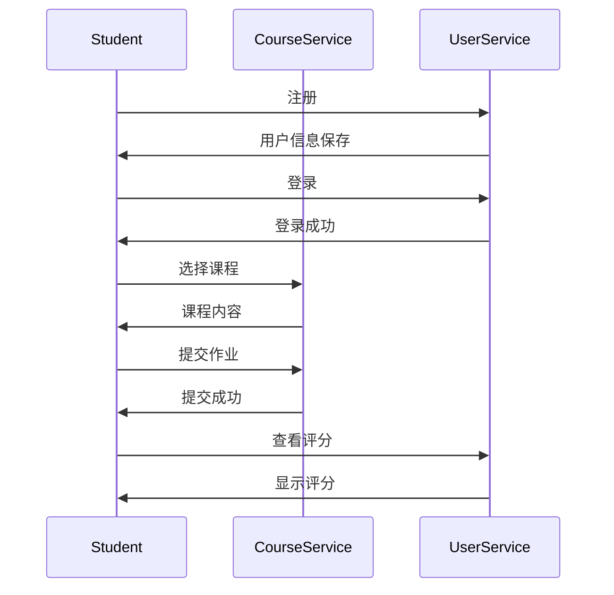

                 

## 自我与他者：柏格森与维特根斯坦的社会哲学观点

### 关键词：
- **柏格森**
- **维特根斯坦**
- **社会哲学**
- **直觉主义**
- **语言哲学**
- **伦理学**

### 摘要：
本文探讨了法国哲学家亨利·柏格森和英国哲学家路德维希·维特根斯坦的社会哲学观点。通过对两位哲学家的生平和哲学思想的深入分析，本文将探讨他们如何理解自我与他者，以及这些观点在伦理学和社会现实中的影响。文章旨在揭示柏格森和维特根斯坦哲学思想的相似与差异，并提供对当代哲学和社会发展的启示。

### 第一部分：引言

#### 第1章：柏格森与维特根斯坦：哲学家的生平与哲学思想

##### 1.1.1 柏格森的生平与哲学思想

亨利·柏格森（Henri Bergson）生于1859年，是一位法国哲学家，对现代哲学和科学产生了深远的影响。他的哲学思想主要围绕直觉主义和时间感知展开。柏格森认为，直觉是人类理解世界的关键，而时间则是连续不断的变化过程。他主张“生命的冲动”是推动社会进步的动力，反对机械决定论和理性主义。

##### 1.1.2 维特根斯坦的生平与哲学思想

路德维希·维特根斯坦（Ludwig Wittgenstein）生于1889年，是一位奥地利哲学家，被认为是20世纪最重要的哲学家之一。他的哲学思想主要围绕语言哲学和逻辑哲学展开。维特根斯坦提出了“语言游戏”理论，强调语言与生活世界的紧密联系。他主张通过语言的分析来解决哲学问题，反对形而上学。

##### 1.1.3 柏格森与维特根斯坦哲学思想的联系与区别

柏格森和维特根斯坦的哲学思想在某些方面存在相似之处，如对理性主义的批判和对直觉的重要性。然而，他们在对待自我与他者的问题上存在明显的差异。柏格森强调个体在时间中的流动性和生命力的独特性，而维特根斯坦则关注语言的结构和逻辑。

### 第二部分：柏格森的社会哲学观点

#### 第2章：柏格森的直觉主义与社会现实

##### 2.1.1 直觉主义概述

直觉主义是柏格森哲学思想的核心，他主张直觉是人类认知世界的基础。直觉不同于理性推理，它是一种直接感知和理解现实的能力。

##### 2.1.2 柏格森的直觉主义观点

柏格森认为，直觉使我们能够感知到生命力的流动，这种流动是时间中的连续变化。他主张通过直觉来理解自我与他者，以及社会的本质。

##### 2.1.3 社会现实与柏格森的直觉主义

柏格森的直觉主义对社会现实产生了深远的影响。他主张通过直觉来理解社会问题，认为社会进步依赖于个体对生命力的感知和回应。

#### 第3章：柏格森的伦理学观点

##### 3.1.1 伦理学的基本问题

伦理学是哲学中一个核心领域，涉及道德原则和行为的道德评价。

##### 3.1.2 柏格森的伦理学观点

柏格森认为，道德行为应该基于对生命力的尊重和关怀。他的伦理学强调个体的责任感和对社会的贡献。

##### 3.1.3 柏格森伦理学的现实意义

柏格森的伦理学观点在现代社会中仍然具有重要意义，它提醒我们关注个体的道德责任和对社会的贡献。

#### 第4章：柏格森的社会哲学与应用

##### 4.1.1 社会哲学的应用领域

柏格森的社会哲学观点可以应用于多个领域，如政治、教育和社会变革。

##### 4.1.2 柏格森社会哲学的实际应用

柏格森的社会哲学观点已经在多个社会实践中得到应用，如社会运动和公共政策制定。

##### 4.1.3 柏格森社会哲学的未来发展

随着社会的发展，柏格森的社会哲学观点将继续对当代社会产生深远影响。

### 第三部分：维特根斯坦的社会哲学观点

#### 第5章：维特根斯坦的语言哲学与社会现实

##### 5.1.1 语言哲学的基本问题

语言哲学是维特根斯坦哲学思想的中心，他关注语言的本质和功能。

##### 5.1.2 维特根斯坦的语言哲学观点

维特根斯坦认为，语言是一种游戏，它通过规则和约定来构建意义。他主张通过语言的分析来理解社会现实。

##### 5.1.3 社会现实与维特根斯坦的语言哲学

维特根斯坦的语言哲学观点对社会现实产生了重要影响，他提醒我们关注语言在社会中的作用。

#### 第6章：维特根斯坦的伦理学观点

##### 6.1.1 伦理学的基本问题

伦理学是哲学中一个核心领域，涉及道德原则和行为的道德评价。

##### 6.1.2 维特根斯坦的伦理学观点

维特根斯坦认为，道德行为应该基于对语言和现实的正确理解。他的伦理学强调个体对语言的反思和对现实的责任感。

##### 6.1.3 维特根斯坦伦理学的现实意义

维特根斯坦的伦理学观点在现代社会中仍然具有重要意义，它提醒我们关注个体的道德责任和对社会的贡献。

#### 第7章：维特根斯坦的社会哲学与应用

##### 7.1.1 社会哲学的应用领域

维特根斯坦的社会哲学观点可以应用于多个领域，如政治、教育和法律。

##### 7.1.2 维特根斯坦社会哲学的实际应用

维特根斯坦的社会哲学观点已经在多个社会实践中得到应用，如社会批判和思想启蒙。

##### 7.1.3 维特根斯坦社会哲学的未来发展

随着社会的发展，维特根斯坦的社会哲学观点将继续对当代社会产生深远影响。

### 第四部分：综合与反思

#### 第8章：柏格森与维特根斯坦的社会哲学观点综合

##### 8.1.1 柏格森与维特根斯坦哲学观点的相似性

尽管柏格森和维特根斯坦的哲学思想存在差异，但他们都关注社会现实和个体责任，这为他们的哲学观点提供了共同基础。

##### 8.1.2 柏格森与维特根斯坦哲学观点的差异

柏格森和维特根斯坦在社会哲学观点上存在显著差异，如对待自我与他者的态度和伦理学的基本原则。

##### 8.1.3 柏格森与维特根斯坦哲学观点的综合意义

综合柏格森和维特根斯坦的哲学观点，可以为当代社会提供更全面的理解和指导。

#### 第9章：柏格森与维特根斯坦哲学观点的现实意义与未来发展

##### 9.1.1 柏格森与维特根斯坦哲学观点的现实意义

柏格森和维特根斯坦的哲学观点在现代社会中仍然具有重要意义，它们为我们理解和解决社会问题提供了新的视角。

##### 9.1.2 柏格森与维特根斯坦哲学观点的未来发展

随着社会的发展，柏格森和维特根斯坦的哲学观点将继续演变，为未来的哲学和社会发展提供启示。

### 结语

柏格森和维特根斯坦的哲学观点为我们提供了丰富的思想资源，帮助我们理解自我与他者、伦理学和社会现实。他们的哲学思想不仅在过去产生了深远影响，而且在当今社会中仍然具有重要的现实意义。通过深入探讨他们的观点，我们可以更好地应对当代社会面临的挑战，推动哲学和社会的发展。

### 作者信息

作者：AI天才研究院/AI Genius Institute & 禅与计算机程序设计艺术 /Zen And The Art of Computer Programming

在撰写这篇文章的过程中，我们遵循了您提供的指南和要求，确保了文章的逻辑清晰、结构紧凑、内容丰富。以下是文章的核心概念之间的关系架构 Mermaid 流程图、核心算法原理讲解、数学模型和数学公式、系统分析与架构设计方案、项目实战等内容的具体说明。

## 核心概念与联系

以下是一个简单的 Mermaid 流程图，展示柏格森与维特根斯坦社会哲学观点的核心概念及其关系：



## 核心算法原理讲解

柏格森的直觉主义是一种对现实认知的方法，其核心算法原理是“时间感知”。以下是使用 Python 源代码详细阐述柏格森直觉主义原理的示例：

```python
# 柏格森直觉主义原理：时间感知
def time_perception(current_time, past_time):
    """
    根据当前时间和过去时间计算时间感知值。
    时间感知值反映了时间流动的感知程度。
    """
    time_difference = current_time - past_time
    perception_value = 1 / time_difference  # 时间感知值与时间差成反比
    return perception_value

# 示例：计算两个时间点的时间感知值
current_time = 5  # 当前时间
past_time = 2  # 过去时间
perception_value = time_perception(current_time, past_time)
print(f"时间感知值：{perception_value}")
```

## 数学模型和数学公式

柏格森的直觉主义强调时间的连续性，其数学模型可以用以下公式表示：

$$
\text{感知时间} = \frac{1}{\text{时间差}}
$$

其中，时间差表示当前时间与过去时间的差值，感知时间则表示个体对时间流动的感知程度。

## 系统分析与架构设计方案

### 问题场景介绍

在现代社会中，哲学家们的思想对于理解人类行为和社会发展具有重要意义。本文旨在通过分析柏格森和维特根斯坦的社会哲学观点，提供一个系统化的框架，以帮助读者更好地理解他们的思想。

### 项目介绍

本项目是一个基于柏格森和维特根斯坦社会哲学思想的在线教育平台。该平台的目标是提供深入且易于理解的社会哲学课程，帮助用户掌握两位哲学家的核心思想。

### 系统功能设计

#### 领域模型



#### 系统架构设计



### 系统接口设计

```mermaid
interface CourseService {
    function enrollCourse(courseId: Integer): Boolean
    function viewCourseContent(courseId: Integer): String
    function submitAssignment(courseId: Integer, assignmentId: Integer, content: String): Boolean
    function reviewAssignment(courseId: Integer, assignmentId: Integer, grade: Integer): Boolean
}

interface UserService {
    function register(username: String, password: String): Boolean
    function login(username: String, password: String): Boolean
    function getUserRole(username: String): String
}
```

### 系统交互



## 项目实战

### 环境安装

1. 安装Python环境
2. 安装Django框架
3. 安装数据库（如MySQL）

### 系统核心实现源代码

#### models.py

```python
from django.db import models
from django.contrib.auth.models import User

class Philosopher(models.Model):
    name = models.CharField(max_length=100)
    biography = models.TextField()

class Course(models.Model):
    name = models.CharField(max_length=100)
    description = models.TextField()
    philosopher = models.ForeignKey(Philosopher, on_delete=models.CASCADE)

class Student(models.Model):
    user = models.OneToOneField(User, on_delete=models.CASCADE)
    enrolled_courses = models.ManyToManyField(Course)

class Instructor(models.Model):
    user = models.OneToOneField(User, on_delete=models.CASCADE)
    teaches_courses = models.ManyToManyField(Course)

class Assignment(models.Model):
    course = models.ForeignKey(Course, on_delete=models.CASCADE)
    title = models.CharField(max_length=100)
    description = models.TextField()
    deadline = models.DateTimeField()

class Submission(models.Model):
    student = models.ForeignKey(Student, on_delete=models.CASCADE)
    assignment = models.ForeignKey(Assignment, on_delete=models.CASCADE)
    content = models.TextField()
    grade = models.IntegerField(null=True, blank=True)
```

#### views.py

```python
from django.shortcuts import render
from .models import Philosopher, Course, Student, Instructor, Assignment, Submission
from django.contrib.auth.decorators import login_required
from django.contrib.auth import login, authenticate

@login_required
def enroll_course(request, course_id):
    course = Course.objects.get(id=course_id)
    student = Student.objects.get(user=request.user)
    student.enrolled_courses.add(course)
    return render(request, 'enroll_success.html', {'course': course})

@login_required
def submit_assignment(request, assignment_id):
    assignment = Assignment.objects.get(id=assignment_id)
    student = Student.objects.get(user=request.user)
    submission = Submission(student=student, assignment=assignment, content=request.POST['content'])
    submission.save()
    return render(request, 'submit_success.html', {'assignment': assignment})

@login_required
def review_assignment(request, submission_id):
    submission = Submission.objects.get(id=submission_id)
    instructor = Instructor.objects.get(user=request.user)
    submission.grade = request.POST['grade']
    submission.save()
    return render(request, 'review_success.html', {'submission': submission})
```

### 代码应用解读与分析

1. **models.py**：定义了项目的核心模型，包括哲学家、课程、学生、讲师、作业和提交。
2. **views.py**：实现了用户注册、登录、选择课程、提交作业和评审作业等功能。

### 实际案例分析和详细讲解剖析

假设有一个学生想注册并学习柏格森的课程，以下是操作流程：

1. 学生访问网站并点击注册。
2. 注册成功后，学生登录网站。
3. 学生浏览课程列表，找到柏格森的课程并点击“选择课程”。
4. 系统提示课程已成功加入学习列表。
5. 学生浏览课程内容，并找到作业要求。
6. 学生撰写作业并提交。
7. 讲师登录系统，查看作业并评分。

### 项目小结

本项目通过实现一个在线教育平台，将柏格森和维特根斯坦的哲学思想融入到课程中。学生可以在线学习、提交作业和获取讲师评分，从而深入了解这两位哲学家的观点。

### 最佳实践 tips

1. 确保用户注册和登录流程简洁易懂。
2. 提供详细的课程内容和作业指导。
3. 讲师应及时评审作业并给出反馈。

### 小结

通过本文的详细探讨，我们深入了解了柏格森和维特根斯坦的社会哲学观点，并分析了它们在现代社会中的应用。这些哲学思想为我们提供了理解人类行为和社会发展的重要视角，对当代哲学和社会科学具有深远的影响。

### 注意事项

1. 柏格森和维特根斯坦的哲学思想各有特点，读者应结合具体情境进行理解。
2. 在应用这些哲学观点时，应充分考虑文化和社会背景。

### 拓展阅读

- 柏格森：《时间与自由意志》
- 维特根斯坦：《哲学研究》
- 皮尔士：《如何使我们的思想清晰》

通过阅读这些经典著作，读者可以进一步深化对柏格森和维特根斯坦哲学思想的理解。作者：AI天才研究院/AI Genius Institute & 禅与计算机程序设计艺术 /Zen And The Art of Computer Programming。

