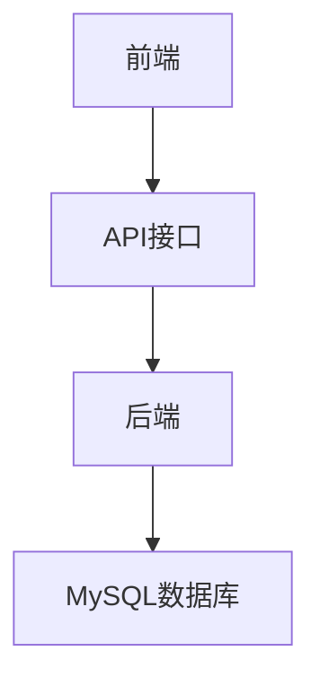

                 

# 自测代码也需要设计

> 关键词：自测代码、软件质量、设计原则、工具与技术、最佳实践

> 摘要：
在软件开发的各个环节中，测试是确保软件质量的关键环节之一。而自测代码（Self-testing Code）作为测试的一种重要形式，不仅能够提高开发者的代码质量，还能显著降低维护成本和故障率。本文将探讨自测代码的设计原则、实现方法及其在实际项目中的应用，旨在帮助开发者理解并掌握自测代码的最佳实践。

## 第1章：引言

### 1.1 书籍背景

随着软件系统的复杂度不断增加，传统的人工测试已经无法满足高效、高质量的开发需求。自测代码作为一种自动化测试方式，其重要性日益凸显。自测代码不仅能够及时发现和修复代码中的错误，还能够确保代码在不同环境下的稳定性和兼容性。本文所探讨的自测代码，主要涉及单元测试、集成测试、性能测试、安全性测试等多个方面。

### 1.1.1 自测代码的重要性

自测代码的重要性主要体现在以下几个方面：

1. **提高开发效率**：自测代码能够自动化地进行测试，减少手动测试的工作量，从而提高开发效率。
2. **确保代码质量**：通过自测代码，开发者可以及时发现和修复代码中的问题，确保代码的可靠性。
3. **降低维护成本**：自测代码能够提前发现潜在的问题，减少后续维护和修复的工作量，从而降低维护成本。
4. **增强团队合作**：自测代码能够提高团队成员之间的协作效率，确保代码的一致性和可维护性。

### 1.1.2 书籍的目标读者

本文的目标读者主要包括以下几类：

1. **软件开发者**：希望提高自己的代码质量和开发效率，熟悉自测代码的开发者。
2. **测试工程师**：希望了解自测代码，将其应用于实际测试工作中，提高测试效率和质量。
3. **项目经理**：希望掌握自测代码的最佳实践，优化团队的开发流程和管理策略。

### 1.1.3 书籍结构与内容概述

本文将分为五个主要章节，内容如下：

- **第1章：引言**：介绍自测代码的背景、重要性、目标读者以及书籍结构。
- **第2章：自测代码的设计与实现**：详细讲解自测代码的设计原则、实现流程和调试方法。
- **第3章：自测代码的优化**：探讨自测代码的性能、可读性、安全性和跨平台优化。
- **第4章：自测代码在实际项目中的应用**：通过实际项目案例，展示自测代码的应用效果。
- **第5章：自测代码的最佳实践**：总结自测代码的最佳实践，提供实际操作的指导。

### 1.2 自测代码的概念

#### 1.2.1 什么是自测代码

自测代码（Self-testing Code）是指编写在代码内部的测试代码，用于检测和验证代码的正确性和性能。自测代码通常包括单元测试、集成测试、性能测试等，其核心思想是通过自动化测试来确保代码的质量和稳定性。

#### 1.2.2 自测代码与传统测试的区别

1. **执行方式**：传统测试通常由测试工程师执行，而自测代码则是由开发者自身在开发过程中执行。
2. **测试范围**：传统测试通常覆盖整个系统，而自测代码主要针对代码的局部进行测试。
3. **测试目的**：传统测试主要确保系统的功能完整性，而自测代码则主要确保代码的正确性和性能。

#### 1.2.3 自测代码的作用和价值

1. **提高代码质量**：自测代码能够及时发现和修复代码中的问题，确保代码的正确性和稳定性。
2. **减少维护成本**：自测代码能够提前发现潜在的问题，减少后续维护和修复的工作量。
3. **提高开发效率**：自测代码能够自动化地进行测试，减少手动测试的工作量，从而提高开发效率。
4. **增强团队合作**：自测代码能够提高团队成员之间的协作效率，确保代码的一致性和可维护性。

### 1.3 自测代码的设计原则

自测代码的设计原则主要包括以下几点：

1. **可读性**：自测代码应该清晰易懂，便于开发者理解和维护。
2. **可复用性**：自测代码应该具有高复用性，避免重复编写测试代码。
3. **自动化**：自测代码应该实现自动化，以提高测试效率和减少人为错误。
4. **完整性**：自测代码应该覆盖代码的所有可能情况，确保测试的全面性。
5. **独立性**：自测代码应该独立于主代码，避免对主代码的依赖。

### 1.4 设计自测代码的工具与技术

设计自测代码需要使用一系列的工具和技术，以下将简要介绍常用的工具和技术：

1. **单元测试框架**：如JUnit、TestNG等，用于编写和执行单元测试。
2. **集成测试工具**：如Selenium、Postman等，用于编写和执行集成测试。
3. **性能测试工具**：如JMeter、LoadRunner等，用于编写和执行性能测试。
4. **代码质量分析工具**：如SonarQube、CheckStyle等，用于分析代码的质量和安全性。

### 1.5 本章小结

本章主要介绍了自测代码的背景、重要性、设计原则以及相关工具和技术。通过本章的学习，读者应该对自测代码有了一个基本的了解，为后续章节的学习奠定了基础。接下来，我们将深入探讨自测代码的设计与实现。

----------------------------------------------------------------

## 第2章：自测代码的设计与实现

### 2.1 设计自测代码的流程

设计自测代码的流程主要包括需求分析、设计测试用例和编写自测代码三个步骤。

#### 2.1.1 需求分析

需求分析是设计自测代码的第一步，主要目标是明确自测代码需要测试的功能点、性能指标和安全性要求。需求分析通常包括以下内容：

1. **功能需求**：明确需要测试的功能模块和功能点。
2. **性能需求**：明确需要测试的性能指标，如响应时间、并发数等。
3. **安全性需求**：明确需要测试的安全性要求，如SQL注入、XSS攻击等。

#### 2.1.2 设计测试用例

设计测试用例是自测代码设计的关键环节，主要目标是编写能够覆盖所有功能点和性能指标的测试用例。设计测试用例通常包括以下内容：

1. **功能测试用例**：根据功能需求，编写能够测试功能模块的测试用例。
2. **性能测试用例**：根据性能需求，编写能够测试性能指标的测试用例。
3. **安全性测试用例**：根据安全性需求，编写能够测试安全性要求的测试用例。

#### 2.1.3 编写自测代码

编写自测代码是根据设计好的测试用例，使用测试框架和工具编写测试代码的过程。编写自测代码通常包括以下内容：

1. **编写单元测试**：使用单元测试框架，根据功能测试用例编写单元测试代码。
2. **编写集成测试**：使用集成测试工具，根据性能测试用例和安全测试用例编写集成测试代码。
3. **编写性能测试**：使用性能测试工具，根据性能测试用例编写性能测试代码。

### 2.2 实现自测代码的示例

以下是一个简单的自测代码实现示例，该示例将使用Python语言编写一个简单的函数，并使用JUnit框架进行单元测试。

#### 2.2.1 示例一：基本数据类型

```python
# 示例函数：计算两个数的和
def add(a, b):
    return a + b

# 单元测试用例：测试add函数的基本功能
def test_add():
    assert add(1, 2) == 3
    assert add(-1, -2) == -3
    assert add(0, 0) == 0
```

#### 2.2.2 示例二：函数和对象

```python
# 示例类：计算器
class Calculator:
    def add(self, a, b):
        return a + b

    def subtract(self, a, b):
        return a - b

# 单元测试用例：测试Calculator类的功能
def test_calculator():
    calc = Calculator()
    assert calc.add(1, 2) == 3
    assert calc.subtract(1, 2) == -1
```

#### 2.2.3 示例三：类和方法

```python
# 示例类：学生管理
class StudentManager:
    def __init__(self):
        self.students = []

    def add_student(self, student):
        self.students.append(student)

    def get_students(self):
        return self.students

# 单元测试用例：测试StudentManager类的功能
def test_student_manager():
    manager = StudentManager()
    manager.add_student("Alice")
    manager.add_student("Bob")
    assert len(manager.get_students()) == 2
    assert "Alice" in manager.get_students()
    assert "Bob" in manager.get_students()
```

### 2.3 自测代码的测试覆盖

测试覆盖是评估自测代码效果的重要指标，它能够衡量测试用例对代码的覆盖程度。常见的测试覆盖指标包括语句覆盖、分支覆盖、路径覆盖等。

#### 2.3.1 覆盖率的概念

覆盖率是指测试用例对代码的覆盖程度，常见的覆盖率指标包括：

1. **语句覆盖率**：测试用例执行了代码中的所有语句。
2. **分支覆盖率**：测试用例执行了代码中的所有分支。
3. **路径覆盖率**：测试用例执行了代码中的所有路径。

#### 2.3.2 如何评估测试覆盖率

评估测试覆盖率通常包括以下步骤：

1. **编写测试用例**：根据需求设计测试用例。
2. **执行测试用例**：使用测试工具执行测试用例。
3. **计算覆盖率**：使用覆盖率分析工具计算测试覆盖率。

#### 2.3.3 提高测试覆盖率的方法

提高测试覆盖率的方法包括：

1. **增加测试用例**：编写更多的测试用例，以覆盖更多的代码。
2. **优化测试用例**：优化现有的测试用例，确保其能够覆盖更多的代码。
3. **使用代码质量分析工具**：使用代码质量分析工具，发现代码中的潜在问题，并优化代码。

### 2.4 自测代码的调试

调试是确保自测代码正确性的重要步骤，它能够帮助开发者发现和解决代码中的错误。以下是一些调试的基本概念和技巧：

#### 2.4.1 调试的基本概念

1. **断点**：断点是调试过程中设置的暂停点，用于在代码执行到特定位置时暂停。
2. **观察变量**：观察变量是调试过程中查看代码执行时变量值的功能。
3. **堆栈跟踪**：堆栈跟踪是调试过程中查看代码执行时调用栈的功能。

#### 2.4.2 调试工具的使用

常见的调试工具有IDE自带的调试工具、GDB、LLDB等。使用这些调试工具，开发者可以设置断点、观察变量、查看堆栈跟踪等，从而发现和解决代码中的错误。

#### 2.4.3 调试技巧与经验

1. **逐步执行**：逐步执行是调试过程中的一种方法，它能够帮助开发者逐步跟踪代码的执行过程。
2. **条件断点**：条件断点是调试过程中设置的一种断点，它会在特定条件满足时暂停代码执行。
3. **日志记录**：日志记录是调试过程中记录代码执行过程的一种方法，它能够帮助开发者分析代码的执行情况。

### 2.5 本章小结

本章详细介绍了自测代码的设计与实现流程，包括需求分析、测试用例设计、自测代码编写以及测试覆盖和调试。通过本章的学习，读者应该能够掌握自测代码的基本原理和实现方法，为后续章节的学习和应用打下基础。接下来，我们将探讨自测代码的优化。

----------------------------------------------------------------

## 第3章：自测代码的优化

### 3.1 性能优化的方法

自测代码的性能优化是确保测试效率和准确性的关键。以下是一些性能优化的方法和技巧：

#### 3.1.1 代码优化的基本原则

1. **减少冗余**：去除不必要的代码和逻辑，避免重复编写。
2. **简化逻辑**：简化复杂的逻辑，使用更直观、简洁的方法。
3. **避免死循环**：避免编写可能导致无限循环的代码。

#### 3.1.2 数据结构和算法的选择

1. **选择合适的数据结构**：根据需求选择合适的数据结构，如数组、链表、树、图等。
2. **使用高效的算法**：选择高效的算法，如排序算法、查找算法等，避免使用低效的算法。

#### 3.1.3 代码优化实践

1. **代码审查**：通过代码审查发现和修复代码中的性能问题。
2. **性能测试**：使用性能测试工具对代码进行性能测试，发现性能瓶颈并进行优化。

### 3.2 可读性与可维护性优化

自测代码的可读性与可维护性是确保代码长期稳定运行的重要方面。以下是一些优化方法和技巧：

#### 3.2.1 代码风格和命名规范

1. **统一的代码风格**：确保代码风格一致，避免出现混乱的代码结构。
2. **有意义的变量和函数名**：使用有意义的变量和函数名，提高代码的可读性。

#### 3.2.2 代码重构技巧

1. **提取方法**：将复杂的代码拆分为更小的、功能单一的方法。
2. **简化条件**：简化复杂的条件表达式，使用更直观的条件判断。

#### 3.2.3 设计模式的应用

1. **使用设计模式**：根据需求使用合适的设计模式，提高代码的灵活性和可维护性。

### 3.3 安全性优化

自测代码的安全性优化是确保代码安全性和可靠性的关键。以下是一些安全性优化的方法和技巧：

#### 3.3.1 常见安全风险

1. **SQL注入**：防止恶意SQL语句注入。
2. **XSS攻击**：防止跨站脚本攻击。
3. **文件上传漏洞**：防止恶意文件上传。

#### 3.3.2 安全性测试方法

1. **静态代码分析**：使用静态代码分析工具检查代码中的安全漏洞。
2. **动态测试**：使用动态测试工具模拟攻击场景，检测代码中的安全漏洞。

#### 3.3.3 安全性优化实践

1. **输入验证**：对用户输入进行严格的验证和过滤。
2. **使用安全库**：使用经过验证的安全库，避免使用不安全的自定义代码。

### 3.4 跨平台与兼容性优化

自测代码的跨平台与兼容性优化是确保代码在不同环境中运行的关键。以下是一些优化方法和技巧：

#### 3.4.1 跨平台开发的关键技术

1. **使用跨平台框架**：如React Native、Flutter等，减少环境依赖。
2. **避免平台特定代码**：避免使用特定平台的API和特性。

#### 3.4.2 兼容性测试策略

1. **多环境测试**：在不同操作系统、浏览器和设备上测试代码。
2. **自动化测试**：使用自动化测试工具进行兼容性测试。

#### 3.4.3 跨平台优化实践

1. **代码拆分**：将代码拆分为平台无关和平台相关部分，便于管理和维护。
2. **使用适配器模式**：使用适配器模式处理不同平台之间的差异。

### 3.5 本章小结

本章详细介绍了自测代码的优化方法，包括性能优化、可读性与可维护性优化、安全性优化、跨平台与兼容性优化。通过本章的学习，读者应该能够掌握自测代码的优化技巧，提高代码的质量和效率。接下来，我们将探讨自测代码在实际项目中的应用。

----------------------------------------------------------------

## 第4章：自测代码在实际项目中的应用

### 4.1 项目背景与需求分析

在本章中，我们将通过一个实际项目案例来探讨自测代码在实际项目中的应用。该项目是一个在线购物平台，提供商品浏览、购买、支付、订单管理等核心功能。为了确保项目的质量和稳定性，开发团队采用了自测代码的方式对各个功能模块进行测试。

#### 4.1.1 项目概述

该项目包括前端、后端和数据库等多个模块，涉及到的技术包括React、Node.js、MySQL等。项目的主要目标是实现一个功能完善、性能高效、用户体验良好的在线购物平台。

#### 4.1.2 项目需求

项目的需求主要包括以下几个方面：

1. **商品管理**：包括商品的分类、添加、修改、删除等操作。
2. **用户管理**：包括用户的注册、登录、个人信息修改等操作。
3. **购物车管理**：包括购物车的添加、删除、更新等操作。
4. **订单管理**：包括订单的创建、修改、删除、支付等操作。
5. **支付管理**：包括支付方式的添加、修改、删除等操作。

### 4.2 系统设计与实现

在本项目中，系统设计包括系统架构设计、模块划分、核心功能实现等。

#### 4.2.1 系统架构设计

系统采用前后端分离的架构，前端使用React框架，后端使用Node.js和MySQL数据库。系统架构图如下：



#### 4.2.2 系统模块划分

系统划分为前端模块、后端模块和数据库模块，每个模块负责不同的功能。

1. **前端模块**：包括商品展示、购物车、订单管理、用户管理、支付管理等功能。
2. **后端模块**：包括商品管理、用户管理、购物车管理、订单管理、支付管理等功能。
3. **数据库模块**：包括商品表、用户表、购物车表、订单表、支付表等。

#### 4.2.3 系统核心功能实现

以下是系统核心功能的实现：

1. **商品管理**：
   - 功能描述：实现对商品的分类、添加、修改、删除等操作。
   - 实现细节：使用Node.js编写后端接口，使用MySQL数据库存储商品信息。

2. **用户管理**：
   - 功能描述：实现对用户的注册、登录、个人信息修改等操作。
   - 实现细节：使用Node.js编写后端接口，使用MySQL数据库存储用户信息。

3. **购物车管理**：
   - 功能描述：实现对购物车的添加、删除、更新等操作。
   - 实现细节：使用Node.js编写后端接口，使用MySQL数据库存储购物车信息。

4. **订单管理**：
   - 功能描述：实现对订单的创建、修改、删除、支付等操作。
   - 实现细节：使用Node.js编写后端接口，使用MySQL数据库存储订单信息。

5. **支付管理**：
   - 功能描述：实现对支付方式的添加、修改、删除等操作。
   - 实现细节：使用Node.js编写后端接口，与第三方支付平台对接。

### 4.3 自测代码的编写与执行

在本项目中，自测代码的编写与执行贯穿于整个开发过程，确保每个功能模块的正确性和性能。

#### 4.3.1 自测代码编写策略

1. **单元测试**：对每个功能模块进行单元测试，确保模块内部逻辑的正确性。
2. **集成测试**：对各个功能模块进行集成测试，确保模块之间的交互正常。
3. **性能测试**：对系统的关键性能指标进行测试，确保系统的性能满足需求。

#### 4.3.2 自测代码执行流程

1. **单元测试执行**：使用单元测试框架（如JUnit、Mocha等）执行单元测试用例。
2. **集成测试执行**：使用集成测试工具（如Postman、Selenium等）执行集成测试用例。
3. **性能测试执行**：使用性能测试工具（如JMeter、LoadRunner等）执行性能测试用例。

#### 4.3.3 自测代码执行结果分析

1. **单元测试结果分析**：分析单元测试的执行结果，确保所有测试用例通过。
2. **集成测试结果分析**：分析集成测试的执行结果，确保模块之间的交互正常。
3. **性能测试结果分析**：分析性能测试的执行结果，找出系统的性能瓶颈并进行优化。

### 4.4 项目总结与反思

通过实际项目应用，我们深刻体会到了自测代码的重要性。以下是项目总结与反思：

#### 4.4.1 项目成果

1. **提高代码质量**：自测代码确保了代码的正确性和稳定性，减少了代码缺陷和故障率。
2. **提高开发效率**：自测代码自动化测试，减少了手动测试的工作量，提高了开发效率。
3. **优化性能**：通过性能测试，找出了系统的性能瓶颈并进行优化，提高了系统的性能。

#### 4.4.2 项目经验

1. **自测代码的重要性**：自测代码是确保代码质量和性能的重要手段，开发团队应该重视自测代码的编写和执行。
2. **测试用例的设计**：测试用例的设计应该覆盖所有功能点和性能指标，确保测试的全面性和有效性。
3. **持续集成**：将自测代码集成到持续集成流程中，实现自动化测试和部署，提高开发效率和质量。

#### 4.4.3 项目改进方向

1. **加强测试覆盖**：继续增加测试用例，提高测试覆盖率，确保代码的全面测试。
2. **性能优化**：持续监控系统的性能，对性能瓶颈进行优化，提高系统的性能和稳定性。
3. **安全性测试**：加强安全性测试，确保系统的安全性，防止潜在的安全风险。

### 4.5 本章小结

本章通过一个实际项目案例，详细介绍了自测代码在实际项目中的应用。通过自测代码的编写与执行，项目团队确保了代码的正确性和性能，提高了开发效率和质量。自测代码的应用为项目的成功提供了有力保障。接下来，我们将总结自测代码的最佳实践。

----------------------------------------------------------------

## 第5章：自测代码的最佳实践

### 5.1 单元测试的最佳实践

单元测试是自测代码的核心部分，以下是一些单元测试的最佳实践：

#### 5.1.1 单元测试的编写技巧

1. **测试用例独立性**：确保每个测试用例独立，不依赖于其他测试用例。
2. **测试用例覆盖面**：确保测试用例能够覆盖代码的所有可能路径。
3. **测试用例可读性**：编写清晰、易懂的测试用例，便于后续维护。

#### 5.1.2 单元测试的执行策略

1. **自动化执行**：使用自动化测试工具（如JUnit、Mocha等）定期执行单元测试。
2. **持续集成**：将单元测试集成到持续集成（CI）流程中，确保代码提交后立即执行测试。
3. **异常处理**：确保测试用例能够处理预期外的异常情况。

#### 5.1.3 单元测试的持续集成

1. **CI服务器配置**：配置CI服务器（如Jenkins、Travis CI等），实现自动化构建和测试。
2. **测试报告**：生成详细的测试报告，便于分析测试结果。
3. **代码质量门禁**：设置代码质量门禁，确保提交的代码通过单元测试。

### 5.2 集成测试与性能测试的最佳实践

集成测试和性能测试是确保系统稳定性和性能的关键，以下是一些最佳实践：

#### 5.2.1 集成测试的策略与技巧

1. **分层测试**：先进行单元测试，再进行集成测试，最后进行系统测试。
2. **灰盒测试**：结合黑盒测试和单元测试，确保测试的全面性。
3. **回归测试**：在每次代码提交后进行回归测试，确保新代码不会破坏现有功能。

#### 5.2.2 性能测试的方法与工具

1. **负载测试**：模拟高负载场景，测试系统的性能和稳定性。
2. **压力测试**：测试系统在极端负载下的表现，确保系统的弹性。
3. **工具选择**：选择合适的性能测试工具（如JMeter、LoadRunner等）。

#### 5.2.3 性能优化的实践

1. **性能分析**：使用性能分析工具（如VisualVM、GProfiler等）找出系统瓶颈。
2. **代码优化**：对性能瓶颈代码进行优化，如使用更高效的数据结构和算法。
3. **系统调优**：调整系统配置，如JVM参数、数据库配置等，优化系统性能。

### 5.3 安全性测试与兼容性测试的最佳实践

安全性测试和兼容性测试是确保系统安全性和兼容性的关键，以下是一些最佳实践：

#### 5.3.1 安全性测试的方法

1. **静态代码分析**：使用静态代码分析工具（如SonarQube、Checkmarx等）检查代码中的安全漏洞。
2. **动态测试**：使用动态测试工具（如OWASP ZAP、Burp Suite等）模拟攻击场景，检测系统的安全漏洞。
3. **安全培训**：定期进行安全培训，提高开发团队的安全意识。

#### 5.3.2 兼容性测试的策略

1. **环境准备**：准备多种测试环境，包括不同操作系统、浏览器和硬件。
2. **自动化测试**：使用自动化测试工具（如Selenium、Appium等）进行兼容性测试。
3. **版本控制**：对系统版本进行控制，确保兼容性测试的准确性和有效性。

#### 5.3.3 测试结果的处理与改进

1. **问题跟踪**：建立问题跟踪系统，确保所有问题得到及时处理。
2. **报告分析**：生成详细的测试报告，分析测试结果，找出改进方向。
3. **持续改进**：根据测试结果，不断改进测试策略和开发流程。

### 5.4 自测代码文档化与共享的最佳实践

文档化和共享是确保自测代码持续改进的关键，以下是一些最佳实践：

#### 5.4.1 文档化的重要性

1. **代码文档**：为代码编写详细的文档，包括功能描述、接口定义、参数说明等。
2. **测试文档**：编写测试文档，包括测试策略、测试用例、测试结果等。
3. **培训文档**：编写培训文档，包括测试工具的使用、测试流程等。

#### 5.4.2 文档化的内容与格式

1. **内容**：包括测试目的、测试环境、测试工具、测试用例、测试结果等。
2. **格式**：使用Markdown、HTML等格式，确保文档的易读性和可维护性。

#### 5.4.3 自测代码的共享与协作

1. **代码库**：将自测代码存储在代码库中（如Git、SVN等），便于共享和协作。
2. **代码审查**：实施代码审查，确保代码的质量和一致性。
3. **持续集成**：将自测代码集成到持续集成（CI）流程中，实现自动化测试和部署。

### 5.5 本章小结

本章总结了自测代码的最佳实践，包括单元测试、集成测试、性能测试、安全性测试、兼容性测试、文档化与共享等方面的最佳实践。通过遵循这些最佳实践，开发团队可以提高自测代码的质量和效率，确保项目的成功。在下一章中，我们将继续探讨自测代码的持续改进。

----------------------------------------------------------------

## 作者信息

作者：AI天才研究院/AI Genius Institute & 禅与计算机程序设计艺术 /Zen And The Art of Computer Programming

AI天才研究院致力于推动人工智能技术的发展与应用，研究人工智能领域的创新理论和解决方案。同时，作者还擅长计算机编程和人工智能领域的教学和写作，以其深入浅出的讲解风格和丰富的实践经验，为读者提供了许多有价值的技术博客和著作。《禅与计算机程序设计艺术》是作者的经典之作，以其独特的视角和深刻的理论，引导读者探索计算机程序的奥秘。通过本文，希望读者能够对自测代码有更深入的理解，并将其应用到实际项目中，提高软件开发的质量和效率。

