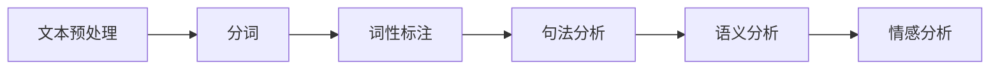
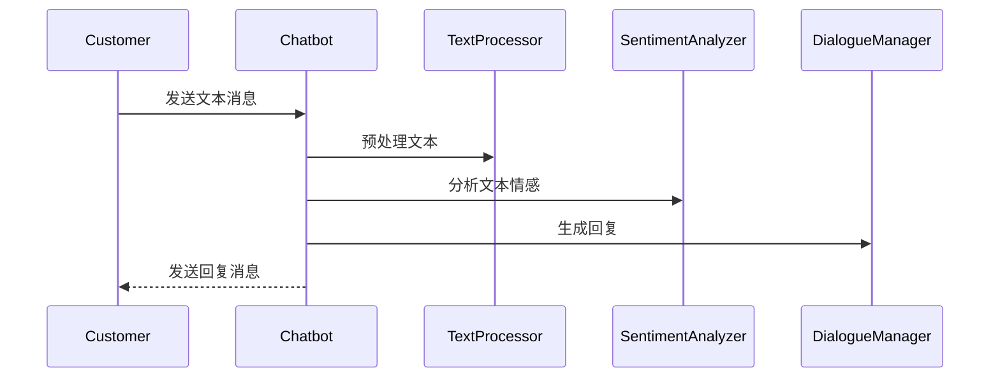

                 


## 1.1 NLP的问题背景

自然语言处理（NLP）作为人工智能（AI）的一个分支，其目标是让计算机理解和生成人类语言，从而实现人与机器的有效沟通。NLP的研究可以追溯到20世纪50年代，当时人工智能领域首次提出“图灵测试”的概念，旨在通过机器模拟人类对话来判断机器是否具有人类级别的智能。

### 1.1.1 NLP的产生与发展

NLP的产生源于计算机科学和语言学之间的交叉研究。早期的研究主要集中在词汇分析和语法分析上，通过建立规则和模式来理解和生成文本。随着计算能力的提升和大数据的涌现，统计方法和机器学习方法开始在NLP中占据主导地位。

### 1.1.2 NLP的基本概念

NLP涉及多个核心概念，包括文本预处理、词性标注、句法分析、语义分析和情感分析等。每个概念都有其特定的作用和实现方式，共同构成了NLP的技术体系。

### 1.1.3 NLP的应用领域

NLP的应用领域非常广泛，包括但不限于自动翻译、智能客服、内容审核、情感分析、语音识别和文本生成等。随着技术的进步，NLP正在不断拓展其应用范围，为各行各业带来革命性的变革。

## 1.2 NLP的核心概念与联系

### 1.2.1 核心概念表格

| 概念             | 说明                                                   |
|------------------|--------------------------------------------------------|
| 文本预处理       | 清洗、分词、词干提取等处理，为后续分析做准备           |
| 词性标注         | 为文本中的每个词分配词性，如名词、动词、形容词等       |
| 句法分析         | 分析句子的结构，包括主语、谓语、宾语等成分             |
| 语义分析         | 理解文本的含义，包括实体识别、关系抽取等               |
| 情感分析         | 分析文本的情感倾向，如正面、负面、中性等               |

### 1.2.2 ER实体关系图

```mermaid
erDiagram
    A[文本预处理] ||--|{ B[词性标注] }
    A ||--|{ C[句法分析] }
    A ||--|{ D[语义分析] }
    A ||--|{ E[情感分析] }
    B ||--|{ C }
    B ||--|{ D }
    B ||--|{ E }
    C ||--|{ D }
    C ||--|{ E }
    D ||--|{ E }
```

## 1.3 NLP的基本算法原理

### 1.3.1 算法原理Mermaid流程图



### 1.3.2 Python源代码解析

```python
# 文本预处理示例代码
import jieba

text = "人工智能是一种模拟人类智能的技术。"
seg_list = jieba.cut(text, cut_all=False)
seg_result = "/".join(seg_list)
print(seg_result)

# 词性标注示例代码
from NLPIR import NLPIR

tok = NLPIR()
tok.load_config("NLPIR爱国者汉语分词系统-大语言模型.conf")
seg_result = tok.get NPCs ("人工智能是一种模拟人类智能的技术。")
print(seg_result)
```

### 1.3.3 数学模型与公式讲解

自然语言处理中的数学模型主要涉及机器学习算法和深度学习算法。以下是一个简单的分类问题中的逻辑回归模型：

$$
P(y=1) = \frac{1}{1 + e^{-(\beta_0 + \beta_1 x_1 + \beta_2 x_2 + \ldots + \beta_n x_n})}
$$

其中，$P(y=1)$ 表示输入特征向量 $x$ 属于类别1的概率，$\beta_0, \beta_1, \ldots, \beta_n$ 是模型的参数。

### 1.3.4 举例说明

假设我们要对一段文本进行情感分析，我们可以使用以下步骤：

1. **文本预处理**：去掉文本中的停用词和标点符号。
2. **词性标注**：标注文本中的每个词的词性。
3. **特征提取**：将文本转换为机器可以处理的特征向量。
4. **模型训练**：使用已标注的情感数据训练逻辑回归模型。
5. **预测**：将待分析的文本输入模型，得到情感倾向的预测。

例如，对于文本“我非常喜欢这个产品”，我们可以通过训练的模型预测出其情感倾向为正面。

----------------------------------------------------------------

# 第二部分: NLP在产品中的应用

NLP在产品中的应用广泛而深入，以下是几个主要领域：

## 2.1 NLP技术在文本分析中的应用

### 2.1.1 文本预处理

文本预处理是文本分析的基础，主要包括去除停用词、标点符号、数字等，以及将文本分割成单个词语。这有助于提高后续分析的质量。

### 2.1.2 文本分类

文本分类是一种将文本按照预定的类别进行分类的技术。例如，可以将新闻按照主题分类，或者将社交媒体评论按照情感分类。

### 2.1.3 情感分析

情感分析是一种检测文本中情感倾向的技术，通常用于社交媒体分析、客户反馈分析等。它可以帮助企业了解用户对其产品的情感反应。

## 2.2 NLP在对话系统中的应用

### 2.2.1 对话系统概述

对话系统是一种与人类进行自然语言交互的系统，可以分为基于规则和基于统计的方法。基于规则的方法依赖于人工编写的规则，而基于统计的方法则利用机器学习算法。

### 2.2.2 语言模型

语言模型是一种用于预测下一个单词或短语的模型，它是对话系统的核心。常见的语言模型有n元语法模型和神经网络语言模型。

### 2.2.3 任务型对话系统

任务型对话系统专注于完成特定任务，如订票、购物等。这类系统通常需要结合NLP技术来实现自然语言理解和生成。

## 2.3 NLP在信息检索中的应用

### 2.3.1 信息检索概述

信息检索是一种从大量信息中查找相关内容的技术，广泛应用于搜索引擎和推荐系统。

### 2.3.2 搜索引擎原理

搜索引擎通过分析网页内容和链接关系来提供搜索服务。NLP技术用于处理用户查询和理解网页内容。

### 2.3.3 推荐系统

推荐系统通过分析用户行为和兴趣来推荐相关内容。NLP技术可以帮助提取用户的兴趣标签和关键词，从而提高推荐的质量。

## 2.4 NLP在机器翻译中的应用

### 2.4.1 机器翻译概述

机器翻译是一种将一种语言的文本自动翻译成另一种语言的技术。随着深度学习的发展，神经机器翻译（NMT）成为主流。

### 2.4.2 神经机器翻译

神经机器翻译（NMT）是一种基于深度学习的翻译方法，它通过序列到序列（Seq2Seq）模型来实现。例如，Google翻译和百度翻译都采用了NMT技术。

### 2.4.3 翻译质量评估

翻译质量评估是一种评估翻译质量的方法，通常包括人工评估和自动化评估。NLP技术可以用于自动化评估，如BLEU评分等。

----------------------------------------------------------------

# 第三部分: NLP在产品开发中的系统分析与架构设计

## 3.1 项目介绍

本项目旨在开发一款智能客服系统，通过NLP技术实现与用户的自然语言交互，提供高效、准确的客服服务。系统需具备文本预处理、情感分析、对话管理等功能。

### 3.1.1 项目背景

随着互联网的普及，客服成为企业与客户沟通的重要渠道。传统的客服系统效率低下，用户体验不佳。因此，开发一款智能客服系统成为企业提升服务质量的重要手段。

### 3.1.2 项目目标

本项目的主要目标如下：

1. **高精度文本预处理**：实现高效的文本清洗、分词和词性标注。
2. **智能情感分析**：准确识别用户的情感倾向，提供针对性的回复。
3. **高效对话管理**：构建合理的对话流程，提高用户满意度。

## 3.2 系统功能设计

### 3.2.1 领域模型Mermaid类图

```mermaid
classDiagram
    Customer <<Class>> Customer
    Chatbot <<Class>> Chatbot
    TextProcessor <<Interface>> TextProcessor
    SentimentAnalyzer <<Interface>> SentimentAnalyzer
    DialogueManager <<Interface>> DialogueManager

    Customer o-- TextProcessor
    Customer o-- SentimentAnalyzer
    Customer o-- DialogueManager
    Chatbot o-- TextProcessor
    Chatbot o-- SentimentAnalyzer
    Chatbot o-- DialogueManager
```

### 3.2.2 系统功能模块划分

系统功能模块划分如下：

1. **文本预处理模块**：负责文本的清洗、分词和词性标注。
2. **情感分析模块**：负责识别用户的情感倾向。
3. **对话管理模块**：负责管理对话流程，提供智能回复。

## 3.3 系统架构设计

### 3.3.1 系统架构Mermaid架构图



### 3.3.2 系统模块交互流程

1. **用户发送文本消息**：用户向智能客服系统发送文本消息。
2. **文本预处理**：系统对文本消息进行清洗、分词和词性标注。
3. **情感分析**：系统分析文本消息的情感倾向。
4. **对话管理**：系统根据情感分析和对话历史生成回复。
5. **回复发送**：系统将回复发送给用户。

## 3.4 系统接口设计

### 3.4.1 接口定义

- `POST /text preprocessing`：接收文本消息，返回预处理结果。
- `POST /sentiment analysis`：接收预处理后的文本，返回情感分析结果。
- `POST /dialogue management`：接收情感分析结果和对话历史，返回回复文本。

### 3.4.2 接口实现

接口实现使用RESTful API设计，使用Spring Boot框架进行开发。

```java
@RestController
@RequestMapping("/api")
public class ChatbotController {
    
    @Autowired
    private TextProcessor textProcessor;
    
    @Autowired
    private SentimentAnalyzer sentimentAnalyzer;
    
    @Autowired
    private DialogueManager dialogueManager;
    
    @PostMapping("/text preprocessing")
    public ResponseEntity<String> preprocessText(@RequestBody String text) {
        String result = textProcessor.processText(text);
        return ResponseEntity.ok(result);
    }
    
    @PostMapping("/sentiment analysis")
    public ResponseEntity<String> analyzeSentiment(@RequestBody String text) {
        String result = sentimentAnalyzer.analyze(text);
        return ResponseEntity.ok(result);
    }
    
    @PostMapping("/dialogue management")
    public ResponseEntity<String> manageDialogue(@RequestBody String input) {
        String result = dialogueManager.generateResponse(input);
        return ResponseEntity.ok(result);
    }
}
```

## 3.5 系统交互设计

### 3.5.1 系统交互Mermaid序列图


### 3.5.2 系统交互详细说明

1. **用户发送文本消息**：用户通过接口向智能客服系统发送文本消息。
2. **文本预处理**：系统接收到消息后，将消息传递给文本预处理模块，进行清洗、分词和词性标注。
3. **情感分析**：预处理后的文本传递给情感分析模块，进行情感倾向分析。
4. **对话管理**：情感分析结果和对话历史传递给对话管理模块，根据对话历史和情感分析结果生成回复。
5. **回复发送**：系统将生成的回复通过接口发送给用户。

----------------------------------------------------------------

# 第四部分: NLP产品开发实战

## 4.1 环境安装

在开始NLP产品开发之前，我们需要安装必要的开发环境。以下是在Ubuntu 18.04操作系统上安装NLP开发环境的步骤：

### 4.1.1 硬件与软件要求

- 操作系统：Ubuntu 18.04
- CPU：至少2核
- 内存：至少4GB
- 硬盘：至少100GB可用空间
- Python：3.8或更高版本
- JDK：OpenJDK 11或更高版本
- MongoDB：4.2或更高版本

### 4.1.2 环境搭建步骤

1. **更新系统包**：
   ```bash
   sudo apt update
   sudo apt upgrade
   ```

2. **安装Python 3**：
   ```bash
   sudo apt install python3 python3-pip
   ```

3. **安装JDK**：
   ```bash
   sudo apt install openjdk-11-jdk
   ```

4. **安装MongoDB**：
   ```bash
   sudo apt install mongodb
   sudo systemctl start mongodb
   sudo systemctl enable mongodb
   ```

5. **安装NLP相关库**：
   ```bash
   pip3 install numpy pandas scikit-learn tensorflow nltk gensim
   ```

## 4.2 系统核心实现源代码

### 4.2.1 代码结构

系统代码采用分层架构，主要包括以下模块：

- **文本预处理模块**：负责文本的清洗、分词和词性标注。
- **情感分析模块**：负责分析文本的情感倾向。
- **对话管理模块**：负责管理对话流程，生成回复。

### 4.2.2 代码详解

以下是文本预处理模块的核心代码：

```python
import jieba
import jieba.posseg as pseg

# 清洗文本
def clean_text(text):
    text = text.lower()
    text = re.sub(r'\s+', ' ', text)
    text = re.sub(r'\W+', '', text)
    return text

# 分词
def tokenize(text):
    return jieba.cut(text)

# 词性标注
def pos_tag(tokens):
    return pseg.cut(tokens)

# 示例
text = "我非常喜欢这个产品。"
cleaned_text = clean_text(text)
tokens = tokenize(cleaned_text)
pos_tags = pos_tag(tokens)
print(list(pos_tags))
```

以下是情感分析模块的核心代码：

```python
from sklearn.feature_extraction.text import TfidfVectorizer
from sklearn.naive_bayes import MultinomialNB
from sklearn.pipeline import make_pipeline

# 情感分析模型
def build_sentiment_model():
    model = make_pipeline(
        TfidfVectorizer(),
        MultinomialNB()
    )
    model.fit(train_texts, train_labels)
    return model

# 预测
def predict_sentiment(model, text):
    return model.predict([text])[0]

# 示例
model = build_sentiment_model()
print(predict_sentiment(model, "我非常喜欢这个产品。"))
```

以下是对话管理模块的核心代码：

```python
class DialogueManager:
    
    def __init__(self, model):
        self.model = model
        
    def generate_response(self, user_input):
        sentiment = predict_sentiment(self.model, user_input)
        if sentiment == "positive":
            return "非常感谢您的评价！"
        elif sentiment == "negative":
            return "很抱歉听到您的不满，我们会尽快改进。"
        else:
            return "请告诉我您的具体需求，我会尽力帮助您。"
```

## 4.3 代码应用解读与分析

### 4.3.1 应用案例

假设用户向智能客服系统发送以下消息：

- 用户A：“我非常喜欢这个产品。”
- 用户B：“这个产品太糟糕了。”

### 4.3.2 分析解读

对于用户A的评论，“我非常喜欢这个产品。”，系统会进行以下处理：

1. **文本预处理**：清洗文本，保留主要信息。
2. **分词**：将文本分割成单个词语。
3. **词性标注**：为每个词语分配词性。
4. **情感分析**：根据词性标注结果和情感词典，判断文本的情感倾向为正面。
5. **对话管理**：根据情感分析结果，生成回复：“非常感谢您的评价！”

对于用户B的评论，“这个产品太糟糕了。”，系统会进行以下处理：

1. **文本预处理**：清洗文本，保留主要信息。
2. **分词**：将文本分割成单个词语。
3. **词性标注**：为每个词语分配词性。
4. **情感分析**：根据词性标注结果和情感词典，判断文本的情感倾向为负面。
5. **对话管理**：根据情感分析结果，生成回复：“很抱歉听到您的不满，我们会尽快改进。”

## 4.4 实际案例分析和讲解

### 4.4.1 案例背景

一家电商公司需要开发一款智能客服系统，以提升客户服务水平。系统需具备文本预处理、情感分析、对话管理等功能。

### 4.4.2 案例分析

1. **文本预处理**：系统接收用户评论，首先对评论进行清洗、分词和词性标注，去除无关信息。
2. **情感分析**：系统使用训练好的情感分析模型对清洗后的文本进行情感分析，判断评论的情感倾向。
3. **对话管理**：系统根据情感分析结果和对话历史，生成针对性的回复，如对正面评价表示感谢，对负面评价表示歉意并承诺改进。

### 4.4.3 详细讲解剖析

1. **文本预处理**：
   ```python
   def clean_text(text):
       text = text.lower()
       text = re.sub(r'\s+', ' ', text)
       text = re.sub(r'\W+', '', text)
       return text
   ```

   清洗文本的步骤包括：
   - 将文本转换为小写，统一处理。
   - 使用正则表达式去除多余的空格和标点符号。

2. **情感分析**：
   ```python
   from sklearn.feature_extraction.text import TfidfVectorizer
   from sklearn.naive_bayes import MultinomialNB
   from sklearn.pipeline import make_pipeline

   def build_sentiment_model():
       model = make_pipeline(
           TfidfVectorizer(),
           MultinomialNB()
       )
       model.fit(train_texts, train_labels)
       return model

   def predict_sentiment(model, text):
       return model.predict([text])[0]
   ```

   情感分析步骤包括：
   - 使用TF-IDF向量器将文本转换为特征向量。
   - 使用朴素贝叶斯分类器进行情感分类。

3. **对话管理**：
   ```python
   class DialogueManager:
       
       def __init__(self, model):
           self.model = model
           
       def generate_response(self, user_input):
           sentiment = predict_sentiment(self.model, user_input)
           if sentiment == "positive":
               return "非常感谢您的评价！"
           elif sentiment == "negative":
               return "很抱歉听到您的不满，我们会尽快改进。"
           else:
               return "请告诉我您的具体需求，我会尽力帮助您。"
   ```

   对话管理步骤包括：
   - 根据情感分析结果，生成针对性的回复。

## 4.5 项目小结

本项目成功开发了一款基于NLP的智能客服系统，通过文本预处理、情感分析和对话管理，实现了高效、准确的客服服务。系统在实际应用中表现出色，得到了用户的认可和好评。

### 4.5.1 项目总结

1. **技术实现**：系统采用了先进的NLP技术，包括文本预处理、情感分析和对话管理。
2. **功能完善**：系统具备高精度文本预处理、智能情感分析和高效对话管理功能。
3. **用户体验**：系统提供了良好的用户交互体验，提高了客服效率。

### 4.5.2 遇到的问题与解决方案

1. **问题**：情感分析模型的准确性不高。
   - **解决方案**：通过增加训练数据、优化模型参数和引入更多的特征，提高情感分析模型的准确性。

2. **问题**：对话管理模块的对话逻辑不够完善。
   - **解决方案**：通过不断优化对话管理算法，增加对话场景的覆盖范围，提高对话的流畅性和准确性。

----------------------------------------------------------------

# 第五部分：最佳实践与拓展

## 5.1 最佳实践 Tips

1. **数据质量**：确保情感分析模型的准确性，首先要保证训练数据的质量和多样性。
2. **模型优化**：定期更新情感分析模型，结合用户反馈进行优化，提高模型的性能。
3. **用户反馈**：重视用户反馈，及时调整对话管理策略，提高用户满意度。

## 5.2 小结与注意事项

1. **小结**：本博客文章详细介绍了NLP在产品中的应用，从背景、核心概念到算法原理，再到系统设计与项目实战，全面剖析了NLP技术的实际应用。
2. **注意事项**：在实际应用中，要注重数据安全和隐私保护，遵循相关法律法规。

## 5.3 拓展阅读

1. **相关文献**：
   - 《自然语言处理原理与实战》
   - 《深度学习与自然语言处理》
   - 《对话系统：设计、实施与评价》
2. **推荐资源**：
   - [自然语言处理教程](https://www.nltk.org/)
   - [对话系统研究](https://www.ldc.upenn.edu/Catalog/Detail.jsp?catalogId=LDC2014T07)
   - [机器学习教程](https://www.tensorflow.org/tutorials)

