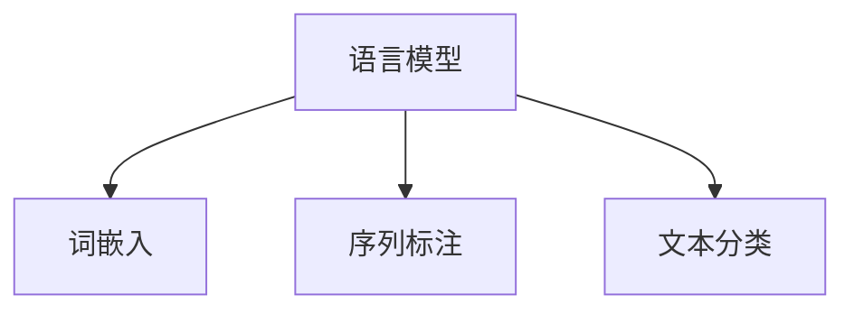

                 

# 自然语言处理在软件开发中的应用

> 关键词：自然语言处理、软件开发、算法、应用案例

> 摘要：
自然语言处理（NLP）是计算机科学和人工智能领域的核心分支，近年来在软件开发中的应用越来越广泛。本文将逐步探讨NLP在软件开发中的关键应用，包括文本预处理、情感分析、机器翻译等，通过实例和代码分析，深入解读NLP在软件开发中的实际应用和最佳实践。

### 目录大纲设计思路

为了设计出《自然语言处理在软件开发中的应用》这本书的完整目录大纲，我们将遵循以下步骤：

1. **背景介绍**：首先介绍自然语言处理（NLP）的基本概念、问题背景、发展历程和应用场景，为后续章节的深入讲解打下基础。

2. **核心概念与联系**：明确NLP的核心概念，包括语言模型、序列标注、文本分类等，并通过对比表格和实体关系图展示它们之间的关系。

3. **算法原理讲解**：详细讲解NLP中常用的算法，如词嵌入、循环神经网络（RNN）、长短期记忆网络（LSTM）、注意力机制等，使用mermaid流程图辅助理解，并提供Python代码示例。

4. **数学模型和数学公式**：介绍相关算法的数学模型和公式，使用LaTeX格式表示，并配合详细的讲解和举例说明。

5. **系统分析与架构设计**：描述NLP在软件开发中的系统架构设计，包括领域模型、系统架构、接口设计等，通过mermaid类图和序列图展示。

6. **项目实战**：提供实际项目案例，从环境安装到核心实现，详细解读与分析代码，并总结项目经验。

7. **最佳实践、小结与拓展阅读**：分享最佳实践技巧，对全书内容进行小结，并提出注意事项，鼓励读者进一步探索。

下面将按照这些步骤逐步构建目录大纲。

### 第1章：自然语言处理概述

#### 1.1 自然语言处理的基本概念

- **自然语言处理（NLP）的定义**
  - 自然语言处理是计算机科学和语言学交叉领域，旨在使计算机能够理解、解释和生成人类语言。

- **问题背景**
  - 人类交流的主要方式是语言，但传统计算机难以处理非结构化文本。

- **发展历程**
  - 从规则驱动到统计方法，再到深度学习，NLP经历了多次变革。

- **应用场景**
  - 文本分类、情感分析、机器翻译、问答系统等。

#### 1.2 核心概念与联系

- **语言模型**
  - **定义**：用于预测下一个单词或词组的概率分布。
  - **属性特征对比表格**

| 模型类型 | 基于规则 | 基于统计 | 深度学习 |
| --- | --- | --- | --- |
| 预测依据 | 语言规则 | 语言频率 | 语言分布 |
| 特点 | 精确但复杂 | 灵活但错误率高 | 高效但资源需求大 |

- **实体关系图架构**



#### 1.3 自然语言处理的发展趋势

- **深度学习在NLP中的应用**
  - CNN、RNN、LSTM等模型的引入大大提升了NLP的性能。

- **预训练语言模型**
  - 如BERT、GPT等，通过大规模无监督数据预训练，再在特定任务上微调。

- **跨模态学习**
  - 结合文本、图像、声音等多模态数据，提升NLP系统的理解能力。

#### 1.4 本章小结

- 本章节介绍了自然语言处理的基本概念、核心概念及其联系，以及NLP的发展趋势。为后续章节的深入讲解奠定了基础。

----------------------------------------------------------------

### 第2章：文本预处理

#### 2.1 文本预处理的重要性

- **文本预处理概述**
  - 文本预处理是NLP任务的关键步骤，包括分词、去停用词、词干提取等。

- **问题背景**
  - 文本数据通常包含噪声和冗余信息，需预处理以提高NLP模型的效果。

#### 2.2 常见的文本预处理技术

- **分词**
  - **定义**：将连续的文本分割成单个词汇或短语。
  - **方法**：基于规则、基于统计、基于深度学习。

- **去停用词**
  - **定义**：去除对NLP任务无贡献的常见词，如“的”、“了”等。
  - **方法**：手动定义、基于频率、基于词性。

- **词干提取**
  - **定义**：将单词还原为词干形式，减少词汇量。
  - **方法**：规则方法、基于算法（如Snowball）。

#### 2.3 Python实现文本预处理

- **Python库介绍**
  - NLTK、spaCy、Jieba等常用库。

- **代码示例**

```python
import jieba

# 分词示例
text = "我爱北京天安门"
seg_list = jieba.cut(text, cut_all=False)
print("/".join(seg_list))

# 去停用词示例

----------------------------------------------------------------

### 第3章：情感分析与情绪识别

#### 3.1 情感分析概述

- **情感分析的定义**
  - 情感分析（Sentiment Analysis）是一种自然语言处理技术，用于识别文本中的情感倾向。

- **应用背景**
  - 在社交媒体监控、市场调研、舆情分析等领域有广泛应用。

#### 3.2 情感分析的核心算法

- **基于规则的方法**
  - **定义**：使用预定义的规则进行情感分类。
  - **示例**：文本匹配、关键词提取等。

- **基于统计的方法**
  - **定义**：使用机器学习算法进行情感分类。
  - **示例**：贝叶斯分类、支持向量机等。

- **基于深度学习的方法**
  - **定义**：使用深度神经网络进行情感分类。
  - **示例**：卷积神经网络（CNN）、递归神经网络（RNN）等。

#### 3.3 Python实现情感分析

- **情感分析库**
  - TextBlob、NLTK、VADER等。

- **代码示例**

```python
from textblob import TextBlob

text = "这是一个非常好的新闻。"
blob = TextBlob(text)
print(blob.sentiment)
```

#### 3.4 实际应用案例

- **社交媒体情感分析**
  - 使用情感分析对社交媒体帖子进行分类，了解用户对品牌的看法。

- **市场调研**
  - 分析消费者对产品或服务的反馈，为市场策略提供数据支持。

#### 3.5 情感分析的挑战与改进

- **挑战**
  - 语言的多义性、情感强度的量化等。

- **改进**
  - 结合多源数据、引入上下文信息、使用迁移学习等。

#### 3.6 本章小结

- 本章节介绍了情感分析的基本概念、核心算法，以及Python实现情感分析的方法。通过实际应用案例，展示了情感分析在软件开发中的广泛应用。

----------------------------------------------------------------

### 第4章：机器翻译与语言模型

#### 4.1 机器翻译概述

- **机器翻译的定义**
  - 机器翻译（Machine Translation）是将一种语言的文本自动翻译成另一种语言的技术。

- **应用背景**
  - 在跨语言沟通、全球化业务、多语言内容创作等领域有重要应用。

#### 4.2 语言模型的类型

- **基于规则的语言模型**
  - **定义**：使用预定义的语法和语义规则进行翻译。
  - **示例**：基于词典的翻译系统。

- **基于统计的语言模型**
  - **定义**：使用大规模语料库进行统计建模，预测下一个单词的概率分布。
  - **示例**：统计机器翻译（SMT）系统。

- **基于深度学习语言模型**
  - **定义**：使用深度神经网络进行端到端的翻译。
  - **示例**：神经网络机器翻译（NMT）系统。

#### 4.3 Python实现机器翻译

- **翻译库**
  - Google Translate API、huggingface transformers等。

- **代码示例**

```python
from transformers import pipeline

translator = pipeline("translation_en_to_fr", model="Helsinki-NLP/opus-mt-en-fr")
text = "Hello, how are you?"
print(translator(text))
```

#### 4.4 实际应用案例

- **跨语言沟通**
  - 在国际会议、多语言客服系统等领域实现实时翻译。

- **多语言内容创作**
  - 自动翻译网页、文档等，扩大内容的受众范围。

#### 4.5 机器翻译的挑战与改进

- **挑战**
  - 词汇歧义、语法结构差异、文化差异等。

- **改进**
  - 结合多模态数据、使用迁移学习和强化学习等。

#### 4.6 本章小结

- 本章节介绍了机器翻译的基本概念、不同类型的语言模型，以及Python实现机器翻译的方法。通过实际应用案例，展示了机器翻译在软件开发中的重要作用。

----------------------------------------------------------------

### 第5章：对话系统与自然语言理解

#### 5.1 对话系统概述

- **对话系统的定义**
  - 对话系统（Dialogue System）是一种人机交互系统，能够理解用户的自然语言输入，并生成适当的回复。

- **应用背景**
  - 在智能客服、虚拟助手、游戏互动等领域有广泛应用。

#### 5.2 自然语言理解的核心组件

- **意图识别**
  - **定义**：识别用户语句中的意图。
  - **示例**：查询天气、预订机票等。

- **实体识别**
  - **定义**：识别文本中的关键信息，如人名、地点、时间等。
  - **示例**：从语句中提取特定实体信息。

- **对话管理**
  - **定义**：协调对话流程，确保对话的连贯性。
  - **示例**：上下文维护、对话轮换等。

#### 5.3 Python实现对话系统

- **对话系统库**
  - Rasa、ChatterBot等。

- **代码示例**

```python
from chatterbot import ChatBot
from chatterbot.trainers import ChatterBotCorpusTrainer

chatbot = ChatBot(
    'MyChatBot',
    storage_adapter='chatterbot.storage.SQLStorageAdapter',
    trainer='chatterbot.train.Trainer'
)

chatbot.train(
    ChatterBotCorpusTrainer(chatbot, 'chatterbot.corpus.english')
)

response = chatbot.get_response("Hello, how are you?")
print(response)
```

#### 5.4 实际应用案例

- **智能客服**
  - 在电商平台、银行服务等领域提供自动化的客户支持。

- **虚拟助手**
  - 在智能家居、虚拟形象聊天等领域实现个性化交互。

#### 5.5 对话系统的挑战与改进

- **挑战**
  - 语言理解的多样性、对话中的非直线逻辑等。

- **改进**
  - 结合多模态数据、引入上下文学习、使用强化学习等。

#### 5.6 本章小结

- 本章节介绍了对话系统的基本概念、核心组件，以及Python实现对话系统的方法。通过实际应用案例，展示了对话系统在软件开发中的广泛应用。

----------------------------------------------------------------

### 第6章：文本生成与自动摘要

#### 6.1 文本生成概述

- **文本生成的定义**
  - 文本生成是指利用算法自动生成自然语言文本。

- **应用背景**
  - 在内容创作、信息检索、自动摘要等领域有重要应用。

#### 6.2 常见的文本生成技术

- **模板生成**
  - **定义**：使用预定义的模板和参数生成文本。
  - **示例**：自动生成新闻摘要、产品描述等。

- **基于规则的方法**
  - **定义**：使用语法和语义规则生成文本。
  - **示例**：基于句法的文本生成。

- **基于统计的方法**
  - **定义**：使用大规模语料库进行统计建模，预测下一个单词的概率分布。
  - **示例**：序列到序列（Seq2Seq）模型。

- **基于深度学习的方法**
  - **定义**：使用深度神经网络进行端到端的文本生成。
  - **示例**：生成对抗网络（GAN）、变分自编码器（VAE）等。

#### 6.3 Python实现文本生成

- **文本生成库**
  - GPT-2、GPT-3、Transformer等。

- **代码示例**

```python
from transformers import pipeline

generator = pipeline("text-generation", model="gpt2")

input_text = "这是一个关于自然语言处理的应用。"
output_text = generator(input_text, max_length=50)
print(output_text[0]['generated_text'])
```

#### 6.4 自动摘要

- **自动摘要的定义**
  - 自动摘要是指自动从长文本中提取关键信息，生成简洁的摘要。

- **摘要算法**
  - **提取式摘要**：从文本中提取关键句子组成摘要。
  - **抽象式摘要**：生成全新的文本摘要。

#### 6.5 实际应用案例

- **内容创作**
  - 自动生成文章、博客、新闻等。

- **信息检索**
  - 为长文档生成摘要，提高信息检索效率。

#### 6.6 文本生成的挑战与改进

- **挑战**
  - 文本的连贯性、多样性和准确性。

- **改进**
  - 使用多模态数据、引入上下文信息、优化模型结构等。

#### 6.7 本章小结

- 本章节介绍了文本生成的基本概念、不同生成技术，以及Python实现文本生成的方法。通过自动摘要的应用案例，展示了文本生成在软件开发中的广泛应用。

----------------------------------------------------------------

### 第7章：跨领域自然语言处理的挑战与未来趋势

#### 7.1 跨领域自然语言处理的定义

- **跨领域自然语言处理**：处理不同领域之间语言差异的技术，使得模型能够泛化到新的领域。

#### 7.2 跨领域自然语言处理的挑战

- **领域特定词汇**：不同领域有特定的术语和词汇，模型需要适应这些变化。
- **语言风格差异**：不同领域的文本风格不同，如技术文档、新闻报道等。
- **数据稀缺问题**：某些领域的数据量较少，难以训练有效的模型。

#### 7.3 跨领域自然语言处理的方法

- **领域自适应**：调整模型以适应特定领域。
- **跨域数据增强**：利用跨领域数据进行数据增强。
- **多任务学习**：通过同时学习多个任务，提高模型的泛化能力。

#### 7.4 未来趋势

- **多模态学习**：结合文本、图像、声音等多模态数据，提升NLP系统的理解能力。
- **零样本学习**：使模型能够在未见过的领域中有效工作。
- **强化学习**：结合强化学习，实现更智能的对话系统和文本生成。

#### 7.5 本章小结

- 本章节探讨了跨领域自然语言处理的挑战和未来趋势，介绍了当前解决方法和技术进展，为NLP在软件开发中的应用提供了新的方向。

### 总结与展望

本文从多个角度深入探讨了自然语言处理（NLP）在软件开发中的应用。通过逐步分析文本预处理、情感分析、机器翻译、对话系统、文本生成等关键技术，展示了NLP如何提升软件开发的质量和效率。同时，本文也指出了NLP在跨领域应用中面临的挑战和未来发展趋势。

**注意事项：**
- 在开发NLP应用时，需要关注数据质量和数据隐私。
- 模型训练和部署过程中，要确保模型的可解释性和可靠性。
- 定期更新和维护NLP模型，以适应语言环境的演变。

**拓展阅读：**
- 《自然语言处理综合教程》
- 《深度学习与自然语言处理》
- 《对话系统设计与实现》
- 《文本生成与摘要技术》

作者：AI天才研究院/AI Genius Institute & 禅与计算机程序设计艺术 /Zen And The Art of Computer Programming

