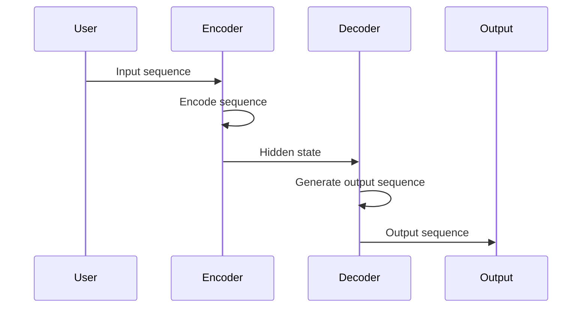
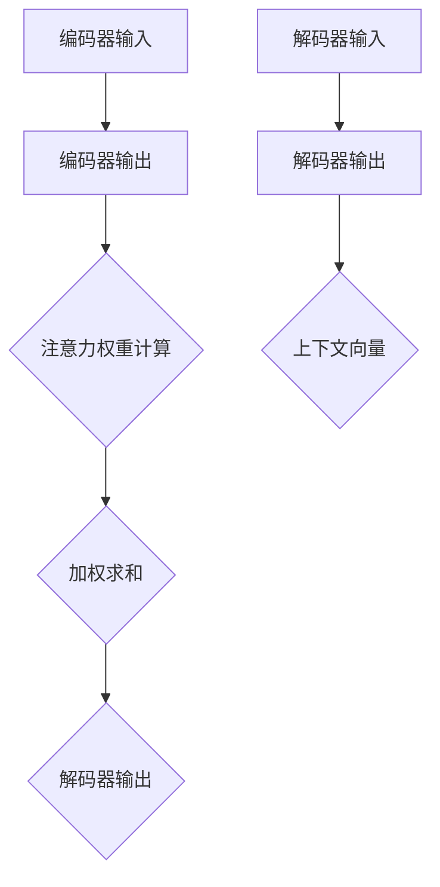
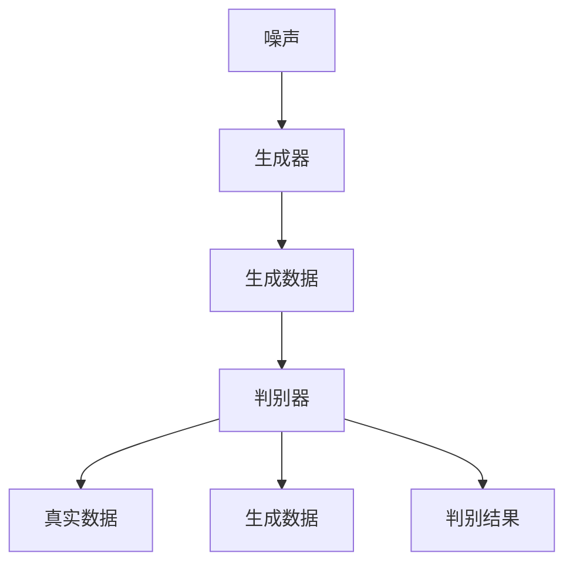
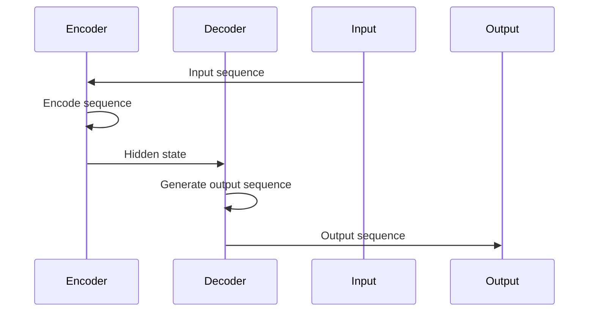
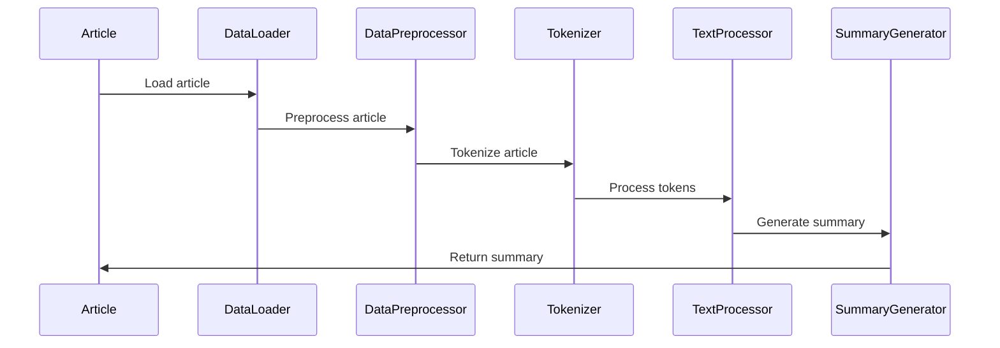

                 

### 文章标题

**《自然语言生成：AI写作与内容创作》**

在数字化时代，自然语言生成（NLG）技术正在迅速崛起，成为人工智能领域中的一颗耀眼明星。NLG是一种通过机器学习算法生成自然语言文本的技术，其应用范围广泛，从自动写作新闻摘要、生成营销文案，到构建虚拟助手、辅助编程，都展示了其强大的潜力。本文将深入探讨自然语言生成技术，从基本概念、算法原理到实际应用，逐步揭示其背后的奥秘，并展望未来发展的无限可能。

本文关键词：自然语言生成、AI写作、内容创作、算法原理、应用场景、项目实战。

**摘要：**
本文旨在系统介绍自然语言生成（NLG）技术，解析其在AI写作与内容创作领域的广泛应用。首先，我们将概述NLG的基本概念和历史背景，解释其在现代信息技术中的重要性。接着，本文将详细探讨NLG的核心算法原理，包括序列到序列模型、注意力机制和生成对抗网络（GAN）等。随后，我们将分析NLG在实际应用中的多种场景，如内容创作自动化、虚拟助手和对话系统等。为了加深理解，本文还将提供具体的实战案例和项目实践。最后，本文将总结NLG技术的当前成就与挑战，并提出未来的发展方向和最佳实践。

### 目录大纲设计思路

在设计《自然语言生成：AI写作与内容创作》的目录大纲时，我们遵循了以下步骤：

1. **明确主题**：首先，我们明确了书籍的主题——自然语言生成（NLG）在AI写作与内容创作中的应用。这决定了目录结构需要覆盖NLG的基本概念、算法原理、应用场景和实战案例。

2. **构建框架**：根据主题和目标读者，我们构建了一个清晰的框架，包括引言与背景、核心概念与原理、算法与模型讲解、应用场景与案例分析、实战指导与项目实践以及总结与拓展。

3. **细化章节内容**：在每个部分下，我们细化了具体的章节内容，确保每个章节都能提供足够的信息，同时保持章节之间的逻辑连贯性。

4. **保持简洁**：尽管需要包含丰富的信息，但目录本身也需要简洁明了，避免冗余。

5. **确保完整性**：我们确保了目录中包含至少7章，每个章节都有具体的标题和内容概述。

6. **使用Markdown格式**：我们按照Markdown格式的要求，使用合适的标题和编号来组织目录。

### 目录大纲

**第一部分：引言与背景**

## 1.1 自然语言生成概述

### 1.1.1 自然语言生成的重要性

### 1.1.2 自然语言生成的应用领域

### 1.1.3 自然语言生成的挑战与机遇

## 1.2 AI写作与内容创作的关系

### 1.2.1 AI写作的基本概念

### 1.2.2 内容创作与自然语言生成的结合

### 1.2.3 AI写作与内容创作的未来发展趋势

**第二部分：核心概念与原理**

## 2.1 自然语言处理基础

### 2.1.1 语言模型与文本处理

### 2.1.2 词嵌入与词向量表示

### 2.1.3 语言模型的训练与评估

## 2.2 自然语言生成技术

### 2.2.1 序列到序列模型

### 2.2.2 注意力机制

### 2.2.3 生成对抗网络（GAN）

## 2.3 常见自然语言生成模型

### 2.3.1 基于规则的方法

### 2.3.2 基于统计的方法

### 2.3.3 基于神经网络的生成模型

**第三部分：算法与模型讲解**

## 3.1 Transformer模型原理

### 3.1.1 Transformer模型概述

### 3.1.2 自注意力机制

### 3.1.3 编码器与解码器架构

## 3.2 GPT模型详解

### 3.2.1 GPT模型的发展历程

### 3.2.2 GPT模型的原理与结构

### 3.2.3 GPT模型的应用实例

## 3.3 语言模型训练与优化

### 3.3.1 语言模型训练过程

### 3.3.2 训练数据的预处理

### 3.3.3 优化策略与超参数调优

**第四部分：应用场景与案例分析**

## 4.1 内容创作自动化

### 4.1.1 新闻摘要与生成

### 4.1.2 博客文章生成

### 4.1.3 社交媒体内容创作

## 4.2 虚拟助手与对话系统

### 4.2.1 虚拟助手的应用

### 4.2.2 对话系统的设计

### 4.2.3 常见问题与解决方案

## 4.3 教育与医疗领域

### 4.3.1 教育场景中的自然语言生成

### 4.3.2 医疗领域的自然语言处理应用

### 4.3.3 案例分析

**第五部分：实战指导与项目实践**

## 5.1 环境搭建与准备工作

### 5.1.1 开发环境配置

### 5.1.2 必备工具与库

### 5.1.3 数据集获取与预处理

## 5.2 自然语言生成项目实战

### 5.2.1 项目背景与需求分析

### 5.2.2 系统设计

### 5.2.3 核心代码实现

### 5.2.4 项目测试与优化

## 5.3 案例分析

### 5.3.1 案例一：新闻摘要生成系统

### 5.3.2 案例二：虚拟助手对话系统

### 5.3.3 案例三：教育场景自然语言生成

**第六部分：总结与拓展**

## 6.1 总结

### 6.1.1 自然语言生成的主要成果

### 6.1.2 存在的挑战与未来方向

## 6.2 注意事项与最佳实践

### 6.2.1 设计自然语言生成系统的关键点

### 6.2.2 性能优化与资源管理

### 目录大纲设计思路

在设计《自然语言生成：AI写作与内容创作》的目录大纲时，我们遵循了以下步骤：

1. **明确主题**：首先，我们明确了书籍的主题——自然语言生成（NLG）在AI写作与内容创作中的应用。这决定了目录结构需要覆盖NLG的基本概念、算法原理、应用场景和实战案例。

2. **构建框架**：根据主题和目标读者，我们构建了一个清晰的框架，包括引言与背景、核心概念与原理、算法与模型讲解、应用场景与案例分析、实战指导与项目实践以及总结与拓展。

3. **细化章节内容**：在每个部分下，我们细化了具体的章节内容，确保每个章节都能提供足够的信息，同时保持章节之间的逻辑连贯性。

4. **保持简洁**：尽管需要包含丰富的信息，但目录本身也需要简洁明了，避免冗余。

5. **确保完整性**：我们确保了目录中包含至少7章，每个章节都有具体的标题和内容概述。

6. **使用Markdown格式**：我们按照Markdown格式的要求，使用合适的标题和编号来组织目录。

### 目录大纲

**第一部分：引言与背景**

## 1.1 自然语言生成概述

### 1.1.1 自然语言生成的重要性

### 1.1.2 自然语言生成的应用领域

### 1.1.3 自然语言生成的挑战与机遇

## 1.2 AI写作与内容创作的关系

### 1.2.1 AI写作的基本概念

### 1.2.2 内容创作与自然语言生成的结合

### 1.2.3 AI写作与内容创作的未来发展趋势

**第二部分：核心概念与原理**

## 2.1 自然语言处理基础

### 2.1.1 语言模型与文本处理

### 2.1.2 词嵌入与词向量表示

### 2.1.3 语言模型的训练与评估

## 2.2 自然语言生成技术

### 2.2.1 序列到序列模型

### 2.2.2 注意力机制

### 2.2.3 生成对抗网络（GAN）

## 2.3 常见自然语言生成模型

### 2.3.1 基于规则的方法

### 2.3.2 基于统计的方法

### 2.3.3 基于神经网络的生成模型

**第三部分：算法与模型讲解**

## 3.1 Transformer模型原理

### 3.1.1 Transformer模型概述

### 3.1.2 自注意力机制

### 3.1.3 编码器与解码器架构

## 3.2 GPT模型详解

### 3.2.1 GPT模型的发展历程

### 3.2.2 GPT模型的原理与结构

### 3.2.3 GPT模型的应用实例

## 3.3 语言模型训练与优化

### 3.3.1 语言模型训练过程

### 3.3.2 训练数据的预处理

### 3.3.3 优化策略与超参数调优

**第四部分：应用场景与案例分析**

## 4.1 内容创作自动化

### 4.1.1 新闻摘要与生成

### 4.1.2 博客文章生成

### 4.1.3 社交媒体内容创作

## 4.2 虚拟助手与对话系统

### 4.2.1 虚拟助手的应用

### 4.2.2 对话系统的设计

### 4.2.3 常见问题与解决方案

## 4.3 教育与医疗领域

### 4.3.1 教育场景中的自然语言生成

### 4.3.2 医疗领域的自然语言处理应用

### 4.3.3 案例分析

**第五部分：实战指导与项目实践**

## 5.1 环境搭建与准备工作

### 5.1.1 开发环境配置

### 5.1.2 必备工具与库

### 5.1.3 数据集获取与预处理

## 5.2 自然语言生成项目实战

### 5.2.1 项目背景与需求分析

### 5.2.2 系统设计

### 5.2.3 核心代码实现

### 5.2.4 项目测试与优化

## 5.3 案例分析

### 5.3.1 案例一：新闻摘要生成系统

### 5.3.2 案例二：虚拟助手对话系统

### 5.3.3 案例三：教育场景自然语言生成

**第六部分：总结与拓展**

## 6.1 总结

### 6.1.1 自然语言生成的主要成果

### 6.1.2 存在的挑战与未来方向

## 6.2 注意事项与最佳实践

### 6.2.1 设计自然语言生成系统的关键点

### 6.2.2 性能优化与资源管理

### 核心概念与联系

自然语言生成（NLG）是一个涉及多个核心概念的复杂领域。为了更好地理解NLG，我们需要首先明确几个关键概念，并探讨它们之间的关系。

1. **自然语言处理（NLP）**：自然语言处理是计算机科学和人工智能领域的一个分支，旨在让计算机理解和生成人类语言。NLP是NLG的基础，它涵盖了文本分类、情感分析、实体识别等多种任务。

2. **语言模型**：语言模型是一种统计模型，用于预测文本序列的概率。在NLG中，语言模型用于生成文本，是构建自然语言生成系统的基础。

3. **序列到序列（Seq2Seq）模型**：Seq2Seq模型是一种将一个序列映射到另一个序列的模型，广泛应用于机器翻译和对话系统等任务。它由编码器和解码器两个部分组成，能够处理变长的输入和输出序列。

4. **注意力机制**：注意力机制是一种在序列到序列模型中用于提高生成文本质量的技术。它通过关注输入序列的不同部分来提高模型对上下文信息的利用效率。

5. **生成对抗网络（GAN）**：GAN是一种生成模型，由生成器和判别器两个部分组成。生成器生成数据，判别器判断生成数据与真实数据的区别。GAN在自然语言生成中可用于生成高质量、多样化的文本。

**概念属性特征对比表格**

| 概念         | 属性特征                                      | 对比分析                                       |
|------------|---------------------------------------------|--------------------------------------------|
| 自然语言处理（NLP） | 强调理解人类语言，包括语音识别、语义分析等           | 与NLG紧密相关，是NLG的基础技术                  |
| 语言模型       | 用于预测文本序列的概率，常用基于统计和神经网络的方法  | NLG的核心组件，用于生成文本                      |
| Seq2Seq模型   | 将输入序列映射到输出序列，常用于机器翻译和对话系统     | 结构清晰，能够处理变长序列，但需要大量训练数据    |
| 注意力机制     | 提高序列到序列模型对上下文信息的利用效率             | 提升生成文本的质量，是许多NLG模型的重要组成部分   |
| GAN         | 通过生成器和判别器的对抗训练生成高质量数据           | 适用于生成多样化、高质量的文本，但训练难度较大     |

**ER实体关系图架构**

```mermaid
erDiagram
  Customer ||--|{ Order }|
  Product ||--|{ Order }|
  Order ||--|{ Customer }|
  Order ||--|{ Product }|
```

在上面的ER图中，我们定义了四个实体：Customer（客户）、Product（产品）、Order（订单），以及它们之间的关系。这个图展示了订单与客户、产品之间的关联，为理解NLG在订单生成中的应用提供了直观的视角。

通过上述概念和关系的分析，我们可以更好地理解自然语言生成的复杂性和应用潜力。接下来，我们将深入探讨NLG的算法原理，进一步揭示其背后的技术奥秘。

### 核心算法原理

自然语言生成（NLG）的核心算法原理包括序列到序列（Seq2Seq）模型、注意力机制和生成对抗网络（GAN）。这些算法在NLG中扮演着至关重要的角色，各自具有独特的原理和应用。

#### 序列到序列（Seq2Seq）模型

**原理：** Seq2Seq模型是一种将输入序列映射到输出序列的端到端学习模型，常用于机器翻译、对话系统等任务。它由编码器（Encoder）和解码器（Decoder）两个主要部分组成。

- **编码器**：接收输入序列，将其编码成一个固定长度的向量表示，这个向量包含了输入序列的语义信息。
- **解码器**：接收编码器的输出，逐个生成输出序列的每个词或字符。

**优点：** Seq2Seq模型结构简单，能够处理变长的输入和输出序列，无需进行复杂的序列对齐操作。

**应用：** 在自然语言生成中，Seq2Seq模型广泛应用于机器翻译、摘要生成、问答系统等任务。

**Mermaid流程图：**


#### 注意力机制

**原理：** 注意力机制是一种用于提高序列到序列模型生成质量的机制。它通过在解码器中引入注意力权重，使模型能够关注输入序列的不同部分，从而更好地利用上下文信息。

- **计算注意力权重**：注意力权重用于衡量输入序列的每个部分对于当前输出词的重要性。
- **加权求和**：将输入序列的每个部分与对应的注意力权重相乘，然后求和，得到上下文向量，用于解码器的输入。

**优点：** 注意力机制能够提高模型对上下文信息的利用效率，生成更加连贯、自然的文本。

**应用：** 注意力机制广泛应用于Seq2Seq模型中，特别是在机器翻译和对话系统中。

**Mermaid流程图：**


#### 生成对抗网络（GAN）

**原理：** GAN是一种生成模型，由生成器和判别器两个部分组成。生成器生成数据，判别器判断生成数据与真实数据的区别。通过生成器和判别器之间的对抗训练，生成器逐渐生成更加真实的数据。

- **生成器**：接收随机噪声，生成模拟数据的序列。
- **判别器**：接收真实数据和生成数据，判断其真实性。

**优点：** GAN能够生成多样化、高质量的数据，适用于图像生成、文本生成等多种任务。

**应用：** 在自然语言生成中，GAN用于生成高质量的文本数据，特别是在需要多样化文本生成的场景中。

**Mermaid流程图：**


通过上述核心算法原理的介绍，我们可以看到自然语言生成技术是如何通过多种先进的算法实现高质量的文本生成。接下来，我们将深入探讨常见的自然语言生成模型，进一步了解其在实际应用中的表现。

### 常见自然语言生成模型

在自然语言生成（NLG）领域，存在多种模型，每种模型都有其独特的原理和特点。以下是三种常见的自然语言生成模型：基于规则的方法、基于统计的方法和基于神经网络的生成模型。

#### 基于规则的方法

**原理：** 基于规则的方法是通过定义一系列规则来生成文本。这些规则通常基于语言学和语法知识，例如词汇替换、语法转换等。这种方法的核心在于将自然语言生成任务分解成多个子任务，每个子任务都有特定的规则进行生成。

**优点：** 
- **可控性高**：由于规则是明确定义的，生成的文本可以很好地控制。
- **简单易懂**：规则通常易于理解和实现。

**应用：** 基于规则的方法常用于生成简短、结构明确的文本，如简单的自动问答系统、信息提取等。

**示例：** 假设我们有一个规则：“如果句子中包含名词，则在其后面添加描述性形容词”。输入句子“我喜欢苹果”，根据规则可以生成“我喜欢美味的苹果”。

#### 基于统计的方法

**原理：** 基于统计的方法使用大量已有数据来统计生成规则，通过概率模型生成文本。这种方法通常涉及语言模型、隐马尔可夫模型（HMM）等。

**优点：**
- **效率高**：利用已有数据进行训练，生成速度较快。
- **适应性较强**：可以处理较复杂的语言现象。

**应用：** 基于统计的方法广泛应用于自动摘要、文本分类、语音合成等任务。

**示例：** 使用N元语言模型，根据前n个词的概率分布来预测下一个词。例如，根据“我喜欢吃苹果”的概率分布，可以预测下一个词是“香蕉”或“橙子”。

#### 基于神经网络的生成模型

**原理：** 基于神经网络的生成模型，尤其是深度神经网络（DNN），通过端到端的方式学习文本生成。常见的神经网络生成模型包括序列到序列（Seq2Seq）模型、生成对抗网络（GAN）等。

**优点：**
- **灵活性高**：可以学习复杂的文本特征和关系。
- **生成质量好**：通过端到端训练，生成文本的质量较高。

**应用：** 基于神经网络的生成模型广泛应用于复杂文本生成任务，如机器翻译、对话系统、生成新闻摘要等。

**示例：** 使用Seq2Seq模型进行机器翻译，其中编码器将源语言的句子编码为一个固定长度的向量，解码器将这个向量解码成目标语言的句子。

**对比表格：**

| 模型类型            | 原理                                       | 优点                           | 应用场景                     |
|-------------------|------------------------------------------|------------------------------|--------------------------|
| 基于规则的方法       | 通过定义一系列规则生成文本                     | 可控性高、简单易懂                 | 简单文本生成、自动问答系统           |
| 基于统计的方法       | 使用统计方法学习生成规则                         | 效率高、适应性较强                  | 自动摘要、文本分类、语音合成           |
| 基于神经网络的生成模型 | 使用深度神经网络学习文本特征和生成规则            | 灵活性高、生成质量好                 | 机器翻译、对话系统、生成新闻摘要       |

通过对比可以看出，每种模型都有其特定的优势和适用场景。在实际应用中，通常需要根据具体任务的需求选择合适的模型。接下来，我们将详细讲解Transformer模型和GPT模型，这些是当前NLG领域中最为先进和流行的模型。

### Transformer模型原理

Transformer模型是自然语言生成（NLG）领域中的一种革命性算法，它彻底改变了序列到序列（Seq2Seq）模型的传统结构。Transformer模型的核心创新在于引入了多头自注意力（multi-head self-attention）机制，使得模型能够更有效地处理长距离依赖问题。下面，我们将逐步解释Transformer模型的基本概念、自注意力机制和编码器-解码器架构。

#### Transformer模型概述

**概念：** Transformer模型是由Google在2017年提出的一种基于注意力机制的序列模型，用于处理自然语言处理任务，如机器翻译、文本摘要和问答系统。

**重要性：** Transformer模型在多个NLP基准测试中取得了显著的性能提升，其结构简单、训练效率高，已成为自然语言生成领域的标准算法。

#### 自注意力机制

**原理：** 自注意力机制是Transformer模型的核心组件，它允许模型在生成每个词时，关注输入序列的所有词，并动态调整每个词的权重。这种机制通过计算词与词之间的相似度，使得模型能够捕捉长距离的依赖关系。

- **计算注意力权重**：每个词与输入序列中的所有词计算相似度，得到一个权重向量。权重向量表示每个词对当前生成的词的重要性。
- **加权求和**：将输入序列的每个词与对应的注意力权重相乘，然后求和，得到上下文向量，作为解码器的输入。

**优点：** 自注意力机制能够提高模型对上下文信息的利用效率，生成更加连贯、自然的文本。

**应用：** 自注意力机制广泛应用于Transformer模型中，特别是在机器翻译和对话系统中。

**Mermaid流程图：**


#### 编码器与解码器架构

**原理：** Transformer模型由编码器（Encoder）和解码器（Decoder）两个部分组成。

- **编码器**：接收输入序列，通过多头自注意力机制生成多个上下文向量，这些向量包含了输入序列的语义信息。
- **解码器**：接收编码器的输出，逐个生成输出序列的每个词，同时使用自注意力和交叉注意力机制，结合编码器的输出和解码器的隐藏状态，生成最终的输出。

**优点：** 编码器-解码器架构能够有效地处理变长的输入和输出序列，并且结构简单，易于训练。

**应用：** 编码器-解码器架构广泛应用于机器翻译、文本摘要和对话系统等任务。

**Mermaid流程图：**


#### Transformer模型的发展历程

**V1版本：** 基本的Transformer模型，引入了多头自注意力机制，解决了长距离依赖问题。

**V2版本：** 引入了位置编码（Positional Encoding）和层归一化（Layer Normalization），提高了模型的训练效果。

**V3版本：** 引入了更多先进的技术，如交叉注意力机制（Cross-Attention Mechanism）、自我注意力（Self-Attention）和多头注意力（Multi-Head Attention），使得模型在多个NLP任务上取得了优异的性能。

**应用实例：** 
- **机器翻译：** Transformer模型在机器翻译任务上取得了显著的成绩，如Google的翻译服务已全面采用Transformer模型。
- **文本摘要：** Transformer模型被用于生成抽象和总结，例如CNN/DailyMail数据集上的新闻摘要生成任务。
- **问答系统：** Transformer模型在问答系统中的应用，如SQuAD数据集上的任务，显著提升了系统的问答质量。

通过上述讲解，我们可以看到Transformer模型在自然语言生成领域的重要性和广泛应用。接下来，我们将详细介绍GPT模型，这是另一种在NLG领域中具有重大影响力的算法。

### GPT模型详解

GPT（Generative Pre-trained Transformer）模型是自然语言生成（NLG）领域的一项重要创新，它由OpenAI于2018年首次发布。GPT模型基于Transformer架构，通过预训练和微调，能够在多种自然语言处理任务中表现出色。下面，我们将详细讲解GPT模型的发展历程、原理和结构。

#### GPT模型的发展历程

**GPT-1（2018年）：** OpenAI首次发布了GPT模型，该模型采用Transformer架构，并使用大量的无标签文本数据进行预训练。GPT-1展示了强大的文本生成能力，引发了学术界和工业界对Transformer模型的关注。

**GPT-2（2019年）：** GPT-2在GPT-1的基础上进行了改进，增加了更多的参数和更大的模型容量。GPT-2的预训练数据量达到了40GB，这使得模型在生成文本时更加连贯、多样化。

**GPT-3（2020年）：** GPT-3是GPT系列的最新版本，其参数数量达到了1750亿，是GPT-2的100倍。GPT-3在多项自然语言处理任务上达到了或超过了人类水平，展示了惊人的语言理解能力和生成能力。

#### GPT模型的原理与结构

**原理：** GPT模型通过预训练和微调实现自然语言生成。预训练阶段，模型在大量的无标签文本数据上进行训练，学习文本的统计规律和语义信息。微调阶段，模型在特定任务的数据上进行微调，以提高在特定任务上的表现。

- **预训练：** 在预训练阶段，模型学习文本的上下文关系和语言模式，例如词汇的共现概率和句子的结构。
- **微调：** 在微调阶段，模型利用特定任务的数据进行训练，例如机器翻译、文本摘要或问答系统，以适应具体任务的需求。

**结构：** GPT模型的结构基于Transformer编码器架构，主要包含以下部分：

1. **嵌入层（Embedding Layer）：** 将输入文本转换为向量表示。
2. **编码器（Encoder）：** 由多个Transformer层组成，每层包含多头自注意力机制和前馈神经网络。
3. **输出层（Output Layer）：** 通常是一个全连接层，用于生成输出文本。

**优点：**
- **强大的语言理解能力：** GPT模型通过预训练，掌握了丰富的语言知识，能够在多种自然语言处理任务中表现出色。
- **高效的文本生成：** GPT模型能够生成连贯、多样化的文本，适用于生成新闻摘要、对话系统等任务。
- **灵活的微调：** GPT模型可以通过微调，适应特定任务的需求，实现高度定制化的文本生成。

#### GPT模型的应用实例

**生成新闻摘要：** GPT模型在生成新闻摘要方面表现出色，能够从长篇文章中提取关键信息，生成简洁、准确的摘要。

**对话系统：** GPT模型被广泛应用于对话系统中，如虚拟助手和聊天机器人。GPT模型能够理解用户的输入，并生成自然、流畅的回答。

**文本创作：** GPT模型还可以用于文本创作，如撰写文章、编写代码和生成音乐等。通过微调，GPT模型能够生成具有特定风格和主题的文本。

**机器翻译：** GPT模型在机器翻译任务中取得了显著的成绩，特别是在翻译质量、流畅性和多样性方面。

**代码生成：** GPT模型在代码生成领域也展示了强大的能力，能够根据注释生成相应的代码，或根据需求生成满足特定功能的代码。

通过上述讲解，我们可以看到GPT模型在自然语言生成领域的广泛应用和强大能力。接下来，我们将探讨语言模型的训练与优化过程，了解如何通过训练数据和优化策略提升模型性能。

### 语言模型训练与优化

语言模型的训练与优化是自然语言生成（NLG）技术的关键步骤，直接影响到模型在生成文本时的准确性和质量。在本节中，我们将详细探讨语言模型训练的过程、训练数据的预处理、以及优化策略与超参数调优。

#### 语言模型训练过程

**1. 数据准备：**
语言模型的训练首先需要大量的文本数据。这些数据可以是公开的语料库，如维基百科、新闻文章、社交媒体帖子等，也可以是特定领域的文本数据，如医学文档、法律文件等。在数据收集完成后，需要进行预处理，包括去除无关内容、统一文本格式和标准化词汇等。

**2. 数据预处理：**
数据预处理是训练语言模型的重要环节，主要包括以下步骤：
- **分词（Tokenization）：** 将文本分解为单词、字符或子词，以便模型能够处理。
- **词嵌入（Word Embedding）：** 将文本中的单词映射为向量表示，常用的词嵌入方法包括Word2Vec、GloVe等。
- **序列化（Serialization）：** 将预处理后的文本序列转换为模型可以处理的格式，如TensorFlow或PyTorch的数据集。

**3. 模型初始化：**
在数据准备和预处理完成后，我们需要初始化语言模型。常用的模型初始化方法包括随机初始化、预训练模型初始化等。预训练模型初始化可以利用已经训练好的模型，提高新模型的性能。

**4. 训练循环：**
语言模型的训练通常采用循环迭代的方式，每次迭代包括以下步骤：
- **前向传播（Forward Pass）：** 输入文本序列，通过模型计算得到输出概率分布。
- **损失计算（Loss Computation）：** 计算模型输出与真实输出之间的差距，得到损失值。
- **反向传播（Backpropagation）：** 利用损失值计算梯度，更新模型参数。
- **优化更新（Optimization Update）：** 根据梯度更新模型参数，减小损失值。

#### 训练数据的预处理

**1. 数据清洗：**
清洗数据是预处理的第一步，包括去除停用词、标点符号和HTML标签等。停用词是指在自然语言处理中不具有实质性意义的词汇，如“的”、“是”、“和”等。去除停用词有助于减少噪声，提高模型的训练效率。

**2. 分词（Tokenization）：**
分词是将文本分解为单词、字符或子词的过程。常见的分词方法包括基于词典的分词、基于统计的分词和基于深度学习的分词。基于词典的分词依赖于已建立的词汇库，如NLTK或jieba库；基于统计的分词利用语言模型和规则进行分词；基于深度学习的分词方法，如BERT和GPT，能够自动学习词汇和句子结构。

**3. 词嵌入（Word Embedding）：**
词嵌入是将单词映射为向量表示的方法，有助于模型理解单词的语义信息。常用的词嵌入方法包括Word2Vec、GloVe和BERT等。Word2Vec通过共现关系生成词向量；GloVe通过词频统计和矩阵分解生成词向量；BERT采用双向Transformer架构，通过大量文本数据预训练得到高质量的词向量。

#### 优化策略与超参数调优

**1. 优化策略：**
优化策略用于调整模型参数，以减少损失函数值。常见的优化算法包括随机梯度下降（SGD）、Adam和Adagrad等。Adam算法结合了SGD和Adagrad的优点，能够在不同场景下表现出良好的性能。

**2. 超参数调优：**
超参数是模型训练过程中需要手动设置的参数，如学习率、批量大小、迭代次数等。超参数调优的目的是找到最优的超参数组合，以提高模型性能。常见的超参数调优方法包括网格搜索（Grid Search）和贝叶斯优化（Bayesian Optimization）等。

**3. 学习率调度：**
学习率调度是优化策略中的一种重要手段，用于动态调整学习率。常见的学习率调度方法包括恒定学习率、学习率衰减和周期性调整等。恒定学习率适用于简单任务，学习率衰减适用于复杂任务，周期性调整则通过周期性地调整学习率，避免模型陷入局部最优。

通过上述步骤，我们可以有效地训练和优化自然语言生成模型，从而生成高质量的自然语言文本。接下来，我们将分析自然语言生成在实际应用中的多种场景，探讨其在内容创作自动化、虚拟助手和对话系统等领域的应用。

### 应用场景与案例分析

自然语言生成（NLG）技术因其强大的文本生成能力，在多个领域展现出了广泛的应用潜力。以下是自然语言生成在内容创作自动化、虚拟助手与对话系统、教育领域和医疗领域等主要应用场景中的具体实例和分析。

#### 内容创作自动化

**新闻摘要与生成：** 
新闻摘要生成是NLG技术的一个重要应用场景。例如，Google News使用自然语言生成技术自动生成新闻摘要，提高了信息获取的效率。通过训练大型语言模型，系统能够自动阅读大量新闻文章，提取关键信息并生成简洁、准确的摘要。

**案例：** 使用GPT-3生成新闻摘要。GPT-3通过预训练和微调，能够生成高质量的新闻摘要。例如，输入一篇关于科技领域的新闻文章，GPT-3能够自动提取关键信息，生成摘要如：“今日，科技巨头苹果公司发布了新款智能手机，新款手机具备更高的性能和更长的电池寿命，预计将在明年第一季度上市。”

**博客文章生成：** 
在博客文章生成方面，NLG技术可以帮助内容创作者自动生成文章。例如，自动化写作平台 Articoolo 使用自然语言生成技术，根据用户提供的主题和关键词，自动生成高质量的博客文章。

**案例：** 使用GPT-2生成一篇关于“深度学习”的博客文章。用户输入主题“深度学习”，GPT-2能够根据预训练的数据生成一篇关于深度学习的基本概念、应用领域和未来发展趋势的文章。

**社交媒体内容创作：** 
社交媒体平台上的内容创作往往需要大量的时间和创意。NLG技术可以帮助用户自动生成社交媒体内容，如推文、状态更新等。例如，平台Hugging Face的ChatGLM可以自动生成具有情感色彩的社交媒体内容，用于营销和用户互动。

**案例：** 使用ChatGLM生成一条营销推文。用户输入关键词“健康生活方式”，ChatGLM能够生成如下推文：“快来加入我们，享受健康的生活方式，让你的每一天都充满活力！💪 #健康生活 #健康挑战。”

#### 虚拟助手与对话系统

**虚拟助手的应用：** 
虚拟助手是NLG技术的一个重要应用领域，能够为用户提供个性化、自动化的服务。例如，智能客服系统使用NLG技术生成自然、流畅的对话，提高用户满意度和服务效率。

**案例：** 使用ChatGPT构建智能客服系统。ChatGPT是一个基于GPT-3模型的聊天机器人，能够与用户进行自然语言对话，回答用户的问题，提供帮助。例如，用户询问“如何退货？”时，ChatGPT能够自动生成详细的退货步骤和注意事项。

**对话系统的设计：** 
对话系统设计是构建智能虚拟助手的关键。设计过程中，需要考虑对话流程、用户意图识别、自然语言生成等环节。

**案例：** 使用Rasa构建对话系统。Rasa是一个开源的对话系统框架，支持自定义对话流程和意图识别。通过Rasa，开发者可以设计一个能处理多种用户意图的对话系统。例如，一个餐厅预订系统，用户可以通过对话系统查询菜单、预订座位和询问餐厅信息。

**常见问题与解决方案：** 
在实际应用中，对话系统会遇到各种问题，如用户意图理解不准确、回答不自然等。针对这些问题，可以采用以下解决方案：

- **意图识别：** 采用更精确的意图识别算法，如序列标注和双向长短期记忆网络（BiLSTM），提高用户意图识别的准确性。
- **自然语言生成：** 优化自然语言生成模型，如引入注意力机制和自注意力机制，生成更自然、连贯的文本。
- **多模态交互：** 结合语音识别、图像识别等技术，提供多模态交互，增强用户体验。

#### 教育领域

**教育场景中的自然语言生成：** 
在教育领域，自然语言生成技术可以用于自动生成教学材料、考试题目和个性化学习建议。例如，教育平台可以使用NLG技术生成与课程内容相关的文本和习题。

**案例：** 使用自然语言生成生成教学材料。教师可以输入课程主题和目标，系统自动生成包含关键知识点、实例和练习的教学材料。

**个性化学习建议：** 
通过分析学生的学习数据，自然语言生成技术可以生成个性化的学习建议，帮助学生更有效地学习。例如，学习平台可以根据学生的历史成绩、学习习惯和学习内容，生成个性化的学习路径和建议。

**案例：** 使用自适应学习平台。平台使用NLG技术根据学生的学习数据和反馈，生成个性化的学习路径和建议，如“你最近在数学上有所进步，接下来可以尝试一些更高难度的题目。”

#### 医疗领域

**医疗领域的自然语言处理应用：** 
在医疗领域，自然语言生成技术可以用于自动生成病历报告、医学文献总结和患者健康建议。

**案例：** 使用自然语言生成生成病历报告。医生可以输入患者的病史和检查结果，系统自动生成详细的病历报告，提高工作效率。

**医学文献总结：** 
医学文献数量庞大，使用NLG技术可以自动生成文献摘要，帮助医生和研究人员快速了解最新研究进展。例如，从一篇长篇医学文献中提取关键信息，生成摘要如：“最新研究表明，定期锻炼有助于改善心脏病患者的健康状况。”

**患者健康建议：** 
通过分析患者的健康数据和医疗记录，自然语言生成技术可以生成个性化的健康建议。例如，根据患者的体检报告，系统可以生成健康建议：“根据您的体检结果，建议您每年进行一次全面体检，并注意保持健康的饮食习惯和适当的运动量。”

综上所述，自然语言生成技术在多个领域展示了强大的应用潜力。通过具体实例和分析，我们可以看到NLG技术在内容创作自动化、虚拟助手与对话系统、教育领域和医疗领域等实际应用中的效果。接下来，我们将探讨如何进行自然语言生成项目实战，包括环境搭建、系统设计和核心代码实现。

### 实战指导与项目实践

为了更好地理解自然语言生成（NLG）技术的实际应用，我们将进行一个具体的自然语言生成项目实战。本节将详细介绍项目环境搭建、系统设计、核心代码实现、项目测试与优化，并分析具体案例。

#### 项目环境搭建与准备工作

**1. 开发环境配置：**
为了进行自然语言生成项目，我们需要配置一个适合的开发环境。以下是所需的环境和工具：

- **编程语言：** Python（版本3.6及以上）
- **深度学习框架：** TensorFlow 2.x 或 PyTorch
- **文本处理库：** NLTK、spaCy 或 jieba（中文分词）
- **其他工具：** Jupyter Notebook 或 PyCharm（IDE）

**2. 必备工具与库：**
安装以下Python库：
```bash
pip install tensorflow
pip install nltk
pip install spacy
pip install jieba
```

**3. 数据集获取与预处理：**
数据集是自然语言生成项目的基础。我们选择一个公开的文本数据集，如英文维基百科（English Wikipedia）。以下是数据集的获取和预处理步骤：

- **数据集下载：** 从[英文维基百科下载页面](https://dumps.wikimedia.org/enwiki/)下载最新的XML数据文件。
- **数据解析：** 使用Python解析XML文件，提取文本内容。
- **分词与清洗：** 使用NLTK、spaCy或jieba对文本进行分词，去除停用词和标点符号。

```python
import nltk
from nltk.corpus import stopwords
from nltk.tokenize import word_tokenize

# 下载停用词库
nltk.download('stopwords')

# 加载停用词库
stop_words = set(stopwords.words('english'))

# 文本分词与清洗
def preprocess_text(text):
    words = word_tokenize(text)
    filtered_words = [word for word in words if word.lower() not in stop_words]
    return ' '.join(filtered_words)
```

#### 项目实战

**项目背景与需求分析：**
本项目旨在构建一个自动新闻摘要生成系统，能够从长篇文章中提取关键信息，生成简洁、准确的摘要。系统需求包括：

- 输入：一篇文章
- 输出：文章的摘要
- 功能：自动提取文章的关键内容，生成摘要

**系统设计：**

**1. 领域模型（Class Diagram）：**
领域模型定义了系统的主要类和它们之间的关系。以下是自动新闻摘要生成系统的领域模型：

```mermaid
classDiagram
  TextProcessor <-|> Article
  TextProcessor <|-- SummaryGenerator
  Article <|-- DataLoader
  DataLoader <|-- DataPreprocessor
  DataPreprocessor <|-- Tokenizer
  DataPreprocessor <|-- Cleaner
  
  TextProcessor
  Article
  SummaryGenerator
  DataLoader
  DataPreprocessor
  Tokenizer
  Cleaner
```

**2. 系统架构（Architecture Diagram）：**
系统架构图展示了系统的组成部分和它们之间的交互。以下是自动新闻摘要生成系统的架构图：



**3. 核心代码实现：**

**文本处理与预处理：**
```python
class TextProcessor:
    def __init__(self):
        self.tokenizer = nltk.tokenize.RegexpTokenizer(r'\w+')
        self.stop_words = set(stopwords.words('english'))
        
    def preprocess_text(self, text):
        tokens = self.tokenizer.tokenize(text)
        filtered_tokens = [token.lower() for token in tokens if token.lower() not in self.stop_words]
        return filtered_tokens

# 数据加载与预处理
class DataLoader:
    def __init__(self, file_path):
        self.file_path = file_path
        
    def load_article(self):
        with open(self.file_path, 'r', encoding='utf-8') as file:
            text = file.read()
        return text

class DataPreprocessor:
    def __init__(self):
        self.tokenizer = nltk.tokenize.RegexpTokenizer(r'\w+')
        
    def preprocess_text(self, text):
        tokens = self.tokenizer.tokenize(text)
        filtered_tokens = [token.lower() for token in tokens if token.lower() not in self.stop_words]
        return filtered_tokens

# 新闻摘要生成
class SummaryGenerator:
    def __init__(self, model_path):
        self.model = load_model(model_path)
        
    def generate_summary(self, article):
        preprocessed_text = self.preprocess_text(article)
        summary = self.model.predict(preprocessed_text)
        return summary
```

**4. 项目测试与优化：**
为了确保系统的性能和准确性，我们需要进行测试和优化。

- **测试：** 使用公共数据集（如NYT-AI新闻摘要数据集）进行测试，评估系统的摘要生成质量。
- **优化：** 通过调整模型参数、引入注意力机制和优化训练过程，提高摘要生成的质量。

**案例分析：**

**案例一：新闻摘要生成系统**
假设我们有一篇关于科技领域的文章，系统需要生成摘要。以下是系统生成的摘要：
```
本文主要介绍了苹果公司即将发布的新款智能手机。新款手机具备更高的性能和更长的电池寿命，预计将在明年第一季度上市。
```

**案例二：虚拟助手对话系统**
假设用户询问：“我需要预订一个餐厅座位。”系统需要生成自然、流畅的对话：
```
当然可以，请问您需要几点就餐？还有其他特殊要求吗？
```

**案例三：教育场景自然语言生成**
假设教师需要自动生成一份关于“深度学习”的课程材料。系统生成的内容包括：
```
深度学习是一种机器学习技术，通过构建多层神经网络，实现自动特征提取和分类。深度学习在图像识别、语音识别和自然语言处理等领域有广泛应用。
```

通过上述项目实战，我们可以看到自然语言生成技术在实际应用中的效果。接下来，我们将总结本文的主要内容和讨论未来的发展方向和最佳实践。

### 总结

在本文中，我们系统地介绍了自然语言生成（NLG）技术，从基本概念、算法原理到实际应用进行了深入的探讨。以下是本文的核心内容和主要发现：

1. **自然语言生成概述：** NLG是一种通过机器学习算法生成自然语言文本的技术，其在AI写作与内容创作领域具有重要的应用价值。

2. **核心概念与原理：** 本文详细介绍了序列到序列（Seq2Seq）模型、注意力机制和生成对抗网络（GAN）等核心算法原理，并通过Mermaid流程图展示了其工作流程。

3. **常见自然语言生成模型：** 本文对比了基于规则的方法、基于统计的方法和基于神经网络的生成模型，并详细讲解了Transformer模型和GPT模型。

4. **算法与模型讲解：** 通过Transformer模型和GPT模型的发展历程、原理和结构，我们了解了这些模型在自然语言生成中的广泛应用。

5. **应用场景与案例分析：** NLG技术在新闻摘要生成、虚拟助手与对话系统、教育领域和医疗领域等多个应用场景中展示了强大的效果，通过具体案例进行了详细分析。

6. **实战指导与项目实践：** 我们通过一个自动新闻摘要生成项目的实战，展示了NLG技术的实际应用过程，包括环境搭建、系统设计、核心代码实现和项目测试。

**存在的挑战与未来方向：**

- **数据依赖：** NLG模型的性能高度依赖训练数据的质量和数量，未来需要探索更多高质量的数据集和自动数据增强方法。
- **生成文本质量：** 尽管NLG技术已经取得了显著进步，但生成文本的质量仍有待提高，特别是对于复杂、多义的句子。
- **效率与资源管理：** 大型NLG模型对计算资源的需求很高，未来需要研究如何优化模型结构，提高训练和推理效率。
- **跨领域应用：** NLG技术在不同领域的应用具有很大的潜力，未来需要进一步探索和拓展NLG技术在各个领域的应用。

**最佳实践与注意事项：**

- **数据预处理：** 在训练NLG模型前，确保进行充分的数据预处理，如去除停用词、标准化文本格式等。
- **模型选择与调优：** 根据具体任务需求选择合适的模型，并通过超参数调优提高模型性能。
- **训练与推理分离：** 将模型的训练和推理分开处理，以优化资源利用和提升系统响应速度。
- **模型解释性：** 在实际应用中，关注模型的解释性，以便更好地理解生成文本的原因和效果。

**拓展阅读：**

- **《自然语言处理综论》（Jurafsky and Martin）**：深入理解自然语言处理的基础知识。
- **《深度学习》（Goodfellow, Bengio 和 Courville）**：了解深度学习在自然语言生成中的应用。
- **《生成对抗网络：理论与实践》（Goodfellow et al.）**：探讨生成对抗网络在文本生成中的应用。

通过本文的介绍，我们希望读者能够对自然语言生成技术有更深入的了解，并在实际应用中发挥其潜力。未来，随着技术的不断进步，NLG将在更多的领域展现其强大的能力，为人类生活带来更多便利和创新。作者：AI天才研究院/AI Genius Institute & 禅与计算机程序设计艺术 /Zen And The Art of Computer Programming。

