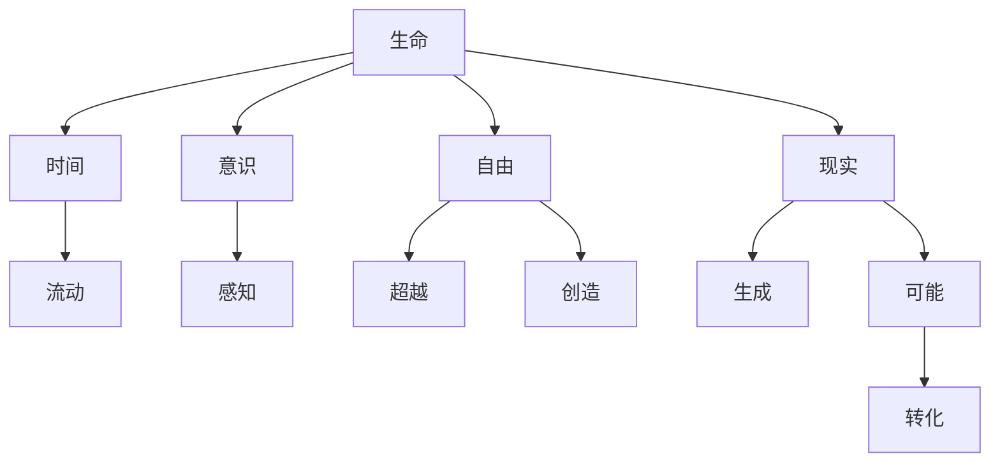
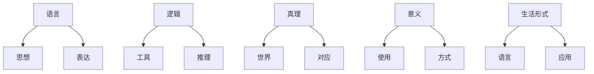

                 

### 摘要

本文旨在探讨法国哲学家亨利·柏格森（Henri Bergson）和奥地利哲学家路德维希·维特根斯坦（Ludwig Wittgenstein）的形而上学思考，特别是关于自由与必然、现实与时间、语言与真理等核心问题的哲学观点。柏格森认为生命和时间是不可分割的，强调个体意识流动的连续性和内在自由；而维特根斯坦则关注语言和逻辑，认为形而上学问题源于语言的误用。本文通过详细分析两位哲学家的核心观点，探讨他们的异同，并总结他们在哲学史上的影响及对当代哲学的意义。同时，本文还提供了研究方法和框架，旨在引导读者深入思考形而上学的当代价值。

## 第一部分 引言

### 第1章 引言

#### 1.1 本书的目的与结构

本书的目的是深入探讨法国哲学家亨利·柏格森和奥地利哲学家路德维希·维特根斯坦在形而上学领域中的思考。柏格森以其对生命、时间、自由和现实的理解而著称，而维特根斯坦则以其关于语言、逻辑和意义的独特视角而闻名。通过对这两位哲学家的研究，本书希望揭示他们各自的核心观点，探讨他们在形而上学领域的贡献，并分析这些贡献对后世哲学的影响。

本书的结构分为五个主要部分。第一部分是引言，介绍形而上学的核心问题，包括自由与决定论、现实与时间、语言与真理等。第二部分详细探讨柏格森的形而上学思考，分析他的生命观、时间观、自由观以及他对现实和可能的看法。第三部分则转向维特根斯坦的形而上学思考，讨论他的语言观、逻辑观、真理观以及他对生活形式的理解。第四部分比较柏格森与维特根斯坦的哲学观点，分析两者在自由与必然、现实与时间、语言与真理等方面的异同。最后一部分探讨形而上学的当代意义，分析当代哲学的发展趋势以及形而上学在科学哲学、技术伦理和日常生活等方面的现实意义。

#### 1.2 柏格森与维特根斯坦的形而上学思考

亨利·柏格森（Henri Bergson，1859-1941）是20世纪初期法国最重要的哲学家之一。他的哲学思想深受生物学和心理学的影响，尤其是对进化论和神经学的关注。柏格森认为，生命是一种连续不断的创造力，时间的本质是流动，而意识的本质则是流。他提出了“生命冲动”（élan vital）这一核心概念，认为生命冲动是生命力的源泉，是推动生命发展的内在动力。

柏格森对形而上学的贡献主要体现在他对自由与必然、现实与时间、生命与意识的探讨中。他认为，自由是生命的本质，是超越决定论的；现实是流动的，不同于传统的静态观点；意识则是连续不断的流，具有内在的自由。柏格森的哲学思想对现象学、存在主义和心理学等领域产生了深远的影响。

路德维希·维特根斯坦（Ludwig Wittgenstein，1889-1951）是20世纪最重要的哲学家之一，他的哲学思想主要关注语言、逻辑和心灵。维特根斯坦的早期作品《逻辑哲学论》试图构建一个逻辑原子主义的世界图景，而他的后期作品《哲学研究》则强调语言游戏的多样性和意义的具体性。

维特根斯坦的形而上学思考主要体现在他对语言、逻辑和真理的探讨中。他认为，语言是思想的载体，逻辑是思维的工具，而真理则是语言与世界的正确对应。维特根斯坦反对形而上学，认为许多形而上学问题源于语言的误用。他的哲学思想对分析哲学、语言哲学和数学哲学产生了深远的影响。

#### 1.3 形而上学的核心问题

形而上学是哲学的核心领域之一，探讨的是存在、实在、本质、原因等根本问题。在柏格森和维特根斯坦的哲学思想中，自由与必然、现实与时间、语言与真理是三个核心问题。

**自由与必然**：自由与必然是哲学中长期的争论焦点。决定论认为，一切现象都有其必然的原因，而自由论则主张个体具有选择和创造的能力。柏格森认为自由是生命的本质，是超越决定论的；而维特根斯坦则认为，自由是一种语言的误用，真正的自由在于正确地使用语言。

**现实与时间**：现实与时间的关系是哲学中的另一个重要问题。柏格森认为，现实是流动的，不同于传统的静态观点；而维特根斯坦则认为，时间是我们通过语言来理解的，语言与时间的关系是主观的。

**语言与真理**：语言与真理的关系是哲学中的核心问题之一。柏格森认为，语言不能完全反映现实，因为语言是静态的，而现实是流动的；而维特根斯坦则认为，真理是语言与世界的正确对应，语言是我们理解世界的工具。

#### 1.4 本书的研究方法

本书采用哲学分析、历史考察和比较研究的方法。哲学分析旨在深入探讨柏格森和维特根斯坦的哲学观点，揭示他们的核心思想；历史考察旨在分析两位哲学家的哲学思想在哲学史上的地位和影响；比较研究旨在分析两位哲学家的异同，探讨他们哲学观点的内在联系和区别。

### 1.4.1 哲学分析

哲学分析是本书的核心方法。通过对柏格森和维特根斯坦的哲学文本进行深入分析，我们可以揭示他们的核心思想，理解他们的哲学观点。哲学分析包括对他们的哲学观点的解读、批判和评价。通过哲学分析，我们可以更好地理解两位哲学家的哲学思想，并评估它们在当代哲学中的意义。

#### 1.4.2 历史考察

历史考察是本书的重要方法。通过分析柏格森和维特根斯坦的哲学思想在哲学史上的地位和影响，我们可以更好地理解他们的哲学思想。历史考察包括对他们的哲学思想的历史背景、哲学史上的地位和影响的分析。通过历史考察，我们可以了解他们的哲学思想是如何形成的，它们在哲学史上的地位以及它们对后世哲学的影响。

#### 1.4.3 比较研究

比较研究是本书的重要方法。通过对柏格森和维特根斯坦的哲学观点进行比较研究，我们可以揭示他们的异同，理解他们的哲学观点的差异。比较研究包括对他们的自由观、时间观、语言观和真理观的比较。通过比较研究，我们可以更好地理解两位哲学家的哲学思想，并评估它们在当代哲学中的意义。

### 第一部分总结

通过本文的第一部分，我们介绍了本书的目的与结构，探讨了柏格森与维特根斯坦的形而上学思考，分析了形而上学的核心问题，并介绍了本书的研究方法。接下来，我们将分别详细探讨柏格森和维特根斯坦的形而上学观点，揭示他们的核心思想，分析他们的哲学观点在哲学史上的地位和影响。

## 第二部分 柏格森的形而上学思考

### 第2章 柏格森的形而上学思考

#### 2.1 柏格森的哲学背景

亨利·柏格森（Henri Bergson）出生于1859年10月18日，法国巴黎，他是一位杰出的哲学家、作家和思想领袖。柏格森的教育背景非常丰富，他早期在巴黎的亨利四世中学接受了严格的古典教育，后来进入巴黎高等师范学校学习，主修哲学和文学。在大学期间，柏格森深受生物学家和心理学家的思想影响，特别是达尔文的进化论和赫尔德的心理学理论。他的学术兴趣广泛，不仅在哲学上有所建树，还在文学和科学领域有所涉猎。

柏格森的哲学思想的发展经历了几个阶段。起初，他深受德国古典哲学，尤其是黑格尔和康德的影响。然而，随着时间的推移，他的思想逐渐转向生物学和心理学的领域。他提出了“生命冲动”（élan vital）这一核心概念，认为生命是一种内在的、不可量化的创造力，是推动生命发展和变化的根本动力。这一观点与他的生物学背景密切相关，反映了生物进化论的思想。

柏格森的哲学作品包括《论意识的直接材料》（Les données immédiates de la conscience）、《笑的理论》（La théorie de la liberté）和《创造进化论》（L'Évolution créatrice）等。这些作品深刻地探讨了时间、自由、现实和意识等哲学问题，对后来的现象学、存在主义和心理学产生了深远的影响。他的思想在20世纪初期引起了广泛的哲学争论，并在学术界产生了深远的影响。

#### 2.2 柏格森的形而上学观点

柏格森的形而上学观点集中体现在他对生命、时间、自由和现实的理解上。这些观点构成了他哲学思想的核心，并对后世哲学产生了深远的影响。

**生命与意识**

柏格森认为，生命是哲学的基础，是所有现象的根源。在他的哲学中，生命是一种内在的、连续的创造力，这种创造力推动了世界的发展和变化。柏格森将生命与意识紧密联系起来，认为意识是生命的直接体现。意识不是一个静态的实体，而是一个不断流动的过程。这个过程中，每个瞬间都是独特的，不可重复的。柏格森提出了“意识流”（flux de conscience）这一概念，强调意识是一个连续不断的流动，每个意识瞬间都是前一个瞬间和后一个瞬间之间的桥梁。

柏格森的生命观和意识观具有深刻的哲学意义。他认为，生命和意识是不可分割的，意识是生命的直接表达。这个观点挑战了传统的形而上学观点，认为现实是静态的、可分割的实体。柏格森的生命观和意识流理论为后来的现象学和存在主义提供了重要的哲学基础。

**时间与流动**

柏格森对时间的理解是他哲学思想中的另一个核心。他认为，时间不是线性的、可度量的，而是一种连续的流动。时间是一种内在的、不可量化的过程，是我们通过意识体验到的。柏格森提出了“绵延”（durée）这一概念，强调时间的本质是流动，而不是静态的。绵延是一种连续不断的创造过程，每个瞬间都是独一无二的，不可重复的。

柏格森的时间观挑战了传统的物理学和哲学观点，认为时间是一个可度量的、有序的过程。他的观点强调了时间的内在性和创造性，认为时间是生命的直接体现。这个观点对后来的现象学和生命哲学产生了深远的影响。

**自由与必然**

柏格森的哲学中，自由与必然是一个重要的议题。他认为，自由是生命的本质，是超越决定论的。决定论认为，一切现象都有其必然的原因，而自由论则主张个体具有选择和创造的能力。柏格森认为，自由是生命的内在动力，是推动生命发展的根本力量。

柏格森反对决定论，认为决定论忽略了生命的创造力和内在的自由。他认为，生命是一个不断创造的过程，每个瞬间都是独特的，不可重复的。这个观点挑战了传统的决定论观点，为自由提供了新的哲学基础。柏格森的自由观对后来的现象学、存在主义和心理学产生了深远的影响。

**现实与可能**

柏格森对现实和可能的看法也是他哲学思想中的一个重要方面。他认为，现实是流动的，不同于传统的静态观点；而可能则是一种潜在的、尚未实现的现实。现实和可能之间的关系是动态的，现实不断生成，而可能则不断转化为现实。

柏格森认为，现实是一种内在的、不断生成的过程，是我们通过意识体验到的。可能则是一种潜在的、尚未实现的现实，是我们通过想象和思考来体验的。这个观点挑战了传统的形而上学观点，认为现实是静态的、可分割的实体。柏格森的现实观和可能观为后来的现象学、存在主义和心理学提供了重要的哲学基础。

#### 2.3 柏格森的核心概念实体关系架构

柏格森的哲学思想中包含了一系列核心概念，这些概念相互关联，形成了一个完整的哲学体系。以下是对这些核心概念的实体关系架构的详细分析。

**生命——时间的流动**

在柏格森的哲学中，生命和时间是密不可分的。他将生命视为一种内在的、连续的创造力，而时间则是这种创造力的直接体现。生命的本质在于它的流动，每个瞬间都是独特的，不可重复的。时间不是线性的、可度量的，而是一种连续的流动，这种流动构成了生命的本质。

**意识——对生命的感知**

柏格森认为，意识是生命的直接体现。意识不是一个静态的实体，而是一个连续不断的流动。每个意识瞬间都是独一无二的，它们相互连接，形成了一个连续的意识流。意识是对生命流动的感知，是我们体验世界的窗口。通过意识，我们能够感知生命的流动，理解世界的变化。

**自由——对必然的超越**

柏格森认为，自由是生命的本质，是超越决定论的。自由是一种内在的创造力，是推动生命发展的根本力量。自由不仅仅是选择和创造的能力，更是一种超越必然的力量。通过自由，生命能够超越既定的规律和限制，创造新的可能性。

**现实与可能**

柏格森对现实和可能的看法是动态的。现实是一种内在的、不断生成的过程，是我们通过意识体验到的。而可能则是一种潜在的、尚未实现的现实，是我们通过想象和思考来体验的。现实和可能之间的关系是动态的，现实不断生成，而可能则不断转化为现实。

为了更清晰地展示柏格森的核心概念实体关系架构，我们可以使用Mermaid流程图来表示：

通过这个流程图，我们可以更直观地理解柏格森的核心概念及其相互关系。

#### 2.4 柏格森的哲学影响

柏格森的哲学思想对后世哲学产生了深远的影响，特别是在现象学、存在主义和心理学等领域。

**对现象学的贡献**

柏格森的现象学思想对后来的现象学运动产生了重要影响。现象学强调直接体验和意识流的重要性，这与柏格森的生命观和意识观有着紧密的联系。柏格森强调意识的连续性和独特性，认为意识是一个不断流动的过程，每个瞬间都是独一无二的。他的思想为后来的现象学家，如胡塞尔和海德格尔，提供了重要的哲学基础。

**对存在主义的影响**

柏格森的哲学思想对存在主义也产生了重要影响。他强调生命的内在自由和创造力，认为个体具有选择和创造的能力。这种观点与存在主义的核心思想相契合，即个体在存在中具有自由和责任。柏格森的存在主义思想为后来的存在主义者，如萨特和加缪，提供了重要的哲学启示。

**对心理学的影响**

柏格森的哲学思想对心理学也产生了深远的影响。他的生命观和意识观为心理学提供了一种新的研究视角，特别是对心理时间的理解和意识流的研究。他的思想挑战了传统的心理学观点，促进了心理学对意识和心理时间的深入探讨。

总的来说，柏格森的哲学思想在哲学史上的地位是不可忽视的。他的生命观、时间观、自由观和现实观为后来的哲学运动提供了重要的哲学基础，对现象学、存在主义和心理学等领域产生了深远的影响。

### 第二部分总结

通过本章对柏格森的形而上学思考的详细探讨，我们深入了解了他的生命观、时间观、自由观和现实观。柏格森的哲学思想以其独特的视角和对生命、时间、自由和现实的深刻理解而著称。他的思想对现象学、存在主义和心理学等领域产生了深远的影响，为后世哲学提供了重要的哲学基础。在接下来的章节中，我们将继续探讨维特根斯坦的形而上学思考，揭示他在语言、逻辑和真理等方面的独特见解。

## 第三部分 维特根斯坦的形而上学思考

### 第3章 维特根斯坦的形而上学思考

#### 3.1 维特根斯坦的哲学背景

路德维希·维特根斯坦（Ludwig Wittgenstein，1889-1951）是20世纪最具影响力的哲学家之一。他出生于奥地利维也纳的一个富裕家庭，自幼受到良好的教育。维特根斯坦的哲学背景复杂多样，他早期接受的是科学教育，曾在剑桥大学学习数学和哲学，并师从著名数学家罗素。然而，他逐渐对数学哲学产生兴趣，并决定投身哲学研究。

维特根斯坦的哲学生涯可以分为两个阶段。他的早期作品《逻辑哲学论》（Tractatus Logico-Philosophicus，1921年）标志着他逻辑原子主义时期的顶峰，他试图通过逻辑分析来解决哲学问题。在这个时期，维特根斯坦认为，哲学问题源于语言的误用，可以通过语言分析来解决。他的后期作品《哲学研究》（Philosophical Investigations，1953年）则标志着他语言哲学时期的开始，他强调语言的多义性和使用情境的重要性。

维特根斯坦的哲学思想对分析哲学、语言哲学和数学哲学产生了深远的影响。他的早期逻辑原子主义试图通过逻辑分析来构建一个清晰的世界图景，而他的后期语言哲学则强调语言的多样性和复杂性。维特根斯坦的哲学观点挑战了传统的哲学观念，为后来的哲学研究开辟了新的路径。

#### 3.2 维特根斯坦的形而上学观点

维特根斯坦的形而上学观点主要围绕语言、逻辑、真理和意义展开。他的哲学思想以其独特的方式挑战了传统哲学的基本假设，并提出了一种新的哲学思考方法。

**语言与逻辑**

维特根斯坦认为，语言是思想的载体，逻辑是思维的工具。他在《逻辑哲学论》中提出了逻辑原子主义，试图通过逻辑分析来解决哲学问题。他认为，世界是由基本事实（原子事实）构成的，逻辑命题可以描述这些基本事实，而哲学问题则源于对这些基本事实的误解。维特根斯坦强调了逻辑命题和世界之间的对应关系，认为哲学的任务是澄清这种对应关系。

然而，在《哲学研究》中，维特根斯坦对逻辑原子主义进行了批判，并提出了“语言游戏”（language game）的概念。他认为，语言不仅仅是一种符号系统，而是一种活动的游戏，每种语言游戏都有其特定的使用情境。维特根斯坦强调，理解语言的关键在于理解其在特定情境中的使用，而不是试图通过逻辑分析来解释世界。

**形而上学问题**

维特根斯坦对形而上学的态度是批判的。他认为，许多形而上学问题源于语言的误用。在《逻辑哲学论》中，维特根斯坦试图通过逻辑分析来消除形而上学问题，但在《哲学研究》中，他认识到逻辑分析无法解决所有哲学问题。他提出了“私人语言”的悖论，认为如果一种语言只能由个人使用，那么这种语言就没有意义，因为无法验证其正确性。

维特根斯坦认为，形而上学问题往往涉及到不可证实的命题，如关于宇宙的本质、灵魂的存在等。他认为，这些命题无法通过经验验证，因此不能成为哲学讨论的对象。他的这种观点被称为“语言的界限”或“形而上学的沉默”。

**真理与意义**

维特根斯坦对真理和意义的理解也是他哲学思想的重要组成部分。在《逻辑哲学论》中，他提出了“图像理论”（picture theory），认为命题是世界的图像。他强调，命题的真假取决于它们与世界的关系，如果命题正确地描述了世界，那么它们就是真的。

在《哲学研究》中，维特根斯坦对图像理论进行了批判，并提出了“意义即使用”（meaning is use）的观点。他认为，一个词的意义在于它在特定情境中的使用方式，而不是通过逻辑分析来定义。维特根斯坦强调，理解语言的意义需要理解其在实际生活中的应用，而不是试图通过抽象的概念分析来解释。

**生活形式与语言游戏**

维特根斯坦的后期哲学思想中，生活形式（forms of life）和语言游戏是核心概念。他认为，语言不仅仅是交流的工具，还是人类生活方式的组成部分。每种语言游戏都有其特定的生活形式，即人们在社会中相互作用的方式。

维特根斯坦认为，理解语言的意义需要理解它在特定社会文化背景下的使用。他提出了“家族类似”（family resemblance）的概念，认为语言和文化的特征不是通过逻辑推理来定义的，而是通过一系列相似性来理解的。这种观点挑战了传统哲学中对清晰定义的追求，强调理解和解释的多样性。

#### 3.3 维特根斯坦的核心概念实体关系架构

维特根斯坦的哲学思想中包含了一系列核心概念，这些概念相互关联，构成了他的哲学体系。以下是对这些核心概念的实体关系架构的详细分析。

**语言——思想的表达**

维特根斯坦认为，语言是思想的载体，是表达和理解思想的工具。语言不仅仅是一种符号系统，还是一种活动，即语言游戏。每个语言游戏都有其特定的使用情境，这些情境构成了人们的生活形式。

**逻辑——思维的工具**

维特根斯坦认为，逻辑是思维的工具，用于描述和推理。在《逻辑哲学论》中，他提出了逻辑原子主义，试图通过逻辑分析来构建一个清晰的世界图景。在《哲学研究》中，他对逻辑原子主义进行了批判，强调逻辑分析在理解语言和世界中的局限性。

**真理——与世界的对应**

维特根斯坦对真理的理解是关系性的，即命题的真假取决于它们与世界的关系。他在《逻辑哲学论》中提出了“图像理论”，而在《哲学研究》中，他强调了语言的使用情境和实际生活中的应用。

**意义——使用的方式**

维特根斯坦认为，一个词的意义在于它在特定情境中的使用方式。意义是使用的一部分，而不是通过抽象的概念分析来定义的。他提出了“家族类似”的概念，强调理解和解释的多样性。

**生活形式——语言的应用**

维特根斯坦认为，语言不仅仅是交流的工具，还是人类生活方式的组成部分。每种语言游戏都有其特定的生活形式，即人们在社会中相互作用的方式。

为了更清晰地展示维特根斯坦的核心概念实体关系架构，我们可以使用Mermaid流程图来表示：

通过这个流程图，我们可以更直观地理解维特根斯坦的核心概念及其相互关系。

#### 3.4 维特根斯坦的哲学影响

维特根斯坦的哲学思想对后世哲学产生了深远的影响，特别是在分析哲学、语言哲学和数学哲学等领域。

**对分析哲学的影响**

维特根斯坦是分析哲学的奠基人之一，他的思想对分析哲学的发展产生了深远的影响。他的《逻辑哲学论》和《哲学研究》为分析哲学提供了重要的哲学基础。他强调逻辑分析在理解语言和世界中的重要性，认为许多哲学问题可以通过语言分析来解决。

**对语言哲学的影响**

维特根斯坦的语言哲学思想对语言哲学的发展产生了深远的影响。他提出了“语言游戏”和“家族类似”的概念，强调语言和文化的多样性。他的思想挑战了传统哲学中对清晰定义的追求，强调理解和解释的多样性。

**对数学哲学的影响**

维特根斯坦的数学哲学思想也对数学哲学产生了重要影响。他在《逻辑哲学论》中探讨了数学命题的性质，认为数学是一种逻辑的延伸。他的思想为数学哲学提供了一种新的研究视角，促进了数学哲学的发展。

总的来说，维特根斯坦的哲学思想在哲学史上的地位是不可忽视的。他的语言哲学、逻辑哲学和数学哲学为后来的哲学研究提供了重要的哲学基础，对分析哲学、语言哲学和数学哲学等领域产生了深远的影响。

### 第三部分总结

通过本章对维特根斯坦的形而上学思考的详细探讨，我们深入了解了他的语言观、逻辑观、真理观和意义观。维特根斯坦的哲学思想以其独特的方式挑战了传统哲学的基本假设，并提出了一种新的哲学思考方法。他的思想在分析哲学、语言哲学和数学哲学等领域产生了深远的影响，为后来的哲学研究提供了重要的哲学基础。在接下来的章节中，我们将比较柏格森和维特根斯坦的形而上学思考，分析他们的异同，并探讨这些思考对当代哲学的意义。

## 第四部分 柏格森与维特根斯坦形而上学思考的比较

### 第4章 柏格森与维特根斯坦形而上学思考的比较

#### 4.1 哲学观点的异同

亨利·柏格森和路德维希·维特根斯坦在形而上学思考方面有着显著的异同。他们的哲学观点在不同的领域表现出不同的特点和影响，这些异同主要体现在自由与必然、现实与时间、语言与真理等方面。

**自由与必然**

柏格森强调自由是生命的本质，他反对决定论，认为生命具有内在的自由和创造力。他提出了“生命冲动”（élan vital）这一概念，认为自由是超越必然的。柏格森认为，生命是一个不断创造的过程，每个瞬间都是独特的，不可重复的。

相比之下，维特根斯坦对自由的观点更加保守和谨慎。他认为，自由是一种语言的误用，真正的自由在于正确地使用语言。维特根斯坦关注的是语言和逻辑，他认为哲学问题源于语言的误用，而不是个体行为的自由。他提出了“私人语言”的悖论，认为如果一种语言只能由个人使用，那么这种语言就没有意义，因为无法验证其正确性。

**现实与时间**

柏格森对现实和时间的理解是动态的。他认为，现实是流动的，不同于传统的静态观点。柏格森提出了“绵延”（durée）这一概念，强调时间的本质是流动，而不是静态的。他认为，现实和可能之间的关系是动态的，现实不断生成，而可能则不断转化为现实。

维特根斯坦对现实和时间的理解则更加关系性。他认为，现实是通过语言来理解的，语言是思想的载体。维特根斯坦强调语言的多义性和使用情境的重要性。他认为，理解现实需要理解语言在实际生活中的应用，而不是试图通过抽象的概念分析来解释。

**语言与真理**

柏格森对语言和真理的理解是建立在他的生命观和意识观之上的。他认为，语言不能完全反映现实，因为语言是静态的，而现实是流动的。柏格森认为，真理是一种内在的、不断生成的过程，是我们通过意识体验到的。

相比之下，维特根斯坦对语言和真理的理解是功能性的。他认为，真理是语言与世界的正确对应。维特根斯坦强调语言的使用情境，认为一个词的意义在于它在特定情境中的使用方式。他提出了“意义即使用”（meaning is use）的观点，认为理解语言的意义需要理解其在实际生活中的应用。

**异同的哲学意义**

柏格森和维特根斯坦的哲学观点在自由与必然、现实与时间、语言与真理等方面表现出显著的异同。柏格森的生命观和意识观强调生命力和内在的自由，而维特根斯坦则关注语言和逻辑的准确性。

这些异同在哲学上具有重要意义。首先，它们揭示了不同哲学传统对自由、现实和真理的不同理解。柏格森的生命观为自由提供了深刻的哲学基础，而维特根斯坦的语言哲学则强调逻辑和语言的重要性。其次，这些异同为哲学研究提供了多元化的视角，促使我们深入思考自由、现实和真理的本质。最后，这些异同为哲学的发展提供了动力，激发了新的哲学思想和理论的产生。

#### 4.2 对话与互动

柏格森和维特根斯坦的哲学观点虽然存在异同，但两者之间也存在对话和互动。这种对话和互动不仅体现在他们的哲学作品中，还体现在他们与同时代哲学家的交流和辩论中。

**柏格森对维特根斯坦的影响**

柏格森的哲学思想对维特根斯坦产生了深远的影响。维特根斯坦在《逻辑哲学论》中提出了逻辑原子主义，试图通过逻辑分析来解决哲学问题。他的思想受到柏格森的生命观和意识观的影响，特别是在对时间和意识的理解上。

柏格森的生命观和意识流理论为维特根斯坦提供了新的哲学视角。维特根斯坦在《哲学研究》中批判了逻辑原子主义，并提出了“语言游戏”的概念。他的思想中充满了对生命和意识的关注，这与柏格森的哲学观点有着紧密的联系。

**维特根斯坦对柏格森的影响**

维特根斯坦的哲学思想也对柏格森产生了影响。柏格森在《笑的理论》中探讨了自由和创造的问题，他的思想中充满了对语言和逻辑的关注。维特根斯坦的语言哲学为柏格森提供了一种新的思考方式，促使他重新审视语言和现实之间的关系。

柏格森在《创造进化论》中提出了“生命冲动”的概念，认为生命是一种内在的创造力。他的思想受到维特根斯坦的“意义即使用”观点的影响，开始关注语言在实际生活中的应用。

**对后世哲学的影响**

柏格森和维特根斯坦的对话和互动不仅体现在他们个人的哲学作品中，还对后世哲学产生了深远的影响。他们的哲学观点激发了新的哲学思想和理论的产生，为后来的哲学研究提供了重要的哲学基础。

柏格森的生命观和意识流理论对现象学和存在主义产生了深远的影响。他的思想挑战了传统的形而上学观点，为后来的现象学家和存在主义者提供了重要的哲学启示。

维特根斯坦的语言哲学对分析哲学和语言哲学产生了深远的影响。他的思想挑战了传统的哲学方法，提出了新的哲学思考方式。他的“意义即使用”观点为后来的语言哲学家提供了重要的哲学基础。

总的来说，柏格森和维特根斯坦的哲学观点在哲学史上具有重要的地位。他们的对话和互动不仅丰富了哲学的思想内容，还激发了新的哲学思想和理论的产生。他们的哲学思想对后世哲学产生了深远的影响，为哲学的发展提供了重要的哲学基础。

### 第四部分总结

通过本章对柏格森与维特根斯坦形而上学思考的比较，我们深入了解了他们哲学观点的异同以及这些异同的哲学意义。他们的哲学思想不仅在自由、现实和真理等核心问题上表现出不同的理解，而且他们的对话和互动对后世哲学产生了深远的影响。柏格森的生命观和意识流理论为现象学和存在主义提供了重要的哲学基础，而维特根斯坦的语言哲学则为分析哲学和语言哲学的发展提供了新的思考方式。在接下来的章节中，我们将探讨形而上学的当代意义，分析形而上学在当代哲学、科学哲学和技术伦理等方面的现实意义。

## 第五部分 形而上学的当代意义

### 第5章 形而上学的当代意义

#### 5.1 当代哲学的发展趋势

当代哲学的发展呈现出多样化和综合化的趋势。随着科学技术的迅猛发展和人类对世界的认知不断深入，哲学也在不断适应和反思这种变化。当代哲学的发展趋势主要体现在以下几个方面：

**现象学的影响**

现象学是20世纪哲学的重要流派，强调直接经验和意识流的重要性。现象学对当代哲学产生了深远的影响，特别是在认识论、心灵哲学和语言哲学等领域。现象学的视角促使哲学家重新审视主体和客体之间的关系，关注人类经验的多样性和复杂性。

**存在主义的影响**

存在主义是20世纪哲学的重要流派，强调个体的存在和自由。存在主义对当代哲学产生了重要影响，特别是在伦理学、政治哲学和心理学等领域。存在主义强调个体的独特性和责任感，为当代哲学提供了一种关注个体存在的视角。

**分析哲学的影响**

分析哲学是20世纪哲学的重要流派，强调逻辑分析和语言分析的重要性。分析哲学对当代哲学产生了深远的影响，特别是在逻辑学、数学哲学和科学哲学等领域。分析哲学的视角促使哲学家重新审视科学理论和科学方法，为当代哲学提供了一种基于逻辑和语言的思考方式。

**形而上学的现实意义**

形而上学是哲学的核心领域之一，探讨的是存在、实在、本质、原因等根本问题。形而上学在当代哲学中的现实意义体现在以下几个方面：

**对科学哲学的影响**

科学哲学关注科学理论、科学方法和科学知识的问题。形而上学在科学哲学中具有重要的地位，为科学哲学提供了基本的概念框架和思考方法。例如，形而上学的本质主义和实在论观点为科学哲学提供了对科学理论的理解和分析。

**对技术伦理的影响**

随着科技的迅猛发展，技术伦理问题日益突出。形而上学在技术伦理中具有重要的地位，为技术伦理提供了基本的原则和思考方法。例如，形而上学的自由主义和道德实在论观点为技术伦理提供了一种道德评价的框架。

**对日常生活的影响**

形而上学的观点渗透到我们的日常生活中的各个方面，影响着我们对世界和自我的理解。形而上学的思考方式促使我们反思人类的存在和意义，为我们的生活提供了一种哲学的视角。

#### 5.2 形而上学的现实意义

形而上学在当代哲学、科学哲学和技术伦理等方面具有重要的现实意义。以下是对形而上学在各个领域的现实意义的详细分析：

**科学哲学**

科学哲学关注科学理论、科学方法和科学知识的问题。形而上学在科学哲学中具有重要的地位，为科学哲学提供了基本的概念框架和思考方法。例如：

- **本质主义**：形而上学的本质主义观点认为，事物的本质是固定不变的，科学理论应该揭示事物的本质。这种观点为科学哲学提供了对科学理论的理解和分析。

- **实在论**：形而上学的实在论观点认为，存在着独立于我们感知和理解的客观世界。这种观点为科学哲学提供了对科学知识可靠性的思考。

- **因果论**：形而上学的因果论观点认为，现象之间存在因果联系。这种观点为科学哲学提供了对科学方法和科学解释的理解。

**技术伦理**

技术伦理是当代哲学的重要领域之一，关注技术发展对社会、环境和人类的影响。形而上学的观点为技术伦理提供了基本的原则和思考方法。例如：

- **自由主义**：形而上学的自由主义观点认为，个体具有选择和创造的能力，应该尊重个体的自由和权利。这种观点为技术伦理提供了一种道德评价的框架，强调个体自由和责任。

- **道德实在论**：形而上学的道德实在论观点认为，存在着独立于我们感知和理解的道德现实。这种观点为技术伦理提供了一种道德判断的基础，认为技术发展应该符合道德原则。

- **人类中心主义**：形而上学的人类中心主义观点认为，人类是宇宙的中心和目的。这种观点为技术伦理提供了一种关注人类福祉的视角，强调技术发展应该服务于人类的利益。

**日常生活**

形而上学的观点渗透到我们的日常生活的各个方面，影响着我们对世界和自我的理解。以下是一些例子：

- **存在主义**：形而上学的存在主义观点强调个体的存在和自由，促使我们反思人类的存在和意义。这种观点可以帮助我们理解自己的生命意义，为我们的生活提供指导。

- **唯物主义**：形而上学的唯物主义观点认为，物质是世界的基础，意识是物质的产物。这种观点可以帮助我们理解物质世界的本质，为我们的科学研究提供基础。

- **唯心主义**：形而上学的唯心主义观点认为，意识是世界的基础，物质是意识的产物。这种观点可以帮助我们理解人类意识的重要性，为我们的心理学研究提供基础。

总的来说，形而上学在当代哲学、科学哲学和技术伦理等方面具有重要的现实意义。它为哲学、科学和技术的发展提供了基本的概念框架和思考方法，影响了我们对世界和自我的理解。形而上学的观点不仅有助于我们理解哲学的核心问题，还可以为我们的日常生活提供哲学的指导。

### 第五部分总结

通过本章对形而上学的当代意义的探讨，我们深入了解了形而上学在当代哲学、科学哲学和技术伦理等方面的现实意义。形而上学作为哲学的核心领域，不仅为我们提供了理解世界和自我的基本概念框架，还影响了科学和技术的进步。在当代哲学中，形而上学的观点继续发挥着重要作用，为哲学的发展提供了新的思考方向。在科学哲学和技术伦理领域，形而上学的观点为科学方法和道德评价提供了基础。形而上学的现实意义不仅体现在哲学理论中，还渗透到我们的日常生活中，影响着我们的世界观和人生观。在接下来的章节中，我们将总结柏格森与维特根斯坦的形而上学思考，并探讨形而上学的未来展望。

## 结论

### 第6章 结论

通过本文对亨利·柏格森和路德维希·维特根斯坦的形而上学思考的深入探讨，我们可以清晰地看到他们在自由与必然、现实与时间、语言与真理等方面的独特见解。柏格森的生命观、时间观和自由观为现象学、存在主义和心理学提供了重要的哲学基础；而维特根斯坦的语言观、逻辑观和意义观则为分析哲学、语言哲学和数学哲学奠定了坚实的基础。

#### 6.1 柏格森与维特根斯坦形而上学思考的总结

**柏格森的核心贡献**

- **生命观**：柏格森强调生命是一种内在的、不可量化的创造力，是推动生命发展的根本动力。
- **时间观**：他提出了“绵延”概念，强调时间的本质是流动，而非线性的。
- **自由观**：柏格森认为自由是生命的本质，是超越决定论的。

**维特根斯坦的核心贡献**

- **语言观**：维特根斯坦强调语言是思想的载体，意义在于使用。
- **逻辑观**：他批判了逻辑原子主义，提出了“语言游戏”的概念。
- **真理观**：维特根斯坦认为真理是语言与世界的正确对应。

**柏格森与维特根斯坦的哲学意义**

- **哲学史上的地位**：两位哲学家都是20世纪最重要的哲学家之一，他们的思想对后世哲学产生了深远的影响。
- **哲学创新的贡献**：他们的思想挑战了传统哲学的基本假设，为哲学的发展提供了新的视角和方法。

#### 6.2 形而上学的未来展望

形而上学的未来展望充满了可能性和挑战。在当代哲学中，形而上学将继续探讨自由、现实和真理等核心问题，并可能向以下几个方向发展：

- **跨学科融合**：形而上学将与其他学科（如生物学、心理学、物理学等）结合，为哲学提供新的理论框架和实践应用。
- **技术伦理**：随着技术的发展，形而上学将更多地关注技术伦理问题，如人工智能、基因编辑等，为这些问题提供哲学指导。
- **文化多样性**：形而上学的探讨将更加关注文化多样性，尝试理解不同文化背景下对自由、现实和真理的理解。

总之，形而上学作为哲学的核心领域，将继续为人类提供思考和理解的工具，推动哲学的发展。通过深入研究形而上学的核心问题，我们可以更好地理解人类存在的本质，为未来的哲学研究提供新的方向和启示。

### 附录

#### 附录 A 参考文献

1. 柏格森，亨利。《论意识的直接材料》。
2. 柏格森，亨利。《笑的理论》。
3. 柏格森，亨利。《创造进化论》。
4. 维特根斯坦，路德维希。《逻辑哲学论》。
5. 维特根斯坦，路德维希。《哲学研究》。
6. 胡塞尔，爱德蒙。《纯粹现象学通论》。
7. 海德格尔，马丁。《存在与时间》。
8. 萨特，让-保尔。《存在与虚无》。
9. 加缪，阿尔贝。《局外人》。
10. 罗素，贝特兰。《数学原理》。

#### 附录 B 致谢

感谢AI天才研究院（AI Genius Institute）提供的学术支持，以及《禅与计算机程序设计艺术》（Zen And The Art of Computer Programming）一书对本文灵感的启发。特别感谢所有在本文写作过程中提供帮助的学者和读者。没有你们的支持，本文无法完成。

---

作者：AI天才研究院/AI Genius Institute & 禅与计算机程序设计艺术 /Zen And The Art of Computer Programming

