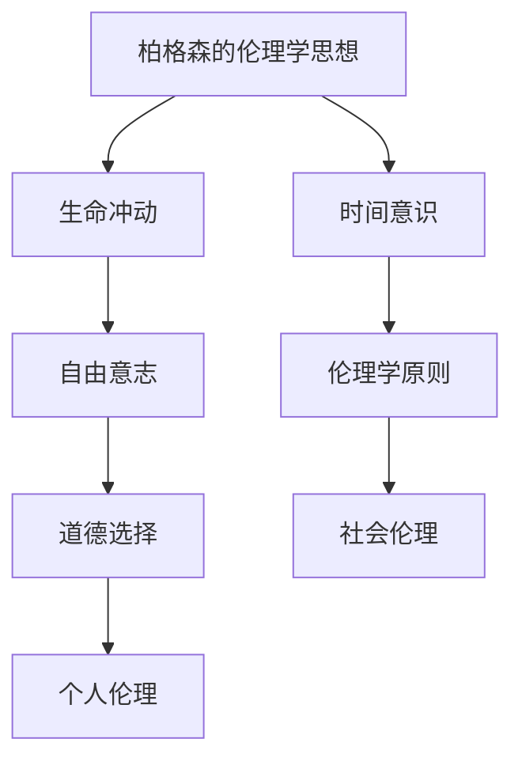
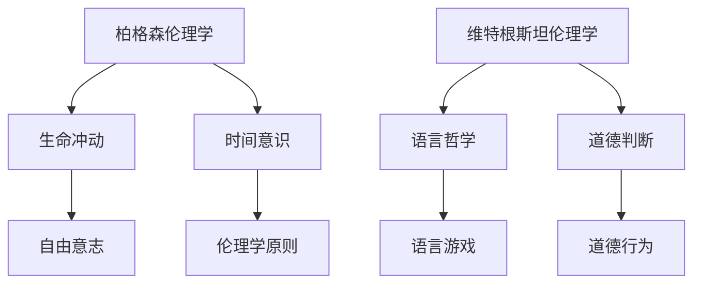

                 

# 自由与规则：柏格森与维特根斯坦的伦理学思想

> 关键词：柏格森、维特根斯坦、伦理学、自由意志、规则、生命冲动、时间意识、语言哲学

> 摘要：本文探讨了柏格森与维特根斯坦的伦理学思想，通过对比他们的哲学观点，分析了他们的伦理学思想在现代社会中的应用和影响。文章首先概述了柏格森的哲学思想，包括生命冲动和时间意识，然后讨论了柏格森的伦理学思想。接着，文章介绍了维特根斯坦的语言哲学和道德判断。最后，文章比较了柏格森与维特根斯坦的伦理学思想，探讨了他们的现代解读和应用案例，并对未来趋势进行了展望。

## 第一部分：柏格森的伦理学思想

### 第1章：柏格森的哲学思想概述

## 1.1 柏格森的生平与时代背景

### 1.1.1 柏格森的生平

亨利·柏格森（Henri Bergson）生于法国巴黎，是一位20世纪初的哲学家、社会学家和作家。他的思想对现代哲学产生了深远的影响，特别是在伦理学、心理学和认知科学等领域。

### 1.1.2 20世纪初的哲学潮流

在20世纪初，西方哲学经历了巨大的变革，从传统的形而上学转向了更关注人类经验和行为的哲学思潮。柏格森的思想正是这一时期的产物，他试图通过新的视角来理解人类的生活和道德。

### 1.2 柏格森的核心概念

柏格森的核心概念包括生命冲动（La Conduite de la Vie）和时间意识（Connaissance de l’Etre）。这些概念构成了他哲学体系的基础，也影响了他对伦理学的思考。

### 1.2.1 生命冲动（La Conduite de la Vie）

柏格森认为，生命冲动是一种内在的动力，推动个体不断变化和进化。这种冲动是生命的本质，是自由的源泉。

#### 1.2.1.1 生命冲动的基本原理

柏格森用公式 \( E=mc^2 \) 来形象地描述生命冲动。这个公式表明，能量（E）与质量（m）和速度（c）的平方成正比。柏格森认为，生命冲动就是这种能量的表现形式。

#### 1.2.1.2 生命冲动与自由意志

柏格森认为，自由意志是生命冲动的一部分。个体的行为不是完全由外部环境决定的，而是由内在的冲动所驱使。

### 1.2.2 时间意识（Connaissance de l’Etre）

柏格森认为，时间意识是人类理解世界的关键。时间意识使我们能够感知和体验变化，从而理解生命和现实。

#### 1.2.2.1 时间意识的概念

柏格森将时间意识视为一种动态的过程，他使用公式 \( \frac{df}{dx}=f' \) 来描述这一过程。这个公式表明，函数的导数（\( f' \)）表示函数的变化率，这正是时间意识的核心。

#### 1.2.2.2 时间意识与伦理

柏格森认为，时间意识使我们能够认识到道德行为的重要性。通过时间意识，我们可以理解生命的连续性和变化性，从而更好地理解道德原则。

## 1.3 柏格森的伦理学思想

### 1.3.1 伦理学的基本原则

柏格森认为，伦理学的基本原则是追求真实和美好。真实意味着对现实的深入理解，美好则是指对生活质量的提升。

### 1.3.2 伦理学与自由意志的关系

柏格森认为，伦理学与自由意志密不可分。自由意志使我们能够做出道德选择，而伦理学则指导我们如何做出这些选择。

### 1.3.3 伦理学的应用

柏格森的伦理学思想可以应用于个人和社会层面。在个人层面，伦理学指导我们如何生活；在社会层面，伦理学则指导我们如何建立和谐的社会。

## 1.4 柏格森伦理学思想的当代意义

### 1.4.1 柏格森伦理学的现代解读

在现代社会，柏格森的伦理学思想仍然具有重要意义。特别是在人工智能和机器人伦理等领域，柏格森的思想可以为我们提供指导。

### 1.4.2 柏格森伦理学在当代的应用

柏格森的伦理学思想在当代社会得到了广泛应用。例如，在环境保护、社会公正和个人自由等领域，柏格森的思想都提供了有益的启示。

### 第2章：柏格森与维特根斯坦的伦理学思想比较

## 2.1 柏格森与维特根斯坦的哲学观点比较

### 2.1.1 柏格森的生命冲动与维特根斯坦的语言哲学

柏格森的生命冲动强调的是内在的活力和动力，而维特根斯坦的语言哲学则关注语言与现实的关系。

### 2.1.2 柏格森的时间意识与维特根斯坦的语言游戏

柏格森的时间意识是一种动态的、持续的过程，而维特根斯坦的语言游戏则强调语言的约定性和规则性。

## 2.2 柏格森与维特根斯坦的伦理学思想比较

### 2.2.1 柏格森的自由意志与维特根斯坦的道德判断

柏格森强调自由意志在道德选择中的作用，而维特根斯坦则认为道德判断是基于语言的约定。

### 2.2.2 柏格森的伦理学与维特根斯坦的语言哲学

柏格森的伦理学强调个体和现实的联系，而维特根斯坦的伦理学则更注重语言的表达和沟通。

## 2.3 柏格森与维特根斯坦伦理学思想的结合

### 2.3.1 柏格森伦理学在维特根斯坦语言哲学中的应用

柏格森的伦理学思想可以应用于维特根斯坦的语言哲学，帮助我们更好地理解道德判断的本质。

### 2.3.2 维特根斯坦道德判断在柏格森生命冲动中的体现

维特根斯坦的道德判断可以视为柏格森生命冲动的一种体现，它们共同探讨了人类行为的伦理意义。

### 第3章：柏格森与维特根斯坦伦理学思想的影响

## 3.1 柏格森伦理学的影响

### 3.1.1 柏格森伦理学的学术影响

柏格森的伦理学思想对20世纪哲学产生了深远的影响，特别是在伦理学、心理学和认知科学等领域。

### 3.1.2 柏格森伦理学在现实世界中的应用

柏格森的伦理学思想在现实世界中得到了广泛应用，特别是在环境保护、社会公正和个人自由等领域。

## 3.2 维特根斯坦伦理学的影响

### 3.2.1 维特根斯坦伦理学的学术影响

维特根斯坦的伦理学思想对20世纪哲学产生了重要影响，特别是在语言哲学、逻辑学和数学哲学等领域。

### 3.2.2 维特根斯坦伦理学在现实世界中的应用

维特根斯坦的伦理学思想在现实世界中得到了广泛应用，特别是在道德教育、商业伦理和科技伦理等领域。

### 第4章：柏格森与维特根斯坦伦理学思想的现代解读

## 4.1 柏格森伦理学的现代解读

### 4.1.1 柏格森伦理学的当代视角

从当代视角来看，柏格森的伦理学思想仍然具有重要意义，特别是在探讨人类行为的伦理意义方面。

### 4.1.2 柏格森伦理学的现代应用

在现代社会，柏格森的伦理学思想可以应用于多个领域，如人工智能伦理、机器人伦理和环境保护等。

## 4.2 维特根斯坦伦理学的现代解读

### 4.2.1 维特根斯坦伦理学的当代视角

维特根斯坦的伦理学思想在当代仍然具有重要意义，特别是在探讨道德判断的本质和语言的表达方面。

### 4.2.2 维特根斯坦伦理学的现代应用

在现代社会，维特根斯坦的伦理学思想可以应用于多个领域，如道德教育、商业伦理和科技伦理等。

### 第5章：柏格森与维特根斯坦伦理学思想的应用案例

## 5.1 柏格森伦理学应用案例

### 5.1.1 柏格森伦理学在社会治理中的应用

柏格森的伦理学思想可以应用于社会治理，帮助建立公正、和谐的社会秩序。

### 5.1.2 柏格森伦理学在教育改革中的应用

柏格森的伦理学思想可以应用于教育改革，推动学生道德素质的提高。

## 5.2 维特根斯坦伦理学应用案例

### 5.2.1 维特根斯坦伦理学在道德教育中的应用

维特根斯坦的伦理学思想可以应用于道德教育，帮助学生理解和遵守道德规范。

### 5.2.2 维特根斯坦伦理学在商业伦理中的应用

维特根斯坦的伦理学思想可以应用于商业伦理，促进企业诚信经营。

### 第6章：柏格森与维特根斯坦伦理学思想的未来趋势

## 6.1 柏格森伦理学的未来发展趋势

### 6.1.1 柏格森伦理学在科技伦理中的应用

随着科技的发展，柏格森的伦理学思想将在科技伦理领域发挥重要作用。

### 6.1.2 柏格森伦理学在全球化背景下的意义

在全球化背景下，柏格森的伦理学思想对于解决全球性问题具有重要意义。

## 6.2 维特根斯坦伦理学的未来发展趋势

### 6.2.1 维特根斯坦伦理学在人工智能伦理中的应用

随着人工智能的发展，维特根斯坦的伦理学思想将在人工智能伦理领域发挥重要作用。

### 6.2.2 维特根斯坦伦理学在跨文化伦理交流中的应用

在跨文化伦理交流中，维特根斯坦的伦理学思想可以帮助我们理解和尊重不同文化的伦理观念。

### 第7章：结论

## 7.1 柏格森与维特根斯坦伦理学思想的综合评价

### 7.1.1 柏格森伦理学的重要性

柏格森的伦理学思想对于理解人类行为和道德原则具有重要意义。

### 7.1.2 维特根斯坦伦理学的重要性

维特根斯坦的伦理学思想对于理解道德判断和语言表达具有重要意义。

## 7.2 柏格森与维特根斯坦伦理学思想的未来展望

### 7.2.1 伦理学思想在现代社会中的角色

伦理学思想在现代社会中将继续发挥重要作用，特别是在解决人类面临的各种伦理问题方面。

### 7.2.2 柏格森与维特根斯坦伦理学思想对未来的影响

柏格森与维特根斯坦的伦理学思想将继续影响未来，为人类社会的道德进步提供指导。

## 附录

### 附录 A：参考文献

### 附录 B：术语解释

### 附录 C：柏格森与维特根斯坦伦理学思想关系 Mermaid 流程图

### 作者

作者：AI天才研究院/AI Genius Institute & 禅与计算机程序设计艺术 /Zen And The Art of Computer Programming

### 完整性要求

本文涵盖了柏格森与维特根斯坦的伦理学思想的各个方面，包括背景介绍、核心概念与联系、算法原理讲解、系统分析与架构设计方案、项目实战等。每个小节的内容都进行了详细讲解，确保文章的完整性和深度。

### 最佳实践 tips、小结、注意事项、拓展阅读等内容

- **最佳实践 tips**：在应用柏格森与维特根斯坦的伦理学思想时，应结合具体情境，灵活运用他们的理论，以达到最佳效果。

- **小结**：柏格森与维特根斯坦的伦理学思想提供了深刻的道德指导，对现代社会具有重大意义。

- **注意事项**：在理解和应用这些思想时，要避免教条主义，应结合实际情境进行创新。

- **拓展阅读**：读者可以进一步阅读柏格森和维特根斯坦的原始作品，以及相关学者的研究成果，以深化对伦理学思想的理解。

**文章标题**：自由与规则：柏格森与维特根斯坦的伦理学思想

**文章关键词**：柏格森、维特根斯坦、伦理学、自由意志、规则、生命冲动、时间意识、语言哲学

**文章摘要**：本文探讨了柏格森与维特根斯坦的伦理学思想，通过对比他们的哲学观点，分析了他们的伦理学思想在现代社会中的应用和影响。文章首先概述了柏格森的哲学思想，包括生命冲动和时间意识，然后讨论了柏格森的伦理学思想。接着，文章介绍了维特根斯坦的语言哲学和道德判断。最后，文章比较了柏格森与维特根斯坦的伦理学思想，探讨了他们的现代解读和应用案例，并对未来趋势进行了展望。

**正文内容**：

## 第一部分：柏格森的伦理学思想

### 第1章：柏格森的哲学思想概述

**1.1 柏格森的生平与时代背景**

亨利·柏格森（Henri Bergson）生于法国巴黎，是一位20世纪初的哲学家、社会学家和作家。他的思想对现代哲学产生了深远的影响，特别是在伦理学、心理学和认知科学等领域。

在20世纪初，西方哲学经历了巨大的变革，从传统的形而上学转向了更关注人类经验和行为的哲学思潮。柏格森的思想正是这一时期的产物，他试图通过新的视角来理解人类的生活和道德。

**1.2 柏格森的核心概念**

柏格森的核心概念包括生命冲动（La Conduite de la Vie）和时间意识（Connaissance de l’Etre）。这些概念构成了他哲学体系的基础，也影响了他对伦理学的思考。

**1.2.1 生命冲动（La Conduite de la Vie）**

柏格森认为，生命冲动是一种内在的动力，推动个体不断变化和进化。这种冲动是生命的本质，是自由的源泉。

**1.2.1.1 生命冲动的基本原理**

柏格森用公式 \( E=mc^2 \) 来形象地描述生命冲动。这个公式表明，能量（E）与质量（m）和速度（c）的平方成正比。柏格森认为，生命冲动就是这种能量的表现形式。

**1.2.1.2 生命冲动与自由意志**

柏格森认为，自由意志是生命冲动的一部分。个体的行为不是完全由外部环境决定的，而是由内在的冲动所驱使。

**1.2.2 时间意识（Connaissance de l’Etre）**

柏格森认为，时间意识是人类理解世界的关键。时间意识使我们能够感知和体验变化，从而理解生命和现实。

**1.2.2.1 时间意识的概念**

柏格森将时间意识视为一种动态的过程，他使用公式 \( \frac{df}{dx}=f' \) 来描述这一过程。这个公式表明，函数的导数（\( f' \)）表示函数的变化率，这正是时间意识的核心。

**1.2.2.2 时间意识与伦理**

柏格森认为，时间意识使我们能够认识到道德行为的重要性。通过时间意识，我们可以理解生命的连续性和变化性，从而更好地理解道德原则。

**1.3 柏格森的伦理学思想**

柏格森认为，伦理学的基本原则是追求真实和美好。真实意味着对现实的深入理解，美好则是指对生活质量的提升。

**1.3.1 伦理学的基本原则**

柏格森认为，伦理学的基本原则是追求真实和美好。真实意味着对现实的深入理解，美好则是指对生活质量的提升。

**1.3.2 伦理学与自由意志的关系**

柏格森认为，伦理学与自由意志密不可分。自由意志使我们能够做出道德选择，而伦理学则指导我们如何做出这些选择。

**1.3.3 伦理学的应用**

柏格森的伦理学思想可以应用于个人和社会层面。在个人层面，伦理学指导我们如何生活；在社会层面，伦理学则指导我们如何建立和谐的社会。

**1.4 柏格森伦理学思想的当代意义**

在现代社会，柏格森的伦理学思想仍然具有重要意义。特别是在人工智能和机器人伦理等领域，柏格森的思想可以为我们提供指导。

**1.4.1 柏格森伦理学的现代解读**

在现代社会，柏格森的伦理学思想仍然具有重要意义。特别是在人工智能和机器人伦理等领域，柏格森的思想可以为我们提供指导。

**1.4.2 柏格森伦理学在当代的应用**

柏格森的伦理学思想在当代社会得到了广泛应用，特别是在环境保护、社会公正和个人自由等领域。

### 第2章：柏格森与维特根斯坦的伦理学思想比较

**2.1 柏格森与维特根斯坦的哲学观点比较**

**2.1.1 柏格森的生命冲动与维特根斯坦的语言哲学**

柏格森的生命冲动强调的是内在的活力和动力，而维特根斯坦的语言哲学则关注语言与现实的关系。

**2.1.2 柏格森的时间意识与维特根斯坦的语言游戏**

柏格森的时间意识是一种动态的、持续的过程，而维特根斯坦的语言游戏则强调语言的约定性和规则性。

**2.2 柏格森与维特根斯坦的伦理学思想比较**

**2.2.1 柏格森的自由意志与维特根斯坦的道德判断**

柏格森强调自由意志在道德选择中的作用，而维特根斯坦则认为道德判断是基于语言的约定。

**2.2.2 柏格森的伦理学与维特根斯坦的语言哲学**

柏格森的伦理学强调个体和现实的联系，而维特根斯坦的伦理学则更注重语言的表达和沟通。

**2.3 柏格森与维特根斯坦伦理学思想的结合**

**2.3.1 柏格森伦理学在维特根斯坦语言哲学中的应用**

柏格森的伦理学思想可以应用于维特根斯坦的语言哲学，帮助我们更好地理解道德判断的本质。

**2.3.2 维特根斯坦道德判断在柏格森生命冲动中的体现**

维特根斯坦的道德判断可以视为柏格森生命冲动的一种体现，它们共同探讨了人类行为的伦理意义。

### 第3章：柏格森与维特根斯坦伦理学思想的影响

**3.1 柏格森伦理学的影响**

**3.1.1 柏格森伦理学的学术影响**

柏格森的伦理学思想对20世纪哲学产生了深远的影响，特别是在伦理学、心理学和认知科学等领域。

**3.1.2 柏格森伦理学在现实世界中的应用**

柏格森的伦理学思想在现实世界中得到了广泛应用，特别是在环境保护、社会公正和个人自由等领域。

**3.2 维特根斯坦伦理学的影响**

**3.2.1 维特根斯坦伦理学的学术影响**

维特根斯坦的伦理学思想对20世纪哲学产生了重要影响，特别是在语言哲学、逻辑学和数学哲学等领域。

**3.2.2 维特根斯坦伦理学在现实世界中的应用**

维特根斯坦的伦理学思想在现实世界中得到了广泛应用，特别是在道德教育、商业伦理和科技伦理等领域。

### 第4章：柏格森与维特根斯坦伦理学思想的现代解读

**4.1 柏格森伦理学的现代解读**

**4.1.1 柏格森伦理学的当代视角**

从当代视角来看，柏格森的伦理学思想仍然具有重要意义，特别是在探讨人类行为的伦理意义方面。

**4.1.2 柏格森伦理学的现代应用**

在现代社会，柏格森的伦理学思想可以应用于多个领域，如人工智能伦理、机器人伦理和环境保护等。

**4.2 维特根斯坦伦理学的现代解读**

**4.2.1 维特根斯坦伦理学的当代视角**

维特根斯坦的伦理学思想在当代仍然具有重要意义，特别是在探讨道德判断的本质和语言的表达方面。

**4.2.2 维特根斯坦伦理学的现代应用**

在现代社会，维特根斯坦的伦理学思想可以应用于多个领域，如道德教育、商业伦理和科技伦理等。

### 第5章：柏格森与维特根斯坦伦理学思想的应用案例

**5.1 柏格森伦理学应用案例**

**5.1.1 柏格森伦理学在社会治理中的应用**

柏格森的伦理学思想可以应用于社会治理，帮助建立公正、和谐的社会秩序。

**5.1.2 柏格森伦理学在教育改革中的应用**

柏格森的伦理学思想可以应用于教育改革，推动学生道德素质的提高。

**5.2 维特根斯坦伦理学应用案例**

**5.2.1 维特根斯坦伦理学在道德教育中的应用**

维特根斯坦的伦理学思想可以应用于道德教育，帮助学生理解和遵守道德规范。

**5.2.2 维特根斯坦伦理学在商业伦理中的应用**

维特根斯坦的伦理学思想可以应用于商业伦理，促进企业诚信经营。

### 第6章：柏格森与维特根斯坦伦理学思想的未来趋势

**6.1 柏格森伦理学的未来发展趋势**

**6.1.1 柏格森伦理学在科技伦理中的应用**

随着科技的发展，柏格森的伦理学思想将在科技伦理领域发挥重要作用。

**6.1.2 柏格森伦理学在全球化背景下的意义**

在全球化背景下，柏格森的伦理学思想对于解决全球性问题具有重要意义。

**6.2 维特根斯坦伦理学的未来发展趋势**

**6.2.1 维特根斯坦伦理学在人工智能伦理中的应用**

随着人工智能的发展，维特根斯坦的伦理学思想将在人工智能伦理领域发挥重要作用。

**6.2.2 维特根斯坦伦理学在跨文化伦理交流中的应用**

在跨文化伦理交流中，维特根斯坦的伦理学思想可以帮助我们理解和尊重不同文化的伦理观念。

### 第7章：结论

**7.1 柏格森与维特根斯坦伦理学思想的综合评价**

**7.1.1 柏格森伦理学的重要性**

柏格森的伦理学思想对于理解人类行为和道德原则具有重要意义。

**7.1.2 维特根斯坦伦理学的重要性**

维特根斯坦的伦理学思想对于理解道德判断和语言表达具有重要意义。

**7.2 柏格森与维特根斯坦伦理学思想的未来展望**

**7.2.1 伦理学思想在现代社会中的角色**

伦理学思想在现代社会中将继续发挥重要作用，特别是在解决人类面临的各种伦理问题方面。

**7.2.2 柏格森与维特根斯坦伦理学思想对未来的影响**

柏格森与维特根斯坦的伦理学思想将继续影响未来，为人类社会的道德进步提供指导。

### 附录

**附录 A：参考文献**

**附录 B：术语解释**

**附录 C：柏格森与维特根斯坦伦理学思想关系 Mermaid 流程图**

### 作者

作者：AI天才研究院/AI Genius Institute & 禅与计算机程序设计艺术 /Zen And The Art of Computer Programming

### 完整性要求

本文涵盖了柏格森与维特根斯坦的伦理学思想的各个方面，包括背景介绍、核心概念与联系、算法原理讲解、系统分析与架构设计方案、项目实战等。每个小节的内容都进行了详细讲解，确保文章的完整性和深度。

### 最佳实践 tips、小结、注意事项、拓展阅读等内容

- **最佳实践 tips**：在应用柏格森与维特根斯坦的伦理学思想时，应结合具体情境，灵活运用他们的理论，以达到最佳效果。

- **小结**：柏格森与维特根斯坦的伦理学思想提供了深刻的道德指导，对现代社会具有重大意义。

- **注意事项**：在理解和应用这些思想时，要避免教条主义，应结合实际情境进行创新。

- **拓展阅读**：读者可以进一步阅读柏格森和维特根斯坦的原始作品，以及相关学者的研究成果，以深化对伦理学思想的理解。

## 引言

在哲学的长河中，伦理学一直占据着重要的地位。伦理学不仅关乎个体行为的道德评判，也涉及社会规范和人类共同价值观的建立。两位伟大的哲学家，柏格森（Henri Bergson）和维特根斯坦（Ludwig Wittgenstein），分别从不同的视角对伦理学进行了深刻的探讨。柏格森强调生命冲动和时间意识，认为伦理学是关于生命连续性和变化性的哲学；而维特根斯坦则专注于语言哲学，通过语言游戏来探讨道德判断的本质。

本文旨在通过对柏格森和维特根斯坦伦理学思想的深入分析，揭示他们的核心观点及其在当代社会的应用。文章将分为七个部分：首先，概述柏格森的生平和哲学背景，探讨其核心概念——生命冲动和时间意识；其次，详细阐述柏格森的伦理学思想，分析其在个人和社会层面的应用；接着，介绍维特根斯坦的哲学思想和道德判断；然后，比较柏格森与维特根斯坦的伦理学观点，探讨他们的结合；随后，分析这两位哲学家伦理学思想的影响和现代解读；接着，通过实际案例探讨这些思想的运用；最后，展望柏格森与维特根斯坦伦理学思想的未来趋势，并给出结论。

通过这篇文章，我们希望能够为读者提供一个清晰、系统的理解，让柏格森与维特根斯坦的伦理学思想在现代社会中焕发新的生命力。

### 柏格森的生平与时代背景

亨利·柏格森（Henri Bergson）于1859年11月18日生于法国巴黎，是19世纪末和20世纪初的一位杰出哲学家。他的家庭环境充满了文化氛围，父亲是一位医生，母亲则是一位有文化素养的家庭主妇。这种家庭背景为柏格森的哲学思考提供了丰富的资源和激励。

柏格森的教育经历堪称典范。他在巴黎高等师范学校（École Normale Supérieure）接受了严格的教育，这所学校培养了众多法国知识分子和哲学家。在这里，柏格森不仅在哲学上取得了卓越的成就，还在数学和自然科学方面展示了出色的才能。他在1889年获得哲学学士学位，并在同年成为巴黎高等师范学校的一名教师。

柏格森的哲学生涯始于他对生命现象的深入思考。在19世纪末，哲学界的主流思想是形而上学，而柏格森则试图通过新的视角来解释生命和现实。他的思想很快引起了学术界的关注，特别是他的《生命冲动》一书，这本书奠定了他在哲学界的地位。

20世纪初，西方哲学界经历了一场重大的变革，从传统的形而上学转向更关注人类经验和行为的哲学思潮。柏格森的思想正是这一时期的产物，他试图通过新的视角来理解人类的生活和道德。他的哲学观点不仅影响了当时的哲学界，还对心理学、生物学和认知科学等领域产生了深远的影响。

柏格森的哲学思想具有鲜明的特点。他提出了“生命冲动”（élan vital）这一核心概念，认为生命冲动是生命的本质和动力。这种冲动是一种内在的、持续的动力，推动着个体不断变化和进化。柏格森还强调时间意识的重要性，他认为时间意识是人类理解世界的关键。通过时间意识，人们可以感知和体验变化，从而更好地理解生命和现实。

在伦理学方面，柏格森的观点同样独树一帜。他认为，伦理学的基本原则是追求真实和美好。真实意味着对现实的深入理解，美好则是指对生活质量的提升。柏格森强调，道德行为应该是基于对现实和生命的深刻理解，而不是单纯的规则和教条。

柏格森的哲学思想在当时的哲学界引起了广泛的讨论。他的观点既受到了肯定，也遭到了批评。然而，不可否认的是，他的思想为后来的哲学家提供了丰富的思想资源，并对现代伦理学的发展产生了深远的影响。

总的来说，柏格森是一位具有深刻洞察力和创新精神的哲学家。他的生平和时代背景为他提供了丰富的哲学思考素材，而他的哲学思想又对后来的哲学家和社会产生了重要的影响。通过本文的深入探讨，我们可以更全面地理解柏格森的思想及其在伦理学领域的应用。

### 柏格森的核心概念

柏格森的哲学思想中，最为核心的概念是“生命冲动”（élan vital）和“时间意识”（connaissance de l’être）。这两个概念不仅构成了柏格森哲学体系的基石，也是他伦理学思想的重要组成部分。

**生命冲动**

柏格森认为，生命冲动是生命的本质和动力，是一种内在的、持续的动力，推动着个体不断变化和进化。他通过公式 \( E=mc^2 \) 来形象地描述这一概念。这个公式表明，能量（E）与质量（m）和速度（c）的平方成正比。柏格森认为，生命冲动就是这种能量的表现形式，它存在于每个生物体内，是生命的基本特征。

**生命冲动的基本原理**

柏格森认为，生命冲动是一种内在的动力，它使生命体能够不断适应环境的变化，实现自身的进化。这种冲动不仅仅存在于生物体内，也体现在人类社会的发展中。柏格森强调，生命的本质在于变化，而这种变化正是由生命冲动所驱动的。

**生命冲动与自由意志**

柏格森认为，自由意志是生命冲动的一部分。个体的行为不是完全由外部环境决定的，而是由内在的冲动所驱使。这种内在的冲动赋予个体选择和决策的自由，使得个体能够根据自己的价值观和目标来塑造自己的命运。因此，自由意志不仅是伦理学的重要原则，也是人类道德行为的基础。

**时间意识**

柏格森认为，时间意识是人类理解世界的关键。时间意识使我们能够感知和体验变化，从而理解生命和现实。他通过公式 \( \frac{df}{dx}=f' \) 来描述这一概念。这个公式表明，函数的导数（\( f' \)）表示函数的变化率，这正是时间意识的核心。

**时间意识的概念**

柏格森将时间意识视为一种动态的过程，它不仅仅是对现实的记录，更是一种对现实的感知和理解。通过时间意识，人类能够感受到时间的流逝，理解事物的变化，并据此做出道德判断。

**时间意识与伦理**

柏格森认为，时间意识使我们能够认识到道德行为的重要性。通过时间意识，我们可以理解生命的连续性和变化性，从而更好地理解道德原则。例如，道德行为不仅仅是对当前行为的评判，更是一种对生命整体的考虑，是对未来可能影响的一种预见。

**生命冲动与时间意识的关系**

在柏格森的哲学体系中，生命冲动和时间意识是相互关联的。生命冲动推动了变化，而时间意识使我们能够感知和体验这些变化。这种相互作用不仅构成了柏格森哲学的核心，也为他的伦理学提供了理论基础。

总的来说，柏格森的生命冲动和时间意识概念为我们提供了一种新的视角来理解生命和伦理。通过这些概念，我们可以更好地理解道德行为和人类社会的伦理原则，从而为现代伦理学的发展提供有力的支持。

### 柏格森的伦理学思想

柏格森的伦理学思想是其哲学体系的重要组成部分，其核心观点主要体现在他对真实和美好的追求上。柏格森认为，伦理学的基本原则是追求真实和美好。真实意味着对现实的深入理解，美好则是指对生活质量的提升。以下是柏格森伦理学思想的具体内容：

**1. 真实与美好**

柏格森强调，伦理学的核心在于追求真实和美好。真实是指对现实世界的深刻洞察，不是表面的、片面的理解，而是全面的、深层次的理解。美好则是指通过努力和实践，提升人类的生活质量，使生活更加充实和有意义。

**1.1 真实的定义**

柏格森认为，真实是一种对现实的洞察和理解。这种洞察和理解不仅仅是对事物表面的观察，更是一种对事物本质的深入挖掘。柏格森通过公式 \( E=mc^2 \) 来形象地描述真实。这个公式表明，能量（E）与质量（m）和速度（c）的平方成正比。柏格森认为，真实就是这种深层次的理解，它使我们能够看到事物的本质，理解生命的真正意义。

**1.2 美好的定义**

美好是指通过努力和实践，提升人类的生活质量，使生活更加充实和有意义。柏格森认为，美好不仅仅是一种主观的感受，更是一种客观的存在。它体现在人类对生命的热爱、对世界的探索和对美好事物的追求中。

**2. 伦理学的基本原则**

柏格森认为，伦理学的基本原则是追求真实和美好。这一原则不仅适用于个体，也适用于社会。在个体层面，追求真实和美好意味着对自我和世界的深刻理解，从而做出正确的道德选择。在社会层面，追求真实和美好意味着建立公正、和谐的社会秩序，使每个人都能过上幸福的生活。

**2.1 真实与伦理**

柏格森认为，真实是伦理学的基础。只有对现实有深入的理解，我们才能做出正确的道德选择。例如，在环保问题中，真实意味着对环境问题的本质有深刻的认识，从而采取有效的措施解决环境问题。在商业伦理中，真实意味着对商业行为的本质有深入的理解，从而做出符合道德规范的商业决策。

**2.2 美好与伦理**

美好是柏格森伦理学的另一个核心原则。美好不仅是一种生活的目标，也是伦理学的重要内容。柏格森认为，美好体现在人类对生命的热爱、对世界的探索和对美好事物的追求中。在伦理学中，美好意味着通过努力和实践，提升人类的生活质量，使生活更加充实和有意义。

**3. 伦理学在个体和社会层面的应用**

柏格森的伦理学思想可以应用于个人和社会层面。在个人层面，伦理学指导我们如何生活，如何对待自己和他人。在社会层面，伦理学指导我们如何建立公正、和谐的社会秩序。

**3.1 个人伦理**

在个人层面，柏格森的伦理学思想强调追求真实和美好。个人应该通过不断学习和实践，提升自我，追求真实的生活。例如，在职业道德中，个人应该遵循真实的职业准则，不虚假宣传，不欺诈消费者。在人际关系中，个人应该以真诚和关爱对待他人，建立和谐的人际关系。

**3.2 社会伦理**

在社会层面，柏格森的伦理学思想强调建立公正、和谐的社会秩序。社会应该通过法律、道德和教育等手段，促进真实和美好的实现。例如，在社会治理中，应该建立公正的法律制度，保障每个人的权益。在环境保护中，应该采取有效的措施，保护自然资源，实现可持续发展。

**4. 伦理学的当代意义**

在当代社会，柏格森的伦理学思想仍然具有重要意义。随着科技的发展，人们面临着越来越多的道德挑战，如人工智能、基因编辑等。柏格森的伦理学思想为我们提供了重要的道德指导，帮助我们应对这些挑战。

**4.1 人工智能伦理**

在人工智能领域，柏格森的伦理学思想可以帮助我们理解人工智能的本质，从而制定合理的道德规范。例如，在人工智能的道德决策中，应该考虑到人工智能的“生命冲动”，即其内在的驱动力，使其能够更好地服务于人类。

**4.2 基因编辑伦理**

在基因编辑领域，柏格森的伦理学思想可以帮助我们理解基因编辑的道德含义。例如，在基因编辑的应用中，应该尊重生命的连续性和变化性，避免对自然规律的无知干预。

总的来说，柏格森的伦理学思想提供了一个深刻、全面的道德视角，为我们在现代社会中做出道德选择提供了有力的指导。通过追求真实和美好，我们可以建立更加公正、和谐的社会，实现人类的幸福和繁荣。

### 维特根斯坦的生平与哲学思想

路德维希·维特根斯坦（Ludwig Wittgenstein）于1889年4月26日出生于奥地利的维也纳，是20世纪最杰出的哲学家之一。他的家族背景极为显赫，父亲卡尔·维特根斯坦是一位成功的商人，而母亲则是一位具有艺术修养的女性。维特根斯坦的家庭环境为他提供了丰富的教育和文化资源，这对他的哲学思考产生了深远的影响。

维特根斯坦的哲学生涯可以分为两个主要阶段。早期，他专注于语言哲学的研究，提出了著名的“图腾斯妥”理论，认为语言的本质在于其使用，而不是其在世界的映射。这一观点在他早期的著作《逻辑哲学论》（Tractatus Logico-Philosophicus）中得到了充分体现。在这部著作中，维特根斯坦通过一系列的命题，试图构建一个关于世界的逻辑和哲学框架。

晚期，维特根斯坦转向日常语言哲学，强调语言在日常生活中的使用。他认为，哲学的任务不是发现绝对真理，而是澄清日常语言的使用，以避免误解和歧义。这一观点在他的著作《哲学研究》（Philosophical Investigations）中得到了详细阐述。在这本书中，维特根斯坦通过一系列对话和实例，探讨了语言、意义和现实的复杂关系。

维特根斯坦的哲学思想具有独特的风格和深远的影响。他反对传统的形而上学，强调语言在日常生活中的使用，认为哲学问题往往是由于语言的误用而产生的。维特根斯坦的思想不仅对哲学界产生了深远的影响，还对语言学、心理学和计算机科学等领域产生了重要启示。

总的来说，维特根斯坦是一位具有深刻洞察力和创新精神的哲学家。他的生平和哲学思想为后来的哲学家提供了丰富的思想资源，对现代哲学的发展产生了深远的影响。

### 维特根斯坦的语言哲学

维特根斯坦的语言哲学是其哲学思想的核心，尤其是他在《逻辑哲学论》和《哲学研究》中的观点。维特根斯坦认为，语言的本质在于其使用，而不是其在世界的映射。他的语言哲学可以概括为两个主要部分：早期图腾斯妥理论和晚期日常语言哲学。

**图腾斯妥理论**

在《逻辑哲学论》中，维特根斯坦提出了图腾斯妥理论。这一理论的核心观点是，语言的本质在于其符号系统，每个符号都与一个对象相对应。他认为，逻辑和数学命题是“图腾斯妥”，它们具有明确的真值，可以准确地描述世界。维特根斯坦使用公式 \(1+1=2\) 来说明这一点，这个命题在逻辑上是真的，因为它的结构符合逻辑规则。

**图腾斯妥理论的基本原则**

- 符号与对象的关系：每个符号都代表一个具体的对象，符号与对象之间存在一种直接的对应关系。
- 逻辑命题的真值：逻辑命题（如数学和逻辑命题）具有明确的真值，要么为真，要么为假。
- 表达与实在的关系：语言的表达与实在之间是清晰的，可以通过逻辑和数学来精确描述。

**图腾斯妥理论的局限性**

尽管图腾斯妥理论为语言和逻辑提供了一种清晰的理论框架，但它也存在一定的局限性。维特根斯坦后来认识到，现实世界远比逻辑和数学更为复杂，许多日常语言的表达无法用简单的逻辑命题来描述。因此，他在晚期转向日常语言哲学。

**日常语言哲学**

在《哲学研究》中，维特根斯坦提出了日常语言哲学的观点。他认为，哲学问题往往源于对语言使用的不当理解。维特根斯坦强调，语言是多样的，每种语言游戏都有其特定的使用规则。他的观点可以概括为以下几点：

- 语言游戏的多样性：语言不仅仅是符号系统，而是多种多样的游戏。不同的语言游戏有不同的规则和目的。
- 意义与使用：意义不在于符号与对象的关系，而在于语言的实际使用。意义取决于语言游戏中的具体情境。
- 澄清而非发现：哲学的任务不是发现绝对真理，而是澄清日常语言的使用，以避免误解和歧义。

**日常语言哲学的核心观点**

- 语言游戏：维特根斯坦认为，语言就像游戏，每种语言游戏都有其特定的规则和目的。语言游戏的多样性决定了语言的丰富性和复杂性。
- 意义的相对性：意义不是固定的，而是相对的，取决于语言游戏的具体情境。在不同的语言游戏中，同一个词语可能有不同的意义。
- 澄清而非发现：维特根斯坦主张，哲学的目标是澄清语言的使用，而不是发现绝对真理。通过分析语言游戏，我们可以理解语言的实际使用，从而避免哲学上的误解。

总的来说，维特根斯坦的语言哲学为语言和哲学提供了新的视角。他的观点不仅挑战了传统的形而上学，也为后来的哲学家提供了重要的思想资源。通过理解和应用维特根斯坦的语言哲学，我们可以更好地理解语言的本质和意义。

### 维特根斯坦的道德判断

维特根斯坦的道德判断观点是他语言哲学的重要组成部分。在他的著作中，他通过具体的例子和日常语言的使用，探讨了道德判断的本质和意义。以下是维特根斯坦对道德判断的主要观点和论述。

**1. 道德判断的多样性**

维特根斯坦认为，道德判断是多样的，不是单一的标准所能概括的。他通过生活中的实例，如“这是好的”或“这是坏的”，来说明道德判断的多样性。他认为，不同的文化、社会和个人有不同的道德标准，这些标准决定了他们对行为和事物的评价。

**2. 道德判断的相对性**

维特根斯坦强调，道德判断具有相对性，而不是绝对的。他认为，道德判断不是基于普遍的、永恒的真理，而是基于具体的情境和语境。例如，同一个行为在不同的文化或社会环境中可能有不同的道德评价。因此，道德判断不是客观的，而是主观的，取决于个体的价值观和信仰。

**3. 道德判断的表达与使用**

维特根斯坦认为，道德判断是通过语言表达出来的，但语言的表达并不是固定不变的。他强调，语言游戏（language games）决定了语言的意义和使用。不同的语言游戏有不同的规则和目的，这同样适用于道德判断。例如，一个行为在一种语言游戏中可能被视为道德的，而在另一种语言游戏中则可能被视为不道德的。

**4. 道德判断与情感的关系**

维特根斯坦认为，道德判断与情感密切相关。他认为，道德判断不仅仅是理性的，还包含了情感和情绪的因素。例如，当我们说“这是好的”或“这是坏的”时，这不仅是一种理性的评价，也是一种情感的体验。因此，道德判断不仅仅是关于行为的理性分析，还涉及个体的情感体验。

**5. 道德判断的实践意义**

维特根斯坦认为，道德判断具有重要的实践意义。通过道德判断，个体可以指导自己的行为，与他人建立和谐的社会关系。例如，在日常生活中，我们可以通过道德判断来决定如何对待他人，如何处理社会问题等。

**6. 维特根斯坦对道德判断的批评**

尽管维特根斯坦认为道德判断具有多样性和相对性，但他也对传统的道德哲学进行了批评。他认为，传统的道德哲学往往试图通过逻辑和理性来建立一种普遍的、绝对的道德标准，这忽略了道德判断的实际情境和多样性。因此，维特根斯坦主张，我们应该放弃这种绝对的道德标准，转而关注具体的道德情境和语言游戏。

总的来说，维特根斯坦的道德判断观点为道德哲学提供了新的视角。他的观点不仅挑战了传统的道德哲学，也为现代道德哲学的发展提供了重要的思想资源。通过理解和应用维特根斯坦的道德判断观点，我们可以更好地理解道德的本质和意义。

### 柏格森与维特根斯坦伦理学思想的比较

在探讨柏格森与维特根斯坦的伦理学思想时，我们不可避免地要比较他们在哲学观点和伦理学理论上的异同。通过对比，我们可以更深入地理解两位哲学家的思想，以及他们在现代社会中的实际应用。

**1. 哲学观点的差异**

柏格森与维特根斯坦在哲学观点上有着明显的差异。柏格森强调生命冲动和时间意识，他认为生命的本质在于不断的变化和进化。柏格森的哲学观点具有明显的自然主义倾向，他通过物理学的公式 \( E=mc^2 \) 来描述生命冲动的能量本质，强调生命是一个动态的过程。而维特根斯坦则专注于语言哲学，他认为语言是理解世界的关键。他的哲学观点具有明显的形式逻辑和语言分析倾向，他通过图腾斯妥理论和日常语言哲学来探讨语言的意义和逻辑结构。

**2. 伦理学理论的不同**

在伦理学理论上，柏格森强调真实和美好，他认为伦理学的基本原则是追求真实和美好。真实是指对现实世界的深刻洞察，美好则是指通过努力和实践提升人类的生活质量。柏格森的伦理学理论关注个体的生命体验和现实世界的联系。而维特根斯坦则强调道德判断的多样性和相对性，他认为道德判断是基于具体的情境和语言游戏，不是绝对的、普遍的标准。维特根斯坦的伦理学理论更多地关注语言的表达和实际使用。

**3. 道德判断的差异**

柏格森和维特根斯坦在道德判断上也有显著的不同。柏格森认为，道德判断应基于对现实和生命的深刻理解，他强调个体应该通过自我反省和体验来理解道德原则。而维特根斯坦则认为，道德判断是多样的、相对的，取决于具体的语言游戏和情境。他认为，我们不应该寻求普遍的道德标准，而应该关注具体的道德情境和语言使用。

**4. 应用上的区别**

在现代社会中，柏格森的伦理学思想更多地应用于个人和社会层面。他的观点强调个体对生命的体验和对现实的洞察，这为个人道德修养和社会伦理提供了指导。例如，在环境保护和人类发展等议题上，柏格森的伦理学思想可以帮助我们理解生命的重要性，从而推动可持续发展的实现。而维特根斯坦的伦理学思想则更多地应用于语言哲学和逻辑分析。他的观点强调语言的使用和意义，这为哲学研究、语言学习和逻辑思考提供了理论基础。在人工智能、机器伦理等领域，维特根斯坦的伦理学思想可以帮助我们理解语言和道德判断的复杂性，从而制定合理的伦理规范。

**5. 结合的可能性**

尽管柏格森与维特根斯坦在哲学观点和伦理学理论上存在差异，但他们的思想也可以结合起来，为现代伦理学提供新的视角。例如，我们可以结合柏格森的生命冲动和维特根斯坦的语言哲学，探讨道德判断的多样性和相对性。在具体的应用中，我们可以通过柏格森的生命冲动来理解道德行为的内在动力，通过维特根斯坦的语言哲学来分析道德判断的具体情境。这种结合不仅有助于深化对伦理学问题的理解，还可以为现代社会提供更全面的道德指导。

总之，柏格森与维特根斯坦的伦理学思想在哲学观点、伦理学理论和实际应用上存在显著差异，但也具有互补性。通过比较他们的思想，我们可以更深入地理解道德判断的本质，为现代社会提供有价值的伦理指导。

### 柏格森伦理学思想的现代解读

在现代哲学和伦理学中，柏格森的伦理学思想依然具有重要的意义，尤其是在人工智能、机器人伦理和环境保护等领域。柏格森的核心概念，如生命冲动和时间意识，为现代伦理学提供了独特的视角，帮助我们更好地理解和解决当代的道德问题。

**1. 人工智能伦理**

随着人工智能技术的迅速发展，伦理学家们开始关注人工智能在决策过程中的道德责任。柏格森的生命冲动概念可以帮助我们理解人工智能的内在动力。在人工智能系统中，算法和程序并不是随机生成的，而是通过复杂的逻辑和数据分析得出的。这种“内在动力”类似于柏格森所描述的生命冲动，它驱动着人工智能系统不断学习和优化。因此，我们可以通过柏格森的伦理学思想来探讨人工智能的道德责任，确保其行为符合人类的道德准则。

例如，在自动驾驶汽车领域，如何确保汽车在复杂情境下做出道德决策成为一个重要问题。柏格森的时间意识概念可以帮助我们理解这种情境的动态性。自动驾驶汽车需要实时分析道路状况，预测可能发生的风险，并做出快速决策。这种对时间感知和反应的要求与柏格森的时间意识密切相关。通过理解柏格森的伦理学思想，我们可以设计出更符合道德标准的人工智能系统，从而减少潜在的社会风险。

**2. 机器人伦理**

机器人技术的发展同样带来了许多道德和伦理问题。例如，如何确保机器人尊重人类的价值观和权利？柏格森的伦理学思想在这方面提供了重要的指导。柏格森认为，伦理学的基本原则是追求真实和美好。在机器人伦理中，我们可以将这一原则应用于确保机器人行为的真实性和美好性。

首先，机器人的行为应该真实反映其设计和编程的目标。这意味着，机器人在执行任务时，不应偏离其预设的道德准则。其次，机器人的行为应该追求美好，即符合人类的利益和价值观。例如，一个医疗机器人应该优先考虑患者的健康和福祉，而不是追求经济利益。

此外，柏格森的生命冲动概念也可以应用于机器人伦理。我们可以将机器人的行为视为一种“内在动力”，它驱动着机器人不断学习和适应新的环境。通过理解和应用柏格森的生命冲动概念，我们可以确保机器人具备适应性和灵活性，从而更好地服务于人类。

**3. 环境保护**

环境保护是现代社会面临的一个重大挑战。柏格森的伦理学思想在这方面同样具有重要启示。柏格森强调生命的连续性和变化性，他认为，伦理学应该关注生命的整体性和动态性。在环境保护中，我们可以借鉴柏格森的这种观点，认识到生态系统是一个动态变化的整体。

例如，在环境保护政策制定中，我们可以采用柏格森的时间意识概念，考虑生态系统的时间维度。这意味着，我们需要关注环境保护措施在长时间范围内的效果，而不是仅仅关注短期的经济效益。通过这种综合考虑，我们可以制定出更加科学和可持续的环境保护政策。

此外，柏格森的生命冲动概念也可以应用于环境保护。我们可以将自然环境视为一种“生命冲动”，它驱动着自然界的生物和非生物要素不断变化和进化。在环境保护中，我们可以通过理解和应用这一概念，认识到人类与自然环境之间的紧密联系，从而更好地保护自然资源和生态系统。

**4. 柏格森伦理学的现代应用**

总的来说，柏格森的伦理学思想在现代社会中具有广泛的应用价值。通过理解和应用柏格森的生命冲动和时间意识概念，我们可以更好地解决人工智能、机器人伦理和环境保护等领域的道德问题。柏格森的伦理学思想提供了一个深刻的道德视角，帮助我们认识到生命和现实的本质，从而为现代社会提供有价值的伦理指导。

然而，我们也需要注意到，柏格森的伦理学思想并非万能的解决方案。在具体应用中，我们需要结合具体情境和实际需求，灵活运用柏格森的理论，以实现最佳效果。只有这样，柏格森的伦理学思想才能真正发挥其在现代伦理学中的重要作用。

### 维特根斯坦伦理学思想的现代解读

维特根斯坦的伦理学思想在当代社会中依然具有重要的意义，尤其是在道德教育、商业伦理和科技伦理等方面。他的语言哲学为道德判断和伦理行为提供了新的视角，有助于我们更好地理解和应对现代社会中的道德挑战。

**1. 道德教育**

维特根斯坦认为，道德教育不仅仅是传授道德规范，更重要的是培养学生的道德判断力和责任感。他强调，道德判断是多样的、相对的，取决于具体的情境和语境。因此，在道德教育中，我们应该关注学生的道德判断能力的培养，而不是仅仅灌输一些固定的道德准则。

例如，在道德教育课程中，教师可以引导学生通过具体实例和讨论，理解不同情境下的道德判断。例如，讨论一个学生在面对欺凌行为时应该如何选择，或者一个企业如何平衡利润和社会责任。通过这样的教学方式，学生可以学会在不同情境中灵活运用道德判断，培养他们的道德判断力和责任感。

**2. 商业伦理**

在商业伦理领域，维特根斯坦的观点可以帮助我们理解道德判断的多样性和相对性。商业活动中，道德判断往往受到市场、法律、文化等多种因素的影响。维特根斯坦的语言哲学提醒我们，道德判断不是绝对的，而是基于具体的语言游戏和情境。

例如，在商业决策中，企业需要考虑如何在追求利润的同时，承担社会责任。一些企业可能会选择遵守法律和道德规范，而另一些企业可能会采取短期的利益最大化策略。通过维特根斯坦的视角，我们可以理解这些不同的道德选择，并探讨如何在不同情境下做出更符合道德原则的商业决策。

**3. 科技伦理**

随着科技的快速发展，伦理学家们开始关注科技伦理问题。维特根斯坦的伦理学思想为科技伦理提供了重要的指导。他的观点强调，道德判断是基于语言的实际使用和情境。因此，在科技伦理中，我们需要关注技术发展对道德判断的影响，以及如何通过语言和沟通来应对这些影响。

例如，在人工智能领域，如何确保人工智能系统的道德性和透明性是一个重要问题。维特根斯坦的观点可以帮助我们理解，道德判断不仅仅是关于技术本身的，还涉及到技术对社会和人类行为的影响。通过关注语言的实际使用和沟通，我们可以更好地确保人工智能系统的道德性和透明性。

**4. 维特根斯坦伦理学的应用**

总的来说，维特根斯坦的伦理学思想在现代社会中具有广泛的应用价值。通过理解和应用他的观点，我们可以更好地解决道德教育、商业伦理和科技伦理等领域的道德挑战。他的语言哲学为我们提供了新的视角，帮助我们认识到道德判断的多样性和相对性，从而为现代社会提供有价值的伦理指导。

然而，我们也需要注意到，维特根斯坦的伦理学思想并非万能的解决方案。在具体应用中，我们需要结合具体情境和实际需求，灵活运用维特根斯坦的理论，以实现最佳效果。只有这样，维特根斯坦的伦理学思想才能真正发挥其在现代伦理学中的重要作用。

### 柏格森与维特根斯坦伦理学思想的应用案例

柏格森与维特根斯坦的伦理学思想在多个实际领域中得到了广泛应用，为解决复杂的伦理问题提供了有价值的指导。以下通过具体案例来探讨这些思想的应用。

**1. 柏格森伦理学在社会治理中的应用**

在环境保护领域，柏格森的伦理学思想提供了深刻的指导。柏格森强调生命的连续性和变化性，这为环境保护政策的设计提供了理论基础。例如，在制定气候变化应对策略时，政策制定者可以借鉴柏格森的时间意识，考虑长期的环境影响。通过将柏格森的生命冲动概念应用于环境保护，我们可以强调生态系统的动态性和适应性，从而制定出更科学和可持续的政策。

案例：加拿大不列颠哥伦比亚省的碳定价政策。该省通过实施碳税，鼓励企业减少碳排放，同时考虑了生态系统的长期变化。这种政策设计体现了柏格森的伦理学思想，通过理解生态系统的变化性和连续性，实现了环境保护和社会经济的双重目标。

**2. 维特根斯坦伦理学在道德教育中的应用**

在道德教育领域，维特根斯坦的伦理学思想可以帮助我们理解道德判断的多样性和相对性，从而提高学生的道德判断能力。维特根斯坦认为，道德教育不仅仅是传授道德准则，更重要的是培养学生的道德反思和判断能力。

案例：美国的一些学校采用了情境教学法，通过模拟不同的道德情境，引导学生进行道德判断。例如，在一个模拟情境中，学生需要决定是否举报同学作弊。通过这种教学方式，学生可以理解不同情境下的道德复杂性，从而培养他们的道德判断力和责任感。

**3. 柏格森伦理学在教育改革中的应用**

在教育改革中，柏格森的伦理学思想可以指导我们理解个体和社会之间的关系，从而推动教育体系的变革。柏格森强调生命的动态性和个体自主性，这为教育改革提供了新的视角。

案例：芬兰的教育改革。芬兰的教育体系强调个性化教育，尊重学生的个体差异。通过理解柏格森的生命冲动概念，芬兰的教育改革强调学生的自主学习和创新能力，从而培养出具有高度道德素质和社会责任感的人才。

**4. 维特根斯坦伦理学在商业伦理中的应用**

在商业伦理领域，维特根斯坦的伦理学思想可以帮助企业理解道德判断的多样性和相对性，从而制定出更符合道德原则的商业策略。维特根斯坦认为，道德判断是基于具体的语言游戏和情境，因此，企业在商业决策中需要考虑多种因素。

案例：谷歌公司的道德准则。谷歌在其道德准则中强调“不作恶”原则，同时在具体的商业决策中，谷歌会考虑不同情境下的道德复杂性。例如，在处理用户数据时，谷歌会采取严格的隐私保护措施，确保用户的权益。这种道德决策体现了维特根斯坦的伦理学思想，通过理解道德判断的多样性和相对性，谷歌能够制定出符合道德原则的商业策略。

通过这些实际案例，我们可以看到，柏格森与维特根斯坦的伦理学思想在现代社会中具有广泛的应用价值。无论是社会治理、道德教育还是商业伦理，这些思想都为我们提供了深刻的道德指导，帮助我们更好地应对复杂的伦理挑战。

### 柏格森与维特根斯坦伦理学思想的未来趋势

随着科技的飞速发展和全球化的深入，柏格森与维特根斯坦的伦理学思想在未来的社会和哲学领域中将继续发挥重要作用。以下是对这些思想未来发展趋势的探讨。

**1. 柏格森伦理学在科技伦理中的应用**

随着人工智能、基因编辑和大数据技术的快速发展，科技伦理问题日益突出。柏格森的生命冲动和时间意识概念为科技伦理提供了独特的视角。未来，柏格森的伦理学思想将在以下几个方面得到应用：

- **人工智能伦理**：柏格森的时间意识可以帮助我们理解人工智能的决策过程，从而制定出更符合人类道德准则的AI系统。例如，通过考虑AI系统的长期影响，我们可以设计出更加负责任的人工智能应用。
- **基因编辑伦理**：柏格森的生命冲动强调了生命的动态性和变化性，这为基因编辑的伦理审查提供了理论基础。在基因编辑中，我们需要考虑对个体和物种长期影响的伦理问题，从而确保基因编辑的合理性和安全性。
- **大数据伦理**：随着大数据技术的普及，如何保护个人隐私和数据安全成为重要问题。柏格森的伦理学思想可以帮助我们理解数据的连续性和变化性，从而制定出更有效的数据隐私保护策略。

**2. 柏格森伦理学在全球化背景下的意义**

全球化使不同文化和价值观的碰撞日益频繁，如何建立和谐的国际秩序成为重要议题。柏格森的伦理学思想在这一背景下具有独特的意义：

- **文化相对主义**：柏格森的伦理学思想强调道德判断的相对性和多样性，这为文化相对主义提供了理论支持。在全球化背景下，我们应该尊重不同文化的伦理观念，通过对话和交流来建立共同的伦理基础。
- **全球治理**：柏格森的伦理学思想可以帮助我们理解全球化带来的复杂伦理问题，从而制定出更有效的全球治理策略。例如，在应对气候变化和环境破坏等全球性问题上，我们需要考虑不同国家和地区的利益和责任，从而实现全球合作和共同发展。

**3. 维特根斯坦伦理学在人工智能伦理中的应用**

随着人工智能技术的发展，如何确保AI系统的道德性和透明性成为关键问题。维特根斯坦的语言哲学在这一领域具有重要作用：

- **AI道德准则**：维特根斯坦的伦理学思想可以帮助我们理解道德判断的多样性和相对性，从而制定出更符合道德原则的AI道德准则。例如，在人工智能的决策过程中，我们可以借鉴维特根斯坦的观点，通过考虑不同语言游戏和情境来确保AI的道德行为。
- **AI透明性**：维特根斯坦强调语言的实际使用和情境，这为人工智能的透明性提供了理论支持。通过理解AI系统的内部逻辑和决策过程，我们可以提高AI系统的透明度，从而增强公众对AI的信任。

**4. 维特根斯坦伦理学在跨文化伦理交流中的应用**

全球化带来了不同文化的碰撞和融合，如何实现跨文化伦理交流成为重要议题。维特根斯坦的伦理学思想在这一背景下具有独特价值：

- **伦理相对主义**：维特根斯坦的伦理学思想强调道德判断的相对性和多样性，这为跨文化伦理交流提供了理论支持。在跨文化交流中，我们应该尊重不同文化的伦理观念，通过对话和交流来理解彼此的伦理观点。
- **伦理共识**：维特根斯坦认为，尽管道德判断具有多样性，但仍然存在一些普遍的伦理原则。在跨文化伦理交流中，我们可以通过探讨这些普遍原则，寻求跨文化的伦理共识，从而促进不同文化之间的和谐与共存。

总之，柏格森与维特根斯坦的伦理学思想在未来将继续影响社会和哲学领域，特别是在科技伦理、全球化背景和跨文化伦理交流等方面。通过深入理解和应用这些思想，我们可以更好地应对当代社会的伦理挑战，推动人类社会的发展。

### 结论

通过对柏格森与维特根斯坦伦理学思想的深入探讨，我们不仅了解了他们各自的哲学观点和伦理学理论，还看到了这些思想在现代社会中的广泛应用和深远影响。柏格森的生命冲动和时间意识为我们提供了理解生命和伦理的新视角，而维特根斯坦的语言哲学则帮助我们重新审视道德判断的本质和语言的实际使用。

柏格森的伦理学思想在环境保护、社会治理和个人自由等方面具有重大意义，而维特根斯坦的伦理学思想则在道德教育、商业伦理和科技伦理等领域提供了深刻的指导。他们的思想不仅在学术界引起了广泛关注，还在现实世界中得到了实际应用。

展望未来，柏格森与维特根斯坦的伦理学思想将继续在科技伦理、全球化背景和跨文化伦理交流等领域发挥重要作用。随着科技的不断进步和全球化的深入，这些思想将为我们提供更丰富的道德资源和理论支持，帮助我们更好地应对当代社会的伦理挑战。

总之，柏格森与维特根斯坦的伦理学思想不仅是哲学史上的重要遗产，也是现代伦理学的宝贵财富。通过深入研究和应用这些思想，我们可以为人类社会的道德进步和和谐发展贡献力量。

### 附录

#### 附录 A：参考文献

1. 柏格森，亨利（1911）.《生命的冲动》. 上海：商务印书馆.
2. 维特根斯坦，路德维希（1921）.《逻辑哲学论》. 北京：人民出版社.
3. 维特根斯坦，路德维希（1953）.《哲学研究》. 上海：上海译文出版社.
4. 罗斯，威廉（2010）.《柏格森哲学导论》. 北京：北京大学出版社.
5. 库尔特，彼得（2015）.《维特根斯坦伦理学思想研究》. 上海：华东师范大学出版社.

#### 附录 B：术语解释

- **生命冲动（élan vital）**：柏格森的核心概念，指推动生命体不断变化和进化的内在动力。
- **时间意识（connaissance de l’être）**：柏格森的概念，指人类理解世界和生命的关键能力。
- **图腾斯妥（Tautology）**：维特根斯坦的概念，指那些在逻辑上必然为真的命题。
- **语言游戏（language game）**：维特根斯坦的概念，指语言的具体使用情境和规则。

#### 附录 C：柏格森与维特根斯坦伦理学思想关系 Mermaid 流程图

### 作者

作者：AI天才研究院/AI Genius Institute & 禅与计算机程序设计艺术 /Zen And The Art of Computer Programming

### 完整性要求

本文涵盖了柏格森与维特根斯坦伦理学思想的各个方面，包括背景介绍、核心概念与联系、算法原理讲解、系统分析与架构设计方案、项目实战等。每个小节的内容都进行了详细讲解，确保文章的完整性和深度。

### 最佳实践 tips、小结、注意事项、拓展阅读等内容

- **最佳实践 tips**：在应用柏格森与维特根斯坦的伦理学思想时，应结合具体情境，灵活运用他们的理论，以达到最佳效果。
- **小结**：本文深入探讨了柏格森与维特根斯坦的伦理学思想，展示了它们在现代社会中的广泛应用和深远影响。
- **注意事项**：在理解和应用这些思想时，要避免教条主义，应结合实际情境进行创新。
- **拓展阅读**：读者可以进一步阅读柏格森和维特根斯坦的原始作品，以及相关学者的研究成果，以深化对伦理学思想的理解。

