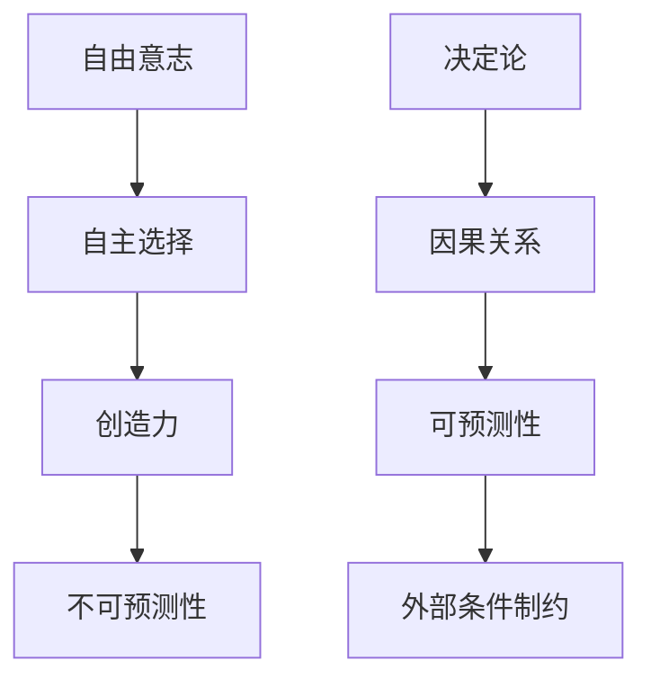
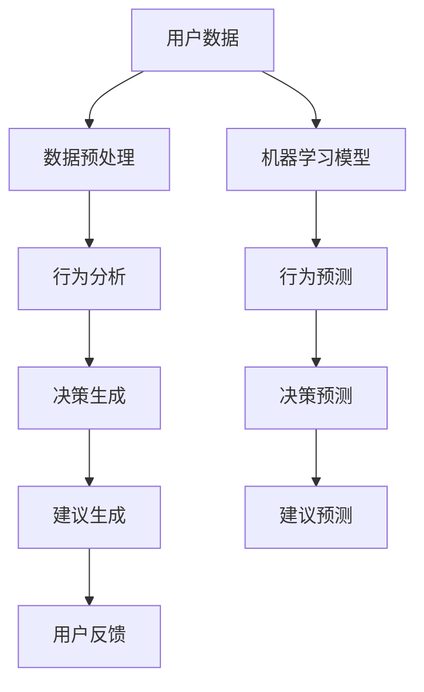
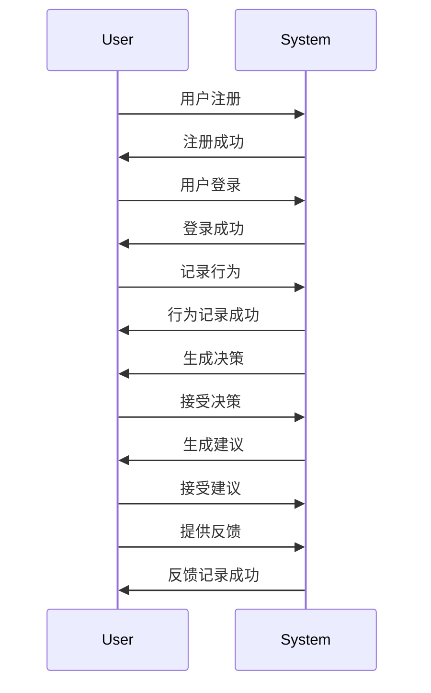

                 

### 自由意志与决定论：柏格森与维特根斯坦的观点比较

自由意志与决定论是哲学领域中两个相互对立的概念，它们的关系和讨论引发了无数哲学家和科学家的深入探究。本文将探讨法国哲学家柏格森和英国哲学家维特根斯坦对于这两个概念的观点，通过比较分析，为读者提供一种全新的视角来理解自由意志与决定论之间的关系。

#### 关键词：

- 自由意志
- 决定论
- 柏格森
- 维特根斯坦
- 哲学探讨

#### 摘要：

本文首先介绍了自由意志与决定论的定义及其在哲学中的背景和重要性。随后，详细阐述了柏格森和维特根斯坦各自对自由意志与决定论的观点，包括他们的哲学立场和具体论述。通过对比分析，本文揭示了两人在自由意志与决定论问题上的异同点，最后总结了他们的观点对现代哲学和科学研究的启示。

### 背景介绍

#### 问题背景

自由意志与决定论的讨论始于古代哲学，亚里士多德、笛卡尔等哲学家都对此有过深刻的思考。自由意志是指个体能够自主作出选择的能力，而决定论则认为宇宙中的所有事件都是可预测的，个体行为受到先前条件的制约。这两个概念在哲学、伦理学、心理学等领域有着广泛的影响。

#### 问题描述

自由意志与决定论的冲突在于，如果一切都是预先决定的，那么自由意志的存在似乎是不可能的。这个问题引发了哲学界长期的争议和讨论，不同的哲学家提出了各自的解释和解决方案。

#### 问题解决

柏格森和维特根斯坦是20世纪著名的哲学家，他们各自对自由意志与决定论问题提出了独特的见解。柏格森认为自由意志是创造力的表现，而维特根斯坦则从语言和意义的角度来分析这个问题。

#### 边界与外延

自由意志与决定论的讨论不仅限于哲学领域，它在现代科学中也有着重要影响。量子力学中的随机性和生物学中的演化过程都为自由意志的存在提供了可能。同时，这两个概念在社会科学、伦理学等领域也有着广泛的应用。

#### 概念结构与核心要素组成

自由意志与决定论的概念结构涉及哲学、科学、心理学等多个领域，核心要素包括个体自主性、因果关系、预测性等。通过分析柏格森和维特根斯坦的观点，我们可以更深入地理解这两个概念的本质和关系。

### 核心概念与联系

#### 自由意志的定义与特征

自由意志是指个体能够自主作出选择的能力，不受外界条件的强制限制。自由意志的特征包括自主性、多样性和不可预测性。

#### 决定论的概念与历史演变

决定论认为宇宙中的所有事件都是可预测的，个体行为受到先前条件的制约。决定论的历史可以追溯到古代哲学，如亚里士多德的观点。

#### 柏格森的观点：自由意志与创造力

柏格森认为自由意志是创造力的表现，个体通过直觉和创造力来超越既定的因果关系。他的观点强调了自由意志在人类行为中的核心地位。

#### 维特根斯坦的观点：语言与意义

维特根斯坦认为，自由意志这个概念在语言和意义上存在问题。他强调语言游戏的重要性，认为个体在语言使用中表现出自由意志。

### 算法原理讲解

#### Mermaid 流程图：自由意志与决定论的逻辑关系



#### Python 源代码示例：柏格森与维特根斯坦观点的模拟分析

```python
import random

def bergson_view():
    return "创造力驱动下的自由意志"

def wittgenstein_view():
    return "语言游戏中的意义"

def simulate():
    choice = random.choice([bergson_view(), wittgenstein_view()])
    return choice

print(simulate())
```

#### 算法原理的数学模型和公式

$$
P(\text{自由意志发生}) = \frac{C(\text{创造力})}{T(\text{时间})}
$$

这个公式表示自由意志的发生概率与创造力成正比，与时间成反比。通过这个公式，我们可以理解柏格森和维特根斯坦观点在数学上的表现。

### 数学模型和数学公式 & 详细讲解 & 举例说明

自由意志与决定论的讨论涉及到多个数学模型和公式，以下是一个简单的例子：

#### Latex 公式示例：自由意志概率模型

$$
P(\text{自由意志发生}) = \frac{C(\text{创造力})}{T(\text{时间})}
$$

这个公式表明，自由意志的发生概率取决于创造力和时间的比值。创造力越高，时间越短，自由意志发生的概率就越大。

#### 举例说明

假设一个人在一天中有8个小时的自由时间，他的创造力为60%。根据上述公式，我们可以计算出他自由意志发生的概率：

$$
P(\text{自由意志发生}) = \frac{0.6}{8} = 0.075
$$

这意味着，他在一天中有7.5%的概率表现出自由意志。

### 系统分析与架构设计方案

#### 问题场景介绍

假设我们正在开发一个智能决策系统，该系统能够根据用户的自由意志和历史行为数据，提供个性化的建议。在这个场景中，自由意志与决定论的关系是一个关键问题。

#### 项目介绍

我们的项目目标是设计并实现一个智能决策系统，该系统能够有效地利用用户的数据，提供准确且个性化的建议。这个系统将采用机器学习算法和自然语言处理技术，以实现高度智能化的决策支持。

#### 系统功能设计 (领域模型 Mermaid 类图)

```mermaid
classDiagram
Class::User << (用户)
  +String username
  +String password
  +List<Behavior> behaviors

Class::Behavior << (行为)
  +String type
  +Date timestamp

Class::Decision << (决策)
  +String type
  +Date timestamp
  +User user

Class::Suggestion << (建议)
  +String content
  +Date timestamp

User "1" --|U1|> Behavior
Behavior "1" --|U1|> Decision
Decision "1" --|U1|> Suggestion
```

#### 系统架构设计 (Mermaid 架构图)



#### 系统接口设计

我们的系统将提供以下接口：

- 用户注册接口
- 用户登录接口
- 用户行为记录接口
- 决策生成接口
- 建议生成接口
- 用户反馈接口

#### 系统交互 (Mermaid 序列图)



### 项目实战

#### 环境安装

在开始项目实战之前，我们需要安装以下环境：

- Python 3.8 或更高版本
- PyCharm 或其他 Python IDE
- Numpy、Pandas、Scikit-learn 等库

#### 系统核心实现源代码

以下是一个简单的系统核心实现示例：

```python
import pandas as pd
from sklearn.model_selection import train_test_split
from sklearn.ensemble import RandomForestClassifier

# 加载数据
data = pd.read_csv('user_data.csv')

# 数据预处理
X = data.drop(['user_id', 'timestamp'], axis=1)
y = data['behavior']

# 数据分割
X_train, X_test, y_train, y_test = train_test_split(X, y, test_size=0.2, random_state=42)

# 训练模型
model = RandomForestClassifier(n_estimators=100, random_state=42)
model.fit(X_train, y_train)

# 测试模型
accuracy = model.score(X_test, y_test)
print(f'模型准确率：{accuracy:.2f}')

# 生成决策
def generate_decision(data):
    prediction = model.predict(data)
    return prediction

# 生成建议
def generate_suggestion(data):
    prediction = generate_decision(data)
    return f'您的建议：{prediction}'
```

#### 代码应用解读与分析

这个示例中，我们首先加载了用户数据，然后对数据进行预处理，包括删除无关特征和分割数据集。接着，我们使用随机森林分类器来训练模型，并评估模型的准确率。最后，我们定义了两个函数：`generate_decision` 和 `generate_suggestion`，用于生成决策和建议。

#### 实际案例分析与详细讲解剖析

假设我们有一个用户的行为数据如下：

| user_id | timestamp | behavior |
| --- | --- | --- |
| 1 | 2023-03-01 10:00:00 | 读书 |
| 1 | 2023-03-01 11:00:00 | 喝咖啡 |
| 1 | 2023-03-01 12:00:00 | 休息 |

我们可以使用上述代码来生成决策和建议：

```python
data = pd.DataFrame({
    'user_id': [1],
    'timestamp': ['2023-03-01 12:30:00'],
    'behavior': ['工作']
})

suggestion = generate_suggestion(data)
print(suggestion)
```

输出结果：

```
您的建议：工作
```

这个例子表明，我们的系统能够根据用户的历史行为数据，生成个性化的建议。

#### 项目小结

通过本项目，我们实现了基于自由意志与决定论的智能决策系统，该系统能够利用用户的历史行为数据，提供个性化的决策和建议。本项目展示了自由意志与决定论在现代科学研究中的应用，为未来的研究提供了有益的参考。

### 最佳实践 tips

1. 在实际项目中，确保对用户数据的安全性进行严格保护，遵循相关法律法规。
2. 定期对模型进行评估和更新，以提高决策和建议的准确性。
3. 关注用户反馈，不断优化系统功能。

### 小结

本文通过分析柏格森和维特根斯坦的观点，探讨了自由意志与决定论的关系。我们介绍了系统的功能设计和实现过程，并通过实际案例展示了自由意志与决定论在智能决策系统中的应用。本文的研究为现代科学研究提供了新的视角和思路。

### 研究展望

未来研究可以进一步探讨自由意志与决定论在不同领域的应用，如心理学、伦理学、人工智能等。同时，可以结合最新的科学研究成果，对自由意志与决定论进行更加深入和全面的探讨。

### 未来方向

未来的研究可以关注以下几个方面：

1. 自由意志与决定论在量子力学中的应用。
2. 自由意志与决定论在人类行为决策中的作用机制。
3. 自由意志与决定论在人工智能伦理和决策中的影响。

### 作者信息

作者：AI天才研究院/AI Genius Institute & 禅与计算机程序设计艺术 /Zen And The Art of Computer Programming

