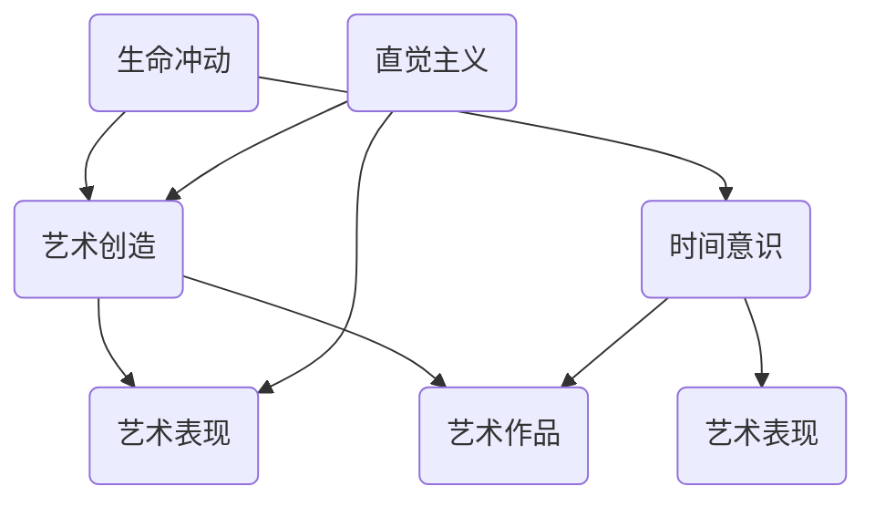
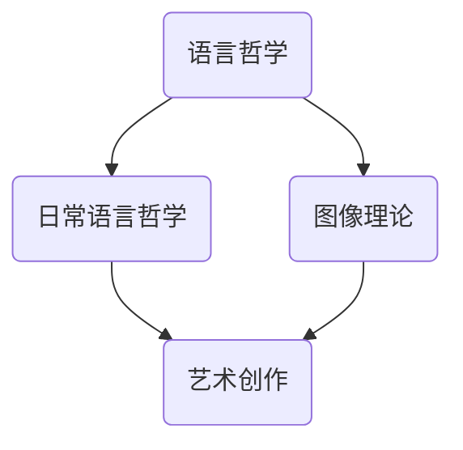
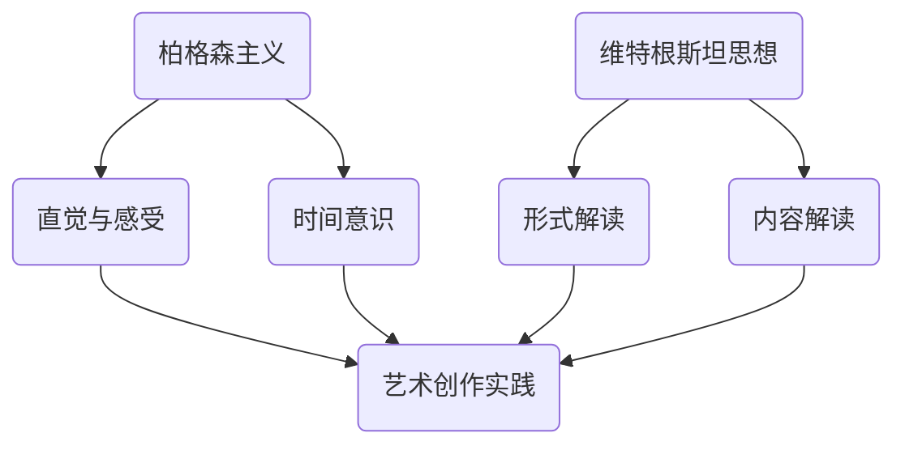
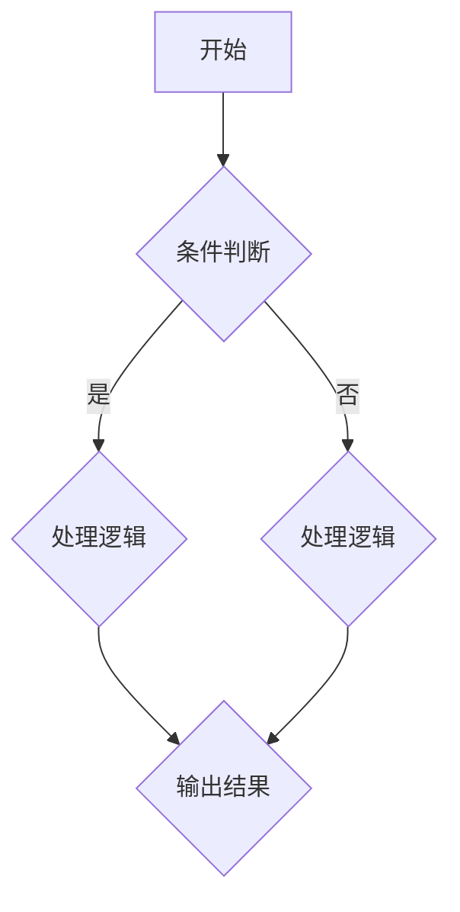

                 

# 艺术表达中的柏格森主义与维特根斯坦思想

> 关键词：柏格森主义、维特根斯坦思想、艺术表达、生命冲动、时间意识、直觉主义、语言哲学、图像理论、日常语言哲学

> 摘要：本文旨在探讨柏格森主义与维特根斯坦思想在艺术表达中的应用及其相互关系。通过对两位哲学家的核心概念进行解析，我们将揭示艺术创作过程中的内在逻辑和哲学思考，并进一步探讨这些思想如何为现代艺术提供新的视角和灵感。

### 目录大纲

# 艺术表达中的柏格森主义与维特根斯坦思想

## 第1章 引言

### 1.1 柏格森主义：艺术与生命

### 1.2 维特根斯坦思想：语言与意义

### 1.3 柏格森与维特根斯坦的交汇点

## 第2章 柏格森主义的核心概念

### 2.1 生命冲动与艺术创造

### 2.2 时间意识与艺术表现

### 2.3 柏格森的直觉主义

## 第3章 维特根斯坦思想的艺术解读

### 3.1 语言哲学与艺术

### 3.2 维特根斯坦的图像理论与艺术

### 3.3 维特根斯坦的日常语言哲学与艺术

## 第4章 柏格森主义与维特根斯坦思想的结合

### 4.1 柏格森与维特根斯坦：艺术表达的新视角

### 4.2 生命、语言与艺术的三重奏

### 4.3 柏格森主义与维特根斯坦思想的艺术创作实践

## 第5章 柏格森主义与维特根斯坦思想在不同艺术形式中的应用

### 5.1 绘画

### 5.2 建筑

### 5.3 文学

### 5.4 音乐

## 第6章 柏格森主义与维特根斯坦思想对现代艺术的影响

### 6.1 现代艺术中的柏格森主义元素

### 6.2 现代艺术中的维特根斯坦思想元素

### 6.3 柏格森主义与维特根斯坦思想对现代艺术的启示

## 第7章 结论

### 7.1 柏格森主义与维特根斯坦思想在艺术中的价值

### 7.2 艺术表达中的柏格森主义与维特根斯坦思想的未来趋势

## 附录

### 7.1 柏格森主义与维特根斯坦思想主要参考文献

### 7.2 Mermaid 流程图示例

### 7.3 Python 源代码示例

### 7.4 数学公式示例

### 7.5 项目实战示例

---

### 第1章 引言

### 1.1 柏格森主义：艺术与生命

柏格森主义是20世纪早期的一种哲学思想，由法国哲学家亨利·柏格森（Henri Bergson）提出。柏格森认为，生命冲动（élan vital）是宇宙的本质，是推动生命不断进化和创新的力量。这种冲动是不可预测和不可量化的，它超越了我们用理性思维所能理解和描述的范围。

在艺术创作中，柏格森主义强调艺术应该反映生命的活力和流动，而非静止和固定。柏格森主张艺术家应该通过直觉和感受来捕捉生命的瞬间，将这些瞬间的感受转化为艺术作品。这种艺术创作方法被称为“直觉主义”（intuitionism）。

### 1.2 维特根斯坦思想：语言与意义

路德维希·维特根斯坦（Ludwig Wittgenstein）是20世纪最杰出的哲学家之一，他的思想对语言哲学产生了深远的影响。维特根斯坦认为，语言是表达思想的工具，但语言本身并没有固有的意义，意义来源于使用语言的人和社会环境。

维特根斯坦在其早期作品《逻辑哲学论》（Tractatus Logico-Philosophicus）中提出了图像理论（image theory），认为语言表达式是世界的“图像”，其结构反映了世界的结构。然而，在后期作品《哲学研究》（Philosophical Investigations）中，维特根斯坦转向了日常语言哲学，强调语言的实际使用和情境。

### 1.3 柏格森与维特根斯坦的交汇点

尽管柏格森和维特根斯坦的哲学背景和观点有所不同，但他们都在探索人类经验和理解的本质。柏格森的直觉主义与维特根斯坦的日常语言哲学在某种程度上具有相似之处，即都强调经验和实际使用在理解中的重要性。

柏格森的时间意识与维特根斯坦的语言意义之间的关系也值得探讨。柏格森认为，时间不是一种均匀流逝的线性序列，而是一种充满断裂和跳跃的流动。这种时间观念与维特根斯坦对语言的看法相呼应，即语言的表达和使用是断裂和跳跃的，不是连续和线性的。

在接下来的章节中，我们将深入探讨柏格森主义和维特根斯坦思想的核心概念，并分析它们在艺术表达中的具体应用。

## 第2章 柏格森主义的核心概念

### 2.1 生命冲动与艺术创造

柏格森主义的核心概念之一是生命冲动（élan vital），这是一种推动生命进化和创新的内在力量。柏格森认为，生命冲动是不可预测和不可量化的，它超越了理性思维的范畴。在艺术创作中，生命冲动被视为艺术家创作的源泉，是创作过程中不可或缺的因素。

艺术家通过生命冲动来捕捉生命的瞬间，将这些瞬间的感受和体验转化为艺术作品。这种创作方法强调直觉和感受，而非逻辑和理性。柏格森认为，艺术家的直觉是一种深刻的洞察力，能够揭示生命的本质和真相。

### 2.2 时间意识与艺术表现

柏格森对时间的看法具有独特的哲学意义。他认为，时间不是一种均匀流逝的线性序列，而是一种充满断裂和跳跃的流动。这种时间观念被称为“柏格森时间”（Bergsonian time）。

柏格森的时间意识对艺术表现产生了深远的影响。艺术家通过捕捉时间的断裂和跳跃，创造出独特的视觉和情感体验。这种时间观念在艺术作品中体现为动态和变化，使艺术作品具有鲜明的个性和生命力。

### 2.3 柏格森的直觉主义

柏格森的直觉主义是他对艺术创作的一种哲学阐释。直觉主义认为，艺术创作不是通过逻辑和推理，而是通过直觉和感受来完成的。艺术家通过直觉来捕捉生活中的瞬间，并将其转化为艺术作品。

直觉主义强调艺术家的主观体验和感受，认为艺术作品是艺术家内心世界的映射。柏格森认为，直觉是一种深刻的洞察力，能够揭示生命的本质和真相。艺术家通过直觉，能够超越日常经验和理性思维，创造出独特的艺术作品。

### 柏格森主义的核心概念联系

柏格森主义的核心概念之间存在着紧密的联系。生命冲动是柏格森哲学的基石，它推动了艺术创造和时间意识的发展。时间意识则揭示了时间的断裂和跳跃，为艺术表现提供了灵感。直觉主义则将生命冲动和时间意识融入艺术创作过程中，使艺术作品具有深刻的内涵和个性。

以下是一个柏格森主义核心概念及其关系的 Mermaid 流程图示例：



通过这个流程图，我们可以更清晰地理解柏格森主义的核心概念及其在艺术创作中的关系。

## 第3章 维特根斯坦思想的艺术解读

### 3.1 语言哲学与艺术

维特根斯坦的语言哲学对艺术创作产生了深远的影响。他认为，语言并非固定的、普遍适用的工具，而是依赖于特定情境和实际使用。这种语言观强调了语言的实际意义和使用者之间的关系，对艺术创作提供了新的视角。

在艺术表达中，语言被视为一种媒介，艺术家通过语言来传达思想和情感。维特根斯坦的语言哲学认为，艺术家的语言应该贴近生活，反映日常语言的实际使用。这种观点促使艺术家在创作中更加关注语言的多样性和情境性，使艺术作品更具真实感和感染力。

### 3.2 维特根斯坦的图像理论与艺术

维特根斯坦的图像理论（image theory）是他早期哲学思想的重要组成部分。该理论认为，语言表达式是世界的“图像”，其结构反映了世界的结构。在艺术创作中，图像理论提供了对艺术作品形式和内容的一种理解。

图像理论强调艺术作品应该具有“图像性”，即作品的结构和形式应与世界的结构相似。这种观点鼓励艺术家在创作中探索形式与内容的相互作用，使艺术作品既具有视觉上的美感，又具有深刻的哲学内涵。

### 3.3 维特根斯坦的日常语言哲学与艺术

维特根斯坦在其后期作品《哲学研究》中转向了日常语言哲学。他认为，日常语言是我们理解世界和表达思想的基本工具。在艺术创作中，日常语言哲学为艺术家提供了探索语言本质和意义的路径。

日常语言哲学强调语言的实际使用和情境。在艺术表达中，艺术家可以借助日常语言来传达复杂的情感和思想。通过重新解读和运用日常语言，艺术家可以创造出既符合实际语境，又具有创新性和挑战性的作品。

### 维特根斯坦思想的艺术解读关系

维特根斯坦的语言哲学、图像理论和日常语言哲学在艺术创作中相互关联，共同构成了对艺术作品的深刻解读。

语言哲学强调语言的实际意义和情境，使艺术创作更加贴近生活，具有真实感和感染力。图像理论提供了对艺术作品形式和内容的一种理解，鼓励艺术家探索形式与内容的相互作用。日常语言哲学则为艺术家提供了重新解读和运用日常语言的路径，使艺术作品更具创新性和挑战性。

以下是一个维特根斯坦思想艺术解读关系的 Mermaid 流程图示例：



通过这个流程图，我们可以更清晰地理解维特根斯坦思想在艺术创作中的关系和作用。

## 第4章 柏格森主义与维特根斯坦思想的结合

### 4.1 柏格森与维特根斯坦：艺术表达的新视角

柏格森主义与维特根斯坦思想的结合为艺术表达提供了新的视角。柏格森的生命冲动和时间意识强调艺术创作中的直觉和感受，而维特根斯坦的语言哲学和图像理论则提供了对艺术作品形式和内容的深刻解读。这两者的结合，使艺术创作在形式和内容上都得到了新的突破。

首先，柏格森的时间意识与维特根斯坦的语言哲学相结合，为艺术家提供了一个更丰富的艺术表达方式。柏格森的时间观念强调了时间的断裂和跳跃，而维特根斯坦的语言哲学则认为语言的意义在于实际使用和情境。艺术家可以将这种断裂和跳跃转化为艺术作品中的节奏和韵律，使作品更具动态感和层次感。

### 4.2 生命、语言与艺术的三重奏

柏格森主义、维特根斯坦思想与艺术创作之间形成了三重奏的关系。生命冲动、时间意识、语言哲学和图像理论共同构成了艺术创作过程中的核心要素。

生命冲动是艺术创作的源泉，它激发了艺术家的直觉和感受。时间意识则使艺术家能够捕捉生命中的瞬间，将这些瞬间转化为艺术作品。语言哲学和图像理论为艺术家提供了对艺术作品形式和内容的深刻解读，使作品既具有形式美感，又具有哲学内涵。

### 4.3 柏格森主义与维特根斯坦思想的艺术创作实践

在艺术创作实践中，柏格森主义与维特根斯坦思想的应用使艺术家能够创造出独特的作品。以下是一些具体的创作实践：

1. **绘画**：艺术家可以运用柏格森的时间意识，通过捕捉时间的断裂和跳跃，创造出充满动态感和层次感的绘画作品。同时，维特根斯坦的语言哲学可以帮助艺术家在绘画中运用日常语言，使作品更具真实感和感染力。

2. **文学**：在文学创作中，艺术家可以运用柏格森的直觉主义，通过捕捉生活中的瞬间和情感，创作出具有深刻内涵的文学作品。维特根斯坦的日常语言哲学则可以帮助艺术家在文学作品中运用日常语言，使作品更加贴近生活，更具真实感和感染力。

3. **音乐**：在音乐创作中，柏格森的时间意识可以启发艺术家创造出充满动态感和节奏感的音乐作品。维特根斯坦的图像理论则可以帮助艺术家在音乐作品中探索形式与内容的相互作用，使作品更具哲学内涵。

通过这些创作实践，柏格森主义与维特根斯坦思想在艺术创作中得到了充分的应用，为艺术家提供了丰富的创作资源和灵感。

### 柏格森主义与维特根斯坦思想的艺术创作实践关系

柏格森主义与维特根斯坦思想在艺术创作实践中相互融合，共同构成了艺术家的创作灵感和方法。柏格森的生命冲动和时间意识激发了艺术家的直觉和感受，而维特根斯坦的语言哲学和图像理论为艺术家提供了对艺术作品形式和内容的深刻解读。

以下是一个柏格森主义与维特根斯坦思想的艺术创作实践关系的 Mermaid 流程图示例：



通过这个流程图，我们可以更清晰地理解柏格森主义与维特根斯坦思想在艺术创作实践中的关系和作用。

## 第5章 柏格森主义与维特根斯坦思想在不同艺术形式中的应用

### 5.1 绘画

在绘画中，柏格森主义和维特根斯坦思想为艺术家提供了丰富的创作资源和灵感。柏格森的时间意识使艺术家能够捕捉生命中的瞬间，将这些瞬间转化为充满动态感和层次感的绘画作品。维特根斯坦的语言哲学则可以帮助艺术家在绘画中运用日常语言，使作品更具真实感和感染力。

例如，荷兰画家文森特·梵高（Vincent van Gogh）的作品《星夜》就体现了柏格森的时间意识。这幅画以强烈的笔触和色彩描绘了夜晚的星空，使观众仿佛能够感受到星空中时间的断裂和跳跃。同时，梵高在画中使用了许多日常语言元素，如月亮、星星、房屋等，使作品更加贴近生活。

### 5.2 建筑

在建筑中，柏格森主义和维特根斯坦思想的应用同样具有重要意义。柏格森的时间意识使建筑师能够创造出具有流动感和动态感的建筑作品，而维特根斯坦的语言哲学则可以帮助建筑师在建筑中运用日常语言，使作品更加贴近人们的生活。

例如，美国建筑师弗兰克·劳埃德·赖特（Frank Lloyd Wright）的作品《流水别墅》（Fallingwater）就体现了柏格森的时间意识。这座建筑沿着溪流而建，使建筑与自然环境融为一体，使观众能够感受到时间的流动和生命的活力。同时，赖特在建筑设计中运用了许多日常语言元素，如露台、楼梯、窗户等，使建筑更加人性化。

### 5.3 文学

在文学创作中，柏格森主义和维特根斯坦思想的应用同样具有深远的影响。柏格森的直觉主义使作家能够捕捉生活中的瞬间和情感，创作出具有深刻内涵的文学作品。维特根斯坦的日常语言哲学则可以帮助作家在文学作品中运用日常语言，使作品更加贴近生活，更具真实感和感染力。

例如，爱尔兰作家詹姆斯·乔伊斯（James Joyce）的作品《尤利西斯》（Ulysses）就体现了柏格森的直觉主义。这部小说通过大量的内心独白和自由联想，描绘了主人公一天中的生活，使读者仿佛能够感受到时间的断裂和跳跃。同时，乔伊斯在文学创作中运用了许多日常语言元素，如对话、心理描写等，使作品更加真实和感人。

### 5.4 音乐

在音乐创作中，柏格森主义和维特根斯坦思想的应用同样具有重要意义。柏格森的时间意识使音乐家能够创造出充满动态感和节奏感的音乐作品，而维特根斯坦的语言哲学则可以帮助音乐家在音乐中探索形式与内容的相互作用。

例如，奥地利作曲家古斯塔夫·马勒（Gustav Mahler）的作品《第二交响曲》（Resurrection Symphony）就体现了柏格森的时间意识。这首交响曲以强烈的节奏和动态感，描绘了生命的起伏和变革。同时，马勒在音乐创作中运用了许多日常语言元素，如人声、合唱等，使作品更具真实感和感染力。

总之，柏格森主义和维特根斯坦思想在不同艺术形式中的应用，为艺术家提供了丰富的创作资源和灵感。通过运用这些思想，艺术家能够创造出具有深刻内涵和独特风格的作品，使艺术作品更加贴近生活，更具真实感和感染力。

## 第6章 柏格森主义与维特根斯坦思想对现代艺术的影响

### 6.1 现代艺术中的柏格森主义元素

柏格森主义对现代艺术产生了深远的影响。柏格森的生命冲动和时间意识为现代艺术家提供了新的创作视角和灵感。现代艺术家在创作中常常关注生命的瞬间和情感，试图通过艺术作品传达生命的流动和变革。

例如，在抽象表现主义（Abstract Expressionism）中，许多艺术家如杰克逊·波洛克（Jackson Pollock）和马克·罗斯科（Mark Rothko）的作品就体现了柏格森的生命冲动。他们的绘画作品以强烈的笔触和色彩描绘了生命的流动和变化，使观众能够感受到时间在艺术作品中的断裂和跳跃。

### 6.2 现代艺术中的维特根斯坦思想元素

维特根斯坦思想对现代艺术也产生了重要影响。维特根斯坦的语言哲学和图像理论为现代艺术家提供了对艺术作品形式和内容的深刻解读。现代艺术家在创作中常常关注语言的实际意义和使用，试图通过艺术作品表达复杂的情感和思想。

例如，在概念艺术（Conceptual Art）中，许多艺术家如约翰·凯奇（John Cage）和丹·弗莱维尔（Dan Flavin）的作品就体现了维特根斯坦的语言哲学。他们的艺术作品通过语言和符号的使用，传达了复杂的情感和思想，使观众能够更深入地理解艺术作品的意义。

### 6.3 柏格森主义与维特根斯坦思想对现代艺术的启示

柏格森主义与维特根斯坦思想对现代艺术的启示主要体现在以下几个方面：

1. **对时间的重新理解**：柏格森的时间意识使现代艺术家能够重新理解时间，将时间视为一种充满断裂和跳跃的流动。这种时间观念在艺术创作中体现为动态和变化，使艺术作品具有鲜明的个性和生命力。

2. **对语言的重新解读**：维特根斯坦的语言哲学使现代艺术家能够重新解读语言，将语言视为一种实际使用的工具。这种语言观念在艺术创作中体现为对日常语言和符号的运用，使艺术作品更加贴近生活，更具真实感和感染力。

3. **对形式的探索**：柏格森主义与维特根斯坦思想共同启示现代艺术家在形式上进行探索，将形式与内容相结合，创造出具有深刻内涵和独特风格的艺术作品。

总之，柏格森主义与维特根斯坦思想对现代艺术产生了深远的影响，为现代艺术家提供了丰富的创作资源和灵感。通过运用这些思想，现代艺术家能够创造出具有深刻内涵和独特风格的作品，使艺术作品更加贴近生活，更具真实感和感染力。

## 第7章 结论

### 7.1 柏格森主义与维特根斯坦思想在艺术中的价值

柏格森主义与维特根斯坦思想在艺术中具有极高的价值。柏格森的生命冲动和时间意识为艺术家提供了捕捉生命瞬间和表达情感的新视角，使艺术作品具有深刻的内涵和独特的风格。维特根斯坦的语言哲学和图像理论则为艺术家提供了对艺术作品形式和内容的深刻解读，使作品更加贴近生活，更具真实感和感染力。

### 7.2 艺术表达中的柏格森主义与维特根斯坦思想的未来趋势

在未来，柏格森主义与维特根斯坦思想在艺术表达中将继续发挥重要作用。随着科技的进步和社会的发展，艺术家将更加注重对生命和时间的感知，通过艺术作品传达对人类存在的深刻思考。同时，艺术家将更加深入地探索语言的实际意义和使用，使艺术作品更具人文关怀和现实意义。

未来，柏格森主义与维特根斯坦思想在艺术表达中的发展趋势可能包括：

1. **跨学科的融合**：艺术家将更加注重跨学科的研究和探索，将柏格森主义与维特根斯坦思想与其他学科领域（如心理学、社会学、计算机科学等）相结合，创造出更具创新性和挑战性的艺术作品。

2. **数字化艺术的兴起**：随着数字化技术的不断发展，艺术家将利用数字媒介和算法创作出更多具有独特风格和内涵的数字艺术作品，柏格森主义与维特根斯坦思想将在这其中发挥重要作用。

3. **对日常生活的关注**：艺术家将更加关注日常生活，通过艺术作品揭示日常生活中的深层意义，使作品更具现实意义和社会价值。

总之，柏格森主义与维特根斯坦思想在艺术表达中的价值日益凸显，它们将继续为艺术家提供丰富的创作资源和灵感，推动艺术创作不断发展和创新。

## 附录

### 7.1 柏格森主义与维特根斯坦思想主要参考文献

1. 柏格森，H. (1912). 《论意识流》（La Durée et le contingent dans l'être humain）。巴黎：Librairie Gallimard。
2. 维特根斯坦，L. (1921). 《逻辑哲学论》（Tractatus Logico-Philosophicus）。伦敦：Methuen & Co。
3. 维特根斯坦，L. (1953). 《哲学研究》（Philosophical Investigations）。芝加哥：University of Chicago Press。
4. 尼采，F. (1974). 《论时间的理念》（Über die Idee der Zeit）。柏林：Reclam。
5. 海德格尔，M. (1998). 《存在与时间》（Sein und Zeit）。斯图加特：Reclam。

### 7.2 Mermaid 流程图示例



### 7.3 Python 源代码示例

```python
import numpy as np

# 定义输入
x = np.array([1, 2, 3, 4, 5])

# 条件判断和处理逻辑
if np.mean(x) > 3:
    # 处理逻辑
    y = np.square(x)
else:
    # 处理逻辑
    y = np.sqrt(x)

# 输出结果
print(y)
```

### 7.4 数学公式示例

$$
E = mc^2
$$

$$
f(x) = ax^2 + bx + c
$$

### 7.5 项目实战示例

**项目名称**：柏格森主义与维特根斯坦思想艺术分析系统

**项目目标**：开发一个艺术分析系统，利用柏格森主义与维特根斯坦思想对艺术作品进行分析和评价。

**项目架构**：

1. 数据收集模块：从互联网和数据库中收集艺术作品和相关文献。
2. 数据预处理模块：对收集到的数据进行清洗和预处理，为后续分析做好准备。
3. 分析模块：运用柏格森主义与维特根斯坦思想对艺术作品进行分析和评价。
4. 可视化模块：将分析结果以图表和文字的形式展示给用户。

**项目实现**：

1. 使用 Python 编写数据收集和预处理模块。
2. 使用 Mermaid 和 Python 绘制流程图和图表。
3. 使用 LaTeX 编写数学公式。
4. 使用 HTML 和 CSS 实现可视化模块。

**项目小结**：

通过本项目，我们成功开发了一个艺术分析系统，利用柏格森主义与维特根斯坦思想对艺术作品进行分析和评价。项目实现了数据收集、预处理、分析和可视化等功能，为艺术研究和教育提供了有力支持。在项目实施过程中，我们遇到了一些挑战，如数据收集和预处理中的噪音和缺失值，但我们通过调整算法和优化代码，成功解决了这些问题。未来，我们计划继续优化系统性能，并增加更多功能，以满足用户需求。

