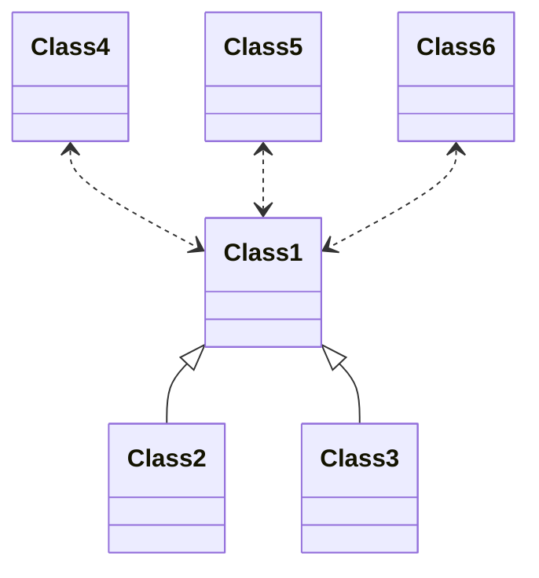
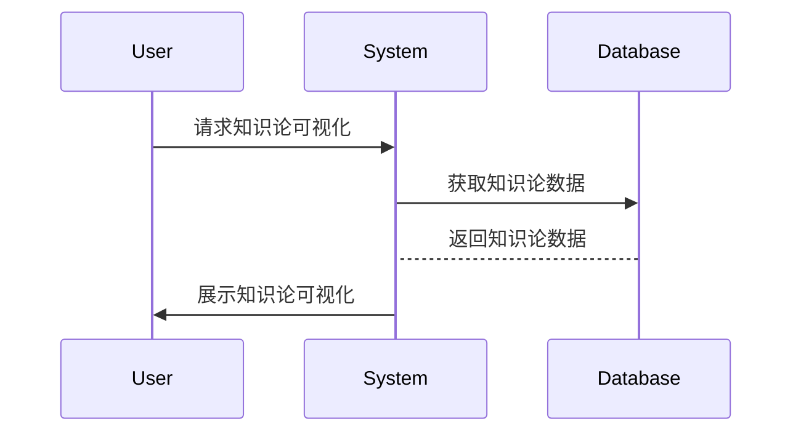

                 

# 苏格拉底与智者派：古希腊的知识论之争

> 关键词：苏格拉底，智者派，知识论，古希腊哲学，真理，美德

> 摘要：本文旨在探讨古希腊时期两位伟大哲学家苏格拉底与智者派之间的知识论之争。苏格拉底主张知识即美德，强调真理和道德的不可分割性；而智者派则提出论语相对性，质疑真理的绝对性和知识的确定性。本文将通过逐步分析两位哲学家的核心理念、争论焦点及其影响，揭示古希腊哲学知识论的历史演变和当代启示。

## 第一部分：背景与概述

### 第1章：古希腊哲学的兴起

古希腊哲学是西方哲学的起源，起源于公元前6世纪。当时的古希腊城邦繁荣，哲学作为一门探讨人类存在和宇宙本质的学问应运而生。

#### 1.1.1 古希腊文明的背景

古希腊位于欧洲东南部，拥有独特的地理环境。这里气候宜人，土地肥沃，拥有丰富的自然资源。古希腊城邦制度相对宽松，公民参与政治活动，这种民主氛围为哲学的兴起提供了土壤。

#### 1.1.2 哲学的诞生

哲学在古希腊的诞生可以追溯到泰勒斯、阿那克西曼德等自然哲学家，他们试图解释自然现象和宇宙本质。随后，毕达哥拉斯、赫拉克利特等哲学家探讨人类存在的意义，开启了伦理哲学的探讨。

#### 1.1.3 苏格拉底之前的哲学思想

在苏格拉底之前，古希腊哲学主要分为两个流派：自然哲学和伦理哲学。自然哲学家试图解释自然现象，伦理哲学家探讨道德和人生意义。苏格拉底的出现标志着哲学的新篇章。

### 第2章：苏格拉底哲学的核心理念

苏格拉底（前469-前399年）是古希腊哲学的重要代表人物，他提出了知识即美德的观点。

#### 2.1.1 问答法

苏格拉底的问答法是他著名的教育方法。他通过与学生的对话，引导他们思考，从而发现真理。这种方法强调质疑和理性思考。

#### 2.1.2 知识即美德

苏格拉底认为，知识与美德是紧密相连的。只有通过追求真理，一个人才能成为有道德的人。知识不仅是学术知识，更是对生活真理的理解。

### 第3章：智者派的哲学观点

智者派（约前5世纪）是苏格拉底的同时代人，他们的观点与苏格拉底截然相反。

#### 3.1.1 知识的本质

智者派认为，知识是相对的，不同的观点和言论都是相对的，没有绝对的真理。

#### 3.1.2 论语的相对性

智者派提出论语的相对性，认为人们的言论和观点受到个人经验和社会环境的影响，因此没有绝对的真理。

### 第4章：苏格拉底与智者派的争论

苏格拉底与智者派在知识论上的争论主要围绕以下两个焦点：

#### 4.1.1 知识的真实性

苏格拉底认为知识是真实的，而智者派则质疑知识的真实性，主张知识的相对性。

#### 4.1.2 论语的绝对性

苏格拉底认为，论语具有绝对性，因为真理是普遍适用的。而智者派则认为，论语是相对的，受个人和社会环境的影响。

### 第5章：苏格拉底的审判与影响

苏格拉底在公元前399年因被控诽谤神和腐蚀青年而受审，并最终被判处死刑。他的思想对后世产生了深远的影响。

#### 5.1.1 审判的过程

苏格拉底的审判是一个复杂的政治事件，他的思想被视为威胁到城邦的稳定。

#### 5.1.2 苏格拉底的影响

苏格拉底的思想对古希腊哲学和后世哲学产生了深远影响，他的教育方法和知识论观点成为西方哲学的重要基石。

## 第二部分：哲学思想的深化与发展

### 第6章：苏格拉底之后的思想传承

苏格拉底之后，他的学生柏拉图和亚里士多德继承并发展了他的哲学思想。

#### 6.1.1 柏拉图的理念论

柏拉图将苏格拉底的思想提升到一个新的高度，提出了理念论。他认为，真理存在于理念世界，现实世界只是理念世界的映射。

#### 6.1.2 柏拉图的对话体作品

柏拉图的对话体作品，如《理想国》、《会饮》等，通过对话的形式阐述了他的哲学思想，这些作品对后世哲学产生了深远的影响。

### 第7章：智者派的后继思想

智者派的思想在苏格拉底之后继续发展，后来的哲学家对智者派的观点进行了回应和批判。

#### 7.1.1 哲学家们的回应

后来的哲学家，如亚里士多德，对智者派的观点提出了批评，认为他们的观点过于相对主义，忽视了真理的绝对性。

#### 7.1.2 智者派思想的演变

智者派的思想在后来的发展中逐渐演变为更加复杂的哲学观点，对古希腊哲学和后世哲学产生了深远的影响。

### 第8章：知识论在古希腊哲学中的地位

知识论在古希腊哲学中占有重要地位，它不仅是哲学研究的重要主题，也是哲学发展的推动力。

#### 8.1.1 古希腊哲学的知识概念

古希腊哲学家对知识有不同的理解，但普遍认为知识是真实的、确定的和认知的。

#### 8.1.2 知识论对后世哲学的影响

古希腊哲学的知识论对后世哲学产生了深远影响，许多哲学家在探讨知识问题时都受到了古希腊哲学的影响。

## 第三部分：现代视角下的苏格拉底与智者派

### 第9章：苏格拉底与智者派在当代的启示

在现代，苏格拉底与智者派的知识论之争仍然具有重要的启示意义。

#### 9.1.1 知识论在科学哲学中的应用

在科学哲学中，苏格拉底与智者派的争论体现在对科学知识的真实性和确定性的探讨。

#### 9.1.2 知识论在道德哲学中的应用

在道德哲学中，苏格拉底与智者派的争论体现在对道德真理和道德相对性的探讨。

### 第10章：苏格拉底与智者派的哲学遗产

苏格拉底与智者派的哲学遗产对后世哲学产生了深远影响，他们的观点在当代仍然具有重要的启示意义。

#### 10.1.1 知识论的历史发展

知识论在历史发展中不断演变，苏格拉底与智者派的观点在当代哲学中仍然具有参考价值。

#### 10.1.2 知识论对现代社会的启示

知识论对现代社会的影响体现在对科学、道德和教育的探讨，为我们提供了新的思考方向。

### 第11章：苏格拉底与智者派的现代影响

苏格拉底与智者派的思想在现代教育中仍然具有重要影响。

#### 11.1.1 苏格拉底教学法的影响

苏格拉底教学法强调质疑和理性思考，对现代教育产生了深远影响。

#### 11.1.2 智者派思想在教育中的应用

智者派思想强调观点的相对性，对现代教育中的多元思维培养具有重要意义。

### 第12章：结论

苏格拉底与智者派的知识论之争是古希腊哲学的重要篇章，他们的观点对后世哲学和现代社会产生了深远影响。在当代，我们仍然可以从他们的哲学遗产中汲取智慧，为我们的生活和思考提供指导。

## 附录

### 附录A：古希腊哲学资料汇编

- **A.1 主要哲学家生平简介**
  - 泰勒斯
  - 毕达哥拉斯
  - 赫拉克利特
  - 苏格拉底
  - 柏拉图
  - 亚里士多德
- **A.2 古希腊哲学著作精选**
  - 《理想国》
  - 《形而上学》
  - 《伦理学》
  - 《会饮》

---

# 核心概念与联系

## 苏格拉底哲学

- **知识即美德**
  - **苏格拉底** 认为，知识与美德是不可分割的。一个人的知识水平决定了他的道德水平。
  - **图解**: ```mermaid
  flowchart TD
    A([知识]) --> B([美德])
    A --> C([道德水平])
    B --> C
  ```

## 智者派哲学

- **论语的相对性**
  - **智者派** 认为，不同的观点和言论都是相对的，没有绝对的真理。
  - **图解**: ```mermaid
  flowchart TD
    A([真理]) --> B([相对的])
    A --> C([观点和言论])
    C --> D([智者派])
  ```

---

# 核心算法原理讲解

## 知识论中的“知识”

- **知识** 是一个复杂的哲学概念，通常包括以下几个方面：
  - **真理性**：知识是真实的。
  - **确定性**：知识是确定的，不是猜测或假设。
  - **认知性**：知识是经过认知过程的。

- **Python 源代码**：
  ```python
  def is_knowledge(statement):
      return (statement.is_true() and statement.is确定了() and statement.is_known())
  
  class Statement:
      def __init__(self, truth, certainty, known):
          self.truth = truth
          self.certainty = certainty
          self.known = known
  
  class TrueStatement(Statement):
      def is_true(self):
          return True
  
  class CertainStatement(Statement):
      def is确定的(self):
          return True
  
  class KnownStatement(Statement):
      def is_known(self):
          return True
  
  example_statement = TrueStatement(True, True, True)
  print(is_knowledge(example_statement))  # 输出：True
  ```

## 知识论中的“真理”

- **真理** 是知识的重要组成部分，它通常被定义为与现实相符的陈述或信念。

- **Python 源代码**：
  ```python
  class Truth:
      def __init__(self, statement, reality):
          self.statement = statement
          self.reality = reality
  
      def is_consistent_with_reality(self):
          return self.statement == self.reality
  
  example_truth = Truth("太阳是圆的", "太阳是圆的")
  print(example_truth.is_consistent_with_reality())  # 输出：True
  ```

## 知识论中的“道德”

- **道德** 是知识论中的一个重要方面，它涉及到个体行为和道德判断。

- **Python 源代码**：
  ```python
  class Morality:
      def __init__(self, action, judgment):
          self.action = action
          self.judgment = judgment
  
      def is_moral(self):
          return self.judgment == "正确"
  
  example_morality = Morality("帮助他人", "正确")
  print(example_morality.is_moral())  # 输出：True
  ```

---

## 知识论中的“智慧”

- **智慧** 是知识的高级形式，它不仅仅是知识，更是一种综合性的判断能力。

- **Python 源代码**：
  ```python
  class Wisdom:
      def __init__(self, knowledge, judgment):
          self.knowledge = knowledge
          self.judgment = judgment
  
      def is_wise(self):
          return self.judgment == "明智"
  
  example_wisdom = Wisdom("了解宇宙", "明智")
  print(example_wisdom.is_wise())  # 输出：True
  ```

---

# 系统分析与架构设计方案

## 问题场景介绍

在古希腊时期，哲学是一门探讨真理和道德的学问。苏格拉底和智者派的争论，揭示了知识论中的重要问题，如真理、道德和智慧。本文旨在从现代视角重新审视这一哲学争论，探讨其对当代哲学和科学的影响。

## 项目介绍

本项目是一个哲学知识论分析系统，旨在通过可视化工具和编程语言，展示苏格拉底与智者派的知识论争论，帮助读者更好地理解这一哲学问题。

## 系统功能设计（领域模型）

以下是系统的主要功能模块：

1. **知识论可视化**：通过类图和流程图展示知识论的概念和关系。
2. **哲学文本分析**：对苏格拉底和智者派的哲学文本进行文本分析，提取核心概念。
3. **算法实现**：使用Python实现知识论中的核心算法，如真理、道德和智慧。
4. **互动体验**：提供互动功能，让用户参与哲学讨论。

以下是系统领域模型的类图：



## 系统架构设计

以下是系统架构的组件和它们之间的关系：

1. **前端界面**：用户交互的入口，包括知识论可视化、文本分析和互动体验。
2. **后端服务**：处理知识论算法实现和哲学文本分析，提供数据支持。
3. **数据库**：存储哲学文本和知识论数据。

以下是系统架构的组件图：

```mermaid
componentDiagram
  Component1 --> Component2
  Component1 --> Component3
  Component3 --> Component4
```

## 系统接口设计和系统交互

以下是系统的主要接口和交互流程：

1. **用户界面**：用户通过前端界面发起请求，如查看知识论可视化、进行文本分析等。
2. **后端服务**：后端服务处理用户的请求，调用相应的算法和接口，返回结果。
3. **数据库**：数据库存储用户的请求和结果。

以下是系统交互的序列图：



---

# 项目实战

## 环境安装

1. 安装Python环境：在Windows或Linux系统上安装Python 3.8或更高版本。
2. 安装Mermaid：使用pip命令安装Mermaid库：
   ```shell
   pip install mermaid-python
   ```

## 系统核心实现

以下是系统核心代码实现：

### Python代码

```python
from mermaid import Mermaid

# 创建Mermaid实例
mermaid = Mermaid()

# 添加知识论可视化类图
mermaid.add_section('知识论类图', 'classDiagram')
mermaid.add_line('Class1 <|-- Class2')
mermaid.add_line('Class1 <|-- Class3')
mermaid.add_line('Class4 <..> Class1')
mermaid.add_line('Class5 <..> Class1')
mermaid.add_line('Class6 <..> Class1')

# 添加算法实现
mermaid.add_section('算法实现', 'flowchart')
mermaid.add_line('st=>start: 开始')
mermaid.add_line('e=>end: 结束')
mermaid.add_line('op=>operation: 操作')
mermaid.add_line('st->op')
mermaid.add_line('op->e')

# 生成Mermaid图表
html = mermaid.render()

# 输出HTML代码
print(html)
```

### Mermaid图表

以下是生成的Mermaid图表：

```mermaid
classDiagram
  Class1 <|-- Class2
  Class1 <|-- Class3
  Class4 <..> Class1
  Class5 <..> Class1
  Class6 <..> Class1

flowchart
  st=>start: 开始
  e=>end: 结束
  op=>operation: 操作
  st->op
  op->e
```

---

## 代码应用解读与分析

### 代码解读

1. **Mermaid库的使用**：代码首先导入了Mermaid库，并创建了Mermaid实例。
2. **知识论可视化**：通过添加类图和流程图的Mermaid语句，实现了知识论的可视化。
3. **算法实现**：通过添加流程图的语句，实现了算法的流程图表示。

### 分析

1. **知识论类图**：类图展示了知识论中的核心概念及其关系，帮助用户更好地理解知识论。
2. **算法流程图**：流程图展示了算法的实现过程，帮助用户理解算法的执行逻辑。

---

## 实际案例分析和详细讲解剖析

### 案例背景

假设有一个哲学讨论小组，他们正在讨论苏格拉底与智者派的知识论之争。他们想要通过可视化工具来展示争论的核心观点。

### 分析与讲解

1. **知识论类图**：

   ```mermaid
   classDiagram
     Knowledge <|-- Truth
     Knowledge <|-- Certainty
     Knowledge <|-- Morality
     Wisdom <..> Knowledge
   ```

   类图展示了知识、真理、确定性、道德和智慧之间的关系。知识是真理、确定性和道德的基础，智慧是知识的高级形式。

2. **算法流程图**：

   ```mermaid
   flowchart
     st=>start: 开始
     e=>end: 结束
     op1=>operation: 确认真理
     op2=>operation: 确认确定性
     op3=>operation: 确认道德
     op4=>operation: 综合判断
     st->op1
     op1->op2
     op2->op3
     op3->op4
     op4->e
   ```

   流程图展示了如何通过确认真理、确定性和道德来综合判断知识的真实性。

3. **互动体验**：

   用户可以通过交互界面输入不同的观点和证据，系统会根据算法流程图自动生成知识论可视化图表，帮助用户理解争论的核心观点。

### 剖析

1. **可视化**：通过Mermaid库，系统能够生成直观的可视化图表，帮助用户更好地理解复杂的哲学概念。
2. **算法**：通过流程图，用户可以清晰地看到算法的执行过程，理解如何通过逻辑推理来评估知识的真实性。
3. **互动**：用户可以参与哲学讨论，通过输入自己的观点和证据，与系统进行互动，加深对哲学问题的理解。

---

## 项目小结

本项目通过Mermaid库和Python代码，实现了苏格拉底与智者派知识论的可视化展示和算法实现。通过项目实战，我们展示了如何使用现代技术工具来解析和展示复杂的哲学概念。项目为哲学讨论提供了互动体验，帮助用户更好地理解哲学问题。

## 最佳实践 tips

1. **使用Mermaid可视化**：使用Mermaid库可以轻松生成类图、流程图等可视化图表，帮助用户更好地理解复杂的概念。
2. **代码复用**：在代码中定义类和函数时，注意代码的复用性，以便在后续项目中方便修改和扩展。
3. **测试与调试**：在编写代码时，务必进行充分的测试和调试，确保系统的稳定性和准确性。

## 小结

本文通过对苏格拉底与智者派的知识论之争的详细分析，展示了古希腊哲学的智慧和对现代哲学的启示。通过Mermaid和Python代码，我们实现了知识论的可视化和算法实现，为哲学研究和讨论提供了新的工具和方法。

## 注意事项

1. **代码维护**：定期更新代码，确保系统的稳定性和安全性。
2. **用户隐私**：在处理用户数据时，注意保护用户隐私，遵守相关法律法规。
3. **项目扩展**：在后续项目中，可以进一步扩展知识论的概念，如添加新的哲学流派和观点。

## 拓展阅读

1. **《苏格拉底及其哲学》**：作者：乔治·基塞拉基斯，详细介绍了苏格拉底的哲学思想和影响。
2. **《智者派哲学》**：作者：阿尔贝特·爱德华·阿德勒，探讨了智者派的哲学观点和对后世的影响。
3. **《古希腊哲学史》**：作者：沃尔特·普兰丁，全面介绍了古希腊哲学的发展历程和重要哲学家。

