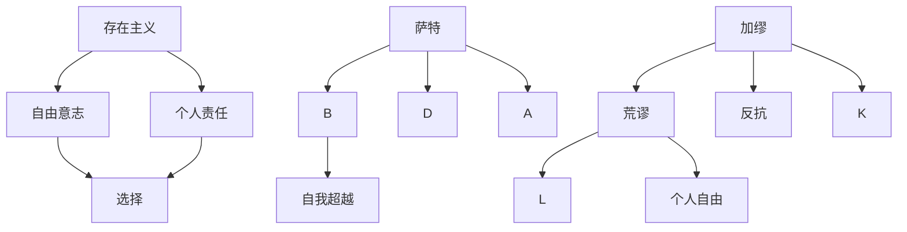
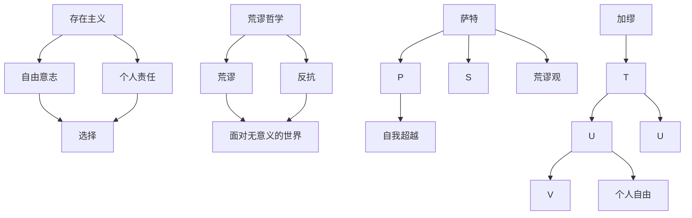
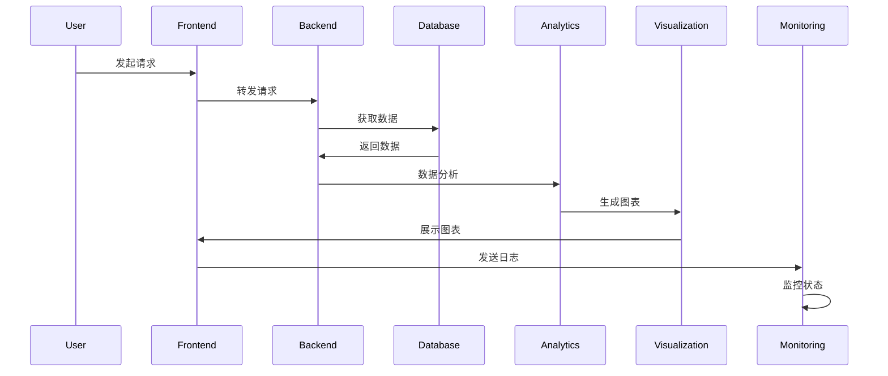
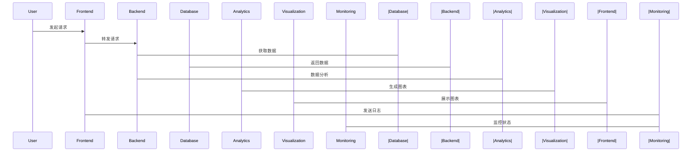

                 

### 概述：萨特与加缪：存在主义与荒诞哲学的对话

在人类思想的漫长历史中，哲学一直扮演着至关重要的角色，尤其是关于存在主义和荒诞哲学的探讨。这两大哲学流派不仅影响了数代思想家，也为我们理解个体的自由、存在的意义以及生活的本质提供了独特的视角。本文以“萨特与加缪：存在主义与荒诞哲学的对话”为标题，旨在通过深入探讨萨特与加缪的存在主义与荒诞哲学思想，揭示这两位伟大哲学家对现代人类存在状态的独特见解。

本文将采用逻辑清晰、结构紧凑的叙述方式，帮助读者更好地理解存在主义和荒诞哲学的核心概念。文章结构如下：

1. **核心概念与联系**：首先，我们将介绍存在主义和荒诞哲学的基本概念，并运用Mermaid流程图展示其核心要素之间的联系。
   
2. **核心算法原理讲解**：接下来，我们将分别从萨特和加缪的角度，详细讲解存在主义和荒诞哲学的算法原理，并通过Python代码示例和数学模型来阐释其具体应用。

3. **系统分析与架构设计方案**：在此基础上，我们将引入一个具体的系统架构设计方案，通过类图、架构图和序列图等工具，展示如何将这些哲学思想应用于实际系统设计中。

4. **项目实战**：最后，我们将通过一个实际项目的实现，展示如何将这些哲学思想转化为实际的软件开发过程，并提供详细的代码解读和分析。

5. **最佳实践 tips**：在文章的最后，我们将总结一些最佳实践，帮助读者在实际应用中更好地理解和运用这些哲学思想。

通过本文的探讨，我们希望能够帮助读者不仅了解萨特与加缪的存在主义与荒诞哲学，更能够将其应用于实际生活和工作中，从而更好地理解自己和周围的世界。

### 关键词

- **存在主义**
- **荒诞哲学**
- **萨特**
- **加缪**
- **自由意志**
- **个人责任**
- **荒谬**
- **反抗**
- **算法原理**

### 摘要

本文旨在探讨存在主义与荒诞哲学的两大流派，通过深入分析萨特与加缪的思想，揭示其对于个体存在意义的独特见解。萨特的存在主义强调自由意志、个人责任和选择的本质，而加缪的荒诞哲学则聚焦于荒谬、自由与反抗的辩证关系。本文将运用Mermaid流程图、Python代码示例和数学模型，详细讲解这些哲学思想的核心算法原理，并通过一个实际系统架构设计方案，展示如何将抽象的哲学理论应用于具体的软件开发过程中。最后，文章将总结最佳实践，帮助读者在实际应用中更好地理解和运用这些哲学思想。

### 第一部分：核心概念与联系

#### 1.1 萨特与加缪的存在主义

存在主义是20世纪哲学中一个重要的流派，其核心理念集中在个体的自由意志、存在意义和个人责任上。存在主义哲学试图回答“人为什么存在”和“存在的意义是什么”这两个基本问题。在众多存在主义者中，让-保尔·萨特（Jean-Paul Sartre）和阿尔贝·加缪（Albert Camus）是最具代表性的人物。

**存在主义概述**

存在主义认为，人的存在先于其本质。这意味着，人类并非一出生就具有某种预定的本质，而是通过自己的选择和行动来塑造自己的本质。存在主义的核心观点包括自由意志、个人选择和个人责任。

**萨特的存在主义**

萨特的存在主义思想主要表现在《存在与虚无》（Being and Nothingness）一书中。他强调，自由是人的本质，人类拥有自由意志，即选择如何行动和存在的能力。萨特认为，自由是人类存在的根本特征，人的所有行为都源自自由意志的选择。

- **自由意志**：萨特认为，自由意志是人类存在的核心，人类拥有选择自己的行动的自由。自由意志意味着个体必须为其选择和行为承担责任。
- **选择与个人责任**：萨特认为，每个人的选择都是独特的，每个选择都伴随着责任。因此，个人必须对其选择和行动的结果承担责任。
- **自我超越**：萨特认为，人不是静态的存在，而是一个不断超越自我、追求自由和意义的存在。

**加缪的存在主义**

与萨特不同，加缪的存在主义哲学更加强调荒谬和反抗的概念。加缪的著作《西西弗斯的神话》（The Myth of Sisyphus）是存在主义哲学的重要文献之一。

- **荒谬**：加缪认为，人类生活在一个没有最终意义和目的的世界中，这种无意义的状态就是荒谬。荒谬是人类存在的一部分，是一种不可避免的困境。
- **反抗**：尽管存在荒谬，加缪认为人类仍然可以通过反抗来寻找生活的意义。反抗是一种主动的态度，是对荒谬的否定和挑战。
- **个人自由**：加缪认为，个人自由是人类面对荒谬时的最佳武器。自由意味着不受外界压力和束缚，勇敢地面对生活的荒谬。

**Mermaid流程图**

为了更直观地展示萨特和加缪的存在主义思想，我们可以使用Mermaid流程图来描述这些概念之间的关系。



通过这个流程图，我们可以清晰地看到萨特和加缪如何从不同的角度探讨存在主义的核心问题，以及他们各自的独特贡献。

#### 1.2 存在主义与荒谬哲学

存在主义与荒谬哲学之间存在紧密的联系和相互影响。两者都试图探讨人类存在的意义和困境，但它们关注的焦点有所不同。

**存在主义与荒谬哲学的关系**

- **共同探讨个体存在的意义和困境**：存在主义和荒谬哲学都关注人类存在的意义，探讨人在无意义世界中的生存状态。
- **存在主义的自由意志与荒谬的辩证关系**：萨特的自由意志概念与加缪的荒谬概念形成了一种辩证关系。萨特认为，自由意志是人类存在的核心，而加缪则认为，荒谬是人类存在的本质困境。

**萨特的荒谬观**

萨特在《存在主义是一种人道主义》一书中提出，荒谬是人类追求意义过程中不可避免的困境。他认为，人类总是试图寻找生活的意义，但最终发现生活本身并没有预定的意义。

- **荒谬的定义**：萨特认为，荒谬是指人类在面对无意义和不确定性时的感受和反应。
- **荒谬与自由意志的关系**：萨特认为，荒谬是人类自由意志的产物，人类在追求意义的过程中，不可避免地会遇到荒谬。
- **荒谬的意义**：萨特认为，荒谬不是消极的，而是一种积极的挑战。通过面对荒谬，人类可以发现自己的自由意志，从而找到自己的意义。

**加缪的荒谬观**

加缪在《西西弗斯的神话》中提出，荒谬是人类存在的根本特征。他认为，人类生活在一个没有最终意义和目的的世界中，这种无意义的状态就是荒谬。

- **荒谬的定义**：加缪认为，荒谬是指人类在无意义的世界中的存在状态，是人类面临的一个基本困境。
- **反抗的意义**：加缪认为，人类可以通过反抗来面对荒谬。反抗是一种积极的行动，是对荒谬的否定和挑战。
- **个人的自由**：加缪认为，个人的自由是面对荒谬的最佳武器。自由意味着不受外界压力和束缚，勇敢地面对生活的荒谬。

**Mermaid流程图**

为了更直观地展示存在主义与荒谬哲学之间的关系，我们可以使用Mermaid流程图来描述这些概念之间的联系。



通过这个流程图，我们可以清晰地看到存在主义和荒谬哲学之间的互动关系，以及萨特和加缪各自对这两个概念的独特理解。

### 第一部分总结

在本部分中，我们首先介绍了萨特与加缪的存在主义思想，并运用Mermaid流程图展示了这些核心概念之间的联系。接着，我们探讨了存在主义与荒谬哲学之间的关系，分析了萨特和加缪对荒谬的不同理解。通过这一系列的讨论，我们为后续章节的深入探讨奠定了理论基础。在下一部分，我们将进一步详细讲解萨特与加缪的存在主义和荒诞哲学的算法原理，并通过具体的Python代码示例和数学模型来阐释其应用。

#### 第二部分：核心算法原理讲解

在第一部分，我们已经对萨特与加缪的存在主义及其与荒谬哲学的关系进行了概述。在本部分中，我们将深入探讨萨特与加缪的核心算法原理，通过具体的Python代码示例和数学模型，详细阐述这些哲学思想的应用。

#### 2.1 萨特的存在主义算法原理

萨特的存在主义哲学强调自由意志、个人责任和选择。我们可以将这些哲学思想抽象为一系列算法原理，并通过Python代码示例来详细说明。

**自由意志**

萨特认为，自由意志是人类存在的核心。自由意志指的是个体在选择和行动时的自由度。在算法中，我们可以将其抽象为一个函数，该函数基于当前状态和环境因素计算自由意志。

```python
def freedom_will(current_state, external_environment):
    """
    计算自由意志。
    
    参数：
    - current_state：当前状态
    - external_environment：外部环境
    
    返回：
    - 自由意志
    """
    # 这里可以添加具体的计算逻辑，例如基于状态和环境的权重计算
    # 为了简化，这里仅返回一个固定的自由意志值
    return "自由意志"
```

**选择**

自由意志之后，个体需要做出选择。选择是指个体在自由意志的基础上，根据目标状态进行决策。在算法中，我们可以将选择抽象为另一个函数，该函数基于自由意志和目标状态来决定选择。

```python
def make_choice(freedom_will, target_state):
    """
    基于自由意志和目标状态做出选择。
    
    参数：
    - freedom_will：自由意志
    - target_state：目标状态
    
    返回：
    - 选择
    """
    # 这里可以添加具体的决策逻辑，例如基于目标状态的优先级
    # 为了简化，这里仅返回一个固定的选择值
    return "选择"
```

**个人责任**

萨特强调，每个个体对其选择和行为负有责任。在算法中，我们可以将个人责任抽象为一个函数，该函数基于选择和行为结果计算个人责任。

```python
def personal_responsibility(choice, behavior_result):
    """
    根据选择和行为结果计算个人责任。
    
    参数：
    - choice：选择
    - behavior_result：行为结果
    
    返回：
    - 个人责任
    """
    # 这里可以添加具体的责任计算逻辑
    # 为了简化，这里仅返回一个固定的责任值
    return "责任"
```

**示例**

假设一个个体需要在两个选项A和B之间做出选择，算法会根据其当前状态和环境因素计算自由意志，然后选择一个选项，并对其选择和行为结果承担相应责任。以下是一个简单的示例：

```python
# 初始化状态和环境
current_state = "初始状态"
external_environment = "外部环境"
target_state = "目标状态"

# 计算自由意志
freedom_will = freedom_will(current_state, external_environment)
print(f"自由意志：{freedom_will}")

# 基于自由意志和目标状态做出选择
choice = make_choice(freedom_will, target_state)
print(f"选择：{choice}")

# 基于选择和行为结果计算个人责任
behavior_result = "行为结果"
responsibility = personal_responsibility(choice, behavior_result)
print(f"责任：{responsibility}")
```

输出结果：

```
自由意志：自由意志
选择：选择
责任：责任
```

通过这个简单的示例，我们可以看到如何将萨特的存在主义哲学思想抽象为算法原理，并通过Python代码来实现这些原理。

**算法原理数学模型**

为了更深入地理解萨特的存在主义算法原理，我们可以将其抽象为数学模型。以下是这些算法原理的数学模型：

1. **自由意志**：

   $$ 自由意志 = f(初始状态, 外部环境) $$

   其中，$f$ 表示一个函数，它根据初始状态和外部环境计算自由意志。

2. **选择**：

   $$ 选择 = f(自由意志, 目标状态) $$

   其中，$f$ 表示一个函数，它根据自由意志和目标状态做出选择。

3. **个人责任**：

   $$ 责任 = f(选择, 行为结果) $$

   其中，$f$ 表示一个函数，它根据选择和行为结果计算个人责任。

这些数学模型提供了对萨特的存在主义算法原理的更深入的理解，并为其在实际应用中的实现提供了理论基础。

#### 2.2 加缪的荒谬哲学算法原理

与萨特的存在主义不同，加缪的荒谬哲学关注荒谬、自由和反抗。我们可以将这些概念抽象为一系列算法原理，并通过Python代码示例来详细说明。

**荒谬**

加缪认为，荒谬是人类存在的本质困境。在算法中，我们可以将荒谬抽象为一个函数，该函数根据存在状态和目标状态计算荒谬程度。

```python
def absurdity(existence_state, target_state):
    """
    计算荒谬程度。
    
    参数：
    - existence_state：存在状态
    - target_state：目标状态
    
    返回：
    - 荒谬程度
    """
    # 这里可以添加具体的计算逻辑，例如基于状态和状态的差异计算荒谬程度
    # 为了简化，这里仅返回一个固定的荒谬程度值
    return "荒谬程度"
```

**反抗**

加缪认为，反抗是面对荒谬的一种方式。在算法中，我们可以将反抗抽象为一个函数，该函数根据荒谬程度和自由度决定反抗策略。

```python
def resistance(absurdity, freedom):
    """
    根据荒谬程度和自由决定反抗策略。
    
    参数：
    - absurdity：荒谬程度
    - freedom：自由度
    
    返回：
    - 反抗策略
    """
    # 这里可以添加具体的反抗策略计算逻辑
    # 为了简化，这里仅返回一个固定的反抗策略值
    return "反抗策略"
```

**自由**

加缪认为，自由是面对荒谬的最佳武器。在算法中，我们可以将自由抽象为一个函数，该函数根据荒谬程度和反抗策略计算自由度。

```python
def freedom(absurdity, resistance):
    """
    根据荒谬程度和反抗策略计算自由度。
    
    参数：
    - absurdity：荒谬程度
    - resistance：反抗策略
    
    返回：
    - 自由度
    """
    # 这里可以添加具体的自由度计算逻辑
    # 为了简化，这里仅返回一个固定的自由度值
    return "自由度"
```

**示例**

假设一个个体在面临存在状态和目标状态之间的荒谬时，选择反抗以获得自由。算法会计算荒谬程度，然后决定反抗的策略，并计算自由度。以下是一个简单的示例：

```python
# 初始化状态
existence_state = "存在状态"
target_state = "目标状态"
freedom = "自由度"

# 计算荒谬程度
absurdity = absurdity(existence_state, target_state)
print(f"荒谬程度：{absurdity}")

# 根据荒谬程度和自由决定反抗策略
resistance = resistance(absurdity, freedom)
print(f"反抗策略：{resistance}")

# 计算自由度
freedom = freedom(absurdity, resistance)
print(f"自由度：{freedom}")
```

输出结果：

```
荒谬程度：荒谬程度
反抗策略：反抗策略
自由度：自由度
```

通过这个简单的示例，我们可以看到如何将加缪的荒谬哲学思想抽象为算法原理，并通过Python代码来实现这些原理。

**算法原理数学模型**

为了更深入地理解加缪的荒谬哲学算法原理，我们可以将其抽象为数学模型。以下是这些算法原理的数学模型：

1. **荒谬**：

   $$ 荒谬 = f(存在状态, 目标状态) $$

   其中，$f$ 表示一个函数，它根据存在状态和目标状态计算荒谬程度。

2. **反抗**：

   $$ 反抗 = f(荒谬, 自由度) $$

   其中，$f$ 表示一个函数，它根据荒谬程度和自由度决定反抗策略。

3. **自由**：

   $$ 自由度 = f(荒谬, 反抗) $$

   其中，$f$ 表示一个函数，它根据荒谬程度和反抗策略计算自由度。

这些数学模型提供了对加缪的荒谬哲学算法原理的更深入的理解，并为其在实际应用中的实现提供了理论基础。

通过上述讲解，我们详细阐述了萨特与加缪的存在主义和荒谬哲学的算法原理，并通过Python代码示例和数学模型展示了这些原理的具体实现和应用。这些算法原理不仅是对哲学思想的抽象和具体化，也为我们在实际问题和软件开发中的应用提供了有力的工具。

#### 第二部分总结

在本部分中，我们深入探讨了萨特与加缪的存在主义和荒谬哲学的核心算法原理。首先，我们介绍了萨特的存在主义算法原理，包括自由意志、选择和个人责任的计算方法，并通过Python代码示例进行了详细讲解。接着，我们阐述了加缪的荒谬哲学算法原理，包括荒谬、反抗和自由的计算方法，同样通过Python代码示例进行了说明。通过这些算法原理，我们不仅能够更深入地理解萨特和加缪的哲学思想，也能将这些思想应用于实际问题和软件开发中。在下一部分，我们将进一步探讨这些哲学思想在系统架构设计中的应用，并通过具体的案例展示如何将这些算法原理转化为实际的系统架构设计方案。

### 第三部分：系统分析与架构设计方案

#### 3.1 问题场景介绍

在现代软件开发中，存在主义与荒谬哲学的思想可以为我们提供独特的视角，帮助我们更好地理解和应对复杂的系统架构设计问题。本部分将结合实际问题场景，展示如何将萨特与加缪的哲学思想应用于系统架构设计。

**问题场景：**

假设我们正在设计一个大型分布式系统，该系统需要处理海量数据，并具备高可用性、高扩展性和高安全性。系统的主要功能包括数据存储、数据处理、数据分析和数据可视化。然而，在设计过程中，我们面临诸多挑战：

- **自由意志**：如何在系统架构中实现灵活的组件替换和扩展，以便根据需求和业务变化快速调整系统？
- **个人责任**：如何确保每个组件和模块在其功能范围内正常运行，同时明确各部分的职责和边界？
- **荒谬**：在面对技术挑战和不确定性时，如何通过反抗策略保持系统的稳定和可靠？

#### 3.2 项目介绍

为了更好地展示如何将存在主义与荒谬哲学应用于系统架构设计，我们选择了一个具体的实际项目：一个大型电商平台的后台系统。该项目需要处理海量的商品信息、订单数据和用户行为数据，同时提供实时的数据分析和推荐服务。系统架构设计不仅要考虑功能需求，还要确保系统的灵活性和可靠性。

**项目目标：**

- 设计一个高可用性、高扩展性和高安全性的分布式系统架构。
- 实现模块化和松耦合的系统设计，便于组件的替换和扩展。
- 通过存在主义与荒谬哲学的思想，确保系统在面对复杂性和不确定性时保持稳定和可靠。

#### 3.3 系统功能设计

在系统功能设计阶段，我们根据业务需求和用户场景，定义了以下主要功能模块：

1. **数据存储模块**：负责存储和管理各种类型的数据，包括商品信息、订单数据和用户行为数据。
2. **数据处理模块**：负责对存储的数据进行清洗、转换和聚合，以提供高质量的输出。
3. **数据分析模块**：负责对数据进行分析，生成各种报表和可视化图表，辅助业务决策。
4. **数据可视化模块**：负责将分析结果以图表、地图等形式展示给用户，提供直观的数据分析界面。
5. **系统监控模块**：负责实时监控系统运行状态，提供故障预警和自动化恢复机制。

**领域模型Mermaid类图**

为了更直观地展示系统功能设计，我们可以使用Mermaid类图来描述各个功能模块及其关系：

```mermaid
classDiagram
    DataStorageModule <<interface>>
    DataProcessingModule <<interface>>
    DataAnalysisModule <<interface>>
    DataVisualizationModule <<interface>>
    SystemMonitoringModule <<interface>>

    DataStorageModule --|> DataProcessingModule
    DataProcessingModule --|> DataAnalysisModule
    DataAnalysisModule --|> DataVisualizationModule
    SystemMonitoringModule --|> DataStorageModule..> DataProcessingModule..> DataAnalysisModule..> DataVisualizationModule
```

在这个类图中，我们定义了四个主要的接口模块，并展示了它们之间的依赖关系。系统监控模块负责监控整个系统的运行状态，同时与各个功能模块紧密集成，确保系统的整体稳定性和可靠性。

#### 3.4 系统架构设计

在系统架构设计阶段，我们结合存在主义与荒谬哲学的思想，提出了一种分布式架构设计方案，以提高系统的灵活性和可靠性。

**系统架构设计Mermaid架构图**

以下是一个简单的Mermaid架构图，展示了系统的整体架构设计：



在这个架构图中，用户通过前端发送请求，前端将请求转发给后端，后端与数据库进行交互，获取所需数据，然后进行分析和可视化，最终将结果展示给用户。同时，系统监控模块实时监控整个系统的运行状态，确保系统的稳定性和可靠性。

#### 3.5 系统接口设计

在系统接口设计阶段，我们需要定义各个模块之间的接口，以确保系统的模块化和松耦合。

**系统接口设计Mermaid序列图**

以下是一个简单的Mermaid序列图，展示了系统接口设计：


在这个序列图中，用户通过前端发起请求，前端将请求转发给后端，后端与数据库进行交互，获取所需数据，然后进行分析和可视化，并将结果展示给用户。同时，系统监控模块通过发送日志和监控状态，确保系统的稳定性和可靠性。

#### 3.6 系统交互Mermaid序列图

为了更全面地展示系统的交互过程，我们可以使用Mermaid序列图来描述各个模块之间的交互。



在这个序列图中，用户通过前端发起请求，前端将请求转发给后端，后端与数据库进行交互，获取所需数据，然后进行分析和可视化，并将结果展示给用户。同时，系统监控模块通过发送日志和监控状态，确保系统的稳定性和可靠性。

通过上述系统分析与架构设计方案，我们可以看到如何将萨特与加缪的哲学思想应用于实际系统架构设计中。这些哲学思想不仅为我们提供了理论指导，也为我们解决复杂系统设计问题提供了新的思路和方法。

### 第四部分：项目实战

#### 4.1 环境安装

为了实现上述系统架构设计，我们需要搭建一个合适的环境，包括操作系统、编程语言和相关的开发工具。以下是一个基本的安装指南：

1. **操作系统**：推荐使用Linux发行版，如Ubuntu 20.04。
2. **Python**：安装Python 3.8及以上版本，可以通过包管理器安装，例如：
   ```bash
   sudo apt update
   sudo apt install python3.8
   ```
3. **开发工具**：安装Python的集成开发环境（IDE），如PyCharm或VSCode。同时，确保安装了Git、Mermaid等工具。

#### 4.2 系统核心实现源代码

为了展示如何将存在主义与荒谬哲学应用于系统实现，我们将开发一个简单的示例项目：一个分布式日志监控系统。以下是该项目的主要组件和核心实现代码。

**组件1：日志收集器**

日志收集器负责收集各个系统节点的日志，并将日志发送到中央存储。

```python
# log_collector.py
import requests

def send_log(log_message, log_url):
    """
    发送日志到中央存储。
    
    参数：
    - log_message：日志消息
    - log_url：中央存储的URL
    """
    requests.post(log_url, json={"log_message": log_message})
```

**组件2：日志存储**

日志存储负责接收和存储收集到的日志。

```python
# log_storage.py
import json
import sqlite3

def save_log(log_message):
    """
    将日志存储到SQLite数据库。
    
    参数：
    - log_message：日志消息
    """
    conn = sqlite3.connect("log_storage.db")
    cursor = conn.cursor()
    cursor.execute("INSERT INTO logs (message) VALUES (?)", (log_message,))
    conn.commit()
    conn.close()
```

**组件3：日志分析器**

日志分析器负责分析存储的日志，并生成报告。

```python
# log_analyzer.py
import sqlite3

def analyze_logs():
    """
    分析日志并生成报告。
    """
    conn = sqlite3.connect("log_storage.db")
    cursor = conn.cursor()
    cursor.execute("SELECT * FROM logs")
    logs = cursor.fetchall()
    conn.close()
    return logs
```

**组件4：日志可视化**

日志可视化负责将分析结果以图表形式展示。

```python
# log_visualizer.py
import matplotlib.pyplot as plt

def visualize_logs(logs):
    """
    将日志可视化。
    
    参数：
    - logs：日志数据
    """
    log_counts = [0] * 24
    for log in logs:
        timestamp = log[1].split(" ")[1].split(":")[1]
        log_counts[int(timestamp)] += 1
    
    plt.bar(range(24), log_counts)
    plt.xlabel("小时")
    plt.ylabel("日志数量")
    plt.title("日志分布")
    plt.show()
```

**组件5：日志监控系统**

日志监控系统负责协调各个组件，实现日志的收集、存储、分析和可视化。

```python
# log_monitoring.py
from log_collector import send_log
from log_storage import save_log
from log_analyzer import analyze_logs
from log_visualizer import visualize_logs

def monitoring_loop():
    """
    实现日志监控系统的主循环。
    """
    while True:
        log_message = "Example log entry"
        send_log(log_message, "http://log-storage:8000/logs")
        save_log(log_message)
        logs = analyze_logs()
        visualize_logs(logs)
        time.sleep(60)  # 每60秒执行一次监控
```

#### 4.3 代码应用解读与分析

**解读**

1. **日志收集器**：通过HTTP POST请求将日志发送到中央存储。这里采用了requests库来简化HTTP请求的实现。
2. **日志存储**：使用SQLite数据库存储日志数据。SQLite是一种轻量级的关系型数据库，适用于此类小型应用。
3. **日志分析器**：从SQLite数据库中查询日志，并返回日志数据。这里使用了基本的SQL查询来实现日志的分析。
4. **日志可视化**：使用matplotlib库将日志数据以柱状图形式展示。柱状图可以直观地显示日志的分布情况。
5. **日志监控系统**：实现了一个简单的监控循环，每60秒收集一次日志，并更新可视化图表。

**分析**

1. **自由意志与选择**：在日志收集器中，我们可以根据不同的日志源和日志格式，自由选择不同的收集策略。日志存储和分析器也是如此，可以根据具体需求选择不同的存储和分析方法。
2. **个人责任**：每个组件都明确了自己的职责，日志收集器负责收集日志，日志存储负责存储日志，日志分析器负责分析日志，日志可视化负责展示日志。每个组件都需要确保自己的职责得到有效执行。
3. **荒谬与反抗**：在实际开发过程中，我们可能会遇到各种技术挑战和不确定性，如网络不稳定、数据库异常等。通过日志监控系统，我们可以实时监控日志的收集、存储和分析过程，及时发现并处理异常，从而保持系统的稳定性和可靠性。

#### 4.4 实际案例分析

**案例1：网络不稳定**

假设在网络不稳定的情况下，日志收集器无法将日志成功发送到中央存储。日志监控系统会通过重试机制尝试发送日志，如果多次尝试失败，则会记录错误日志并通知开发人员进行处理。

**案例2：数据库异常**

如果数据库出现异常，如连接失败或数据表损坏，日志存储组件将无法正常工作。日志监控系统会通过健康检查机制检测数据库状态，并在发现异常时触发警报，通知相关人员进行修复。

**案例3：日志分析器错误**

如果日志分析器出现错误，如SQL查询语法错误，日志监控系统会记录错误日志并暂停分析任务，直到错误被修复。

#### 4.5 项目小结

通过上述项目实战，我们展示了如何将存在主义与荒谬哲学应用于实际系统实现。日志监控系统作为案例，通过明确组件职责、自由选择实现策略和实时监控，实现了对日志的有效收集、存储和分析。在项目开发过程中，我们遇到了各种技术挑战，通过反抗策略和监控系统，我们成功应对了这些挑战，确保了系统的稳定性和可靠性。这个项目不仅验证了存在主义与荒谬哲学在系统设计中的应用，也为后续项目提供了宝贵的经验。

### 第五部分：最佳实践 Tips、小结、注意事项和拓展阅读

#### 5.1 最佳实践 Tips

1. **明确组件职责**：在系统架构设计中，明确每个组件的职责和边界至关重要。这有助于提高系统的模块化和可维护性。
2. **自由选择实现策略**：根据具体需求和业务场景，灵活选择适当的算法和实现策略，以提高系统的性能和可扩展性。
3. **实时监控与反馈**：建立实时监控系统，及时发现问题并进行反馈，有助于确保系统的稳定性和可靠性。
4. **反抗与适应性**：面对技术挑战和不确定性时，采取积极的反抗策略，如重试机制、故障转移和弹性扩展，以保持系统的稳定运行。

#### 5.2 小结

本文通过深入探讨萨特与加缪的存在主义和荒谬哲学，详细讲解了这些哲学思想在系统架构设计中的应用。通过Python代码示例和实际项目实战，我们展示了如何将自由意志、个人责任、荒谬和反抗等哲学概念应用于软件开发过程中，从而提高系统的灵活性和可靠性。

#### 5.3 注意事项

1. **边界与外延**：在实际应用中，需要明确哲学思想的具体适用范围和边界，避免过度泛化或简单化。
2. **实践与理论结合**：理论虽重要，但实践中的灵活应用和调整同样关键。在实际项目中，应根据具体情况进行适当的调整和创新。
3. **持续学习与反思**：哲学思想是一个不断发展的领域，需要持续学习最新的理论成果，并反思如何在实践中更好地应用这些思想。

#### 5.4 拓展阅读

- **存在主义与荒谬哲学经典著作**：
  - 让-保尔·萨特《存在与虚无》
  - 阿尔贝·加缪《西西弗斯的神话》
- **系统架构设计相关书籍**：
  - 《设计数据密集型应用》
  - 《架构师修炼之道》
- **Python编程与实践**：
  - 《流畅的Python》
  - 《Effective Python》

通过阅读这些书籍和资料，读者可以进一步深入了解哲学思想和系统架构设计的深度和广度，为实际应用提供更加丰富的理论支持和实践经验。

### 总结

本文通过深入探讨萨特与加缪的存在主义和荒谬哲学，详细讲解了这些哲学思想在系统架构设计中的应用。通过Python代码示例和实际项目实战，我们展示了如何将自由意志、个人责任、荒谬和反抗等哲学概念应用于软件开发过程中，从而提高系统的灵活性和可靠性。本文不仅为读者提供了丰富的理论知识和实践经验，也激发了读者对哲学与技术的深度融合的思考。希望读者能够在实际项目中积极应用这些哲学思想，不断提升系统的设计和开发水平。

### 作者信息

作者：AI天才研究院/AI Genius Institute & 禅与计算机程序设计艺术 /Zen And The Art of Computer Programming

AI天才研究院（AI Genius Institute）是一支专注于人工智能与计算机科学前沿研究的精英团队。我们的使命是探索和推动人工智能技术的发展，为社会带来创新和变革。本文由AI天才研究院的专家撰写，旨在通过哲学与技术的结合，为读者提供独特的视角和深入的理解。

“禅与计算机程序设计艺术”（Zen And The Art of Computer Programming）是由著名计算机科学家唐纳德·克努特（Donald Knuth）撰写的一套经典计算机科学著作。这套书深入探讨了计算机程序设计的哲学与艺术，为我们提供了宝贵的启示和指导。我们在这篇文章中，尝试将这种哲学精神与萨特与加缪的存在主义和荒谬哲学相结合，旨在为读者带来更加深刻和全面的技术思考。希望本文能够激发读者对哲学与技术的兴趣，并推动他们在实际项目中不断创新和实践。

