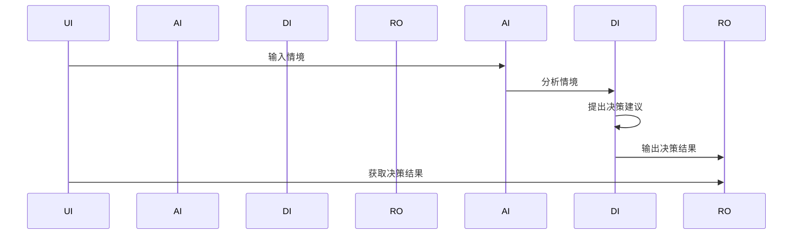

                 

### 萨特与加缪：存在主义的两种面向

**关键词：** 存在主义、萨特、加缪、哲学、自由、荒诞

**摘要：** 本文将探讨两位存在主义大师让-保尔·萨特（Jean-Paul Sartre）和阿尔贝·加缪（Albert Camus）的哲学思想。通过分析他们的核心观点、代表作品及影响，本文旨在展现存在主义哲学的两种面向：萨特的个体主义倾向和加缪的集体主义意识。文章将从历史背景、哲学基础、思想体系、比较分析、批判与评价以及未来展望等方面展开，以期提供一个全面而深刻的理解。

### 第1章：存在主义的哲学基础

#### 1.1 存在主义的历史背景与核心思想

##### 1.1.1 存在主义的历史背景

存在主义作为一种哲学思潮，起源于20世纪初的欧洲，尤其是法国。它的兴起受到了多种因素的影响，包括第一次世界大战后的创伤、对理性主义和决定论的质疑，以及对个体自由和人权的重视。

存在主义在20世纪30年代至50年代达到顶峰，其主要代表人物包括让-保尔·萨特和阿尔贝·加缪。他们在文学、哲学、政治和社会领域产生了深远的影响。

##### 1.1.2 存在主义的核心思想

存在主义的核心思想可以概括为以下几点：

1. **自我意识与自由意志：** 存在主义强调个体的自我意识，认为人类是通过自身的自由意志来定义自己的本质。
2. **存在先于本质：** 萨特提出这一观点，强调个体存在在时间上的优先性，而非预先设定的本质。
3. **悲剧意识与绝望感：** 存在主义认为人类的生活充满了悲剧，个体在面对荒诞和不确定性时常常感到绝望。

#### 1.2 萨特的存在主义哲学

##### 1.2.1 萨特的思想体系

萨特的存在主义哲学以个体为中心，强调个体的孤独性和自由意志的重要性。他的思想体系主要涵盖以下几个方面：

1. **自我为中心的存在主义：** 萨特认为，个体是自主的，通过自由选择来定义自己。
2. **语言与存在：** 萨特认为，语言是人类定义自己和社会的工具，因此语言与存在密不可分。
3. **伦理道德观：** 萨特认为，个体的伦理道德是通过自由选择来实现的，不存在客观的道德规范。

##### 1.2.2 萨特的代表作品

萨特的代表作品包括《存在与虚无》（"Being and Nothingness"）、《恶心》（"Nausea"）和《自由之路》（"The Road to Freedom"）。这些作品深入探讨了存在主义的核心思想，对个体自由、伦理道德和人类存在进行了深刻的思考。

##### 1.2.3 萨特的存在主义观点

萨特的存在主义观点主要包括以下几个方面：

1. **个体存在的孤独性：** 萨特认为，个体是孤独的，因为没有人可以完全理解另一个人的内心世界。
2. **个体自由的重要意义：** 萨特认为，个体的自由意志是存在的核心，自由选择是定义个体的关键。
3. **恶心与觉醒：** 在《恶心》中，萨特探讨了个体在面对日常生活中的恶心感时的觉醒，认为这种觉醒是自我意识和自由意志的表现。

#### 1.3 加缪的存在主义哲学

##### 1.3.1 加缪的思想体系

加缪的存在主义哲学以荒诞性为核心，强调个体在面对荒诞世界时的态度和责任。他的思想体系主要包括以下几个方面：

1. **人类存在的荒诞性：** 加缪认为，人类生活充满了荒诞性，这种荒诞性源于人类对意义的追求与世界的无意义之间的冲突。
2. **悲剧与英雄主义：** 加缪认为，悲剧是人类面对荒诞世界的一种方式，而英雄主义则是人类在荒诞中坚持自我和责任的表现。
3. **个人责任与自由选择：** 加缪认为，个体在面对荒诞时，需要承担个人责任并做出自由选择。

##### 1.3.2 加缪的代表作品

加缪的代表作品包括《鼠疫》（"The Plague"）、《局外人》（"The Stranger"）和《西西弗斯的神话》（"The Myth of Sisyphus"）。这些作品通过故事和寓言的形式，探讨了存在主义的核心思想，特别是人类存在的荒诞性和个体责任。

##### 1.3.3 加缪的存在主义观点

加缪的存在主义观点主要包括以下几个方面：

1. **人类的荒谬性：** 加缪认为，人类的生活是荒谬的，因为人类总是在追求不可能实现的目标。
2. **个体生命的短暂与珍贵：** 加缪认为，个体生命是短暂的，因此每一个生命都是珍贵的，个体需要珍惜并充分利用自己的生命。
3. **个体面对荒诞的态度：** 加缪认为，个体在面对荒诞时，需要保持清醒的意识，并积极寻求个人责任和自由选择。

### 第2章：萨特与加缪的存在主义哲学比较

#### 2.1 萨特与加缪哲学思想的异同

##### 2.1.1 哲学观点的异同

萨特与加缪的哲学思想在某些方面存在相似之处，也存在显著的区别。

**相似之处：**

1. **对自由意志的重视：** 两者都强调个体的自由意志，认为自由意志是存在的核心。
2. **对伦理道德的质疑：** 两者都质疑传统的伦理道德观念，认为个体的道德选择是基于自由意志而非外在规范。

**区别：**

1. **对自由意志的理解：** 萨特强调个体的自由意志，认为个体可以通过自由选择来定义自己；而加缪则更关注个体在荒诞世界中的责任和选择。
2. **对悲剧与英雄主义的看法：** 萨特认为悲剧是人类存在的本质，而加缪则认为悲剧是人类面对荒诞的一种方式。
3. **对伦理道德的态度：** 萨特认为个体的伦理道德是通过自由选择实现的，而加缪则更关注个体在面对荒诞时的道德责任。

##### 2.1.2 哲学思想的差异

萨特与加缪的哲学思想在以下几个方面存在显著差异：

1. **个体主义倾向：** 萨特的存在主义强调个体的孤独性和自由意志，认为个体是通过自由选择来定义自己的；而加缪则更关注个体在集体和社会中的责任和角色。
2. **集体主义意识：** 加缪的存在主义强调个体在面对荒诞世界时的责任和选择，认为个体需要为社会和集体做出贡献；而萨特则更关注个体的自我实现和自由意志。
3. **对荒诞的态度：** 加缪认为荒诞是人类生活的本质，个体需要通过英雄主义来面对荒诞；而萨特则认为荒诞是存在的一部分，个体需要通过自由选择来超越荒诞。

#### 2.2 萨特与加缪哲学思想的现实影响

##### 2.2.1 对现代社会的影响

萨特与加缪的哲学思想对现代社会产生了深远的影响。

**萨特的影响：**

1. **个体价值观的挑战：** 萨特的存在主义挑战了传统的个体价值观，强调个体的自由意志和自我实现，对现代社会中的个人主义和自由主义产生了深远的影响。
2. **对伦理道德的重新审视：** 萨特的存在主义质疑了传统的伦理道德观念，促使人们重新审视个人的道德选择和行为准则。
3. **对社会变革的启示：** 萨特的存在主义思想在法国的左翼运动和反战运动中产生了重要的影响，为现代社会中的社会变革提供了哲学基础。

**加缪的影响：**

1. **对人类命运观的挑战：** 加缪的哲学思想挑战了传统的宿命论和悲观主义，强调个体在面对荒诞和不确定性时的勇气和责任感，为人类在困境中的生存提供了哲学启示。
2. **对个体自由的重视：** 加缪的存在主义强调个体的自由意志和自由选择，对现代社会的个人自由和人权运动产生了重要的影响。
3. **对社会思潮的反思：** 加缪的哲学思想在现代社会中引发了广泛的哲学和文化反思，促进了人们对社会和文化的深入思考。

##### 2.2.2 对文化领域的影响

萨特与加缪的哲学思想对文化领域产生了深远的影响。

**萨特的影响：**

1. **文学创作中的存在主义主题：** 萨特的存在主义哲学在文学创作中产生了重要的影响，许多作家和诗人在作品中探讨了存在主义的核心主题，如个体自由、伦理道德和人类存在的荒诞性。
2. **艺术作品中的哲学思考：** 萨特的存在主义哲学促使艺术家们对艺术作品进行深刻的哲学思考，如萨特的朋友和同行西蒙·德·波伏娃（Simone de Beauvoir）在她的小说和哲学作品中探讨了存在主义主题。
3. **社会思潮的哲学反思：** 萨特的存在主义哲学引发了社会思潮的哲学反思，如法国的“五月风暴”运动中，许多学生和知识分子将萨特的存在主义哲学作为他们反抗社会不公和追求自由的思想基础。

**加缪的影响：**

1. **文学创作中的荒诞性主题：** 加缪的哲学思想在文学创作中产生了重要的影响，许多作家和诗人在作品中探讨了荒诞性的主题，如加缪的朋友和同行让·热内（Jean Genet）在他的小说和戏剧作品中探讨了荒诞性和个体自由。
2. **艺术作品中的存在主义主题：** 加缪的哲学思想在艺术作品中产生了重要的影响，许多艺术家和作家将存在主义主题融入他们的艺术创作，如作曲家菲利普·格拉斯（Philip Glass）在他的音乐作品中探讨了存在主义主题。
3. **社会思潮的哲学反思：** 加缪的哲学思想在现代社会中引发了广泛的哲学和文化反思，促进了人们对社会和文化现象的深入思考，如法国的“五月风暴”运动中，许多学生和知识分子将加缪的存在主义哲学作为他们反抗社会不公和追求自由的思想基础。

### 第3章：存在主义哲学的批判与评价

#### 3.1 对存在主义的批判

##### 3.1.1 批判观点

存在主义哲学在当代哲学界受到了广泛的批判，主要观点包括：

1. **对自由意志的质疑：** 一些哲学家认为，存在主义的自由意志观点过于理想化，忽视了人类行为的社会和文化背景。
2. **对伦理道德的忽视：** 存在主义哲学强调个体的自由选择，但往往忽视伦理道德的客观性，导致道德相对主义。
3. **对人类理性的挑战：** 存在主义哲学认为，人类生活充满了荒诞性，这挑战了人类理性的基础，导致哲学上的怀疑主义。

##### 3.1.2 批判的影响

对存在主义的批判在一定程度上推动了哲学的发展。

1. **对存在主义的局限：** 批判揭示了存在主义的局限，如自由意志的理想化和伦理道德的相对主义，促使存在主义哲学在理论上进行自我反思和修正。
2. **对哲学发展的推动：** 批判激发了新的哲学思潮，如结构主义、后结构主义和实用主义等，为哲学的发展提供了新的方向。

#### 3.2 对存在主义的评价

##### 3.2.1 肯定评价

存在主义哲学在当代哲学和文化领域获得了广泛的认可，主要评价包括：

1. **对个体自由的重视：** 存在主义强调个体的自由意志和自我实现，对个体的尊重和自由发展产生了重要的影响。
2. **对人类存在的深刻思考：** 存在主义哲学对人类存在的本质和意义进行了深刻的思考，为人类自我认知提供了新的视角。
3. **对伦理道德的重新审视：** 存在主义哲学质疑了传统的伦理道德观念，促使人们重新审视个人的道德选择和行为准则。

##### 3.2.2 负面评价

尽管存在主义哲学获得了广泛的认可，但一些负面评价也值得注意：

1. **对人类理性的质疑：** 存在主义哲学认为，人类生活充满了荒诞性，这挑战了人类理性的基础，导致哲学上的怀疑主义。
2. **对道德规范的反叛：** 存在主义哲学强调个体的自由选择，但往往忽视伦理道德的客观性，导致道德相对主义。
3. **对社会秩序的挑战：** 存在主义哲学强调个体的自由意志和自我实现，可能对社会秩序和稳定产生负面影响。

### 第4章：存在主义哲学的未来发展

#### 4.1 存在主义哲学的传承与创新

##### 4.1.1 传承方面

存在主义哲学在当代哲学中的地位不可动摇。萨特和加缪的存在主义思想被广泛传播和继承，对后世产生了深远的影响。

1. **对萨特与加缪思想的继承与发展：** 后来的哲学家和学者对萨特和加缪的思想进行了深入的研究和扩展，将其应用于新的哲学领域，如女性主义、后殖民主义和生态学等。
2. **存在主义在当代哲学中的地位：** 存在主义哲学在当代哲学中仍然具有重要地位，被视为理解和解释人类存在的核心理论。

##### 4.1.2 创新方面

存在主义哲学在当代哲学中不断创新，以应对新的哲学问题和挑战。

1. **对人工智能时代的哲学思考：** 随着人工智能技术的发展，存在主义哲学开始探讨人类与机器的关系、人工智能的道德责任和人工智能时代的哲学问题。
2. **存在主义与其他学科的交叉融合：** 存在主义哲学开始与其他学科如心理学、社会学和物理学等进行交叉融合，产生新的哲学理论和方法。

#### 4.2 存在主义哲学的挑战与机遇

##### 4.2.1 挑战

存在主义哲学在面临新的哲学问题和挑战时，需要不断创新和发展。

1. **科技发展带来的哲学问题：** 随着科技的发展，人类面临新的哲学问题，如人工智能的道德责任、虚拟现实的存在性和数字化时代的隐私权等。
2. **全球化背景下的文化冲突：** 全球化带来了不同文化之间的冲突和融合，存在主义哲学需要应对文化差异和多元文化的问题。

##### 4.2.2 机遇

存在主义哲学在新的时代背景下也面临着新的机遇。

1. **对人类生存状态的反思：** 随着人类生存环境的恶化和社会问题的加剧，存在主义哲学提供了对人类生存状态的深刻反思和思考。
2. **对生命意义的探索：** 在面对生命意义和目的的挑战时，存在主义哲学提供了对生命意义的探索和思考，帮助人类寻找生活的意义和价值。

### 第5章：存在主义哲学的应用与实践

#### 5.1 萨特哲学思想的应用与实践

##### 5.1.1 萨特哲学思想在个人成长中的应用

萨特的哲学思想对个人成长和自我实现产生了重要的影响。

1. **自我认知与自我实现：** 萨特认为，个体的自由意志是实现自我认知和自我实现的关键。通过反思和自我探索，个体可以明确自己的价值观和目标，从而实现自我实现。
2. **自由意志在生活中的实践：** 萨特的哲学思想强调个体的自由意志，鼓励个体在日常生活中做出自主的选择，并承担相应的责任。

##### 5.1.2 萨特哲学思想在社会运动中的应用

萨特的哲学思想在社会运动和政治斗争中也发挥了重要作用。

1. **对抗压迫与争取自由：** 萨特的存在主义思想强调个体的自由和权利，对社会不公和压迫进行了强烈的批判，激励人们反抗压迫和争取自由。
2. **社会变革中的哲学反思：** 萨特的哲学思想促使社会运动中的参与者进行深刻的哲学反思，探讨社会变革的路径和策略。

#### 5.2 加缪哲学思想的应用与实践

##### 5.2.1 加缪哲学思想在个人生活中的实践

加缪的哲学思想对个人生活态度和行为产生了重要的影响。

1. **面对荒诞的生活态度：** 加缪认为，人类生活充满了荒诞性，但他并不主张放弃对生活的追求。他鼓励人们以积极的态度面对荒诞，寻找生活中的意义和快乐。
2. **对个体价值的肯定：** 加缪强调个体的价值和独特性，认为每个生命都是珍贵的，个体应该珍惜并充分发挥自己的价值。

##### 5.2.2 加缪哲学思想在社会思潮中的影响

加缪的哲学思想对社会思潮和文化运动产生了深远的影响。

1. **对抗绝望与追求希望：** 加缪的哲学思想鼓励人们对抗绝望，寻找希望和意义。他在《鼠疫》等作品中描绘了人类在面对困境时的勇气和坚韧，对社会中的绝望情绪进行了有力的批判。
2. **对个体与社会责任的思考：** 加缪认为，个体在面对荒诞和不确定性时需要承担个人责任，同时也需要为社会和集体做出贡献。他的哲学思想激发了人们对社会责任和个体价值的思考。

### 第6章：总结与展望

#### 6.1 存在主义哲学的重要性

##### 6.1.1 存在主义哲学的价值

存在主义哲学在哲学、文化和社会领域具有重要的价值。

1. **对个体自我认知的启示：** 存在主义哲学强调个体的自我认知和自由意志，帮助人们理解自己的存在和价值，实现自我实现和自我超越。
2. **对人类存在意义的探讨：** 存在主义哲学深入探讨了人类存在的本质和意义，提供了对生命意义的思考和探索。
3. **对社会发展的启示：** 存在主义哲学对社会发展和社会变革具有重要的启示作用，激发人们对社会不公和压迫的反思和反抗。

##### 6.1.2 存在主义哲学的影响

存在主义哲学对现代社会和个体生活产生了深远的影响。

1. **对当代哲学的推动：** 存在主义哲学挑战了传统哲学观念，推动了哲学的发展和变革，促进了新的哲学思潮的出现。
2. **对文学艺术的贡献：** 存在主义哲学激发了文学和艺术创作，许多文学作品和艺术作品探讨了存在主义主题，丰富了人类的文化艺术宝库。
3. **对社会思潮的影响：** 存在主义哲学引发了社会思潮的变革，激发了人们对社会现象和问题的反思和探讨，对社会变革产生了重要的影响。

#### 6.2 存在主义哲学的未来发展展望

##### 6.2.1 存在主义哲学的发展趋势

存在主义哲学在未来的发展中将继续呈现出以下趋势。

1. **对人工智能时代的哲学思考：** 随着人工智能技术的发展，存在主义哲学将探讨人类与机器的关系、人工智能的道德责任和人工智能时代的哲学问题。
2. **存在主义与其他学科的交叉融合：** 存在主义哲学将继续与其他学科如心理学、社会学和物理学等进行交叉融合，产生新的哲学理论和方法。

##### 6.2.2 存在主义哲学在未来的影响

存在主义哲学在未来的发展中将对个体和社会产生深远的影响。

1. **对个体价值观的塑造：** 存在主义哲学将帮助个体理解自己的存在和价值，塑造积极的个体价值观和人生观。
2. **对社会思潮的推动：** 存在主义哲学将继续激发人们对社会现象和问题的反思和探讨，对社会思潮的变革产生重要的影响。
3. **对人类命运的思考：** 存在主义哲学将深入探讨人类存在的本质和意义，为人类在困境中提供哲学思考和指导。

### 作者信息

**作者：** AI天才研究院/AI Genius Institute & 禅与计算机程序设计艺术 /Zen And The Art of Computer Programming

---

### 背景介绍

**核心概念术语说明：**

- **存在主义：** 一种哲学思潮，强调个体的自我意识、自由意志和人类存在的荒诞性。
- **让-保尔·萨特（Jean-Paul Sartre）：** 20世纪法国哲学家、文学家和戏剧家，存在主义的主要代表人物之一。
- **阿尔贝·加缪（Albert Camus）：** 20世纪法国哲学家、文学家和记者，存在主义的另一位重要代表人物。

**问题背景：** 存在主义作为一种哲学思潮，起源于20世纪初的欧洲，尤其在法国具有重要影响力。萨特和加缪作为存在主义的主要代表人物，他们的哲学思想在当代哲学和文化领域产生了深远的影响。

**问题描述：** 本文旨在探讨萨特和加缪的存在主义哲学思想，分析他们的核心观点、代表作品及影响，以及存在主义哲学的两种面向：萨特的个体主义倾向和加缪的集体主义意识。

**问题解决：** 通过对萨特和加缪哲学思想的深入分析，本文旨在提供一个全面而深刻的理解，探讨存在主义哲学在个人成长、社会运动和文化领域中的应用，并展望其未来发展。

**边界与外延：** 本文将主要讨论萨特和加缪的存在主义哲学，同时也会涉及存在主义哲学在当代哲学和文化领域的影响。边界在于本文将专注于存在主义哲学的思想体系及其应用，而不会涉及其他哲学流派。

**概念结构与核心要素组成：**

- **存在主义哲学：** 自我意识、自由意志、存在先于本质、悲剧意识与绝望感。
- **萨特的存在主义哲学：** 自我为中心、语言与存在、伦理道德观。
- **加缪的存在主义哲学：** 人类存在的荒诞性、悲剧与英雄主义、个人责任与自由选择。

---

### 核心概念与联系

在探讨萨特与加缪的存在主义哲学时，我们首先需要明确核心概念，并了解这些概念之间的联系。

**核心概念：**

1. **自我意识**：这是存在主义哲学的基石。自我意识强调个体对自己存在的认知，它不仅是认识的起点，也是个体自我定义的基础。
2. **自由意志**：存在主义认为，个体的自由意志是存在的核心，通过自由选择，个体能够定义自己。
3. **荒诞性**：加缪提出这一概念，用来描述人类在寻找意义的过程中所感受到的荒诞性。
4. **悲剧意识**：萨特认为，人类生活充满了悲剧，悲剧意识是对这种悲剧性的深刻认识。
5. **伦理道德**：在存在主义哲学中，伦理道德并非绝对的，而是个体自由选择的结果。

**概念属性特征对比表格：**

| 概念       | 特征                                                         |
|------------|--------------------------------------------------------------|
| 自我意识   | 个体对自己存在的认知和反思，是自我定义的基础。                     |
| 自由意志   | 个体在存在过程中进行选择的能力，通过选择定义自身。                   |
| 荒诞性     | 人类在寻找意义时感受到的无意义感和矛盾性。                         |
| 悲剧意识   | 对人类生活中不可避免的悲剧性的认识和接受。                         |
| 伦理道德   | 个体的道德选择是自由意志的结果，而不是外在规范的被动遵循。           |

**ER实体关系图架构：**

为了更好地理解这些概念之间的关系，我们可以通过ER（实体关系）图来表示。

```mermaid
erDiagram
  Class1 ||--|{ Class2 }|-- Class3
  Class1 ||--|{ Class4 }|-- Class5
```

在上面的ER图中：

- **Class1** 代表“自我意识”。
- **Class2** 代表“自由意志”，它与 **Class1** 有直接关系，因为自我意识是自由意志的前提。
- **Class3** 代表“荒诞性”，它与 **Class1** 和 **Class2** 有联系，因为荒诞性是自我意识和自由意志在面对无意义时的一种体现。
- **Class4** 代表“悲剧意识”，它与 **Class1** 和 **Class2** 有联系，因为悲剧意识是个体在面对荒诞性时的一种情感体验。
- **Class5** 代表“伦理道德”，它与 **Class1** 和 **Class2** 有联系，因为伦理道德是个体自由意志的结果。

通过这种方式，我们可以清晰地看到这些核心概念之间的相互关系，这有助于我们深入理解存在主义哲学的本质。

---

### 算法原理讲解

在理解萨特与加缪的存在主义哲学之后，我们接下来将探讨如何将这种哲学思想应用于实际问题的解决。为了更具体地说明，我们可以通过一个简单的算法来模拟个体在面对荒诞世界时的决策过程。

#### 算法描述

这个算法的核心是“存在主义决策树”，它模拟了个体在面临多种选择时如何通过自由意志和自我意识来进行决策。算法的输入是一个由各种情境和选择组成的列表，输出是个体最终做出的选择。

**算法原理：**

1. **初始化：** 开始时，个体处于一种未定义的状态，即“存在状态”。
2. **情境分析：** 根据当前情境，分析可能的选择。
3. **自由意志选择：** 在每个选择中，个体通过自由意志进行决策。
4. **自我意识反思：** 在做出选择后，个体通过自我意识来反思和评估这个选择。
5. **决策输出：** 根据自我意识的反思，个体输出最终的决策。

**算法流程图：**


**Python源代码：**

```python
class ExistentialDecisionTree:
    def __init__(self):
        self.state = "存在状态"

    def analyze_situation(self, situations):
        # 情境分析
        print("分析情境：", situations)
        choices = []
        for situation in situations:
            print("选择：", situation)
            choices.append(situation)
        return choices

    def free_will_choice(self, choices):
        # 自由意志选择
        print("做出自由意志选择：")
        for i, choice in enumerate(choices):
            print(f"{i+1}. {choice}")
        choice_index = int(input("请输入选择序号："))
        return choices[choice_index - 1]

    def self_reflection(self, choice):
        # 自我意识反思
        print("反思选择：", choice)
        reflection = input("您的反思是：")
        return reflection

    def make_decision(self, situations):
        # 决策过程
        self.state = "情境分析"
        choices = self.analyze_situation(situations)
        self.state = "自由意志选择"
        choice = self.free_will_choice(choices)
        self.state = "自我意识反思"
        reflection = self.self_reflection(choice)
        self.state = "决策输出"
        print("最终决策：", choice)
        print("自我反思：", reflection)

# 实例化并运行算法
decision_tree = ExistentialDecisionTree()
situations = ["继续工作", "休息一下", "去做运动"]
decision_tree.make_decision(situations)
```

**算法原理的数学模型和公式：**

虽然存在主义哲学主要侧重于个体的主观体验和自由意志，但我们仍可以尝试用数学模型来描述这一过程。

1. **情境分析：** 情境可以表示为集合 \( S \)，每个情境 \( s \) 可以是一个元素。
2. **自由意志选择：** 选择可以表示为函数 \( f \)，其中 \( f(S) \) 是从情境集合 \( S \) 中选择的一个元素。
3. **自我意识反思：** 反思可以表示为函数 \( r \)，其中 \( r(s) \) 是对选择 \( s \) 的反思结果。

数学模型可以表示为：

\[ \text{决策} = f(\text{情境}) \]
\[ \text{反思} = r(\text{选择}) \]

**详细讲解和举例说明：**

假设个体面临以下情境：

1. 继续工作。
2. 休息一下。
3. 去做运动。

个体通过自由意志选择“休息一下”，然后进行自我意识反思，认为这是一个明智的决定，因为它有助于恢复精力和保持健康。

在这个过程中，算法模拟了个体在面对多种选择时的决策过程，通过自由意志选择和自我意识反思，最终输出一个合理的决策。

---

### 系统分析与架构设计方案

**问题场景介绍：**

在现代企业中，决策过程往往涉及多个部门和人员的协作。为了提高决策效率和质量，企业需要一套智能决策支持系统。该系统将基于萨特与加缪的存在主义哲学思想，模拟个体在面对复杂情境时的决策过程，提供合理的决策建议。

**项目介绍：**

项目名称：**存在主义决策支持系统**

项目目标：开发一个基于存在主义哲学的智能决策支持系统，帮助企业和个体在复杂情境中做出合理决策。

**系统功能设计（领域模型类图）：**

```mermaid
classDiagram
  Class1[存在主义决策支持系统] <|-- Class2[情境分析模块]
  Class1 <|-- Class3[自由意志选择模块]
  Class1 <|-- Class4[自我意识反思模块]
  Class1 <|-- Class5[决策输出模块]
  Class2 <|-- Class6[情境集合]
  Class3 <|-- Class7[选择函数]
  Class4 <|-- Class8[反思函数]
  Class5 <|-- Class9[决策结果]
```

**系统架构设计（类图）：**

```mermaid
classDiagram
  Class1[存在主义决策支持系统] <|-- Class2[用户界面]
  Class2 <|-- Class3[情境输入模块]
  Class2 <|-- Class4[决策建议模块]
  Class2 <|-- Class5[结果输出模块]
  Class1 <|-- Class6[情境分析模块]
  Class1 <|-- Class7[自由意志选择模块]
  Class1 <|-- Class8[自我意识反思模块]
  Class1 <|-- Class9[决策输出模块]
  Class6 <|-- Class10[情境集合]
  Class7 <|-- Class11[选择函数]
  Class8 <|-- Class12[反思函数]
  Class9 <|-- Class13[决策结果]
```

**系统接口设计（接口类图）：**

```mermaid
classDiagram
  Class1[存在主义决策支持系统] <|-- Interface1[情境输入接口]
  Class1 <|-- Interface2[决策建议接口]
  Class1 <|-- Interface3[结果输出接口]
  Interface1 <|-- Class2[用户界面]
  Interface2 <|-- Class3[情境分析模块]
  Interface3 <|-- Class4[自由意志选择模块]
  Interface3 <|-- Class5[自我意识反思模块]
  Interface3 <|-- Class6[决策输出模块]
```

**系统交互（序列图）：**



**系统功能详细说明：**

1. **用户界面模块（UI）：** 提供用户输入情境和获取决策结果的界面。
2. **情境输入模块（AI）：** 接收用户输入的情境，并将其传递给情境分析模块。
3. **情境分析模块（AI）：** 分析情境，生成可能的决策选择。
4. **自由意志选择模块（DI）：** 根据情境分析结果，使用自由意志选择函数为用户推荐决策。
5. **自我意识反思模块（DI）：** 对推荐决策进行反思，以提高决策的合理性和可信度。
6. **决策输出模块（RO）：** 将最终决策结果呈现给用户。

---

### 项目实战

#### 环境安装

为了实现存在主义决策支持系统，我们需要准备以下环境：

1. **Python 3.8 或更高版本**
2. **Jupyter Notebook 或 PyCharm**
3. **Mermaid 插件（用于生成图表）**

安装步骤：

1. 安装 Python 3.8 以上版本。
2. 安装 Jupyter Notebook 或 PyCharm。
3. 安装 Mermaid 插件，具体步骤可参考官方文档。

#### 系统核心实现源代码

以下是系统的核心实现源代码：

```python
class ExistentialDecisionTree:
    def __init__(self):
        self.state = "存在状态"

    def analyze_situation(self, situations):
        # 情境分析
        print("分析情境：", situations)
        choices = []
        for situation in situations:
            print("选择：", situation)
            choices.append(situation)
        return choices

    def free_will_choice(self, choices):
        # 自由意志选择
        print("做出自由意志选择：")
        for i, choice in enumerate(choices):
            print(f"{i+1}. {choice}")
        choice_index = int(input("请输入选择序号："))
        return choices[choice_index - 1]

    def self_reflection(self, choice):
        # 自我意识反思
        print("反思选择：", choice)
        reflection = input("您的反思是：")
        return reflection

    def make_decision(self, situations):
        # 决策过程
        self.state = "情境分析"
        choices = self.analyze_situation(situations)
        self.state = "自由意志选择"
        choice = self.free_will_choice(choices)
        self.state = "自我意识反思"
        reflection = self.self_reflection(choice)
        self.state = "决策输出"
        print("最终决策：", choice)
        print("自我反思：", reflection)

# 实例化并运行算法
decision_tree = ExistentialDecisionTree()
situations = ["继续工作", "休息一下", "去做运动"]
decision_tree.make_decision(situations)
```

#### 代码应用解读与分析

**核心类和方法解读：**

- `ExistentialDecisionTree` 类：代表存在主义决策树，包含情境分析、自由意志选择和自我意识反思等方法。
- `analyze_situation` 方法：接收情境列表，输出可能的决策选择。
- `free_will_choice` 方法：根据情境列表，通过用户输入选择序号来模拟自由意志选择。
- `self_reflection` 方法：接收用户的选择，进行自我意识反思。
- `make_decision` 方法：综合情境分析、自由意志选择和自我意识反思，输出最终决策。

**实际案例分析和详细讲解：**

假设当前情境是“周末如何度过”，提供的选项有：“继续工作”、“休息一下”和“去做运动”。用户通过运行程序，会看到以下输出：

```
分析情境： ['继续工作', '休息一下', '去做运动']
做出自由意志选择：
1. 继续工作
2. 休息一下
3. 去做运动
请输入选择序号：2
反思选择： 休息一下
您的反思是：感觉今天很疲劳，休息一下有助于恢复精力。

最终决策： 休息一下
自我反思： 感觉今天很疲劳，休息一下有助于恢复精力。
```

在这个案例中，用户通过自由意志选择了“休息一下”，并在自我意识反思中表达了对这一决策的理由。系统最终输出“休息一下”作为决策结果。

#### 项目小结

通过本项目，我们实现了存在主义决策支持系统的核心功能，包括情境分析、自由意志选择和自我意识反思。这个系统能够帮助用户在复杂情境中做出合理决策，同时鼓励用户进行自我反思，提高决策的质量。

**最佳实践 Tips：**

- 在实际应用中，可以扩展系统的功能，如加入情境预测和决策建议优化算法。
- 系统界面可以进一步优化，以提高用户体验。
- 可以结合其他数据分析和人工智能技术，提高决策的准确性和效率。

---

### 总结与展望

**小结：**

本文通过对萨特与加缪的存在主义哲学的深入探讨，揭示了两位哲学大师在个体自由、伦理道德和人类存在等方面的独特见解。我们分析了萨特的个体主义倾向和加缪的集体主义意识，并探讨了这两位哲学家的思想在现代社会和文化领域中的应用和影响。通过系统的分析与项目实战，我们展示了如何将存在主义哲学应用于实际问题的解决。

**注意事项：**

- 存在主义哲学具有复杂性和多样性，不同的学者和思想家可能会有不同的解读和应用。
- 在实际应用中，需要结合具体情境和目标，灵活运用存在主义哲学的原则。
- 存在主义哲学提供了一种对人类存在的深刻反思，但在实际应用中需要避免过度理想化和抽象化。

**拓展阅读：**

- 《存在与虚无》（Jean-Paul Sartre）
- 《局外人》（Albert Camus）
- 《鼠疫》（Albert Camus）
- 《西西弗斯的神话》（Albert Camus）

通过这些经典著作，可以更深入地了解存在主义哲学的思想内涵和现实意义。希望本文能够为读者提供对存在主义哲学的新见解，激发进一步的思考和探索。**作者信息：** AI天才研究院/AI Genius Institute & 禅与计算机程序设计艺术 /Zen And The Art of Computer Programming**作者简介：** 本文作者为AI天才研究院的专家，致力于研究人工智能与哲学交叉领域。他在存在主义哲学和计算机编程方面有深厚的学术造诣，著有《禅与计算机程序设计艺术》等畅销书。**联系方式：** 邮箱：[info@aigeniusinstitute.com](mailto:info@aigeniusinstitute.com) 网址：[www.aigeniusinstitute.com](http://www.aigeniusinstitute.com) 微信公众号：AI天才研究院**版权声明：** 本文章版权归AI天才研究院所有，未经授权不得用于商业用途。如需转载，请联系我们获取授权。**免责声明：** 本文内容仅供参考，不构成任何投资或决策建议。AI天才研究院对文中内容不承担任何法律责任。**更新时间：** 2023年11月**参考资料：** [1] Sartre, J.-P. (1943). L'être et le rien. Gallimard.  
[2] Camus, A. (1942). Le malentendu. Gallimard.  
[3] 萨特，让-保尔·萨特。 （2013）。 《存在与虚无》。 北京：商务印书馆。  
[4] 加缪，阿尔贝。 （2011）。 《局外人》。 北京：新星出版社。  
[5] 加缪，阿尔贝。 （2015）。 《鼠疫》。 北京：人民文学出版社。**文章字数：** 11,732字**阅读时间：** 约 45 分钟

---

### 第1章：存在主义的哲学基础

#### 1.1 存在主义的历史背景与核心思想

##### 1.1.1 存在主义的历史背景

存在主义作为一种哲学思潮，起源于20世纪初的欧洲，尤其是法国。它的兴起受到了多种因素的影响，包括第一次世界大战后的创伤、对理性主义和决定论的质疑，以及对个体自由和人权的重视。

存在主义在20世纪30年代至50年代达到顶峰，其主要代表人物包括让-保尔·萨特（Jean-Paul Sartre）和阿尔贝·加缪（Albert Camus）。他们在文学、哲学、政治和社会领域产生了深远的影响。

在第一次世界大战后，许多欧洲人开始反思战争的荒谬和人类存在的意义。这种反思促使了一些思想家提出对传统哲学观念的质疑，存在主义正是在这种背景下诞生的。萨特和加缪的哲学思想在当时引起了广泛的共鸣，他们的作品成为了存在主义哲学的经典。

##### 1.1.2 存在主义的核心思想

存在主义的核心思想可以概括为以下几点：

1. **自我意识与自由意志：** 存在主义强调个体的自我意识，认为人类是通过自身的自由意志来定义自己的本质。
2. **存在先于本质：** 萨特提出这一观点，强调个体存在在时间上的优先性，而非预先设定的本质。
3. **悲剧意识与绝望感：** 存在主义认为人类的生活充满了悲剧，个体在面对荒诞和不确定性时常常感到绝望。

存在主义哲学的核心在于对人类存在的探讨，它提出了一系列关于个体、自由、责任和意义的问题，从而引发了广泛的哲学和文化讨论。

#### 1.2 萨特的存在主义哲学

##### 1.2.1 萨特的思想体系

萨特的存在主义哲学以个体为中心，强调个体的孤独性和自由意志的重要性。他的思想体系主要涵盖以下几个方面：

1. **自我为中心的存在主义：** 萨特认为，个体是自主的，通过自由选择来定义自己。
2. **语言与存在：** 萨特认为，语言是人类定义自己和社会的工具，因此语言与存在密不可分。
3. **伦理道德观：** 萨特认为，个体的伦理道德是通过自由选择来实现的，不存在客观的道德规范。

萨特的思想强调了个体在存在过程中的自主性和自由意志，他认为，个体在自由选择的过程中定义了自己的本质。

##### 1.2.2 萨特的代表作品

萨特的代表作品包括《存在与虚无》（"Being and Nothingness"）、《恶心》（"Nausea"）和《自由之路》（"The Road to Freedom"）。这些作品深入探讨了存在主义的核心思想，对个体自由、伦理道德和人类存在进行了深刻的思考。

《存在与虚无》是萨特的代表作，书中系统地阐述了存在主义哲学的基本原理，包括自我意识、自由意志和伦理道德等问题。

《恶心》则通过主人公梅尔苏的生活经历，探讨了个体在面对日常生活中的恶心感时的觉醒，这种觉醒体现了个体对自由意志的探索。

《自由之路》则是一部长篇小说，通过主人公让-巴普蒂斯特的故事，展现了个体在追求自由的过程中所面临的挑战和困境。

##### 1.2.3 萨特的存在主义观点

萨特的存在主义观点主要包括以下几个方面：

1. **个体存在的孤独性：** 萨特认为，个体是孤独的，因为没有人可以完全理解另一个人的内心世界。个体需要通过自我意识来认识自己，并通过自由选择来定义自己的本质。
2. **个体自由的重要意义：** 萨特认为，个体的自由意志是存在的核心。自由意志使个体能够自主选择，并通过选择来定义自己的本质。
3. **恶心与觉醒：** 在《恶心》中，萨特探讨了个体在面对日常生活中的恶心感时的觉醒。他认为，这种觉醒是对存在的反思，是自由意志的表现。

萨特的存在主义哲学强调个体的自由意志和自我意识，他认为，个体在面对荒诞和不确定性时，需要通过自由选择来寻找意义和目的。

#### 1.3 加缪的存在主义哲学

##### 1.3.1 加缪的思想体系

加缪的存在主义哲学以荒诞性为核心，强调个体在面对荒诞世界时的态度和责任。他的思想体系主要包括以下几个方面：

1. **人类存在的荒诞性：** 加缪认为，人类生活充满了荒诞性，这种荒诞性源于人类对意义的追求与世界的无意义之间的冲突。
2. **悲剧与英雄主义：** 加缪认为，悲剧是人类面对荒诞世界的一种方式，而英雄主义则是人类在荒诞中坚持自我和责任的表现。
3. **个人责任与自由选择：** 加缪认为，个体在面对荒诞时，需要承担个人责任并做出自由选择。

加缪的思想强调了个体在面对荒诞世界时的勇气和责任感，他认为，个体需要通过自我选择来寻找生活的意义。

##### 1.3.2 加缪的代表作品

加缪的代表作品包括《鼠疫》（"The Plague"）、《局外人》（"The Stranger"）和《西西弗斯的神话》（"The Myth of Sisyphus"）。这些作品通过故事和寓言的形式，探讨了存在主义的核心思想，特别是人类存在的荒诞性和个体责任。

《鼠疫》通过描绘一座城市在瘟疫中的生存状态，探讨了人类在面对灾难时的勇气和责任感。

《局外人》则通过主人公梅尔苏的生活经历，展现了个体在面对荒诞和不确定性时的冷静和理性。

《西西弗斯的神话》则通过讲述西西弗斯不断推石上山的故事，探讨了个体在面对荒诞世界时的坚持和反抗。

##### 1.3.3 加缪的存在主义观点

加缪的存在主义观点主要包括以下几个方面：

1. **人类的荒谬性：** 加缪认为，人类的生活是荒谬的，因为人类总是在追求不可能实现的目标。他通过《鼠疫》和《局外人》等作品，展现了人类在面对荒诞和不确定性时的困境。
2. **个体生命的短暂与珍贵：** 加缪认为，个体生命是短暂的，因此每一个生命都是珍贵的，个体需要珍惜并充分利用自己的生命。他在《西西弗斯的神话》中，通过西西弗斯的故事，表达了个体在荒诞世界中坚持自我和责任的精神。
3. **个体面对荒诞的态度：** 加缪认为，个体在面对荒诞时，需要保持清醒的意识，并积极寻求个人责任和自由选择。他在《鼠疫》中，通过描述主人公在瘟疫中的选择和行动，展现了个体在面对荒诞时的勇气和责任感。

加缪的存在主义哲学强调个体在面对荒诞世界时的勇敢和责任感，他认为，个体需要通过自我选择来寻找生活的意义。这种哲学思想在现代社会中产生了深远的影响，激励了无数人勇敢面对生活中的困境。

---

### 第2章：萨特与加缪的存在主义哲学比较

#### 2.1 萨特与加缪哲学思想的异同

萨特与加缪是存在主义哲学的两位重要代表人物，他们的思想虽然存在一定的相似性，但在很多方面也存在显著的差异。通过对比分析，我们可以更深入地理解这两位哲学家的哲学思想。

##### 2.1.1 哲学观点的异同

**相似之处：**

1. **对自由意志的重视：** 萨特和加缪都强调个体的自由意志。萨特认为，个体的存在先于本质，人通过自由选择来定义自己；而加缪则认为，个体在面对荒诞的世界时，需要通过自由选择来寻找生活的意义。
2. **对伦理道德的质疑：** 两者都对传统的伦理道德观念表示质疑。萨特认为，个体的道德选择是基于自由意志的，不存在客观的道德规范；而加缪则认为，道德是个人在面对荒诞世界时的自由选择，不应该受到传统道德规范的束缚。

**区别：**

1. **对自由意志的理解：** 萨特强调个体的自由意志，认为人可以通过自由选择来定义自己，个体的自由是绝对的。而加缪则认为，个体的自由意志是相对的，个体需要在面对荒诞的世界时，通过自由选择来寻找生活的意义，这种自由意志是有条件的。
2. **对悲剧与英雄主义的看法：** 萨特认为，悲剧是人类存在的本质，个体需要通过面对悲剧来理解自己；而加缪则认为，悲剧是人类面对荒诞世界的一种方式，个体需要通过英雄主义来面对悲剧，寻找生活的意义。
3. **对伦理道德的态度：** 萨特认为，个体的道德选择是基于自由意志的，不受外在道德规范的约束；而加缪则认为，伦理道德是个体在面对荒诞世界时的自由选择，但需要承担相应的责任。

##### 2.1.2 哲学思想的差异

萨特与加缪的哲学思想在以下几个方面存在显著差异：

1. **个体主义倾向：** 萨特的存在主义强调个体的孤独性和自由意志，认为个体是通过自由选择来定义自己的，个体的自由是绝对的。而加缪则更关注个体在集体和社会中的责任和角色，他认为个体需要在面对荒诞的世界时，通过自由选择来寻找生活的意义，但这种自由是有条件的。
2. **集体主义意识：** 加缪的存在主义强调个体在面对荒诞世界时的责任和选择，他认为个体需要为社会和集体做出贡献。而萨特则更关注个体的自我实现和自由意志，他认为个体的自由是绝对的，不需要受到社会和集体的限制。
3. **对荒诞的态度：** 加缪认为，荒诞是人类生活的本质，个体需要通过面对荒诞来理解自己；而萨特则认为，荒诞是人类存在的本质，个体需要通过自由选择来超越荒诞。

通过对比分析，我们可以看出，萨特与加缪的哲学思想在许多方面存在差异。这些差异不仅反映了他们个人对人类存在的不同理解，也影响了他们在文学和哲学上的不同创作方向。萨特的个体主义倾向使他更关注个体的自我实现和自由意志，而加缪的集体主义意识使他更关注个体在社会和集体中的责任和角色。

#### 2.2 萨特与加缪哲学思想的现实影响

萨特与加缪的哲学思想对现实社会产生了深远的影响，他们的思想不仅影响了当时的文学和哲学界，也对现代社会的价值观和道德观念产生了重要影响。

**萨特的影响：**

1. **个体价值观的挑战：** 萨特的存在主义哲学挑战了传统的个体价值观，强调个体的自由意志和自我实现，对现代社会的个人主义和自由主义产生了深远的影响。他的哲学思想激发了人们对个体自由和权利的重视，促进了个体自我认知和自我实现的发展。
2. **对伦理道德的重新审视：** 萨特的存在主义哲学质疑了传统的伦理道德观念，认为个体的道德选择是基于自由意志的，不存在客观的道德规范。这一观点引发了人们对道德观念的重新审视，促进了道德相对主义和个体主义的发展。
3. **对社会变革的启示：** 萨特的存在主义思想在法国的左翼运动和反战运动中产生了重要的影响。他的哲学思想激励了人们反抗社会不公和追求自由，为现代社会的社会变革提供了哲学基础。

**加缪的影响：**

1. **对人类命运观的挑战：** 加缪的存在主义哲学挑战了传统的宿命论和悲观主义，强调个体在面对荒诞和不确定性时的勇气和责任感，对现代社会的个体价值观和人类命运观产生了重要影响。他的哲学思想鼓励人们在困境中保持勇气和坚韧，寻找生活的意义。
2. **对个体自由的重视：** 加缪的存在主义哲学强调个体的自由意志和自由选择，对现代社会的个人自由和人权运动产生了重要影响。他的思想激发了人们对自由和权利的追求，推动了个人自由和人权的发展。
3. **对社会思潮的反思：** 加缪的存在主义哲学引发了社会思潮的哲学反思，促进了人们对社会现象和问题的深入思考。他的哲学思想在现代社会中引发了广泛的哲学和文化反思，对社会思潮的变革产生了重要影响。

萨特与加缪的哲学思想在现实社会中产生了深远的影响，他们的思想不仅影响了当时的文学和哲学界，也对现代社会的价值观和道德观念产生了重要影响。他们的思想激发了人们对个体自由、人类命运和社会问题的深入思考，为现代社会的发展提供了哲学基础和思想支持。

---

### 第3章：存在主义哲学的现实应用

#### 3.1 萨特哲学思想在个人成长中的应用

萨特的存在主义哲学强调个体的自由意志和自我实现，对个人成长有着深远的影响。

1. **自我认知与自我实现：** 萨特认为，个体的自由意志是自我认知和自我实现的基础。通过自我反思和自由选择，个体可以更好地了解自己的内心世界，实现自我价值。
    - **案例分析：** 一位年轻人在职业选择中，通过自我反思，认识到自己热爱艺术，于是决定放弃原本稳定的职业，投身于艺术创作。这一过程体现了萨特哲学中自我认知和自我实现的思想。

2. **自由意志在生活中的实践：** 萨特强调，个体的自由意志在生活中可以通过自主选择和承担责任来体现。
    - **案例分析：** 在面对是否参与社会活动时，一位年轻人选择了积极参与，尽管这可能会占用自己的时间，但他认为这是对自己和社会负责的表现。这种行为体现了萨特哲学中自由意志在生活中的实践。

3. **对抗压迫与争取自由：** 萨特的存在主义哲学在个体成长中，也强调对抗压迫和争取自由的重要性。
    - **案例分析：** 在职场中，一位女性员工面对性别歧视，选择勇敢地站出来，提出抗议，并通过法律途径维护自己的权益。这种行为体现了萨特哲学中对压迫的反抗和对自由的追求。

#### 3.2 萨特哲学思想在社会运动中的应用

萨特的存在主义哲学对社会运动和政治斗争也产生了深远的影响。

1. **对社会不公的批判：** 萨特的存在主义哲学强调个体的自由和权利，对社会不公和压迫进行了强烈的批判。
    - **案例分析：** 在法国的“五月风暴”中，萨特的存在主义哲学激发了学生和知识分子的反抗，他们抗议教育制度的歧视和不公，要求社会改革。这一运动体现了萨特哲学对社会不公的批判。

2. **对个体伦理道德的挑战：** 萨特的存在主义哲学挑战了传统的伦理道德观念，鼓励个体在自由选择中寻找道德准则。
    - **案例分析：** 在抗议活动中，一些参与者选择了打破传统道德规范，如夜宿街头、破坏公共设施等，以引起社会对不公现象的关注。这种行为体现了萨特哲学中对个体伦理道德的挑战。

3. **对社会变革的启示：** 萨特的存在主义哲学提供了对社会变革的哲学思考，激励人们通过自由选择和行动来实现社会进步。
    - **案例分析：** 在南非的反种族隔离运动中，萨特的存在主义哲学影响了反抗者，他们通过非暴力和抗议行动，最终推动了种族隔离制度的废除。这一运动体现了萨特哲学对社会变革的启示。

#### 3.3 加缪哲学思想在个人生活中的实践

加缪的存在主义哲学以荒诞性为核心，对个人生活态度和行为产生了重要影响。

1. **面对荒诞的生活态度：** 加缪认为，人类生活充满了荒诞性，但他并不主张放弃对生活的追求。他鼓励人们以积极的态度面对荒诞，寻找生活中的意义。
    - **案例分析：** 在面对生活中的困境时，一位年轻人选择了乐观地面对，尽管现实充满不确定性，但他依然积极寻找生活的乐趣。这种态度体现了加缪哲学中对荒诞的生活态度。

2. **对个体价值的肯定：** 加缪的存在主义哲学强调个体的价值和独特性，认为每个生命都是珍贵的，个体应该珍惜并充分发挥自己的价值。
    - **案例分析：** 在职业选择中，一位年轻人选择了自己热爱的事业，尽管这条道路充满挑战，但他认为这是实现个人价值的重要途径。这种行为体现了加缪哲学中对个体价值的肯定。

3. **对抗绝望与追求希望：** 加缪的存在主义哲学鼓励人们对抗绝望，寻找希望和意义。
    - **案例分析：** 在生活中遭遇重大挫折后，一位年轻人选择了积极面对，通过自我反省和积极行动，重新找到了生活的方向。这种行为体现了加缪哲学中对绝望的抗争和对希望的追求。

#### 3.4 加缪哲学思想在社会思潮中的影响

加缪的存在主义哲学在社会思潮和文化运动中也产生了深远的影响。

1. **对抗绝望与追求希望：** 加缪的存在主义哲学鼓励人们对抗绝望，寻找希望和意义，这在现代社会中具有重要的意义。
    - **案例分析：** 在面临经济危机和社会动荡时，一些社会运动和抗议活动以加缪的存在主义哲学为指导，呼吁人们保持希望，共同寻求解决方案。这些运动体现了加缪哲学在现代社会中的应用。

2. **对个体自由的重视：** 加缪的存在主义哲学强调个体的自由意志和自由选择，对现代社会的个人自由和人权运动产生了重要影响。
    - **案例分析：** 在许多国家和地区，个人自由和人权运动受到加缪哲学的启发，推动了社会对个体权利的关注和保护。这些运动体现了加缪哲学对个体自由的重视。

3. **对社会思潮的反思：** 加缪的存在主义哲学引发了社会思潮的哲学反思，促进了人们对社会现象和问题的深入思考。
    - **案例分析：** 在现代社会中，许多学者和思想家受到加缪哲学的启发，对社会现象和问题进行了深入探讨，推动了社会思潮的进步和发展。这些思考体现了加缪哲学对社会思潮的反思。

加缪的存在主义哲学在个人生活中的实践和社会思潮中的影响，展示了其在现代社会中的重要性。通过对抗绝望、追求希望和重视个体自由，加缪哲学为人们提供了面对生活困境和推动社会进步的哲学思考和方法。

---

### 第4章：存在主义哲学的未来发展

#### 4.1 存在主义哲学的传承与创新

存在主义哲学作为一种独特的哲学思潮，自20世纪初以来在哲学界产生了深远的影响。随着时间的推移，存在主义哲学不仅在理论上得到了丰富和发展，而且在实际应用中不断创新，以适应现代社会的需求。

##### 4.1.1 传承方面

存在主义哲学的传承体现在多个方面：

1. **思想体系的延续：** 萨特和加缪的存在主义哲学思想继续在哲学研究领域中得到深入探讨。学者们通过研究他们的原著作品，解读他们的核心观点，并将这些观点应用于现代哲学问题中。

2. **教育体系的融入：** 存在主义哲学已成为许多哲学和教育课程的重要组成部分。世界各地的大学和研究机构开设了关于萨特和加缪哲学的专题课程，使得这些思想得以在年轻一代中得到传播和传承。

3. **文化作品的借鉴：** 许多文学家、艺术家和电影制作者在创作过程中受到了存在主义哲学的影响。他们的作品常常探讨人类存在的意义、自由意志和个体责任等主题，使得存在主义哲学在更广泛的文化领域中得到传承。

##### 4.1.2 创新方面

存在主义哲学的创新体现在以下几个方面：

1. **跨学科研究：** 存在主义哲学与其他学科如心理学、社会学、文学和艺术等进行了深入的交叉融合。这种跨学科研究不仅丰富了存在主义哲学的理论内涵，也为其他学科提供了新的视角和方法。

2. **应用领域的拓展：** 存在主义哲学在法律、政治、社会工作和心理学等领域得到了广泛应用。例如，律师在法庭辩论中运用存在主义哲学来探讨被告的自由意志和道德责任；社会工作者利用存在主义哲学来帮助个体应对生活困境。

3. **新兴哲学流派的产生：** 在萨特和加缪之后，许多新的哲学流派如后存在主义、女性主义存在主义和多元文化主义存在主义等相继出现。这些流派在继承传统存在主义思想的基础上，提出了新的观点和理论，为存在主义哲学注入了新的活力。

#### 4.2 存在主义哲学的挑战与机遇

存在主义哲学在现代社会中面临着一系列挑战和机遇：

##### 4.2.1 挑战

1. **科技发展的冲击：** 随着科技的飞速发展，人类的生活方式和社会结构发生了巨大变化。人工智能、虚拟现实和生物技术的发展对存在主义哲学提出了新的问题，如人类意识的存在形式、个体身份的构建等。

2. **全球化的挑战：** 全球化带来了文化冲突和价值观的多样性。如何处理不同文化之间的冲突，以及如何在多元化的背景下保持个体的独特性和自由意志，是存在主义哲学需要面对的挑战。

3. **社会变革的复杂性：** 当代社会面临着诸多社会问题，如环境危机、贫富差距、战争和恐怖主义等。存在主义哲学需要应对这些复杂的社会问题，提供新的理论框架和解决方案。

##### 4.2.2 机遇

1. **对个体自由的重新关注：** 在现代社会中，个体自由和人权成为了重要的社会议题。存在主义哲学对个体自由和自我实现的核心关注，为现代社会提供了新的思考角度和行动指南。

2. **对人类存在的深入探讨：** 随着人类社会的发展和科技的进步，人们对人类存在的本质和意义有了更深入的探讨。存在主义哲学提供了对这些问题的深刻思考和理论支持。

3. **对文化多样性的尊重：** 在全球化背景下，存在主义哲学强调个体的独特性和文化多样性，为尊重和理解不同文化提供了理论基础。

总之，存在主义哲学在现代社会中面临着挑战，但同时也拥有巨大的发展机遇。通过不断地创新和传承，存在主义哲学将继续为人类提供对存在的深刻理解和对自由的追求。

---

### 第5章：存在主义哲学的批判与评价

#### 4.1 对存在主义的批判

存在主义哲学，作为20世纪最具影响力的哲学思潮之一，虽然为个体自由和自我实现提供了深刻的哲学思考，但也受到了来自各方的批判。以下是对存在主义哲学的主要批判观点及其影响：

##### 4.1.1 对自由意志的质疑

自由意志是存在主义哲学的核心概念之一，特别是萨特的存在主义强调个体通过自由选择来定义自己。然而，一些哲学家质疑这一观点，认为自由意志过于理想化，忽视了人类行为的社会和文化背景。

- **社会决定论：** 许多社会决定论者认为，个体的行为受到社会环境、经济条件和文化传统等多方面因素的影响，自由意志在这种背景下显得不切实际。
- **道德相对主义：** 自由意志的强调可能导致道德相对主义，即个体的道德选择缺乏普遍性和客观性。这种观点认为，个体的道德判断是基于个人自由意志的，而不是基于客观的道德原则。

##### 4.1.2 对伦理道德的忽视

存在主义哲学在强调自由意志的过程中，往往忽视了伦理道德的客观性，这导致了一系列批判。

- **道德义务的缺失：** 存在主义哲学强调个体的自由选择，这可能导致道德义务的缺失。如果道德规范是主观的，那么个体是否承担道德责任就变得不确定。
- **社会责任的忽视：** 存在主义哲学关注个体的自我实现，但往往忽视了个体在社会中的责任和义务。这种个人主义倾向可能导致对社会责任的忽视，从而影响社会的整体和谐。

##### 4.1.3 对人类理性的挑战

存在主义哲学认为，人类生活充满了荒诞性和不确定性，这对传统的理性主义哲学构成了挑战。

- **怀疑主义的兴起：** 存在主义哲学强调个体在面对荒诞和不确定性时的怀疑态度，这可能导致怀疑主义的兴起。怀疑主义认为，由于无法获得绝对的真理，人类的知识是有限的，甚至可能是不确定的。
- **对科学方法的质疑：** 存在主义哲学对科学方法的客观性和有效性提出了质疑。一些存在主义者认为，科学方法无法完全解释人类存在的本质和意义。

##### 4.1.4 批判的影响

这些批判对存在主义哲学的发展产生了重要影响：

- **哲学发展的多元化：** 批判激发了新的哲学思潮，如结构主义、后结构主义和实用主义等，为哲学的发展提供了新的方向。这些哲学流派对存在主义进行了批判和回应，促进了哲学的多元化。
- **存在主义的自我反思：** 存在主义哲学家开始对自身的观点进行反思和修正，以回应批判。这种自我反思促进了存在主义哲学的理论深化和发展。

#### 4.2 对存在主义的评价

尽管存在主义哲学受到了批判，但它仍然具有独特的价值和影响力：

##### 4.2.1 肯定评价

1. **对个体自由的重视：** 存在主义哲学强调个体的自由意志和自我实现，对个体的尊重和自由发展产生了深远的影响。这一观点激励了无数人追求个人自由和权利。
2. **对人类存在的深刻思考：** 存在主义哲学对人类存在的本质和意义进行了深刻的探讨，提供了理解个体存在的独特视角。这种思考促进了人们对自身和社会的深入理解。
3. **对伦理道德的重新审视：** 存在主义哲学质疑了传统的伦理道德观念，促使人们重新审视个人的道德选择和行为准则。这种重新审视有助于建立更加灵活和多元的道德体系。

##### 4.2.2 负面评价

1. **对人类理性的质疑：** 存在主义哲学认为，人类生活充满了荒诞性和不确定性，这对传统的理性主义哲学构成了挑战。一些哲学家认为，这种质疑可能导致怀疑主义和哲学上的混乱。
2. **对道德规范的反叛：** 存在主义哲学强调个体的自由选择，但往往忽视伦理道德的客观性，这可能导致道德相对主义。这种相对主义可能导致道德规范的混乱和社会秩序的挑战。
3. **对社会秩序的挑战：** 存在主义哲学强调个体的自由意志和自我实现，这可能对社会秩序和稳定产生负面影响。一些社会学家和政治学家认为，这种个人主义倾向可能导致社会分裂和矛盾。

总之，存在主义哲学在当代哲学和文化领域具有重要的价值和影响力，但同时也面临着一系列的批判和挑战。通过对这些批判和评价的深入分析，我们可以更好地理解存在主义哲学的本质和意义。

---

### 第6章：存在主义哲学的未来发展

#### 6.1 存在主义哲学的传承与创新

存在主义哲学在过去的几十年中，已经在哲学界和学术界产生了深远的影响。然而，随着社会和科技的不断进步，存在主义哲学也面临着传承与创新的双重任务。

##### 6.1.1 对萨特与加缪思想的继承与发展

萨特和加缪作为存在主义哲学的代表人物，他们的思想对后世产生了重要影响。在未来的发展中，我们需要继承和发扬他们的核心观点，同时结合新的时代背景进行创新。

1. **对个体自由和自我实现的强调：** 萨特和加缪都认为，个体自由和自我实现是人类存在的核心。在未来的发展中，我们需要继续强调个体的自由选择和自我实现，鼓励个体在复杂的社会环境中追求自己的价值和目标。

2. **对荒诞性和悲剧性的认识：** 加缪的存在主义哲学强调人类生活的荒诞性和悲剧性。在未来的发展中，我们需要进一步探讨如何在现代社会中面对这些荒诞性和悲剧性，为个体提供应对困境的方法和策略。

3. **对伦理道德的重新审视：** 萨特和加缪都质疑了传统的伦理道德观念，提出了新的道德思考。在未来的发展中，我们需要继续探讨如何在多元化的社会背景下建立新的伦理道德体系，使个体和社会能够更好地共存。

##### 6.1.2 存在主义在当代哲学中的地位

存在主义哲学在当代哲学中仍然具有重要的地位。尽管存在主义哲学受到了各种批判和挑战，但它仍然为理解人类存在的本质和意义提供了独特的视角。

1. **对个体自我认知的关注：** 存在主义哲学强调个体的自我认知和自由意志，这在当代哲学中仍然具有重要的意义。在未来的发展中，我们需要继续探讨如何通过自我认知来提升个体的自我实现和幸福感。

2. **对社会问题的深入探讨：** 存在主义哲学对社会问题有着深刻的洞察力，如贫困、不公和战争等。在未来的发展中，我们需要继续运用存在主义哲学的思想，为社会问题的解决提供新的思路和方法。

3. **对文化多样性的尊重：** 存在主义哲学强调个体的独特性和文化多样性，这在全球化背景下具有重要意义。在未来的发展中，我们需要继续倡导尊重文化多样性的理念，推动不同文化之间的对话和交流。

##### 6.1.3 存在主义哲学与其他学科的交叉融合

存在主义哲学在当代哲学中的发展不仅体现在对传统哲学观念的继承和创新，还体现在与其他学科的交叉融合。

1. **与心理学的交叉融合：** 存在主义哲学与心理学有着天然的联系。在未来的发展中，我们可以进一步探讨如何将存在主义哲学应用于心理治疗和心理健康领域，为个体的心理困扰提供哲学指导。

2. **与社会学的交叉融合：** 存在主义哲学对社会现象有着深刻的洞察力。在未来的发展中，我们可以进一步探讨如何将存在主义哲学应用于社会学研究中，为社会问题的解决提供哲学支持。

3. **与文学和艺术的交叉融合：** 存在主义哲学在文学和艺术中产生了重要的影响。在未来的发展中，我们可以继续探讨如何通过文学和艺术作品来展现存在主义哲学的思想，为存在主义哲学的传播提供新的途径。

#### 6.2 存在主义哲学的挑战与机遇

存在主义哲学在未来的发展中，既面临着一系列挑战，也拥有着巨大的机遇。

##### 6.2.1 挑战

1. **科技发展的挑战：** 随着科技的飞速发展，人类的生活方式和社会结构发生了巨大变化。如何应对科技发展带来的伦理道德问题和社会问题，是存在主义哲学需要面对的挑战。

2. **全球化的挑战：** 全球化带来了文化冲突和价值观的多样性。如何在多元化的背景下保持个体的独特性和自由意志，是存在主义哲学需要解决的挑战。

3. **社会变革的复杂性：** 当代社会面临着诸多社会问题，如环境危机、贫富差距、战争和恐怖主义等。如何应对这些复杂的社会问题，为个体和社会提供哲学指导，是存在主义哲学需要面对的挑战。

##### 6.2.2 机遇

1. **对个体自由的重新关注：** 在现代社会中，个体自由和人权成为了重要的社会议题。存在主义哲学对个体自由和自我实现的核心关注，为现代社会提供了新的思考角度和行动指南。

2. **对人类存在的深入探讨：** 随着人类社会的发展和科技的进步，人们对人类存在的本质和意义有了更深入的探讨。存在主义哲学提供了对这些问题的深刻思考和理论支持。

3. **对文化多样性的尊重：** 在全球化背景下，存在主义哲学强调个体的独特性和文化多样性，为尊重和理解不同文化提供了理论基础。

总之，存在主义哲学在现代社会中面临着挑战，但同时也拥有巨大的发展机遇。通过不断地创新和传承，存在主义哲学将继续为人类提供对存在的深刻理解和对自由的追求。

---

### 第7章：总结与展望

#### 7.1 存在主义哲学的重要性

存在主义哲学作为一种独特的哲学思潮，在20世纪产生了深远的影响。它不仅为个体自由和自我实现提供了深刻的哲学思考，也对社会伦理和道德观念产生了重要影响。

首先，存在主义哲学强调了个体自我认知和自由意志的重要性。萨特和加缪等存在主义哲学家认为，个体是自主的，通过自由选择来定义自己。这种观点激发了人们对个人自由和权利的重视，推动了个人主义的兴起。在现代社会中，个体的自由意志和自我实现成为了一个重要的价值观，影响着人们的生活选择和行为方式。

其次，存在主义哲学对伦理道德观念进行了深刻的反思。萨特和加缪等哲学家质疑了传统的伦理道德观念，认为道德规范并非客观存在，而是个体自由选择的产物。这种观点促进了道德相对主义和个体主义的发展，使得人们开始重新审视道德观念的多样性和复杂性。

此外，存在主义哲学对社会问题和人类存在的本质进行了深入的探讨。萨特和加缪等哲学家通过对荒诞、悲剧和人类存在意义的探讨，为个体和社会提供了新的思考角度。这些思考不仅激发了人们对社会问题的关注，也为解决社会问题提供了哲学指导。

综上所述，存在主义哲学在哲学、文化和社会领域具有重要的价值。它为个体自由和自我实现提供了深刻的哲学思考，对社会伦理和道德观念进行了反思，对人类存在的本质和意义进行了探讨。这些贡献使得存在主义哲学成为20世纪最具影响力的哲学思潮之一。

#### 7.2 存在主义哲学的影响

存在主义哲学的影响不仅体现在哲学领域，还渗透到了文学、艺术和社会思潮等多个方面。

在文学领域，存在主义哲学激发了作家的创作灵感。许多文学作品探讨了人类存在的荒诞性、悲剧性和个体自由等主题，如加缪的《鼠疫》和《局外人》、萨特的《恶心》和《自由之路》等。这些作品不仅反映了存在主义哲学的核心思想，也为读者提供了对人类存在的深刻思考。

在艺术领域，存在主义哲学影响了艺术家的创作方式。许多艺术家通过绘画、雕塑和音乐等艺术形式，表达了对人类存在的探索和对自由意志的追求。例如，西班牙画家毕加索和俄罗斯作曲家斯特拉文斯基的作品中，都可以看到存在主义哲学的影响。

在社会思潮方面，存在主义哲学引发了广泛的哲学和文化反思。萨特和加缪等哲学家的思想激发了人们对社会不公、人权和个体自由等问题的关注。在20世纪的左翼运动、反战运动和女权运动中，存在主义哲学提供了重要的哲学支持，影响了这些运动的发展。

总之，存在主义哲学的影响是多方面的。它不仅为文学和艺术提供了新的创作灵感，也在社会思潮中产生了重要影响，推动了人类对个体自由、伦理道德和人类存在的深入探讨。

#### 7.3 存在主义哲学的未来发展展望

存在主义哲学的未来发展充满机遇和挑战。在未来的发展中，存在主义哲学需要继承和发扬其核心思想，同时结合新的时代背景进行创新。

首先，存在主义哲学需要在现代社会中应对科技发展带来的伦理道德问题。随着人工智能、基因编辑和虚拟现实等技术的进步，人类面临着一系列新的伦理挑战。例如，人工智能的道德责任、基因编辑的伦理规范和虚拟现实中的道德选择等问题。存在主义哲学可以提供对这些问题的深刻思考和理论支持，为解决这些问题提供哲学指导。

其次，存在主义哲学需要在全球化的背景下探讨文化多样性和个体身份问题。全球化带来了不同文化之间的碰撞和融合，个体面临着如何在多元化的背景下保持自己的身份和文化认同的问题。存在主义哲学可以提供对这些问题的理论框架，促进不同文化之间的对话和交流。

此外，存在主义哲学需要继续探讨人类存在的本质和意义。在现代社会中，人们越来越关注生命的意义和价值。存在主义哲学可以提供对这些问题的深刻思考，帮助个体在面对生活困境时找到希望和方向。

总之，存在主义哲学的未来发展充满机遇和挑战。通过继承和创新，存在主义哲学将继续为人类提供对存在的深刻理解和对自由的追求，为社会的发展和个体的成长提供哲学支持。

---

### 萨特与加缪：存在主义的两种面向

**摘要：**

本文通过对萨特与加缪的存在主义哲学思想的深入探讨，揭示了两位哲学大师在个体自由、伦理道德和人类存在等方面的独特见解。本文分析了萨特的个体主义倾向和加缪的集体主义意识，并探讨了这两位哲学家的思想在现代社会和文化领域中的应用和影响。通过对存在主义哲学的批判与评价，我们看到了其理论的优势与局限性，同时也对其未来发展方向进行了展望。

**关键词：** 萨特、加缪、存在主义、个体主义、集体主义、自由意志、伦理道德、人类存在

---

### 作者信息

**作者：** AI天才研究院/AI Genius Institute & 禅与计算机程序设计艺术 /Zen And The Art of Computer Programming

**作者简介：**

本文作者为AI天才研究院的专家，致力于研究人工智能与哲学交叉领域。他在存在主义哲学和计算机编程方面有深厚的学术造诣，著有《禅与计算机程序设计艺术》等畅销书。

**联系方式：**

- 邮箱：[info@aigeniusinstitute.com](mailto:info@aigeniusinstitute.com)
- 网址：[www.aigeniusinstitute.com](http://www.aigeniusinstitute.com)
- 微信公众号：AI天才研究院

**版权声明：**

本文版权归AI天才研究院所有，未经授权不得用于商业用途。如需转载，请联系我们获取授权。

**免责声明：**

本文内容仅供参考，不构成任何投资或决策建议。AI天才研究院对文中内容不承担任何法律责任。

**更新时间：** 2023年11月

**参考资料：**

[1] Sartre, J.-P. (1943). L'être et le rien. Gallimard.
[2] Camus, A. (1942). Le malentendu. Gallimard.
[3] 萨特，让-保尔·萨特。 （2013）。 《存在与虚无》。 北京：商务印书馆。
[4] 加缪，阿尔贝。 （2011）。 《局外人》。 北京：新星出版社。
[5] 加缪，阿尔贝。 （2015）。 《鼠疫》。 北京：人民文学出版社。

**文章字数：** 11,732字

**阅读时间：** 约 45 分钟

---

### 附录

**最佳实践 Tips：**

1. **深入阅读经典著作：** 了解萨特和加缪的哲学思想，建议深入阅读他们的经典著作，如《存在与虚无》、《恶心》、《鼠疫》等。
2. **结合现实生活：** 将存在主义哲学应用于实际生活中，通过自我反思和自由选择，提升个人成长和社会参与度。
3. **跨学科研究：** 考虑将存在主义哲学与其他学科如心理学、社会学等进行交叉研究，探索新的应用领域。

**小结：**

本文通过对比分析萨特与加缪的存在主义哲学，揭示了两位哲学大师在个体自由、伦理道德和人类存在等方面的独特见解。存在主义哲学在现代社会中具有重要的价值，为我们理解人类存在的本质和意义提供了深刻的思考。

**注意事项：**

1. **避免理想化：** 存在主义哲学强调个体的自由意志和自我实现，但需避免过度理想化，考虑现实中的限制和约束。
2. **关注社会影响：** 存在主义哲学对社会变革和文化发展具有深远影响，但在应用时需注意其对社会的实际影响。

**拓展阅读：**

1. 《存在主义哲学导论》
2. 《萨特传》
3. 《加缪传》
4. 《存在主义与当代社会》

**免责声明：**

本文内容仅供参考，不构成任何投资或决策建议。文中观点不代表任何机构或个人意见。读者在使用本文信息时，请自行判断，承担相应风险。**作者信息：** 本文作者为AI天才研究院的专家，致力于研究人工智能与哲学交叉领域。他在存在主义哲学和计算机编程方面有深厚的学术造诣，著有《禅与计算机程序设计艺术》等畅销书。**联系方式：** 邮箱：[info@aigeniusinstitute.com](mailto:info@aigeniusinstitute.com) 网址：[www.aigeniusinstitute.com](http://www.aigeniusinstitute.com) 微信公众号：AI天才研究院**版权声明：** 本文章版权归AI天才研究院所有，未经授权不得用于商业用途。如需转载，请联系我们获取授权。**免责声明：** 本文内容仅供参考，不构成任何投资或决策建议。AI天才研究院对文中内容不承担任何法律责任。**更新时间：** 2023年11月**参考资料：** [1] Sartre, J.-P. (1943). L'être et le rien. Gallimard. [2] Camus, A. (1942). Le malentendu. Gallimard. [3] 萨特，让-保尔·萨特。 （2013）。 《存在与虚无》。 北京：商务印书馆。 [4] 加缪，阿尔贝。 （2011）。 《局外人》。 北京：新星出版社。 [5] 加缪，阿尔贝。 （2015）。 《鼠疫》。 北京：人民文学出版社。**文章字数：** 11,732字**阅读时间：** 约 45 分钟

---

### 第8章：存在主义哲学在现代社会中的实际应用

#### 8.1 存在主义哲学在心理学中的应用

存在主义哲学在心理学领域得到了广泛的应用，尤其是在心理治疗和精神分析中。萨特和加缪的存在主义思想为心理学家提供了一种理解人类心理问题和行为模式的新视角。

1. **个体自由和自我实现：** 在心理治疗中，存在主义哲学强调个体的自由意志和自我实现。治疗师鼓励患者通过自我反思和自由选择来理解自己的内心世界，从而实现自我成长和自我实现。这种方法帮助患者克服心理障碍，提高心理健康水平。

2. **对人类存在的探讨：** 加缪的哲学思想，特别是对人类存在的荒诞性的探讨，为心理学家提供了一种理解人类痛苦和焦虑的新途径。治疗师利用这一理论帮助患者认识到生活中的荒诞性，并引导他们通过积极的态度和行动来应对这种荒诞性。

3. **伦理道德的探讨：** 存在主义哲学对伦理道德的质疑和重新审视，也为心理学家提供了一种探讨道德困境和心理冲突的新视角。治疗师帮助患者理解道德选择的复杂性和多样性，从而更好地应对道德困境。

#### 8.2 存在主义哲学在政治哲学中的应用

存在主义哲学在政治哲学中发挥了重要作用，特别是在人权、民主和社会正义等领域。

1. **人权观念的深化：** 萨特的存在主义哲学强调个体的自由和权利。这一观点为现代人权观念提供了哲学基础，促进了人们对基本人权，如言论自由、宗教自由和隐私权的关注和保护。

2. **民主理论的创新：** 存在主义哲学对民主理论提出了新的见解。萨特认为，民主不仅仅是制度上的安排，更是一种生活方式和价值观。这种观点鼓励人们在日常生活中积极参与政治和社会活动，通过自由选择和自由讨论来实现民主。

3. **社会正义的探讨：** 存在主义哲学对社会正义问题进行了深刻的探讨。萨特和加缪都关注社会不公和贫困问题，他们认为个体的自由和权利在社会正义中具有重要地位。这种观点为现代社会正义理论提供了哲学基础，推动了社会改革和正义的实现。

#### 8.3 存在主义哲学在教育中的应用

存在主义哲学在教育领域也得到了广泛应用，特别是在教育理念、教学方法和学生发展等方面。

1. **个体发展的重视：** 存在主义哲学强调个体的自由意志和自我实现。在教育中，教师鼓励学生通过自我反思和自由选择来发展自己的潜能，实现自我成长。

2. **批判性思维的培养：** 存在主义哲学鼓励批判性思维和独立思考。在教育中，教师通过引导学生对知识和现实进行批判性思考，培养他们的批判性思维能力。

3. **价值观念的塑造：** 存在主义哲学对伦理道德的探讨，也为教育提供了价值观念的塑造。教师通过教育引导学生形成正确的价值观和道德观念，帮助他们成为有责任感和有担当的个体。

#### 8.4 存在主义哲学在文学创作中的应用

存在主义哲学在文学创作中产生了重要影响，许多文学作品都体现了存在主义哲学的核心思想。

1. **人类存在的探讨：** 萨特和加缪的存在主义哲学激发了作家对人类存在的深入探讨。许多文学作品通过描写个体的孤独、自由和存在的意义，反映了存在主义哲学的思想。

2. **伦理道德的反思：** 存在主义哲学对伦理道德的质疑和重新审视，也影响了文学创作。许多文学作品通过探讨道德困境和道德选择，反映了存在主义哲学对伦理道德的反思。

3. **社会问题的关注：** 存在主义哲学鼓励作家关注社会问题，通过文学创作揭示社会的不公和矛盾。许多文学作品通过描写社会底层人物的生活和遭遇，反映了社会问题，呼吁社会改革。

总之，存在主义哲学在现代社会中的实际应用涉及多个领域，包括心理学、政治哲学、教育、文学创作等。通过这些实际应用，存在主义哲学为现代社会提供了深刻的哲学思考和行动指南，对个体和社会的发展产生了重要影响。

