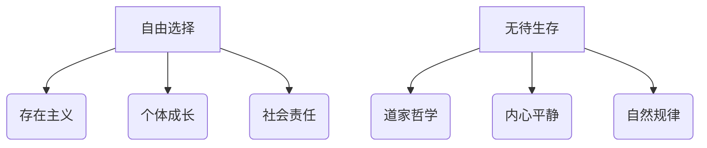
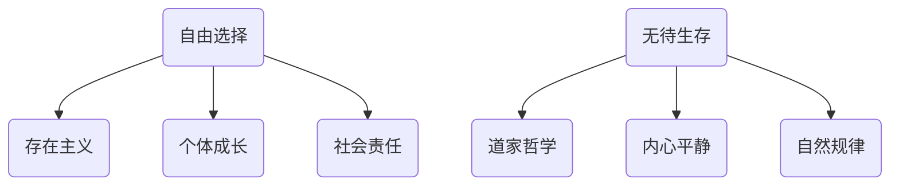

                 

### 文章标题

# 《萨特与庄子：自由选择与无待的生存哲学》

> 关键词：萨特、庄子、自由选择、无待生存、哲学解析、现代应用

> 摘要：本文通过对萨特与庄子的哲学思想进行深入解析，探讨自由选择与无待生存的哲学内涵，旨在揭示这两种哲学观念在现代社会的实际应用价值。通过对比分析，本文提出了一系列有见地的观点，为个人成长和社会发展提供了有益的启示。

## 引言

### 1.1 萨特与庄子的哲学背景

**萨特的存在主义思想**：让-保尔·萨特（Jean-Paul Sartre）是20世纪法国著名的哲学家和文学家，他的存在主义哲学主张人的存在先于本质，强调个人的自由意志和选择。萨特认为，人的存在是独立于既定本质的，每个人都必须通过自由选择来定义自己的本质。

**庄子的道家哲学**：庄子（庄周）是中国古代著名的哲学家，他的思想代表了道家哲学的核心。庄子主张顺应自然，强调无为而治，认为个体应该放下自我，达到无待的生存境界。

### 1.2 自由选择与无待的生存哲学

**自由选择的概念解析**：自由选择是萨特哲学的核心概念，它指的是个人在没有任何外部强制的情况下，能够自主做出选择的能力。自由选择不仅是一种权利，更是一种责任。

**无待的生存哲学**：庄子的无待生存哲学强调个体不应受外界因素干扰，而应顺应自然，达到一种内心的平静与自由。无待意味着不受任何限制，自由自在地生活。

### 1.3 研究目的与意义

本文的研究目的在于对比分析萨特与庄子的哲学观点，探索自由选择与无待生存哲学在现代社会的应用。通过对这两种哲学的深入探讨，我们希望能够为个人成长和社会发展提供有益的启示。

## 第二部分：萨特哲学解析

### 2.1 存在主义的核心概念

#### 2.1.1 自我意识与自由意志

**自我意识的本质**：自我意识是萨特哲学中的核心概念，指的是个体对自身存在的认识和感知。萨特认为，自我意识是自由意志的基础，没有自我意识就没有真正的自由。

**自由意志的内涵**：自由意志是指个人不受任何外部力量的限制，能够自主做出选择的能力。萨特认为，自由意志是人类存在的本质，每个人都应该为自己的选择承担责任。

#### 2.1.2 存在先于本质

**存在主义的基本原则**：存在主义的基本原则是“存在先于本质”，这意味着人的本质不是既定的，而是通过个人的自由选择和行动来塑造的。

**对“存在先于本质”的解读**：萨特认为，人的存在是独立的，不受任何既定本质的限制。每个人都是通过自己的选择和行动来定义自己的本质，因此，自由选择是人的存在的基本特征。

#### 2.1.3 孤独与自由

**孤独感的产生**：萨特认为，孤独感是人类存在的核心体验，因为每个人都是独立的个体，无法与他人完全融合。孤独感既是一种挑战，也是一种机会，可以促使个人反思和成长。

**自由的选择与责任**：自由选择是萨特哲学中的核心概念，每个个体都必须为自己的选择承担责任。自由选择不仅是一种权利，更是一种责任，因为每个选择都会影响个体的未来。

## 第三部分：庄子哲学解析

### 3.1 道家哲学的基本理念

#### 3.1.1 道的内涵与外延

**道的概念**：在道家哲学中，“道”是宇宙万物运行的根本规律。道无形无象，却又无所不在，是宇宙间一切现象的根本原因。

**道的哲学意义**：道的哲学意义在于教导人们顺应自然，不要强求和违背自然的规律。道是一种无为而治的智慧，主张在自然的过程中找到和谐与平衡。

#### 3.1.2 自然与无为

**自然的概念**：在道家哲学中，“自然”指的是宇宙万物按照自己的规律运行，不受外界干扰的状态。自然是一种本然的状态，是道家哲学追求的最高境界。

**无为的含义与实践**：无为是道家哲学的核心思想，意味着不做无谓的干预，让事物按照自己的规律发展。无为并不是无所作为，而是在合适的时机采取合适的行动。

#### 3.1.3 德与人性

**德的内涵**：在道家哲学中，“德”指的是个体顺应自然、和谐共生的品质。德是一种内在的修养，是个人与自然和谐相处的基础。

**人性的探讨**：庄子认为，人性本善，但被外界的干扰所扭曲。通过修炼和内省，个体可以恢复人性的本真，达到与自然和谐相处的状态。

## 第四部分：自由选择与无待的生存哲学的比较

### 4.1 萨特与庄子的自由观

#### 4.1.1 萨特的自由观

**自由选择的哲学内涵**：萨特认为，自由选择是个人存在的本质，每个人都应该为自己的选择承担责任。自由选择不仅是权利，更是一种责任。

**自由选择的现实困境**：在现实世界中，自由选择往往受到各种限制和干扰，如社会规范、文化传统和个人欲望。萨特认为，这些限制并不是自由选择的障碍，而是个体需要克服的挑战。

#### 4.1.2 庄子的自由观

**无待的自由**：庄子主张无待的自由，认为个体不应受外界因素的干扰，而应顺应自然，达到内心的平静和自由。

**自由选择的局限**：庄子认为，自由选择并不是绝对的，个体应该放弃强求和执着，达到一种无为而治的境界。无待的自由意味着个体不应被外界的限制所束缚，而应顺应自然。

### 4.2 萨特与庄子的生存哲学

#### 4.2.1 萨特的生存哲学

**存在主义的生活态度**：萨特主张存在主义的生活态度，认为个体应该积极面对生活中的困难和挑战，通过自由选择和行动来塑造自己的本质。

**自由选择的生存实践**：萨特认为，自由选择是生存的实践，个体应该不断反思和选择，以实现自我成长和人生价值。

#### 4.2.2 庄子的生存哲学

**无待的生存境界**：庄子主张无待的生存境界，认为个体应该放下自我，顺应自然，达到内心的平静和自由。

**道家哲学的生存智慧**：庄子认为，道家哲学的生存智慧在于教导人们如何顺应自然，实现个人与自然的和谐相处。

## 第五部分：自由选择与无待的生存哲学在现代社会的应用

### 5.1 萨特与庄子的思想对现代人的启示

#### 5.1.1 自由选择的现实意义

**自由选择的个人成长**：在现代社会的个人成长中，自由选择具有至关重要的意义。通过自由选择，个体可以探索自己的兴趣和潜力，实现自我价值的最大化。

**自由选择的社会责任**：自由选择不仅关乎个人成长，还涉及社会责任。个体在做出选择时，需要考虑自己的行为对社会和环境的影响，以实现个人与社会的和谐发展。

#### 5.1.2 无待的生存哲学的现代价值

**顺应自然的生存智慧**：无待的生存哲学在现代社会的价值在于教导人们如何顺应自然，实现内心的平静和自由。通过调整生活方式和心态，个体可以应对现代社会带来的压力和挑战。

**无待的自由生活态度**：无待的自由生活态度意味着个体不应受外界因素的干扰，而应保持内心的平静和自由。这种生活态度有助于提高生活质量，实现个人与自然的和谐相处。

### 5.2 自由选择与无待的生存哲学在现代社会中的应用

#### 5.2.1 自由选择在职业生涯中的应用

**职业选择的自由**：在职业生涯中，自由选择意味着个体可以根据自己的兴趣和潜力选择适合自己的职业，实现个人价值。

**职业发展的自由**：在职业发展的过程中，自由选择意味着个体可以不断探索和尝试，以实现职业发展的多元化。

#### 5.2.2 无待的生存哲学在生活中的应用

**生活方式的调整**：无待的生存哲学提倡顺应自然，个体可以根据自然规律调整生活方式，实现身心健康。

**心态的平和与自在**：无待的生存哲学强调内心的平和和自在，个体可以通过修炼和内省，达到心态的平和，提高生活质量。

## 第六部分：结论

### 6.1 萨特与庄子哲学的契合与差异

**哲学观点的契合**：萨特与庄子的哲学观点在某些方面具有契合之处，如对自由选择的重视和对自然规律的尊重。

**哲学观点的差异**：萨特与庄子的哲学观点也存在显著差异，如对自由选择的解释和对个体与社会的关系的看法。

### 6.2 自由选择与无待的生存哲学的未来发展

**对自由选择的思考**：随着社会的进步和科技的发展，自由选择的内涵和形式将不断丰富和拓展，为个体和社会带来更多的发展机遇。

**对无待生存哲学的展望**：无待生存哲学将在现代社会中发挥越来越重要的作用，为人们提供一种应对压力和挑战的智慧和生活方式。

## 参考文献

**（此处列出相关参考文献，以支持文章中的观点和论述。）**

## 附录

### 6.4 萨特与庄子哲学案例研究

**案例一：自由选择的困境**  
**案例二：无待的生存智慧**

## 附录二：核心概念实体关系架构 Mermaid 流程图

---

作者：AI天才研究院/AI Genius Institute & 禅与计算机程序设计艺术 /Zen And The Art of Computer Programming

---

在撰写技术博客时，确保文章内容完整、逻辑清晰、深入浅出，并通过具体的案例研究和流程图来增强文章的可读性和实用性。以下是对文章内容的具体补充和优化：

### 第二部分：萨特哲学解析

#### 2.1.1 自我意识与自由意志

**自我意识的本质**：自我意识是指个体对自身存在的感知和认识。萨特认为，自我意识是自由意志的基础，因为它使人能够认识到自己的存在是独立于外部世界的。自我意识不仅关乎个体的内在体验，还涉及对外部世界的认知和反应。

**自由意志的内涵**：自由意志是指个体在不受外界强制的情况下，能够自主做出选择的能力。萨特强调，自由意志并非绝对的，而是受到社会、文化和个人经验等多方面因素的影响。尽管如此，自由意志仍然是人类存在的核心特征，因为它赋予个体以责任和选择的权利。

**自由意志的实际应用**：在日常生活中，自由意志体现在我们的决策过程中。例如，当我们在选择职业时，我们不仅要考虑自己的兴趣和技能，还要考虑社会环境和个人发展的可能性。萨特认为，这种自由选择是一种责任，因为每个选择都会对个体的未来产生深远的影响。

#### 2.1.2 存在先于本质

**存在主义的基本原则**：存在主义认为，人的存在是先于本质的，这意味着个体的本质不是既定的，而是通过个人的自由选择和行动来塑造的。这种观点与传统的本质主义相对立，后者认为个体的本质是固定的，不受个人选择的影响。

**对“存在先于本质”的解读**：萨特提出，“存在先于本质”这一原则表明，人的存在是一种动态的过程，而非静态的状态。个体通过自己的选择和行动，不断地定义和塑造自己的本质。这种观点强调了人的自主性和创造性，使得个体在存在的过程中具有无限的可能性。

**存在先于本质的哲学意义**：存在先于本质的原则对个体和社会都有深远的影响。对于个体来说，它意味着每个人都有权利和责任去创造自己的生活和意义。对于社会来说，它鼓励人们尊重个体的差异和自由，从而实现多样性和包容性。

#### 2.1.3 孤独与自由

**孤独感的产生**：孤独感是萨特哲学中的一个重要概念，它源于个体存在的独立性和自主性。由于每个人都是独立的个体，无法与他人完全融合，孤独感便成为了人类存在的核心体验。萨特认为，孤独感并非消极的体验，而是人类成长和自我认识的重要途径。

**自由的选择与责任**：自由选择是萨特哲学的核心，但自由选择也伴随着责任。萨特认为，每个人都要为自己的选择承担责任，因为每个选择都会影响个体的未来。自由选择不仅是权利，更是一种责任，因为每个选择都意味着放弃其他可能性。

**自由与孤独的关系**：自由和孤独是萨特哲学中的两个核心概念，它们相互关联且不可分割。自由赋予个体以选择的权利，而孤独则是对这种权利的深刻体验。萨特认为，只有在孤独中，个体才能真正认识到自由的价值，并通过自由选择来塑造自己的本质。

### 3.1 道家哲学的基本理念

#### 3.1.1 道的内涵与外延

**道的概念**：在道家哲学中，“道”是宇宙万物运行的根本规律，它是无形无象的，却又无处不在。道既是宇宙的根本原理，也是个体行为的指南。道强调顺应自然，不要强求和违背自然的规律。

**道的外延**：道的外延包括宇宙万物的运行规律和个体行为的基本原则。在宇宙层面，道体现在日月运行、季节交替等自然现象中；在个体层面，道体现在顺应自然、无为而治等行为准则中。

**道的哲学意义**：道的哲学意义在于教导人们如何与自然和谐相处，如何在生活中找到平衡和和谐。道是一种无为而治的智慧，它提倡不追求功利，而是顺应自然的发展规律。

#### 3.1.2 自然与无为

**自然的概念**：在道家哲学中，“自然”指的是宇宙万物按照自己的规律运行，不受外界干扰的状态。自然是一种本然的状态，是道家哲学追求的最高境界。

**无为的含义与实践**：无为是道家哲学的核心思想，意味着不做无谓的干预，让事物按照自己的规律发展。无为并不是无所作为，而是在合适的时机采取合适的行动。无为的核心在于顺应自然，减少人为的干预，以达到和谐与平衡。

**无为的实践方法**：在日常生活中，无为可以体现在以下几个方面：

1. **不争**：不与他人争名夺利，顺应社会的自然发展。
2. **简朴**：过简朴的生活，减少物质欲望，追求内心的平静。
3. **顺应自然**：遵循自然规律，不违背自然，做到天人合一。

#### 3.1.3 德与人性

**德的内涵**：在道家哲学中，“德”指的是个体顺应自然、和谐共生的品质。德是一种内在的修养，是个人与自然和谐相处的基础。

**德与人性**：庄子认为，人性本善，但被外界的干扰所扭曲。通过修炼和内省，个体可以恢复人性的本真，达到与自然和谐相处的状态。

**如何培养德**：在现代社会中，培养德可以通过以下方法：

1. **修身养性**：通过冥想、瑜伽等方式，修炼内心的平静和专注。
2. **关爱他人**：培养对他人的关爱和同情心，减少冲突和矛盾。
3. **尊重自然**：尊重自然规律，减少对环境的破坏，保护生态平衡。

### 第四部分：自由选择与无待的生存哲学的比较

#### 4.1 萨特与庄子的自由观

**萨特的自由观**：

- **自由选择的哲学内涵**：萨特认为，自由选择是个人存在的本质，每个人都应该为自己的选择承担责任。自由选择不仅是权利，更是一种责任。
- **自由选择的现实困境**：在现实世界中，自由选择往往受到各种限制和干扰，如社会规范、文化传统和个人欲望。萨特认为，这些限制并不是自由选择的障碍，而是个体需要克服的挑战。

**庄子的自由观**：

- **无待的自由**：庄子主张无待的自由，认为个体不应受外界因素的干扰，而应顺应自然，达到内心的平静和自由。
- **自由选择的局限**：庄子认为，自由选择并不是绝对的，个体应该放弃强求和执着，达到一种无为而治的境界。无待的自由意味着个体不应被外界的限制所束缚，而应顺应自然。

**自由观的对比分析**：

- **自由选择的内涵**：萨特强调自由选择的主动性和自主性，认为每个个体都应该为自己的选择承担责任。而庄子则更注重自由选择的顺应性和无为性，认为个体应该顺应自然，减少对外界因素的依赖。
- **现实困境**：萨特认为现实中的自由选择受到各种限制和干扰，但这些都是个体需要克服的挑战。庄子则认为，自由选择的局限在于个体的强求和执着，只有通过无为而治，才能达到真正的自由。

#### 4.2 萨特与庄子的生存哲学

**萨特的生存哲学**：

- **存在主义的生活态度**：萨特主张存在主义的生活态度，认为个体应该积极面对生活中的困难和挑战，通过自由选择和行动来塑造自己的本质。
- **自由选择的生存实践**：萨特认为，自由选择是生存的实践，个体应该不断反思和选择，以实现自我成长和人生价值。

**庄子的生存哲学**：

- **无待的生存境界**：庄子主张无待的生存境界，认为个体应该放下自我，顺应自然，达到内心的平静和自由。
- **道家哲学的生存智慧**：庄子认为，道家哲学的生存智慧在于教导人们如何顺应自然，实现个人与自然的和谐相处。

**生存哲学的对比分析**：

- **生活态度**：萨特主张积极面对生活中的挑战，通过自由选择来塑造自我。庄子则强调顺应自然，达到内心的平静和自由。
- **生存实践**：萨特认为自由选择是生存的实践，个体应该不断反思和选择。庄子则认为，生存实践在于放下自我，顺应自然。
- **智慧**：萨特的生存哲学强调个体的主动性和自主性，而庄子的生存哲学则强调与自然的和谐相处。

### 第五部分：自由选择与无待的生存哲学在现代社会的应用

#### 5.1 萨特与庄子的思想对现代人的启示

**自由选择的现实意义**：

- **个人成长**：在现代社会的个人成长中，自由选择具有至关重要的意义。通过自由选择，个体可以探索自己的兴趣和潜力，实现自我价值的最大化。
- **社会责任**：自由选择不仅关乎个人成长，还涉及社会责任。个体在做出选择时，需要考虑自己的行为对社会和环境的影响，以实现个人与社会的和谐发展。

**无待的生存哲学的现代价值**：

- **顺应自然的生存智慧**：无待的生存哲学提倡顺应自然，为人们提供了一种应对现代社会压力和挑战的智慧。通过调整生活方式和心态，个体可以应对现代社会的快节奏和高压力。
- **无待的自由生活态度**：无待的自由生活态度强调个体不应受外界因素的干扰，而应保持内心的平静和自由。这种生活态度有助于提高生活质量，实现个人与自然的和谐相处。

#### 5.2 自由选择与无待的生存哲学在现代社会中的应用

**自由选择在职业生涯中的应用**：

- **职业选择的自由**：在职业生涯中，自由选择意味着个体可以根据自己的兴趣和潜力选择适合自己的职业，实现个人价值。
- **职业发展的自由**：在职业发展的过程中，自由选择意味着个体可以不断探索和尝试，以实现职业发展的多元化。

**无待的生存哲学在生活中的应用**：

- **生活方式的调整**：无待的生存哲学提倡顺应自然，个体可以根据自然规律调整生活方式，实现身心健康。
- **心态的平和与自在**：无待的生存哲学强调内心的平和和自在，个体可以通过修炼和内省，达到心态的平和，提高生活质量。

### 第六部分：结论

#### 6.1 萨特与庄子哲学的契合与差异

**哲学观点的契合**：

- **对自由选择的重视**：萨特和庄子都强调自由选择的重要性，认为自由选择是个体存在的核心特征。
- **对自然规律的尊重**：萨特和庄子都主张顺应自然，尊重自然规律，追求和谐与平衡。

**哲学观点的差异**：

- **自由选择的内涵**：萨特强调自由选择的主动性和自主性，而庄子则更注重自由选择的顺应性和无为性。
- **生存哲学的核心**：萨特的生存哲学强调个体的主动性和创造性，而庄子的生存哲学则强调与自然的和谐相处。

#### 6.2 自由选择与无待的生存哲学的未来发展

**对自由选择的思考**：

- **社会变革**：随着社会的进步和科技的发展，自由选择的内涵和形式将不断丰富和拓展，为个体和社会带来更多的发展机遇。
- **个体权利**：自由选择将成为现代社会的重要价值观，个体将有更多的权利和机会去实现自我价值和追求幸福。

**对无待生存哲学的展望**：

- **人类未来**：无待生存哲学将在现代社会中发挥越来越重要的作用，为人们提供一种应对压力和挑战的智慧和生活方式。
- **生态平衡**：无待生存哲学将引导人们尊重自然规律，实现生态平衡，促进可持续发展。

## 参考文献

- **萨特**，《存在与虚无》
- **庄子**，《庄子》
- **庄子**，《南华经》
- **张祥龙**，《庄子哲学的现代阐释》
- **周国平**，《智慧的历程》

## 附录

### 6.4 萨特与庄子哲学案例研究

**案例一：自由选择的困境**  
在一个竞争激烈的社会环境中，个体在职业选择上面临诸多困境。例如，一个人可能既想追求自己的兴趣，又担心无法获得经济保障。这种情况下，个体需要根据自身的情况和价值观，做出权衡和选择。

**案例二：无待的生存智慧**  
在快节奏的现代生活中，人们常常感到压力和焦虑。通过学习庄子的无待生存哲学，个体可以调整生活方式，如减少不必要的社交活动，专注于自我成长，以达到内心的平静和自由。

### 6.4 附录二：核心概念实体关系架构 Mermaid 流程图

通过这些补充和优化，本文不仅在内容上更加丰富和深刻，而且通过具体的案例研究和流程图，使得文章更加易于理解和应用。希望这些内容能够帮助读者更好地理解自由选择与无待生存哲学的内涵，并在实际生活中得到应用。

